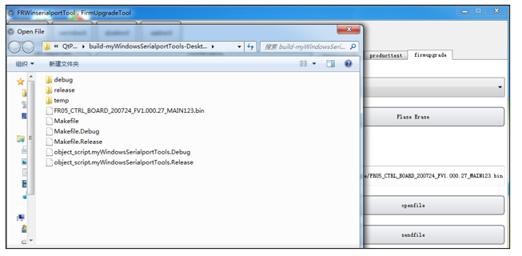
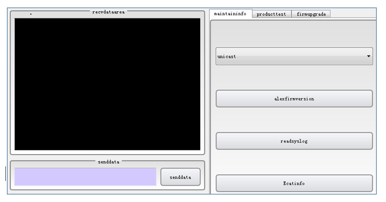

附录
========

.. toctree:: 
  :maxdepth: 5

附录1：运动控制器错误及处理方式
--------------------------------

.. csv-table:: 
   :header: "主故障码", "子故障码", "描述"
   :widths: 20, 10, 70

   "0-无故障", "0", "无故障"
   "1-指令点错误", "1", "关节指令点错误，可复位"
   "1-指令点错误", "2", "直线目标点错误（包括工具不符），可复位"
   "1-指令点错误", "3", "圆弧中间点错误（包括工具不符），可复位"
   "1-指令点错误", "4", "圆弧目标点错误（包括工具不符），可复位"
   "1-指令点错误", "5", "圆弧指令点间距过小，可复位"
   "1-指令点错误", "6", "整圆/螺旋线中间点1错误（包括工具不符），可复位"
   "1-指令点错误", "7", "整圆/螺旋线中间点2错误（包括工具不符），可复位"
   "1-指令点错误", "8", "整圆/螺旋线中间点3错误（包括工具不符），可复位"
   "1-指令点错误", "9", "整圆/螺旋线指令点间距过小，可复位"
   "1-指令点错误", "10", "TPD指令点错误，可复位"
   "1-指令点错误", "11", "TPD指令工具与当前工具不符，可复位"
   "1-指令点错误", "12", "TPD当前指令与下一指令起始点偏差过大，可复位"
   "1-指令点错误", "13", "内外部工具切换错误，可复位"
   "1-指令点错误", "14", "新螺旋线起点错误，可复位"
   "1-指令点错误", "15", "新样条曲线指令点错误，可复位"
   "1-指令点错误", "17", "PTP关节指令超限，可复位"
   "1-指令点错误", "18", "TPD关节指令超限，可复位"
   "1-指令点错误", "19", "LIN/ARC下发关节指令超限，可复位"
   "1-指令点错误", "20", "笛卡尔空间内指令超速，不可复位"
   "1-指令点错误", "21", "关节空间内扭矩指令超限，可复位"
   "1-指令点错误", "22", "JOG关节指令超限，可复位"
   "1-指令点错误", "23", "轴1关节空间内指令速度超限，可复位"
   "1-指令点错误", "24", "轴2关节空间内指令速度超限，可复位"
   "1-指令点错误", "25", "轴3关节空间内指令速度超限，可复位"
   "1-指令点错误", "26", "轴4关节空间内指令速度超限，可复位"
   "1-指令点错误", "27", "轴5关节空间内指令速度超限，可复位"
   "1-指令点错误", "28", "轴6关节空间内指令速度超限，可复位"
   "1-指令点错误", "29", "关节反馈速度超限，不可复位"
   "1-指令点错误", "30", "关节指令与反馈偏差过大，不可复位，需要重启"
   "1-指令点错误", "31", "DMP目标点错误（包括工具不符），可复位"
   "1-指令点错误", "33", "下一指令关节配置发生变化（下一指令存在奇异位姿，请使用PTP指令或更改下一指令点），可复位"
   "1-指令点错误", "34", "当前指令关节配置发生变化（下一指令存在奇异位姿，请使用PTP指令或更改下一指令点），可复位"
   "1-指令点错误", "35", "LIN指令中关节速度超限，可复位"
   "1-指令点错误", "36", "LIN指令自适应速度超出阈值，可复位"
   "1-指令点错误", "37", "轨迹中存在不可到达点，可复位"
   "1-指令点错误", "38", "轨迹中存在不可到达点-奇异位姿，可复位"
   "1-指令点错误", "49", "指令错误，ARCSTART和ARCEND之间只允许LIN和ARC指令，可复位"
   "1-指令点错误", "50", "指令错误，WEAVESTART和WEAVEEND之间只允许LIN和ARC指令，可复位"
   "1-指令点错误", "51", "摆焊参数错误，可复位"
   "1-指令点错误", "52", "摆焊指令点间距过小，可复位"
   "1-指令点错误", "53", "摆动轨迹中存在不可达到点位-奇异位姿，可复位"
   "1-指令点错误", "54", "摆动轨迹中存在不可达到点位-关节指令超限，可复位"
   "1-指令点错误", "55", "摆动轨迹中存在不可达到点位-规划异常（工具z与前进方向x夹角重合），可复位"
   "1-指令点错误", "56", "摆动轨迹中存在不可达到点位-规划异常（圆弧路点错误），可复位"
   "1-指令点错误", "65", "激光传感器指令偏差过大，可复位"
   "1-指令点错误", "66", "激光传感器指令中断，焊缝跟踪提前结束，可复位"
   "1-指令点错误", "81", "外部轴指令速度超限，可复位"
   "1-指令点错误", "82", "外部轴指令与反馈偏差过大，不可复位，需要回零或重启"
   "1-指令点错误", "83", "扩展外设（外部轴/IO）通信异常，可复位"
   "1-指令点错误", "84", "扩展外设（外部轴/IO）通信丢包异常，可复位"
   "1-指令点错误", "97", "传送带跟踪-起始点与参考点姿态变化过大，可复位"
   "1-指令点错误", "113", "恒力控制-X方向超过最大调整距离，可复位"
   "1-指令点错误", "114", "恒力控制-Y方向超过最大调整距离，可复位"
   "1-指令点错误", "115", "恒力控制-Z方向超过最大调整距离，可复位"
   "1-指令点错误", "116", "恒力控制-RX方向超过最大调整角度，可复位"
   "1-指令点错误", "117", "恒力控制-RY方向超过最大调整角度，可复位"
   "1-指令点错误", "118", "恒力控制-RZ方向超过最大调整角度，可复位"
   "1-指令点错误", "119", "外部传感器数据错误，可复位"
   "1-指令点错误", "120", "螺旋线探索运动失败，可复位"
   "1-指令点错误", "121", "旋转插入运动失败，可复位"
   "1-指令点错误", "122", "直线插入运动失败，可复位"
   "1-指令点错误", "123", "表面定位运动失败，可复位"
   "1-指令点错误", "129", "超过最大扭矩记录点数，可复位"
   "1-指令点错误", "130", "速度切换错误，可复位"
   "1-指令点错误", "147", "焦点跟随错误，可复位"
   "1-指令点错误", "148", "姿态速度超限，可复位"
   "1-指令点错误", "149", "关节状态字反馈异常，可复位"
   "2-驱动器故障", "1", "1轴驱动器故障，不可复位"
   "2-驱动器故障", "2", "2轴驱动器故障，不可复位"
   "2-驱动器故障", "3", "3轴驱动器故障，不可复位"
   "2-驱动器故障", "4", "4轴驱动器故障，不可复位"
   "2-驱动器故障", "5", "5轴驱动器故障，不可复位"
   "2-驱动器故障", "6", "6轴驱动器故障，不可复位"
   "3-超出软限位故障", "1", "1轴超出软限位故障，可复位"
   "3-超出软限位故障", "2", "2轴超出软限位故障，可复位"
   "3-超出软限位故障", "3", "3轴超出软限位故障，可复位"
   "3-超出软限位故障", "4", "4轴超出软限位故障，可复位"
   "3-超出软限位故障", "5", "5轴超出软限位故障，可复位"
   "3-超出软限位故障", "6", "6轴超出软限位故障，可复位"
   "4-碰撞故障", "1", "1轴碰撞故障，可复位"
   "4-碰撞故障", "2", "2轴碰撞故障，可复位"
   "4-碰撞故障", "3", "3轴碰撞故障，可复位"
   "4-碰撞故障", "4", "4轴碰撞故障，可复位"
   "4-碰撞故障", "5", "5轴碰撞故障，可复位"
   "4-碰撞故障", "6", "6轴碰撞故障，可复位"
   "4-碰撞故障", "7", "末端碰撞故障，可复位"
   "5-活动从站数量错误", "1", "活动从站数量错误，不可复位"
   "6-从站错误", "1", "从站掉线，不可复位"
   "6-从站错误", "2", "从站状态与设置值不一致，不可复位"
   "6-从站错误", "3", "从站未配置，不可复位"
   "6-从站错误", "4", "从站配置错误，不可复位"
   "6-从站错误", "5", "从站初始化错误，不可复位"
   "6-从站错误", "6", "从站邮箱通信初始化错误，不可复位"
   "7-IO错误", "1", "通道错误，可复位"
   "7-IO错误", "2", "数值错误，可复位"
   "7-IO错误", "3", "WaitDI等待超时，可复位"
   "7-IO错误", "4", "WaitAI等待超时，可复位"
   "7-IO错误", "5", "WaitAxleDI等待超时，可复位"
   "7-IO错误", "6", "WaitAxleAI等待超时，可复位"
   "7-IO错误", "7", "通道已配置功能错误，可复位"
   "7-IO错误", "8", "起弧超时，可复位"
   "7-IO错误", "9", "收弧超时，可复位"
   "7-IO错误", "10", "寻位超时，可复位"
   "7-IO错误", "11", "传送带IO检测超时，可复位"
   "7-IO错误", "12", "WaitAuxDI等待超时，可复位"
   "7-IO错误", "13", "WaitAuxAI等待超时，可复位"
   "7-IO错误", "14", "焊丝寻位超时，可复位"
   "8-夹爪错误", "1", "夹爪运动超时错误，可复位"
   "9-文件错误", "1", "zbt配置文件版本错误，初始化错误-不可复位"
   "9-文件错误", "2", "zbt配置文件加载失败，初始化错误-不可复位"
   "9-文件错误", "3", "user配置文件版本错误，初始化错误-不可复位"
   "9-文件错误", "4", "user配置文件加载失败，初始化错误-不可复位"
   "9-文件错误", "5", "exaxis配置文件版本错误，初始化错误-不可复位"
   "9-文件错误", "6", "exaxis配置文件加载失败，初始化错误-不可复位"
   "9-文件错误", "7", "机器人型号不一致，需要重新设置-不可复位"
   "9-文件错误", "8", "dhpara配置文件版本错误，初始化错误-不可复位"
   "9-文件错误", "9", "dhpara配置文件加载失败，初始化错误-不可复位"
   "9-文件错误", "10", "机器人型号未设置-不可复位"
   "9-文件错误", "11", "load配置文件版本错误，初始化错误-不可复位"
   "9-文件错误", "12", "load配置文件加载失败，初始化错误-不可复位"
   "9-文件错误", "13", "speed配置文件版本错误，初始化错误-不可复位"
   "9-文件错误", "14", "speed配置文件加载失败，初始化错误-不可复位"
   "10-奇异位姿", "1", "奇异位姿"
   "11-驱动器通信错误", "1", "1轴驱动器通信错误，不可复位"
   "11-驱动器通信错误", "2", "2轴驱动器通信错误，不可复位"
   "11-驱动器通信错误", "3", "3轴驱动器通信错误，不可复位"
   "11-驱动器通信错误", "4", "4轴驱动器通信错误，不可复位"
   "11-驱动器通信错误", "5", "5轴驱动器通信错误，不可复位"
   "11-驱动器通信错误", "6", "6轴驱动器通信错误，不可复位"
   "12-外部轴软限位", "1", "1轴超出软限位，可复位"
   "12-外部轴软限位", "2", "2轴超出软限位，可复位"
   "12-外部轴软限位", "3", "3轴超出软限位，可复位"
   "12-外部轴软限位", "4", "4轴超出软限位，可复位"
   "13-设置参数错误", "1", "工具号超限，可复位"
   "13-设置参数错误", "2", "定位完成阈值错误，可复位"
   "13-设置参数错误", "3", "碰撞等级错误，可复位"
   "13-设置参数错误", "4", "负载重量错误，可复位"
   "13-设置参数错误", "5", "负载质心X错误，可复位"
   "13-设置参数错误", "6", "负载质心Y错误，可复位"
   "13-设置参数错误", "7", "负载质心Z错误，可复位"
   "13-设置参数错误", "8", "DI滤波时间错误，可复位"
   "13-设置参数错误", "9", "AxleDI滤波时间错误，可复位"
   "13-设置参数错误", "10", "AI滤波时间错误，可复位"
   "13-设置参数错误", "11", "AxleAI滤波时间错误，可复位"
   "13-设置参数错误", "12", "DI高低电平范围错误，可复位"
   "13-设置参数错误", "13", "DO高低电平范围错误，可复位"
   "13-设置参数错误", "14", "工件号超限，可复位"
   "13-设置参数错误", "15", "外部轴号超限，可复位"
   "13-设置参数错误", "16", "传送带编码器通道错误，可复位"
   "13-设置参数错误", "17", "传送带工件轴号错误，可复位"

附录2：伺服驱动器故障代码表
---------------------------

.. list-table::
   :widths: 20 40 80
   :header-rows: 0
   :align: center

   * - **故障码**
     - **故障名称**
     - **处理方法**

   * - 1
     - 软件过流故障
     - | 1、检查关节负载或阻力是否变大或异常
       | 2、若故障仍未排除，维修或更换驱动板

   * - 2
     - 过压故障
     - 降低机器人运行速度或加速度

   * - 3
     - 欠压故障
     - | 1、检查控制箱48V 电源电压输出是否异常
       | 2、检查驱动板和关节外壳是否短路
       | 3、若故障仍未排除，维修或更换驱动板

   * - 4
     - 过热故障
     - 减小机器人负载或降低机器人运行速度

   * - 5
     - 过载故障
     - 减小机器人负载或降低机器人运行速度

   * - 6
     - 超速故障
     - | 1、检查磁编组件和电机轴固定顶丝是否松动
       | 2、重新进行编码器校零
       | 3、若故障仍未排除，维修或更换磁编组件

   * - 7
     - 参数异常故障
     - 维修或更换驱动板

   * - 8
     - 飞车故障
     - | 1、检查磁编组件和电机轴固定顶丝是否松动
       | 2、重新进行编码器校零
       | 3、若故障仍未排除，维修或更换磁编组件

   * - 9
     - 位置误差故障
     - | 1、检查关节负载或阻力是否变大或异常
       | 2、若故障仍未排除，维修或更换驱动板

   * - 10
     - 位置溢出故障
     - | 1、检查硬限位是否松动
       | 2、重新进行机器人校零

   * - 11
     - 硬件过流故障
     - 维修或更换驱动板

   * - 12
     - 驱动禁止故障
     - 未启用

   * - 13
     - 电机堵转故障
     - | 1、检查刹车电磁铁是否吸合
       | 2、检查是否撞到硬限位
       | 3、若故障仍未排除，维修或更换驱动板

   * - 14
     - 功率电源故障
     - 未启用

   * - 15
     - STO 故障
     - 未启用

   * - 16
     - 相电流 AD 调零故障
     - 维修或更换驱动板

   * - 17
     - EEPROM 故障
     - 维修或更换驱动板

   * - 18
     - 霍尔故障
     - | 1、检查霍尔线束是否插接牢固，有无短路、断路
       | 2、若故障仍未排除，维修或更换关节

   * - 19
     - 编码器故障
     - 维修或更换磁编组件

   * - 20
     - 编码器调零故障
     - | 1、重新进行编码器校零
       | 2、若故障仍未排除，维修或更换磁编组件
   
   * - 21
     - 编码器Z相信号丢失故障
     - 未启用

   * - 22
     - 编码器计数故障
     - 未启用

   * - 23
     - 编码器多圈数据溢出故障
     - 未启用

   * - 24
     - 外部时钟故障
     - 维修或更换驱动板

   * - 25
     - UVW 相序故障
     - 未启用

   * - 26
     - FPGA故障
     - 未启用

   * - 27
     - 回零故障
     - 未启用

   * - 28
     - 磁编码器故障
     - | 1、检查磁编组件和电机轴固定顶丝是否松动
       | 2、若故障仍未排除，维修或更换磁编组件

   * - 29
     - 电机动力线断线故障
     - | 1、检查电机动力线是否插接牢固，有无短路、断路
       | 2、若故障仍未排除，维修或更换驱动板

   * - 30
     - EtherCAT故障
     - | 1、检查网线是否插接牢固，有无短路、断路
       | 2、若故障仍未排除，维修或更换驱动板

   * - 31
     - EtherCAT_SM_DOG故障
     - | 1、检查网线是否插接牢固，有无短路、断路
       | 2、若故障仍未排除，维修或更换驱动板

   * - 32
     - EtherCAT_FATALSYNC故障
     - | 1、检查网线是否插接牢固，有无短路、断路
       | 2、若故障仍未排除，维修或更换驱动板

   * - 33
     - EtherCAT_SYNC故障
     - | 1、检查网线是否插接牢固，有无短路、断路
       | 2、若故障仍未排除，维修或更换驱动板

   * - 34
     - EtherCAT_RFT故障
     - | 1、检查网线是否插接牢固，有无短路、断路
       | 2、若故障仍未排除，维修或更换驱动板

   * - 35
     - 驱动器轴地址故障
     - | 1、重新进行驱动器轴地址配置
       | 2、若故障仍未排除，维修或更换驱动板

   * - 36
     - 机器人校零故障
     - | 1、重新进行机器人校零
       | 2、先使用JLINK 擦除 FLASH，再重新下载程序并校零
       | 3、若故障仍未排除，维修或更换驱动板

   * - 37
     - 编码器通讯故障
     - | 1、检查编码器线束是否插接牢固，有无短路、断路 
       | 2、若故障仍未排除，维修或更换磁编组件

   * - 40
     - 磁编模块故障-校零故障
     - | 1、重新进行磁编组件校零
       | 2、若故障仍未排除，维修或更换磁编组件

   * - 41
     - 磁编模块故障-多圈故障
     - | 1、检查磁编组件和电机轴固定顶丝是否松动
       | 2、若故障仍未排除，维修或更换磁编组件

   * - 42
     - 磁编模块故障-多圈小磁编故障
     - | 1、检查多圈小磁编芯片是否异常
       | 2、若故障仍未排除，维修或更换磁编组件

   * - 43
     - 磁编模块故障-多圈大磁编故障
     - | 1、检查多圈大磁编芯片是否异常
       | 2、若故障仍未排除，维修或更换磁编组件

   * - 44
     - 磁编模块故障-单圈磁编故障
     - | 1、检查单圈磁编芯片是否异常
       | 2、若故障仍未排除，维修或更换磁编组件

   * - 45
     - 磁编模块故障-光编故障
     - | 1、检查光编码盘是否被污染或未粘牢
       | 2、若故障仍未排除，维修或更换磁编组件

附录3：末端板485升级
---------------------------

现场使用时，有可能更新固件，满足新的要求，会提供新的升级文件（XX_XX_MAIN.bin），通过485接口对末端板进行升级（需要借助USB转485模块）。升级步骤如下：

**Step1：485接线**，在机器人末端处有5Pin通信航空接头，航空接头Pin脚分布及其pin脚说明如图表1所示。将机器人末端的485-A、485-B与USB转485工具的A、B使用双绞线连接。

.. figure:: appendix/001.png
   :align: center
   :width: 4in

.. centered:: 图表 18.3-1 航空接头Pin脚分布

**Step2，硬件连接**，将USB转485工具的USB端与PC连接，在PC设备管理器中，如果识别到USB&485工具，会出现如下界面。

.. figure:: appendix/002.png
   :align: center
   :width: 6in

.. centered:: 图表 18.3-2 USB&485端口识别说明

**Step3：升级工具**，在完成接线后，打开“法奥串口调试助手”，点击“末端板”按钮，在“串口参数设置”功能中选择上述识别的串口，波特率115200，数据位8位，校验位无，停止位1，然后打开串口，成功之后会出现“串口打开成功”的提示。

.. figure:: appendix/003.png
   :align: center
   :width: 4in

.. centered:: 图表 18.3-3 串口参数设置

**Step4：固件升级**，选择“末端板”，点击“固件升级”，如图表所示：

.. figure:: appendix/004.png
   :align: center
   :width: 6in

.. centered:: 图表 18.3-4 末端板固件升级

-  首先点击“Flash擦除”，擦除成功之后，会在接收数据区提示擦除成功。

-  打开文件（待升级文件），选择存放的路径，如下所示，选择完成后，待升级文件名会出现在文件名显示框中。

.. centered:: 图表 18.3-5 选择升级文件

-  点击“发送文件”，当进度条显示100%时，表示已经完成发送升级文件。

**Step5：升级验证**，系统重启上电，在“维护信息”栏，选择“查询末端板固件版本信息”，在“接收数据区”会显示固件版本信息，如果和升级的文件版本信息一致，说明升级成功，否则升级失败.

.. centered:: 图表 18.3-6 查询固件版本信息

附录4：控制箱485升级
------------------------

在机器人控制箱板有“电源通信”接口，将USB&485工具A、B分别接入其接口的“485-A”、“485-B”。

其升级过程操作同末端板，软件对应选择即可，此处不在赘述。

.. figure:: appendix/007.png
   :align: center
   :width: 4in

.. centered:: 图表 18.4-1 电源通信接口

附录5：备件、易损件清单
-----------------------------

.. list-table::
   :widths: 40 40 20
   :header-rows: 0
   :align: center

   * - **零件**
     - **编号**
     - **数量**

   * - M8*30 螺钉
     - 4.0.08.2006185
     - 4

   * - 圆柱销A型8*20
     - 4.5.00.2013076
     - 2

   * - 保险丝5x206A
     - 
     - 1