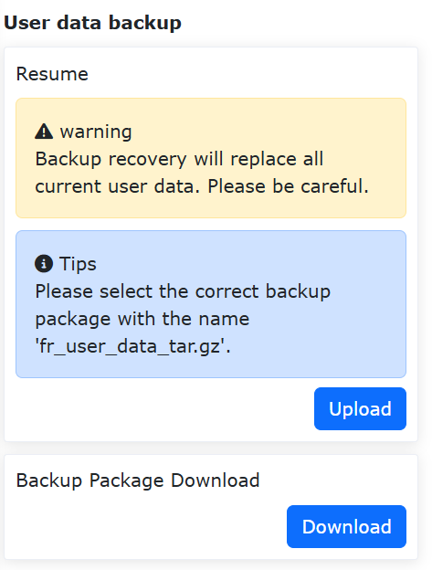
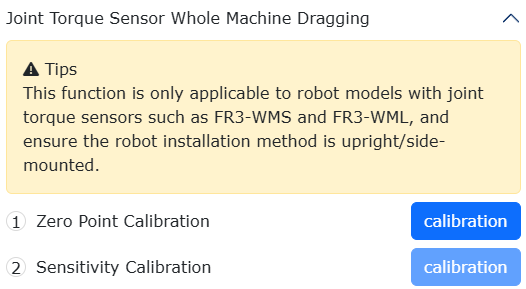
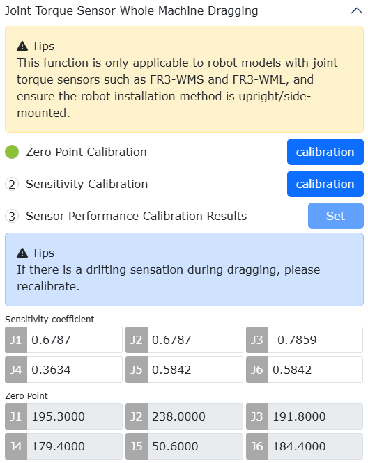
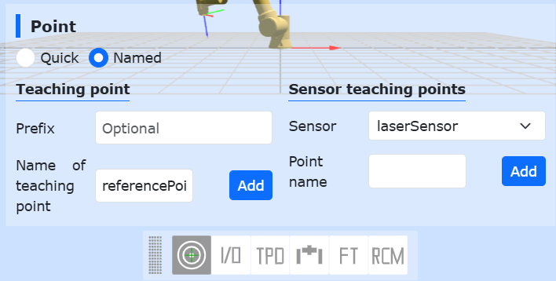
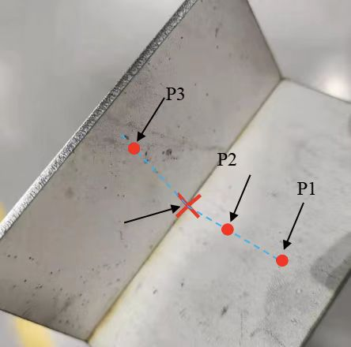
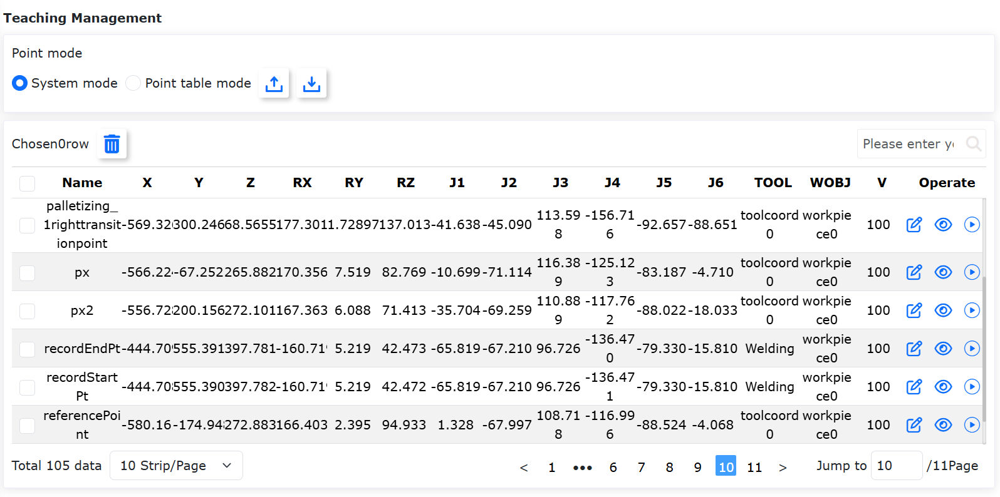
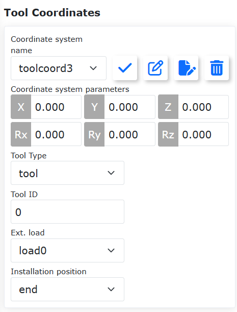
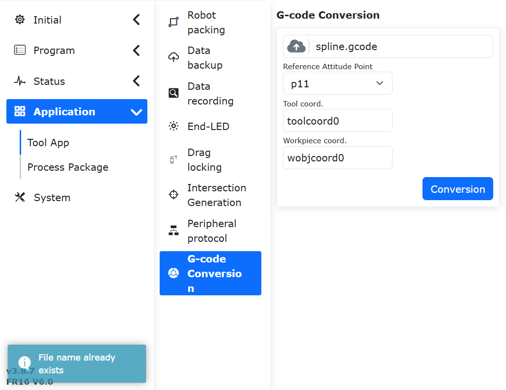

工具应用
===============

.. toctree:: 
   :maxdepth: 6

机器人打包
-----------------

在“辅助应用”->“工具应用”的菜单栏下，点击“机器人打包”按钮，进入机器人一键打包界面。

.. important:: 
   在操作打包功能之前，请先确认机器人周围环境和状态，防止发生碰撞。
   
   若出厂，则出厂前先进去系统设置-通用设置，进行恢复出厂设置。

**Step1**：在移至打包点前先将机器人移至零点。

**Step2**：点击“移至零点”按钮，确认机器人机械零点正确，各关节如图中橙色圆圈位置缺口对齐。

**Step3**：点击“移至打包点”按钮，机器人按照包装工艺各轴角度运行至打包点。

.. image:: application/001.png
   :width: 4in
   :align: center

.. centered:: 图表 14.1‑1 机器人一键打包

数据备份
-----------

1. 在“辅助应用”->“工具应用”的菜单栏下，点击 “数据备份”进入数据备份界面，如下图所示

.. centered:: 图表 14.2‑1 数据备份界面

2. 备份包数据中包含工具坐标系数据，系统配置文件，示教点数据，用户程序，模板程序和用户配置文件，当用户需要将本机器人相关数据移到另一台机器人上使用时，可通过此功能快速实现。

备份包完整性校验功能
~~~~~~~~~~~~~~~~~~~~~~~~~~~~~~~~~~~~~~~~~~~~~~~~~~~~~~~~~~~~~~~~~

为避免在导入备份包时可能存在由安装方式等配置不一致所导致的安全隐患，新增备份包导入时对备份包MD5校验及关键参数的校验功能。

备份包MD5校验功能
++++++++++++++++++++++++++++++++++++++++++++++++++++
为确保导入备份包完整性，上传后将对备份包进行MD5校验，若备份包损坏或被异常修改，则MD5校验失败，提示如下：

.. image:: application/048.png
   :width: 6in
   :align: center

.. centered:: 图表 14.2‑2 MD5校验失败

备份包关键参数校验功能
++++++++++++++++++++++++++++++++++++++++++++++++++++

备份包导入时加入校验功能，备份包须与被导入机器人进行关键参数对比，具体参数如下表所示。这些参数若设置不准确均会存在一定的安全隐患，仅当完全一致后，备份包能够正常导入。

对比的5个关键参数表：

.. list-table::
   :widths: 15 40 100
   :header-rows: 0
   :class: sheet-center

   * - **序号**
     - **关键参数**
     - **具体释义**

   * - 1
     - ROBOT_TYPE
     - 机器人型号

   * - 2
     - INSTALL_POS
     - 安装方式

   * - 3
     - INSTALL_YANGLE
     - 基座倾斜角

   * - 4
     - INSTALL_ZANGLE
     - 基座旋转角

   * - 5
     - NEW_TEACH_ENABLE
     - 动力学配置

若不一致将提示错误，此时，需要检测被导入机器人中的关键参数是否与备份包一致。

.. image:: application/003.png
   :width: 6in
   :align: center

.. centered:: 图表 14.2‑3 当关键参数不一致时，界面将提示错误

失败/断电异常回滚功能
+++++++++++++++++++++++++++++++++++++++++++++++++++++++++++++++

在备份包导入中途出现异常，或在恢复数据中途异常断电情况下，导致数据恢复未能正常完成，为保障设备正常运行，在重新上电后，系统将自动还原至操作前状态；

在重新上电后界面将提示，“前次数据恢复未完成，已自动还原，请重启控制箱再次操作”。

.. image:: application/049.png
   :width: 4in
   :align: center

.. centered:: 图表 14.2‑4 断电重启还原告警提示

备份包版本兼容性
~~~~~~~~~~~~~~~~~~~~~~~~~~~~~~~~~~~~~~~~~~~~~~~~~~~~~~~~~~~~~~~~~~~

当前备份包导入恢复数据已支持软件版本 ≥ v3.8.3 生成的备份包， QX 和 LA 系列控制器备份包通用。

10s数据记录
------------

在“辅助应用”->“工具应用”的菜单栏下，点击“10s数据记录”进入10s数据记录功能界面。

首先选择记录类型，分为默认参数记录和自选参数记录，默认参数记录为系统自动设置记录的数据，自选参数记录用户可自行选择需要记录的参数数据，参数个数最多为15个。选定参数列表后，选择记录参数，点击“右移”按钮即可将参数配置到参数列表中。点击“开始记录”机器人开始记录数据，点击“停止记录”机器人停止记录数，点击“下载数据”可下载最后10s的数据。

.. image:: application/004.png
   :width: 4in
   :align: center

.. centered:: 图表 14.3‑1 10s数据记录

末端LED
--------------

在“辅助应用”->“工具应用”的菜单栏下，点击“末端LED”进入末端LED颜色配置功能界面。

可配置LED颜色为绿色，蓝色和白青色，用户可以根据需求对自动模式，手动模式和拖动模式的LED颜色进行配置，不同模式不可配置同一种颜色。

.. image:: application/005.png
   :width: 4in
   :align: center

.. centered:: 图表 14.4‑1 末端LED配置

拖动锁定
--------------

在“辅助应用”->“工具应用”的菜单栏下，点击“拖动锁定”进入拖动示教锁定配置功能界面。

针对拖动示教增加了锁定自由度功能，当拖动示教功能开关设置为使能状态时，各自由度参数在用户拖动机器人时生效。例如，当参数设置为X:10，Y:0，Z:10，RX:10，RY:10，RZ:10时，在拖动模式下拖拽机器人，可以限制机器人只移动Y方向，假如需要在拖动时保持机器人姿态不变，只移动X，Y，Z方向，可以将X，Y，Z设置为0，RX，RY，RZ设置为10。

.. image:: application/006.png
   :width: 4in
   :align: center

.. centered:: 图表 14.5‑1 拖动示教锁定配置

力传感器辅助拖动下正常触发碰撞防护
~~~~~~~~~~~~~~~~~~~~~~~~~~~~~~~~~~~~~~~~~~~~~~~~~~~~~~~~~~~~~~~~~~~~~~~~~~

概述
++++++++++++++++++++++

当前FR机器人在力传感器辅助拖动的情况下无法触发碰撞防护，增加在力传感器辅助拖动的情况下可以触发碰撞防护，增加机器人安全性，降低操作风险。

碰撞防护
++++++++++++++++++++++

**Step1**：点击“辅助应用”->“工具应用”->“拖动锁定”，进入力传感器辅助锁定配置界面，设置“状态开关”、“碰撞检测”为开启，如下图所示。

.. image:: application/007.png
   :width: 4in
   :align: center

.. image:: application/008.png
   :width: 4in
   :align: center

.. centered:: 图表 14.5‑2 配置力传感器辅助锁定

**Step2**：拖动机器人，在机器人运动过程中向关节处施加外力，触发碰撞防护，web界面报错“力传感器辅助拖动碰撞故障”，并可通过web界面快速恢复/关闭力传感器辅助拖动，如图所示。点击“恢复”，清除报错并恢复开启力传感器辅助拖动；点击“关闭”，清除报错并保持关闭力传感器辅助拖动。

.. image:: application/009.png
   :width: 3in
   :align: center

.. centered:: 图表 14.5‑3 力传感器辅助拖动下触发碰撞

.. note:: 
   在力传感器辅助拖动下，机器人本身处于停止状态，在拖动时关节转矩指令与反馈存在差值，建议设置碰撞等级为7级及以上，碰撞等级设置过小会出现拖动时误报碰撞错误。

关节扭矩传感器在整机上的参数标定
++++++++++++++++++++++++++++++++++++++++++++++++++++++++++++++++++++++++++++++

概述
************************

关节扭矩传感器灵敏度是指传感器对扭矩变化的响应能力，描述了传感器输出电压与其所测量的真实关节扭矩之间的比例关系；线性度衡量回归模型对观测数据的拟合程度；迟滞误差即在相同的测试条件下，关节扭矩传感器原始数据进行正行程（从小到大）和反行程（从大到小）测量时，对于测量量之间的最大差值；重复性是当前测试结果与上一次测试结果的比值，用以判断关节扭矩传感器的重复精度。
参数标定方法是使机器人运行既定轨迹，通过获取不同姿态下关节重力矩及关节扭矩传感器原始数据计算得到关节扭矩传感器的灵敏度、线性度、迟滞误差及重复精度。

参数标定
********************************

**Step1**：设置工具坐标系为“Tool0”，点击“辅助应用”->“工具应用”->“拖动锁定”，在关节扭矩传感器整机拖动模块点击功能启用。

.. image:: application/037.png
   :width: 4in
   :align: center

.. centered:: 图表 14.5‑4 功能启用

**Step2**：点击“功能启用”后进行灵敏度标定，点击“生成程序”下发控制器内部Lua脚本，将机器人切换为自动模式并设置运行速度为“10”，点击“运行”，等待机器人运动。

.. image:: application/038.png
   :width: 4in
   :align: center

.. centered:: 图表 14.5‑5 灵敏度标定

.. note:: 若关节扭矩传感器灵敏度已标定完成，可直接进行拖动功能参数设置。

**Step3**：机器人运行既定轨迹完成后，灵敏度、线性度、迟滞误差及重复性标定结果自动显示至web界面，点击“设置”应用。

.. image:: application/039.png
   :width: 4in
   :align: center

.. centered:: 图表 14.5‑6 参数标定结果

基于动量观测器实现外力估计及力矩补偿
+++++++++++++++++++++++++++++++++++++++++++++++++++++++++++++++++++++++++++++++++++++++

概述
*****************************************

开启力矩补偿功能后，机器人进行电流环拖动时减少拖动力矩，提高拖动体验。

操作流程
*****************************************

**Step1**：设置动力学配置为“动力学2.0”，点击“辅助应用”->“工具应用”->“拖动锁定”，在双编码器力矩补偿模块点击功能开关启用。

.. image:: application/040.png
   :width: 4in
   :align: center

.. centered:: 图表 14.5‑7 启用功能

**Step2**：将“功能开关”设置为“开启”，并设置各轴拖动增益为0.5，点击“设置”应用，如图所示。

.. image:: application/041.png
   :width: 4in
   :align: center

.. centered:: 图表 14.5‑8 增益设置

.. note:: 拖动增益设置范围：0-1，增益越大，补偿力矩越大，电流环下拖动越轻松。

基于关节扭矩传感器的辅助拖动优化功能
+++++++++++++++++++++++++++++++++++++++++++++++++++++++++++++++++++++++++++++++++++++++

概述
*********************************

本用户手册用于描述基于关节扭矩传感器的辅助拖动优化功能的使用方法，共涉及3种拖动模式，较传统拖动示教方法，可提高拖动的柔顺性及降低各关节所需的拖动力。

基于关节扭矩传感器的辅助拖动优化功能
**************************************************************************************

零点标定及灵敏度标定
""""""""""""""""""""""""""""""""""""""""""""""""""""""""""""""""""""""""

**Step1**：若已完成零点标定和灵敏度标定（标定前的指示灯为绿色），则无需再次进行，仅当拖动存在飘动感时可重新进行零点标定，标定流程可见下文。

.. image:: application/042.png
   :width: 4in
   :align: center

.. centered:: 图表 14.5‑9 关节扭矩传感器零点及灵敏度标定完成时指示灯状态

**Step2**：零点标定。点击“辅助应用”→“工具应用”→“拖动锁定”，进入“关节扭矩传感器整机拖动”模块，点击零点标定“标定”按钮进行关节扭矩传感器零点数据标定，如下图所示，当标定完成时将出现“√”，并更新零点标定结果。

.. centered:: 图表 14.5‑10 关节扭矩传感器零点标定

**Step3**：灵敏度标定（注意，标定时建议仅机器人本体，不应携带任何负载）。切换机器人运动模式为“自动模式”，并设置运行速度为“10%”，点击灵敏度标定“标定”按钮等待机器人运动完成。机器人运行既定轨迹完成后，灵敏度系数、线性度，迟滞误差及重复性标定结果自动显示至web界面。

.. centered:: 图表 14.5‑11 关节扭矩传感器灵敏度标定

**Step4**：设置辅助拖动功能。共3种拖动模式，在完成“零点标定”及“灵敏度标定”的前提下可进行设置，当未设置时，默认为“模式三”，即在完成标定后，可直接在拖动模式下进行拖动示教。

辅助拖动功能-模式一
******************************************************************
**Step1**：选择拖动模式为“模式一”。机器人运动模式为“手动模式”时，设置滑动窗口大小，增益系数和关节速度，并点击“设置”应用。此时，按住末端“拖动按钮”或在拖动模式下，可实现拖动示教。

.. image:: application/045.png
   :width: 4in
   :align: center

.. centered:: 图表 14.5‑12 模式一：参数设置

.. note:: 
   (1) 滑动窗口大建议设置值为30，最大值为100；
   (2) 增益系数影响拖动时的手感，系数越大，拖动越灵敏，但易出现不稳定现象，建议J1-J6设置值为0.5；
   (3) 关节速度建议设置为6°/s，可缓解对点过冲现象。

辅助拖动功能-模式二
******************************************************************

**Step1**：选择拖动模式为“模式二”。机器人运动模式为“手动模式”时，设置质量系数、阻尼系数、刚度系数及力控制阈值，点击“设置”应用。此时，在位置模式下，即可进行拖动示教。

.. image:: application/046.png
   :width: 4in
   :align: center

.. centered:: 图表 14.5‑13 模式二：参数设置

.. note:: 
   (1) 质量系数影响拖动时的关节惯性力，建议J1-J3设置值为1.0，J4-J5设置值为0.5，J6设置值为0.1；
   (2) 阻尼系数影响拖动时的手感，阻尼越大，手感越重，建议J1-J3设置值为10.0，J4-J5设置值为5.0，J6设置值为1.0；
   (3) 刚度系数均设置为0；
   (4) 力控制阈值为拖动时的启动力矩，建议J1-J3设置值为0.3，J4-J5设置值为0.2，J6设置值为0.1。

辅助拖动功能-模式三
******************************************************************

**Step1**：选择拖动模式为“模式三”。机器人运动模式为“手动模式”时，设置各关节增益系数，点击“设置”应用。此时，按住末端“拖动按钮”或在拖动模式下，可实现拖动示教。

.. image:: application/047.png
   :width: 4in
   :align: center

.. centered:: 图表 14.5‑14 模式三：参数设置

.. note:: 
   (1) 增益系数影响低速拖动时的关节拖动力，当系数为0.1至1.0时，随着系数的增加，低速拖动时阻力变大。当需精确对点作业时，建议J1-J6增益系数设置为1.0；当考虑整机拖动轻松及柔顺性时，建议J1-J6增益系数设置为0.3。

交点生成（激光取点运动）
-----------------------------------------

在焊接过程中，激光取点运动可配置姿态，使机器人到达位置点时能达到预期的姿态。可以轻松应对角焊缝及坡口焊缝等特殊场景。

激光取点运动功能操作流程
~~~~~~~~~~~~~~~~~~~~~~~~~

**Step1**：使用激光传感器前，先将“焊枪”工具坐标系应用到当前工具坐标系。打开示教页面，依次点击“初始设置”、“基础”、“工具坐标”，坐标系名称选择“焊枪”并应用，系统状态栏中工具坐标系显示为Tool1。

.. figure:: application/010.png
   :align: center
   :width: 4in

.. centered:: 图表 14.6‑1 应用焊枪坐标系

**Step2**：编写激光取点运动lua程序。依次点击“示教程序”->“程序编程”->“新建按钮”，新建用户程序“testPointRecord.lua”。

.. figure:: application/011.png
   :align: center
   :width: 4in

.. centered:: 图表 14.6‑2 新建激光取点运动程序

**Step3**：配置参考姿态示教点（可选）。在手动模式下拖动机器人至所需的焊接姿态。在示教页面上依次点击“示教点记录”、“命名记点”、保存姿态示教点“referencePoint”。

.. centered:: 图表 14.6‑3 保存姿态参考示教点

**Step4**：生成激光取点运动程序。依次点击“示教程序”->“程序编程”->“焊接指令”、“激光跟踪”、下滑内容至传感器取点运动下，选择需要的“运动方式”，“调试速度”以及姿态参考点，即可生成对应的激光取点LUA程序。

如果不选择姿态参考点，则默认保持取点时姿态进行运动，如果选择姿态参考点，则以参考姿态运行至激光取点处。

.. figure:: application/013.png
   :align: center
   :width: 6in

.. centered:: 图表 14.6‑4 选择姿态参考示教点

执行激光取点运动。拖动机器人使激光传感器光线指向想要示教的焊缝点，激光传感器会获取焊缝位置，进行取点。执行激光取点运动后，焊枪将以参考姿态运行到激光传感器扫描的指向点。

.. figure:: application/014.png
   :align: center
   :width: 4in

.. centered:: 图表 14.6‑5 激光获取焊缝位置

.. figure:: application/015.png
   :align: center
   :width: 4in

.. centered:: 图表 14.6‑6 焊枪以参考姿态指向焊缝位置

寻位三点与四点求交点坐标
~~~~~~~~~~~~~~~~~~~~~~~~~~~~

当角焊缝位置不方便直接示教时，协作机器人可以通过手动示教或寻位角焊缝两边板材平面位置的方式，计算得到两平面上采集点的交点来生成角焊缝所在位置。

对于直角焊缝，可以选用三点寻位求交点坐标方法；对于非直角焊缝，则采用四点寻位求交点坐标方法。

提供指令和lua脚本两种方式获取交点坐标，进行寻位运动，同时可配置参考姿态，机器人携带焊枪可以以参考示教点姿态运动至交点处。

指令求交点
++++++++++++++++++

三点求交点坐标
*********************

**Step1**：采集三个平面接触点并保存为示教点，配置参考示教点；

.. centered:: 图表 14.6‑7 选取三个寻位点

采集的接触点包含三个点，其中两点位于同一平面，另一点位于垂直平面。

.. note:: 如果不选择姿态参考点，则默认生成的交点姿态与P3点一致，如果选择姿态参考点，和参考示教点姿态一致。

**Step2**：在示教页面中，依次点击“辅助应用”、“工具应用”、“交点生成”，找到三点与四点求交点坐标功能模块。

.. figure:: application/017.png
   :align: center
   :width: 4in

.. centered:: 图表 14.6‑8 选择求交点坐标的寻位点

**Step3**：下拉框选择三点寻位，依次选择采集的三个接触点，点击计算，查看3D模型中生成交点的显示是否有误，将交点命名并保存；

.. figure:: application/018.png
   :align: center
   :width: 4in

.. centered:: 图表 14.6‑9 计算交点坐标并保存

**Step4**：保存示教点，可以进行示教运动。

.. figure:: application/019.png
   :align: center
   :width: 6in

.. centered:: 图表 14.6‑10 将交点坐标保存成示教点

四点求交点坐标
*********************

**Step1**：采集四个平面接触点并保存为示教点，配置参考示教点。

.. figure:: application/020.png
   :align: center
   :width: 4in

.. centered:: 图表 14.6‑11 选取四个寻位点

采集的接触点包含四个点，其中前两点位于同一平面，后两点位于垂直平面。

.. note:: 如果不选择姿态参考点，则默认生成的交点姿态与P4点一致，如果选择姿态参考点，和参考示教点姿态一致。

**Step2**：在示教页面中，依次点击“初始设置”、“外设”、“跟踪”、“传感器”，找到三点与四点求交点坐标功能模块。

.. figure:: application/021.png
   :align: center
   :width: 4in

.. centered:: 图表 14.6‑12 选择求交点坐标的寻位点和参考点

**Step3**：下拉框选择四点寻位，依次选择采集的四个接触点，点击计算，查看3D模型中生成交点的显示是否有误，将交点命名并保存；

.. figure:: application/022.png
   :align: center
   :width: 4in

.. centered:: 图表 14.6‑13 计算交点坐标并保存

**Step4**：保存示教点，可以进行示教运动。

.. centered:: 图表 14.6‑14 将交点坐标保存成示教点

Lua脚本求交点寻位运动
++++++++++++++++++++++++++++++++

三点求交点坐标
*********************

**Step1**：采集三个平面接触点并保存为示教点，配置参考示教点。

.. centered:: 图表 14.6‑15 选取三个寻位点

采集的接触点包含三个点，其中两点位于同一平面，另一点位于垂直平面。

.. note:: 如果不选择姿态参考点，则默认生成的交点姿态与P3点一致，如果选择姿态参考点，和参考示教点姿态一致。

**Step2**：编写三点求交点寻位运动Lua程序。依次点击“示教程序”->“程序编程”->“新建按钮”，新建用户程序“test3point.lua”。

.. figure:: application/024.png
   :align: center
   :width: 4in

.. centered:: 图表 14.6‑16 新建三点求交点寻位运动程序

**Step3**：生成三点求交点寻位运动程序。依次点击“示教程序”->“程序编程”->“焊接指令”->“激光跟踪”、下滑内容至寻位求交点运动下，选择“三点寻位”方式，下拉框依次选择采集的接触点“点位1”、“点位2”、“点位3”以及姿态参考点，选择需要的“运动方式”和“调试速度”，点击“添加”、“应用”按钮即可生成对应的三点求交点寻位运动程序。

.. figure:: application/025.png
   :align: center
   :width: 4in

.. centered:: 图表 14.6‑17 三点求交点寻位运动

**Step4**：在自动模式下点击运行按钮，即可自动进行三点求交点计算，机器人拖动焊枪以参考姿态运动至交点位置。

四点求交点坐标
*********************

**Step1**：采集四个平面接触点并保存为示教点，配置参考示教点。

.. figure:: application/020.png
   :align: center
   :width: 4in

.. centered:: 图表 14.6‑18 选取四个寻位点

采集的接触点包含四个点，其中两点位于同一平面，后两点位于另一平面。

.. note:: 如果不选择姿态参考点，则默认生成的交点姿态与P4点一致，如果选择姿态参考点，和参考示教点姿态一致。

**Step2**：编写四点求交点寻位运动Lua程序。依次点击“示教程序”->“程序编程”->“新建按钮”，新建用户程序“test4point.lua”。

.. figure:: application/026.png
   :align: center
   :width: 4in

.. centered:: 图表 14.6‑19 新建四点求交点寻位运动程序

**Step3**：生成四点求交点寻位运动程序。如依次点击“示教程序”->“程序编程”->“焊接指令”->“激光跟踪”->下滑内容至寻位求交点运动下，选择“四点寻位”方式，下拉框依次选择采集的接触点“点位1”、“点位2”、“点位3”、“点位4”以及姿态参考点，选择需要的“运动方式”和“调试速度”，点击“添加”、“应用”按钮即可生成对应的四点求交点寻位运动程序。

.. figure:: application/027.png
   :align: center
   :width: 4in

.. centered:: 图表 14.6‑20 四点求交点寻位运动 

**Step4**：在自动模式下点击运行按钮，即可自动进行四点求交点计算，机器人拖动焊枪以参考姿态运动至交点位置。

外设协议
-----------

在“辅助应用”->“工具应用”的菜单栏下，点击“外设协议”进入外设协议配置功能界面。

该页面是对外设协议的配置页面，用户可以根据当前使用的外设进行协议配置。

.. image:: application/028.png
   :width: 4in
   :align: center

.. centered:: 图表 14.7‑1 外设协议配置

在程序示教中增加基于Modbus-rtu通讯的读写寄存器lua接口， 输入寄存器地址0x1000寄存器数量为50个，共100字节数据内容；保持寄存器地址0x2000，寄存器数量为50个，共100字节数据内容。

::

   ModbusRegRead（fun_code，reg_add，reg_num）：读寄存器；

   fun_code： 功能码，0x03-保持寄存器，0x04-输入寄存器

   reg_add： 寄存器地址

   reg_num： 寄存器数量

::

   ModbusRegWrite（fun_code，reg_add，reg_num，reg_value）：写寄存器；

   fun_code 功能码，0x06-单个寄存器，0x10-多个寄存器

   reg_add： 寄存器地址

   reg_num： 寄存器数量

   reg_value： 字节数组

::

   ModbusRegGetData（reg_num）：获取寄存器数据；

   reg_num： 寄存器数量

   返回值说明：

   reg_value: 数组变量

程序示例截图：

.. image:: application/029.png
   :width: 4in
   :align: center

.. centered:: 图表 14.7‑2 Modbus-rtu通讯lua程序示例 

G代码转机器人轨迹规划功能
-----------------------------------------------------------------------------------

功能概述
~~~~~~~~~~~~~~~~~~~~~~~~~~~~~~

CAD软件生成G代码转机器人轨迹规划功能是使用CAD软件把直线、圆弧、整圆、样条线路径转成扩展名为“.gcode”的G代码文件，其中样条线路径的G代码是由若干个小直线代码组成的，将生成的G代码文件在Web端导入便能转化生成LUA文件。

G代码转机器人轨迹规划功能说明：

(1) Web端只能导入扩展名为“.gcode”的G代码文件，转化成功后会生成与G代码文件同名的LUA文件。如果转化前已经有同名的LUA文件，转化会失败。

(2) 目前能够对G代码中的快速移动G0、直线插补G1、顺时针圆弧插补G2、逆时针圆弧插补G3指令进行转化，其中G0对应MoveJ指令、G1对应MoveL指令、圆弧的G2/G3对应MoveC指令，整圆的G2/G3对应Circle指令。

(3) 目前仅能对XY平面的圆弧和圆路径G代码进行转化。

(4) G代码指令中设置主轴转速的S对应MoveJ指令中的速度，主轴转速的单位为转/分钟，对应移动速度的毫米/分钟，进给速度F对应MoveL、MoveC、Circle中的速度。进给速度的单位为毫米/分钟，与移动速度单位一致。G代码中的速度设置不能超过机器人的最大移动速度。

(5) 机器人在执行转化生成的LUA文件时，需要把Web界面右上角的速度百分比改为100。

操作流程
~~~~~~~~~~~~~~~~~~~~~~~~~~~~~~

机器人在工作路径中姿态计算如下图所示。

.. image:: application/030.png
   :width: 6in
   :align: center

.. centered:: 图表 14.8-1 机器人姿态计算示意图

其中，P-xyz为记录的参考姿态示教点的姿态，O-xy为CAD图纸的坐标系。机器人在起点A处的姿态是参考姿态，根据参考姿态Z轴与CAD图纸平面的夹角以及Z轴在CAD图纸平面的投影与路径起点处切线的夹角，计算路径中间点B和终点C处的机器人姿态。

功能操作流程如下：

**Step 1**：使用具有CAM功能的CAD软件，将加工路径转为G代码文件，并且使用G代码仿真模拟器，如NC Viewer等，验证刀具路径是否正确。

**Step 2**：在G代码转机器人轨迹规划之前，首先对工具坐标系和工件坐标系进行标定，注意工件坐标系需要与CAD软件中机床坐标系重合。

.. image:: application/032.png
   :width: 4in
   :align: center

.. centered:: 图表 14.8-2 工具和工件坐标系标定界面

**Step 3**：在标定后的工具坐标系和工件坐标系下记录一个参考姿态示教点，机器人在工作路径下的姿态会使用参考姿态点的姿态进行计算。

**Step 4**：依次点击“辅助应用”、“工具应用”、“G代码转化”按钮，进入G代码文件转机器人运动LUA文件界面。

.. image:: application/033.png
   :width: 6in
   :align: center

.. centered:: 图表 14.8-3 G代码转化界面

**Step 5**：点击“选择文件”按钮，找到需要转化的G代码文件，需要注意G代码文件的文件扩展名必须为“.gcode”；参考姿态点选择Step2中记录的参考姿态示教点，选择成功后下方会显示当前所选示教点的工具坐标系和工件坐标系。最后点击“转化”按钮，转化成功后，会提示G代码转化成功。另外，如果已经有与G代码文件重名的LUA文件，点“转化”按钮会提示文件名已存在。

.. image:: application/034.png
   :width: 6in
   :align: center

.. centered:: 图表 14.8-4 G代码转化成功界面

.. centered:: 图表 14.8-5 G代码转化失败界面

**Step 6**：点击“示教编程”->“程序编程”按钮，打开G代码转化后生成的LUA文件，机器人切换为自动模式，点击开始按钮，机器人便能复现G代码文件里的路径。

.. image:: application/036.png
   :width: 6in
   :align: center

.. centered:: 图表 14.8-6 打开转化后生成的LUA文件
