基础
===============

.. toctree:: 
   :maxdepth: 6

安装
--------------

机器人安装方式设置和展示
~~~~~~~~~~~~~~~~~~~~~~~~~~~

在Web端示教页面，点击“初始设置”→“基础”→“安装”，其页面布局如下所示。具体的说明如下：

1. 快速安装用于机械臂常见的安装设置，从左到右分别对应：正装、侧装和倒装。当点击对应的按钮后，界面将自动下发并更改基座倾斜和旋转角。
2. 若所需的安装方式不符合快速安装，则可通过自行设置基座倾斜及旋转角进行配置。
3. 不论是快速安装还是自行设置基座倾斜及旋转角，均需要点击应用后方可生效。
   
.. note:: 请确保所设置的安装方式与实际机械臂一致后，再进行拖动操作，否则会有安全隐患。

.. image:: teaching_pendant_software/026.png
   :width: 6in
   :align: center
   
.. centered:: 图表 6.1‑1 360度自由安装

.. important:: 
   机器人安装完成后，必须正确设置机器人的安装方式，否则会影响机器人的拖动功能以及碰撞检测功能使用。

坐标系
--------------

工具坐标
~~~~~~~~~~~~~

在“初始设置”->“基础”菜单栏下，点击“工具坐标”进入工具坐标页面 。

工具坐标可实现工具坐标的修改、清空、重命名与应用。在工具坐标系的下拉列表中，选择对应的坐标系后会在下方显示对应坐标值（坐标系名称可自定义），工具类型以及安装位置（仅在传感器类型工具下显示），选择某一坐标系后点击“应用”按钮，当前使用的工具坐标系变为所选择的坐标，如下所示。

.. image:: base/001.png
   :width: 4in
   :align: center
   
.. centered:: 图表 6.2‑1-1 设置工具坐标

点击“重命名”按钮，可进行坐标系名称重命名，再次点击或应用完成修改，如下图。

.. image:: base/075.png
   :width: 4in
   :align: center

.. centered:: 图表 6.2‑1-2 坐标系名称重命名

点击“修改”可根据提示对该编号的工具坐标系进行重新设置。工具标定方法分为四点法和六点法，四点法只标定工具TCP，即工具中心点的位置，其姿态默认与末端姿态一致，六点法则在四点法的基础上增加了两点，用于标定工具的姿态，这里我们以六点法为例进行讲解。

.. image:: base/002.png
   :width: 4in
   :align: center

.. centered:: 图表 6.2‑2 设置工具坐标

在机器人空间选择一个固定的点，将工具以三个不同的姿态移至固定点，依次设置1-3点。如下图左上方所示。将工具垂直移至固定点设置点4，如下图右上方所示。保持该姿态不变，利用基坐标移动，在水平方向移动一段距离，设定点5，该方向即设定的工具坐标系X轴正方向。回到固定点，垂直往上移动一段距离，设定点6，该方向即工具坐标系Z轴正方向，工具坐标系Y正方向则通过右手定则确定。点击计算按钮计算工具位姿，若需重新设置，点击取消按修改钮重新进行新建工具坐标系步骤。

.. image:: base/003.png
   :width: 3in
   :align: center

.. centered:: 图表 6.2‑3 六点法示意图

完成最后步骤后，点击“完成”可返回工具坐标界面，点击“保存”即可存储刚才建立的工具坐标系。

.. important:: 
   1. 末端安装工具后，必须要进行工具坐标系的标定及应用，否则会导致机器人执行运动指令时工具中心点的位置和姿态不符合预期值。
   2. 工具坐标系一般使用toolcoord1~toolcoord19，应用toolcoord0代表工具TCP的位置中心在末端法兰中心，在进行工具坐标系标定时，首先需将工具坐标系应用至toolcoord0，然后选择其他工具坐标系进行标定及应用。

外部工具坐标
~~~~~~~~~~~~~

在“初始设置”->“基础”菜单栏下，点击“外部工具坐标”进入外部工具坐标系界面。

外部工具坐标系设置界面中可实现外部工具坐标的修改、清空与应用。

外部工具坐标系的下拉列表中共有15个编号，从etoolcoord0~etoolcoord14，选择对应的坐标系后会在下方显示对应坐标值，选择某一坐标系后点击“应用”按钮，当前使用的工具坐标系变为所选择的坐标，如下图所示。

.. image:: base/004.png
   :width: 4in
   :align: center

.. centered:: 图表 6.2‑4 外部工具坐标

点击“修改”可根据提示对该编号的工具坐标系进行重新设置，如下图所示。

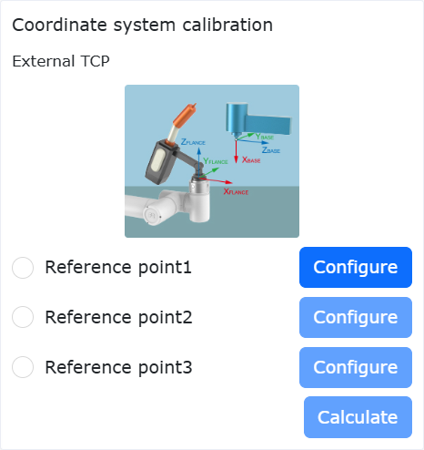

.. centered:: 图表 6.2‑5 六点法示意图

**1.三点法确定外部TCP**

- **设置点1**：已测量工具的TCP移动至外部TCP，点击设置点1按钮；

- **设置点2**：由点1沿外部TCF坐标系X轴移动一段距离，点击设置点2按钮；

- **设置点3**：回到点1，由点1沿外部TCF坐标系Z轴移动一段距离，点击设置点3按钮；

- **计算**：点击计算按钮得到外部TCF；

**2.六点法确定工具TCF**

- **设置点1-4**：在机器人空间选择一个固定的点，将工具从四个不同的角度移至所选的点上，依次设置1-4点；

- **设置点5**：回到固定的点沿工具TCF坐标系X轴移动一段距离，点击设置点5按钮；

- **设置点6**：回到固定的点沿工具TCF坐标系Y轴移动一段距离，点击设置点6按钮；

- **计算**：点击计算按钮得到工具TCF；

若需重新设置，点击取消按钮重新进去新建工具坐标系步骤。

完成最后步骤后，点击“完成”可返回工具坐标界面，点击“保存”即可存储刚才建立的工具坐标系。

.. important:: 
   1. 使用外部工具必须要进行外部工具坐标系的标定及应用，否则会导致机器人执行运动指令时工具中心点的位置和姿态不符合预期值。
   2. 外部工具坐标系一般使用etoolcoord1~etoolcoord14，应用etoolcoord0代表外部工具TCP的中心位置在末端法兰中心，在进行工具坐标系标定时，首先需将工具坐标系应用至etoolcoord0，然后选择其他工具坐标系进行标定。

工件坐标
~~~~~~~~~~~~~

在“初始设置”->“基础”菜单栏下，点击“工件坐标”进入工件坐标界面。工件坐标可实现工件坐标的修改、清空与应用。工件坐标系的下拉列表中共有15个编号，选择对应的坐标系（wobjcoord0~
wobjcoord14），后会在下方的“坐标系坐标”中显示对应坐标值，选择某一坐标系后点击“应用”按钮，当前使用的工件坐标系变为所选择的坐标，如下图所示。

.. image:: base/006.png
   :width: 4in
   :align: center

.. centered:: 图表 6.2‑6 设置工件坐标

工件坐标系一般是基于工具基础上进行标定的，需要在已建立工具坐标系的基础上进行工件坐标系的建立。点击“修改”可根据提示对该编号的工件坐标系进行重新设置。固定好工件，选择标定方法“原点-X轴-Z轴”或“原点-X轴-XY+平面”，两种标定方法前两点的选取都是一致的，第三点有所区别，选第一种方法标定的是工件坐标系的Z方向，选第二种方法标定的是XY+平面上一点，根据图示标定即可。点击计算按钮计算工件位姿，若需重新设置，点击取消按修改钮重新进行新建工件坐标系步骤。

.. image:: base/007.png
   :width: 3in
   :align: center

.. centered:: 图表 6.2‑7 三点法示意图

完成最后步骤后，点击“完成”可返回工件坐标界面，点击“保存”即可存储刚才建立的工件坐标系。

.. important:: 
   1. 工件坐标系是基于工具基础上进行标定的，需要在已建立工具坐标系的基础上进行工件坐标系的建立。
   2. 工件坐标系一般使用wobjcoord1~wobjcoord14，应用wobjcoord0代表工件坐标系原点在基坐标原点，在进行工件坐标系标定时，首先需将工件坐标系应用至wobjcoord0，然后选择其他工件坐标系进行标定及应用。

负载
--------------

末端
~~~~~~~~~~~~~

在“初始设置”->“基础”->“负载”的菜单栏下，点击“轨迹辨识”进入轨迹辨识界面。

在配置末端负载时请将所使用的末端工具的质量以及对应的质心坐标分别输入“负载质量”和“负载质心坐标X、Y和Z”输入框中并应用。

.. important:: 
    负载质量不可超过机器人的最大负载范围。具体机器人型号对应的负载范围请参考2.1. 基本参数，质心坐标设置范围为0-1000，单位mm。

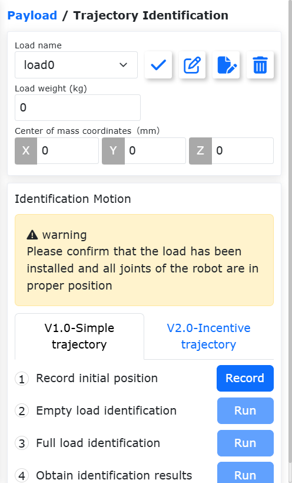

.. centered:: 图表 6.3‑1 负载设定示意图

.. important:: 
   机器人末端安装负载后，必须正确设置末端负载重量以及质心坐标，否则会影响机器人的拖动功能以及碰撞检测功能使用。

用户对工具质量或质心不确定的情况下，可以通过点击“自动辨识”进入负载辨识功能对工具数据测定。

在进行测定之前，确保负载已安装后选择版本。点击“工具数据测定”按键，进入负载运动测试界面。

.. image:: base/017.png
   :width: 4in
   :align: center

.. centered:: 图表 6.3‑2 负载辨识关节设置

点击“负载辨识启动”进行测试，如遇紧急情况请及时停止运动。

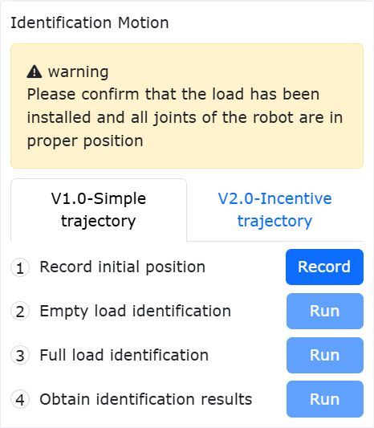

.. centered:: 图表 6.3‑3 负载辨识启动

运动结束后，点击“获取辨识结果”按键，获取计算出的工具数据，并显示在页面上，如需应用到负载数据中，点击应用即可。

.. image:: base/019.png
   :width: 4in
   :align: center

.. centered:: 图表 6.3‑4 负载辨识结果

关节
--------------

软限位
~~~~~~~~~~~~~

在“初始设置”->“基础”->“关节”的菜单栏下，点击“软限位”进入软限位界面。

机器人行程内可能存在其它设备，限位角度可对机器人进行软限位，使机器人运动不超过某个坐标值，防止机器人碰撞。触发软限位机器人停止为机器人自动触发，无停止距离。

管理员可使用默认值也可输入角度值。输入角度值，可分别对机器人关节正负角度进行限位，当输入值超出2.1-基本参数中的机器人基本参数表格所列出的机器人关节软限位角度值，会将限位角度调整为所能设定最大值。当机器人报出超出指令超限时，需要进入拖动模式，将机器人关节拖动至限位角度之内。界面如下图所示：

.. image:: base/020.png
   :width: 4in
   :align: center

.. centered:: 图表 6.4‑1-1 机器人限位示意图

关节软限位保护
+++++++++++++++++++++++++++++++++++

概述
************************

关节软限位保护功能是一种通过实时监测机械臂关节运动状态，动态限制操作者在拖动示教过程中超出设置软限位范围的主动防护机制。该功能使得软限位在拖动示教下同样存在意义，从而提升人机协作安全性。

关节软限位保护
************************

关节软限位保护功能需要确保软件包与固件版本匹配，从而获取最佳体验。

软限位设置及功能启停
""""""""""""""""""""""""""""""""""""

**Step1**：登录web界面，依次点击“初始设置”->“基础”->“关节”->“软限位”，进入机器人软限位设置模块。

.. image:: base/056.png
   :width: 4in
   :align: center

.. centered:: 图表 6.4‑1-2 机器人软限位设置模块

**Step2**：基于机器人实际的工作范围，合理设置各关节软限位。此时，需要检查当前机器人各关节的角位置是否在预设软限位范围内，若是则可点击“应用”下发预设软限位；若不是，则需将各关节移动至预设范围内，否则当点击“应用”时将提示超限，见下图所示。此时，可朝进入软限位范围方向单轴点动或拖动超限关节，从而清除错误。

.. image:: base/057.png
   :width: 6in
   :align: center

.. centered:: 图表 6.4‑1-3 机器人各关节实际角位置超出所设软限位范围时报错

**Step3**：当软限位范围设置成功后，点击“关节软限位保护”滑块，可开启该功能，具体见下图所示。此时，拖动模式下，所设软限位将起到限制作用，同时，在拖动至软限位附近时，将感受到阻力。

.. image:: base/058.png
   :width: 4in
   :align: center

.. centered:: 图表 6.4‑1-4 开启关节软限位保护功能

**Step4**：若需关闭关节软限位保护功能，可通过点击“关节软限位保护”滑块实现。

碰撞等级
~~~~~~~~~~~~~

在“初始设置”->“基础”->“关节”的菜单栏下，点击“碰撞等级”进入碰撞等级界面。

碰撞等级分为一到十级，一到三级检测比较灵敏，机器人需要在推荐速度下运行。同时可以选择自定义百分比设置，100%即对应十级。碰撞策略可以设置机器人碰撞后的处理方式，分为报错停止和继续运动，用户可以根据具体使用需求来设定。如下图所示：

.. image:: base/021.png
   :width: 4in
   :align: center

.. centered:: 图表 6.4‑2 碰撞等级示意图

碰撞后响应策略
++++++++++++++++

在原有运动中碰撞策略的基础上，增加“重力矩模式”和“振荡响应模式”，旨在保证人机协作的安全。

两种策略在触发时，均会从自动模式或手动模式，切换至拖动模式，重力矩模式会根据碰撞力大小及方向远离碰撞点，而振荡响应模式则会在远离碰撞点后，回到碰撞位置。同时，新增静止下的碰撞检测。

碰撞策略
++++++++++++++++

FT_Guard指令用于实现基于力传感器的碰撞检测。之前的碰撞策略为“碰撞停止”、“碰撞暂停”和“继续运动”。为了避免碰撞后机器人与物体产生挤压力，增加策略“重力矩模式”、“振荡响应模式”和“碰撞回弹模式”。

三种策略在触发时，均会从自动模式或手动模式，切换至拖动模式，之后再切换至手动模式。其中重力矩模式会根据碰撞力大小及方向远离碰撞点；振荡响应模式会在远离碰撞点后，回到碰撞位置；碰撞回弹模式会根据设置的参数，加速远离碰撞点。

重力矩模式
**********************

碰撞策略中的重力矩模式，设置步骤如下。

**Step1**：在“初始设置”->“基础”->“关节”菜单栏下，点击“碰撞等级”，进入对应界面。

**Step2**：在“碰撞策略”一栏中， 点击下拉框选择“重力矩模式”，界面如下图所示；然后，点击“应用”按钮，功能即可启用。

.. note:: 在机器人运行中，若负载质量变化较大，不建议使用该策略；若运行速度过快，不建议使用该策略。

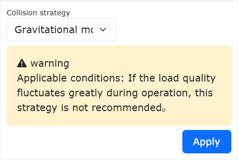

.. centered:: 图表 6.4-3 碰撞策略之重力矩模式

振荡响应模式
**********************

碰撞策略中的振荡响应模式，设置步骤如下。

**Step1**：在“初始设置”->“基础”->“关节”菜单栏下，点击“碰撞等级”，进入对应界面。

**Step2**：在“碰撞策略”一栏中， 点击下拉框选择“振荡响应模式”，界面如下图所示；然后，点击“应用”按钮，功能即可启用。

.. note:: 在机器人运行中，若运行速度过快，不建议使用该策略。

.. centered:: 图表 6.4-4 碰撞策略之振荡响应模式

碰撞回弹模式
**********************

碰撞策略中的碰撞回弹模式，设置步骤如下。

**Step1**：在初始设置中的“机器人设置”菜单栏下，点击“碰撞等级”，进入对应界面。

**Step2**：在“碰撞策略”一栏中， 点击下拉框选择“碰撞回弹模式”，依次设置安全时间1000ms，安全距离150mm，安全速度150mm/s，各关节安全系数为5，具体界面如下图所示。

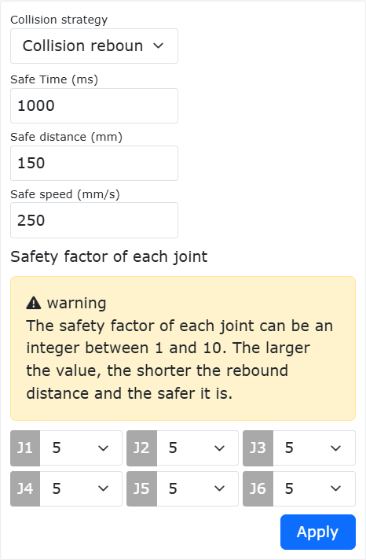

.. centered:: 图表 6.4-5 碰撞策略之碰撞回弹模式

各项参数的含义：
  - 安全时间：表示从自动模式切换至拖动模式后，在拖动模式下的持续时间，范围是[1000-2000]ms；
  - 安全距离：表示碰撞后机器人远离碰撞点的位置，范围是[150-200]mm；
  - 安全速度：表示碰撞后机器人远离碰撞点的最大TCP速度，超出速度限制后，会约束反弹力，范围是[50-250]mm/s；
  - 安全系数：表示反弹力的衰减速度，系数越小，衰减越快，反弹速度越快，反之越慢；范围是[1-10]，无量纲。

FT_Guard指令
**********************

FT_Guard指令用于实现力传感器的碰撞检测。首先选择检测的方向，也可设置所有方向。之后获取当前力传感器数据作为初始值，再设定最大阈值和最小阈值确定碰撞力触发的上下限，即可完成碰撞检测功能设置。以Z向配置为例，详细设置见下图。

.. image:: base/050.png
   :width: 6in
   :align: center

.. centered:: 图表 6.4-6 FT_Guard指令参数配置

FT_Guard指令通常与运动指令搭配使用，可用PTP或Lin等指令，简单示例如图所示。

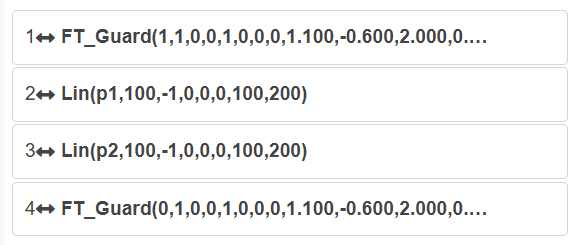

.. centered:: 图表 6.3-7 FT_Guard与运动指令结合示例

第一行为设置力传感器碰撞检测开启，最后一行为关闭力传感器碰撞检测功能。

静态下碰撞检测
++++++++++++++++

静态下碰撞检测的设置步骤如下。

**Step1**：在“初始设置”->“基础”->“关节”菜单栏下，点击“碰撞等级”，进入对应界面。

**Step2**：将静态下碰撞检测的开关打开，如下图所示。当检测到关节扭矩指令与扭矩反馈差距过大，机器人将进入拖动模式，避免产生持续的挤压力。

.. image:: base/024.png
   :width: 4in
   :align: center

.. centered:: 图表 6.4-8 静态下碰撞检测

拖动前的力矩检测功能
++++++++++++++++++++++++++++++++++++++

概述
***********************
在机器人进入拖动模式之前，需要进行力矩检测。该功能的作用是防止由于操作者设置了错误的负载参数或选择了错误的安装方式，导致机器人进入拖动模式后出现上抬或下坠等异常现象。若检测到关节力矩超出允许范围，控制器会立即报错，并禁止机器人进入拖动模式。

拖动前力矩检测
**************************************

**Step1**：点击“初始设置”->“基础”-> “关节”->“碰撞等级”，进入碰撞等级设置界面，开启拖动前力矩检测功能，如图所示。

.. image:: base/069.png
   :width: 4in
   :align: center

.. centered:: 图表 6.4-9 拖动前力矩检测功能开启

**Step2**：切换拖动模式。Web界面通过点击机器人状态区—机器人拖动状态、长按按钮盒“示教模式”按钮、长按机器人末端拖动按钮进入拖动模式，若控制器报错且机器人未切换至拖动模式，如图2-2所示，检查机器人负载配置及安装方式是否正确。

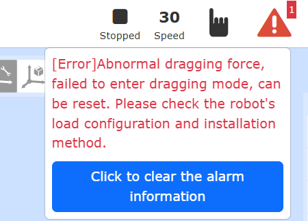

.. centered:: 图表 6.4-10 力矩超限，控制器报错

**Step3**：检查负载配置及安装方式。点击“初始设置”->“基础”-> “负载”->“末端”，查看web界面末端负载配置与实际安装负载是否相同；点击“初始设置”->“基础”-> “安装”->“自由安装”，查看web界面安装方式与实际安装方式是否相同。

误报检测功能
++++++++++++++++++++++++++++++++++++++

概述
***********************

碰撞功能优化是在碰撞检测的基础上，增加误报开关，可以避免碰撞误报风险。

碰撞等级设置
*****************************************

**Step1**：登录web界面，依次点击“初始设置”→“基础”→“关节”→“碰撞等级”，进入碰撞等级设置模块。

碰撞等级越高，碰撞发生时所需的力矩越大，碰撞响应越不灵敏。目前碰撞等级对应的力矩值，如10级的38.4NM为1轴碰撞触发时所需的理论力矩。

.. image:: base/093.png
   :width: 4in
   :align: center

.. centered:: 图表 6.4-11 碰撞等级的设置模块

**Step2**：误报检测开关，默认开启生效。若不使用，则可以把检测开关“关闭”，如下图所示。

.. image:: base/094.png
   :width: 4in
   :align: center

.. centered:: 图表 6.4-12 误报检测开关

摩擦力补偿
~~~~~~~~~~~~~

在“初始设置”->“基础”->“关节”的菜单栏下，点击“摩擦力补偿”进入摩擦力补偿设置界面。

**摩擦力补偿系数**：摩擦力补偿所针对的使用场景仅在拖动模式下，摩擦力补偿系数可设置范围为0~1，数值越高，拖动时补偿的力就越大。摩擦力补偿系数根据安装方式的不同需要单独设置每个轴的补偿系数。

**摩擦力补偿开关**：用户可根据实际机器人及使用习惯开启或关闭摩擦力补偿。

.. image:: base/025.png
   :width: 4in
   :align: center

.. centered:: 图表 6.4-13 摩擦力补偿设置

.. important:: 
   机器人摩擦力补偿功能需要谨慎使用，根据实际情况，设置合理的补偿系数，一般推荐中间值0.5左右。

摩擦力补偿系数调整功能
~~~~~~~~~~~~~~~~~~~~~~~~~~~~~

概述
++++++++++++++++++++++++
摩擦力补偿系数调整功能主要用于调整控制器内部对摩擦力补偿数值大小。

在拖动模式下，摩擦力补偿系数调整可以使机器人拖动轻松；在自动模式下，摩擦力补偿系数调整可以使转矩指令和转矩反馈曲线的拟合优度。

摩擦力补偿系数调整
++++++++++++++++++++++++++++++++++++++++++++++++

摩擦力补偿系数出厂默认为0.5，为通用参数；用户可以根据实际情况对摩擦力增益进行调整，从而获得较好体验。

摩擦力补偿系数配置
******************************************************************

**Step1**：登录web界面，依次点击“初始设置”→“基础”→“关节”→“摩擦力补偿”，进入摩擦力补偿设置模块。

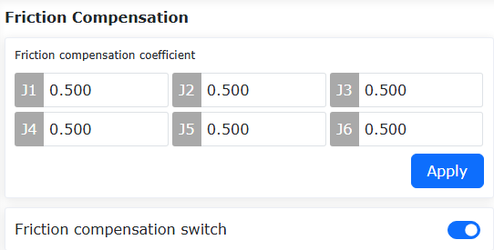

.. centered:: 图表 6.4-14 摩擦力补偿设置模块

**Step2**：摩擦力补偿系数默认为0.5，摩擦力补偿开关开启状态如图所示。功能开启后，拖动手感相较于功能开启前，较为柔顺；功能不开启，则拖动手感较重。

**Step3**：参数调整，摩擦力补偿系数的范围是[0-1]。若参数拖动略重，可以根据实际情况，对各个轴的参数进行加大调整；若拖动过程中出现不能停止现象或出现关节振动现象，需要对应轴的参数进行调小处理。

**Step4**：若需关闭摩擦力补偿功能，可通过补偿开关选择“关闭”实现。

拖动力补偿
~~~~~~~~~~~~~~~~~~~~~~~~~~~~~

概述
+++++++++++++++++++++++++++++

拖动力优化是在当前电流环拖动的基础上，根据机器人运动趋势，补偿一定的力矩，用于克服建模不准确等引入的力矩误差，使机器人拖动柔顺。

机器人拖动力优化
++++++++++++++++++++++++++++++++++++++++++++++++++++++++++

拖动力优化功能需要确保软件版本和固件版本匹配，从而获得较好体验。

拖动力优化功能配置
***************************************************
**Step1**：登录web界面，依次点击“初始设置”->“基础”->“关节”->“摩擦力补偿”，进入拖动力补偿设置模块，见图所示。

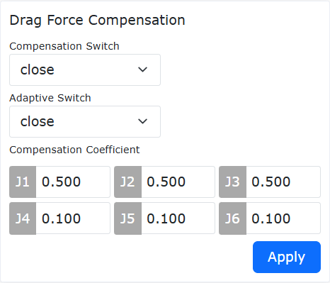

.. centered:: 图表 6.4-15 拖动力补偿设置模块

**Step2**：补偿开关选择“开启”，自适应开关选择“关闭”，配置参数如图所示，点击“应用”，功能开启成功。按下拖动按钮，就可以拖动机器人，拖动手感相较于功能开启前，比较柔顺。

**Step3**：参数调整，补偿系数的范围是[0-1]。若参数拖动略重，可以对应轴的参数进行加大调整；若拖动过程中出现不能停止现象或出现关节振动现象，需要对应轴的参数进行调小处理。同时，在拖动过程中会出现阻尼感，用于减速，使机器人停止。

**Step4**：若需关闭拖动力补偿功能，可通过补偿开关选择“关闭”实现。

I/O设置
-----------

LUA程序暂停
~~~~~~~~~~~~~~~~~~~~~~~~~~~~~

机器人LUA程序运行中点击“暂停/恢复”按钮可暂停LUA程序执行，机器人运行状态变为“Pause”状态。再次点击该按钮，程序将从暂停的位置继续执行，机器人运行状态再次变为“Running”状态。

所有启动的后台程序在上述过程中也将同步暂停和恢复。不同类型的LUA指令在暂停时的表现有所差异：

**①运动类指令**：暂停时机器人立即停止运动，恢复时机器人恢复运动，并运动到该指令的目标位置。

**②SetDO、GetDI、GetInverseKinRef等逻辑指令**：在指令执行过程中触发程序暂停，则该类指令执行完成后等待LUA程序退出暂停状态再执行下一条指令。

**③WaitDI、ModbusMasterWaitDI等待指令**：在等待过程中触发程序暂停，暂停时间不占用等待超时时间。

**④sleep_ms、WaitMs睡眠指令**：在睡眠过程中触发程序暂停，暂停时间不占用设置的睡眠时间。

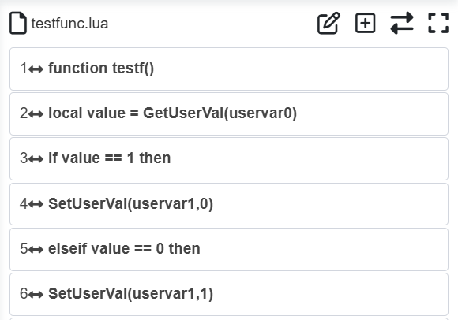

.. centered:: 图表 6.5‑1 LUA程序暂停状态

.. image:: base/067.png
   :width: 4in
   :align: center

.. centered:: 图表 6.5‑2 LUA程序运行中状态

I/O配置
~~~~~~~~~

点击菜单栏“初始设置”->“基础”->“I/O设置”，点击“DI”、“DO”子菜单进入DI和DO配置界面。其中控制箱CI0-CI7和CO0-CO7可配置，末端DI0和DI1可配置。

DI配置
++++++++++++++++

在生产中协作机器人需要连接外设时或因故障或者其它因素突然停止，需要输出DO信号，实现声光报警提示，输入可配置功能如下表格所示：

.. centered:: 表格 6.5‑1 控制箱输入可配置功能

.. list-table:: 
   :widths: 15 30 100
   :header-rows: 1
   :align: center

   * - 功能编号
     - 功能名称
     - 功能描述
   * - 0
     - 无
     - 无
   * - 1
     - 起弧成功信号
     - 焊机起弧成功，机器人输出起弧信号至焊机
   * - 2
     - 焊接准备信号
     - 机器人焊机准备成功信号
   * - 3
     - 传送带检测
     - 传送带检测开关DI配置信号
   * - 4
     - 暂停
     - 机器人焊接过程中暂停运动信号
   * - 5
     - 恢复
     - 机器人焊接过程中电弧意外中断或操作人员主动暂停焊接时会触发焊接中断，焊接中断后外部向机器人输入该信号从无效变为有效时，机器人自动从原来中断的位置自动恢复焊接
   * - 6
     - 启动 
     - 在DI配置可配置输入中，选择CIO为“启动”，点击“应用”。可配置输入有效状态选择“高电平有效”，则当CI0电平从低电平变为高电平时，触发“启动”功能，可启动当前示教程序界面打开的程序，若未打开界面，则运行上次保存的程序；可配置输入有效状态选择“低电平有效”，则当CI0电平从高电平变为低电平时，触发“启动”功能，可启动当前示教程序界面打开的程序，若未打开界面，则运行上次保存的程序
   * - 7
     - 停止  
     - 机器人焊接过程中停止运动信号
   * - 8
     - 暂停/恢复
     - 机器人运动后，循环触发暂停/恢复运动信号
   * - 9
     - 启动/停止
     - 机器人运动后，循环触发启动/停止运动信号
   * - 10
     - 脚踏拖动开关
     - 机器人脚踏拖动开关运动信号
   * - 11
     - 移至作业原点
     - 以当前机器人位姿作为作业原点，机器人运动至作业原点信号
   * - 12
     - 手自动切换（脉冲信号）
     - 在DI配置可配置输入中，选择CIO为“手自动切换（脉冲信号）”，点击“应用”。可配置输入有效状态选择“高电平有效”，则当CI0电平从低电平变为高电平时，触发“手自动切换（脉冲信号）”功能，机器人切换一次运行状态；可配置输入有效状态选择“低电平有效”，则当CI0电平从高电平变为低电平时，触发“手自动切换（脉冲信号）”功能，机器人切换一次运行状态
   * - 13
     - 焊丝寻位成功
     - 机器人焊丝寻位成功信号
   * - 14
     - 运动中断
     - 机器人运动程序中断信号
   * - 15
     - 启动主程序
     - 启动机器人主程序信号
   * - 16
     - 启动倒带
     - 机器人程序运行后，程序倒带启动信号。
   * - 17
     - 启动确认
     - 机器人程序启动确认信号
   * - 18
     - 激光检测信号 X
     - 机器人激光传感器检测信号X
   * - 19
     - 激光检测信号 Y
     - 机器人激光传感器检测信号Y
   * - 20
     - 外部急停输入信号1
     - 机器人外部急停输入信号1，①仅在QX下显示。②LA下可在“初始设置”->“安全”->"I/O安全"->“DIO安全功能配置”界面进行相关配置
   * - 21
     - 外部急停输入信号2
     - 机器人外部急停输入信号2，①仅在QX下显示。②LA下可在“初始设置”->“安全”->"I/O安全"->“DIO安全功能配置”界面进行相关配置
   * - 22
     - 一级缩减模式
     - 机器人一级缩减模式，①仅在QX下显示。②LA下可在“初始设置”->“安全”->"I/O安全"->“DIO安全功能配置”界面进行相关配置
   * - 23
     - 二级缩减模式
     - 机器人二级缩减模式，①仅在QX下显示。②LA下可在“初始设置”->“安全”->"I/O安全"->“DIO安全功能配置”界面进行相关配置
   * - 24
     - 三级缩减模式（停止）
     - 机器人三级缩减模式（停止），①仅在QX下显示。②LA下可在“初始设置”->“安全”->"I/O安全"->“DIO安全功能配置”界面进行相关配置
   * - 25
     - 恢复焊接
     - 机器人发生焊接中断后，恢复焊接操作信号
   * - 26
     - 终止焊接
     - 机器人焊接过程中，终止焊接操作信号
   * - 27
     - 辅助拖动开启
     - 控制箱DI功能配置力传感器拖动功能开启信号
   * - 28
     - 辅助拖动关闭
     - 控制箱DI功能配置力传感器拖动功能关闭信号
   * - 29
     - 辅助拖动开启/关闭
     - 控制箱DI功能配置力传感器拖动功能，循环开启/关闭信号
   * - 30
     - 清除所有错误
     - 清除机器人触发的所有错误信号
   * - 31
     - 手自动切换（高低电平）
     - 在DI配置可配置输入中，选择CIO为“手自动切换（高低电平）”，点击“应用”。可配置输入有效状态选择“高电平有效”，则当CI0切换为高电平时，触发“手自动切换（高低电平）”功能，机器人状态切换为自动状态；可配置输入有效状态选择“低电平有效”，则当CI0切换为低电平时，触发“手自动切换（高低电平）”功能，机器人状态切换为自动状态
   * - 32
     - 使能
     - 控制机器人使能
   * - 33
     - 去使能
     - 控制机器人去使能
   * - 34
     - 使能/去使能(上升下降沿)
     - 信号输入有效状态上升下降沿分别触发机器人使能和去使能动作

末端CI增加可配置功能
**********************************************************

概述
""""""""""""""""""""""""""""""""""""""""

将机器人控制箱CI的全部功能同步至末端CI，其核心在于构建一个逻辑功能对等、物理位置互补的控制体系。两个接口在逻辑功能上完全对等，可并行或选择性地使用，使机器人控制系统能够根据任务场景、设备物理布局和可靠性要求，智能地分配信号路径。

操作流程
""""""""""""""""""""""""""""""""""""""""""""""""""""""""""""""""""""""""""""

**Step1**：依次点击菜单栏“初始设置”-“基础”-“I/O设置”-“DI”等按钮，进入DI配置界面，选择End DI0和End DI1配置机器人末端输入的功能。

.. image:: base/095.png
   :width: 4in
   :align: center

.. centered:: 图表 6.5‑3 末端DI参数配置

**Step2**：机器人末端支持的DI信号如下表，用户可根据实际使用需求配置对应的信号。

.. centered:: 表格 6.5‑2 末端输入可配置功能

.. list-table:: 
   :widths: 15 30 100 
   :header-rows: 1
   :align: center

   * - 功能编号
     - 功能名称
     - 功能描述
   * - 0
     - 无
     - 无
   * - 1
     - 拖动模式
     - 机器人末端启用拖动模式信号
   * - 2
     - 示教点记录
     - 机器人末端启用示教点记录信号，保存当前机器人点位数据
   * - 3
     - 手自动切换
     - 机器人手自动切换触发信号
   * - 4
     - TPD 轨迹记录启动/停止
     - 机器人开始TPD运动后，轨迹记录启动/停止信号
   * - 5
     - 暂停
     - 机器人运动暂停信号
   * - 6
     - 恢复
     - 机器人恢复运动信号
   * - 7
     - 启动
     - 机器人程序启动信号
   * - 8
     - 停止
     - 机器人程序停止信号
   * - 9
     - 暂停/恢复
     - 机器人运动后，循环触发暂停/恢复运动信号
   * - 10
     - 启动/停止
     - 机器人运动后，循环触发启动/停止运动信号
   * - 11
     - 辅助拖动开启
     - 控制箱DI功能配置力传感器拖动功能开启信号
   * - 12
     - 辅助拖动关闭
     - 控制箱DI功能配置力传感器拖动功能关闭信号
   * - 13
     - 辅助拖动开启/关闭
     - 控制箱DI功能配置力传感器拖动功能，循环开启/关闭信号
   * - 14
     - 激光检测信号 X
     - 机器人激光传感器检测信号X
   * - 15
     - 激光检测信号 Y
     - 机器人激光传感器检测信号Y
   * - 16
     - 移至作业原点
     - 机器人运动至作业原点信号
   * - 17
     - 运动中断
     - 机器人运动程序中断信号
   * - 18
     - 启动主程序
     - 启动机器人主程序信号
   * - 19
     - 启动倒带
     - 机器人程序运行后，程序倒带启动信号
   * - 20
     - 启动确认
     - 机器人程序启动确认信号
   * - 21
     - 恢复焊接
     - 机器人发生焊接中断后，恢复焊接操作信号
   * - 22
     - 终止焊接
     - 机器人焊接过程中，终止焊接操作信号
   * - 23
     - 报错信息清除
     - 清除机器人触发的所有错误信号
   * - 24
     - 手自动切换（高低电平）
     - 当可配置输入选择“高电平有效”，输入信号为高电平时，机器人切换为自动；当可配置输入选择“低电平有效”，输入信号为低电平时，机器人切换为自动
   * - 25
     - 使能
     - 控制机器人使能
   * - 26
     - 去使能
     - 控制机器人去使能
   * - 27
     - 使能/去使能(上升下降沿)
     - 信号输入有效状态上升下降沿分别触发机器人使能和去使能动作
   * - 28
     - 激光伺服跟踪启停信号
     - 机器人激光边记录边跟踪且io启停功能开启时，触发对应末端CI，开始激光跟踪；解除对应末端CI，跟踪结束

其中控制箱默认配置：CO0为1-机器人报错，CO1为2-机器人运动中。

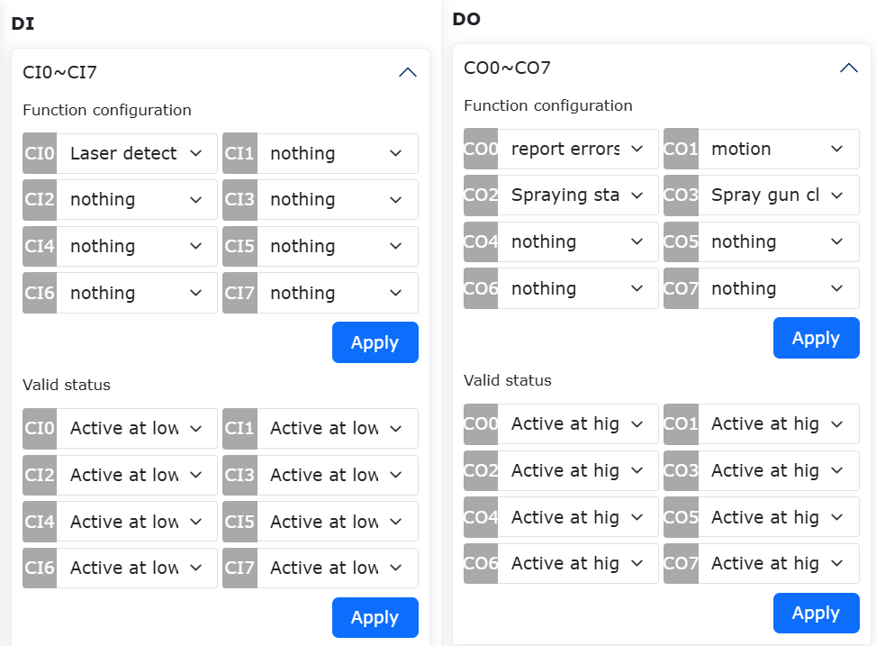

.. centered:: 图表 6.5‑3 控制箱DI和DO配置

**末端DI默认配置**：DI0拖动示教，DI1示教点记录。

.. image:: base/027.png
   :width: 4in
   :align: center

.. centered:: 图表 6.5‑4 末端DI配置

配置完成后，可在对应状态下，于控制箱I/O页面中查看相应的输出DO状态。

.. important:: 
   已配置DI、DO禁止在程序编程中使用。

**缩减模式配置（一级、二级、三级）**：一级和二级缩减模式可以配置关节速度和末端TCP速度，三级缩减模式是停止可以不用配置速度。

.. image:: base/032.png
   :width: 4in
   :align: center

.. image:: base/033.png
   :width: 4in
   :align: center

.. centered:: 图表 6.5‑5 缩减模式配置

DO配置
++++++++++++++++

输出可配置功能如下表格所示：

.. centered:: 表格 6.5‑3 控制箱输出可配置功能

.. list-table:: 
   :widths: 15 30 100
   :header-rows: 1
   :align: center

   * - 功能编号
     - 功能名称
     - 功能描述
   * - 0
     - 无
     - 无
   * - 1
     - 报错
     - DO输出报错信号
   * - 2
     - 运动
     - 机器人运动信号
   * - 3
     - 喷涂启停
     - 机器人喷涂启停操作信号
   * - 4
     - 喷涂清枪
     - 机器人喷涂清枪操作信号
   * - 5
     - 起弧
     - 机器人控制焊机起弧的DO输出端口，当机器人程序执行起弧指令时，焊机起弧对应DO输出端口自动输出有效
   * - 6
     - 送气
     - 机器人控制焊机送气的DO输出端口，当机器人执行焊接送气指令时，送气对应的DO输出端口自动输出有效
   * - 7
     - 正向送丝
     - 机器人控制焊机正向送丝的DO输出端口，当机器人执行正向送丝指令时，正向送丝对应的DO输出端口自动输出有效
   * - 8
     - 反向送丝
     - 机器人控制焊机反向送丝的DO输出端口，当机器人执行反向送丝指令时，反向送丝对应的DO输出端口自动输出有效
   * - 9
     - JOB 输入口 1
     - JOB输入端口1信号
   * - 10
     - JOB 输入口 2
     - JOB输入端口2信号
   * - 11
     - JOB 输入口 3
     - JOB输入端口3信号
   * - 12
     - 传送带启停
     - 传送带运动启停操作信号
   * - 13
     - 暂停
     - 机器人运动暂停信号
   * - 14
     - 到达作业原点
     - 机器人运动至作业原点信号
   * - 15
     - 进入干涉区
     - 机器人运动至干涉区信号
   * - 16
     - 焊丝寻位启停控制
     - 机器人焊丝寻位启停控制操作信号
   * - 17
     - 机器人启动完成
     - 机器人启动完成信号
   * - 18
     - 程序启动停止
     - 机器人运动程序启动停止信号
   * - 19
     - 自动手动模式
     - 机器人手自动模式切换信号
   * - 20
     - 急停输出信号1
     - 机器人急停输出信号1，①仅在QX下显示。②LA下可在“初始设置”->“安全”->"I/O安全"->“DIO安全功能配置”界面进行相关配置
   * - 21
     - 急停输出信号2
     - 机器人急停输出信号2，①仅在QX下显示。②LA下可在“初始设置”->“安全”->"I/O安全"->“DIO安全功能配置”界面进行相关配置
   * - 22
     - Lua脚本程序运行/停止
     - 机器人运动Lua脚本程序运行/停止信号
   * - 23
     - 安全状态输出
     - 机器人安全状态输出信号，①仅在QX下显示。②LA下可在“初始设置”->“安全”->"I/O安全"->“DIO安全功能配置”界面进行相关配置
   * - 24
     - 保护性停止状态输出
     - 机器人保护性停止状态输出信号，①仅在QX下显示。②LA下可在“初始设置”->“安全”->"I/O安全"->“DIO安全功能配置”界面进行相关配置
   * - 25
     - 机器人运动中
     - 机器人运动中状态信号，①仅在QX下显示。②LA下可在“初始设置”->“安全”->"I/O安全"->“DIO安全功能配置”界面进行相关配置
   * - 26
     - 机器人缩减模式
     - 机器人缩减模式信号，①仅在QX下显示。②LA下可在“初始设置”->“安全”->"I/O安全"->“DIO安全功能配置”界面进行相关配置
   * - 27
     - 机器人非缩减模式
     - 机器人非缩减模式信号，①仅在QX下显示。②LA下可在“初始设置”->“安全”->"I/O安全"->“DIO安全功能配置”界面进行相关配置
   * - 28
     - 预留
     - 预留
   * - 29
     - 指令点错误
     - 关节指令点错误信号
   * - 30
     - 驱动器错误
     - 驱动器错误信号
   * - 31
     - 超出软限位错误
     - 机器人超出软限位错误信号，需调整相应关节软限位
   * - 32
     - 碰撞错误
     - 机器人发生碰撞错误信号
   * - 33
     - 活动从站数量错误
     - 活动从站数量错误异常信号
   * - 34
     - 从站错误
     - 从站发生异常错误信号
   * - 35
     - I/O错误
     - I/O错误信号
   * - 36
     - 夹爪错误
     - 夹爪相关配置异常信号
   * - 37
     - 文件错误
     - 配置文件加载错误信号 
   * - 38
     - 奇异位姿错误
     - 机器人运动过程中，运动至奇异位姿错误信号
   * - 39
     - 驱动器通信错误
     - 机器人驱动器通信异常错误信号
   * - 40
     - 参数错误
     - DO高低电平范围错误错误
   * - 41
     - 外部轴超出软限位错误
     - 外部轴1-4轴超出软限位故障信号
   * - 42
     - 规划与超时警告
     - 机器人规划与超时报警状态
   * - 43
     - 安全门警告
     - 安全门触发状态
   * - 44
     - 运动警告
     - 运动警告状态
   * - 45
     - 干涉区警告
     - 机器人进入干涉区警告状态
   * - 46
     - 安全墙警告
     - 机器人进入安全墙警告状态
   * - 47
     - 机器人使能
     - 机器人使能状态
  
控制箱DO高低有效可配置功能
~~~~~~~~~~~~~~~~~~~~~~~~~~~~~~~~~

概述
++++++++++++

控制箱上电启动直到机器人使能的整个过程中，DO可根据具体使用场景配置为所需的输出状态，使用更加灵活和便捷。

操作步骤
++++++++++++

进入初始设置->基础->I/O设置->DO界面，将上电期间控制箱DO输出配置为所需的高/低电平。

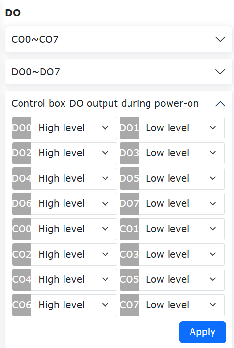

.. centered:: 图表 6.5‑6 上电期间控制箱DO输出配置

I/O别名配置
~~~~~~~~~~~~~~~~~~~~

点击菜单栏“初始设置”->“基础”->“I/O设置”，点击“别名”子菜单进入配置界面，根据实际使用场景配置控制箱和末端IO信号的给定含义名称。配置成功后，有关IO信号内容的模块显示对应别名，模块如下：

.. image:: base/028.png
   :width: 4in
   :align: center

.. centered:: 图表 6.5‑7 IO别名配置

I/O滤波
~~~~~~~~~~

点击菜单栏“初始设置”->“基础”->“I/O设置”，点击“滤波”子菜单进入IO滤波时间设置界面，滤波时间设置界面包括：

- 控制箱DI滤波时间
- 末端板DI滤波时间
- 控制箱AI0滤波时间
- 控制箱AI1滤波时间
- 末端板AI0滤波时间
- 按钮盒DI滤波时间
- 扩展DI滤波时间
- 扩展AI0滤波时间
- 扩展AI1滤波时间
- 扩展AI2滤波时间
- 扩展AI3滤波时间
- Smart DI 滤波时间

用户可以查看所有滤波参数值表并根据自己的需求来设定对应的参数，选择相应的参数输入参数值设置即可。如下图所示：

.. image:: base/029.png
   :width: 4in
   :align: center

.. image:: base/076.png
   :width: 4in
   :align: center

.. centered:: 图表 6.5‑8 滤波界面

.. important:: 
   I/O滤波时间范围为[0~200]，单位ms。

输出复位配置
~~~~~~~~~~~~~

点击菜单栏“初始设置”->“基础”->“I/O设置”，点击“输出复位”子菜单进入配置界面，根据实际使用过程中是否复位的需求，配置不同输出在停止/暂停后是否需要复位。目前输出包括：

- 控制箱DO
- 控制箱AO
- 末端版DO
- 末端版AO
- 扩展DO
- 扩展AO
- SmartTool DO

.. image:: base/030.png
   :width: 4in
   :align: center

.. centered:: 图表 6.5‑9 输出复位配置

暂停恢复DO复位状态可配置功能
~~~~~~~~~~~~~~~~~~~~~~~~~~~~~~~~~~~~~~~~~~~~~~~~~~~~~~~~~~~~~~~~~~~~~~~~~~~~~~~~~~~~~

概述
++++++++++++++++++++++++
本功能对现有的输出复位功能进行优化，在I/O设置中增加可配置选项，可设置为保持或复位两种类型，其中复位又可分为恢复至复位前状态、不恢复至复位前状态，用户可根据实际需要设置不同的配置选项。

操作流程
+++++++++++++++++++++++++++++++
**Step1**：依次点击“初始设置”-“I/O设置”-“输出复位”指令，根据实际使用需要设置DO或AO的停止/暂停后输出状态，其中状态可设置为“保持”或“复位”，仅当设置为“复位”时，可进一步设置“恢复至复位前状态”。

**Step2**：将状态可设置为“保持”，在lua程序运行时点击暂停，再点击恢复，DO/AO输出状态全程不变，为触发状态；在lua程序运行时点击停止，DO/AO输出状态不变，设置参数如下图。

.. image:: base/030.png
   :width: 4in
   :align: center

.. centered:: 图表 6.5‑10 状态设置为“保持”
 
**Step3**：将状态可设置为“复位”，恢复至复位前状态设置为“否”，在lua程序运行时点击暂停时，DO/AO输出状态将被复位，再点击恢复，DO/AO输出状态仍被复位；在lua程序运行时点击停止，DO/AO输出状态将被复位，设置参数如下图。

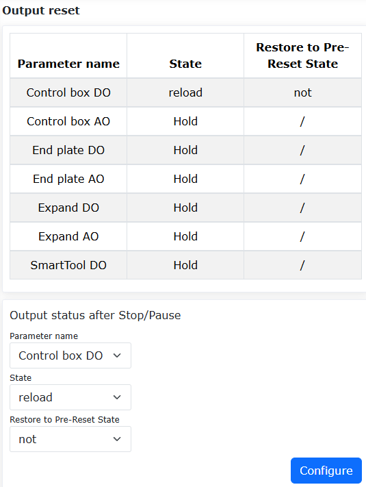

.. centered:: 图表 6.5‑11 状态设置为“复位”+“否”

**Step4**：将状态可设置为“复位”，恢复至复位前状态设置为“是”，在lua程序运行时点击暂停时，DO/AO输出状态将被复位，再点击恢复，DO/AO输出状态重载；在lua程序运行时点击停止，DO/AO输出状态将被复位，设置参数如下图。

.. centered:: 图表 6.5‑12 状态设置为“复位”+“是”

作业原点
-----------

在“初始设置”->“基础”的菜单栏下，点击“作业原点”进入作业原点配置功能界面。

该页面显示作业原点的名称和关节位置信息，作业原点命名为固定名pHome，点击“设置”以当前机器人位姿作为作业原点，点击“移至该点”机器人会运动到作业原点。此外DI配置中增加移动至作业原点可配置选项，DO配置中增加到达作业原点可配置选项。

.. image:: base/077.png
   :width: 4in
   :align: center

.. centered:: 图表 6.6‑1 作业原点

.. 配置导入导出
.. ~~~~~~~~~~~~~~~

.. 在“初始设置”中的“机器人设置”的菜单栏下，点击“配置导入导出”进入配置导入导出界面。

.. **导入机器人配置文件**：用户导入文件名为user.config的机器人配置文件，该文件包含机器人设置功能中的各个参数。点击“选择文件”按钮，选中修改完且内容符合规范的配置文件，点击“导入”按钮，当出现导入完成的提示时，文件中的参数即被成功设置。

.. **导出机器人配置文件**：点击“导出”按钮，即可将机器人配置文件user.config导出到本地。

.. **导入控制器数据库**：用户导入文件名为fr_controller_data.db的控制器数据库文件。点击“选择文件”按钮，选中修改完且内容符合规范的数据库文件，点击“导入”按钮，当出现导入完成的提示时，文件中的参数即被成功设置。

.. **控制器数据库**：点击“导出”按钮，即可将机器人控制器数据库文件导出到本地。

.. .. image:: base/031.png
..    :width: 3in
..    :align: center

.. .. centered:: 图表 6.5-1 配置导入导出

光电传感器TCP自动标定功能
-------------------------------------------------------------------

概述
~~~~~~~~~~~~~~~~~~~~~~~~~~~~~~

当机器人工具发生碰撞导致TCP位置偏移时，可启用基于光电传感器的TCP自动标定功能。该功能通过自动计算并补偿位置偏差，快速完成工具坐标系的重新校准，大幅减少停机时间，提升设备运行效率与生产稳定性。

操作流程
~~~~~~~~~~~~~~~~~~~~~~~~~~~~~~

**Step1**：将光电传感器置于机器人的工作空间中，并将光电传感器设备的两组棕、蓝及黑色信号线，分别接线至机器人控制箱两组24V、0V和CI0、CI1端口（任意可用的可配置数字信号输入端口即可）或者接线至机器人末端两组24V、0V和End-DI0、End-DI1端口。

**Step2**：标定光电传感器坐标系。光电传感器坐标系本质上是工件坐标系，其准确度对后面工具TCP的标定有着重要的影响，可通过多种形式确定：

- （1）采用工件坐标系的标定方法，原点为两激光束的交点，两激光束分别为X轴和Y轴，Z轴垂直光电传感器向外；
- （2）通过外部测量设备（如相机）给出；
- （3）使用光电自动标定功能中的光电设备配置进行标定，在该选项中需要使用已知精确尺寸的工具和大致准确的工件坐标系并应用：先点击“初始设置”-“工具坐标”，应用工具坐标系0，然后点击该精确尺寸的工具坐标系（以坐标系1为例）的“坐标系标定”按钮，再点击“应用”，然后选择“光电自动标定功能”。

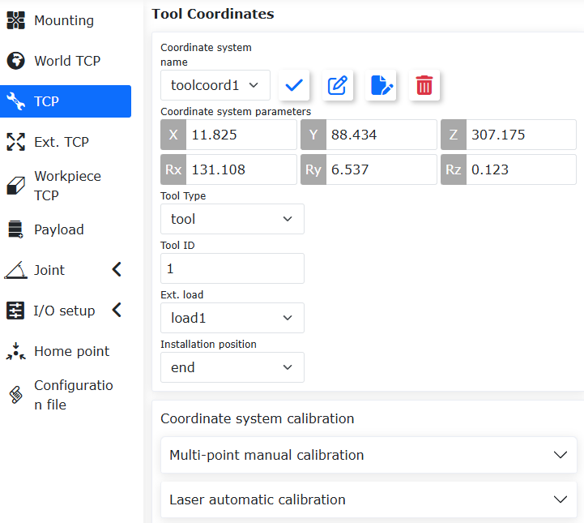

.. centered:: 图表 6.7-1 光电自动标定选择
 
进入“光电设备已配置”内容中，进行IO触发信号的配置、设置示教中心点、设置偏移参数，然后点击“运行”即可标定传感器的坐标系，后续将标定结果手动应用到工件坐标系中。

.. image:: base/035.png
   :width: 4in
   :align: center

.. centered:: 图表 6.7-2 标定传感器坐标系

**Step3**：标定工具坐标系。通过Step2已经得到精确的工件坐标系并应用，并且知道碰撞前的工具坐标系并应用：先点击“初始设置”-“工具坐标”，应用工具坐标系0，然后点击碰撞前的工具坐标系（以坐标系1为例）的“坐标系标定”按钮，再点击“应用”，然后选择“光电自动标定功能”，在“光电校准参数已配置”中设置校准参数。

.. image:: base/036.png
   :width: 4in
   :align: center

.. centered:: 图表 6.7-3 光电自动标定校准参数设置
 
设置完成后，点击“完成”按钮返回上一级菜单，然后点击“校准”按钮进行TCP的标定，待标定结束后，点击“保存”按钮对标定结果进行保存。

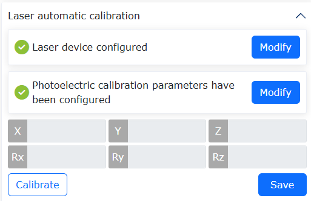

.. centered:: 图表 6.7-4 光电自动标定校准与保存

基于平板工具的TCP标定
-----------------------------------

概述
~~~~~~~~~

使用“四点法”进行工具的TCP标定时，需要手动控制机器人运动，并通过肉眼实现点与点的精确重合，标定效率和精度都受操作人员熟练度的影响。

基于平板工具的TCP标定原理如下：利用机器人工具与平板任意位置多次触碰，并通过建立标定模型以求解工具的TCP。整个标定过程自动完成，可提高标定的效率和减少对人工的依赖。

基于平板工具的TCP标定功能操作流程
~~~~~~~~~~~~~~~~~~~~~~~~~~~~~~~~~~~~

固定标定平板于机器人作业空间内，平板不可有晃动，且平板的导电性要好，将工具末端近似垂直标定板，并位于平板上方50mm处。

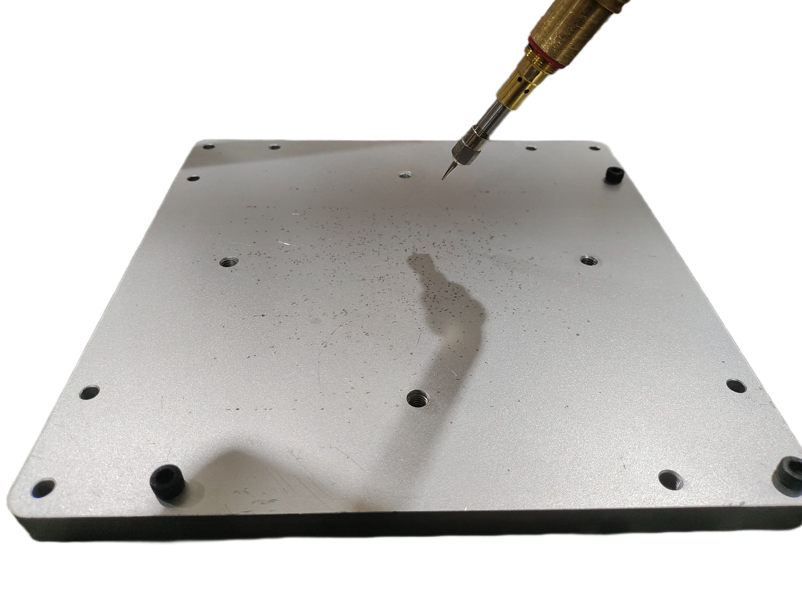

.. centered:: 图表 6.8‑1 标定布局示意

依次点击“示教程序”—“程序编程”按钮，选择“FR_CalibrateTheToolTcpPlane.lua”标定文件并打开。

.. image:: base/044.png
   :width: 4in
   :align: center

.. centered:: 图表 6.8‑2 打开标定文件

依次点击“初始设置”->“基础”->“坐标系”—“工具”按钮，会进入“当前坐标系”界面。在“坐标系名称”中选择要进行标定的坐标系（以toolcord1坐标系为例），点击“修改”按钮，即可进入TCP标定方法选择界面。

.. image:: base/001.png
   :width: 4in
   :align: center

.. centered:: 图表 6.8‑3 工具坐标系设置

在“修改向导”中，选择“平板工具标定”，即可进入平板工具标定界面。

.. image:: base/045.png
   :width: 4in
   :align: center

.. centered:: 图表 6.8‑4 标定方法选择

在“平板工具标定”界面中，点击“进入”按钮，可以进行平板工具配置，点击“记录”按钮，记录标定参考点。配置完成后，点击“完成”按钮，将会返回“平板工具标定”界面。

.. image:: base/046.png
   :width: 4in
   :align: center

.. centered:: 图表 6.8‑5 平板工具配置

在“平板工具标定”界面点击“运行”按钮，机器人将自动进行工具的TCP标定，标定完成后，将显示工具的TCP坐标，点击“保存”按钮，会将标定结果返回到“当前工具坐标系”界面中。

.. image:: base/047.png
   :width: 4in
   :align: center

.. centered:: 图表 6.8‑6 标定结果

在“当前工具坐标系”界面点击“应用”按钮，即可保存工具的TCP标定结果并应用。

.. image:: base/048.png
   :width: 4in
   :align: center

.. centered:: 图表 6.8‑7 标定结果应用

控制箱模拟量反馈电弧跟踪功能
--------------------------------------------------------------

概述
~~~~~~~~~~~~~~~~

控制箱模拟量反馈电弧跟踪功能采集焊机电压、电流模拟信号实现电弧跟踪补偿，功能的实现由配置控制箱模拟量对应的AI、AO通道完成。

.. image:: base/059.png
   :width: 4in
   :align: center

.. centered:: 图表 6.9‑1 基于模拟信号通信的电弧跟踪功能拓扑图
.. centered:: a表示计算机；b表示机器人及控制箱；c表示焊机

控制箱模拟量AI配置流程
~~~~~~~~~~~~~~~~~~~~~~~~~~~~~~~~~~~~~~~~~~~~~~~~~~~~~~~~~~~~

在机器人Web控制界面，依次点击“初始设置”->“基础”->“I/O设置”->“AI”，进入“AI配置”界面。

在“AI配置”界面的“电弧跟踪通道”栏，在“焊接电流控制AI”和“焊接电压控制AI”下拉框，分别选择“Ctrl-AI0”和“Ctrl-AI1”作为电流、电压的模拟量通道，分别点击“配置”，完成控制箱模拟量AI配置。

.. image:: base/060.png
   :width: 3in
   :align: center

.. centered:: 图表 6.9‑2 AI通道配置

在上图所示AI通道配置中的“模拟量电流电压关系图”栏，“A-V”和“V-V”界面的参数配置，需参考所使用的焊机模拟量接收与输出表/图。

例如，配置控制箱电流模拟量AI的焊接电流的下限与上限分别为0A和500A；配置控制箱电流模拟量AI的输出电压的下限与上限分别为0V和5V，作为AI通道配置中的“模拟量电流电压关系图”栏的“A-V”界面的配置参数，点击“配置”，完成配置控制箱模拟量电流AI通道。

.. image:: base/061.png
   :width: 3in
   :align: center

.. centered:: 图表 6.9‑3 控制箱模拟量电流AI配置

例如，配置控制箱电压模拟量AI的焊接电压的下限与上限分别为0V和50V；配置控制箱电压模拟量AI的输出电压的下限与上限分别为1.018V和10V，作为AI通道配置中“模拟量电流电压关系图”栏的“V-V”界面的配置参数，点击“配置”，完成配置控制箱模拟量电压AI通道。

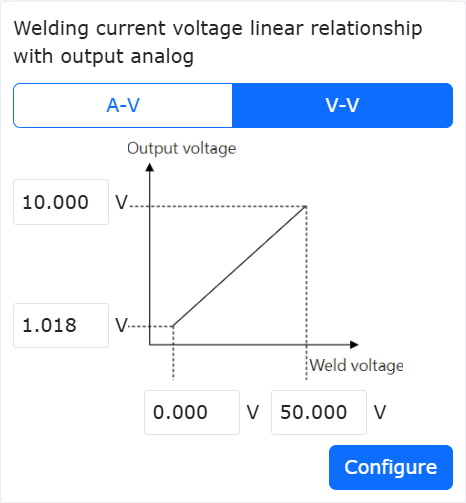

.. centered:: 图表 6.9‑4 控制箱模拟量电压AI配置

控制箱模拟量AO配置流程
~~~~~~~~~~~~~~~~~~~~~~~~~~~~~~~~~~~~~~~~~~~~~~~~~~~~~~~~~~~~~

在机器人Web控制界面，依次点击“初始设置”->“外设”->“焊机”，进入“焊机配置”界面。

.. image:: base/063.png
   :width: 6in
   :align: center

.. centered:: 图表 6.9‑5 焊机配置

在“焊机配置”界面“焊接功能I/O配置”栏，“DI”和“DO”界面的参数配置，可以自定义配置控制箱CI、CO通道；在“控制类型”下拉框中选择“控制器I/O”，进入配置控制器模拟量AO通道流程。

在“焊机配置”界面“模拟量电流电压关系图”栏，“A-V”和“V-V”界面的参数配置，需参考所使用的焊机模拟量接收与输出表/图。

例如，配置控制箱电流模拟量AO的焊接电流的下限与上限分别为0A和495A；配置控制箱电流模拟量AO的输出电压的下限与上限分别为1V和10V，作为控制箱AO通道配置中模拟量电流的配置参数，
并在“焊机电流控制AO”下拉框中选择“Ctrl-AO0”，点击“配置”，完成配置控制箱模拟量电流AO通道。

.. image:: base/064.png
   :width: 3in
   :align: center

.. centered:: 图表 6.9‑6 控制箱模拟量电流AO配置

例如，配置控制箱电压模拟量AO的焊接电压的下限与上限分别为10V和45V；配置控制箱电压模拟量AO的输出电压的下限与上限分别为1V和10V，作为控制箱AO通道配置中模拟量电压的配置参数。

并在“焊机电压控制AO”下拉框中选择“Ctrl-AO1”，点击“配置”，完成配置控制箱模拟量电压AO通道。

.. image:: base/065.png
   :width: 3in
   :align: center

.. centered:: 图表 6.9‑7 控制箱模拟量电压AO配置

直线齿条导轨碰撞检测
----------------------------------------------------------------------

概述
~~~~~~~~~~~~~~~~

直线齿条导轨碰撞检测功能用于实现在异步或同步运行时，导轨或机器人与环境物体发生碰撞时的报警并紧急停机。通过监控导轨转矩反馈变化情况，基于设定阈值判断是否发生碰撞，若发生则导轨立即停止运动，从而避免导轨及机器人对被撞物体施加持续力，可进一步提升人机协作安全性。

直线齿条导轨碰撞检测功能
~~~~~~~~~~~~~~~~~~~~~~~~~~~~~~~~~~~~~~~~~~~~~~~~~~~~

直线齿条导轨碰撞检测功能，需要在导轨激活后执行“Rail_Adaptation_Pro-gram.lua”程序，确保功能可以适配不同的到导轨及带载情况，从而获取最佳的碰撞检测性能。若未进行适配，则碰撞检测性能将明显下降，且触发碰撞的外力较大。

直线齿条导轨参数设置并使能
+++++++++++++++++++++++++++++++++++++++++++++++++++++++++++++

**Step1**：登录web界面，依次点击“初始设置”→“外设”→“扩展轴”，进入扩展轴坐标系设置模块，见图所示。

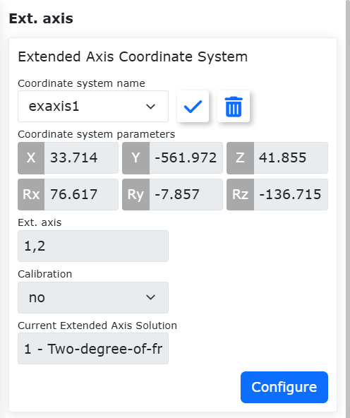

.. centered:: 图表 6.10‑1 扩展轴坐标系设置模块

**Step2**：基于扩展轴与机器人的实际工作情况，进行参数设置并按需进行标定。在图中，点击编辑，扩展轴坐标系名称设置为“exaxis1”，方案选择为“0-单自由度直线滑轨”，扩展轴编号选择为“1”。若导轨与机器人仅异步运行，则可不进行标定，若需同步运行，则必须进行标定，标定流程可参考相应用户手册或询问专业人员。当参数设置完后，点击“保存”，并应用相应坐标系，具体见图2-2所示。

.. image:: base/079.png
   :width: 4in
   :align: center

.. centered:: 图表 6.10‑2 扩展轴坐标系参数设置

**Step3**：建立扩展轴与机器人的UDP通讯，并确保扩展轴PLC程序可将扩展轴驱动电机经减速器后的转矩反馈数据回传至机器人控制器。依次点击“初始设置”→“外设”→“扩展轴”，进入UDP通讯配置页面，选择Step2中设置的坐标系并应用，点击UDP通讯配置“编辑”图标，进行通讯配置并加载。其中，PLC和笔记本电脑IP地址需与控制器网段一致，具体可见图2-3所示。需要注意地是，需要确保扩展轴PLC程序可将扩展轴驱动电机经减速器后的转矩反馈数据回传至机器人控制器，且采样周期尽可能为1ms，最大不能超过4ms，否则碰撞检测功能将失效。

.. image:: base/080.png
   :width: 4in
   :align: center

.. centered:: 图表 6.10‑3 UDP通讯配置页面

**Step4**：进行UDP扩展轴参数设置。UDP扩展轴参数设置页面见图2-4所示，轴类型选择为“直线导轨”，轴方向为“正”，其余参数需按实际情况进行配置。其中，导程和编码器分辨率是固定不变的，受导轨影响；运行速度和加速度的上限受电机性能影响，本功能测试所用上限即图2-4中所示，用户进行不同上限的配置时请联系专业人员。

.. image:: base/081.png
   :width: 4in
   :align: center

.. centered:: 图表 6.10‑4 UDP扩展轴参数设置

**Step5**：使能直线齿条导轨，并移动导轨至起点。通过图2-4中“去除使能”按钮或图2-5中的“伺服使能”按钮使能直线齿条导轨。若导轨上滑块远离起点，则可通过“反向转动”或“正向转动”将滑块移动至起点（需要注意的是，运行速度需要远离15%）。当移动到起点后，然后点击“零点设置”并以“当前位置回零”方式进行回零。

.. image:: base/082.png
   :width: 4in
   :align: center

.. centered:: 图表 6.10‑4 使能直线齿条导轨并移动
 
启用直线齿条导轨碰撞检测功能
+++++++++++++++++++++++++++++++++++++++++++++++++++++++++++++

**Step1**：确保导轨及机器人安装方式均为正装。在开启直线齿条导轨碰撞检测功能前，需要检查安装方式是否为正装。具体地，先确保导轨和机器人安装方式为正装，然后，依次点击“初始设置”→“基础”→“安装”，进入自由安装页面，若“基座旋转”和“基座倾斜”均为0则软件设置为正装，否则须将其改为0，若不为0界面将提示错误，具体见图2-6所示。

.. image:: base/083.png
   :width: 6in
   :align: center

.. centered:: 图表 6.10‑6 若安装方式非正装，将提示错误

**Step2**：启用直线齿条导轨碰撞检测功能并设置参数。依次点击“初始设置”→“基础”→“关节”→“碰撞等级”，进入碰撞等级设置页面。点击“直线齿条导轨碰撞检测”功能滑块后，设置齿轮半径及滑块质量，其中齿轮半径可由导程和减速比计算得到，滑块质量不包括机器人及其携带的末端负载。导轨等级共11个选项，其中Level1最易触发碰撞，Level10则最难。控制器刚上电，未执行适配程序前，碰撞等级先设置为“关闭”。

.. image:: base/084.png
   :width: 4in
   :align: center

.. centered:: 图表 6.10‑7 直线齿条导轨碰撞检测功能

**Step3**：执行“Rail_Adaptation_Program.lua”程序，从而适配当前导轨。控制器重启后，均需执行“Rail_Adaptation_Program.lua”程序（目的是防止机器人类型等因素发生变更时影响导轨动态特性）。在执行程序前，需确保导轨碰撞等级为“关闭”，自动模式下，以界面速度100%运行lua程序，待程序执行一个循环后适配完成，可停止运行。

.. image:: base/085.png
   :width: 5in
   :align: center

.. centered:: 图表 6.10‑8 执行“Rail_Adaptation_Program.lua”程序，从而适配当前导轨

**Step4**：合理设置导轨碰撞等级并执行任务。用户可根据电机驱动器性能及任务运行速度合理设置导轨碰撞等级。若导轨与机器人为异步运行，当碰撞机器人或导轨时可触发“8轴碰撞故障，可复位”，此时，导轨停止运行，具体见图2-9所示。若导轨与机器人为同步运行时，碰撞机器人可触发报警，并使得导轨停止运行，机器人则按设置碰撞策略进行反应。

.. image:: base/086.png
   :width: 4in
   :align: center

.. centered:: 图表 6.10‑9 导轨触发碰撞故障

力传感器带载校零及开放姿态顺应的导纳参数
------------------------------------------------------------------------------------------

概述
~~~~~~~~~~~~~~~~

力传感器带载校零功能是用于实现机器人带着快换头，在不拆除快换头情况，更换负载时可快速清除传感器的零漂数据：开放姿态顺应时的导纳参数，用于客户根据恒力控制中实际力矩的大小进行姿态的调节。

力传感器带载校零
~~~~~~~~~~~~~~~~~~~~~~~~~~~~~~~~

**Step1**：安装并激活力传感器。在“初始设置”->“外设”->“力传感器”的菜单栏下，点击“已适配设备”进入配置界面。力传感器配置完成后，选择配置完成的力传感器编号，点击“复位”按钮，页面弹出命令发送成功后，再点击“激活”按钮，可查看力传感器信息表中的激活状态，来判断是否激活成功；此外，力传感器会有初始值，用户根据使用需求选择“零点矫正”和“去除零点”，如图所示。力传感器零点矫正需要确保力传感器水平竖直向下，且传感器下未配置负载。

.. image:: base/087.png
   :width: 4in
   :align: center

.. centered:: 图表 6.11‑1 力传感器配置信息

**Step2**：力传感器负载辨识。在“初始设置”->“基础”->“负载”菜单栏下，点击“自动辨识”，进入力/扭矩传感器负载界面。进行传感器自动校零，记录初始位置后，切换机器人为自动模式，点击“自动校零”，如图2-2所示。

.. image:: base/088.png
   :width: 4in
   :align: center

.. centered:: 图表 6.11‑2 力传感器负载辨识

**Step3**：若力传感器末端实际负载拆换，在负载配置模块输入负载重量及质心坐标，点击“应用”更新负载配置并完成力传感器带载校零。

开放姿态顺应的导纳参数
~~~~~~~~~~~~~~~~~~~~~~~~~~~~~~~~~~~~~~~~~~~~~~~~~~~~~~~~~~~~~~~~

**Step1**：点击“初始设置”->“基础”-> “工具坐标”，进入工具坐标系设置界面，选择“坐标系名称”并设置末端工具对应的坐标系参数，如图3-1所示。

.. image:: base/089.png
   :width: 4in
   :align: center

.. centered:: 图表 6.11‑3 工具坐标系设置

**Step2**：点击“示教程序”->“程序编程”，编写恒力控制lua脚本，选择“力控集”->“Control”，添加力控运动指令，姿态顺应设置“开启”，设置惯性系数及阻尼系数，最大调整角度设置为姿态顺应角度的阈值，如图3-2所示。

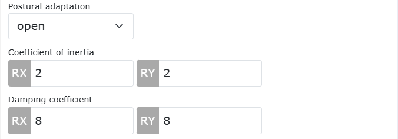

.. centered:: 图表 6.11‑4 开放姿态顺应的导纳参数

**Step3**：web界面点击“FT”，设置力传感器参考坐标系，选择参考坐标系为“自定义坐标系”并设置对应的坐标系参数为“0”，如图3-3所示。

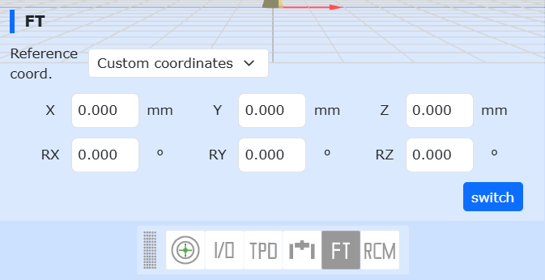

.. centered:: 图表 6.11‑4 设置力传感器的参考坐标系

**Step4**：运行脚本，查看姿态顺应效果，惯性参数调节加速度响应和抗扰能力，惯性越大，机器人迟滞越明显；阻尼系数影响姿态顺应时的平滑度，阻尼越大，姿态顺应越困难。