Programação de Programa
==============================

.. toctree:: 
   :maxdepth: 6

Introdução
~~~~~~~~~~~~~~~~~~~

Clicar nos comandos à esquerda adiciona nós de programa à árvore do programa. Durante a execução do programa, o nó do programa em execução é destacado em verde.

No modo manual, clicar no primeiro ícone à direita de um nó faz com que o robô execute essa instrução individualmente. O segundo ícone serve para editar o conteúdo do nó.

.. image:: coding/001.png
   :width: 6in
   :align: center

.. centered:: Figura 9.1-1 Interface da Árvore do Programa

Clicar em "⇄" alterna o modo, permitindo que o texto do programa de ensino se torne editável.

.. image:: coding/002.png
   :width: 6in
   :align: center

.. centered:: Figura 9.1‑2 Estado de Edição do Programa de Ensino

A descrição dos ícones à direita do nome do programa é a seguinte:

.. note:: 
   .. image:: coding/003.png
      :height: 0.75in
      :align: left

   Nome: **Expandir/Reduzir**
   
   Função: Expandir/reduzir a interface da árvore do programa

.. note:: 
   .. image:: coding/004.png
      :height: 0.75in
      :align: left

   Nome: **Adicionar Ponto de Ensino**
   
   Função: Adicionar um ponto de ensino local ao programa atual

.. note:: 
   .. image:: coding/005.png
      :height: 0.75in
      :align: left

   Nome: **Renomear**
   
   Função: Renomear o programa atual

Barra de Ferramentas
~~~~~~~~~~~~~~~~~~~~~~~~~~~~

Use a barra de ferramentas na parte superior da árvore do programa para modificá-la.

.. note:: 
   .. image:: coding/006.png
      :height: 0.75in
      :align: left

   Nome: **Abrir**
   
   Função: Abrir um arquivo de programa de usuário

.. note:: 
   .. image:: coding/007.png
      :height: 0.75in
      :align: left

   Nome: **Novo**
   
   Função: Criar um novo arquivo de programa a partir de um modelo
   
.. note:: 
   .. image:: coding/008.png
      :height: 0.75in
      :align: left

   Nome: **Importar**
   
   Função: Importar um arquivo para a pasta de programas do usuário

.. note:: 
   .. image:: coding/009.png
      :height: 0.75in
      :align: left

   Nome: **Exportar**
   
   Função: Exportar um arquivo de programa do usuário para o computador local

.. note:: 
   .. image:: coding/010.png
      :height: 0.75in
      :align: left

   Nome: **Salvar**
   
   Função: Salvar o conteúdo editado do arquivo

.. note:: 
   .. image:: coding/011.png
      :height: 0.75in
      :align: left

   Nome: **Salvar Como**
   
   Função: Renomear o arquivo e salvá-lo na pasta de programas do usuário ou programas modelo

.. note:: 
   .. image:: coding/012.png
      :height: 0.75in
      :align: left

   Nome: **Copiar**
   
   Função: Copiar um nó, permitindo usá-lo para outras operações (por exemplo, colá-lo em outra posição na árvore do programa)

.. note:: 
   .. image:: coding/013.png
      :height: 0.75in
      :align: left

   Nome: **Colar**
   
   Função: Permite colar um nó previamente cortado ou copiado

.. note:: 
   .. image:: coding/014.png
      :height: 0.75in
      :align: left

   Nome: **Recortar**
   
   Função: Recortar um nó, permitindo usá-lo para outras operações (por exemplo, colá-lo em outra posição na árvore do programa)

.. note:: 
   .. image:: coding/015.png
      :height: 0.75in
      :align: left

   Nome: **Excluir**
   
   Função: Excluir um nó da árvore do programa

.. note:: 
   .. image:: coding/016.png
      :height: 0.75in
      :align: left

   Nome: **Mover para Cima**
   
   Função: Mover o nó para cima

.. note:: 
   .. image:: coding/017.png
      :height: 0.75in
      :align: left

   Nome: **Mover para Baixo**
   
   Função: Mover o nó para baixo

.. note:: 
   .. image:: coding/018.png
      :height: 0.75in
      :align: left

   Nome: **Alternar Modo de Edição**
   
   Função: Alternar entre o modo de árvore de programa e o modo de edição Lua

Os ícones no canto superior direito são descritos a seguir:

.. note:: 
   .. image:: coding/240.png
      :height: 0.75in
      :align: left

   Nome: **Adicionar/Editar Programação de Programas**
   
   Função: Adicionar/editar o conteúdo do comando do programa atual

.. note:: 
   .. image:: coding/245.png
      :height: 0.75in
      :align: left

   Nome: **Ponto de Ensino Local**
   
   Função: Pontos de ensino que se aplicam apenas ao programa atual

.. note:: 
   .. image:: coding/242.png
      :height: 0.75in
      :align: left

   Nome: **Interface de Subprograma NewDofile**
   
   Função: Quando o comando do programa atual contém uma instrução NewDofile, clique para entrar e selecionar o nome do subprograma para visualizar seu conteúdo.

.. note:: 
   .. image:: coding/244.png
      :height: 0.75in
      :align: left

   Nome: **Backup do Programa de Ensino Atual**
   
   Função: Registra as modificações feitas no programa atual

.. note:: 
   .. image:: coding/602.png
      :height: 0.75in
      :align: left

   Nome: **Log de Impressão**
   
   Função: Saída de informações especificadas para a janela de impressão do WebApp para facilitar a depuração e o rastreamento de dados

.. note:: 
   .. image:: coding/241.png
      :height: 0.75in
      :align: left

   Nome: **Modelo do Robô**
   
   Função: Retornar à interface do modelo 3D do robô

.. note:: 
   .. image:: coding/596.png
      :height: 0.75in
      :align: left

   Nome: **Depuração de Rede Socket**
   
   Função: Interface de depuração de comunicação em rede

.. note:: 
   .. image:: coding/243.png
      :height: 0.75in
      :align: left

   Nome: **Configurações Modbus TCP**
   
   Função: Configurar os parâmetros de comunicação Modbus TCP

.. note:: 
   .. image:: coding/597.png
      :height: 0.75in
      :align: left

   Nome: **Configurações Modbus RTU**
   
   Função: Configurar os parâmetros de comunicação Modbus RTU

.. note:: 
   .. image:: coding/598.png
      :height: 0.75in
      :align: left

   Nome: **Gerenciamento de Programas em Segundo Plano**
   
   Função: Configurar a interface de programas em segundo plano

.. note:: 
   .. image:: coding/599.png
      :height: 0.75in
      :align: left

   Nome: **Gerenciamento de Variáveis do Usuário**
   
   Função: Configurar a interface de variáveis do usuário

.. note:: 
   .. image:: coding/600.png
      :height: 0.75in
      :align: left

   Nome: **Pontos de Ensino**
   
   Função: Configurar a interface de pontos de ensino

.. note:: 
   .. image:: coding/601.png
      :height: 0.75in
      :align: left

   Nome: **Configuração do Programa Principal**
   
   Função: Configurar o programa principal

Comandos do Programa
~~~~~~~~~~~~~~~~~~~~~~~

O lado esquerdo é usado principalmente para adicionar comandos de programa. Clique no ícone acima de cada palavra-chave para entrar na interface detalhada de adição de comandos do programa. As operações para adicionar comandos de programa ao arquivo são divididas principalmente em dois tipos:

- 1. Abra a instrução relevante e clique no botão "Aplicar" para adicionar a instrução ao programa.
- 2. Clique primeiro no botão "Adicionar". Neste momento, o comando ainda não foi salvo no arquivo de programa. É necessário clicar em "Aplicar" para salvar o comando no arquivo.

O segundo tipo aparece frequentemente em situações onde várias instruções do mesmo tipo são emitidas. Para esse tipo de comando, adicionamos um botão "Adicionar" e uma função para exibir o conteúdo das instruções já adicionadas. Clicar no botão "Adicionar" adiciona uma instrução. As instruções adicionadas são exibidas. Clicar em "Aplicar" salva as instruções adicionadas no arquivo aberto à direita.

Interface de Instruções Lógicas
~~~~~~~~~~~~~~~~~~~~~~~~~~~~~~~~~~~~~

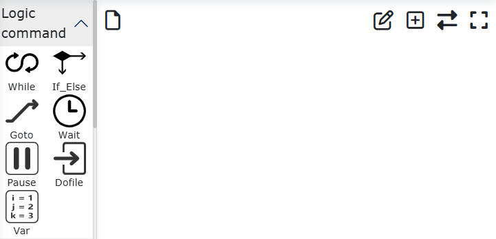

.. centered:: Figura 9.4 Interface de Instruções Lógicas

Comandos de Loop
++++++++++++++++++++++++++++++

Clique no ícone "Loop" para entrar na interface de edição do comando While.

Selecione o cenário de loop para o comando While, os cenários são os seguintes:

- Loop infinito
- Loop com número finito de vezes: Insira o número de iterações e o nome da variável
- Loop enquanto a expressão for verdadeira: Clique na caixa de entrada para abrir o editor de expressões e selecione a expressão apropriada de acordo com o caso de uso

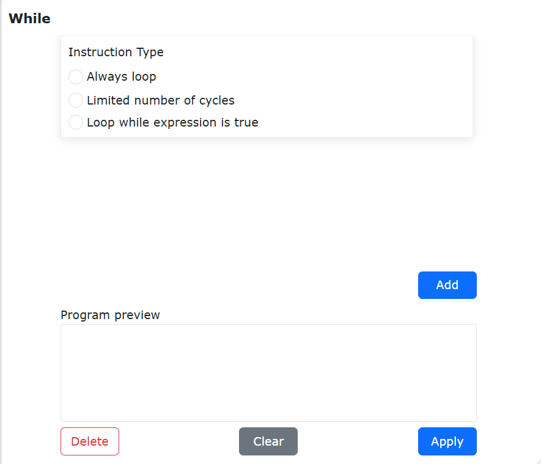

.. centered:: Figura 9.4-1-1 Interface da Instrução While

.. image:: coding/236.png
   :width: 6in
   :align: center

.. centered:: Figura 9.4-1-2 Instrução While — Loop Infinito

.. image:: coding/237.png
   :width: 6in
   :align: center

.. centered:: Figura 9.4-1-3 Instrução While — Loop com Número Finito de Vezes

.. image:: coding/238.png
   :width: 6in
   :align: center

.. centered:: Figura 9.4-1-4 Instrução While — Editor de Expressões

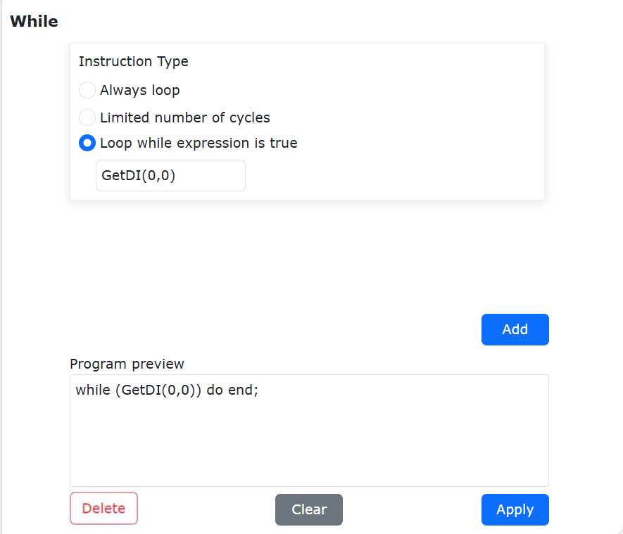

.. centered:: Figura 9.4-1-5 Instrução While — Loop enquanto a Expressão for Verdadeira

Para facilitar a operação, você pode inserir qualquer conteúdo 'do' e editar outras instruções para substituir no programa.

Comandos de Condição
++++++++++++++++++++++++++++++

Clique no botão "Condição" para entrar na interface de edição do comando if…else.

Este comando inclui os seguintes botões:

- Adicionar else if: Quando não houver expressão "else", clique neste botão para adicionar uma expressão "else if"
- Remover else if: Quando houver uma expressão "else if", clique neste botão para removê-la
- Adicionar else: Clique neste botão para adicionar uma expressão "else"
- Remover else: Clique neste botão para remover a expressão "else"

Após clicar no botão correspondente para adicionar, clique na caixa de entrada para abrir o editor de expressões e selecione a expressão apropriada de acordo com o caso de uso. Após concluir a adição, clique em "Adicionar" e "Aplicar".

Esta instrução requer algum conhecimento básico de programação. Se precisar de ajuda, entre em contato conosco.

.. image:: coding/021.png
   :width: 6in
   :align: center

.. centered:: Figura 9.4-2 Interface da Instrução if…else

Comandos de Desvio
+++++++++++++++++++++++

Clique no botão "Desvio" para entrar na interface de edição do comando Goto.

A instrução Goto é uma instrução de desvio. Insira a instrução na caixa de entrada à direita. Após a edição, clique em "Adicionar" e "Aplicar". (Esta instrução requer algum conhecimento básico de programação. Se precisar de ajuda, entre em contato conosco.)

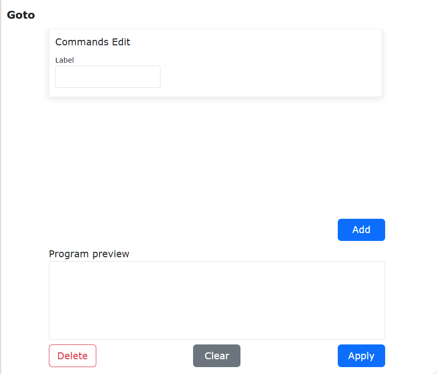

.. centered:: Figura 9.4-3 Interface da Instrução Goto

Comandos de Espera
++++++++++++++++++++++++++++++

Clique no ícone "Espera" para entrar na interface de edição do comando Wait.

Esta instrução é uma instrução de atraso, dividida em três partes: "WaitMs", "WaitDI" e "WaitAI".

A instrução "WaitTime" atrasa a execução por um período de tempo em milissegundos. Insira o número de milissegundos a serem aguardados e clique em "Adicionar" e "Aplicar".

.. image:: coding/023.png
   :width: 6in
   :align: center

.. centered:: Figura 9.4-4 Interface da Instrução WaitTime

A instrução "WaitDI" é uma espera por um único DI. Selecione o número da porta IO a ser aguardada, o estado de espera, o tempo máximo de espera e o método de tratamento de tempo limite. Clique em "Adicionar" e "Aplicar".

.. image:: coding/024.png
   :width: 6in
   :align: center

.. centered:: Figura 9.4-5 Interface da Instrução WaitDI

A instrução "WaitMultiDI" é uma espera por múltiplos DIs. Primeiro, selecione a condição para os múltiplos DIs. Em seguida, marque as portas DI e os estados a serem aguardados. Finalmente, defina o tempo máximo de espera e o método de tratamento de tempo limite. Clique em "Adicionar" e "Aplicar".

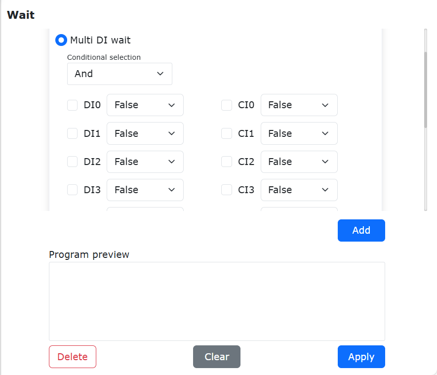

.. centered:: Figura 9.4-6 Interface da Instrução WaitMultiDI

A instrução "WaitAI" seleciona o valor analógico, o valor numérico, o tempo máximo de espera e o método de tratamento de tempo limite a serem aguardados. Clique em "Adicionar" e "Aplicar".

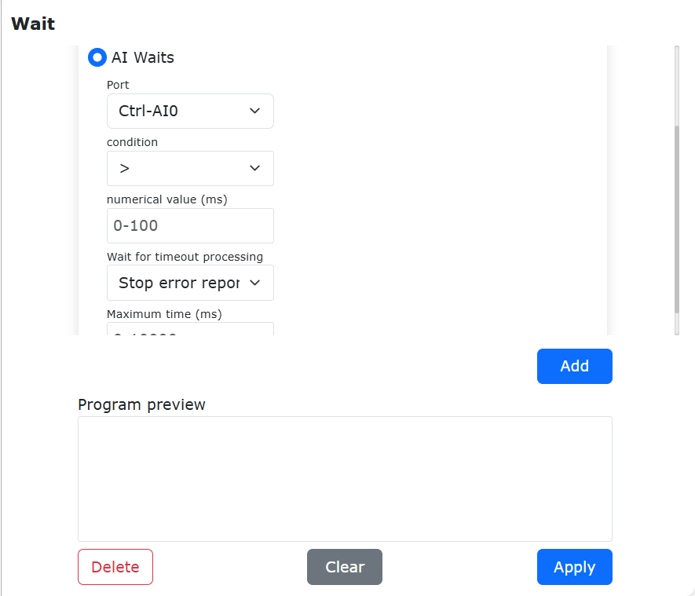

.. centered:: Figura 9.4-7 Interface da Instrução WaitAI

Comandos de Pausa
+++++++++++++++++++++++

Clique no ícone "Pausa" para entrar na interface de edição do comando Pause.

Esta instrução é uma instrução de pausa. Quando inserida no programa e executada, o robô entra em estado de pausa. Para continuar a execução, clique no botão "Pausa/Continuar" na área de controle.

.. image:: coding/027.png
   :width: 6in
   :align: center

.. centered:: Figura 9.4-8 Interface da Instrução Pause

Comandos de Subprograma
++++++++++++++++++++++++++++++

Clique no ícone "Subprograma" para entrar na interface de edição do comando Dofile.

A instrução Dofile chama programas internos do controlador. Para usar a instrução Dofile, é necessário salvar o subprograma chamado. Se o programa principal não for alterado, não precisa ser salvo novamente. A instrução Dofile suporta chamadas de segundo nível. É necessário prestar atenção a duas configurações de parâmetros: um é em que nível a chamada está, e o outro é o número de identificação (ID) da chamada. Em princípio, o mesmo programa não pode ter o mesmo ID.

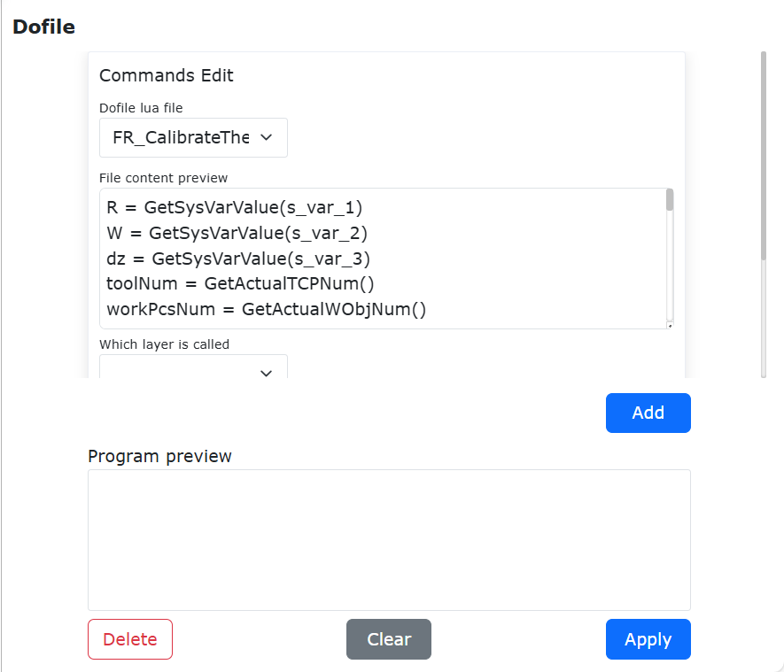

.. centered:: Figura 9.4-9 Interface da Instrução Dofile

Comandos de Variáveis
++++++++++++++++++++++++++++++

Clique no ícone "Variável" para entrar na interface de edição do comando Var.

Esta instrução é uma instrução do sistema de variáveis. Ela é dividida em duas partes: definição de variável Lua, consulta de variável, e renomeação, obtenção de valor e definição de valor para variáveis do sistema. A definição de variável Lua pode declarar uma variável e atribuir um valor inicial, usada em conjunto com instruções como while e if-else. A instrução de consulta de variável Lua pode consultar em tempo real o valor do nome da variável inserido e exibi-lo na barra de status. O número de variáveis do sistema é fixo. Elas podem ser renomeadas, ter seus valores obtidos e definidos. O valor armazenado por essa variável não é apagado quando o sistema é desligado.

.. image:: coding/029.png
   :width: 6in
   :align: center

.. centered:: Figura 9.4-10 Interface da Instrução Var

.. important:: Os nomes das variáveis devem começar com uma letra ou sublinhado (_), não podem começar com um número ou outros caracteres especiais.

Interface de Instruções de Movimento
~~~~~~~~~~~~~~~~~~~~~~~~~~~~~~~~~~~~~~~~~~~~~~~~~~~~

.. image:: coding/030.png
   :width: 6in
   :align: center

.. centered:: Figura 9.5 Interface de Instruções de Movimento

Comando Ponto a Ponto
++++++++++++++++++++++++++++++

Clique no ícone "Ponto a Ponto" para entrar na interface de edição do comando PTP.

É possível selecionar o ponto de destino. A configuração do tempo de transição suave permite que o movimento deste ponto para o próximo seja contínuo. Há uma opção para deslocamento, podendo ser baseado no sistema de coordenadas base ou no sistema de coordenadas da ferramenta. Uma janela será aberta para definir os deslocamentos em x, y, z, rx, ry, rz. O caminho específico do PTP é a trajetória ótima planejada automaticamente pelo controlador de movimento. Clique em "Adicionar" e "Aplicar" para salvar a instrução.

.. image:: coding/031.png
   :width: 6in
   :align: center

.. centered:: Figura 9.5-1 Interface da Instrução PTP

Movimento Relativo Ponto a Ponto
******************************************
O robô se move uma distância relativa a partir da posição atual. Na página de adição de instrução PTP, selecione o nome do ponto como "CurrentPos", escolha o sistema de coordenadas de deslocamento como sistema de coordenadas base, sistema de coordenadas da ferramenta ou sistema de coordenadas da peça conforme necessário e insira o valor de deslocamento. O robô então realizará um movimento de deslocamento ao longo do sistema de coordenadas definido com base em sua posição atual. ("CurrentPos" é um ponto do sistema que não requer ensino)

.. image:: coding/515.png
   :width: 6in
   :align: center

.. centered:: Figura 9.5-1-1 Instrução de Movimento Relativo PTP

Clique no botão "Adicionar" e "Aplicar" para adicionar uma instrução de movimento relativo PTP ao programa Lua. Alterne o robô para o modo automático e clique no botão iniciar. No programa de exemplo, o robô se moverá 100 mm na direção X+ do sistema de coordenadas base a partir da posição atual.

.. image:: coding/516.png
   :width: 6in
   :align: center

.. centered:: Figura 9.5-1-2 Adição da Instrução de Movimento Relativo PTP

Comando Linear
++++++++++++++++

Clique no ícone "Linear" para entrar na interface de edição do comando Lin.

A função desta instrução é semelhante à instrução "PTP", mas o caminho do ponto de destino é uma linha reta.

.. image:: coding/032.png
   :width: 6in
   :align: center

.. centered:: Figura 9.5-2 Interface da Instrução Lin

Movimento Relativo Linear
******************************************
O robô se move linearmente uma distância relativa a partir da posição atual. Na página de adição de instrução LIN, selecione o nome do ponto como "CurrentPos", escolha o sistema de coordenadas de deslocamento como sistema de coordenadas base, sistema de coordenadas da ferramenta ou sistema de coordenadas da peça conforme necessário e insira o valor de deslocamento. O robô então realizará um movimento de deslocamento ao longo do sistema de coordenadas definido com base em sua posição atual. ("CurrentPos" é um ponto do sistema que não requer ensino)

.. image:: coding/517.png
   :width: 6in
   :align: center

.. centered:: Figura 9.5-2-1 Instrução de Movimento Relativo LIN

Clique no botão "Adicionar" e "Aplicar" para adicionar uma instrução de movimento linear relativo ao programa Lua. Alterne o robô para o modo automático e clique no botão iniciar. No programa de exemplo, o robô se moverá 100 mm na direção X+ do sistema de coordenadas base a partir da posição atual.

.. image:: coding/518.png
   :width: 6in
   :align: center

.. centered:: Figura 9.5-2-2 Adição da Instrução de Movimento Relativo LIN
 
O movimento linear relativo do robô suporta funções como suavização, velocidade física e busca de posição do arame.

.. important:: Quando o nome do ponto selecionado é "seamPos", o comando linear é usado em cenários de soldagem com sensor a laser. Devido aos erros de acúmulo durante o uso da soldagem, as opções "Habilitar Deslocamento" e "Valor do Deslocamento" foram adicionadas.

   **Habilitar Deslocamento**: Não, Deslocamento no Sistema de Coordenadas Base, Deslocamento no Sistema de Coordenadas da Ferramenta, Deslocamento com Base nos Dados Brutos do Laser;

   **Valor do Deslocamento**: ∆x, ∆y, ∆z, ∆rx, ∆ry, ∆rz, faixa: -300~300;

   .. image:: coding/033.png
      :width: 6in
      :align: center

   .. centered:: Figura 9.5-2-3 Interface da Instrução Lin (Cenário de Soldagem)

A instrução LIN permite selecionar o modo de velocidade de movimento como "Porcentagem" ou "Velocidade Física":

- Porcentagem: Insira a porcentagem da velocidade de teste. O robô se move de acordo com a porcentagem da velocidade máxima. A velocidade real do robô é calculada como: V = Velocidade Máxima do Robô × Porcentagem de Velocidade Global × Porcentagem da Velocidade de Teste. Passe o mouse sobre o pequeno ícone de olho ao lado da caixa de entrada "Velocidade de Teste" para exibir a velocidade física real (unidade: mm/s) do robô nos modos manual e automático com a velocidade de teste atual definida.

.. image:: coding/458.png
   :width: 5in
   :align: center

.. centered:: Figura 9.5-2-4 Exibição do valor da velocidade física real ao inserir a porcentagem

- Velocidade Física: A velocidade inserida é a velocidade real de operação do robô, unidade mm/s. A aceleração inserida é geralmente definida como o dobro da velocidade (a velocidade física máxima do comando LIN é limitada pela porcentagem de velocidade global. Se a velocidade máxima de operação do robô for 1000mm/s e a velocidade global for 50%, a velocidade física máxima do comando LIN será 1000 × 50% = 500mm/s).

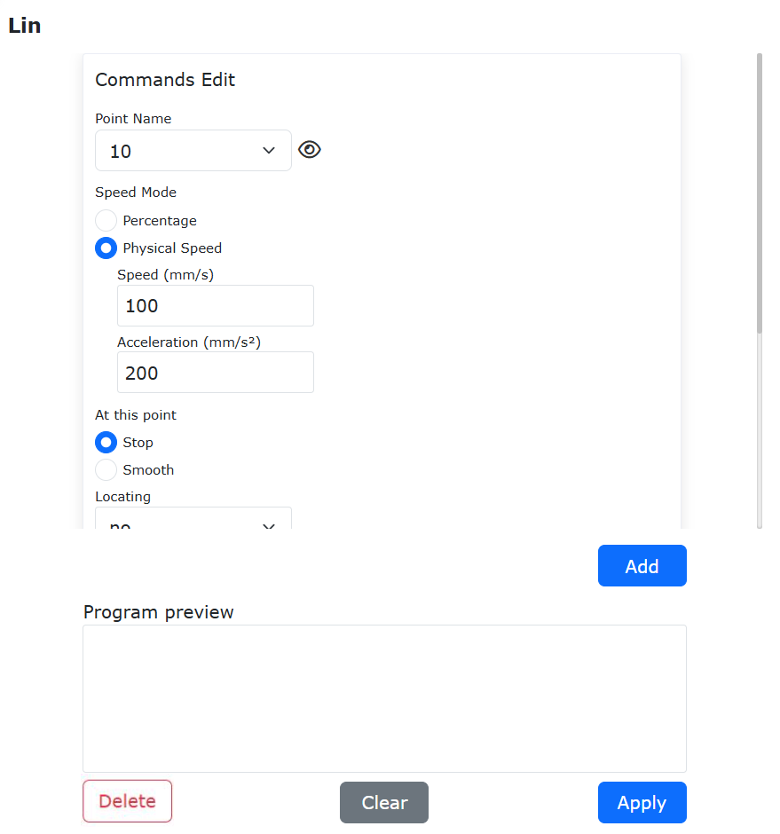

.. centered:: Figura 9.5-2-5 Inserção da velocidade física real

Função de Tratamento de Excesso de Velocidade das Juntas no Comando LIN
*******************************************************************************************

Ao usar a instrução de movimento linear no espaço cartesiano LIN, a condição de planejamento restrita é a velocidade linear. No entanto, a operação real é afetada pelo espaço de trabalho. Ao satisfazer a velocidade linear, a velocidade angular das juntas pode já ter excedido o limite. Esta função implementa estratégias de tratamento opcionais para lidar com situações de excesso de velocidade das juntas durante o movimento LIN.

**Passo 1**: Clique no botão de instrução de movimento linear;

.. image:: coding/034.png
   :width: 6in
   :align: center

.. centered:: Figura 9.5-3-1 Clicar no botão de instrução de movimento linear

**Passo 2**: Selecione o ponto de passagem alvo da instrução de movimento linear;

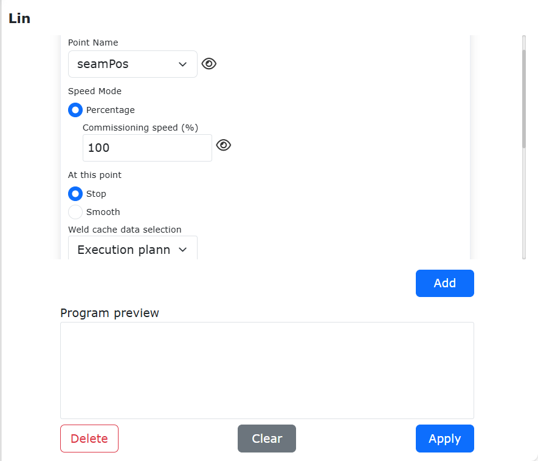

.. centered:: Figura 9.5-3-2 Selecionar o ponto de passagem alvo do movimento linear

**Passo 3**: Ative o interruptor de proteção contra excesso de velocidade das juntas;

.. image:: coding/036.png
   :width: 6in
   :align: center

.. centered:: Figura 9.5-3-3 Ativar o botão de proteção contra excesso de velocidade das juntas

**Passo 4**: Selecione a estratégia de tratamento para excesso de velocidade das juntas (selecionar erro por excesso de velocidade ou redução adaptativa de velocidade; outras opções são estratégias padrão sem proteção);

.. image:: coding/037.png
   :width: 6in
   :align: center

.. centered:: Figura 9.5-3-4 Estratégias de Tratamento para Excesso de Velocidade das Juntas

**Passo 5**:
   Defina a estratégia de tratamento e seus parâmetros. Clique no botão "Adicionar" para adicionar a instrução Lua;

   Sob a estratégia de redução adaptativa de velocidade, o limite de redução é a porcentagem de redução da velocidade linear em relação à velocidade linear definida. Quando o valor de redução excede o limite definido, o robô reporta um erro e para.

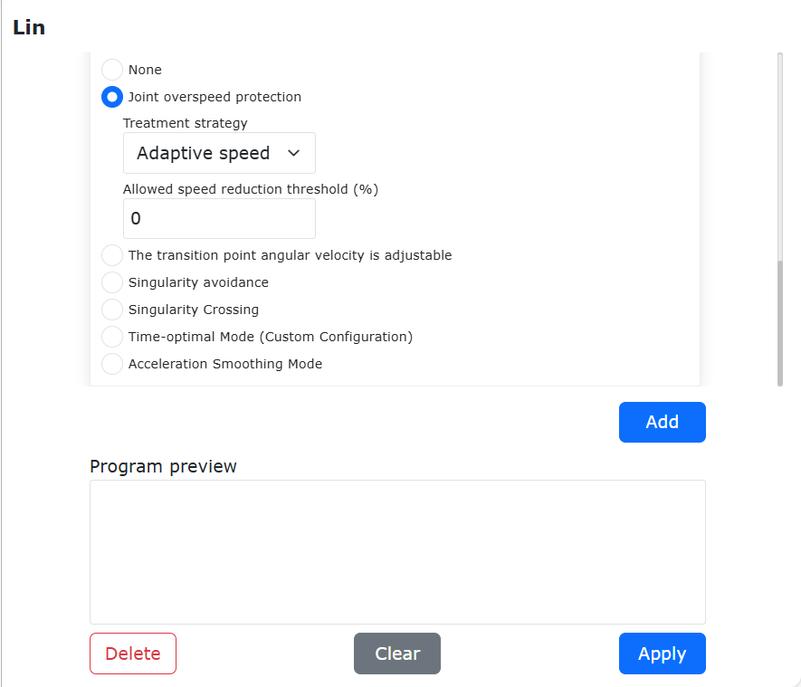

.. centered:: Figura 9.5-3-5 Seleção e Configuração da Estratégia de Tratamento para Excesso de Velocidade das Juntas

**Passo 6**: A instrução Lua adicionada tem o formato mostrado na figura;

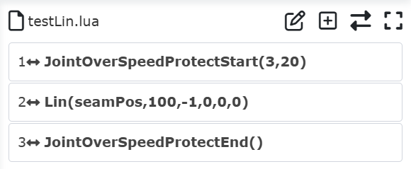

.. centered:: Figura 9.5-3-6 Instrução Lua

**Iniciar Proteção contra Excesso de Velocidade**: JointOverSpeedProtectStart(a, b);
   a: Número da estratégia (conforme a ordem da lista suspensa)
   b: Porcentagem do limite (0~100, só tem efeito na redução adaptativa de velocidade)

**Encerrar Proteção contra Excesso de Velocidade**: JointOverSpeedProtectEnd();

.. note:: Para a proteção de movimento "Atravessar Ponto Singular", consulte a explicação da função de atravessar ponto singular no modo automático.

Função de Ajuste da Velocidade Angular da Postura de Transição
***************************************************************************

Ao soldar peças que exigem soldagem de ângulo de canto ou quando um planejamento linear específico (com grande mudança de postura e pequena mudança de posição, mas onde a velocidade linear não pode ser aumentada para uma transição rápida) é necessário, esta função pode ser usada.

**Passo 1**: Defina o sistema de coordenadas da ferramenta e calibre as dimensões e a postura da tocha de solda.

.. note:: Os valores na interface são apenas exemplos; a configuração real deve ser baseada no estado da ferramenta.

.. image:: coding/246.png
   :width: 4in
   :align: center

.. centered:: Figura 9.5-3-7 Configuração do Sistema de Coordenadas da Ferramenta

**Passo 2**: Clique em "Programa de Ensino", selecione "Programação de Programa" e, na categoria "Instruções de Movimento", escolha "Linear".

.. image:: coding/032.png
   :width: 6in
   :align: center

.. centered:: Figura 9.5-3-8 Interface de Configuração da Instrução Linear

**Passo 3**: Defina o ponto inicial de cada segmento linear da soldagem de ângulo de canto como um ponto de transição. Ative o botão "Velocidade Angular do Ponto de Transição Ajustável" e defina a porcentagem máxima de aceleração (a velocidade angular máxima padrão de 100% é 360°/s).

.. image:: coding/248.png
   :width: 6in
   :align: center

.. centered:: Figura 9.5-3-9 Interface de Configuração do Ajuste da Velocidade Angular do Ponto de Transição

**Passo 4**: Clique no botão "Adicionar" para gerar uma instrução linear que inclui o ajuste da velocidade angular da postura de transição.

.. image:: coding/249.png
   :width: 6in
   :align: center

.. centered:: Figura 9.5-3-10 Adicionar Instrução de Movimento Linear com Ponto de Transição

**Passo 5**: O robô completa a transição de postura no ponto inicial e executa normalmente a instrução linear para se mover até o ponto final deste segmento. Desative o botão "Velocidade Angular do Ponto de Transição Ajustável" e adicione o ponto de passagem final.

.. image:: coding/250.png
   :width: 6in
   :align: center

.. centered:: Figura 9.5-3-11 Inserir Ponto Final Linear

**Passo 6**: Clique no botão "Aplicar" para gerar a instrução LUA correspondente.

.. image:: coding/251.png
   :width: 6in
   :align: center

.. centered:: Figura 9.5-3-12 Gerar Instrução Linear LUA com Ponto de Transição

Uma soldagem de ângulo de canto completa geralmente tem vários pontos de transição. No caso do ângulo de canto mostrado na Figura 7, há dois pontos de transição de postura durante o processo de soldagem onde a mudança de posição é pequena e a mudança de postura é grande.

O ponto 1 é o início da primeira seção de solda, o ponto 2 é o fim da primeira seção;
O ponto 3 é o início da segunda seção de solda, o ponto 4 é o fim da segunda seção;
O ponto 5 é o início da terceira seção de solda, o ponto 6 é o fim da terceira seção.

A transição de postura ocorre do ponto final da seção de solda anterior para o ponto inicial da próxima seção. Portanto, é necessário adicionar uma instrução de ajuste de velocidade angular no ponto inicial da próxima seção de solda. Isso mantém a velocidade linear máxima inalterada e aumenta a velocidade angular máxima durante a transição de postura do ângulo de canto, permitindo que o processo de soldagem do ângulo de canto seja executado suavemente.

.. image:: coding/252.png
   :width: 4in
   :align: center

.. centered:: Figura 9.5-3-13 Exemplo de Fluxo de Soldagem de Ângulo de Canto

Comando de Arco
++++++++++++++++++++++++++

Clique no ícone "Arco" para entrar na interface de edição do comando Arc.

A instrução "Arc" é para movimento de arco e inclui três pontos. O primeiro ponto é o ponto inicial do arco, o segundo ponto é um ponto de transição intermediário e o terceiro ponto é o ponto final.

Tanto os pontos de transição quanto os pontos finais podem ser configurados com ou sem deslocamento. Pode-se escolher entre deslocamento baseado no sistema de coordenadas base, deslocamento baseado nas coordenadas da ferramenta ou deslocamento baseado nas coordenadas da peça, e as configurações de deslocamento para x, y, z, rx, ry, rz serão exibidas. Para o ponto final, um raio de transição suave pode ser definido para obter um movimento contínuo.

.. important::
   Para o movimento de arco, é necessário primeiro adicionar uma instrução PTP ou Lin para mover até o ponto inicial.

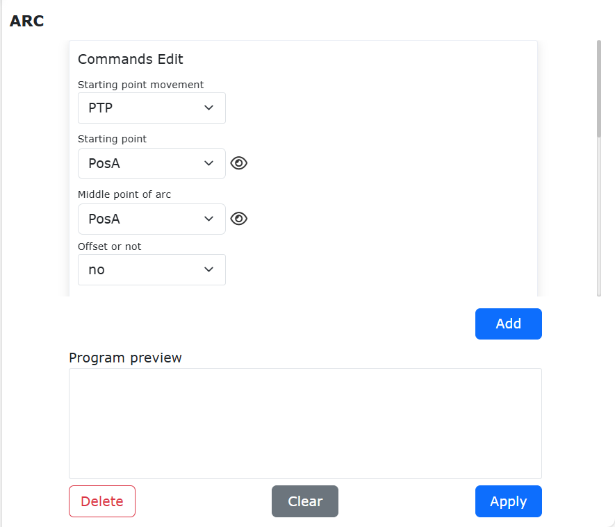

.. centered:: Figura 9.5-4 Interface da Instrução Arc

A instrução ARC permite selecionar o modo de velocidade de movimento como "Porcentagem" ou "Velocidade Física":

- Porcentagem: Insira a porcentagem da velocidade de teste. O robô se move de acordo com a porcentagem da velocidade máxima. A velocidade real do robô é calculada como: V = Velocidade Máxima do Robô × Porcentagem de Velocidade Global × Porcentagem da Velocidade de Teste. Passe o mouse sobre o pequeno ícone de olho ao lado da caixa de entrada "Velocidade de Teste" para exibir a velocidade física real (unidade: mm/s) do robô nos modos manual e automático com a velocidade de teste atual definida.

.. image:: coding/461.png
   :width: 5in
   :align: center

.. centered:: Figura 9.5-4-1 Exibição do valor da velocidade física real ao inserir a porcentagem

- Velocidade Física: A velocidade inserida é a velocidade real de operação do robô, unidade mm/s. A aceleração inserida é geralmente definida como o dobro da velocidade (a velocidade física máxima do comando LIN é limitada pela porcentagem de velocidade global. Se a velocidade máxima de operação do robô for 1000mm/s e a velocidade global for 50%, a velocidade física máxima do comando LIN será 1000 × 50% = 500mm/s).

.. image:: coding/462.png
   :width: 5in
   :align: center

.. centered:: Figura 9.5-4-2 Inserção da velocidade física real

Comando de Círculo Completo
+++++++++++++++++++++++++++++++

Clique no ícone "Círculo Completo" para entrar na interface de edição do comando Circle.

O robô colaborativo pode realizar movimento de trajetória circular completa adicionando uma instrução de círculo completo. Antes de adicionar a instrução de círculo completo, é necessário ensinar 3 pontos de caminho na trajetória circular. Suponha que os três pontos de caminho na trajetória circular sejam "P1", "P2" e "P3", onde "P1" é o ponto inicial da trajetória circular, "P2" e "P3" são os pontos intermediários 1 e 2 da trajetória circular. Mova o robô para os três pontos acima e adicione os nomes dos pontos de ensino como "P1", "P2" e "P3", respectivamente.

.. important::
   Para o movimento de trajetória circular completa, é necessário primeiro adicionar uma instrução PTP ou Lin para mover até o ponto inicial.

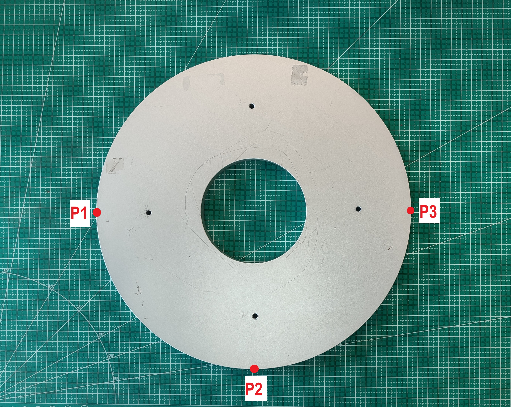

.. centered:: Figura 9.5-5 Trajetória de Círculo Completo

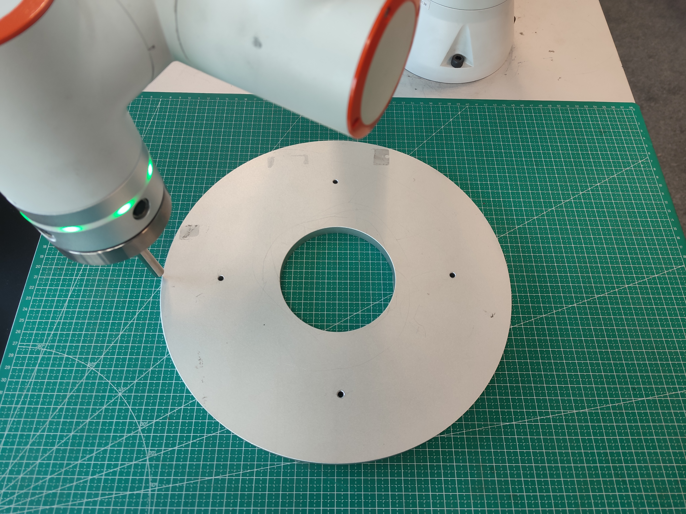

.. image:: coding/044.png
   :width: 3in
   :align: center

.. image:: coding/045.png
   :width: 3in
   :align: center

.. centered:: Figura 9.5-6 Ensinar os Pontos "P1", "P2", "P3"

Adição da Instrução de Círculo Completo
********************************************************

**Passo 1**: Crie um novo programa de usuário "testCircle.lua", clique no botão "Círculo Completo" para abrir a página de adição de instrução de círculo completo.

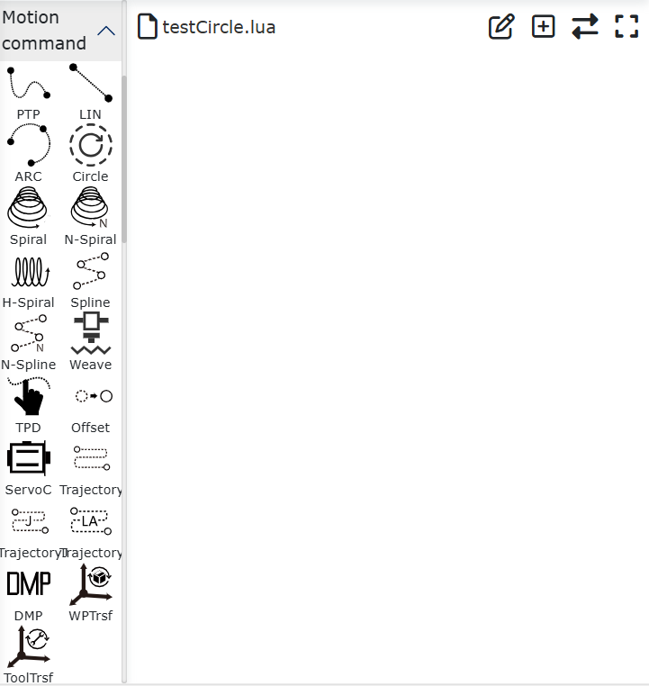

.. centered:: Figura 9.5-7 Botão para Adicionar Instrução de Círculo Completo

**Passo 2**: Na página de adição de instrução de círculo completo, selecione o modo de movimento do ponto inicial e o ponto inicial como "P1".

.. image:: coding/050.png
   :width: 6in
   :align: center

.. centered:: Figura 9.5-8 Modo de Movimento do Ponto Inicial e Ponto Inicial "P1"

**Passo 3**: Na página de adição de instrução de círculo completo, selecione "Ponto Intermediário 1 do Círculo Completo" como "P2" e "Ponto Intermediário 2 do Círculo Completo" como "P3".

.. image:: coding/465.png
   :width: 6in
   :align: center

.. centered:: Figura 9.33-9 Selecionar Ponto Intermediário do Arco e Ponto Final

**Passo 4**: Selecione o modo de velocidade e insira o valor da velocidade.

A instrução Circle permite selecionar o modo de velocidade de movimento como "Porcentagem" ou "Velocidade Física":

- Porcentagem: Insira a porcentagem da velocidade de teste. O robô se move de acordo com a porcentagem da velocidade máxima. A velocidade real do robô é calculada como: V = Velocidade Máxima do Robô × Porcentagem de Velocidade Global × Porcentagem da Velocidade de Teste. Passe o mouse sobre o pequeno ícone de olho ao lado da caixa de entrada "Velocidade de Teste" para exibir a velocidade física real (unidade: mm/s) do robô nos modos manual e automático com a velocidade de teste atual definida.

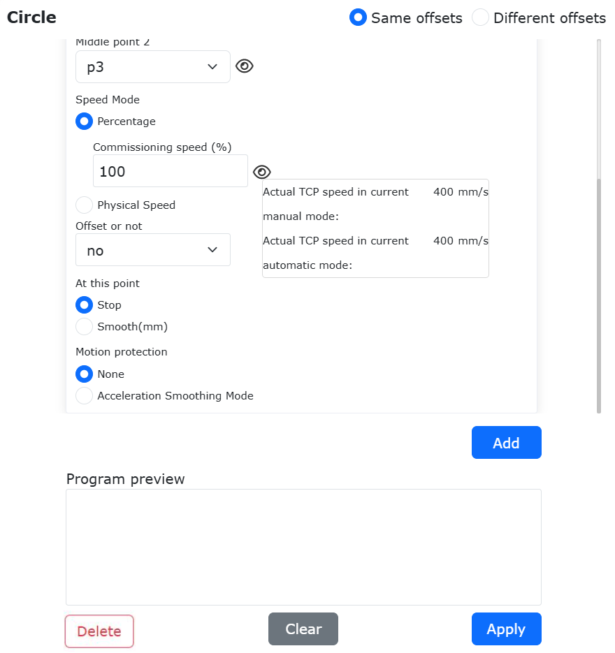

.. centered:: Figura 9.33-10 Exibição do valor da velocidade física real ao inserir a porcentagem

- Velocidade Física: A velocidade inserida é a velocidade real de operação do robô, unidade mm/s. A aceleração inserida é geralmente definida como o dobro da velocidade (a velocidade física máxima do comando LIN é limitada pela porcentagem de velocidade global. Se a velocidade máxima de operação do robô for 1000mm/s e a velocidade global for 50%, a velocidade física máxima do comando LIN será 1000 × 50% = 500mm/s).

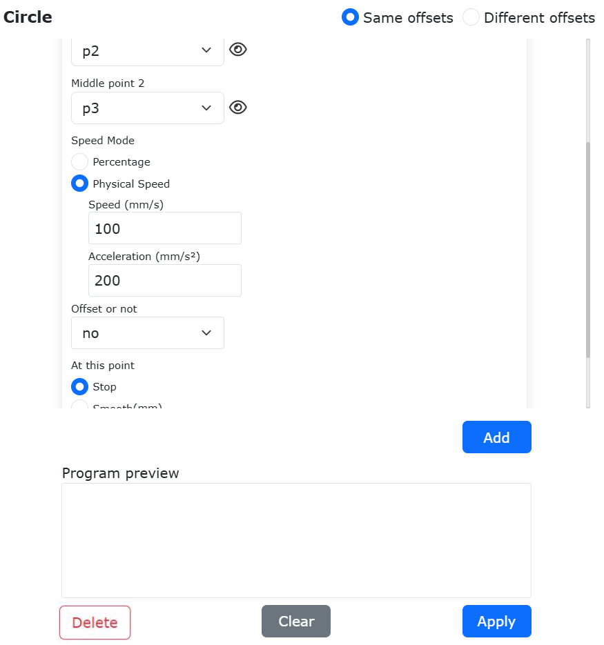

.. centered:: Figura 9.33-11 Inserção da velocidade física real

**Passo 5**: Clique sequencialmente no botão "Adicionar" e no botão "Aplicar". Neste momento, a instrução de movimento de círculo completo foi adicionada ao "testCircle.lua".

.. image:: coding/468.png
   :width: 6in
   :align: center

.. centered:: Figura 9.33-12 Adição da Instrução de Movimento de Círculo Completo

**Passo 6**: Agora a instrução de movimento de círculo completo foi adicionada ao "testCircle.lua".

Alterne o robô para o modo automático e inicie o programa em condições seguras. O robô se moverá ao longo da trajetória circular.

Deslocamento da Trajetória de Círculo Completo
********************************************************

O movimento de círculo completo do robô colaborativo suporta o deslocamento da posição do ponto intermediário 1 e do ponto intermediário 2 da trajetória circular. Os tipos de deslocamento incluem os seguintes dois tipos:

**Mesmo Deslocamento para Ambos os Pontos Intermediários da Trajetória Circular**: O ponto intermediário 1 da trajetória circular (ponto "P2") e o ponto intermediário 2 da trajetória circular (ponto "P3") são deslocados pelo mesmo valor de deslocamento ∆(dx, dy, dz, drx, dry, drz).

**Deslocamentos Diferentes para os Dois Pontos Intermediários da Trajetória Circular**: O ponto intermediário 1 da trajetória circular (ponto "P2") e o ponto intermediário 2 da trajetória circular (ponto "P3") são deslocados por dois valores de deslocamento diferentes, ∆1(dx1, dy1, dz1, drx1, dry1, drz1) e ∆2(dx2, dy2, dz2, drx2, dry2, drz2), respectivamente.

Abaixo, demonstramos o uso de "Mesmo Deslocamento" e "Deslocamentos Diferentes".

1. Mesmo Deslocamento

Conforme mostrado, abra a página de adição de instrução de círculo completo. Selecione "Mesmo Deslocamento" em "Tipo de Deslocamento". Escolha o modo de movimento do ponto inicial e o ponto inicial como "P1". O ponto intermediário 1 do círculo completo é "P2".

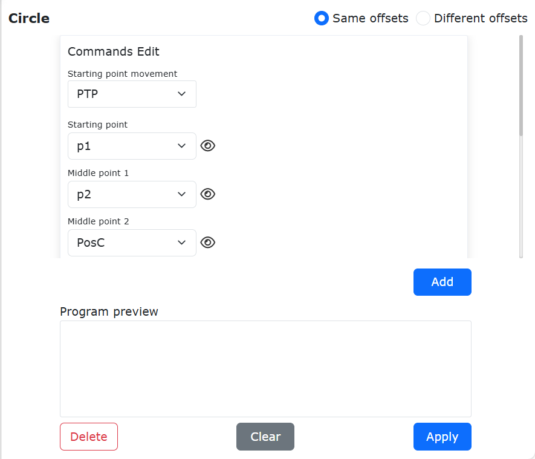

.. centered:: Figura 9.5-12 Mesmo Deslocamento para o Círculo Completo

Selecione o ponto intermediário 2 do círculo completo como "P3". Escolha "Deslocamento no Sistema de Coordenadas Base" em "Habilitar Deslocamento".

.. note:: Você pode escolher "Deslocamento de Coordenadas da Ferramenta" ou "Deslocamento de Coordenadas da Peça" de acordo com suas condições reais de trabalho.

Insira o deslocamento dx como 10mm. Clique sequencialmente no botão "Adicionar" e no botão "Aplicar" na parte inferior da página.

.. image:: coding/052.png
   :width: 6in
   :align: center

.. centered:: Figura 9.5-13 Configurar o Deslocamento

Uma instrução de círculo completo com ponto inicial "P1" e ambos os pontos intermediários "P2" e "P3" deslocados em 10mm na direção X do sistema de coordenadas base foi adicionada ao programa "testCircle.lua".

.. image:: coding/053.png
   :width: 6in
   :align: center

.. centered:: Figura 9.5-14 Programa de Mesmo Deslocamento para Círculo Completo

Alterne o robô para o modo automático e inicie o programa em condições seguras. Na trajetória de movimento real do robô, ele passará pelo círculo que passa por "P1", "P2'" e "P3'", onde "P2'" é o ponto original "P2" deslocado em 10mm na direção X, e "P3'" é o ponto original "P3" deslocado em 10mm na direção X.

.. image:: coding/054.png
   :width: 3in
   :align: center

.. centered:: Figura 9.5-15 Trajetória com Mesmo Deslocamento de X10mm

1. Deslocamentos Diferentes

Abra a página de adição de instrução de círculo completo. Selecione "Deslocamentos Diferentes" em "Tipo de Deslocamento". Escolha o modo de movimento do ponto inicial e o ponto inicial como "P1". Selecione o ponto intermediário 1 do círculo completo como "P2". Escolha "Deslocamento no Sistema de Coordenadas Base" em "Habilitar Deslocamento".

.. note:: Você pode escolher "Deslocamento de Coordenadas da Ferramenta" ou "Deslocamento de Coordenadas da Peça" de acordo com suas condições reais de trabalho.

Insira o deslocamento dy como 10mm.

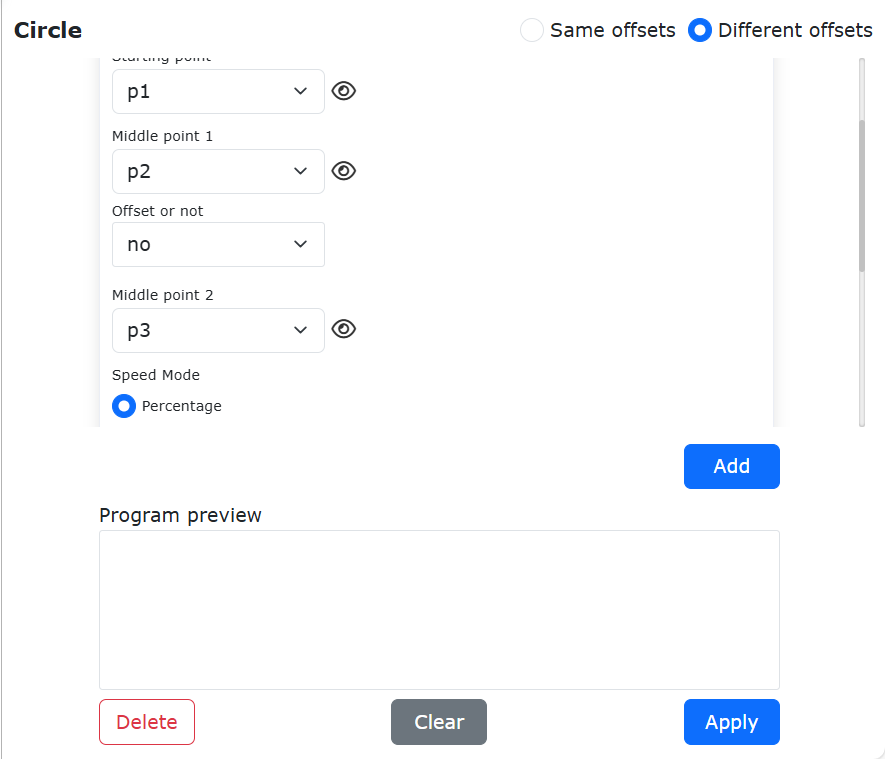

.. centered:: Figura 9.5-16 Deslocamentos Diferentes

Selecione o ponto intermediário do círculo completo como "P3". Escolha "Deslocamento no Sistema de Coordenadas Base" em "Habilitar Deslocamento".

.. note:: Você pode escolher "Deslocamento de Coordenadas da Ferramenta" ou "Deslocamento de Coordenadas da Peça" de acordo com suas condições reais de trabalho.

Insira o deslocamento dx como 10mm. Clique sequencialmente no botão "Adicionar" e no botão "Aplicar" na parte inferior da página.

.. image:: coding/056.png
   :width: 6in
   :align: center

.. centered:: Figura 9.5-17 Configurar Deslocamento do Ponto Intermediário 2 com Deslocamentos Diferentes

Uma instrução de círculo completo com ponto inicial "P1", ponto intermediário "P2" deslocado em 10mm na direção Y do sistema de coordenadas base e "P3" deslocado em 10mm na direção X do sistema de coordenadas base foi adicionada ao programa "testCircle.lua".

.. image:: coding/057.png
   :width: 6in
   :align: center

.. centered:: Figura 9.5-18 Programa de Deslocamentos Diferentes para os Dois Pontos do Círculo Completo

Alterne o robô para o modo automático e inicie o programa em condições seguras. Na trajetória de movimento real do robô, ele passará pelo círculo que passa por "P1", "P2'" e "P3'", onde "P2'" é o ponto original "P2" deslocado em 10mm na direção Y, e "P3'" é o ponto original "P3" deslocado em 10mm na direção X.

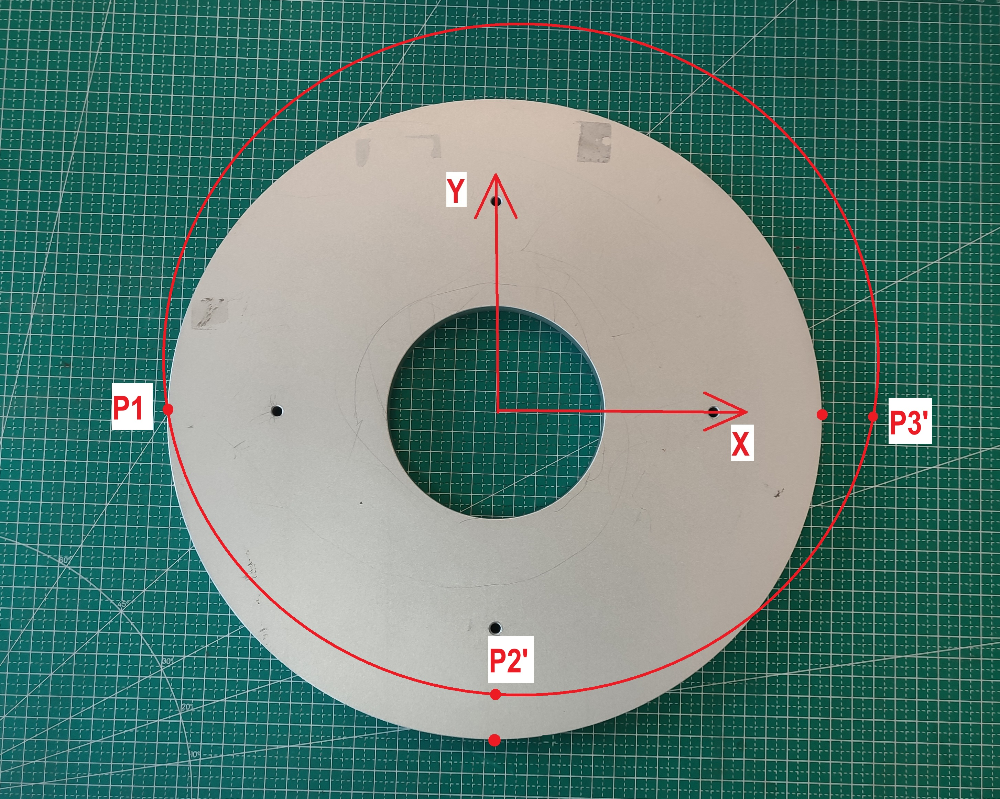

.. centered:: Figura 9.5-19 Trajetória com Deslocamentos Separados para os Dois Pontos da Trajetória Circular

Comando Espiral
+++++++++++++++++++++++++++++

Clique no ícone "Espiral" para entrar na interface de edição do comando Spiral.

A instrução "Spiral" é para movimento em espiral. Ela inclui três pontos que formam um círculo. Na página de configuração do terceiro ponto, existem parâmetros para número de voltas da espiral, ângulo de correção de postura, incremento do raio e incremento na direção do eixo da espiral. O número de voltas da espiral é o número de voltas do movimento em espiral. O ângulo de correção de postura corrige a postura no final da espiral em relação à postura do primeiro ponto da espiral. O incremento do raio é o incremento do raio a cada volta. O incremento na direção do eixo da espiral é o incremento ao longo do eixo da espiral. Há uma opção para habilitar deslocamento, que se aplica a toda a trajetória da espiral.

Se usar deslocamento, você pode escolher "Deslocamento Baseado em Coordenadas Base", "Deslocamento Baseado em Coordenadas da Ferramenta" ou "Deslocamento Baseado em Coordenadas da Peça". Este deslocamento se aplica a toda a trajetória espiral.

.. image:: coding/059.png
   :width: 6in
   :align: center

.. centered:: Figura 9.5-20 Interface da Instrução Spiral

Novo Comando Espiral
+++++++++++++++++++++++++++++

Clique no ícone "Nova Espiral" para entrar na interface de edição do comando N-Spiral.

A instrução "N-Spiral" é uma versão otimizada do movimento em espiral. Ela requer apenas um ponto mais a configuração de vários parâmetros para realizar o movimento em espiral. O robô usa a posição atual como ponto inicial. O usuário define a velocidade de teste, opção de deslocamento, número de voltas da espiral, ângulo de inclinação da espiral, raio inicial, incremento do raio, incremento na direção do eixo da espiral e direção de rotação. O número de voltas da espiral é o número de voltas do movimento em espiral. O ângulo de inclinação da espiral é o ângulo entre o eixo Z da ferramenta e a direção horizontal. O ângulo de correção de postura corrige a postura no final da espiral em relação à postura do primeiro ponto da espiral. O raio inicial é o tamanho do raio da primeira volta. O incremento do raio é o incremento do raio a cada volta. O incremento na direção do eixo da espiral é o incremento ao longo do eixo da espiral. A direção de rotação pode ser no sentido horário ou anti-horário.

.. image:: coding/060.png
   :width: 6in
   :align: center

.. centered:: Figura 9.5-21 Interface da Instrução N-Spiral

Função de Velocidade Constante por Volta na Espiral
*****************************************************

Visão Geral
""""""""""""""
Ao usar a instrução de movimento em espiral, é possível definir a velocidade de execução para que a velocidade de cada volta permaneça na velocidade de execução definida.

Fluxo de Operação
""""""""""""""""""""""""""""
**Passo 1**: Selecione o ponto de ensino para executar o movimento em espiral. Neste manual, usamos "P0" como nome do ponto de ensino.

**Passo 2**: Clique em "Programa de Ensino" —> "Programação de Programa", selecione a instrução "Nova Espiral". Em "Modo de Velocidade", escolha "Velocidade Física" e defina os valores de velocidade e aceleração. Este valor de velocidade é a velocidade real de execução da espiral. Defina os parâmetros "Número de Voltas da Espiral", "Ângulo de Inclinação da Espiral", "Raio Inicial", "Incremento do Raio", "Incremento na Direção do Eixo da Espiral" e "Direção de Rotação" conforme necessário, conforme mostrado na Figura 2-1.

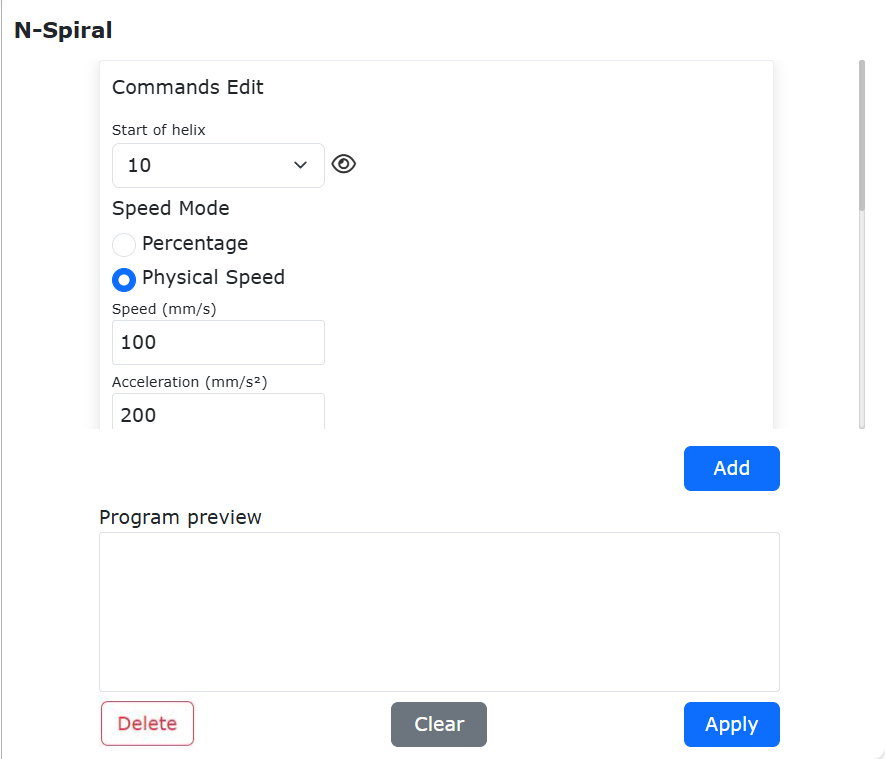

.. centered:: Figura 9.5-21-1 Configuração de Parâmetros da Nova Espiral

**Passo 3**: Adicione a instrução de movimento, gere o programa Lua e execute-o para realizar a função de espiral com a velocidade definida, conforme mostrado na Figura 2-2.

.. image:: coding/493.png
   :width: 6in
   :align: center

.. centered:: Figura 9.5-21-2 Programa Típico para Executar Espiral com Velocidade Definida

Comando Espiral Horizontal
++++++++++++++++++++++++++++++++++++++++++

Clique no ícone "Espiral Horizontal" para entrar na interface de edição do comando H-Spiral.

A instrução "H-Spiral" é para movimento em espiral no plano horizontal. Esta instrução é usada após uma instrução de movimento de segmento único (linear).

   - Raio da Espiral: 0~100mm
   - Velocidade Angular da Espiral: 0~2 rev/s
   - Direção de Rotação: Espiral no sentido horário/anti-horário
   - Ângulo de Inclinação da Espiral: 0~40°

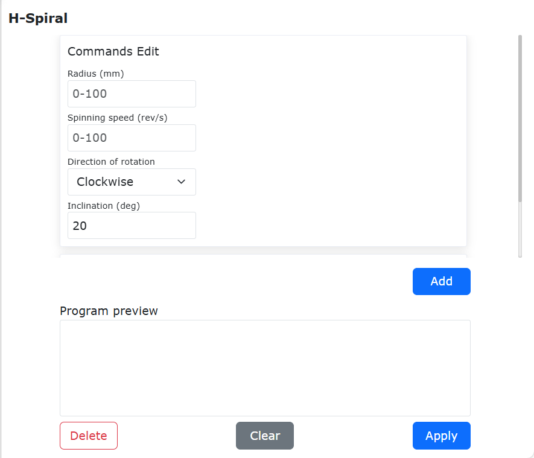

.. centered:: Figura 9.5-22 Interface da Instrução H-Spiral

Comando Spline
++++++++++++++++

Clique no ícone "Spline" para entrar na interface de edição do comando Spline.

Esta instrução é dividida em três partes: início do grupo de splines, segmentos de spline e fim do grupo de splines. O início do grupo de splines é o marcador de início do movimento de spline. Os segmentos de spline incluem segmentos SPL, SLIN e SCIRC. Clique no ícone correspondente para entrar na interface de adição de instrução. O fim do grupo de splines é o marcador de fim do movimento de spline.

.. image:: coding/062.png
   :width: 6in
   :align: center

.. centered:: Figura 9.5-23 Interface da Instrução Spline

Novo Comando Spline
+++++++++++++++++++++++++++++

Clique no ícone "Novo Spline" para entrar na interface de edição do comando N-Spline.

Esta instrução é uma otimização do algoritmo da instrução Spline e substituirá a instrução Spline existente no futuro.

Esta instrução é dividida em três partes: início da trajetória de múltiplos pontos, segmentos da trajetória de múltiplos pontos e fim da trajetória de múltiplos pontos. O início da trajetória de múltiplos pontos é o marcador de início do movimento da trajetória de múltiplos pontos. Os segmentos da trajetória de múltiplos pontos são a definição dos vários pontos de passagem.

Clique no ícone para entrar na interface de adição de pontos. O fim da trajetória de múltiplos pontos é o marcador de fim do movimento da trajetória de múltiplos pontos, onde o modo de controle e a velocidade de teste podem ser definidos.

- Modo de Controle: Pontos de Transição de Arco / Pontos de Caminho Definidos
- Tempo Médio de Conexão: Inteiro, maior que 10, valor padrão de 2000

.. image:: coding/063.png
   :width: 6in
   :align: center

.. centered:: Figura 9.5-24 Interface da Instrução N-Spline

Comando de Oscilação
+++++++++++++++++++++++++++++

Clique no ícone "Oscilação" para entrar na interface de edição do comando Weave. A instrução "Weave" inclui duas partes:

- Selecione o número de oscilação de solda com os parâmetros configurados, clique em "Iniciar Oscilação" e "Parar Oscilação" e, em seguida, em "Aplicar" para adicionar as instruções relevantes ao programa.

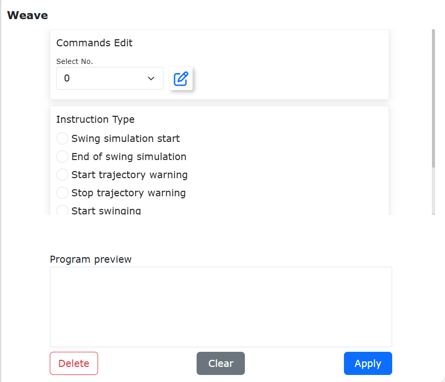

.. centered:: Figura 9.5-25 Interface da Instrução Weave

- Clique em "Configurar e Testar". Escolha o tipo de oscilação de acordo com o cenário de uso e configure os parâmetros de oscilação. Após a configuração, os botões "Iniciar Teste de Oscilação" e "Parar Teste de Oscilação" podem ser usados para testar a trajetória de oscilação. Os tipos de oscilação atuais são:

   - Oscilação em Onda Triangular (LIN/ARC)
   - Oscilação em Onda Triangular Vertical Tipo L (LIN/ARC)
   - Oscilação Circular - Sentido Horário (LIN)
   - Oscilação Circular - Sentido Anti-horário (LIN)
   - Oscilação Senoidal (LIN/ARC)
   - Oscilação Senoidal Vertical Tipo L (LIN/ARC)
   - Oscilação Triangular para Soldagem Vertical

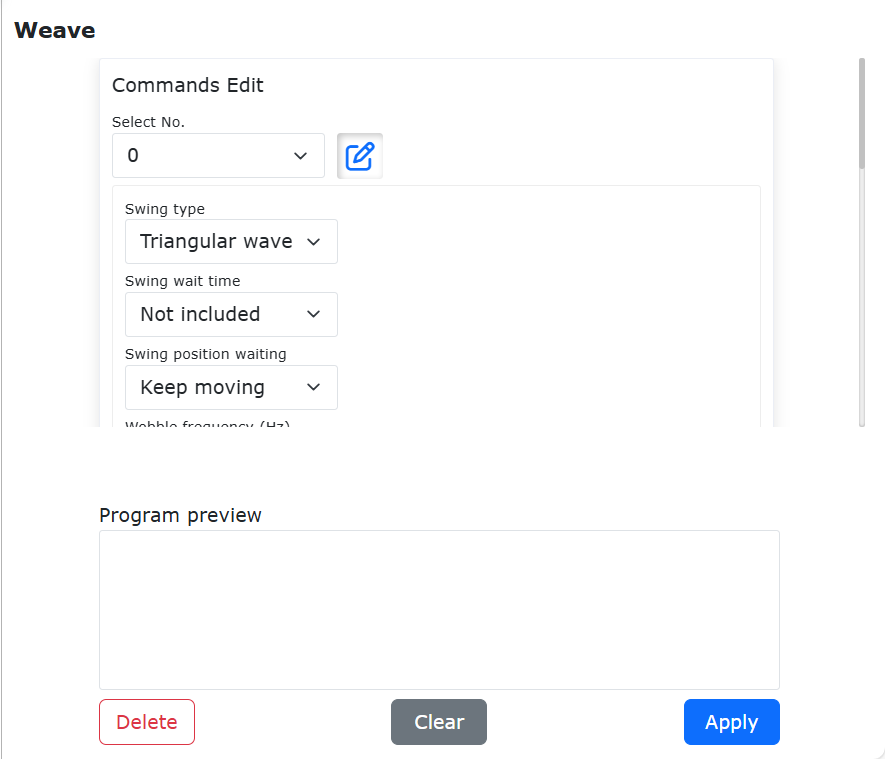

.. centered:: Figura 9.5-26 Interface da Instrução Weave Configurar e Testar

Função de Oscilação em Dente de Serra Inclinado
***************************************************************

Usar a função de oscilação em dente de serra inclinado permite que a extremidade da ferramenta do robô forme uma trajetória de oscilação em dente de serra inclinado no espaço cartesiano. A oscilação em dente de serra inclinado é sobreposta ao planejamento linear. A quantidade de inclinação é controlada pelo parâmetro de ângulo de azimute, que é o grau de inclinação do ângulo de azimute no plano de oscilação especificado (unidade graus);

Quando o valor é positivo, o ponto esquerdo se inclina para a direção de avanço. Quando negativo, o ponto direito se inclina para a direção de avanço. Se for 90 graus ou -90 graus, a oscilação pode ocorrer ao longo da direção de avanço.

.. image:: coding/066.png
   :width: 4in
   :align: center

.. centered:: Figura 9.5-26-1 Efeito do Ângulo de Azimute da Oscilação

**Passo 1**: Edite e configure o movimento linear básico.

.. image:: coding/067.png
   :width: 4in
   :align: center

.. centered:: Figura 9.5-26-2 Exemplo de Programa Lua de Movimento Linear Básico

**Passo 2**: Clique para adicionar a instrução de oscilação.

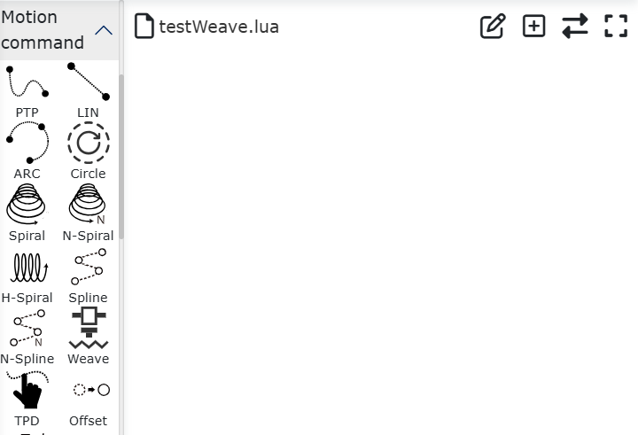

.. centered:: Figura 9.5-26-3 Clicar para Adicionar Instrução de Oscilação

**Passo 3**: Na página de configuração de parâmetros da instrução de oscilação, clique no botão "Configurar". Na lista suspensa "Tipo de Oscilação", selecione "Oscilação em Onda Triangular" ou "Oscilação Senoidal". Insira o "Ângulo de Azimute da Direção da Oscilação" correspondente e clique em "Aplicar".

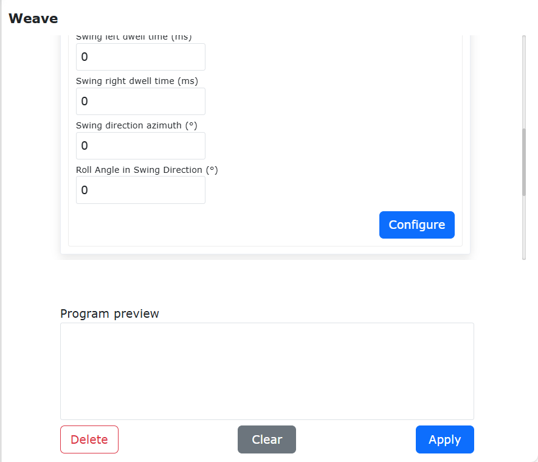

.. centered:: Figura 9.5-26-4 Configuração dos Parâmetros de Oscilação

**Passo 4**: Clique no botão "Iniciar Oscilação" para adicionar a instrução de oscilação acima do movimento linear. Clique no botão "Parar Oscilação" para adicionar a instrução de oscilação abaixo do movimento linear.

.. image:: coding/070.png
   :width: 4in
   :align: center

.. centered:: Figura 9.5-26-5 Programa Lua Após Adicionar a Instrução de Oscilação

**Passo 5**: Clique em "Iniciar Execução". A trajetória da extremidade do robô é mostrada na figura.

.. image:: coding/071.png
   :width: 3in
   :align: center

.. image:: coding/072.png
   :width: 3in
   :align: center

.. centered:: Figura 9.5-26-6 Oscilação em Dente de Serra (esquerda) Oscilação em Dente de Serra Inclinado (direita)

Comando de Reprodução de Trajetória
+++++++++++++++++++++++++++++++++++++++++++++++++++++++

Clique no botão "Reprodução de Trajetória" para entrar na interface de edição do comando TPD.

Nesta instrução, o usuário precisa primeiro ter uma trajetória gravada.

Sobre a gravação da trajetória: Antes de preparar para gravar uma trajetória, salve o ponto inicial da trajetória. Com o robô no modo de arrastagem, insira um nome de arquivo, selecione um período (assumindo um valor x, ou seja, um ponto é registrado a cada x milissegundos; recomenda-se 4 milissegundos). Clique em "Iniciar Gravação". O usuário pode arrastar o robô para realizar o movimento desejado. Após a conclusão da gravação, clique em "Parar Gravação" para salvar a trajetória de movimento do robô. Se um movimento não puder ser completamente registrado, será exibida uma mensagem de limite de número de pontos. O usuário precisará gravar o movimento em várias partes.

Ao programar, primeiro use uma instrução PTP para atingir o ponto inicial da trajetória correspondente. Em seguida, na instrução de reprodução de trajetória TPD, selecione a trajetória, escolha se deseja suavização, defina a velocidade de teste e clique sequencialmente em "Adicionar" e "Aplicar" para inserir no programa. A instrução de carregamento de trajetória é usada principalmente para pré-carregar arquivos de trajetória e extraí-los em instruções de trajetória, sendo mais adequada para cenários de rastreamento de esteira transportadora.

.. note:: 
   Para operações detalhadas sobre TPD, consulte o módulo de instruções de operação da função de ensino de programação (TPD).

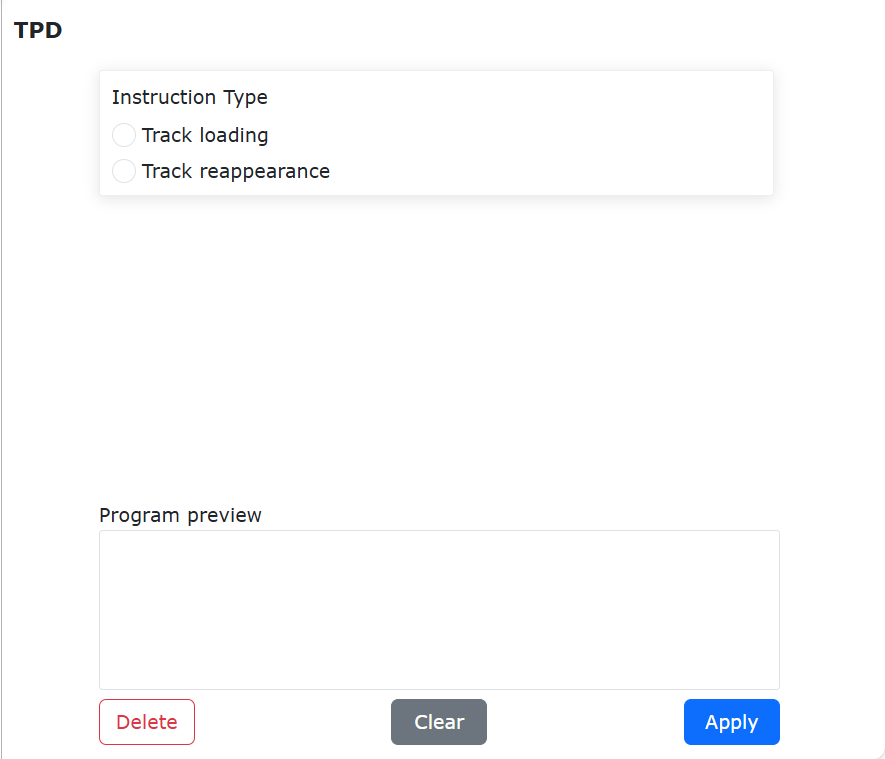

.. centered:: Figura 9.5-27 Interface da Instrução TPD

Função de Ensino e Reprodução de Trajetória do Robô TPD
*******************************************************************************

Visão Geral
""""""""""""""""""""
A função de ensino e reprodução de trajetória TPD do robô permite que o robô memorize e replique com precisão trajetórias complexas ensinadas, alcançando assim uma produção automatizada de alta qualidade e alta eficiência na manufatura industrial e substituindo humanos em tarefas de alto risco em ambientes perigosos.

Fluxo de Operação
""""""""""""""""""""""""""""""""""""""""""""""""""
**Passo 1**: Configuração dos parâmetros de gravação TPD. Clique em "TPD" na barra de status inferior da interface para entrar na configuração da função TPD e definir os parâmetros de gravação da trajetória, como nome do arquivo de trajetória, tipo de pose e período de amostragem, e configurar DI e DO. Durante o processo de gravação da trajetória TPD, ao acionar um DI, a saída DO correspondente será ativada durante a reprodução do TPD.

.. image:: coding/549.png
   :width: 3in
   :align: center

.. centered:: Figura 9.5-27-1 Configuração dos Parâmetros TPD

**Passo 2**: Mude para o modo de arrastagem. No modo manual, há duas maneiras de mudar para o modo de arrastagem de ensino: uma é manter pressionado o botão da extremidade e a outra é usar o botão de alternância do modo de arrastagem na interface. Para a função de gravação TPD, é recomendável alternar para o modo de arrastagem de ensino pela interface.

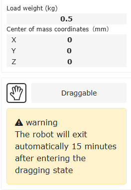

.. centered:: Figura 9.5-27-2 Configuração do Modo de Arrastagem do Robô

**Passo 3**: Iniciar a gravação. Clique no botão "Iniciar Gravação" para começar a gravar a trajetória e arraste o robô para realizar os movimentos de ensino. Além disso, há um item de configuração "Iniciar/Parar Gravação TPD" na configuração do DI da extremidade. Ao configurar esta função, o usuário pode acionar a função "Iniciar Gravação" por meio de um sinal externo. É importante notar que, para iniciar a gravação da trajetória por meio de um sinal externo, primeiro é necessário configurar as informações da trajetória TPD na página.

**Passo 4**: Finalizar a gravação. Após concluir o ensino dos movimentos, clique no botão "Parar Gravação" para interromper a gravação da trajetória. Em seguida, use o botão de alternância de arrastagem de ensino para fazer o robô sair do modo de arrastagem de ensino. Semelhante ao passo 3, após configurar a função "Iniciar/Parar Gravação TPD", a interrupção da gravação também pode ser acionada por um sinal externo.

**Passo 5**: Edição da trajetória TPD. Clique em "TPD" na barra de status inferior da interface para entrar na função de edição da trajetória TPD. Primeiro, selecione a trajetória a ser editada e clique no botão "Obter". Start-index e End-index exibirão os números de sequência inicial e final da trajetória. Eles podem ser ajustados arrastando a barra deslizante ou inserindo manualmente. Em seguida, clique no botão "Reproduzir" e o robô simulará o movimento na interface (o robô real não se move). Finalmente, clique no botão "Concluir" para finalizar a edição da trajetória TPD.

.. image:: coding/551.png
   :width: 3in
   :align: center

.. centered:: Figura 9.5-27-3 Edição da Trajetória TPD

**Passo 6**: Escreva o programa de ensino e reprodução de trajetória TPD. Clique em "Programa de Ensino" - "Reprodução de Trajetória" - "Carregar Trajetória". Selecione a trajetória a ser reproduzida e clique no botão "Adicionar". Clique em "Reprodução de Trajetória", selecione a mesma trajetória, defina os parâmetros conforme as instruções na interface e clique no botão "Adicionar".

.. image:: coding/552.png
   :width: 6in
   :align: center

.. centered:: Figura 9.5-27-4 Configuração de Carregamento da Trajetória TPD

.. image:: coding/553.png
   :width: 6in
   :align: center

.. centered:: Figura 9.5-27-5 Configuração da Reprodução da Trajetória TPD

**Passo 7**: Gere o programa Lua e execute-o. Execute o programa Lua típico gerado no passo 6 para realizar o ensino e a reprodução da trajetória.

.. image:: coding/554.png
   :width: 4in
   :align: center

.. centered:: Figura 9.5-27-6 Programa Típico para Reprodução da Trajetória TPD

Comando de Deslocamento de Ponto
++++++++++++++++++++++++++++++++++++++++++

Clique no ícone "Deslocamento de Ponto" para entrar na interface de edição do comando Offset.

Esta instrução é uma instrução de deslocamento geral. Insira os vários deslocamentos. Adicione as instruções de ativação e desativação ao programa. As instruções de movimento entre "Ativar" e "Desativar" serão deslocadas com base no sistema de coordenadas base (ou sistema de coordenadas da peça).

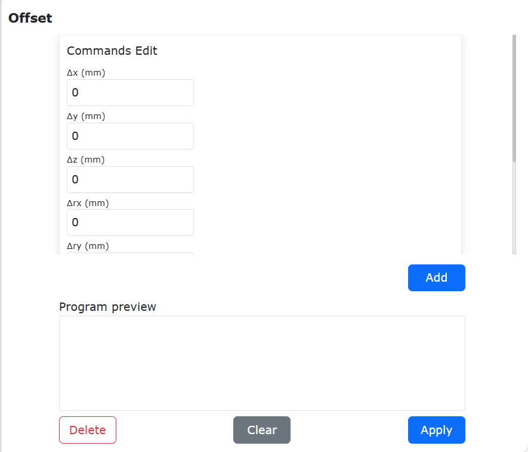

.. centered:: Figura 9.5-28 Interface da Instrução Offset

Comando Servo
+++++++++++++++++++++++++++++++++++++++++
Clique no ícone "Servo" para entrar na interface de edição do comando servoMotion. O movimento servo inclui movimento servo no espaço cartesiano e movimento servo no espaço articular.

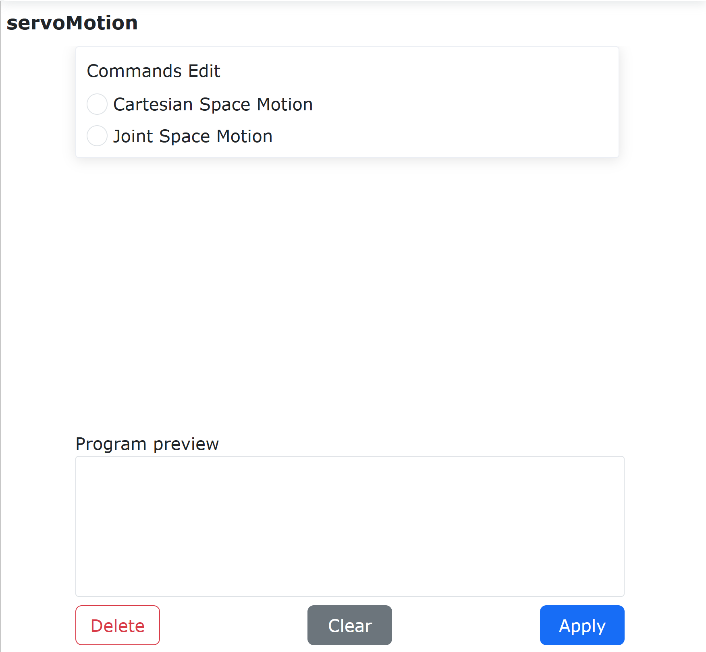

.. centered:: Figura 9.5-29-1 Interface da Instrução de Movimento Servo

Movimento Servo no Espaço Cartesiano
*************************************************************
A instrução ServoCart (movimento no espaço cartesiano) pode controlar o movimento do robô por meio do controle de pose absoluta ou deslocamento baseado na pose atual.

.. image:: coding/076.png
   :width: 6in
   :align: center

.. centered:: Figura 9.5-29-2 Interface da Instrução ServoCart

Exemplo de programa de controle de pose absoluta:

.. image:: coding/077.png
   :width: 6in
   :align: center

.. centered:: Figura 9.5-29-3 Movimento Absoluto ServoCart

Neste exemplo, x, y, z, rx, ry, rz (posição cartesiana) são a posição atual do robô obtida. Além disso, o usuário pode controlar o movimento do robô lendo arquivos de dados de trajetória, enviando dados de trajetória via comunicação socket, etc.

Exemplo de programa de controle baseado em deslocamento da pose atual (deslocamento no sistema de coordenadas base):

.. image:: coding/519.png
   :width: 6in
   :align: center

.. centered:: Figura 9.5-29-4 Movimento Relativo ServoCart

Movimento Servo no Espaço Articular
********************************************************
A instrução ServoJ (movimento no espaço articular) pode controlar o movimento do robô por meio de posições articulares absolutas.

Clique sequencialmente em "Programa de Ensino", "Programação de Programa", "Movimento Servo". Na página de instrução servoMotion, selecione "Movimento no Espaço Articular".

.. image:: coding/520.png
   :width: 6in
   :align: center

.. centered:: Figura 9.5-29-5 Edição da Instrução ServoJ

A explicação dos parâmetros na instrução é a seguinte:

- **Posição Articular**: A posição articular alvo para o movimento ServoJ. O movimento da posição atual para a posição alvo deve ser concluído dentro do período de comando definido. Se o desvio entre a posição alvo e a posição atual for muito grande, o robô pode reportar erros como excesso de velocidade da junta.
- **Posição do Eixo de Extensão**: A posição alvo do eixo de extensão para o movimento ServoJ.
- **Aceleração**: A porcentagem de aceleração para o movimento ServoJ (temporariamente não disponível).
- **Velocidade**: A porcentagem de velocidade para o movimento ServoJ (temporariamente não disponível; atualmente, a velocidade real de operação do robô depende da diferença de posição entre duas instruções ServoJ e do período de comando).
- **Período de Comando**: O tempo de execução entre duas instruções ServoJ consecutivas.

Insira a posição alvo correspondente, velocidade, aceleração e período de comando. Clique nos botões "Adicionar" e "Aplicar" para adicionar uma instrução ServoJ ao programa LUA.

.. image:: coding/521.png
   :width: 6in
   :align: center

.. centered:: Figura 9.5-29-6 Adição da Instrução ServoJ ao Programa Lua

No uso, é comum enviar continuamente várias instruções ServoJ com o período de comando definido. As posições articulares alvo dessas instruções ServoJ formam uma curva contínua de movimento do robô, permitindo um controle de movimento flexível. O período de envio das instruções deve corresponder ao período de comando definido.

O controle de movimento ServoJ pode ser implementado no programa Lua por meio de loops ou adicionando continuamente várias instruções.

.. image:: coding/522.png
   :width: 6in
   :align: center

.. centered:: Figura 9.5-29-7 Exemplo de Movimento Contínuo ServoJ

.. image:: coding/523.png
   :width: 6in
   :align: center

.. centered:: Figura 9.5-29-8 Exemplo de Movimento Contínuo ServoJ 1

Instruções de Depuração do Eixo de Extensão
***********************************************************

Visão Geral
""""""""""""""""""""""""""""""""""

As interfaces de instrução GetInverseKinExaxis para cinemática inversa da posição alvo do eixo de extensão e ServoCart com posição do eixo de extensão suportam vários cenários onde o eixo de extensão e o robô são usados simultaneamente.

Fluxo de Operação
""""""""""""""""""""""""""""""""""""""""""""""""""""""""""""""""

**Passo 1**: Os parâmetros e valores de retorno da interface de instrução de cinemática inversa GetInverseKinExaxis são mostrados na tabela abaixo.

.. centered:: Tabela 9.5-1 Parâmetros do GetInverseKinExaxis

.. list-table::
   :widths: 10 20 30 40
   :header-rows: 0
   :align: center

   * - **Nº**
     - **Tipo de Dado**
     - **Nome da Variável**
     - **Descrição Detalhada**

   * - 1
     - uint8_t
     - posMode
     - 0: Pose absoluta, 1: Pose relativa - sistema de coordenadas base, 2: Pose relativa - sistema de coordenadas da ferramenta

   * - 2
     - float
     - desePos[6]
     - Posição cartesiana do robô

   * - 3
     - float
     - exaxis[4]
     - Posição do eixo de extensão

   * - 4
     - int
     - toolNum
     - Número da ferramenta [0-14]

   * - 5
     - int
     - workPieceNum
     - Número da peça [0-14]

.. centered:: Tabela 9.5-2 Valores de Retorno do GetInverseKinExaxis

.. list-table::
   :widths: 10 20 30 40
   :header-rows: 0
   :align: center

   * - **Nº**
     - **Tipo de Dado**
     - **Nome da Variável**
     - **Descrição Detalhada**

   * - 1
     - float
     - jointPos[6]
     - Posição articular

**Passo 2**: O formato de chamada da instrução de cinemática inversa GetInverseKinExaxis no programa Lua é mostrado na figura. Basta inserir os parâmetros listados na tabela para obter os valores articulares correspondentes. Para chamadas no SDK, consulte a documentação do SDK correspondente.

.. image:: coding/543.png
   :width: 6in
   :align: center

.. centered:: Figura 9.5-29-9 Chamada do GetInverseKinExaxis no Lua

**Passo 3**: A interface da instrução ServoCart com posição do eixo de extensão é mostrada na tabela abaixo. Não há valor de retorno.

.. centered:: Tabela 9.5-3 Parâmetros do ServoCart

.. list-table::
   :widths: 10 20 30 40
   :header-rows: 0
   :align: center

   * - **Nº**
     - **Tipo de Dado**
     - **Nome da Variável**
     - **Descrição Detalhada**

   * - 1
     - uint8_t
     - posMode
     - 0: Pose absoluta, 1: Pose relativa - sistema de coordenadas base, 2: Pose relativa - sistema de coordenadas da ferramenta

   * - 2
     - float
     - desePos[6]
     - Posição cartesiana do robô

   * - 3
     - float
     - gain[6]
     - Coeficiente de proporção da pose, usado no caso de pose relativa

   * - 4
     - float
     - exaxis[4]
     - Posição do eixo de extensão

   * - 5
     - float
     - acc
     - Proporção da aceleração, 0~100, padrão 0

   * - 6
     - float
     - vel
     - Proporção da velocidade, 0~100, padrão 0

   * - 7
     - float
     - interval
     - Período de comando [s]

   * - 8
     - float
     - filterTime
     - Tempo de filtro [s], temporariamente indisponível

   * - 9
     - float
     - posGain
     - Amplificador de proporção da posição alvo, temporariamente indisponível

**Passo 4**: O formato de chamada da instrução ServoCart com posição do eixo de extensão no programa Lua é mostrado na figura abaixo. Basta inserir os parâmetros listados na tabela para que o robô execute o movimento ServoCart com a posição do eixo de extensão. Para chamadas no SDK, consulte a documentação do SDK correspondente.

.. image:: coding/544.png
   :width: 6in
   :align: center

.. centered:: Figura 9.5-29-10 Chamada do ServoCart no Lua

Comando de Trajetória
+++++++++++++++++++++++++++++

Clique no ícone "Trajetória" para entrar na interface de edição do comando Trajctory.

.. image:: coding/078.png
   :width: 6in
   :align: center

.. centered:: Figura 9.5-30 Interface da Instrução Trajctory

Comando Trajetória J
+++++++++++++++++++++++++++++

Clique no ícone "Trajetória J" para entrar na interface de edição do comando TrajctoryJ.

As instruções Trajctory e TrajctoryJ são interfaces gerais adequadas para trajetórias fornecidas diretamente por uma câmera. Elas permitem importar arquivos de pontos de trajetória discretos com formato fixo para o sistema, fazendo com que o robô se mova de acordo com a trajetória do arquivo importado.

1. Função de Importação de Arquivo de Trajetória: Selecione um arquivo no computador local para importar para o sistema de controle do robô.

2. Pré-carregamento de Trajetória: Selecione um arquivo de trajetória já importado e carregue-o através de uma instrução.

3. Movimento de Trajetória: Combine o arquivo de trajetória pré-carregado com a velocidade de teste selecionada para emitir o movimento do robô.

4. Imprimir Número do Ponto da Trajetória: Imprime o número do ponto da trajetória durante a execução da trajetória do robô, permitindo visualizar o progresso do movimento atual.

.. image:: coding/079.png
   :width: 6in
   :align: center

.. centered:: Figura 9.5-31 Interface da Instrução TrajctoryJ

Comando DMP
++++++++++++++++

Clique no ícone "DMP" para entrar na interface de edição do comando DMP.

DMP é um método de aprendizado por imitação de trajetória. É necessário planejar uma trajetória de referência com antecedência. Na interface de edição de comando, selecione um ponto de ensino como o novo ponto inicial. Clique em "Adicionar" e "Aplicar" para salvar a instrução. O caminho específico do DMP é uma nova trajetória que imita a trajetória de referência a partir do novo ponto inicial.

.. image:: coding/080.png
   :width: 6in
   :align: center

.. centered:: Figura 9.5-32 Interface da Instrução DMP

Comando de Transformação de Peça
++++++++++++++++++++++++++++++++++++++++++

Clique no ícone "Transformação de Peça" para entrar na interface de edição do comando WPTrsf.

Selecione o sistema de coordenadas da peça a ser automaticamente transformado. Clique em "Adicionar" e "Aplicar" para salvar a instrução. Esta instrução realiza a transformação automática dos pontos no sistema de coordenadas da peça ao executar instruções PTP e LIN internas. A área de exemplo de uso exibe e sugere as combinações corretas de uso da instrução. Instruções específicas podem ser ajustadas de acordo com o cenário real após a adição.

.. image:: coding/081.png
   :width: 6in
   :align: center

.. centered:: Figura 9.5-33 Interface da Instrução WPTrsf

Função de Transformação da Peça e Velocidade de Segurança
**************************************************************

Visão Geral
""""""""""""""""""""""""""""""""""""

A função de transformação da peça refere-se à migração das trajetórias de movimento PTP\LIN\ARC\CIR sob o sistema de coordenadas da peça atual para operar sob o sistema de coordenadas da peça alvo.

A função de velocidade de segurança refere-se à configuração aberta dos limites de velocidade no espaço cartesiano\articular do robô, permitindo a proteção de velocidade tanto no espaço de trabalho quanto no espaço articular.

Procedimento Operacional da Função de Transformação da Peça
""""""""""""""""""""""""""""""""""""""""""""""""""""""""""""""""""""""""""""""""""""""""""""""""""""""""""""

**Passo 1**: Calibrar o sistema de coordenadas da peça do robô através do WebApp. Para detalhes operacionais desta função, consulte os capítulos correspondentes do manual do usuário.

**Passo 2**: Ensinar pontos. Ensinar pontos de movimento PTP\LIN\ARC\CIR e escrever programas LUA através do WebApp. Para detalhes operacionais desta função, consulte os capítulos correspondentes do manual do usuário.

**Passo 3**: Configurar a transformação do sistema de coordenadas da peça. Na interface principal do WebApp, clique em "Teach Program" - "Program Programming" para acessar a área "Instruções de Movimento".

.. image:: coding/583.png
   :width: 4in
   :align: center

.. centered:: Figura 9.5-33-1 Área "Instruções de Movimento"

Na área "Instruções de Movimento", clique no botão "Transformação da Peça" para acessar a interface de configuração da instrução "WPTrsf".

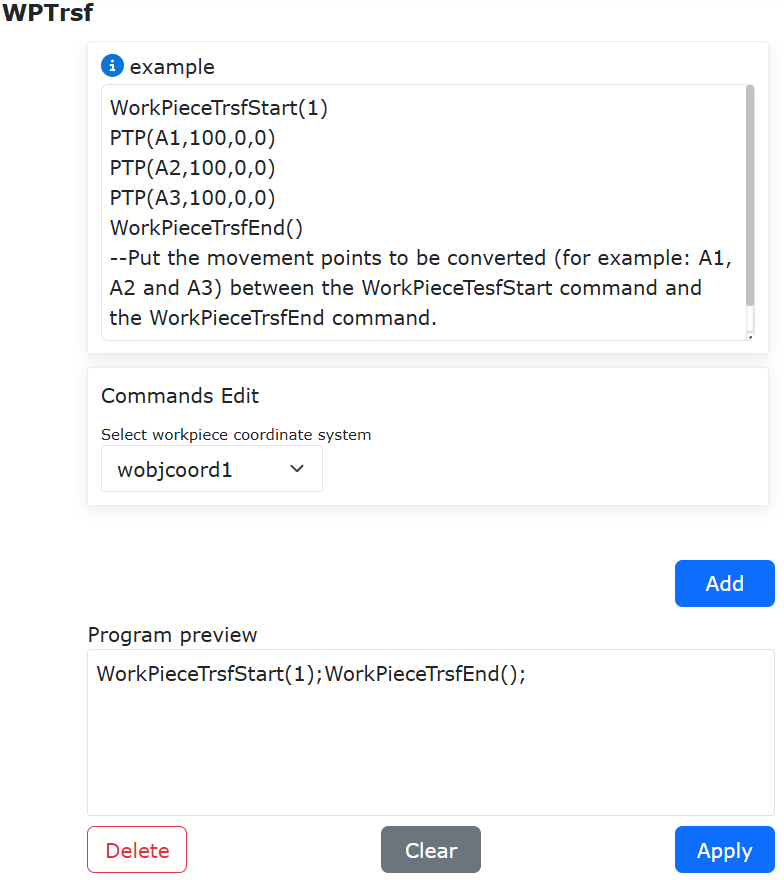

.. centered:: Figura 9.5-33-2 Configuração da Instrução WPTrsf

Na interface de configuração da instrução "WPTrsf" -> área de configuração "Editar Instrução", selecione o número do sistema de coordenadas da peça alvo no menu suspenso "Selecionar Sistema de Coordenadas da Peça", clique nos botões "Adicionar" - "Aplicar" para concluir a configuração da função de transformação da peça.

**Passo 4**: Escrever o programa LUA para a função de transformação da peça. Ajuste a ordem das instruções geradas do Passo 2 ao Passo 3 e execute o programa LUA para implementar a função de transformação da peça.

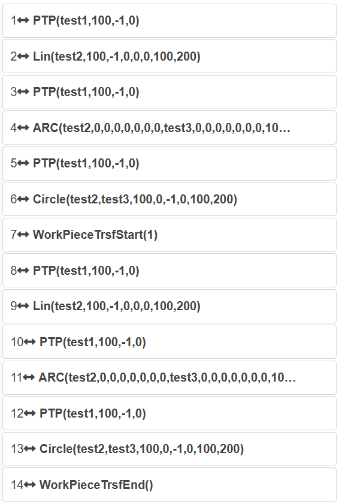

.. centered:: Figura 9.5-33-3 Programa LUA para a Função de Transformação da Peça

Procedimento Operacional da Função de Velocidade de Segurança
""""""""""""""""""""""""""""""""""""""""""""""""""""""""""""""""""""""""""""""""""""""""""""""""""""""""""""

Na interface principal do WebApp, clique em "Configuração Inicial" - "Segurança" - "Velocidade de Segurança" para acessar a área de configuração "Velocidade de Segurança".

.. image:: coding/586.png
   :width: 6in
   :align: center

.. centered:: Figura 9.5-33-4 Configuração da Instrução de Velocidade de Segurança

Na área de configuração "Velocidade de Segurança" -> menu suspenso "Habilitar Função", você pode selecionar as opções "Desabilitar", "Habilitar no Modo Manual" e "Habilitar em Todos os Modos".

"Habilitar no Modo Manual" significa que a função é habilitada ao alternar para o modo manual no WebApp; "Habilitar em Todos os Modos" significa que a função é habilitada ao alternar para o modo manual, modo automático e modo de arrasto no WebApp.

Na área de configuração "Velocidade de Segurança" mostrada abaixo, você pode definir a proteção de velocidade nos espaços cartesiano e articular do robô respectivamente nos campos de entrada "Velocidade Limite TCP", "Velocidade Limite J1", "Velocidade Limite J2", "Velocidade Limite J3", "Velocidade Limite J4", "Velocidade Limite J5" e "Velocidade Limite J6".

É importante notar que durante o movimento do robô, as proteções de velocidade acima são acionadas com base no valor mínimo entre elas.

Na área de configuração "Velocidade de Segurança" -> menu suspenso "Modo Pós-Excesso de Velocidade", você pode selecionar as opções "Parar e Alarmar", "Limitação Automática de Velocidade" e "Desabilitar Após Parar e Alarmar", conforme mostrado na tabela abaixo.

.. centered:: Tabela 9.5-4 Seleção do "Modo Pós-Excesso de Velocidade" sob Diferentes Opções de "Habilitar Função"

.. list-table::
   :widths: 25 25 25 25
   :header-rows: 0
   :align: center

   * - \
     - **Parar e Alarmar**
     - **Limitação Automática de Velocidade**
     - **Desabilitar Após Parar e Alarmar**

   * - **Habilitar no Modo Manual**
     - Suportado
     - Suportado
     - Suportado

   * - **Habilitar em Todos os Modos**
     - Suportado
     - Não Suportado
     - Suportado
			
"Parar e Alarmar": Quando tanto a velocidade de comando quanto a de feedback das juntas excedem a velocidade de segurança, o WebApp exibe um aviso de excesso de velocidade;

"Limitação Automática de Velocidade": Quando tanto a velocidade de comando quanto a de feedback das juntas excedem a velocidade de segurança, a velocidade é automaticamente reduzida para dentro do limite de segurança;

"Desabilitar Após Parar e Alarmar": Quando tanto a velocidade de comando quanto a de feedback das juntas excedem a velocidade de segurança, o WebApp exibe um aviso de excesso de velocidade e todas as juntas do robô são desabilitadas.

Comando de Transformação de Ferramenta
+++++++++++++++++++++++++++++++++++++++++++++++++++++++

Clique no ícone "Transformação de Ferramenta" para entrar na interface de edição do comando ToolTrsf.

Após adicionar instruções PTP e Lin, selecione o sistema de coordenadas da ferramenta a ser automaticamente transformado. Clique em "Adicionar" e "Aplicar" para salvar a instrução. As coordenadas cartesianas dos pontos dentro da instrução são automaticamente transformadas de acordo com o sistema de coordenadas da peça atualmente definido.

.. note:: A área de exemplo de uso exibe e sugere as combinações corretas de uso da instrução. Instruções específicas podem ser ajustadas de acordo com o cenário real após a adição.

.. image:: coding/276.png
   :width: 6in
   :align: center

.. centered:: Figura 9.5-34 Interface da Instrução ToolTrsf

Interface de Instruções de Controle
~~~~~~~~~~~~~~~~~~~~~~~~~~~~~~~~~~~~~~~~~~~~~~~~~~~~

.. image:: coding/082.png
   :width: 6in
   :align: center

.. centered:: Figura 9.6 Interface de Instruções de Controle

Comandos de IO Digital
++++++++++++++++++++++++++++++++++++

Clique no ícone "IO Digital" para entrar na interface de edição do comando IO.

A instrução "IO" é dividida em três partes: configuração de IO (SetDO/SPLCSetDO), obtenção de DI (GetDI/SPLCGetDI) e obtenção de DO (GetDO).

A instrução "SetDO/SPLCSetDO" pode definir o estado da saída DO especificada, incluindo 16 saídas digitais do painel de controle e 2 saídas digitais da ferramenta. A opção "False" é para desligado, "True" para ligado. A opção "Bloquear" significa que o estado DO é definido após o movimento parar. A opção "Não Bloquear" significa que o estado DO é definido durante o movimento da instrução anterior. A opção de "Trajetória Suave" com "Break" significa que o estado DO é definido após o término do raio de transição suave. A opção "Serious" significa que o estado DO é definido durante o movimento do raio de transição suave. Quando esta instrução é adicionada a uma thread auxiliar, a opção "Aplicar à Thread" deve ser selecionada como "Sim". Em outros lugares, selecione "Não". Clique em "Adicionar" e "Aplicar".

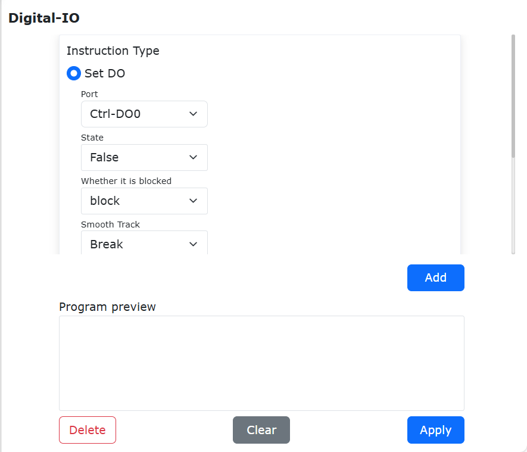

.. centered:: Figura 9.6-1 Interface da Instrução SetDO

Na instrução "GetDI/SPLCGetDI", selecione o valor do número da porta a ser obtido. A opção "Bloquear" significa que o estado DI é obtido após o movimento parar. A opção "Não Bloquear" significa que o estado DI é obtido durante o movimento da instrução anterior. Quando esta instrução é adicionada a uma thread auxiliar, a opção "Aplicar à Thread" deve ser selecionada como "Sim". Em outros lugares, selecione "Não". Após a seleção, clique nos botões "Adicionar" e "Aplicar".

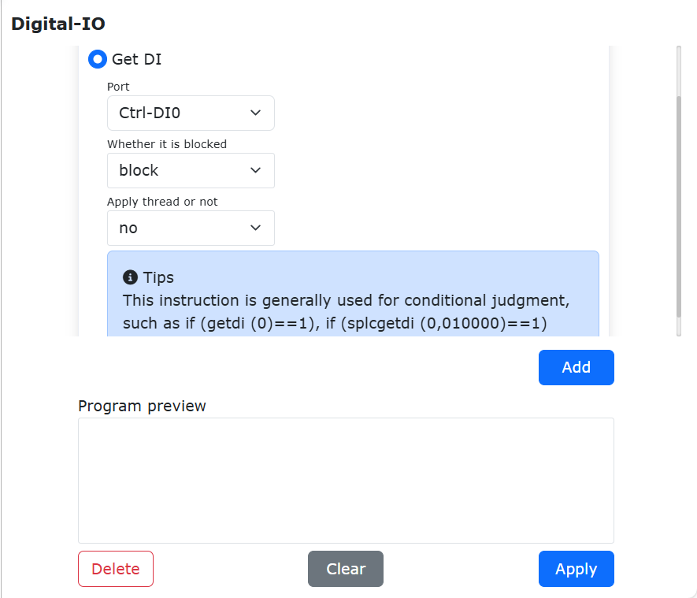

.. centered:: Figura 9.6-2 Interface da Instrução GetDI

Na instrução "GetDO", selecione o valor do número da porta desejado. A opção de bloqueio seleciona "Bloqueante" para obter o estado DO após a parada do movimento, e seleciona "Não bloqueante" para obter o estado DO durante o movimento anterior. Após a seleção, clique nos botões "Adicionar" e "Aplicar".

.. image:: coding/571.png
   :width: 6in
   :align: center

.. centered:: Figura 9.6-2-2 Interface da Instrução GetDO

Comandos de AI Analógico
++++++++++++++++++++++++++++++++++++

Clique no ícone "AI Analógico" para entrar na interface de edição do comando AI.

Esta instrução é dividida em três partes funcionais: configuração de saída analógica (SetAO/SPLCSetAO), obtenção de entrada analógica (GetAI/SPLCGetAI) e obtenção de saída analógica (GetAO).

Em "SetAO/SPLCSetAO", selecione a saída analógica a ser definida. Insira o valor a ser definido, faixa de 0-10. A opção "Bloquear" significa que o estado AO é definido após o movimento parar. A opção "Não Bloquear" significa que o estado AO é definido durante o movimento da instrução anterior. Quando esta instrução é adicionada a uma thread auxiliar, a opção "Aplicar à Thread" deve ser selecionada como "Sim". Em outros lugares, selecione "Não". Clique em "Adicionar" e "Aplicar".

.. image:: coding/085.png
   :width: 6in
   :align: center

.. centered:: Figura 9.6-3 Interface da Instrução SetAO

Em "GetAI/SPLCGetAI", selecione a entrada analógica a ser obtida. A opção "Bloquear" significa que o estado AI é obtido após o movimento parar. A opção "Não Bloquear" significa que o estado AI é obtido durante o movimento da instrução anterior. Quando esta instrução é adicionada a uma thread auxiliar, a opção "Aplicar à Thread" deve ser selecionada como "Sim". Em outros lugares, selecione "Não". Clique em "Adicionar" e "Aplicar".

.. image:: coding/086.png
   :width: 6in
   :align: center

.. centered:: Figura 9.6-4 Interface da Instrução GetAI

"GetAO" seleciona a entrada analógica a ser obtida. A opção de bloqueio seleciona "Bloqueante" para obter o estado AI após a parada do movimento, e seleciona "Não bloqueante" para obter o estado AI durante o movimento anterior. Clique em "Adicionar" e "Aplicar".

.. image:: coding/572.png
   :width: 6in
   :align: center

.. centered:: Figura 9.6-4-2 Interface da Instrução GetAO

Comandos de IO Virtual
++++++++++++++++++++++++++++++++++++

Clique no ícone "IO Virtual" para entrar na interface de edição do comando Vir-IO.

Esta instrução é uma instrução de controle IO virtual que pode definir estados DI e AI simulados externos e obter estados DI e AI simulados.

.. image:: coding/087.png
   :width: 6in
   :align: center

.. centered:: Figura 9.6-5 Interface da Instrução Vir-IO

Comandos de IO de Extensão
++++++++++++++++++++++++++++++++++++

Clique no ícone "IO de Extensão" para entrar na interface de edição do comando Aux-IO.

Aux-IO é uma função de instrução para comunicação entre o robô e o CLP para controlar IO de extensão externa. É necessário estabelecer comunicação UDP entre o robô e o CLP. Com base nas 16 entradas/saídas originais, pode-se estender para 128 entradas/saídas. O uso desta instrução é semelhante ao uso de IO geral descrito anteriormente. O uso desta função requer alguma habilidade técnica. Entre em contato conosco para obter suporte.

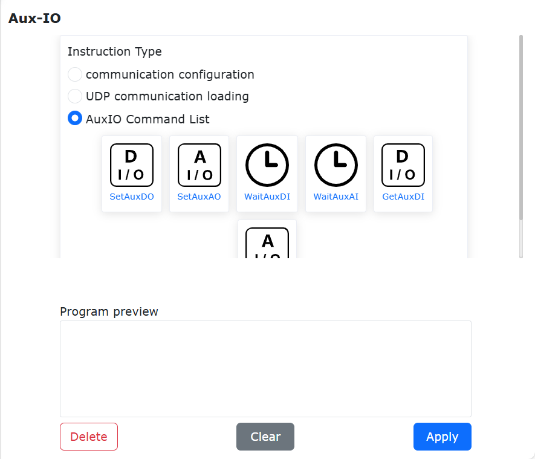

.. centered:: Figura 9.6-6 Interface da Instrução Aux-IO

Comandos de DO de Movimento
++++++++++++++++++++++++++++++++++++

Clique no ícone "DO de Movimento" para entrar na interface de edição do comando MoveDO.

Esta instrução é dividida em modo de saída contínua e modo de saída única.

- Modo de saída contínua: Durante o movimento linear, permite a saída contínua de sinais DO em intervalos definidos.

.. image:: coding/089.png
   :width: 6in
   :align: center

.. centered:: Figura 9.6-7 Interface de Saída Contínua da Instrução MoveDO

- Modo de saída única: Oferece duas opções: saída durante o segmento de velocidade constante e configuração livre. O tempo de ativação da saída após o início do movimento e o tempo de desativação da saída antes do fim do movimento, faixa [0, 1000].

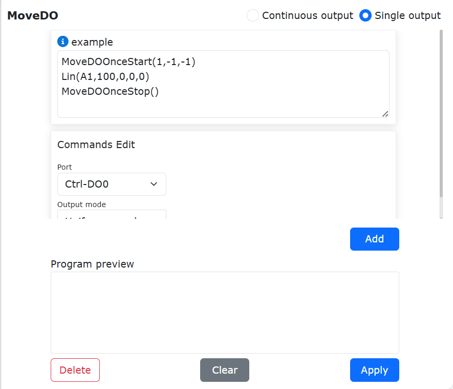

.. centered:: Figura 9.6-8 Interface de Saída Única da Instrução MoveDO

Comandos de AO de Movimento
++++++++++++++++++++++++++++++++++++

Clique no ícone "AO de Movimento" para entrar na interface de edição do comando MoveAO.

1. Visão Geral

Quando usado em conjunto com instruções de movimento, esta instrução permite a saída proporcional de sinais AO com base na velocidade TCP em tempo real durante o movimento.

2. Explicação da Instrução MoveAO

A instrução MoveAO está localizada na área de edição de instruções do programa de ensino, com o ícone Instrução de Controle - MoveAO.

.. image:: coding/091.png
   :width: 6in
   :align: center

.. centered:: Figura 9.6-9 Instrução MoveAO

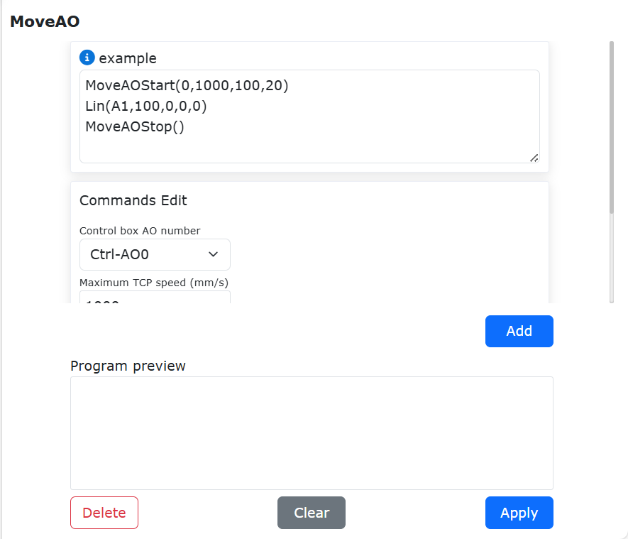

.. centered:: Figura 9.6-10 Detalhes da Instrução MoveAO

- Número AO: Selecionar na lista suspensa, Ctrl-AO0 corresponde ao AO0 do painel de controle, Ctrl-AO1 corresponde ao AO1 do painel de controle, End-AO0 corresponde ao AO0 da extremidade.
  
- Velocidade TCP Máxima: O valor da velocidade TCP máxima do robô. Função: Forma uma proporção com a velocidade TCP em tempo real.
  
- Porcentagem AO para Velocidade TCP Máxima: A porcentagem AO correspondente à velocidade TCP máxima do robô. Função: Define o limite superior da saída AO.
  
- Porcentagem AO para Compensação de Zona Morta: Quando a válvula proporcional tem zona morta, este parâmetro pode ser definido para garantir a saída AO. Função: Define o limite inferior da saída AO.

.. important:: 
   Fórmula de cálculo: Porcentagem de saída AO = Velocidade TCP em tempo real / Velocidade TCP Máxima Definida * Porcentagem AO para Velocidade TCP Máxima Definida.

   As instruções de movimento compatíveis com esta instrução são: PTP/LIN/ARC/CIRCLE/SPLINE/NSPLINE/SERVOJ.

Comandos de Sistema de Coordenadas
++++++++++++++++++++++++++++++++++++++++++++++

Clique no ícone "Sistema de Coordenadas" para entrar na interface de edição do comando ToolList.

Selecione o nome do sistema de coordenadas da ferramenta e clique em "Aplicar" para adicionar a instrução ao programa. Quando o programa executa esta instrução, o sistema de coordenadas da ferramenta do robô é definido.

.. image:: coding/093.png
   :width: 6in
   :align: center

.. centered:: Figura 9.6-11 Interface da Instrução ToolList

Comandos de Alternância de Modo
++++++++++++++++++++++++++++++++++++

Clique no ícone "Alternância de Modo" para entrar na interface de edição do comando Mode.

Esta instrução pode alternar o robô para o modo manual. Geralmente é adicionada ao final de um programa para que o robô mude automaticamente para o modo manual após a execução do programa, permitindo que o usuário o arraste.

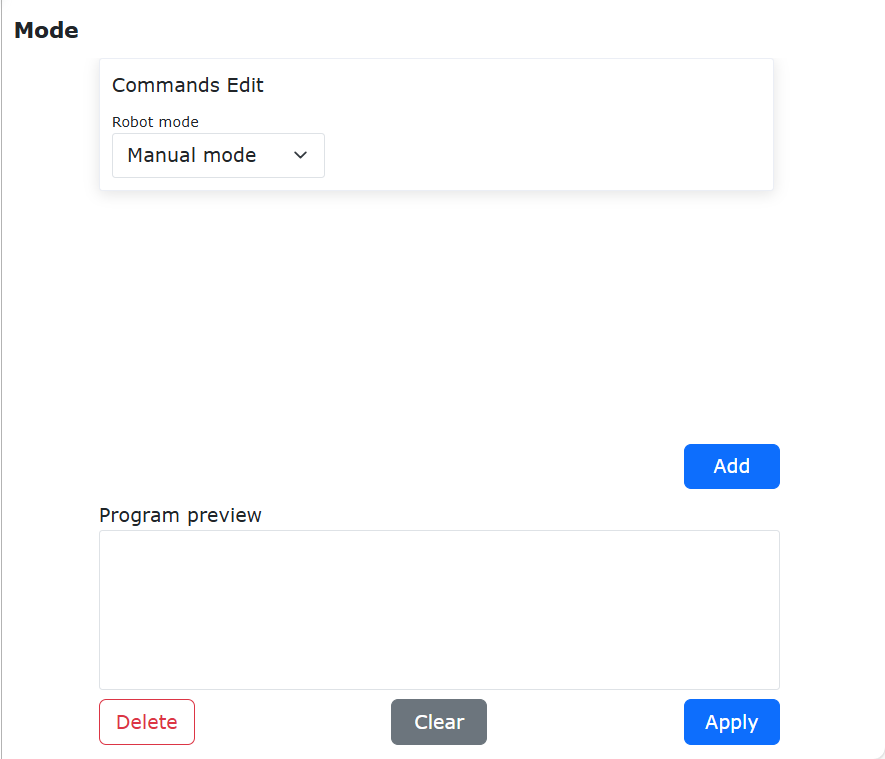

.. centered:: Figura 9.6-12 Interface da Instrução Mode

Comandos de Nível de Colisão
++++++++++++++++++++++++++++++++++++

Clique no ícone "Nível de Colisão" para entrar na interface de edição do comando Collision.

Esta instrução define o nível de colisão. Através desta instrução, o nível de colisão de cada eixo pode ser ajustado em tempo real durante a execução do programa, permitindo uma implantação mais flexível em cenários de aplicação.

.. image:: coding/095.png
   :width: 6in
   :align: center

.. centered:: Figura 9.6-13 Interface da Instrução Collision

Comandos de Aceleração
++++++++++++++++++++++++++++++++++++

Clique no ícone "Aceleração" para entrar na interface de edição do comando Acc.

A instrução Acc permite definir a aceleração do robô individualmente. Ao ajustar o fator de escala da aceleração nas instruções de movimento, é possível aumentar ou diminuir o tempo de aceleração/desaceleração, tornando o tempo de ciclo das ações do robô ajustável.

.. image:: coding/096.png
   :width: 6in
   :align: center

.. centered:: Figura 9.6-14 Interface da Instrução Acc

Interface de Instruções de Periféricos 
~~~~~~~~~~~~~~~~~~~~~~~~~~~~~~~~~~~~~~~~~~~~~~~~~~~~

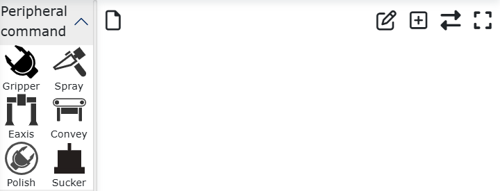

.. centered:: Figura 9.7 Interface de Instruções de Periféricos  

Comando Garra
++++++++++++++++

Clique no ícone "Garra" para entrar na interface de edição do comando Gripper.

Esta instrução é dividida em instruções de controle de movimento da garra e instruções de ativação/reset da garra. Na instrução de controle da garra, são exibidos os números das garras que foram configuradas e ativadas. O usuário pode editar através da caixa de edição ou ajustar a barra deslizante para o valor desejado para definir a abertura/fechamento da garra, velocidade de abertura/fechamento e torque de abertura/fechamento. Os valores são em porcentagem. A opção de bloqueio: selecionar "Bloquear" significa que o movimento da garra aguardará a conclusão da instrução de movimento anterior antes de executar; selecionar "Não Bloquear" significa que o movimento da garra ocorrerá em paralelo com a instrução de movimento anterior. Clique nos botões "Adicionar" e "Aplicar" para salvar os valores definidos no arquivo de ensino. A instrução de reset/ativação da garra exibe os números das garras configuradas, permitindo adicionar instruções de reset/ativação ao programa.

.. image:: coding/098.png
   :width: 6in
   :align: center

.. centered:: Figura 9.7-1 Interface da Instrução Gripper

Comando Pistola de Pintura
++++++++++++++++++++++++++++++

Clique no ícone "Pistola de Pintura" para entrar na interface de edição do comando Spray.

Esta instrução é relacionada à pintura, controlando a pistola para "Iniciar Pintura", "Parar Pintura", "Iniciar Limpeza" e "Parar Limpeza". Ao editar este comando de programa, certifique-se de que o periférico da pistola de pintura já foi configurado. Consulte a seção de periféricos do robô para mais detalhes.

.. centered:: Figura 9.7-2 Interface da Instrução Spray

Comando Eixo Externo
+++++++++++++++++++++++

Clique no ícone "Eixo Externo" para entrar na interface de edição do comando EAxis. Selecione o modo de combinação:

- Controlador + Servo Driver (485)
- Controlador + CLP (UDP)

Selecione Controlador + CLP (UDP). Esta instrução é para cenários que usam eixos externos. Usada em combinação com a instrução PTP, pode decompor o movimento na direção X de um ponto no espaço para o movimento do eixo externo. Selecione o número do eixo externo, escolha o modo de movimento como "Síncrono", selecione o ponto de destino. Clique em "Adicionar" e "Aplicar" para salvar a instrução.

.. image:: coding/100.png
   :width: 6in
   :align: center

.. centered:: Figura 9.7-3 Interface da Instrução EAxis

Selecione Controlador + Servo Driver (485). Esta instrução permite configurar os parâmetros do eixo de extensão. Defina diferentes parâmetros de acordo com o modo de controle. Para eixos de extensão já configurados, seu ponto zero pode ser definido.

.. image:: coding/101.png
   :width: 6in
   :align: center

.. centered:: Figura 9.7-4 Interface da Instrução do Eixo de Extensão

Comando Esteira Transportadora
+++++++++++++++++++++++++++++++++++++

Clique no ícone "Esteira Transportadora" para entrar na interface de edição do comando Convey.

Esta instrução inclui quatro comandos: detecção de posição em tempo real, detecção de IO em tempo real, ativação de rastreamento e desativação de rastreamento. Consulte a seção de periféricos do robô.

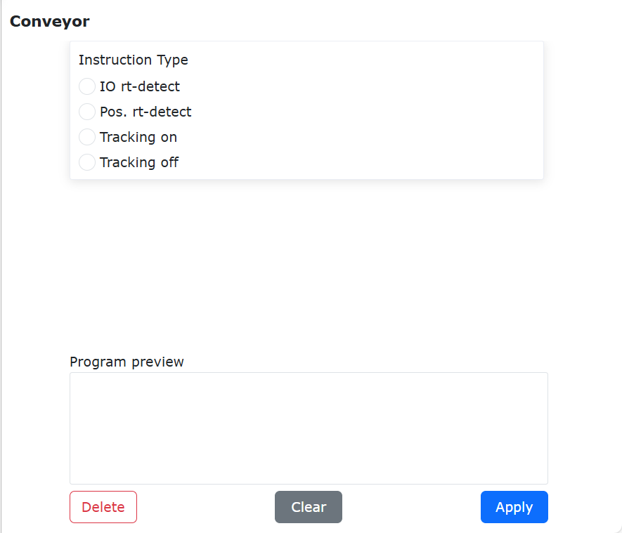

.. centered:: Figura 9.7-5 Interface da Instrução Conveyor

Função de Movimento de Rastreamento no Local da Esteira Transportadora
***********************************************************************

Visão Geral
"""""""""""""""""""""""""""""""""""

Esta função permite que o robô identifique e rastreie sincronizadamente objetos em movimento em uma esteira transportadora e, em seguida, realize um movimento "relativamente estacionário" entre o robô e o objeto sem parar a esteira.

Procedimento Operacional
""""""""""""""""""""""""""""""""""""""""""""""""""""""""""""""""""""""

**Passo 1**: Clique em "Aplicativos Auxiliares" - "Pacote de Processo" - "Rastreamento de Esteira" para configurar os parâmetros de rastreamento da esteira, incluindo "Configuração I/O", "Configuração de Parâmetros", "Compensação do Ponto de Pegada" (necessário apenas para a função "Rastreamento com Pegada") e "Configuração dos Pontos de Referência". Na "Configuração dos Pontos de Referência", a posição do "Ponto Inicial a" é a posição do objeto quando o movimento da esteira começa; a posição do "Ponto Final b" é a posição do objeto quando o movimento da esteira termina. Para detalhes operacionais, consulte os capítulos correspondentes.

**Passo 2**: O movimento de rastreamento usa o sistema de coordenadas da peça como o sistema de coordenadas da esteira, portanto, o sistema de coordenadas da peça precisa ser configurado. Clique em "Configuração Inicial" - "Básico", selecione "Sistema de Coordenadas da Peça", clique para selecionar um sistema de coordenadas da peça diferente de "wobjcoord0" para calibração. Consulte os capítulos correspondentes para o método de calibração.

**Passo 3**: Clique em "Teach Program" - "Program Programming" - "Esteira" para entrar na página de configuração da função esteira.

**Passo 4**: Clique no botão "Habilitar Rastreamento", selecione "Movimento de Rastreamento" como modo de trabalho e clique no botão "Adicionar".

.. image:: coding/590.png
   :width: 6in
   :align: center

.. centered:: Figura 9.7-5-1 Configurações de Habilitação de Rastreamento

**Passo 5**: Clique no botão "Detecção I/O em Tempo Real", defina o tempo máximo de espera e clique no botão "Adicionar".

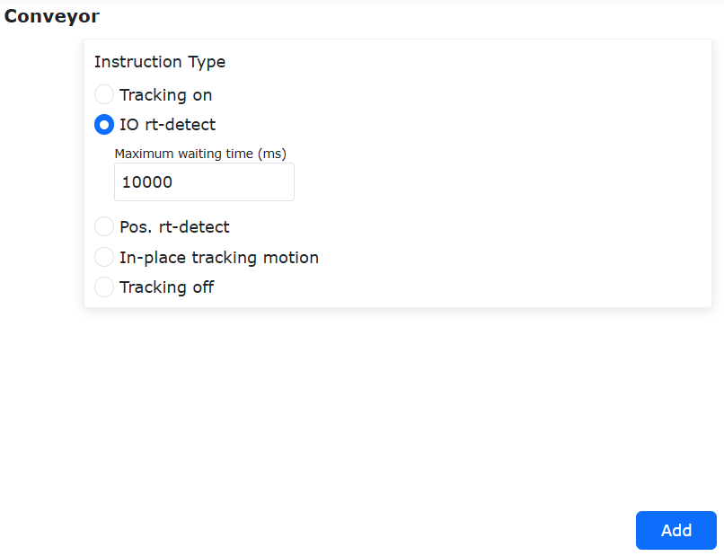

.. centered:: Figura 9.7-5-2 Configurações de Detecção I/O em Tempo Real

**Passo 6**: Clique no botão "Detecção de Posição em Tempo Real", selecione "Movimento de Rastreamento" como modo de trabalho e clique no botão "Adicionar".

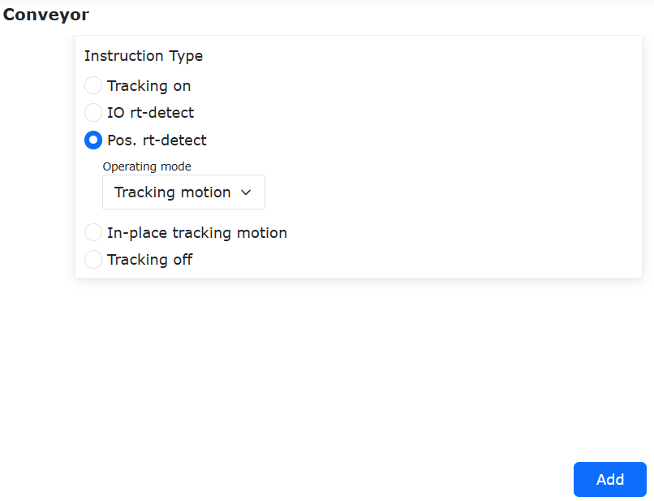

.. centered:: Figura 9.7-5-3 Configurações de Detecção de Posição em Tempo Real

**Passo 7**: Clique no botão "Movimento de Rastreamento no Local". Os modos de trabalho são "Tempo", "Distância" e "Tempo + Distância". No modo "Tempo", é necessário definir o tempo de movimento. O tempo é calculado a partir do início do rastreamento da esteira, e o rastreamento para após o tempo definido. No modo "Distância", é necessário definir a distância de movimento. A distância é calculada a partir do início do rastreamento da esteira, e o rastreamento para após a distância definida. No modo "Tempo + Distância", é necessário definir tanto o tempo quanto a distância de movimento. O cálculo começa a partir da ativação do rastreamento da esteira, e o rastreamento para quando uma das condições definidas (tempo ou distância) for atendida. Nota: Para a segurança do ambiente de movimento, a posição máxima de rastreamento desses três modos não excederá a posição do "Ponto Final b" durante a calibração da esteira. Clique no botão "Adicionar".

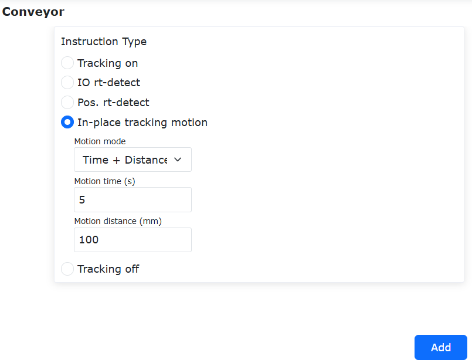

.. centered:: Figura 9.7-5-4 Configurações de Parâmetros de Movimento de Rastreamento no Local

**Passo 8**: Clique no botão "Desabilitar Rastreamento" e clique no botão "Adicionar".

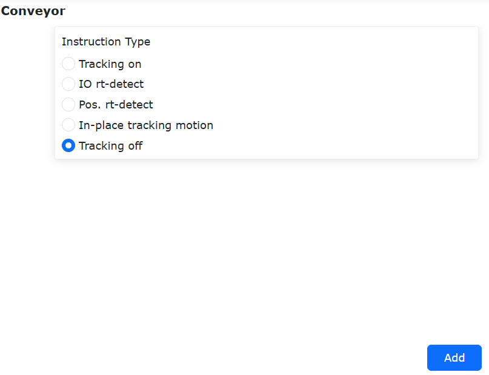

.. centered:: Figura 9.7-5-5 Configurações de Desabilitação de Rastreamento

**Passo 9**: O programa LUA gerado para o movimento de rastreamento no local da esteira é mostrado na figura. Execute o programa para realizar o movimento de rastreamento no local da esteira.

.. image:: coding/595.png
   :width: 4in
   :align: center

.. centered:: Figura 9.7-5-6 Programa LUA de Movimento de Rastreamento no Local da Esteira

Comando Equipamento de Lixamento
++++++++++++++++++++++++++++++++++++++++++++

Clique no ícone "Equipamento de Lixamento" para entrar na interface de edição do comando Polish.

Esta instrução permite definir a rotação, força de contato, distância de extensão e modo de controle do equipamento de lixamento.

.. image:: coding/103.png
   :width: 6in
   :align: center

.. centered:: Figura 9.7-6 Interface do Comando Polish

Interface de Instruções de Soldagem
~~~~~~~~~~~~~~~~~~~~~~~~~~~~~~~~~~~~~~~

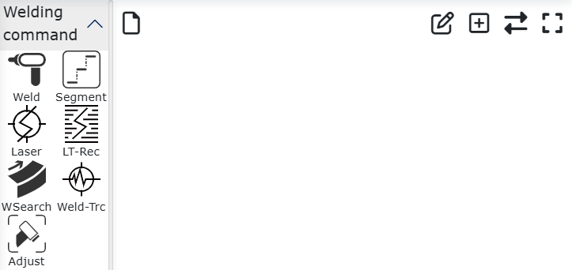

.. centered:: Figura 9.8 Interface de Instruções de Soldagem  

Comando Soldagem
++++++++++++++++

Clique no ícone "Soldagem" para entrar na interface de edição do comando Weld.

Esta instrução é usada principalmente para periféricos de fonte de solda. Antes de adicionar esta instrução, certifique-se de que a configuração da fonte de solda nos periféricos do usuário esteja concluída. Consulte a seção de periféricos do robô.

- Faixa de Tensão de Soldagem: 0~700 V
- Faixa de Corrente de Soldagem: 0~1000 A

.. important:: Ao configurar a saída AO, corrente de soldagem e tensão de soldagem, é necessário selecionar o tipo de I/O. Se "IO do Controlador" for selecionado, a saída AO correspondente deve ser escolhida.

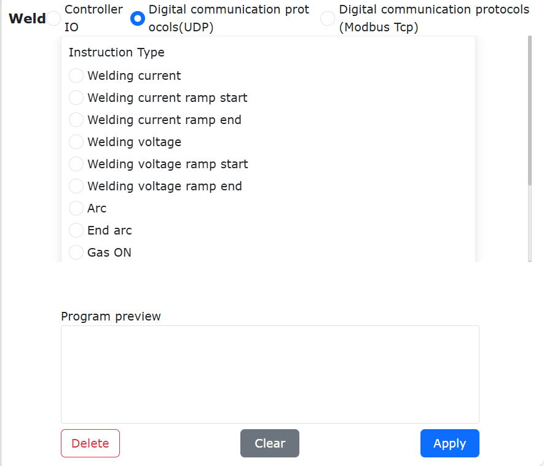

.. centered:: Figura 9.8-1 Interface da Instrução Weld

Comando Soldagem por Pontos
++++++++++++++++++++++++++++++++

Clique no ícone "Soldagem por Pontos" para entrar na interface de edição do comando Segment.

O robô colaborativo pode realizar operações de soldagem por pontos adicionando uma instrução de soldagem por pontos. Antes de adicionar a instrução de soldagem por pontos, é necessário selecionar o modo de soldagem por pontos e ensinar o ponto inicial e final. O modo de soldagem por pontos pode ser "Sem alteração de postura" ou "Com alteração de postura". O robô decide se altera a postura durante o processo da trajetória de soldagem com base no modo selecionado.

Ensine o ponto inicial "segment01" e o ponto final "segment02" para confirmar as posições inicial e final da trajetória de soldagem, conforme abaixo.

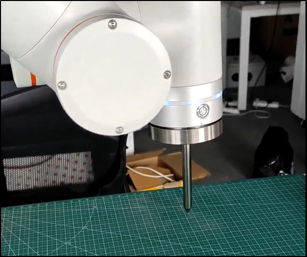

.. centered:: Figura 9.8-2-1 Ponto Inicial "segment01"

.. image:: coding/107.png
   :width: 3in
   :align: center

.. centered:: Figura 9.8-2-2 Ponto Final "segment02"

Adição da Instrução de Soldagem por Pontos
******************************************************

**Passo 1**: Crie um novo programa de usuário "testSegment1.lua", clique no botão "Soldagem por Pontos" para abrir a página de adição de instrução de soldagem por pontos.

.. image:: coding/108.png
   :width: 6in
   :align: center

.. centered:: Figura 9.8-2-3 Botão para Adicionar Instrução de Soldagem por Pontos

**Passo 2**: Na página de adição de instrução de soldagem por pontos, selecione o "Ponto Inicial" como "segment01" e o "Ponto Final" como "segment02".

.. image:: coding/109.png
   :width: 6in
   :align: center

.. centered:: Figura 9.8-2-4 Ponto Inicial e Final da Soldagem por Pontos

**Passo 3**: Configure a velocidade de teste, comprimento de execução, comprimento de não execução, modo de função, seleção de oscilação e regra de arredondamento. Clique sequencialmente no botão "Adicionar" e no botão "Aplicar".

**Passo 4**: Neste momento, a instrução de movimento de soldagem por pontos foi adicionada ao "testSegment1.lua".

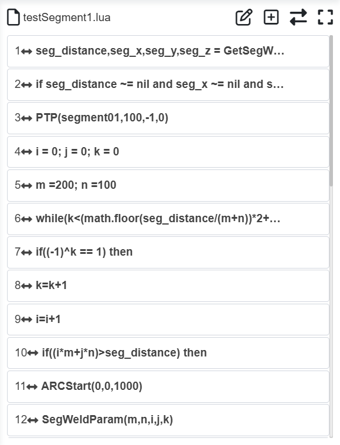

.. centered:: Figura 9.8-2-5 Adição da Instrução de Movimento de Soldagem por Pontos

Alteração de Postura na Trajetória de Movimento da Soldagem por Pontos
********************************************************************************************

O movimento de soldagem por pontos do robô colaborativo permite selecionar o modo de soldagem por pontos, que inclui os seguintes dois tipos:

**Sem alteração de postura**: O robô mantém a postura do ponto inicial da trajetória de soldagem durante todo o processo.

**Com alteração de postura**: O robô calcula a pose cartesiana e a posição articular para cada segmento da trajetória de soldagem, alterando a postura durante a execução da soldagem por pontos.

Abaixo, demonstramos o uso de "Sem alteração de postura" e "Com alteração de postura".

1. Sem alteração de postura
   
Abra a página de adição de instrução de soldagem por pontos. Selecione "Sem alteração de postura" em "Modo de Soldagem por Pontos". Selecione o ponto inicial como "segment01" e o ponto final como "segment02". Defina o comprimento de execução como 100, o comprimento de não execução como 50, e escolha outras configurações relevantes antes de salvar o programa.

.. image:: coding/111.png
   :width: 6in
   :align: center

.. centered:: Figura 9.8-2-6 Modo de Soldagem por Pontos Sem Alteração de Postura

2. Com alteração de postura
   
Abra a página de adição de instrução de soldagem por pontos. Selecione "Com alteração de postura" em "Modo de Soldagem por Pontos". Selecione o ponto inicial como "segment01" e o ponto final como "segment02". Defina o comprimento de execução como 100, o comprimento de não execução como 50, e escolha outras configurações relevantes antes de salvar o programa.

.. image:: coding/112.png
   :width: 6in
   :align: center

.. centered:: Figura 9.8-2-7 Modo de Soldagem por Pontos Com Alteração de Postura

3. Tipos de Execução da Soldagem por Pontos

Ao executar o programa, a operação da soldagem por pontos do robô é dividida nos seguintes tipos:

1) Se o modo de função for definido como "Executar função no primeiro segmento", a oscilação for definida como "Executar oscilação no segmento", e a regra de arredondamento for "Sem arredondamento". O robô executará movimento oscilante por 100mm e movimento linear por 50mm alternadamente, parando ao atingir o ponto final.

.. image:: coding/113.png
   :width: 6in
   :align: center

.. centered:: Figura 9.8-2-8 Executar Oscilação no Primeiro Segmento, Sem Arredondamento

2) Se o modo de função for definido como "Não executar função no primeiro segmento", a oscilação for definida como "Não executar oscilação no segmento", e a regra de arredondamento for "Sem arredondamento". O robô executará movimento oscilante por 50mm e movimento linear por 100mm alternadamente, parando ao atingir o ponto final.

.. image:: coding/114.png
   :width: 6in
   :align: center

.. centered:: Figura 9.8-2-9 Não Executar Oscilação no Primeiro Segmento, Sem Arredondamento

3) Se o modo de função for definido como "Executar função no primeiro segmento", a oscilação for definida como "Executar oscilação no segmento", e a regra de arredondamento for "Arredondamento de ciclo". O robô executará movimento oscilante por 100mm e movimento linear por 50mm alternadamente. Após o último ciclo completo, se a distância restante for menor que 150mm, a oscilação para.

.. image:: coding/115.png
   :width: 6in
   :align: center

.. centered:: Figura 9.8-2-10 Executar Oscilação no Primeiro Segmento, Arredondamento de Ciclo

4) Se o modo de função for definido como "Executar função no primeiro segmento", a oscilação for definida como "Não executar oscilação no segmento", e a regra de arredondamento for "Arredondamento de ciclo". O robô executará movimento oscilante por 50mm e movimento linear por 100mm alternadamente. Após o último ciclo completo, se a distância restante for menor que 150mm, a oscilação para.

.. image:: coding/116.png
   :width: 6in
   :align: center

.. centered:: Figura 9.8-2-11 Não Executar Oscilação no Primeiro Segmento, Arredondamento de Ciclo

5) Se o modo de função for definido como "Executar função no primeiro segmento", a oscilação for definida como "Executar oscilação no segmento", e a regra de arredondamento for "Arredondamento de segmento único". O robô executará movimento oscilante por 100mm e movimento linear por 50mm alternadamente. Após o último ciclo, se o próximo segmento for um planejamento de oscilação de 100mm e a distância restante for menor que 100mm, a oscilação para. Se o próximo segmento for um planejamento de movimento linear de 50mm e a distância restante for menor que 50mm, o movimento para.

.. image:: coding/117.png
   :width: 6in
   :align: center

.. centered:: Figura 9.8-2-12 Executar Oscilação no Primeiro Segmento, Arredondamento de Segmento Único

6) Se o modo de função for definido como "Executar função no primeiro segmento", a oscilação for definida como "Não executar oscilação no segmento", e a regra de arredondamento for "Arredondamento de segmento único". O robô executará movimento oscilante por 50mm e movimento linear por 100mm alternadamente. Após o último ciclo, se o próximo segmento for um planejamento de oscilação de 50mm e a distância restante for menor que 50mm, a oscilação para. Se o próximo segmento for um planejamento de movimento linear de 100mm e a distância restante for menor que 100mm, o movimento para.

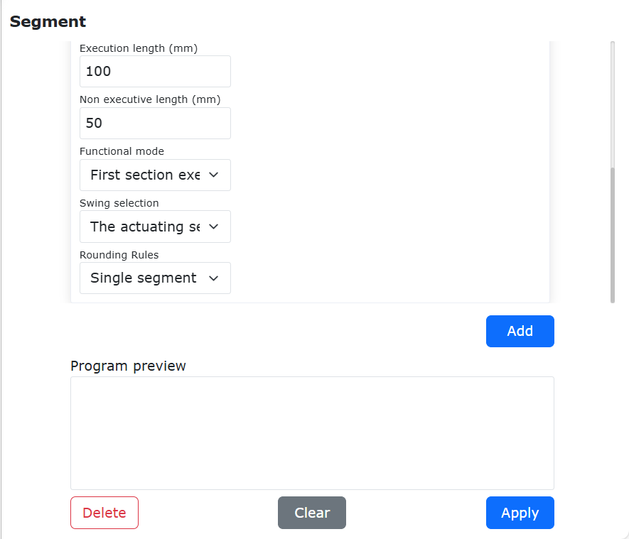

.. centered:: Figura 9.8-2-13 Não Executar Oscilação no Primeiro Segmento, Arredondamento de Segmento Único

4. Comparação de Postura
   
Ao configurar diferentes modos de soldagem por pontos, a postura durante a execução da trajetória de soldagem do robô também será diferente. A comparação de postura durante a execução é a seguinte:

.. image:: coding/119.png
   :width: 3in
   :align: center

.. centered:: Figura 9.8-2-14 Postura Inicial da Trajetória de Soldagem

.. image:: coding/120.png
   :width: 3in
   :align: center

.. centered:: Figura 9.8-2-15 Sem Alteração de Postura Durante a Execução

.. image:: coding/121.png
   :width: 3in
   :align: center

.. centered:: Figura 9.8-2-16 Com Alteração de Postura Durante a Execução

Cenário Real da Soldagem por Pontos
********************************************
Em um ambiente de teste real, o robô precisa estar equipado com uma tocha de solda e outras configurações. Com base na instrução de soldagem por pontos criada, a operação de soldagem é realizada em uma placa de solda. O diagrama do cenário real é o seguinte:

.. image:: coding/122.png
   :width: 3in
   :align: center

.. centered:: Figura 9.8-2-17 Cenário Real da Soldagem por Pontos

Comando de Rastreamento a Laser
++++++++++++++++++++++++++++++++++++++++

Clique no ícone "Rastreamento a Laser" para entrar na interface de edição do comando Laser.

Esta instrução inclui três partes: comando laser, comando de rastreamento e comando de busca de posição. Antes de adicionar esta instrução, certifique-se de que o sensor de rastreamento a laser nos periféricos do usuário foi configurado com sucesso. Consulte a seção de periféricos do robô.

No módulo de carregamento do sensor, após selecionar a interface de "Comando do Sensor" correspondente com base na função, configure o comando do sensor:

**Ruiniu/Chuangxiang**: Insira o tipo de solda, faixa: 0~49 inteiro

.. image:: coding/123.png
   :width: 6in
   :align: center

.. centered:: Figura 9.8-3-1 Interface da Instrução Laser (Tipo de Solda)

**Quanshi**: Insira o número da tarefa, faixa: 0~255 inteiro

.. image:: coding/124.png
   :width: 6in
   :align: center

.. centered:: Figura 9.8-3-2 Interface da Instrução Laser (Número da Tarefa)

Função de Rastreamento Pontual do Sensor a Laser
*************************************************************

Visão Geral
""""""""""""""""""""""
Atualmente, o rastreamento pontual a laser é implementado com base no eixo de extensão. Foram adicionadas novas formas de rastreamento por tempo personalizado ou acionamento por IO para se adaptar a vários cenários de aplicação. Quando o rastreamento por tempo personalizado é selecionado, o tempo de rastreamento deve ser definido. O rastreamento a laser começa quando o programa começa a ser executado e termina quando o tempo definido é atingido. Quando o rastreamento por acionamento IO é selecionado, o programa Lua ou SDK é executado. O rastreamento ocorre quando o IO é acionado e termina quando o IO é desativado.

Fluxo de Operação para Rastreamento por Tempo Personalizado
"""""""""""""""""""""""""""""""""""""""""""""""""""""""""""""""""""""""""""

**Passo 1**: Clique em "Configurações Iniciais" - "Periféricos" - "Sensor a Laser Linear" - "Dispositivo Adaptado" para entrar na página de configuração. A página de configuração inclui "Configuração do Sensor", "Configuração e Carregamento da Comunicação", "Cálculo de Referência", etc. Clique em "Configuração do Sensor" para definir os parâmetros de filtragem da entrada do sensor. O valor máximo de diferença é definido de acordo com a situação real. Selecione "Dados Brutos (Sem Transformação)" para "Processamento de Dados". Defina o coeficiente de sensibilidade na direção X como 0. Defina as direções Y e Z de acordo com a situação real (recomendado 1). Clique em "Configuração e Carregamento da Comunicação" para inserir os parâmetros de comunicação correspondentes e conectar o sensor a laser. Consulte a seção correspondente do manual do usuário para configuração detalhada.

.. image:: coding/524.png
   :width: 6in
   :align: center

.. centered:: Figura 9.8-3-3 Configuração do Sensor a Laser Linear

**Passo 2**: Calibre o sistema de coordenadas da ferramenta e o sistema de coordenadas do sensor a laser. O sistema de coordenadas da ferramenta é calibrado usando o "Método de Seis Pontos", e o sistema de coordenadas do sensor a laser é calibrado usando o "Método de Cinco Pontos". O conteúdo da calibração do sistema de coordenadas da ferramenta e do sensor a laser não é o foco principal desta descrição de função. Consulte a seção correspondente do manual do usuário para obter detalhes sobre os métodos de calibração.

**Passo 3**: Ajuste a posição relativa entre a peça de trabalho e o feixe de laser conforme mostrado na figura abaixo, onde o retângulo preto é a peça de trabalho e o segmento de linha vermelho é o feixe de laser. O feixe de laser deve ser perpendicular à borda da peça de trabalho a ser rastreada. A direção do movimento da peça de trabalho é paralela ao feixe de laser. A peça de trabalho se move a uma velocidade constante, recomendada de 15 mm/s. Velocidades excessivamente altas podem degradar o efeito de rastreamento.

.. image:: coding/525.png
   :width: 2in
   :align: center

.. centered:: Figura 9.8-3-4 Esquema da Posição Relativa entre Peça de Trabalho e Feixe de Laser

**Passo 4**: Clique em "Programa de Ensino" - "Rastreamento a Laser" - "Gravação de Dados". Defina "Seleção de Função" como "Gravar e Reproduzir Simultaneamente". Defina "Tipo de Movimento de Rastreamento Pontual" como "Movimento do Robô". Defina "Modo de Acionamento do Rastreamento Pontual" como "Tempo". Defina a "Duração do Rastreamento" conforme necessário. Neste manual, usamos 21 segundos como exemplo. Os outros parâmetros são os mesmos do rastreamento a laser com eixo de extensão. Clique no botão "Adicionar" na parte inferior.

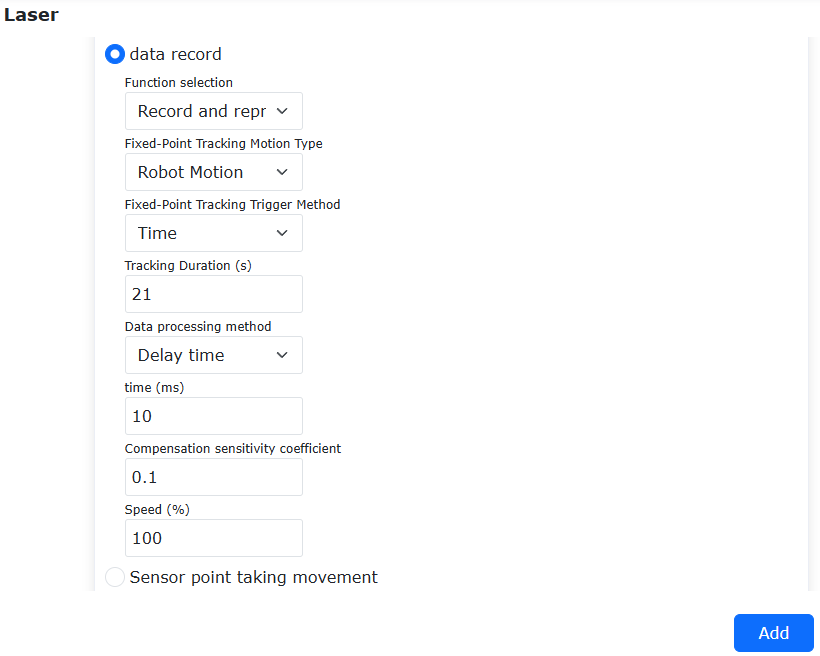

.. centered:: Figura 9.8-3-5 Configuração de Parâmetros de Rastreamento com Duração Personalizada

**Passo 5**: Clique em "Programa de Ensino" - "Rastreamento a Laser" - "Gravação de Dados". Defina "Seleção de Função" como "Parar Gravação". Clique no botão "Adicionar" para gerar o programa Lua. Quando este programa for executado, o robô rastreará por 21 segundos e então sairá do rastreamento.

.. image:: coding/527.png
   :width: 6in
   :align: center

.. centered:: Figura 9.8-3-6 Programa Lua Típico para Rastreamento com Duração Personalizada

Fluxo de Operação para Rastreamento por Acionamento IO
""""""""""""""""""""""""""""""""""""""""""""""""""""""""""""
**Passo 1**: Clique em "Configurações Iniciais" - "Periféricos" - "Sensor a Laser Linear" - "Dispositivo Adaptado" para entrar na página de configuração. A página de configuração inclui "Configuração do Sensor", "Configuração e Carregamento da Comunicação", "Cálculo de Referência", etc.

Clique em "Configuração do Sensor" para definir os parâmetros de filtragem da entrada do sensor. O valor máximo de diferença é definido de acordo com a situação real. Selecione "Dados Brutos (Sem Transformação)" para "Processamento de Dados". Defina o coeficiente de sensibilidade na direção X como 0. Defina as direções Y e Z de acordo com a situação real (recomendado 1). Clique em "Configuração e Carregamento da Comunicação" para inserir os parâmetros de comunicação correspondentes e conectar o sensor a laser. Consulte a seção correspondente do manual do usuário para configuração detalhada.

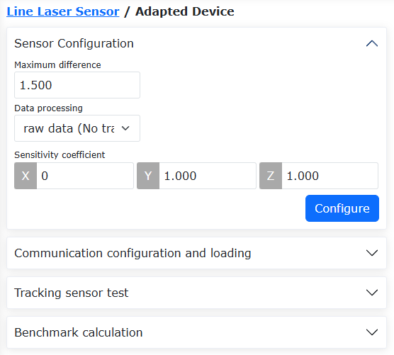

.. centered:: Figura 9.8-3-7 Configuração do Sensor a Laser Linear

**Passo 2**: Calibre o sistema de coordenadas da ferramenta e o sistema de coordenadas do sensor a laser. O sistema de coordenadas da ferramenta é calibrado usando o "Método de Seis Pontos", e o sistema de coordenadas do sensor a laser é calibrado usando o "Método de Cinco Pontos". O conteúdo da calibração do sistema de coordenadas da ferramenta e do sensor a laser não é o foco principal desta descrição de função. Consulte a seção correspondente do manual do usuário para obter detalhes sobre os métodos de calibração.

**Passo 3**: Ajuste a posição relativa entre a peça de trabalho e o feixe de laser conforme mostrado na figura abaixo, onde o retângulo preto é a peça de trabalho e o segmento de linha vermelho é o feixe de laser. O feixe de laser deve ser perpendicular à borda da peça de trabalho a ser rastreada. A direção do movimento da peça de trabalho é paralela ao feixe de laser. A peça de trabalho se move a uma velocidade constante, recomendada de 15 mm/s. Velocidades excessivamente altas podem degradar o efeito de rastreamento.

.. image:: coding/525.png
   :width: 2in
   :align: center

.. centered:: Figura 9.8-3-8 Esquema da Posição Relativa entre Peça de Trabalho e Feixe de Laser

**Passo 4**: Clique em "Programa de Ensino" - "Rastreamento a Laser" - "Gravação de Dados". Defina "Seleção de Função" como "Gravar e Reproduzir Simultaneamente". Defina "Tipo de Movimento de Rastreamento Pontual" como "Movimento do Robô". Defina "Modo de Acionamento do Rastreamento Pontual" como "IO". O rastreamento começa quando o IO é acionado e para quando o IO é desativado. Os outros parâmetros são os mesmos do rastreamento a laser com eixo de extensão. Clique no botão "Adicionar" na parte inferior.

.. image:: coding/529.png
   :width: 6in
   :align: center

.. centered:: Figura 9.8-3-9 Configuração de Parâmetros de Rastreamento por IO

**Passo 5**: Clique em "Programa de Ensino" - "Rastreamento a Laser" - "Gravação de Dados". Defina "Seleção de Função" como "Parar Gravação". Clique no botão "Adicionar" para gerar o programa Lua. Quando este programa for executado, o rastreamento começará quando o IO for acionado e terminará quando o IO for desativado.

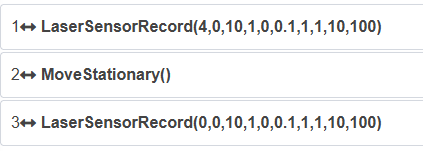

.. centered:: Figura 9.8-3-10 Programa Lua Típico para Rastreamento por IO

Comando de Gravação a Laser
++++++++++++++++++++++++++++++++++++++

Clique no ícone "Gravação a Laser" para entrar na interface de edição do comando LT-Rec.

Esta instrução permite extrair os pontos inicial e final da gravação de rastreamento a laser, permitindo que o robô se mova automaticamente para a posição inicial. É adequada para situações onde o movimento começa de fora da peça de trabalho e a gravação de rastreamento a laser é realizada. Ao mesmo tempo, o computador superior pode obter as informações dos pontos inicial e final dos dados gravados para movimentos subsequentes.

Permite ajustar a velocidade de reprodução do rastreamento a laser, permitindo que o robô grave a uma velocidade alta e depois replique na velocidade normal de soldagem, melhorando a eficiência do trabalho.

.. image:: coding/125.png
   :width: 6in
   :align: center

.. centered:: Figura 9.8-4 Interface da Instrução LT-Rec

Reprodução de Trajetória de Varredura a Laser com Oscilação Sobrep
****************************************************************************************************************

Visão Geral
""""""""""""""""""""""""""""""""""""""""""""""""
A função de reprodução de trajetória de varredura a laser com oscilação sobreposta refere-se à sobreposição de ondas triangulares / ondas triangulares em L vertical / ondas circulares no sentido horário / ondas circulares no sentido anti-horário / ondas senoidais / ondas senoidais em L vertical / ondas triangulares para soldagem vertical durante a reprodução da trajetória de varredura a laser. Suporta tanto a oscilação regular quanto a oscilação em pontos fixos, e pode ser adaptada ao movimento de eixos estendidos, conforme mostrado na Tabela 1-1.

.. centered:: Tabela 9.8-1 Modos de Reprodução de Trajetória de Varredura a Laser com Oscilação Sobrep

.. list-table::
   :widths: 40 30 30
   :header-rows: 0
   :align: center

   * - **Reprodução de Trajetória**
     - **Oscilação Regular**
     - **Oscilação em Pontos Fixos**

   * - Robô
     - Sim
     - Sim

   * - Eixo Estendido
     - Não
     - Sim

Reprodução de Trajetória de Varredura a Laser com Oscilação Regular Sobrep
""""""""""""""""""""""""""""""""""""""""""""""""""""""""""""""""""""""""""""""""""""""""""""""""""""""""""""""""""""""""""""""""""""""""""""""

**Passo 1**: Configure o sensor laser linear através do WebApp. Para detalhes operacionais desta função, consulte os capítulos correspondentes do manual do usuário.

**Passo 2**: Calibre o sistema de coordenadas da ferramenta através do WebApp. Para detalhes operacionais desta função, consulte os capítulos correspondentes do manual do usuário.

**Passo 3**: Calibre o sistema de coordenadas do sensor através do WebApp. Para detalhes operacionais desta função, consulte os capítulos correspondentes do manual do usuário.

**Passo 4**: Ensine pontos de movimento através do WebApp. Ensine os pontos de movimento para a reprodução da trajetória de varredura a laser da peça alvo e escreva o programa LUA básico para os comandos de movimento LIN correspondentes do robô. Para detalhes operacionais desta função, consulte os capítulos correspondentes do manual do usuário.

**Passo 5**: Configure o número dos parâmetros de oscilação através do WebApp. Para detalhes operacionais desta função, consulte os capítulos correspondentes do manual do usuário.

**Passo 6**: Comando de gravação a laser. Na interface principal do WebApp, clique em "Teach Program" -> "Program Programming" para acessar a área "Comandos de Soldagem".

.. image:: coding/609.png
   :width: 4in
   :align: center

.. centered:: Figura 9.8-4-1 Área "Comandos de Soldagem"
 
**Passo 7**: Iniciar gravação a laser. Na área "Comandos de Soldagem", clique no botão "Gravação a Laser" para acessar a área de configuração do comando "LT-Rec".

Na área de configuração "Tipo de Comando", clique no botão "Gravação de Dados de Solda", selecione a opção "Iniciar Gravação" no menu suspenso "Seleção de Função"; defina o tempo de gravação com atraso no campo de entrada "Tempo de Atraso".

Na área de configuração do comando "LT-Rec", clique no botão "Adicionar". O campo "Pré-visualização do Programa" exibirá o programa LUA pré-gerado. Clique em "Aplicar" para concluir a operação de iniciar gravação a laser.

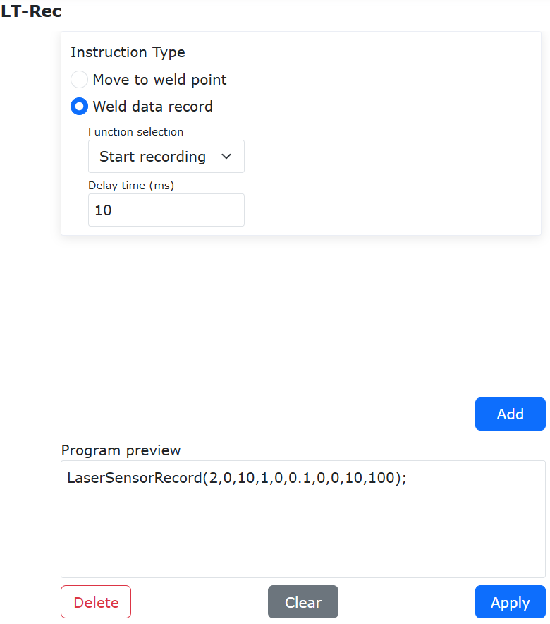

.. centered:: Figura 9.8-4-2 Iniciar Gravação a Laser

**Passo 8**: Parar gravação a laser. Na área de configuração do comando "LT-Rec", na área de configuração "Tipo de Comando", clique no botão "Gravação de Dados de Solda", selecione a opção "Parar Gravação" no menu suspenso "Seleção de Função"; defina o tempo de gravação com atraso no campo de entrada "Tempo de Atraso".

Na área de configuração do comando "LT-Rec", clique no botão "Adicionar". O campo "Pré-visualização do Programa" exibirá o programa LUA pré-gerado. Clique em "Aplicar" para concluir a operação de parar gravação a laser.

.. image:: coding/611.png
   :width: 6in
   :align: center

.. centered:: Figura 9.8-4-3 Parar Gravação a Laser

**Passo 9**: Mover para ponto de solda. Na área de configuração do comando "LT-Rec", na área de configuração "Tipo de Comando", clique no botão "Mover para Ponto de Solda", selecione o modo de movimento "PTP" ou "LIN" no menu suspenso "Modo de Movimento"; defina a velocidade do comando no campo de entrada "Velocidade"; clique no botão "Início" ou "Fim" para selecionar o ponto de movimento alvo.

Na área de configuração do comando "LT-Rec", clique no botão "Adicionar". O campo "Pré-visualização do Programa" exibirá o programa LUA pré-gerado. Clique em "Aplicar" para concluir a operação.

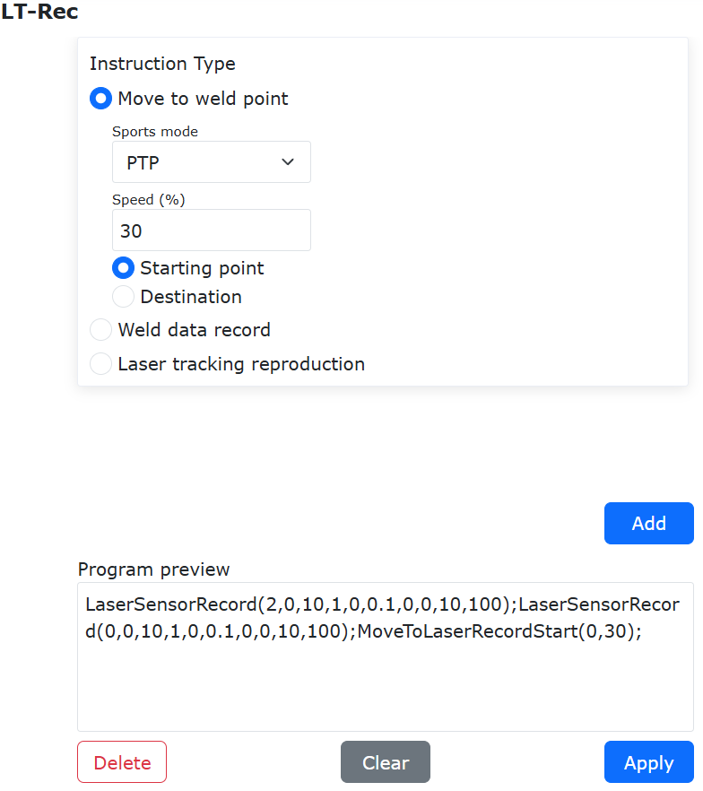

.. centered:: Figura 9.8-4-4 Mover para Ponto de Solda

**Passo 10**: Reprodução de trajetória a laser. Na área de configuração do comando "LT-Rec", na área de configuração "Tipo de Comando", clique no botão "Gravação de Dados de Solda", selecione a opção "Reprodução de Trajetória" no menu suspenso "Seleção de Função"; defina o tempo de gravação com atraso no campo de entrada "Tempo de Atraso"; defina a velocidade do comando no campo de entrada "Velocidade".

Na área de configuração do comando "LT-Rec", clique no botão "Adicionar". O campo "Pré-visualização do Programa" exibirá o programa LUA pré-gerado. Clique em "Aplicar" para concluir a operação de reprodução de trajetória a laser.

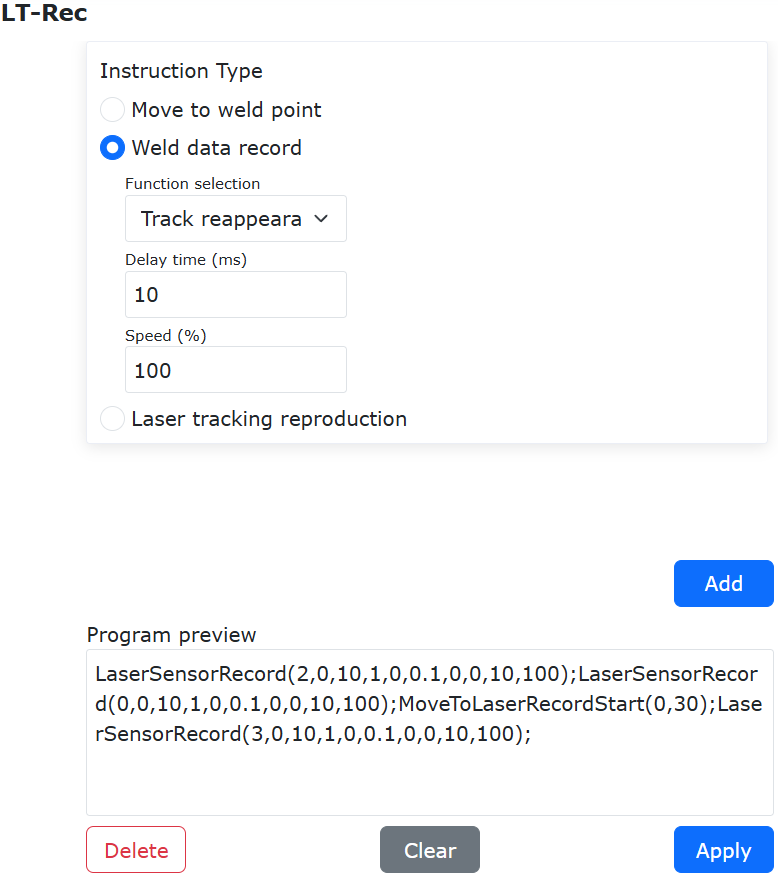

.. centered:: Figura 9.8-4-5 Reprodução de Trajetória a Laser

**Passo 11**: Sobrep oscilação regular. Na área de configuração do comando "LT-Rec", na área de configuração "Tipo de Comando", clique no botão "Reprodução de Rastreamento a Laser", selecione a opção "Oscilação Regular" no menu suspenso "Sobrep Oscilação"; selecione o número dos parâmetros de oscilação configurado no menu suspenso "Selecionar Número" do Passo 5.

Na área de configuração do comando "LT-Rec", clique no botão "Adicionar". O campo "Pré-visualização do Programa" exibirá o programa LUA pré-gerado. Clique em "Aplicar" para concluir a operação de sobreposição de oscilação regular.

.. centered:: Figura 9.8-4-6 Sobrep Oscilação Regular

**Passo 12**: Escreva o programa LUA para reprodução de trajetória de varredura a laser + oscilação regular. Ajuste a ordem dos comandos LUA gerados do Passo 4 ao Passo 11 e execute o programa LUA para implementar a função de reprodução de trajetória de varredura a laser com oscilação regular sobreposta.

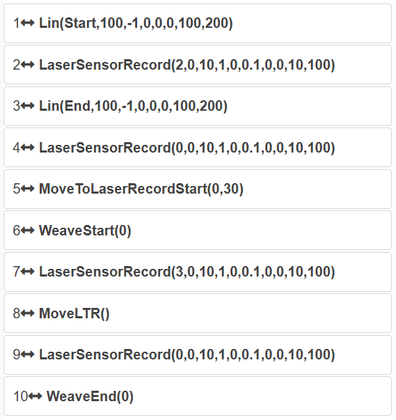

.. centered:: Figura 9.8-4-7 Programa LUA para Reprodução de Trajetória de Varredura a Laser com Oscilação Regular Sobrep

Reprodução de Trajetória de Varredura a Laser com Oscilação em Pontos Fixos Sobrep
""""""""""""""""""""""""""""""""""""""""""""""""""""""""""""""""""""""""""""""""""""""""""""""""""""""""""""""""""""""""""""""""""""""""""""""

**Passo 1**: Configure o sensor laser linear através do WebApp. Para detalhes operacionais desta função, consulte os capítulos correspondentes do manual do usuário.

**Passo 2**: Configure o eixo estendido através do WebApp. Para detalhes operacionais desta função, consulte os capítulos correspondentes do manual do usuário.

**Passo 3**: Calibre o sistema de coordenadas da ferramenta através do WebApp. Para detalhes operacionais desta função, consulte os capítulos correspondentes do manual do usuário.

**Passo 4**: Calibre o sistema de coordenadas do sensor através do WebApp. Para detalhes operacionais desta função, consulte os capítulos correspondentes do manual do usuário.

**Passo 5**: Ensine pontos de movimento através do WebApp. Ensine os pontos de movimento para a reprodução da trajetória de varredura a laser da peça alvo e escreva o programa LUA básico para os comandos de movimento LIN correspondentes do robô e movimento assíncrono do eixo estendido. Para detalhes operacionais desta função, consulte os capítulos correspondentes do manual do usuário.

**Passo 6**: Configure o número dos parâmetros de oscilação através do WebApp. Para detalhes operacionais desta função, consulte os capítulos correspondentes do manual do usuário.

**Passo 7**: Comando de gravação a laser. Na interface principal do WebApp, clique em "Teach Program" -> "Program Programming" para acessar a área "Comandos de Soldagem".

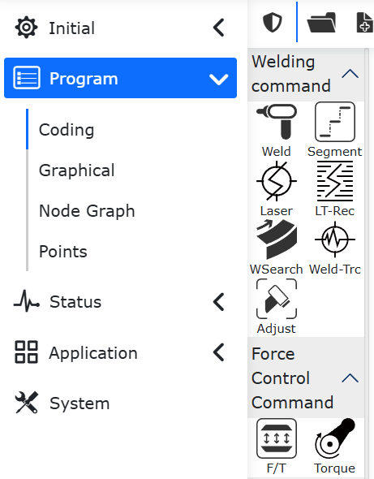

.. centered:: Figura 9.8-4-8 Área "Comandos de Soldagem"

**Passo 8**: Iniciar gravação a laser. Na área "Comandos de Soldagem", clique no botão "Gravação a Laser" para acessar a área de configuração do comando "LT-Rec".

Na área de configuração "Tipo de Comando", clique no botão "Gravação de Dados de Solda", selecione a opção "Iniciar Gravação" no menu suspenso "Seleção de Função"; defina o tempo de gravação com atraso no campo de entrada "Tempo de Atraso".

Na área de configuração do comando "LT-Rec", clique no botão "Adicionar". O campo "Pré-visualização do Programa" exibirá o programa LUA pré-gerado. Clique em "Aplicar" para concluir a operação de iniciar gravação a laser.

.. image:: coding/617.png
   :width: 6in
   :align: center

.. centered:: Figura 9.8-4-9 Iniciar Gravação a Laser
 
**Passo 9**: Parar gravação a laser. Na área de configuração do comando "LT-Rec", na área de configuração "Tipo de Comando", clique no botão "Gravação de Dados de Solda", selecione a opção "Parar Gravação" no menu suspenso "Seleção de Função"; defina o tempo de gravação com atraso no campo de entrada "Tempo de Atraso".

Na área de configuração do comando "LT-Rec", clique no botão "Adicionar". O campo "Pré-visualização do Programa" exibirá o programa LUA pré-gerado. Clique em "Aplicar" para concluir a operação de parar gravação a laser.

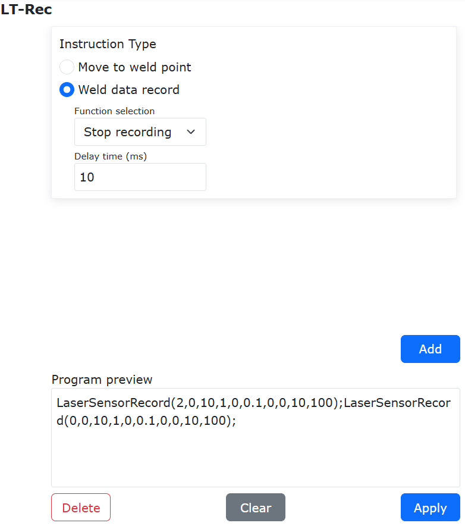

.. centered:: Figura 9.8-4-10 Parar Gravação a Laser
  
**Passo 10**: Mover para ponto de solda. Na área de configuração do comando "LT-Rec", na área de configuração "Tipo de Comando", clique no botão "Mover para Ponto de Solda", selecione o modo de movimento "PTP" ou "LIN" no menu suspenso "Modo de Movimento"; defina a velocidade do comando no campo de entrada "Velocidade"; clique no botão "Início" ou "Fim" para selecionar o ponto de movimento alvo.

Na área de configuração do comando "LT-Rec", clique no botão "Adicionar". O campo "Pré-visualização do Programa" exibirá o programa LUA pré-gerado. Clique em "Aplicar" para concluir a operação.

.. image:: coding/619.png
   :width: 6in
   :align: center

.. centered:: Figura 9.8-4-11 Mover para Ponto de Solda
  
**Passo 11**: Reprodução de trajetória a laser. Na área de configuração do comando "LT-Rec", na área de configuração "Tipo de Comando", clique no botão "Gravação de Dados de Solda", selecione a opção "Reprodução de Trajetória" no menu suspenso "Seleção de Função"; defina o tempo de gravação com atraso no campo de entrada "Tempo de Atraso"; defina a velocidade do comando no campo de entrada "Velocidade".

Na área de configuração do comando "LT-Rec", clique no botão "Adicionar". O campo "Pré-visualização do Programa" exibirá o programa LUA pré-gerado. Clique em "Aplicar" para concluir a operação de reprodução de trajetória a laser.

.. image:: coding/620.png
   :width: 6in
   :align: center

.. centered:: Figura 9.8-4-12 Reprodução de Trajetória a Laser
  
**Passo 12**: Sobrep oscilação em pontos fixos. Na área de configuração do comando "LT-Rec", na área de configuração "Tipo de Comando", clique no botão "Reprodução de Rastreamento a Laser", selecione a opção "Oscilação em Pontos Fixos" no menu suspenso "Sobrep Oscilação"; selecione o número dos parâmetros de oscilação configurado no menu suspenso "Selecionar Número" do Passo 6.

Selecione a opção "Ponto de Referência" no menu suspenso "Referência de Oscilação"; selecione o ponto de referência no menu suspenso "Ponto de Referência".

Na área de configuração do comando "LT-Rec", clique no botão "Adicionar". O campo "Pré-visualização do Programa" exibirá o programa LUA pré-gerado. Clique em "Aplicar" para concluir a operação de sobreposição de oscilação regular.

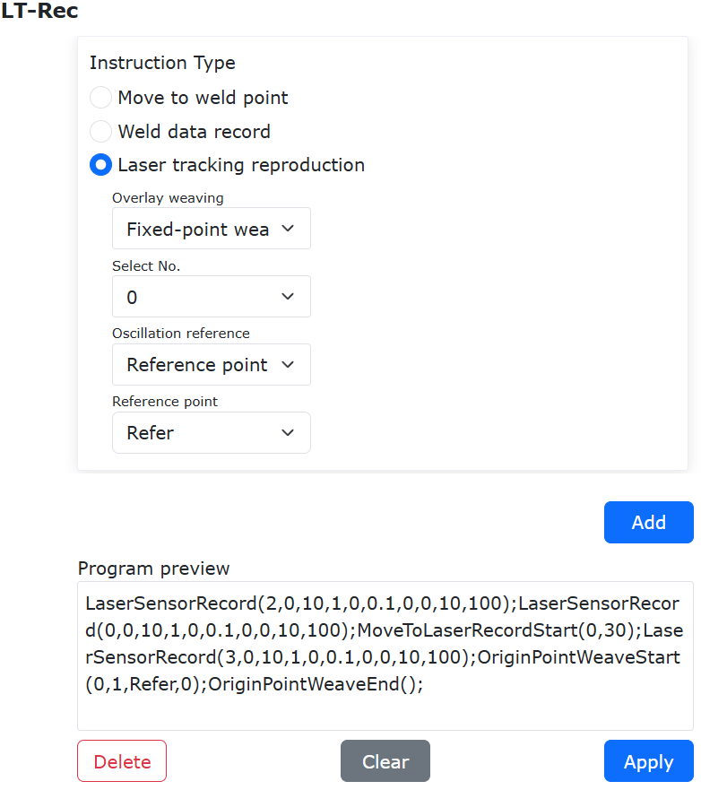

.. centered:: Figura 9.8-4-13 Referência de Oscilação como Ponto de Referência com Oscilação em Pontos Fixos Sobrep

.. note:: Nota: Quando a opção "Ponto de Referência" é selecionada no menu suspenso "Referência de Oscilação", a direção de avanço do robô é a direção da linha que conecta o ponto atual e o ponto de referência, e o ponto atual e o ponto de referência devem estar nos mesmos sistemas de coordenadas de ferramenta e peça.

Quando a opção "Sistema de Coordenadas da Ferramenta" é selecionada no menu suspenso "Referência de Oscilação", a direção de avanço do robô é a direção do eixo X do sistema de coordenadas da ferramenta atual.

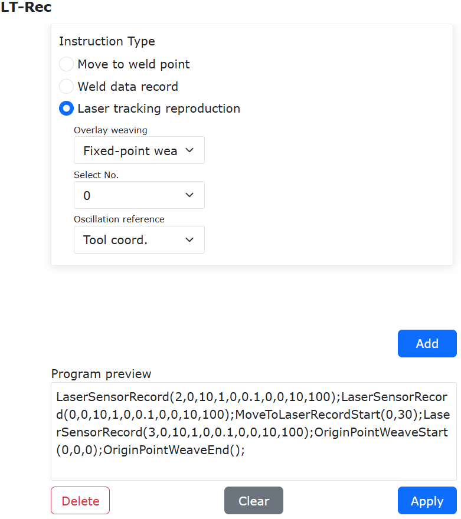

.. centered:: Figura 9.8-4-14 Referência de Oscilação como Sistema de Coordenadas da Ferramenta com Oscilação em Pontos Fixos Sobrep
 
**Passo 13**: Escreva o programa LUA para reprodução de trajetória de varredura a laser + oscilação em pontos fixos. Ajuste a ordem dos comandos LUA gerados do Passo 5 ao Passo 13 e execute o programa LUA para implementar a função de reprodução de trajetória de varredura a laser com oscilação em pontos fixos sobreposta.

.. note:: Nota: Em comparação com o programa LUA, o programa LUA para reprodução de trajetória de varredura a laser com oscilação em pontos fixos sobreposta não inclui o comando MoveLTR(), e o último parâmetro (tempo de oscilação) do comando OriginPointWeaveStartt() gerado por padrão deve ser modificado para qualquer valor inteiro não negativo maior que 0. Durante a operação do robô, o controlador converterá automaticamente este parâmetro para o tempo de execução real da trajetória reproduzida.

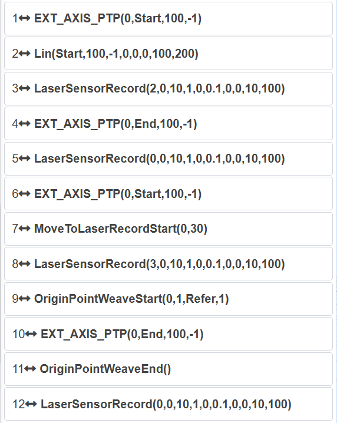

.. centered:: (a) Referência de Oscilação como Ponto de Referência

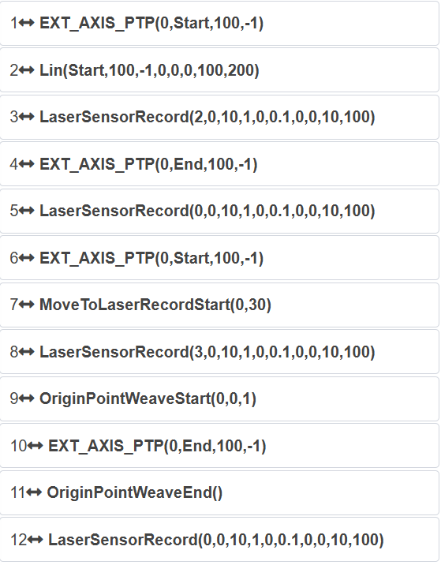

.. centered:: (b) Referência de Oscilação como Sistema de Coordenadas da Ferramenta

.. centered:: Figura 9.8-4-15 Programa LUA para Reprodução de Trajetória de Varredura a Laser com Oscilação em Pontos Fixos Sobrep

Comando de Busca de Posição do Arame
+++++++++++++++++++++++++++++++++++++++++++++++++

Clique no ícone "Busca de Posição do Arame" para entrar na interface de edição do comando W-Search.

Esta instrução é para busca de posição do arame, incluindo três instruções: iniciar busca, terminar busca e calcular deslocamento. Esta instrução é geralmente aplicada em cenários de soldagem, onde a fonte de solda precisa ser usada em conjunto com o IO do robô e instruções de movimento.

.. image:: coding/126.png
   :width: 6in
   :align: center

.. centered:: Figura 9.8-5 Interface da Instrução W-Search

Na programação, geralmente define-se primeiro a instrução de início de busca, depois adicionam-se duas instruções LIN para determinar a direção da busca. Após o sucesso da busca, obtém-se o deslocamento calculado. Este deslocamento é aplicado à instrução de movimento de soldagem real através da instrução de deslocamento geral. Um exemplo de programa é mostrado abaixo.

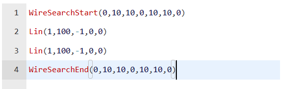

.. centered:: Figura 9.8-5-1 Exemplo de W-Search (1D)

Comando de Rastreamento de Arco
++++++++++++++++++++++++++++++++++++++

Clique no ícone "Rastreamento de Arco" para entrar na interface de edição do comando Weld-Trc.

Esta instrução permite ao robô compensar a trajetória de soldagem usando a detecção de desvio da solda. O sensor de arco pode ser usado para detectar o desvio da solda.

**Passo 1**: Método de definição da corrente de referência para compensação vertical: Feedback, definir "Iniciar contagem da corrente de referência vertical" e "Contagem da corrente de referência vertical"

.. image:: coding/128.png
   :width: 6in
   :align: center

.. centered:: Figura 9.8-6-1 Interface da Instrução Weld-Trc - Feedback

**Passo 2**: Método de definição da corrente de referência para compensação vertical: Constante, definir a corrente de referência vertical

.. image:: coding/129.png
   :width: 6in
   :align: center

.. centered:: Figura 9.8-6-2 Interface da Instrução Weld-Trc - Constante

**Passo 3**: Página de interação dos parâmetros de compensação horizontal

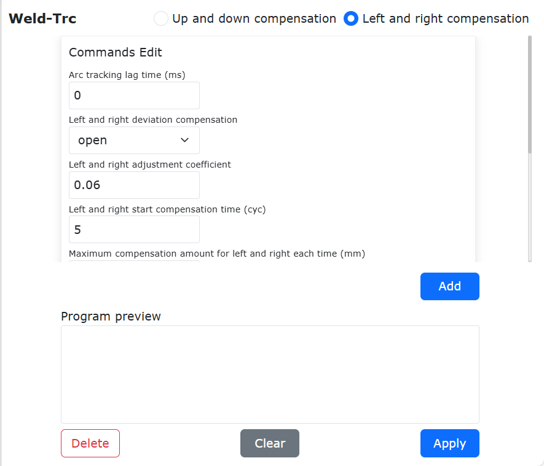

.. centered:: Figura 9.8-6-3 Interface da Instrução Weld-Trc - Parâmetros de Compensação Horizontal

Configuração do Sistema de Rastreamento de Arco do Robô
+++++++++++++++++++++++++++++++++++++++++++++++++++++++++++++++++++

Durante o processo de soldagem com rastreamento de arco do robô colaborativo, a fonte de solda envia sinais de corrente e tensão de soldagem em tempo real de volta para o robô. O robô compensa a posição da trajetória de soldagem com base nos valores de corrente e tensão de soldagem recebidos em tempo real, alcançando o efeito de rastreamento de arco. Existem quatro maneiras para o feedback dos sinais de corrente e tensão entre a fonte de solda e o robô mencionadas acima. As duas primeiras exigem um CLP adicional para retransmissão de dados, enquanto as duas últimas envolvem a conexão direta entre a fonte de solda e o painel de controle do robô:

① Comunicação CANopen ou outro barramento: Se sua fonte de solda suporta protocolos de comunicação de barramento como CANopen, EtherCAT, Modbus TCP (por exemplo, Aotai NBC-500RP, Megmeet A2 series, etc.), o CLP e a fonte de solda podem se comunicar diretamente através do protocolo de comunicação relevante. O sinal de corrente de soldagem correspondente pode ser transmitido diretamente ao CLP através da comunicação, e então o CLP o envia de volta ao robô via comunicação UDP.

.. image:: coding/277.png
   :width: 6in
   :align: center

.. centered:: Figura 9.8-6-4 Diagrama de Topologia da Configuração do Sistema de Rastreamento de Arco do Robô (Comunicação de Barramento entre CLP e Fonte de Solda)
.. centered:: a- Computador; b- Robô e Painel de Controle; c- CLP e Módulo de Comunicação de Barramento; d- Fonte de Solda

② CLP + Sinal Analógico IO: O CLP também pode coletar diretamente o sinal analógico e, em seguida, convertê-lo em um valor de corrente através de uma relação de conversão para enviar de volta ao robô. Se sua fonte de solda tiver um canal de saída analógica de corrente de soldagem em tempo real, você pode conectar diretamente este canal ao módulo de entrada analógica do CLP. Se sua fonte de solda não tiver um canal de saída analógica de corrente de soldagem em tempo real, você pode conectar externamente um sensor de corrente Hall. O sensor coleta o sinal de corrente de soldagem em tempo real e o converte em um sinal analógico para saída para o módulo de entrada analógica do CLP.

.. image:: coding/278.png
   :width: 6in
   :align: center

.. centered:: Figura 9.8-6-5 Diagrama de Topologia da Configuração do Sistema de Rastreamento de Arco do Robô (CLP Coletando Sinal Analógico)
.. centered:: a- Computador; b- Robô e Painel de Controle; c- CLP e Módulo de Entrada Analógica; d- Fonte de Solda e Sensor de Corrente Hall

③ AI do Painel de Controle: A porta IO do painel de controle do robô tem duas entradas analógicas (0 ~ 10 V). Se sua fonte de solda tiver um canal de saída analógica de corrente de soldagem em tempo real, você pode conectar diretamente este canal à porta de entrada analógica do painel de controle. Se sua fonte de solda não tiver um canal de saída analógica de corrente de soldagem em tempo real, você pode conectar externamente um sensor de corrente Hall. O sensor coleta o sinal de corrente de soldagem em tempo real e o converte em um sinal analógico para saída para o canal de entrada analógica do painel de controle. A relação entre o valor de entrada analógica e o valor real de corrente de soldagem é geralmente linear. Os parâmetros detalhados são definidos na seção "Configuração do Canal de Rastreamento de Arco" posteriormente.

.. image:: coding/534.png
   :width: 5in
   :align: center

.. centered:: Figura 9.8-6-6 Diagrama de Topologia da Configuração do Sistema de Rastreamento de Arco do Robô (AI do Painel de Controle Coletando Sinal Analógico)
.. centered:: a- Computador; b- Robô e Painel de Controle; c- Fonte de Solda e Sensor de Corrente Hall

④ Comunicação Ethernet: Se sua fonte de solda suporta comunicação Modbus TCP, o robô pode controlar diretamente a soldagem e ler os valores de feedback de corrente e tensão em tempo real através do Modbus TCP. A comunicação Modbus TCP entre o robô e a fonte de solda usa o protocolo aberto de periférico do painel de controle. Consulte "8.6.6. Protocolo de Comunicação Digital (Modbus TCP)" para mais detalhes.

.. image:: coding/535.png
   :width: 5in
   :align: center

.. centered:: Figura 9.8-6-7 Diagrama de Topologia da Configuração do Sistema de Rastreamento de Arco do Robô (Comunicação Modbus TCP)
.. centered:: a- Computador; b- Robô e Painel de Controle; c- Fonte de Solda

Modelos da Fonte de Solda e Configuração
****************************************

.. centered:: Tabela 9.8-1 Modelos da Fonte de Solda e Configuração

.. list-table::
   :widths: 70
   :header-rows: 0
   :align: center

   * - **Modelos de Fonte de Solda Testados e Adaptáveis Atualmente**

   * - Megmeet ArtsenII CM350
  
.. centered:: Tabela 9.8-2 Configuração das Funções da Fonte de Solda

.. list-table::
   :widths: 100 100
   :header-rows: 0
   :align: center

   * - **Número da Função**
     - **Parâmetro de Configuração**

   * - F18
     - 20

   * - F19
     - 56

Modelos de CLP e Configuração
****************************************
.. centered:: Tabela 9.8-3 Modelos de CLP e Configuração

.. list-table::
   :widths: 70
   :header-rows: 0
   :align: center

   * - **Modelos de CLP Testados e Adaptáveis Atualmente**

   * - Huichuan Easy521
  
.. centered:: Tabela 9.8-4 Configurações Chave do CLP

.. list-table::
   :widths: 70 70
   :header-rows: 0
   :align: center

   * - **Item de Configuração**
     - **Conteúdo da Configuração**

   * - Protocolo de Comunicação
     - CANOPEN

   * - Fonte de Amostragem da Corrente de Feedback
     - Dados de feedback CANOPEN da fonte de solda

   * - Período de Sincronização
     - 2 ms

:download:`Anexo: Programa CLP <../_static/_doc/MEGMEET PLC PROGRAME.zip>`

Função de Rastreamento de Arco
*************************************

**1) Introdução aos Parâmetros da Interface da Função**

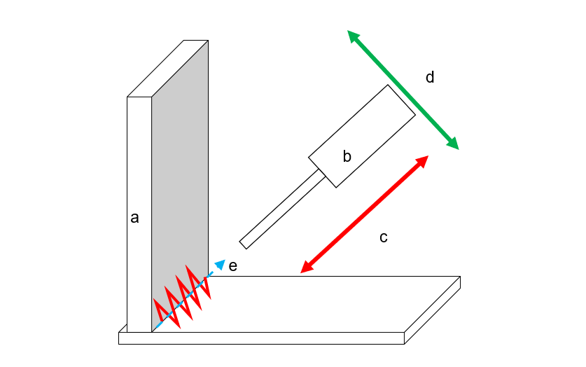

.. centered:: Figura 9.8-7-1 Cenário Típico de Rastreamento de Arco

Um cenário típico da função de rastreamento de arco inclui: a. Peça de trabalho a ser soldada (chanfro de solda em ângulo reto ou agudo), b. Tocha de solda, e. Linha central do chanfro.

A função de rastreamento de arco pode usar as informações de corrente de soldagem coletadas e os parâmetros de oscilação definidos pelo robô para realizar o rastreamento do chanfro de solda nas direções: c. Vertical (profundidade) e d. Horizontal (centro).

**2) Configuração da Comunicação**

① Comunicação CANopen ou outro barramento:

Abra o WebApp, clique sequencialmente em "Configurações Iniciais" -> "Configuração de Periféricos do Usuário" -> "Configuração da Fonte de Solda".

.. image:: coding/280.png
   :width: 4in
   :align: center

.. centered:: Figura 9.8-7-2 Abrir Configuração da Fonte de Solda

Selecione o tipo de controle como "Protocolo de Comunicação Digital" e configure os parâmetros de comunicação UDP. O significado de cada parâmetro é o seguinte:

**Endereço IP**: Endereço IP do CLP para comunicação UDP;

**Número da Porta**: Número da porta UDP do CLP;

**Período de Comunicação**: Período da comunicação UDP entre o robô e o CLP, padrão de 2 ms;

**Período de Detecção de Perda de Pacotes, Número de Perdas de Pacotes**: Quando o número de pacotes perdidos dentro do período de detecção de perda de pacotes excede o valor definido, o robô reporta um erro "Anomalia de perda de pacotes UDP" e a comunicação é automaticamente cortada.

**Duração de Confirmação de Interrupção da Comunicação**: Se o robô não receber um pacote completo de dados de feedback do CLP dentro deste período, ele reportará um erro de alarme "Interrupção de comunicação UDP" e cortará a comunicação UDP.

**Reconexão Automática em Caso de Interrupção da Comunicação**: Se o robô detectar uma interrupção na comunicação UDP, ele tentará reconectar automaticamente;

**Período de Reconexão, Número de Tentativas de Reconexão**: Após habilitar a reconexão automática em caso de interrupção da comunicação UDP e detectar uma interrupção, o robô tentará reconectar no período definido. Se o número máximo de tentativas de reconexão for atingido sem sucesso, o robô reportará um erro de alarme "Interrupção de comunicação UDP" e cortará a comunicação UDP.

Após configurar os parâmetros acima, clique sequencialmente nos botões "Configurar" e "Carregar".

.. image:: coding/281.png
   :width: 4in
   :align: center

.. centered:: Figura 9.8-7-3 Selecionar o Tipo de Controle
   
② CLP + Sinal Analógico IO:

Semelhante a "① Comunicação CANopen ou outro barramento", o programa CLP converte os dados de entrada analógica em dados de corrente e tensão no protocolo de comunicação UDP e os envia para o robô.

③ AI do Painel de Controle:

Nenhuma configuração de comunicação é necessária, apenas conecte corretamente os fios de IO entre o painel de controle e a fonte de solda. Os fios analógicos de feedback de corrente e tensão de soldagem em tempo real da fonte de solda são conectados ao AI0 e AI1 do painel de controle do robô.

④ Comunicação Ethernet:

Conecte corretamente o cabo de rede entre o robô e a fonte de solda. No WebApp, clique sequencialmente em "Configurações Iniciais", "Periféricos", "Painel de Controle", "Protocolo Aberto de Periférico". Envie o protocolo de comunicação da fonte de solda para o robô. Clique sequencialmente nos botões "Configurar" e "Carregar". O robô estabelecerá uma conexão de comunicação Modbus TCP com a fonte de solda.

.. image:: coding/542.png
   :width: 4in
   :align: center

.. centered:: Figura 9.8-7-4 Estabelecer Comunicação Ethernet para Rastreamento de Arco

.. note:: O efeito do rastreamento de arco depende do feedback rápido dos dados de corrente e tensão de soldagem em tempo real. Se a frequência de feedback for muito lenta, o rastreamento da solda pode falhar. Portanto, ao usar Modbus TCP para comunicação com a fonte de solda, defina um período de comunicação razoável no protocolo. Recomenda-se um período de comunicação inferior a 10 ms.

**3) Configuração do Canal**

① Comunicação CANopen ou outro barramento:

Clique sequencialmente em "Configurações Iniciais" -> "Periféricos" -> "Fonte de Solda" -> "Protocolo de Comunicação Digital (UDP)".

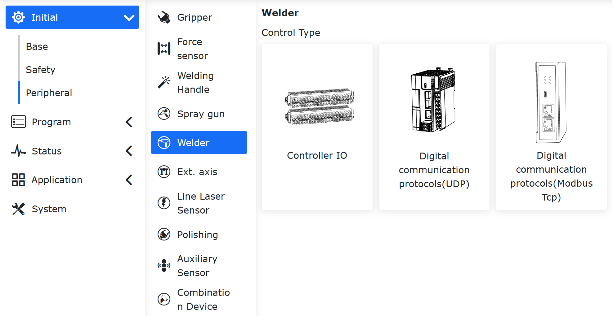

.. centered:: Figura 9.8-7-5 Selecionar o Tipo de Controle da Fonte de Solda como "Protocolo de Comunicação Digital (UDP)"

Na parte inferior da página, encontre "Canal de Rastreamento de Arco". Selecione o canal AI de extensão apropriado de acordo com a configuração real. O canal AI padrão para corrente de soldagem é "Aux-AI0", e o canal AI padrão para tensão de soldagem é "Aux-AI1". Clique no botão "Configurar".

.. note:: 
   O protocolo de comunicação UDP entre o robô e o CLP é descrito no "Anexo 1: Protocolo de Comunicação UDP do Robô". Os dados de feedback do CLP para o robô no protocolo incluem os canais de entrada de feedback de corrente e tensão de soldagem reais, que correspondem aos números 74 a 77.

   Durante a soldagem, o CLP coleta sinais de corrente de soldagem em tempo real através de barramentos como CANopen e envia os valores numéricos de corrente e tensão de soldagem reais nos bytes 74 a 77 de volta para o robô para rastreamento de arco.

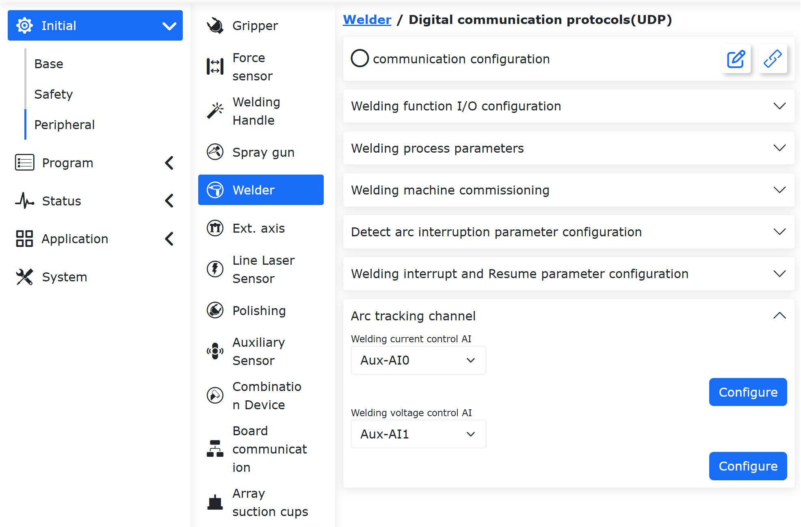

.. centered:: Figura 9.8-7-6 Configuração do Canal de Rastreamento de Arco para Comunicação de Barramento

② CLP + Sinal Analógico IO:

A configuração é a mesma que "① Comunicação CANopen ou outro barramento". O usuário converte a entrada analógica lida no programa CLP para obter os valores de feedback reais de corrente e tensão de soldagem após a conversão numérica. Esses valores são atribuídos aos canais de entrada de feedback de corrente e tensão de soldagem reais (números 74 a 77) no pacote de dados de feedback do CLP para o robô no protocolo de comunicação UDP entre o robô e o CLP.

③ AI do Painel de Controle:

Clique sequencialmente em "Configurações Iniciais" -> "Periféricos" -> "Fonte de Solda", "IO do Controlador".

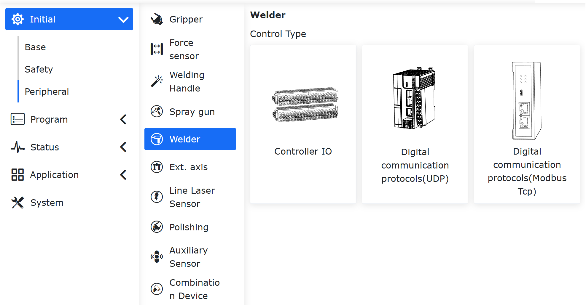

.. centered:: Figura 9.8-7-7 Selecionar o Tipo de Controle da Fonte de Solda como "IO do Controlador"

Na parte inferior da página, encontre "Canal de Rastreamento de Arco". Selecione o AI de corrente de soldagem como "Ctrl-AI0" e o AI de tensão de soldagem como "Ctrl-AI1". Clique no botão "Configurar". A relação entre a entrada analógica do painel de controle (0~10 V) e os valores reais de corrente e tensão de soldagem é geralmente linear. Portanto, é necessário configurar os valores reais de corrente e tensão de soldagem correspondentes a diferentes entradas analógicas.

Na seção "Gráfico de Relação Corrente-Tensão Analógica" da configuração do canal AI, os parâmetros nas interfaces "A-V" e "V-V" devem ser configurados com referência à tabela/gráfico de recepção e saída analógica da fonte de solda usada.

Por exemplo, configure o limite inferior e superior da corrente de soldagem para o AI de corrente analógica do painel de controle como 0 A e 500 A, respectivamente. Configure o limite inferior e superior da tensão de saída para o AI de corrente analógica do painel de controle como 0 V e 5 V. Esses são os parâmetros de configuração na interface "A-V" da seção "Gráfico de Relação Corrente-Tensão Analógica" da configuração do canal AI. Clique em "Configurar" para concluir a configuração do canal AI de corrente analógica do painel de controle.

.. image:: coding/538.png
   :width: 4in
   :align: center

.. centered:: Figura 9.8-7-8 Configuração do AI de Corrente Analógica do Painel de Controle
 
Por exemplo, configure o limite inferior e superior da tensão de soldagem para o AI de tensão analógica do painel de controle como 0 V e 50 V, respectivamente. Configure o limite inferior e superior da tensão de saída para o AI de tensão analógica do painel de controle como 1.018 V e 10 V. Esses são os parâmetros de configuração na interface "V-V" da seção "Gráfico de Relação Corrente-Tensão Analógica" da configuração do canal AI. Clique em "Configurar" para concluir a configuração do canal AI de tensão analógica do painel de controle.

.. image:: coding/539.png
   :width: 4in
   :align: center

.. centered:: Figura 9.8-7-9 Configuração do AI de Tensão Analógica do Painel de Controle

④ Comunicação Ethernet:

Clique sequencialmente em "Configurações Iniciais", "Periféricos", "Fonte de Solda", "Protocolo de Comunicação Digital (Modbus TCP)".

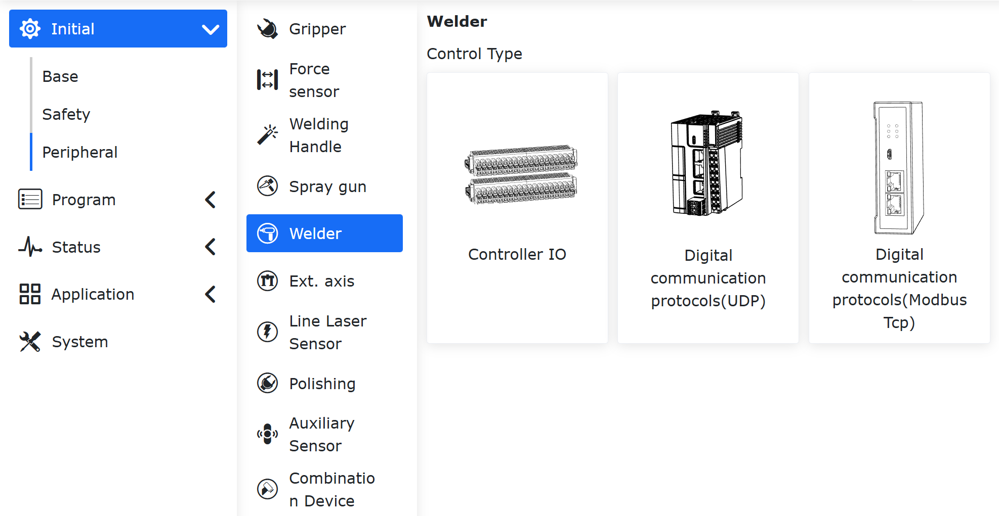

.. centered:: Figura 9.8-7-10 Selecionar o Tipo de Controle da Fonte de Solda como "Protocolo de Comunicação Digital (Modbus TCP)"

Na parte inferior da página, encontre "Canal de Rastreamento de Arco". Selecione o AI de corrente de soldagem como "Ethernet" e o AI de tensão de soldagem como "Ethernet". Clique no botão "Configurar".

.. image:: coding/541.png
   :width: 4in
   :align: center

.. centered:: Figura 9.8-7-11 Configuração do Canal de Rastreamento de Arco para Comunicação Ethernet

**4) Introdução ao Uso das Instruções da Função**

A função de rastreamento de arco pode ser adaptada ao movimento de soldagem com oscilação. A instrução de início de rastreamento de arco é inserida após o início do arco na soldagem com oscilação, e a instrução de fim de rastreamento de arco é inserida antes da extinção do arco na soldagem com oscilação.

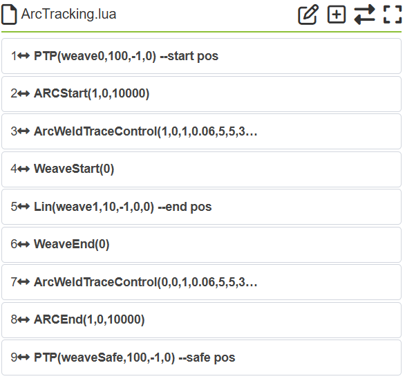

.. centered:: Figura 9.8-7-12 Programa de Exemplo Típico de Rastreamento de Arco

**5) Introdução aos Parâmetros da Interface da Função**

.. centered:: Tabela 9.8-5 Módulo de Compensação Vertical do Rastreamento de Arco

.. list-table::
   :widths: 70 70 70
   :header-rows: 0
   :align: center

   * - **Nome do Parâmetro**
     - **Significado**
     - **Observações**

   * - Tempo de Atraso do Rastreamento de Arco
     - Tempo de atraso da corrente de feedback
     - Padrão 0 ms, não ajustar

   * - Compensação de Desvio Vertical
     - Interruptor de compensação vertical
     - Pode selecionar "Ativado" ou "Desativado"

   * - Coeficiente de Ajuste Vertical
     - Relação entre corrente e distância de compensação (sensibilidade de ajuste)
     - Quando a soldagem tende a um estado de curto-circuito transitório, a relação sinal-ruído da corrente diminui gradualmente. Recomenda-se diminuir a sensibilidade.

   * - Tempo de Início da Compensação Vertical
     - Ciclo mais rápido para iniciar a compensação vertical
     - Relacionado à frequência de oscilação. É melhor iniciar a compensação 3-4 segundos após o início do arco, quando a corrente se estabiliza. Se a frequência de oscilação for 1 Hz, o parâmetro pode ser 4; se a frequência for 2 Hz, o parâmetro pode ser 8, e assim por diante.

   * - Quantidade Máxima de Compensação por Ciclo Vertical
     - Quantidade máxima de compensação em cada ciclo de compensação vertical
     - Definido de acordo com o cenário de soldagem. Quanto mais rápida a frequência de oscilação, menor a quantidade de compensação.

   * - Quantidade Máxima Total de Compensação Vertical
     - Quantidade máxima de compensação acumulada durante um único processo de soldagem
     - Definido de acordo com o cenário de soldagem. Quanto maior o desvio da solda, maior deve ser a configuração.

   * - Seleção do Sistema de Coordenadas Vertical
     - Sistema de coordenadas onde o valor de compensação é aplicado
     - Se houver oscilação de soldagem, selecione "Oscilação"; caso contrário, selecione "Ferramenta" ou "Base"

   * - Método de Definição da Corrente de Referência Vertical
     - Método para obter a corrente de referência
     - Pode selecionar "Feedback" para obter através da leitura da corrente de feedback; ou "Constante" para obter inserindo diretamente o valor da corrente.

   * - Início da Contagem de Amostragem da Corrente de Referência Vertical
     - Número de ciclos de atraso para iniciar a coleta da corrente de referência
     - Relacionado à frequência de oscilação. É melhor iniciar a coleta 3-4 segundos após o início do arco, quando a corrente se estabiliza. Se a frequência de oscilação for 1 Hz, o parâmetro pode ser 4; se a frequência for 2 Hz, o parâmetro pode ser 8, e assim por diante.

   * - Contagem da Amostragem da Corrente de Referência Vertical
     - Período de contagem estatística para coletar a corrente de referência no modo de feedback de corrente de referência
     - Padrão 1 ciclo

   * - Corrente de Referência Vertical
     - Valor numérico da corrente de referência no modo constante de corrente de referência
     - Pode ser preenchido manualmente para atingir a altura de compensação desejada

.. centered:: Tabela 9.8-6 Módulo de Compensação Horizontal do Rastreamento de Arco

.. list-table::
   :widths: 70 70 70
   :header-rows: 0
   :align: center

   * - **Nome do Parâmetro**
     - **Significado**
     - **Explicação do Parâmetro**

   * - Tempo de Atraso do Rastreamento de Arco
     - Tempo de atraso da corrente de feedback
     - Padrão 0 ms, não ajustar

   * - Compensação de Desvio Horizontal
     - Interruptor de compensação horizontal
     - Pode selecionar "Ativado" ou "Desativado"

   * - Coeficiente de Ajuste Horizontal
     - Relação entre corrente e distância de compensação (sensibilidade de ajuste)
     - Quando a soldagem tende a um estado de curto-circuito transitório, a relação sinal-ruído da corrente diminui gradualmente. Recomenda-se diminuir a sensibilidade.

   * - Tempo de Início da Compensação Horizontal
     - Ciclo mais rápido para iniciar a compensação horizontal
     - Relacionado à frequência de oscilação. É melhor iniciar a compensação 3-4 segundos após o início do arco, quando a corrente se estabiliza. Se a frequência de oscilação for 1 Hz, o parâmetro pode ser 4; se a frequência for 2 Hz, o parâmetro pode ser 8, e assim por diante.

   * - Quantidade Máxima de Compensação por Ciclo Horizontal
     - Quantidade máxima de compensação em cada ciclo de compensação horizontal
     - Definido de acordo com o cenário de soldagem. Quanto mais rápida a frequência de oscilação, menor a quantidade de compensação.

   * - Quantidade Máxima Total de Compensação Horizontal
     - Quantidade máxima de compensação acumulada durante um único processo de soldagem
     - Definido de acordo com o cenário de soldagem. Quanto maior o desvio da solda, maior deve ser a configuração.

**6) Escopo de Aplicação**

.. centered:: Tabela 9.8-7 Compensação Vertical Ativada, Compensação Horizontal Desativada

.. list-table::
   :widths: 70 70
   :header-rows: 0
   :align: center

   * - **Parâmetros Chave**
     - **Faixa de Parâmetros**

   * - Frequência de Oscilação Hz
     - 0 (sem oscilação de soldagem), 0.5 a 2 (com oscilação de soldagem)

   * - Amplitude da Oscilação mm
     - 0 (sem oscilação de soldagem), 3 a 7 (com oscilação de soldagem)

   * - Tensão Definida V
     - > 17

   * - Corrente Definida A
     - > 160
  
.. centered:: Tabela 9.8-8 Compensação Vertical Desativada, Compensação Horizontal Ativada

.. list-table::
   :widths: 70 70
   :header-rows: 0
   :align: center

   * - **Parâmetros Chave**
     - **Faixa de Parâmetros**

   * - Frequência de Oscilação Hz
     - 0.5 a 2

   * - Amplitude da Oscilação mm
     - 3 a 7

   * - Tensão Definida V
     - > 17

   * - Corrente Definida A
     - > 160
  
.. centered:: Tabela 9.8-9 Compensação Vertical e Horizontal Ativadas

.. list-table::
   :widths: 70 70
   :header-rows: 0
   :align: center

   * - **Parâmetros Chave**
     - **Faixa de Parâmetros**

   * - Frequência de Oscilação Hz
     - 0.5 a 2

   * - Amplitude da Oscilação mm
     - 3 a 7

   * - Tensão Definida V
     - > 19

   * - Corrente Definida A
     - > 210

**7) Precauções**

1) A função de rastreamento de arco com compensação horizontal só pode ser adaptada a trajetórias lineares combinadas com oscilação simétrica em onda triangular ou senoidal.
2) A posição inicial da soldagem ao usar a função de compensação deve estar precisamente acima da solda (o eixo da tocha de solda no centro da solda de ângulo). A tocha de solda não deve estar muito perto da solda, caso contrário, há o risco de colisão da tocha.
3) O material em ambos os lados do chanfro da peça de trabalho deve ser o mesmo.
4) As dimensões e a postura do sistema de coordenadas da peça de trabalho devem ser calibradas com precisão usando o método de 6 pontos.
5) Quanto maior o desvio entre a trajetória definida e a solda, maiores devem ser a quantidade máxima de compensação por ciclo e a quantidade máxima de compensação total.
6) O desvio entre o ponto final da trajetória definida e a solda não deve exceder 100 mm/m. Um desvio excessivo pode fazer com que o arame de solda ou até mesmo a tocha colidam com a peça de trabalho, fazendo com que a posição de soldagem se desvie da trajetória pretendida (oscilação inadequada), impedindo que a função de rastreamento de arco funcione corretamente.
7) Se a soldagem for realizada com valores de corrente e tensão definidos baixos, os coeficientes de ajuste vertical e horizontal do rastreamento de arco devem ser reduzidos proporcionalmente para diminuir a compensação instável causada por ruído na corrente de feedback.
8) Ao selecionar diferentes sistemas de coordenadas para o rastreamento de arco, o sinal dos coeficientes de compensação vertical e horizontal pode precisar ser ajustado. Além de julgar pela direção do sistema de coordenadas correspondente, também pode ser determinado por meio de soldagem de teste. Se, após ensinar uma trajetória de soldagem com oscilação em uma placa inclinada (figura à esquerda) e ativar o rastreamento de arco, a trajetória de soldagem (figura à direita) se mover na direção do gradiente descendente da inclinação do plano de oscilação e a altura da tocha no final estiver próxima da altura inicial, o sinal do coeficiente de ajuste está correto.

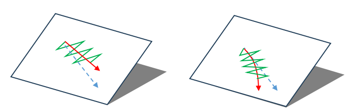

.. centered:: Figura 9.8-7-13 Configuração de uma Trajetória de Oscilação Inclinada (esquerda) e Trajetória de Solda com Sinal Correto (direita)

Comando de Ajuste de Postura
++++++++++++++++++++++++++++++++++

Clique no ícone "Ajuste de Postura" para entrar na interface de edição do comando Adjust.

Esta instrução é para cenários de adaptação automática da postura da tocha de solda no rastreamento de soldagem. Após registrar três pontos de postura correspondentes, adicione a instrução de ajuste adaptativo de postura com base na direção real do movimento do robô. Consulte a seção de periféricos do robô.

.. image:: coding/134.png
   :width: 6in
   :align: center

.. centered:: Figura 9.8-8 Interface da Instrução Adjust

Interface de Instruções de Controle de Força 
~~~~~~~~~~~~~~~~~~~~~~~~~~~~~~~~~~~~~~~~~~~~~~~~~~~~

.. image:: coding/135.png
   :width: 6in
   :align: center

.. centered:: Figura 9.9 Interface de Instruções de Controle de Força 

Comando Conjunto de Controle de Força
+++++++++++++++++++++++++++++++++++++++++++++++++

Clique no ícone "Conjunto de Controle de Força" para entrar na interface de edição do comando F/T.

Esta instrução inclui oito comandos: FT_Guard (detecção de colisão), FT_Control (controle de força constante), FT_Compliance (controle de complacência), FT_Spiral (inserção em espiral), FT_Rot (inserção rotativa), FT_Lin (inserção linear), FT_FindSurface (localização de superfície), FT_CalCenter (localização de centro). Consulte a seção de periféricos do robô.

.. image:: coding/136.png
   :width: 6in
   :align: center

.. centered:: Figura 9.9-1 Interface da Instrução F/T

Otimização do Pacote de Processo de Montagem com Controle de Força
*************************************************

Visão Geral
""""""""""""""""""""""""""""""""""""
As funções de inserção helicoidal e inserção linear com controle de força são geralmente utilizadas para operações de busca de furo e inserção em montagem, enquanto a função de posicionamento de superfície é geralmente utilizada para localizar superfícies no espaço cartesiano. Com base no cenário de aplicação, defina os parâmetros de movimento correspondentes e a estratégia de tratamento para quando nenhuma força externa for detectada. Quando a força externa detectada após a conclusão não atingir o limite definido, o usuário pode optar por parar todo o programa (configurado como "Erro", com um erro vermelho exibido na interface), ou optar por continuar o movimento (configurado como "Aviso", com um aviso amarelo exibido na interface).

Procedimento Operacional para Otimização da Inserção Helicoidal com Controle de Força
""""""""""""""""""""""""""""""""""""""""""""""""""""""""""""""""""""""""""""""""""""""""""""""""""""""""""""""""""""""""
**Passo 1**: Clique em "Teach Program" -> "Program Programming" -> "Conjunto Controle de Força" -> comando "Rot" em sequência. Defina os parâmetros de movimento correspondentes com base no cenário de aplicação real. A estratégia de tratamento para quando nenhuma força externa for detectada pode ser definida como "Erro" ou "Aviso". Quando configurado como "Erro", se o robô detectar que a força externa esteve sempre abaixo do limite definido e o ângulo de rotação definido foi atingido, um erro será exibido na interface e a execução dos programas subsequentes será interrompida. Quando configurado como "Aviso", se o robô detectar que a força externa esteve sempre abaixo do limite definido e o ângulo de rotação definido foi atingido, um aviso será exibido na interface e a execução dos programas subsequentes continuará.

.. image:: coding/531.png
   :width: 3in
   :align: center

.. centered:: Figura 9.9-2 Configuração de Parâmetros de Inserção Rotacional com Controle de Força

**Passo 2**: A função de inserção rotacional com controle de força deve ser usada em conjunto com a função "FT_Control" para movimento. Defina os mesmos parâmetros de movimento. Programas LUA típicos com a estratégia de tratamento para ausência de força externa definida como "Erro" ou "Aviso" são mostrados nas figuras respectivamente.

.. image:: coding/532.png
   :width: 6in
   :align: center

.. centered:: Figura 9.9-3 Programa LUA Típico Configurado como "Erro"

.. image:: coding/533.png
   :width: 6in
   :align: center

.. centered:: Figura 9.9-4 Programa LUA Típico Configurado como "Aviso"

Procedimento Operacional para Otimização da Inserção Linear com Controle de Força
""""""""""""""""""""""""""""""""""""""""""""""""""""""""""""""""""""""""""""""""""""""""""""""""""""""""""""""""""""""""

**Passo 1**: Clique em "Teach Program" -> "Program Programming" -> "Conjunto Controle de Força" -> comando "Lin" em sequência. Defina os parâmetros de movimento correspondentes com base no cenário de aplicação real. A estratégia de tratamento para quando nenhuma força externa for detectada pode ser definida como "Erro" ou "Aviso". Quando configurado como "Erro", se o robô detectar que a força externa esteve sempre abaixo do limite definido e a distância de inserção definida foi atingida, um erro será exibido na interface e a execução dos programas subsequentes será interrompida. Quando configurado como "Aviso", se o robô detectar que a força externa esteve sempre abaixo do limite definido e a distância de inserção definida foi atingida, um aviso será exibido na interface e a execução dos programas subsequentes continuará. Como mostrado na Figura 3-1.

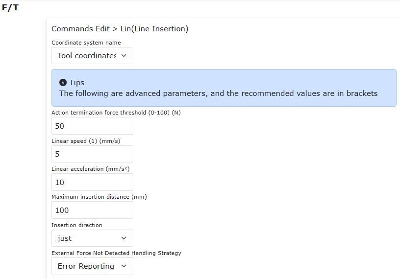

.. centered:: Figura 9.9-5 Configuração de Parâmetros de Inserção Linear com Controle de Força

**Passo 2**: A função de inserção linear com controle de força deve ser usada em conjunto com a função "FT_Control" para movimento. Defina os mesmos parâmetros de movimento. Programas LUA típicos com a estratégia de tratamento para ausência de força externa definida como "Erro" ou "Aviso" são mostrados nas Figuras 3-2 e 3-3 respectivamente.

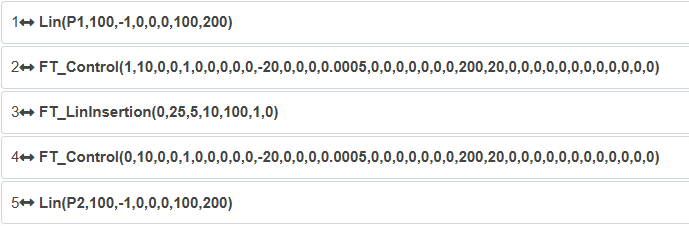

.. centered:: Figura 9.9-6 Programa LUA Típico Configurado como "Erro"

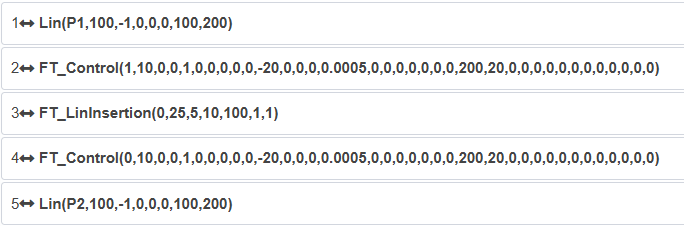

.. centered:: Figura 9.9-6 Programa LUA Típico Configurado como "Aviso"

Procedimento Operacional para Otimização do Posicionamento de Superfície com Controle de Força
""""""""""""""""""""""""""""""""""""""""""""""""""""""""""""""""""""""""""""""""""""""""""""""""""""""""""""""""""""""""

**Passo 1**: Clique em "Teach Program" -> "Program Programming" -> "Conjunto Controle de Força" -> comando "FindSurface" em sequência. Defina os parâmetros de movimento correspondentes com base no cenário de aplicação real. A estratégia de tratamento para quando nenhuma força externa for detectada pode ser definida como "Erro" ou "Aviso". Quando configurado como "Erro", se o robô detectar que a força externa esteve sempre abaixo do limite definido e a distância de busca definida foi atingida, um erro será exibido na interface e a execução dos programas subsequentes será interrompida. Quando configurado como "Aviso", se o robô detectar que a força externa esteve sempre abaixo do limite definido e a distância de busca definida foi atingida, um aviso será exibido na interface e a execução dos programas subsequentes continuará. Como mostrado na Figura 4-1.

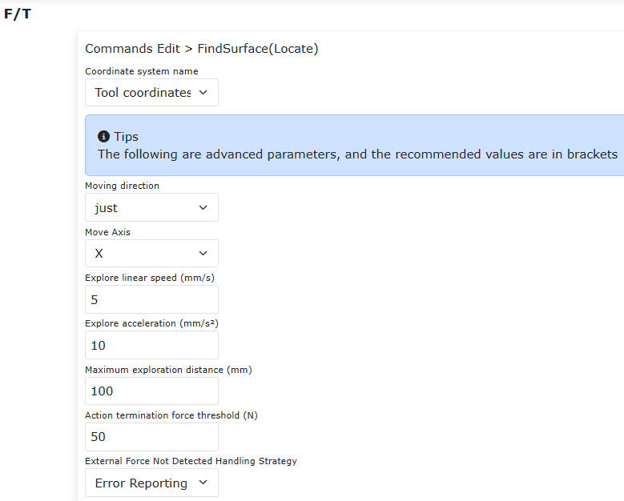

.. centered:: Figura 9.9-7 Configuração de Parâmetros de Posicionamento de Superfície com Controle de Força

**Passo 2**: A função de posicionamento de superfície com controle de força deve ser usada em conjunto com a função "FT_Control" para movimento. Defina os mesmos parâmetros de movimento. Programas LUA típicos com a estratégia de tratamento para ausência de força externa definida como "Erro" ou "Aviso" são mostrados nas Figuras 4-2 e 4-3 respectivamente.

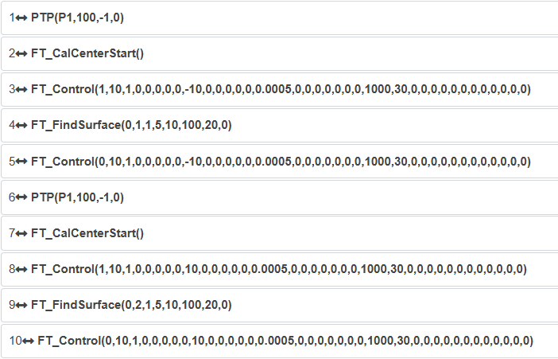

.. centered:: Figura 9.9-8 Programa LUA Típico Configurado como "Erro"

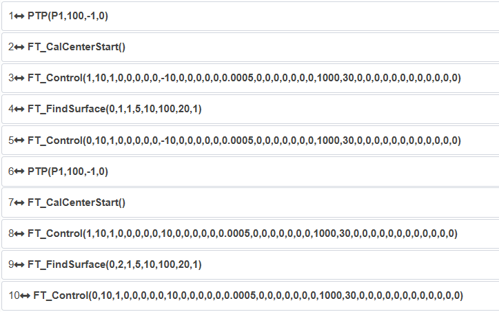

.. centered:: Figura 9.9-9 Programa LUA Típico Configurado como "Aviso"

Comando de Gravação de Torque
++++++++++++++++++++++++++++++++++++++

Clique no ícone "Gravação de Torque" para entrar na interface de edição do comando Torque.

Esta instrução é para gravação de torque, permitindo a detecção de colisão por gravação de torque em tempo real. Clique no botão "Iniciar Gravação de Torque" para começar a gravar continuamente as condições de colisão durante a execução das instruções de movimento. O torque real gravado é usado como o valor teórico para o julgamento da detecção de colisão, reduzindo a probabilidade de falsos erros. Quando o valor excede a faixa de limite definida, a duração da detecção de colisão é registrada. Clique no botão "Parar Gravação de Torque" para parar a gravação. Clique no botão "Resetar Gravação de Torque" para restaurar o estado padrão.

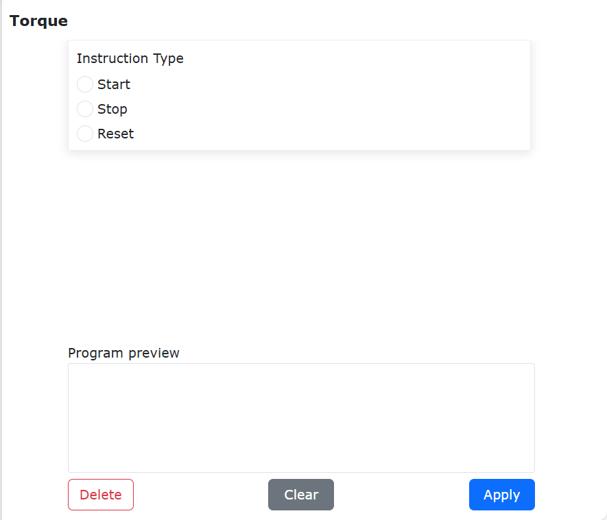

.. centered:: Figura 9.9-5 Interface da Instrução Torque

Interface de Instruções de Visão
~~~~~~~~~~~~~~~~~~~~~~~~~~~~~~~~~~~~~~~

.. image:: coding/138.png
   :width: 6in
   :align: center

.. centered:: Figura 9.10 Interface de Instruções de Visão 

Comando de Visão 3D
+++++++++++++++++++++++++

Clique no ícone "Visão 3D" para entrar na interface de edição do comando 3D.

Esta instrução gera exemplos de programas de visão 3D. O usuário pode usar os programas gerados como referência para se comunicar com outros dispositivos de visão. Inclui dois exemplos de programa: calibração da câmera e coleta da câmera.

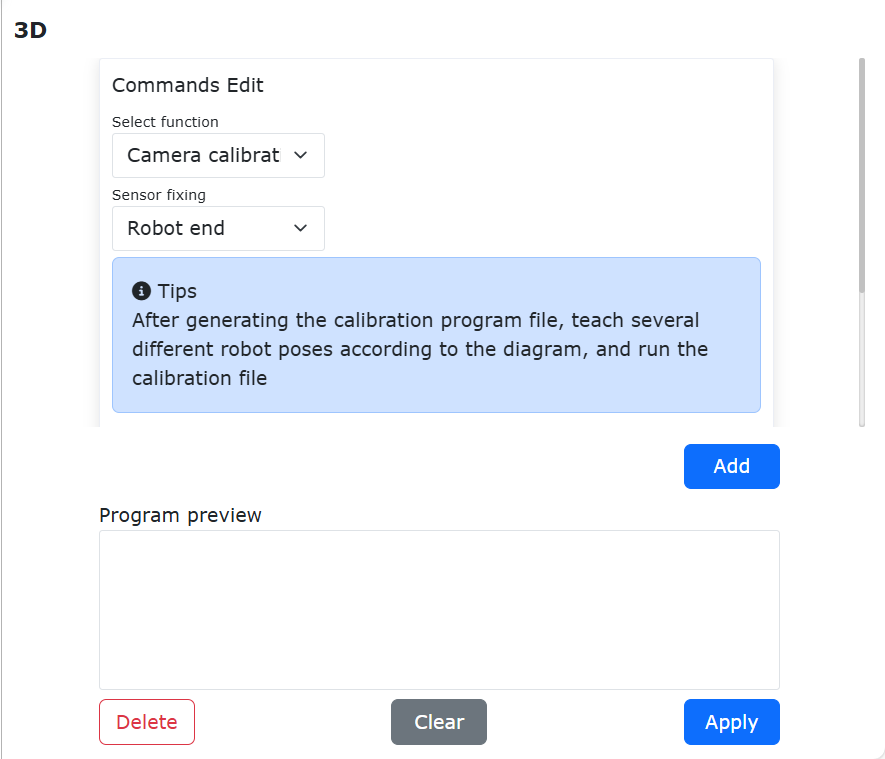

.. centered:: Figura 9.10-1 Interface da Instrução 3D

Interface de Instruções de Paletização
~~~~~~~~~~~~~~~~~~~~~~~~~~~~~~~~~~~~~~~~~~~~~~~~~~~~

.. image:: coding/140.png
   :width: 6in
   :align: center

.. centered:: Figura 9.11 Interface de Instruções de Paletização 

Comando de Movimento Matricial
++++++++++++++++++++++++++++++++++++++++++++++++

Clique no ícone "Movimento Matricial" para entrar na interface de edição do comando Pallet.

Esta instrução gera programas de paletização.

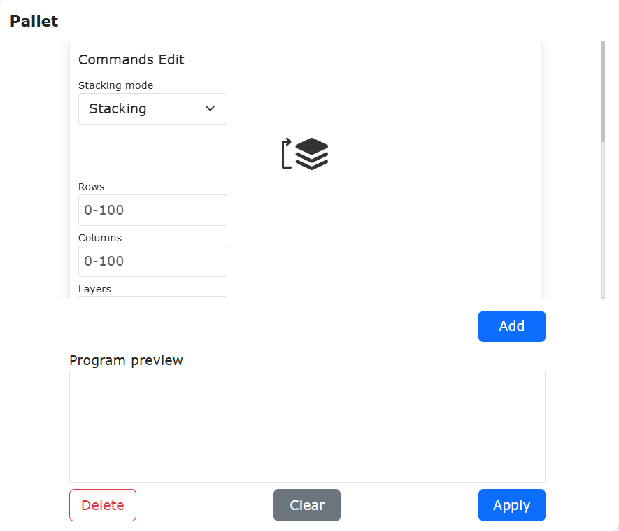

.. centered:: Figura 9.11-1 Interface da Instrução Pallet

Esta função define três pontos, números de linhas, colunas e camadas, e a altura de cada camada para controlar o movimento regular do braço robô, adequada para aplicações comuns de paletização. Primeiro passo: selecione o modo de movimento do robô, "PTP" ou "Lin". Segundo passo: defina o caminho de movimento do robô, "Método cabeça-a-cabeça" ou "Método de zigue-zague". Terceiro passo: defina o método de empilhamento, "Empilhar" ou "Desempilhar".

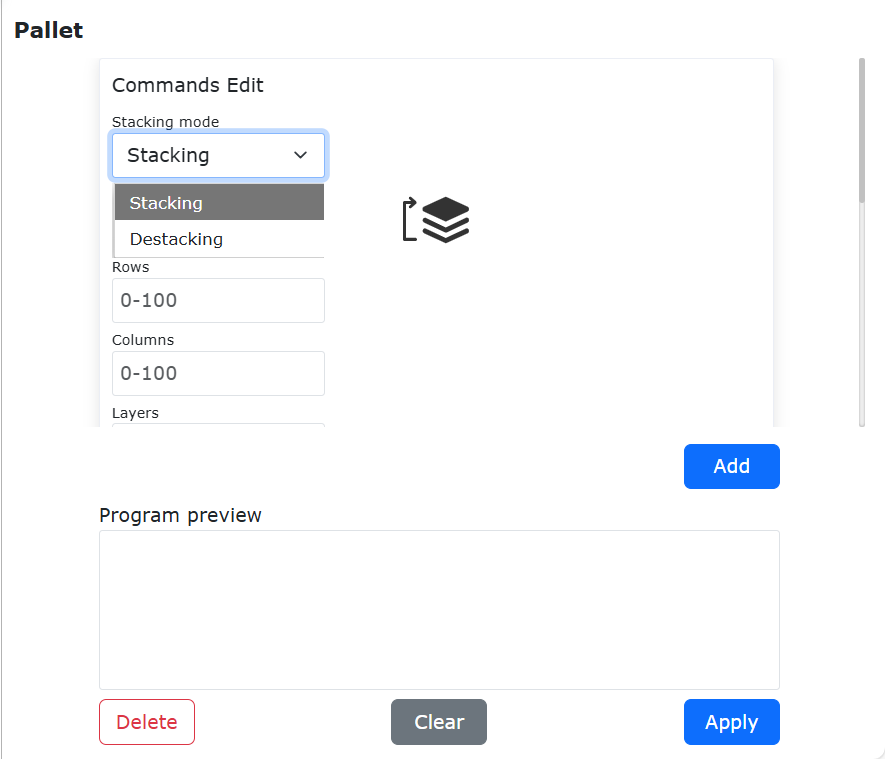

.. centered:: Figura 9.11‑2 Movimento Matricial

Quarto passo: ensine três pontos de acordo com o caminho. O primeiro ponto é o ponto inicial da primeira linha, a postura do braço durante todo o movimento é determinada por este ponto. O segundo ponto é o ponto final da primeira linha. O terceiro ponto é o ponto final da última linha. Quinto passo: defina o número de linhas e colunas. Sexto passo: defina o número de camadas e a altura de cada camada.

.. image:: coding/143.png
   :width: 6in
   :align: center

.. centered:: Figura 9.11‑3 Movimento Matricial

Interface de Instruções de Comunicação
~~~~~~~~~~~~~~~~~~~~~~~~~~~~~~~~~~~~~~~~~~~~~~~~~~~~

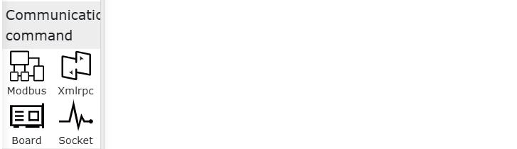

.. centered:: Figura 9.12 Interface de Instruções de Comunicação

Comando Modbus
++++++++++++++++

Clique no ícone "Modbus" para entrar na interface de edição do comando Modbus.

Esta instrução é uma função de barramento baseada no protocolo Modbus TCP. O usuário pode controlar a comunicação entre o robô e um cliente ou servidor Modbus TCP (comunicação mestre-escravo) através de instruções relacionadas, permitindo operações de leitura e escrita em bobinas, entradas discretas e registradores.

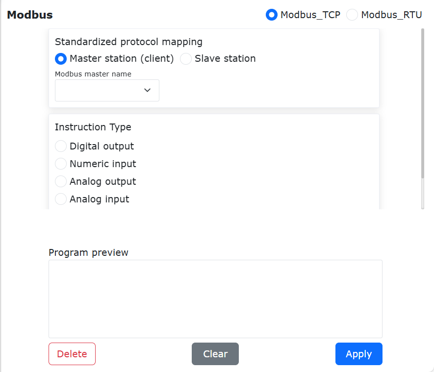

.. centered:: Figura 9.12-1 Interface da Instrução Modbus - Modo Mestre

.. image:: coding/146.png
   :width: 6in
   :align: center

.. centered:: Figura 9.12-2 Interface da Instrução Modbus - Modo Escravo

Para mais funções de operação do Modbus TCP, entre em contato conosco para obter suporte.

Comando Xmlrpc
++++++++++++++++

Clique no ícone "Xmlrpc" para entrar na interface de edição do comando Xmlrpc.

XML-RPC é um método de chamada de procedimento remoto que usa XML para transmitir dados entre programas através de sockets. Com este método, o controlador do robô pode chamar funções (com parâmetros) em um programa/serviço remoto e obter dados estruturais de retorno. O controlador do robô é responsável por escrever mensagens do cliente XML-RPC e lidar com todos os detalhes da conversão entre tipos de dados e XML.

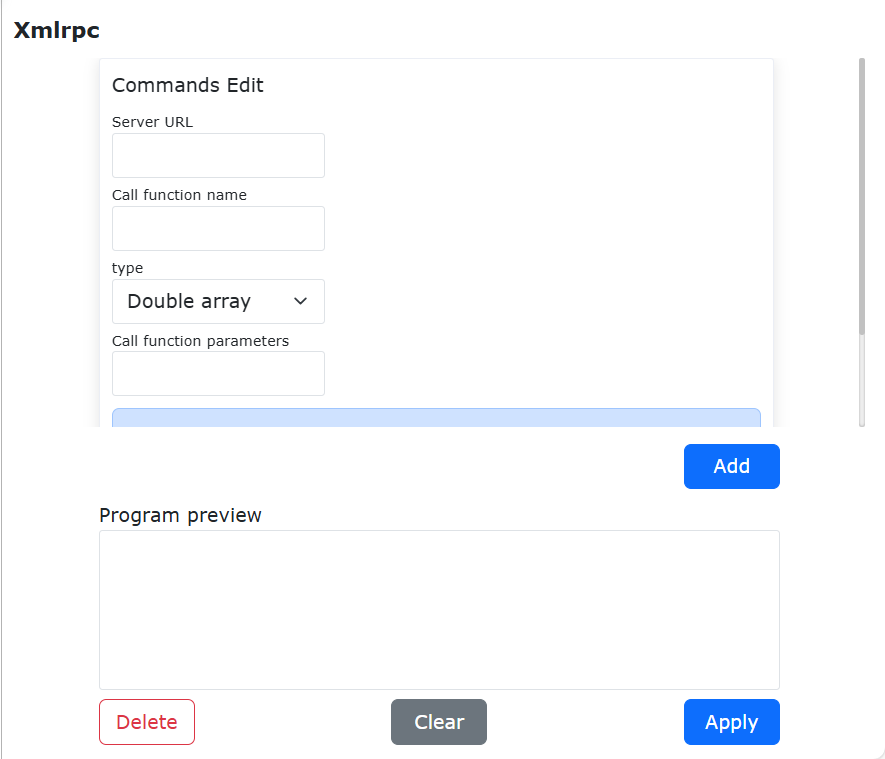

.. centered:: Figura 9.12-3 Interface da Instrução Xmlrpc

.. important:: 
  1) O controlador atua como um cliente conectando-se a uma porta remota personalizada;

  2) O controlador atua como um cliente chamando funções remotas;

  3) Suporta a chamada de diferentes funções remotas;

  4) Suporta a passagem de parâmetros de array de strings e o retorno de resultados de array de strings, com o número de elementos do array personalizável;

  Suporta a passagem de parâmetros de array do tipo double e o retorno de resultados de array do tipo double, com o número de elementos do array personalizável.

::

   XmlrpcClientCall(serverUrl, methodName, tableType, param)

   serverUrl: URL do servidor, por exemplo: "http://192.168.58.29:50000/RPC2"

   methodName: Nome da função a ser chamada, "example.add"

   tableType: 1 - array do tipo double, 2 - array do tipo string

   param: Parâmetros da função chamada

::

   XmlrpcClientCall(error, result)

   error: 0 - sem erro, 1 - erro

   result: Se o parâmetro for um array do tipo double, result será um array do tipo double.
          Se o parâmetro for um array do tipo string, result será um array do tipo string.

Interface de Instruções Auxiliares
~~~~~~~~~~~~~~~~~~~~~~~~~~~~~~~~~~~~~~~

.. image:: coding/148.png
   :width: 6in
   :align: center

.. centered:: Figura 9.13 Interface de Instruções Auxiliares

Comando de Thread Auxiliar
++++++++++++++++++++++++++++++++

Clique no ícone "Thread Auxiliar" para entrar na interface de edição do comando Thread.

O comando Thread é uma função de thread auxiliar. O usuário pode definir uma thread auxiliar para ser executada simultaneamente com a thread principal. A thread auxiliar é usada principalmente para troca de dados com dispositivos externos, suportando comunicação socket, obtenção do estado DI do robô, definição do estado DO do robô, obtenção de informações de estado do robô e troca de dados com a thread principal. A thread principal usa os dados obtidos pela thread auxiliar para controlar a lógica de movimento do robô. Captura de tela do programa de exemplo do usuário:

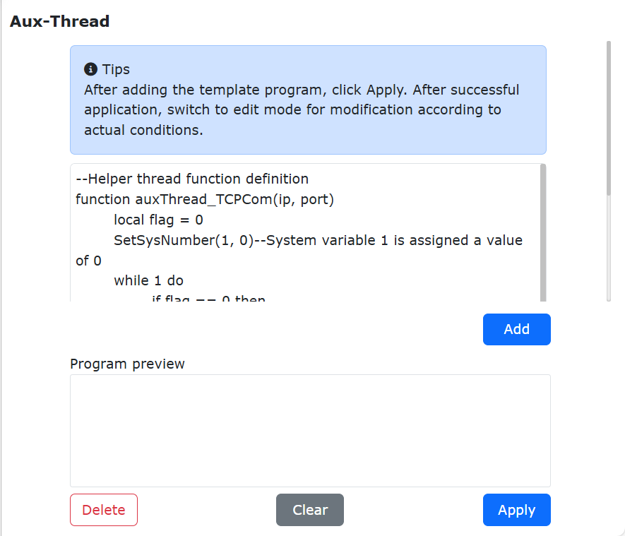

.. centered:: Figura 9.13-1 Exemplo de Programa Thread

Comando de Chamada de Função
++++++++++++++++++++++++++++++++++++++++++++++++

Clique no ícone "Chamada de Função" para entrar na interface de edição do comando Function.

Esta instrução fornece uma interface para chamar funções do robô, permitindo que o cliente selecione as funções disponíveis. Ela também indica os parâmetros necessários para a função, facilitando a escrita de scripts de instrução pelo cliente. Mais funções estão sendo adicionadas gradualmente.

.. image:: coding/150.png
   :width: 6in
   :align: center

.. centered:: Figura 9.13-2 Interface da Instrução Function

Comando de Tabela de Pontos
++++++++++++++++++++++++++++++++

Clique no ícone "Tabela de Pontos" para entrar na interface de edição do comando PT-Mode.

Esta instrução é usada principalmente para alternar entre o modo de sistema e o modo de tabela de pontos. Ao alternar a tabela de pontos, os pontos de ensino dentro de diferentes tabelas de pontos são aplicados. Consulte o Capítulo 11 - Pontos de Ensino para mais detalhes.

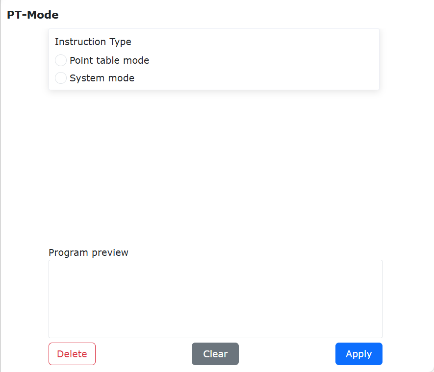

.. centered:: Figura 9.13-3 Interface da Instrução da Tabela de Pontos

Verificação de Programa de Ensino Não Salvo
~~~~~~~~~~~~~~~~~~~~~~~~~~~~~~~~~~~~~~~~~~~~~~~~~~~~~

Na página de ensino de programa, após abrir/criar um programa, se o programa de ensino foi modificado e não foi salvo.

Se você clicar em operações de arquivo relacionadas, como "Abrir", "Novo", "Exportar", "Renomear", etc., uma caixa de diálogo "Salvar este programa?" será acionada, perguntando "O programa atual foi alterado. Deseja salvar as alterações?", conforme mostrado abaixo.

.. image:: coding/152.png
   :width: 6in
   :align: center

.. centered:: Figura 9.14-1 Verificação de Programa Não Salvo na Página Atual

**Passo 1**: Clique no botão "Não Salvar". O programa será restaurado para os dados anteriores à modificação e a operação de arquivo relacionada continuará.

**Passo 2**: Clique no botão "Salvar". O programa Lua não salvo será salvo com sucesso e a operação de arquivo relacionada continuará.

Se você sair da página de ensino de programa para outra página, a mensagem "Salvar este programa?" também será acionada e você permanecerá na página atual do programa de ensino, conforme mostrado abaixo.

.. image:: coding/153.png
   :width: 6in
   :align: center

.. centered:: Figura 9.14-2 Verificação de Programa Não Salvo ao Alternar Páginas

**Passo 1**: Clique no botão "Não Salvar" para navegar para a página selecionada anteriormente.

**Passo 2**: Clique no botão "Salvar". O programa Lua não salvo será salvo com sucesso e você navegará para a página selecionada anteriormente.

Criptografia de Programa de Ensino
~~~~~~~~~~~~~~~~~~~~~~~~~~~~~~~~~~~~~~~~~~~~~~~~

Os programas de ensino podem ser criptografados ou não. Os níveis de criptografia são divididos em Nível 1 e Nível 2, onde o Nível 1 oferece o mais alto nível de proteção, seguido pelo Nível 2.
Todos os programas de ensino são exibidos e configurados em formato de tabela em "Configurações do Sistema - Informações Personalizadas". A tabela é acompanhada por uma explicação do nível de criptografia no lado direito.

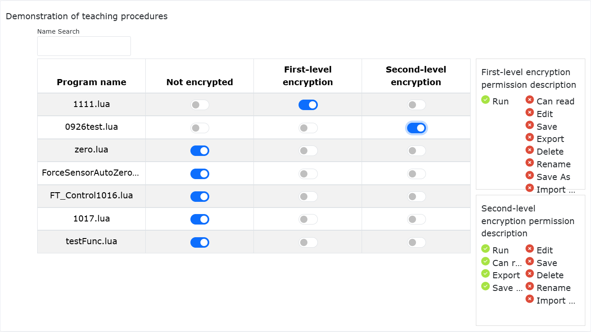

.. centered:: Figura 9.15-1 Criptografia do Programa de Ensino

Quando um programa está no nível de criptografia 1, ao abrir o programa:
Os ícones na barra de operação correspondentes a "Exportar", "Salvar", "Salvar Como", "Copiar", "Recortar", "Colar", "Excluir", "Mover para Cima", "Mover para Baixo" e "Alternar Modo de Edição" ficarão acinzentados. Clicar nos ícones não terá efeito e uma mensagem será exibida indicando que o programa está criptografado.
O ícone "Renomear" do programa ficará oculto.
A barra de adição de instruções e a área de edição do programa ficarão invisíveis e uma mensagem será exibida indicando que estão bloqueadas pela criptografia de nível 1.

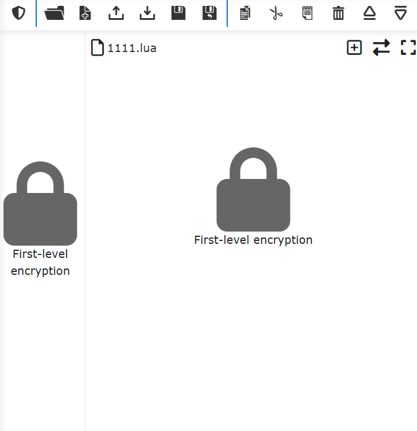

.. centered:: Figura 9.15-2 Interface de Criptografia de Nível 1 do Programa

Quando um programa está no nível de criptografia 2, ao abrir o programa na página "Programa de Ensino":
Os ícones na barra de operação correspondentes a "Salvar", "Copiar", "Recortar", "Colar", "Excluir", "Mover para Cima" e "Mover para Baixo" ficarão acinzentados. Clicar nos ícones não terá efeito e uma mensagem será exibida indicando que o programa está criptografado.
O ícone "Renomear" do programa ficará oculto.
A barra de adição de instruções ficará invisível e uma mensagem será exibida indicando que está bloqueada pela criptografia de nível 2.
A área de edição do programa pode ser visualizada e lida normalmente.

.. image:: coding/156.png
   :width: 6in
   :align: center

.. centered:: Figura 9.15-3 Interface de Criptografia de Nível 2 do Programa

A função "Exportar" pode ser usada tanto para criptografia de nível 1 quanto de nível 2. Durante a importação, uma verificação será realizada. Se existir um arquivo criptografado com o mesmo nome, a operação de importação será interrompida e uma mensagem será exibida informando que não é possível substituir um programa criptografado.

.. image:: coding/157.png
   :width: 3in
   :align: center

.. centered:: Figura 9.15-4 Importação de Programa

Pontos de Ensino Locais
~~~~~~~~~~~~~~~~~~~~~~~~~~~~~~~

Os pontos de ensino locais estão vinculados ao programa de ensino atual. Ao adicionar comandos de programa, eles só podem ser aplicados ao programa de ensino atual, não a outros programas de ensino.

**Adicionar**: Clique no ícone "Adicionar Ponto de Ensino Local" no canto superior direito do nome do arquivo do programa para adicionar pontos de ensino locais. (Para detalhes sobre pontos de ensino locais, consulte o registro de pontos de ensino nas operações do robô.)

.. image:: coding/158.png
   :width: 6in
   :align: center

.. centered:: Figura 9.16-1 Adicionar Ponto de Ensino Local

**Excluir**: Selecione o ponto de ensino local a ser excluído na coluna de números da tabela. Em seguida, clique no ícone "Excluir" no canto superior direito do título "Pontos de Ensino Locais" para excluir o ponto de ensino local.

.. image:: coding/159.png
   :width: 6in
   :align: center

.. centered:: Figura 9.16-2 Excluir Ponto de Ensino Local

**Executar**: Clique no ícone "Iniciar Execução" na coluna de operações dos dados da tabela de pontos de ensino locais para executar um único ponto de ensino local, movendo o robô para a posição desse ponto.

.. image:: coding/160.png
   :width: 6in
   :align: center

.. centered:: Figura 9.16-3 Executar Ponto de Ensino Local

**Detalhes**: Clique no ícone "Detalhes" na coluna de operações dos dados da tabela de pontos de ensino locais para visualizar os detalhes do ponto de ensino local.

.. image:: coding/161.png
   :width: 3in
   :align: center

.. centered:: Figura 9.16-4 Detalhes do Ponto de Ensino Local

Backup do Programa Atual
~~~~~~~~~~~~~~~~~~~~~~~~~~~~~~~

Quando o usuário modifica um programa de ensino e clica em "Salvar", a função "Backup" do programa atual é acionada (o backup dura 1 ano). O conteúdo inicial do programa atual é salvo e exibido no lado direito, facilitando a comparação com as alterações feitas pelo usuário.
O usuário pode selecionar uma data para visualizar o conteúdo do backup correspondente. Clique no ícone "Excluir" no canto superior direito para excluir o conteúdo do backup do programa atual. O conteúdo do backup do programa atual pode ser visualizado, mas não pode ser modificado.

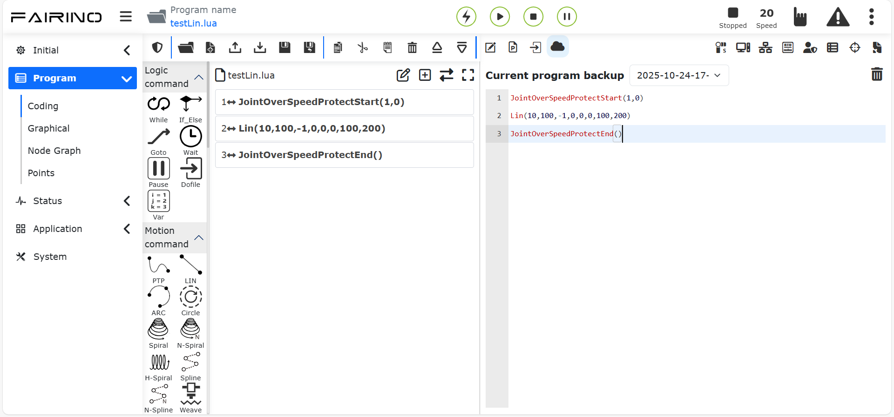

.. centered:: Figura 9.17 Backup do Programa Atual

Comunicação Modbus TCP
~~~~~~~~~~~~~~~~~~~~~~~~~~~~~~~~~~
O Modbus TCP é um protocolo de comunicação comumente usado na indústria. O robô colaborativo Fáor oferece duas formas de se comunicar com seus dispositivos: como Mestre Modbus TCP ou como Escravo Modbus TCP.

O robô colaborativo suporta até 8 Mestres Modbus TCP simultaneamente para comunicação com dispositivos externos, cada mestre suportando até 128 registradores. O Escravo Modbus TCP do robô colaborativo possui 128 bobinas, 128 entradas discretas, 64 registradores de retenção e 64 registradores de entrada (os registradores de retenção e entrada incluem os tipos sem sinal, com sinal e ponto flutuante). Além disso, alguns endereços de registradores de entrada do Escravo Modbus TCP do robô são dedicados a feedback de informações como posições articulares e velocidades de movimento atuais do robô. Alguns endereços de registradores de bobina são dedicados a funções como iniciar o programa do robô, parar o programa e definir DOs do painel de controle.

O Escravo Modbus TCP do robô suporta o estabelecimento de conexão com apenas um mestre. O robô pode atuar como mestre e escravo simultaneamente para se comunicar com diferentes dispositivos. Abaixo estão as instruções detalhadas de uso.

Mestre Modbus TCP
+++++++++++++++++

Antes de usar o robô colaborativo como Mestre Modbus TCP para se comunicar com seu dispositivo, verifique primeiro a conexão de rede entre seu dispositivo e o robô e confirme se as interfaces de rede estão na mesma sub-rede.

O uso do Mestre Modbus TCP do robô envolve as seguintes etapas:

- Adicionar um mestre;
- Adicionar registradores;
- Teste de comunicação;
- Escrever um programa de usuário;
- Executar o programa de usuário.

Adicionar Mestre Modbus TCP
***********************************

Abra o WebApp, clique sequencialmente em "Simulação de Ensino", "Programa de Ensino" e crie um novo programa de usuário "testModbusMaster.lua".

.. image:: coding/163.png
   :width: 6in
   :align: center

.. centered:: Figura 9.18-1 Criar Programa de Usuário do Mestre Modbus TCP

Clique no botão "Configuração Modbus TCP" para abrir a página de configuração da função Modbus TCP.

.. image:: coding/164.png
   :width: 6in
   :align: center

.. centered:: Figura 9.18-2 Abrir Configuração Modbus TCP

Clique sequencialmente em "Configuração do Mestre" e "Adicionar Mestre Modbus" para concluir a adição de um Mestre Modbus TCP.

.. image:: coding/165.png
   :width: 6in
   :align: center

.. centered:: Figura 9.18-3 Adicionar "Mestre Modbus TCP"

Insira sequencialmente "Nome", "IP do Escravo", "Número da Porta", "Número do Escravo", "Período de Comunicação" e "Tempo Limite" de acordo com a situação do seu dispositivo. O significado específico dos parâmetros acima é o seguinte:

**Nome**: Nome do Mestre Modbus TCP do robô. O robô suporta a criação de até 8 mestres para estabelecer conexões com escravos correspondentes. Diferentes mestres podem ser distinguidos por nomes únicos, como "CLP", "Câmera", "Placa de Aquisição de Dados", "FRRobot1", etc.

**IP do Escravo**: Endereço IP do escravo ao qual o Mestre Modbus TCP do robô se conectará.

.. note:: Conecte primeiro o robô e o dispositivo escravo via cabo de rede e certifique-se de que os endereços IP do robô e do dispositivo escravo estejam na mesma sub-rede.

**Número da Porta**: Número da porta do escravo Modbus TCP a ser conectado.

**Número do Escravo**: Número do escravo Modbus TCP a ser conectado.

**Período de Comunicação**: Período (ms) no qual o Mestre Modbus TCP do robô consulta o estado do escravo. Este período afeta apenas a velocidade de atualização dos dados do registrador do escravo na página "Configuração Modbus TCP", não a velocidade de leitura ou escrita dos valores dos registradores do escravo Modbus TCP no programa Lua do usuário.

**Tempo Limite**: Ao chamar a interface de leitura/escrita Modbus TCP para operar, se a conexão não for bem-sucedida após exceder o tempo limite, um erro "Modbus não conectado" será relatado. Unidade ms, faixa válida de 100-60000.

.. image:: coding/166.png
   :width: 6in
   :align: center

.. centered:: Figura 9.18-4 Configurar Parâmetros do Mestre Modbus TCP

Após inserir os parâmetros corretamente, o Mestre Modbus TCP do robô estabelecerá automaticamente uma conexão com o escravo configurado. Após a conexão bem-sucedida, a luz indicadora "Status da Conexão" na página acenderá.

.. note:: 
   Se você confirmou que os parâmetros relevantes do Mestre Modbus TCP estão configurados corretamente, mas o robô não conseguiu se conectar ao seu dispositivo, verifique as seguintes configurações:
   
   ① A conexão de rede física entre o robô e o dispositivo escravo;

   ② Os endereços IP das duas portas de rede física do painel de controle e do teach pendant do robô são diferentes. Certifique-se de que está conectado à porta de rede correta;

   ③ Certifique-se de que a porta de rede do robô e a porta de rede do dispositivo escravo estão na mesma sub-rede. Por exemplo, se o endereço IP do robô é 192.168.58.2, o endereço IP do dispositivo escravo deve estar entre 192.168.58.0 e 192.168.58.255 e não pode ser o mesmo que o IP do robô;
   
   ④ Verifique se o número da porta do dispositivo escravo é o mesmo que o número da porta definido. Se a luz indicadora de status da conexão estiver piscando, significa que há um erro no endereço do registrador neste mestre. Verifique se o tipo e o endereço do registrador estão corretos.

.. image:: coding/167.png
   :width: 6in
   :align: center

.. centered:: Figura 9.18-5 Status da Conexão do Mestre Modbus TCP

Aqui concluímos a criação de um Mestre Modbus TCP do robô. Se você clicar novamente em "Adicionar Mestre Modbus", poderá criar outro novo Mestre Modbus TCP. O robô suporta até 8 mestres simultâneos para comunicação com dispositivos externos. Clique duas vezes no botão "Excluir" no canto superior direito do mestre Modbus para excluí-lo.

.. image:: coding/168.png
   :width: 6in
   :align: center

.. centered:: Figura 9.18-6 Adicionar Outro Mestre Modbus TCP

Adicionar Registradores ao Mestre Modbus TCP
*********************************************************

Clique no botão "Adicionar Registrador do Mestre" para adicionar um registrador a este mestre.

.. image:: coding/169.png
   :width: 6in
   :align: center

.. centered:: Figura 9.18-7 Adicionar Registrador ao Mestre Modbus TCP

Selecione sequencialmente o tipo de registrador do mestre, insira o número do endereço e o nome. O significado de cada parâmetro é o seguinte:

**Tipo**: Tipo de registrador. DI - Entrada Discreta; DO - Bobina; AI sem sinal - Registrador de entrada sem sinal (0-65535); AI com sinal - Registrador de entrada com sinal (-32768-32767); AI ponto flutuante - Registrador de entrada de ponto flutuante (dados de 32 bits, ocupam dois registradores com ou sem sinal); AO sem sinal - Registrador de retenção sem sinal (0-65535); AO com sinal - Registrador de retenção com sinal (-32768-32767); AO ponto flutuante - Registrador de retenção de ponto flutuante (dados de 32 bits, ocupam dois registradores com ou sem sinal). Os registradores de ponto flutuante em AI e AO são exibidos no formato big-endian.

**Número do Endereço**: Endereço do registrador do escravo Modbus TCP a ser lido ou escrito.

**Nome**: Apelido do registrador. O Mestre Modbus TCP do robô pode ter até 128 registradores diferentes. Cada registrador pode receber um nome diferente de acordo com seu significado real, como "Iniciar", "Servo em Posição", "Nível de Líquido", etc.

.. image:: coding/170.png
   :width: 6in
   :align: center

.. centered:: Figura 9.18-8 Configurar Parâmetros do Registrador do Mestre Modbus TCP

Clique novamente no botão "Adicionar Registrador do Mestre" para adicionar outro registrador. Clique duas vezes no botão "Excluir" no lado direito do registrador para excluí-lo. A figura abaixo mostra um registrador adicionado para cada tipo.

.. note:: Se após adicionar registradores do mestre, a luz indicadora de status da conexão do mestre piscar, significa que o endereço do registrador do mestre não pode ser lido. Verifique se o tipo e o endereço do registrador estão corretos.

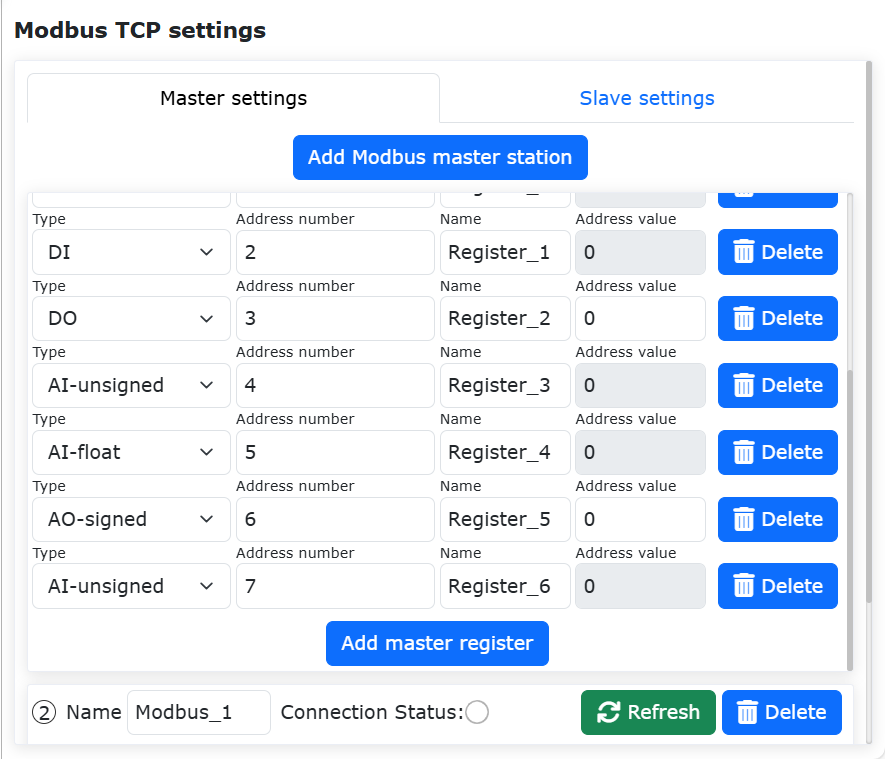

.. centered:: Figura 9.18-9 Adicionar Múltiplos Registradores do Mestre

Teste de Comunicação do Mestre Modbus TCP
*****************************************************

Antes do teste de comunicação, verifique se a luz indicadora "Status da Conexão" do Mestre Modbus TCP está acesa continuamente. Se estiver acesa, a conexão foi bem-sucedida.

Os registradores do Mestre Modbus do robô têm uma caixa de valor "Valor do Endereço" para exibir o valor atual do registrador. Registradores do tipo DI (entrada discreta) e AI (registrador de entrada) são somente leitura, então suas caixas de valor de endereço são cinzas e não editáveis.

Quando o valor no endereço correspondente do escravo muda, o valor do endereço do registrador correspondente do mestre do robô é atualizado simultaneamente para exibir o valor atual. Registradores DO (bobina) e AO (registrador de retenção) são de leitura e escrita, portanto suas caixas de endereço são brancas e editáveis. Você pode ler o valor do registrador correspondente do escravo Modbus TCP e também modificar o valor do registrador na página de configuração do Mestre Modbus do robô.

.. image:: coding/172.png
   :width: 6in
   :align: center

.. centered:: Figura 9.18-10 Valores de Endereço do Mestre Modbus

1. Monitoramento dos Valores dos Registradores do Tipo DI e AI do Mestre

No dispositivo escravo Modbus TCP externo, defina o valor do endereço 255 do registrador DI (entrada discreta) como 1. Defina o valor do endereço 257 do registrador AI (registrador de entrada) como 123, o valor do endereço 258 como -123 e o valor do endereço 259 como 123.3. Neste momento, os valores de endereço dos registradores correspondentes na página de configuração do Mestre Modbus do robô serão exibidos de acordo.

.. note:: 
   Como o registrador no endereço 259 é configurado como ponto flutuante, ele ocupa dois registradores de 16 bits (259 e 260) para armazenar um número de ponto flutuante. Portanto, você não pode configurar outro registrador para operar o endereço 260 do AI, caso contrário, ocorrerá um erro numérico.

.. image:: coding/173.png
   :width: 6in
   :align: center

.. centered:: Figura 9.18-11 Mestre Modbus Exibindo Valores dos Registradores DI e AI

2. Escrita de Valores nos Registradores do Tipo DO e AO do Mestre

Na página de configuração do Mestre Modbus do robô, insira o valor 1 na caixa de entrada do valor do endereço 255 do registrador DO (bobina) chamado "Iniciar". Insira os valores 65535, -32768 e 128.78 nas caixas de entrada dos valores dos endereços 260, 261 e 262 dos registradores AO (registrador de retenção) chamados "Posição Alvo A", "Posição Alvo B" e "Posição Alvo C". Neste momento, os endereços de registrador correspondentes do escravo Modbus terão seus valores escritos.

.. image:: coding/174.png
   :width: 6in
   :align: center

.. centered:: Figura 9.18-12 Mestre Modbus Escrevendo em Registradores DO e AO

3. Monitoramento dos Valores dos Registradores do Tipo DO e AO do Mestre

Quando o valor de DO (bobina) ou AO (registrador de retenção) é alterado no escravo Modbus TCP, o valor do endereço do registrador na página de configuração do Mestre Modbus TCP não será atualizado imediatamente. É necessário clicar no botão "Atualizar" no canto superior direito da configuração do mestre. Neste momento, os valores dos endereços dos registradores DO e AO na página serão atualizados.

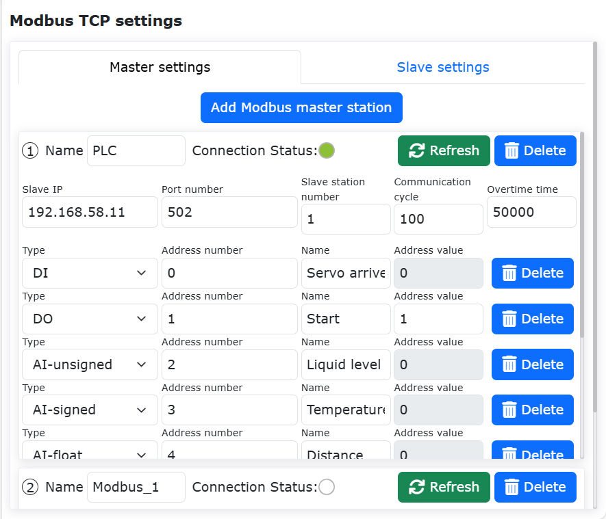

.. centered:: Figura 9.18-13 Atualizar Valores dos Endereços DO e AO do Mestre Modbus TCP

Escrever Programa do Mestre Modbus TCP
++++++++++++++++++++++++++++++++++++++++++++

Clique sequencialmente em "Instruções de Comunicação" para abrir a página de adição de instruções de comunicação.

.. image:: coding/176.png
   :width: 6in
   :align: center

.. centered:: Figura 9.18-14 Abrir Página de Adição de Instruções de Comunicação

Clique em "Modbus".

.. image:: coding/177.png
   :width: 6in
   :align: center

.. centered:: Figura 9.18-15 Selecionar Modbus

Clique em "Modbus_TCP".

.. image:: coding/178.png
   :width: 6in
   :align: center

.. centered:: Figura 9.18-16 Selecionar Modbus_TCP
   
Selecione "Mestre (Cliente)" para abrir a página de adição de instruções do Mestre Modbus TCP.

.. image:: coding/179.png
   :width: 6in
   :align: center

.. centered:: Figura 9.18-17 Adição de Instruções do Mestre Modbus TCP

1. Escrever Saída Digital Única DO (Bobina)

Selecione "Nome do Mestre Modbus" como o mestre "CLP" adicionado anteriormente na página de configuração do mestre Modbus. O nome DO é "Iniciar". O número de registradores é 1. O valor do registrador é 1. Clique no botão "Escrever Saída Digital". Finalmente, role até a parte inferior da página e clique no botão "Aplicar".

.. image:: coding/180.png
   :width: 6in
   :align: center

.. centered:: Figura 9.18-18 Adicionar Escrita de Saída Digital Única

Uma instrução para o Mestre Modbus do robô escrever uma única saída digital foi adicionada ao programa "testModbusMaster.lua". Alterne o robô para o modo automático e clique no botão iniciar. O robô escreverá o valor 1 no endereço do registrador de bobina correspondente ao mestre "CLP" chamado "Iniciar".

.. image:: coding/181.png
   :width: 6in
   :align: center

.. centered:: Figura 9.18-19 Programa Lua para Escrita de Bobina Única

2. Escrever Múltiplas Saídas Digitais DO (Bobinas)

Abra a página de adição de instruções do Mestre Modbus TCP. Selecione "Nome do Mestre Modbus" como o mestre "CLP" adicionado anteriormente. O nome DO é "Iniciar". O número de registradores é 5. O valor do registrador é 1,0,1,0,1. O número de valores do registrador deve corresponder ao número definido de registradores, e vários valores devem ser separados por vírgulas em inglês. Clique no botão "Escrever Saída Digital". Finalmente, role até a parte inferior da página e clique no botão "Aplicar".

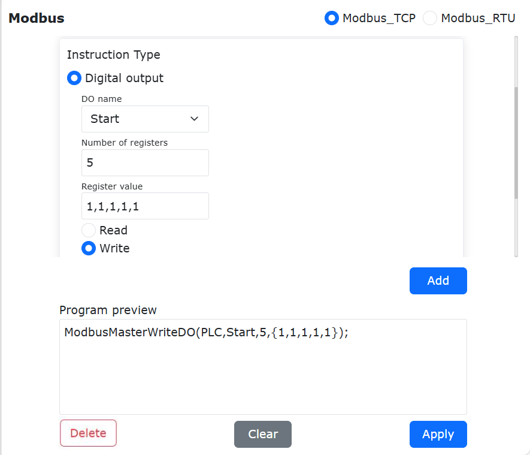

.. centered:: Figura 9.18-20 Configurar Escrita de Múltiplas Saídas Digitais

Uma instrução para o Mestre Modbus do robô escrever múltiplas saídas digitais foi adicionada ao programa "testModbusMaster.lua". Alterne o robô para o modo automático e clique no botão iniciar. O robô escreverá os valores 1, 0, 1, 0, 1 nos registradores de bobina "Iniciar" e nos 4 registradores seguintes correspondentes ao mestre "CLP".
   
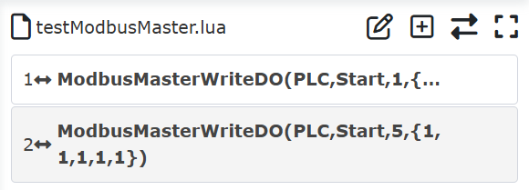

.. centered:: Figura 9.18-21 Programa Lua para Escrita de Múltiplas Bobinas

3. Ler Saída Digital Única DO (Bobina)
   
Abra a página de adição de instruções do Mestre Modbus TCP. Selecione "Nome do Mestre Modbus" como o mestre "CLP" adicionado anteriormente. O nome DO é "Iniciar". O número de registradores é 1. O valor do registrador não precisa ser preenchido. Clique em "Ler Saída Digital". Finalmente, role até a parte inferior da página e clique no botão "Aplicar".
   
.. image:: coding/184.png
   :width: 6in
   :align: center

.. centered:: Figura 9.18-22 Configurar Leitura de Saída Digital Única

Uma instrução para o Mestre Modbus do robô ler uma única saída digital foi adicionada ao programa "testModbusMaster.lua".
      
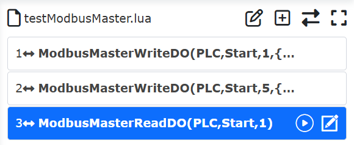

.. centered:: Figura 9.18-23 Programa para Ler Bobina Única

Normalmente, após ler um registrador Modbus, o valor lido é armazenado em uma variável. Portanto, é necessário definir uma variável para armazenar o valor lido. Clique no botão "Alternar Modo" para alternar o programa Lua do robô para o estado editável. Antes da instrução "ModbusMasterReadDO", escreva uma variável de retorno "startValue". Após a execução do programa, o valor lido será armazenado em "startValue".
      
.. image:: coding/186.png
   :width: 6in
   :align: center

.. centered:: Figura 9.18-24 Ler Saída Digital Única e Armazenar em Variável

Os valores dos registradores do tipo bobina são apenas 0 e 1. No programa do robô, diferentes operações podem ser realizadas julgando valores diferentes do registrador. Clique no botão "Alternar Modo" para alternar o programa de ensino do robô para o modo não editável. Adicione duas instruções de movimento articular para mover para dois pontos diferentes, "P1" e "P2".
      
.. image:: coding/187.png
   :width: 6in
   :align: center

.. centered:: Figura 9.18-25 Adicionar Instruções de Movimento para Pontos Diferentes

Alterne o programa para o modo editável novamente e escreva a condição de julgamento para o valor da bobina "startValue". Quando o valor de "startValue" for 1, o robô se move para o ponto "P1"; caso contrário, move-se para o ponto "P2".
      
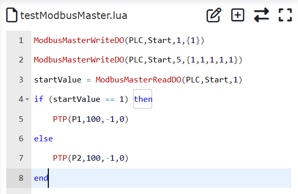

.. centered:: Figura 9.18-26 Mover para Pontos Diferentes com Base no Valor da Bobina

Finalmente, alterne o programa do robô de volta para o modo não editável, mude o robô para o modo automático e inicie o programa em condições seguras. Como as duas primeiras linhas deste programa definem o valor DO da bobina chamada "Iniciar" como 1, o robô se moverá para o ponto "P1" após a execução do programa.
      
.. image:: coding/189.png
   :width: 6in
   :align: center

.. centered:: Figura 9.18-27 Ler Valor do Registrador de Bobina Única e Mover

4. Ler Múltiplas Saídas Digitais DO (Bobinas)

Abra a página de adição de instruções do Mestre Modbus TCP. Selecione "Nome do Mestre Modbus" como o mestre "CLP" adicionado anteriormente. O nome DO é "Iniciar". O número de registradores é 6. O valor do registrador não precisa ser preenchido. Clique em "Ler Saída Digital". Finalmente, role até a parte inferior da página e clique no botão "Aplicar".
      
.. image:: coding/190.png
   :width: 6in
   :align: center

.. centered:: Figura 9.18-28 Configurar Leitura de Múltiplas Saídas Digitais

Uma instrução para o Mestre Modbus do robô ler múltiplas saídas digitais foi adicionada ao programa "testModbusMaster.lua".
         
.. image:: coding/191.png
   :width: 6in
   :align: center

.. centered:: Figura 9.18-29 Programa para Ler Múltiplas Saídas Digitais

Clique no botão "Alternar Modo" para alternar o programa Lua do robô para o estado editável. Como o número de leitura é 6, antes da instrução "ModbusMasterReadDO", escreva 6 variáveis de retorno "value1,value2,value3,value4,value5,value6". Após a execução do programa, os valores dos 6 registradores lidos serão armazenados nas 6 variáveis acima. Da mesma forma, você pode julgar os valores de "value1" a "value6" para fazer o robô realizar diferentes ações.
         
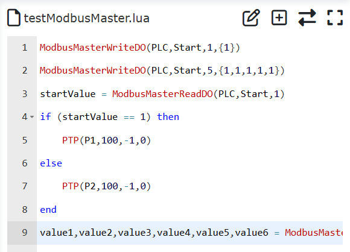

.. centered:: Figura 9.18-30 Ler Múltiplas Saídas Digitais e Armazenar em Variáveis

5. Ler Entrada Digital DI (Entrada Discreta)

Abra a página de adição de instruções do Mestre Modbus TCP. Selecione "Nome do Mestre Modbus" como o mestre "CLP" adicionado anteriormente. O nome DI é "Servo em Posição". O número de registradores é 2. Clique em "Ler Entrada Digital". Finalmente, role até a parte inferior da página e clique no botão "Aplicar".
         
.. image:: coding/193.png
   :width: 6in
   :align: center

.. centered:: Figura 9.18-31 Configurar Leitura de Entrada Digital

Uma instrução para o Mestre Modbus do robô ler entrada digital foi adicionada ao programa "testModbusMaster.lua".
            
.. image:: coding/194.png
   :width: 6in
   :align: center

.. centered:: Figura 9.18-32 Instrução do Programa para Ler Entrada Digital

Clique no botão "Alternar Modo" para alternar o programa Lua do robô para o estado editável. Antes da instrução "ModbusMasterReadDO", escreva as variáveis de retorno "state1,state2". Após a execução do programa, os valores das duas entradas digitais lidas serão armazenados nas variáveis "state1" e "state2". Você pode julgar os valores das variáveis para controlar o robô a realizar diferentes operações.
            
.. image:: coding/195.png
   :width: 6in
   :align: center

.. centered:: Figura 9.18-33 Ler Entrada Digital e Armazenar em Variáveis

6. Operações de Leitura e Escrita para AI (Registrador de Entrada) e AO (Registrador de Retenção)

As operações de leitura e escrita para AI (registrador de entrada) e AO (registrador de retenção) são basicamente as mesmas que para DI (entrada discreta) e DO (bobina). A diferença é que o intervalo de dados do último é limitado a 0 ou 1, enquanto o intervalo do primeiro é maior. Portanto, para operações específicas, consulte a programação para entrada e saída digital. Aqui, apenas exemplos de programas para leitura de AI e operações de leitura/escrita de AO são mostrados.
            
.. image:: coding/196.png
   :width: 6in
   :align: center

.. centered:: Figura 9.18-34 Ler AI (Entrada Analógica)
            
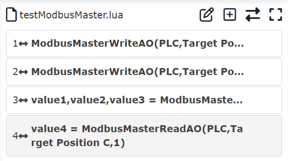

.. centered:: Figura 9.18-35 Ler e Escrever AO (Saída Analógica)

7. Aguardar Entrada Digital

Abra a página de adição de instruções do Mestre Modbus TCP. Encontre "Configuração de Aguardar Entrada Digital", ou seja, configuração para aguardar DI (entrada discreta). Selecione o nome DI como o registrador "Servo em Posição" configurado. O estado de espera é "Verdadeiro". O tempo limite é 5000 ms. Clique no botão "Adicionar" e, finalmente, no botão "Aplicar".
            
.. image:: coding/198.png
   :width: 6in
   :align: center

.. centered:: Figura 9.18-36 Adicionar Instrução para Aguardar Entrada DI

Uma instrução para o Mestre Modbus do robô aguardar a entrada digital DI foi adicionada ao programa "testModbusMaster.lua". Após iniciar o programa, o robô aguardará até que o valor do registrador "Servo em Posição" do mestre "CLP" se torne verdadeiro, ou seja, valor 1. Como o tempo limite definido é de 5 segundos, se após 5 segundos de espera o sinal "Servo em Posição" ainda for 0, o programa do robô reportará um erro de tempo limite e parará automaticamente.
            
.. image:: coding/199.png
   :width: 6in
   :align: center

.. centered:: Figura 9.18-37 Programa para Aguardar Entrada Digital DI

8. Aguardar Entrada Analógica

Abra a página de adição de instruções do Mestre Modbus TCP. Encontre "Configuração de Aguardar Entrada Analógica", ou seja, configuração para aguardar o registrador de entrada AI. Selecione o nome AI como o registrador "Nível de Líquido" configurado. O estado de espera é ">". O valor do registrador é 255. O tempo limite é 5000 ms. Clique no botão "Adicionar" e, finalmente, no botão "Aplicar".
            
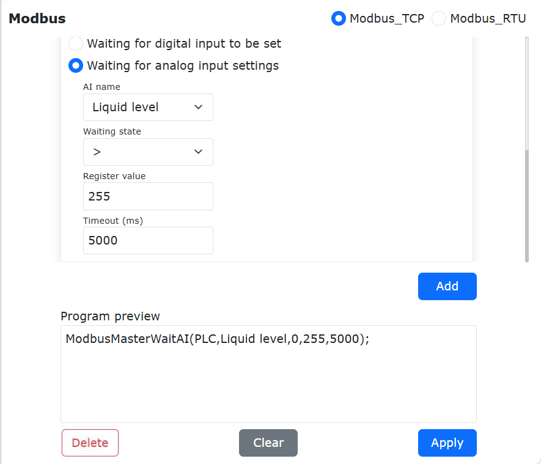

.. centered:: Figura 9.18-38 Adicionar Instrução para Aguardar Entrada Analógica

Uma instrução para o Mestre Modbus do robô aguardar o valor do registrador de entrada AI foi adicionada ao programa "testModbusMaster.lua". Após iniciar o programa, o robô aguardará até que o valor do registrador "Nível de Líquido" do mestre "CLP" seja maior que 255. Como o tempo limite definido é de 5 segundos, se após 5 segundos de espera o sinal "Nível de Líquido" ainda não for maior que 255, o programa do robô reportará um erro de tempo limite e parará automaticamente.
            
.. image:: coding/201.png
   :width: 6in
   :align: center

.. centered:: Figura 9.18-39-1 Programa para Aguardar Registrador de Entrada AI

Abra a página de adição de instruções do Mestre Modbus TCP. Encontre "Configuração de Aguardar Entrada Analógica" (aguardar registrador de entrada AI). Selecione o nome AI como o registrador "Nível de Líquido" configurado. O estado de espera é "=". O valor do registrador é 255. O tempo limite é 5000 ms. Clique no botão "Adicionar" e, finalmente, no botão "Aplicar".
            
.. image:: coding/494.png
   :width: 6in
   :align: center

.. centered:: Figura 9.18-39-2 Adicionar Instrução para Aguardar Entrada Analógica

Uma instrução para o Mestre Modbus do robô aguardar o valor do registrador de entrada AI foi adicionada ao programa "test.lua". Após iniciar o programa, o robô aguardará até que o valor do registrador "Nível de Líquido" do mestre "CLP" seja igual a 255. Como o tempo limite definido é de 5 segundos, se após 5 segundos de espera o sinal "Nível de Líquido" ainda não for igual a 255, o programa do robô reportará um erro de tempo limite e parará automaticamente.

Escravo Modbus TCP
++++++++++++++++++

O Escravo Modbus TCP do robô fornece quatro tipos de registradores: Entrada Digital (bobina), Saída Digital (entrada discreta), Entrada Analógica (registrador de retenção) e Saída Analógica (registrador de entrada). As entradas digitais e analógicas são usadas principalmente para o robô ler dados do dispositivo mestre Modbus TCP externo para controlar as operações do robô, enquanto as saídas digitais e analógicas são usadas principalmente para o robô enviar sinais de dados para o dispositivo mestre Modbus TCP externo. O dispositivo mestre externo lê os valores dos registradores relevantes para controlar a operação de seu equipamento.

Além das entradas/saídas gerais mencionadas, o robô também fornece algumas "Entradas Digitais de Função (bobinas)" para o dispositivo mestre externo controlar operações do robô, como iniciar e parar programas. Ele também fornece alguns registradores de entrada para exibir informações de estado atuais do robô, incluindo posição cartesiana atual, estado de operação atual do robô, etc. (consulte o Anexo 1: Mapa de Endereços do Escravo Modbus TCP para definições específicas). O processo de uso do Escravo Modbus TCP do robô inclui principalmente: ① Configuração de parâmetros; ② Teste de comunicação; ③ Programação.

Configuração dos Parâmetros de Comunicação do Escravo Modbus TCP
*************************************************************************

Abra o WebApp, clique sequencialmente em "Simulação de Ensino", "Programa de Ensino" e crie um novo programa de usuário "testModbusSlave.lua".
            
.. image:: coding/202.png
   :width: 6in
   :align: center

.. centered:: Figura 9.18-40 Criar Programa de Usuário do Escravo Modbus TCP

Clique no botão "Configuração Modbus TCP" para abrir a página de configuração da função Modbus TCP.
            
.. image:: coding/203.png
   :width: 6in
   :align: center

.. centered:: Figura 9.18-41 Abrir Configuração Modbus TCP

Clique sequencialmente em "Configuração do Escravo". Insira o IP, o número da porta e o número do escravo do robô. "IP" é o endereço IP do escravo do robô. O robô colaborativo Fáor tem duas portas de rede (teach pendant e painel de controle) com endereços IP diferentes. Insira o endereço IP correto com base na porta de rede à qual o dispositivo externo está conectado (recomenda-se usar a porta de rede no painel de controle). Após alterar o endereço IP, o número da porta ou o número do escravo do Escravo Modbus TCP do robô, é necessário reiniciar o robô para que as alterações tenham efeito.
            
.. image:: coding/204.png
   :width: 6in
   :align: center

.. centered:: Figura 9.18-42 Configuração do Escravo Modbus TCP

Após a configuração dos parâmetros do Escravo Modbus TCP e a reinicialização do robô, o dispositivo mestre externo pode estabelecer uma conexão com o escravo do robô usando os parâmetros definidos. Após a conexão bem-sucedida, a luz indicadora "Status da Conexão" na página de configuração do escravo do robô acenderá.
            
.. image:: coding/205.png
   :width: 6in
   :align: center

.. centered:: Figura 9.18-43 Luz Indicadora de Status da Conexão do Escravo

Teste de Comunicação do Escravo Modbus TCP
*********************************************************

1. Entrada Digital Geral (Bobina)

O Escravo Modbus TCP do robô fornece 128 registradores de bobina, com endereços de registrador de 100 a 127.

.. note:: Consulte o Anexo 1: Mapa de Endereços do Escravo Modbus TCP para definições específicas.

Os registradores gerais do Escravo Modbus TCP do robô podem receber apelidos. Modifique o nome do registrador de bobina DI0 do escravo do robô para "A em Posição" e DI1 para "B em Posição". De acordo com o mapa de endereços, os endereços Modbus da bobina para "A em Posição" e "B em Posição" são 100 e 101, respectivamente. No dispositivo mestre Modbus TCP externo, defina ambos os endereços de bobina 100 e 101 do escravo do robô como 1. Neste momento, as luzes indicadoras dos dois registradores na página de monitoramento do Escravo Modbus TCP do robô acenderão.
            
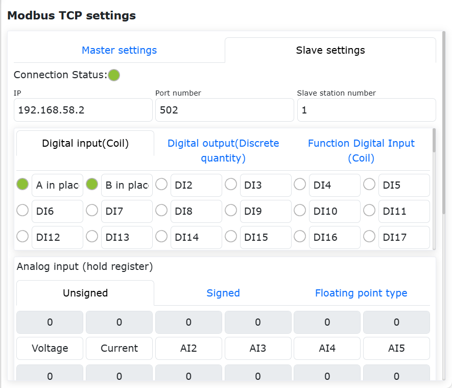

.. centered:: Figura 9.18-44 Monitoramento do Estado da Bobina do Escravo Modbus TCP

2. Saída Digital Geral (Entrada Discreta)

O Escravo Modbus TCP do robô fornece 128 registradores de entrada discreta, com endereços de registrador de 100 a 127.

.. note:: Consulte o Anexo 1: Mapa de Endereços do Escravo Modbus TCP para definições específicas.

Os registradores de entrada discreta do Escravo Modbus TCP do robô também podem receber apelidos. Clique em "Saída Digital Geral (Entrada Discreta)" para modificar o nome do registrador de entrada discreta DO0 do escravo do robô para "A Iniciar" e DO1 para "B Iniciar". De acordo com o mapa de endereços, os endereços Modbus de entrada discreta para "A Iniciar" e "B Iniciar" são 100 e 101, respectivamente. Clique na luz indicadora de entrada discreta correspondente a "A Iniciar". A luz acenderá, o valor do endereço do registrador 100 se tornará 1, e o dispositivo mestre Modbus TCP externo poderá ler este valor de registrador.

.. image:: coding/207.png
   :width: 6in
   :align: center

.. centered:: Figura 9.18-45 Controle de Entrada Discreta do Escravo Modbus TCP

3. Entrada Analógica (Registrador de Retenção)

O robô fornece 64 registradores de retenção de três tipos: sem sinal, com sinal e ponto flutuante. Os endereços de AI0 a AI63 são de 100 a 195.

.. note:: 
   Consulte o Anexo 1: Mapa de Endereços do Escravo Modbus TCP para definições específicas. O intervalo de dados para registradores sem sinal é 0-65535, para registradores com sinal é -32768-32767. Registradores de ponto flutuante são exibidos no formato big-endian.
   
   Altere os nomes de AI0 e AI1 para "Tensão" e "Corrente". De acordo com o mapa de endereços do Escravo Modbus TCP, os endereços dos dois registradores são 100 e 101, respectivamente. Portanto, quando o dispositivo mestre conectado modifica os valores dos endereços dos registradores de retenção 100 e 101, os valores dos endereços dos registradores "Tensão" e "Corrente" na página de monitoramento do Escravo Modbus TCP do robô são atualizados simultaneamente. A entrada analógica do robô é usada principalmente para o robô ler valores de sinais de dispositivos mestre externos.

.. image:: coding/208.png
   :width: 6in
   :align: center

.. centered:: Figura 9.18-46 Monitoramento da Entrada Analógica do Escravo Modbus TCP

4. Saída Analógica (Registrador de Entrada)

O robô fornece 64 registradores de entrada de três tipos: sem sinal, com sinal e ponto flutuante. Os endereços de AO0 a AO63 são de 100 a 195.
   
.. note:: 
   Consulte o Anexo 1: Mapa de Endereços do Escravo Modbus TCP para definições específicas. O intervalo de dados para registradores sem sinal é 0-65535, para registradores com sinal é -32768-32767. Registradores de ponto flutuante são exibidos no formato big-endian.
   
   Altere os nomes de AO0 e AO1 para "Posição Alvo A" e "Posição Alvo B". Defina os valores dos registradores de entrada como 2000 e 1500, respectivamente. De acordo com o mapa de endereços do Escravo Modbus TCP, os endereços dos dois registradores são 100 e 101, respectivamente. Portanto, quando o dispositivo mestre conectado lê os valores dos endereços dos registradores de entrada 100 e 101, ele obtém os valores definidos. A saída analógica do escravo do robô é usada principalmente para o robô transmitir valores de sinais para o dispositivo mestre externo.

.. image:: coding/209.png
   :width: 6in
   :align: center

.. centered:: Figura 9.18-47 Escravo Modbus Modificando a Entrada Analógica

Programação do Escravo Modbus TCP
****************************************

Clique sequencialmente em "Todos", "Instruções de Comunicação" para abrir a página de adição de instruções de comunicação.

.. image:: coding/210.png
   :width: 6in
   :align: center

.. centered:: Figura 9.18-48 Abrir Página de Adição de Instruções de Comunicação

Clique em "Modbus".

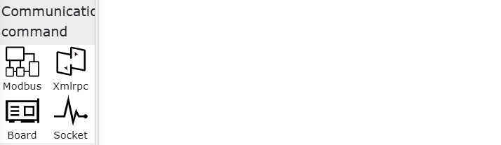

.. centered:: Figura 9.18-49 Selecionar Modbus

Clique em "Modbus_TCP".

.. image:: coding/178.png
   :width: 6in
   :align: center

.. centered:: Figura 9.18-50 Selecionar Modbus_TCP

Selecione "Escravo" para abrir a página de adição de instruções do Escravo Modbus TCP.

.. image:: coding/212.png
   :width: 6in
   :align: center

.. centered:: Figura 9.18-51 Adição de Instruções do Escravo Modbus TCP

1. Escrever Saída Digital Única DO (Entrada Discreta)

Selecione o nome DO como "A Iniciar". O número de registradores é 1. O valor do registrador é 0. Clique em "Escrever Saída Digital Única". Finalmente, role até a parte inferior da página e clique no botão "Aplicar".

.. image:: coding/213.png
   :width: 6in
   :align: center

.. centered:: Figura 9.18-52 Adicionar Instrução para Escrever Saída Digital Única

Uma instrução para o Escravo Modbus do robô escrever uma única saída digital foi adicionada ao programa "testModbusSlave.lua". Alterne o robô para o modo automático e clique no botão iniciar. O robô escreverá o valor 0 no endereço da saída digital correspondente ao nome "A Iniciar".
   
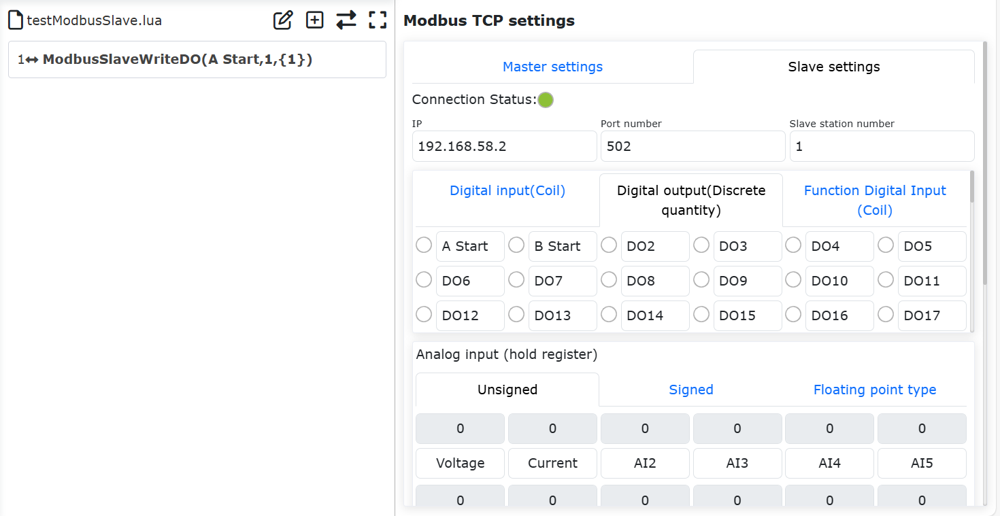

.. centered:: Figura 9.18-53 Programa Lua para Escrita de Saída Digital Única

2. Escrever Múltiplas Saídas Digitais DO (Entrada Discreta)

Abra a página de adição de instruções do Escravo Modbus TCP. Encontre "Configuração de Saída Digital". Selecione o nome DO como "A Iniciar". O número de registradores é 5. O valor do registrador é 1,0,1,0,1. O número de valores do registrador deve corresponder ao número definido de registradores, e vários valores devem ser separados por vírgulas em inglês. Clique em "Escrever Saída Digital". Finalmente, role até a parte inferior da página e clique no botão "Aplicar".
   
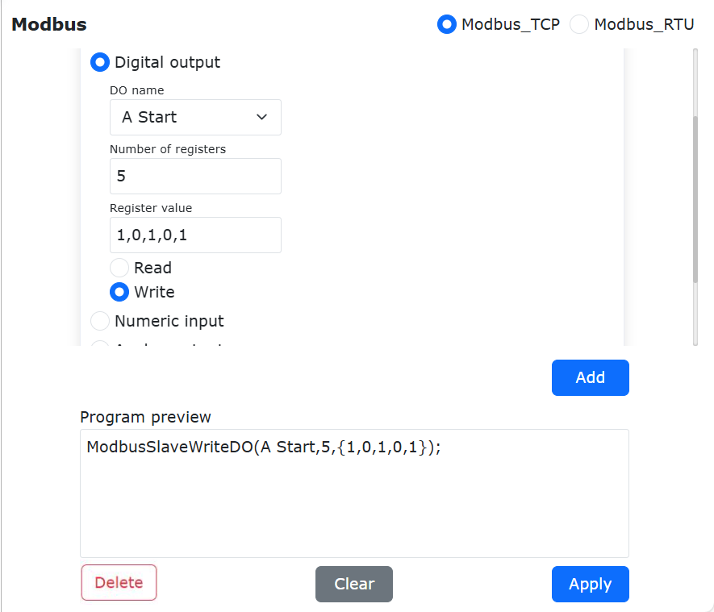

.. centered:: Figura 9.18-54 Configurar Escrita de Múltiplas Saídas Digitais

Uma instrução para o Escravo Modbus do robô escrever múltiplas saídas digitais foi adicionada ao programa "testModbusSlave.lua". Alterne o robô para o modo automático e clique no botão iniciar. O robô escreverá os valores 1, 0, 1, 0, 1 nos registradores de entrada discreta "A Iniciar" e nos 4 registradores seguintes.
      
.. image:: coding/216.png
   :width: 6in
   :align: center

.. centered:: Figura 9.18-55 Programa Lua para Escrita de Múltiplas Saídas Digitais

3. Ler Saída Digital Única DO (Entrada Discreta)

Abra a página de adição de instruções do Mestre Modbus TCP. Encontre "Configuração de Saída Digital". O nome DO é "A Iniciar". O número de registradores é 1. O valor do registrador não precisa ser preenchido. Clique em "Ler Saída Digital". Finalmente, role até a parte inferior da página e clique no botão "Aplicar".
      
.. image:: coding/217.png
   :width: 6in
   :align: center

.. centered:: Figura 9.18-56 Configurar Leitura de Saída Digital Única

Uma instrução para o Escravo Modbus do robô ler uma única saída digital foi adicionada ao programa "testModbusSlave.lua".
         
.. image:: coding/218.png
   :width: 6in
   :align: center

.. centered:: Figura 9.18-57 Programa para Ler Saída Digital Única

Normalmente, após ler um registrador Modbus, o valor lido é armazenado em uma variável. Portanto, é necessário definir uma variável para armazenar o valor lido. Clique no botão "Alternar Modo" para alternar o programa Lua do robô para o estado editável. Antes da instrução "ModbusSlaveReadDO", escreva uma variável de retorno "AStartValue". Após a execução do programa, o valor lido será armazenado em "AStartValue".
         
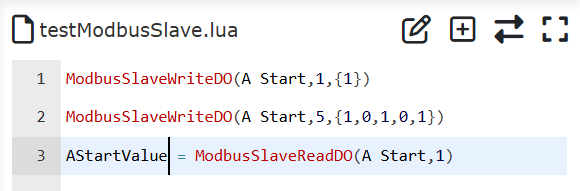

.. centered:: Figura 9.18-58 Ler Saída Digital Única e Armazenar em Variável

Os valores dos registradores do tipo bobina são apenas 0 e 1. No programa do robô, diferentes operações podem ser realizadas julgando valores diferentes do registrador. Clique no botão "Alternar Modo" para alternar o programa de ensino do robô para o modo não editável. Adicione duas instruções de movimento articular para mover para dois pontos diferentes, "P1" e "P2".
         
.. image:: coding/220.png
   :width: 6in
   :align: center

.. centered:: Figura 9.18-59 Adicionar Instruções de Movimento para Pontos Diferentes

Alterne o programa para o modo editável novamente e escreva a condição de julgamento para o valor da saída digital "AStartValue". Quando o valor de "AStartValue" for 1, o robô se move para o ponto "P1"; caso contrário, move-se para o ponto "P2".
         
.. image:: coding/221.png
   :width: 6in
   :align: center

.. centered:: Figura 9.18-60 Mover para Pontos Diferentes com Base no Valor da Saída Digital

Finalmente, alterne o programa do robô de volta para o modo não editável, mude o robô para o modo automático e inicie o programa em condições seguras. Como a segunda linha deste programa define o valor DO da saída digital chamada "A Iniciar" como 1, o robô se moverá para o ponto "P1" após a execução do programa.
         
.. image:: coding/222.png
   :width: 6in
   :align: center

.. centered:: Figura 9.18-61 Ler Valor do Registrador de Bobina Única e Mover

4. Ler Múltiplas Saídas Digitais DO (Entrada Discreta)

Abra a página de adição de instruções do Mestre Modbus TCP. Encontre "Configuração de Saída Digital". Selecione o nome DO como "A Iniciar". O número de registradores é 2. O valor do registrador não precisa ser preenchido. Clique em "Ler Saída Digital". Finalmente, role até a parte inferior da página e clique no botão "Aplicar".
         
.. image:: coding/223.png
   :width: 6in
   :align: center

.. centered:: Figura 9.18-62 Configurar Leitura de Múltiplas Saídas Digitais

Uma instrução para o Escravo Modbus do robô ler múltiplas saídas digitais foi adicionada ao programa "testModbusSlave.lua".
            
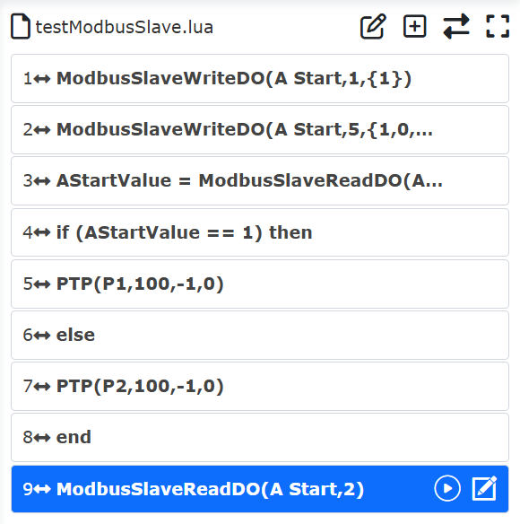

.. centered:: Figura 9.18-63 Programa para Ler Múltiplas Saídas Digitais

Clique no botão "Alternar Modo" para alternar o programa Lua do robô para o estado editável. Como o número de leitura é 2, antes da instrução "ModbusSlaveReadDO", escreva 2 variáveis de retorno "value1,value2". Após a execução do programa, os valores dos 2 registradores de saída digital lidos serão armazenados nas 2 variáveis acima. Da mesma forma, você pode julgar os valores de "value1" e "value2" para fazer o robô realizar diferentes ações.
            
.. image:: coding/225.png
   :width: 6in
   :align: center

.. centered:: Figura 9.18-64 Ler Múltiplas Saídas Digitais e Armazenar em Variáveis

5. Ler Entrada Digital DI (Bobina)

Abra a página de adição de instruções do Escravo Modbus TCP. Encontre "Configuração de Entrada Digital". Selecione o nome DI como "A em Posição". O número de registradores é 2. Clique em "Ler Entrada Digital". Finalmente, role até a parte inferior da página e clique no botão "Aplicar".
            
.. image:: coding/226.png
   :width: 6in
   :align: center

.. centered:: Figura 9.18-65 Configurar Leitura de Entrada Digital

Uma instrução para o Escravo Modbus do robô ler entrada digital foi adicionada ao programa "testModbusSlave.lua".
               

.. centered:: Figura 9.18-66 Instrução do Programa para Ler Entrada Digital

Clique no botão "Alternar Modo" para alternar o programa Lua do robô para o estado editável. Antes da instrução "ModbusSlaveReadDI", escreva as variáveis de retorno "AState,BState". Após a execução do programa, os valores das duas entradas digitais lidas serão armazenados nas variáveis "AState" e "BState". Você pode julgar os valores das variáveis para controlar o robô a realizar diferentes operações.
              
.. image:: coding/228.png
   :width: 6in
   :align: center

.. centered:: Figura 9.18-67 Programa para Ler Entrada Digital

6. Operações de Leitura e Escrita para AO (Registrador de Entrada) e AI (Registrador de Retenção)

As operações de leitura e escrita para AO (registrador de entrada) e AI (registrador de retenção) são basicamente as mesmas que para DO (entrada discreta) e DI (bobina). A diferença é que o intervalo de dados do último é limitado a 0 ou 1, enquanto o intervalo do primeiro é maior. Portanto, para operações específicas, consulte a programação para saída e entrada digital. Aqui, apenas exemplos de programas para leitura de AI e operações de leitura/escrita de AO são mostrados.
              
.. image:: coding/229.png
   :width: 6in
   :align: center

.. centered:: Figura 9.18-68 Ler AI (Entrada Analógica)
              
.. image:: coding/230.png
   :width: 6in
   :align: center

.. centered:: Figura 9.18-69 Ler e Escrever AO (Saída Analógica)

7. Aguardar Entrada Digital

Abra a página de adição de instruções do Escravo Modbus TCP. Encontre "Configuração de Aguardar Entrada Digital". Selecione o nome DI como o registrador "A em Posição" configurado. O estado de espera é "Verdadeiro". O tempo limite é 5000 ms. Clique no botão "Adicionar" e, finalmente, no botão "Aplicar".
              
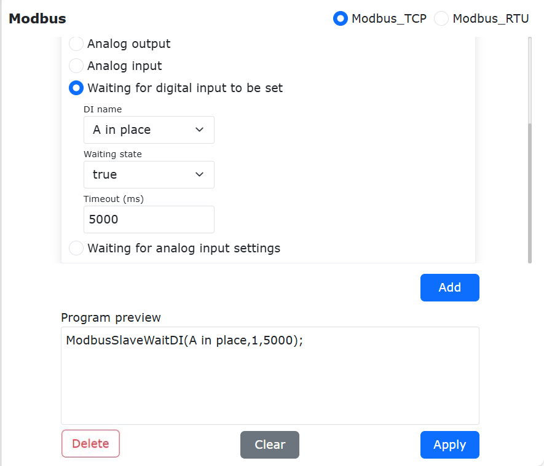

.. centered:: Figura 9.18-70 Adicionar Instrução para Aguardar Entrada Digital

Uma instrução para o Escravo Modbus do robô aguardar a entrada digital foi adicionada ao programa "testModbusSlave.lua". Após iniciar o programa, o robô aguardará até que o valor do registrador de bobina "A em Posição" do escravo se torne verdadeiro, ou seja, valor 1. Como o tempo limite definido é de 5 segundos, se após 5 segundos de espera o sinal "A em Posição" ainda for 0, o programa do robô reportará um erro de tempo limite e parará automaticamente.
              

.. centered:: Figura 9.18-71 Programa para Aguardar Entrada Digital

8. Aguardar Entrada Analógica

Abra a página de adição de instruções do Escravo Modbus TCP. Encontre "Configuração de Aguardar Entrada Analógica". Selecione o nome AI como o registrador "Tensão" configurado. O estado de espera é ">". O valor do registrador é 255. O tempo limite é 5000 ms. Clique no botão "Adicionar" e, finalmente, no botão "Aplicar".

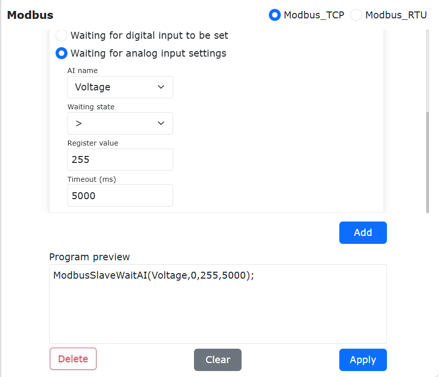

.. centered:: Figura 9.18-72 Adicionar Instrução para Aguardar Entrada Analógica

Uma instrução para o Escravo Modbus do robô aguardar o valor da entrada analógica foi adicionada ao programa "testModbusSlave.lua". Após iniciar o programa, o robô aguardará até que o valor do registrador "Tensão" do escravo seja maior que 255. Como o tempo limite definido é de 5 segundos, se após 5 segundos de espera o sinal "Tensão" ainda não for maior que 255, o programa do robô reportará um erro de tempo limite e parará automaticamente.
              
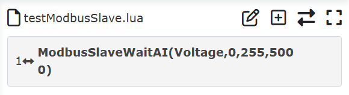

.. centered:: Figura 9.18-73 Programa para Aguardar Registrador de Entrada Analógica

Abra a página de adição de instruções do Escravo Modbus TCP. Encontre "Configuração de Aguardar Entrada Analógica" (aguardar registrador de entrada AI). Selecione o nome AI como o registrador "Nível de Líquido" configurado. O estado de espera é "=". O valor do registrador é 255. O tempo limite é 5000 ms. Clique no botão "Adicionar" e, finalmente, no botão "Aplicar".
            
.. image:: coding/495.png
   :width: 6in
   :align: center

.. centered:: Figura 9.18-73-2 Adicionar Instrução para Aguardar Entrada Analógica

Uma instrução para o Escravo Modbus do robô aguardar o valor do registrador de entrada AI foi adicionada ao programa "test.lua". Após iniciar o programa, o robô aguardará até que o valor do registrador "Nível de Líquido" seja igual a 255. Como o tempo limite definido é de 5 segundos, se após 5 segundos de espera o sinal "Nível de Líquido" ainda não for igual a 255, o programa do robô reportará um erro de tempo limite e parará automaticamente.

Feedback de Estado e Controle do Robô no Escravo Modbus TCP
*****************************************************************************

Os endereços dos registradores de entrada do Escravo Modbus TCP do robô colaborativo, de 310 a 473, são usados para feedback do estado do robô em tempo real (consulte o Anexo 1: Mapa de Endereços do Escravo Modbus TCP para definições específicas). Você só precisa usar um dispositivo mestre para ler os valores dos registradores correspondentes e obter os dados de estado em tempo real do robô.

Os endereços dos registradores de bobina do Escravo Modbus TCP do robô colaborativo, de 300 a 599, são usados para o dispositivo mestre controlar o robô (consulte o Anexo 1: Mapa de Endereços do Escravo Modbus TCP para definições específicas). Tomando o endereço de bobina 502 como exemplo, esta função representa "Iniciar Programa". Quando o robô está no modo automático e o dispositivo mestre define o valor do endereço 502 de 0 para 1, o robô inicia automaticamente a execução do programa atualmente configurado. Tomando o endereço de bobina 300 como exemplo, ele é usado para controlar a saída DO0 do painel de controle do robô. Quando o mestre externo define o endereço de bobina 300 de 0 para 1, a saída DO0 do painel de controle é ativada. Da mesma forma, quando o mestre externo define o endereço de bobina 300 de 1 para 0, a saída DO0 do painel de controle é desativada. Clique em "Entrada Digital de Função (Bobina)" na página de configuração do Escravo Modbus TCP para monitorar todas as entradas digitais de função atuais.
              
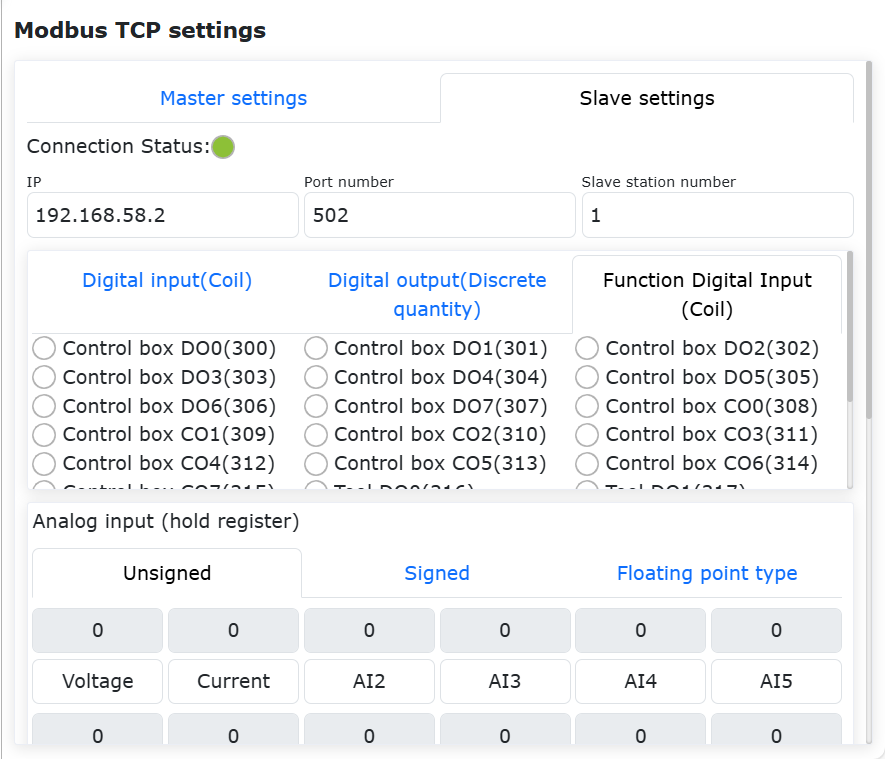

.. centered:: Figura 9.18-74 Entrada Digital de Função do Escravo do Robô
                 
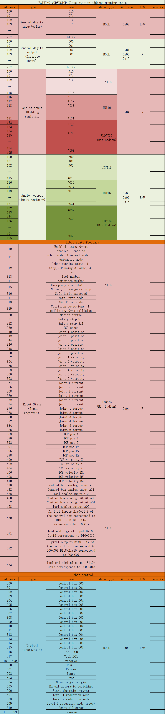

.. centered:: Figura 9.18-74 Mapa de Endereços do Escravo Modbus

Anexo 1: :download:`Mapa de Endereços do Escravo Modbus <../_static/_doc/ModbusTCP Slave station address mapping table.xlsx>`

Programa de Fundo do Robô
~~~~~~~~~~~~~~~~~~~~~~~~~~~~~~~~~~~~~~~~~

Função do Programa de Fundo do Robô
+++++++++++++++++++++++++++++++++++++++++++++

O programa de fundo do robô é um programa de controle que pode ser executado em segundo plano enquanto o programa de movimento em primeiro plano do robô está em execução. Ambos são independentes em termos de execução.

O programa de fundo pode monitorar o estado de execução do programa em primeiro plano e também pode enviar sinais de controle para ele. O programa de fundo também pode se conectar a dispositivos externos através de comunicação I/O para monitorar e controlar o funcionamento dos dispositivos periféricos do robô. As instruções que podem ser executadas pelo programa de fundo são diferentes das do programa de ensino em primeiro plano; ele não pode controlar nenhum eixo de movimento. Portanto, nenhuma instrução de movimento de eixo do robô pode estar contida na programação. Apenas funções de controle lógico e funções de comunicação I/O são mantidas.

Ao usar um programa de fundo, ele é executado em loop continuamente do início ao fim. O período de execução do programa de fundo no sistema é de 1 milissegundo. Funções de atraso podem ser adicionadas ao programa de fundo para controlar o período de execução. A execução do programa de fundo não é afetada por parada de emergência, pausa ou alarmes.

.. note:: No máximo 8 programas de fundo podem ser executados simultaneamente.

Após uma queda de energia, na próxima energização, o programa de fundo será carregado automaticamente e executado de acordo com o estado definido.

Salvando o Programa de Fundo do Robô
************************************

A criação, edição e salvamento de programas de fundo só podem ser feitos na interface do programa de fundo.

**Passo 1**: Abra a interface do programa de fundo do robô. Abra a página de ensino, clique sequencialmente em "Programa de Ensino", "Programação de Programa". Selecione a instrução "Programa de Fundo" no canto superior esquerdo para entrar na interface do programa de fundo.

.. note:: Os programas de fundo contêm apenas instruções de julgamento lógico, atribuição, instruções de controle de primeiro plano, instruções de interface I/O e instruções de comunicação Modbus.

.. image:: coding/253.png
   :width: 6in
   :align: center

.. centered:: Figura 9.19-1 Interface do Programa de Fundo

**Passo 2**: No modo manual, abra o arquivo do programa de ensino de fundo. Clique em "Novo" para criar um novo arquivo de programa de ensino, edite o programa e clique em "Salvar" para salvar o arquivo.

.. note:: O período de execução do programa de fundo é de 1 milissegundo. Funções de atraso fornecidas podem ser usadas no programa, como na linha 4 do programa abaixo, adicionando um atraso de 1 segundo para controlar o período de execução.

.. image:: coding/254.png
   :width: 6in
   :align: center

.. centered:: Figura 9.19-2 Criação e Salvamento de um Novo Arquivo de Programa de Fundo

Gerenciamento do Programa de Fundo do Robô
************************************************************

Os programas de fundo salvos com sucesso podem ser criados, pausados, retomados e excluídos na interface de gerenciamento do programa de fundo. A interface de gerenciamento do programa de fundo mostra claramente o estado de execução de todos os programas de fundo criados. Verde indica que está em execução, vermelho indica estado de pausa.

**Passo 1**: Criar um programa de fundo. Clique no botão "Gerenciamento de Programa de Fundo", selecione um programa de fundo salvo na lista suspensa e clique em "Iniciar Execução" para executar o programa de fundo correspondente.

.. image:: coding/255.png
   :width: 6in
   :align: center

.. centered:: Figura 9.19-3 Criar Programa de Fundo

**Passo 2**: Retomar, pausar um programa de fundo. Na interface de gerenciamento do programa de fundo, clique nos botões "Retomar" e "Pausar" para o programa de monitoramento para retomar e pausar o programa de fundo correspondente. Clique no botão "Excluir" para excluir o programa de fundo correspondente.

.. image:: coding/256.png
   :width: 6in
   :align: center

.. centered:: Figura 9.19-4 Pausar, Retomar, Excluir Programa de Fundo

Uso de Variáveis de Usuário do Robô
++++++++++++++++++++++++++++++++++++++++++++++++++

.. note:: O robô colaborativo possui uma nova função de variável de usuário, adequada para troca de dados entre o programa de fundo e o programa em primeiro plano do robô, ou entre diferentes programas de fundo.

Gerenciamento de Variáveis de Usuário do Robô
*************************************************************

Antes de usar as variáveis de usuário, você pode renomeá-las conforme sua preferência. Abra a página de ensino, clique sequencialmente em "Programa de Ensino", "Programação de Programa", "Gerenciamento de Variáveis de Usuário". Esta página pode ser usada tanto em programas em primeiro plano quanto em programas de fundo. Clique no nome da variável para alterá-la diretamente.

.. image:: coding/257.png
   :width: 6in
   :align: center

.. centered:: Figura 9.19-5 Gerenciamento de Variáveis de Usuário

Uso de Variáveis de Usuário do Robô
*************************************************

Ao usar variáveis de usuário em programas em primeiro e segundo plano, use apenas as interfaces de leitura e escrita de variáveis de usuário.

**Passo 1**: No modo manual, abra o arquivo do programa de ensino. Abra a página de ensino, clique sequencialmente em "Programa de Ensino", "Programação de Programa", clique em "Novo" para criar um novo arquivo de programa de ensino.

.. image:: coding/258.png
   :width: 6in
   :align: center

.. centered:: Figura 9.19-6 Criar um Novo Arquivo de Programa de Ensino

**Passo 2**: Usar a interface de leitura de variável de usuário. Clique na instrução "Variável", selecione "Variável de Usuário", clique na lista suspensa "Obter Valor da Variável", selecione a variável de usuário a ser lida, clique nos botões "Adicionar" e "Aplicar" para escrever o programa da interface de leitura da variável de usuário.

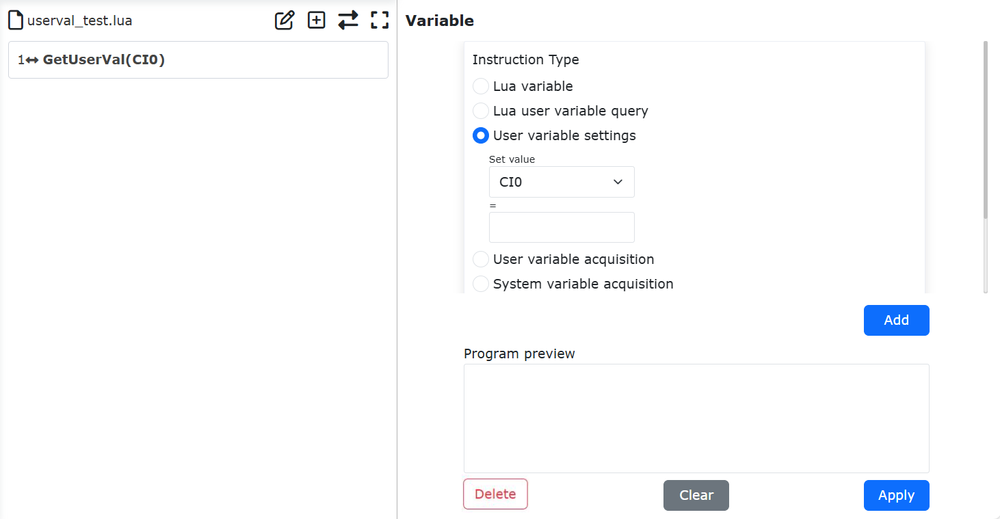

.. centered:: Figura 9.19-7 Usar a Interface de Leitura da Variável de Usuário

**Passo 3**: Usar a interface de escrita de variável de usuário. Clique na instrução "Variável", selecione "Variável de Usuário", clique na lista suspensa "Definir Valor da Variável", selecione a variável de usuário a ser definida, preencha o valor de configuração correspondente. Este valor pode ser uma constante ou um valor de variável. Clique nos botões "Adicionar" e "Aplicar" para escrever o programa da interface de escrita da variável de usuário.

.. image:: coding/260.png
   :width: 6in
   :align: center

.. centered:: Figura 9.19-8 Usar a Interface de Escrita da Variável de Usuário

Lixamento com Força Constante Horizontal nas Direções XY
~~~~~~~~~~~~~~~~~~~~~~~~~~~~~~~~~~~~~~~~~~~~~~~~~~~~~~~~~~~~~~~~~~~~

Visão Geral
+++++++++++++++

O princípio do lixamento com força constante horizontal nas direções XY é o seguinte: Lixamento com força constante horizontal significa aplicar uma força constante na superfície especificada da peça de trabalho com uma ferramenta de lixamento (como um rebolo, disco de lixamento, etc.) e controlar o movimento da ferramenta ao longo das direções XY, mantendo uma força de lixamento constante no ponto de contato.

Fluxo de Operação da Função de Lixamento com Força Constante Horizontal nas Direções XY
+++++++++++++++++++++++++++++++++++++++++++++++++++++++++++++++++++++++++++++++++++++++++++++

Para usar o sensor de força para lixamento de força constante, é necessário instalar uma ferramenta de lixamento abaixo do sensor de força e configurar o sistema de coordenadas da ferramenta. Clique sequencialmente em "Configurações Iniciais" -> "Básico" -> "Sistema de Coordenadas" -> "Ferramenta" para entrar na interface "Configuração do Sistema de Coordenadas da Ferramenta". Em "Nome do Sistema de Coordenadas", selecione o sistema de coordenadas a ser configurado (usando o sistema de coordenadas toolcoord0 como exemplo) e configure-o de acordo com as dimensões da ferramenta de extremidade.

.. image:: coding/246.png
   :width: 4in
   :align: center

.. centered:: Figura 9.20-1 Configuração do Sistema de Coordenadas da Ferramenta

Configuração do sistema de coordenadas de referência para controle de força. Na interface web, clique sequencialmente em "FT" -> "Sistema de Coordenadas de Referência", selecione "Sistema de Coordenadas Personalizado" e defina todos os parâmetros como "0". Quando o sensor de força está funcionando, diferentes sistemas de coordenadas de referência afetam a magnitude da força externa obtida pelo sensor.

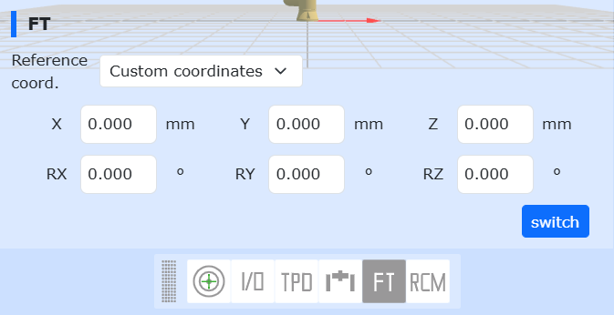

.. centered:: Figura 9.20-2 Configuração do Sistema de Coordenadas de Referência

Fixe a placa plana a ser lixada no espaço de trabalho do robô. A placa não deve se mover. Posicione a extremidade da ferramenta aproximadamente perpendicular à placa de lixamento e ensine os pontos inicial e final.

.. image:: coding/262.png
   :width: 2in
   :align: center

.. centered:: Figura 9.20-3 Esquema da Disposição do Lixamento

Clique sequencialmente em "Programa de Ensino" -> "Programação de Programa" -> "Conjunto de Controle de Força" para adicionar a instrução "FT_Control". A instrução "FT_Control" é uma instrução de controle de movimento com força, permitindo que o robô se mova perto de uma força definida.

.. image:: coding/263.png
   :width: 4in
   :align: center

.. centered:: Figura 9.20-4 Adicionar Instrução de Controle de Força

.. image:: coding/264.png
   :width: 6in
   :align: center

.. centered:: Figura 9.20-5 Exemplo de Instrução de Lixamento com Controle de Força

Função específica dos parâmetros:

**Nome do Sistema de Coordenadas**: O nome correspondente ao configurar o sistema de coordenadas do sensor.

**Marcar direções de força para detecção**: Definir limites de detecção: Selecione as direções de força a serem controladas. No lixamento horizontal, marque Fx, Fy e defina a força constante desejada correspondente.

**Parâmetros PID**: Defina os coeficientes de proporção PID para força e torque. Geralmente, defina F_P_gain como 0.001.

**Distância Máxima de Ajuste**: Distância máxima de movimento correspondente às direções X, Y, Z.

**Ângulo Máximo de Ajuste**: Ângulo máximo de rotação correspondente às direções RX, RY, RZ.

**Raio do Disco de Lixamento**: Determinado pelo raio real da ferramenta de lixamento de extremidade.

Função de Evasão Automática de Pontos Singulares na Trajetória
~~~~~~~~~~~~~~~~~~~~~~~~~~~~~~~~~~~~~~~~~~~~~~~~~~~~~~~~~~~~~~~~~~~~~~~~~~~~~~

Visão Geral
+++++++++++++++

Quando o robô encontra um intervalo singular que não pode ser atravessado durante a execução de uma trajetória de instrução LIN ou ARC, ele reporta um erro, indicando que a próxima pose é singular ou exibindo um aviso de singularidade. Se você deseja atingir o próximo ponto de caminho que passaria por um intervalo singular, pode usar esta função para evitar o ponto singular no espaço articular ou cartesiano, alcançando assim a pose alvo.

.. image:: coding/265.png
   :width: 4in
   :align: center

.. centered:: Figura 9.21-1 Diagrama Simplificado de Pontos Singulares do Robô

A figura acima é um diagrama simplificado dos pontos singulares do robô. As singularidades do robô incluem ombro, cotovelo e punho. Na figura, A é o centro do ponto central do punho (WCP) para a junta 5, usado para determinar a singularidade de ombro. B é o intervalo de singularidade de ombro, em forma de cilindro, com raio igual ao comprimento do parâmetro DH d4 do robô. Quando o WCP entra no cilindro B, o robô entra em estado singular. C é o limite da singularidade de cotovelo. Quando J3 = 0 ou 180°, o robô está em um ponto singular de cotovelo. D é o espaço interno do robô. Em qualquer posição dentro do espaço interno, quando J5 = 0 ou 180°, o robô está em estado singular de punho.

.. note:: A singularidade é uma característica de movimento determinada pela estrutura física do robô. Deve ser evitada durante a operação real. Evitá-la por meio de algoritmos pode levar a alterações na pose e velocidade da extremidade, e até mesmo na configuração da estrutura. É necessário considerar se os efeitos colaterais da evasão afetam os requisitos antes de escolher.

Fluxo de Operação da Função de Evasão Automática de Pontos Singulares na Trajetória
+++++++++++++++++++++++++++++++++++++++++++++++++++++++++++++++++++++++++++++++++++++++++++++++++++

No programa recém-criado, clique para adicionar uma instrução de movimento do tipo LIN/ARC do robô.

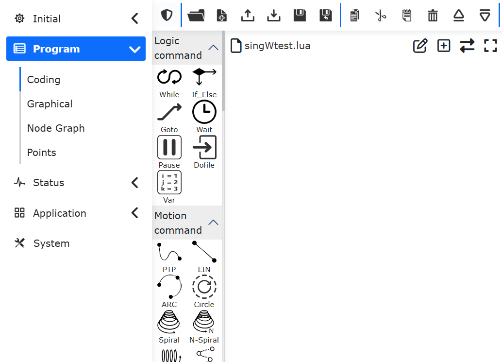

.. centered:: Figura 9.21-2 Adicionar Instrução de Movimento LIN/ARC

Clique na instrução "Linear", selecione um ponto de caminho que passe por um ponto singular do robô. Na sub-opção "Proteção de Movimento" da interface de configuração de parâmetros da instrução, clique no botão "Evasão de Ponto Singular".

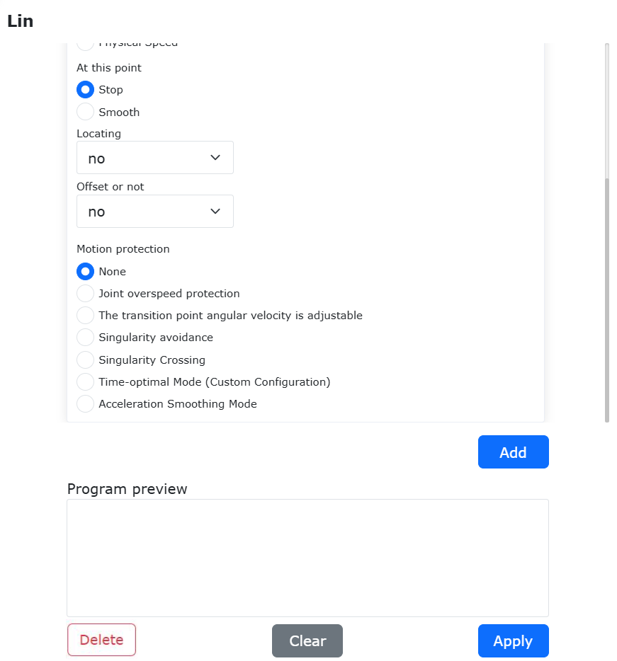

.. centered:: Figura 9.21-3 Ativar a Função de Evasão de Ponto Singular

Os parâmetros de "Evasão de Ponto Singular" incluem "Modo de Proteção", "Ajuste de Singularidade de Ombro", "Ajuste de Singularidade de Cotovelo" e "Ajuste de Singularidade de Punho". "Modo de Proteção" pode ser "Modo Articular" ou "Modo Cartesiano", significando que o robô pode atravessar a singularidade no espaço articular ou contorná-la no espaço cartesiano. Os parâmetros de "Ajuste de Singularidade" especificam o intervalo para julgar a singularidade e o desvio máximo para a evasão. A unidade para singularidades de ombro e cotovelo é mm, e para singularidade de punho é °.

.. note:: O espaço articular selecionará a trajetória mais curta entre as juntas, portanto, não ocorrerá violação de limite. A evasão no espaço cartesiano pode levar a violações de limite articular, o que precisa ser observado e ajustado durante o ensino.

Após selecionar e definir os parâmetros de evasão de ponto singular, clique no botão "Adicionar" para adicionar a instrução e, em seguida, clique em "Aplicar" para adicionar a instrução Lua ao programa.

.. image:: coding/268.png
   :width: 6in
   :align: center

.. centered:: Figura 9.21-4 Configurar Parâmetros de Evasão de Ponto Singular e Adicionar Instrução Lua

Um programa Lua típico de movimento LIN com evasão de singularidade é mostrado abaixo:

.. image:: coding/269.png
   :width: 6in
   :align: center

.. centered:: Figura 9.21-5 Programa Lua Contendo Instrução de Evasão de Ponto Singular

O efeito de evasão alcançado é mostrado abaixo, onde o vermelho é a trajetória da extremidade do robô:

.. image:: coding/270.png
   :width: 4in
   :align: center

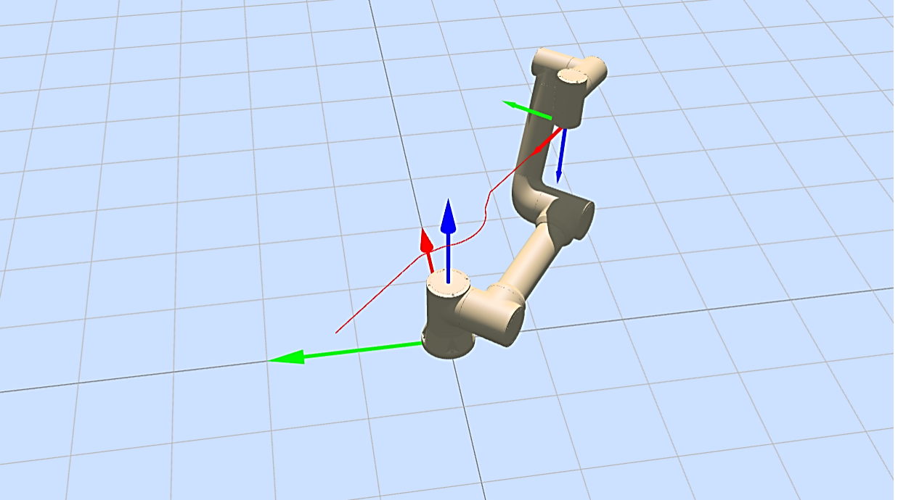

.. centered:: Figura 9.21-6 Exemplo de Trajetória de Evasão de Singularidade de Ombro (acima: espaço cartesiano, abaixo: espaço articular)

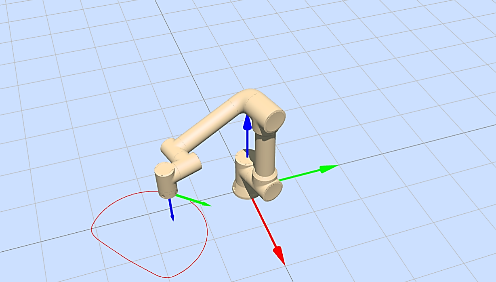

.. image:: coding/273.png
   :width: 4in
   :align: center

.. centered:: Figura 9.21-7 Exemplo de Trajetória de Evasão de Singularidade de Cotovelo (acima: espaço cartesiano, abaixo: espaço articular)

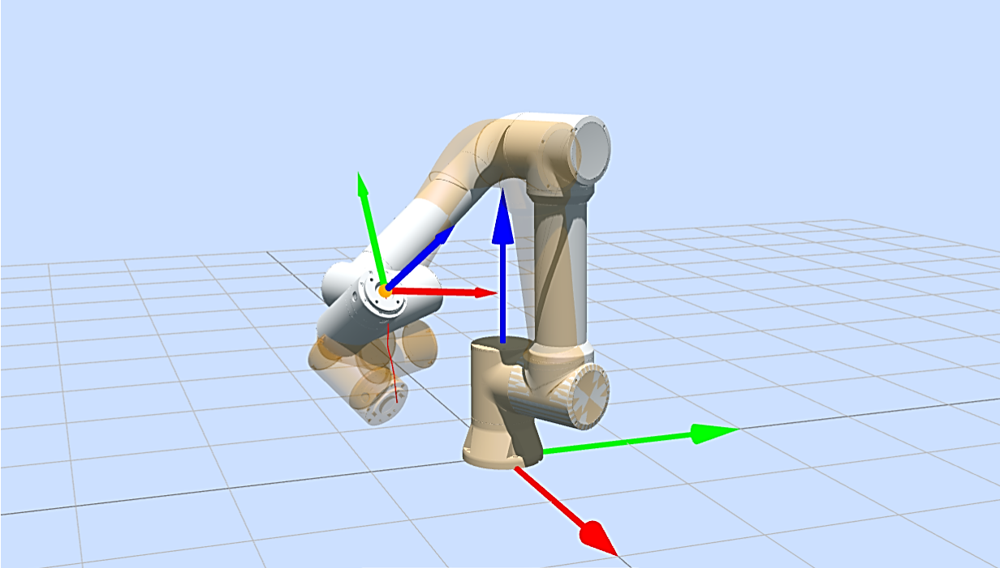

.. centered:: Figura 9.21-8 Exemplo de Trajetória de Evasão de Singularidade de Punho (espaço articular)

Atualmente, esta função suporta a evasão ao passar por um único tipo de ponto singular durante o movimento LIN/ARC. Se os pontos inicial e final do movimento estiverem dentro do intervalo singular definido, ou se o movimento passar por mais de um tipo de singularidade ou até mesmo duas ou mais simultaneamente, uma janela pop-up "[Aviso] Pose Singular" será exibida, indicando que a situação singular atual não pode ser evitada.

.. image:: coding/275.png
   :width: 3in
   :align: center

.. centered:: Figura 9.21-9 Aviso de que a Situação Singular Atual Não Pode Ser Evitada

Função de Atravessar Ponto Singular no Modo Automático
~~~~~~~~~~~~~~~~~~~~~~~~~~~~~~~~~~~~~~~~~~~~~~~~~~~~~~~~~~~~~~~~

Visão Geral
++++++++++++

Quando o robô executa uma instrução LIN ou ARC e passa por um ponto singular, sua velocidade muda abruptamente, tornando o controle de movimento instável e podendo até danificar o equipamento. A função de atravessar ponto singular permite que o robô passe suavemente pelo ponto singular. Este manual usa uma instrução LIN que passa pela singularidade de punho como exemplo para explicar o uso da função de atravessar ponto singular no modo automático.

Fluxo de Operação
+++++++++++++++++++++++++++++

1. Ensine dois pontos de controle de movimento para o robô executar a instrução LIN (nomeados como wristlin1 e wristlin2 neste manual).

2. Clique sequencialmente em "Programa de Ensino" —> "Programação de Programa", selecione a instrução "Ponto a Ponto" em "Instruções de Movimento" e adicione o primeiro ponto de movimento.

.. image:: coding/285.png
   :width: 6in
   :align: center

.. centered:: Figura 9.22-1 Adicionar Primeiro Ponto de Movimento

3. Selecione a instrução "Linear" em "Instruções de Movimento" e adicione o segundo ponto de movimento. Em "Proteção de Movimento", selecione "Atravessar Ponto Singular" e defina os intervalos de ajuste para singularidades de ombro, cotovelo e punho.

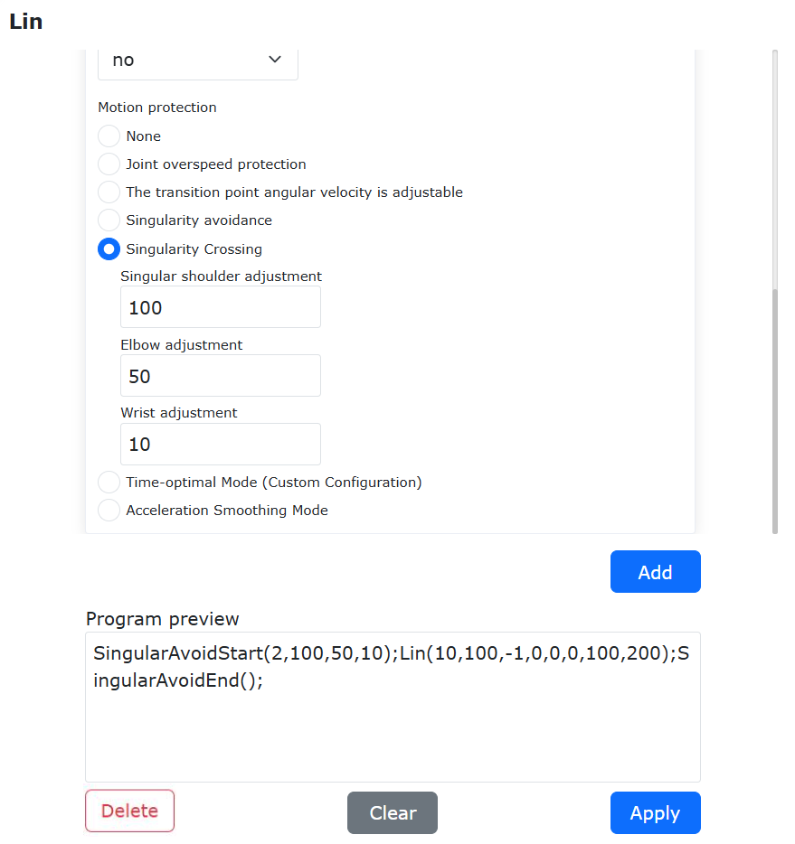

.. centered:: Figura 9.22-2 Configurar Parâmetros de Atravessar Ponto Singular

4. Gere o programa Lua e execute-o. O programa de instrução LIN típico para atravessar ponto singular no modo automático.

.. image:: coding/287.png
   :width: 6in
   :align: center

.. centered:: Figura 9.22-3 Instrução LIN Típica para Atravessar Ponto Singular

5. Observe o resultado do movimento do robô e ajuste a velocidade de movimento e a faixa de configuração da singularidade para obter diferentes precisões e impactos.

Tabela de Comparação de Precisão e Impacto
++++++++++++++++++++++++++++++++++++++++++++++++++++++++++++

1. A singularidade de punho é o tipo de singularidade mais facilmente acionada pelo robô. As tabelas de comparação de precisão e impacto para instruções LIN e ARC com singularidade de punho são fornecidas abaixo. (〇 indica que um aviso de colisão foi acionado).
   
.. centered:: Tabela 9.22-3-1 Erro da Instrução LIN com Singularidade de Punho (unidade: mm)

.. list-table::
   :widths: 35 20 20 20 20 20 20
   :header-rows: 0
   :class: sheet-center

   * - **Faixa de Singularidade / Velocidade da Interface**
     - **2**
     - **20**
     - **40**
     - **60**
     - **80**
     - **100**

   * - 2 mm
     - 0.19					
     - 0.20
     - 0.20 
     - 0.21 
     - 〇  
     - 〇  

   * - 4 mm
     - 0.14					
     - 0.14
     - 0.14
     - 0.14
     - 0.14  
     - 0.14  

   * - 6 mm
     - 0.40				
     - 0.40
     - 0.41
     - 0.41
     - 0.42  
     - 0.42  

   * - 8 mm
     - 0.82				
     - 0.83
     - 0.83
     - 0.84
     - 0.83  
     - 0.84  

   * - 10 mm
     - 1.38				
     - 1.38
     - 1.39
     - 1.39
     - 1.39
     - 1.41  
   
.. centered:: Tabela 9.22-3-2 Aceleração de Jerk Linear da Instrução LIN com Singularidade de Punho (unidade: m/s\ :sup:`3`)

.. list-table::
   :widths: 35 20 20 20 20 20 20
   :header-rows: 0
   :class: sheet-center

   * - **Faixa de Singularidade / Velocidade da Interface**
     - **2**
     - **20**
     - **40**
     - **60**
     - **80**
     - **100**

   * - 2 mm
     - 0.605						
     - 12.040
     - 11.370
     - 2743.000		
     - 〇  
     - 〇  

   * - 4 mm
     - 0.916								
     - 34.620
     - 110.900	
     - 241.300	
     - 303.900  
     - 400.700  

   * - 6 mm
     - 0.906									
     - 59.700
     - 139.600
     - 343.700
     - 445.600  
     - 582.900  

   * - 8 mm
     - 1.073									
     - 67.480
     - 199.600
     - 438.300
     - 553.400 
     - 623.900  

   * - 10 mm
     - 1.013								
     - 69.490
     - 195.800	
     - 556.600
     - 649.300
     - 953.300  
   
.. centered:: Tabela 9.22-3-3 Aceleração de Jerk Angular da Instrução LIN com Singularidade de Punho (unidade: °/s\ :sup:`3`)

.. list-table::
   :widths: 35 20 20 20 20 20 20
   :header-rows: 0
   :class: sheet-center

   * - **Faixa de Singularidade / Velocidade da Interface**
     - **2**
     - **20**
     - **40**
     - **60**
     - **80**
     - **100**

   * - 2 mm
     - 1122									
     - 25140
     - 24780
     - 54890		
     - 〇  
     - 〇  

   * - 4 mm
     - 305													
     - 9035
     - 26030
     - 39330
     - 60510
     - 80330

   * - 6 mm
     - 219														
     - 8161
     - 19450
     - 84700
     - 109300
     - 143400 

   * - 8 mm
     - 478													
     - 6651
     - 19780
     - 121600
     - 150500
     - 162100 

   * - 10 mm
     - 281												
     - 5296
     - 14470
     - 161600
     - 177300
     - 256000
   
.. centered:: Tabela 9.22-3-4 Erro da Instrução ARC com Singularidade de Punho (unidade: mm)

.. list-table::
   :widths: 35 20 20 20 20 20 20
   :header-rows: 0
   :class: sheet-center

   * - **Faixa de Singularidade / Velocidade da Interface**
     - **2**
     - **20**
     - **40**
     - **60**
     - **80**
     - **100**

   * - 2 mm
     - 1.06									
     - 1.06
     - 1.05
     - 1.05		
     - 〇  
     - 〇  

   * - 4 mm
     - 1.58														
     - 1.59
     - 1.60
     - 1.62
     - 〇  
     - 〇 

   * - 6 mm
     - 3.31																			
     - 3.34
     - 3.35
     - 3.32
     - 3.39
     - 3.33 

   * - 8 mm
     - 5.81																		
     - 5.83
     - 5.87
     - 5.87
     - 5.87
     - 5.96 

   * - 10 mm
     - 9.06																	
     - 9.09
     - 9.12
     - 9.17
     - 9.17
     - 9.22
   
.. centered:: Tabela 9.22-3-5 Aceleração de Jerk Linear da Instrução ARC com Singularidade de Punho (unidade: m/s\ :sup:`3`)

.. list-table::
   :widths: 35 20 20 20 20 20 20
   :header-rows: 0
   :class: sheet-center

   * - **Faixa de Singularidade / Velocidade da Interface**
     - **2**
     - **20**
     - **40**
     - **60**
     - **80**
     - **100**

   * - 2 mm
     - 13.970										
     - 643.000	
     - 2230.000	
     - 3408.000	
     - 〇  
     - 〇  

   * - 4 mm
     - 0.635																	
     - 24.850
     - 42.480
     - 76.990
     - 〇  
     - 〇 

   * - 6 mm
     - 3.000																						
     - 19.960
     - 45.350
     - 57.120
     - 77.050
     - 59.800	 

   * - 8 mm
     - 1.494																						
     - 27.830
     - 90.290
     - 124.200
     - 148.400
     - 168.000

   * - 10 mm
     - 0.460																					
     - 31.870
     - 112.600
     - 211.000
     - 229.300
     - 117.500
   
.. centered:: Tabela 9.22-3-6 Aceleração de Jerk Angular da Instrução ARC com Singularidade de Punho (unidade: °/s\ :sup:`3`)

.. list-table::
   :widths: 35 20 20 20 20 20 20
   :header-rows: 0
   :class: sheet-center

   * - **Faixa de Singularidade / Velocidade da Interface**
     - **2**
     - **20**
     - **40**
     - **60**
     - **80**
     - **100**

   * - 2 mm
     - 3378													
     - 85380
     - 228600	
     - 351900
     - 〇  
     - 〇  

   * - 4 mm
     - 1098																				
     - 31360
     - 71460
     - 104800
     - 〇  
     - 〇 

   * - 6 mm
     - 390																											
     - 15770
     - 43650
     - 79330
     - 93930
     - 124200 

   * - 8 mm
     - 315																											
     - 10270
     - 28770
     - 57000
     - 75840
     - 94050

   * - 10 mm
     - 504																										
     - 6108
     - 21470
     - 34920
     - 47280
     - 97160

2. Como as singularidades de ombro e cotovelo correspondem, respectivamente, ao limite mínimo e máximo do espaço de trabalho do robô, a precisão não pode ser usada como um indicador de medição. Portanto, a tabela de comparação de impacto para a singularidade de ombro e a tabela de comparação de impacto para a singularidade de cotovelo são fornecidas abaixo (〇 indica que um aviso de colisão foi acionado).
   
.. centered:: Tabela 9.22-3-7 Aceleração de Jerk Linear para Singularidade de Ombro (unidade: m/s\ :sup:`3`)

.. list-table::
   :widths: 35 20 20 20 20 20 20
   :header-rows: 0
   :class: sheet-center

   * - **Faixa de Singularidade / Velocidade da Interface**
     - **2**
     - **20**
     - **40**
     - **60**
     - **80**
     - **100**

   * - 40 mm
     - 1.166																
     - 99.730
     - 253.200	
     - 273.500
     - 〇  
     - 〇  

   * - 70 mm
     - 1.047																								
     - 92.440
     - 328.900
     - 634.500
     - 878.400  
     - 1499.000	 

   * - 100 mm
     - 1.060																															
     - 90.250
     - 273.900
     - 506.600
     - 926.300
     - 1555.000	 

.. centered:: Tabela 9.22-3-8 Aceleração de Jerk Angular para Singularidade de Ombro (unidade: °/s\ :sup:`3`)

.. list-table::
   :widths: 35 20 20 20 20 20 20
   :header-rows: 0
   :class: sheet-center

   * - **Faixa de Singularidade / Velocidade da Interface**
     - **2**
     - **20**
     - **40**
     - **60**
     - **80**
     - **100**

   * - 40 mm
     - 396																		
     - 89.83
     - 824
     - 348
     - 〇  
     - 〇  

   * - 70 mm
     - 428																													
     - 121
     - 681
     - 167
     - 1783 
     - 35690 

   * - 100 mm
     - 440																																				
     - 151
     - 473
     - 246
     - 1495
     - 39280

.. centered:: Tabela 9.22-3-9 Aceleração de Jerk Linear para Singularidade de Cotovelo (unidade: m/s\ :sup:`3`)

.. list-table::
   :widths: 35 20 20 20 20 20 20
   :header-rows: 0
   :class: sheet-center

   * - **Faixa de Singularidade / Velocidade da Interface**
     - **2**
     - **20**
     - **40**
     - **60**
     - **80**
     - **100**

   * - 40 mm
     - 0.905																						
     - 14.430
     - 52.080
     - 87.380
     - 129.400  
     - 657.000  

   * - 70 mm
     - 1.144																																		
     - 24.320
     - 79.580
     - 270.300
     - 793.300 
     - 1478.000 

   * - 100 mm
     - 1.852																																									
     - 27.930
     - 112.700
     - 328.100
     - 583.000
     - 758.600

.. centered:: Tabela 9.22-3-10 Aceleração de Jerk Angular para Singularidade de Cotovelo (unidade: °/s\ :sup:`3`)

.. list-table::
   :widths: 35 20 20 20 20 20 20
   :header-rows: 0
   :class: sheet-center

   * - **Faixa de Singularidade / Velocidade da Interface**
     - **2**
     - **20**
     - **40**
     - **60**
     - **80**
     - **100**

   * - 40 mm
     - 347																										
     - 128
     - 148
     - 142
     - 63
     - 38050 

   * - 70 mm
     - 424																																						
     - 132
     - 141
     - 21780
     - 56190
     - 95610 

   * - 100 mm
     - 46																																														
     - 1443
     - 6194
     - 19940
     - 35170
     - 46770

Função de Planejamento de Trajetória com Antecedência em Tempo Real
~~~~~~~~~~~~~~~~~~~~~~~~~~~~~~~~~~~~~~~~~~~~~~~~~~~~~~~~~~~~~~~~~~~~~~~~~~~~~~~~

Visão Geral
++++++++++++

O planejamento de trajetória com antecedência em tempo real ajusta dinamicamente parâmetros de movimento, como velocidade e aceleração do robô, com base nas informações do caminho atual e futuro, garantindo suavidade, continuidade e precisão do movimento. Ao prever a posição e postura futura do robô, o controle de antecipação pode responder antes de pontos críticos no caminho, evitando movimentos irregulares ou erros de trajetória devido a mudanças abruptas de velocidade e aceleração.

Fluxo de Operação
++++++++++++++++++++++++++++

**Passo 1**: Prepare um arquivo de pontos de trajetória no formato "txt", onde cada ponto de trajetória é representado por uma pose cartesiana.
   
**Passo 2**: Clique sequencialmente em "Programa de Ensino" -> "Programação de Programa". Selecione a instrução "Antecedência de Trajetória" em "Instruções de Movimento". Na "Configuração da Instrução", realize a importação e exclusão do arquivo de trajetória.

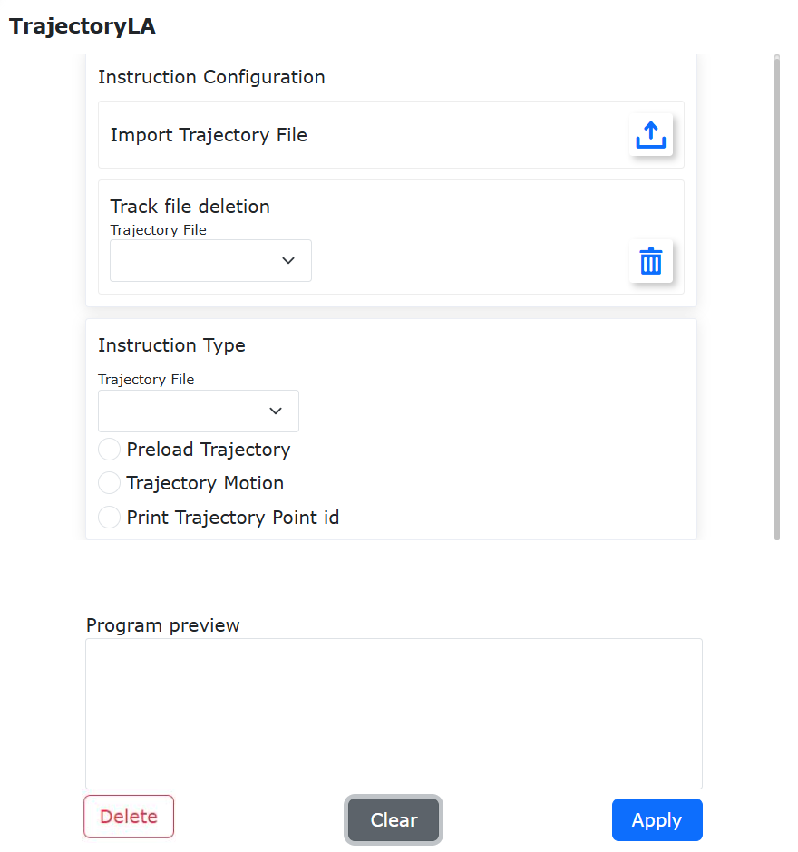

.. centered:: Figura 9.23-1 Importação e Exclusão de Arquivo de Trajetória

**Passo 3**: Selecione o arquivo de trajetória a ser executado. Adicione a instrução "Pré-carregar Trajetória": Primeiro, selecione o método de ajuste da curva para os pontos da trajetória em "Método de Ajuste da Curva", incluindo "Conexão Linear", "Ajuste Linear", "Curva B-Spline", "Método de Otimização Polinomial", etc. Ao selecionar "Ajuste Linear", é necessário definir adicionalmente um limite de erro. Outros métodos não requerem esta configuração. Em seguida, defina o método de suavização e a precisão da suavização. Finalmente, defina a velocidade máxima, aceleração máxima e jerk máximo durante a execução. A opção "Movimento Uniforme" pode ser usada para ativar ou não a antecipação com velocidade constante. Quando ativada, o robô realizará a antecipação com velocidade constante.

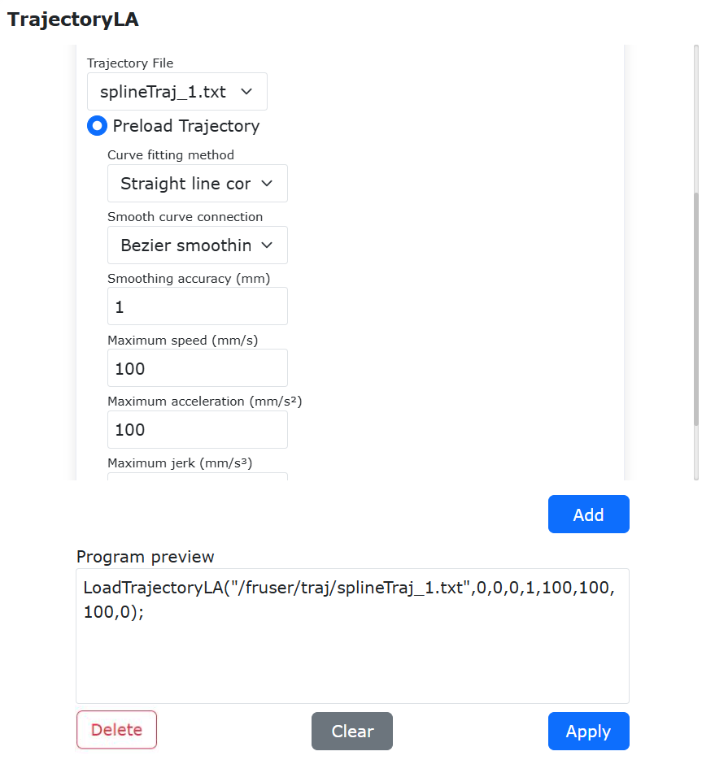

.. centered:: Figura 9.23-2 Configuração dos Parâmetros de Pré-carregamento da Trajetória com "Ajuste Linear"

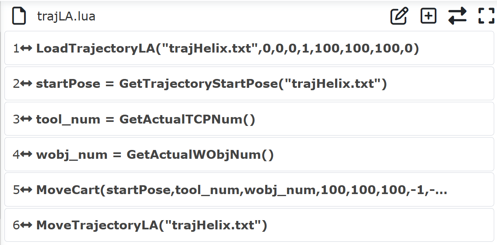

.. centered:: Figura 9.23-3 Configuração dos Parâmetros de Pré-carregamento da Trajetória

**Passo 4**: Adicione a instrução "Movimento de Trajetória" e gere o programa Lua. Execute o programa Lua para realizar o planejamento de trajetória com antecedência em tempo real no arquivo de trajetória importado. O programa típico para planejamento de trajetória com antecedência em tempo real é mostrado abaixo.

.. image:: coding/290.png
   :width: 5in
   :align: center

.. centered:: Figura 9.23-4 Programa Típico de Planejamento de Trajetória com Antecedência em Tempo Real (Curva B-Spline)

**Passo 5**: Para a linha de comando "LoadTrajectory" no programa Lua, clique no botão de edição para modificar os parâmetros de configuração, alcançando diferentes efeitos de planejamento de trajetória.

.. image:: coding/291.png
   :width: 6in
   :align: center

.. centered:: Figura 9.23-5 Modificação dos Parâmetros de Configuração

Função de Rastreamento de Arco com Transição Monótona de Amplitude de Oscilação
~~~~~~~~~~~~~~~~~~~~~~~~~~~~~~~~~~~~~~~~~~~~~~~~~~~~~~~~~~~~~~~~~~~~~~~~~~~~~~~~~~~~~~~~~~~~~~~~~~~

O movimento de oscilação pode alternar a amplitude de oscilação de duas maneiras: "Mudança Repentina" e "Transição Gradual".

O modo "Mudança Repentina" é a alternância direta dos parâmetros de oscilação de um segmento para outro. Pode ser alcançado definindo dois movimentos de oscilação adjacentes com parâmetros diferentes ou enviando um novo número de oscilação em tempo real durante a execução do movimento de oscilação (consulte a seção correspondente do manual da função para detalhes, não repetido aqui).

O modo "Transição Gradual" significa que, no movimento de oscilação do segmento atual, a amplitude de oscilação definida no início muda gradualmente para a amplitude definida no final.

A alternância gradual dos parâmetros de oscilação só é suportada durante o movimento de oscilação linear.

Introdução
+++++++++++++

A trajetória do movimento de oscilação com transição gradual monótona de amplitude é mostrada na figura abaixo.

.. image:: coding/293.png
   :width: 4in
   :align: center

Onde, a linha azul é a direção do movimento de oscilação, 'a' é a amplitude de oscilação no ponto inicial, 'b' é a amplitude de oscilação no ponto final. A amplitude de oscilação muda gradualmente durante o movimento.

.. note:: Observe que atualmente apenas transições graduais onde o ponto inicial e o ponto final são do mesmo tipo, com amplitudes diferentes (mudando de a para b) e todos os outros parâmetros idênticos, são suportadas. É recomendado verificar os parâmetros de oscilação antes de executar.

O fluxo de operação para configurar um movimento de oscilação com transição gradual de amplitude é o seguinte:

**Passo 1**: Clique em "Programa de Ensino", "Programação de Programa", selecione e clique no botão "Oscilação" sob "Instruções de Movimento" para entrar na página de configuração da instrução de oscilação.

.. image:: coding/294.png
   :width: 3in
   :align: center

.. centered:: Figura 9.24-1 Clicar no Botão da Função de Oscilação

**Passo 2**: Na edição da instrução, selecione o número do parâmetro de oscilação para o início da oscilação, clique em "Iniciar Oscilação" e depois em "Adicionar".
   
.. image:: coding/295.png
   :width: 6in
   :align: center

.. centered:: Figura 9.24-2 Adicionar Parâmetros de Oscilação Inicial

**Passo 3**: Selecione o número alvo para a transição gradual da oscilação, marque "Iniciar Transição Gradual de Oscilação" e clique em "Adicionar".
   
.. image:: coding/296.png
   :width: 6in
   :align: center

.. centered:: Figura 9.24-3 Adicionar Parâmetros de Oscilação com Transição Gradual

**Passo 4**: Após adicionar o movimento linear correspondente, marque "Terminar Transição Gradual de Oscilação" e clique em "Adicionar". Em seguida, marque "Parar Oscilação" e clique em "Adicionar" para concluir a configuração de um movimento de oscilação com transição gradual de amplitude. Clique em "Aplicar" para adicionar ao programa LUA.
   
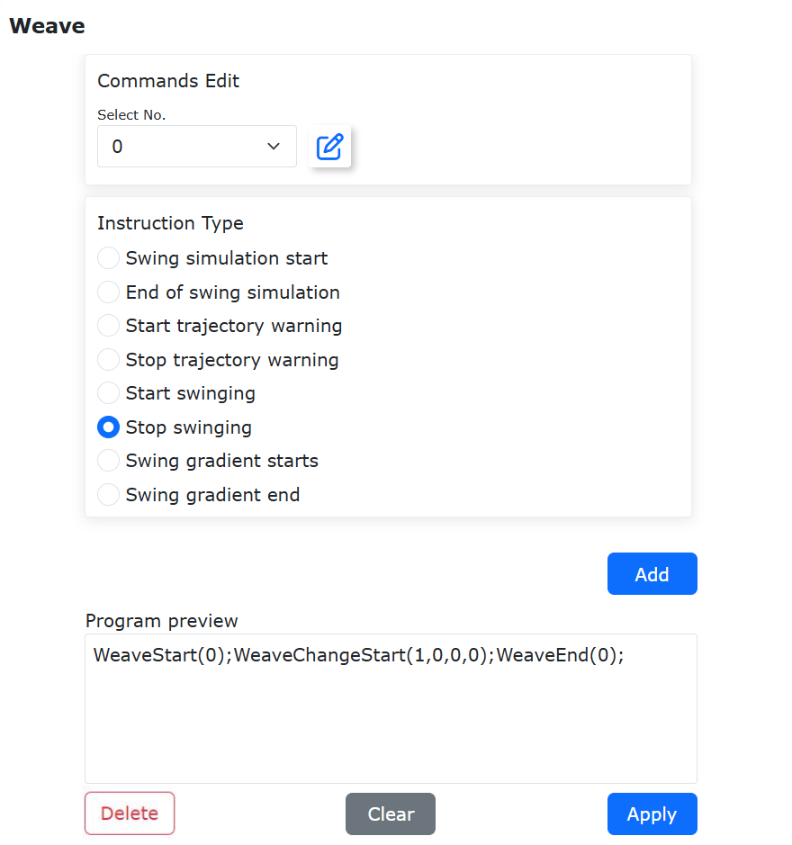

.. centered:: Figura 9.24-4 Instrução LUA para um Movimento Completo de Oscilação com Transição Gradual de Amplitude

Função de Rastreamento de Arco com Deslocamento
~~~~~~~~~~~~~~~~~~~~~~~~~~~~~~~~~~~~~~~~~~~~~~~~~~~~~~~~~~~~~~~~~~~~

No processo de soldagem com rastreamento de arco, o robô ajusta o centro de oscilação da tocha de solda com base na informação da corrente para manter a consistência com a linha central do chanfro da peça de trabalho. No entanto, alguns processos exigem que o centro de oscilação da tocha tenha um certo deslocamento em relação à linha central do chanfro.
   
.. image:: coding/298.png
   :width: 3in
   :align: center

.. centered:: Figura 9.25-1 Cenário Típico de Rastreamento de Arco com Deslocamento

Um cenário típico da função de rastreamento de arco com deslocamento inclui: a. Peça de trabalho a ser soldada (chanfro em ângulo reto ou agudo), b. Tocha de solda, e. Linha central do chanfro. A função de rastreamento de arco realiza o rastreamento do chanfro de solda nas direções: c. Vertical (profundidade) e d. Horizontal (centro), f. Distância de deslocamento na direção horizontal.

Para implementar o rastreamento de arco com deslocamento, existem duas maneiras de definir a quantidade de deslocamento horizontal: métodos de "Amostragem" e "Porcentagem".

Rastreamento de Arco com Deslocamento por Amostragem
+++++++++++++++++++++++++++++++++++++++++++++++++++++++++++++++++

O método de amostragem consiste em, após o início do arco na soldagem com oscilação, coletar os valores de corrente esquerda e direita durante um período de oscilação como referência. Nos processos de soldagem subsequentes, a corrente amostrada é comparada com a corrente de referência para determinar a direção do rastreamento.

O método de amostragem requer que a posição inicial de ensino da oscilação seja ajustada para a quantidade de deslocamento desejada. O deslocamento não pode exceder a amplitude da oscilação. A solda precisa cobrir o chanfro de sobreposição.

O fluxo de configuração da instrução de deslocamento por amostragem é o seguinte:
   
.. image:: coding/299.png
   :width: 3in
   :align: center

.. centered:: Figura 9.25-2 Clicar no Botão da Instrução de Rastreamento de Arco

**Passo 1**: Clique em "Programa de Ensino", "Programação de Programa", selecione e clique no botão "Rastreamento de Arco" sob "Instruções de Soldagem" para entrar na página de configuração da instrução de rastreamento de arco.
   
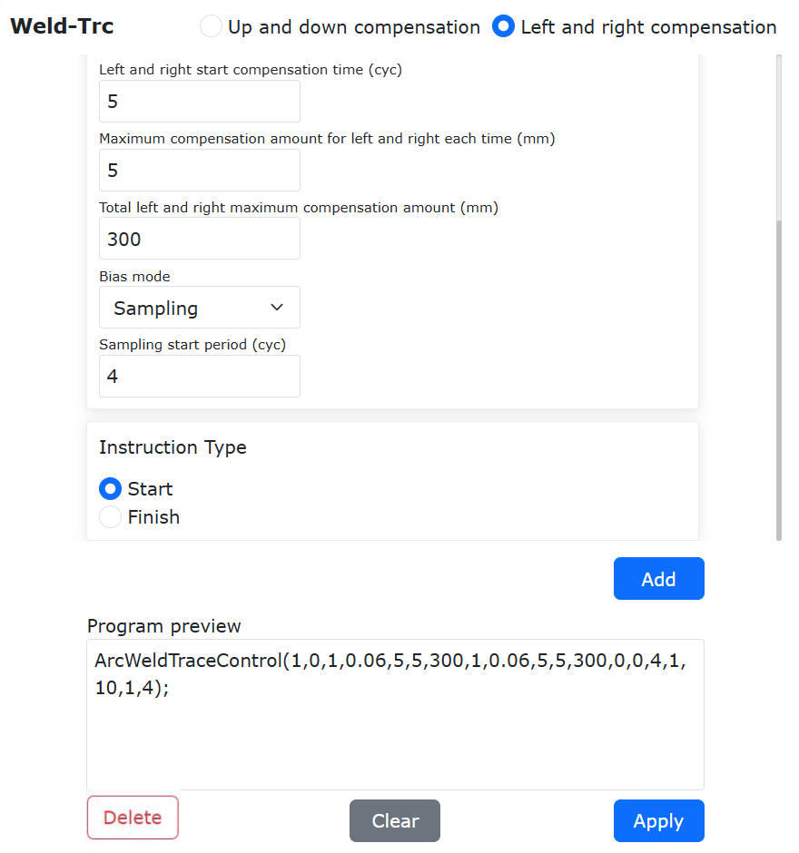

.. centered:: Figura 9.25-3 Página de Configuração do Rastreamento de Arco com Deslocamento por Amostragem

**Passo 2**: O rastreamento de arco com deslocamento atua na compensação horizontal. Clique na subpágina "Compensação Horizontal". Selecione "Amostragem" no método de deslocamento. Defina o ciclo de início da amostragem (o ciclo de início da amostragem deve ser menor que o tempo de início da compensação horizontal). Selecione "Iniciar" como o tipo de instrução. Clique no botão "Adicionar" para gerar a instrução LUA.
   
.. image:: coding/301.png
   :width: 6in
   :align: center

.. centered:: Figura 9.25-4 Adicionar Instrução de Término do Rastreamento de Arco com Deslocamento por Amostragem

**Passo 3**: Após adicionar a instrução de movimento de oscilação, clique em "Término" no tipo de instrução de rastreamento de arco e clique em "Adicionar" para gerar a instrução LUA correspondente.

Rastreamento de Arco com Deslocamento por Porcentagem
+++++++++++++++++++++++++++++++++++++++++++++++++++++++++++

O deslocamento por porcentagem aplica um ganho percentual à corrente amostrada durante o processo de rastreamento de arco, criando um desvio na corrente dos ciclos de oscilação esquerda e direita. O robô compensa automaticamente o sinal desviado.

.. note:: Observe que quanto menor a amplitude da oscilação e maior o ângulo do chanfro, menor o desvio da corrente esquerda-direita e menor a porcentagem de ajuste. Recomenda-se depurar com um intervalo de ajuste de 1% por vez.

O fluxo de configuração da instrução de deslocamento por porcentagem é o seguinte:
   
.. image:: coding/299.png
   :width: 3in
   :align: center

.. centered:: Figura 9.25-5 Clicar no Botão da Instrução de Rastreamento de Arco

**Passo 1**: Clique em "Programa de Ensino", "Programação de Programa", selecione e clique no botão "Rastreamento de Arco" sob "Instruções de Soldagem" para entrar na página de configuração da instrução de rastreamento de arco.
   
.. image:: coding/302.png
   :width: 6in
   :align: center

.. centered:: Figura 9.25-6 Página de Configuração do Rastreamento de Arco com Deslocamento por Amostragem

**Passo 2**: O rastreamento de arco com deslocamento atua na compensação horizontal. Clique na subpágina "Compensação Horizontal". Selecione "Porcentagem" no método de deslocamento. Defina o valor percentual (um valor positivo ganha corrente no primeiro meio ciclo, compensando na direção do último meio ciclo; um valor negativo faz o oposto). Selecione "Iniciar" como o tipo de instrução. Clique no botão "Adicionar" para gerar a instrução LUA.
   
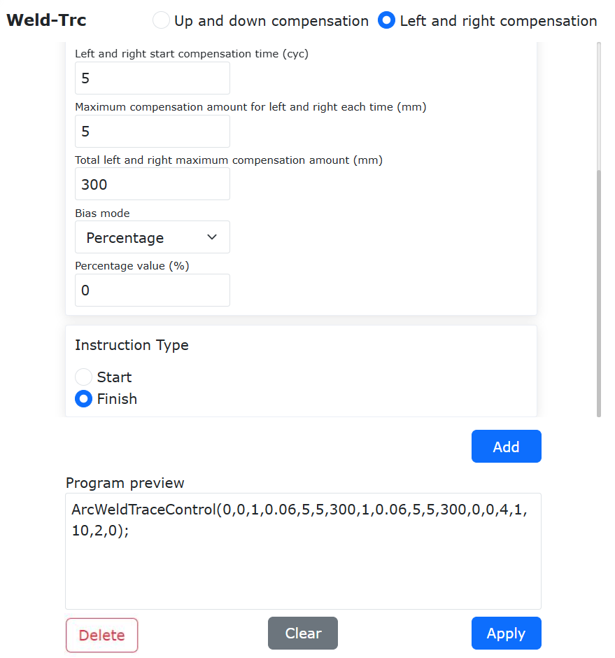

.. centered:: Figura 9.25-7 Adicionar Instrução de Término do Rastreamento de Arco com Deslocamento por Porcentagem

**Passo 3**: Após adicionar a instrução de movimento de oscilação, clique em "Término" no tipo de instrução de rastreamento de arco e clique em "Adicionar" para gerar a instrução LUA correspondente.

A estrutura de um programa LUA típico para um segmento de rastreamento com deslocamento é mostrada abaixo:
   
.. image:: coding/304.png
   :width: 6in
   :align: center

.. centered:: Figura 9.25-8 Programa LUA Típico para Rastreamento de Arco com Deslocamento

Função de Limite de Detecção de Colisão Personalizado
~~~~~~~~~~~~~~~~~~~~~~~~~~~~~~~~~~~~~~~~~~~~~~~~~~~~~~~~~~~~~~~~~~~

Visão Geral
+++++++++++++++++

A função de limite de detecção de colisão personalizado é um aprimoramento da função atual de definição manual do nível de colisão. Se a configuração atual do nível de colisão não atender ao cenário de uso, o usuário pode definir limites de detecção de colisão personalizados de acordo com a situação real. Os limites de detecção de colisão são divididos em limites de detecção de junta e limites de detecção TCP.

Instruções de Configuração da Função
++++++++++++++++++++++++++++++++++++++++++++++

**Passo 1**: Clique em "Programa de Ensino", selecione "Programação de Programa" e abra a interface correspondente.

**Passo 2**: Clique no botão "Novo" na parte superior, insira "example", selecione "empty.lua" para criar um novo script Lua, conforme mostrado.
   
.. image:: coding/305.png
   :width: 3in
   :align: center

.. centered:: Figura 9.26-1 Criar um Novo Script Lua

Instruções de Configuração da Função de Limite de Detecção de Junta
*****************************************************************************************

Explicação da Configuração de Parâmetros
""""""""""""""""""""""""""""""""""""""""""""""

**Passo 1**: Na interface de instruções de controle, selecione a função "Detecção de Colisão", conforme mostrado na Figura 2. Clique em "Ativar Detecção de Colisão". Na seção de status de detecção, selecione "Apenas Juntas". Modifique os valores de entrada para J1-J6 conforme necessário. A faixa de valores é em NM. Neste modo, as alterações nos limites TCP nas direções X-RZ não têm efeito. Selecione "Não Bloquear" ou "Bloquear" para "Bloquear" conforme necessário. Clique no botão "Adicionar" para concluir a adição da instrução de ativação.

**Passo 2**: Clique em "Desativar Detecção de Colisão" e, em seguida, no botão "Adicionar" para concluir a adição da instrução de desativação. A interface de pré-visualização do programa é mostrada na Figura 3. Clique no botão "Aplicar" para concluir a adição da função.

.. note:: A função de limite de detecção de colisão personalizado é um conjunto de instruções. Após ativar, é necessário desativar prontamente.

**Passo 3**: Dentro da função de detecção de colisão, adicione as instruções de movimento correspondentes, conforme mostrado na Figura 4.
   
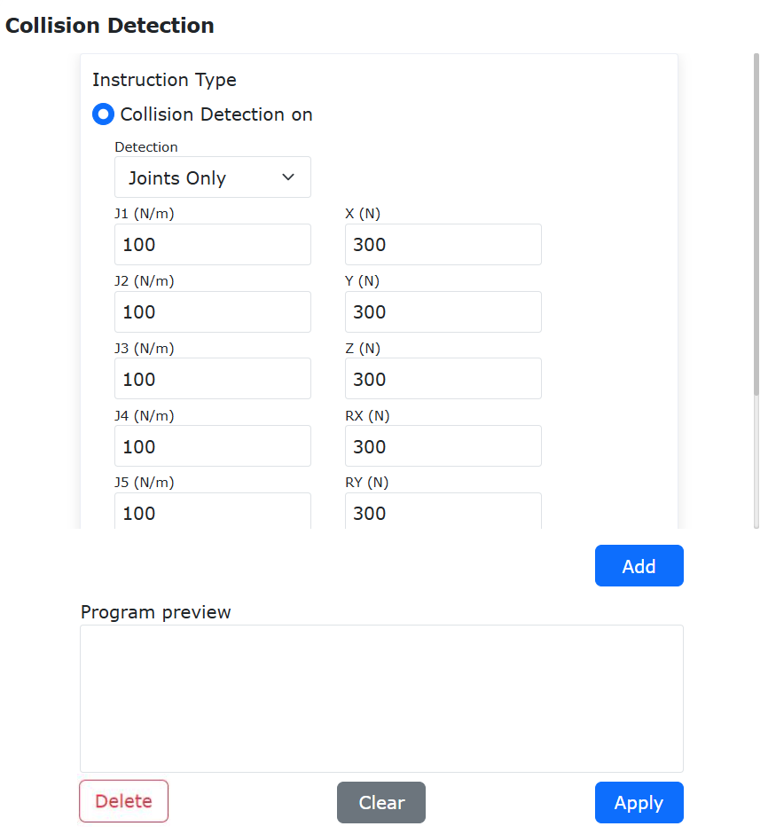

.. centered:: Figura 9.26-2 Interface de Configuração do Limite de Detecção de Junta
   
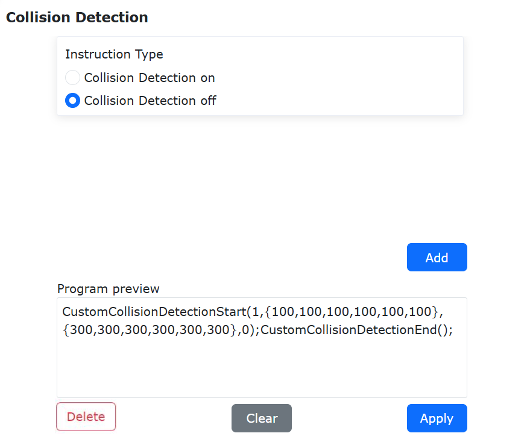

.. centered:: Figura 9.26-3 Interface de Pré-visualização do Programa
   
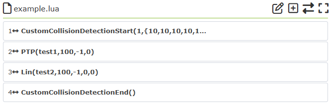

.. centered:: Figura 9.26-4 Exemplo de Interface do Programa Script Lua

Instruções de Configuração da Função de Limite de Detecção TCP
********************************************************************

Explicação da Configuração de Parâmetros
"""""""""""""""""""""""""""""""""""""""""""""""""""""

**Passo 1**: Na interface de instruções de controle, selecione a função "Detecção de Colisão", conforme mostrado na Figura 5. Clique em "Ativar Detecção de Colisão". Na seção de status de detecção, selecione "Apenas TCP". Modifique os valores de entrada para as direções X-RZ conforme necessário. A faixa de valores é em N. Neste modo, as alterações nos limites das juntas J1-J6 não têm efeito. Selecione "Não Bloquear" ou "Bloquear" para "Bloquear" conforme necessário. Clique no botão "Adicionar" para concluir a adição da instrução de ativação.

**Passo 2**: Clique em "Desativar Detecção de Colisão" e, em seguida, no botão "Adicionar" para concluir a adição da instrução de desativação. A interface de pré-visualização do programa é mostrada na Figura 6. Clique no botão "Aplicar" para concluir a adição da função.

.. note:: A função de limite de detecção de colisão personalizado é um conjunto de instruções. Após ativar, é necessário desativar prontamente.
   
.. image:: coding/309.png
   :width: 6in
   :align: center

.. centered:: Figura 9.26-5 Interface de Configuração do Limite de Detecção TCP
   
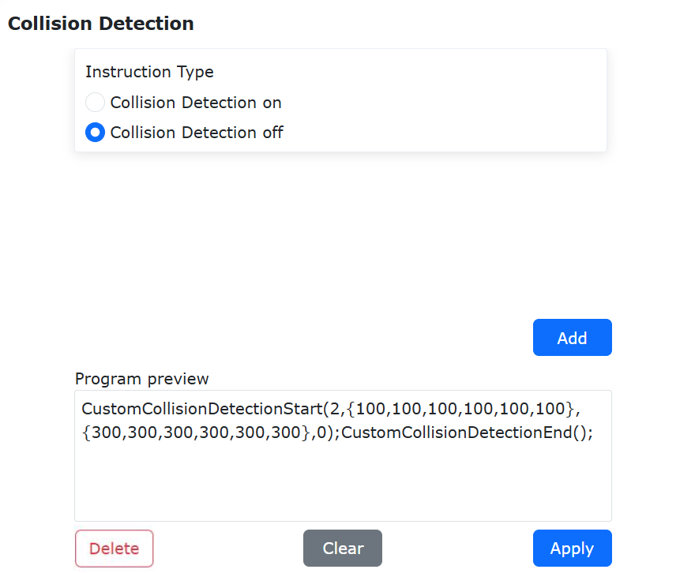

.. centered:: Figura 9.26-6 Interface de Pré-visualização do Programa

**Passo 3**: Dentro da função de detecção de colisão, adicione as instruções de movimento correspondentes, conforme mostrado na Figura 7.
   
.. image:: coding/311.png
   :width: 6in
   :align: center

.. centered:: Figura 9.26-7 Exemplo de Interface do Programa Script Lua

Instruções de Configuração da Função de Limite de Detecção de Junta e TCP
***************************************************************************************

Explicação da Configuração de Parâmetros
""""""""""""""""""""""""""""""""""""""""""""""""""""""""

**Passo 1**: Na interface de instruções de controle, selecione a função "Detecção de Colisão", conforme mostrado na Figura 8. Clique em "Ativar Detecção de Colisão". Na seção de status de detecção, selecione "Junta e TCP". Modifique os valores de entrada para J1-J6 e para as direções X-RZ conforme necessário. A faixa de valores para J1-J6 é em NM; o valor de entrada para as direções X-RZ é em N. Selecione "Não Bloquear" ou "Bloquear" para "Bloquear" conforme necessário. Clique no botão "Adicionar" para concluir a adição da instrução de ativação.
   
.. image:: coding/312.png
   :width: 6in
   :align: center

.. centered:: Figura 9.26-8 Interface de Configuração do Limite de Detecção de Junta e TCP
 
**Passo 2**: Clique em "Desativar Detecção de Colisão" e, em seguida, no botão "Adicionar" para concluir a adição da instrução de desativação. A interface de pré-visualização do programa é mostrada na Figura 9. Clique no botão "Aplicar" para concluir a adição da função.

.. note:: A função de limite de detecção de colisão personalizado é um conjunto de instruções. Após ativar, é necessário desativar prontamente.
   

.. centered:: Figura 9.26-9 Interface de Pré-visualização do Programa

**Passo 3**: Dentro da função de detecção de colisão, adicione as instruções de movimento correspondentes, conforme mostrado na Figura 10.
   
.. image:: coding/314.png
   :width: 4in
   :align: center

.. centered:: Figura 9.26-10 Exemplo de Interface do Programa Script Lua

Configuração Recomendada dos Limites de Detecção
*****************************************************

Limites de Detecção de Junta
""""""""""""""""""""""""""""""""

Os limites de detecção de junta recomendados são equivalentes a definir o nível de colisão como 10. Quanto maior o valor, menos sensível é a detecção de colisão. A faixa de valores é em NM. Os dados na tabela são apenas para referência. Os valores reais precisam ser ajustados de acordo com a velocidade de operação do robô e a carga.

.. centered:: Tabela 9.26-1 Limites Recomendados para Juntas

.. list-table::
   :widths: 30 20 20 20 20 20 20
   :header-rows: 0
   :class: sheet-center
   :align: center

   * - **Tipo de Robô**
     - **J1**
     - **J2**
     - **J3**
     - **J4**
     - **J5**
     - **J6**

   * - **FR3**
     - 0.4					
     - 0.7
     - 0.6 
     - 0.3 
     - 0.3 
     - 0.3 

   * - **FR3-WMS**
     - 0.4					
     - 0.7
     - 0.6 
     - 0.3 
     - 0.3 
     - 0.3 

   * - **FR3-WML**
     - 0.4					
     - 0.7
     - 0.6 
     - 0.3 
     - 0.3 
     - 0.3 

   * - **FR3-C**
     - 0.4					
     - 0.7
     - 0.6 
     - 0.3 
     - 0.3 
     - 0.3 

   * - **FR5**
     - 0.6					
     - 1
     - 0.8 
     - 0.3 
     - 0.3 
     - 0.3 

   * - **FR10**
     - 2.5					
     - 3.6
     - 0.8 
     - 0.6 
     - 0.6 
     - 0.6  

   * - **FR16**
     - 2.5					
     - 3.6
     - 0.8 
     - 0.6 
     - 0.6 
     - 0.6 

   * - **FR20**
     - 5					
     - 8
     - 4.5
     - 0.9 
     - 0.9
     - 0.9 

   * - **FR30**
     - 5					
     - 8
     - 4.5
     - 0.9 
     - 0.9
     - 0.9 

Limites de Detecção TCP
""""""""""""""""""""""""""""""

Quanto maior o valor do limite de detecção TCP, menos sensível é a detecção de colisão. A faixa de valores é em N. Os dados na tabela são apenas para referência. Os valores reais precisam ser ajustados de acordo com a velocidade de operação do robô e a carga.

.. centered:: Tabela 9.26-2 Limites de Detecção TCP

.. list-table::
   :widths: 30 20 20 20 20 20 20
   :header-rows: 0
   :class: sheet-center
   :align: center

   * - **Tipo de Robô**
     - **X**
     - **Y**
     - **Z**
     - **RX**
     - **RY**
     - **RZ**

   * - **FR3**
     - 300					
     - 300
     - 300
     - 20 
     - 20
     - 20

   * - **FR3-WMS**
     - 300					
     - 300
     - 300
     - 20 
     - 20
     - 20

   * - **FR3-WML**
     - 300					
     - 300
     - 300
     - 20 
     - 20
     - 20

   * - **FR3-C**
     - 300					
     - 300
     - 300
     - 20 
     - 20
     - 20

   * - **FR5**
     - 300					
     - 300
     - 300
     - 20 
     - 20
     - 20

   * - **FR10**
     - 500					
     - 500
     - 500
     - 35 
     - 35
     - 35 

   * - **FR16**
     - 500					
     - 500
     - 500
     - 35 
     - 35
     - 35 

   * - **FR20**
     - 800					
     - 800
     - 800
     - 60 
     - 60
     - 60 

   * - **FR30**
     - 800					
     - 800
     - 800
     - 60 
     - 60
     - 60 

Otimização da Característica de Velocidade em T + Função de Suavização Blending
~~~~~~~~~~~~~~~~~~~~~~~~~~~~~~~~~~~~~~~~~~~~~~~~~~~~~~~~~~~~~~~~~~~~~~~~~~~~~~~~~~~~~~~~~~~~~

Visão Geral
++++++++++++++

Realizar blending entre duas trajetórias evita o problema de partidas e paradas frequentes causadas por paradas completas, melhorando assim a eficiência do movimento do robô. Esta função suporta principalmente blending entre instruções PTP, LIN, ARC e CIRCLE. Pode ser alcançada de duas maneiras: usando instruções Lua ou usando o interruptor de configuração de movimento.

Fluxo de Operação
++++++++++++++++++++++++++++

Blending PTP-PTP
***************************************

Usando Instruções Lua
""""""""""""""""""""""""""""""""""""""""""

**Passo 1**: Selecione os pontos de ensino para executar a função PTP-PTP. Neste manual, usamos "A0" a "A5" como nomes dos pontos de ensino.

**Passo 2**: Clique em "Programa de Ensino" —> "Programação de Programa", selecione a instrução "Ponto a Ponto" em "Instruções de Movimento". Na "Edição da Instrução", selecione o ponto de ensino e defina a velocidade de teste. Selecione "Modo de Suavização de Aceleração" para a proteção de movimento. Defina o parâmetro "Transição Suave" no ponto onde a suavização é necessária.
   
.. image:: coding/315.png
   :width: 6in
   :align: center

.. centered:: Figura 9.27-1 Configuração da Instrução Blending PTP com Suavização de Aceleração

**Passo 3**: Adicione várias instruções PTP, gere o programa Lua e execute-o para realizar a função de blending PTP-PTP. Este método usa o movimento de velocidade em T otimizado apenas para as instruções entre AccSmoothStart() e AccSmoothEnd(). Para as outras instruções, usa o movimento de velocidade em T original.
   
.. image:: coding/316.png
   :width: 4in
   :align: center

.. centered:: Figura 9.27-2 Programa Típico para Blending PTP-PTP Usando Instruções Lua

Usando o Interruptor de Configuração de Movimento
"""""""""""""""""""""""""""""""""""""""""""""""""""""""

**Passo 1**: Clique em "Configurações Iniciais" —> "Segurança" —> "Configuração de Movimento" e ative o interruptor "Modo de Suavização de Aceleração".
   
.. image:: coding/317.png
   :width: 6in
   :align: center

.. centered:: Figura 9.27-3 Configuração do Interruptor do Modo de Suavização de Aceleração

**Passo 2**: Selecione os pontos de ensino para executar a função PTP-PTP. Neste manual, usamos "A0" a "A5" como nomes dos pontos de ensino.

**Passo 3**: Clique em "Programa de Ensino" —> "Programação de Programa", selecione a instrução "Ponto a Ponto" em "Instruções de Movimento". Na "Edição da Instrução", selecione o ponto de ensino e defina a velocidade de teste. Selecione "Nenhum" para a proteção de movimento. Defina o parâmetro "Transição Suave" no ponto onde a suavização é necessária.
   
.. image:: coding/318.png
   :width: 6in
   :align: center

.. centered:: Figura 9.27-4 Configuração da Instrução Blending PTP Convencional

**Passo 4**: Adicione várias instruções PTP, gere o programa Lua e execute-o para realizar a função de blending PTP-PTP. O programa típico é o mesmo do programa PTP-PTP convencional. Este método usa o movimento de velocidade em T otimizado para todas as instruções.
   
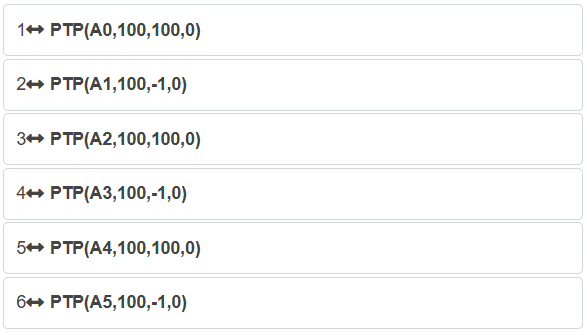

.. centered:: Figura 9.27-5 Programa Típico para Blending PTP-PTP Usando o Interruptor de Configuração

Blending PTP-LIN
***************************************

Usando Instruções Lua
""""""""""""""""""""""""""""""""""""""""""

**Passo 1**: Selecione os pontos de ensino para executar a função PTP-LIN. Neste manual, usamos "A0" a "A5" como nomes dos pontos de ensino.

**Passo 2**: Clique em "Programa de Ensino" —> "Programação de Programa", selecione a instrução "Ponto a Ponto" em "Instruções de Movimento". Na "Edição da Instrução", selecione o ponto de ensino e defina a velocidade de teste. Selecione "Modo de Suavização de Aceleração" para a proteção de movimento. Defina o parâmetro "Transição Suave" no ponto onde a suavização é necessária.
   
.. image:: coding/315.png
   :width: 6in
   :align: center

.. centered:: Figura 9.27-6 Configuração da Instrução Blending PTP com Suavização de Aceleração

**Passo 3**: Adicione várias instruções PTP e LIN, gere o programa Lua e execute-o para realizar a função de blending PTP-LIN. Este método usa o movimento de velocidade em T otimizado apenas para as instruções entre AccSmoothStart() e AccSmoothEnd(). Para as outras instruções, usa o movimento de velocidade em T original.
   
.. image:: coding/415.png
   :width: 4in
   :align: center

.. centered:: Figura 9.27-7 Programa Típico para Blending PTP-LIN Usando Instruções Lua

Usando o Interruptor de Configuração de Movimento
"""""""""""""""""""""""""""""""""""""""""""""""""""""""

**Passo 1**: Clique em "Configurações Iniciais" —> "Segurança" —> "Configuração de Movimento" e ative o interruptor "Modo de Suavização de Aceleração".
   
.. image:: coding/317.png
   :width: 6in
   :align: center

.. centered:: Figura 9.27-8 Configuração do Interruptor do Modo de Suavização de Aceleração

**Passo 2**: Selecione os pontos de ensino para executar a função PTP-LIN. Neste manual, usamos "A0" a "A5" como nomes dos pontos de ensino.

**Passo 3**: Clique em "Programa de Ensino" —> "Programação de Programa", selecione a instrução "Ponto a Ponto" em "Instruções de Movimento". Na "Edição da Instrução", selecione o ponto de ensino e defina a velocidade de teste. Selecione "Nenhum" para a proteção de movimento. Defina o parâmetro "Transição Suave" no ponto onde a suavização é necessária.
   
.. image:: coding/318.png
   :width: 6in
   :align: center

.. centered:: Figura 9.27-9 Configuração da Instrução Blending PTP Convencional

**Passo 4**: Adicione várias instruções PTP e LIN, gere o programa Lua e execute-o para realizar a função de blending PTP-LIN. O programa típico é o mesmo do programa PTP-LIN convencional. Este método usa o movimento de velocidade em T otimizado para todas as instruções.
   
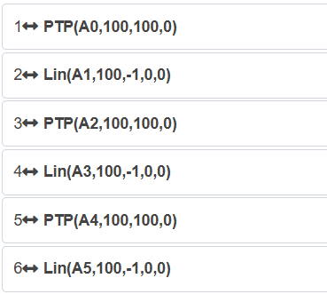

.. centered:: Figura 9.27-10 Programa Típico para Blending PTP-LIN Usando o Interruptor de Configuração

Blending PTP-ARC
***************************************

Usando Instruções Lua
""""""""""""""""""""""""""""""""""""""""""

**Passo 1**: Selecione os pontos de ensino para executar a função PTP-ARC. Neste manual, usamos "A0" a "A8" como nomes dos pontos de ensino.

**Passo 2**: Clique em "Programa de Ensino" —> "Programação de Programa", selecione a instrução "Ponto a Ponto" em "Instruções de Movimento". Na "Edição da Instrução", selecione o ponto de ensino e defina a velocidade de teste. Selecione "Modo de Suavização de Aceleração" para a proteção de movimento. Defina o parâmetro "Transição Suave" no ponto onde a suavização é necessária.
   
.. image:: coding/315.png
   :width: 6in
   :align: center

.. centered:: Figura 9.27-11 Configuração da Instrução Blending PTP com Suavização de Aceleração

**Passo 3**: Adicione várias instruções PTP e ARC, gere o programa Lua e execute-o para realizar a função de blending PTP-ARC. Este método usa o movimento de velocidade em T otimizado apenas para as instruções entre AccSmoothStart() e AccSmoothEnd(). Para as outras instruções, usa o movimento de velocidade em T original.
   
.. image:: coding/398.png
   :width: 4in
   :align: center

.. centered:: Figura 9.27-12 Programa Típico para Blending PTP-ARC Usando Instruções Lua

Usando o Interruptor de Configuração de Movimento
"""""""""""""""""""""""""""""""""""""""""""""""""""""""

**Passo 1**: Clique em "Configurações Iniciais" —> "Segurança" —> "Configuração de Movimento" e ative o interruptor "Modo de Suavização de Aceleração".
   
.. image:: coding/317.png
   :width: 6in
   :align: center

.. centered:: Figura 9.27-13 Configuração do Interruptor do Modo de Suavização de Aceleração

**Passo 2**: Selecione os pontos de ensino para executar a função PTP-ARC. Neste manual, usamos "A0" a "A8" como nomes dos pontos de ensino.

**Passo 3**: Clique em "Programa de Ensino" —> "Programação de Programa", selecione a instrução "Ponto a Ponto" em "Instruções de Movimento". Na "Edição da Instrução", selecione o ponto de ensino e defina a velocidade de teste. Selecione "Nenhum" para a proteção de movimento. Defina o parâmetro "Transição Suave" no ponto onde a suavização é necessária.
   
.. image:: coding/318.png
   :width: 6in
   :align: center

.. centered:: Figura 9.27-14 Configuração da Instrução Blending PTP Convencional

**Passo 4**: Adicione várias instruções PTP e ARC, gere o programa Lua e execute-o para realizar a função de blending PTP-ARC. O programa típico é o mesmo do programa PTP-ARC convencional. Este método usa o movimento de velocidade em T otimizado para todas as instruções.
   
.. image:: coding/399.png
   :width: 4in
   :align: center

.. centered:: Figura 9.27-15 Programa Típico para Blending PTP-ARC Usando o Interruptor de Configuração
   
Blending PTP-CIRCLE
***************************************

Usando Instruções Lua
""""""""""""""""""""""""""""""""""""""""""

**Passo 1**: Selecione os pontos de ensino para executar a função PTP-CIRCLE. Neste manual, usamos "A0" a "A8" como nomes dos pontos de ensino.

**Passo 2**: Clique em "Programa de Ensino" —> "Programação de Programa", selecione a instrução "Ponto a Ponto" em "Instruções de Movimento". Na "Edição da Instrução", selecione o ponto de ensino e defina a velocidade de teste. Selecione "Modo de Suavização de Aceleração" para a proteção de movimento. Defina o parâmetro "Transição Suave" no ponto onde a suavização é necessária.
   
.. image:: coding/315.png
   :width: 6in
   :align: center

.. centered:: Figura 9.27-16 Configuração da Instrução Blending PTP com Suavização de Aceleração

**Passo 3**: Adicione várias instruções PTP e CIRCLE, gere o programa Lua e execute-o para realizar a função de blending PTP-CIRCLE. Este método usa o movimento de velocidade em T otimizado apenas para as instruções entre AccSmoothStart() e AccSmoothEnd(). Para as outras instruções, usa o movimento de velocidade em T original.
   
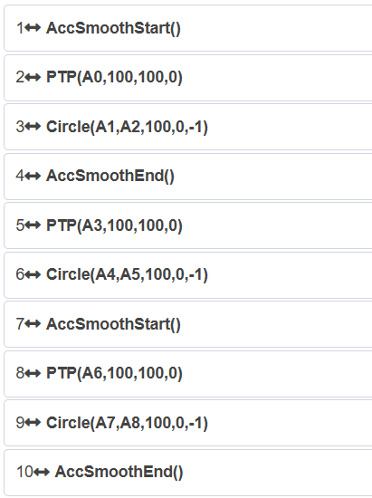

.. centered:: Figura 9.27-17 Programa Típico para Blending PTP-CIRCLE Usando Instruções Lua

Usando o Interruptor de Configuração de Movimento
"""""""""""""""""""""""""""""""""""""""""""""""""""""""

**Passo 1**: Clique em "Configurações Iniciais" —> "Segurança" —> "Configuração de Movimento" e ative o interruptor "Modo de Suavização de Aceleração".
   
.. image:: coding/317.png
   :width: 6in
   :align: center

.. centered:: Figura 9.27-18 Configuração do Interruptor do Modo de Suavização de Aceleração

**Passo 2**: Selecione os pontos de ensino para executar a função PTP-CIRCLE. Neste manual, usamos "A0" a "A8" como nomes dos pontos de ensino.

**Passo 3**: Clique em "Programa de Ensino" —> "Programação de Programa", selecione a instrução "Ponto a Ponto" em "Instruções de Movimento". Na "Edição da Instrução", selecione o ponto de ensino e defina a velocidade de teste. Selecione "Nenhum" para a proteção de movimento. Defina o parâmetro "Transição Suave" no ponto onde a suavização é necessária.
   
.. image:: coding/318.png
   :width: 6in
   :align: center

.. centered:: Figura 9.27-19 Configuração da Instrução Blending PTP Convencional

**Passo 4**: Adicione várias instruções PTP e CIRCLE, gere o programa Lua e execute-o para realizar a função de blending PTP-CIRCLE. O programa típico é o mesmo do programa PTP-CIRCLE convencional. Este método usa o movimento de velocidade em T otimizado para todas as instruções.
   
.. image:: coding/401.png
   :width: 4in
   :align: center

.. centered:: Figura 9.27-20 Programa Típico para Blending PTP-CIRCLE Usando o Interruptor de Configuração
   
Blending LIN-PTP
***************************************

Usando Instruções Lua
""""""""""""""""""""""""""""""""""""""""""

**Passo 1**: Selecione os pontos de ensino para executar a função LIN-PTP. Neste manual, usamos "A0" a "A5" como nomes dos pontos de ensino.

**Passo 2**: Clique em "Programa de Ensino" —> "Programação de Programa", selecione a instrução "Linear" em "Instruções de Movimento". Na "Edição da Instrução", selecione o ponto de ensino e defina a velocidade de teste. Selecione "Modo de Suavização de Aceleração" para a proteção de movimento. Defina os parâmetros "Raio de Transição" e "Método de Transição" no ponto onde a suavização é necessária. O método de transição pode ser "Transição de Canto" ou "Transição Tangente Interna".
   
.. image:: coding/402.png
   :width: 6in
   :align: center

.. centered:: Figura 9.27-21 Configuração da Instrução Blending PTP com Suavização de Aceleração

**Passo 3**: Adicione várias instruções LIN e PTP, gere o programa Lua e execute-o para realizar a função de blending LIN-PTP. Este método usa o movimento de velocidade em T otimizado apenas para as instruções entre AccSmoothStart() e AccSmoothEnd(). Para as outras instruções, usa o movimento de velocidade em T original.
   
.. image:: coding/403.png
   :width: 4in
   :align: center

.. centered:: Figura 9.27-22 Programa Típico para Blending LIN-PTP Usando Instruções Lua

Usando o Interruptor de Configuração de Movimento
"""""""""""""""""""""""""""""""""""""""""""""""""""""""

**Passo 1**: Clique em "Configurações Iniciais" —> "Segurança" —> "Configuração de Movimento" e ative o interruptor "Modo de Suavização de Aceleração".
   
.. image:: coding/317.png
   :width: 6in
   :align: center

.. centered:: Figura 9.27-23 Configuração do Interruptor do Modo de Suavização de Aceleração

**Passo 2**: Selecione os pontos de ensino para executar a função LIN-PTP. Neste manual, usamos "A0" a "A5" como nomes dos pontos de ensino.

**Passo 3**: Clique em "Programa de Ensino" —> "Programação de Programa", selecione a instrução "Linear" em "Instruções de Movimento". Na "Edição da Instrução", selecione o ponto de ensino e defina a velocidade de teste. Selecione "Nenhum" para a proteção de movimento. Defina os parâmetros "Raio de Transição" e "Método de Transição" no ponto onde a suavização é necessária. O método de transição pode ser "Transição de Canto" ou "Transição Tangente Interna".
   
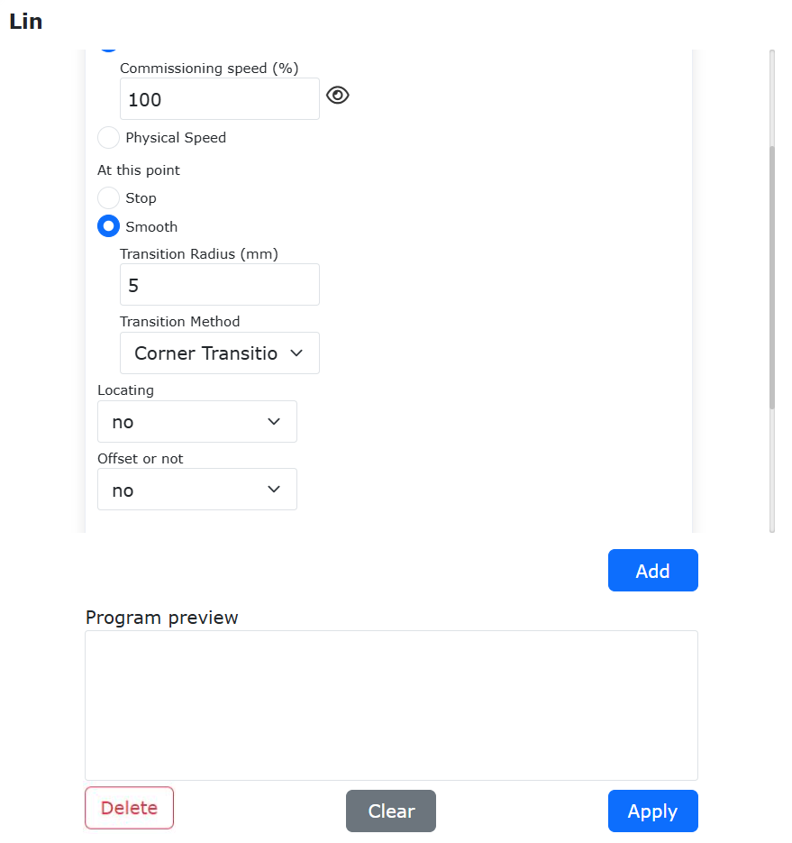

.. centered:: Figura 9.27-24 Configuração da Instrução Blending LIN Convencional

**Passo 4**: Gere o programa Lua e execute-o para realizar a função de blending LIN-PTP. O programa típico é o mesmo do programa LIN-PTP convencional. Este método usa o movimento de velocidade em T otimizado para todas as instruções.
   
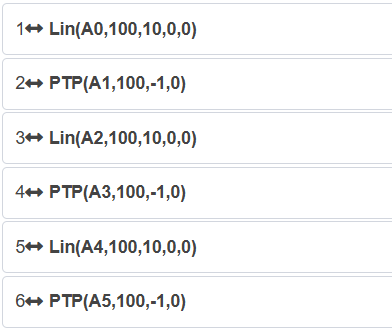

.. centered:: Figura 9.27-25 Programa Típico para Blending LIN-PTP Usando o Interruptor de Configuração
   
Blending LIN-LIN
***************************************

Usando Instruções Lua
""""""""""""""""""""""""""""""""""""""""""

**Passo 1**: Selecione os pontos de ensino para executar a função LIN-LIN. Neste manual, usamos "A0" a "A5" como nomes dos pontos de ensino.

**Passo 2**: Clique em "Programa de Ensino" —> "Programação de Programa", selecione a instrução "Linear" em "Instruções de Movimento". Na "Edição da Instrução", selecione o ponto de ensino e defina a velocidade de teste. Selecione "Modo de Suavização de Aceleração" para a proteção de movimento. Defina os parâmetros "Raio de Transição" e "Método de Transição" no ponto onde a suavização é necessária. O método de transição pode ser "Transição de Canto" ou "Transição Tangente Interna".
   
.. image:: coding/402.png
   :width: 6in
   :align: center

.. centered:: Figura 9.27-26 Configuração da Instrução Blending LIN com Suavização de Aceleração

**Passo 3**: Adicione várias instruções LIN, gere o programa Lua e execute-o para realizar a função de blending LIN-LIN. Este método usa o movimento de velocidade em T otimizado apenas para as instruções entre AccSmoothStart() e AccSmoothEnd(). Para as outras instruções, usa o movimento de velocidade em T original.
   
.. image:: coding/416.png
   :width: 4in
   :align: center

.. centered:: Figura 9.27-27 Programa Típico para Blending LIN-LIN Usando Instruções Lua

Usando o Interruptor de Configuração de Movimento
"""""""""""""""""""""""""""""""""""""""""""""""""""""""

**Passo 1**: Clique em "Configurações Iniciais" —> "Segurança" —> "Configuração de Movimento" e ative o interruptor "Modo de Suavização de Aceleração".
   
.. image:: coding/317.png
   :width: 6in
   :align: center

.. centered:: Figura 9.27-28 Configuração do Interruptor do Modo de Suavização de Aceleração

**Passo 2**: Selecione os pontos de ensino para executar a função LIN-LIN. Neste manual, usamos "A0" a "A5" como nomes dos pontos de ensino.

**Passo 3**: Clique em "Programa de Ensino" —> "Programação de Programa", selecione a instrução "Linear" em "Instruções de Movimento". Na "Edição da Instrução", selecione o ponto de ensino e defina a velocidade de teste. Selecione "Nenhum" para a proteção de movimento. Defina os parâmetros "Raio de Transição" e "Método de Transição" no ponto onde a suavização é necessária. O método de transição pode ser "Transição de Canto" ou "Transição Tangente Interna".
   

.. centered:: Figura 9.27-29 Configuração da Instrução Blending LIN Convencional

**Passo 4**: Gere o programa Lua e execute-o para realizar a função de blending LIN-LIN. O programa típico é o mesmo do programa LIN-LIN convencional. Este método usa o movimento de velocidade em T otimizado para todas as instruções.
   
.. image:: coding/417.png
   :width: 4in
   :align: center

.. centered:: Figura 9.27-30 Programa Típico para Blending LIN-LIN Usando o Interruptor de Configuração
   
Blending LIN-ARC
***************************************

Usando Instruções Lua
""""""""""""""""""""""""""""""""""""""""""

**Passo 1**: Selecione os pontos de ensino para executar a função LIN-ARC. Neste manual, usamos "A0" a "A8" como nomes dos pontos de ensino.

**Passo 2**: Clique em "Programa de Ensino" —> "Programação de Programa", selecione a instrução "Linear" em "Instruções de Movimento". Na "Edição da Instrução", selecione o ponto de ensino e defina a velocidade de teste. Selecione "Modo de Suavização de Aceleração" para a proteção de movimento. Defina os parâmetros "Raio de Transição" e "Método de Transição" no ponto onde a suavização é necessária. O método de transição pode ser "Transição de Canto" ou "Transição Tangente Interna".
   
.. image:: coding/402.png
   :width: 6in
   :align: center

.. centered:: Figura 9.27-31 Configuração da Instrução Blending LIN com Suavização de Aceleração

**Passo 3**: Adicione várias instruções LIN e ARC, gere o programa Lua e execute-o para realizar a função de blending LIN-ARC. Este método usa o movimento de velocidade em T otimizado apenas para as instruções entre AccSmoothStart() e AccSmoothEnd(). Para as outras instruções, usa o movimento de velocidade em T original.
   
.. image:: coding/406.png
   :width: 4in
   :align: center

.. centered:: Figura 9.27-32 Programa Típico para Blending LIN-ARC Usando Instruções Lua

Usando o Interruptor de Configuração de Movimento
"""""""""""""""""""""""""""""""""""""""""""""""""""""""

**Passo 1**: Clique em "Configurações Iniciais" —> "Segurança" —> "Configuração de Movimento" e ative o interruptor "Modo de Suavização de Aceleração".
   
.. image:: coding/317.png
   :width: 6in
   :align: center

.. centered:: Figura 9.27-33 Configuração do Interruptor do Modo de Suavização de Aceleração

**Passo 2**: Selecione os pontos de ensino para executar a função LIN-ARC. Neste manual, usamos "A0" a "A8" como nomes dos pontos de ensino.

**Passo 3**: Clique em "Programa de Ensino" —> "Programação de Programa", selecione a instrução "Linear" em "Instruções de Movimento". Na "Edição da Instrução", selecione o ponto de ensino e defina a velocidade de teste. Selecione "Nenhum" para a proteção de movimento. Defina os parâmetros "Raio de Transição" e "Método de Transição" no ponto onde a suavização é necessária. O método de transição pode ser "Transição de Canto" ou "Transição Tangente Interna".
   

.. centered:: Figura 9.27-34 Configuração da Instrução Blending LIN Convencional

**Passo 4**: Gere o programa Lua e execute-o para realizar a função de blending LIN-LIN. O programa típico é o mesmo do programa LIN-LIN convencional. Este método usa o movimento de velocidade em T otimizado para todas as instruções.
   
.. image:: coding/407.png
   :width: 4in
   :align: center

.. centered:: Figura 9.27-35 Programa Típico para Blending LIN-ARC Usando o Interruptor de Configuração
   
Blending LIN-CIRCLE
***************************************

Usando Instruções Lua
""""""""""""""""""""""""""""""""""""""""""

**Passo 1**: Selecione os pontos de ensino para executar a função LIN-CIRCLE. Neste manual, usamos "A0" a "A8" como nomes dos pontos de ensino.

**Passo 2**: Clique em "Programa de Ensino" —> "Programação de Programa", selecione a instrução "Linear" em "Instruções de Movimento". Na "Edição da Instrução", selecione o ponto de ensino e defina a velocidade de teste. Selecione "Modo de Suavização de Aceleração" para a proteção de movimento. Defina os parâmetros "Raio de Transição" e "Método de Transição" no ponto onde a suavização é necessária. O método de transição pode ser "Transição de Canto" ou "Transição Tangente Interna".
   
.. image:: coding/402.png
   :width: 6in
   :align: center

.. centered:: Figura 9.27-36 Configuração da Instrução Blending LIN com Suavização de Aceleração

**Passo 3**: Adicione várias instruções LIN e CIRCLE, gere o programa Lua e execute-o para realizar a função de blending LIN-CIRCLE. Este método usa o movimento de velocidade em T otimizado apenas para as instruções entre AccSmoothStart() e AccSmoothEnd(). Para as outras instruções, usa o movimento de velocidade em T original.
   
.. image:: coding/408.png
   :width: 4in
   :align: center

.. centered:: Figura 9.27-37 Programa Típico para Blending LIN-CIRCLE Usando Instruções Lua

Usando o Interruptor de Configuração de Movimento
"""""""""""""""""""""""""""""""""""""""""""""""""""""""

**Passo 1**: Clique em "Configurações Iniciais" —> "Segurança" —> "Configuração de Movimento" e ative o interruptor "Modo de Suavização de Aceleração".
   
.. image:: coding/317.png
   :width: 6in
   :align: center

.. centered:: Figura 9.27-38 Configuração do Interruptor do Modo de Suavização de Aceleração

**Passo 2**: Selecione os pontos de ensino para executar a função LIN-CIRCLE. Neste manual, usamos "A0" a "A8" como nomes dos pontos de ensino.

**Passo 3**: Clique em "Programa de Ensino" —> "Programação de Programa", selecione a instrução "Linear" em "Instruções de Movimento". Na "Edição da Instrução", selecione o ponto de ensino e defina a velocidade de teste. Selecione "Nenhum" para a proteção de movimento. Defina os parâmetros "Raio de Transição" e "Método de Transição" no ponto onde a suavização é necessária. O método de transição pode ser "Transição de Canto" ou "Transição Tangente Interna".
   

.. centered:: Figura 9.27-39 Configuração da Instrução Blending LIN Convencional

**Passo 4**: Adicione várias instruções LIN e CIRCLE, gere o programa Lua e execute-o para realizar a função de blending LIN-CIRCLE. O programa típico é o mesmo do programa LIN-ARC convencional. Este método usa o movimento de velocidade em T otimizado para todas as instruções.
   
.. image:: coding/409.png
   :width: 4in
   :align: center

.. centered:: Figura 9.27-40 Programa Típico para Blending LIN-CIRCLE Usando o Interruptor de Configuração
   
Blending ARC-PTP
***************************************

Usando Instruções Lua
""""""""""""""""""""""""""""""""""""""""""

**Passo 1**: Selecione os pontos de ensino para executar a função ARC-PTP. Neste manual, usamos "A0" a "A9" como nomes dos pontos de ensino.

**Passo 2**: Clique em "Programa de Ensino" —> "Programação de Programa", selecione a instrução "Arco" em "Instruções de Movimento". Na "Edição da Instrução", selecione o ponto de ensino e defina a velocidade de teste. Selecione "Modo de Suavização de Aceleração" para a proteção de movimento. Defina o parâmetro "Transição Suave" no ponto onde a suavização é necessária.
   
.. image:: coding/410.png
   :width: 6in
   :align: center

.. centered:: Figura 9.27-41 Configuração da Instrução Blending ARC com Suavização de Aceleração

**Passo 3**: Adicione várias instruções ARC e PTP, gere o programa Lua e execute-o para realizar a função de blending ARC-PTP. Este método usa o movimento de velocidade em T otimizado apenas para as instruções entre AccSmoothStart() e AccSmoothEnd(). Para as outras instruções, usa o movimento de velocidade em T original.
   
.. image:: coding/411.png
   :width: 4in
   :align: center

.. centered:: Figura 9.27-42 Programa Típico para Blending ARC-PTP Usando Instruções Lua

Usando o Interruptor de Configuração de Movimento
"""""""""""""""""""""""""""""""""""""""""""""""""""""""

**Passo 1**: Clique em "Configurações Iniciais" —> "Segurança" —> "Configuração de Movimento" e ative o interruptor "Modo de Suavização de Aceleração".
   
.. image:: coding/317.png
   :width: 6in
   :align: center

.. centered:: Figura 9.27-43 Configuração do Interruptor do Modo de Suavização de Aceleração

**Passo 2**: Selecione os pontos de ensino para executar a função ARC-PTP. Neste manual, usamos "A0" a "A9" como nomes dos pontos de ensino.

**Passo 3**: Clique em "Programa de Ensino" —> "Programação de Programa", selecione a instrução "Arco" em "Instruções de Movimento". Na "Edição da Instrução", selecione o ponto de ensino e defina a velocidade de teste. Selecione "Nenhum" para a proteção de movimento. Defina o parâmetro "Transição Suave" no ponto onde a suavização é necessária.
   
.. image:: coding/418.png
   :width: 6in
   :align: center

.. centered:: Figura 9.27-44 Configuração da Instrução Blending ARC Convencional

**Passo 4**: Adicione várias instruções ARC e PTP, gere o programa Lua e execute-o para realizar a função de blending ARC-PTP. O programa típico é o mesmo do programa ARC-PTP convencional. Este método usa o movimento de velocidade em T otimizado para todas as instruções.
   
.. image:: coding/412.png
   :width: 4in
   :align: center

.. centered:: Figura 9.27-45 Programa Típico para Blending ARC-PTP Usando o Interruptor de Configuração
   
Blending ARC-LIN
***************************************

Usando Instruções Lua
""""""""""""""""""""""""""""""""""""""""""

**Passo 1**: Selecione os pontos de ensino para executar a função ARC-LIN. Neste manual, usamos "A0" a "A9" como nomes dos pontos de ensino.

**Passo 2**: Clique em "Programa de Ensino" —> "Programação de Programa", selecione a instrução "Arco" em "Instruções de Movimento". Na "Edição da Instrução", selecione o ponto de ensino e defina a velocidade de teste. Selecione "Modo de Suavização de Aceleração" para a proteção de movimento. Defina o parâmetro "Transição Suave" no ponto onde a suavização é necessária.
   
.. image:: coding/410.png
   :width: 6in
   :align: center

.. centered:: Figura 9.27-46 Configuração da Instrução Blending ARC com Suavização de Aceleração

**Passo 3**: Adicione várias instruções ARC e LIN, gere o programa Lua e execute-o para realizar a função de blending ARC-LIN. Este método usa o movimento de velocidade em T otimizado apenas para as instruções entre AccSmoothStart() e AccSmoothEnd(). Para as outras instruções, usa o movimento de velocidade em T original.
   
.. image:: coding/413.png
   :width: 4in
   :align: center

.. centered:: Figura 9.27-47 Programa Típico para Blending ARC-LIN Usando Instruções Lua

Usando o Interruptor de Configuração de Movimento
"""""""""""""""""""""""""""""""""""""""""""""""""""""""

**Passo 1**: Clique em "Configurações Iniciais" —> "Segurança" —> "Configuração de Movimento" e ative o interruptor "Modo de Suavização de Aceleração".
   
.. image:: coding/317.png
   :width: 6in
   :align: center

.. centered:: Figura 9.27-48 Configuração do Interruptor do Modo de Suavização de Aceleração

**Passo 2**: Selecione os pontos de ensino para executar a função ARC-LIN. Neste manual, usamos "A0" a "A9" como nomes dos pontos de ensino.

**Passo 3**: Clique em "Programa de Ensino" —> "Programação de Programa", selecione a instrução "Arco" em "Instruções de Movimento". Na "Edição da Instrução", selecione o ponto de ensino e defina a velocidade de teste. Selecione "Nenhum" para a proteção de movimento. Defina o parâmetro "Transição Suave" no ponto onde a suavização é necessária.
   
.. image:: coding/419.png
   :width: 6in
   :align: center

.. centered:: Figura 9.27-49 Configuração da Instrução Blending ARC Convencional

**Passo 4**: Adicione várias instruções ARC e LIN, gere o programa Lua e execute-o para realizar a função de blending ARC-LIN. O programa típico é o mesmo do programa ARC-LIN convencional. Este método usa o movimento de velocidade em T otimizado para todas as instruções.
   
.. image:: coding/414.png
   :width: 4in
   :align: center

.. centered:: Figura 9.27-50 Programa Típico para Blending ARC-LIN Usando o Interruptor de Configuração
   
Blending ARC-ARC
***************************************

Usando Instruções Lua
""""""""""""""""""""""""""""""""""""""""""

**Passo 1**: Selecione os pontos de ensino para executar a função ARC-ARC. Neste manual, usamos "A0" a "A12" como nomes dos pontos de ensino.

**Passo 2**: Clique em "Programa de Ensino" —> "Programação de Programa", selecione a instrução "Arco" em "Instruções de Movimento". Na "Edição da Instrução", selecione o ponto de ensino e defina a velocidade de teste. Selecione "Modo de Suavização de Aceleração" para a proteção de movimento. Defina o parâmetro "Transição Suave" no ponto onde a suavização é necessária.
   
.. image:: coding/410.png
   :width: 6in
   :align: center

.. centered:: Figura 9.27-51 Configuração da Instrução Blending ARC com Suavização de Aceleração

**Passo 3**: Adicione várias instruções ARC, gere o programa Lua e execute-o para realizar a função de blending ARC-ARC. Este método usa o movimento de velocidade em T otimizado apenas para as instruções entre AccSmoothStart() e AccSmoothEnd(). Para as outras instruções, usa o movimento de velocidade em T original.
   
.. image:: coding/420.png
   :width: 4in
   :align: center

.. centered:: Figura 9.27-52 Programa Típico para Blending ARC-ARC Usando Instruções Lua

Usando o Interruptor de Configuração de Movimento
"""""""""""""""""""""""""""""""""""""""""""""""""""""""

**Passo 1**: Clique em "Configurações Iniciais" —> "Segurança" —> "Configuração de Movimento" e ative o interruptor "Modo de Suavização de Aceleração".
   
.. image:: coding/317.png
   :width: 6in
   :align: center

.. centered:: Figura 9.27-53 Configuração do Interruptor do Modo de Suavização de Aceleração

**Passo 2**: Selecione os pontos de ensino para executar a função ARC-ARC. Neste manual, usamos "A0" a "A12" como nomes dos pontos de ensino.

**Passo 3**: Clique em "Programa de Ensino" —> "Programação de Programa", selecione a instrução "Arco" em "Instruções de Movimento". Na "Edição da Instrução", selecione o ponto de ensino e defina a velocidade de teste. Selecione "Nenhum" para a proteção de movimento. Defina o parâmetro "Transição Suave" no ponto onde a suavização é necessária.
   
.. image:: coding/419.png
   :width: 6in
   :align: center

.. centered:: Figura 9.27-54 Configuração da Instrução Blending ARC Convencional

**Passo 4**: Adicione várias instruções ARC, gere o programa Lua e execute-o para realizar a função de blending ARC-ARC. O programa típico é o mesmo do programa ARC-ARC convencional. Este método usa o movimento de velocidade em T otimizado para todas as instruções.
   
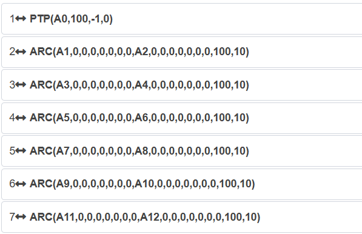

.. centered:: Figura 9.27-55 Programa Típico para Blending ARC-ARC Usando o Interruptor de Configuração
   
Blending ARC-CIRCLE
***************************************

Usando Instruções Lua
""""""""""""""""""""""""""""""""""""""""""

**Passo 1**: Selecione os pontos de ensino para executar a função ARC-CIRCLE. Neste manual, usamos "A0" a "A12" como nomes dos pontos de ensino.

**Passo 2**: Clique em "Programa de Ensino" —> "Programação de Programa", selecione a instrução "Arco" em "Instruções de Movimento". Na "Edição da Instrução", selecione o ponto de ensino e defina a velocidade de teste. Selecione "Modo de Suavização de Aceleração" para a proteção de movimento. Defina o parâmetro "Transição Suave" no ponto onde a suavização é necessária.
   
.. image:: coding/410.png
   :width: 6in
   :align: center

.. centered:: Figura 9.27-56 Configuração da Instrução Blending ARC com Suavização de Aceleração

**Passo 3**: Adicione várias instruções ARC e CIRCLE, gere o programa Lua e execute-o para realizar a função de blending ARC-CIRCLE. Este método usa o movimento de velocidade em T otimizado apenas para as instruções entre AccSmoothStart() e AccSmoothEnd(). Para as outras instruções, usa o movimento de velocidade em T original.
   
.. image:: coding/422.png
   :width: 4in
   :align: center

.. centered:: Figura 9.27-57 Programa Típico para Blending ARC-CIRCLE Usando Instruções Lua

Usando o Interruptor de Configuração de Movimento
"""""""""""""""""""""""""""""""""""""""""""""""""""""""

**Passo 1**: Clique em "Configurações Iniciais" —> "Segurança" —> "Configuração de Movimento" e ative o interruptor "Modo de Suavização de Aceleração".
   
.. image:: coding/317.png
   :width: 6in
   :align: center

.. centered:: Figura 9.27-58 Configuração do Interruptor do Modo de Suavização de Aceleração

**Passo 2**: Selecione os pontos de ensino para executar a função ARC-CIRCLE. Neste manual, usamos "A0" a "A12" como nomes dos pontos de ensino.

**Passo 3**: Clique em "Programa de Ensino" —> "Programação de Programa", selecione a instrução "Arco" em "Instruções de Movimento". Na "Edição da Instrução", selecione o ponto de ensino e defina a velocidade de teste. Selecione "Nenhum" para a proteção de movimento. Defina o parâmetro "Transição Suave" no ponto onde a suavização é necessária.
   
.. image:: coding/419.png
   :width: 6in
   :align: center

.. centered:: Figura 9.27-59 Configuração da Instrução Blending ARC Convencional

**Passo 4**: Adicione várias instruções ARC e CIRCLE, gere o programa Lua e execute-o para realizar a função de blending ARC-CIRCLE. O programa típico é o mesmo do programa ARC-CIRCLE convencional. Este método usa o movimento de velocidade em T otimizado para todas as instruções.
   
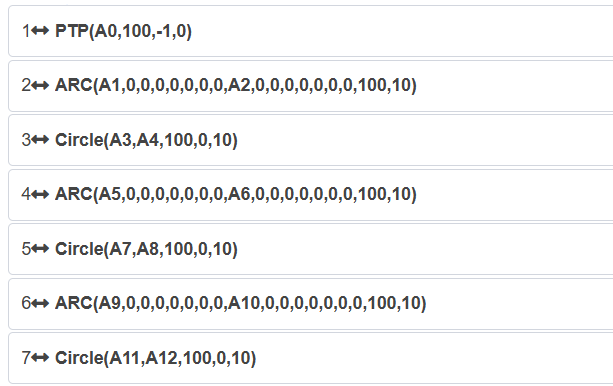

.. centered:: Figura 9.27-60 Programa Típico para Blending ARC-CIRCLE Usando o Interruptor de Configuração
   
Blending CIRCLE-PTP
***************************************

Usando Instruções Lua
""""""""""""""""""""""""""""""""""""""""""

**Passo 1**: Selecione os pontos de ensino para executar a função CIRCLE-PTP. Neste manual, usamos "A0" a "A9" como nomes dos pontos de ensino.

**Passo 2**: Clique em "Programa de Ensino" —> "Programação de Programa", selecione a instrução "Círculo Completo" em "Instruções de Movimento". Na "Edição da Instrução", selecione o ponto de ensino e defina a velocidade de teste. Selecione "Modo de Suavização de Aceleração" para a proteção de movimento. Defina o parâmetro "Transição Suave" no ponto onde a suavização é necessária.
   
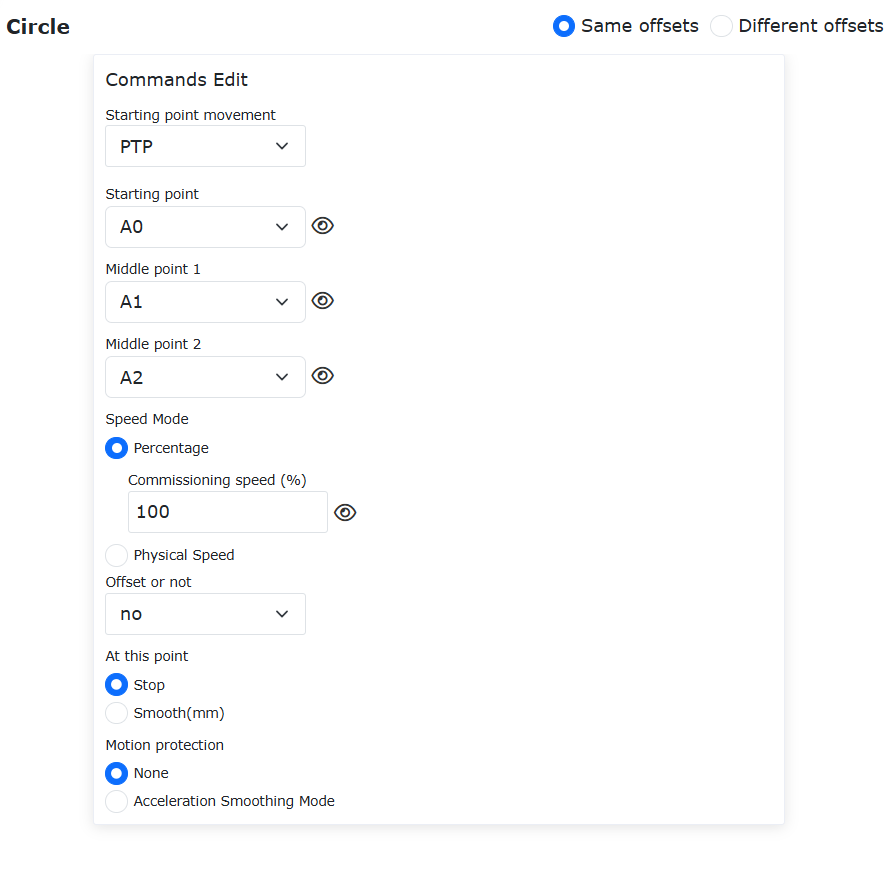

.. centered:: Figura 9.27-61 Configuração da Instrução Blending CIRCLE com Suavização de Aceleração

**Passo 3**: Adicione várias instruções CIRCLE e PTP, gere o programa Lua e execute-o para realizar a função de blending CIRCLE-PTP. Este método usa o movimento de velocidade em T otimizado apenas para as instruções entre AccSmoothStart() e AccSmoothEnd(). Para as outras instruções, usa o movimento de velocidade em T original.
   
.. image:: coding/425.png
   :width: 4in
   :align: center

.. centered:: Figura 9.27-62 Programa Típico para Blending CIRCLE-PTP Usando Instruções Lua

Usando o Interruptor de Configuração de Movimento
"""""""""""""""""""""""""""""""""""""""""""""""""""""""

**Passo 1**: Clique em "Configurações Iniciais" —> "Segurança" —> "Configuração de Movimento" e ative o interruptor "Modo de Suavização de Aceleração".
   
.. image:: coding/317.png
   :width: 6in
   :align: center

.. centered:: Figura 9.27-63 Configuração do Interruptor do Modo de Suavização de Aceleração

**Passo 2**: Selecione os pontos de ensino para executar a função CIRCLE-PTP. Neste manual, usamos "A0" a "A9" como nomes dos pontos de ensino.

**Passo 3**: Clique em "Programa de Ensino" —> "Programação de Programa", selecione a instrução "Círculo Completo" em "Instruções de Movimento". Na "Edição da Instrução", selecione o ponto de ensino e defina a velocidade de teste. Selecione "Nenhum" para a proteção de movimento. Defina o parâmetro "Transição Suave" no ponto onde a suavização é necessária.
   
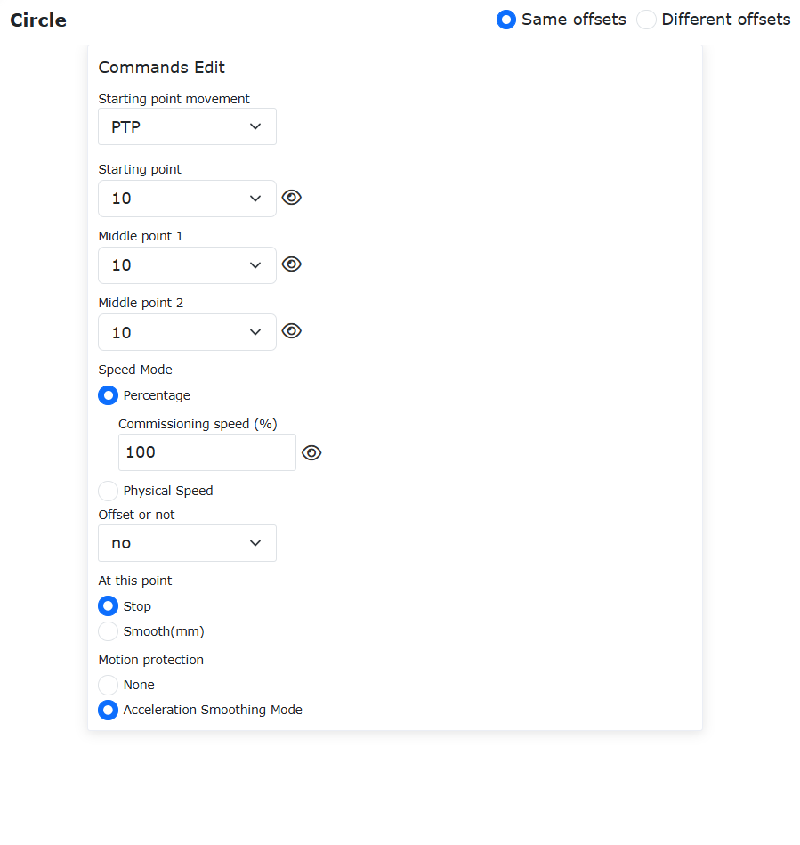

.. centered:: Figura 9.27-64 Configuração da Instrução Blending CIRCLE Convencional

**Passo 4**: Adicione várias instruções CIRCLE e PTP, gere o programa Lua e execute-o para realizar a função de blending CIRCLE-PTP. O programa típico é o mesmo do programa CIRCLE-PTP convencional. Este método usa o movimento de velocidade em T otimizado para todas as instruções.
   
.. image:: coding/427.png
   :width: 4in
   :align: center

.. centered:: Figura 9.27-65 Programa Típico para Blending CIRCLE-PTP Usando o Interruptor de Configuração
   
Blending CIRCLE-LIN
***************************************

Usando Instruções Lua
""""""""""""""""""""""""""""""""""""""""""

**Passo 1**: Selecione os pontos de ensino para executar a função CIRCLE-LIN. Neste manual, usamos "A0" a "A12" como nomes dos pontos de ensino.

**Passo 2**: Clique em "Programa de Ensino" —> "Programação de Programa", selecione a instrução "Círculo Completo" em "Instruções de Movimento". Na "Edição da Instrução", selecione o ponto de ensino e defina a velocidade de teste. Selecione "Modo de Suavização de Aceleração" para a proteção de movimento. Defina o parâmetro "Transição Suave" no ponto onde a suavização é necessária.
   

.. centered:: Figura 9.27-66 Configuração da Instrução Blending CIRCLE com Suavização de Aceleração

**Passo 3**: Adicione várias instruções CIRCLE e LIN, gere o programa Lua e execute-o para realizar a função de blending CIRCLE-LIN. Este método usa o movimento de velocidade em T otimizado apenas para as instruções entre AccSmoothStart() e AccSmoothEnd(). Para as outras instruções, usa o movimento de velocidade em T original.
   
.. image:: coding/428.png
   :width: 4in
   :align: center

.. centered:: Figura 9.27-67 Programa Típico para Blending CIRCLE-LIN Usando Instruções Lua

Usando o Interruptor de Configuração de Movimento
"""""""""""""""""""""""""""""""""""""""""""""""""""""""

**Passo 1**: Clique em "Configurações Iniciais" —> "Segurança" —> "Configuração de Movimento" e ative o interruptor "Modo de Suavização de Aceleração".
   
.. image:: coding/317.png
   :width: 6in
   :align: center

.. centered:: Figura 9.27-68 Configuração do Interruptor do Modo de Suavização de Aceleração

**Passo 2**: Selecione os pontos de ensino para executar a função CIRCLE-LIN. Neste manual, usamos "A0" a "A12" como nomes dos pontos de ensino.

**Passo 3**: Clique em "Programa de Ensino" —> "Programação de Programa", selecione a instrução "Círculo Completo" em "Instruções de Movimento". Na "Edição da Instrução", selecione o ponto de ensino e defina a velocidade de teste. Selecione "Nenhum" para a proteção de movimento. Defina o parâmetro "Transição Suave" no ponto onde a suavização é necessária.
   

.. centered:: Figura 9.27-69 Configuração da Instrução Blending CIRCLE Convencional

**Passo 4**: Adicione várias instruções CIRCLE e LIN, gere o programa Lua e execute-o para realizar a função de blending CIRCLE-LIN. O programa típico é o mesmo do programa CIRCLE-LIN convencional. Este método usa o movimento de velocidade em T otimizado para todas as instruções.
   
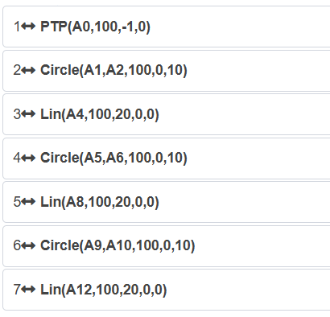

.. centered:: Figura 9.27-70 Programa Típico para Blending CIRCLE-LIN Usando o Interruptor de Configuração
   
Blending CIRCLE-ARC
***************************************

Usando Instruções Lua
""""""""""""""""""""""""""""""""""""""""""

**Passo 1**: Selecione os pontos de ensino para executar a função CIRCLE-ARC. Neste manual, usamos "A0" a "A12" como nomes dos pontos de ensino.

**Passo 2**: Clique em "Programa de Ensino" —> "Programação de Programa", selecione a instrução "Círculo Completo" em "Instruções de Movimento". Na "Edição da Instrução", selecione o ponto de ensino e defina a velocidade de teste. Selecione "Modo de Suavização de Aceleração" para a proteção de movimento. Defina o parâmetro "Transição Suave" no ponto onde a suavização é necessária.
   

.. centered:: Figura 9.27-71 Configuração da Instrução Blending CIRCLE com Suavização de Aceleração

**Passo 3**: Adicione várias instruções CIRCLE e ARC, gere o programa Lua e execute-o para realizar a função de blending CIRCLE-ARC. Este método usa o movimento de velocidade em T otimizado apenas para as instruções entre AccSmoothStart() e AccSmoothEnd(). Para as outras instruções, usa o movimento de velocidade em T original.
   
.. image:: coding/430.png
   :width: 4in
   :align: center

.. centered:: Figura 9.27-72 Programa Típico para Blending CIRCLE-ARC Usando Instruções Lua

Usando o Interruptor de Configuração de Movimento
"""""""""""""""""""""""""""""""""""""""""""""""""""""""

**Passo 1**: Clique em "Configurações Iniciais" —> "Segurança" —> "Configuração de Movimento" e ative o interruptor "Modo de Suavização de Aceleração".
   
.. image:: coding/317.png
   :width: 6in
   :align: center

.. centered:: Figura 9.27-73 Configuração do Interruptor do Modo de Suavização de Aceleração

**Passo 2**: Selecione os pontos de ensino para executar a função CIRCLE-ARC. Neste manual, usamos "A0" a "A12" como nomes dos pontos de ensino.

**Passo 3**: Clique em "Programa de Ensino" —> "Programação de Programa", selecione a instrução "Círculo Completo" em "Instruções de Movimento". Na "Edição da Instrução", selecione o ponto de ensino e defina a velocidade de teste. Selecione "Nenhum" para a proteção de movimento. Defina o parâmetro "Transição Suave" no ponto onde a suavização é necessária.
   

.. centered:: Figura 9.27-74 Configuração da Instrução Blending CIRCLE Convencional

**Passo 4**: Adicione várias instruções CIRCLE e ARC, gere o programa Lua e execute-o para realizar a função de blending CIRCLE-ARC. O programa típico é o mesmo do programa CIRCLE-ARC convencional. Este método usa o movimento de velocidade em T otimizado para todas as instruções.
   
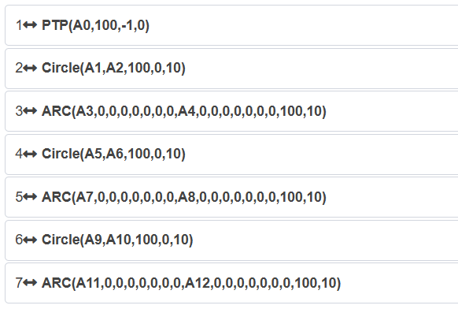

.. centered:: Figura 9.27-75 Programa Típico para Blending CIRCLE-ARC Usando o Interruptor de Configuração
   
Blending CIRCLE-CIRCLE
***************************************

Usando Instruções Lua
""""""""""""""""""""""""""""""""""""""""""

**Passo 1**: Selecione os pontos de ensino para executar a função CIRCLE-CIRCLE. Neste manual, usamos "A0" a "A12" como nomes dos pontos de ensino.

**Passo 2**: Clique em "Programa de Ensino" —> "Programação de Programa", selecione a instrução "Círculo Completo" em "Instruções de Movimento". Na "Edição da Instrução", selecione o ponto de ensino e defina a velocidade de teste. Selecione "Modo de Suavização de Aceleração" para a proteção de movimento. Defina o parâmetro "Transição Suave" no ponto onde a suavização é necessária.
   

.. centered:: Figura 9.27-76 Configuração da Instrução Blending CIRCLE com Suavização de Aceleração

**Passo 3**: Adicione várias instruções CIRCLE, gere o programa Lua e execute-o para realizar a função de blending CIRCLE-CIRCLE. Este método usa o movimento de velocidade em T otimizado apenas para as instruções entre AccSmoothStart() e AccSmoothEnd(). Para as outras instruções, usa o movimento de velocidade em T original.
   
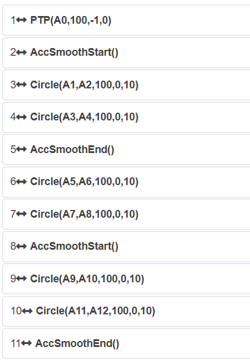

.. centered:: Figura 9.27-77 Programa Típico para Blending CIRCLE-CIRCLE Usando Instruções Lua

Usando o Interruptor de Configuração de Movimento
"""""""""""""""""""""""""""""""""""""""""""""""""""""""

**Passo 1**: Clique em "Configurações Iniciais" —> "Segurança" —> "Configuração de Movimento" e ative o interruptor "Modo de Suavização de Aceleração".
   
.. image:: coding/317.png
   :width: 6in
   :align: center

.. centered:: Figura 9.27-78 Configuração do Interruptor do Modo de Suavização de Aceleração

**Passo 2**: Selecione os pontos de ensino para executar a função CIRCLE-CIRCLE. Neste manual, usamos "A0" a "A12" como nomes dos pontos de ensino.

**Passo 3**: Clique em "Programa de Ensino" —> "Programação de Programa", selecione a instrução "Círculo Completo" em "Instruções de Movimento". Na "Edição da Instrução", selecione o ponto de ensino e defina a velocidade de teste. Selecione "Nenhum" para a proteção de movimento. Defina o parâmetro "Transição Suave" no ponto onde a suavização é necessária.
   

.. centered:: Figura 9.27-79 Configuração da Instrução Blending CIRCLE Convencional

**Passo 4**: Adicione várias instruções CIRCLE, gere o programa Lua e execute-o para realizar a função de blending CIRCLE-CIRCLE. O programa típico é o mesmo do programa CIRCLE-CIRCLE convencional. Este método usa o movimento de velocidade em T otimizado para todas as instruções.
   
.. image:: coding/433.png
   :width: 4in
   :align: center

.. centered:: Figura 9.27-80 Programa Típico para Blending CIRCLE-CIRCLE Usando o Interruptor de Configuração
   
Blending para Movimento Assíncrono do Eixo de Extensão
*********************************************************************

Usando Instruções Lua
""""""""""""""""""""""""""""""""""""""""""

**Passo 1**: Selecione os pontos de ensino para executar a função de blending para movimento assíncrono do eixo de extensão. Neste manual, usamos "A0" a "A5" como nomes dos pontos de ensino.

**Passo 2**: Clique em "Programa de Ensino" —> "Programação de Programa", selecione a instrução "Eixo de Extensão" em "Instruções de Periféricos". Defina "Modo de Movimento" como "Assíncrono". Selecione o ponto de ensino e defina a velocidade de teste. Selecione "Modo de Suavização de Aceleração" para a proteção de movimento. Defina o parâmetro "Transição Suave" no ponto onde a suavização é necessária.
   
.. image:: coding/435.png
   :width: 6in
   :align: center

.. centered:: Figura 9.27-81 Configuração da Instrução Blending para Movimento Assíncrono do Eixo de Extensão

**Passo 3**: Adicione as instruções de movimento, gere o programa Lua e execute-o para realizar a função de blending para movimento assíncrono do eixo de extensão. Este método usa o planejamento de velocidade em S e blending apenas para as instruções entre AccSmoothStart() e AccSmoothEnd(). Para as outras instruções, usa o planejamento de velocidade em T.
   
.. image:: coding/436.png
   :width: 4in
   :align: center

.. centered:: Figura 9.27-82 Programa Típico para Blending de Movimento Assíncrono do Eixo de Extensão Usando Instruções Lua

Usando o Interruptor de Configuração de Movimento
"""""""""""""""""""""""""""""""""""""""""""""""""""""""

**Passo 1**: Clique em "Configurações Iniciais" —> "Segurança" —> "Configuração de Movimento" e ative o interruptor "Modo de Suavização de Aceleração".
   
.. image:: coding/317.png
   :width: 6in
   :align: center

.. centered:: Figura 9.27-83 Configuração do Interruptor do Modo de Suavização de Aceleração

**Passo 2**: Selecione os pontos de ensino para executar a função de blending para movimento assíncrono do eixo de extensão. Neste manual, usamos "A0" a "A5" como nomes dos pontos de ensino.

**Passo 3**: Clique em "Programa de Ensino" —> "Programação de Programa", selecione a instrução "Eixo de Extensão" em "Instruções de Periféricos". Defina "Modo de Movimento" como "Assíncrono". Selecione o ponto de ensino e defina a velocidade de teste. Selecione "Nenhum" para a proteção de movimento. Defina o parâmetro "Transição Suave" no ponto onde a suavização é necessária.
   
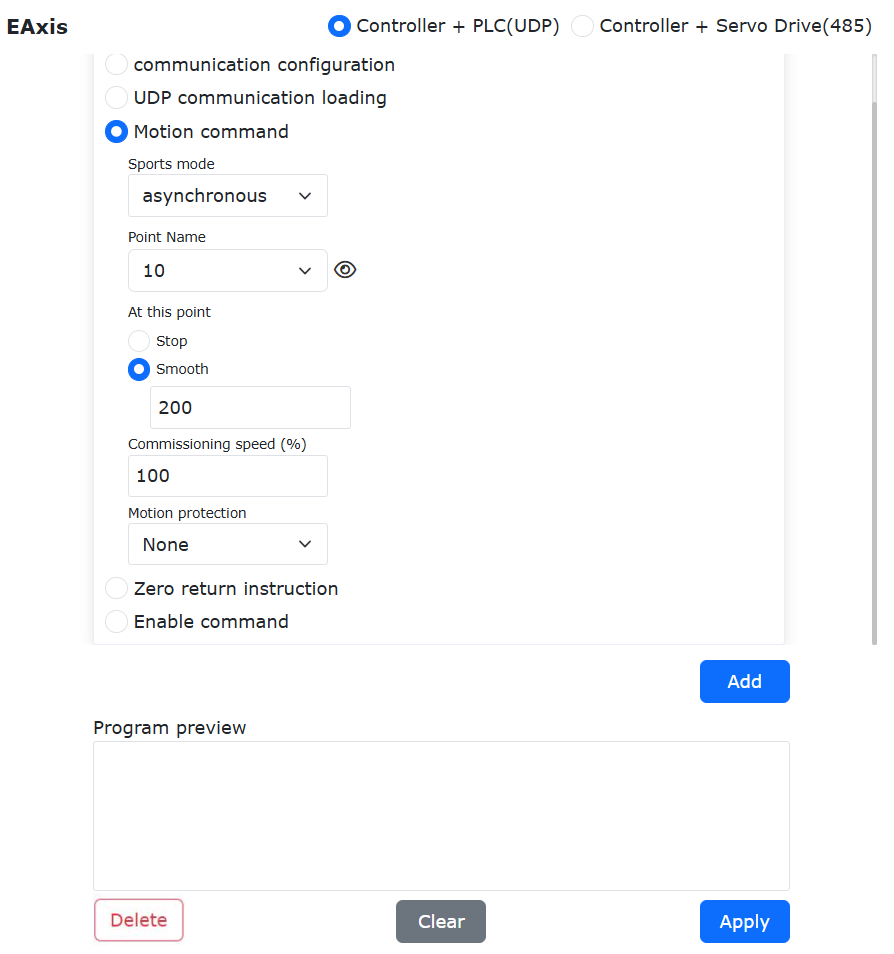

.. centered:: Figura 9.27-84 Configuração da Instrução Blending Convencional para Movimento Assíncrono do Eixo de Extensão

**Passo 4**: Adicione várias instruções de movimento, gere o programa Lua e execute-o para realizar a função de blending para movimento assíncrono do eixo de extensão. O programa típico é o mesmo do programa de movimento convencional do eixo de extensão. Este método usa planejamento de velocidade em S e blending para todas as instruções.
   
.. image:: coding/438.png
   :width: 4in
   :align: center

.. centered:: Figura 9.27-85 Programa Típico para Blending de Movimento Assíncrono do Eixo de Extensão Usando o Interruptor de Configuração
   
Blending para Movimento Síncrono do Eixo de Extensão
*******************************************************************

Usando Instruções Lua
""""""""""""""""""""""""""""""""""""""""""

**Passo 1**: Selecione os pontos de ensino para executar a função de blending para movimento síncrono do eixo de extensão. Neste manual, usamos "A0" a "A5" como nomes dos pontos de ensino.

**Passo 2**: Clique em "Programa de Ensino" —> "Programação de Programa", selecione a instrução "Eixo de Extensão" em "Instruções de Periféricos". Defina "Modo de Movimento" como "Síncrono". Selecione o ponto de ensino e defina a velocidade de teste. Selecione "Modo de Suavização de Aceleração" para a proteção de movimento. Defina o parâmetro "Transição Suave" no ponto onde a suavização é necessária.
   
.. image:: coding/439.png
   :width: 6in
   :align: center

.. centered:: Figura 9.27-86 Configuração da Instrução Blending para Movimento Síncrono do Eixo de Extensão

**Passo 3**: Adicione as instruções de movimento, gere o programa Lua e execute-o para realizar a função de blending para movimento síncrono do eixo de extensão. Este método usa o planejamento de velocidade em S e blending apenas para as instruções entre AccSmoothStart() e AccSmoothEnd(). Para as outras instruções, usa o planejamento de velocidade em T.
   
.. image:: coding/440.png
   :width: 4in
   :align: center

.. centered:: Figura 9.27-87 Programa Típico para Blending de Movimento Síncrono do Eixo de Extensão Usando Instruções Lua

Usando o Interruptor de Configuração de Movimento
"""""""""""""""""""""""""""""""""""""""""""""""""""""""

**Passo 1**: Clique em "Configurações Iniciais" —> "Segurança" —> "Configuração de Movimento" e ative o interruptor "Modo de Suavização de Aceleração".
   
.. image:: coding/317.png
   :width: 6in
   :align: center

.. centered:: Figura 9.27-88 Configuração do Interruptor do Modo de Suavização de Aceleração

**Passo 2**: Selecione os pontos de ensino para executar a função de blending para movimento síncrono do eixo de extensão. Neste manual, usamos "A0" a "A5" como nomes dos pontos de ensino.

**Passo 3**: Clique em "Programa de Ensino" —> "Programação de Programa", selecione a instrução "Eixo de Extensão" em "Instruções de Periféricos". Defina "Modo de Movimento" como "Síncrono". Selecione o ponto de ensino e defina a velocidade de teste. Selecione "Nenhum" para a proteção de movimento. Defina o parâmetro "Transição Suave" no ponto onde a suavização é necessária.
   
.. image:: coding/441.png
   :width: 6in
   :align: center

.. centered:: Figura 9.27-89 Configuração da Instrução Blending Convencional para Movimento Síncrono do Eixo de Extensão

**Passo 4**: Adicione várias instruções de movimento, gere o programa Lua e execute-o para realizar a função de blending para movimento síncrono do eixo de extensão. O programa típico é o mesmo do programa de movimento convencional do eixo de extensão. Este método usa planejamento de velocidade em S e blending para todas as instruções.
   
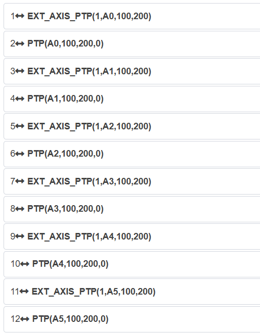

.. centered:: Figura 9.27-90 Programa Típico para Blending de Movimento Síncrono do Eixo de Extensão Usando o Interruptor de Configuração
   
Função de Ângulo de Inclinação da Oscilação
~~~~~~~~~~~~~~~~~~~~~~~~~~~~~~~~~~~~~~~~~~~~~~~~~~~~~~~

Visão Geral
++++++++++++++

A função de ângulo de inclinação da oscilação do robô permite que a ferramenta de extremidade do robô gire em um ângulo personalizado em torno da direção Rx do sistema de coordenadas de oscilação durante o movimento de oscilação. Isso reduz a diferença no comprimento de contato entre a solda de ângulo e os materiais conectados em ambos os lados durante operações como soldagem sobreposta.

Fluxo de Operação
++++++++++++++++++++++++++++

Na interface de controle web do robô, clique sequencialmente em "Programa de Ensino" -> "Edição de Programa" para entrar na interface "Instruções de Movimento", conforme abaixo.
   
.. image:: coding/320.png
   :width: 4in
   :align: center

.. centered:: Figura 9.28-1 Interface de Instruções de Movimento

Na interface "Instruções de Movimento", clique em "Oscilação" para entrar na interface de edição da instrução "Weave".
   
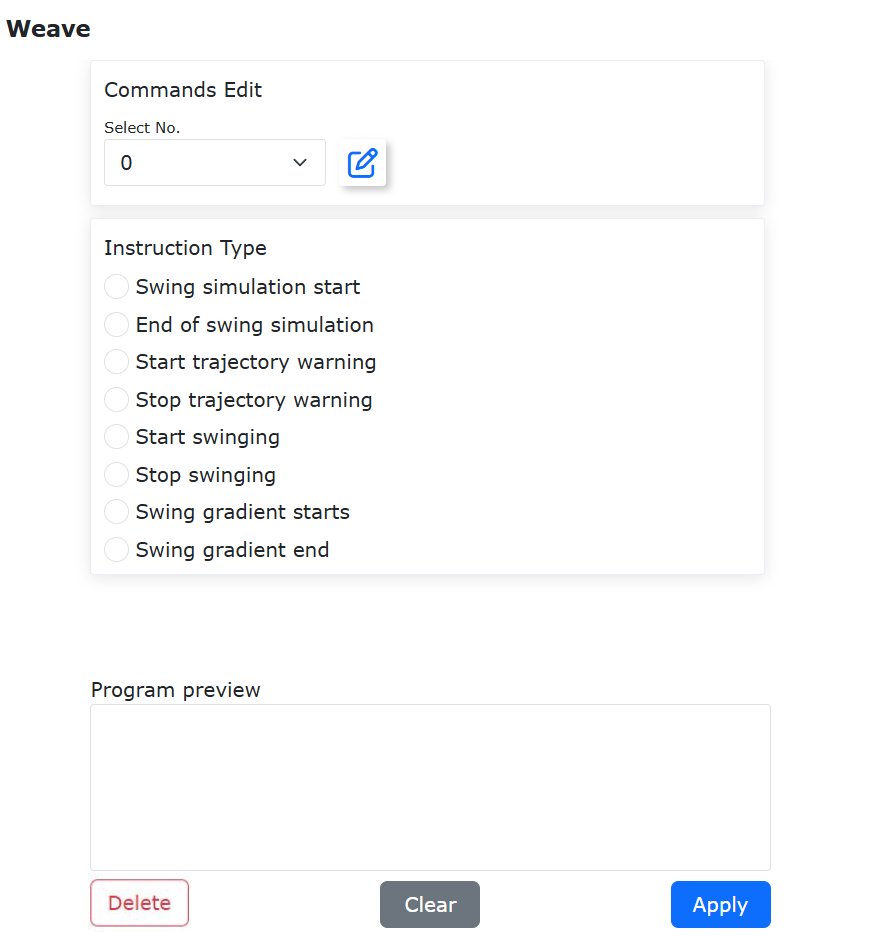

.. centered:: Figura 9.28-2 Interface de Edição da Instrução Weave

Na interface de edição da instrução "Weave", clique na lista suspensa "Selecionar Número" para escolher diferentes números de configuração de parâmetros de oscilação. Clique no botão à direita da lista suspensa "Selecionar Número" para modificar a configuração dos parâmetros de oscilação para aquele número.
   
.. image:: coding/322.png
   :width: 6in
   :align: center

.. centered:: Figura 9.28-3 Configuração dos Parâmetros de Oscilação

No campo "Ângulo de Inclinação da Direção da Oscilação" na configuração dos parâmetros de oscilação, você pode inserir um ângulo personalizado de rotação em torno da direção Rx do sistema de coordenadas de oscilação. Clique em "Configurar" para concluir a configuração dos parâmetros de oscilação.

.. note:: O parâmetro "Ângulo de Inclinação da Direção da Oscilação" é compatível com os parâmetros "Tipo de Oscilação" como "Oscilação em Onda Triangular", "Oscilação Senoidal", "Oscilação Circular - Horário" e "Oscilação Circular - Anti-horário".

Abaixo, usando o movimento Lin como exemplo para implementar a função de ângulo de inclinação da oscilação:

**Passo 1**: Na interface de edição da instrução "Weave", na lista suspensa "Selecionar Número" na interface "Edição da Instrução", escolha o número de configuração com os parâmetros de ângulo de inclinação da oscilação já configurados. Na seção "Tipo de Instrução", clique em "Iniciar Oscilação" e, em seguida, em "Adicionar" para ativar a função de oscilação.
   
.. image:: coding/323.png
   :width: 6in
   :align: center

.. centered:: Figura 9.28-4 Adicionar Início da Oscilação

**Passo 2**: Na interface "Instruções de Movimento", clique em "Linear" para criar um movimento linear Lin. Esta etapa é uma instrução de movimento básica e não será repetida.

**Passo 3**: Na interface de edição da instrução "Weave", na seção "Tipo de Instrução", clique em "Parar Oscilação" e, em seguida, em "Adicionar" para desativar a função de oscilação.
   
.. image:: coding/324.png
   :width: 6in
   :align: center

.. centered:: Figura 9.28-5 Adicionar Parada da Oscilação

**Passo 4**: Após concluir os passos 1 a 3, na seção "Pré-visualização do Programa" da interface de edição da instrução "Weave", verifique se as configurações dos passos 1 a 3 estão corretas.
   
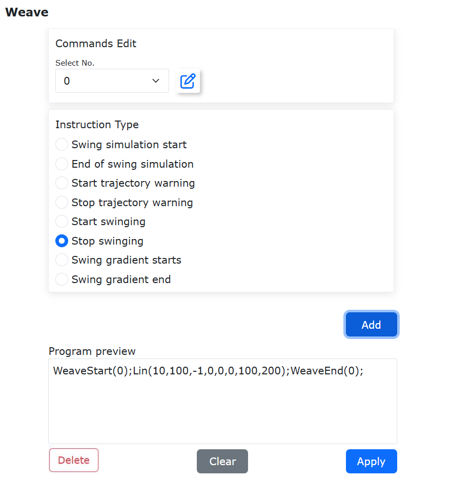

.. centered:: Figura 9.28-6 Pré-visualização do Programa de Oscilação

**Passo 5**: Após verificar as configurações do programa na seção "Pré-visualização do Programa", clique em "Aplicar" para gerar automaticamente um programa LUA executável.
   
.. image:: coding/326.png
   :width: 4in
   :align: center

.. centered:: Figura 9.28-7 Programa LUA Típico de Movimento de Oscilação

Função de Transição Gradual de Parâmetros do Processo de Soldagem (Corrente, Tensão, Velocidade de Avanço ao Longo da Solda)
~~~~~~~~~~~~~~~~~~~~~~~~~~~~~~~~~~~~~~~~~~~~~~~~~~~~~~~~~~~~~~~~~~~~~~~~~~~~~~~~~~~~~~~~~~~~~~~~~~~~~~~~~~~~~~~~~~~~~~~~~~~~~~~~~~~

Visão Geral
++++++++++++++

A função de transição gradual dos parâmetros do processo de soldagem (corrente, tensão e velocidade de avanço ao longo da solda) suporta a definição da faixa de variação dos parâmetros do processo durante a soldagem.

Fluxo de Transição Gradual dos Parâmetros de Corrente e Tensão
++++++++++++++++++++++++++++++++++++++++++++++++++++++++++++++++++++++++++

Transição Gradual do Parâmetro de Corrente
*****************************************************

Na interface de controle web do robô, clique sequencialmente em "Programa de Ensino" -> "Programação de Programa" para entrar na interface "Instruções de Soldagem", conforme abaixo.
   
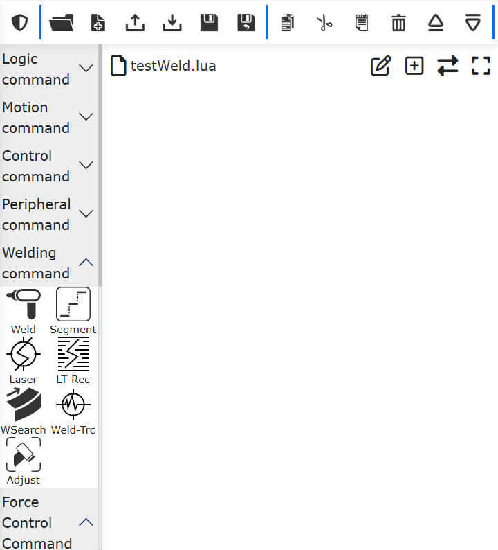

.. centered:: Figura 9.29-1 Interface de Instruções de Soldagem

Na interface "Instruções de Soldagem", clique em "Soldagem" para entrar na interface de configuração da instrução "Weld".
   
.. image:: coding/328.png
   :width: 4in
   :align: center

.. centered:: Figura 9.29-2 Interface de Configuração da Instrução Weld

Na seção "Tipo de Instrução" da interface de configuração da instrução "Weld", clique em "Iniciar Transição Gradual da Corrente de Soldagem". Configure os parâmetros "Corrente Inicial", "Corrente Final", "AO de Controle da Corrente de Soldagem" e "Seleção de Suavização".

Por exemplo, configure "Corrente Inicial" como 260 A, "Corrente Final" como 220 A, "AO de Controle da Corrente de Soldagem" como "Ctrl-AO0" (canal analógico do painel de controle) e "Seleção de Suavização" como "Break". Clique em "Adicionar" para concluir a configuração. Na seção "Pré-visualização do Programa", verifique se há erros de configuração nos parâmetros da instrução.
   
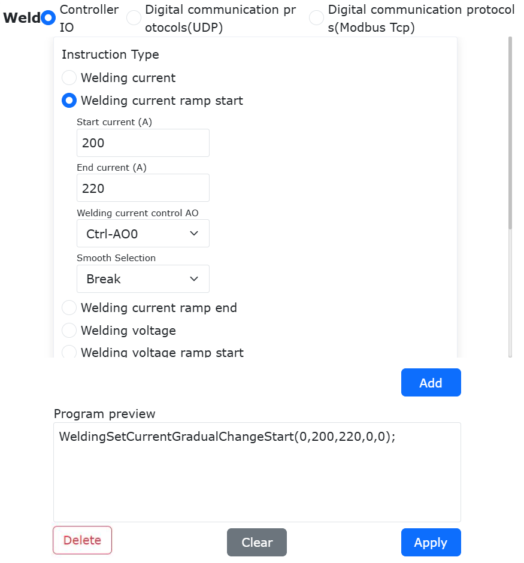

.. centered:: Figura 9.29-3 Parâmetros da Instrução de Início da Transição Gradual da Corrente de Soldagem

Na seção "Tipo de Instrução" da interface de configuração da instrução "Weld", clique em "Terminar Transição Gradual da Corrente de Soldagem". Nenhuma configuração de parâmetro é necessária. Clique em "Adicionar" para concluir. Na seção "Pré-visualização do Programa", verifique se há erros de configuração nos parâmetros da instrução.
   
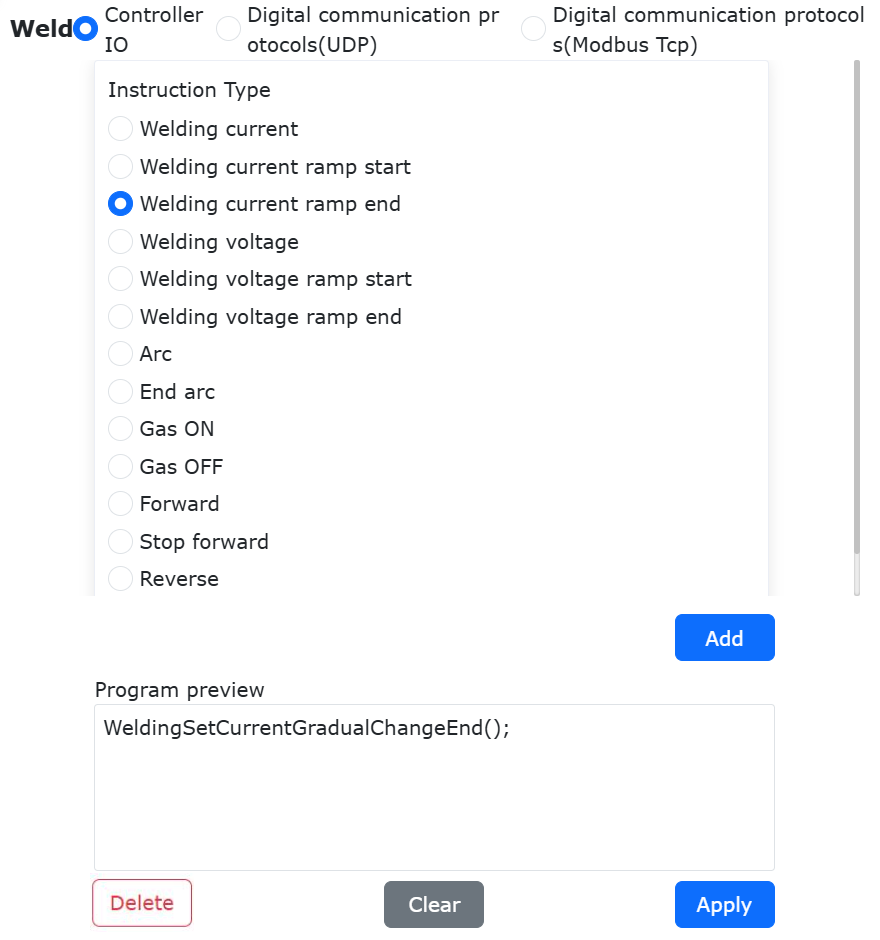

.. centered:: Figura 9.29-4 Parâmetros da Instrução de Término da Transição Gradual da Corrente de Soldagem

Após configurar os parâmetros das instruções "Iniciar Transição Gradual da Corrente de Soldagem" e "Terminar Transição Gradual da Corrente de Soldagem", clique em "Aplicar" para gerar automaticamente um programa LUA executável.

.. note:: Durante a configuração dos parâmetros das instruções "Iniciar Transição Gradual da Corrente de Soldagem" e "Terminar Transição Gradual da Corrente de Soldagem", é necessário configurar instruções de movimento. Um exemplo de programa LUA típico combinando uma instrução de movimento de rastreamento de arco com transição gradual do parâmetro de corrente é mostrado abaixo.
   
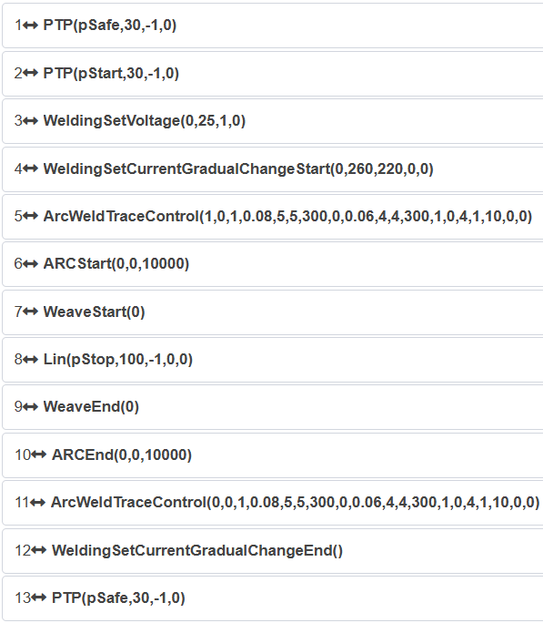

.. centered:: Figura 9.29-5 Programa LUA Típico de Rastreamento de Arco com Transição Gradual do Parâmetro de Corrente

Transição Gradual do Parâmetro de Tensão
**********************************************************

Na seção "Tipo de Instrução" da interface de configuração da instrução "Weld", clique em "Iniciar Transição Gradual da Tensão de Soldagem". Configure os parâmetros "Tensão Inicial", "Tensão Final", "AO de Controle da Tensão de Soldagem" e "Seleção de Suavização".

Por exemplo, configure "Tensão Inicial" como 25 V, "Tensão Final" como 22 V, "AO de Controle da Tensão de Soldagem" como "Ctrl-AO1" (canal analógico do painel de controle) e "Seleção de Suavização" como "Break". Clique em "Adicionar" para concluir. Na seção "Pré-visualização do Programa", verifique se há erros de configuração, conforme abaixo.
   
.. image:: coding/332.png
   :width: 4in
   :align: center

.. centered:: Figura 9.29-6 Parâmetros da Instrução de Início da Transição Gradual da Tensão de Soldagem

Na seção "Tipo de Instrução" da interface de configuração da instrução "Weld", clique em "Terminar Transição Gradual da Tensão de Soldagem". Nenhuma configuração de parâmetro é necessária. Clique em "Adicionar" para concluir. Na seção "Pré-visualização do Programa", verifique se há erros de configuração.
   
.. image:: coding/333.png
   :width: 4in
   :align: center

.. centered:: Figura 9.29-7 Parâmetros da Instrução de Término da Transição Gradual da Tensão de Soldagem

Após configurar os parâmetros das instruções "Iniciar Transição Gradual da Tensão de Soldagem" e "Terminar Transição Gradual da Tensão de Soldagem", clique em "Aplicar" para gerar automaticamente um programa LUA executável.
   
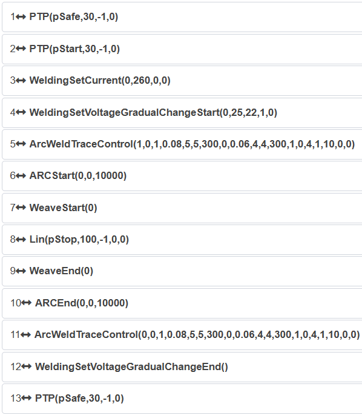

.. centered:: Figura 9.29-8 Programa LUA Típico de Rastreamento de Arco com Transição Gradual do Parâmetro de Tensão

Fluxo de Transição Gradual do Parâmetro de Velocidade de Avanço
+++++++++++++++++++++++++++++++++++++++++++++++++++++++++++++++++++++++

Na interface de controle web do robô, clique sequencialmente em "Programa de Ensino" -> "Programação de Programa" para entrar na interface "Instruções de Movimento".
   
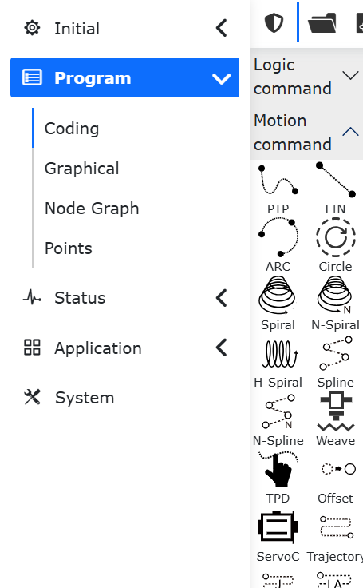

.. centered:: Figura 9.29-9 Interface de Instruções de Movimento

Na interface "Instruções de Movimento", clique em "Oscilação" para entrar na interface de configuração da instrução "Weave".
   
.. image:: coding/336.png
   :width: 4in
   :align: center

.. centered:: Figura 9.29-10 Interface de Configuração da Instrução Weave

Na seção "Tipo de Instrução" da interface de configuração da instrução "Weave", clique em "Iniciar Transição Gradual da Oscilação". Configure os parâmetros "Velocidade Inicial", "Velocidade Final" e "Modo de Transição".

Por exemplo, configure "Modo de Transição" como "Oscilação + Velocidade de Avanço", "Velocidade Inicial" como 24 cm/min e "Velocidade Final" como 30 cm/min. Clique em "Adicionar" para concluir. Na seção "Pré-visualização do Programa", verifique se há erros de configuração.
   
.. image:: coding/337.png
   :width: 4in
   :align: center

.. centered:: Figura 9.29-11 Parâmetros da Instrução de Início da Transição Gradual de Oscilação + Velocidade de Avanço

Na seção "Tipo de Instrução" da interface da instrução "Weave", clique em "Terminar Transição Gradual da Oscilação". Nenhuma configuração de parâmetro é necessária. Clique em "Adicionar" para concluir. Na seção "Pré-visualização do Programa", verifique se há erros de configuração.
   
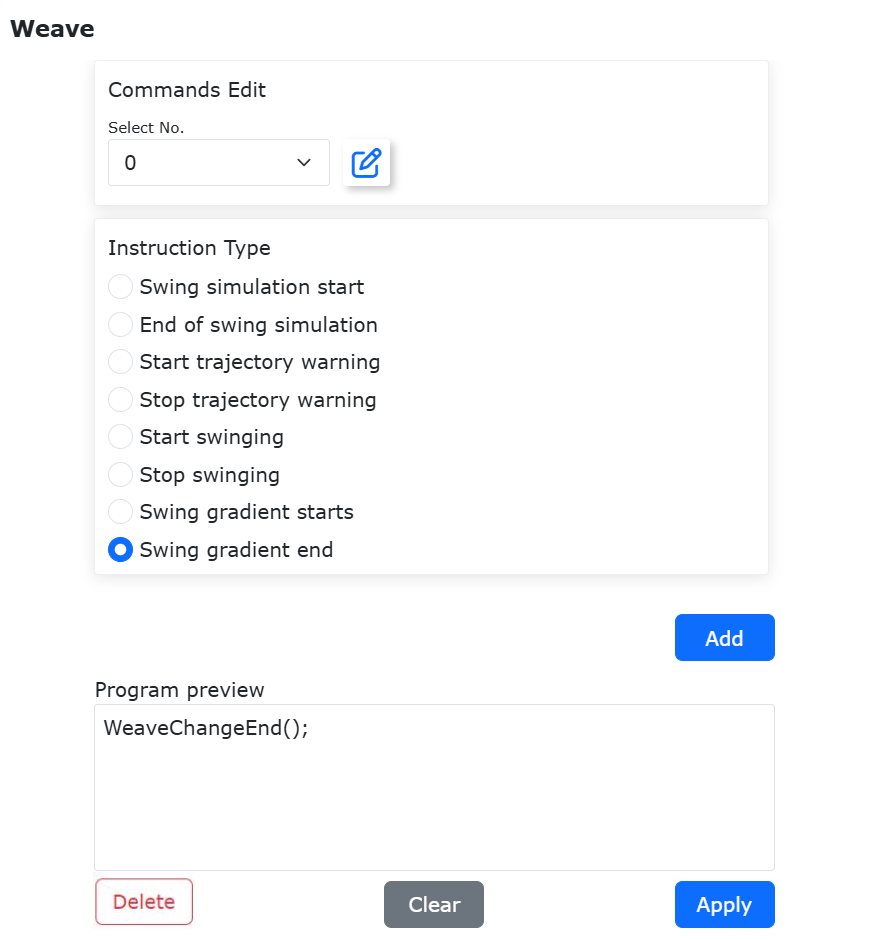

.. centered:: Figura 9.29-12 Parâmetros da Instrução de Término da Transição Gradual de Oscilação + Velocidade de Avanço

Após configurar os parâmetros das instruções "Iniciar Transição Gradual da Oscilação" e "Terminar Transição Gradual da Oscilação", clique em "Aplicar" para gerar automaticamente um programa LUA executável.

.. note:: Durante a configuração dos parâmetros das instruções "Iniciar Transição Gradual da Oscilação" e "Terminar Transição Gradual da Oscilação", é necessário configurar instruções de movimento. Um exemplo de programa LUA típico combinando uma instrução de movimento de rastreamento de arco com transição gradual do parâmetro de velocidade de avanço é mostrado abaixo.
   
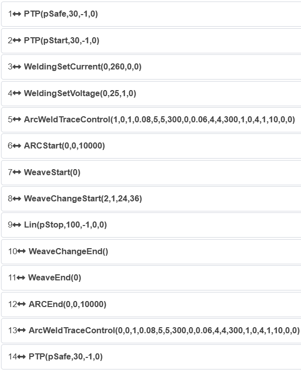

.. centered:: Figura 9.29-13 Programa LUA Típico de Rastreamento de Arco com Transição Gradual do Parâmetro de Velocidade de Avanço

.. note:: Ao configurar os parâmetros das instruções de transição gradual dos parâmetros do processo de soldagem nas interfaces de configuração das instruções "Weld" e "Weave", é necessário primeiro determinar o método de comunicação entre o painel de controle e a fonte de solda. Para comunicação analógica e digital, selecione "IO do Controlador" ou "Protocolo de Comunicação Digital", respectivamente.

Função de Transição Gradual do Tempo de Pausa na Oscilação
+++++++++++++++++++++++++++++++++++++++++++++++++++++++++++++++++++

Visão Geral
***********************************

Para condições de trabalho onde a amplitude de oscilação e o tempo de pausa no início e no final da oscilação são inconsistentes para oscilação em onda triangular, oscilação em onda triangular vertical tipo L, oscilação senoidal e oscilação senoidal vertical tipo L, esta função altera gradualmente a amplitude de oscilação e o tempo de pausa do valor definido no início para o valor definido no final.

Para condições de trabalho onde a amplitude de oscilação, o tempo de pausa e a velocidade de avanço no início e no final da oscilação são inconsistentes para oscilação em onda triangular e oscilação senoidal, esta função altera gradualmente a amplitude de oscilação, o tempo de pausa e a velocidade de avanço do valor definido no início para o valor definido no final.

Fluxo de Operação
***********************************

**Passo 1**: Configuração dos parâmetros de oscilação. Clique no botão "Programa de Ensino" - "Programação de Programa" - "Oscilação". Selecione o número da oscilação inicial e defina os parâmetros de oscilação. Em seguida, selecione o número da oscilação final e defina os parâmetros de oscilação. Observe que apenas a amplitude de oscilação, o tempo de pausa esquerda e o tempo de pausa direita podem ser diferentes entre os parâmetros de oscilação inicial e final. Todos os outros parâmetros devem ser idênticos.
   
.. image:: coding/545.png
   :width: 4in
   :align: center

.. centered:: Figura 9.29-14 Configuração dos Parâmetros de Oscilação

**Passo 2**: Configuração do modo de transição. Clique em "Iniciar Transição Gradual da Oscilação" para definir o modo de transição correspondente. Os modos de transição para oscilação em onda triangular, oscilação em onda triangular vertical tipo L, oscilação senoidal e oscilação senoidal vertical tipo L podem ser definidos como "Oscilação". Os modos de transição para oscilação em onda triangular e oscilação senoidal também podem ser definidos como "Oscilação + Velocidade de Avanço", sendo necessário definir adicionalmente a velocidade inicial e a velocidade final durante a oscilação.
   
.. image:: coding/546.png
   :width: 4in
   :align: center

.. centered:: Figura 9.29-15 Configuração do Modo de Transição "Oscilação"
   
.. image:: coding/547.png
   :width: 4in
   :align: center

.. centered:: Figura 9.29-16 Configuração do Modo de Transição "Oscilação + Velocidade de Avanço"

**Passo 3**: Escreva o programa de transição gradual da oscilação. Clique em "Iniciar Oscilação", selecione o número da oscilação inicial e adicione. Em seguida, clique em "Iniciar Transição Gradual da Oscilação", defina o número da oscilação final e o modo de transição, e adicione. Clique sequencialmente em "Terminar Transição Gradual da Oscilação" e "Parar Oscilação", e adicione. Finalmente, adicione manualmente a posição do ponto inicial e a posição do ponto final da oscilação no programa Lua para gerar o programa Lua típico.
   
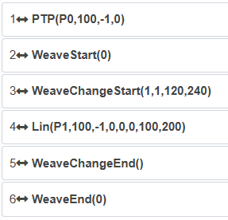

.. centered:: Figura 9.29-17 Programa Típico para Transição Gradual do Tempo de Pausa na Oscilação

Função de Oscilação em Ponto Fixo
+++++++++++++++++++++++++++++++++++++++++++++++++++++++

Visão Geral
***********************************

Para oscilação em onda triangular, oscilação em onda triangular vertical tipo L, oscilação circular - horário, oscilação circular - anti-horário, oscilação senoidal, oscilação senoidal vertical tipo L e oscilação triangular para soldagem vertical, uma nova função de oscilação em ponto fixo foi adicionada: a extremidade do robô apenas oscila sem avançar. Observe que esta função requer a calibração prévia do ponto central da ferramenta (TCP).

Fluxo de Operação
***********************************

**Passo 1**: Configuração dos parâmetros de oscilação. Clique no botão "Programa de Ensino" - "Programação de Programa" - "Oscilação". Edite o número da oscilação para definir os parâmetros de oscilação. Observe que, para que o tempo real de oscilação em ponto fixo corresponda ao tempo definido, o tempo de pausa não pode ser definido.
   
.. image:: coding/558.png
   :width: 4in
   :align: center

.. centered:: Figura 9.29-18 Configuração dos Parâmetros de Oscilação
 
**Passo 2**: Configuração dos parâmetros de oscilação em ponto fixo. Clique no botão "Programa de Ensino" - "Programação de Programa" - "Oscilação" - "Iniciar Oscilação em Ponto Fixo". Defina os parâmetros de referência da oscilação e o tempo de oscilação. Clique em "Adicionar". Em seguida, clique no botão "Terminar Oscilação em Ponto Fixo" e em "Adicionar". O parâmetro "Referência da Oscilação" pode ser definido como "Sistema de Coordenadas da Ferramenta" ou "Ponto de Referência". Quando "Sistema de Coordenadas da Ferramenta" é selecionado, a direção X do sistema de coordenadas da ferramenta no ponto atual é usada como a direção de avanço, e a direção Y do sistema de coordenadas da ferramenta no ponto atual é usada como a direção de oscilação. Quando "Ponto de Referência" é selecionado, a linha entre o ponto atual e o ponto de referência é usada como a direção de avanço, e a direção de oscilação é determinada pelo algoritmo de oscilação. Observe que o ponto de referência e a posição atual devem ter o mesmo sistema de coordenadas da ferramenta e o mesmo sistema de coordenadas da peça. As duas referências de oscilação são mostradas nas figuras, respectivamente.
   
.. image:: coding/559.png
   :width: 2in
   :align: center

.. centered:: Figura 9.29-19 Referência da Oscilação como "Sistema de Coordenadas da Ferramenta"
   
.. image:: coding/560.png
   :width: 2in
   :align: center

.. centered:: Figura 9.29-20 Referência da Oscilação como "Ponto de Referência"

**Passo 3**: Escreva o programa de oscilação em ponto fixo. Os programas Lua gerados para as duas referências de oscilação são mostrados nas figuras. Execute o programa Lua para implementar a função de oscilação em ponto fixo.
   
.. image:: coding/561.png
   :width: 4in
   :align: center

.. centered:: Figura 9.29-21 Programa de Oscilação em Ponto Fixo com Referência "Sistema de Coordenadas da Ferramenta"
   
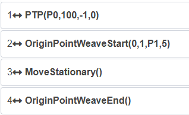

.. centered:: Figura 9.29-22 Programa de Oscilação em Ponto Fixo com Referência "Ponto de Referência"

Função de Oscilação de Ponto Fixo com Laser
+++++++++++++++++++++++++++++++++++++++++++++++++++++++

Visão Geral
***********************************

A função de oscilação de ponto fixo com laser é uma combinação da função de oscilação de ponto fixo do robô e da função de rastreamento a laser: com base na oscilação de ponto fixo original do robô, a posição de oscilação pode ser ajustada através da função de rastreamento a laser e pode ser adaptada ao movimento do eixo de extensão. Esta função é eficaz apenas para os tipos "oscilação de onda triangular" e "oscilação de onda senoidal".

Procedimento Operacional para Laser + Oscilação de Ponto Fixo
****************************************************************************

**Step1**: Configurar a comunicação do laser. Consulte o capítulo correspondente no manual do usuário para etapas operacionais específicas. Ao aplicar em cenários como soldagem real, preste atenção ao seguinte:

   - (1) O sensor laser linear deve ser equipado com dispositivos de proteção para evitar a influência de luz forte e respingos de solda;
   - (2) O ponto de reconhecimento da coleta de dados do laser linear deve manter uma certa distância do ponto de solda para reduzir o impacto da luz forte na qualidade da coleta de dados do laser durante a soldagem.

**Step2**: Calibrar o sistema de coordenadas da ferramenta do robô e o sistema de coordenadas do laser. Consulte o capítulo correspondente no manual do usuário para etapas operacionais específicas.

**Step3**: Ajustar a posição da peça de trabalho e do feixe de laser. O esquema é mostrado na figura abaixo, onde o retângulo preto é a peça de trabalho e o segmento de linha vermelha é o feixe de laser. O feixe de laser deve ser perpendicular à borda da peça de trabalho a ser rastreada para garantir um bom desempenho de rastreamento.
   
.. image:: coding/563.png
   :width: 2in
   :align: center

.. centered:: Figura 9.29-23 Esquema da peça de trabalho e do feixe de laser

**Step4**: Configuração dos parâmetros de oscilação. Clique no botão "Programa de ensino" - "Programação" - "Oscilação", edite o número de oscilação para definir os parâmetros de oscilação. Nota: (1) A função Laser + Oscilação de ponto fixo é eficaz apenas para os tipos "oscilação de onda triangular" e "oscilação de onda senoidal"; (2) Se o tempo real de oscilação de ponto fixo precisar ser consistente com o tempo de oscilação de ponto fixo definido, os tempos de permanência esquerda e direita não podem ser definidos; (3) Para garantir o desempenho do rastreamento a laser, os tempos de permanência esquerda e direita devem ser consistentes.
   
.. image:: coding/564.png
   :width: 3in
   :align: center

.. centered:: Figura 9.29-24 Configuração dos parâmetros de oscilação

**Step5**: Configuração dos parâmetros de oscilação de ponto fixo. Clique em "Programa de ensino" - "Programação" - "Oscilação" - "Início da oscilação de ponto fixo", defina a referência de oscilação e os parâmetros de tempo de oscilação, clique em "Adicionar", depois clique no botão "Fim da oscilação de ponto fixo" e clique em "Adicionar". A referência de oscilação pode ser selecionada entre dois tipos: "Sistema de coordenadas da ferramenta" e "Ponto de referência". Quando "Sistema de coordenadas da ferramenta" é selecionado como referência de oscilação, a direção X do sistema de coordenadas da ferramenta do ponto atual é usada como direção de avanço e a direção Y do sistema de coordenadas da ferramenta do ponto atual é usada como direção de oscilação. Quando "Ponto de referência" é selecionado como referência de oscilação, a linha entre o ponto atual e o ponto de referência é usada como direção de avanço, e a direção de oscilação é determinada pelo algoritmo de oscilação. Nota: O ponto de referência e a posição atual devem ter o mesmo sistema de coordenadas da ferramenta e o mesmo sistema de coordenadas da peça.
   
.. image:: coding/559.png
   :width: 2in
   :align: center

.. centered:: Figura 9.29-25 Referência de oscilação como "Sistema de coordenadas da ferramenta"
   
.. image:: coding/560.png
   :width: 2in
   :align: center

.. centered:: Figura 9.29-26 Referência de oscilação como "Ponto de referência"

**Step6**: Adicionar a instrução de rastreamento a laser. Clique sequencialmente em "Programa de ensino" - "Programação" - "Rastreamento a laser", depois clique em "Iniciar rastreamento" e selecione o sistema de coordenadas do laser calibrado no Step 2 (este manual usa toolcoord5 como exemplo) e, finalmente, clique em "Parar rastreamento".
   
.. image:: coding/565.png
   :width: 3in
   :align: center

.. centered:: Figura 9.29-27 Configuração do rastreamento a laser

**Step7**: Escrever o programa Lua para Laser + Oscilação de ponto fixo. Ajuste a ordem das instruções geradas nos Step 5 e Step 6. Os programas Lua gerados para as duas referências de oscilação de ponto fixo são mostrados respectivamente nas figuras abaixo. O tempo de execução do programa está relacionado apenas ao tempo definido da oscilação de ponto fixo e é independente da velocidade da interface. Execute o programa Lua para realizar a função Laser + Oscilação de ponto fixo.
   
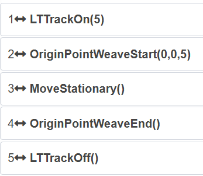

.. centered:: Figura 9.29-28 Programa Laser + Oscilação de ponto fixo 1
   
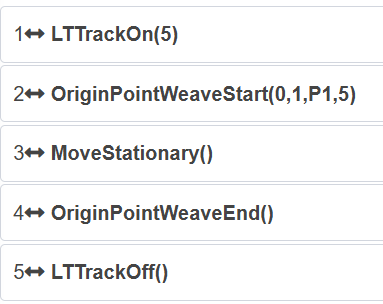

.. centered:: Figura 9.29-29 Programa Laser + Oscilação de ponto fixo 2

Procedimento Operacional para Laser + Eixo de Extensão + Oscilação de Ponto Fixo
****************************************************************************************

**Step1**: Configurar a comunicação do laser. Consulte o capítulo correspondente no manual do usuário para etapas operacionais específicas. Ao aplicar em cenários como soldagem real, preste atenção ao seguinte:

   - (1) O sensor laser linear deve ser equipado com dispositivos de proteção para evitar a influência de luz forte e respingos de solda;
   - (2) O ponto de reconhecimento da coleta de dados do laser linear deve manter uma certa distância do ponto de solda para reduzir o impacto da luz forte na qualidade da coleta de dados do laser durante a soldagem.

**Step2**: Configurar a comunicação do eixo de extensão. Consulte o capítulo correspondente no manual do usuário para etapas operacionais específicas.

**Step3**: Calibrar o sistema de coordenadas da ferramenta do robô e o sistema de coordenadas do laser. Consulte o capítulo correspondente no manual do usuário para etapas operacionais específicas.

**Step4**: Ajustar a posição da peça de trabalho e do feixe de laser. O esquema é mostrado na figura abaixo, onde o retângulo preto é a peça de trabalho e o segmento de linha vermelha é o feixe de laser. O feixe de laser deve ser perpendicular à borda da peça de trabalho a ser rastreada para garantir um bom desempenho de rastreamento.
   
.. image:: coding/563.png
   :width: 2in
   :align: center

.. centered:: Figura 9.29-30 Esquema da posição relativa da peça de trabalho e do feixe de laser

**Step5**: Configuração dos parâmetros de oscilação. Clique no botão "Programa de ensino" - "Programação" - "Oscilação", edite o número de oscilação para definir os parâmetros de oscilação. Nota: (1) A função Laser + Eixo de extensão + Oscilação de ponto fixo é eficaz apenas para os tipos "oscilação de onda triangular" e "oscilação de onda senoidal"; (2) Se o tempo real de oscilação de ponto fixo precisar ser consistente com o tempo de oscilação de ponto fixo definido, os tempos de permanência esquerda e direita não podem ser definidos; (3) Para garantir o desempenho do rastreamento a laser, os tempos de permanência esquerda e direita devem ser consistentes.
   
.. image:: coding/564.png
   :width: 3in
   :align: center

.. centered:: Figura 9.29-31 Configuração dos parâmetros de oscilação

**Step6**: Configuração dos parâmetros de oscilação de ponto fixo. Clique em "Programa de ensino" - "Programação" - "Oscilação" - "Início da oscilação de ponto fixo", defina a referência de oscilação e os parâmetros de tempo de oscilação, clique em "Adicionar", depois clique no botão "Fim da oscilação de ponto fixo" e clique em "Adicionar". A referência de oscilação pode ser selecionada entre dois tipos: "Sistema de coordenadas da ferramenta" e "Ponto de referência". Quando "Sistema de coordenadas da ferramenta" é selecionado como referência de oscilação, a direção X do sistema de coordenadas da ferramenta do ponto atual é usada como direção de avanço e a direção Y do sistema de coordenadas da ferramenta do ponto atual é usada como direção de oscilação. Quando "Ponto de referência" é selecionado como referência de oscilação, a linha entre o ponto atual e o ponto de referência é usada como direção de avanço, e a direção de oscilação é determinada pelo algoritmo de oscilação. Nota: O ponto de referência e a posição atual devem ter o mesmo sistema de coordenadas da ferramenta e o mesmo sistema de coordenadas da peça.
   
.. image:: coding/559.png
   :width: 2in
   :align: center

.. centered:: Figura 9.29-32 Referência de oscilação como "Sistema de coordenadas da ferramenta"
   
.. image:: coding/560.png
   :width: 2in
   :align: center

.. centered:: Figura 9.29-33 Referência de oscilação como "Ponto de referência"

**Step7**: Adicionar a instrução de movimento do eixo de extensão. Clique sequencialmente em "Programa de ensino" - "Programação" - "Eixo de extensão", depois clique em "Instrução de movimento", selecione "Assíncrono" como modo de movimento, selecione o ponto de início e o ponto de fim do movimento e clique no botão "Adicionar".
   
.. image:: coding/568.png
   :width: 4in
   :align: center

.. centered:: Figura 9.29-34 Adicionar movimento do eixo de extensão

**Step8**: Adicionar a instrução de rastreamento a laser. Clique sequencialmente em "Programa de ensino" - "Programação" - "Rastreamento a laser", depois clique em "Iniciar rastreamento" e selecione o sistema de coordenadas do laser calibrado no Step 3 (este manual usa toolcoord5 como exemplo) e, finalmente, clique em "Parar rastreamento".
   
.. image:: coding/565.png
   :width: 3in
   :align: center

.. centered:: Figura 9.29-35 Configuração do rastreamento a laser

**Step9**: Escrever o programa Lua para Laser + Eixo de extensão + Oscilação de ponto fixo. Ajuste a ordem das instruções geradas nos Step 5, Step 6 e Step 7. Os programas Lua gerados para as duas referências de oscilação de ponto fixo são mostrados respectivamente na Figura 3-7 e na Figura 3-8. O tempo de execução do programa está relacionado apenas ao tempo definido da oscilação de ponto fixo e é independente da velocidade da interface. Execute o programa Lua para realizar a função Laser + Eixo de extensão + Oscilação de ponto fixo.
   
.. image:: coding/569.png
   :width: 4in
   :align: center

.. centered:: Figura 9.29-36 Programa Laser + Eixo de extensão + Oscilação de ponto fixo 1
   
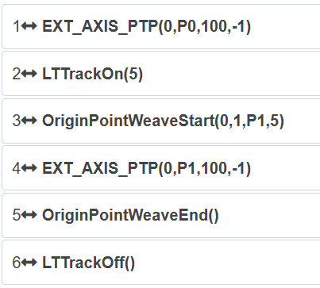

.. centered:: Figura 9.29-37 Programa Laser + Eixo de extensão + Oscilação de ponto fixo 2

Comunicação Modbus RTU do Robô
~~~~~~~~~~~~~~~~~~~~~~~~~~~~~~~~~~~~~~~~~~~~~~~~~~~~~~~

Visão Geral
++++++++++++++

O Modbus RTU é um protocolo de comunicação comumente usado na indústria. O robô colaborativo Fáor oferece duas formas de se comunicar com seus dispositivos: como Mestre Modbus RTU ou como Escravo Modbus RTU. O robô colaborativo suporta até 8 Mestres Modbus RTU simultaneamente para comunicação com dispositivos externos, cada mestre suportando até 128 registradores. O Escravo Modbus RTU do robô possui 64 bobinas, 64 entradas discretas, 32 registradores de retenção e 32 registradores de entrada (os registradores de retenção e entrada incluem os tipos com sinal e ponto flutuante).

Além disso, alguns endereços de registradores de entrada do Escravo Modbus RTU do robô são dedicados a feedback de informações como posições articulares e velocidades de movimento atuais do robô. Alguns endereços de registradores de bobina são dedicados a funções como iniciar o programa do robô, parar o programa e definir DOs do painel de controle. O Escravo Modbus RTU do robô suporta o estabelecimento de conexão com apenas um mestre. Abaixo estão as instruções detalhadas de uso.

Instruções de Operação para o Mestre Modbus RTU do Robô
++++++++++++++++++++++++++++++++++++++++++++++++++++++++++++++++++++++

Antes de usar o robô colaborativo como Mestre Modbus RTU para se comunicar com seu dispositivo, verifique primeiro a conexão física 485 entre seu dispositivo e o robô. O uso do Mestre Modbus RTU do robô envolve as seguintes etapas: ① Adicionar um mestre; ② Adicionar registradores; ③ Teste de comunicação; ④ Escrever um programa de usuário; ⑤ Executar o programa de usuário.

Adicionar Mestre Modbus RTU
*******************************************
Abra o WebApp, clique sequencialmente em "Simulação de Ensino", "Programa de Ensino" e crie um novo programa de usuário "testModbusRTUMaster.lua".
   
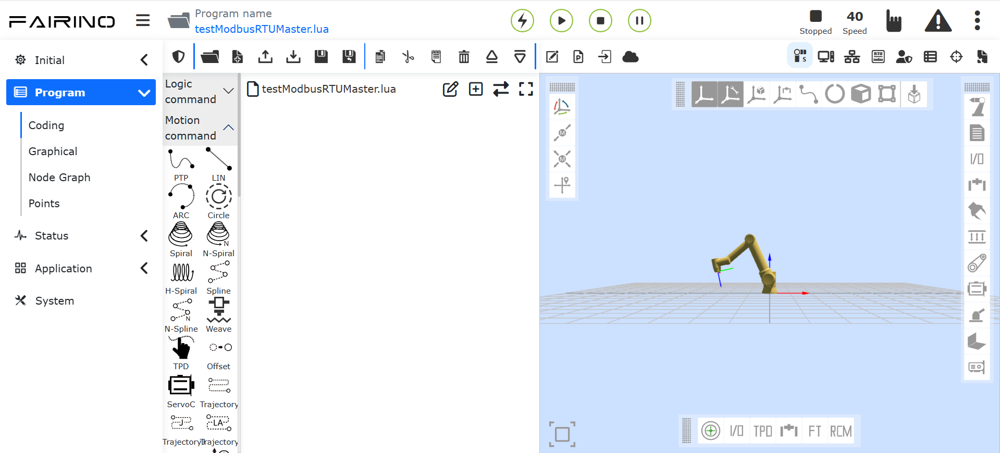

.. centered:: Figura 9.30-1 Criar Programa de Usuário do Mestre Modbus RTU

Clique no botão "Configuração Modbus RTU" para abrir a página de configuração da função Modbus RTU.
   
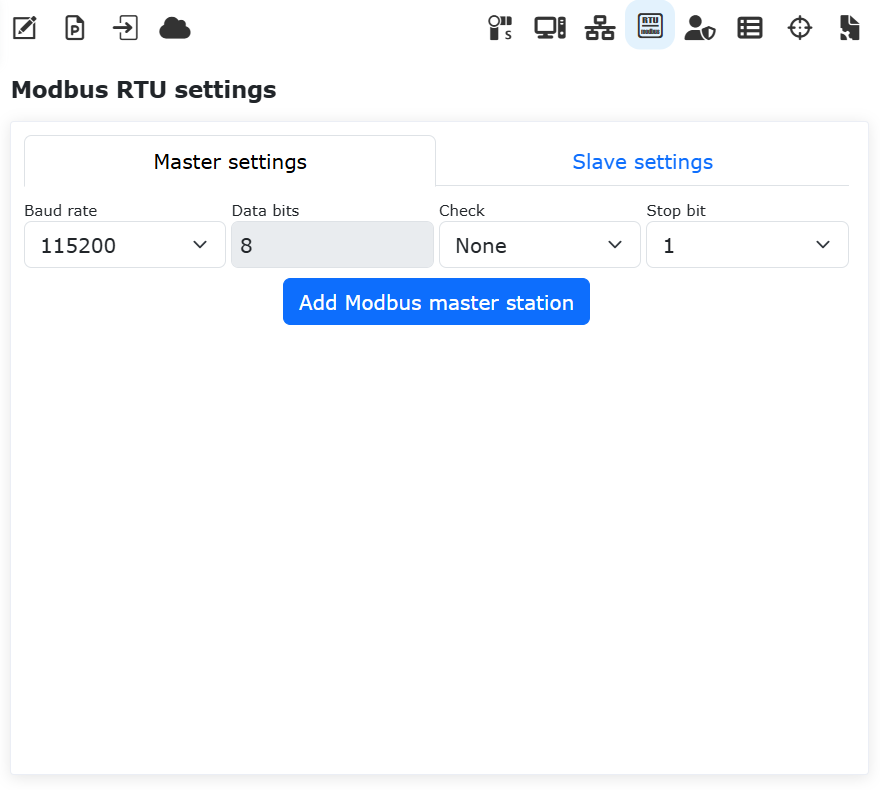

.. centered:: Figura 9.30-2 Abrir Configuração Modbus RTU

Clique sequencialmente em "Configuração do Mestre" e "Adicionar Mestre Modbus" para concluir a adição de um Mestre Modbus RTU.
   
.. image:: coding/342.png
   :width: 4in
   :align: center

.. centered:: Figura 9.30-3 Adicionar "Mestre Modbus RTU"

Selecione sequencialmente "Taxa de Transmissão", "Bits de Dados", "Paridade" e "Bits de Parada" de acordo com a situação do seu dispositivo escravo. O significado específico dos parâmetros acima é o seguinte:

**Taxa de Transmissão**: Taxa de transmissão usada para comunicação Modbus RTU. Suporta: 9600, 14400, 19200, 38400, 56000, 67600, 115200, 128000. O padrão é 115200. Defina para coincidir com o escravo.

**Bits de Dados**: Atualmente suporta apenas 8 bits. Defina para coincidir com o escravo.

**Paridade**: Método de paridade. Suporta None, Odd, Even. O padrão é None. Defina para coincidir com o escravo.

**Bits de Parada**: Suporta 0.5, 1, 1.5, 2. O padrão é 1. Defina para coincidir com o escravo.
   
.. image:: coding/343.png
   :width: 4in
   :align: center

.. centered:: Figura 9.30-4 Configurar Parâmetros do Mestre Modbus RTU

Após inserir os parâmetros corretamente, o Mestre Modbus RTU do robô pode se comunicar com o escravo. (Se você confirmou que os parâmetros relevantes do Mestre Modbus RTU estão configurados corretamente, mas o robô se comunicou com sucesso com seu dispositivo, verifique as seguintes configurações:

① A conexão física 485 entre o robô e o dispositivo escravo. ② Verifique a configuração de comunicação do dispositivo escravo. Recomenda-se usar um assistente de depuração serial para testar se o link de comunicação está correto. Por exemplo, configure parâmetros Modbus RTU no PC consistentes com os do robô. Crie um novo registrador na interface web do robô e execute uma operação de leitura de registrador de retenção 0x03. Verifique se o assistente de depuração serial pode receber dados. Conforme mostrado abaixo, lendo o registrador no endereço 0x1000 com o comando 0x03, o PC pode receber os dados normalmente, indicando que a configuração da comunicação está correta.
   
.. image:: coding/344.png
   :width: 4in
   :align: center

.. centered:: Figura 9.30-5 Verificar o Status da Conexão Modbus

Aqui concluímos a criação de um Mestre Modbus RTU do robô. Se você clicar novamente em "Adicionar Mestre Modbus", poderá criar outro novo Mestre Modbus RTU (Figura 2-6). O robô suporta até 8 mestres simultâneos para comunicação com dispositivos externos. Clique duas vezes no botão "Excluir" no canto superior direito do mestre Modbus para excluí-lo.
   
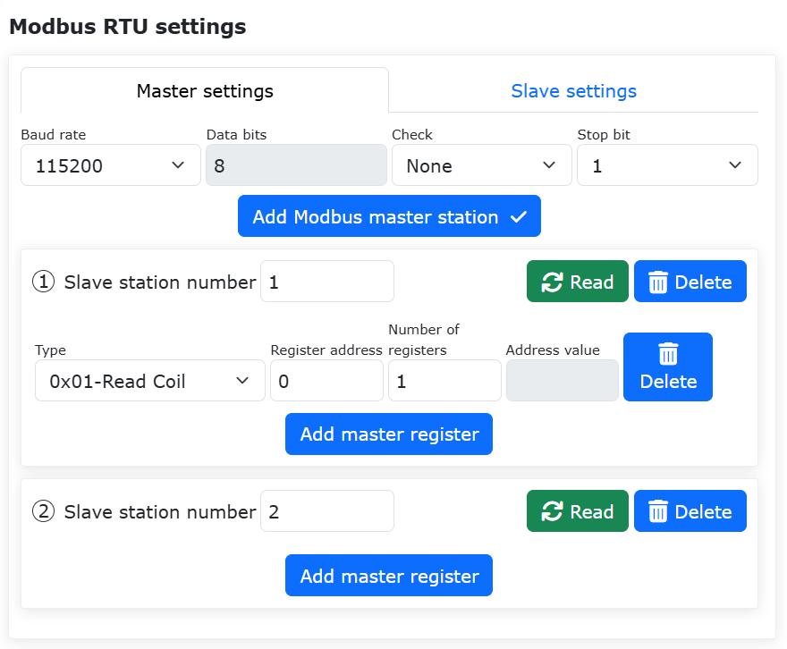

.. centered:: Figura 9.30-6 Adicionar Outro Mestre Modbus RTU

Adicionar Registradores ao Mestre Modbus RTU
*****************************************************

Clique no botão "Adicionar Registrador do Mestre" para adicionar um registrador a este mestre.
   
.. image:: coding/346.png
   :width: 4in
   :align: center

.. centered:: Figura 9.30-7 Adicionar Registrador ao Mestre Modbus RTU

Selecione sequencialmente o tipo de registrador do mestre, insira o número do endereço e o nome. O significado de cada parâmetro é o seguinte:

**Tipo**: Código de função Modbus. 0x01 - Ler bobina; 0x02 - Ler entrada discreta; 0x03 - Ler registrador de retenção (tipo com sinal -32768-32767); 0x03 - Ler registrador de retenção (tipo ponto flutuante, dados de 32 bits, ocupam dois registradores, 4 bytes); 0x04 - Ler registrador de entrada (tipo com sinal -32768-32767); 0x04 - Ler registrador de entrada (tipo ponto flutuante, dados de 32 bits, ocupam dois registradores, 4 bytes); 0x05 - Escrever bobina única; 0x06 - Escrever registrador de retenção único; 0x0F - Escrever múltiplas bobinas; 0x10 - Escrever múltiplos registradores de retenção. Registradores de ponto flutuante de leitura/escrita são exibidos no formato big-endian.

**Endereço do Registrador**: Endereço do registrador do escravo Modbus RTU a ser lido ou escrito.

**Número de Registradores**: Número de registradores a serem operados ao ler ou escrever múltiplos registradores (para 0x05, 0x06, o número só pode ser 1). Suporta no máximo 12 operações de registrador.

**Valor do Endereço**: Valor exibido para leitura ou valor a ser escrito (ao escrever múltiplos valores, separe por vírgulas em inglês ",").
   
.. image:: coding/347.png
   :width: 4in
   :align: center

.. centered:: Figura 9.30-8 Configurar Parâmetros do Registrador do Mestre Modbus RTU

Clique novamente no botão "Adicionar Registrador do Mestre" para adicionar outro registrador. Clique duas vezes no botão "Excluir" no lado direito do registrador para excluí-lo. A figura abaixo mostra registradores para os códigos de função suportados.
   
.. image:: coding/348.png
   :width: 4in
   :align: center

.. centered:: Figura 9.30-9 Adicionar Múltiplos Registradores do Mestre

Teste de Comunicação do Mestre Modbus RTU
**********************************************************

Os registradores do Mestre Modbus do robô têm uma caixa de valor "Valor do Endereço" para exibir o valor atual do registrador. Registradores dos tipos 0x01, 0x02, 0x03, 0x04 são somente leitura, então suas caixas de valor de endereço são cinzas e não editáveis. Quando o valor no endereço correspondente do escravo muda, o valor do endereço do registrador correspondente do mestre do robô pode ser lido clicando no botão "Ler" e exibido simultaneamente. Os códigos de função 0x05, 0x06, 0x0F, 0x10 são para operações de escrita. Suas caixas de endereço são brancas e editáveis. O valor do registrador pode ser modificado na página de configuração do Mestre Modbus do robô.
   
.. image:: coding/349.png
   :width: 4in
   :align: center

.. centered:: Figura 9.30-10 Valores de Endereço do Mestre Modbus

Teste de Leitura do Registrador do Mestre
""""""""""""""""""""""""""""""""""""""""""""""""""""""""""""
No dispositivo escravo Modbus RTU externo, leia continuamente 10 bobinas do endereço 0x4000, leia continuamente 12 entradas discretas do endereço 0x3000, leia continuamente 2 registradores de retenção do endereço 0x2010 usando int16, e leia um número de ponto flutuante do registrador de entrada no endereço 0x1029. Neste momento, os valores de endereço dos registradores correspondentes na página de configuração do Mestre Modbus do robô serão exibidos de acordo. Os quadros de dados enviados são mostrados abaixo (como o método de leitura do registrador no endereço 0x1029 é definido como ponto flutuante, ele lê dois registradores de 16 bits (0x1029 e 0x102A) para armazenar um número de ponto flutuante, mas o número de leitura pode ser definido como 1).
   
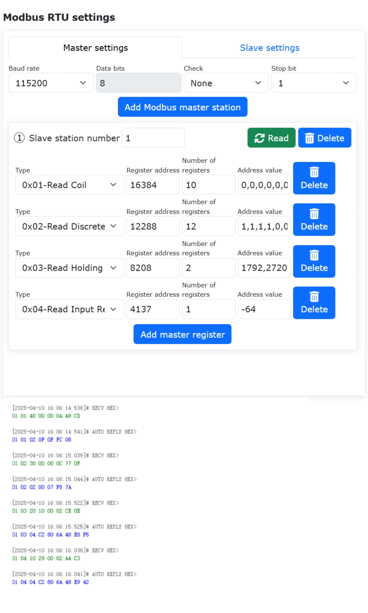

.. centered:: Figura 9.30-11 Mestre Modbus Exibindo Valores Lidos dos Registradores (Captura de Tela do Quadro de Comando)

Teste de Escrita do Registrador do Mestre
""""""""""""""""""""""""""""""""""""""""""""""""""""""""""""

Na página de configuração do Mestre Modbus RTU do robô, escreva uma bobina única no endereço 0x1000 com o valor 1. Escreva um registrador único no endereço 0x1001 com o valor 2001. Escreva 5 bobinas no endereço 0x2000 com os valores 1,1,0,1,1. Escreva 2 registradores de retenção no endereço 0x2010 com tipo de dado int16 e valores 3001, 3002. Escreva um registrador de retenção de ponto flutuante (na verdade dois registradores de 16 bits) no endereço 0x1029 com o valor 21.55. Os endereços de registrador correspondentes do escravo Modbus terão seus valores escritos.
   
.. image:: coding/351.png
   :width: 4in
   :align: center

.. centered:: Figura 9.30-12 Operações de Escrita do Mestre Modbus RTU (Captura de Tela do Quadro de Comando)

Escrever Programa do Mestre Modbus RTU
************************************************

Abra a página de adição de instruções de comunicação.
   
.. image:: coding/352.png
   :width: 4in
   :align: center

.. centered:: Figura 9.30-13 Abrir Página de Adição de Instruções de Comunicação

Clique em "Modbus".
   
.. image:: coding/353.png
   :width: 4in
   :align: center

.. centered:: Figura 9.30-14 Selecionar Modbus

Clique em "Modbus_RTU", selecione "Mestre (Cliente)" para abrir a página de adição de instruções do Mestre Modbus RTU.
   
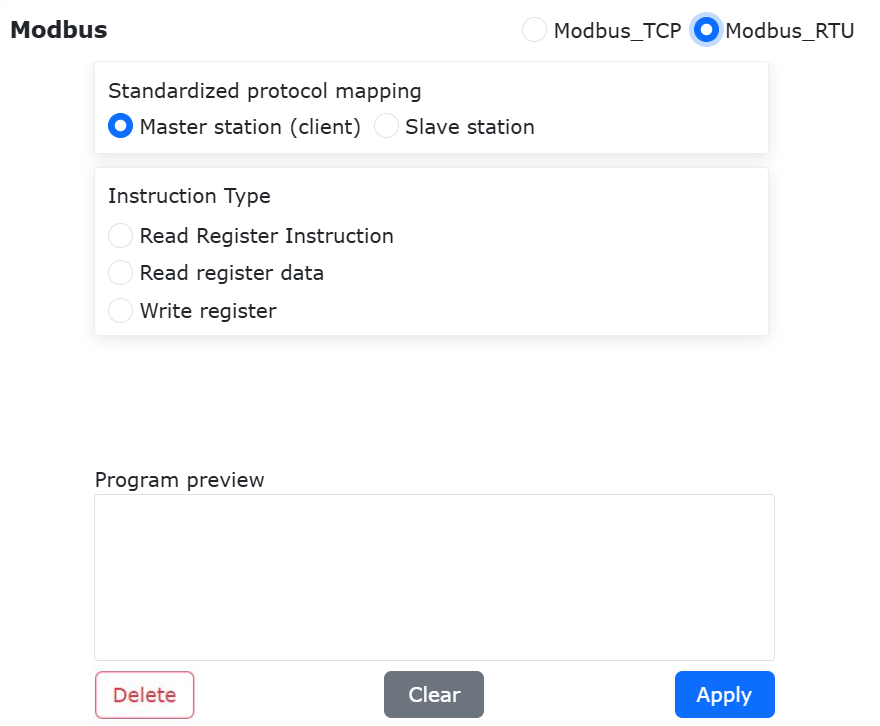

.. centered:: Figura 9.30-15 Selecionar Modbus_RTU

Escrever Bobina Única
""""""""""""""""""""""""""""

Selecione "Escrever Registrador". Código de função 0x05 - Bobina Única. Endereço do registrador/bobina é 0x1000. O valor do registrador/número de bobinas é 1. O array de bytes é {1}. Clique no botão "Adicionar". Finalmente, role até a parte inferior da página e clique no botão "Aplicar" (Figura 2-16).
   
.. image:: coding/355.png
   :width: 4in
   :align: center

.. centered:: Figura 9.30-16 Escrever Bobina Única

Uma instrução para o Mestre Modbus do robô escrever uma única saída digital foi adicionada ao programa "testModbusRTUSlave.lua". Alterne o robô para o modo automático e clique no botão iniciar. O robô escreverá o valor 1 no endereço do registrador de bobina 0x1000 correspondente ao mestre.
   
.. image:: coding/356.png
   :width: 6in
   :align: center

.. centered:: Figura 9.30-17 Programa Lua para Escrita de Bobina Única

Escrever Múltiplas Bobinas
""""""""""""""""""""""""""""""""""""""""
Selecione "Escrever Registrador". Código de função 0x0F - Múltiplas Bobinas. Endereço do registrador/bobina é 0x1010. O valor do registrador/número de bobinas é 3. O array de bytes é {1,0,1}. Clique no botão "Adicionar". Finalmente, role até a parte inferior da página e clique no botão "Aplicar" (Figura 2-18).
   
.. image:: coding/357.png
   :width: 4in
   :align: center

.. centered:: Figura 9.30-18 Escrever Múltiplas Bobinas

Uma instrução para o Mestre Modbus do robô escrever uma única saída digital foi adicionada ao programa "testModbusRTUSlave.lua". Alterne o robô para o modo automático e clique no botão iniciar. O robô escreverá o valor 1 no endereço do registrador de bobina 0x1000 correspondente ao mestre.
   
.. image:: coding/358.png
   :width: 4in
   :align: center

.. centered:: Figura 9.30-19 Programa Lua para Escrita de Múltiplas Bobinas

Ler Bobinas, Entradas Discretas
"""""""""""""""""""""""""""""""""""""""""""

Selecione "Instrução de Leitura de Registrador". Código de função 0x01 - Bobina (se precisar ler entrada discreta, selecione 0x02 - Entrada Discreta). Endereço do registrador/bobina é 0x2000. O número de registradores/bobinas é 3. Clique no botão "Adicionar". Simultaneamente, selecione "Dados de Leitura de Registrador". O número de registradores/bobinas/entradas discretas é 3. Clique no botão "Adicionar". Finalmente, role até a parte inferior da página e clique no botão "Aplicar" (Figura 2-20).
   
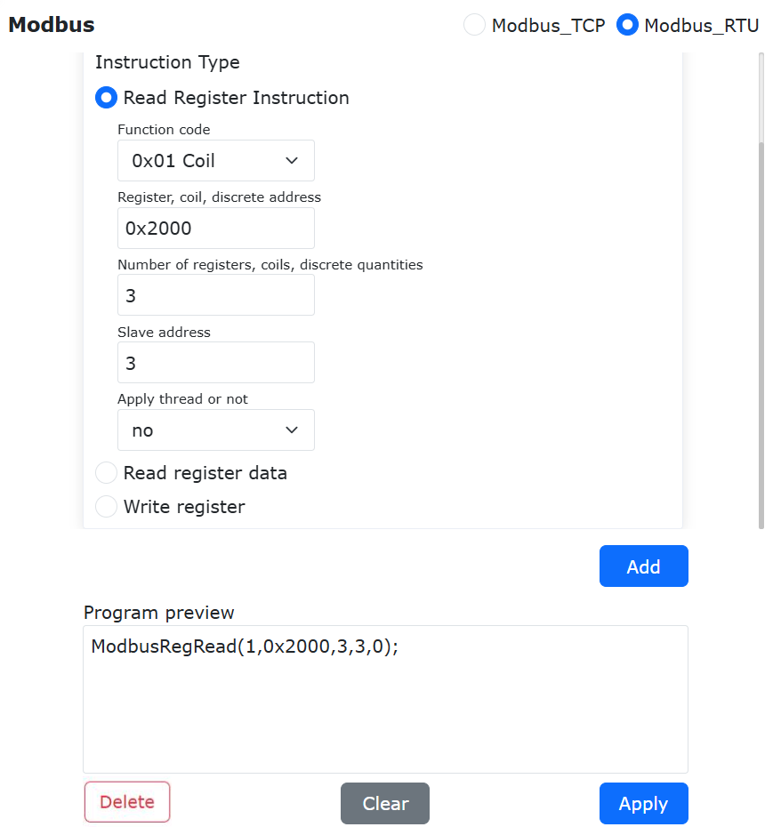
   
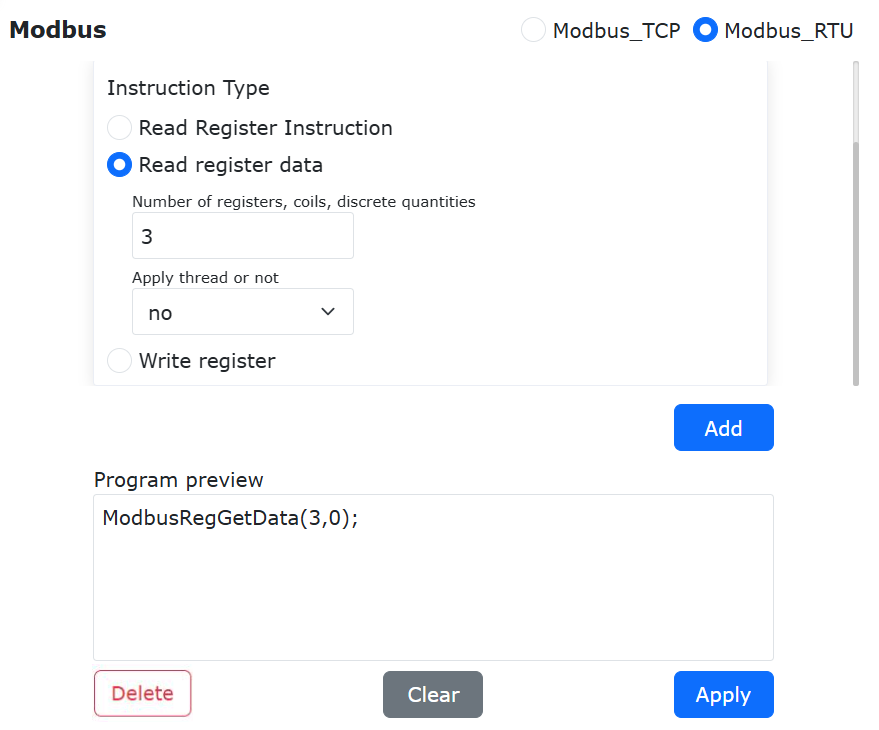

.. centered:: Figura 9.30-20 Ler Bobinas

Duas instruções para o Mestre Modbus do robô ler bobinas foram adicionadas ao programa "testModbusRTUSlave.lua".
   
.. image:: coding/360.png
   :width: 6in
   :align: center

.. centered:: Figura 9.30-21 Programa para Ler Bobina Única

Normalmente, após ler um registrador Modbus, o valor lido é armazenado em uma variável. Portanto, é necessário definir uma variável para armazenar o valor lido. Clique no botão "Alternar Modo" para alternar o programa Lua do robô para o estado editável. Antes da instrução "ModbusRegRead", escreva as variáveis de retorno "value1", "value2", "value3". Após a execução do programa, os valores lidos serão armazenados em "value1", "value2", "value3".
   
.. image:: coding/361.png
   :width: 6in
   :align: center

.. centered:: Figura 9.30-22 Ler Múltiplos Valores de Bobina e Armazenar em Variáveis

Os valores dos registradores do tipo bobina e entrada discreta são apenas 0 e 1. No programa do robô, diferentes operações podem ser realizadas julgando valores diferentes do registrador.

Ler Registradores de Retenção, Registradores de Entrada
""""""""""""""""""""""""""""""""""""""""""""""""""""""""""""""""""""""""
Selecione "Instrução de Leitura de Registrador". Código de função 0x03 - Bobina (se precisar ler registrador de entrada, selecione 0x04 - Registrador de Entrada). Endereço do registrador/bobina é 0x4000. O número de registradores/bobinas é 5. Clique no botão "Adicionar". Simultaneamente, selecione "Dados de Leitura de Registrador". O número de registradores/bobinas/entradas discretas é 5. Clique no botão "Adicionar". Finalmente, role até a parte inferior da página e clique no botão "Aplicar" (Figura 2-23).
   
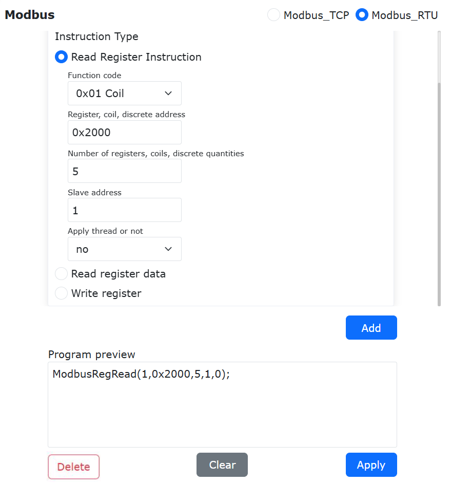
   
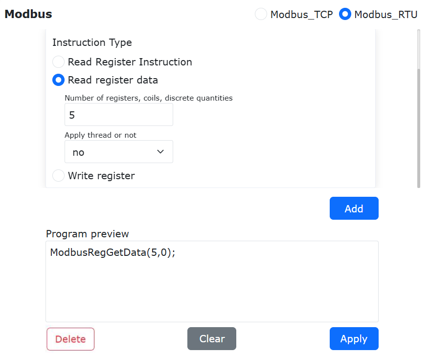

.. centered:: Figura 9.30-23 Ler Registradores de Retenção

Duas instruções para o Mestre Modbus do robô ler bobinas foram adicionadas ao programa "testModbusRTUSlave.lua".
   
.. image:: coding/363.png
   :width: 4in
   :align: center

.. centered:: Figura 9.30-24 Programa para Ler Bobina Única

Normalmente, após ler um registrador Modbus, o valor lido é armazenado em uma variável. Portanto, é necessário definir variáveis para armazenar os valores lidos. Clique no botão "Alternar Modo" para alternar o programa Lua do robô para o estado editável. Antes da instrução "ModbusRegRead", escreva as variáveis de retorno "value1", "value2", "value3", "value4", "value5". Após a execução do programa, os valores lidos serão armazenados em "value1", "value2", "value3", "value4", "value5".
   
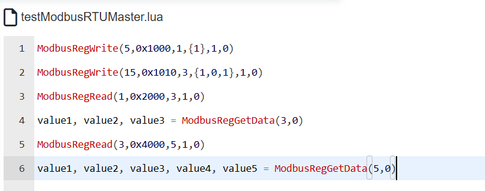

.. centered:: Figura 9.30-25 Ler Múltiplos Valores de Registrador de Retenção e Armazenar em Variáveis

Instruções de Operação para o Escravo Modbus RTU do Robô
+++++++++++++++++++++++++++++++++++++++++++++++++++++++++++++++

O Escravo Modbus RTU do robô fornece quatro tipos de registradores: Entrada Digital (bobina), Saída Digital (entrada discreta), Entrada Analógica (registrador de retenção) e Saída Analógica (registrador de entrada). As entradas digitais e analógicas são usadas principalmente para o robô ler dados do dispositivo mestre Modbus RTU externo para controlar as operações do robô, enquanto as saídas digitais e analógicas são usadas principalmente para o robô enviar sinais de dados para o dispositivo mestre Modbus RTU externo. O dispositivo mestre externo lê os valores dos registradores relevantes para controlar a operação de seu equipamento.

Além das entradas/saídas gerais mencionadas, o robô também fornece algumas "Entradas Digitais de Função (bobinas)" para o dispositivo mestre externo controlar operações do robô, como iniciar e parar programas. Ele também fornece alguns registradores de entrada para exibir informações de estado atuais do robô, incluindo posição cartesiana atual, estado de operação atual do robô, etc. (consulte o Anexo 1: Mapa de Endereços do Escravo Modbus RTU para definições específicas). O processo de uso do Escravo Modbus RTU do robô inclui principalmente: ① Configuração de parâmetros; ② Teste de comunicação; ③ Programação.

Configuração dos Parâmetros de Comunicação do Escravo Modbus RTU
************************************************************************

Abra o WebApp, clique sequencialmente em "Simulação de Ensino", "Programa de Ensino" e crie um novo programa de usuário "testModbusRTUSlave.lua".
   
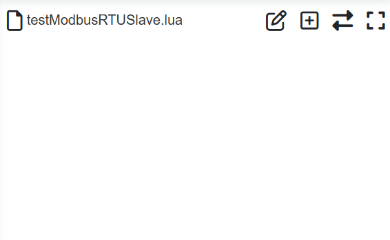

.. centered:: Figura 9.30-26 Criar Programa de Usuário do Escravo Modbus RTU

Clique no botão "Configuração Modbus RTU" para abrir a página de configuração da função Modbus RTU.
   
.. image:: coding/366.png
   :width: 6in
   :align: center

.. centered:: Figura 9.30-27 Abrir Configuração Modbus RTU

Clique sequencialmente em "Configuração do Escravo". Insira a taxa de transmissão, bits de dados, paridade, bits de parada e número do escravo do robô. "Taxa de Transmissão", "Bits de Dados", "Paridade", "Bits de Parada" são os parâmetros de configuração do robô como Escravo Modbus RTU. "Número do Escravo" é o número do dispositivo escravo para os comandos enviados pelo mestre externo.
   
.. image:: coding/367.png
   :width: 4in
   :align: center

.. centered:: Figura 9.30-28 Configuração do Escravo Modbus RTU

Teste de Comunicação do Escravo Modbus RTU
*************************************************

Entrada Digital Geral (Bobina)
""""""""""""""""""""""""""""""""""""""""""""""
O Escravo Modbus RTU do robô fornece 64 registradores de bobina, com endereços de registrador de 0x4000 a 0x403F (consulte o Anexo 1: Mapa de Endereços do Escravo Modbus RTU para definições específicas). Os registradores gerais do Escravo Modbus RTU do robô podem receber apelidos. Modifique o nome do registrador de bobina DI0 do escravo do robô para "A em Posição" e DI1 para "B em Posição". De acordo com o mapa de endereços, os endereços Modbus da bobina para "A em Posição" e "B em Posição" são 0x4000 e 0x4001, respectivamente. No dispositivo mestre Modbus RTU externo, defina ambos os endereços de bobina 0x4000 e 0x4001 do escravo do robô como 1. Neste momento, as luzes indicadoras dos dois registradores na página de monitoramento do Escravo Modbus RTU do robô acenderão.
   
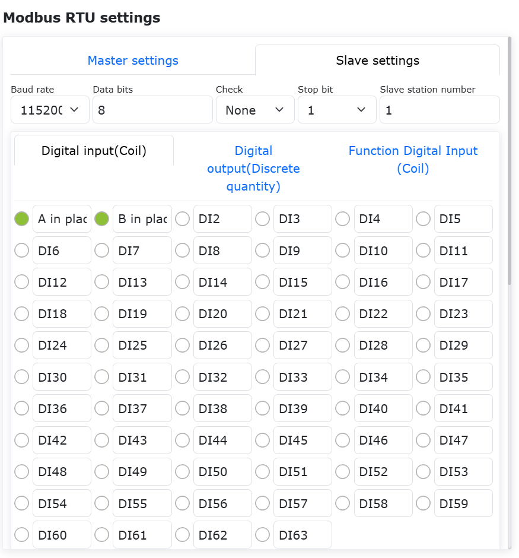

.. centered:: Figura 9.30-29 Monitoramento do Estado da Bobina do Escravo Modbus RTU (Captura de Tela do Quadro de Comando)

Saída Digital Geral (Entrada Discreta)
""""""""""""""""""""""""""""""""""""""""""""""

O Escravo Modbus RTU do robô fornece 64 registradores de entrada discreta, com endereços de registrador de 0x3000 a 0x303F (consulte o Anexo 1: Mapa de Endereços do Escravo Modbus RTU para definições específicas). Os registradores de entrada discreta do Escravo Modbus RTU do robô também podem receber apelidos. Clique em "Saída Digital Geral (Entrada Discreta)" para modificar o nome do registrador de entrada discreta DO0 do escravo do robô para "A Iniciar" e DO1 para "B Iniciar". De acordo com o mapa de endereços, os endereços Modbus de entrada discreta para "A Iniciar" e "B Iniciar" são 0x3000 e 0x3001, respectivamente. Clique na luz indicadora de entrada discreta correspondente a "A Iniciar". A luz acenderá, o valor do endereço do registrador 0x3000 se tornará 1, e o dispositivo mestre Modbus RTU externo poderá ler este valor de registrador.
   
.. image:: coding/369.png
   :width: 4in
   :align: center

.. centered:: Figura 9.30-30 Controle de Entrada Discreta do Escravo Modbus RTU

Entrada Analógica (Registrador de Retenção)
"""""""""""""""""""""""""""""""""""""""""""""""""""
O robô fornece 32 registradores de retenção de três tipos: sem sinal, com sinal e ponto flutuante. Os endereços de AI0 a AI32 são de 0x2000 a 0x202F (consulte o Anexo 1: Mapa de Endereços do Escravo Modbus RTU para definições específicas). O intervalo de dados para registradores com sinal é -32768-32767. Registradores de ponto flutuante são exibidos no formato big-endian. Altere os nomes de AI0 e AI1 para "Tensão" e "Corrente". De acordo com o mapa de endereços do Escravo Modbus RTU, os endereços dos dois registradores são 0x2000 e 0x2001, respectivamente. Portanto, quando o dispositivo mestre conectado modifica os valores dos endereços dos registradores de retenção 0x2000 e 0x2001, os valores dos endereços dos registradores "Tensão" e "Corrente" na página de monitoramento do Escravo Modbus RTU do robô são atualizados simultaneamente. A entrada analógica do robô é usada principalmente para o robô obter valores de sinais de dispositivos mestre externos.
   
.. image:: coding/370.png
   :width: 4in
   :align: center

.. centered:: Figura 9.30-31 Monitoramento da Entrada Analógica do Escravo Modbus RTU (Captura de Tela do Quadro de Comando)

Saída Analógica (Registrador de Entrada)
""""""""""""""""""""""""""""""""""""""""
O robô fornece 64 registradores de entrada de três tipos: sem sinal, com sinal e ponto flutuante. Os endereços de AO0 a AO63 são 0x1000-0x100F, 0x104D-0x106C (consulte o Anexo 1: Mapa de Endereços do Escravo Modbus RTU para definições específicas). O intervalo de dados para registradores com sinal é -32768-32767. Registradores de ponto flutuante são exibidos no formato big-endian. Altere os nomes de AO0 e AO1 para "Posição Alvo A" e "Posição Alvo B". Defina os valores dos registradores de entrada como 2000 e 1500, respectivamente. De acordo com o mapa de endereços do Escravo Modbus RTU, os endereços dos dois registradores são 0x1000 e 0x1001, respectivamente. Portanto, quando o dispositivo mestre conectado lê os valores dos endereços dos registradores de entrada 0x1000 e 0x1001, ele obtém os valores definidos. A saída analógica do escravo do robô é usada principalmente para o robô transmitir valores de sinais para o dispositivo mestre externo.
   
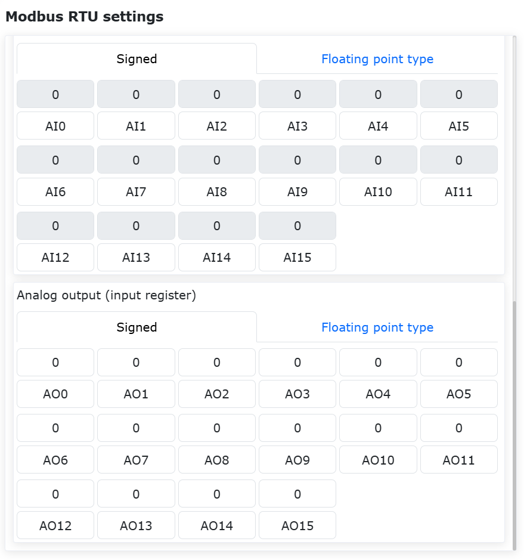

.. centered:: Figura 9.30-32 Escravo Modbus Modificando a Entrada Analógica

Programação do Escravo Modbus RTU
**************************************************

Abra a página de adição de instruções de comunicação.
   
.. image:: coding/372.png
   :width: 4in
   :align: center

.. centered:: Figura 9.30-33 Abrir Página de Adição de Instruções de Comunicação

Clique em "Modbus".
   
.. image:: coding/373.png
   :width: 6in
   :align: center

.. centered:: Figura 9.30-34 Selecionar Modbus

Clique em "Modbus_RTU", selecione "Escravo" para abrir a página de adição de instruções do Escravo Modbus RTU.
   
.. image:: coding/374.png
   :width: 4in
   :align: center

.. centered:: Figura 9.30-35 Selecionar Modbus_RTU, Escravo

Escrever Saída Digital Única DO (Entrada Discreta)
""""""""""""""""""""""""""""""""""""""""""""""""""""""""

Selecione o nome DO como "A Iniciar". O número de registradores é 1. O valor do registrador é 0. Clique em "Escrever Saída Digital Única". Finalmente, role até a parte inferior da página e clique no botão "Aplicar".
   
.. image:: coding/375.png
   :width: 4in
   :align: center

.. centered:: Figura 9.30-36 Adicionar Instrução para Escrever Saída Digital Única

Uma instrução para o Escravo Modbus do robô escrever uma única saída digital foi adicionada ao programa "testModbusRTUSlave.lua". Alterne o robô para o modo automático e clique no botão iniciar. O robô escreverá o valor 0 no endereço da saída digital correspondente ao nome "A Iniciar".
   
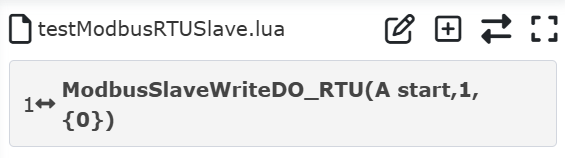

.. centered:: Figura 9.30-37 Programa Lua para Escrita de Saída Digital Única

Escrever Múltiplas Saídas Digitais DO (Entrada Discreta)
""""""""""""""""""""""""""""""""""""""""""""""""""""""""

Abra a página de adição de instruções do Escravo Modbus RTU. Encontre "Configuração de Saída Digital". Selecione o nome DO como "A Iniciar". O número de registradores é 5. O valor do registrador é 1,0,1,0,1. O número de valores do registrador deve corresponder ao número definido de registradores, e vários valores devem ser separados por vírgulas em inglês. Clique em "Escrever Saída Digital". Finalmente, role até a parte inferior da página e clique no botão "Aplicar".
   
.. image:: coding/377.png
   :width: 4in
   :align: center

.. centered:: Figura 9.30-38 Configurar Escrita de Múltiplas Saídas Digitais

Uma instrução para o Escravo Modbus do robô escrever múltiplas saídas digitais foi adicionada ao programa "testModbusRTUSlave.lua". Alterne o robô para o modo automático e clique no botão iniciar. O robô escreverá os valores 1, 0, 1, 0, 1 nos registradores de entrada discreta "A Iniciar" e nos 4 registradores seguintes.
   
.. image:: coding/378.png
   :width: 6in
   :align: center

.. centered:: Figura 9.30-39 Programa Lua para Escrita de Múltiplas Saídas Digitais

Ler Saída Digital Única DO (Entrada Discreta)
""""""""""""""""""""""""""""""""""""""""""""""

Abra a página de adição de instruções do Mestre Modbus RTU. Encontre "Configuração de Saída Digital". O nome DO é "A Iniciar". O número de registradores é 1. O valor do registrador não precisa ser preenchido. Clique em "Ler Saída Digital". Finalmente, role até a parte inferior da página e clique no botão "Aplicar".
   
.. image:: coding/379.png
   :width: 4in
   :align: center

.. centered:: Figura 9.30-40 Configurar Leitura de Saída Digital Única

Uma instrução para o Escravo Modbus do robô ler uma única saída digital foi adicionada ao programa "testModbusRTUSlave.lua".
   
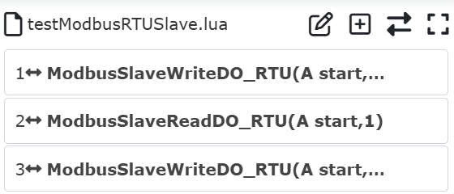

.. centered:: Figura 9.30-41 Programa para Ler Saída Digital Única

Normalmente, após ler um registrador Modbus, o valor lido é armazenado em uma variável. Portanto, é necessário definir uma variável para armazenar o valor lido. Clique no botão "Alternar Modo" para alternar o programa Lua do robô para o estado editável. Antes da instrução "ModbusSlaveReadDO_RTU", escreva uma variável de retorno "AStartValue". Após a execução do programa, o valor lido será armazenado em "AStartValue".
   
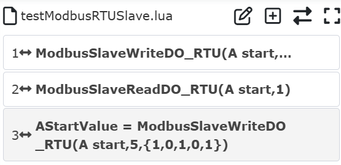

.. centered:: Figura 9.30-42 Ler Saída Digital Única e Armazenar em Variável

Os valores dos registradores do tipo bobina são apenas 0 e 1. No programa do robô, diferentes operações podem ser realizadas julgando valores diferentes do registrador.

Ler Múltiplas Saídas Digitais DO (Entrada Discreta)
"""""""""""""""""""""""""""""""""""""""""""""""""""""""""""

Abra a página de adição de instruções do Mestre Modbus RTU. Encontre "Configuração de Saída Digital". Selecione o nome DO como "A Iniciar". O número de registradores é 2. O valor do registrador não precisa ser preenchido. Clique em "Ler Saída Digital". Finalmente, role até a parte inferior da página e clique no botão "Aplicar".
   
.. image:: coding/382.png
   :width: 4in
   :align: center

.. centered:: Figura 9.30-43 Configurar Leitura de Múltiplas Saídas Digitais

Uma instrução para o Escravo Modbus do robô ler múltiplas saídas digitais foi adicionada ao programa "testModbusRTUSlave.lua".
   
.. image:: coding/383.png
   :width: 4in
   :align: center

.. centered:: Figura 9.30-44 Programa para Ler Múltiplas Saídas Digitais

Clique no botão "Alternar Modo" para alternar o programa Lua do robô para o estado editável. Como o número de leitura é 2, antes da instrução "ModbusSlaveReadDO_RTU", escreva 2 variáveis de retorno "value1,value2". Após a execução do programa, os valores dos 2 registradores de saída digital lidos serão armazenados nas 2 variáveis acima. Da mesma forma, você pode julgar os valores de "value1" e "value2" para fazer o robô realizar diferentes ações.
   
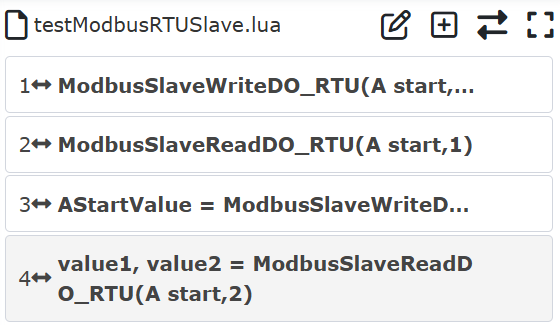

.. centered:: Figura 9.30-45 Ler Múltiplas Saídas Digitais e Armazenar em Variáveis

Ler Entrada Digital DI (Bobina)
"""""""""""""""""""""""""""""""""""""""""""

Abra a página de adição de instruções do Escravo Modbus RTU. Encontre "Configuração de Entrada Digital". Selecione o nome DI como "A em Posição". O número de registradores é 2. Clique em "Ler Entrada Digital". Finalmente, role até a parte inferior da página e clique no botão "Aplicar".
   
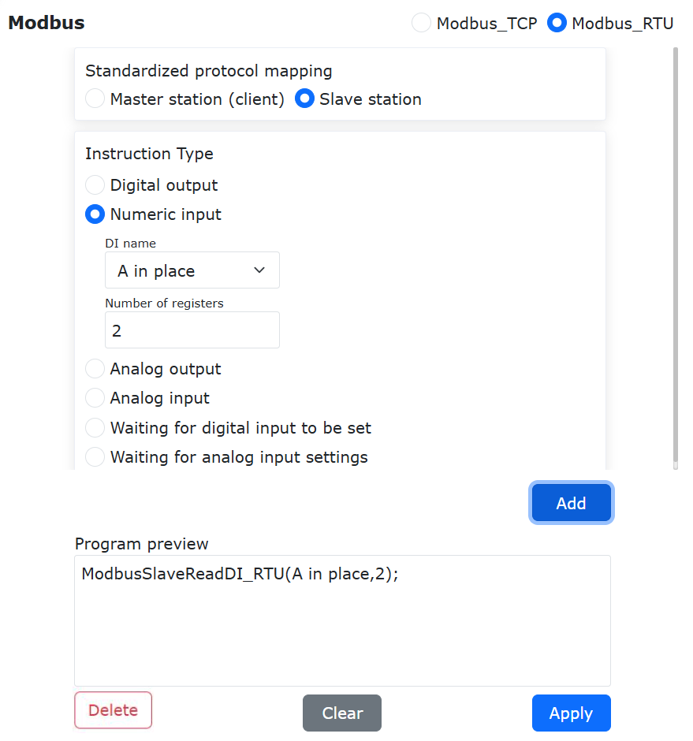

.. centered:: Figura 9.30-46 Configurar Leitura de Entrada Digital

Uma instrução para o Escravo Modbus do robô ler entrada digital foi adicionada ao programa "testModbusRTUSlave.lua".
   
.. image:: coding/386.png
   :width: 4in
   :align: center

.. centered:: Figura 9.30-47 Instrução do Programa para Ler Entrada Digital

Clique no botão "Alternar Modo" para alternar o programa Lua do robô para o estado editável. Antes da instrução "ModbusSlaveReadDI_RTU", escreva as variáveis de retorno "AState,BState". Após a execução do programa, os valores das duas entradas digitais lidas serão armazenados nas variáveis "AState" e "BState". Você pode julgar os valores das variáveis para controlar o robô a realizar diferentes operações.
   
.. image:: coding/387.png
   :width: 4in
   :align: center

.. centered:: Figura 9.30-48 Programa para Ler Entrada Digital

Operações de Leitura e Escrita para AO (Registrador de Entrada) e AI (Registrador de Retenção)
""""""""""""""""""""""""""""""""""""""""""""""""""""""""""""""""""""""""""""""""""""""""""""""""""""""""""""""""""

As operações de leitura e escrita para AO (registrador de entrada) e AI (registrador de retenção) são basicamente as mesmas que para DO (entrada discreta) e DI (bobina). A diferença é que o intervalo de dados do último é limitado a 0 ou 1, enquanto o intervalo do primeiro é maior. Portanto, para operações específicas, consulte a programação para saída e entrada digital. Aqui, apenas exemplos de programas para leitura de AI e operações de leitura/escrita de AO são mostrados.
   
.. image:: coding/388.png
   :width: 4in
   :align: center

.. centered:: Figura 9.30-49 Ler AI (Entrada Analógica)
   
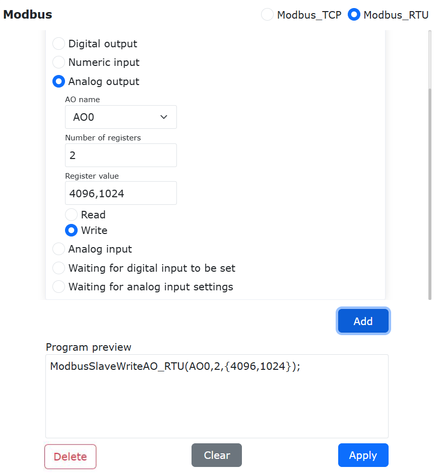

.. centered:: Figura 9.30-50 Ler e Escrever AO (Saída Analógica)

Aguardar Entrada Digital
""""""""""""""""""""""""""""""""""""""""""""""""""""""
Abra a página de adição de instruções do Escravo Modbus RTU. Encontre "Configuração de Aguardar Entrada Digital". Selecione o nome DI como o registrador "A em Posição" configurado. O estado de espera é "Verdadeiro". O tempo limite é 5000 ms. Clique no botão "Adicionar" e, finalmente, no botão "Aplicar".
   
.. image:: coding/390.png
   :width: 4in
   :align: center

.. centered:: Figura 9.30-51 Adicionar Instrução para Aguardar Entrada Digital

Uma instrução para o Escravo Modbus do robô aguardar a entrada digital foi adicionada ao programa "testModbusRTUSlave.lua". Após iniciar o programa, o robô aguardará até que o valor do registrador de bobina "A em Posição" do escravo se torne verdadeiro, ou seja, valor 1. Como o tempo limite definido é de 5 segundos, se após 5 segundos de espera o sinal "A em Posição" ainda for 0, o programa do robô reportará um erro de tempo limite e parará automaticamente.
   
.. image:: coding/391.png
   :width: 4in
   :align: center

.. centered:: Figura 9.30-52 Programa para Aguardar Entrada Digital

Aguardar Entrada Analógica
""""""""""""""""""""""""""""""""""
Abra a página de adição de instruções do Escravo Modbus RTU. Encontre "Configuração de Aguardar Entrada Analógica". Selecione o nome AI como o registrador "Corrente" configurado. O estado de espera é ">". O valor do registrador é 255. O tempo limite é 5000 ms. Clique no botão "Adicionar" e, finalmente, no botão "Aplicar".
   
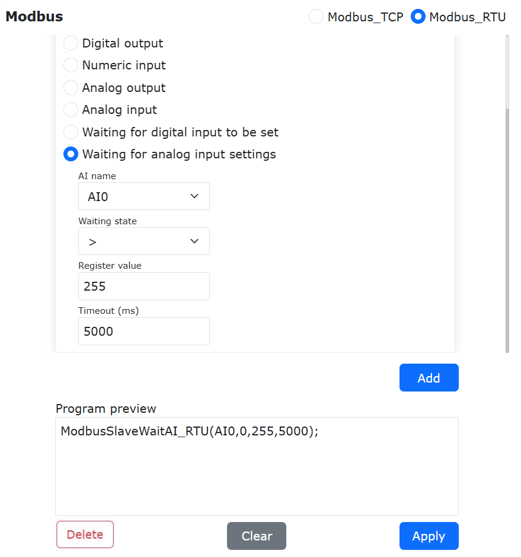

.. centered:: Figura 9.30-53 Adicionar Instrução para Aguardar Entrada Analógica

Uma instrução para o Escravo Modbus do robô aguardar o valor da entrada analógica foi adicionada ao programa "testModbusRTUSlave.lua". Após iniciar o programa, o robô aguardará até que o valor do registrador "Corrente" do escravo seja maior que 255. Como o tempo limite definido é de 5 segundos, se após 5 segundos de espera o sinal "Corrente" ainda não for maior que 255, o programa do robô reportará um erro de tempo limite e parará automaticamente.
   
.. image:: coding/393.png
   :width: 4in
   :align: center

.. centered:: Figura 9.30-54 Programa para Aguardar Registrador de Entrada Analógica

Abra a página de adição de instruções do Escravo Modbus RTU. Encontre "Configuração de Aguardar Entrada Analógica" (aguardar registrador de entrada AI). Selecione o nome AI como o registrador "Nível de Líquido" configurado. O estado de espera é "=". O valor do registrador é 255. O tempo limite é 5000 ms. Clique no botão "Adicionar" e, finalmente, no botão "Aplicar".
            
.. image:: coding/496.png
   :width: 6in
   :align: center

.. centered:: Figura 9.30-54-2 Adicionar Instrução para Aguardar Entrada Analógica

Uma instrução para o Escravo Modbus Rtu do robô aguardar o valor do registrador de entrada AI foi adicionada ao programa "test.lua". Após iniciar o programa, o robô aguardará até que o valor do registrador "Nível de Líquido" seja igual a 255. Como o tempo limite definido é de 5 segundos, se após 5 segundos de espera o sinal "Nível de Líquido" ainda não for igual a 255, o programa do robô reportará um erro de tempo limite e parará automaticamente.

Feedback de Estado e Controle do Robô no Escravo Modbus RTU
***********************************************************************************
Os endereços dos registradores de entrada do Escravo Modbus RTU do robô colaborativo, de 0x1010 a 0x104C, são usados para feedback do estado do robô em tempo real (consulte o Anexo 1: Mapa de Endereços do Escravo Modbus RTU para definições específicas). Você só precisa usar um dispositivo mestre para ler os valores dos registradores correspondentes e obter os dados de estado em tempo real do robô.

Os endereços dos registradores de bobina do Escravo Modbus RTU do robô colaborativo, de 0x4040 a 0x405C, são usados para o dispositivo mestre controlar o robô (consulte o Anexo 1: Mapa de Endereços do Escravo Modbus RTU para definições específicas). Tomando o endereço de bobina 0x4054 como exemplo, esta função representa "Iniciar Programa". Quando o robô está no modo automático e o dispositivo mestre define o valor do endereço 0x4054 de 0 para 1, o robô inicia automaticamente a execução do programa atualmente configurado. Tomando o endereço de bobina 0x4040 como exemplo, ele é usado para controlar a saída DO0 do painel de controle do robô. Quando o mestre externo define o endereço de bobina 0x4040 de 0 para 1, a saída DO0 do painel de controle é ativada. Da mesma forma, quando o mestre externo define o endereço de bobina 0x4040 de 1 para 0, a saída DO0 do painel de controle é desativada. Clique em "Entrada Digital de Função (Bobina)" na página de configuração do Escravo Modbus RTU para monitorar todas as entradas digitais de função atuais.
   
.. image:: coding/396.png
   :width: 4in
   :align: center

.. centered:: Figura 9.30-55 Entrada Digital de Função do Escravo do Robô

Anexo 1: Mapa de Endereços do Escravo Modbus Rtu

.. list-table::
   :widths: 15 20 25 15 20 10
   :header-rows: 0
   :align: center

   * - **Endereço Enviado pelo Controlador Terceiro**
     - **Tipo**
     - **Nome**
     - **Tipo de Dado**
     - **Código de Função**
     - **Leitura/Escrita**

   * - 0x3000
     - Saída Digital Geral (Discreta)
     - DO0
     - BOOL 
     - 0x02 
     - Somente Leitura  

   * - 0x3001
     - Saída Digital Geral (Discreta)
     - DO1
     - BOOL 
     - 0x02 
     - Somente Leitura  

   * - 0x3002
     - Saída Digital Geral (Discreta)
     - DO2
     - BOOL 
     - 0x02 
     - Somente Leitura  

   * - 0x3003
     - Saída Digital Geral (Discreta)
     - DO3
     - BOOL 
     - 0x02 
     - Somente Leitura  

   * - ...
     - Saída Digital Geral (Discreta)
     - ...
     - BOOL 
     - 0x02 
     - Somente Leitura  

   * - 0x303F
     - Saída Digital Geral (Discreta)
     - DO127
     - BOOL 
     - 0x02 
     - Somente Leitura  

   * - 0x4000
     - Entrada Digital Geral (Bobina)
     - DI0
     - BOOL 
     - 0x01, 0x05, 0x0F 
     - Leitura/Escrita  

   * - 0x4001
     - Entrada Digital Geral (Bobina)
     - DI1
     - BOOL 
     - 0x01, 0x05, 0x0F 
     - Leitura/Escrita  

   * - 0x4002
     - Entrada Digital Geral (Bobina)
     - DI2
     - BOOL 
     - 0x01, 0x05, 0x0F 
     - Leitura/Escrita  

   * - 0x4003
     - Entrada Digital Geral (Bobina)
     - DI3
     - BOOL 
     - 0x01, 0x05, 0x0F 
     - Leitura/Escrita  

   * - ...
     - Entrada Digital Geral (Bobina)
     - ...
     - BOOL 
     - 0x01, 0x05, 0x0F 
     - Leitura/Escrita  

   * - 0x403F
     - Entrada Digital Geral (Bobina)
     - DI64
     - BOOL 
     - 0x01, 0x05, 0x0F 
     - Leitura/Escrita  

   * - 0x4040
     - Controle do Robô
     - DO0 do Painel de Controle
     - BOOL 
     - 0x01, 0x05, 0x0F 
     - Leitura/Escrita  

   * - 0x4041
     - Controle do Robô
     - DO1 do Painel de Controle
     - BOOL 
     - 0x01, 0x05, 0x0F 
     - Leitura/Escrita  

   * - 0x4042
     - Controle do Robô
     - DO2 do Painel de Controle
     - BOOL 
     - 0x01, 0x05, 0x0F 
     - Leitura/Escrita  

   * - 0x4043
     - Controle do Robô
     - DO3 do Painel de Controle
     - BOOL 
     - 0x01, 0x05, 0x0F 
     - Leitura/Escrita  

   * - 0x4044
     - Controle do Robô
     - DO4 do Painel de Controle
     - BOOL 
     - 0x01, 0x05, 0x0F 
     - Leitura/Escrita  

   * - 0x4045
     - Controle do Robô
     - DO5 do Painel de Controle
     - BOOL 
     - 0x01, 0x05, 0x0F 
     - Leitura/Escrita  

   * - 0x4046
     - Controle do Robô
     - DO6 do Painel de Controle
     - BOOL 
     - 0x01, 0x05, 0x0F 
     - Leitura/Escrita  

   * - 0x4047
     - Controle do Robô
     - DO7 do Painel de Controle
     - BOOL 
     - 0x01, 0x05, 0x0F 
     - Leitura/Escrita  

   * - 0x4048
     - Controle do Robô
     - CO0 do Painel de Controle
     - BOOL 
     - 0x01, 0x05, 0x0F 
     - Leitura/Escrita  

   * - 0x4049
     - Controle do Robô
     - CO1 do Painel de Controle
     - BOOL 
     - 0x01, 0x05, 0x0F 
     - Leitura/Escrita  

   * - 0x404A
     - Controle do Robô
     - CO2 do Painel de Controle
     - BOOL 
     - 0x01, 0x05, 0x0F 
     - Leitura/Escrita  

   * - 0x404B
     - Controle do Robô
     - CO3 do Painel de Controle
     - BOOL 
     - 0x01, 0x05, 0x0F 
     - Leitura/Escrita  

   * - 0x404C
     - Controle do Robô
     - CO4 do Painel de Controle
     - BOOL 
     - 0x01, 0x05, 0x0F 
     - Leitura/Escrita  

   * - 0x404D
     - Controle do Robô
     - CO5 do Painel de Controle
     - BOOL 
     - 0x01, 0x05, 0x0F 
     - Leitura/Escrita  

   * - 0x404E
     - Controle do Robô
     - CO6 do Painel de Controle
     - BOOL 
     - 0x01, 0x05, 0x0F 
     - Leitura/Escrita  

   * - 0x404F
     - Controle do Robô
     - CO7 do Painel de Controle
     - BOOL 
     - 0x01, 0x05, 0x0F 
     - Leitura/Escrita  

   * - 0x4050
     - Controle do Robô
     - DO0 da Ferramenta
     - BOOL 
     - 0x01, 0x05, 0x0F 
     - Leitura/Escrita  

   * - 0x4051
     - Controle do Robô
     - DO1 da Ferramenta
     - BOOL 
     - 0x01, 0x05, 0x0F 
     - Leitura/Escrita  

   * - 0x4052
     - Controle do Robô
     - Pausar
     - BOOL 
     - 0x01, 0x05, 0x0F 
     - Leitura/Escrita  

   * - 0x4053
     - Controle do Robô
     - Retomar
     - BOOL 
     - 0x01, 0x05, 0x0F 
     - Leitura/Escrita  

   * - 0x4054
     - Controle do Robô
     - Iniciar
     - BOOL 
     - 0x01, 0x05, 0x0F 
     - Leitura/Escrita  

   * - 0x4055
     - Controle do Robô
     - Parar
     - BOOL 
     - 0x01, 0x05, 0x0F 
     - Leitura/Escrita  

   * - 0x4056
     - Controle do Robô
     - Mover para Ponto de Operação
     - BOOL 
     - 0x01, 0x05, 0x0F 
     - Leitura/Escrita  

   * - 0x4057
     - Controle do Robô
     - Alternar Manual/Automático
     - BOOL 
     - 0x01, 0x05, 0x0F 
     - Leitura/Escrita  

   * - 0x4058
     - Controle do Robô
     - Iniciar Programa Principal
     - BOOL 
     - 0x01, 0x05, 0x0F 
     - Leitura/Escrita  

   * - 0x4059
     - Controle do Robô
     - Modo de Redução Nível 1
     - BOOL 
     - 0x01, 0x05, 0x0F 
     - Leitura/Escrita  

   * - 0x405A
     - Controle do Robô
     - Modo de Redução Nível 2
     - BOOL 
     - 0x01, 0x05, 0x0F 
     - Leitura/Escrita  

   * - 0x405B
     - Controle do Robô
     - Modo de Redução Nível 3 (Parada)
     - BOOL 
     - 0x01, 0x05, 0x0F 
     - Leitura/Escrita  

   * - 0x405C
     - Controle do Robô
     - Limpar Todas as Falhas
     - BOOL 
     - 0x01, 0x05, 0x0F 
     - Leitura/Escrita  

   * - 0x405D
     - Controle do Robô
     - Reservado
     - BOOL 
     - 0x01, 0x05, 0x0F 
     - Leitura/Escrita  

   * - 0x405E
     - Controle do Robô
     - Reservado
     - BOOL 
     - 0x01, 0x05, 0x0F 
     - Leitura/Escrita  

   * - 0x1000
     - Entrada Analógica
     - AO0
     - INT16 
     - 0x04
     - Somente Leitura  

   * - 0x1001
     - Entrada Analógica
     - AO1
     - INT16 
     - 0x04
     - Somente Leitura  

   * - 0x1002
     - Entrada Analógica
     - AO2
     - INT16 
     - 0x04
     - Somente Leitura  

   * - ...
     - Entrada Analógica
     - ...
     - INT16 
     - 0x04
     - Somente Leitura  

   * - 0x100F
     - Entrada Analógica
     - AO15
     - INT16 
     - 0x04
     - Somente Leitura  

   * - 0x1010
     - Estado do Robô
     - Estado de Habilitação 0-Desabilitado, 1-Habilitado
     - UINT16 
     - 0x04
     - Somente Leitura  

   * - 0x1011
     - Estado do Robô
     - Modo do Robô, 1-Modo Manual, 0-Modo Automático
     - UINT16 
     - 0x04
     - Somente Leitura  

   * - 0x1012
     - Estado do Robô
     - Estado de Operação do Robô 1-Parado, 2-Executando, 3-Pausado, 4-Arrastando
     - UINT16 
     - 0x04
     - Somente Leitura  

   * - 0x1013
     - Estado do Robô
     - Número da Ferramenta
     - UINT16 
     - 0x04
     - Somente Leitura  

   * - 0x1014
     - Estado do Robô
     - Número da Peça
     - UINT16 
     - 0x04
     - Somente Leitura  

   * - 0x1015
     - Estado do Robô
     - Estado de Parada de Emergência 0-Não parada de emergência, 1-Parada de emergência
     - UINT16 
     - 0x04
     - Somente Leitura  

   * - 0x1016
     - Estado do Robô
     - Falha de Limite Mole
     - UINT16 
     - 0x04
     - Somente Leitura  

   * - 0x1017
     - Estado do Robô
     - Código de Falha Principal
     - UINT16 
     - 0x04
     - Somente Leitura  

   * - 0x1018
     - Estado do Robô
     - Código de Falha Secundário
     - UINT16 
     - 0x04
     - Somente Leitura  

   * - 0x1019
     - Estado do Robô
     - Detecção de Colisão, 1-Colisão, 0-Sem colisão
     - UINT16 
     - 0x04
     - Somente Leitura  

   * - 0x101A
     - Estado do Robô
     - Sinal de Movimento Concluído
     - UINT16 
     - 0x04
     - Somente Leitura  

   * - 0x101B
     - Estado do Robô
     - Sinal de Parada de Segurança SI0
     - UINT16 
     - 0x04
     - Somente Leitura  

   * - 0x101C
     - Estado do Robô
     - Sinal de Parada de Segurança SI1
     - UINT16 
     - 0x04
     - Somente Leitura  

   * - 0x101D
     - Estado do Robô
     - Entrada Analógica AI0 do Painel de Controle
     - UINT16 
     - 0x04
     - Somente Leitura  

   * - 0x101E
     - Estado do Robô
     - Entrada Analógica AI1 do Painel de Controle
     - UINT16 
     - 0x04
     - Somente Leitura  

   * - 0x101F
     - Estado do Robô
     - Entrada Analógica AI0 da Ferramenta
     - UINT16 
     - 0x04
     - Somente Leitura  

   * - 0x1020
     - Estado do Robô
     - Saída Analógica AO0 do Painel de Controle
     - UINT16 
     - 0x04
     - Somente Leitura  

   * - 0x1021
     - Estado do Robô
     - Saída Analógica AO1 do Painel de Controle
     - UINT16 
     - 0x04
     - Somente Leitura  

   * - 0x1022
     - Estado do Robô
     - Saída Analógica AO0 da Ferramenta
     - UINT16 
     - 0x04
     - Somente Leitura  

   * - 0x1023
     - Estado do Robô
     - Entrada Digital do Painel de Controle Bit0-Bit7 correspondem a DI0-DI7 Bit8-Bit15 correspondem a CI0-CI7
     - UINT16 
     - 0x04
     - Somente Leitura  

   * - 0x1024
     - Estado do Robô
     - Entrada Digital da Extremidade da Ferramenta Bit0-Bit15 correspondem a DI0-DI15
     - UINT16 
     - 0x04
     - Somente Leitura  

   * - 0x1025
     - Estado do Robô
     - Saída Digital do Painel de Controle Bit0-Bit7 correspondem a DO0-DO7 Bit8-Bit15 correspondem a CO0-CO7
     - UINT16 
     - 0x04
     - Somente Leitura  

   * - 0x1026
     - Estado do Robô
     - Saída Digital da Extremidade da Ferramenta Bit0-Bit15 correspondem a DO0-DO15
     - UINT16 
     - 0x04
     - Somente Leitura  

   * - 0x1027
     - Estado do Robô
     - Velocidade TCP
     - FLOAT32 (big-endian) 
     - 0x04
     - Somente Leitura  

   * - 0x1028
     - Estado do Robô
     - Velocidade TCP
     - FLOAT32 (big-endian) 
     - 0x04
     - Somente Leitura  

   * - 0x1029
     - Estado do Robô
     - Posição da Junta 1
     - FLOAT32 (big-endian) 
     - 0x04
     - Somente Leitura  

   * - 0x102A
     - Estado do Robô
     - Posição da Junta 1
     - FLOAT32 (big-endian) 
     - 0x04
     - Somente Leitura  

   * - 0x102B
     - Estado do Robô
     - Posição da Junta 2
     - FLOAT32 (big-endian) 
     - 0x04
     - Somente Leitura  

   * - 0x102C
     - Estado do Robô
     - Posição da Junta 2
     - FLOAT32 (big-endian) 
     - 0x04
     - Somente Leitura  

   * - 0x102D
     - Estado do Robô
     - Posição da Junta 3
     - FLOAT32 (big-endian) 
     - 0x04
     - Somente Leitura  

   * - 0x102E
     - Estado do Robô
     - Posição da Junta 3
     - FLOAT32 (big-endian) 
     - 0x04
     - Somente Leitura  

   * - 0x102F
     - Estado do Robô
     - Posição da Junta 4
     - FLOAT32 (big-endian) 
     - 0x04
     - Somente Leitura  

   * - 0x1030
     - Estado do Robô
     - Posição da Junta 4
     - FLOAT32 (big-endian) 
     - 0x04
     - Somente Leitura  

   * - 0x1031
     - Estado do Robô
     - Posição da Junta 5
     - FLOAT32 (big-endian) 
     - 0x04
     - Somente Leitura  

   * - 0x1032
     - Estado do Robô
     - Posição da Junta 5
     - FLOAT32 (big-endian) 
     - 0x04
     - Somente Leitura  

   * - 0x1033
     - Estado do Robô
     - Posição da Junta 6
     - FLOAT32 (big-endian) 
     - 0x04
     - Somente Leitura  

   * - 0x1034
     - Estado do Robô
     - Posição da Junta 6
     - FLOAT32 (big-endian) 
     - 0x04
     - Somente Leitura  

   * - 0x1035
     - Estado do Robô
     - Velocidade da Junta 1
     - FLOAT32 (big-endian) 
     - 0x04
     - Somente Leitura  

   * - 0x1036
     - Estado do Robô
     - Velocidade da Junta 1
     - FLOAT32 (big-endian) 
     - 0x04
     - Somente Leitura  

   * - 0x1037
     - Estado do Robô
     - Velocidade da Junta 2
     - FLOAT32 (big-endian) 
     - 0x04
     - Somente Leitura  

   * - 0x1038
     - Estado do Robô
     - Velocidade da Junta 2
     - FLOAT32 (big-endian) 
     - 0x04
     - Somente Leitura  

   * - 0x1039
     - Estado do Robô
     - Velocidade da Junta 3
     - FLOAT32 (big-endian) 
     - 0x04
     - Somente Leitura  

   * - 0x103A
     - Estado do Robô
     - Velocidade da Junta 3
     - FLOAT32 (big-endian) 
     - 0x04
     - Somente Leitura  

   * - 0x103B
     - Estado do Robô
     - Velocidade da Junta 4
     - FLOAT32 (big-endian) 
     - 0x04
     - Somente Leitura  

   * - 0x103C
     - Estado do Robô
     - Velocidade da Junta 4
     - FLOAT32 (big-endian) 
     - 0x04
     - Somente Leitura  

   * - 0x103D
     - Estado do Robô
     - Velocidade da Junta 5
     - FLOAT32 (big-endian) 
     - 0x04
     - Somente Leitura  

   * - 0x103E
     - Estado do Robô
     - Velocidade da Junta 5
     - FLOAT32 (big-endian) 
     - 0x04
     - Somente Leitura  

   * - 0x103F
     - Estado do Robô
     - Velocidade da Junta 6
     - FLOAT32 (big-endian) 
     - 0x04
     - Somente Leitura  

   * - 0x1040
     - Estado do Robô
     - Velocidade da Junta 6
     - FLOAT32 (big-endian) 
     - 0x04
     - Somente Leitura  

   * - 0x1041
     - Estado do Robô
     - Posição TCP X
     - FLOAT32 (big-endian) 
     - 0x04
     - Somente Leitura  

   * - 0x1042
     - Estado do Robô
     - Posição TCP X
     - FLOAT32 (big-endian) 
     - 0x04
     - Somente Leitura  

   * - 0x1043
     - Estado do Robô
     - Posição TCP Y
     - FLOAT32 (big-endian) 
     - 0x04
     - Somente Leitura  

   * - 0x1044
     - Estado do Robô
     - Posição TCP Y
     - FLOAT32 (big-endian) 
     - 0x04
     - Somente Leitura  

   * - 0x1045
     - Estado do Robô
     - Posição TCP Z
     - FLOAT32 (big-endian) 
     - 0x04
     - Somente Leitura  

   * - 0x1046
     - Estado do Robô
     - Posição TCP Z
     - FLOAT32 (big-endian) 
     - 0x04
     - Somente Leitura  

   * - 0x1047
     - Estado do Robô
     - Posição TCP RX
     - FLOAT32 (big-endian) 
     - 0x04
     - Somente Leitura  

   * - 0x1048
     - Estado do Robô
     - Posição TCP RX
     - FLOAT32 (big-endian) 
     - 0x04
     - Somente Leitura  

   * - 0x1049
     - Estado do Robô
     - Posição TCP RY
     - FLOAT32 (big-endian) 
     - 0x04
     - Somente Leitura  

   * - 0x104A
     - Estado do Robô
     - Posição TCP RY
     - FLOAT32 (big-endian) 
     - 0x04
     - Somente Leitura  

   * - 0x104B
     - Estado do Robô
     - Posição TCP RZ
     - FLOAT32 (big-endian) 
     - 0x04
     - Somente Leitura  

   * - 0x104C
     - Estado do Robô
     - Posição TCP RZ
     - FLOAT32 (big-endian) 
     - 0x04
     - Somente Leitura  

   * - 0x104D
     - Entrada Analógica
     - AO16
     - FLOAT32 (big-endian) 
     - 0x04
     - Somente Leitura  

   * - 0x104E
     - Entrada Analógica
     - AO16
     - FLOAT32 (big-endian) 
     - 0x04
     - Somente Leitura  

   * - 0x104F
     - Entrada Analógica
     - AO17
     - FLOAT32 (big-endian) 
     - 0x04
     - Somente Leitura  

   * - 0x1050
     - Entrada Analógica
     - AO17
     - FLOAT32 (big-endian) 
     - 0x04
     - Somente Leitura  

   * - ...
     - Entrada Analógica
     - ...
     - FLOAT32 (big-endian) 
     - 0x04
     - Somente Leitura  

   * - 0x106B
     - Entrada Analógica
     - AO31
     - FLOAT32 (big-endian) 
     - 0x04
     - Somente Leitura  

   * - 0x106C
     - Entrada Analógica
     - AO31
     - FLOAT32 (big-endian) 
     - 0x04
     - Somente Leitura  

   * - 0x2000
     - Saída Analógica
     - AI0
     - INT16 
     - 0x03, 0x06, 0x10
     - Leitura/Escrita  

   * - 0x2001
     - Saída Analógica
     - AI1
     - INT16 
     - 0x03, 0x06, 0x10
     - Leitura/Escrita  

   * - 0x2002
     - Saída Analógica
     - AI2
     - INT16 
     - 0x03, 0x06, 0x10
     - Leitura/Escrita  

   * - ...
     - Saída Analógica
     - ...
     - INT16 
     - 0x03, 0x06, 0x10
     - Leitura/Escrita  

   * - 0x200F
     - Saída Analógica
     - AI15
     - INT16 
     - 0x03, 0x06, 0x10
     - Leitura/Escrita  

   * - 0x2010
     - Saída Analógica
     - AI16
     - FLOAT32 (big-endian) 
     - 0x03, 0x06, 0x10
     - Leitura/Escrita  

   * - 0x2011
     - Saída Analógica
     - AI16
     - FLOAT32 (big-endian) 
     - 0x03, 0x06, 0x10
     - Leitura/Escrita  

   * - 0x2012
     - Saída Analógica
     - AI17
     - FLOAT32 (big-endian) 
     - 0x03, 0x06, 0x10
     - Leitura/Escrita  

   * - 0x2013
     - Saída Analógica
     - AI17
     - FLOAT32 (big-endian) 
     - 0x03, 0x06, 0x10
     - Leitura/Escrita  

   * - ...
     - Saída Analógica
     - ...
     - FLOAT32 (big-endian) 
     - 0x03, 0x06, 0x10
     - Leitura/Escrita  

   * - 0x202E
     - Saída Analógica
     - AI31
     - FLOAT32 (big-endian) 
     - 0x03, 0x06, 0x10
     - Leitura/Escrita  

   * - 0x202F
     - Saída Analógica
     - AI31
     - FLOAT32 (big-endian) 
     - 0x03, 0x06, 0x10
     - Leitura/Escrita  

Função de Proteção de Conformidade de Postura Baseada no Sensor de Força de 6 Eixos
~~~~~~~~~~~~~~~~~~~~~~~~~~~~~~~~~~~~~~~~~~~~~~~~~~~~~~~~~~~~~~~~~~~~~~~~~~~~~~~~~~~~~~~~~~~~~~~~~~~~~~~~~

Visão Geral
++++++++++++++

Atualmente, a função de conformidade de postura do robô FR sob FT_Control de força constante não tem um limite máximo de ângulo de ajuste. Quando o sensor de força de 6 eixos é submetido a um torque externo, a extremidade do robô pode se deslocar continuamente, o que pode ser perigoso.

Um limite máximo de ângulo de ajuste foi adicionado à função de conformidade de postura do FT_Control, permitindo definir um limite personalizado para tornar a função de conformidade de postura mais suave.

Fluxo de Operação
++++++++++++++++++++++++++++++++++++++++

**Passo 1**: Clique em "Configurações Iniciais" -> "Básico" -> "Coordenadas da Ferramenta" para entrar na interface de configuração do sistema de coordenadas da ferramenta. Selecione "Nome do Sistema de Coordenadas" e defina os parâmetros do sistema de coordenadas correspondentes à ferramenta de extremidade.
   
.. image:: coding/443.png
   :width: 4in
   :align: center

.. centered:: Figura 9.31-1 Configuração do Sistema de Coordenadas da Ferramenta

**Passo 2**: Clique em "Programa de Ensino" -> "Programação de Programa" para escrever um script Lua de controle de força constante. Selecione "Conjunto de Controle de Força" -> "Control" para adicionar uma instrução de movimento com controle de força. Defina a conformidade de postura como "Ativada" e defina o ângulo máximo de ajuste como o limite para o ângulo de conformidade de postura.
   
.. image:: coding/444.png
   :width: 6in
   :align: center

.. centered:: Figura 9.31-2 Instrução de Movimento com Controle de Força

**Passo 3**: Na interface web, clique em "FT" para definir o sistema de coordenadas de referência do sensor de força de 6 eixos. Selecione "Sistema de Coordenadas Personalizado" e defina os parâmetros do sistema de coordenadas correspondentes.
Para o ajuste do ângulo de conformidade de postura girando em torno do sistema de coordenadas da ferramenta, defina os parâmetros do sistema de coordenadas de referência como "0". Para o ajuste do ângulo de conformidade de postura girando em torno do sistema de coordenadas do flange da extremidade, defina os parâmetros do sistema de coordenadas de referência como os parâmetros do sistema de coordenadas correspondentes à ferramenta de extremidade.
   
.. image:: coding/445.png
   :width: 4in
   :align: center

.. centered:: Figura 9.31-3 Configuração do Sistema de Coordenadas de Referência do Sensor de Força de 6 Eixos

**Passo 4**: Execute o script para visualizar o efeito de conformidade de postura. O ângulo de ajuste da conformidade de postura sob força constante será limitado ao intervalo de ângulo máximo de ajuste personalizado.

Função da Interface de Comunicação Socket
~~~~~~~~~~~~~~~~~~~~~~~~~~~~~~~~~~~~~~~~~~~~~~~~~~~~~~~~~~~~~~~~~~~~~

Configuração do Socket
++++++++++++++++++++++++++++++++++

Ao usar a função da interface de comunicação Socket, após ligar o robô, primeiro acesse a página web para configurar o protocolo Socket. A configuração é salva após desligar.

Clique em "Programa de Ensino" - "Programação de Programa" e, em seguida, clique em "Depuração de Rede Socket" no menu do canto superior direito para entrar na interface de configuração do Socket. Clique em "Adicionar Socket" para configurar os parâmetros do Socket. No máximo quatro Sockets podem ser adicionados.

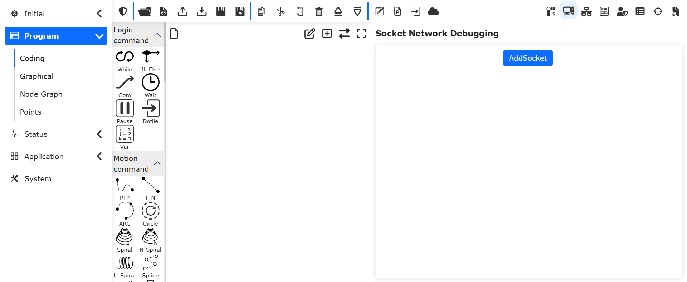

.. centered:: Figura 9.32-1 Interface de Depuração de Rede Socket

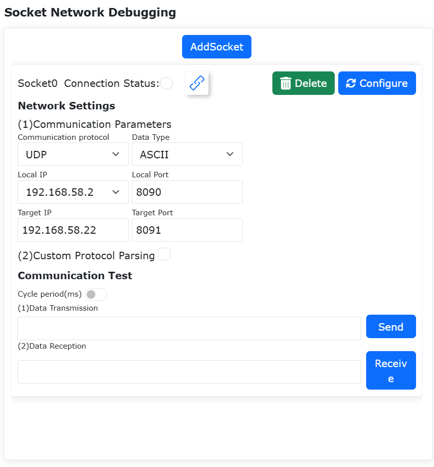

.. centered:: Figura 9.32-2 Interface de Configuração de Parâmetros do Socket

Configuração dos Parâmetros de Comunicação
********************************************

O protocolo de comunicação suporta UDP, Servidor TCP, Cliente TCP.

O tipo de dado suporta ASCII e HEX. Quando o tipo de dado é configurado, todas as transmissões e recepções de dados para esta conexão Socket serão processadas de acordo com o tipo configurado.

Mecanismo de Detecção de Heartbeat
********************************************
O mecanismo de detecção de heartbeat só se aplica a Servidor TCP e Cliente TCP.

O mecanismo de detecção de heartbeat usa o mecanismo Keepalive para detectar e manter o estado ativo da conexão, evitando que conexões ociosas por muito tempo sejam interrompidas inesperadamente. Ele inclui principalmente os seguintes parâmetros:

- Intervalo de Sonda: Quanto tempo ocioso antes de começar a enviar pacotes de sonda keepalive, em segundos;
- Tempo de Sonda: Intervalo de tempo entre o envio de pacotes de sonda, em segundos;
- Número de Sondas: Número máximo de pacotes de sonda a serem enviados.

Mecanismo de Reconexão
********************************************
O mecanismo de reconexão só se aplica ao Cliente TCP.

Quando o mecanismo de reconexão é ativado e o cliente TCP detecta que o servidor está desconectado, ele inicia ativamente o mecanismo de reconexão. Se a conexão não for estabelecida após atingir o número máximo de tentativas de reconexão, a conexão será desconectada. Ele inclui principalmente os seguintes parâmetros:

- Intervalo de Reconexão: Intervalo de tempo para reconexão, em ms. Recomenda-se que o tempo seja em segundos;
- Número Máximo de Tentativas de Reconexão: Número máximo de tentativas de reconexão.
  
Análise de Protocolo Personalizado
********************************************
Quando a análise de protocolo personalizado é ativada, os dados enviados e recebidos são encapsulados ou analisados de acordo com o conteúdo da configuração do protocolo.

O protocolo personalizado pode ser gerado automaticamente com base nos parâmetros de configuração. No modo ASCII, suporta o uso combinado de cabeçalho de quadro, contagem de quadros, comprimento de dados e final de quadro. Delimitadores podem ser usados para dividir os dados. No modo HEX, suporta o uso combinado de cabeçalho de quadro, contagem de quadros, comprimento de dados, método de verificação e final de quadro.

.. image:: coding/448.png
   :width: 6in
   :align: center

.. centered:: Figura 9.32-3 Configuração de Protocolo Personalizado no Modo ASCII

.. image:: coding/449.png
   :width: 6in
   :align: center

.. centered:: Figura 9.32-4 Configuração de Protocolo Personalizado no Modo HEX

Após configurar o protocolo personalizado, clique no botão "Gerar" para gerar automaticamente o arquivo Lua correspondente. O arquivo Lua suporta funções de importação e exportação. O tipo de protocolo pode ser modificado de forma flexível ajustando o código do arquivo.

Conexão do Socket
++++++++++++++++++++++++++++++++++++++++++

Exibição da Conexão na Interface
********************************************
Após configurar as informações do Socket, a conexão Socket pode ser estabelecida. O status da conexão inclui os seguintes três estados:

- Branco: Conexão não estabelecida.

.. image:: coding/450.png
   :width: 6in
   :align: center

.. centered:: Figura 9.32-5 Estado Desconectado

- Amarelo: Servidor TCP aguardando conexão ou Cliente TCP solicitando conexão.

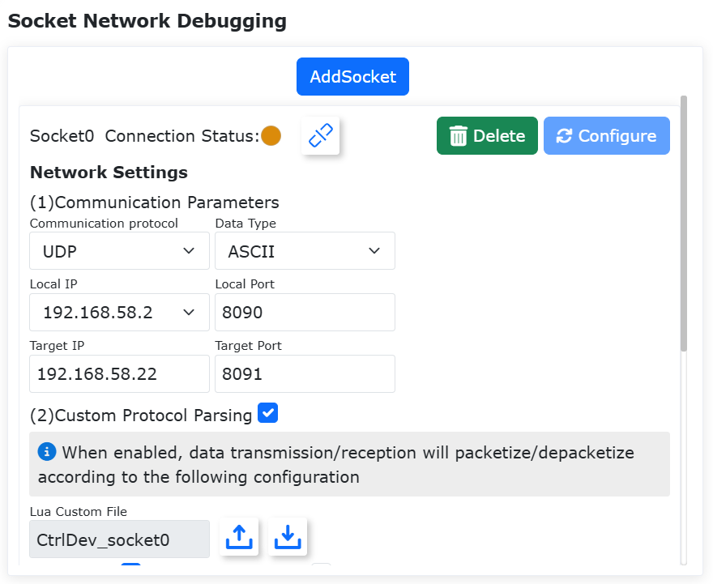

.. centered:: Figura 9.32-6 Estado Aguardando Conexão

- Verde: Conexão bem-sucedida.

.. image:: coding/452.png
   :width: 6in
   :align: center

.. centered:: Figura 9.32-7 Estado Conexão Bem-sucedida

Módulo de Instrução de Conexão
********************************************

Clique em "Programa de Ensino" - "Programação de Programa" - "Instruções de Comunicação", selecione a instrução "Socket" para gerar instruções de abrir e fechar conexão Socket para programação Lua. O SocketID só pode selecionar uma conexão Socket já configurada.

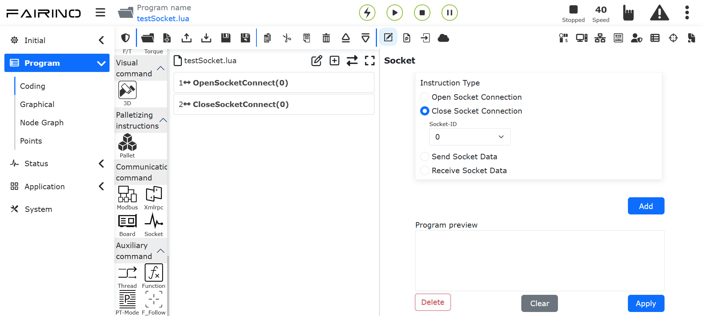

.. centered:: Figura 9.32-8 Módulo de Instrução de Conexão Socket

Detalhes da Instrução:

- Instrução Abrir Conexão: OpenSockeConnect(id);
- Parâmetro id: Socket ID já configurado. Valor de retorno 0 para sucesso.
- Instrução Fechar Conexão: CloseSockeConnect(id);
- Parâmetro id: Socket ID já configurado. Valor de retorno 0 para sucesso.

Comunicação Socket
+++++++++++++++++++++++++++++++++++++++++

Teste de Comunicação
***********************************
A interface fornece um teste de comunicação, permitindo testar a transmissão e recepção de dados, conforme abaixo.

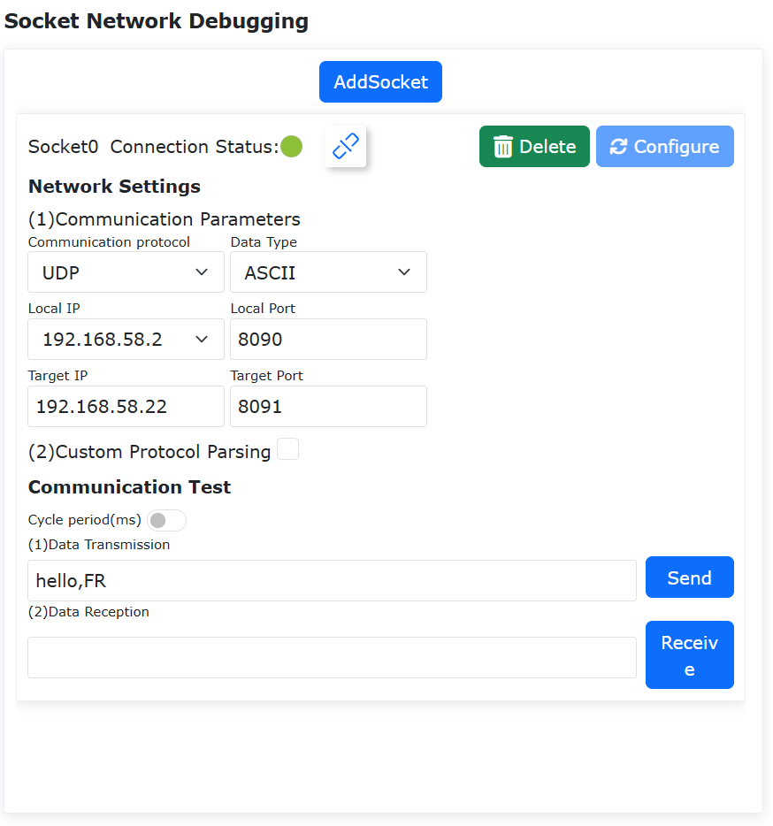

.. centered:: Figura 9.32-9 Teste de Comunicação
 
O envio de dados pela interface usa o modo de bloqueio por padrão, aguardando a conclusão do movimento antes de enviar os dados. O tempo limite padrão para recebimento de dados é de 5 segundos. Após o tempo limite, um erro é relatado e a operação para. Esses parâmetros podem ser ajustados ao enviar instruções no módulo de instrução.

Módulo de Instrução de Comunicação
***********************************

Clique em "Programa de Ensino" - "Programação de Programa" - "Instruções de Comunicação", selecione a instrução "Socket" para gerar instruções de comunicação Socket para transmissão e recepção de dados para programação Lua. O SocketID só pode selecionar uma conexão Socket já configurada para enviar dados.

.. image:: coding/455.png
   :width: 6in
   :align: center

.. centered:: Figura 9.32-10 Enviar Dados via Socket

Os parâmetros da instrução são Socket ID, dados a serem enviados e se deve aguardar a conclusão do movimento.

Detalhes da Instrução:

- Instrução de Envio: SocketSend(id, data, block);
- Parâmetros: id, ID do socket conectado; data: dados a serem enviados, em formato de string. O conteúdo dos dados deve ser consistente com o tipo de dado configurado, por exemplo, "hello" ou "FA54DE"; block: se deve bloquear o movimento. 0: aguarda a conclusão do movimento para enviar, 1: envia imediatamente. Valor de retorno 0 para sucesso.

A recepção de dados é mostrada na figura abaixo.

.. image:: coding/456.png
   :width: 6in
   :align: center

.. centered:: Figura 9.32-11 Receber Dados via Socket

Os parâmetros da instrução são Socket ID, tempo limite de recebimento em milissegundos e o estado após o tempo limite.

Detalhes da Instrução:

- Instrução de Recebimento: SocketReceive(id, timeout, stopStrategy);
- Parâmetros: id, ID do socket conectado; timeout: tempo limite de recebimento; stopStrategy: estratégia após o tempo limite. 0: reporta erro e para após o tempo limite, 1: continua a execução após o tempo limite;
- Valor de retorno: time: tempo de recebimento, data: dados recebidos.

Função de Controle de Impedância Durante o Movimento do Robô
~~~~~~~~~~~~~~~~~~~~~~~~~~~~~~~~~~~~~~~~~~~~~~~~~~~~~~~~~~~~~~~~~~~~~~~~~~~

Visão Geral
++++++++++++++++++++++++++++++++

A função de controle de impedância, por meio da detecção em tempo real de forças externas, atua ativamente para se adaptar à força externa quando o limite definido é atingido, desviando-se da trajetória de movimento e retornando a ela quando a força externa cai abaixo do limite. Isso melhora a interação humano-robô. Quando uma força externa excede o limite de força predefinido, esta função aciona o braço robótico a se deslocar na direção da força, alcançando um efeito de evasão ativa. Quando a força externa é removida, o braço robótico retorna à sua trajetória de movimento original, aumentando a segurança durante a colaboração humano-robô.

Função de Controle de Impedância
++++++++++++++++++++++++++++++++

Configuração e Ativação/Desativação do Controle de Impedância no Espaço Cartesiano
*************************************************************************************************

**Passo 1**: Faça login na interface web, clique sequencialmente em "Configurações Iniciais" → "Básico" → "Juntas" → "Nível de Colisão" para entrar no módulo de configuração do nível de colisão do robô e defina um coeficiente de colisão razoável.

.. image:: coding/473.png
   :width: 6in
   :align: center

.. centered:: Figura 9.34-1 Módulo de Configuração do Coeficiente de Colisão do Robô

**Passo 2**: Para usar o sensor de força para implementar a função de controle de impedância, configure o sensor de força em "Periféricos" → "Ferramenta de Extremidade" na configuração de periféricos de extremidade. Para não usar o sensor de força, esta etapa pode ser ignorada.

**Passo 3**: Clique sequencialmente em "Programa de Ensino" → "Programação de Programa" → "Conjunto de Controle de Força" para adicionar a instrução "Impedance". A instrução "Impedance" permite que o robô realize controle de impedância na trajetória de movimento.

.. image:: coding/474.png
   :width: 6in
   :align: center

.. centered:: Figura 9.34-2 Adicionar Instrução de Controle de Força

**Passo 4**: No módulo de instrução de controle de força, selecione "Espaço Cartesiano" na lista suspensa "Seleção de Espaço". Defina valores apropriados nos campos de texto para limite de força, coeficiente de massa, coeficiente de amortecimento, coeficiente de rigidez, velocidade linear máxima, aceleração linear máxima, velocidade angular máxima e aceleração angular máxima. Em "Tipo de Instrução", clique em "Ativar" e depois em "Adicionar" para adicionar a instrução de ativação do controle de impedância. Em "Tipo de Instrução", clique em "Desativar" e depois em "Adicionar" para adicionar a instrução de desativação do controle de impedância.

.. image:: coding/475.png
   :width: 6in
   :align: center

.. centered:: Figura 9.34-3 Exemplo de Instrução de Controle de Impedância

**Passo 5**: Durante a execução, se o braço robótico parar de se mover e a mensagem "Erro 500: nível de colisão atual muito baixo" for exibida no canto inferior esquerdo da interface web, isso significa que o limite de força definido é maior que o limite de disparo do nível de colisão. Nesse caso, aumente o nível de colisão ou diminua o limite de força para resolver o erro.

.. image:: coding/476.png
   :width: 6in
   :align: center

.. centered:: Figura 9.34-4 Aviso de Nível de Colisão Muito Baixo

**Passo 6**: Durante a execução, se o braço robótico parar de se mover e a mensagem "Falha de Colisão" for exibida no canto inferior direito da interface web, isso significa que a força externa no braço robótico excedeu o limite de disparo do nível de colisão, acionando uma falha de colisão.

.. image:: coding/477.png
   :width: 4in
   :align: center

.. centered:: Figura 9.34-5 Aviso de Falha de Colisão

Função específica dos parâmetros e valores recomendados:

- Seleção de Espaço: Define o espaço de execução do controle de impedância. Atualmente, apenas o controle de impedância no espaço cartesiano está disponível.
- Limite de Força: Força mínima de disparo para o controle de impedância. A faixa para forças de translação é 30–150 N, para forças de rotação é 7–30 Nm.
- Coeficiente de Massa: Aumentar o coeficiente de massa causa um desvio mais lento, diminuí-lo causa um desvio mais rápido. Faixa para translação [0.01-1], recomendado 0.04; faixa para rotação [0.001-1], recomendado 0.01.
- Coeficiente de Amortecimento: Aumentar o coeficiente de amortecimento causa um desvio mais lento, diminuí-lo causa um desvio mais rápido e pode gerar oscilações. Faixa para translação [0.1-2], recomendado 0.1; faixa para rotação [0.008-1.5], recomendado 0.08.
- Coeficiente de Rigidez: Aumentar o coeficiente de rigidez causa um desvio mais lento. Recomendado 0.
- Velocidade Linear Máxima: Limita a velocidade de translação gerada pela força externa. Recomendado 250 mm/s.
- Aceleração Linear Máxima: Limita a aceleração de translação gerada pela força externa. Recomendado 500 mm/s².
- Velocidade Angular Máxima: Limita a velocidade angular de rotação gerada pela força externa. Recomendado 90°/s.
- Aceleração Angular Máxima: Limita a aceleração angular de rotação gerada pela força externa. Recomendado 180°/s².

Configuração e Ativação/Desativação do Controle de Impedância no Espaço Articular
*****************************************************************************************

**Passo 1**: Faça login na interface web, clique sequencialmente em "Configurações Iniciais" → "Básico" → "Juntas" → "Nível de Colisão" para entrar no módulo de configuração do nível de colisão do robô e defina um coeficiente de colisão razoável.

.. image:: coding/555.png
   :width: 6in
   :align: center

.. centered:: Figura 9.34-6 Módulo de Configuração do Coeficiente de Colisão do Robô

**Passo 2**: Clique sequencialmente em "Programa de Ensino" → "Programação de Programa" → "Conjunto de Controle de Força" para adicionar a instrução "Impedance". A instrução "Impedance" permite que o robô realize controle de impedância na trajetória de movimento.

.. image:: coding/556.png
   :width: 6in
   :align: center

.. centered:: Figura 9.34-7 Adicionar Instrução de Controle de Força

**Passo 3**: No módulo de instrução de controle de força, selecione "Espaço Articular" na lista suspensa "Seleção de Espaço". Defina valores apropriados nos campos de texto para limite de força, coeficiente de massa, coeficiente de amortecimento, coeficiente de rigidez, velocidade máxima e aceleração máxima. Em "Tipo de Instrução", clique em "Ativar" e depois em "Adicionar" para adicionar a instrução de ativação do controle de impedância. Em "Tipo de Instrução", clique em "Desativar" e depois em "Adicionar" para adicionar a instrução de desativação do controle de impedância.

.. image:: coding/557.png
   :width: 6in
   :align: center

.. centered:: Figura 9.34-8 Instrução de Controle de Impedância

Função específica dos parâmetros e valores recomendados:

- Seleção de Espaço: Define o espaço de execução do controle de impedância como espaço articular.
- Limite de Força: Força mínima de disparo para o controle de impedância. A faixa para J1-J3 é 10–50 Nm, para as direções de rotação é 1–10 Nm.
- Coeficiente de Massa: Aumentar o coeficiente de massa causa um desvio mais lento, diminuí-lo causa um desvio mais rápido. Faixa para J1-J3 [0.01-1], recomendado 0.04; faixa para J4-J6 [0.001-1], recomendado 0.01.
- Coeficiente de Amortecimento: Aumentar o coeficiente de amortecimento causa um desvio mais lento, diminuí-lo causa um desvio mais rápido e pode gerar oscilações. Faixa para J1-J3 [0.1-2], recomendado 0.1; faixa para J4-J6 [0.008-1.5], recomendado 0.08.
- Coeficiente de Rigidez: Aumentar o coeficiente de rigidez causa um desvio mais lento. Recomendado 0.
- Velocidade Máxima: Limita a velocidade de rotação da junta gerada pela força externa. Recomendado 50°/s.
- Aceleração Máxima: Limita a aceleração de rotação da junta gerada pela força externa. Recomendado 50°/s².

Função de Soldagem com Oscilação Personalizada
~~~~~~~~~~~~~~~~~~~~~~~~~~~~~~~~~~~~~~~~~~~~~~~~~~~~~~~~~~~~~~~~~~~~~~~~~~~

Visão Geral
++++++++++++++++++++++++++++++++

A função de soldagem com oscilação personalizada permite ao usuário usar seu próprio padrão de oscilação para executar a soldagem com oscilação.

Explicação da Função de Soldagem com Oscilação Personalizada:

- (1) Selecione qualquer um dos "Oscilação Personalizada 0", "Oscilação Personalizada 1" ou "Oscilação Personalizada 2" no menu suspenso "Tipo de Oscilação" na interface de parâmetros de oscilação. No máximo 3 modos de oscilação personalizada podem ser configurados.
- (2) O número máximo de pontos finais para oscilação personalizada é 10, com no mínimo 2. Os dados X, Y, Z do último ponto final devem ser 0 e não podem ser modificados. O tempo de pausa pode ser definido para cada ponto.
- (3) Os valores de X, Y, Z dos pontos finais da oscilação personalizada devem estar na faixa de -10mm a 10mm. A frequência de oscilação não pode exceder 10.
- (4) Atualmente, trajetórias lineares, de arco e de círculo completo suportam soldagem com oscilação personalizada, mas a função de transição gradual da oscilação ainda não é suportada.
- (5) Observe que, quando o tempo de espera da oscilação é definido como "Incluir", o tempo total de pausa da oscilação não pode exceder metade do período do ciclo da oscilação.

Fluxo de Operação da Função de Soldagem com Oscilação Personalizada
+++++++++++++++++++++++++++++++++++++++++++++++++++++++++++++++++++++++++

O fluxo de operação da função de soldagem com oscilação personalizada é o seguinte:

**Passo 1**: Primeiro, registre os pontos de ensino inicial e final da trajetória linear. Em seguida, clique em "Programa de Ensino", "Programação de Programa", selecione "Ponto a Ponto" para mover a extremidade do robô até o ponto inicial da linha "custWeaveP1". Finalmente, selecione "Linear" para mover o robô até o ponto final da linha "custWeaveP2".

**Passo 2**: Selecione o botão "Oscilação" e clique no botão de edição do processo de oscilação para entrar na interface de configuração dos parâmetros de oscilação. Selecione "Oscilação Personalizada N" (N = 0, 1, 2) em "Tipo de Oscilação".

.. image:: coding/478.png
   :width: 6in
   :align: center

.. centered:: Figura 9.35-1 Interface de Configuração dos Parâmetros de Oscilação

**Passo 3**: Após selecionar o "Tipo de Oscilação", role para baixo na interface de configuração dos parâmetros de oscilação. Selecione o número de pontos finais da oscilação personalizada. Defina a posição e o tempo de pausa para cada ponto no sistema de coordenadas de oscilação. Finalmente, clique no botão "Configurar".

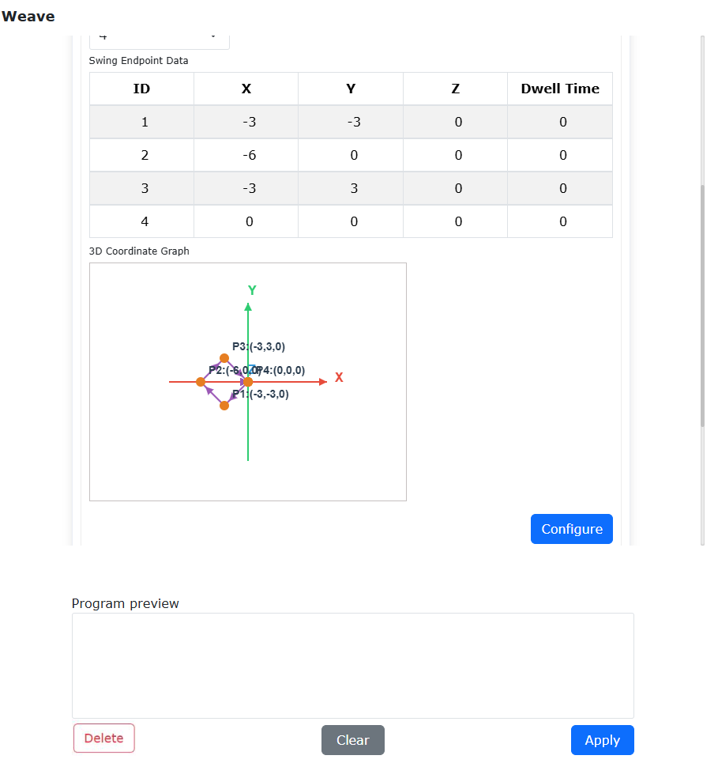

.. centered:: Figura 9.35-2 Interface de Configuração da Oscilação Personalizada

**Passo 4**: Na interface de oscilação, em "Tipo de Instrução", selecione sequencialmente "Iniciar Oscilação" e "Parar Oscilação", clique no botão "Adicionar" e, finalmente, clique no botão "Aplicar".

.. image:: coding/480.png
   :width: 6in
   :align: center

.. centered:: Figura 9.35-3 Interface de Configuração da Instrução de Oscilação

**Passo 5**: Na interface de edição do programa, selecione a instrução de início de oscilação e clique no botão "Mover para Cima" na parte superior da interface. Finalmente, salve o programa, alterne o robô para o modo automático e clique no botão "Iniciar". O robô começará a oscilação personalizada na trajetória linear.

.. image:: coding/481.png
   :width: 6in
   :align: center

.. centered:: Figura 9.35-4 Interface de Instrução LUA Original

.. image:: coding/482.png
   :width: 6in
   :align: center

.. centered:: Figura 9.35-5 Interface de Instrução LUA Modificada

**Passo 6**: As etapas de configuração da oscilação personalizada para trajetórias de arco e círculo completo são as mesmas do Passo 1 ao Passo 5.

Configuração de Pontos de Ensino
~~~~~~~~~~~~~~~~~~~~~~~~~~~~~~~~~~~~

Clique em "Configuração de Pontos de Ensino" para entrar na interface de configuração da função de pontos de ensino.

Antes de usar a caixa de botões ou outros sinais de IO para registrar pontos de ensino, o usuário deve primeiro configurar o prefixo do nome do ponto de ensino, o número máximo e o método de ensino. O prefixo do nome suporta dois modos: prefixo personalizado e usar o nome do programa atual como prefixo. Por exemplo, prefixo personalizado "P", número máximo "3", método de ensino "Ensino do Robô". Os pontos finais atuais do robô (ferramenta) são registrados sequencialmente como P1, P2, P3. Registrar novamente substituirá os pontos registrados anteriormente.

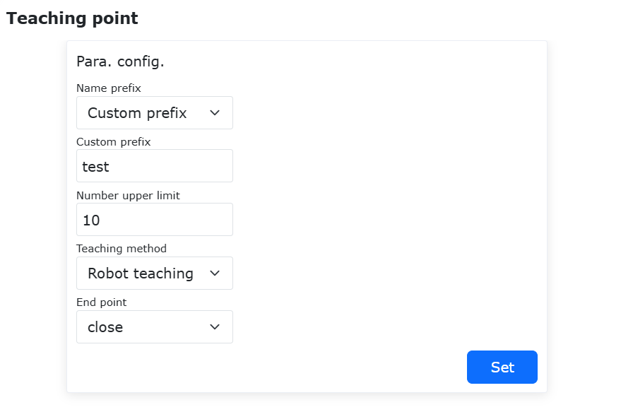

.. centered:: Figura 9.36-1 Configuração de Pontos de Ensino

Atualização Automática do Programa Lua pela Gravação de Pontos na Extremidade
+++++++++++++++++++++++++++++++++++++++++++++++++++++++++++++++++++++++++++++++++++++++

Configuração da Função de Gravação de Pontos na Extremidade
****************************************************************************

1. Ative a função de gravação de pontos na extremidade e clique em Configurar. Através do interruptor, selecione os programas Lua que precisam ter os pontos atualizados.

.. image:: coding/484.png
   :width: 4in
   :align: center

.. centered:: Figura 9.36‑2 Ativar a Função de Gravação de Pontos na Extremidade

2. Após a configuração, o nome do ponto de gravação na extremidade será o prefixo "test", o número máximo será 10 e todos os programas Lua selecionados serão atualizados. A função permanecerá ativa mesmo após fechar o WebApp.
   
Atualização Automática do Programa Lua pela Gravação de Pontos com o Botão da Extremidade
******************************************************************************************************

1. Clique no botão de gravação de pontos na extremidade do robô.

.. image:: coding/485.png
   :width: 4in
   :align: center

.. centered:: Figura 9.36‑3 Botão de Gravação de Pontos na Extremidade

2. Neste momento, o LED da extremidade pisca da seguinte forma: Luz roxa piscando (início) -> Luz azul constante (gravando ponto e atualizando Lua) -> Luz verde constante (gravação concluída). As informações dos pontos com o nome correspondente nos programas Lua selecionados são atualizadas simultaneamente.

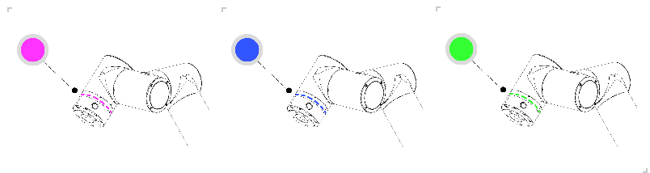

.. centered:: Figura 9.36‑3 Mudanças no LED durante a Gravação de Pontos na Extremidade e Atualização do Programa Lua

3. Se a gravação do ponto falhar, o LED da extremidade pisca da seguinte forma: Luz roxa piscando (início) -> Luz vermelha piscando (falha na gravação) -> Luz verde constante (retorno ao normal).

.. image:: coding/487.png
   :width: 4in
   :align: center

.. centered:: Figura 9.36‑4 Mudanças no LED durante Falha na Gravação de Pontos na Extremidade

Exemplo de Uso da Função
**************************************

1. Prefixo personalizado: test, número máximo 5, método de ensino selecionado como Ensino do Robô, função de gravação de pontos na extremidade ativada, clique em Configurar.

2. Ative o programa Lua program1 que precisa ter os pontos atualizados.

.. image:: coding/488.png
   :width: 4in
   :align: center

.. centered:: Figura 9.36‑5 Configuração de Pontos de Ensino

3. A figura abaixo mostra o programa program1 e sua trajetória de execução atual.

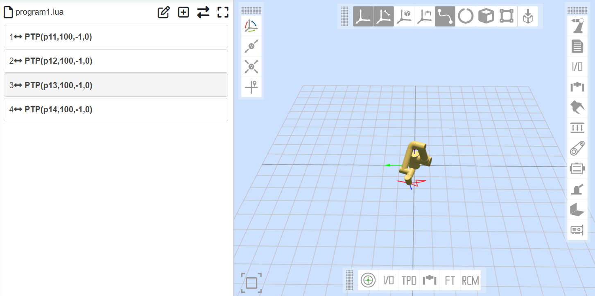

.. centered:: Figura 9.36‑6 Programa program1 e sua Trajetória de Execução Atual

4. Mude a página para o modo manual, arraste o robô para um novo ponto, clique no botão de gravação de pontos na extremidade e aguarde a conclusão da sequência de piscadas do LED: Luz roxa piscando (início) -> Luz azul constante (gravando ponto e atualizando Lua) -> Luz verde constante (gravação concluída). O ponto gravado será test1.
5. Repita o passo 4 para gravar sequencialmente test2, test3, test4, test5, completando a gravação de 5 pontos. Neste momento, os pontos do programa program1 foram atualizados simultaneamente.
6. Execute novamente o programa program1. A trajetória de movimento agora será atualizada, conforme mostrado na figura abaixo.

.. image:: coding/490.png
   :width: 4in
   :align: center

.. centered:: Figura 9.36‑7 Trajetória de Execução Atualizada

Configuração do Programa Principal
~~~~~~~~~~~~~~~~~~~~~~~~~~~~~~~~~~~~

Clique em "Configuração do Programa Principal" para entrar na interface de configuração da função do programa principal.

Configurar o programa principal permite usá-lo em conjunto com a configuração de DI para iniciar o programa principal. O programa principal configurado deve primeiro ser testado para garantir a segurança. Após configurar o DI correspondente como o sinal de início do programa principal nas configurações do robô, o usuário pode controlar este sinal DI para iniciar a execução do programa principal.

.. image:: coding/491.png
   :width: 4in
   :align: center

.. centered:: Figura 9.37‑1 Configuração do Programa Principal

Soldagem de Curva de Interseção com Eixo de Extensão do Robô
~~~~~~~~~~~~~~~~~~~~~~~~~~~~~~~~~~~~~~~~~~~~~~~~~~~~~~~~~~~~~~~~~~~~~~~~~~~~~~~~~~~~~~

Composição do Sistema
++++++++++++++++++++++++++++++++++

.. image:: coding/497.png
   :width: 6in
   :align: center

.. centered:: Figura 9.38‑1 Composição do Sistema de Soldagem de Curva de Interseção com Eixo de Extensão do Robô

No sistema, (a) é o computador, (b) é o robô e seu painel de controle, (c) é o posicionador e o equipamento de acionamento, (d) é a fonte de solda e os equipamentos associados.

Configuração da Comunicação do Eixo de Extensão
++++++++++++++++++++++++++++++++++++++++++++++++++++++++

Os métodos de comunicação entre o robô e o eixo de extensão incluem UDP ou RS485.

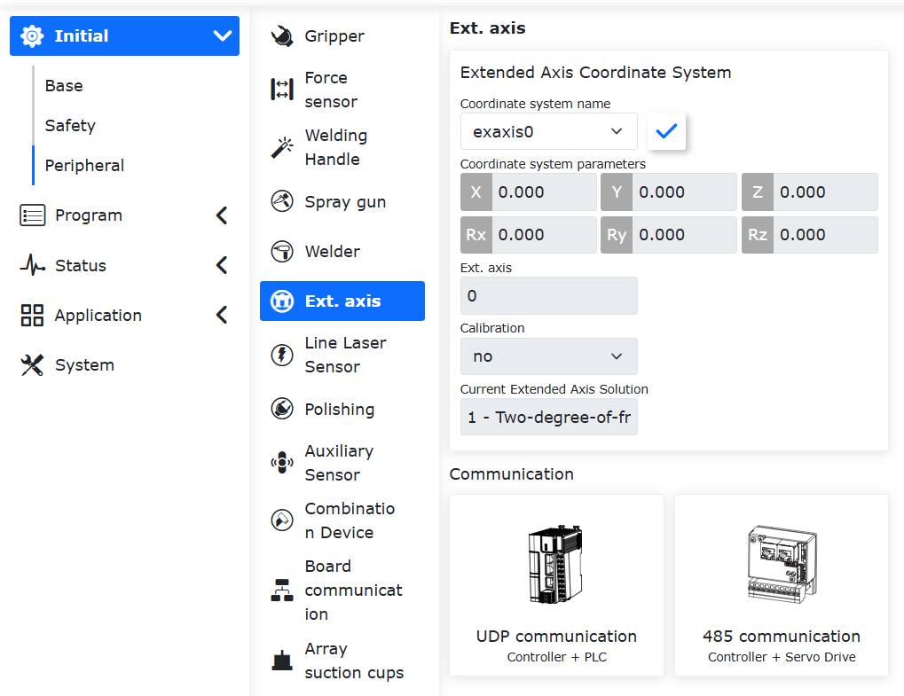

.. centered:: Figura 9.38‑2 Página de Configuração do Eixo de Extensão
 
Na interface de operação do robô, clique em "Configurações Iniciais", "Periféricos", "Eixo de Extensão" para entrar na página de configuração do eixo de extensão. Tomando como exemplo a conexão do robô a um CLP via comunicação UDP, clique no ícone "Comunicação UDP" para entrar na página de configuração do eixo de extensão com comunicação UDP.

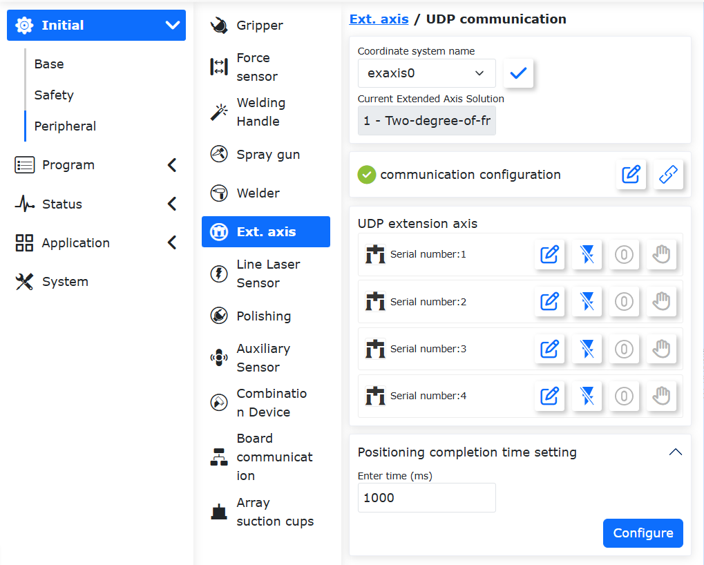

.. centered:: Figura 9.38‑3 Interface de Configuração da Comunicação UDP
 
Na página de configuração do eixo de extensão com comunicação UDP, você pode selecionar o número do eixo de extensão correspondente, conectar e configurar os parâmetros de comunicação UDP (endereço, porta, período, detecção de perda de pacotes, etc.), bem como o tempo de conclusão do posicionamento do eixo de extensão.

O conteúdo da configuração do eixo de extensão não é o foco principal desta descrição de função. Consulte a seção correspondente do manual do usuário para obter detalhes.

Conexão e Configuração da Fonte de Solda
+++++++++++++++++++++++++++++++++++++++++++++++++++
Configure a fonte de solda através da seguinte página de configuração:

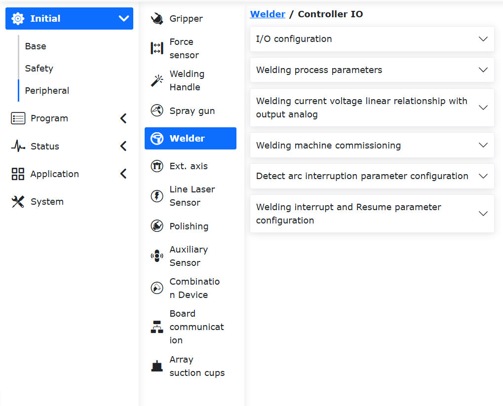

.. centered:: Figura 9.38‑4 Página de Configuração da Fonte de Solda

A comunicação da fonte de solda pode usar comunicação IO ou RS485. Clique em "Configurações Iniciais", "Periféricos", "Fonte de Solda" para entrar na interface de configuração e conexão. É possível configurar "Tipo de Controle", "Configuração I/O", "Parâmetros do Processo de Soldagem", "Teste da Fonte de Solda", etc.

O conteúdo da configuração da fonte de solda não é o foco principal desta descrição de função. Consulte a seção correspondente do manual do usuário para obter detalhes.

Calibração do Sistema de Coordenadas da Ferramenta
++++++++++++++++++++++++++++++++++++++++++++++++++++
Após instalar a tocha de solda na extremidade do robô, calibre a tocha de solda:

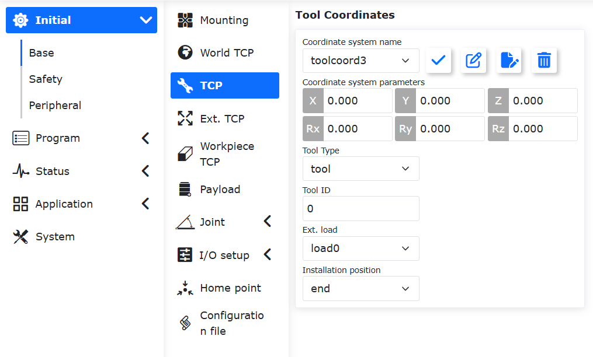

.. centered:: Figura 9.38‑5 Página de Configuração do Sistema de Coordenadas da Ferramenta

Clique em "Configurações Iniciais", "Básico", "Coordenadas da Ferramenta" para entrar na página de configuração do sistema de coordenadas da ferramenta.

.. image:: coding/502.png
   :width: 6in
   :align: center

.. centered:: Figura 9.38‑6 Seleção do Método de 6 Pontos para Calibrar a Tocha de Solda

Selecione um sistema de coordenadas vazio, escolha o tipo de ferramenta como "Ferramenta" e selecione o método de 6 pontos para calibrar a ferramenta da tocha de solda. Recomenda-se calibrar a postura do sistema de coordenadas da ferramenta conforme mostrado na Figura 4-3.

.. image:: coding/503.png
   :width: 4in
   :align: center

.. centered:: Figura 9.38‑7 Diagrama de Postura do Sistema de Coordenadas da Tocha de Solda

O conteúdo da calibração do sistema de coordenadas da ferramenta não é o foco principal desta descrição de função. Consulte a seção correspondente do manual do usuário para obter detalhes sobre os métodos de calibração.

Função de Soldagem de Curva de Interseção
+++++++++++++++++++++++++++++++++++++++++++++++++++++++

O movimento da trajetória de soldagem de curva de interseção pode ser feito de duas formas: usando um posicionador tipo L de 2 graus de liberdade ou diretamente sem o posicionador.

Calibração do Sistema de Coordenadas do Eixo de Extensão
**********************************************************************

O uso do sistema de coordenadas do eixo de extensão para realizar o movimento síncrono entre o posicionador e o robô requer a calibração do sistema de coordenadas do eixo de extensão.

.. image:: coding/504.png
   :width: 6in
   :align: center

.. centered:: Figura 9.38‑8 Página de Configuração do Sistema de Coordenadas do Eixo de Extensão

Clique em "Configurações Iniciais", "Periféricos", "Eixo de Extensão" para entrar na interface de configuração do sistema de coordenadas do eixo de extensão. Selecione o número do eixo de extensão a ser configurado, clique no botão editar, escolha "1 - Posicionador tipo L de 2 graus de liberdade" e salve.

.. image:: coding/505.png
   :width: 6in
   :align: center

.. centered:: Figura 9.38‑9 Página de Calibração do Eixo de Extensão
 
Ao calibrar o eixo de extensão, preste atenção em selecionar "Posição do Robô em Relação ao Eixo de Extensão" como "Fora do Eixo de Extensão". Para o caso do posicionador, escolha o método de 4 pontos para calibrar.

O conteúdo da calibração do eixo de extensão não é o foco principal desta descrição de função. Consulte a seção correspondente do manual do usuário para obter detalhes sobre os métodos de calibração.

Soldagem da Trajetória da Curva de Interseção
***************************************************

Com base nos pontos de ensino registrados nas seções transversais do tubo principal e do tubo de ligação, um sistema de coordenadas da peça pode ser estabelecido conforme mostrado na figura abaixo. A origem do sistema de coordenadas está na interseção dos eixos do tubo principal e do tubo de ligação. O eixo X é paralelo ao eixo do tubo principal, apontando para a seção transversal onde os pontos de ensino foram registrados. O eixo Z é paralelo ao eixo do tubo de ligação, apontando para o plano onde os pontos de ensino foram registrados.

.. image:: coding/506.png
   :width: 4in
   :align: center

.. centered:: Figura 9.38‑10 Sistema de Coordenadas da Peça para a Trajetória da Curva de Interseção

Método sem usar o posicionador
""""""""""""""""""""""""""""""""""""""""""""""""""""""""""""""""
**Passo 1**: Registre 6 pontos de ensino nas seções transversais do tubo principal e do tubo de ligação.

**Passo 2**: Clique em "Programa de Ensino", "Programação de Programa", encontre "Curva de Interseção" em "Instruções de Movimento" para entrar na página de configuração da trajetória da curva de interseção.

.. image:: coding/507.png
   :width: 6in
   :align: center

.. centered:: Figura 9.38‑11 Página de Configuração da Trajetória da Curva de Interseção

**Passo 3**: Na página de configuração da trajetória da curva de interseção, selecione "Desativado" para "Ponto do Eixo de Extensão". Conclua a configuração do movimento do ponto inicial, direção do movimento, velocidade, aceleração e valores de deslocamento. A direção anti-horária do movimento é a direção dos quatro dedos ao segurar o eixo Z do sistema de coordenadas da peça com a mão direita.

**Passo 4**: Na seção "Dados do Ponto da Curva de Interseção" da página de configuração da trajetória da curva de interseção, selecione os pontos de ensino registrados. Após a configuração, clique nos botões "Adicionar" e "Aplicar".

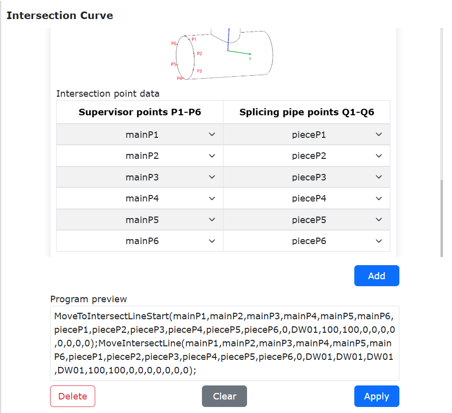

.. centered:: Figura 9.38‑12 Configuração da Instrução da Trajetória da Curva de Interseção

**Passo 5**: Clique no botão "Soldagem" sob "Instruções de Soldagem" para entrar na página de configuração de soldagem. Selecione as instruções "Partida de Arco" e "Parada de Arco" e clique nos botões "Adicionar" e "Aplicar". Após a adição bem-sucedida, mova a instrução LUA de partida de arco para cima uma linha.

.. image:: coding/509.png
   :width: 6in
   :align: center

.. centered:: Figura 9.38‑13 Configuração da Instrução de Soldagem
 
A seguir, um exemplo típico de programa LUA para soldagem de curva de interseção sem posicionador:

.. image:: coding/510.png
   :width: 6in
   :align: center

.. centered:: Figura 9.38‑14 Programa de Exemplo para Soldagem de Curva de Interseção sem Posicionador

Método usando o posicionador tipo L de 2 graus de liberdade
""""""""""""""""""""""""""""""""""""""""""""""""""""""""""""""""""""""""

**Passo 1**: Registre 6 pontos de ensino nas seções transversais do tubo principal e do tubo de ligação. Gire os eixos 1 e 2 do posicionador para registrar 4 pontos de ensino do posicionador.

**Passo 2**: Clique em "Programa de Ensino", "Programação de Programa", encontre "Curva de Interseção" em "Instruções de Movimento" para entrar na página de configuração da trajetória da curva de interseção.

.. image:: coding/511.png
   :width: 6in
   :align: center

.. centered:: Figura 9.38‑15 Página de Configuração da Trajetória da Curva de Interseção

**Passo 3**: Na página de configuração da trajetória da curva de interseção, selecione "Ativado" para "Ponto do Eixo de Extensão". Selecione os pontos de ensino do posicionador registrados. Conclua a configuração do movimento do ponto inicial, direção do movimento, velocidade, aceleração e valores de deslocamento.

**Passo 4**: Na seção "Dados do Ponto da Curva de Interseção" da página de configuração da trajetória da curva de interseção, selecione os pontos de ensino registrados. Após a configuração, clique nos botões "Adicionar" e "Aplicar".

.. image:: coding/512.png
   :width: 6in
   :align: center

.. centered:: Figura 9.38‑16 Configuração da Instrução da Trajetória da Curva de Interseção

**Passo 5**: Clique no botão "Soldagem" sob "Instruções de Soldagem" para entrar na página de configuração de soldagem. Selecione as instruções "Partida de Arco" e "Parada de Arco" e clique nos botões "Adicionar" e "Aplicar". Após a adição bem-sucedida, mova a instrução LUA de partida de arco para cima uma linha.

.. image:: coding/513.png
   :width: 6in
   :align: center

.. centered:: Figura 9.38‑17 Configuração da Instrução de Soldagem
 
A seguir, um exemplo típico de programa LUA para soldagem de curva de interseção com posicionador:

.. image:: coding/514.png
   :width: 6in
   :align: center

.. centered:: Figura 9.38‑18 Programa de Exemplo para Soldagem de Curva de Interseção com Posicionador

Função de Impressão PrintMsg() do Programa LUA do Robô
~~~~~~~~~~~~~~~~~~~~~~~~~~~~~~~~~~~~~~~~~~~~~~~~~~~~~~~~~~~~~~~~~~~~~~~~~~~~~~~~~~~~~~~~~~~~~~~~~~~~~~~~~~~~

O programa LUA do robô possui instruções de impressão integradas que podem exibir informações específicas na janela de impressão do WebApp. Esta função suporta a impressão de valores numéricos, strings, tabelas, booleanos, etc., e é equipada com capacidades auxiliares como armazenamento de logs de impressão, pesquisa de conteúdo e download de logs, facilitando a depuração e o rastreamento de dados.

Edição e Adição de Instruções de Impressão
++++++++++++++++++++++++++++++++++++++++++++++++++++++++++++++++++++

Clique no botão "Imprimir" na página "Instruções Lógicas" para abrir a página de edição da instrução de impressão PrintMsg(). Primeiro, defina o texto de impressão e o tipo de dados respectivamente.

.. image:: coding/573.png
   :width: 6in
   :align: center

.. centered:: Figura 9.39‑1 Página de Edição de Instrução de Impressão   

- **Texto**: Preencha uma string descritiva personalizada para indicar o significado do conteúdo impresso, por exemplo, "robot current pos :", "recv socket value :", etc.
- **Tipo**: Dividido em "Variável" e "Função", selecione conforme necessário.
- **Variável**: Imprime valores de variáveis personalizadas, suportando variáveis dos tipos numérico, string, tabela, booleano, etc.
- **Função**: Imprime o valor de retorno da função da instrução especificada. Após selecionar este tipo, você pode escolher a função alvo na lista de funções abaixo, como GetActualTCPPose() para obter a posição TCP do robô, GetDI() para ler o estado de entrada DI do controlador, GetActualJointPosDegree() para obter os ângulos atuais das juntas do robô, etc.

Tomando como exemplo a impressão da posição atual das juntas do robô: insira o texto de impressão "robot current joint pos :", selecione Função como o tipo de dados e escolha a função GetActualJointPosDegree(), então clique em Adicionar e Aplicar em sequência. O sistema gerará automaticamente a instrução de impressão correspondente no programa LUA:

.. code-block:: console
    :linenos:

    PrintMsg("robot current joint pos :",GetActualJointPosDegree())

.. image:: coding/574.png
   :width: 6in
   :align: center

.. centered:: Figura 9.39‑2 Adicionando uma Instrução de Impressão   

Você também pode alternar o painel do programa para a página editável, inserir o nome da instrução PrintMsg() e inserir o conteúdo a ser impresso nos parâmetros, separando vários conteúdos de impressão com vírgulas.

.. image:: coding/575.png
   :width: 6in
   :align: center

.. centered:: Figura 9.39‑3 Escrevendo Informações de Impressão Personalizadas  

Visualização de Informações de Impressão e Operações Básicas
++++++++++++++++++++++++++++++++++++++++++++++++++++++++++++++++++++

Clique no botão de exibição de impressão para abrir a janela pop-up de informações de impressão. Alterne o robô para o modo automático e execute o programa. O conteúdo impresso será exibido em tempo real na janela. Cada mensagem contém quatro informações: timestamp, nome do programa LUA, número da linha do código e conteúdo impresso.

.. image:: coding/576.png
   :width: 6in
   :align: center

.. centered:: Figura 9.39‑4 Caixa de Exibição de Conteúdo Impresso  

Limpeza do Conteúdo Impresso
*******************************************************************

Clique no botão "Limpar" na parte superior da janela de impressão para limpar todo o conteúdo exibido na janela com um clique.

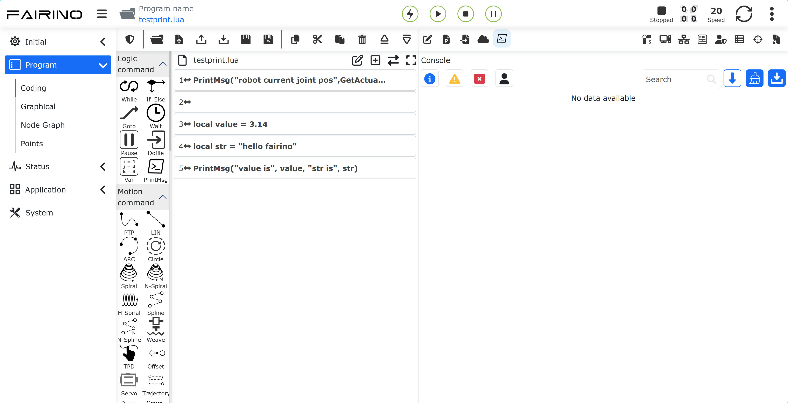

.. centered:: Figura 9.39‑5 Limpeza do Conteúdo Impresso  

Pesquisa de Conteúdo Impresso
*******************************************************************

Digite a palavra-chave alvo na caixa de pesquisa e clique em Localizar. A janela exibirá apenas os registros de impressão que contêm a palavra-chave, ocultando o restante. Após limpar a caixa de pesquisa e clicar em Localizar novamente, todas as informações de impressão serão restauradas.

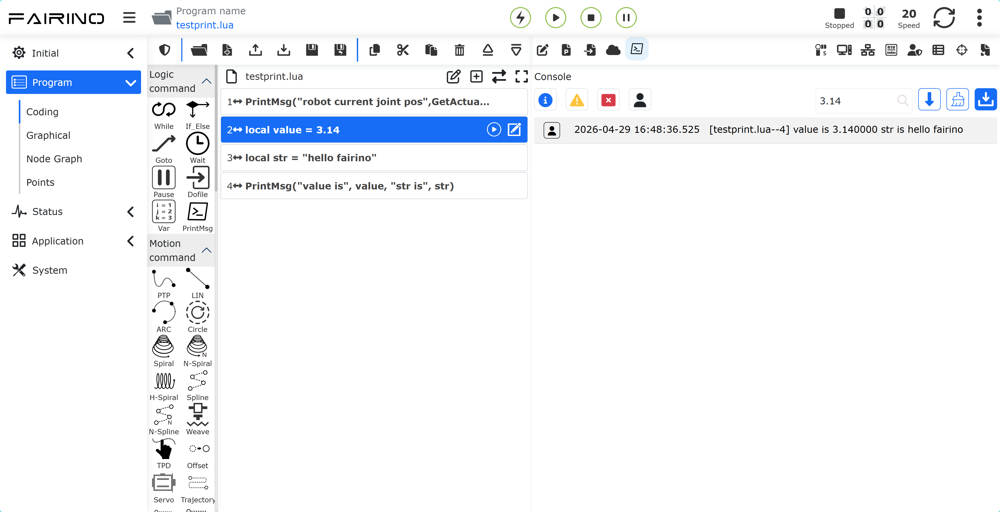

.. centered:: Figura 9.39‑6 Pesquisa de Conteúdo Impresso  

Configuração e Gerenciamento de Logs de Impressão
++++++++++++++++++++++++++++++++++++++++++++++++++++++++++++++++++++

Configuração de Parâmetros de Armazenamento de Logs de Impressão
*******************************************************************

No webapp, clique em "Configurações do Sistema" e "Modo de Manutenção" em sequência para entrar no modo de manutenção. Encontre os módulos "Gerenciamento de Logs" e "Log de Impressão" para configurar a ativação/desativação da função de armazenamento de logs de impressão, definir o número de arquivos a serem salvos e o número máximo de entradas de impressão por arquivo de log. Após ativar o armazenamento de logs de impressão, todos os dados de impressão serão automaticamente gravados em arquivos de log.

.. image:: coding/579.png
   :width: 6in
   :align: center

.. centered:: Figura 9.39‑7 Configuração de Parâmetros de Armazenamento de Logs de Impressão 

Quando o dispositivo robô reinicia o sistema ou o número de entradas em um único arquivo de log atinge o limite definido, um novo arquivo de log é automaticamente criado e a rotação de logs é acionada. Quando o número total de arquivos de log excede o limite máximo de armazenamento, o sistema exclui automaticamente os arquivos de log mais antigos.

Download de Logs de Impressão
*******************************************************************

Clique no botão de download na parte superior da janela de impressão para baixar todo o conteúdo impresso na janela atual para o computador local.

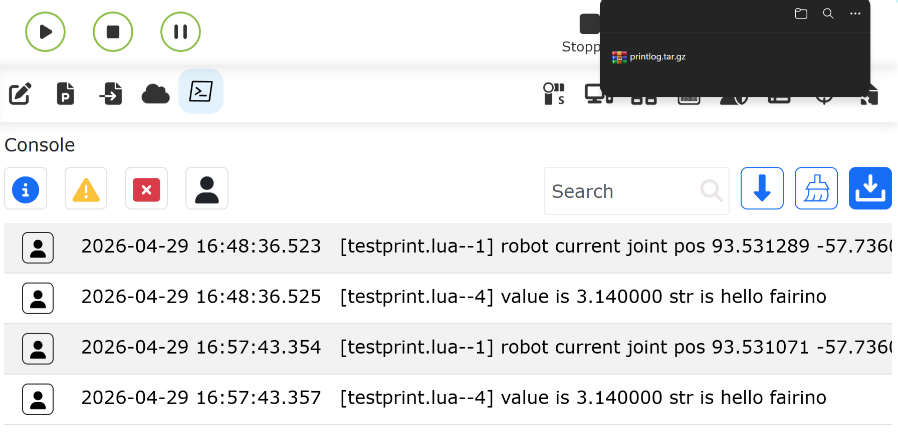

.. centered:: Figura 9.39‑8 Download de Logs de Impressão 

Além do download direto de logs de impressão, os logs de impressão também estão incluídos ao baixar logs do controlador e arquivos de fonte de dados completos.

Exemplos de Código de Instruções de Impressão
++++++++++++++++++++++++++++++++++++++++++++++++++++++++++++++++++++

Impressão da Posição Alvo Recebida pelo Robô
*******************************************************************

A seguir está um programa em que o robô lê as posições Cartesianas x, y, z alvo de um escravo ModbusTCP e controla o movimento do robô para a posição alvo. No programa, cada vez que a posição alvo é lida, a instrução PrintMsg() é usada para imprimir a posição alvo.

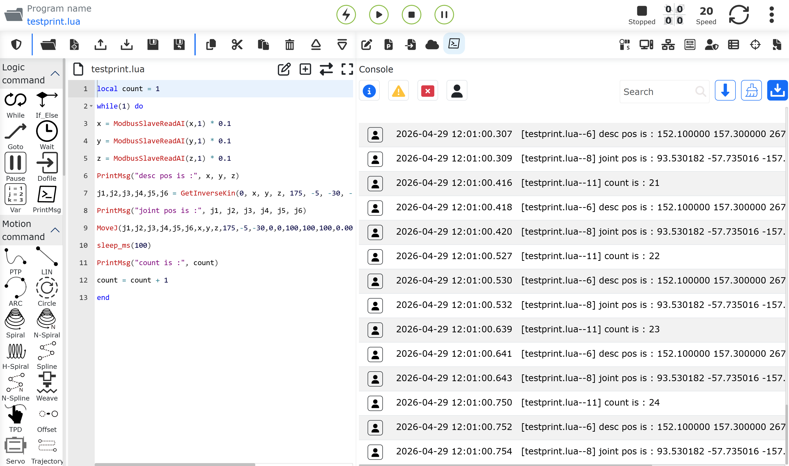

.. centered:: Figura 9.39‑9 Exemplo de Impressão da Posição Alvo do Robô 

Impressão da Posição em Tempo Real do Robô e Dados DI da Caixa de Controle
*************************************************************************************

A seguir está um programa de movimento não bloqueante do robô que imprime a posição do robô e os valores DI da caixa de controle em tempo real durante o movimento.

.. note:: Nota: Ao chamar a instrução de impressão PrintMsg() em um loop, é necessário usar a instrução sleep_ms() para definir o intervalo de sono do loop, evitando um loop infinito.

.. image:: coding/582.png
   :width: 6in
   :align: center

.. centered:: Figura 9.39‑10 Exemplo de Impressão da Posição Atual e DI Durante o Movimento do Robô   

Otimização da Função de Carregamento Web para Grandes Programas LUA e Subprogramas
~~~~~~~~~~~~~~~~~~~~~~~~~~~~~~~~~~~~~~~~~~~~~~~~~~~~~~~~~~~~~~~~~~~~~~~~~~~~~~~~~~~~~~~~~~~~~~~~~~~~~~~~~~~~~~~~~~~~~~~~~~~~~~~~~~~~~~~~~~

Contexto
++++++++++++++++++++++++++++++++++++++++++++++

Atualmente, o robô não consegue lidar com grandes programas LUA (200k+ linhas). Ao carregar um grande programa LUA, a página web não consegue carregá-lo e utilizá-lo.

Ao mesmo tempo, ao importar programas, a lógica de importação atual não realiza a análise e validação do programa. Após a importação, o programa deve ser aberto manualmente e salvo para validação. Ao utilizar um grande número de chamadas de subprogramas simultaneamente, cada um deve ser aberto manualmente um por um, o que consome muito tempo e reduz drasticamente a eficiência do trabalho.

Visão Geral
++++++++++++++++++++++++++++++++++++++++++++++

Esta otimização visa os programas importados. O backend analisa e salva automaticamente. Após o upload dos subprogramas subsequentes, eles podem ser chamados diretamente sem a necessidade de abertura e salvamento manuais.

Para grandes programas LUA, quando o frontend web importa um grande programa LUA (um programa LUA nativo que não requer análise secundária), ele é nomeado com o prefixo RAW, como RAW_test.lua. Este tipo de programa indica que o programa consiste inteiramente em instruções LUA nativas e não contém informações de negócios da aplicação. Pode ser colocado diretamente no interpretador LUA para execução. O controlador só precisa realizar a validação sintática, sem analisar linha por linha. Isso reduz significativamente o tempo de análise de importação do arquivo. Ao mesmo tempo, o frontend não realiza mais a renderização animada para grandes programas LUA; os programas são exibidos em formato de texto simples, e o destaque dinâmico e os números de linha em execução não são mais mostrados, melhorando a eficiência da renderização de dados do frontend. Para instruções específicas que precisam de análise, consulte o Capítulo 1.4.

Após a importação de um programa, a Web deve exibir uma barra de progresso e uma mensagem de confirmação após a importação bem-sucedida.

Para grandes programas LUA, recomenda-se o uso de subprogramas em conjunto com o método `RAW_` para melhorar a eficiência operacional.

Procedimento Operacional para Grandes Programas LUA
+++++++++++++++++++++++++++++++++++++++++++++++++++++++++++++++++++++++++++++++++++++++++++++++++++++++++++++++++++++++++++

**Passo 1**: Nomeie o grande programa LUA com o prefixo `RAW_`, por exemplo, RAW_test200000.lua.

**Passo 2**: Abra a página web, clique em "Teach Program" -> "Program Programming" em sequência, selecione o comando "Importar" e escolha RAW_test200000.lua na seleção de arquivos "Importar".

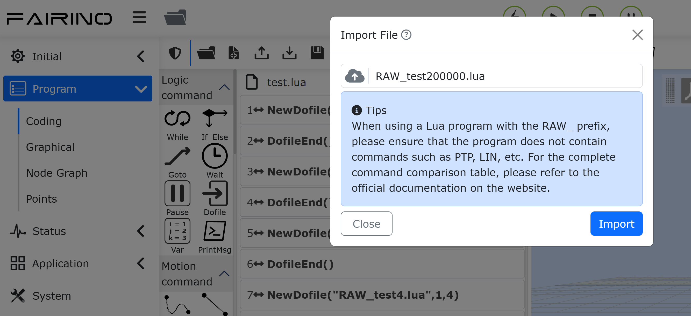

.. centered:: Figura 9.40‑1 Importação de Arquivo `RAW_`    

**Passo 3**: Aguarde a conclusão da importação. Quando a importação for concluída, as operações de importação, análise, salvamento e renderização já foram realizadas, e o arquivo pode ser executado diretamente.

.. image:: coding/588.png
   :width: 6in
   :align: center

.. centered:: Figura 9.40‑2 Aguardando Importação   

Procedimento Operacional para Subprogramas
+++++++++++++++++++++++++++++++++++++++++++++++++++++++++++++++++++++++++++++++++++++++++++++++++++++++++++++++++++++++++++

**Passo 1**: Abra a página web, clique em "Teach Program" -> "Program Programming" em sequência, selecione o comando "Importar" e selecione em lote o programa principal e os subprogramas na seleção de arquivos "Importar".

**Passo 2**: Aguarde a importação bem-sucedida de todos os programas, alterne o robô para o modo automático e o programa principal pode ser executado diretamente.

Precauções
++++++++++++++++++++++++++++++++++++++++++++++++++++++++++++++++++++++++++++++++++++++++++++++++

Arquivos `RAW_` realizam apenas validação sintática e não analisam e geram o conteúdo do arquivo linha por linha. Eles contêm informações de pontos, operações IO e outras funções LUA integradas personalizadas para conveniência do cliente. Tais funções precisam ser combinadas com dados personalizados do usuário para geração secundária em funções LUA diretamente executáveis e não podem ser usadas em arquivos `RAW_`.

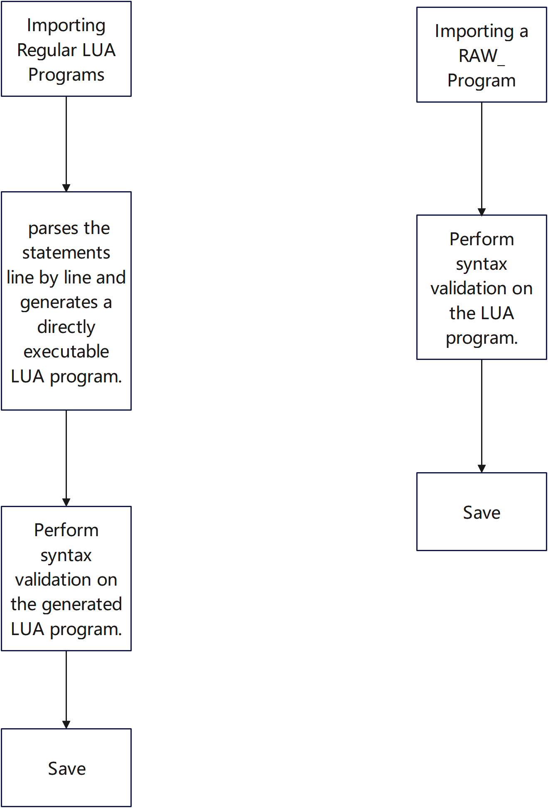

.. centered:: Figura 9.40‑3 Fluxograma de Importação de Programa LUA 

Para escrever arquivos `RAW_`, consulte o Manual do Usuário de Scripts de Programação FRLua. As seguintes funções LUA requerem análise e não são aplicáveis a arquivos `RAW_`.

laserPTP(), EXT_AXIS_PTP(), SPTP(), NewSP(), SplinePTP(), laserLin(), SLIN(), Lin(), laserARC(), ARC() 
laserCircle(), Circle(), TCPComputeCircleCenter(), unifCircle(), NewSpiral(), Spiral(), SCIRC() 
ModbusSlaveWriteDO(), ModbusSlaveWriteDI(), ModbusSlaveWriteAO(), ModbusSlaveWriteAI(), ModbusSlaveReadDO(), ModbusSlaveReadDI(), ModbusSlaveReadAO(), ModbusSlaveReadAI(), ModbusSlaveWaitDI(), ModbusSlaveWaitAI()
ModbusMasterWriteDO(), ModbusMasterWriteAO(), ModbusMasterReadDO(), ModbusMasterReadDI(), ModbusMasterReadAO(), ModbusMasterReadAI(), ModbusMasterWaitDI(), ModbusMasterWaitAI()
ModbusSlaveWriteDO_RTU(), ModbusSlaveWriteDI_RTU(), ModbusSlaveWriteAO_RTU(), ModbusSlaveWriteAI_RTU(), ModbusSlaveReadDO_RTU(), ModbusSlaveReadDI_RTU(), ModbusSlaveReadAO_RTU(), ModbusSlaveReadAI_RTU(), ModbusSlaveWaitDI_RTU(), ModbusSlaveWaitAI_RTU()
ModbusMasterWriteDO_RTU(), ModbusMasterWriteAO_RTU(), ModbusMasterReadDO_RTU(), ModbusMasterReadDI_RTU(), ModbusMasterReadAO_RTU(), ModbusMasterReadAI_RTU(), ModbusMasterWaitDI_RTU(), ModbusMasterWaitAI_RTU(), SetAO(), SetAuxAO(), SetToolAO(), WaitAI()
FieldBusSlaveWaitAI(), WaitToolAI(), WaitAuxAI(), SPLCSetAO(), SPLCSetToolAO(), SetToolList(), SetWObjList(), SetExToolList(), PostureAdjustOn(), RegisterVar(), SetSysVarValue(), GetSysVarValue(), MultilayerOffsetTrsfToBase(), GetSegWeldDisDir(), DMP()
LTSearchStart(), PointTableSwitch(), GetSegmentWeldPoint(), LaserRecordPoint(), GetIntersectionThrough3Point(), GetIntersectionThrough4Point(), GetUserVal(), SetUserVal(), MoveToIntersectLineStart(), MoveIntersectLine(), OriginPointWeaveStart()
MatrixMoveStart(), MatrixMoveEnd(), MatrixSetCountPlus(), MatrixGetCount(), MatrixSetStartCount().   