自定义协议从站指令
===========================

.. toctree:: 
   :maxdepth: 6

概述
-------------------

为了便于PLC通过不同的工业总线协议（CC-Link IEF Basic、Profinet、Ethernet/IP和EtherCAT）对机器人进行运动控制，在集成式mini控制箱上增加FRH-PCIeN-EC/EIP/CC/PN-RJ-V10板卡、FRJ-PCIeN-EIP/CC/PN-RJ-V10板卡、FRJ-PCIeN-EC-RJ-V10板卡设备。

环境配置
--------------------------

板卡型号、软件版本描述如下：

.. list-table:: 
   :widths: 20 50 30
   :header-rows: 1
   :align: center

   * - **协议类型**
     - **板卡型号**
     - **机器人软件版本**

   * - CC-Link IEF Basic
     - FRH-PCIeN-EC/EIP/CC/PN-RJ-V10板卡、FRJ-PCIeN-EIP/CC/PN-RJ-V10板卡
     - V3.8.0及以上

   * - Profinet
     - FRH-PCIeN-EC/EIP/CC/PN-RJ-V10板卡、FRJ-PCIeN-EIP/CC/PN-RJ-V10板卡
     - V3.8.0及以上

   * - Ethernet/IP
     - FRH-PCIeN-EC/EIP/CC/PN-RJ-V10板卡、FRJ-PCIeN-EIP/CC/PN-RJ-V10板卡
     - V3.8.0及以上

   * - EtherCAT
     - FRH-PCIeN-EC/EIP/CC/PN-RJ-V10板卡、FRJ-PCIeN-EC-RJ-V10板卡
     - V3.8.4.1及以上

FRH-PCIeN-EC/EIP/CC/PN-RJ-V10板卡硬件环境搭建
~~~~~~~~~~~~~~~~~~~~~~~~~~~~~~~~~~~~~~~~~~~~~~~~~~~~

1. 将FRH-PCIeN-EC/EIP/CC/PN-RJ-V10板卡安装到集成式mini控制箱，如图所示。

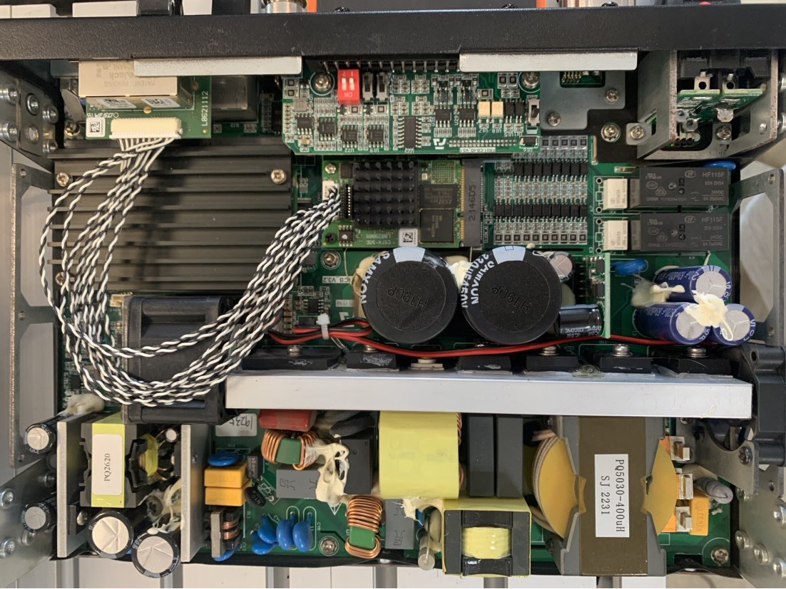

.. centered:: 图表 17.2-1 FRH-PCIeN-EC/EIP/CC/PN-RJ-V10板卡安装

.. image:: custom_protocol_slave/002.png
   :width: 4in
   :align: center

.. centered:: 图表 17.2-2 FRH-PCIeN-EC/EIP/CC/PN-RJ-V10板卡网口

2. 机器人控制箱和PLC接线如下图所示。

.. image:: custom_protocol_slave/003.png
   :width: 4in
   :align: center

.. centered:: 图表 17.2-3 控制箱&三菱PLC接线图

.. image:: custom_protocol_slave/004.png
   :width: 4in
   :align: center

.. centered:: 图表 17.2-4 控制箱&西门子PLC接线图

.. image:: custom_protocol_slave/005.png
   :width: 4in
   :align: center

.. centered:: 图表 17.2-5 控制箱&欧姆龙PLC接线图

.. image:: custom_protocol_slave/006.png
   :width: 4in
   :align: center

.. centered:: 图表 17.2-6 控制箱&欧姆龙PLC接线图

.. note:: 
    1：机器人控制箱（板卡网口）；
    2：交换机；
    3：笔记本PC；
    4：三菱PLC（CC-Link IEF Basic网口）；
    5：西门子PLC（Profinet网口）；
    6：欧姆龙PLC（Ethernet/IP网口）；
    7：欧姆龙PLC（EtherCAT网口）；

.. important:: 当协议切换为EtherCAT总线时，板卡的网口需要区分为EtherCAT_IN和EtherCAT_OUT，此时，欧姆龙PLC的EtherCAT网口需要与板卡的EtherCAT_IN网口通过一根网线直连。

FRJ-PCIeN板卡硬件环境搭建
~~~~~~~~~~~~~~~~~~~~~~~~~~~~~~~~~~~~~~~

1. 将板卡安装到集成式mini控制箱，如图所示。

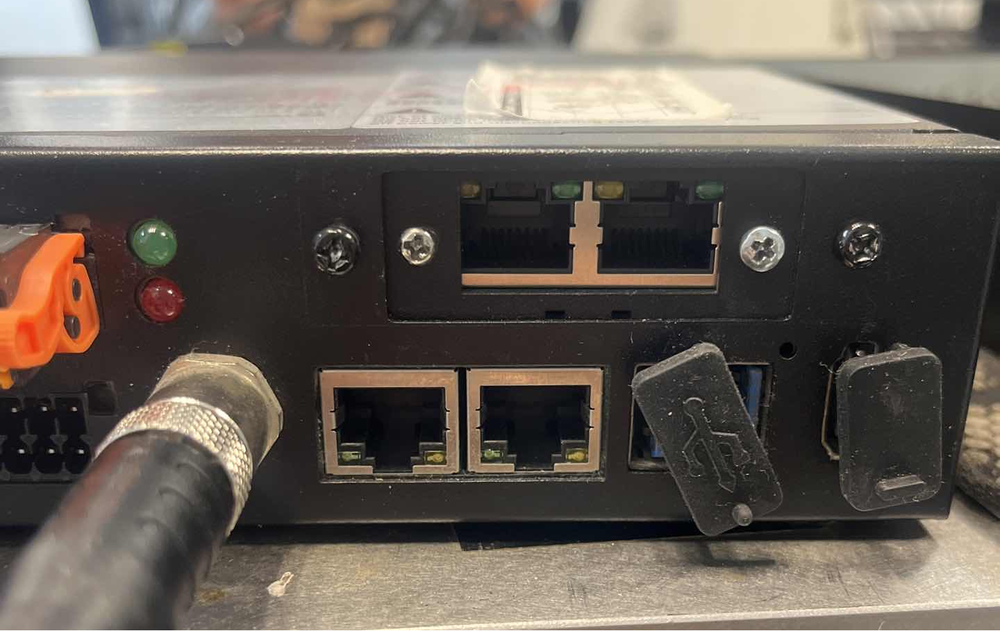

.. centered:: 图表 17.2-7 FRJ-PCIeN板卡网口

2. 机器人控制箱和PLC接线如下图所示。

.. image:: custom_protocol_slave/003.png
   :width: 4in
   :align: center

.. centered:: 图表 17.2-8 控制箱&三菱PLC接线图

.. image:: custom_protocol_slave/004.png
   :width: 4in
   :align: center

.. centered:: 图表 17.2-9 控制箱&西门子PLC接线图

.. image:: custom_protocol_slave/005.png
   :width: 4in
   :align: center

.. centered:: 图表 17.2-10 控制箱&汇川PLC接线图

.. note:: 
    1：机器人控制箱（板卡网口）；
    2：交换机；
    3：笔记本PC；
    4：三菱PLC（CC-Link IEF Basic网口）；
    5：西门子PLC（Profinet网口）；
    6：汇川PLC（Ethernet/IP）；

3. FRJ-PCIeN板卡进行协议切换时，需进行固件升级。在进行固件升级时，需将连接板卡PC的IP地址修为“192.168.0.xxx”，然后打开“网关工具集”软件->选择需要连接的PC网卡设备->点击右下角“开始”按钮->点击右上角“搜索”按钮，搜索板卡设备。

.. image:: custom_protocol_slave/045.png
   :width: 6in
   :align: center

.. centered:: 图表 17.2-11 连接板卡设备

4. 点击左下角“升级”按钮->选中板卡设备->点击右上角“…”按钮，选择需要的协议固件->点击“升级”按钮，等待固件升级完成即可。

.. image:: custom_protocol_slave/046.png
   :width: 6in
   :align: center

.. centered:: 图表 17.2-12 板卡协议切换

.. note:: 板卡进行协议切换后，板卡的IP地址会进行改变，具体如下表所示。

.. centered:: 表格 17.2-1 板卡IP地址

.. list-table:: 
   :widths: 20 80
   :header-rows: 1
   :align: center

   * - **协议**
     - **IP地址**

   * - CC-Link IEF Basic
     - 192.168.0.113

   * - Ethernet/IP
     - 192.168.0.112

   * - Profinet
     - 192.168.0.2

当协议配置为CC-Link IEF Basic时，控制器会将板卡IP修改为“192.168.0.113”。

当协议配置为Ethernet/IP时，控制器会将板卡IP修改为“192.168.0.112”。

当协议切换为Profinet时，并且从站设备名称与主站一致时，主站会自动配置从站的 IP 地址。

5. FRJ-PCIeN-EC-RJ-V10板卡固件升级

网址输入192.169.58.2进入机器人界面，点击 “初始设置”->“外设”->“板卡通讯”界面，可以获取到FRJ-PCIeN-EC-RJ-V10板卡固件版本号。选择待升级的bin文件，点击上传，等待固件升级成功后，重启控制箱即可。

.. image:: custom_protocol_slave/064.png
   :width: 6in
   :align: center

.. centered:: 图表 17.2-13 板卡固件升级

.. note:: 1、仅V3.9.2及以上版本支持Ethercat协议固件升级；2、升级Ethercat协议固件需卸载已运行的开放协议。

软件环境搭建
~~~~~~~~~~~~~~~~~~~~~~~~~~~~~~~~~~

1. 浏览器IP输入192.168.58.2，账号为admin，密码为123，点击“登录”，进入机器人控制箱Web界面。

.. image:: teaching_pendant_software/001.png
   :width: 6in
   :align: center

.. centered:: 图表 17.2-14 Web登录界面

2. 点击系统设置->关于界面，点击软件升级按钮，选择software.tar.gz文件，上传升级包。

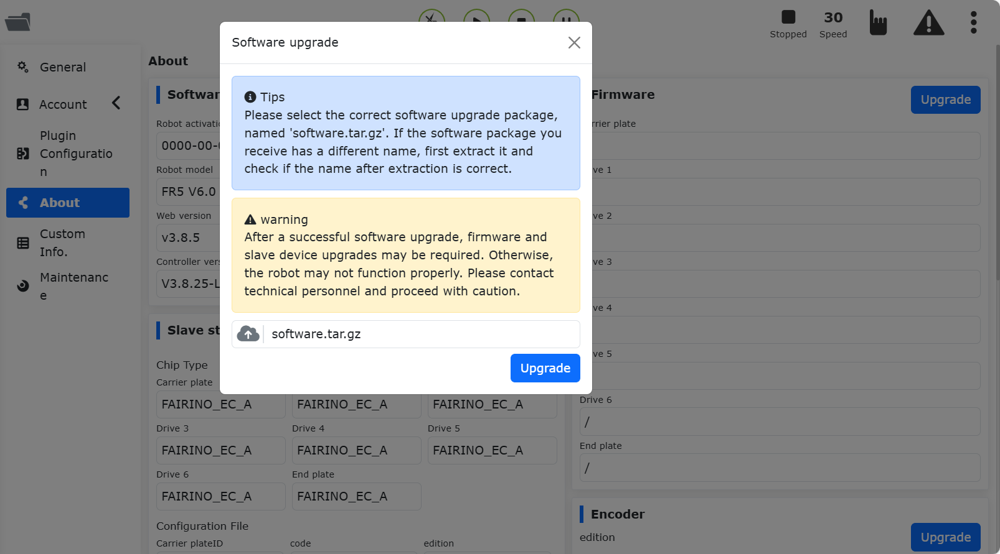

.. centered:: 图表 17.2-15 软件升级

.. note:: QX控制箱web版本需要3.8.0及以上，LA控制箱web版本需要3.8.0及以上。

3. 点击右上角扩展按钮，切换“本地模式”->“远程模式”。

.. image:: custom_protocol_slave/010.png
   :width: 4in
   :align: center

.. centered:: 图表 17.2-16 切换远程模式

4. 选择控制器从站协议，以及是否需要自启动功能，点击“设置”按钮。注意：切换不同的协议，需要先点击“卸载”按钮，再进行其他协议的配置。

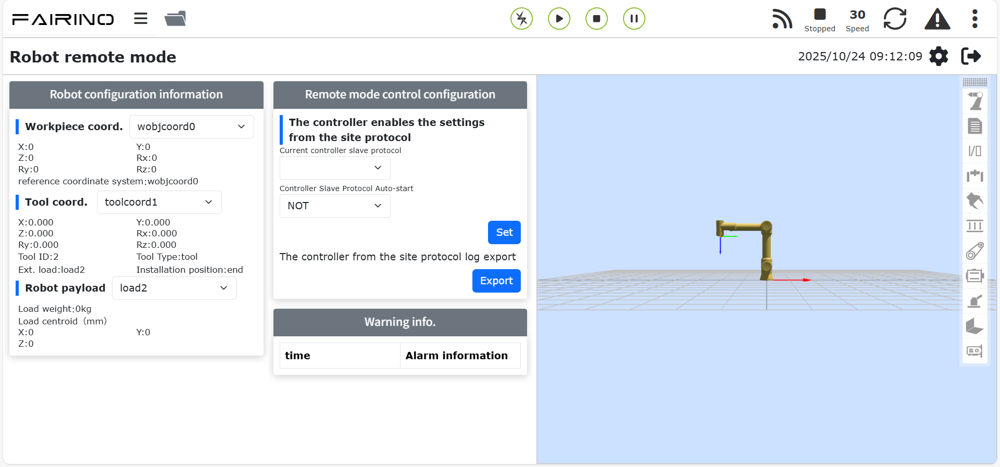

.. centered:: 图表 17.2-17 配置通讯协议

.. note:: 切换不同的协议，需要重启控制箱再进行协议的配置。

PLC环境搭建
~~~~~~~~~~~~~~~~~~~~~~~~~~~~~~~~~~

实现各协议从站指令所搭建的测试环境如下表所示，其中包括各协议中所使用PLC的型号，固件版本及测试软件。

.. list-table:: 
   :widths: 100 100 100 100 100
   :header-rows: 1
   :align: center

   * - 协议
     - 品牌
     - 型号
     - 固件
     - 软件
  
   * - Profinet
     - 西门子
     - CPU 1515-2 PN
     - 6ES75152AM020AB0
     - TIA Portal V17
  
   * - CC-Link IEF Basic
     - 三菱
     - FX5S-30TR/DS
     - 30MR/ES V1.3
     - GX Works3 V1.097B
  
   * - Ethernet/IP
     - 欧姆龙
     - MX102-1100
     - V1.3
     - Sysmac Studio V1.50
  
   * - EtherCAT
     - 汇川
     - Easy521-0808TN
     - /
     - AutoShop 4.10.2.4

西门子Profinet
++++++++++++++++++++++++++++++++++

1. GSD文件（XML文件）导入

打开西门子编程软件TIA Portal V17，新建PLC工程，选择“设备与网络”，右侧“硬件目录”选择双击6ES7 515-2AM02-0AB0添加PLC模块。

.. image:: custom_protocol_slave/012.png
   :width: 6in
   :align: center

在 TIA PORTAL 软件中菜单栏选择“选项”->“管理通用站描述文件(GSD)”可安装或删除已经安装完成的 GSD 文件。

.. image:: custom_protocol_slave/013.png
   :width: 6in
   :align: center

以安装FRH-PCIeN-EC/EIP/CC/PN-RJ-V10板卡 GSD 文件为例，如上选择“管理通用站描述文件(GSD)”，出现“管理通用站描述文件”窗口。

从“源路径”选择要安装 GSD 文件的文件夹，从所显示 GSD 文件的列表中选择要安装的一个或者多个文件，单击“安装”按钮。如下图所示。

.. image:: custom_protocol_slave/014.png
   :width: 6in
   :align: center

安装成功后，可在硬件目录下，其它现场设备找到安装的 GSD 文件的设备，如下图所示。

.. image:: custom_protocol_slave/015.png
   :width: 4in
   :align: center

2. 运行程序

打开工程“QNXtest”。

.. image:: custom_protocol_slave/016.png
   :width: 6in
   :align: center

编译程序：左侧项目树双击进入“设备和网络”，右击“PLC_1”模块，下拉菜单选择编译，单机“硬件和软件（仅更改）”。编译完成后将在软件视图下方提示“编译完成”。

.. image:: custom_protocol_slave/017.png
   :width: 6in
   :align: center

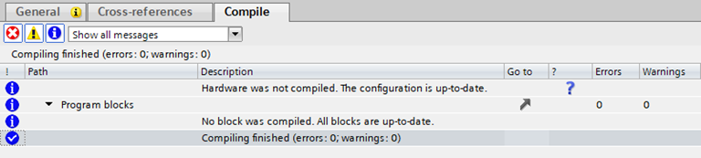

下载程序到设备：左侧项目树双击进入“设备和网络”，右击“PLC_1”模块，下拉菜单选择“下载到设备”，单机“硬件和软件（仅更改）”。

.. image:: custom_protocol_slave/019.png
   :width: 6in
   :align: center

搜索并下载设备：弹窗后如下图配置PG/PC接口类型，点击开始搜索，选择需要下载程序的设备，点击下载。

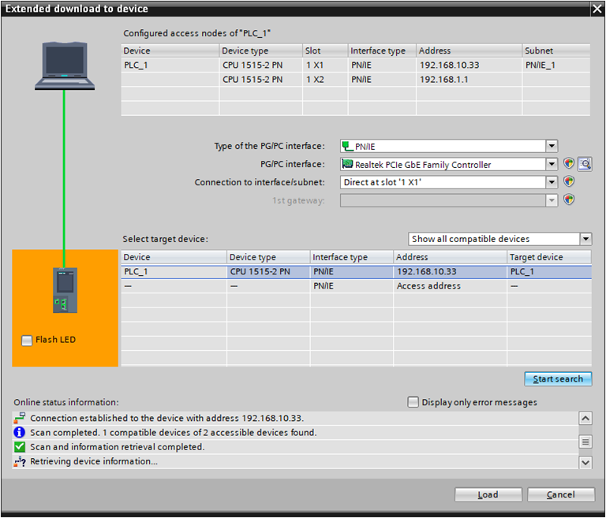

.. image:: custom_protocol_slave/021.png
   :width: 6in
   :align: center

三菱CC-Link IEF Basic
++++++++++++++++++++++++++++++++++

1. CC-Link IEF Basic设置

开启使用CC-Link IEF Basic：左侧导航菜单栏选择“以太网端口”，设置PLC ip地址，保证与FRH-PCIeN-EC/EIP/CC/PN-RJ-V10板卡地址同网段。点击“CC-Link IEF Basic使用有无”，选择 “使用”。

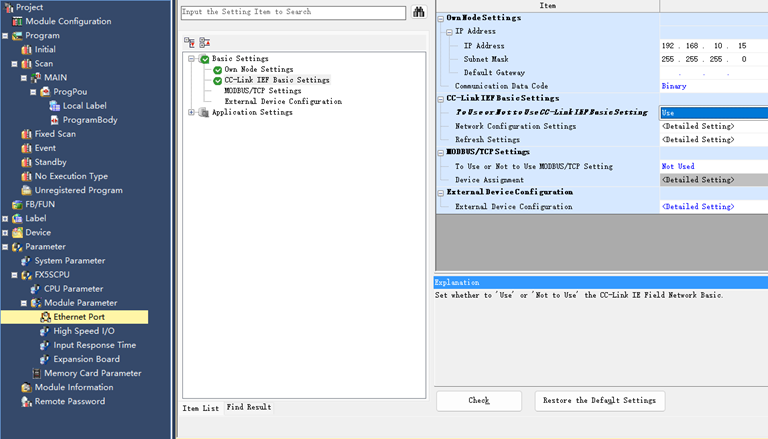

CC-Link IEF Basic 网络配置设置：同样在CC-Link IEF Basic设置，选择“网络配置设置”，模块选择FRH-PCIeN-EC/EIP/CC/PN-RJ-V10板卡CIFX Digital I/O模块。拖拽到视图左下方，完成硬件配置。

.. image:: custom_protocol_slave/023.png
   :width: 6in
   :align: center

CC-Link IEF Basic 刷新设置：同样在CC-Link IEF Basic设置，点击刷新设置，自定义传输设置：256字节接收，256字节发送。

.. image:: custom_protocol_slave/024.png
   :width: 6in
   :align: center

2. 程序下载

打开测试程序后，点击“在线”→“写入至可编程控制器”进入下载界面。

.. image:: custom_protocol_slave/025.png
   :width: 6in
   :align: center

打开下载界面后，点击左上方“参数+程序”，再点击右下角“执行”进行下载，等待下载完成。

.. image:: custom_protocol_slave/026.png
   :width: 6in
   :align: center

汇川EtherCAT
++++++++++++++++++++++++++++++++++

1. XML文件导入

打开汇川编程软件AutoShop，新建PLC工程，右侧工具箱栏选择“EtheCATDevices”：

.. image:: custom_protocol_slave/052.png
   :width: 6in
   :align: center

鼠标左键点击“EtheCATDevices”后，右键弹出“导入设备XML”对话框，左键确定，找到放置板卡XML文件的文件夹。

导入成功后“EtherCAT Devices”目录下会出现板卡的名称，这时关闭工程重新打开后完成XML文件导入流程。

.. image:: custom_protocol_slave/053.png
   :width: 6in
   :align: center

2. XML文件导入

左侧工具栏双击变量表，新建输入为256字节的数组，软元件地址为D0。新建输出为256字节的数组，软元件地址为D200。

.. image:: custom_protocol_slave/054.png
   :width: 6in
   :align: center

左侧工具栏“EtherCAT”下双击“Xone-PCIe-ECATs”，在弹出对话框中单击 “I/O功能映射”，单击方框进行变量地址绑定，在弹出对话框中单击“变量表”，在选择需要对应的输入\输出，单击确定，其他地址按顺序绑定操作同上。

.. image:: custom_protocol_slave/055.png
   :width: 6in
   :align: center

3. 程序下载

打开测试程序，将PLC IP地址改为“192.168.0.88”，默认是“192.168.1.88”。

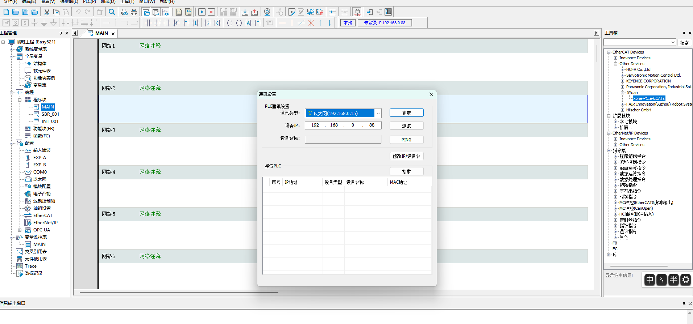

点击“修改IP/设备名”进入IP修改设置界面，将IP地址和网关修改为“192.168.0.88”：

.. image:: custom_protocol_slave/057.png
   :width: 6in
   :align: center

点击“修改IP”，弹出对话框后点击“是”确认，修改IP地址成功。

.. image:: custom_protocol_slave/058.png
   :width: 6in
   :align: center

通讯成功，下载PLC程序。

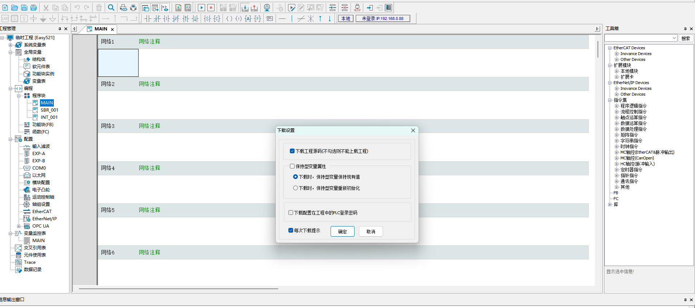

HMI设置（CC-Link IEF Basic仿真）
~~~~~~~~~~~~~~~~~~~~~~~~~~~~~~~~~~~~~~~~~

1. 登录HMI界面后使能“Enable Task”建立PLC与控制器通信连接。

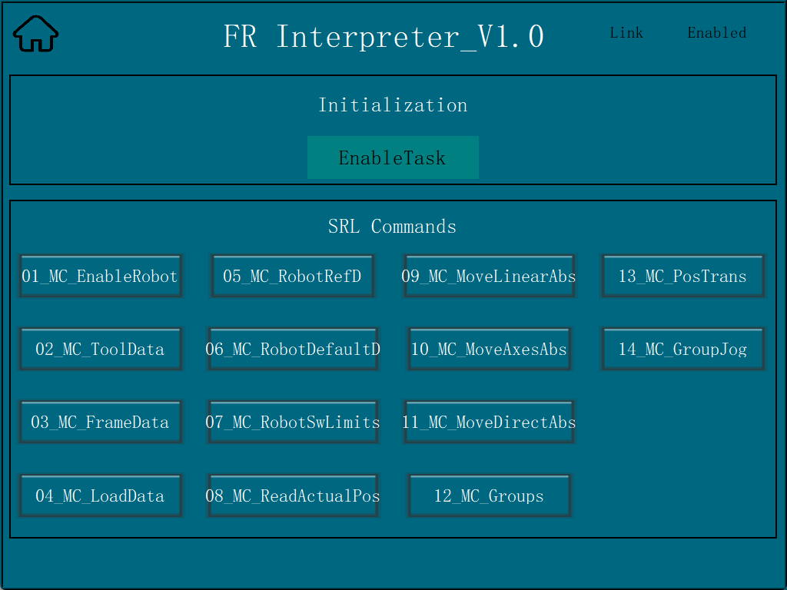

2. 点击01_MC_EnableRobot界面后再点击“EnableRobot”使能机器人，使用过程中如有报错，点击“Reset”复位。

.. image:: custom_protocol_slave/028.png
   :width: 6in
   :align: center

3. 点击“02_MC_ToolData”进入工具信息界面，左边输入参数后点击WriteToolData写入工具信息；右边点击ReadToolData读取现有工具信息。
   
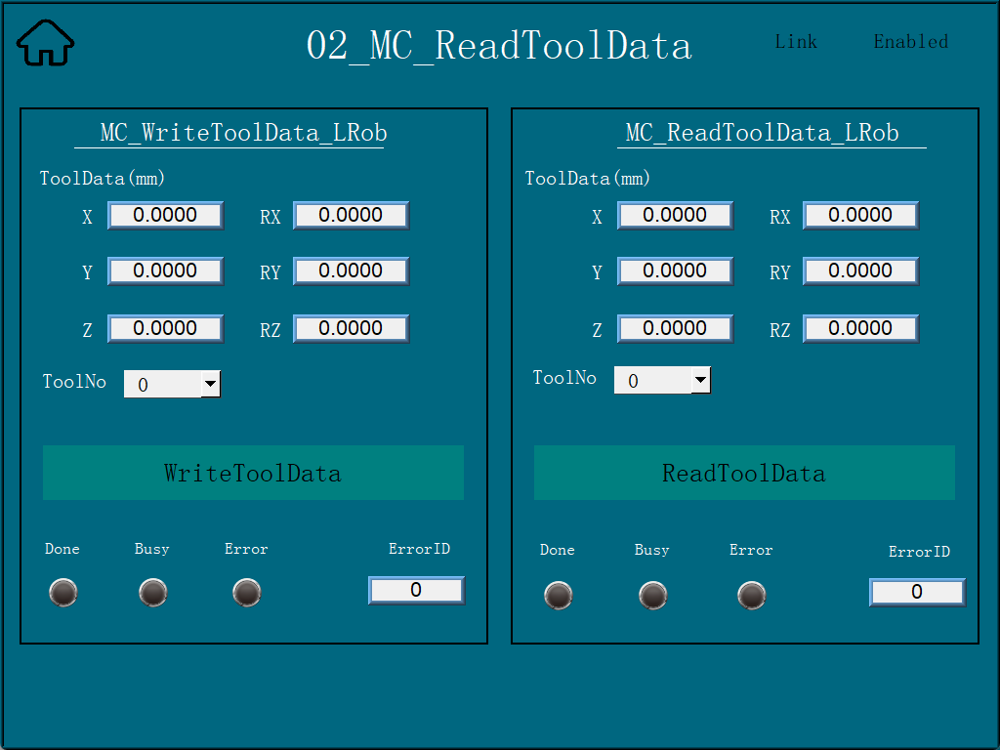

4. 点击“03_MC_FrameData”进入工件信息界面，左边输入参数后点击WriteFrameData写入工件信息；右边点击ReadFrameData读取现有工件信息。
   
.. image:: custom_protocol_slave/030.png
   :width: 6in
   :align: center

5. 点击“04_MC_LoadData”进入负载信息界面，左边输入参数后点击WriteLoadData写入负载信息；右边点击ReadLoadData读取现有负载信息。
   
.. image:: custom_protocol_slave/031.png
   :width: 6in
   :align: center

6. 点击“05_MC_RobotReferenceDynamics”进入机器人最大速度和最大加速度界面，左边输入参数后点击WriteRobotRefD写入最大速度和最大加速度信息；右边点击ReadRobotRefD读取最大速度和最大加速度信息。
   
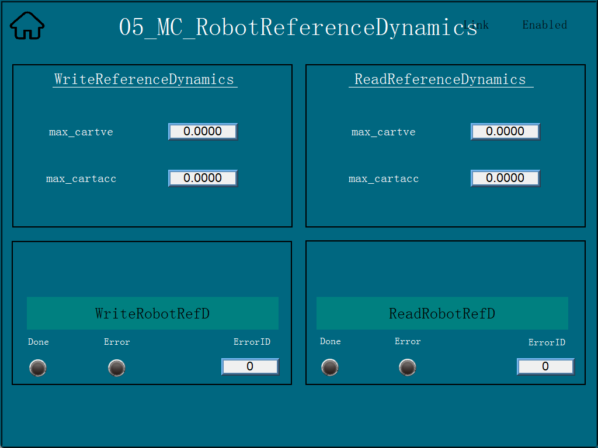

7. 点击“06_MC_Robot DefaultDynamics”进入机器人默认速度和默认加速度界面，左边输入参数后点击WriteRobotDefD写入默认速度和默认加速度信息；右边点击ReadRobotDefD读取默认速度和默认加速度信息。
   
.. image:: custom_protocol_slave/033.png
   :width: 6in
   :align: center

8. 点击“07_MC_RobotSwLimits”进入坐标限位界面，左边输入最大限位和最小限位参数值后点击WriteRobotSwLimits写入限位参数信息；右边点击ReadRobotSwLimits读取现有限位参数信息。
   
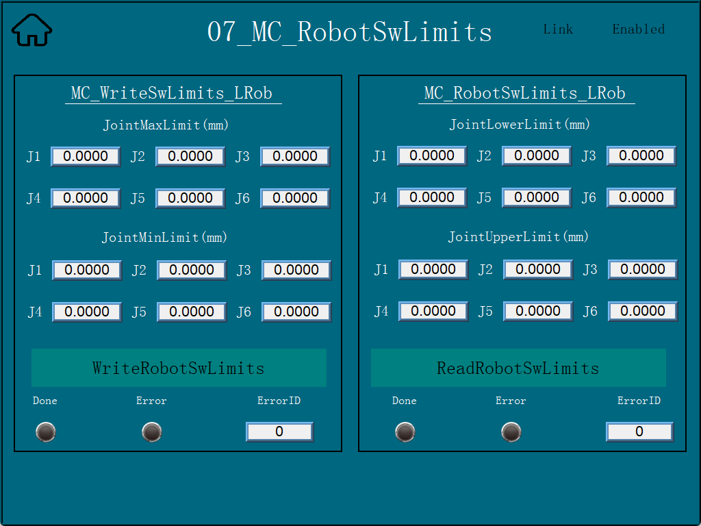

9. 点击“08_MC_ReadActualPosition”进入读取实际位置界面，点击读取ReadPosition读取现有位置信息。
   
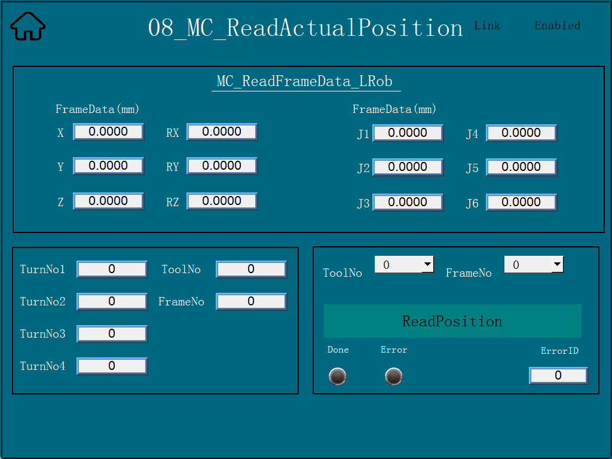

10. 点击“09_MC_MoveLinearAbsolute”进入线性运动界面，输入坐标参数后点击MoveLinearAbsolute使机器人以目标位置线性移动。
   
.. image:: custom_protocol_slave/036.png
   :width: 6in
   :align: center

11. 点击“10_MC_MoveAxesAbsolute”进入轴坐标运动界面，输入坐标参数后点击MoveAxesAbsolute使机器人以输入的轴坐标为终点向目标位置移动。
   
.. image:: custom_protocol_slave/037.png
   :width: 6in
   :align: center

12. 点击“11_MC_MoveDirectAbsolute”进入直接运动界面，输入坐标参数后点击MoveDirectAbsolute使机器人以输入参数为终点直接向目标位置移动。
   
.. image:: custom_protocol_slave/038.png
   :width: 6in
   :align: center

13. 点击“12_MC_Groups”进入直接运动操作界面，其中，点击GroupInterrupt可以使机器人在运动过程中中断移动，点击GroupContinue使机器人继续向目标位置移动。点击GroupStop停止（结束）正在进行的位置移动动作。如在过程中触犯报警或错误，点击GroupReset复位机器人错误。
   
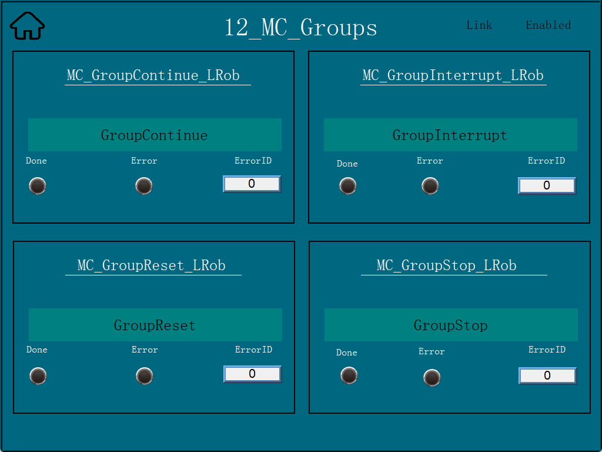

14. 点击“13_MC_PositionConversion”进入位置换算界面，XtoJ1可进行笛卡尔位姿到关节角度的转换，J1toX可进行关节角度到笛卡尔位姿的转换。
   
.. image:: custom_protocol_slave/040.png
   :width: 6in
   :align: center

15. 点击“14_MC_GroupJog”进入机器人点动界面，配置完毕后下拉坐标轴选择需要点动的轴，再选择轴的旋转方向。点击JogMove进行点动。右边MC_ChangeSpeedOverride可调整机械臂的移动速度。
   
.. image:: custom_protocol_slave/041.png
   :width: 6in
   :align: center

HMI设置（Profinet仿真）
~~~~~~~~~~~~~~~~~~~~~~~~~~~~~~~~~~~~~~~~~

1. 打开程序后单击选择项目树中的“HMI_1[ktp700 Basic PN]”，之后在菜单栏中点击“在线”→“仿真”→“启动”。等待软件编译并仿真。

2. 仿真后功能与威纶通屏幕（CC-Link IEF Basic）内容一致。可参考上述内容设置。
   
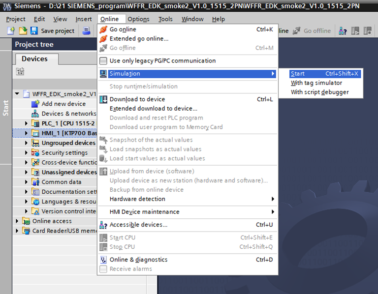

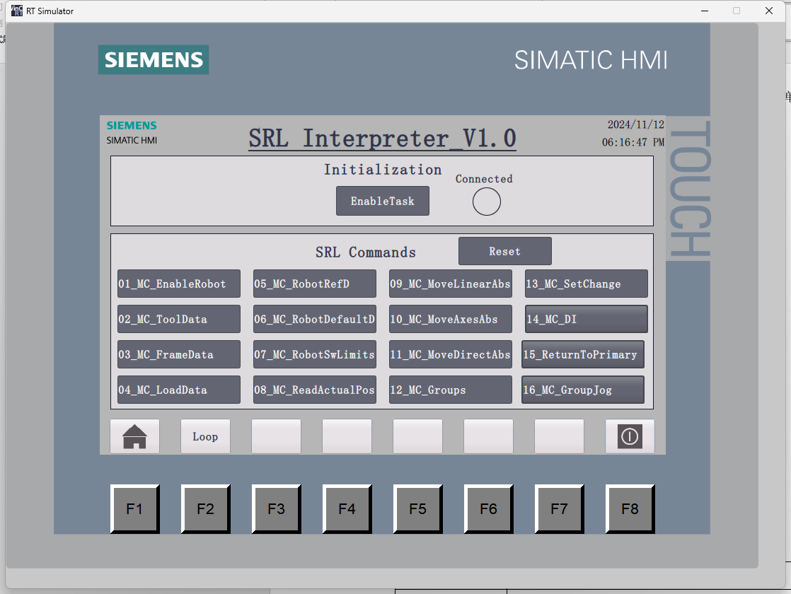

机器人从站模式相关操作说明
---------------------------------------------------------

加载从站模式
~~~~~~~~~~~~~~~~~~~~~~~~~~~~~~~~~

**Step 1**：打开WebApp，进入初始设置->外设->板卡通讯->手动配置。

.. image:: custom_protocol_slave/047.png
   :width: 6in
   :align: center

.. centered:: 图表 17.3-1 板卡通讯手动配置

首先，对FRJ-PCIeN板卡IP地址进行配置，如不填写，则板卡按照默认IP: 192.168.0.100进行启动配置。目前IP配置仅适用于EIP、CC-Link IEF Basic协议，PN协议由PLC主站扫描从站设备分配IP。

.. note:: 页面上更改IP地址后，需要加载从站模式方可生效。

依次选择DI、DO、AO所需映射功能（见附录一），各参数意义如下：

- DI为机器人控制：机器人从站接受外部信号输入，执行映射的功能；
  
- DO为机器人状态输出：机器人从站反馈状态信号至主站；
  
- AO为机器人状态反馈：机器人从站反馈状态数据至主站，AO0~AO15为有符号整形(int16)，AO16~AO31为单精度浮点数(float)。

**Step 2**：点击“配置”按钮，生成开放协议lua文件。

.. image:: custom_protocol_slave/048.png
   :width: 6in
   :align: center

.. centered:: 图表 17.3-2 设备操作及状态

.. note:: 开放协议lua文件支持下载，可在自动配置界面导入开放协议lua文件。

生成程序示例如下：

.. code-block:: console
   :linenos:

   local id = 3 
   local ctrlDI = {0, 0, 0, 0, 0, 0}
   local funcDI = {0, 0, 0, 0, 0, 0, 0, 0, 0, 0, 0, 0, 0, 0, 0, 0}
   local DOState = {0, 0, 0, 0, 0, 0, 0, 0}
   local AOState = {0, 0, 0, 0, 0, 0, 0, 0, 0, 0, 0, 0, 0, 0, 0, 0, 0, 0, 0, 0, 0, 0, 0, 0, 0, 0, 0, 0, 0, 0, 0, 0}
   -- Launch the board communication process
   LoadFieldBusSlave()
   sleep_ms(8000)
   while(1) do
      -- Set the DO status
      CtrlBoxDO, CtrlBoxCO, CtrlBoxDI, CtrlBoxCI, errState, motionState, moveToOriginState, robotStartDoneState, modeChangeState, programStartStopState, emergencyState, reduceState, collision, enablestate, safetyStop0, safetyStop1, pauseState, interfereState = GetRobotFuncDOState()
      DOState[1] = CtrlBoxDO
      DOState[2] = CtrlBoxCO
      DOState[3] = CtrlBoxDI
      DOState[4] = CtrlBoxCI
      local ctrlWord0 = 0
      ctrlWord0 = SetBitWithIndex(ctrlWord0, 0, errState)
      ctrlWord0 = SetBitWithIndex(ctrlWord0, 1, motionState)
      ctrlWord0 = SetBitWithIndex(ctrlWord0, 2, moveToOriginState)
      ctrlWord0 = SetBitWithIndex(ctrlWord0, 3, robotStartDoneState)
      ctrlWord0 = SetBitWithIndex(ctrlWord0, 4, modeChangeState)
      ctrlWord0 = SetBitWithIndex(ctrlWord0, 5, programStartStopState)
      ctrlWord0 = SetBitWithIndex(ctrlWord0, 6, emergencyState)
      ctrlWord0 = SetBitWithIndex(ctrlWord0, 7, reduceState)
      DOState[5] = ctrlWord0
      local ctrlWord1 = 0
      ctrlWord1 = SetBitWithIndex(ctrlWord1, 0, collision)
      ctrlWord1 = SetBitWithIndex(ctrlWord1, 1, enablestate)
      ctrlWord1 = SetBitWithIndex(ctrlWord1, 2, safetyStop0)
      ctrlWord1 = SetBitWithIndex(ctrlWord1, 3, safetyStop1)
      ctrlWord1 = SetBitWithIndex(ctrlWord1, 4, pauseState)
      ctrlWord1 = SetBitWithIndex(ctrlWord1, 5, interfereState)
      DOState[6] = ctrlWord1
      SetFieldBusDOState(DOState)

      -- Set the AO status
      mainErrCode, subErrCode, TCPSpeed, axisPos1, axisPos2, axisPos3, axisPos4, axisPos5, axisPos6, jointVelFeedback1, jointVelFeedback2, jointVelFeedback3, jointVelFeedback4, jointVelFeedback5, jointVelFeedback6, jointCurFeedback1, jointCurFeedback2, jointCurFeedback3,jointCurFeedback4,jointCurFeedback5,jointCurFeedback6, jointTorqueFeedback1, jointTorqueFeedback2,jointTorqueFeedback3,jointTorqueFeedback4, jointTorqueFeedback5, jointTorqueFeedback6, cartPosx, cartPosy, cartPosz, cartPosrx, cartPosry, cartPosrz = GetRobotFuncAOState()
      AOState[1] = mainErrCode
      AOState[2] = subErrCode
      AOState[17] = axisPos1
      AOState[18] = axisPos2
      AOState[19] = axisPos3
      AOState[20] = axisPos4
      AOState[21] = axisPos5
      AOState[22] = axisPos6
      AOState[23] = cartPosx
      AOState[24] = cartPosy
      AOState[25] = cartPosz
      AOState[26] = cartPosrx
      AOState[27] = cartPosry
      AOState[28] = cartPosrz
      SetFieldBusAOState(AOState)
      sleep_ms(10) 

      -- Set the DI status
      -- Configue the DI function and update it in real-time
      ctrlDI[1],ctrlDI[2],ctrlDI[3],ctrlDI[4],ctrlDI[5],ctrlDI[6] = GetFieldBusDIState()
      funcDI[1] = ctrlDI[1] 
      funcDI[2] = ctrlDI[2] 
      funcDI[3] = GetBitWithIndex(ctrlDI[3], 0)
      funcDI[4] = GetBitWithIndex(ctrlDI[3], 1)
      funcDI[5] = GetBitWithIndex(ctrlDI[3], 2)
      funcDI[6] = GetBitWithIndex(ctrlDI[3], 3)
      funcDI[7] = GetBitWithIndex(ctrlDI[3], 4)
      funcDI[8] = GetBitWithIndex(ctrlDI[3], 5)
      funcDI[9] = GetBitWithIndex(ctrlDI[3], 6)
      funcDI[10] = GetBitWithIndex(ctrlDI[3], 7)
      funcDI[11] = GetBitWithIndex(ctrlDI[4], 0)
      funcDI[12] = GetBitWithIndex(ctrlDI[4], 1)
      funcDI[13] = GetBitWithIndex(ctrlDI[4], 2)
      funcDI[14] = GetBitWithIndex(ctrlDI[4], 3)
      funcDI[15] = GetBitWithIndex(ctrlDI[4], 4)
      funcDI[16] = GetBitWithIndex(ctrlDI[4], 5)
      SetRobotFuncDIState(funcDI)
      local stopFlag = GetOpenLUAStopFlag(id)
      if(stopFlag ~= 0) then 
         UnloadFieldBusSlave()
         break
      end
      sleep_ms(10)
   end

**Step 3**：点击加载按钮，加载机器人从站模式。

.. image:: custom_protocol_slave/049.png
   :width: 6in
   :align: center

.. centered:: 图表 17.3-3 加载从站模式

.. note:: 机器人从站模式加载成功后，支持开机自启动功能。如需使用远程模式，请先卸载从站模式。

**Step 4**：点击右侧状态栏按钮，监控DI、DO、AI、AO交互信息，各参数介绍如下：

- CtrlDO为主站设备控制机器人控制箱DO的信号输入值；
  
- DI为外部主站控制信号输入值；
  
- DO为机器人从站反馈信号输出值；
  
- AI为外部主站输入值，AI0~AI15为int16类型，AI16~AI31为float类型；
  
- AO为机器人从站输出值，AO0~AO15为int16类型，AO16~AO31为float类型。

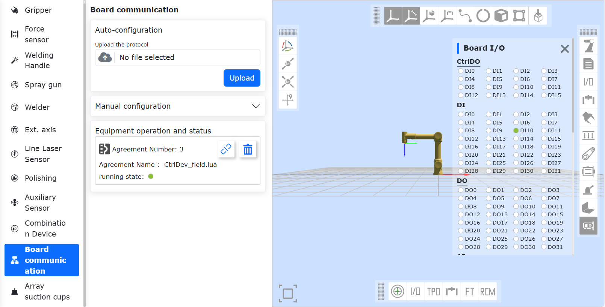

.. centered:: 图表 17.3-4 DI、DO、AI、AO交互信息

**Step 5**：加载完成后，可通过示教程序->通讯指令->板卡生成板卡lua指令，实现设置从站DO、AO，获取从站DI、AI，等待从站DI、AI。

.. image:: custom_protocol_slave/051.png
   :width: 6in
   :align: center

.. centered:: 图表 17.3-5 板卡生成板卡lua指令

:download:`附件一：从站模式地址映射表 <../_static/_doc/控制箱从站模式地址对照表.xlsx>`

板卡通讯周期配置
---------------------------------------------------------

通过上位机可以配置板卡的通讯周期，当前仅提供PN协议固件，后续兼容EIP、CClink ie basic、ECAT协议。

(1) 将PC（Win11系统）网口与板卡网口直连，打开Device Assistant v1.1.0，双击“以太网”，点击左上角“刷新”按钮，可以扫描到当前连接的板卡设备。

.. image:: custom_protocol_slave/060.png
   :width: 6in
   :align: center

.. image:: custom_protocol_slave/061.png
   :width: 6in
   :align: center

(2) 在固件更新界面，上传新版本PN固件，点击“更新”按钮，左下角提示“升级成功”打印即可。

.. image:: custom_protocol_slave/062.png
   :width: 6in
   :align: center

(3) 输入需要的通讯周期（支持1~100ms），点击“设置”按钮，左下角提示“周期设置成功”打印即可。

.. image:: custom_protocol_slave/063.png
   :width: 6in
   :align: center

附录
-------------------

指令列表
~~~~~~~~~~~~~~~~~~~~~~~~~~~

.. list-table:: 
   :widths: 20 80
   :header-rows: 1
   :align: center

   * - 命令码
     - 指令描述

   * - 0x1000
     - 机器人使能

   * - 0x1001
     - 重置所有错误

   * - 0x1002
     - 机器人停止运动

   * - 0x1003
     - 读取实际位置

   * - 0x1004
     - 设置机器人速度

   * - 0x1005
     - 机器人继续运动

   * - 0x1006
     - 机器人暂停运动

   * - 0x1007
     - 根据joint位置计算出笛卡尔位置

   * - 0x1008
     - 根据笛卡尔位置计算出joint位置

   * - 0x2000
     - 写工具信息

   * - 0x2001
     - 读工具信息

   * - 0x2002
     - 写工件信息

   * - 0x2003
     - 读工件信息

   * - 0x2004
     - 写负载信息

   * - 0x2005
     - 读负载信息

   * - 0x2006
     - 写reference dynamic信息

   * - 0x2007
     - 读reference dynamic信息

   * - 0x2008
     - 写default dynamic信息

   * - 0x2009
     - 读default dynamic信息

   * - 0x2010
     - 写软限位信息

   * - 0x2011
     - 读软限位信息

   * - 0x3000
     - MoveAxes（基于关节角度）

   * - 0x3001
     - MoveLinear

   * - 0x3002
     - MoveDirect（基于笛卡尔坐标系）

   * - 0x3003
     - jog运动

   * - 0x3004
     - jog停止