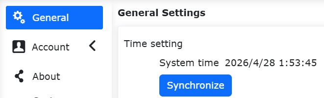

Instalação e Alimentação do Robô
===========================================

.. toctree:: 
   :maxdepth: 6

Instalando o Braço Robótico
----------------------------------

Ao instalar o robô colaborativo em uma base de montagem, use a quantidade correta de parafusos (com resistência não inferior a classe 8.8) para fixar o robô firmemente na base. Recomenda-se o uso de dois furos de pino na base, combinados com pinos, para posicionar o robô. Isso aumenta a precisão da instalação e evita o movimento do robô devido a colisões. Quando o robô tem altos requisitos de precisão de operação, certifique-se de adicionar pinos para posicioná-lo.

.. centered:: Tabela 1.1-1 Padrões das Peças de Instalação do Robô

.. list-table::
   :widths: 80 50 50 50
   :header-rows: 0
   :align: center

   * - **Modelo do Robô Colaborativo**
     - **Parafuso**
     - **Torque do Parafuso**
     - **Especificação do Furo do Pino**

   * - FR3
     - 4 parafusos M6
     - ≥10 Nm
     - φ5mm

   * - FR3-WMS
     - 4 parafusos M6
     - ≥10 Nm
     - φ5mm

   * - FR3-WML
     - 4 parafusos M6
     - ≥10 Nm
     - φ5mm

   * - FR3-C
     - 4 parafusos M6
     - ≥10 Nm
     - φ5mm

   * - FR5-C
     - 4 parafusos M6
     - ≥10Nm
     - φ5mm
   
   * - FR5
     - 4 parafusos M8
     - ≥20 Nm
     - φ8mm

   * - FR10
     - 4 parafusos M8
     - ≥25 Nm
     - φ8mm

   * - FR16
     - 4 parafusos M8
     - ≥25 Nm
     - φ8mm

   * - FR20
     - 6 parafusos M10
     - ≥45 Nm
     - φ8mm

   * - FR30
     - 6 parafusos M10
     - ≥45 Nm
     - φ8mm

   * - FR30L
     - 6 parafusos M10
     - ≥45 Nm
     - φ8mm

.. important:: 
   Recomenda-se que a base de montagem do robô atenda aos seguintes requisitos para garantir uma instalação firme e estável:
   
   (1) A base de montagem do robô deve ser suficientemente robusta e ter capacidade de carga adequada. Deve ser capaz de suportar pelo menos 5 vezes o peso do robô e pelo menos 10 vezes o torque do eixo 1.

   (2) A superfície da base de montagem do robô deve ser plana para garantir contato firme com a superfície de montagem do robô.

   (3) A base de montagem do robô deve ser rígida o suficiente e firmemente fixada para não ressoar com o robô.

   (4) Quando o robô e outros componentes se movem simultaneamente, a base de montagem deve ser isolada de outros componentes móveis. Não os fixe juntos para evitar interferência de vibração durante o movimento.

   (5) Se o robô estiver montado em uma plataforma móvel ou eixo externo, a aceleração da plataforma móvel ou eixo externo deve ser a mais baixa possível.

Conectando o Painel de Controle
---------------------------------------

Esta série de robôs pode ser configurada com três tipos diferentes de painéis de controle quanto à entrada de energia. Consulte a placa de identificação do painel de controle para informações detalhadas sobre a entrada de energia. O robô requer aterramento elétrico. As conexões externas do sistema de controle do manipulador usam conectores plugáveis para instalação rápida.

A. 30-60 VCC
B. 176-264 VCA~50-60 Hz
C. 100-240 VCA~50-60 Hz

.. note:: Os painéis de controle com entrada CA têm duas versões: uma de tensão estreita e outra de ampla tensão. Os terminais de fiação e a aparência dos painéis de controle são idênticos. Eles não podem ser diferenciados apenas pela aparência. Por favor, verifique a placa de identificação do painel de controle e confirme antes de ligar.

O painel de fiação do robô colaborativo é mostrado na figura abaixo:

.. image:: installation/037.png
   :width: 6in
   :align: center

.. centered:: Figura 1.2-1 Painel de Fiação do Painel de Controle

A interface do painel de botões é, por padrão, a porta de controle do painel de ensinamento, com o endereço IP 192.168.58.2. Use um cabo de rede para conectar a interface do painel de botões a um computador. Defina o endereço IP do computador para 192.168.58.10 ou para o mesmo segmento de rede. Abra o navegador Google Chrome e digite 192.168.58.2 para acessar a página do painel de ensinamento.

Conhecendo o Painel de Botões e o LED da Extremidade
---------------------------------------------------------------

Painel de Botões
~~~~~~~~~~~~~~~~~~~~~~~~~~~

Painel de Botões 60 (POE)(BX01)
+++++++++++++++++++++++++++++++++++++++

.. figure:: installation/058.png
   :align: center
   :width: 6in

.. centered:: Figura 1.3-1 Painel de Botões 60 (POE)

Painel de Botões 60 (POE)(BX02)-V1.0
++++++++++++++++++++++++++++++++++++++++++++++++

.. image:: installation/059.png
   :width: 6in
   :align: center

.. centered:: Figura 1.3-2 Painel de Fiação do Painel de Controle

.. centered:: Tabela 1.3-1 Descrição dos Botões do Painel de Fiação do Painel de Controle

.. list-table::
   :widths: 50 200
   :header-rows: 0
   :align: center

   * - **Nome do Botão**
     - **Função**

   * - Botão de Parada de Emergência
     - Quando pressionado, o robô entra em estado de parada de emergência.

   * - Iniciar/Parar
     - Inicia/para a execução do programa.

   * - Porta de Rede
     - Conecta ao painel de ensinamento web.

   * - Desligar
     - Temporariamente não ativado.

   * - Registrar Ponto
     - Registra um ponto de ensinamento.

   * - Modo de Ensinamento
     - Entra/sai do modo de ensinamento.

   * - Modo de Operação
     - Alterna entre os modos automático e manual.

   * - Modo de Arrasto
     - Entra/sai do modo de arrasto.

Painel de Botões 60 (POE)(BX02)-V2.0
++++++++++++++++++++++++++++++++++++++++++++

.. image:: installation/079.png
   :width: 6in
   :align: center

.. centered:: Figura 1.3-3 Painel de Fiação do Painel de Controle

.. centered:: Tabela 1.3-2 Descrição dos Botões do Painel de Fiação do Painel de Controle

.. list-table::
   :widths: 50 200
   :header-rows: 0
   :align: center

   * - **Nome do Botão**
     - **Função**

   * - Botão de Parada de Emergência
     - Quando pressionado, o robô entra em estado de parada de emergência.

   * - Iniciar/Parar
     - Inicia/para a execução do programa.

   * - Porta de Rede
     - Conecta ao painel de ensinamento web.

   * - Reset de IP
     - Redefine o IP da porta de rede.

   * - Registrar Ponto
     - Registra um ponto de ensinamento.

   * - Limpeza com um Toque
     - Limpa todos os erros recuperáveis.

   * - Modo de Operação
     - Alterna entre os modos automático e manual.

   * - Modo de Arrasto
     - Entra/sai do modo de arrasto.

LED da Extremidade
~~~~~~~~~~~~~~~~~~~~~~~~~~~

.. centered:: Tabela 1.3-3 Definição do LED da Extremidade

.. list-table::
   :widths: 120 100
   :header-rows: 0
   :align: center

   * - **Função**
     - **Cor do LED**

   * - Quando a comunicação não está estabelecida
     - Alterna entre "apagado", "vermelho", "verde", "azul"

   * - Modo Automático
     - Azul fixo

   * - Modo Manual
     - Verde fixo

   * - Modo de Arrasto
     - Azul esverdeado (ciano) fixo

   * - Registro de ponto pelo painel de botões (apenas ao usar o painel de botões)
     - Pisca roxo duas vezes

   * - Entrando no estado sem painel de botões (apenas ao usar o painel de botões)
     - Pisca azul esverdeado (ciano) duas vezes

   * - Início da execução (apenas ao usar o painel de botões)
     - Pisca azul duas vezes

   * - Parada da execução (apenas ao usar o painel de botões)
     - Pisca vermelho duas vezes

   * - Erro (apenas ao usar o painel de botões)
     - Vermelho fixo

   * - Calibração do zero concluída
     - Pisca azul esverdeado (ciano) três vezes

   * - Desabilitação
     - Pisca amarelo duas vezes

Habilitando Após Ligar
------------------------------

Antes de ligar, verifique se o botão de parada de emergência do painel de botões está na posição de liberado. Pressione o botão vermelho no painel de controle para ligar. Após a habilitação bem-sucedida, o LED da extremidade ficará verde fixo.

Desligando a Alimentação
------------------------------

.. important:: 
   Ao usar este equipamento, certifique-se de parar todos os programas em execução, desativar as funções de consulta de status e confirmar que o estado de operação está "Parado" antes de desligar a alimentação. Esta operação visa proteger o equipamento e a segurança dos dados armazenados, evitando perda de dados ou danos ao sistema devido a uma interrupção repentina de energia.

.. image:: installation/078.png
   :width: 6in
   :align: center

.. centered:: Figura 1.5-1 Botão de Desligar

Bateria Botão da Caixa de Controle
----------------------------------------------------------------

Causas Comuns de Perda de Hora
~~~~~~~~~~~~~~~~~~~~~~~~~~~~~~~~~~~~~~~~~~~~~~~~~~~~~~~~~~~~~~~~~~~~~~~~

Este dispositivo usa uma bateria botão externa como fonte de alimentação de reserva para o relógio em tempo real (RTC), usada para manter a contagem da hora quando a alimentação principal é desconectada.

Se ocorrer perda de hora (ou seja, data errada exibida após religar), geralmente é causada por uma ou mais das seguintes razões:

.. list-table::
   :widths: 40 40 60
   :header-rows: 0
   :align: center

   * - **Categoria da Causa**
     - **Descrição Específica**
     - **Sugestões de Solução**

   * - Bateria botão descarregada
     - O dispositivo não foi ligado por mais de 3 meses, causando o consumo natural da energia da bateria.
     - Medir a tensão da bateria com um multímetro (remover para medir). Se a tensão estiver abaixo de 2,5V, é necessário recarregar.

   * - Bateria danificada
     - A bateria atingiu o fim de sua vida útil.
     - Verificar se a bateria apresenta vazamento ou inchaço. É necessário substituir a bateria. Modelo da bateria: MS621FE-FL11E, 3V/5,5mAH, recarregável.

   * - Mau contato do terminal da bateria
     - Os terminais da bateria estão oxidados, deformados, ou o dispositivo sofreu vibração causando o desprendimento momentâneo da bateria dos contatos.
     - Verificar se a bateria está firmemente inserida nos terminais, limpar os contatos, reinstalar a bateria e garantir que esteja presa firmemente.

   * - Bateria não instalada ou instalada invertida
     - O usuário não instalou a bateria de reserva, ou inverteu a polaridade durante a instalação.
     - | Confirmar que a bateria está instalada com a polaridade correta (polo positivo voltado para cima).
       
       .. image:: installation/131.png
          :width: 2in
          :align: center

   * - Falha no circuito de carregamento da bateria
     - A bateria botão recarregável não consegue armazenar carga normalmente.
     - O circuito de carregamento precisa ser inspecionado por pessoal de manutenção qualificado.

.. warning:: A bateria botão usada neste dispositivo é o modelo [MS621FE-FL11E, 3V/5,5mAH, recarregável]. Certifique-se de escolher o método de manuseio correto de acordo com o modelo. É estritamente proibido instalar baterias não recarregáveis.

Identificação de Anomalia de Hora e Calibração Manual
~~~~~~~~~~~~~~~~~~~~~~~~~~~~~~~~~~~~~~~~~~~~~~~~~~~~~~~~~~~~~~~~~~~~~~~~~~~

1) Método de Identificação de Anomalia
   
Após religar o robô, primeiro verifique a hora atual exibida na página do dispositivo. Compare-a com a hora do sistema do computador:

- Se corresponderem, a hora está normal e nenhuma ação adicional é necessária.

.. image:: installation/132.png
   :width: 4in
   :align: center

.. centered:: Figura 1.6-1 Anomalia da Hora do Sistema

- Se não corresponderem (por exemplo, data errada, desvio significativo de hora/minuto/segundo), é determinada uma anomalia de hora. Prossiga com as etapas de calibração abaixo.
  
2) Etapas de Calibração

Se uma anomalia de hora foi confirmada, siga as operações abaixo para sincronizar a hora do sistema:

- Abra o navegador para acessar o WebApp e navegue até a interface: "Configurações do Sistema -> Configurações Gerais -> Hora".

.. centered:: Figura 1.6-2 Interface de Atualização da Hora do Sistema

- Clique no botão "Atualizar" na interface. O sistema completará automaticamente a sincronização da hora. Após a sincronização, retorne à página do robô e a hora deve ser restaurada ao normal.

Precauções de Carregamento e Manutenção da Bateria Botão
~~~~~~~~~~~~~~~~~~~~~~~~~~~~~~~~~~~~~~~~~~~~~~~~~~~~~~~~~~~~~~~~~~~~~~~~~~~~~~~~~~~~~

1) Condições de Carregamento

- Após a alimentação principal do dispositivo ser conectada (220V AC), o circuito de carregamento é ativado automaticamente.
- A temperatura ambiente deve estar na faixa de 0℃ a 45℃. Temperaturas altas reduzem a eficiência do carregamento e encurtam a vida útil da bateria.

2) Tempo de Carregamento

- Uma bateria completamente descarregada leva aproximadamente [5 horas] para carregar totalmente. A função de manutenção da hora funciona normalmente durante este período.

3) Ações Proibidas

- Não use carregadores externos para carregar diretamente a bateria botão dentro do dispositivo.
- Não instale baterias não recarregáveis no dispositivo, pois isso pode causar perigo.

Substituição e Descarte da Bateria
~~~~~~~~~~~~~~~~~~~~~~~~~~~~~~~~~~~~~~~~~~~~~~~~~~~~~~~~~~~~~~~~~~~
1) Ciclo de Substituição

- Geralmente pode ser usada por mais de [5 anos]. Substitua se ocorrer perda frequente de hora.

2) Etapas de Substituição

- Desconecte a alimentação principal do dispositivo.
- Abra a tampa superior.
- Remova a bateria antiga, observando a direção da polaridade.
- Solde uma nova bateria qualificada do mesmo modelo (polo positivo voltado para cima).
- Feche a tampa, religue e calibre a hora atual.

3) Descarte

- Não jogue a bateria no fogo nem a exponha à água.
- Recicle as baterias usadas de acordo com as regulamentações locais (baterias botão geralmente contêm lítio ou metais pesados).

Suporte Técnico
~~~~~~~~~~~~~~~~~~~~~~~~~~~~~~~~~~~~~~~~~~~~~~~~~~~~~~~~~~~

Se o problema persistir após seguir as etapas acima, entre em contato com nossa equipe de suporte técnico e forneça as seguintes informações:

- Modelo e número de série do dispositivo.
- O modelo da bateria usada (verifique a gravação na superfície da bateria).
- Fenômeno da falha (por exemplo, hora perdida imediatamente após queda de energia / perdida após ficar desligado durante a noite).