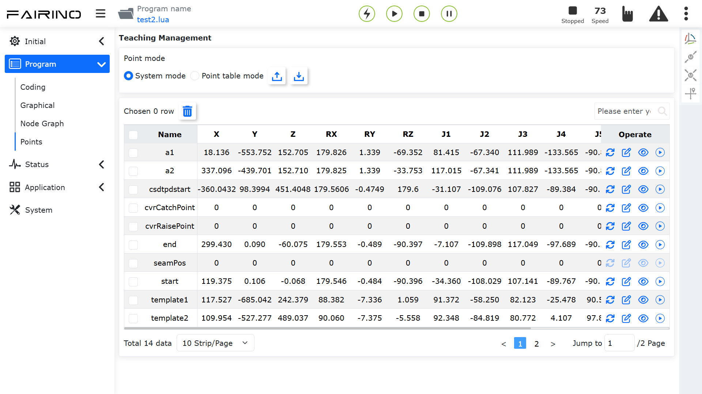

示教点
===============

.. toctree:: 
   :maxdepth: 6

示教管理分为“系统模式”和“点位表模式”两种模式，实现调用机械手程序时，可以通过调用不同的点位表来实现不同的检测方案，完成配方的需求。后续每增加一款设备或者产品，可以通过上位机把点位表数据包下载到机器人，机器人新建的点位表数据包也可以上传给上位机。

**系统模式**：支持“导入、导出、删除、重命名、修改、覆盖、修改、查看”示教点位内容，以及单步运动到示教点位。

.. centered:: 图表 12.1-1 示教管理界面-系统模式

**点位表模式**：支持“新增、应用、重命名、删除、导入、导出”点位表，“删除、修改、查看和覆盖”点位表内点位内容，以及单步运动到示教点位。

.. image:: points/002.png
   :width: 6in
   :align: center

.. centered:: 图表 12.1-2 示教管理界面-点位表模式

示教管理界面右上角显示机器人本体操作条，用户在该界面可以移动机器人本体，然后再进行示教点的数据覆盖操作。

.. image:: points/003.png
   :width: 6in
   :align: center

.. centered:: 图表 12.1-3 示教管理界面-机器人本体操作条

在示教点表格数据的右上角可以输入示教点名称进行搜索；在示教点表格数据中点击示教点名称后，进入编辑状态，输入修改后的名称，点击示教点名称以外的地方即可完成修改。

.. note:: 
   .. image:: points/004.png
      :height: 0.75in
      :align: left

   名称：**导入按钮**
   
   作用：示教点文件导入

.. note:: 
   .. image:: points/005.png
      :height: 0.75in
      :align: left

   名称：**导出按钮**
   
   作用：示教点文件导出

.. note:: 
   .. image:: points/006.png
      :height: 0.75in
      :align: left

   名称：**删除按钮**
   
   作用：选中一个/多个示教点后点击表格上方“删除”按钮后提示“请再次点击删除按钮确认删除”，再次点击后即可将该点信息删除；

.. note:: 
   .. image:: points/007.png
      :height: 0.75in
      :align: left

   名称：**覆盖点位按钮**
   
   作用：点击将机器人当前点位数据覆盖示教点，并在弹窗中选择“是否同步示教程序”

.. image:: points/008.png
   :width: 6in
   :align: center

.. centered:: 图表 12.1-4 覆盖示教点

.. note:: 
   .. image:: points/009.png
      :height: 0.75in
      :align: left

   名称：**编辑按钮**
   
   作用：点击确认修改示教点x，y，z，rx，ry，rz和v数值

.. important:: 
   示教点x，y，z，rx，ry，rz的修改值不应超过机器人的工作范围。

.. note:: 
   .. image:: points/010.png
      :height: 0.75in
      :align: left

   名称：**详情按钮**
   
   作用：点击查看示教点详情

.. image:: points/011.png
   :width: 6in
   :align: center

.. centered:: 图表 12.1-5 示教点详情

.. note:: 
   .. image:: points/012.png
      :height: 0.75in
      :align: left

   名称：**开始运行按钮**
   
   作用：点击选择单点运行的方式，将机器人移动到该点的位置；选择PTP为点到点运动，选择Lin为直线运动。

.. image:: points/013.png
   :width: 6in
   :align: center

.. centered:: 图表 12.1-6 运行示教点
