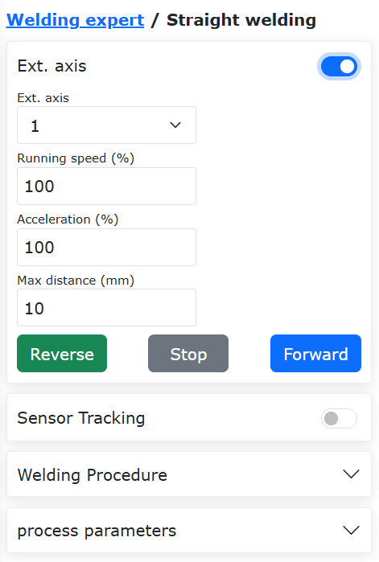
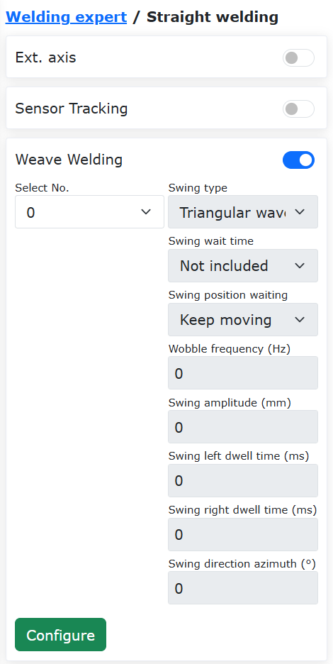
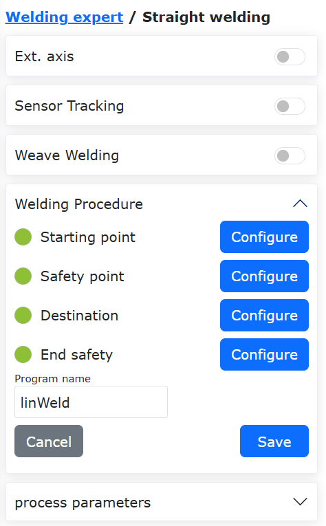
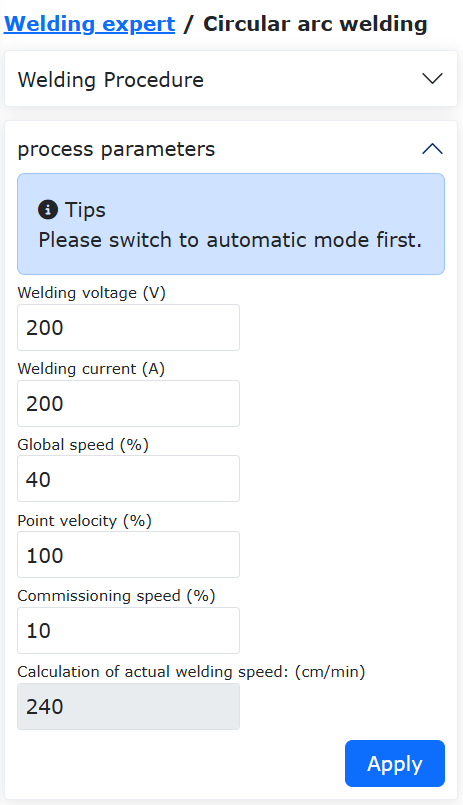
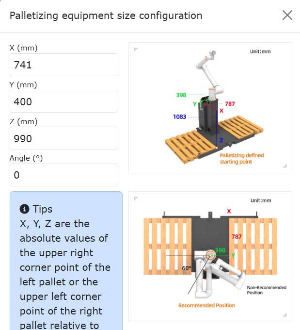
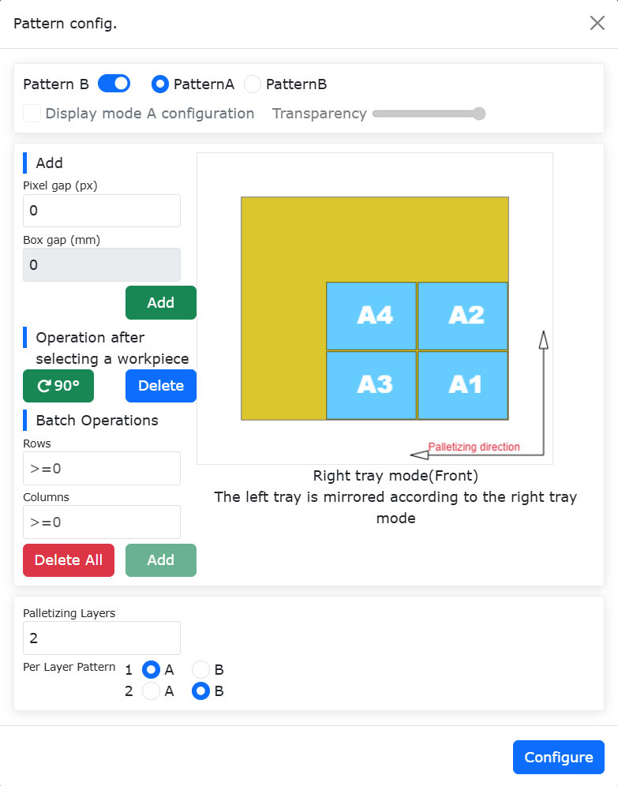
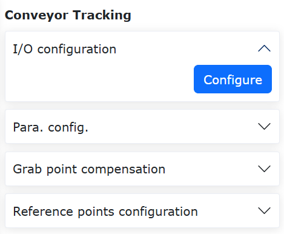
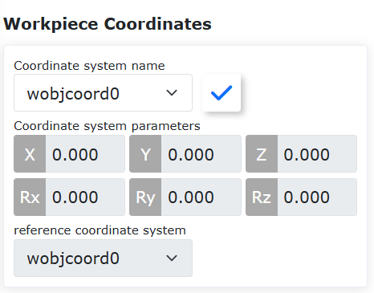
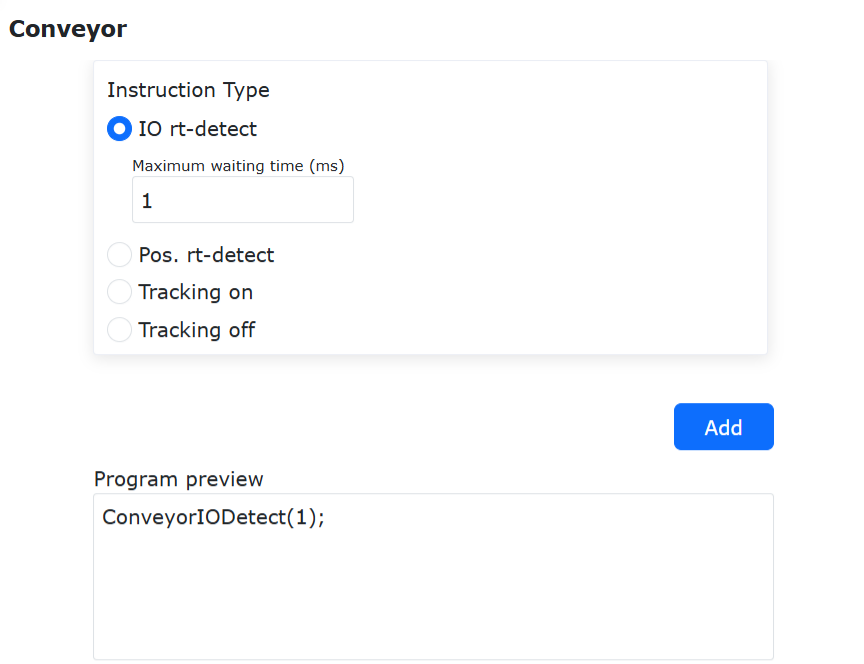
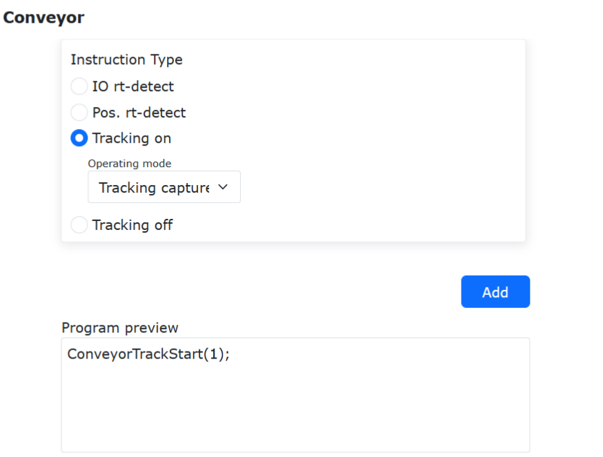

工艺包
=============

.. toctree:: 
  :maxdepth: 5

焊接专家库
----------------

点击“辅助应用”->“工艺包”中的“焊接专家库”的菜单栏，进入焊接专家库功能界面，包含直焊、圆弧焊、多层多道焊和姿态调整。

.. image:: process/001.png
   :width: 4in
   :align: center

.. centered:: 图表 15.1‑1 扩展轴配置

直焊
~~~~~~~~~~~~

点击“直焊”，进入直焊指导界面。在各项机器人基础设置配置完成的基础上，我们可以通过几个简单的步骤快速生成焊接示教程序。主要包含以下五个步骤，由于功能间存在互斥，所以实际生成一个焊接示教程序的步骤少于五步。

步骤一，是否使用扩展轴，如果使用扩展轴需要配置好扩展轴相关坐标系以及使能扩展轴。使用扩展轴时，无法使用摆焊功能。

.. centered:: 图表 15.1‑2 扩展轴配置

步骤二，选择是否需要传感器跟踪，如果是的话，需要编辑激光寻位指令的参数。使用传感器跟踪时，无法使用摆焊功能。

.. image:: process/003.png
   :width: 4in
   :align: center

.. centered:: 图表 15.1‑3 激光寻位配置

步骤三，选择是否需要摆焊，如果需要摆焊，需要编辑摆焊相关参数。

.. centered:: 图表 15.1‑4 摆焊配置

步骤四，标定起点，起点安全点，终点，终点安全点。若第一步选择了扩展轴，会加载扩展轴移动功能，配合相关点的标定。

.. image:: process/005.png
   :width: 4in
   :align: center

.. centered:: 图表 15.1‑5 标定相关点

步骤五，给程序命名，并在程序示教界面中自动打开该程序。

.. centered:: 图表 15.1‑6 保存程序

程序保存成功后，可以在工艺参数中修改焊接速度。

.. image:: process/007.png
   :width: 4in
   :align: center

.. centered:: 图表 15.1‑7 工艺参数

圆弧焊
~~~~~~~~~~~~

点击“焊件形状”下的“圆弧焊”，进入圆弧焊指导界面。在各项机器人基础设置配置完成的基础上，我们可以通过两个简单的步骤快速生成焊接示教程序。主要包含以下两个步骤。

步骤一，标定起点，起点安全点，圆弧过渡点，终点和终点安全点。

.. image:: process/008.png
   :width: 4in
   :align: center

.. centered:: 图表 15.1‑8 标定点

步骤二，给程序命名，并在程序示教界面中自动打开该程序。

.. image:: process/009.png
   :width: 4in
   :align: center

.. centered:: 图表 15.1‑9 保存程序

程序保存成功后，可以在工艺参数中修改焊接速度。

.. centered:: 图表 15.1‑10 工艺参数

多层多道焊
~~~~~~~~~~~~

当焊脚尺寸大于10mm的焊缝时，通常会采用多层多道焊接功能。本功能能够模板化配置焊接程序，在多层多道焊接的第一道焊接过程种加入电弧跟踪功能，并在后续的多道直线焊接过程中修正焊缝偏差，从而提高焊缝质量。

电弧跟踪多层多道焊接功能操作流程如下：

1) 设置工具坐标系，填入焊枪的工具尺寸与姿态。

.. note::
   界面数值仅为示例，以实际工具状态为准。

.. image:: process/011.png
   :width: 4in
   :align: center

.. centered:: 图表 15.1-11 设置工具坐标系

2) 点击“多层多道焊”进入界面。

.. image:: process/012.png
   :width: 4in
   :align: center

.. centered:: 图表 15.1-12 打开多层多道焊接界面

3) 若要使用电弧跟踪功能，务必打开“首层焊接摆动功能”开关，并配置对应的摆动参数。

.. image:: process/013.png
   :width: 4in
   :align: center

.. centered:: 图表 15.1-13 打开首层焊接摆动功能

4) 点击“配置”按钮， 编辑摆动参数，之后点击“配置”。

.. note::
   若需要电弧跟踪进行左右补偿的情况，仅可选择“三角波摆动”和“正弦波摆动”类型，摆动频率不得低于0.5Hz，摆动幅度不得小于3mm，摆动左右等待时间需一致，摆动方位角需为0。

.. image:: process/014.png
   :width: 4in
   :align: center

.. centered:: 图表 15.1-14 配置摆动参数

5) 打开“电弧跟踪功能”开关，编辑对应的上下与左右补偿参数。

.. note::
   电弧跟踪参数根据实际焊接情况参考《电弧跟踪功能操作手册》或联系相关技术人员进行配置。

.. image:: process/015.png
   :width: 4in
   :align: center

.. centered:: 图表 15.1-15 配置电弧跟踪参数

6) 根据控制类型点击对应类型进入界面，首先在第一组点中设置“焊接点”为焊接开始位置；“X+点”为自定义偏置坐标系相对焊接点X+方向上的一点；“Z+点”为自定义偏置坐标系相对焊接点Z+方向上的一点；“安全点”为上一次焊接完成到下一次焊接开始的过渡位置。示教并设置完成后自动进入第二组点设置。

.. image:: process/016.png
   :width: 4in
   :align: center

.. centered:: 图表 15.1-16 多层多道焊接直线开始点位置设置

7) 选择“直线点”，此处“焊接点”为焊接结束位置；“X+点”为自定义偏置坐标系相对“焊接点”X+方向上的一点；“Z+点”为自定义偏置坐标系相对“焊接点”Z+方向上的一点。示教并设置完成后点击“完成”按钮设置多层多道焊接参数。

.. image:: process/017.png
   :width: 4in
   :align: center

.. centered:: 图表 15.1-17 多层多道焊接直线结束点位置设置

8) 在此页面能够设置多层多道焊接的数量，以及分布位置。点击参数表“On/Off”框选择激活的多层多道焊接位置对应值，在“X”“Z”“B”列填入期望的在自定义坐标系中的对应偏移位置与角度。

.. image:: process/018.png
   :width: 4in
   :align: center

.. centered:: 图表 15.1-18 多层多道焊接参数设置

9) 至此已完成全部参数配置，输入希望保存的程序名，点击“保存”按钮可自动生产对应的多层多道焊接程序。

.. image:: process/019.png
   :width: 6in
   :align: center

.. centered:: 图表 15.1-19 多层多道焊接程序生成

10) 点击“打开程序”按钮，读取上一步骤保存的lua程序，程序内容如下图所示。

.. image:: process/020.png
   :width: 4in
   :align: center

.. centered:: 图表 15.1-20 电弧跟踪多层多道焊接程序示例

姿态调整
~~~~~~~~~~~~~~~~~~

姿态自适应配置步骤
+++++++++++++++++++++++++++++++++++

**Step1**：进入姿态调整配置界面，选择板材类型和机器人实际工作运动方向，调整机器人姿态，分别设置姿态点A，姿态点B和姿态点C，通常A为平面姿态点，B为上升沿姿态点，C为下降沿姿态点。

.. figure:: process/021.png
   :align: center
   :width: 4in

.. centered:: 图表 15.1‑21 姿态调整配置

.. important:: 
	A姿态和B姿态，A姿态和C姿态之间的姿态变化在满足应用需求下姿态变化越小越好。姿态自适应功能为辅助应用功能，通常配合焊缝跟踪使用。

**Step2**：在程序示教命令界面选择“Adjust”命令。根据具体的程序示教需求，在相应的地方添加指令。

.. figure:: process/022.png
   :align: center
   :width: 6in

.. centered:: 图表 15.1‑22 姿态调整指令编辑

姿态自适应配合扩展轴和激光跟踪焊接示教程序
++++++++++++++++++++++++++++++++++++++++++++++++++++++++++++++++++++++

.. list-table::
   :widths: 50 80 80
   :header-rows: 0
   :align: center

   * - **序号**
     - **指令格式**
     - **注释**

   * - 1
     - EXT_AXIS_PTP(1,1laserstart)
     - #外部轴运动激光传感器起始点

   * - 2
     - PTP(laserstart,10,-1,0)
     - #机器人运动激光传感器起始点

   * - 3
     - LTSearchStart(3,20,10,10000)
     - #开始寻位

   * - 4
     - LTSearchStop()
     - #停止寻位

   * - 5
     - EXT_AXIS_PTP(1,1,seamPos)
     - #外部轴运动焊缝起点

   * - 6
     - Lin(seamPos,20,-1,00,0)
     - #机器人运动焊缝起点

   * - 7
     - LTTrackOn()
     - #激光跟踪

   * - 8
     - ARCStart(0,10000)
     - #焊机起弧

   * - 9
     - PostureAdjustOn(0,PosA,PosC,PosB,1000)
     - #姿态自适应调整开启

   * - 10
     - EXT_AXIS_PTP(1,1,laserend)
     - #外部轴运动焊缝终点

   * - 11
     - Lin( laserend,10,-1,0,0)
     - #机器人运动焊缝终点

   * - 12
     - ARCEnd(0,10000)
     - #焊机收弧

   * - 13
     - PostureAdjustOff(0)
     - #姿态自适应调整关闭

   * - 14
     - LTTrackOff
     - #激光跟踪关闭

码垛系统配置
---------------

码垛系统配置步骤
~~~~~~~~~~~~~~~~~~~~~~

**Step1**：在“辅助应用”->“工艺包”中点击“码垛”菜单项，进入码垛系统配置界面。

第一次使用，需要首先进行配方创建，点击“配方创建”，输入配方名称，点击“创建”，创建成功后点击“开始配置”进入码垛配置页面。

.. figure:: process/023.png
   :align: center
   :width: 4in

.. centered:: 图表 15.2‑1 码垛配方配置

**Step2**：在工件配置栏中点击“配置”进入工件配置弹窗，设置工件的“长度”，“宽度”，“高度”以及工件的抓取点，点击“确认配置”完成工件信息设置。

.. figure:: process/024.png
   :align: center
   :width: 4in

.. centered:: 图表 15.2‑2 码垛工件配置

**Step3**：在托盘配置栏中点击“配置”进入托盘配置弹窗，设置托盘“前边”，“侧边”和“高度”，接着设置工位和工位过渡点，点击“确认配置”完成托盘信息设置。

.. figure:: process/025.png
   :align: center
   :width: 4in

.. centered:: 图表 15.2‑3 码垛托盘配置

**Step4**：在码垛设备尺寸配置栏中点击“配置”进入码垛设备尺寸配置配置弹窗，设置设备“X”、“Y”、“Z”和“Angle”，点击“确认配置”完成码垛设备尺寸配置信息设置。

.. important:: 
   X、Y、Z为左托盘右上角或者右托盘左上角点相对于机器人基坐标系坐标值的绝对值，Angle为机器人安装时的旋转角度，推荐安装时为0。

.. centered:: 图表 15.2‑4 码垛设备尺寸配置

**Step5**：在模式配置栏中点击“配置”进入模式配置弹窗。

   **模式B开启/关闭**：开启：可以切换模式A/B，配置码垛每层模式的B模式；关闭：不可切换模式B，不可配置码垛每层模式的B模式；

   **模式A/B切换**：选择模式A：添加工件为模式A，工件序号为A1，A2...，不可调整工件透明度；选择模式B：添加工件为模式B，工件序号为B1，B2...，此时可以开启/关闭“显示模式A配置”显示模式A工件；

   **显示模式A开启/关闭**：开启：调整模式B工件透明度来查看A/B模式配置效果是否合理，此时只能对模式B工件进行选中、添加、批量添加、删除和删除全部的操作；关闭：无法设置模式B工件透明度；

.. important:: 
   配置工件时，工件之间有碰撞时工件背景颜色变红，此时以上操作无法进行。如需操作，请配置工件为无碰撞。

配置工件时，先设置工件间隔，右侧框框为模拟工件在右托盘的放置方式，可以单个添加也可以批量添加。接着设置码垛层数和各层的模式，点击“确认配置”完成模式信息设置。

.. important:: 
   码垛方向：以右托盘为例，右下角为最远处，从右下角竖向或者横向摆放一排工件，再向上一排横向或竖向摆放工件，以此类推（Web页面已标注码垛方向，请注意查看）。
   
   左托盘依据右托盘模式镜像放置工件。

.. centered:: 图表 15.2‑5 码垛模式A配置

.. figure:: process/028.png
   :align: center
   :width: 4in

.. centered:: 图表 15.2‑6 码垛模式B配置

**Step6**：在示教程序生成栏点击“高级配置”进入高级配置弹窗，此时配置“取料抬升高度”、“第一次偏移距离”、“第二次偏移距离”和“吸料等待时间”。

   **取料抬升高度**：用户自定义取料成功后，从抓取点取料成功后抬升的高度；

   **第一/二次偏移距离**：用户自定义配置机器人倾斜堆放至目标点的偏移距离；
   
   **吸料等待时间**：用户自定义配置吸料等待时间，监控吸料后负压到位信号，未到位时重复吸取动作；

   **平滑过渡**：开启平滑过渡按钮，可进行码垛/拆垛PTP平滑时间和LIN平滑半径相关参数配置。
   
   - PTP平滑时间：无平滑过渡时间/等级1(200ms)/等级2(400ms)/等级3(600ms)/等级4(800ms)/等级5(1000ms)
   - LIN平滑半径：无平滑过渡半径/等级1(200mm)/等级2(400mm)/等级3(600mm)/等级4(800mm)/等级5(1000mm)

.. figure:: process/029.png
   :align: center
   :width: 4in

.. centered:: 图表 15.2‑7 码垛高级配置

**Step7**：在示教程序生成栏选择“方式选择”，点击“生成程序”，打开“码垛监控页”，在此页面可以对“生成信息”，“报警信息”和“码垛程序”显示和查看。

.. figure:: process/030.png
   :align: center
   :width: 6in

.. centered:: 图表 15.2‑8 码垛系统监控

**Step8**：码垛运行程序中途报错后，程序停止，用户首先清除报错后，再次选择码垛程序运行，此时会弹出“上次程序中断”弹出框，点击“接续”按钮接续运行，点击“重新开始”按钮重新开始运行程序。

.. figure:: process/031.png
   :align: center
   :width: 3in

.. centered:: 图表 15.2‑9 码垛程序接续

传送带跟踪
-----------------

传送带跟踪配置步骤
~~~~~~~~~~~~~~~~~~~~~

**Step1**：在“辅助应用”->“工艺包”中选择“传送带”菜单项，进入传送带跟踪配置界面，点击“配置传送带IO”按键快速配置传送带功能所需IO，之后根据实际使用功能情况配置对应的参数，此处以无视觉跟踪抓取功能为例，需要配置传送带编码器通道，分辨率，导程，视觉搭配选择否，点击配置。

.. figure:: process/033.png
   :align: center
   :width: 4in

.. centered:: 图表 15.3‑1 传送带配置

**Step2**：接下来设置抓取点补偿值，为X,Y,Z三个方向上的补偿距离，可在调试过程中根据实际情况设置。

.. figure:: process/034.png
   :align: center
   :width: 4in

.. centered:: 图表 15.3‑2 传送带抓取点补偿配置

**Step3**：开启传送带，将标定的物体移动到定义的A点位置，停止传送带。移动机器人，将机器人末端的标定杆尖点与所标定的物体尖点对齐，点击起始点A按键，跳出对话框，显示当前编码器值和机器人位姿，点击标定完成起始点A标定。

.. figure:: process/035.png
   :align: center
   :width: 4in

.. centered:: 图表 15.3‑3 起始点A配置

**Step4**：点击参考点按键，进入参考点标定，记录参考点时记录机器人抓取时的高度和姿态，每次跟踪时都会以记录参考点的高度和姿态区跟踪抓取，可以和AB点不在一个高度，点击标定完成参考点标定。

.. figure:: process/036.png
   :align: center
   :width: 4in

.. centered:: 图表 15.3‑4 参考点配置

**Step5**：开启传送带，将标定的物体移动到定义的B点位置，停止传送带。移动机器人，将机器人末端的标定杆尖点与所标定的物体尖点对齐，点击终点B按键，弹出对话框，显示当前编码器值和机器人位姿，点击标定完成终点B标定。

.. figure:: process/037.png
   :align: center
   :width: 4in

.. centered:: 图表 15.3‑5 终点B配置

传送带跟踪示教程序
~~~~~~~~~~~~~~~~~~~~~~~

.. list-table::
   :widths: 50 80 80
   :header-rows: 0
   :align: center

   * - **序号**
     - **指令格式**
     - **注释**

   * - 1
     - PTP(conveyorstart,30,-1,0)
     - #机器人抓取起点

   * - 2
     - While(1) do
     - #循环抓取

   * - 3
     - ConveyorlODetect(10000)
     - #Io实时检测物体

   * - 4
     - ConveyorGetTrackData(1)
     - #物体位置获取

   * - 5
     - ConveyorTrackStart(1)
     - #传送带跟踪开始

   * - 6
     - Lin(cvrCatchPoint,10,-1,0,0)
     - #机器人到达抓取点

   * - 7
     - MoveGripper(1,255,255,0,10000)
     - #夹爪抓取物体

   * - 8
     - Lin(cvrRaisePoint,10,-1,0,0)
     - #机器人提起

   * - 9
     - ConveyorTrackEnd()
     - #传送带跟踪结束

   * - 10
     - PTP(conveyorraise,30,-1,0)
     - #机器人到达等待点

   * - 11
     - PTP(conveyorend,30,-1,0)
     - #机器人到达放置点

   * - 12
     - MoveGripper(1,0,255,0,10000)
     - #夹爪松开

   * - 13
     - PTP(conveyorstart,50,-1,0)
     - #机器人再次回到抓取起点,等待下次抓取

   * - 14
     - end
     - #结束

机器人传送带跟踪系统构成
~~~~~~~~~~~~~~~~~~~~~~~~~~~~~~~~~~~~~~~~~~~~~~

传送带编码器数据通信连接方式
+++++++++++++++++++++++++++++++++++

为了在机床加工中，实现自动化上下料流程，开发了基于FOCAS通信的CNC功能包，可实现协作机器人与CNC机床的通信交互与协同运动。

如图所示，FOCAS通信是基于以太网的，通过网线连接机器人控制箱网口与机床内嵌网口，即可建立机器人与机床的FOCAS通信，实现在机器人端的CNC控制和机床状态监控。

.. figure:: process/038.png
   :align: center
   :width: 6in

.. centered:: 图表 15.3‑6 机器人传送带跟踪系统构成拓扑图

系统中，（a）为计算机，（b）为机器人及其控制箱，（c）为传送带、光电传感器及编码器组成的传送带系统。机器人控制箱通过数字IO通信与光电传感器、传送带相连，通过RS485与传送带编码器相连。

传送带配置
+++++++++++++++++++++++++++++++++++

进入机器人Web页面“基础设置”、“外设”、“跟踪”下属的“传送带”功能配置界面进行传送带跟踪功能属性配置。

.. figure:: process/039.png
   :align: center
   :width: 4in

.. centered:: 图表 15.3‑7 传送带跟踪配置页面

在传送带跟踪配置页面，点击“传送带I/O一键配置”按钮一键配置传送带物理连接。
之后在“参数配置”下的“功能选择”下拉框中选择“跟踪运动”，再后配置编码器属性、跟踪工件坐标系工件轴、视觉搭配，并在“跟踪类型”下拉框中选中“追检运动”，此时可输入跟踪起始距离以及跟踪终止距离。
跟踪起始距离：触发跟踪信号后传送带运行到设置距离后机器人开始动作，当设置为-1时为自动触发。
跟踪终止距离：机器人开始动作后，跟随传送带同步运动的最远距离。

跟踪坐标系配置
+++++++++++++++++++++++++++++++++++

跟踪运动使用工件坐标系作为传送带坐标系，因此需要设置工件坐标系。

点击“初始设置”、“基础”，在“坐标系”下选择“工件坐标系”，点击选择“wobjcoord0”以外的工件坐标系进行标定，标定方式此处不赘述。

.. centered:: 图表 15.3‑8 跟踪坐标系设置

传送带跟踪追检运动功能
+++++++++++++++++++++++++++++++++++

追检运动属于传送带跟踪运动的一种，与跟踪运动相比追检运动的运动点示教无需在工件坐标系上方进行示教运动，可以在工件坐标系任意位置进行示教，再通过“跟踪起始距离”的参数进行末端与传送带同步运动，是一种比较灵活的跟踪方式。

传送带跟踪追检运动功能简介
+++++++++++++++++++++++++++++++++++

以下给出追检运动示例以介绍运动特性。

.. figure:: process/041.png
   :align: center
   :width: 6in

.. centered:: 图表 15.3‑9 传送带跟踪追检运动示教示例

其中，以x为工件坐标中传送带运动的方向，a为传送带平面，b为抓取目标工件，c为光电传感器，d为跟踪起始距离，e为跟踪终止距离。P1到P4为示教路点及其依次顺序，P2到P3为相同路点，包含夹爪运动。

.. figure:: process/042.png
   :align: center
   :width: 6in

.. centered:: 图表 15.3‑10 传送带跟踪追检运动示教后执行示例

当上述示教程序开始运行，工件触发光电开关信号后，机器人会等待目标运动到P1下方后开始跟踪运动，机器人夹爪将如上图所示轨迹运动。

追检运动程序示教
+++++++++++++++++++++++++++++++++++

追检运动程序逻辑与跟踪运动逻辑基本一致，包含获取触发信号、获取传送带数据以及开始跟踪运动部分。

**Step 1**：点击“示教程序”，“程序编程”，选择并点击“外设指令”下属的“传送带”按钮进入传送带指令配置页面。

.. centered:: 图表 15.3‑11 I/O实时监测指令

**Step 2**：点击“I/O实时监测”并设置“最大等待示教(ms)”，实时检测跟踪触发信号。点击“添加”与“应用”按钮将指令添加到程序中。

.. figure:: process/044.png
   :align: center
   :width: 6in

.. centered:: 图表 15.3‑12 位置实时检测指令

**Step 3**：点击“位置实时检测”并将工作模式选定“跟踪运动”。点击“添加”与“应用”按钮将指令添加到程序中。

.. centered:: 图表 15.3‑13 跟踪开启指令

**Step 4**：点击“跟踪开启”并工作模式选定“跟踪运动”。点击“添加”与“应用”按钮将指令添加到程序中。

**Step 5**：示教在跟踪开启后的笛卡尔空间运动以及夹爪外设运动，运动过程中将保持与传送带的跟踪同步运动。

.. figure:: process/046.png
   :align: center
   :width: 6in

.. centered:: 图表 15.3‑14 跟踪关闭指令

**Step 6**：点击“跟踪关闭”并点击“添加”与“应用”按钮将指令添加到程序中。

.. figure:: process/047.png
   :align: center
   :width: 6in

.. centered:: 图表 15.3‑15 一段典型的传送带程序跟踪运动程序

当连续示教两个相同的跟踪运动目标（可包含偏置距离），机器人运动将阻塞在该目标位置，实现持续同步跟踪直到跟踪距离达到终止跟踪距离为止。

.. figure:: process/048.png
   :align: center
   :width: 6in

.. centered:: 图表 15.3‑16 一段典型的传送带阻塞跟踪抓取运动程序

当连续示教两个相同的跟踪运动目标（可包含偏置距离），同时中间插入夹爪运动时，机器人将在该目标位置位置持续跟踪传送带直至夹爪运动完成，实现阻塞跟踪抓取。
