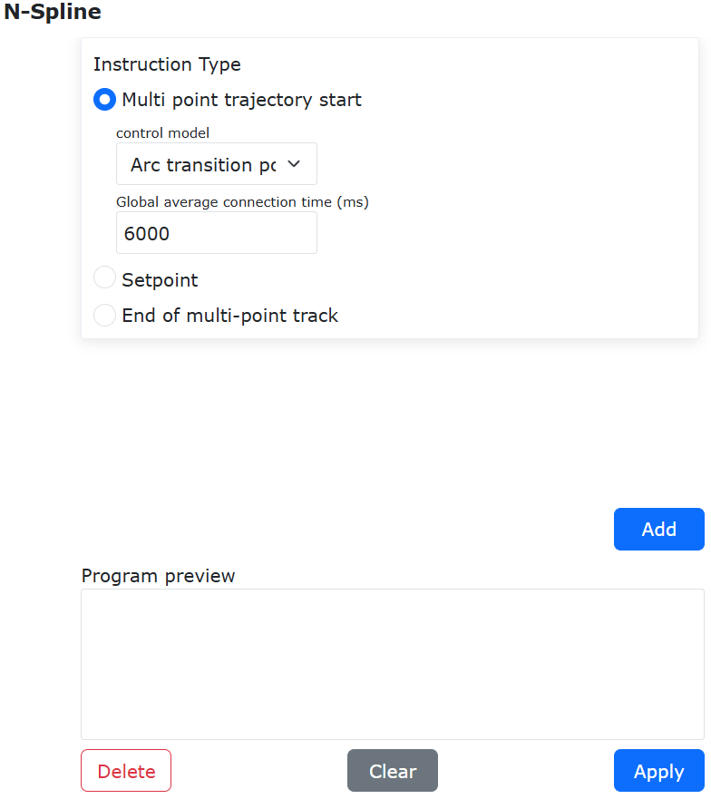
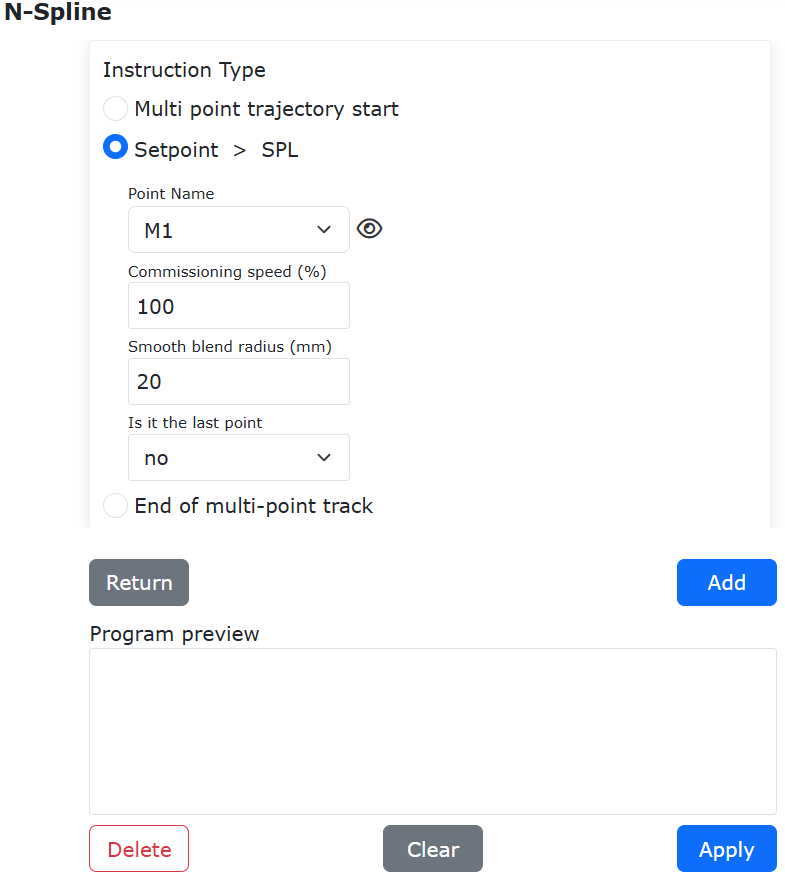
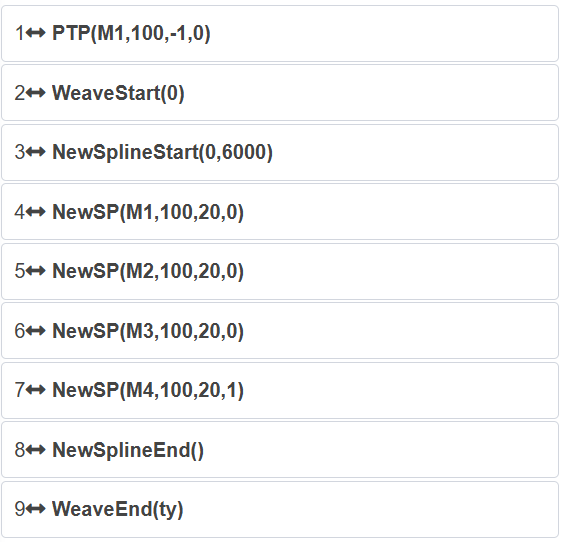
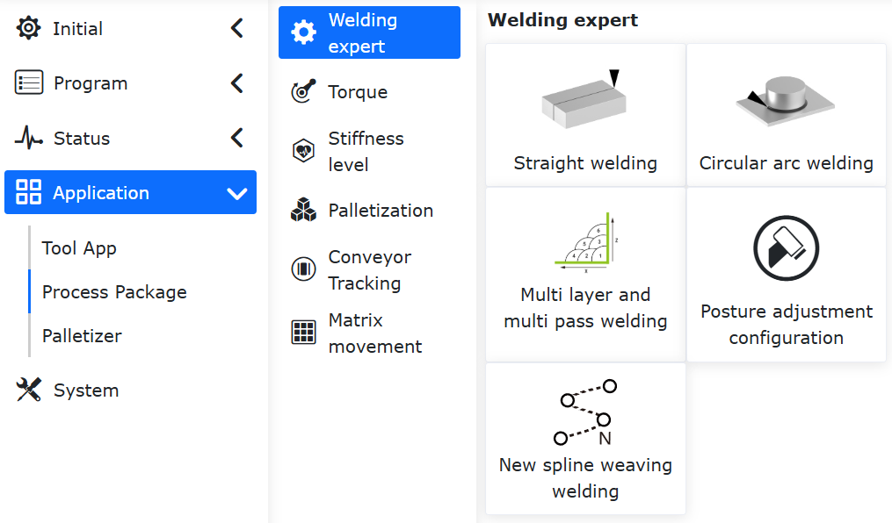
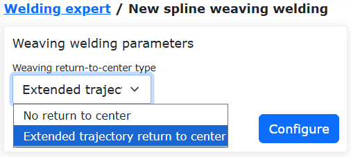
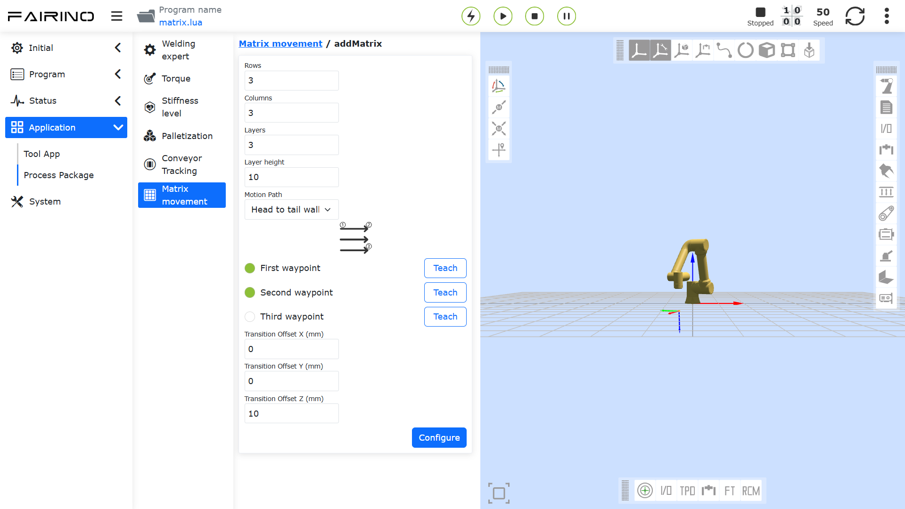
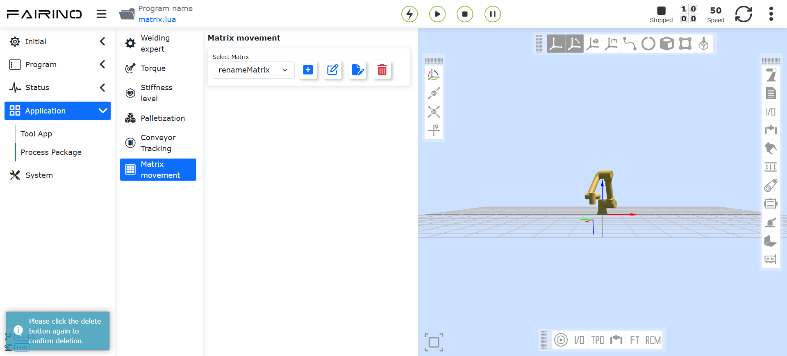

Pacotes de Funcionalidades (Processos)
===========================================

.. toctree:: 
  :maxdepth: 5

Biblioteca de Especialistas em Soldagem
------------------------------------------------

Clique no menu “Biblioteca de Especialistas em Soldagem” em “Aplicações Auxiliares” -> “Pacotes de Funcionalidades” para entrar na interface da função. Esta interface inclui soldagem reta, soldagem em arco, soldagem de múltiplas camadas e passes, e ajuste de postura.

.. image:: process/001.png
   :width: 4in
   :align: center

.. centered:: Figura 15.1‑1 Configuração do Eixo Extensor

Soldagem Reta
~~~~~~~~~~~~~~~~~~~~

Clique em “Soldagem Reta” para entrar na interface de orientação. Com base nas configurações básicas do robô já concluídas, podemos gerar rapidamente um programa de ensinamento de soldagem através de alguns passos simples. O processo envolve principalmente cinco etapas. Devido à exclusão mútua entre algumas funções, o número real de etapas para gerar um programa de ensinamento de soldagem é menor que cinco.

Etapa 1, decidir se deve usar um eixo extensor. Se sim, é necessário configurar os sistemas de coordenadas relacionados ao eixo extensor e habilitá-lo. Quando um eixo extensor é usado, a função de soldagem com oscilação não pode ser usada.

.. image:: process/002.png
   :width: 4in
   :align: center

.. centered:: Figura 15.1‑2 Configuração do Eixo Extensor

Etapa 2, escolher se é necessário o rastreamento por sensor. Se sim, os parâmetros da instrução de busca de posição a laser precisam ser editados. Quando o rastreamento por sensor é usado, a função de soldagem com oscilação não pode ser usada.

.. image:: process/003.png
   :width: 4in
   :align: center

.. centered:: Figura 15.1‑3 Configuração da Busca de Posição a Laser

Etapa 3, escolher se a soldagem com oscilação é necessária. Se sim, os parâmetros relacionados à soldagem com oscilação precisam ser editados.

.. image:: process/004.png
   :width: 4in
   :align: center

.. centered:: Figura 15.1‑4 Configuração da Soldagem com Oscilação

Etapa 4, calibrar o ponto inicial, o ponto de segurança inicial, o ponto final e o ponto de segurança final. Se um eixo extensor foi selecionado na primeira etapa, a função de movimento do eixo extensor será carregada para auxiliar na calibração dos pontos relacionados.

.. image:: process/005.png
   :width: 4in
   :align: center

.. centered:: Figura 15.1‑5 Calibração de Pontos Relacionados

Etapa 5, nomear o programa. O programa será aberto automaticamente na interface de programação de ensinamento.

.. image:: process/006.png
   :width: 4in
   :align: center

.. centered:: Figura 15.1‑6 Salvar Programa

Após o programa ser salvo com sucesso, a velocidade de soldagem pode ser modificada nos parâmetros do processo.

.. image:: process/007.png
   :width: 4in
   :align: center

.. centered:: Figura 15.1‑7 Parâmetros do Processo

Soldagem em Arco
~~~~~~~~~~~~~~~~~~~~~~~~~~~~

Clique em “Soldagem em Arco” em “Forma da Peça” para entrar na interface de orientação. Com base nas configurações básicas do robô já concluídas, podemos gerar rapidamente um programa de ensinamento de soldagem através de dois passos simples.

Etapa 1, calibrar o ponto inicial, o ponto de segurança inicial, o ponto de transição do arco, o ponto final e o ponto de segurança final.

.. image:: process/008.png
   :width: 4in
   :align: center

.. centered:: Figura 15.1‑8 Calibração de Pontos

Etapa 2, nomear o programa. O programa será aberto automaticamente na interface de programação de ensinamento.

.. image:: process/009.png
   :width: 4in
   :align: center

.. centered:: Figura 15.1‑9 Salvar Programa

Após o programa ser salvo com sucesso, a velocidade de soldagem pode ser modificada nos parâmetros do processo.

.. image:: process/010.png
   :width: 4in
   :align: center

.. centered:: Figura 15.1‑10 Parâmetros do Processo

Soldagem de Múltiplas Camadas e Passes
~~~~~~~~~~~~~~~~~~~~~~~~~~~~~~~~~~~~~~~~~~~~

Quando o tamanho do cordão de solda é superior a 10 mm, a função de soldagem de múltiplas camadas e passes é normalmente utilizada. Esta função permite configurar programas de soldagem de forma modelada, adicionando a função de rastreamento de arco ao primeiro passe da soldagem de múltiplas camadas e passes, e corrigindo o desvio do cordão de solda nos passes lineares subsequentes, melhorando assim a qualidade da solda.

O procedimento operacional para a função de soldagem de múltiplas camadas e passes com rastreamento de arco é o seguinte:

1) Configure o sistema de coordenadas da ferramenta, inserindo as dimensões e a postura da tocha de soldagem.

.. note::
   Os valores na interface são apenas exemplos. O estado real da ferramenta deve ser considerado.

.. image:: process/011.png
   :width: 4in
   :align: center

.. centered:: Figura 15.1-11 Configuração do Sistema de Coordenadas da Ferramenta

2) Clique em “Soldagem de Múltiplas Camadas e Passes” para entrar na interface.

.. image:: process/012.png
   :width: 4in
   :align: center

.. centered:: Figura 15.1-12 Abrir Interface de Soldagem de Múltiplas Camadas e Passes

3) Para usar a função de rastreamento de arco, certifique-se de ativar o interruptor “Função de Oscilação na Primeira Camada” e configure os parâmetros de oscilação correspondentes.

.. image:: process/013.png
   :width: 4in
   :align: center

.. centered:: Figura 15.1-13 Ativar Função de Oscilação na Primeira Camada

4) Clique no botão “Configurar” para editar os parâmetros de oscilação e, em seguida, clique em “Configurar” novamente.

.. note::
   Se o rastreamento de arco exigir compensação lateral, apenas os tipos “Oscilação Triangular” e “Oscilação Senoidal” podem ser selecionados. A frequência de oscilação não deve ser inferior a 0,5 Hz, a amplitude de oscilação não deve ser inferior a 3 mm, os tempos de espera à esquerda e à direita devem ser iguais e o ângulo de azimute da oscilação deve ser 0.

.. image:: process/014.png
   :width: 4in
   :align: center

.. centered:: Figura 15.1-14 Configuração dos Parâmetros de Oscilação

5) Ative o interruptor “Função de Rastreamento de Arco” e edite os parâmetros de compensação vertical e lateral correspondentes.

.. note::
   Os parâmetros de rastreamento de arco devem ser configurados com base na situação real de soldagem, consultando o “Manual de Operação da Função de Rastreamento de Arco” ou entrando em contato com a equipe técnica relevante.

.. image:: process/015.png
   :width: 4in
   :align: center

.. centered:: Figura 15.1-15 Configuração dos Parâmetros de Rastreamento de Arco

6) Clique no tipo de controle correspondente para entrar na interface. Primeiro, no primeiro grupo de pontos, defina o “Ponto de Soldagem” como a posição de início da soldagem; “Ponto X+” como um ponto na direção X+ do sistema de coordenadas de deslocamento personalizado em relação ao ponto de soldagem; “Ponto Z+” como um ponto na direção Z+ do sistema de coordenadas de deslocamento personalizado em relação ao ponto de soldagem; e “Ponto de Segurança” como a posição de transição entre a conclusão da soldagem anterior e o início da próxima. Após o ensinamento e a configuração, o sistema avança automaticamente para a configuração do segundo grupo de pontos.

.. image:: process/016.png
   :width: 4in
   :align: center

.. centered:: Figura 15.1-16 Configuração da Posição do Ponto de Início Linear para Soldagem de Múltiplas Camadas e Passes

7) Selecione “Ponto Linear”. Aqui, o “Ponto de Soldagem” é a posição de fim da soldagem; “Ponto X+” é um ponto na direção X+ do sistema de coordenadas de deslocamento personalizado em relação ao “Ponto de Soldagem”; “Ponto Z+” é um ponto na direção Z+ do sistema de coordenadas de deslocamento personalizado em relação ao “Ponto de Soldagem”. Após o ensinamento e a configuração, clique no botão “Concluir” para definir os parâmetros de soldagem de múltiplas camadas e passes.

.. image:: process/017.png
   :width: 4in
   :align: center

.. centered:: Figura 15.1-17 Configuração da Posição do Ponto de Fim Linear para Soldagem de Múltiplas Camadas e Passes

8) Nesta página, é possível definir o número de camadas e passes para a soldagem de múltiplas camadas e passes, bem como suas posições de distribuição. Clique nas caixas “On/Off” na tabela de parâmetros para selecionar os valores correspondentes às posições ativadas para a soldagem de múltiplas camadas e passes. Nas colunas “X”, “Z”, “B”, insira as posições e ângulos de deslocamento desejados no sistema de coordenadas personalizado.

.. image:: process/018.png
   :width: 4in
   :align: center

.. centered:: Figura 15.1-18 Configuração dos Parâmetros para Soldagem de Múltiplas Camadas e Passes

9) Após concluir a configuração de todos os parâmetros, insira o nome do programa que deseja salvar e clique no botão “Salvar”. O programa de soldagem de múltiplas camadas e passes correspondente será gerado automaticamente.

.. image:: process/019.png
   :width: 6in
   :align: center

.. centered:: Figura 15.1-19 Geração do Programa de Soldagem de Múltiplas Camadas e Passes

10) Clique no botão “Abrir Programa” para carregar o programa Lua salvo na etapa anterior. O conteúdo do programa é mostrado na figura abaixo.

.. image:: process/020.png
   :width: 4in
   :align: center

.. centered:: Figura 15.1-20 Exemplo de Programa de Soldagem de Múltiplas Camadas e Passes com Rastreamento de Arco

Ajuste de Postura
~~~~~~~~~~~~~~~~~~

Passos para Configuração do Ajuste Adaptativo de Postura
+++++++++++++++++++++++++++++++++++++++++++++++++++++++++++++++++++++++++++

**Step1**: Entre na interface de configuração de ajuste de postura. Selecione o tipo de chapa e a direção real do movimento de trabalho do robô. Ajuste a postura do robô e defina os pontos de postura A, B e C respectivamente. Geralmente, A é o ponto de postura para a superfície plana, B é o ponto de postura para a borda ascendente e C é o ponto de postura para a borda descendente.

.. figure:: process/021.png
   :align: center
   :width: 4in

.. centered:: Figura 15.1‑21 Configuração de Ajuste de Postura

.. important:: 
	A mudança de postura entre as posturas A e B, e entre A e C, deve ser a menor possível, desde que atenda aos requisitos da aplicação. A função de ajuste adaptativo de postura é uma função de aplicação auxiliar, geralmente usada em conjunto com o rastreamento do cordão de solda.

**Step2**: Na interface de comandos de programação de ensinamento, selecione o comando “Adjust”. Adicione a instrução nos locais apropriados de acordo com os requisitos específicos da programação de ensinamento.

.. figure:: process/022.png
   :align: center
   :width: 6in

.. centered:: Figura 15.1‑22 Edição da Instrução de Ajuste de Postura

Programa de Ensinamento de Soldagem com Ajuste Adaptativo de Postura Combinado com Eixo Extensor e Rastreamento a Laser
++++++++++++++++++++++++++++++++++++++++++++++++++++++++++++++++++++++++++++++++++++++++++++++++++++++++++++++++++++++++++++++++++

.. list-table::
   :widths: 50 80 80
   :header-rows: 0
   :align: center

   * - **Nº**
     - **Formato da Instrução**
     - **Comentário**

   * - 1
     - EXT_AXIS_PTP(1,1laserstart)
     - #Movimento do eixo extensor para o ponto inicial do sensor a laser

   * - 2
     - PTP(laserstart,10,-1,0)
     - #Movimento do robô para o ponto inicial do sensor a laser

   * - 3
     - LTSearchStart(3,20,10,10000)
     - #Iniciar busca de posição

   * - 4
     - LTSearchStop()
     - #Parar busca de posição

   * - 5
     - EXT_AXIS_PTP(1,1,seamPos)
     - #Movimento do eixo extensor para o ponto inicial da solda

   * - 6
     - Lin(seamPos,20,-1,00,0)
     - #Movimento do robô para o ponto inicial da solda

   * - 7
     - LTTrackOn()
     - #Ativar rastreamento a laser

   * - 8
     - ARCStart(0,10000)
     - #Abertura de arco da máquina de solda

   * - 9
     - PostureAdjustOn(0,PosA,PosC,PosB,1000)
     - #Ativar ajuste adaptativo de postura

   * - 10
     - EXT_AXIS_PTP(1,1,laserend)
     - #Movimento do eixo extensor para o ponto final da solda

   * - 11
     - Lin( laserend,10,-1,0,0)
     - #Movimento do robô para o ponto final da solda

   * - 12
     - ARCEnd(0,10000)
     - #Extinção de arco da máquina de solda

   * - 13
     - PostureAdjustOff(0)
     - #Desativar ajuste adaptativo de postura

   * - 14
     - LTTrackOff
     - #Desativar rastreamento a laser

Função de Oscilação com Transição Linear de Arco com Nova Spline
~~~~~~~~~~~~~~~~~~~~~~~~~~~~~~~~~~~~~~~~~~~~~~~~~~~~~~~~~~~~~~~~~~~~~~~~~~~~

Visão Geral
+++++++++++++++++++++++++++++++++++++++++++++++++++++++++++++++++++

A função de transição linear de arco com nova spline combinada com oscilação é uma combinação da função de transição linear de arco com nova spline do robô e da função de oscilação, permitindo que o robô realize movimentos de oscilação dos tipos "oscilação em onda triangular", "oscilação em onda triangular em L vertical", "oscilação triangular para soldagem vertical", "oscilação em onda senoidal" e "oscilação em onda senoidal em L vertical" durante o processo de transição linear de arco com nova spline.

Procedimento Operacional
++++++++++++++++++++++++++++++++++++++++++++++++++++++++++++++++++++++++++++++++++++++++++++++++++++++++++++++++++++++++++++++++++++++

**Passo 1**: Calibrar o sistema de coordenadas da ferramenta do robô via WebApp. Para os detalhes operacionais desta função, consulte o capítulo correspondente do manual do usuário.

**Passo 2**: Ensinar não menos que 4 pontos via WebApp. Observação: a distância entre os pontos deve ser uniforme para obter os melhores resultados.

**Passo 3**: Configurar os parâmetros de oscilação. Na interface principal do WebApp, clique em "Programa de Ensino" -> "Programação" para entrar na área "Instruções de Movimento".

.. figure:: process/073.png
   :align: center
   :width: 4in
   
.. centered:: Figura 15.1‑23 Área "Instruções de Movimento"
  
Na área "Instruções de Movimento", clique no botão "Oscilação" para entrar na interface de configuração "Weave". Na área "Edição de Instruções", selecione o número do processo no menu suspenso "Selecionar Número", clique em "Editar" para acessar a configuração dos parâmetros do processo de oscilação. Após a configuração, clique em "Configurar" para salvar o número do processo.

.. figure:: process/074.png
   :align: center
   :width: 6in
   
.. centered:: Figura 15.1‑24 Configuração dos Parâmetros do Processo de Oscilação
 
.. note:: A função de transição linear de arco com nova spline combinada com oscilação é atualmente aplicável aos tipos "oscilação em onda triangular", "oscilação em onda triangular em L vertical", "oscilação triangular para soldagem vertical", "oscilação em onda senoidal" e "oscilação em onda senoidal em L vertical". Selecione "Incluir" no menu suspenso "Tempo de Espera da Oscilação" e "Continuar movimento durante o tempo de espera" no menu suspenso "Espera de Posição da Oscilação".

**Passo 4**: Adicionar instruções de movimento oscilante. Na área "Tipo de Instrução" da interface de configuração "Weave", clique em "Iniciar Oscilação" -> "Adicionar" -> "Parar Oscilação" -> "Adicionar" -> "Aplicar" para concluir as configurações do movimento oscilante.

.. figure:: process/075.png
   :align: center
   :width: 6in
   
.. centered:: Figura 15.1‑25 Configurações do Movimento Oscilante
  
**Passo 5**: Adicionar uma instrução de transição linear de arco com nova spline. Na área "Instruções de Movimento", clique no botão "N-Spline" para entrar na interface de configuração "N-Spline". Na área "Tipo de Instrução", clique no botão "Início de trajetória multiponto", selecione "Ponto de transição de arco" no menu suspenso "Modo de Controle", insira os parâmetros no campo "Tempo de transição médio global" e clique em "Adicionar" para concluir a configuração do modo de movimento com nova spline.

   
.. centered:: Figura 15.1‑26 Configuração do Modo de Movimento com Nova Spline

.. note:: O "Tempo de transição médio global" aplica-se ao modo de controle "Ponto de transição de arco". Para outros modos, os padrões podem ser mantidos e recomenda-se ajustar o valor para cima tanto quanto possível.

Métodos de ajuste:

1. Dividir o tempo total de movimento por (número de pontos - 1) para obter o parâmetro do tempo de transição médio global, com as unidades de tempo em milissegundos.
2. Definir com base no tempo de percurso dos dois pontos com a maior distância durante o movimento completo. Se a observação for inconveniente ou não houver exigência de transição suave de postura, pode-se definir o padrão como 10000 milissegundos ou ajustar para cima.

**Passo 6**: Adicionar pontos de movimento. Na área "Tipo de Instrução" da interface de configuração "N-Spline", clique no botão "Definir Ponto" -> "SPL". Selecione o ponto de movimento no menu suspenso "Nome do Ponto", insira a proporção da velocidade de movimento da instrução no campo "Velocidade de Depuração", insira o parâmetro do raio de suavização no campo "Raio de Transição Suave", selecione o status de movimento do ponto no menu suspenso "É o Último Ponto" e clique em "Adicionar" para concluir a configuração de um único ponto de movimento.

   
.. centered:: Figura 15.1‑27 Configuração dos Pontos de Movimento
 
.. note:: Repetir o Passo 6 para concluir a configuração de todos os pontos de movimento e selecionar "Sim" no menu suspenso "É o Último Ponto" na configuração do ponto final.

**Passo 7**: Concluir a instrução de transição linear de arco com nova spline. Na área "Tipo de Instrução" da interface de configuração "N-Spline", clique no botão "Fim de trajetória multiponto", clique em "Adicionar" -> "Aplicar" para concluir a configuração geral da instrução de transição linear de arco com nova spline.

.. figure:: process/078.png
   :align: center
   :width: 6in
   
.. centered:: Figura 15.1‑28 Configuração do Fim do Movimento com Nova Spline
  
**Passo 8**: Escrever o programa LUA para a função de transição linear de arco com nova spline + oscilação. Ajustar a ordem das instruções geradas dos Passos 4 a 7. Executar o programa LUA para implementar a função de transição linear de arco com nova spline + oscilação.

   
.. centered:: Figura 15.1‑29 Programa LUA para Transição Linear de Arco com Nova Spline + Oscilação
 
.. note:: Antes do ponto de movimento inicial da transição linear de arco com nova spline, pode-se adicionar um movimento PTP para garantir que o robô atinja o ponto de movimento inicial.

Configuração da Estratégia de Retorno ao Centro para Transição Linear de Arco com Nova Spline + Oscilação
++++++++++++++++++++++++++++++++++++++++++++++++++++++++++++++++++++++++++++++++++++++++++++++++++++++++++++++++++++++++++++++++++++++

Na interface principal do WebApp, clique em "Aplicações Auxiliares" -> "Pacote de Processo" -> "Banco de Dados Especialista em Soldagem" para entrar na área "Banco de Dados Especialista em Soldagem".

   
.. centered:: Figura 15.1‑30 Instrução de Soldagem com Oscilação com Nova Spline

Na área "Banco de Dados Especialista em Soldagem", clique no botão "Soldagem com Oscilação com Nova Spline" para entrar na interface de configuração "Soldagem com Oscilação com Nova Spline". Na área "Parâmetros de Soldagem com Oscilação", selecione "Sem retorno ao centro" ou "Retorno ao centro com trajetória estendida" no menu suspenso "Tipo de Retorno ao Centro da Oscilação", conforme mostrado na Figura 3-2. Após a seleção, clique no botão "Configurar" para concluir a configuração da estratégia de retorno ao centro da oscilação.

   
.. centered:: Figura 15.1‑31 Tipo de Retorno ao Centro da Oscilação para Transição Linear de Arco com Nova Spline

.. note:: No menu suspenso "Tipo de Retorno ao Centro da Oscilação", quando "Sem retorno ao centro" é selecionado, o movimento oscilante de transição de arco com nova spline para após atingir o ponto final; quando "Retorno ao centro com trajetória estendida" é selecionado, o movimento oscilante de transição de arco com nova spline continua após atingir o ponto final para garantir que o movimento pare na conclusão de um ciclo completo de oscilação.

Configuração do Sistema de Paletização
---------------------------------------------

Passos para Configuração do Sistema de Paletização
~~~~~~~~~~~~~~~~~~~~~~~~~~~~~~~~~~~~~~~~~~~~~~~~~~~~~~~~~~

**Step1**: No menu “Aplicações Auxiliares” -> “Pacotes de Funcionalidades”, clique no item “Paletização” para entrar na interface de configuração do sistema.

Na primeira utilização, é necessário criar uma receita. Clique em “Criar Receita”, insira um nome para a receita e clique em “Criar”. Após a criação bem-sucedida, clique em “Iniciar Configuração” para entrar na página de configuração da paletização.

.. figure:: process/023.png
   :align: center
   :width: 4in

.. centered:: Figura 15.2‑1 Configuração da Receita de Paletização

**Step2**: Na seção de configuração da peça, clique em “Configurar” para abrir a janela pop-up de configuração da peça. Defina o “comprimento”, “largura”, “altura” e o ponto de agarre da peça. Clique em “Confirmar Configuração” para concluir as configurações da peça.

.. figure:: process/024.png
   :align: center
   :width: 4in

.. centered:: Figura 15.2‑2 Configuração da Peça para Paletização

**Step3**: Na seção de configuração do palete, clique em “Configurar” para abrir a janela pop-up de configuração do palete. Defina a “Frente”, “Lateral” e “Altura” do palete. Em seguida, configure as estações de trabalho e os pontos de transição das estações. Clique em “Confirmar Configuração” para concluir as configurações do palete.

.. figure:: process/025.png
   :align: center
   :width: 4in

.. centered:: Figura 15.2‑3 Configuração do Palete para Paletização

**Step4**: Na seção de configuração das dimensões do equipamento de paletização, clique em “Configurar” para abrir a janela pop-up de configuração. Defina “X”, “Y”, “Z” e “Ângulo” do equipamento. Clique em “Confirmar Configuração” para concluir a configuração das dimensões.

.. important:: 
   X, Y, Z são os valores absolutos das coordenadas do canto superior direito do palete esquerdo ou do canto superior esquerdo do palete direito em relação ao sistema de coordenadas base do robô. Ângulo é o ângulo de rotação do robô durante a instalação, recomendado como 0.

.. figure:: process/026.png
   :align: center
   :width: 4in

.. centered:: Figura 15.2‑4 Configuração das Dimensões do Equipamento de Paletização

**Step5**: Na seção de configuração do modo, clique em “Configurar” para abrir a janela pop-up de configuração do modo.

   **Ativar/Desativar Modo B**: Ativado: Permite alternar entre os Modos A/B e configurar o Modo B para cada camada de paletização. Desativado: Não é possível alternar para o Modo B nem configurar o Modo B para cada camada.

   **Alternar Modo A/B**: Selecionar Modo A: Adiciona peças no Modo A, com números de sequência A1, A2,... Não é possível ajustar a transparência das peças. Selecionar Modo B: Adiciona peças no Modo B, com números de sequência B1, B2,... Neste modo, é possível ativar/desativar “Mostrar Configuração do Modo A” para exibir as peças do Modo A.

   **Ativar/Desativar Mostrar Modo A**: Ativado: Ajusta a transparência das peças do Modo B para verificar se a configuração combinada dos Modos A/B é razoável. Neste estado, apenas as peças do Modo B podem ser selecionadas, adicionadas, adicionadas em lote, excluídas ou totalmente excluídas. Desativado: Não é possível definir a transparência das peças do Modo B.

.. important:: 
   Ao configurar as peças, se houver colisão entre elas, o fundo da peça ficará vermelho. As operações acima não poderão ser realizadas. Para prosseguir, configure as peças de forma que não haja colisão.

Ao configurar as peças, primeiro defina o espaçamento entre elas. A caixa à direita simula a disposição das peças no palete direito, podendo ser adicionadas individualmente ou em lote. Em seguida, defina o número de camadas e o modo para cada camada. Clique em “Confirmar Configuração” para concluir a configuração dos modos.

.. important:: 
   Direção de paletização: Usando o palete direito como exemplo, o canto inferior direito é o ponto mais distante. Disponha uma fileira de peças vertical ou horizontalmente a partir do canto inferior direito e, em seguida, disponha a próxima fileira horizontal ou verticalmente, e assim por diante (a direção de paletização está marcada na página web, por favor, verifique).
   
   O palete esquerdo posiciona as peças como imagem espelhada do padrão do palete direito.

.. figure:: process/027.png
   :align: center
   :width: 4in

.. centered:: Figura 15.2‑5 Configuração do Modo A de Paletização

.. figure:: process/028.png
   :align: center
   :width: 4in

.. centered:: Figura 15.2‑6 Configuração do Modo B de Paletização

**Step6**: Na seção de geração do programa de ensinamento, clique em “Configurações Avançadas” para abrir a janela pop-up. Configure a “Altura de Elevação da Retirada”, a “Primeira Distância de Deslocamento”, a “Segunda Distância de Deslocamento” e o “Tempo de Espera para Sucção”.

   **Altura de Elevação da Retirada**: Altura para elevar a peça após uma retirada bem-sucedida do ponto de agarre, definida pelo usuário.

   **Primeira/Segunda Distância de Deslocamento**: Distância de deslocamento configurável pelo usuário para o empilhamento inclinado da peça até o ponto alvo.
   
   **Tempo de Espera para Sucção**: Tempo de espera configurável pelo usuário para monitorar o sinal de pressão negativa no local após a sucção. Se o sinal não for recebido, a ação de sucção será repetida.

   **Transição Suave**: Ative o botão de transição suave para configurar os parâmetros relacionados ao tempo de transição suave PTP e ao raio de transição suave LIN para paletização/despaletização.
   
   - Tempo de Transição Suave PTP: Sem transição suave / Nível 1 (200ms) / Nível 2 (400ms) / Nível 3 (600ms) / Nível 4 (800ms) / Nível 5 (1000ms)
   - Raio de Transição Suave LIN: Sem transição suave / Nível 1 (200mm) / Nível 2 (400mm) / Nível 3 (600mm) / Nível 4 (800mm) / Nível 5 (1000mm)

.. figure:: process/029.png
   :align: center
   :width: 4in

.. centered:: Figura 15.2‑7 Configurações Avançadas de Paletização

**Step7**: Na seção de geração do programa de ensinamento, selecione a “Escolha do Modo”, clique em “Gerar Programa” e abra a “Página de Monitoramento da Paletização”. Nesta página, é possível visualizar as “Informações Geradas”, “Informações de Alarme” e o “Programa de Paletização”.

.. figure:: process/030.png
   :align: center
   :width: 6in

.. centered:: Figura 15.2‑8 Monitoramento do Sistema de Paletização

**Step8**: Se ocorrer um erro durante a execução do programa de paletização e ele parar, o usuário deve primeiro limpar o erro e, em seguida, selecionar novamente o programa de paletização para executar. Neste momento, uma caixa de diálogo “Programa Anterior Interrompido” aparecerá. Clique no botão “Continuar” para retomar a execução do ponto de interrupção, ou clique no botão “Reiniciar” para executar o programa desde o início.

.. figure:: process/031.png
   :align: center
   :width: 3in

.. centered:: Figura 15.2‑9 Continuação do Programa de Paletização

Rastreamento de Esteira Transportadora
--------------------------------------------------------

Passos para Configuração do Rastreamento de Esteira
~~~~~~~~~~~~~~~~~~~~~~~~~~~~~~~~~~~~~~~~~~~~~~~~~~~~~~~~~

**Step1**: Em “Aplicações Auxiliares” -> “Pacotes de Funcionalidades”, selecione o item “Esteira Transportadora” para entrar na interface de configuração. Clique no botão “Configurar E/S da Esteira” para configurar rapidamente as E/S necessárias para a função da esteira. Em seguida, configure os parâmetros correspondentes de acordo com a função real a ser utilizada. Aqui, usando a função de agarre sem rastreamento visual como exemplo, é necessário configurar o canal do codificador da esteira, a resolução, o passo e selecionar “Não” para “Combinação com Visão”. Clique em “Configurar”.

.. figure:: process/032.png
   :align: center
   :width: 4in

.. figure:: process/033.png
   :align: center
   :width: 4in

.. centered:: Figura 15.3‑1 Configuração da Esteira Transportadora

**Step2**: Em seguida, defina os valores de compensação do ponto de agarre, que são as distâncias de compensação nas direções X, Y e Z. Eles podem ser ajustados durante a depuração de acordo com a situação real.

.. figure:: process/034.png
   :align: center
   :width: 4in

.. centered:: Figura 15.3‑2 Configuração da Compensação do Ponto de Agarre da Esteira

**Step3**: Ligue a esteira, mova o objeto calibrado para a posição definida como Ponto A e pare a esteira. Mova o robô, alinhe a ponta da haste de calibração na extremidade do robô com a ponta do objeto calibrado e clique no botão “Ponto A de Início”. Uma caixa de diálogo aparecerá mostrando o valor atual do codificador e a pose do robô. Clique em “Calibrar” para concluir a calibração do Ponto A de Início.

.. figure:: process/035.png
   :align: center
   :width: 4in

.. centered:: Figura 15.3‑3 Configuração do Ponto A de Início

**Step4**: Clique no botão “Ponto de Referência” para entrar na calibração do ponto de referência. Ao registrar o ponto de referência, a altura e a postura do robô durante o agarre são registradas. Cada rastreamento subsequente usará a altura e a postura registradas para o rastreamento e agarre. Este ponto pode estar em uma altura diferente dos pontos A e B. Clique em “Calibrar” para concluir a calibração do ponto de referência.

.. figure:: process/036.png
   :align: center
   :width: 4in

.. centered:: Figura 15.3‑4 Configuração do Ponto de Referência

**Step5**: Ligue a esteira, mova o objeto calibrado para a posição definida como Ponto B e pare a esteira. Mova o robô, alinhe a ponta da haste de calibração na extremidade do robô com a ponta do objeto calibrado e clique no botão “Ponto B Final”. Uma caixa de diálogo aparecerá mostrando o valor atual do codificador e a pose do robô. Clique em “Calibrar” para concluir a calibração do Ponto B Final.

.. figure:: process/037.png
   :align: center
   :width: 4in

.. centered:: Figura 15.3‑5 Configuração do Ponto B Final

Programa de Ensinamento para Rastreamento de Esteira
~~~~~~~~~~~~~~~~~~~~~~~~~~~~~~~~~~~~~~~~~~~~~~~~~~~~~~~~~~~~~~~~~

.. list-table::
   :widths: 50 80 80
   :header-rows: 0
   :align: center

   * - **Nº**
     - **Formato da Instrução**
     - **Comentário**

   * - 1
     - PTP(conveyorstart,30,-1,0)
     - #Ponto inicial para agarre do robô

   * - 2
     - While(1) do
     - #Loop de agarre

   * - 3
     - ConveyorlODetect(10000)
     - #Detecção de objeto por E/S em tempo real

   * - 4
     - ConveyorGetTrackData(1)
     - #Obter posição do objeto

   * - 5
     - ConveyorTrackStart(1)
     - #Iniciar rastreamento da esteira

   * - 6
     - Lin(cvrCatchPoint,10,-1,0,0)
     - #Robô atinge o ponto de agarre

   * - 7
     - MoveGripper(1,255,255,0,10000)
     - #Garra agarra o objeto

   * - 8
     - Lin(cvrRaisePoint,10,-1,0,0)
     - #Robô levanta o objeto

   * - 9
     - ConveyorTrackEnd()
     - #Encerrar rastreamento da esteira

   * - 10
     - PTP(conveyorraise,30,-1,0)
     - #Robô atinge o ponto de espera

   * - 11
     - PTP(conveyorend,30,-1,0)
     - #Robô atinge o ponto de colocação

   * - 12
     - MoveGripper(1,0,255,0,10000)
     - #Garra solta o objeto

   * - 13
     - PTP(conveyorstart,50,-1,0)
     - #Robô retorna ao ponto inicial de agarre, aguardando o próximo agarre

   * - 14
     - end
     - #Fim

Composição do Sistema de Rastreamento de Esteira do Robô
~~~~~~~~~~~~~~~~~~~~~~~~~~~~~~~~~~~~~~~~~~~~~~~~~~~~~~~~~~~~~~~~~~~

Método de Conexão de Comunicação de Dados do Codificador da Esteira
+++++++++++++++++++++++++++++++++++++++++++++++++++++++++++++++++++++++++

Para automatizar o processo de carga e descarga em usinagem, foi desenvolvido um pacote de funcionalidades CNC baseado na comunicação FOCAS, que permite a interação de comunicação e o movimento coordenado entre o robô colaborativo e a máquina CNC.

Como mostrado na figura, a comunicação FOCAS é baseada em Ethernet. Conectando a porta Ethernet do painel de controle do robô à porta Ethernet integrada da máquina CNC, a comunicação FOCAS entre o robô e a máquina é estabelecida, permitindo o controle CNC e o monitoramento do estado da máquina a partir do robô.

.. figure:: process/038.png
   :align: center
   :width: 6in

.. centered:: Figura 15.3‑6 Diagrama Topológico da Composição do Sistema de Rastreamento de Esteira do Robô

No sistema, (a) é o computador, (b) é o robô e seu painel de controle, (c) é o sistema de esteira composto pela esteira transportadora, sensores fotoelétricos e codificadores. O painel de controle do robô se conecta aos sensores fotoelétricos e à esteira via comunicação digital IO, e se conecta ao codificador da esteira via RS485.

Configuração da Esteira
+++++++++++++++++++++++++++++++++++

Acesse a interface de configuração da função de rastreamento de esteira através do menu “Configurações Básicas”, “Periféricos”, “Rastreamento” e “Esteira” na página web do robô.

.. figure:: process/039.png
   :align: center
   :width: 4in

.. centered:: Figura 15.3‑7 Página de Configuração do Rastreamento de Esteira

Na página de configuração, clique no botão “Configuração Rápida de E/S da Esteira” para configurar a conexão física da esteira com um clique.
Em seguida, na seção “Configuração de Parâmetros”, na caixa de seleção “Seleção de Função”, escolha “Movimento de Rastreamento”. Depois, configure os atributos do codificador, o eixo da peça do sistema de coordenadas da peça para rastreamento, e a combinação com visão. Na caixa de seleção “Tipo de Rastreamento”, selecione “Movimento de Rastreamento Perseguidor”. Neste ponto, você pode inserir a distância de início do rastreamento e a distância de fim do rastreamento.
Distância de início do rastreamento: Após o sinal de disparo do rastreamento, a esteira se move por esta distância antes que o robô comece a agir. Se definido como -1, o início é automático.
Distância de fim do rastreamento: A distância máxima que o robô pode acompanhar a esteira em movimento síncrono após iniciar o movimento.

Configuração do Sistema de Coordenadas para Rastreamento
+++++++++++++++++++++++++++++++++++++++++++++++++++++++++++++++++++++++++

O movimento de rastreamento usa o sistema de coordenadas da peça como o sistema de coordenadas da esteira. Portanto, é necessário configurar o sistema de coordenadas da peça.

Clique em “Configurações Iniciais”, “Básico”, selecione “Coordenadas da Peça” em “Sistemas de Coordenadas” e, em seguida, selecione um sistema de coordenadas da peça diferente de “wobjcoord0” para calibrar. O método de calibração não será detalhado aqui.

.. figure:: process/040.png
   :align: center
   :width: 4in

.. centered:: Figura 15.3‑8 Configuração do Sistema de Coordenadas para Rastreamento

Função de Movimento de Rastreamento Perseguidor da Esteira
+++++++++++++++++++++++++++++++++++++++++++++++++++++++++++++++++++++++++

O movimento de rastreamento perseguidor é um tipo de movimento de rastreamento de esteira. Comparado ao movimento de rastreamento padrão, o ensinamento dos pontos de movimento para o movimento perseguidor não precisa ser feito acima do sistema de coordenadas da peça; pode ser feito em qualquer posição desse sistema. O movimento síncrono entre a extremidade do robô e a esteira é obtido através do parâmetro “Distância de início do rastreamento”. É uma forma de rastreamento bastante flexível.

Introdução à Função de Movimento de Rastreamento Perseguidor da Esteira
++++++++++++++++++++++++++++++++++++++++++++++++++++++++++++++++++++++++++++++++++++++++++++

O exemplo abaixo ilustra as características do movimento perseguidor.

.. figure:: process/041.png
   :align: center
   :width: 6in

.. centered:: Figura 15.3‑9 Exemplo de Ensinamento para Movimento de Rastreamento Perseguidor da Esteira

Onde, x é a direção do movimento da esteira no sistema de coordenadas da peça, a é o plano da esteira, b é a peça alvo a ser agarrada, c é o sensor fotoelétrico, d é a distância de início do rastreamento e e é a distância de fim do rastreamento. P1 a P4 são os pontos de caminho ensinados em sua ordem sequencial, e P2 e P3 são os mesmos ponto de caminho, incluindo o movimento da garra.

.. figure:: process/042.png
   :align: center
   :width: 6in

.. centered:: Figura 15.3‑10 Exemplo de Execução Após o Ensinamento do Movimento de Rastreamento Perseguidor da Esteira

Quando o programa de ensinamento acima começar a ser executado e a peça acionar o sinal do sensor fotoelétrico, o robô aguardará até que o alvo se mova para abaixo de P1 antes de iniciar o movimento de rastreamento. A garra do robô se moverá ao longo da trajetória mostrada na figura.

Ensinamento do Programa para Movimento de Rastreamento Perseguidor
+++++++++++++++++++++++++++++++++++++++++++++++++++++++++++++++++++++++++

A lógica do programa para movimento de rastreamento perseguidor é basicamente a mesma que a do movimento de rastreamento padrão, incluindo a obtenção do sinal de disparo, a obtenção dos dados da esteira e o início do movimento de rastreamento.

**Step 1**: Clique em “Programas de Ensinamento”, “Programação de Programa”, selecione e clique no botão “Esteira Transportadora” em “Instruções de Periféricos” para entrar na página de configuração de instruções da esteira.

.. figure:: process/043.png
   :align: center
   :width: 6in

.. centered:: Figura 15.3‑11 Instrução de Monitoramento de E/S em Tempo Real

**Step 2**: Clique em “Monitoramento de E/S em Tempo Real” e defina o “Tempo Máximo de Espera (ms)” para detectar o sinal de disparo do rastreamento em tempo real. Clique nos botões “Adicionar” e “Aplicar” para adicionar a instrução ao programa.

.. figure:: process/044.png
   :align: center
   :width: 6in

.. centered:: Figura 15.3‑12 Instrução de Detecção de Posição em Tempo Real

**Step 3**: Clique em “Detecção de Posição em Tempo Real” e selecione “Movimento de Rastreamento” como o modo de trabalho. Clique nos botões “Adicionar” e “Aplicar” para adicionar a instrução ao programa.

.. figure:: process/045.png
   :align: center
   :width: 6in

.. centered:: Figura 15.3‑13 Instrução de Ativação de Rastreamento

**Step 4**: Clique em “Ativar Rastreamento” e selecione “Movimento de Rastreamento” como o modo de trabalho. Clique nos botões “Adicionar” e “Aplicar” para adicionar a instrução ao programa.

**Step 5**: Ensinar os movimentos no espaço cartesiano após a ativação do rastreamento, bem como os movimentos do periférico da garra. Durante o movimento, o robô manterá o rastreamento sincronizado com a esteira.

.. figure:: process/046.png
   :align: center
   :width: 6in

.. centered:: Figura 15.3‑14 Instrução de Desativação de Rastreamento

**Step 6**: Clique em “Desativar Rastreamento” e, em seguida, clique nos botões “Adicionar” e “Aplicar” para adicionar a instrução ao programa.

.. figure:: process/047.png
   :align: center
   :width: 6in

.. centered:: Figura 15.3‑15 Um Programa Típico de Movimento de Rastreamento de Esteira

Quando dois pontos de movimento de rastreamento idênticos (podendo incluir distâncias de deslocamento) são ensinados em sequência, o movimento do robô será bloqueado no local do ponto alvo, mantendo o rastreamento síncrono contínuo até que a distância de rastreamento atinja a distância de fim de rastreamento.

.. figure:: process/048.png
   :align: center
   :width: 6in

.. centered:: Figura 15.3‑16 Um Programa Típico de Movimento de Agarre com Rastreamento Bloqueado da Esteira

Quando dois pontos de movimento de rastreamento idênticos (podendo incluir distâncias de deslocamento) são ensinados em sequência e um movimento de garra é inserido entre eles, o robô permanecerá rastreando a esteira na posição do ponto alvo até que o movimento da garra seja concluído, realizando assim um agarre com rastreamento bloqueado.

Função de Otimização da Instrução de Movimento em Matriz
------------------------------------------------------------------
Visão Geral
~~~~~~~~~~~~~~~~~~~~~~~~~~~~~~~~~~~~~~~~~~~~~~

No processo de usinagem automatizada de equipamentos CNC e operações de paletização, as instruções de movimento em matriz são amplamente utilizadas em múltiplas etapas críticas do processo, incluindo carregamento de peças brutas, descarregamento de produtos acabados, inversão de peças e fixação secundária. Ao ensinar três pontos de matriz na receita de movimento em matriz para determinar a posição da matriz e configurar as linhas, colunas, camadas e o caminho de movimento da matriz, a receita da matriz pode ser rapidamente alternada na interface de instruções para implantação e execução.

Configuração da Receita de Movimento em Matriz
~~~~~~~~~~~~~~~~~~~~~~~~~~~~~~~~~~~~~~~~~~~~~~~~~~~~~~~

**Step1**: Entre na interface "Aplicações Auxiliares -> Pacotes de Processo -> Movimento em Matriz" para executar operações de adição, edição, renomeação e exclusão de receitas;

.. figure:: process/049.png
   :align: center
   :width: 6in

.. centered:: Figura 15.4‑1 Interface de Receita de Matriz

.. note:: 
   .. image:: process/050.png
      :height: 0.75in
      :align: left

   Nome: **Botão Adicionar**
   
   Função: Adicionar nova receita de matriz

.. note:: 
   .. image:: process/051.png
      :height: 0.75in
      :align: left

   Nome: **Botão Editar**
   
   Função: Editar parâmetros da receita de matriz

.. note:: 
   .. image:: process/052.png
      :height: 0.75in
      :align: left

   Nome: **Botão Renomear**
   
   Função: Renomear a receita de matriz

.. note:: 
   .. image:: process/053.png
      :height: 0.75in
      :align: left

   Nome: **Botão Excluir**
   
   Função: Excluir a receita de matriz

**Step2**: Adicionar nova receita de matriz. Clique no botão "Adicionar" para abrir a janela modal "Adicionar Matriz". Digite o nome da matriz (caracteres especiais são proibidos, apenas números, caracteres chineses comuns e sublinhado "_" são permitidos). Em seguida, entre na interface de detalhes da receita para inserir o número de linhas, camadas, colunas, altura da camada, configuração de movimento e os deslocamentos X, Y, Z do ponto de transição, e ensine três pontos de caminho da matriz. Clique no botão "Configurar" para confirmar a configuração.

.. figure:: process/054.png
   :align: center
   :width: 6in

.. centered:: Figura 15.4‑2 Janela Modal Adicionar Matriz

.. figure:: process/055.png
   :align: center
   :width: 4in

.. figure:: process/056.png
   :align: center
   :width: 6in

.. centered:: Figura 15.4‑3 Ensino do Primeiro Ponto de Caminho

.. figure:: process/057.png
   :align: center
   :width: 4in

.. centered:: Figura 15.4‑4 Ensino do Segundo Ponto de Caminho

.. figure:: process/059.png
   :align: center
   :width: 4in

.. figure:: process/060.png
   :align: center
   :width: 6in

.. centered:: Figura 15.4‑5 Ensino do Terceiro Ponto de Caminho

Os caminhos de movimento são divididos no método "cabeça-cauda" e no método "zigzag". As descrições são as seguintes:

**Método Cabeça-Cauda**: Complete a primeira linha da esquerda para a direita, retorne ao ponto inicial esquerdo, depois complete a segunda linha da esquerda para a direita, retorne novamente ao ponto inicial esquerdo, complete a terceira linha da esquerda para a direita, até que a cobertura completa seja alcançada.

.. figure:: process/061.png
   :align: center
   :width: 1in

.. centered:: Figura 15.4‑6 Método Cabeça-Cauda

**Método Zigzag**: Complete a primeira linha da esquerda para a direita, mova-se verticalmente para baixo, depois complete a segunda linha da direita para a esquerda. Mova-se novamente verticalmente para baixo, depois complete a terceira linha da esquerda para a direita, continuando até que a área esteja completamente coberta.

.. figure:: process/062.png
   :align: center
   :width: 1in

.. centered:: Figura 15.4‑7 Método Zigzag

**Step3**: Edição, renomeação e exclusão da receita. Clique no botão "Editar" para recuperar os dados da receita de matriz atualmente selecionada. Modifique os parâmetros ou re-ensine os pontos de caminho conforme necessário. Quando a renomeação for necessária, clique no botão "Renomear", digite o novo nome e clique novamente no botão "Renomear" para concluir. Clique no botão "Excluir", uma confirmação secundária solicitará se deseja excluir a receita de matriz; clique novamente no botão "Excluir" para confirmar a exclusão. Conforme mostrado abaixo:

.. figure:: process/063.png
   :align: center
   :width: 6in

.. centered:: Figura 15.4‑8 Renomeação da Receita de Matriz

.. centered:: Figura 15.4‑9 Prompt de Exclusão da Receita de Matriz

Adição da Instrução de Movimento em Matriz
~~~~~~~~~~~~~~~~~~~~~~~~~~~~~~~~~~~~~~~~~~~~~~~~~~~~~~~

**Step1**: Após entrar na interface "Programa de Ensino -> Programação -> Instruções de Paletização -> Movimento em Matriz", verifique se existem receitas. Se nenhuma receita foi criada, uma mensagem de prompt será exibida. Abaixo do texto do prompt, você pode clicar no botão "Configurar" para acessar rapidamente a interface "Aplicações Auxiliares -> Pacotes de Processo -> Movimento em Matriz". Conforme mostrado abaixo:

.. figure:: process/065.png
   :align: center
   :width: 6in

.. centered:: Figura 15.4‑10 Interface da Instrução Movimento em Matriz sem Receita

Quando existe uma receita, a interface da instrução de movimento em matriz é exibida. Os tipos de instrução atuais são:

- **Movimento em Matriz**: Define o robô para se mover para o ponto de transição para operações de carga/descarga;
- **Contagem de Operação da Matriz**: Conta a linha, coluna e camada após o robô completar a carga/descarga;
- **Configurar Contagem Inicial**: Define a linha, coluna e camada a partir das quais o robô inicia a carga/descarga;
- **Obter Contagem da Matriz**: Obtém a linha, coluna e camada em que o robô completou a carga/descarga.

.. figure:: process/066.png
   :align: center
   :width: 6in

.. centered:: Figura 15.4‑11 Interface da Instrução Movimento em Matriz com Receita

**Step2**: Adicione a instrução "Movimento em Matriz". Crie um novo programa chamado "matrix", selecione a receita "matrix1", a direção de movimento "Para Baixo" e insira a velocidade 100. O robô se move do ponto de segurança para o ponto de transição e depois para o ponto de coleta. Clique no botão "Adicionar" para aplicá-lo ao programa. Conforme mostrado abaixo:

.. figure:: process/067.png
   :align: center
   :width: 6in

.. centered:: Figura 15.4‑12 Instrução Movimento em Matriz Para Baixo

**Step3**: Adicione a instrução "Contagem de Operação da Matriz". Selecione a receita "matrix1", clique no botão "Adicionar" para aplicá-la ao programa. Conforme mostrado abaixo:

.. figure:: process/068.png
   :align: center
   :width: 6in

.. centered:: Figura 15.4‑13 Instrução Contagem de Operação da Matriz

**Step4**: Adicione a instrução "Movimento em Matriz". Selecione a receita "matrix1", a direção de movimento "Para Cima" e insira a velocidade 100. O robô se move do ponto de coleta para o ponto de transição e depois retorna ao ponto de segurança. Clique no botão "Adicionar" para aplicá-lo ao programa. Conforme mostrado abaixo:

.. figure:: process/069.png
   :align: center
   :width: 6in

.. centered:: Figura 15.4‑14 Instrução Movimento em Matriz Para Cima

**Step5**: Adicione uma instrução while para looping contínuo. Clique no botão "Salvar" para salvar o programa, alterne para o modo automático e execute o programa. O robô executa continuamente operações de carga/descarga com movimento em matriz. Conforme mostrado abaixo:

.. figure:: process/070.png
   :align: center
   :width: 6in

.. centered:: Figura 15.4‑15 Execução da Instrução Movimento em Matriz

**Step6**: Adicione a instrução "Configurar Contagem Inicial". Selecione a receita "matrix1", insira linha 1, coluna 1, camada 1. Clique no botão "Adicionar" para aplicá-la ao programa. Conforme mostrado abaixo:

.. note:: Os números de linha, coluna e camada inseridos são incrementados em 1 para representar a linha, coluna e camada reais. Ou seja, inserindo linha 1, coluna 1, camada 1, o robô realmente começa da linha 2, coluna 2, camada 2 na posição especificada.

.. figure:: process/071.png
   :align: center
   :width: 6in

.. centered:: Figura 15.4‑16 Instrução Configurar Contagem Inicial

**Step7**: Quando a matriz mudar, entre na interface "Aplicações Auxiliares -> Pacotes de Processo -> Movimento em Matriz", selecione a receita de matriz "matrix1", clique no botão editar para modificar os parâmetros e, em seguida, clique no botão configurar para concluir a modificação da matriz. Neste ponto, retorne à interface de programação, abra o programa "matrix" e execute-o diretamente para realizar o novo cenário de trabalho em matriz.

.. figure:: process/072.png
   :align: center
   :width: 6in

.. centered:: Figura 15.4‑17 Modificar Receita de Matriz