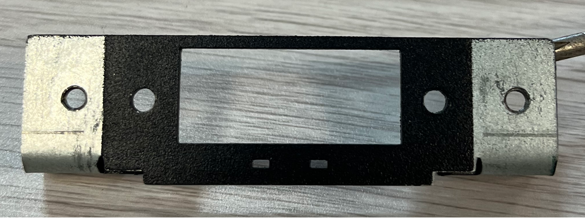
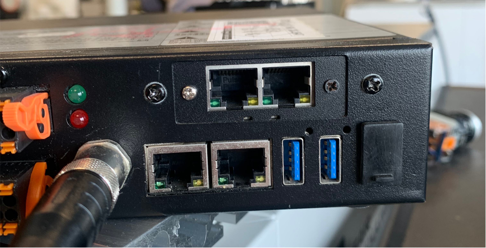
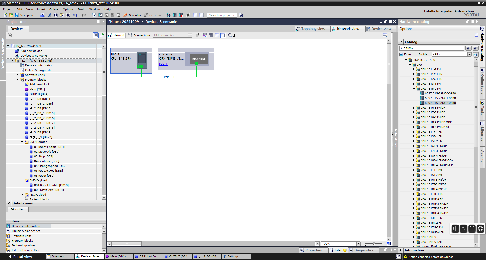
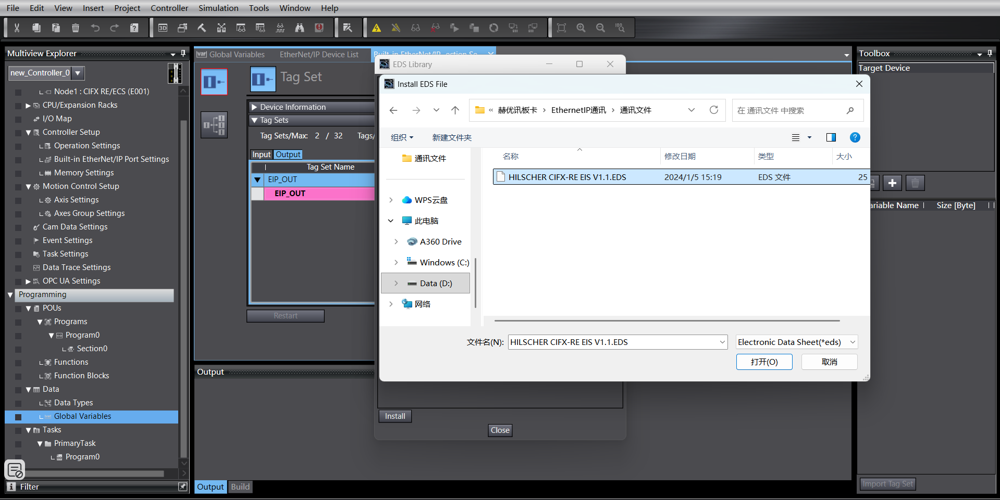
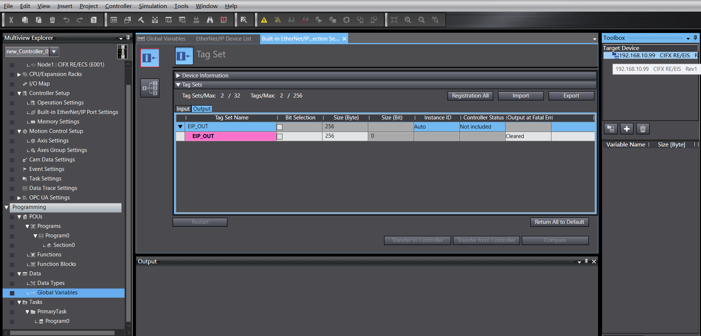
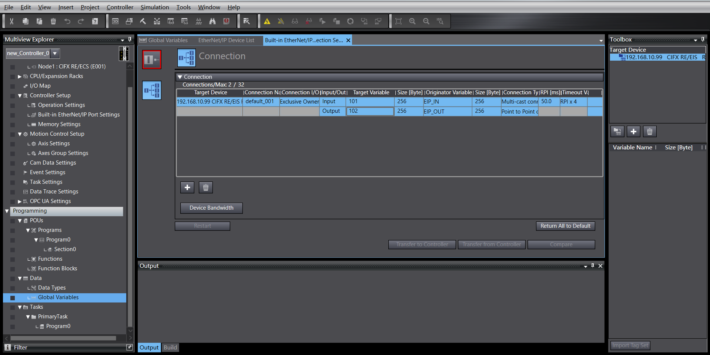
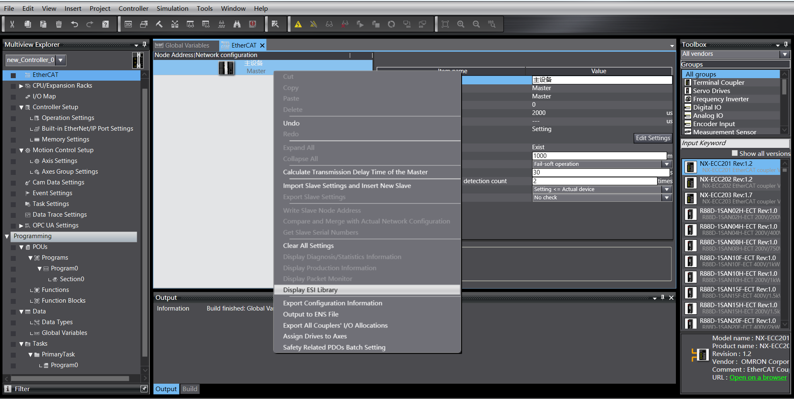
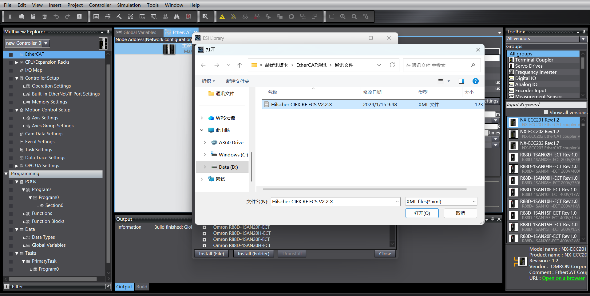
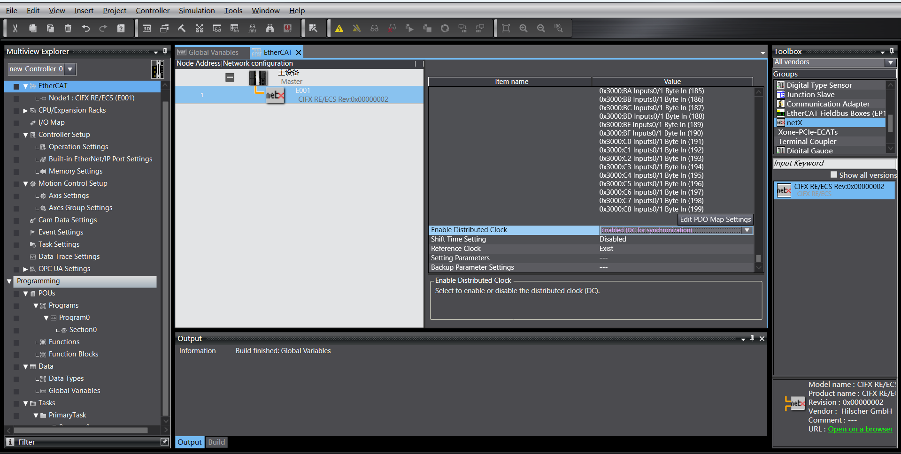
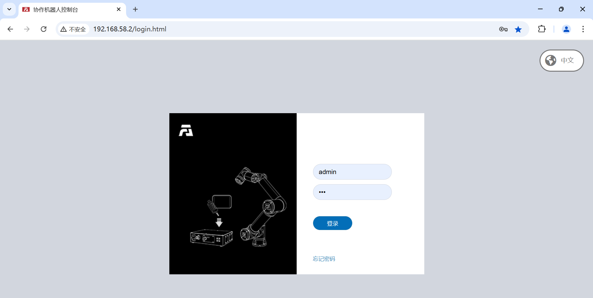

Modo Remoto do Robô
=============================================================

.. toctree::
   :maxdepth: 6

Visão Geral
-------------------------

Para facilitar o controle do movimento do robô por um CLP através de diferentes protocolos de barramento industrial (CC-Link, Profinet, Ethernet/IP e EtherCAT), as placas FRH-PCIeN-EC/EIP/CC/PN-RJ-V10 e FRJ-PCIeN-EIP/CC/PN-RJ-V10 são adicionadas ao mini painel de controle integrado, realizando as seguintes funções:

1) Suporte ao protocolo escravo CC-Link;
2) Suporte ao protocolo escravo Profinet;
3) Suporte ao protocolo escravo Ethernet/IP;
4) Suporte ao protocolo escravo EtherCAT (não suportado pela placa FRJ-PCIeN-EIP/CC/PN-RJ-V10).

Configuração do Ambiente
--------------------------------------------

Instalação da Placa
~~~~~~~~~~~~~~~~~~~~~~~~~~~~~~~~~~~~~~~~~~~~~

(1) Verificação dos materiais: As placas FRH-PCIeN, FRJ-PCIeN e as peças de chapa metálica correspondentes são mostradas abaixo.

.. image:: remote_mode/001.png
   :width: 4in
   :align: center

.. centered:: Figura 18.2-1 Chapa de Montagem (Frente)

.. centered:: Figura 18.2-2 Chapa de Montagem (Verso)

.. image:: remote_mode/003.png
   :width: 4in
   :align: center

.. centered:: Figura 18.2-3 Placa FRH-PCIeN-EC/EIP/CC/PN-RJ-V10

.. image:: remote_mode/004.png
   :width: 4in
   :align: center

.. centered:: Figura 18.2-4 Placa FRJ-PCIeN-EIP/CC/PN-RJ-V10

(2) Instale a placa no mini painel de controle integrado conforme mostrado.

.. image:: remote_mode/005.png
   :width: 4in
   :align: center

.. centered:: Figura 18.2-5 Diagrama de Instalação da Chapa

.. image:: remote_mode/006.png
   :width: 4in
   :align: center

.. centered:: Figura 18.2-6 Diagrama de Instalação da Placa Principal FRH-PCIeN

.. centered:: Figura 18.2-7 Diagrama de Instalação da Placa de Expansão de Porta de Rede (RJ45) FRH-PCIeN

.. image:: remote_mode/008.png
   :width: 4in
   :align: center

.. centered:: Figura 18.2-8 Diagrama de Instalação da Placa Principal FRJ-PCIeN

.. image:: remote_mode/009.png
   :width: 4in
   :align: center

.. centered:: Figura 18.2-9 Diagrama de Instalação da Placa de Expansão de Porta de Rede (RJ45) FRJ-PCIeN

.. note:: Nota: Todos os parafusos devem ser apertados.

(3) A fiação entre o painel de controle do robô e o CLP é mostrada abaixo.

.. image:: remote_mode/010.png
   :width: 4in
   :align: center

.. centered:: Figura 18.2-10 Diagrama de Fiação do Painel de Controle & CLP Mitsubishi

.. image:: remote_mode/011.png
   :width: 4in
   :align: center

.. centered:: Figura 18.2-11 Diagrama de Fiação do Painel de Controle & CLP Siemens

.. image:: remote_mode/012.png
   :width: 4in
   :align: center

.. centered:: Figura 18.2-12 Diagrama de Fiação do Painel de Controle & CLP Omron

.. image:: remote_mode/013.png
   :width: 4in
   :align: center

.. centered:: Figura 18.2-13 Diagrama de Fiação do Painel de Controle & CLP Omron

.. note::
    1: Painel de controle do robô (porta de rede da placa);
    2: Switch;
    3: PC portátil;
    4: CLP Mitsubishi (porta CC-Link IEF Basic);
    5: CLP Siemens (porta Profinet);
    6: CLP Omron (porta Ethernet/IP);
    7: CLP Omron (porta EtherCAT);

Quando o protocolo for alterado para o barramento EtherCAT, as portas de rede da placa precisam ser distinguidas como EtherCAT_IN e EtherCAT_OUT. Neste caso, a porta EtherCAT do CLP Omron deve ser conectada diretamente à porta EtherCAT_IN da placa através de um cabo Ethernet.

Configuração do Ambiente CLP
~~~~~~~~~~~~~~~~~~~~~~~~~~~~~~~~~~~~~~~~~~~~~~~~~~

O ambiente de teste configurado para implementar os comandos escravos de cada protocolo é mostrado na tabela abaixo, incluindo os modelos de CLP, versões de firmware e software de teste usados para cada protocolo.

.. centered:: Tabela 2-1 Ambiente de Teste

.. list-table::
   :widths: 20 40 40
   :header-rows: 1
   :align: center

   * - Protocolo
     - Profinet
     - CC-link

   * - Marca
     - Siemens
     - Mitsubishi

   * - Modelo
     - CPU 1515-2 PN
     - FX5S-30TR/DS

   * - Firmware
     - 6ES75152AM020AB0
     - 30MR/ES V1.3

   * - Software
     - TIA Portal V17
     - GXWorks3V1.097B

   * - Endereço IP da Placa
     - "192.168.0.2"
     - "192.168.0.113"

   * - Endereço IP do CLP
     - IP não precisa estar na mesma sub-rede
     - "192.168.0.15" (IP mesma sub-rede)

.. list-table::
   :widths: 20 40 40
   :header-rows: 1
   :align: center

   * - Protocolo
     - Ethernet/IP
     - EtherCAT

   * - Marca
     - Omron
     - Omron

   * - Modelo
     - NX102-1100
     - NX102-1100

   * - Firmware
     - V1.3
     - V1.3

   * - Software
     - SysmacStudioV1.50
     - SysmacStudioV1.50

   * - Endereço IP da Placa
     - "192.168.0.112"
     - "192.168.0.2"

   * - Endereço IP do CLP
     - "192.168.0.88" (IP mesma sub-rede)
     - "192.168.0.88" (IP mesma sub-rede)

Siemens Profinet
+++++++++++++++++++++++++++++++++++++++++++++++++++++++++++++

(1) Importação do arquivo GSD (arquivo XML)

Abra o software de programação Siemens TIA Portal V17, crie um novo projeto CLP, selecione "Dispositivos e Redes" e, no "Catálogo de Hardware" à direita, clique duas vezes em 6ES7 515-2AM02-0AB0 para adicionar o módulo CLP.

Na barra de menu do software TIA PORTAL, selecione "Opções" -> "Gerenciar arquivos de descrição de estação genérica (GSD)" para instalar ou excluir arquivos GSD já instalados.

.. image:: remote_mode/015.png
   :width: 6in
   :align: center

Para instalar o arquivo GSD, selecione "Gerenciar arquivos de descrição de estação genérica (GSD)" como acima. A janela "Gerenciar arquivos de descrição de estação genérica" aparece.

Selecione a pasta que contém os arquivos GSD a serem instalados no "Caminho de origem", escolha um ou mais arquivos da lista de arquivos GSD exibida e clique no botão "Instalar". Conforme mostrado abaixo.

.. image:: remote_mode/016.png
   :width: 6in
   :align: center

Após a instalação bem-sucedida, o dispositivo do arquivo GSD instalado pode ser encontrado em "Outros dispositivos de campo" no catálogo de hardware, conforme mostrado abaixo.

.. image:: remote_mode/017.png
   :width: 6in
   :align: center

Atribuição de E/S: Arraste os módulos de Entrada e Saída do catálogo.

.. image:: remote_mode/018.png
   :width: 6in
   :align: center

Baixar programa para o dispositivo: Clique duas vezes em "Dispositivos e Redes" na árvore do projeto à esquerda, clique com o botão direito no módulo "PLC_1", selecione "Baixar para dispositivo" no menu suspenso, clique em "Hardware e software (somente alterações)":

.. image:: remote_mode/019.png
   :width: 6in
   :align: center

Pesquisar e baixar dispositivo: Após o pop-up, configure o tipo de interface PG/PC conforme mostrado, clique em "Iniciar pesquisa", selecione o dispositivo para o qual deseja baixar o programa, clique em "Baixar":

.. image:: remote_mode/020.png
   :width: 6in
   :align: center

.. image:: remote_mode/021.png
   :width: 6in
   :align: center

Mitsubishi CC-link
++++++++++++++++++++++++++++++++++++++++++++++++++++

(1) Importar arquivo de configuração
Abra o GxWorks3, selecione "Ferramentas" -> "Gerenciamento de arquivos de configuração" -> "Login". Após o pop-up, selecione o arquivo de comunicação correspondente, clique em "Login" para concluir a importação do arquivo de configuração.

.. image:: remote_mode/022.png
   :width: 6in
   :align: center

.. image:: remote_mode/023.png
   :width: 6in
   :align: center

.. image:: remote_mode/024.png
   :width: 6in
   :align: center

(2) Configurações CC-Link IEF Basic

Crie um projeto CLP, habilite o CC-link: Selecione "Porta Ethernet" no menu de navegação à esquerda, defina o endereço IP do CLP para garantir que esteja na mesma sub-rede do endereço da placa Hilscher. Clique em "Uso CC-Link IEF Basic" e selecione "Usar".

.. image:: remote_mode/025.png
   :width: 6in
   :align: center

Configurações de rede CC-Link: Ainda nas Configurações CC-Link IEF Basic, selecione "Configurações de rede". Selecione o módulo Hilscher CIFX Digital I/O para o módulo. Arraste-o para a parte inferior esquerda da visualização para concluir a configuração do hardware.

.. image:: remote_mode/026.png
   :width: 6in
   :align: center

Configurações de atualização CC-Link: Ainda nas Configurações CC-Link IEF Basic, clique em "Configurações de atualização". Personalize as configurações de transferência: 256 bytes recebidos, 256 bytes enviados.

.. image:: remote_mode/027.png
   :width: 6in
   :align: center

(3) Download do programa

Após abrir o programa de teste, clique em "Online" -> "Escrever no CLP" para entrar na interface de download.

.. image:: remote_mode/028.png
   :width: 6in
   :align: center

Após abrir a interface de download, clique em "Parâmetros + Programa" no canto superior esquerdo e, em seguida, clique em "Executar" no canto inferior direito para fazer o download. Aguarde a conclusão do download.

.. image:: remote_mode/029.png
   :width: 6in
   :align: center

Omron Ethernet/IP
++++++++++++++++++++++++++++++++++++++++++++++++++++++++

(1) Crie um novo projeto CLP (Este exemplo usa o modelo: NX102-1100, CLP Omron 1.47):

.. image:: remote_mode/030.png
   :width: 6in
   :align: center

Crie novas variáveis globais:

.. image:: remote_mode/031.png
   :width: 6in
   :align: center

(2) Importar arquivo EDS

Clique em "Ferramentas" -> "Configurações de conexão EtherNet/IP":

.. image:: remote_mode/032.png
   :width: 6in
   :align: center

Acesse as configurações do CLP a ser conectado:

.. image:: remote_mode/033.png
   :width: 6in
   :align: center

Clique com o botão direito na área em branco do grupo de tags para criar um novo grupo de tags:

.. image:: remote_mode/034.png
   :width: 6in
   :align: center

Clique com o botão direito no grupo de tags recém-criado, crie tags. Igual para entrada e saída, ambos com 256 bytes de comprimento:

.. image:: remote_mode/035.png
   :width: 6in
   :align: center

.. image:: remote_mode/036.png
   :width: 6in
   :align: center

Acesse as configurações de conexão, clique com o botão direito na área em branco da caixa de ferramentas, clique com o botão direito para exibir a biblioteca EDS:

.. image:: remote_mode/037.png
   :width: 6in
   :align: center

Instale o arquivo EDS:

Clique no "+" na caixa de ferramentas, adicione o dispositivo de destino, preencha o endereço IP do dispositivo de destino:

.. image:: remote_mode/039.png
   :width: 6in
   :align: center

Clique em "Adicionar" no canto inferior direito. Após a adição bem-sucedida, o dispositivo de destino é exibido:

(3) Configurações de parâmetros EtherNet/IP

Clique com o botão direito no dispositivo de destino adicionado, clique em "Editar":

.. image:: remote_mode/041.png
   :width: 6in
   :align: center

O comprimento atual do mapeamento de dados do dispositivo é de 256 bytes. Altere 0001 e 0002 para 256, confirme:

.. image:: remote_mode/042.png
   :width: 6in
   :align: center

Clique duas vezes no dispositivo de destino, preencha a entrada e a saída, selecione a variável inicial:

(4) Download do programa

Abra o programa de teste, modifique o endereço IP do CLP para a mesma sub-rede da placa, faça o download do programa e execute-o.

Omron EtherCAT
+++++++++++++++++++++++++++++++++++++++++++++++++

(1) Crie um novo projeto CLP (Este exemplo usa o modelo: NX102-1100, CLP Omron 1.47):

.. image:: remote_mode/044.png
   :width: 6in
   :align: center

Crie novas variáveis globais:

.. image:: remote_mode/045.png
   :width: 6in
   :align: center

(2) Importar arquivo XML

Clique duas vezes em "EtherCAT" para acessar a interface de configurações do mestre, clique com o botão direito e selecione "Mostrar biblioteca ESI".

Na caixa de ferramentas à direita, selecione o dispositivo de destino adicionado, clique duas vezes para adicionar o escravo:

.. image:: remote_mode/048.png
   :width: 6in
   :align: center

(3) Configurações do escravo EtherCAT

Defina o "Relógio distribuído válido" do escravo como "Iniciar DC":

(4) Mapeamento de E/S

Clique duas vezes em "Mapeamento de E/S" para vincular variáveis a endereços:

.. image:: remote_mode/050.png
   :width: 6in
   :align: center

(5) Download do programa

Abra o programa de teste, modifique o endereço IP do CLP para a mesma sub-rede da placa, faça o download do programa e execute-o.

Instruções de Operação do Modo Remoto do Robô
----------------------------------------------------------------------------

(1) Digite o endereço IP 192.168.58.2 no navegador. O nome de usuário é admin, a senha é 123. Clique em "Login" para acessar a interface web do painel de controle do robô.

.. centered:: Figura 18.2-14 Interface Web do Painel de Controle

(2) Clique em "Configurações do Sistema" -> "Sobre" -> Interface de Atualização de Software. Clique no botão "Atualizar", carregue o pacote de software a ser atualizado, clique em "Atualizar" para iniciar a atualização. Reinicie o painel de controle após a conclusão da atualização.

.. image:: remote_mode/052.png
   :width: 6in
   :align: center

.. centered:: Figura 18.2-15 Atualização de Software

(3) Clique no botão de expansão no canto superior direito para abrir a barra de menu. Clique em "Modo Local" para alternar para o "Modo Remoto".

.. image:: remote_mode/053.png
   :width: 4in
   :align: center

.. centered:: Figura 18.2-16 Alternando para o Modo Remoto

(4) Selecione o protocolo escravo do controlador e se a função de inicialização automática é necessária. Clique no botão "Definir".

.. image:: remote_mode/054.png
   :width: 6in
   :align: center

.. centered:: Figura 18.2-17 Configurando o Protocolo de Comunicação

.. note:: Para alternar entre diferentes protocolos, você deve primeiro clicar no botão "Desinstalar" antes de configurar outro protocolo.

Apêndice
-------------------

Lista de Comandos
~~~~~~~~~~~~~~~~~~~~~~~~~~~

.. list-table::
   :widths: 20 80
   :header-rows: 1
   :align: center

   * - Código do Comando
     - Descrição do Comando

   * - 0x1000
     - Habilitar Robô

   * - 0x1001
     - Redefinir todos os erros

   * - 0x1002
     - Parar movimento do robô

   * - 0x1003
     - Ler posição real

   * - 0x1004
     - Definir velocidade do robô

   * - 0x1005
     - Continuar movimento do robô

   * - 0x1006
     - Pausar movimento do robô

   * - 0x1007
     - Calcular posição cartesiana a partir da posição da junta

   * - 0x1008
     - Calcular posição da junta a partir da posição cartesiana

   * - 0x2000
     - Escrever informações da ferramenta

   * - 0x2001
     - Ler informações da ferramenta

   * - 0x2002
     - Escrever informações da peça

   * - 0x2003
     - Ler informações da peça

   * - 0x2004
     - Escrever informações de carga

   * - 0x2005
     - Ler informações de carga

   * - 0x2006
     - Escrever informações dinâmicas de referência

   * - 0x2007
     - Ler informações dinâmicas de referência

   * - 0x2008
     - Escrever informações dinâmicas padrão

   * - 0x2009
     - Ler informações dinâmicas padrão

   * - 0x2010
     - Escrever informações de limite suave

   * - 0x2011
     - Ler informações de limite suave

   * - 0x3000
     - MoveAxes (baseado em ângulos das juntas)

   * - 0x3001
     - MoveLinear

   * - 0x3002
     - MoveDirect (baseado no sistema de coordenadas cartesiano)

   * - 0x3003
     - Movimento Jog

   * - 0x3004
     - Parada Jog