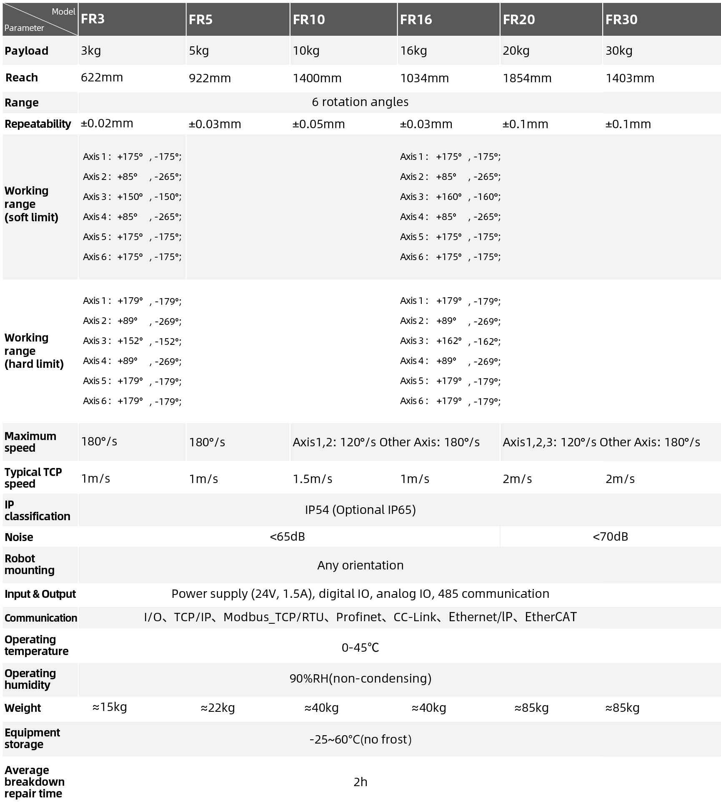
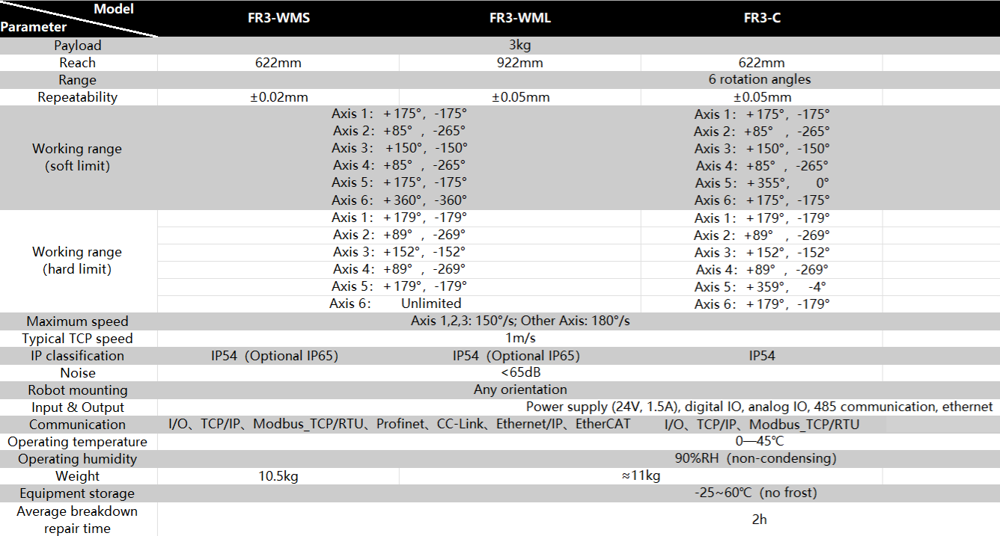
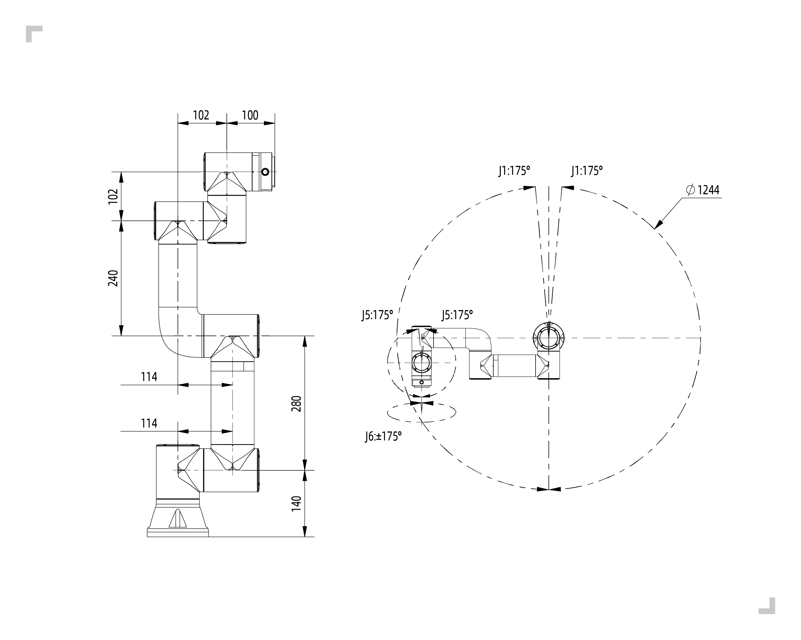
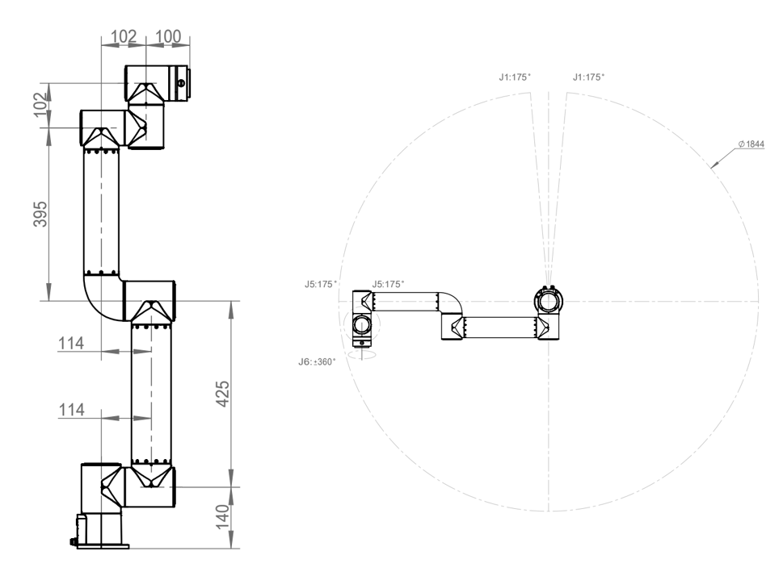
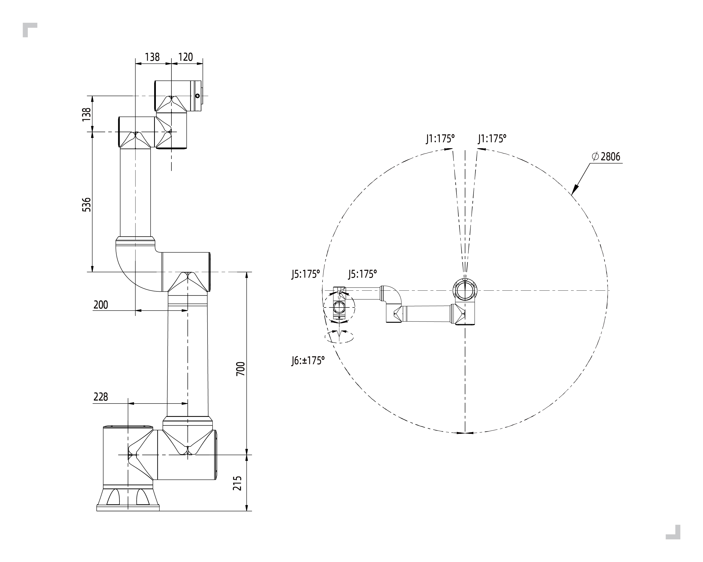

Introdução ao Robô
===================

.. toctree:: 
	:maxdepth: 5

Parâmetros Básicos
-----------------------------

.. centered:: Tabela 2.1-1 Parâmetros Básicos do Robô

.. important::
  Ao realizar transformações de postura ou sistema de coordenadas nos robôs da série FR, a ordem de rotação dos ângulos para o cálculo da matriz de transformação homogênea é “ZYX” do sistema de coordenadas móvel (flutuante).

Área de Trabalho (Envelope de Movimento)
--------------------------------------------------

Espaço de Instalação do Braço Mecânico:

A instalação do corpo do robô requer um espaço de 3m × 3m × 2m (comprimento × largura × altura) para acomodar o movimento com o braço totalmente estendido. Se o usuário adicionar uma carga na extremidade, certifique-se de que o espaço de instalação tenha uma folga mínima de 500 mm.

.. note:: 
	O espaço em altura é afetado pela altura da base de montagem. Aqui, 2m refere-se à distância acima do plano de referência de montagem.

Espaço de Instalação do Painel de Controle:

1. O painel de controle deve ser colocado em um local de fácil operação, protegido contra alagamentos e choques elétricos, a uma altura de 0,6 m a 1,5 m do chão.
2. O gabinete deve ser mantido afastado de fontes de calor.
3. O lado do painel de controle onde fica o cabo de carga pesada deve ter um espaço livre de no mínimo 150 mm, e os outros lados devem ter um espaço livre de no mínimo 100 mm para facilitar a dissipação de calor e o acesso.

.. centered:: Figura 2.2-1 Área de Trabalho do Robô Colaborativo Modelo FR3

.. figure:: installation/103.png
	:align: center
	:width: 6in

.. centered:: Figura 2.2-2 Área de Trabalho do Robô Colaborativo Modelo FR3-WML

.. figure:: installation/104.png
	:align: center
	:width: 6in

.. centered:: Figura 2.2-3 Área de Trabalho do Robô Colaborativo Modelo FR3-WMS

.. figure:: installation/105.png
	:align: center
	:width: 6in

.. centered:: Figura 2.2-4 Área de Trabalho do Robô Colaborativo Modelo FR3-C

.. figure:: installation/019.png
	:align: center
	:width: 6in

.. centered:: Figura 2.2-5 Área de Trabalho do Robô Colaborativo Modelo FR5

.. centered:: Figura 2.2-6 Robô Colaborativo Modelo FR5-C Faixa de Movimento

.. figure:: installation/020.png
	:align: center
	:width: 6in

.. centered:: Figura 2.2-6 Área de Trabalho do Robô Colaborativo Modelo FR10

.. figure:: installation/021.png
	:align: center
	:width: 6in

.. centered:: Figura 2.2-7 Área de Trabalho do Robô Colaborativo Modelo FR16

.. figure:: installation/022.png
	:align: center
	:width: 6in

.. centered:: Figura 2.2-8 Área de Trabalho do Robô Colaborativo Modelo FR20

.. centered:: Figura 2.2-9 Área de Trabalho do Robô Colaborativo Modelo FR30

Sistemas de Coordenadas do Robô
---------------------------------------------

.. figure:: installation/023.png
	:align: center
	:width: 6in

.. centered:: Figura 2.3-1 Sistema de Coordenadas dos Parâmetros DH do Robô

.. figure:: installation/024.png
	:align: center
	:width: 6in

.. centered:: Figura 2.3-2 Sistema de Coordenadas da Flange da Extremidade do Robô

Parâmetros DH do Robô
-----------------------

Os parâmetros DH são usados para calcular a cinemática e a dinâmica dos robôs colaborativos da série FR.

.. figure:: installation/063.png
	:align: center
	:width: 6in

.. centered:: Figura 2.4-1 Parâmetros DH dos Robôs Colaborativos da Série FR

Os parâmetros DH para os robôs colaborativos da série FR são mostrados abaixo:

.. centered:: Tabela 2.4-1 Tabela de Parâmetros DH do Robô Colaborativo FR3

.. list-table::
   :widths: 70 50 50 50 50 70 50 120
   :header-rows: 0
   :align: center
   :class: no-padding sheet-center

   * - **Cinemática**
     - **theta[rad]**
     - **a[mm]**
     - **d[mm]**
     - **alpha[rad]**
     - **Dinâmica**
     - **Massa[kg]**
     - **Centro de Massa[mm]**

   * - Junta 1
     - 0
     - 0
     - 140
     - π/2
     - Elo 1
     - 1.98
     - [-0.05, -15.92, 2.26]

   * - Junta 2
     - 0
     - -280
     - 0
     - 0
     - Elo 2
     - 3.4445
     - [139.49, 0, 99.54]

   * - Junta 3
     - 0
     - -240
     - 0
     - 0
     - Elo 3
     - 1.437
     - [58.99, 0.08, 12.99]

   * - Junta 4
     - 0
     - 0
     - 102
     - π/2
     - Elo 4
     - 0.871
     - [0.05, -2.33, 14.67]

   * - Junta 5
     - 0
     - 0
     - 102
     - -π/2
     - Elo 5
     - 0.805
     - [-0.05, 2.33, 14.67]

   * - Junta 6
     - 0
     - 0
     - 100
     - 0
     - Elo 6
     - 0.261
     - [-0.05, -1.11, -20.05]

.. centered:: Tabela 2.4-2 Tabela de Parâmetros DH do Robô Colaborativo FR3-WMS

.. list-table::
   :widths: 70 50 50 50 50 70 50 120
   :header-rows: 0
   :align: center
   :class: no-padding sheet-center

   * - **Cinemática**
     - **theta[rad]**
     - **a[mm]**
     - **d[mm]**
     - **alpha[rad]**
     - **Dinâmica**
     - **Massa[kg]**
     - **Centro de Massa[mm]**

   * - Junta 1
     - 0
     - 140
     - 0
     - π/2
     - Elo 1
     - 1.66
     - [-0.06，-13.58，1.68]

   * - Junta 2
     - 0
     - 0
     - -280
     - 0
     - Elo 2
     - 3.68
     - [140.11，0，101.71]

   * - Junta 3
     - 0
     - 0
     - -240
     - 0
     - Elo 3
     - 1.81
     - [63.49，0.1，10.94]

   * - Junta 4
     - 0
     - 102
     - 0
     - π/2
     - Elo 4
     - 1.18
     - [0.07，-2.18，12.48]

   * - Junta 5
     - 0
     - 102
     - 0
     - -π/2
     - Elo 5
     - 1.18
     - [-0.07，2.18，12.48]

   * - Junta 6
     - 0
     - 100
     - 0
     - 0
     - Elo 6
     - 0.28
     - [1.81，1.33，-20.41]

.. centered:: Tabela 2.4-3 Tabela de Parâmetros DH do Robô Colaborativo FR3-WML

.. list-table::
   :widths: 70 50 50 50 50 70 50 120
   :header-rows: 0
   :align: center
   :class: no-padding sheet-center

   * - **Cinemática**
     - **theta[rad]**
     - **a[mm]**
     - **d[mm]**
     - **alpha[rad]**
     - **Dinâmica**
     - **Massa[kg]**
     - **Centro de Massa[mm]**

   * - Junta 1
     - 0
     - 140
     - 0
     - π/2
     - Elo 1
     - 1.54
     - [-0.01，-14.27，1.37]

   * - Junta 2
     - 0
     - 0
     - -425
     - 0
     - Elo 2
     - 3.49
     - [212.5，0，101.43]

   * - Junta 3
     - 0
     - 0
     - -395
     - 0
     - Elo 3
     - 2
     - [114.17，0.08，9.92]

   * - Junta 4
     - 0
     - 102
     - 0
     - π/2
     - Elo 4
     - 1.17
     - [0.07，-2.18，12.48]

   * - Junta 5
     - 0
     - 102
     - 0
     - -π/2
     - Elo 5
     - 1.17
     - [-0.07，2.18，12.48]

   * - Junta 6
     - 0
     - 100
     - 0
     - 0
     - Elo 6
     - 0.28
     - [1.9，1.6，-20.08]

.. centered:: Tabela 2.4-4 Tabela de Parâmetros DH do Robô Colaborativo FR3-C

.. list-table::
   :widths: 70 50 50 50 50 70 50 120
   :header-rows: 0
   :align: center
   :class: no-padding sheet-center

   * - **Cinemática**
     - **theta[rad]**
     - **a[mm]**
     - **d[mm]**
     - **alpha[rad]**
     - **Dinâmica**
     - **Massa[kg]**
     - **Centro de Massa[mm]**

   * - Junta 1
     - 0
     - 140
     - 0
     - π/2
     - Elo 1
     - 1.69
     - [-0.16，-13.99，1.53]

   * - Junta 2
     - 0
     - 0
     - -280
     - 0
     - Elo 2
     - 3.73
     - [140，0，101.34]

   * - Junta 3
     - 0
     - 0
     - -240
     - 0
     - Elo 3
     - 1.84
     - [63.24，0.08，11.04]

   * - Junta 4
     - 0
     - 102
     - 0
     - π/2
     - Elo 4
     - 1.2
     - [0.1，-2.03，12.55]

   * - Junta 5
     - 0
     - 102
     - 0
     - -π/2
     - Elo 5
     - 1.2
     - [-0.1，2.03，12.55]

   * - Junta 6
     - 0
     - 100
     - 0
     - 0
     - Elo 6
     - 0.53
     - [1.48，1.54，-17.9]

.. centered:: Tabela 2.4-5 Tabela de Parâmetros DH do Robô Colaborativo FR5

.. list-table::
   :widths: 70 50 50 50 50 70 50 120
   :header-rows: 0
   :align: center
   :class: no-padding sheet-center

   * - **Cinemática**
     - **theta[rad]**
     - **a[mm]**
     - **d[mm]**
     - **alpha[rad]**
     - **Dinâmica**
     - **Massa[kg]**
     - **Centro de Massa[mm]**

   * - Junta 1
     - 0
     - 0
     - 152
     - π/2
     - Elo 1
     - 4.64
     - [-0.19, -18.28, 2.26]

   * - Junta 2
     - 0
     - -425
     - 0
     - 0
     - Elo 2
     - 10.08
     - [212.47, 0, 121.2]

   * - Junta 3
     - 0
     - -395
     - 0
     - 0
     - Elo 3
     - 2.71
     - [122.62, 0.17, 12.59]

   * - Junta 4
     - 0
     - 0
     - 102
     - π/2
     - Elo 4
     - 1.56
     - [0.05, -2.33, 14.68]

   * - Junta 5
     - 0
     - 0
     - 102
     - -π/2
     - Elo 5
     - 1.56
     - [-0.05, 2.33, 14.68]

   * - Junta 6
     - 0
     - 0
     - 100
     - 0
     - Elo 6
     - 0.36
     - [0.93, 0.81, -20.05]

.. centered:: Tabela 2.4-6 Parâmetros DH do Robô Colaborativo FR5-C

.. list-table::
   :widths: 70 50 50 50 50 70 50 120
   :header-rows: 0
   :align: center
   :class: no-padding sheet-center

   * - **Cinemática**
     - **theta[rad]**
     - **a[mm]**
     - **d[mm]**
     - **alpha[rad]**
     - **Dinâmica**
     - **Massa[kg]**
     - **Centro de Massa[mm]**

   * - Junta1
     - 0
     - 0
     - 140
     - π/2
     - Elo1
     - 1.76
     - [-0.09, -15.66, 1.53]

   * - Junta2
     - 0
     - -280
     - 0
     - 0
     - Elo2
     - 3.98
     - [211.32, 0, 101.13]

   * - Junta3
     - 0
     - -240
     - 0
     - 0
     - Elo3
     - 2.08
     - [102.62, 0.12, 11.26]

   * - Junta4
     - 0
     - 0
     - 102
     - π/2
     - Elo4
     - 1.33
     - [0.09, -1.86, 13.76]

   * - Junta5
     - 0
     - 0
     - 102
     - -π/2
     - Elo5
     - 1.33
     - [-0.09, 1.86, 13.76]

   * - Junta6
     - 0
     - 0
     - 100
     - 0
     - Elo6
     - 0.28
     - [-0.26, 1.75, -20.50]

.. centered:: Tabela 2.4-7 Tabela de Parâmetros DH do Robô Colaborativo FR5-WML

.. list-table::
   :widths: 70 50 50 50 50 70 50 120
   :header-rows: 0
   :align: center
   :class: no-padding sheet-center

   * - **Cinemática**
     - **theta[rad]**
     - **a[mm]**
     - **d[mm]**
     - **alpha[rad]**
     - **Dinâmica**
     - **Massa[kg]**
     - **Centro de Massa[mm]**

   * - Junta 1
     - 0
     - 180
     - 0
     - π/2
     - Elo 1
     - 11.49
     - [-0.16, -28.51, 4.16]

   * - Junta 2
     - 0
     - 0
     - -970
     - 0
     - Elo 2
     - 21.3
     - [642.59, 0.04, 165.62]

   * - Junta 3
     - 0
     - 0
     - -816
     - 0
     - Elo 3
     - 4.61
     - [321.39, 0.16, 52.76]

   * - Junta 4
     - 0
     - 159
     - 0
     - π/2
     - Elo 4
     - 1.66
     - [0.21, -3.06, 13.07]

   * - Junta 5
     - 0
     - 114
     - 0
     - -π/2
     - Elo 5
     - 1.66
     - [-0.21, 3.06, 13.07]

   * - Junta 6
     - 0
     - 160
     - 0
     - 0
     - Elo 6
     - 0.36
     - [1.45, 1.09, -19.98]

.. centered:: Tabela 2.4-8 Tabela de Parâmetros DH do Robô Colaborativo FR10

.. list-table::
   :widths: 70 50 50 50 50 70 50 120
   :header-rows: 0
   :align: center
   :class: no-padding sheet-center

   * - **Cinemática**
     - **theta[rad]**
     - **a[mm]**
     - **d[mm]**
     - **alpha[rad]**
     - **Dinâmica**
     - **Massa[kg]**
     - **Centro de Massa[mm]**

   * - Junta 1
     - 0
     - 0
     - 180
     - π/2
     - Elo 1
     - 11.97
     - [-0.10, -26.12, 4.04]

   * - Junta 2
     - 0
     - -700
     - 0
     - 0
     - Elo 2
     - 19.59
     - [480.27, 0.01, 164.68]

   * - Junta 3
     - 0
     - -586
     - 0
     - 0
     - Elo 3
     - 3.7
     - [211.22, 0.11, 54.21]

   * - Junta 4
     - 0
     - 0
     - 159
     - π/2
     - Elo 4
     - 1.69
     - [0.12, -3, 12.18]

   * - Junta 5
     - 0
     - 0
     - 114
     - -π/2
     - Elo 5
     - 1.69
     - [-0.12, 3, 12.18]

   * - Junta 6
     - 0
     - 0
     - 106
     - 0
     - Elo 6
     - 0.35
     - [1.24, 0.85, -20.34]

.. centered:: Tabela 2.4-9 Tabela de Parâmetros DH do Robô Colaborativo FR16

.. list-table::
   :widths: 70 50 50 50 50 70 50 120
   :header-rows: 0
   :align: center
   :class: no-padding sheet-center

   * - **Cinemática**
     - **theta[rad]**
     - **a[mm]**
     - **d[mm]**
     - **alpha[rad]**
     - **Dinâmica**
     - **Massa[kg]**
     - **Centro de Massa[mm]**

   * - Junta 1
     - 0
     - 0
     - 180
     - π/2
     - Elo 1
     - 11.97
     - [-0.10, -26.12, 4.04]

   * - Junta 2
     - 0
     - -520
     - 0
     - 0
     - Elo 2
     - 18.18
     - [364.4, 0.01, 163.09]

   * - Junta 3
     - 0
     - -400
     - 0
     - 0
     - Elo 3
     - 3.22
     - [135.03, 0.12, 55.58]

   * - Junta 4
     - 0
     - 0
     - 159
     - π/2
     - Elo 4
     - 1.69
     - [0.12, -3, 12.18]

   * - Junta 5
     - 0
     - 0
     - 114
     - -π/2
     - Elo 5
     - 1.69
     - [-0.12, 3, 12.18]

   * - Junta 6
     - 0
     - 0
     - 106
     - 0
     - Elo 6
     - 0.35
     - [1.24, 0.85, -20.34]

.. centered:: Tabela 2.4-10 Tabela de Parâmetros DH do Robô Colaborativo FR20

.. list-table::
   :widths: 70 50 50 50 50 70 50 120
   :header-rows: 0
   :align: center
   :class: no-padding sheet-center

   * - **Cinemática**
     - **theta[rad]**
     - **a[mm]**
     - **d[mm]**
     - **alpha[rad]**
     - **Dinâmica**
     - **Massa[kg]**
     - **Centro de Massa[mm]**

   * - Junta 1
     - 0
     - 0
     - 215
     - π/2
     - Elo 1
     - 20.79
     - [-0.19, -36.57, 5.68]

   * - Junta 2
     - 0
     - -1000
     - 0
     - 0
     - Elo 2
     - 42.84
     - [605.25, 0.06, 202.94]

   * - Junta 3
     - 0
     - -716
     - 0
     - 0
     - Elo 3
     - 9.88
     - [262.84, 0.22, 43.08]

   * - Junta 4
     - 0
     - 0
     - 166
     - π/2
     - Elo 4
     - 4.64
     - [0.23, -2.28, 18.42]

   * - Junta 5
     - 0
     - 0
     - 138
     - -π/2
     - Elo 5
     - 4.64
     - [-0.23, 2.28, 18.42]

   * - Junta 6
     - 0
     - 0
     - 120
     - 0
     - Elo 6
     - 0.6
     - [-2.11, -1.96, -20.38]

.. centered:: Tabela 2.4-11 Tabela de Parâmetros DH do Robô Colaborativo FR30

.. list-table::
   :widths: 70 50 50 50 50 70 50 120
   :header-rows: 0
   :align: center
   :class: no-padding sheet-center

   * - **Cinemática**
     - **theta[rad]**
     - **a[mm]**
     - **d[mm]**
     - **alpha[rad]**
     - **Dinâmica**
     - **Massa[kg]**
     - **Centro de Massa[mm]**

   * - Junta 1
     - 0
     - 0
     - 215
     - π/2
     - Elo 1
     - 20.64
     - [-0.22, -37.39, 5.59]

   * - Junta 2
     - 0
     - -700
     - 0
     - 0
     - Elo 2
     - 36.37
     - [440.73, 0.05, 198.7]

   * - Junta 3
     - 0
     - -536
     - 0
     - 0
     - Elo 3
     - 8.41
     - [185.64, 0.25, 45.82]

   * - Junta 4
     - 0
     - 0
     - 166
     - π/2
     - Elo 4
     - 4.64
     - [0.23, -2.29, 18.60]

   * - Junta 5
     - 0
     - 0
     - 138
     - -π/2
     - Elo 5
     - 4.64
     - [-0.23, 2.29, 18.60]

   * - Junta 6
     - 0
     - 0
     - 120
     - 0
     - Elo 6
     - 0.6
     - [-2.11, -1.96, -20.38]

Tabela de Parâmetros DH
---------------------------------
    :download:`Robôs Colaborativos FAIRINO - Tabela de Parâmetros DH <../_static/_doc/FR Robots DH Transformation.xlsx>`