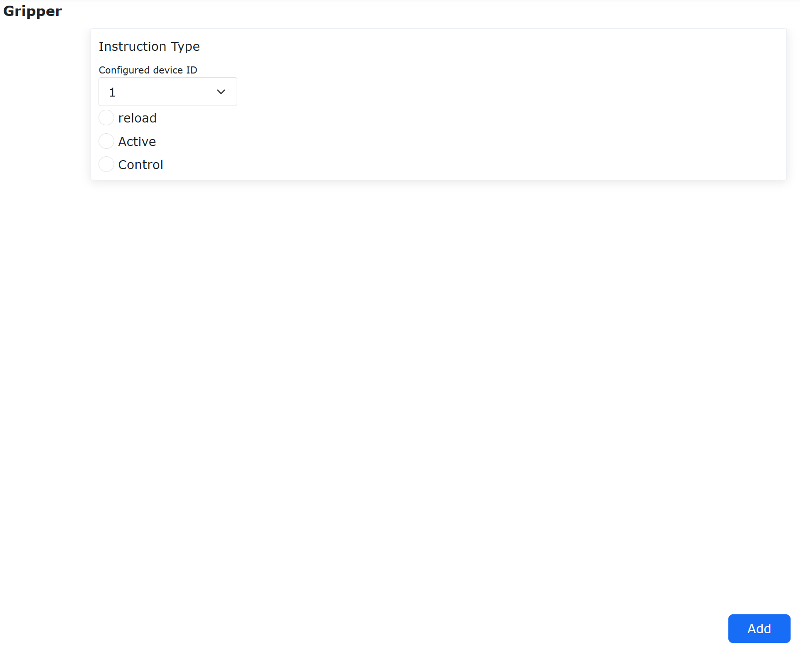
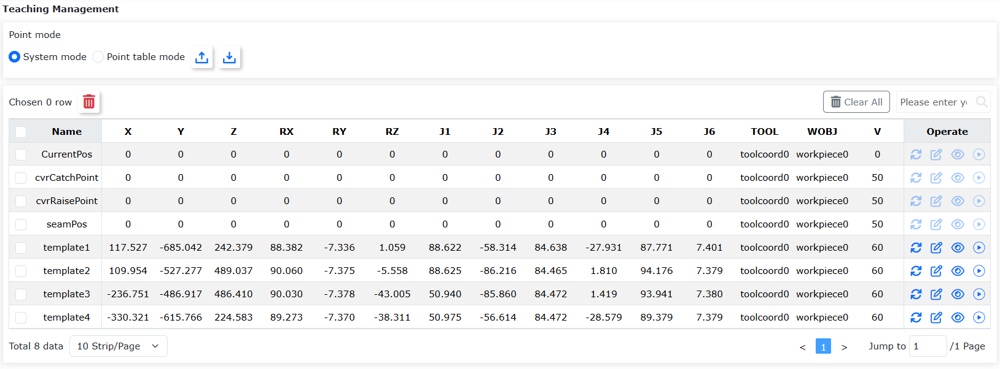
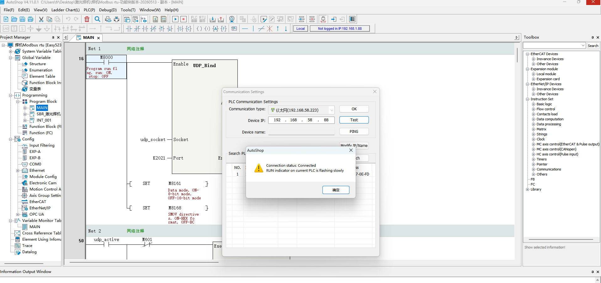
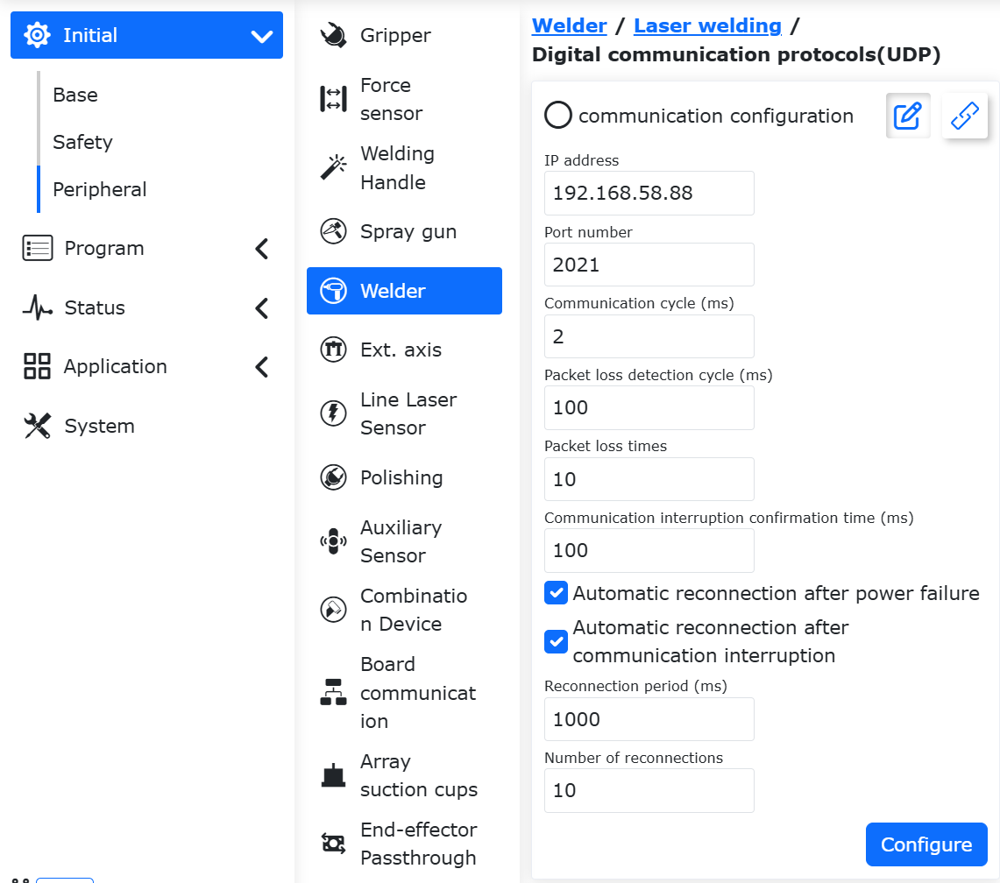
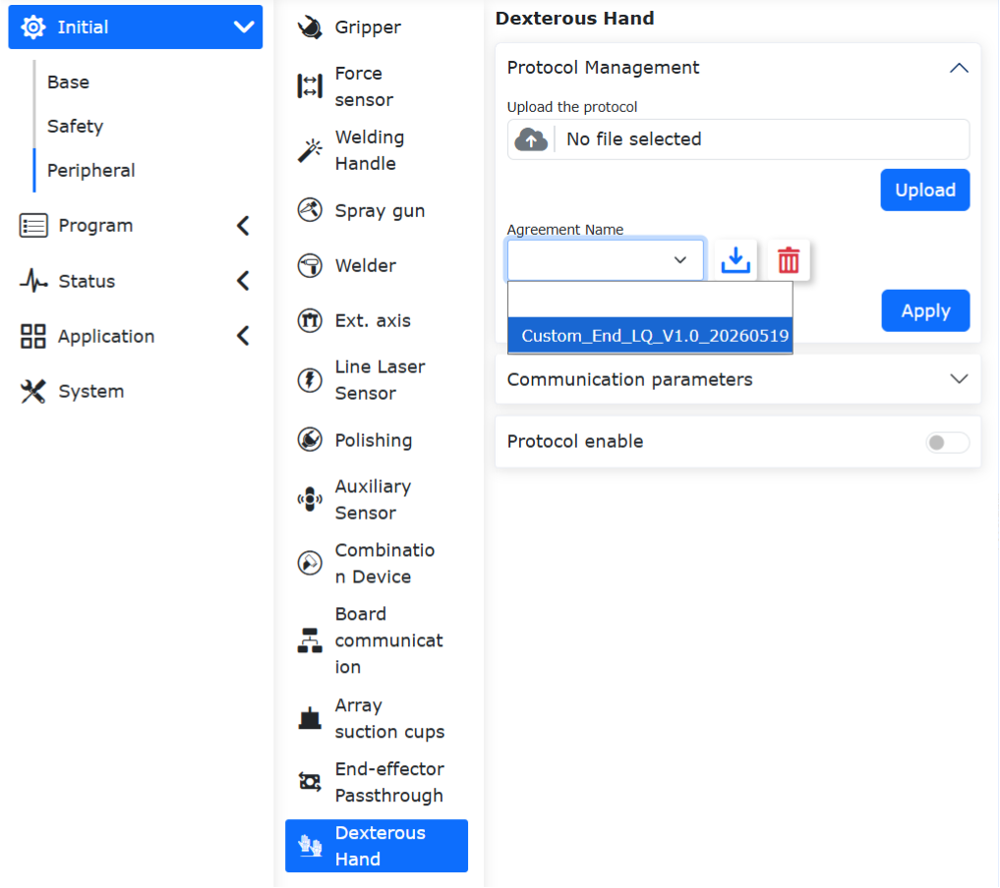
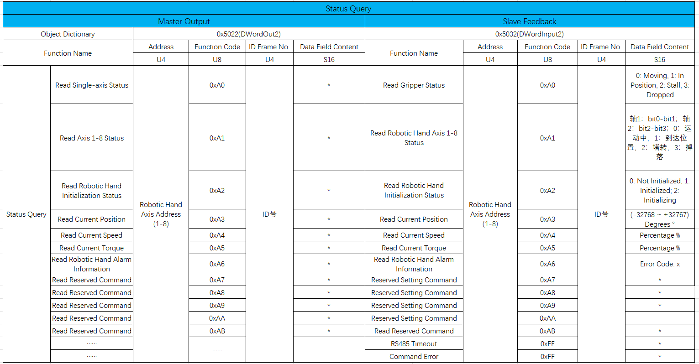
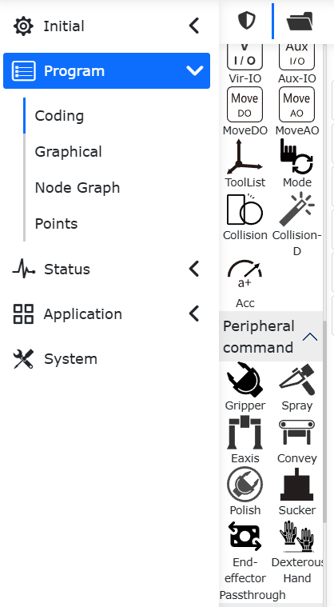

Periféricos
=============

.. toctree:: 
  :maxdepth: 5

Protocolo Aberto Personalizado Lua na Extremidade
---------------------------------------------------------

Visão Geral
~~~~~~~~~~~~~~~~~~~~

A extremidade do robô fornece uma interface de hardware para conectar dispositivos periféricos que se comunicam via 485. Atualmente, os periféricos suportados incluem garras, garras rotativas, sensores de força, punhos de solda e outros equipamentos. Todos esses dispositivos de extremidade podem ser adaptados escrevendo um protocolo aberto Lua para controlar o periférico e obter seu status. Para o punho de solda SmartTool, os usuários também podem optar por configurar as funções dos botões através de uma página web para gerar automaticamente o arquivo de protocolo aberto, que será automaticamente aplicado à extremidade após a geração.

Procedimento Operacional
~~~~~~~~~~~~~~~~~~~~~~~~~~~~~~~~~~~

**Passo 1**: Acesse Configurações do Sistema -> Sobre -> Atualização de Firmware, selecione o arquivo .bin do firmware da extremidade e atualize o firmware da extremidade.

.. important:: 
   É necessário confirmar primeiro se a versão do firmware da extremidade FV2.010.06 e versões de software posteriores são compatíveis. Se a versão não for compatível, atualize o firmware do software correspondente; caso contrário, não é necessário atualizar o firmware.

   Antes de fazer o upload do pacote de atualização do firmware da extremidade, é necessário desativar o robô e, em seguida, entrar no modo boot.

.. figure:: robot_peripherals/001.png
   :align: center
   :width: 6in

.. centered:: Figura 8.1‑1 Atualização do Firmware da Extremidade

**Passo 2**: Abra o WebApp, clique sequencialmente em "Configurações Iniciais", "Periféricos" e selecione o periférico de extremidade a ser configurado (por exemplo, garra). Os tipos de controle do periférico são dois: Dispositivo Adaptado e Protocolo Aberto de Periférico:

- **Dispositivo Adaptado**: Utiliza o controlador do robô para comunicação, não necessitando de upload e aplicação.
- **Protocolo Aberto de Periférico**: O usuário escreve um protocolo aberto de extremidade baseado em Lua para adaptar a comunicação e o controle. Os protocolos de extremidade são divididos em dois tipos: um é o protocolo enviado pelo próprio usuário, o outro é o protocolo embutido predefinido pelo robô. A partir da versão 3.9.2, os usuários não precisam realizar operações adicionais de verificação e criptografia no protocolo Lua que precisa ser enviado para a extremidade através de software externo; podem enviá-lo diretamente. Protocolos previamente verificados e criptografados ainda podem ser enviados e usados normalmente. O robô distinguirá automaticamente se o arquivo foi verificado e criptografado. Se não foi, ele será verificado e criptografado antes de ser aplicado à extremidade; se já foi, será aplicado diretamente.

.. figure:: robot_peripherals/002.png
   :align: center
   :width: 6in

.. centered:: Figura 8.1‑2 Tipo de Controle da Garra

**Passo 3**: Acesse a interface de conteúdo de Periféricos -> Garra/Sensor de Força/Punho de Solda, clique no cartão "Protocolo Personalizado" para entrar na interface. Faça o upload do arquivo de protocolo aberto Lua da extremidade, selecione o arquivo e realize a operação de upload.

.. important:: 
  O nome do arquivo de upload deve começar com `AXLE_LUA_`.

**Passo 4**: Configure os parâmetros de comunicação da extremidade, que incluem taxa de transmissão, bits de dados, bits de parada, etc. Após a configuração, clique no botão "Configurar".

.. figure:: robot_peripherals/003.png
   :align: center
   :width: 4in

.. centered:: Figura 8.1‑3 Configuração dos Parâmetros de Comunicação da Extremidade

Os parâmetros detalhados de comunicação da extremidade são os seguintes:

- **Taxa de Transmissão (Baud Rate)**: Suporta 1-9600, 2-14400, 3-19200, 4-38400, 5-56000, 6-67600, 7-115200, 8-128000; o chip driver RS485 da extremidade é de baixa velocidade, a taxa de transmissão não pode ser > 200k;
- **Bits de Dados**: Suporta (8,9), sendo 8 o mais comum atualmente;
- **Bits de Parada**: 1-1, 2-0.5, 3-2, 4-1.5, sendo 1 o mais comum atualmente;
- **Bits de Paridade**: 0-None (Nenhum), 1-Odd (Ímpar), 2-Even (Par), sendo 0 o mais comum atualmente;
- **Tempo Limite (Timeout)**: 1~1000ms, este valor precisa ser definido com um parâmetro de tempo razoável em combinação com o periférico;
- **Número de Tentativas (Timeout Count)**: 1~10, usado principalmente para reenvio em caso de tempo limite, reduzindo ocorrências anormais ocasionais e melhorando a experiência do usuário;
- **Intervalo de Tempo de Comandos Periódicos**: 1~1000ms, usado principalmente para o intervalo de tempo entre cada envio de comandos periódicos;

**Passo 5**: Habilitação do Lua na Extremidade, clique no botão "Ativar".

.. figure:: robot_peripherals/004.png
   :align: center
   :width: 4in

.. centered:: Figura 8.1‑4 Ativação do Lua na Extremidade

Quando ocorre uma exceção no arquivo Lua, um aviso "Arquivo Lua da Extremidade Anormal" é exibido, podendo-se escolher "Não Recuperar/Recuperar". Ao desligar o botão de ativação do Lua, o aviso é fechado.

.. figure:: robot_peripherals/005.png
   :align: center
   :width: 4in

.. centered:: Figura 8.1‑5 Arquivo Lua Anormal

Quando o tipo de dispositivo for Garra, o monitoramento de estado pode ser realizado.

**Abrir "Monitoramento de Estado"**: A barra de estado da garra no lado direito exibe em tempo real informações como velocidade, torque e posição da garra.

**Fechar "Monitoramento de Estado"**: A barra de dados de estado da garra no lado direito é fechada.

.. figure:: robot_peripherals/006.png
   :align: center
   :width: 6in

.. centered:: Figura 8.1‑6 Monitoramento de Estado

Garra
-------------------

Na interface "Configurações Iniciais" -> "Periféricos" -> "Garra", atualmente é possível usar a garra através de Dispositivos Adaptados e do Protocolo Aberto Personalizado Lua na Extremidade.

Dispositivo Adaptado
~~~~~~~~~~~~~~~~~~~~~~~~~~~~~~~

**Passo 1**: Clique em "Dispositivo Adaptado" para entrar na interface de configuração do periférico de extremidade. As informações de configuração da garra incluem Fabricante da Garra, Tipo de Garra, Versão de Software e Local de Montagem. O usuário pode configurar as informações da garra conforme as necessidades específicas de produção. Se o usuário precisar alterar a configuração, pode primeiro selecionar o número correspondente da garra, clicar no botão "Limpar" para limpar as informações correspondentes e reconfigurar conforme a necessidade.

.. figure:: robot_peripherals/007.png
   :align: center
   :width: 4in

.. centered:: Figura 8.2‑1 Configuração da Garra

.. important:: 
	Antes de clicar em "Limpar Configuração", a garra correspondente deve estar em estado desativado.

**Passo 2**: Após configurar a garra, o usuário pode visualizar as informações da garra correspondente na tabela de informações da garra na parte inferior da página. Se encontrar um erro de configuração, pode clicar no botão "Limpar" para reconfigurar a garra.

.. figure:: robot_peripherals/008.png
   :align: center
   :width: 4in

.. centered:: Figura 8.2‑2 Informações de Configuração da Garra

**Passo 3**: Selecione a garra configurada, clique no botão "Resetar". Após a mensagem de comando enviado com sucesso aparecer na página, clique no botão "Ativar". Verifique o status de ativação na tabela de informações da garra para determinar se a ativação foi bem-sucedida.

.. important::
	Ao ativar a garra, a garra não pode segurar nenhum objeto.

**Passo 4**: Na interface de comandos de ensino do programa, selecione o comando "Gripper". Na interface de comandos da garra, o usuário pode selecionar o número da garra que deseja controlar (já configurada e ativada), definir o estado de abertura/fechamento, velocidade de abertura/fechamento, torque de abertura/fechamento e o tempo máximo de espera para a ação da garra. Após a configuração, clique em adicionar para aplicar. Além disso, é possível adicionar comandos de ativação e reset da garra para ativar/resetar a garra durante a execução do programa.

.. figure:: robot_peripherals/009.png
   :align: center
   :width: 6in

.. centered:: Figura 8.2‑3 Edição de Comandos da Garra

Ensino de Programa da Garra
+++++++++++++++++++++++++++++++++++++

.. list-table:: 
   :widths: 15 40 100
   :header-rows: 1

   * - Nº
     - Formato do Comando
     - Comentário
   * - 1
     - PTP(template2,100,-1,0)
     - #Ponto de espera para pegar
   * - 2
     - PTP(template1,100,-1,0)
     - #Ponto de pegar
   * - 3
     - MoveGripper(1,255,255,0,1000,0)
     - #Garra fecha
   * - 4
     - PTP(template2,100,-1,0)
     - /
   * - 5
     - PTP(template3,100,-1,0)
     - #Ponto de espera para soltar
   * - 6
     - PTP(template3,100,-1,0)
     - #Ponto de soltar
   * - 7
     - MoveGripper(1,0,255,0,1000,0)
     - #Garra abre

Configuração do Protocolo Lua na Extremidade para Garra
~~~~~~~~~~~~~~~~~~~~~~~~~~~~~~~~~~~~~~~~~~~~~~~~~~~~~~~~~~~~~~~~~~
Abra o WebApp, clique sequencialmente em "Configurações Iniciais", "Periféricos", "Garra", "Protocolo Personalizado". Clique em "Gerenciamento de Protocolo" para configurar o protocolo de extremidade.

O nome do arquivo enviado pelo usuário precisa começar com "AXLE_LUA_End". Após o upload, o nome do protocolo na lista muda para começar com "Custom_End". Este tipo de protocolo pode ser baixado e excluído. Arquivos enviados com o mesmo nome serão automaticamente substituídos pelo Lua mais recente.

.. figure:: robot_peripherals/277.png
   :align: center
   :width: 4in

.. centered:: Figura 8.2‑4-1 Upload do Protocolo Personalizado da Garra

Os protocolos embutidos predefinidos pelo robô têm `End_` como prefixo, podem ser baixados, mas não excluídos. Os protocolos embutidos para periféricos como garra (garra rotativa, ventosa) são mostrados na figura abaixo.

.. figure:: robot_peripherals/278.png
   :align: center
   :width: 4in

.. centered:: Figura 8.2‑4-2 Protocolos Embutidos Predefinidos para Garra (Garra Rotativa, Ventosa)

Após garantir que o protocolo selecionado está correto, pode-se desativar o robô e aplicar o protocolo aberto. Após a aplicação, o robô entra automaticamente no modo boot e aplica o protocolo selecionado na extremidade. Quando a página indicar "Atualização bem-sucedida, reinicie o painel de controle", pode-se religar o painel de controle.

.. figure:: robot_peripherals/279.png
   :align: center
   :width: 6in

.. centered:: Figura 8.2‑4-3 Aplicação do Protocolo Aberto na Placa da Extremidade

Após reiniciar e entrar na página WebApp, a página exibirá o nome do protocolo atualmente aplicado. Após clicar em "Ativar Protocolo da Extremidade" e "Ativar Dispositivo", o protocolo da extremidade começa a ser executado. O ID do dispositivo é o endereço do escravo Modbus do periférico de extremidade e precisa ser usado em conjunto com o conteúdo do protocolo.

.. figure:: robot_peripherals/280.png
   :align: center
   :width: 4in

.. centered:: Figura 8.2‑4-4 Exibição e Ativação da Configuração do Protocolo da Extremidade da Garra

A placa da extremidade verificará o protocolo Lua enviado. Quando há uma exceção no arquivo Lua, um aviso "Arquivo Lua da Extremidade Anormal" é exibido, podendo-se escolher "Não Recuperar/Recuperar". Ao desligar o botão de ativação do Lua, o aviso é fechado.

.. figure:: robot_peripherals/005.png
   :align: center
   :width: 4in

.. centered:: Figura 8.2‑4-5 Exibição e Ativação da Configuração do Protocolo da Extremidade da Garra

Exemplo de Protocolo Lua de Periférico de Extremidade para Garra
++++++++++++++++++++++++++++++++++++++++++++++++++++++++++++++++++++++++++++++++

.. code-block:: console
  
  function Getbit(X,Bit)--Getbit(), função para extrair o bit correspondente de um byte. Parâmetros: X: byte do qual o bit será extraído; Bit: qual bit extrair, intervalo opcional 0-7
  return ((X&(1<<Bit))>>Bit)
  end

  function GetOneByte(U32)--GetOneByte(), extrai dados 0x1234, obtém o byte baixo, retorna 0x34
  return ((U32>>0)&0xFF)
  end

  function GetTwoByte(U32)--GetTwoByte(), extrai dados 0x1234, obtém o byte alto, retorna 0x12
  return ((U32>>8)&0xFF)
  end
  function GetThreeByte(U32)--GetThreeByte(), extrai dados 0x56781234, retorna 0x78
  return ((U32>>16)&0xFF)
  end
  function GetFourByte(U32)--GetFourByte(), extrai dados 0x56781234, retorna 0x56
  return ((U32>>24)&0xFF)
  end
  X,Speed,Torque=0,0,0
  while(1)
  do
  IwdgTaskHandle()
  MainLoop()
  UpDownLoadHandle()
  SdoRwPara()
  EndErrClear()
  local BFlag=LuaBreak()
  if(BFlag==1)then
  break
  end--Até aqui no final do arquivo LuaGc(), end é uso fixo

  T1={0x01,0x06,0x03,0xE8,0x00,0x09,0xC9,0xBC}--Preenche comando da garra (comando Modbus RTU). T1-T5 são: comando de ação da garra, comando de inicialização da garra, comando de definição de posição da garra, comando de definição de velocidade da garra, comando de definição de torque da garra.
  --/Análise do comando: T1[1]=0X01, endereço da garra; T1[2]=0x06, código de função para escrever um único registrador de retenção; T1[3],T1[4]: 0x03,0xE8, endereço do registrador de operação do comando de ação; T1[5],T1[6]: 0x00,0x09, dados a serem escritos no registrador; T1[7],T1[8]: 0xC9,0xBC, código CRC, deve ser modificado conforme o manual do usuário da garra.
  T2={}
  T3={}
  T4={}
  T5={}

  T7={0x01,0x03,0x07,0xD0,0x00,0x01,0x84,0x87}--T7-T12, comandos de leitura de estado da garra: comando de leitura de estado da garra, comando de leitura de inicialização da garra, comando de leitura de código de falha da garra, comando de leitura de posição da garra, comando de leitura de velocidade da garra, comando de leitura de torque da garra.
  T8={}
  T9={}
  T10={}
  T11={}
  T12={}
  Rcmd1,Rcmd2,Rcmd3,Rcmd4=GetGripCmd()--Uso fixo, não precisa ser modificado. Rcmd2 é o endereço da garra enviado pelo controlador, Rcmd4 são os dados enviados pelo controlador.
  if(Rcmd1==1) then
  T1[1]=Rcmd2                   
  T2[1]=Rcmd2
  T3[1]=Rcmd2
  T4[1]=Rcmd2
  T5[1]=Rcmd2

  T7[1]=Rcmd2
  T8[1]=Rcmd2
  T9[1]=Rcmd2
  T10[1]=Rcmd2
  T11[1]=Rcmd2
  T12[1]=Rcmd2                    --**Atualização do endereço da garra
  if (Rcmd3==1) then              --Comando de ação da garra
  T1[7],T1[8]=CrcValue(T1[1],T1[2],T1[3],T1[4],T1[5],T1[6])--Calcula o valor CRC do comando Modbus RTU, dois bytes
  EndTxGripData(T1[1],T1[2],T1[3],T1[4],T1[5],T1[6],T1[7],T1[8])--A extremidade envia o comando para a garra
  DelayMs(10)                                                   --Atraso de 10ms
  A,Rxd1,Rxd2,Rxd3,Rxd4,Rxd5,Rxd6,Rxd7=EndRxGripData()--A extremidade retorna os dados de feedback da garra recebidos para o Lua. O conteúdo específico do feedback precisa ser consultado no manual do usuário da garra.
  GripStateBack(Rxd3)
  end
  if (Rcmd3==2) then
  T2[7],T2[8]=CrcValue(T2[1],T2[2],T2[3],T2[4],T2[5],T2[6])
  EndTxGripData(T2[1],T2[2],T2[3],T2[4],T2[5],T2[6],T2[7],T2[8])
  DelayMs(10)
  A,Rxd1,Rxd2,Rxd3,Rxd4,Rxd5,Rxd6,Rxd7=EndRxGripData()
  GripStateBack(Rxd3)
  end
  if(Rcmd3==3) then
  X=Rcmd4
  T3[5]=0x00
  T3[6]=X
  T3[7],T3[8]=CrcValue(T3[1],T3[2],T3[3],T3[4],T3[5],T3[6])
  EndTxGripData(T3[1],T3[2],T3[3],T3[4],T3[5],T3[6],T3[7],T3[8])
  DelayMs(10)
  A,Rxd1,Rxd2,Rxd3,Rxd4,Rxd5,Rxd6,Rxd7=EndRxGripData()
  GripStateBack(Rxd3)
  end
  if (Rcmd3==4) then
  Speed=Rcmd4
  T4[5]=Torque
  T4[6]=Speed
  T4[7],T4[8]=CrcValue(T4[1],T4[2],T4[3],T4[4],T4[5],T4[6])
  EndTxGripData(T4[1],T4[2],T4[3],T4[4],T4[5],T4[6],T4[7],T4[8])
  DelayMs(10)
  A,Rxd1,Rxd2,Rxd3,Rxd4,Rxd5,Rxd6,Rxd7=EndRxGripData()
  GripStateBack(Rxd3)
  end
  if(Rcmd3==5) then
  Torque=Rcmd4
  T5[5]=Torque
  T5[6]=Speed
  T5[7],T5[8]=CrcValue(T5[1],T5[2],T5[3],T5[4],T5[5],T5[6])
  EndTxGripData(T5[1],T5[2],T5[3],T5[4],T5[5],T5[6],T5[7],T5[8])
  DelayMs(10)
  A,Rxd1,Rxd2,Rxd3,Rxd4,Rxd5,Rxd6,Rxd7=EndRxGripData()
  GripStateBack(Rxd3)
  end
  if(Rcmd3 == 7) then
  T7[7],T7[8]=CrcValue(T7[1],T7[2],T7[3],T7[4],T7[5],T7[6])
  EndTxGripData(T7[1],T7[2],T7[3],T7[4],T7[5],T7[6],T7[7],T7[8])
  DelayMs(10)
  A,Rxd1,Rxd2,Rxd3,Rxd4,Rxd5,Rxd6,Rxd7=EndRxGripData()
  RxdCrcH,RxdCrcL = CrcValue(Rxd1,Rxd2,Rxd3,Rxd4,Rxd5)
  if((A==8)and(Rxd1==Rcmd2)and(Rxd2==0x03)and(Rxd3==0x02)and(Rxd6==RxdCrcH)and(Rxd7==RxdCrcL))then
  GripStateBack(Rxd4)
  end
  end
  if(Rcmd3==8) then
  T8[7],T8[8]=CrcValue(T8[1],T8[2],T8[3],T8[4],T8[5],T8[6])
  EndTxGripData(T8[1],T8[2],T8[3],T8[4],T8[5],T8[6],T8[7],T8[8])
  DelayMs(10)
  A,Rxd1,Rxd2,Rxd3,Rxd4,Rxd5,Rxd6,Rxd7=EndRxGripData()
  RxdCrcH,RxdCrcL = CrcValue(Rxd1,Rxd2,Rxd3,Rxd4,Rxd5)
  if((A==8)and(Rxd1==Rcmd2)and(Rxd2==0x03)and(Rxd3==0x02)and(Rxd6==RxdCrcH)and(Rxd7 ==RxdCrcL)) then
  GripStateBack(Rxd5)
  end
  end
  if(Rcmd3 == 9) then
  T9[7],T9[8]=CrcValue(T9[1],T9[2],T9[3],T9[4],T9[5],T9[6])
  EndTxGripData(T9[1],T9[2],T9[3],T9[4],T9[5],T9[6],T9[7],T9[8])
  DelayMs(10)
  A,Rxd1,Rxd2,Rxd3,Rxd4,Rxd5,Rxd6,Rxd7=EndRxGripData()
  RxdCrcH,RxdCrcL = CrcValue(Rxd1,Rxd2,Rxd3,Rxd4,Rxd5)
  if((A==8)and(Rxd1==Rcmd2)and(Rxd2==0x03)and(Rxd3==0x02)and(Rxd6==RxdCrcH)and(Rxd7==RxdCrcL)) then
  GripStateBack(Rxd5)
  end
  end
  if(Rcmd3 == 10) then
  T10[7],T10[8]=CrcValue(T10[1],T10[2],T10[3],T10[4],T10[5],T10[6])
  EndTxGripData(T10[1],T10[2],T10[3],T10[4],T10[5],T10[6],T10[7],T10[8])
  DelayMs(10)
  A,Rxd1,Rxd2,Rxd3,Rxd4,Rxd5,Rxd6,Rxd7=EndRxGripData()
  RxdCrcH,RxdCrcL = CrcValue(Rxd1,Rxd2,Rxd3,Rxd4,Rxd5)
  if((A==8)and(Rxd1==Rcmd2)and(Rxd2==0x03)and(Rxd3==0x02)and(Rxd6==RxdCrcH)and(Rxd7==RxdCrcL)) then
  GripStateBack(Rxd4)
  end
  end
  if(Rcmd3 == 11) then
  T11[7],T11[8]=CrcValue(T11[1],T11[2],T11[3],T11[4],T11[5],T11[6])
  EndTxGripData(T11[1],T11[2],T11[3],T11[4],T11[5],T11[6],T11[7],T11[8])
  DelayMs(10)
  A,Rxd1,Rxd2,Rxd3,Rxd4,Rxd5,Rxd6,Rxd7=EndRxGripData()
  RxdCrcH,RxdCrcL = CrcValue(Rxd1,Rxd2,Rxd3,Rxd4,Rxd5)
  if((A==8)and(Rxd1==Rcmd2)and(Rxd2==0x03)and(Rxd3==0x02)and(Rxd6==RxdCrcH)and(Rxd7==RxdCrcL)) then
  GripStateBack(Rxd5)
  end
  end
  if(Rcmd3 == 12) then
  T12[7],T12[8]=CrcValue(T12[1],T12[2],T12[3],T12[4],T12[5],T12[6])
  EndTxGripData(T12[1],T12[2],T12[3],T12[4],T12[5],T12[6],T12[7],T12[8])
  DelayMs(10)
  A,Rxd1,Rxd2,Rxd3,Rxd4,Rxd5,Rxd6,Rxd7=EndRxGripData()
  RxdCrcH,RxdCrcL = CrcValue(Rxd1,Rxd2,Rxd3,Rxd4,Rxd5)
  if((A==8)and(Rxd1==Rcmd2)and(Rxd2==0x03)and(Rxd3==0x02)and(Rxd6==RxdCrcH)and(Rxd7==RxdCrcL)) then
  GripStateBack(Rxd4)
  end
  end
  end
  LuaGc()
  end

Ativação do Dispositivo
+++++++++++++++++++++++++++++

**Passo 1**: Ativar Garra -> Selecionar ID da Garra -> Marcar os códigos de função compatíveis com a garra -> Clicar em Configurar. O dispositivo configurado exibe o ID e os códigos de função da garra.

.. figure:: robot_peripherals/010.png
   :align: center
   :width: 4in

.. centered:: Figura 8.2‑4 Configuração da Garra

.. note:: 
  Como a função de protocolo aberto da extremidade atualmente suporta endereços de dispositivo de garra no intervalo de 1 a 8, antes do uso, o endereço do dispositivo da garra deve ser ajustado através do software de configuração do fabricante da garra.

  A seleção dos códigos de função deve ser feita consultando o manual do produto do fabricante da garra para verificar os códigos de função suportados pela garra e eles devem corresponder aos códigos de função Lua da extremidade. Consulte o "Manual de Adaptação da Garra com Lua na Extremidade" para detalhes.

**Passo 2**: Selecionar ID da Garra -> Resetar -> Ativar. A garra realiza uma inicialização. Consulte o manual do produto do fabricante da garra para detalhes sobre a inicialização.

.. figure:: robot_peripherals/011.png
   :align: center
   :width: 4in

.. centered:: Figura 8.2‑5 Ativação da Garra

**Passo 3**: Acessar Programa de Ensino -> Programação de Programa -> Adicionar comando de movimento da garra.

.. figure:: robot_peripherals/012.png
   :align: center
   :width: 6in

.. centered:: Figura 8.2‑6 Adicionar Comando de Movimento da Garra

.. figure:: robot_peripherals/013.png
   :align: center
   :width: 6in

.. centered:: Figura 8.2‑7 Exemplo de Comando de Movimento da Garra

Múltiplas Garras
+++++++++++++++++++++

Ativação e controle de movimento, consulte os passos para a garra.

.. figure:: robot_peripherals/014.png
   :align: center
   :width: 4in

.. centered:: Figura 8.2‑8 Configuração de Múltiplas Garras

.. note:: Como a função de protocolo aberto da extremidade atualmente suporta endereços de dispositivo de garra no intervalo de 1 a 8, antes do uso, o endereço do dispositivo da garra deve ser ajustado através do software de configuração do fabricante da garra.

Garra Rotativa
+++++++++++++++++++++

**Passo 1**: Ativar Garra -> Selecionar ID da Garra -> Marcar os códigos de função compatíveis com a garra -> Clicar em Configurar. O dispositivo configurado exibe o ID e os códigos de função da garra.

.. figure:: robot_peripherals/010.png
   :align: center
   :width: 4in

.. centered:: Figura 8.2‑9 Configuração da Garra e Códigos de Função

.. note:: A seleção dos códigos de função deve ser feita consultando o manual do produto do fabricante da garra para verificar os códigos de função suportados pela garra e eles devem corresponder aos códigos de função Lua da extremidade. Consulte o "FR05-Protocolo Completo de Periféricos de Extremidade-V2.5-20241101.xlsx" para detalhes.

**Passo 2**: Selecionar ID da Garra -> Resetar -> Ativar. A garra realiza uma inicialização. Consulte o manual do produto do fabricante da garra para detalhes sobre a inicialização.

.. figure:: robot_peripherals/011.png
   :align: center
   :width: 4in

.. centered:: Figura 8.2‑10 Ativação da Garra

**Passo 3**: Acessar Programa de Ensino -> Programação de Programa -> Adicionar comando de movimento da garra.

.. figure:: robot_peripherals/012.png
   :align: center
   :width: 6in

.. centered:: Figura 8.2‑11 Adicionar Comando de Movimento da Garra Rotativa

.. figure:: robot_peripherals/015.png
   :align: center
   :width: 6in

.. centered:: Figura 8.2‑12 Exemplo de Comando de Movimento da Garra Rotativa

.. note:: O número de rotações é um número de rotações absoluto. O número máximo de rotações para frente é 90, e o número máximo de rotações para trás é 90. Após a rotação, é necessário realizar um reset.

Função de Detecção de Queda de Peça da Garra
~~~~~~~~~~~~~~~~~~~~~~~~~~~~~~~~~~~~~~~~~~~~~~~~~~~~~~~~~~~~~~~~~~~~~~~~~~~~~~~~~~~~~~

Instruções de Configuração
++++++++++++++++++++++++++++++++++++++++++++++++++

Os usuários podem modificar o protocolo aberto da extremidade para ler o valor do registro de alarme de queda da garra e enviá-lo de volta ao robô. Quando a garra define esta falha, o robô acionará simultaneamente a falha "Alarme de Queda de Peça da Garra".

Usando a garra Junduo como exemplo, o exemplo a seguir mostra a adição da detecção de queda da garra ao protocolo aberto da extremidade. Este código lê o bit 1 do registro 0x07D0 da garra. Quando este bit é definido como 1, a flag de queda de peça é acionada e o GripState é atribuído com o valor 3 e transmitido ao robô, acionando a falha "Alarme de Queda de Peça da Garra".

Se houver problemas durante a escrita, entre em contato com nossa empresa para obter suporte técnico.

.. centered:: Exemplo de Adição da Lógica de Detecção de Queda da Garra Junduo ao Protocolo Aberto da Extremidade

.. code-block:: console
    :linenos:  

    ……
    local T5 = {0x01,0x03,0x07,0xD0,0x00,0x01,0x84,0x87}
    ……
    if (Rcmd3 == 7) then
    T5[7], T5[8] = CrcValue(T5[1], T5[2], T5[3], T5[4], T5[5], T5[6])
    EndTxGripData(T5[1], T5[2], T5[3], T5[4], T5[5], T5[6], T5[7], T5[8])
    DelayMs(10)
    a, Rxd1, Rxd2, Rxd3, Rxd4, Rxd5, Rxd6, Rxd7 = EndRxGripData()
    RxdCrcH, RxdCrcL = CrcValue(Rxd1, Rxd2, Rxd3, Rxd4, Rxd5)
    if ((a == 8) and (Rxd1 == Rcmd2) and (Rxd2 == 0x03) and (Rxd3 == 0x02) and (Rxd6 == RxdCrcH) and (Rxd7 == RxdCrcL)) then
    local Fall = ((Rxd5 & 0x02) >> 1)
    Rxd5 = ((Rxd5 & 0xC0) >> 6)
    if(Fall == 0)then
    if (Rxd5 == 0x00) then
    GripState = 0x00
    elseif (Rxd5 == 0x03) then
    GripState = 0x01
    elseif ((Rxd5 == 0x01) or (Rxd5 == 0x02)) then
    GripState = 0x02
    end
    else
    GripState = 0x03
    end
    GripStateBack(GripState)
    end
    end

Com base no protocolo da extremidade com a lógica de detecção de queda adicionada, vá para "Configurações Iniciais" -> "Periféricos" -> "Garra" para carregar, atualizar e aplicar o protocolo aberto LUA da extremidade.

.. figure:: robot_peripherals/316.png
   :align: center
   :width: 6in

.. centered:: Figura 8.2‑13 Upload do Protocolo da Extremidade da Garra

Após reiniciar o robô, a garra pode ser usada normalmente. Se ocorrer uma queda de peça durante o uso da garra, o robô reportará "Peça da garra caiu, por favor redefinir e reativar a garra" e o robô interromperá simultaneamente o movimento atual e o programa LUA em execução.

Os códigos de falha principais e secundários das portas 8083 e 20004 mudarão para 8-3, com o código de erro da garra correspondente sendo 3. Para outros códigos de erro enviados pela própria garra, o controlador adicionará 3 ao código de erro original.

.. centered:: Figura 8.2‑14 Falha "Peça da Garra Caiu"
 
É importante notar que, após limpar esta falha, o usuário precisa enviar manualmente os comandos "Redefinir Garra" e "Ativar Garra" para limpar a flag de queda no registro da garra. Isso pode ser feito através de botões na página ou comandos LUA; caso contrário, a falha ainda será relatada na próxima execução.

.. figure:: robot_peripherals/318.png
   :align: center
   :width: 6in

.. centered:: Figura 8.2‑15 Redefinindo e Ativando a Garra pela Página

.. centered:: Figura 8.2‑16 Redefinindo e Ativando a Garra via Comandos LUA

Além disso, a garra Junduo fornece um registro de limite de detecção de queda no endereço 0x1399, que precisa ser modificado escrevendo com o comando 0x10. A faixa de modificação é 0~1000. O protocolo da extremidade fornecido neste documento pode alterar o valor deste registro. A primeira escrita após cada execução do protocolo escreve este valor (0x14, modificável conforme necessário). Um exemplo é mostrado abaixo em 2-2. Para informações detalhadas de uso, consulte o fabricante da garra Junduo.

.. centered:: Exemplo de Adição da Modificação do Limite de Queda da Garra Junduo ao Protocolo Aberto da Extremidade

.. code-block:: console
    :linenos:  

    ……
    local T10 = {0x01,0x10,0x13,0x99,0x00,0x01,0x02,0x00,0x14,0x00,0x00}
    ……
    if Set == 0 then
    T10[10],T10[11]= CrcValue(T10[1],T10[2],T10[3],T10[4],T10[5],T10[6],T10[7],T10[8],T10[9])
    EndTxGripData(T10[1],T10[2],T10[3],T10[4],T10[5],T10[6],T10[7],T10[8],T10[9],T10[10],T10[11])
    DelayMs(35)
    a,Rxd1, Rxd2, Rxd3, Rxd4, Rxd5,Rxd6,Rxd7,Rxd8 = EndRxGripData()
    Set=1
    end

Apêndice 1: Erros do Controlador de Movimento e Métodos de Tratamento
++++++++++++++++++++++++++++++++++++++++++++++++++++++++++++++++++++++++++++++++++++++++++++++++++++

.. centered:: Tabela de Códigos de Erro do Controlador de Movimento

.. list-table:: 
   :widths: 15 40 100
   :header-rows: 1

   * - Código de Falha Principal
     - Código de Falha Secundário
     - Descrição
   * - 8-Erro de Dispositivo da Extremidade
     - 1
     - Erro de timeout de movimento da garra, redefinível
   * - 8-Erro de Dispositivo da Extremidade
     - 2
     - Timeout de comunicação 485 da extremidade, redefinível
   * - 8-Erro de Dispositivo da Extremidade
     - 3
     - Alarme de queda de peça da garra, redefinível. Após limpar a falha, por favor redefinir e reativar a garra

Sensor de Força
-------------------------

Na interface "Configurações Iniciais" -> "Periféricos" -> "Sensor de Força", atualmente é possível usar o sensor de força através de Dispositivos Adaptados e do Protocolo Aberto Personalizado Lua na Extremidade.

Dispositivo Adaptado
~~~~~~~~~~~~~~~~~~~~~~~~~~~

**Passo 1**: Clique em "Dispositivo Adaptado" para entrar na interface de configuração do periférico de extremidade.

As informações de configuração do sensor de força são divididas em Fabricante, Tipo, Versão de Software e Local de Montagem. O usuário pode configurar as informações do sensor de força conforme as necessidades específicas de produção. Se o usuário precisar alterar a configuração, pode primeiro selecionar o número correspondente, clicar no botão "Limpar" para limpar as informações correspondentes e reconfigurar conforme a necessidade.

.. figure:: robot_peripherals/016.png
   :align: center
   :width: 4in

.. centered:: Figura 8.3‑1 Configuração do Sensor de Força

.. important:: 
	Antes de clicar em "Limpar Configuração", o sensor correspondente deve estar em estado desativado.

**Passo 2**: Após configurar o sensor de força, o usuário pode visualizar as informações do sensor de força correspondente na tabela de informações na parte inferior da página. Se encontrar um erro de configuração, pode clicar no botão "Limpar" para reconfigurar.

.. figure:: robot_peripherals/017.png
   :align: center
   :width: 4in

.. centered:: Figura 8.3‑2 Informações de Configuração do Sensor de Força

**Passo 3**: Selecione o número do sensor de força configurado, clique no botão "Resetar". Após a mensagem de comando enviado com sucesso aparecer na página, clique no botão "Ativar". Verifique o status de ativação na tabela de informações do sensor de força para determinar se a ativação foi bem-sucedida. Além disso, o sensor de força terá um valor inicial. O usuário pode escolher "Correção de Zero" e "Remover Zero" conforme a necessidade de uso. A correção de zero do sensor de força deve ser realizada garantindo que o sensor de força esteja horizontal e verticalmente para baixo e que o robô não esteja configurado com carga.

**Passo 4**: Após configurar o sensor de força, é necessário configurar o sistema de coordenadas da ferramenta do tipo sensor. Pode-se inserir diretamente o valor do sistema de coordenadas da ferramenta do sensor com base na distância entre o sensor e o centro da ferramenta de extremidade e aplicar.

Protocolo Lua na Extremidade para Sensor de Força
~~~~~~~~~~~~~~~~~~~~~~~~~~~~~~~~~~~~~~~~~~~~~~~~~~~~~~~~~~~~~

Abra o WebApp, clique sequencialmente em "Configurações Iniciais", "Periféricos", "Sensor de Força", "Protocolo Personalizado". Clique em "Gerenciamento de Protocolo" para configurar o protocolo de extremidade. Atualmente, os protocolos embutidos predefinidos para o sensor de força são mostrados na figura abaixo. A versão 3.9.2 adicionou dois protocolos combinados de garra + sensor de força embutidos: End_JD_XJC_V1.0.lua e End_JD_GZCX_V1.0.lua.

.. figure:: robot_peripherals/281.png
   :align: center
   :width: 6in

.. centered:: Figura 8.3‑2-2 Protocolos Embutidos Predefinidos para Sensor de Força

Protocolo Lua na Extremidade para Punho de Solda
~~~~~~~~~~~~~~~~~~~~~~~~~~~~~~~~~~~~~~~~~~~~~~~~~~~~~~~~~~~~~

Abra o WebApp, clique sequencialmente em "Configurações Iniciais", "Periféricos", "Punho de Solda", "Protocolo Personalizado". Clique em "Gerenciamento de Protocolo" para configurar o protocolo de extremidade. Atualmente, os protocolos embutidos predefinidos para o punho de solda são mostrados na figura abaixo. A versão 3.9.2 adicionou três protocolos combinados SmartTool + garra ou sensor de força: End_SM_JD_V1.3.lua, End_SM_GZCX_V1.3.lua, End_SM_XJC_V1.3.lua.

.. figure:: robot_peripherals/283.png
   :align: center
   :width: 6in

.. centered:: Figura 8.3‑2-3 Protocolos Embutidos Predefinidos para Punho de Solda

Geração Automática do Protocolo Lua na Extremidade
+++++++++++++++++++++++++++++++++++++++++++++++++++++++++++++++++

Esta é uma nova funcionalidade. Para protocolos embutidos relacionados ao periférico SmartTool (atualmente suporta apenas quatro protocolos: End_SmartTool_V1.3.lua, End_SM_JD_V1.3.lua, End_SM_GZCX_V1.3.lua, End_SM_XJC_V1.3.lua), o protocolo Lua de extremidade pode ser gerado automaticamente através da configuração na página web e enviado para a extremidade, sem necessidade de escrita pelo usuário. O usuário configura os botões A, B, C, D, E e IO do punho de solda SmartTool conforme a necessidade. Após a configuração, é necessário desativar o robô e clicar em "Aplicar". Nesse momento, a página perguntará "Entrar no modo boot e aplicar o protocolo aberto?". Após confirmar, o robô entra no estado boot e faz o upload automático do protocolo Lua gerado automaticamente. Após reiniciar o robô, o SmartTool pode ser usado de acordo com os botões configurados.

A partir da versão V3.9.8, o SmartTool baseado no protocolo do efetuador final suporta a configuração de diferentes botões com a mesma função. Além disso, foram adicionadas a seleção do número de oscilação e do número do processo de soldagem. O número de oscilação é padrão 0. Se "Início da Oscilação" for configurado, o número de oscilação pode ser selecionado. As configurações do botão IO são consistentes com as configurações de Início da Oscilação. O tempo máximo para início e fim do arco pode ser configurado até 10000ms.

.. figure:: robot_peripherals/284.png
   :align: center
   :width: 6in

.. centered:: Figura 8.3‑2-4 Configuração para Geração Automática do Protocolo do Punho de Solda SmartTool

.. figure:: robot_peripherals/285.png
   :align: center
   :width: 4in

.. centered:: Figura 8.3‑2-5 Mensagem na Página "Entrar no modo boot e aplicar o protocolo aberto?"

Importação do Modelo de Programa de Geração para SmartTool
++++++++++++++++++++++++++++++++++++++++++++++++++++++++++++++++++++++

Se a tecla SmartTool estiver configurada com a função de geração de programa, com base no protocolo aberto, dois tipos de programas gerados são fornecidos: por padrão, um programa Lua em branco é gerado, ou o usuário pode optar por enviar um modelo com nome começando com `template_` como modelo para novos programas. Quando um novo programa é criado e o modelo é selecionado, o arquivo Lua gerado pela ativação do SmartTool "Novo Programa" incluirá o conteúdo do modelo enviado. Os comandos adicionados posteriormente serão acrescentados após o conteúdo do modelo.

.. figure:: robot_peripherals/286.png
   :align: center
   :width: 4in

.. centered:: Figura 8.3‑2-6 Importação do Modelo de Programa de Geração para SmartTool

Configuração dos Pontos de Comando de Movimento para SmartTool
++++++++++++++++++++++++++++++++++++++++++++++++++++++++++++++++++++++

Ao configurar os três comandos "PTP", "LIN" e "ARC" no SmartTool, é possível escolher se o banco de dados de armazenamento dos pontos de comando gerados será "Pontos de Ensino Globais" ou "Pontos de Ensino Locais". Quando "Pontos de Ensino Globais" é selecionado, os pontos de comando gerados podem ser visualizados em "Programas de Ensino" e "Pontos de Ensino". Quando "Pontos de Ensino Locais" é selecionado, os pontos de comando gerados podem ser visualizados em "Programas de Ensino", "Programação de Programa" e "Pontos de Ensino Locais".

.. figure:: robot_peripherals/287.png
   :align: center
   :width: 4in

.. centered:: Figura 8.3‑2-7 Configuração de "Pontos de Ensino Globais" e "Pontos de Ensino Locais" para Comandos de Movimento SmartTool

Modo Antierro no SmartTool
++++++++++++++++++++++++++++++++++++++++++++++++++++++++++++++++++++++

O SmartTool baseado no protocolo aberto adicionou um modo antierro. Acesse sequencialmente "Configurações Iniciais", "Periféricos", "Punho de Solda", "Protocolo Personalizado". Após ativar o protocolo de extremidade, você verá o interruptor do "Modo Antierro". Quando esta função é ativada, as duas funções de botão "Desfazer Programa" e "Limpar Programa" do SmartTool precisam ser pressionadas duas vezes para serem acionadas.

.. figure:: robot_peripherals/288.png
   :align: center
   :width: 6in

.. centered:: Figura 8.3‑2-8 Função "Modo Antierro" no SmartTool

Função de Limpeza de Memória do Botão IO do SmartTool
++++++++++++++++++++++++++++++++++++++++++++++++++++++++++++++++++++++++++++++++++++++++++++++++++++++

O SmartTool baseado no protocolo aberto adicionou uma função de limpeza de memória do botão IO. Quando o usuário pressiona um botão IO uma vez, ele é memorizado para gerar instruções emparelhadas. Se a função "Limpar Programa" ou "Novo Programa" for pressionada, a memória do botão IO será limpa e o próximo pressionamento do botão IO regenerará a instrução.

Função de Limpeza Global de Pontos
++++++++++++++++++++++++++++++++++++++++++++++++++++++++++++++++++++++++++++++++++++++++++++++++++++++

Uma função de limpeza global de pontos foi adicionada. Abra o WebApp, clique em "Teach Program" e "Teach Points" em sequência, selecione "System Mode" e clique em "Clear All" para limpar todos os pontos salvos pelo usuário. Neste momento, os números de sequência dos pontos de instrução gerados e salvos pelo SmartTool serão redefinidos, começando em 1.

.. centered:: Figura 8.3‑2-9 Função de Limpeza Global de Pontos

Exemplo de Protocolo Lua de Periférico de Extremidade para Punho de Solda
+++++++++++++++++++++++++++++++++++++++++++++++++++++++++++++++++++++++++++++

As funções dos seis botões A, B, C, D, E, IO podem ser modificadas e definidas através do valor da chave (key) na linha 31 do código. K38=Getbit(R[7],1) e K0=Getbit(R[7],2) são os botões "Limpar Programa" e "Desfazer" e não podem ser modificados. Os 5 valores K restantes podem ser modificados de acordo com as definições no documento "Protocolo Completo de Periféricos de Extremidade". Neste exemplo (protocolo SmartTool embutido), as funções dos botões correspondentes são: A:LIN, B:PTP, C:Criar Programa, D:Recuperar Interrupção de Solda, E:Sair da Interrupção de Solda, IO:LIN+ Solda+ Oscilação.

.. centered:: Exemplo de Protocolo Lua de Periférico de Extremidade para Punho de Solda (SmartTool)
  
.. code-block:: 
   :linenos:

   function Getbit(X,Bit)
   return ((X&(1<<Bit))>>Bit)
   end

   if(Getbit(GetRobotState(),0)==1)then
   local SetParams={B6=3}-- B6- Operação da porta DO como DO3
   SetWeldParams(SetParams)
   while(1)
   do
   IwdgTaskHandle()
   MainLoop()
   UpDownLoadHandle()
   SdoRwPara()
   EndErrClear()
   local BFlag=LuaBreak()
   if(BFlag==1)then
   break
   end
   local R={0}
   local T={0x7D,0x01,0x30,0xC0,0x00,0x04,0x00,0x00,0x00,0x00}
   DelayMs(100)
   T[7],T[8],T[9],T[10]=GetIoCmd()
   Dword=GetRobotState()
   T[7]=Getbit(Dword,4)
   T[12],T[11]=WeldToolCrcValue(T)
   T[13]=0x0E
   WeldToolSlaveSetCmd(T)
   DelayMs(3)
   Len=EndRxWeldData(R)
   if((Len==13)and(R[1]==0x7D)and(R[2]==0x01)and(R[3]==0x30))then
   local key={K38=Getbit(R[7],1),K0=Getbit(R[7],2),K3=Getbit(R[7],3),K25=Getbit(R[7],4),K39=Getbit(R[7],5),K27=Getbit(R[7],6),K28=Getbit(R[7],7), K44=Getbit(R[8],0),
   K6=Getbit(R[8],1),K7=Getbit(R[8],2)}--Configuração dos botões do punho de solda smarttool: botão desfazer-K38 Desfazer Programa; botão limpar-K0 Limpar Programa; botão A-K3 LIN; botão B-K25 PTP; botão C-K39 Criar Programa; botão D-K27 Recuperar Interrupção de Solda; botão E-K28 Sair da Interrupção de Solda; tecla IO-K44 LIN+ Solda+ Oscilação; botão manual/automático-K6 Manual/Automático; botão executar/pausar-K7 Executar/Pausar
   SetWeldToolKeys(key)
   end
   LuaGc()
   end
   end

Identificação de Carga no Sensor
~~~~~~~~~~~~~~~~~~~~~~~~~~~~~~~~~~~~~~~~

No menu "Configurações Iniciais" -> "Básico" -> "Carga", clique em "Identificação do Sensor" para entrar na interface de identificação de carga do sensor.

Identificação de Postura Específica: Limpe os dados da carga de extremidade. Após configurar o sensor de força, estabeleça o sistema de coordenadas do sensor. Ajuste a postura da extremidade do robô para verticalmente para baixo. Realize a "Correção de Zero" e, em seguida, instale a carga de extremidade. Primeiro, selecione o sistema de coordenadas da ferramenta correspondente ao sensor, ajuste o robô para que o sensor e a ferramenta fiquem verticalmente para baixo. Registre os dados e calcule a massa. Em seguida, ajuste o robô para 3 posturas diferentes, registre três conjuntos de dados, calcule o centro de massa e clique em "Aplicar" após confirmar.

**Identificação Dinâmica**: Limpe os dados da carga de extremidade. Após configurar o sensor de força, estabeleça o sistema de coordenadas do sensor. Ajuste a postura da extremidade do robô para verticalmente para baixo. Realize a "Correção de Zero" e, em seguida, instale a carga de extremidade. Clique em "Iniciar Identificação", mova o robô manualmente. Em seguida, clique em "Parar Identificação". O resultado da carga será automaticamente aplicado ao robô.

**Autozero**: Após o sensor registrar a posição inicial, ele pode zerar automaticamente.

.. figure:: robot_peripherals/018.png
   :align: center
   :width: 4in

.. centered:: Figura 8.3‑3 Identificação de Carga no Sensor

Arrastagem Assistida por Sensor de Força
~~~~~~~~~~~~~~~~~~~~~~~~~~~~~~~~~~~~~~~~~~~~~~~~~~~~~~~

Após configurar o sensor, ele pode ser usado para auxiliar melhor na movimentação manual do robô. Na primeira vez, pode-se configurar de acordo com os dados na imagem à direita. Após aplicar, não é necessário entrar no modo de arrastagem. Basta arrastar o sensor de força de extremidade diretamente para controlar o movimento do robô em uma postura fixa (os dados na figura abaixo são um padrão de referência).

.. figure:: robot_peripherals/019.png
   :align: center
   :width: 4in

.. centered:: Figura 8.3‑4 Travamento da Arrastagem Assistida por Sensor de Força/Torque

.. note:: 
   A estratégia de pontos singulares é uma funcionalidade desenvolvida para atravessar e evitar pontos singulares sob o travamento assistido por sensor de força.

   A estratégia de evitar pontos singulares é a opção padrão. Quando a arrastagem assistida é ativada, a função de evitar é ativada por padrão. Evitar pontos singulares é uma função que aplica uma força virtual para afastar o robô de configurações singulares quando ele está em uma configuração singular.

   Configurações Singulares:

   **Singularidade de cotovelo**: Os eixos de rotação 2, 3 e 4 estão no mesmo plano. Neste momento, a articulação do cotovelo está completamente estendida ou completamente contraída. Devido aos limites mecânicos do robô FR, a forma completamente contraída é inatingível.

   **Singularidade de pulso**: Os eixos de rotação 4 e 6 são paralelos. Devido aos limites mecânicos do robô FR, esta forma é inatingível.

   **Singularidade de ombro**: O centro do punho está localizado no plano formado pelos eixos de rotação 1 e 2.

   Função de Atravessar Pontos Singulares: Selecione "Atravessar" como "Estratégia de Pontos Singulares" e aplique. Quando o robô detectar que a postura atual está em uma configuração singular, ele alternará automaticamente para o modo de arrastagem por malha de corrente. Quando a saída da configuração singular for detectada, o modo de arrastagem alternará de volta para a arrastagem assistida por sensor de força.

**Seleção Adaptativa**: Ative quando for necessário montagem. Quando ativado, a arrastagem fica mais pesada.

**Parâmetros de Inércia**: Ajuste a sensação durante a arrastagem. Deve ser operado com cuidado sob a orientação de um técnico.

**Parâmetros de Amortecimento**:

-   Direção de translação: Parâmetros sugeridos entre [100-200];
-   Direção de rotação: Parâmetros sugeridos entre [3-10], onde a direção RZ deve ser ajustada entre [0.1-5];
-   Efeito: Ao usar a arrastagem assistida por sensor, aumentar o amortecimento dificulta a arrastagem, diminuir o amortecimento torna a arrastagem muito leve (recomenda-se não deixar muito baixo);
-   Faixa geral dos parâmetros de amortecimento: Translação XYZ: [100-1000]; Rotação RX, RY: [3-50], RZ: [2-10];
-   Força máxima de arrastagem é 50, velocidade máxima de arrastagem é 180.

**Parâmetros de Rigidez**: Defina todos como 0;

**Limite de Força de Arrastagem**: Translação XYZ é [5-10]; Rotação RX, RY, RZ é [0.5-5];

.. important:: 
   O travamento é alcançado aumentando o limite de força nas direções XYZ de translação ou RX, RY, RZ de rotação.

Detecção de Colisão com Sensor de Força/Torque
~~~~~~~~~~~~~~~~~~~~~~~~~~~~~~~~~~~~~~~~~~~~~~~~~~~~~~~~~

Descrição do Comando: O comando "FT_Guard" é um comando de detecção de colisão. Selecione o sistema de coordenadas do sensor correspondente. Marque as direções de torque a serem monitoradas. Defina os valores: valor atual, limite máximo de colisão e limite mínimo de colisão. A condição normal para detecção de colisão é (valor atual - limite mínimo, valor atual + limite máximo). Adicione os comandos "Ativar" e "Desativar" ao programa.

.. figure:: robot_peripherals/020.png
   :align: center
   :width: 6in

.. centered:: Figura 8.3‑5 Edição do Comando FT_Guard

Exemplo de Programa:

.. list-table::
   :widths: 50 80 80
   :header-rows: 0
   :align: center

   * - **Nº**
     - **Formato do Comando**
     - **Comentário**

   * - 1
     - FT_Guard(1,1,1,1,1,0,0,0,5,0,0,0,0,0,10,0,0,0,0,0,5,0,0,0,0,0)
     - #Detecção de colisão força/torque ativada

   * - 2
     - PTP(template1,100,-1,0)
     - #Comando de movimento

   * - 3
     - FT_Guard(0,1,1,1,1,0,0,0,5,0,0,0,0,0,10,0,0,0,0,0,5,0,0,0,0,0)
     - #Detecção de colisão força/torque desativada

Controle de Movimento com Sensor de Força/Torque
~~~~~~~~~~~~~~~~~~~~~~~~~~~~~~~~~~~~~~~~~~~~~~~~~~~~~~~~

Descrição do Comando: O comando "FT_Control" é um comando de controle de movimento com força, que permite ao robô se mover perto de uma força definida. É frequentemente usado em cenários de lixamento. Selecione o sistema de coordenadas do sensor correspondente. Marque as direções de torque a serem monitoradas. Defina o limite de detecção e os coeficientes de proporcionalidade PID para cada direção (geralmente defina p como 0.001). Defina a distância máxima de ajuste (para X, Y, Z) e o ângulo máximo de ajuste (para RX, RY, RZ). Adicione os comandos "Ativar" e "Desativar" ao programa.

.. figure:: robot_peripherals/021.png
   :align: center
   :width: 6in
  
.. figure:: robot_peripherals/022.png
   :align: center
   :width: 6in

.. centered:: Figura 8.3‑6 Edição do Comando FT_Control

Exemplo de Programa:

.. list-table::
   :widths: 50 80 80
   :header-rows: 0
   :align: center

   * - **Nº**
     - **Formato do Comando**
     - **Comentário**

   * - 1
     - FT_Control(1,11,1,0,1,0,0,0,10,0,5,0,0,0,0.001,0,0,0,0,0,0,0,0,10,5)
     - #Controle de movimento força/torque ativado

   * - 2
     - Lin(template3,100,-1,0,0)
     - #Comando de movimento

   * - 3
     - FT_Control(0,11,1,0,1,0,0,0,10,0,5,0,0,0,0.001,0,0,0,0,0,0,0,10,5)
     - #Controle de movimento força/torque desativado

Inserção em Espiral com Sensor de Força/Torque
~~~~~~~~~~~~~~~~~~~~~~~~~~~~~~~~~~~~~~~~~~~~~~~~~~~~~~~~~~

Descrição do Comando: O comando "FT_Spiral" é para inserção por busca em espiral, geralmente usado para montagem de eixo cilíndrico em furo. Antes de executar a ação, é necessário arrastar a extremidade do robô até a posição aproximada do furo. Defina os parâmetros do comando de acordo com a cena atual, adicione ao programa. Quando executado, o robô se moverá em um padrão espiral para buscar.

.. figure:: robot_peripherals/023.png
   :align: center
   :width: 6in

.. centered:: Figura 8.3‑7 Edição do Comando FT_Spiral

Exemplo de Programa:

.. list-table::
   :widths: 50 80 80
   :header-rows: 0
   :align: center

   * - **Nº**
     - **Formato do Comando**
     - **Comentário**

   * - 1
     - FT_Control(1,10,0,0,1,0,0,0,0,0,5,0,0,0,0.0005,0,0,0,0,0,0,10,0)
     - #Controle de movimento força/torque ativado

   * - 2
     - FT_SpiralSearch(0,0.7,0,60000,5)
     - #Inserção em espiral

   * - 3
     - FT_Control(0,10,0,0,1,0,0,0,0,0,5,0,0,0,0.0005,0,0,0,0,0,0,10,0)
     - #Controle de movimento força/torque desativado

Inserção Rotativa com Sensor de Força/Torque
~~~~~~~~~~~~~~~~~~~~~~~~~~~~~~~~~~~~~~~~~~~~~~~~~~~~~~~~~

Descrição do Comando: O comando "FT_Rot" é para inserção por busca rotativa, geralmente usado para continuar após a inserção em espiral, para montagem de eixo com chaveta em furo. Antes de executar a ação, é necessário mover a extremidade do robô para o furo encontrado pela busca em espiral ou para um furo de ensino perfeitamente alinhado. Defina os parâmetros do comando de acordo com a cena atual, adicione ao programa. Quando executado, o robô se moverá lentamente em rotação para buscar.

.. figure:: robot_peripherals/024.png
   :align: center
   :width: 6in

.. centered:: Figura 8.3‑8 Edição do Comando FT_Rot

Exemplo de Programa:

.. list-table::
   :widths: 50 80 80
   :header-rows: 0
   :align: center

   * - **Nº**
     - **Formato do Comando**
     - **Comentário**

   * - 1
     - FT_Control(1,10,0,0,1,0,0,0,0,0,5,0,0,0,0.0005,0,0,0,0,0,0,10,0)
     - #Controle de movimento força/torque ativado

   * - 2
     - FT_RotInsertion(0,3,0,5,1,0,1)
     - #Inserção rotativa

   * - 3
     - FT_Control(0,10,0,0,1,0,0,0,0,0,5,0,0,0,0.0005,0,0,0,0,0,0,10,0)
     - #Controle de movimento força/torque desativado

Inserção Linear com Sensor de Força/Torque
~~~~~~~~~~~~~~~~~~~~~~~~~~~~~~~~~~~~~~~~~~~~~~~~~~~~~~~~~

Descrição do Comando: O comando "FT_Lin" é para inserção por busca rotativa, geralmente usado para continuar após a inserção em espiral ou inserção rotativa, para montagem de eixo com chaveta em furo. Antes de executar a ação, é necessário mover a extremidade do robô para o furo encontrado pela busca em espiral, a posição onde a inserção rotativa terminou ou para um furo de ensino perfeitamente alinhado. Defina os parâmetros do comando de acordo com a cena atual, adicione ao programa. Quando executado, o robô se moverá linearmente na direção definida.

.. figure:: robot_peripherals/025.png
   :align: center
   :width: 6in

.. centered:: Figura 8.3‑9 Edição do Comando FT_Lin

Exemplo de Programa:

.. list-table::
   :widths: 50 80 80
   :header-rows: 0
   :align: center

   * - **Nº**
     - **Formato do Comando**
     - **Comentário**

   * - 1
     - FT_Control(1,10,0,0,1,0,0,0,0,0,5,0,0,0,0.0005,0,0,0,0,0,0,10,0)
     - #Controle de movimento força/torque ativado

   * - 2
     - FT LinInsertion(0,50,1,0,100,1)
     - #Inserção linear

   * - 3
     - FT_Control(0,10,0,0,1,0,0,0,0,0,5,0,0,0,0.0005,0,0,0,0,0,0,10,0)
     - #Controle de movimento força/torque desativado

Localização de Superfície com Sensor de Força/Torque
~~~~~~~~~~~~~~~~~~~~~~~~~~~~~~~~~~~~~~~~~~~~~~~~~~~~~~~~~~~

Descrição do Comando: O comando "FT_FindSurface" é para localização de superfície, geralmente usado para encontrar a superfície de um objeto. De acordo com a cena atual, defina o sistema de coordenadas correspondente, direção de movimento, eixo de movimento, velocidade linear de busca, aceleração linear de busca, distância máxima de busca, limite de força de término de ação, etc. Adicione ao programa. Quando executado, a extremidade do robô começa a se mover lentamente em direção à superfície.

.. figure:: robot_peripherals/026.png
   :align: center
   :width: 6in

.. centered:: Figura 8.3‑10 Edição do Comando FT_FindSurface

Exemplo de Programa:

.. list-table::
   :widths: 50 80 80
   :header-rows: 0
   :align: center

   * - **Nº**
     - **Formato do Comando**
     - **Comentário**

   * - 1
     - PTP(1,30,-1,0)
     - #Posição inicial

   * - 2
     - FT FindSurface(0,1,3,1,0,100,5)
     - #Localização de plano

Localização de Centro com Sensor de Força/Torque
~~~~~~~~~~~~~~~~~~~~~~~~~~~~~~~~~~~~~~~~~~~~~~~~~~~~~~~~~~~~~~~~~~~~~~~

Descrição do Comando: O comando "FT_CalCenter" é para localização de centro, geralmente usado para encontrar o plano médio entre duas superfícies. De acordo com a cena atual, defina o sistema de coordenadas correspondente, direção de movimento, eixo de movimento, velocidade linear de busca, aceleração linear de busca, distância máxima de busca, limite de força de término de ação, etc. Encontre o plano A e o plano B separadamente. Adicione ao programa. Quando executado, o robô se move lentamente em direção à superfície A. Após localizar a superfície A, move-se lentamente em direção à superfície B. Após localizar a superfície B, a posição do plano central é calculada.

.. figure:: robot_peripherals/027.png
   :align: center
   :width: 6in

.. centered:: Figura 8.3‑11 Edição do Comando FT_CalCenter

Exemplo de Programa:

.. list-table::
   :widths: 20 40 50
   :header-rows: 0
   :align: center

   * - **Nº**
     - **Formato do Comando**
     - **Comentário**

   * - 1
     - PTP(1,30,-1,0)
     - #Posição inicial

   * - 2
     - FT_CalCenterStart()
     - #Início da localização de superfície

   * - 3
     - FT_Control(1,10,0,0,1,0,0,0,0,0,-10,0,0,0,0.00001,0,0,0,0,0,0,100,0)
     - #Controle de movimento força/torque ativado

   * - 4
     - FT_FindSurface(1,2,2,10,0,200,5)
     - #Localizar plano A

   * - 5
     - FT_Control(0,10,0,0,1,0,0,0,0,0,-10,0,0,0,0.00001,0,0,0,0,0,0,100,0)
     - #Controle de movimento força/torque desativado

   * - 6
     - PTP(1,30,-1,0)
     - #Posição inicial

   * - 7
     - FT_Control(1,10,0,0,1,0,0,0,0,0,-10,0,0,0,0.00001,0,0,0,0,0,0,100,0)
     - #Controle de movimento força/torque ativado
     
   * - 8
     - FT FindSurface(1,1,2,20,0,200,5)
     - #Localizar plano B

   * - 9
     - FT_Control(0,10,0,0,1,0,0,0,0,0,10,0,0,0,0.00001,0,0,0,0,0,0,100,0)
     - #Controle de movimento força/torque desativado

   * - 10
     - pos={}
     - #Definir array pos

   * - 11
     - pos = FT_CalCenterEnd()
     - #Obter a posição e orientação cartesiana do centro

   * - 12
     - MoveCart(pos,GetActualTCPNum(),GetActualWObjNum(),30,10,100,-1,0)
     - #Mover para a posição central localizada

Protocolo Aberto Personalizado
~~~~~~~~~~~~~~~~~~~~~~~~~~~~~~~~~~~~~

Clique no cartão "Protocolo Personalizado" para entrar na interface. Ative o sensor de força. O dispositivo configurado exibirá o sensor de força. Clique para entrar na interface FT e consultar os dados do sensor de força.

.. figure:: robot_peripherals/028.png
   :align: center
   :width: 6in

.. centered:: Figura 8.3‑12 Ativação do Sensor de Força

Punho de Solda
-------------------------------------------------------------

Na interface "Configurações Iniciais" -> "Periféricos" -> "Punho de Solda", atualmente é possível usar o punho de solda através de Dispositivos Adaptados e do Protocolo Aberto Personalizado Lua na Extremidade.

Dispositivo Adaptado
~~~~~~~~~~~~~~~~~~~~~~~~~~~~~

Etapas de Configuração
+++++++++++++++++++++++++++++++++

**Passo 1**: Clique no cartão "Dispositivo Adaptado" para entrar na interface de dispositivo adaptado. As informações de configuração são divididas em Fabricante, Tipo, Versão de Software e Local de Montagem. O usuário pode configurar as informações correspondentes conforme as necessidades específicas de produção. Se o usuário precisar alterar a configuração, pode primeiro selecionar o fabricante correspondente, clicar no botão "Limpar" para limpar as informações correspondentes e reconfigurar conforme a necessidade.

.. figure:: robot_peripherals/029.png
   :align: center
   :width: 3in

.. centered:: Figura 8.4‑1 Configuração do Dispositivo Adaptado para Punho de Solda

.. important:: 
	Antes de clicar em "Limpar Configuração", o dispositivo correspondente deve estar em estado desativado.

**Passo 2**: Configure sequencialmente as funções das teclas A-E e da tecla IO. Após a configuração do Smart Tool, o gerenciador de tarefas internamente mantém a função correspondente a cada botão. Quando um botão é pressionado, a função correspondente é executada automaticamente.

Funções das teclas A-E:

- Comando de Movimento: Ao selecionar os comandos de movimento PTP, LIN ou ARC, é necessário inserir a velocidade do ponto correspondente. Para os comandos LIN e ARC, pode-se escolher "Porcentagem" ou "Velocidade Física":
- Porcentagem: Insira a porcentagem da velocidade de teste. O robô se move de acordo com a porcentagem da velocidade máxima. A velocidade real do robô é calculada como: V = Velocidade Máxima do Robô × Porcentagem de Velocidade Global × Porcentagem de Velocidade do Ponto. Passe o mouse sobre o pequeno ícone de olho ao lado da caixa de entrada "Velocidade do Ponto" para exibir a velocidade física real (unidade: mm/s) do robô nos modos manual e automático com a velocidade atual definida.

.. image:: coding/469.png
   :width: 6in
   :align: center

.. centered:: Figura 8.4‑2-1 Exibição do valor da velocidade física real ao inserir a porcentagem
 
- Velocidade Física: A velocidade inserida é a velocidade real de operação do robô, unidade mm/s. A aceleração inserida é geralmente definida como o dobro da velocidade (a velocidade física máxima do comando LIN é limitada pela porcentagem de velocidade global. Se a velocidade máxima de operação do robô for 1000mm/s e a velocidade global for 50%, a velocidade física máxima do comando LIN será 1000 × 50% = 500mm/s).

.. image:: coding/470.png
   :width: 6in
   :align: center

.. centered:: Figura 8.4‑2-2 Inserção da velocidade física real

Após a configuração bem-sucedida, um novo comando de movimento relacionado é adicionado ao programa de ensino. 

.. note:: Nota: Ao configurar a instrução de movimento ARC, a instrução PTP/LIN deve ser configurada primeiro para garantir que as etapas para adicionar instruções sejam seguidas corretamente.

- Saída DO: Ao selecionar "Saída DO", uma caixa suspensa é exibida para escolher as opções DO0⁓DO7.

.. image:: coding/471.png
   :width: 6in
   :align: center

.. centered:: Figura 8.4‑2-3 Configuração do Smart Tool (Teclas A-E)

Função da tecla IO:

-  **Configuração do Sinal IO**: A caixa suspensa permite selecionar opções DO0⁓DO7, CO0⁓CO7, End-DO0, End-DO1 e IO de extensão (Aux-DO0⁓Aux-DO127);

-  **Comando Combinado**: Após selecionar "Sinal IO", sob condições específicas, os itens de configuração "Seleção da Fonte de Solda" e "Velocidade do Ponto" são exibidos, gerando diferentes instruções de programa.Além disso, foi adicionada a seleção do número do processo de soldagem. Além disso, o tempo máximo para início e fim do arco pode ser configurado até 10000ms. O número de oscilação é padrão 0. Se "Início da Oscilação" for configurado, o número de oscilação pode ser selecionado. As configurações do botão IO são consistentes com as configurações de Início da Oscilação.

.. important::
   -  Quando o sinal IO é configurado como DO0~DO7 ou CO0~CO7 (sem configurar "Arco de Partida"), o programa adiciona SetDO; neste momento, "Seleção da Fonte de Solda" e "Velocidade do Ponto" ficam ocultos.
   -  Quando o sinal IO é configurado como End-DO0, End-DO1, o programa adiciona SetToolDO; neste momento, "Seleção da Fonte de Solda" e "Velocidade do Ponto" ficam ocultos.
   -  Quando o sinal IO é configurado como IO de extensão (sem configurar "Arco de Partida da Fonte de Solda"), o programa adiciona SetAuxDO; neste momento, "Seleção da Fonte de Solda" e "Velocidade do Ponto" ficam ocultos.
   -  Quando o sinal IO é configurado como CO0~CO7 (com configurar "Arco de Partida") e "Seleção da Fonte de Solda" é "Nenhum", o programa adiciona SetDO; neste momento, "Seleção da Fonte de Solda" e "Velocidade do Ponto" ficam ocultos.
   -  Quando o sinal IO é configurado como IO de extensão (com configurar "Arco de Partida da Fonte de Solda") e "Seleção da Fonte de Solda" é "Nenhum", o programa adiciona SetAuxDO; neste momento, "Seleção da Fonte de Solda" e "Velocidade do Ponto" ficam ocultos.
   -  Quando o sinal IO é configurado como CO0~CO7 (com configurar "Arco de Partida") ou IO de extensão (com configurar "Arco de Partida da Fonte de Solda") e "Seleção da Fonte de Solda" é "Solda", ao pressionar pela primeira vez, o programa adiciona ARCStart; na segunda vez, adiciona ARCEnd; na terceira vez, adiciona ARCStart; na quarta vez, adiciona ARCStart, alternando repetidamente; neste momento, "Seleção da Fonte de Solda" e "Velocidade do Ponto" ficam ocultos.
   -  Quando o sinal IO é configurado como CO0~CO7 (com configurar "Arco de Partida") ou IO de extensão (com configurar "Arco de Partida da Fonte de Solda") e "Seleção da Fonte de Solda" é "LIN + Solda", ao pressionar pela primeira vez, o programa adiciona LIN e ARCStart; na segunda vez, adiciona LIN e ARCEnd; na terceira vez, adiciona LIN e ARCStart; na quarta vez, adiciona LIN e ARCEnd, alternando repetidamente; neste momento, "Seleção da Fonte de Solda" e "Velocidade do Ponto" são exibidos.
   -  Quando o sinal IO é configurado como CO0~CO7 (com configurar "Arco de Partida") ou IO de extensão (com configurar "Arco de Partida da Fonte de Solda") e "Seleção da Fonte de Solda" é "LIN + Solda + Oscilação", ao pressionar pela primeira vez, o programa adiciona LIN, ARCStart e WeaveStart; na segunda vez, adiciona LIN, ARCEnd e WeaveEnd; na terceira vez, adiciona LIN, ARCStart e WeaveStart; na quarta vez, adiciona LIN, ARCEnd e WeaveEnd, alternando repetidamente; neste momento, "Seleção da Fonte de Solda" e "Velocidade do Ponto" ficam ocultos.
   -  Quando a função "Limpar Programa" ou "Novo Programa" for pressionada, a memória do botão IO será limpa e o próximo pressionamento do botão IO regenerará a instrução.
  
.. image:: robot_peripherals/031.png
   :width: 4in
   :align: center

.. centered:: Figura 8.4‑3 Tecla IO

Protocolo Lua na Extremidade para Punho de Solda
~~~~~~~~~~~~~~~~~~~~~~~~~~~~~~~~~~~~~~~~~~~~~~~~~~~~~~~~~~~~~~~

Clique em "Protocolo Personalizado" para entrar na interface de adaptação do protocolo aberto Lua na extremidade para a função do punho de solda.

Gerenciamento de Protocolo
++++++++++++++++++++++++++++++++++++++++++

Abra o WebApp, clique sequencialmente em "Configurações Iniciais", "Periféricos", "Punho de Solda", "Protocolo Personalizado". Clique em "Gerenciamento de Protocolo" para configurar o protocolo de extremidade. Atualmente, os protocolos embutidos predefinidos para o punho de solda são mostrados na figura abaixo.

.. figure:: robot_peripherals/032.png
   :align: center
   :width: 4in

.. centered:: Figura 8.4‑4 Protocolos Embutidos Predefinidos para Punho de Solda

Abra o controle deslizante "Ativar Protocolo de Extremidade" para adaptar o punho de solda. Após a ativação, os parâmetros são mantidos mesmo após reinicialização.

.. figure:: robot_peripherals/033.png
   :align: center
   :width: 4in

.. centered:: Figura 8.4‑5 Ativação do Protocolo Aberto na Extremidade

Exemplo de Protocolo Lua de Periférico de Extremidade para Dispositivo Combinado
+++++++++++++++++++++++++++++++++++++++++++++++++++++++++++++++++++++++++++++++++++++++++++++++

As funções dos cinco botões A, B, C, D, E podem ser modificadas e definidas através do valor da chave (key) na linha 30 do código. K38=Getbit(R[7],1) e K0=Getbit(R[7],2) são os botões "Limpar Programa" e "Desfazer" e não podem ser modificados. Os 5 valores K restantes podem ser modificados de acordo com as definições no documento "Protocolo Completo de Periféricos de Extremidade".

Neste exemplo (protocolo SmartTool embutido), as funções dos botões correspondentes são: A:MoveL, B:ArcStart, C:ArcEnd, D:rewelding start, E:rewelding quit.

.. code-block:: console

  function Getbit(X,Bit)
  return ((X&(1<<Bit))>>Bit)
  end

  if(Getbit(GetRobotState(),0)==1)then
  local SetParams={A3=2000,B6=3}--Define os parâmetros de solda, A3- tempo limite de partida/parada de arco é 2000ms, B6- opera a porta DO como número 3. Para configurar os parâmetros de solda, consulte "RD36-Tabela de Parâmetros Personalizados para Punho de Solda-V0.2-20250903"
  SetWeldParams(SetParams)
  while(1)
  do
  IwdgTaskHandle()
  MainLoop()
  UpDownLoadHandle()
  SdoRwPara()
  EndErrClear()
  local BFlag=LuaBreak()
  if(BFlag==1)then
  break
  end
  local R={0}
  local T={0x7D,0x01,0x30,0xC0,0x00,0x04,0x00,0x00,0x00,0x00}
  DelayMs(100)
  T[7],T[8],T[9],T[10]=GetIoCmd()
  T[7]=Getbit(T[7],3)
  T[12],T[11]=WeldToolCrcValue(T)
  T[13]=0x0E
  WeldToolSlaveSetCmd(T)
  DelayMs(3)
  Len=EndRxWeldData(R)
  if((Len==13)and(R[1]==0x7D)and(R[2]==0x01)and(R[3]==0x30))then
  local key={K38=Getbit(R[7],1),K0=Getbit(R[7],2),K3=Getbit(R[7],3),K32=Getbit(R[7],4),K33=Getbit(R[7],5),K27=Getbit(R[7],6),K28=Getbit(R[7],7),
  K6=Getbit(R[8],1),K7=Getbit(R[8],2)}--Configuração dos botões do punho de solda smarttool: botão desfazer-K38 Desfazer Programa; botão limpar-K0 Limpar Programa; botão A-K3 linear; botão B-K32 partida de arco ArcStart; botão C-K33 parada de arco ArcEnd; botão D-K27 Recuperar Interrupção de Solda; botão E-K28 Sair da Interrupção de Solda; botão manual/automático-K6 Manual/Automático; botão executar/pausar-K7 Executar/Pausar
  SetWeldToolKeys(key)
  end
  LuaGc()
  end
  end

Modelo de Protocolo Aberto
++++++++++++++++++++++++++++++

Usando o protocolo aberto adaptado para JiaShiDa como exemplo:

.. code-block:: console

   function Getbit(X,Bit)                   --Extrai o bit correspondente de X
   return ((X&(1<<Bit))>>Bit)
   end
   while(1)
   do
   IwdgTaskHandle()
   MainLoop()
   UpDownLoadHandle()
   SdoRwPara()
   EndErrClear()
   local BFlag=LuaBreak()
   if(BFlag==1)then
   break
   end
   RxData={}
   T0={0x7D,0x08,0x22,0xB3,0x01,0x00}
   T1={0x7D,0x08,0x22,0xB4,0x03,0x00}
   T2={0x7D,0X08,0X22,0XB5,0x1E,0x00}
   DelayMs(5)
   RxLen=WeldToolMasterGetCmd(RxData)                                    --A função WeldToolMasterGetCmd() é usada para obter o comando enviado pelo punho de solda (usado quando o punho de solda atua como mestre). Ao usá-la, é necessário passar uma tabela vazia como argumento (X={})
   if (RxData[1]==0x7D)and(RxData[2]==0x08)and(RxData[3]==0x22) then
   if(RxData[4] == 0xB3)then                                              
      --Tomando como exemplo o código de função do punho de solda JiaShiDa, aqui é 0xB3 (configurar parâmetros de solda).
   local SetParams={A2=RxData[7],A1=RxData[8],A6=(ByteToDwFloat(RxData[9],RxData[10],RxData[11],RxData[12]))*1000,
   A8=(ByteToDwFloat(RxData[13],RxData[14],RxData[15],RxData[16])),A7=(ByteToDwFloat(RxData[17],RxData[18],RxData[19],RxData[20])),
   A4=(ByteToDwFloat(RxData[21],RxData[22],RxData[23],RxData[24]))*1000,A5=(ByteToDwFloat(RxData[25],RxData[26],RxData[27],RxData[28]))*1000}
   SetWeldParams(SetParams)                                                --A função SetWeldParams() é usada para definir os parâmetros de solda do controlador. É necessário consultar a tabela de parâmetros personalizados do punho de solda para determinar quais parâmetros de solda modificar (divididos em 3 áreas A, B, C)
   Dword=GetRobotState()                                                   --A função GetRobotState() é usada para obter o estado relacionado ao robô. Atualmente, bit0 é o estado de habilitação do robô, bit1 é o estado de falha do robô, bit2 é o estado de movimento do robô, bit3 é o sinal de comando de partida/parada de arco. Consulte o protocolo completo de periféricos de extremidade V2.7.
   T0[7]=((Dword)&(1<<1))
   T0[8],T0[9]=WeldToolCrcValue(T0)                                        --WeldToolCrcValue() verificação CRC do protocolo personalizado Fáor
   T0[10]=0x0E
   EndTxWeldData(T0)                                                       --A função EndTxWeldData() é usada para enviar dados empacotados (aqui é a resposta ao comando de configuração de parâmetros de solda do punho de solda)
   DelayMs(5)
   end
   if(RxData[4] == 0xB4)then                                               --0xB4 comando de controle em tempo real
   local key={K0=Getbit(RxData[7],0),K1=Getbit(RxData[7],1),K2=Getbit(RxData[7],2),K3=Getbit(RxData[7],3),
   K4=Getbit(RxData[7],4),K5=Getbit(RxData[7],5),K6=Getbit(RxData[7],6),K7=Getbit(RxData[7],7),
   K8=Getbit(RxData[8],0),K9=Getbit(RxData[8],1),K10=Getbit(RxData[8],2),K11=Getbit(RxData[8],3),
   K12=Getbit(RxData[8],4),K13=Getbit(RxData[8],5),K14=Getbit(RxData[8],6),K15=Getbit(RxData[9],0),
   K16=Getbit(RxData[9],1),K17=Getbit(RxData[9],2),K18=Getbit(RxData[9],3),K19=Getbit(RxData[9],4),
   K20=Getbit(RxData[9],5),K21=Getbit(RxData[9],6),K22=Getbit(RxData[9],7),K23=Getbit(RxData[10],0),
   K24=Getbit(RxData[10],1)}                                               --O valor do botão precisa se referir à Tabela 26 do Protocolo Completo de Periféricos de Extremidade V2.7. K0-K31 correspondem aos bits 0-31 do DWordInput10, K32-K63 correspondem aos bits 0-31 do DWordInput9
   SetWeldToolKeys(key)                                                    --A função SetWeldToolKeys() é usada para enviar o estado dos botões do punho de solda. O valor do botão inserido na tabela pode ser ajustado de acordo com a situação real do punho de solda.
   Dword=GetRobotState()
   T1[7]=(Dword)&(0x1)
   T1[8]=(Dword>>1)&(0x1)
   T1[9]=(Dword>>2)&(0x1)
   T1[10],T1[11]=WeldToolCrcValue(T1)
   T1[12]=0X0E
   EndTxWeldData(T1)
   DelayMs(5)
   end
   if(RxData[4] == 0xB5)then                                               
   --Ler parâmetros de solda (obtém do controlador e envia ao punho de solda)
   local wldpams={"A2","A1","A6","A8","A7","A4","A5"}                      
   --Preencha conforme os parâmetros de solda realmente necessários para o punho de solda. Neste exemplo, JiaShiDa precisa destes. Consulte a Tabela 26 do Protocolo Completo de Periféricos de Extremidade V2.7.
   GetWeldParams(wldpams)                                                  --GetWeldParams() obtém os parâmetros de solda correspondentes e substitui seus valores na tabela (assumindo A2=100, após chamar a função, wldpams[1]=100)
   T2[7]=wldpams[1]
   T2[8]=wldpams[2]
   wldpams[3]=wldpams[3]/1000
   wldpams[6]=wldpams[6]/1000
   wldpams[7]=wldpams[7]/1000
   for i=0,4 do
   T2[9+(i*4)+3],T2[9+(i*4)+2],T2[9+(i*4)+1],T2[9+(i*4)+0]=DwFloatToByte(wldpams[3+i])
   end
   for i=0,7 do
   T2[29+i]=0
   end
   T2[37],T2[38]=WeldToolCrcValue(T2)
   T2[39]=0x0E
   EndTxWeldData(T2)
   DelayMs(5)
   end
   end
   LuaGc()
   end

Comandos Suportados pelo Protocolo Aberto
++++++++++++++++++++++++++++++++++++++++++++++++++++++++

Os seguintes comandos podem ser configurados no protocolo aberto, com os números 39-63 reservados para expansão futura.

.. centered:: Tabela 8.4-1 Comandos Suportados pelo Protocolo Aberto

.. list-table:: 
   :widths: 20 80
   :header-rows: 0
   :align: center
   :class: sheet-center

   * - **Bit**
     - **Descrição**
   * - 0
     - Limpar programa
   * - 1
     - Salvar programa
   * - 2
     - Gerar ponto de segurança (comando LIN)
   * - 3
     - Gerar ponto de movimento linear (comando LIN)
   * - 4
     - Adicionar ponto de transição de arco
   * - 5
     - Adicionar ponto final de arco e gerar comando ARC
   * - 6
     - Alternar modo, padrão é modo manual
   * - 7
     - Alternar estado de operação do robô
   * - 8
     - Alternar estado de arrastagem do robô
   * - 9
     - Iniciar solda por pontos
   * - 10
     - Adicionar comando de início de oscilação de arco
   * - 11
     - Adicionar comando de fim de oscilação de arco
   * - 12
     - Movimento incremental na direção X positiva
   * - 13
     - Movimento incremental na direção X negativa
   * - 14
     - Movimento incremental na direção Y positiva
   * - 15
     - Movimento incremental na direção Y negativa
   * - 16
     - Movimento incremental na direção Z positiva
   * - 17
     - Movimento incremental na direção Z negativa
   * - 18
     - Movimento incremental na direção RX positiva
   * - 19
     - Movimento incremental na direção RX negativa
   * - 20
     - Movimento incremental na direção RY positiva
   * - 21
     - Movimento incremental na direção RY negativa
   * - 22
     - Movimento incremental na direção RZ positiva
   * - 23
     - Movimento incremental na direção RZ negativa
   * - 24
     - Gerar ponto inicial
   * - 25
     - PTP
   * - 26
     - Arrastagem com postura fixa
   * - 27
     - Recuperar interrupção de solda
   * - 28
     - Sair da interrupção de solda
   * - 29
     - SetDO
   * - 30
     - offline
   * - 31
     - Atualização de parâmetros de configuração
   * - 32
     - Partida de arco ArcStart
   * - 33
     - Parada de arco ArcEnd
   * - 34
     - Lin + ArcStart + weaveStart
   * - 35
     - Lin + ArcEnd + weaveEnd
   * - 36
     - Lin + ArcStart
   * - 37
     - Lin + ArcEnd
   * - 38
     - Desfazer programa
   * - 39
     - Reservado
   * - ...
     - Reservado
   * - 63
     - Reservado

Parâmetros Configuráveis no Protocolo Aberto
++++++++++++++++++++++++++++++++++++++++++++++++++++++++

Os seguintes parâmetros podem ser configurados no protocolo aberto.

.. centered:: Tabela 8.4-2 Parâmetros Configuráveis no Protocolo Aberto

.. list-table:: 
   :widths: 10 40 20 30
   :header-rows: 0
   :align: center
   :class: sheet-center

   * - **Índice**
     - **Conteúdo do Dado**
     - **Tipo de Dado**
     - **Faixa**

   * - 0
     - Velocidade de solda
     - float
     - 0-100%

   * - 1
     - Velocidade em vazio
     - float
     - 0-100%

   * - 2
     - Tempo limite de partida/parada de arco
     - float
     - 0-65535(ms)

   * - 3
     - Tempo de espera esquerda da oscilação
     - float
     - 0-99999（ms）

   * - 4
     - Tempo de espera direita da oscilação
     - float
     - 0-99999（ms）

   * - 5
     - Tempo de solda por pontos
     - float
     - 0-99999（ms）

   * - 6
     - Largura da oscilação
     - float
     - 0-1000（0.1mm）

   * - 7
     - Frequência da oscilação
     - float
     - 0-100(0.1Hz)

   * - 8
     - Tipo de controle da fonte de solda; 0-IO do painel de controle; 1-Protocolo de comunicação digital (UDP)
     - float
     - 0-255

   * - 9
     - Número do processo de solda (0-99)
     - float
     - 0-99

   * - 10
     - Tipo de oscilação
     - float
     - 0-255

   * - 11
     - Porta de saída analógica para controle de corrente
     - float
     - 0-1

   * - 12
     - Porta de saída analógica para controle de tensão
     - float
     - 0-1

   * - 13
     - Número da porta DO de operação
     - float
     - 0-15

   * - 14
     - Número do parâmetro de oscilação
     - float
     - 0-255

   * - 15
     - Velocidade global no modo manual
     - float
     - 0-100%

   * - 16
     - Velocidade global no modo automático
     - float
     - 0-100%

   * - 17
     - Corrente de solda
     - float
     - 0-999990（0.1A）

   * - 18
     - Tensão de solda
     - float
     - 0-999990（0.1V）

   * - 19
     - Distância máxima de movimento incremental único
     - float
     - 0-1000（0.1mm）

   * - 20
     - Porta DI de extensão para prontidão da fonte de solda
     - float
     - 0-127

   * - 21
     - Porta DI de extensão para sucesso de partida de arco
     - float
     - 0-127

   * - 22
     - Porta DI de extensão para recuperação de interrupção de solda
     - float
     - 0-127

   * - 23
     - Porta DI de extensão para saída de interrupção de solda
     - float
     - 0-127

   * - 24
     - Porta DO de extensão para partida de arco da fonte de solda
     - float
     - 0-127

   * - 25
     - Porta DO de extensão para detecção de gás
     - float
     - 0-127

   * - 26
     - Porta DO de extensão para alimentação de arame para frente
     - float
     - 0-127

   * - 27
     - Porta DO de extensão para alimentação de arame para trás
     - float
     - 0-127

   * - 28
     - Habilitar recuperação de interrupção de solda
     - float
     - 0-1

   * - 29
     - Velocidade para ponto de recuperação
     - float
     - 0-100%

   * - 30
     - Modo de movimento
     - float
     - 0-1

   * - 31
     - Habilitar detecção de interrupção do arco de solda
     - float
     - 0-1

   * - 32
     - Incluir tempo de espera (ms)
     - float
     - 0-1

   * - 33
     - Taxa de retorno da oscilação
     - float
     - 0-100%

   * - 34
     - Tipo de espera na posição de oscilação
     - float
     - 0-255

   * - 35
     - Tempo de partida de arco
     - float
     - 0-65535（ms）

   * - 36
     - Tempo de parada de arco
     - float
     - 0-65535（ms）

   * - 37
     - Duração de confirmação de interrupção do arco de solda
     - float
     - 0-65535（ms）

   * - 38
     - Distância de sobreposição
     - float
     - 0-1000(0.1mm)

   * - 39
     - Corrente de partida de arco
     - float
     - 0-999990(0.1A)

   * - 40
     - Tensão de partida de arco
     - float
     - 0-999990(0.1V)

   * - 41
     - Corrente de parada de arco
     - float
     - 0-999990(0.1A)

   * - 42
     - Tensão de parada de arco
     - float
     - 0-999990(0.1V)

   * - 43
     - Corrente de solda mínima
     - float
     - 0-999990(0.1A)

   * - 44
     - Corrente de solda máxima
     - float
     - 0-999990(0.1A)

   * - 45
     - Saída analógica correspondente à corrente de solda mínima
     - float
     - 0-100(0.1A)

   * - 46
     - Saída analógica correspondente à corrente de solda máxima
     - float
     - 0-100(0.1A)

   * - 47
     - Tensão de solda mínima
     - float
     - 0-2000(0.1V)

   * - 48
     - Tensão de solda máxima
     - float
     - 0-2000(0.1V)

   * - 49
     - Saída analógica correspondente à tensão de solda mínima
     - float
     - 0-100(0.1V)

   * - 50
     - Saída analógica correspondente à tensão de solda máxima
     - float
     - 0-100(0.1V)

   * - 51
     - Comprimento da corda esquerda da oscilação triangular vertical
     - float
     - 0-1000(0.1mm)

   * - 52
     - Comprimento da corda direita da oscilação triangular vertical
     - float
     - 0-1000(0.1mm)

   * - 53
     - Ângulo de azimute da direção da oscilação
     - float
     - -1800-1800(0.1°)

   * - 54
     - Ângulo de inclinação da direção da oscilação
     - float
     - -1800-1800(0.1°)

   * - 55
     - Tempo de espera no ponto do vértice da oscilação triangular vertical
     - float
     - 0-99999(ms)

Pistola de Pintura
---------------------------

Etapas de Configuração do Periférico Pistola de Pintura
~~~~~~~~~~~~~~~~~~~~~~~~~~~~~~~~~~~~~~~~~~~~~~~~~~~~~~~~~~~~~~~~~~~~~~~~~~

**Passo 1**: No menu "Configurações Iniciais" -> "Periféricos", clique em "Pistola de Pintura" para entrar na interface de configuração da pistola.

O usuário pode configurar rapidamente os DOs necessários para a pintura usando a função de configuração com um clique (a configuração padrão define DO10 como início/parada de pintura e DO11 como limpeza da pistola).

O usuário também pode configurar os DOs de forma personalizada conforme sua necessidade em "Configurações Iniciais" -> "Básico" -> "Configuração I/O".

.. important:: 
	Antes de usar a função de pintura, é necessário estabelecer o sistema de coordenadas da ferramenta correspondente e aplicá-lo durante o ensino do programa.

**Passo 2**: Após a configuração, clique nos quatro botões "Iniciar Pintura", "Parar Pintura", "Iniciar Limpeza" e "Parar Limpeza" para testar a pistola de pintura.

.. figure:: robot_peripherals/034.png
   :align: center
   :width: 4in

.. centered:: Figura 8.5‑1 Configuração da Pistola de Pintura

**Passo 3**: Na interface de comandos de programação do programa, selecione o comando "Pistola de Pintura". De acordo com as necessidades específicas do programa de ensino, adicione os comandos "Iniciar Pintura", "Parar Pintura", "Iniciar Limpeza" e "Parar Limpeza" nos locais apropriados.

.. figure:: robot_peripherals/035.png
   :align: center
   :width: 6in

.. centered:: Figura 8.5‑2 Comando da Pistola de Pintura

Exemplo de Programa de Ensino para Pintura
~~~~~~~~~~~~~~~~~~~~~~~~~~~~~~~~~~~~~~~~~~~~~~~~~~~~~~~~

.. list-table:: 
   :widths: 15 40 100
   :header-rows: 1

   * - Nº
     - Formato do Comando
     - Comentário
   * - 1
     - Lin(template1,100,-1,0,0)
     - #Ponto de início da pintura
   * - 2
     - SprayStart()
     - #Iniciar pintura
   * - 3
     - Lin(template2,100,-1,0,0)
     - #Caminho de pintura
   * - 4
     - Lin(template3,100,-1,0,0)
     - #Ponto de parada da pintura
   * - 5
     - SprayStop()
     - #Parar pintura
   * - 6
     - Lin(template4,100,-1,0,0)
     - #Ponto de limpeza
   * - 7
     - PowerCleanStart()
     - #Iniciar limpeza
   * - 8
     - WaitTime(5000)
     - #Tempo de limpeza ms
   * - 9
     - PowerCleanStop()
     - #Parar limpeza

Fonte de Solda
----------------------

O robô colaborativo operando com uma tocha de solda pode aumentar significativamente a eficiência e a qualidade da soldagem. O robô colaborativo Fáor pode controlar a soldagem através de três métodos: "IO do Controlador", "Protocolo de Comunicação Digital (UDP)" ou "Protocolo de Comunicação Digital (Modbus TCP)":

**IO do Controlador**: O robô controla a corrente e a tensão de solda através da saída analógica (0-10V) do painel de controle. Ele controla a partida do arco, alimentação de arame e fluxo de gás através das saídas digitais do painel de controle. Ele coleta sinais de entrada digitais da fonte de solda, como prontidão da fonte de solda e sucesso de partida de arco.

**Protocolo de Comunicação Digital (UDP)**: O robô se comunica via UDP com um CLP, que então se comunica com a fonte de solda através do barramento CANOpen ou outros protocolos, controlando assim a tensão de solda, corrente, partida de arco, alimentação de arame, fluxo de gás, etc. (O conteúdo do protocolo de comunicação UDP do robô está no Anexo 1).

**Protocolo de Comunicação Digital (Modbus TCP)**: É um protocolo aberto de periférico do controlador, geralmente um programa Lua executável. O programa contém instruções de criação de comunicação, instruções de loop para escrever dados de controle no dispositivo escravo e ler dados de estado em tempo real. Quando este programa Lua é executado, o robô estabelece comunicação com o dispositivo e realiza a troca de dados. No protocolo aberto de periférico do controlador Lua, parâmetros de comunicação como endereço IP, número da porta, período podem ser personalizados. O usuário precisa modificar o conteúdo do protocolo de acordo com a situação real do dispositivo. Os protocolos abertos de periférico do controlador suportam dispositivos como cabeçotes de lixamento, sensores a laser, CNCs, fontes de solda, etc. Os nomes dos arquivos de protocolo aberto de periférico do controlador devem começar com `CtrlDev_`, como "CtrlDev_Welding.lua". Um máximo de 4 protocolos abertos podem ser executados simultaneamente.

.. figure:: robot_peripherals/036.png
   :align: center
   :width: 4in

.. centered:: Figura 8.6‑1 Fonte de Solda

O controle da soldagem usando "IO do Controlador" ou "Protocolo de Comunicação Digital (UDP)" envolve principalmente as seguintes etapas: ① Instalação da tocha de solda e conexão dos sinais; ② Configuração dos parâmetros da fonte de solda; ③ Escrita do programa de controle de soldagem.

Instalação da Tocha de Solda
~~~~~~~~~~~~~~~~~~~~~~~~~~~~~~~~~~~~~~~~~~~~~~~

A tocha de solda é instalada na extremidade do robô através de uma placa adaptadora. O cabo da tocha de solda deve ser fixado ao braço do robô.

.. figure:: robot_peripherals/037.png
   :align: center
   :width: 3in

.. centered:: Figura 8.6‑2 Instalação da Tocha de Solda na Extremidade do Robô

Após a instalação fixa da tocha de solda, calibre o sistema de coordenadas da ferramenta da tocha de solda usando o método de seis pontos e aplique-o como o sistema de coordenadas da ferramenta atual. A precisão da calibração do sistema de coordenadas da ferramenta da tocha de solda afetará a precisão real da soldagem.

.. figure:: robot_peripherals/038.png
   :align: center
   :width: 4in

.. centered:: Figura 8.6-3 Calibração e Aplicação do Sistema de Coordenadas da Ferramenta do Robô

Configuração dos Parâmetros da Fonte de Solda
~~~~~~~~~~~~~~~~~~~~~~~~~~~~~~~~~~~~~~~~~~~~~~~~~~~~~~~~~~~

O robô colaborativo pode controlar o processo de soldagem através de sinais "IO do Controlador" ou "Protocolo de Comunicação Digital". As operações de configuração para os dois métodos têm principalmente as seguintes diferenças:

① Ao usar "IO do Controlador", é necessário definir a relação entre a corrente e tensão de solda reais e os valores de saída analógica do painel de controle.

② Ao usar "Protocolo de Comunicação Digital", é necessário configurar os parâmetros de comunicação.

Configuração de Controle de Soldagem "IO do Controlador"
+++++++++++++++++++++++++++++++++++++++++++++++++++++++++++++++++++++++++++++++++++++++++

No menu "Configurações Iniciais" -> "Periféricos" -> "Fonte de Solda", clique no cartão "IO do Controlador" para entrar na interface.

.. figure:: robot_peripherals/039.png
   :align: center
   :width: 4in

.. centered:: Figura 8.6-4 IO do Controlador

Configuração dos Sinais IO de Soldagem
************************************************************

Conforme mostrado na figura abaixo, selecione a porta DI de entrada do sinal de estado da fonte de solda e a porta DO de saída do sinal de controle da fonte de solda. Clique no botão "Configurar". Os significados de cada sinal são os seguintes:

.. figure:: robot_peripherals/040.png
   :align: center
   :width: 4in

.. centered:: Figura 8.6-5 Configuração das Portas de Sinal da Fonte de Solda

**Prontidão da Fonte de Solda**: Quando a fonte de solda está pronta para realizar a soldagem, ela emite este sinal para o robô.

Se a fonte de solda não estiver pronta devido a uma falha ou outra razão, este sinal não será enviado ao robô. Nesse caso, o canto superior direito do WebApp do robô exibirá a mensagem "Fonte de solda não está pronta". Se sua fonte de solda não tiver um sinal de prontidão, defina esta porta como "Nenhum".

.. figure:: robot_peripherals/041.png
   :align: center
   :width: 3in

.. centered:: Figura 8.6-6 Erro de Fonte de Solda Não Pronta

.. figure:: robot_peripherals/042.png
   :align: center
   :width: 4in

.. centered:: Figura 8.6-7 Configuração de Prontidão da Fonte de Solda como "Nenhum"

**Sucesso de Partida de Arco**: O arco da fonte de solda foi iniciado com sucesso. Após o robô enviar o sinal de partida de arco para a fonte de solda, ele aguarda o sinal de sucesso de partida de arco da fonte de solda. Se o robô não detectar este sinal dentro do tempo limite definido, ele reportará um erro de "Tempo limite de partida de arco".

Ao usar a função de soldagem do robô, se o sinal de sucesso de partida de arco não for configurado, a soldagem ainda pode ser realizada, mas o robô emitirá um aviso "DI de sucesso de partida de arco não configurado". Se sua fonte de solda tiver um sinal de saída de sucesso de partida de arco, recomendamos configurá-lo para uma soldagem mais segura.

.. figure:: robot_peripherals/043.png
   :align: center
   :width: 3in

.. centered:: Figura 8.6-8 Erro de Tempo Limite de Partida de Arco
   
.. figure:: robot_peripherals/044.png
   :align: center
   :width: 3in

.. centered:: Figura 8.6-9 Aviso de DI de Sucesso de Partida de Arco Não Configurado

**Recuperação de Interrupção de Solda**: Quando o arco de solda é interrompido inesperadamente durante a soldagem ou o operador pausa ativamente a soldagem, ocorre uma interrupção de solda. Após a interrupção, quando um sinal externo enviado ao robô muda de inválido para válido, o robô automaticamente retoma a soldagem da posição onde foi interrompido.

**Saída de Interrupção de Solda**: Quando o arco de solda é interrompido inesperadamente durante a soldagem ou o operador pausa ativamente a soldagem, ocorre uma interrupção de solda. Após a interrupção, quando um sinal externo enviado ao robô muda de inválido para válido, o robô termina a soldagem. Após o término, a soldagem não pode ser retomada.

**Partida de Arco da Fonte de Solda**: Porta DO de saída do robô para controlar a partida de arco da fonte de solda. Quando o programa do robô executa a instrução de partida de arco, a porta DO correspondente à partida de arco da fonte de solda automaticamente se torna ativa.

**Detecção de Gás**: Porta DO de saída do robô para controlar o fluxo de gás de solda. Quando o robô executa a instrução de fluxo de gás de solda, a porta DO correspondente ao fluxo de gás automaticamente se torna ativa.

**Alimentação de Arame para Frente**: Porta DO de saída do robô para controlar a alimentação de arame para frente da fonte de solda. Quando o robô executa a instrução de alimentação de arame para frente, a porta DO correspondente automaticamente se torna ativa.

**Alimentação de Arame para Trás**: Porta DO de saída do robô para controlar a alimentação de arame para trás da fonte de solda. Quando o robô executa a instrução de alimentação de arame para trás, a porta DO correspondente automaticamente se torna ativa.

Configuração dos Parâmetros do Processo de Soldagem
************************************************************

Conforme mostrado na figura abaixo, localize a seção "Parâmetros do Processo de Soldagem" na página de configuração de soldagem. O robô colaborativo fornece 100 grupos de parâmetros de processo de soldagem, de 0 a 99. O número de processo 0 indica que a curva do processo de soldagem não é usada, enquanto os números 1-99 usam a curva do processo de soldagem.
   
.. figure:: robot_peripherals/045.png
   :align: center
   :width: 4in

.. centered:: Figura 8.6-10 Configuração dos Parâmetros do Processo de Soldagem

Ao usar a curva do processo de soldagem, tomando como exemplo a seleção do número de processo de soldagem 1, insira sequencialmente os parâmetros desde corrente de partida de arco até tempo de parada de arco, conforme mostrado na figura. Clique no botão "Configurar". O processo de soldagem real representado por esses parâmetros é o seguinte:

① Defina corrente de soldagem 200A, tensão 23V;

② Execute a partida de arco, aguarde o sucesso da partida de arco;

③ Após o sucesso da partida de arco, o arco é mantido por 500ms (tempo de partida de arco, o robô não se move);

④ Defina corrente de soldagem 150A, tensão de soldagem 21V, então o robô começa a se mover e soldar;

⑤ Após soldar até o ponto final, defina a corrente de soldagem como 100A e a tensão de soldagem como 19V (corrente e tensão de parada de arco);

⑥ Após definir a corrente e tensão de parada de arco, o arco é mantido por 500ms (robô não se move) e, finalmente, o arco é extinto.

Quando não se usa a curva do processo de soldagem, ou seja, escolhendo o número de parâmetros do processo de soldagem como 0, o processo de soldagem é:

① Defina a corrente e a tensão de soldagem;

② O robô controla a fonte de solda para iniciar o arco e aguarda o sucesso da partida de arco;

③ Após o sucesso da partida de arco, o robô começa a se mover e soldar;

④ Após soldar até o ponto final, o arco é extinto imediatamente.
   
.. figure:: robot_peripherals/046.png
   :align: center
   :width: 4in

.. centered:: Figura 8.6-11 Não Usar a Curva do Processo de Soldagem

Configuração da Relação entre Corrente/Tensão de Soldagem e Saída Analógica
*******************************************************************************

Quando o tipo de controle de soldagem do robô colaborativo é selecionado como "IO do Controlador", o valor da corrente e tensão de soldagem é controlado pela saída analógica do painel de controle (a faixa de tensão de saída analógica do painel de controle é de 0 a 10 V). Neste momento, é necessário configurar a relação linear entre o valor de saída analógica do painel de controle e os valores reais de corrente e tensão de soldagem.

Conforme mostrado na Figura 12, na página de configuração da fonte de solda, encontre "Gráfico de Relação Corrente-Tensão Analógica". "A-V" representa a relação entre a corrente de soldagem e a tensão analógica de saída do painel de controle. "V-V" representa a relação entre a tensão de soldagem e a tensão analógica de saída do painel de controle.

Selecione "A-V", insira a faixa de corrente de soldagem 0-1000A, tensão analógica de saída 0-10V, e defina a saída AO como "Ctrl-AO0" (a porta de saída analógica de controle de corrente de soldagem é AO0). Clique no botão "Configurar". Com este parâmetro, quando a tensão analógica de saída do painel de controle é 1.5V, a corrente de soldagem correspondente é 150A.
   
.. figure:: robot_peripherals/047.png
   :align: center
   :width: 4in

.. centered:: Figura 8.6-12 Configuração da Relação entre Corrente de Soldagem e Saída Analógica

Conforme mostrado na Figura 13, clique em "V-V" para configurar a relação entre a tensão de soldagem e a tensão analógica de saída do painel de controle. Insira a faixa de tensão de soldagem 0-60V, tensão analógica de saída 0-10V, e defina a saída AO como "Ctrl-AO1" (a porta de saída analógica de controle de tensão de soldagem é AO1). Clique no botão "Configurar". Neste momento, se a tensão analógica do painel de controle AO1 for 3.5V, a tensão de soldagem controlada real será 21V.
   
.. figure:: robot_peripherals/048.png
   :align: center
   :width: 4in

.. centered:: Figura 8.6-13 Configuração da Relação entre Tensão de Soldagem e Saída Analógica

Teste da Fonte de Solda
**********************************

Conforme mostrado na Figura 14, localize "Teste da Fonte de Solda" na página de configuração da fonte de solda. Selecione o número do processo 1, insira o tempo limite como 1000ms, clique em "Fluxo de Gás". O robô controlará a fonte de solda para começar a fornecer gás de proteção. Clique no botão "Parar Gás", e o robô controlará a fonte de solda para parar de fornecer gás de proteção. Os outros botões "Partida de Arco", "Alimentação de Arame para Frente", "Alimentação de Arame para Trás" têm métodos de operação semelhantes e não serão repetidos aqui.
   
.. figure:: robot_peripherals/049.png
   :align: center
   :width: 4in

.. centered:: Figura 8.6-14 Teste da Fonte de Solda

Configuração de Controle de Soldagem "Protocolo de Comunicação Digital (UDP)"
+++++++++++++++++++++++++++++++++++++++++++++++++++++++++++++++++++++++++++++++++++++++++

Quando o robô controla a soldagem através do "Protocolo de Comunicação Digital", essencialmente o robô se comunica via UDP com um CLP. O robô envia dados de controle como partida de arco, alimentação de arame, fluxo de gás, corrente, tensão, etc., para o CLP via UDP. O CLP, por sua vez, controla ainda mais a fonte de solda através do barramento CANOpen (ou outro método). Simultaneamente, o CLP coleta a corrente e tensão de soldagem reais e o sinal de sucesso de partida de arco e os envia de volta ao robô (o conteúdo do protocolo de comunicação UDP do robô está no Anexo 1).

No menu "Configurações Iniciais" -> "Periféricos", clique em "Fonte de Solda" para entrar na interface de configuração da fonte de solda. Conforme mostrado abaixo:
   
.. figure:: robot_peripherals/050.png
   :align: center
   :width: 4in

.. centered:: Figura 8.6-15 Protocolo de Comunicação Digital (UDP)

Como o robô se comunica via UDP com o CLP, é necessário configurar os parâmetros de comunicação UDP. Os significados de cada parâmetro são os seguintes:

**Endereço IP**: Endereço IP do CLP para comunicação UDP;

**Número da Porta**: Número da porta UDP do CLP;

**Período de Comunicação**: Período da comunicação UDP entre o robô e o CLP, padrão de 2ms;

**Período de Detecção de Perda de Pacotes, Número de Perdas de Pacotes**: Quando o número de pacotes perdidos dentro do período de detecção de perda de pacotes excede o valor definido, o robô reporta um erro "Anomalia de perda de pacotes UDP" e a comunicação é automaticamente cortada.

**Duração de Confirmação de Interrupção da Comunicação**: Se o robô não receber um pacote completo de dados de feedback do CLP dentro deste período, ele reportará um erro de alarme "Interrupção de comunicação UDP" e cortará a comunicação UDP.

**Reconexão Automática após Reinicialização**: Se o robô detectar que foi reinicializado, ele tentará reconectar automaticamente;

**Reconexão Automática em Caso de Interrupção da Comunicação**: Se o robô detectar uma interrupção na comunicação UDP, ele tentará reconectar automaticamente;

**Período de Reconexão, Número de Tentativas de Reconexão**: Após habilitar a reconexão automática em caso de interrupção da comunicação UDP e detectar uma interrupção, o robô tentará reconectar no período definido. Se o número máximo de tentativas de reconexão for atingido sem sucesso, o robô reportará um erro de alarme "Interrupção de comunicação UDP" e cortará a comunicação UDP.

Após configurar os parâmetros acima, clique no botão "Configurar". Após a configuração bem-sucedida, clique no botão "Carregar".
   
.. figure:: robot_peripherals/051.png
   :align: center
   :width: 4in

.. centered:: Figura 8.6-16 Configuração da Comunicação UDP

.. note:: 
   .. image:: robot_peripherals/052.png
      :height: 0.75in
      :align: left

   Nome: **Botão Editar**
   
   Função: Abrir/fechar a configuração dos parâmetros de comunicação UDP

.. note:: 
   .. image:: robot_peripherals/053.png
      :height: 0.75in
      :align: left

   Nome: **Botão Carregar**
   
   Função: Carregar a comunicação UDP

Configuração dos Sinais IO de Soldagem
****************************************************

Selecione a porta DI de entrada do sinal de estado da fonte de solda e a porta DO de saída do sinal de controle da fonte de solda. Clique no botão "Configurar". Os significados de cada sinal são os seguintes:
   
.. figure:: robot_peripherals/054.png
   :align: center
   :width: 4in

.. centered:: Figura 8.6-17 Configuração das Portas de Sinal da Fonte de Solda

**Prontidão da Fonte de Solda**: Quando a fonte de solda está pronta para realizar a soldagem, ela emite este sinal para o robô;

Se a fonte de solda não estiver pronta devido a uma falha ou outra razão, este sinal não será enviado ao robô. Nesse caso, o canto superior direito do WebApp do robô exibirá a mensagem "Fonte de solda não está pronta". Se sua fonte de solda não tiver um sinal de prontidão, defina esta porta como "-1".
   
.. figure:: robot_peripherals/041.png
   :align: center
   :width: 3in

.. centered:: Figura 8.6-18 Erro de Fonte de Solda Não Pronta
   
.. figure:: robot_peripherals/055.png
   :align: center
   :width: 4in

.. centered:: Figura 8.6-19 Configuração de Prontidão da Fonte de Solda como "-1"

**Sucesso de Partida de Arco**: O arco da fonte de solda foi iniciado com sucesso. Após o robô enviar o sinal de partida de arco para a fonte de solda, ele aguarda o sinal de sucesso de partida de arco da fonte de solda. Se o robô não detectar este sinal dentro do tempo limite definido, ele reportará um erro de "Tempo limite de partida de arco";

Ao usar a função de soldagem do robô, se o sinal de sucesso de partida de arco não for configurado, a soldagem ainda pode ser realizada, mas o robô emitirá um aviso "DI de sucesso de partida de arco não configurado". Se sua fonte de solda tiver um sinal de saída de sucesso de partida de arco, recomendamos configurá-lo para uma soldagem mais segura.
   
.. figure:: robot_peripherals/043.png
   :align: center
   :width: 3in

.. centered:: Figura 8.6-20 Erro de Tempo Limite de Partida de Arco	
      
.. figure:: robot_peripherals/044.png
   :align: center
   :width: 3in

.. centered:: Figura 8.6-21 Erro de DI de Sucesso de Partida de Arco Não Configurado

**Recuperação de Interrupção de Solda**: Quando o arco de solda é interrompido inesperadamente durante a soldagem ou o operador pausa ativamente a soldagem, ocorre uma interrupção de solda. Após a interrupção, quando um sinal externo enviado ao robô muda de inválido para válido, o robô automaticamente retoma a soldagem da posição onde foi interrompido.

**Saída de Interrupção de Solda**: Quando o arco de solda é interrompido inesperadamente durante a soldagem ou o operador pausa ativamente a soldagem, ocorre uma interrupção de solda. Após a interrupção, quando um sinal externo enviado ao robô muda de inválido para válido, o robô termina a soldagem. Após o término, a soldagem não pode ser retomada.

**Partida de Arco da Fonte de Solda**: Porta DO de saída do robô para controlar a partida de arco da fonte de solda. Quando o programa do robô executa a instrução de partida de arco, a porta DO correspondente à partida de arco da fonte de solda automaticamente se torna ativa.

**Detecção de Gás**: Porta DO de saída do robô para controlar o fluxo de gás de solda. Quando o robô executa a instrução de fluxo de gás de solda, a porta DO correspondente ao fluxo de gás automaticamente se torna ativa.

**Alimentação de Arame para Frente**: Porta DO de saída do robô para controlar a alimentação de arame para frente da fonte de solda. Quando o robô executa a instrução de alimentação de arame para frente, a porta DO correspondente automaticamente se torna ativa.

**Alimentação de Arame para Trás**: Porta DO de saída do robô para controlar a alimentação de arame para trás da fonte de solda. Quando o robô executa a instrução de alimentação de arame para trás, a porta DO correspondente automaticamente se torna ativa.

Configuração dos Parâmetros do Processo de Soldagem
****************************************************************

Conforme mostrado na Figura 22, localize a seção "Parâmetros do Processo de Soldagem" na página de configuração de soldagem. O robô colaborativo fornece 100 grupos de parâmetros de processo de soldagem, de 0 a 99. O número de processo 0 indica que a curva do processo de soldagem não é usada, enquanto os números 1-99 usam a curva do processo de soldagem.
      
.. figure:: robot_peripherals/045.png
   :align: center
   :width: 4in

.. centered:: Figura 8.6-22 Configuração dos Parâmetros do Processo de Soldagem

Ao usar a curva do processo de soldagem, tomando como exemplo a seleção do número de processo de soldagem 1, insira sequencialmente os parâmetros desde corrente de partida de arco até tempo de parada de arco, conforme mostrado na figura. Clique no botão "Configurar". O processo de soldagem real representado por esses parâmetros é o seguinte:

① Defina corrente de soldagem 200A, tensão 23V;

② Execute a partida de arco, aguarde o sucesso da partida de arco;

③ Após o sucesso da partida de arco, o arco é mantido por 500ms (tempo de partida de arco, o robô não se move);

④ Defina corrente de soldagem 150A, tensão de soldagem 21V, então o robô começa a se mover e soldar;

⑤ Após soldar até o ponto final, defina a corrente de soldagem como 100A e a tensão de soldagem como 19V (corrente e tensão de parada de arco);

⑥ Após definir a corrente e tensão de parada de arco, o arco é mantido por 500ms (robô não se move) e, finalmente, o arco é extinto.

Quando não se usa a curva do processo de soldagem, ou seja, escolhendo o número de parâmetros do processo de soldagem como 0, o processo de soldagem é:

① Defina a corrente e a tensão de soldagem através da interface de configuração de corrente e tensão;

② O robô controla a fonte de solda para iniciar o arco e aguarda o sucesso da partida de arco;

③ Após o sucesso da partida de arco, o robô começa a se mover e soldar;

④ Após soldar até o ponto final, o arco é extinto imediatamente.
      
.. figure:: robot_peripherals/046.png
   :align: center
   :width: 4in

.. centered:: Figura 8.6-23 Não Usar a Curva do Processo de Soldagem

Teste da Fonte de Solda
******************************

Na página de configuração da fonte de solda, localize "Teste da Fonte de Solda". Selecione o número do processo 1, insira o tempo limite como 1000ms, clique em "Fluxo de Gás". O robô controlará a fonte de solda para começar a fornecer gás de proteção. Clique no botão "Parar Gás", e o robô controlará a fonte de solda para parar de fornecer gás de proteção. Os outros botões "Partida de Arco", "Alimentação de Arame para Frente", "Alimentação de Arame para Trás" têm métodos de operação semelhantes e não serão repetidos aqui.

.. figure:: robot_peripherals/049.png
   :align: center
   :width: 4in

.. centered:: Figura 8.5-24 Teste da Fonte de Solda

Escrita do Programa de Soldagem
~~~~~~~~~~~~~~~~~~~~~~~~~~~~~~~~~~~~~~~~~~~~~

Escrita do Programa Usando a Curva do Processo de Soldagem
++++++++++++++++++++++++++++++++++++++++++++++++++++++++++++++++

Ao optar por usar a curva do processo de soldagem (ou seja, selecionar os números de parâmetros de processo de soldagem 1 a 99), o controle da tensão e corrente durante o processo de soldagem segue os parâmetros definidos no número do processo selecionado, não sendo necessário adicionar instruções separadas para definir a tensão e corrente de soldagem. Conforme mostrado na Figura 25, clique em "Programa de Ensino" -> "Programação de Programa" e crie um novo programa de usuário chamado "testWeld.lua".

.. figure:: robot_peripherals/056.png
   :align: center
   :width: 6in

.. centered:: Figura 8.6-25 Criação do Programa "testWeld.lua"

Na página de adição de comandos de soldagem que se abre, selecione o tipo de controle como "IO do Controlador" (escolha de acordo com o método de controle de soldagem realmente configurado). Selecione o número do processo de soldagem como 1 (número de processo 0 não usa a curva do processo de soldagem, números 1-99 usam). Defina o tempo máximo de espera como 10000ms. Clique sequencialmente no botão "Partida de Arco" e no botão "Parada de Arco" e, finalmente, clique em "Aplicar".

.. figure:: robot_peripherals/057.png
   :align: center
   :width: 6in

.. centered:: Figura 8.6-26 Adição de Comandos de Soldagem

Neste momento, as instruções de partida e parada de arco de soldagem foram adicionadas ao programa "testWeld.lua". Como a partida e parada de arco usam o número do processo de soldagem 1, o controle da tensão e corrente durante a soldagem segue os parâmetros definidos nesse número de processo, não sendo necessário adicionar instruções separadas para definir a tensão e corrente de soldagem.

.. figure:: robot_peripherals/058.png
   :align: center
   :width: 6in

.. centered:: Figura 8.6-27 Programa de Partida e Parada de Arco

Adicione duas instruções de movimento linear e ajuste a ordem das instruções para que o robô primeiro se mova para o ponto "P1", execute a partida de arco, depois se mova para o ponto "P2" e execute a parada de arco, realizando a soldagem do ponto "P1" ao ponto "P2".

.. figure:: robot_peripherals/059.png
   :align: center
   :width: 6in

.. centered:: Figura 8.6-28 Soldagem do Robô do Ponto P1 ao Ponto P2

Escrita do Programa Sem Usar a Curva do Processo de Soldagem
++++++++++++++++++++++++++++++++++++++++++++++++++++++++++++++++++++++++++++++

Ao optar por não usar a curva do processo de soldagem (ou seja, selecionar o número de parâmetros do processo de soldagem 0), é necessário adicionar instruções para definir a tensão e corrente de soldagem no programa para controlar os parâmetros reais de soldagem. Clique em "Simulação de Ensino", "Programa de Ensino" e crie um novo programa de usuário chamado "testWeld.lua".

.. figure:: robot_peripherals/056.png
   :align: center
   :width: 6in

.. centered:: Figura 8.6-29 Criação do Programa "testWeld.lua"

Na página de adição de comandos de soldagem que se abre, selecione o tipo de controle como "IO do Controlador" (escolha de acordo com o método de controle de soldagem realmente configurado). Selecione o número do processo de soldagem como 0 (número de processo 0 não usa a curva do processo de soldagem, números 1-99 usam). Defina o controle de corrente de soldagem AO como "Ctrl-AO0" e a corrente de soldagem como 150A. Clique no botão "Adicionar". Defina o controle de tensão de soldagem AO como "Ctrl-AO1" e a tensão de soldagem como 21V. Clique no botão "Adicionar". Defina o tempo máximo de espera como 10000ms. Clique sequencialmente no botão "Partida de Arco" e no botão "Parada de Arco" e, finalmente, clique em "Aplicar".

.. figure:: robot_peripherals/057.png
   :align: center
   :width: 6in

.. centered:: Figura 8.6-30 Adição de Comandos de Soldagem

Neste momento, as instruções de partida e parada de arco de soldagem foram adicionadas ao programa "testWeld.lua". Como as instruções de partida e parada de arco usam o número do processo de soldagem 0, quando o programa executa as instruções de definição de tensão e corrente de soldagem, o robô sairá automaticamente a tensão analógica correspondente do painel de controle com base nos valores definidos de tensão e corrente de soldagem e na "relação entre tensão/corrente de soldagem e saída analógica" definida na página de configuração da fonte de solda.

.. figure:: robot_peripherals/060.png
   :align: center
   :width: 6in

.. centered:: Figura 8.6-31 Programa de Definição de Tensão e Corrente de Soldagem, Partida e Parada de Arco

Adicione duas instruções de movimento linear e ajuste a ordem das instruções para que o robô primeiro se mova para o ponto "P1", execute a partida de arco, depois se mova para o ponto "P2" e execute a parada de arco, realizando a soldagem do ponto "P1" ao ponto "P2".

.. figure:: robot_peripherals/061.png
   :align: center
   :width: 6in 

.. centered:: Figura 8.6-32 Soldagem do Robô do Ponto P1 ao Ponto P2

Execute o programa acima para realizar a soldagem de uma linha reta de P1 a P2. Antes de executar o programa, verifique o seguinte:

① Se a tocha de solda foi instalada corretamente, se o sistema de coordenadas da ferramenta da tocha de solda foi calibrado e aplicado como o sistema de coordenadas da ferramenta atual;

② Se a fonte de solda, o circuito de gás e o circuito de arame estão funcionando normalmente;

③ Se as conexões dos sinais entre o robô e a fonte de solda estão normais.

Interrupção e Recuperação da Soldagem
~~~~~~~~~~~~~~~~~~~~~~~~~~~~~~~~~~~~~~~~~~~~~~~~~

Durante a soldagem do robô, podem ocorrer interrupções nas seguintes situações:

① O operador pausa ativamente a soldagem para observar a situação real da soldagem ou limpar o bico, etc.;

② O arco de solda é interrompido inesperadamente;

③ O robô colide, causando uma pausa na soldagem;

Quando ocorre uma interrupção durante a soldagem do robô, o operador pode alternar o robô para o modo manual, movê-lo manualmente para uma posição segura e lidar com a causa da interrupção.

Após o tratamento do problema, o robô colaborativo pode se mover automaticamente da posição atual para a posição onde a interrupção ocorreu, reiniciar o arco e retomar a soldagem. O processo específico é:

① Configuração dos parâmetros de recuperação de interrupção de solda;

② Execute o programa de soldagem e pause a soldagem durante o processo para causar uma interrupção;

③ Alterne o robô para o modo manual, trate os problemas relacionados e, após o tratamento, alterne o robô de volta para o modo automático;

④ Clique no botão "Recuperar Soldagem" e o robô retomará a soldagem automaticamente.

Configuração dos Parâmetros de Recuperação de Interrupção de Solda
+++++++++++++++++++++++++++++++++++++++++++++++++++++++++++++++++++++++++

No menu "Configurações Iniciais" -> "Periféricos", clique em "Fonte de Solda" para entrar na interface de configuração da fonte de solda. Localize a seção "Configuração de Parâmetros de Detecção de Interrupção de Arco", ative a "Habilitação da Função", insira a "Duração de Confirmação" como 20ms e clique no botão "Configurar". Isso significa que, durante a soldagem, se o sinal de sucesso de partida de arco for inválido por mais de 20ms, o robô reportará um erro de "Interrupção do arco de solda".

.. figure:: robot_peripherals/062.png
   :align: center
   :width: 4in 

.. centered:: Figura 8.6-33 Configuração dos Parâmetros de Detecção de Interrupção de Arco

Localize a seção "Configuração de Parâmetros de Recuperação de Interrupção de Solda", ative a "Habilitação da Função", insira a "Distância de Sobreposição" como 5mm, a "Velocidade" como 10%, o "Modo de Movimento" como "PTP" e clique no botão "Configurar". A explicação dos três parâmetros acima é a seguinte:

**Distância de Sobreposição**: Para garantir a continuidade entre a solda recuperada e a solda antes da interrupção, o ponto de partida de arco para recuperação precisa ter uma certa sobreposição com a solda original.

**Velocidade**: Após uma interrupção de solda, muitas vezes é necessário mover o robô para uma posição segura e tratar a solda. Quando a recuperação de solda é executada após o tratamento, o robô se moverá da posição atual para o ponto de reinício de arco de solda. Esta "Velocidade" é a velocidade de movimento do robô para o ponto de reinício de arco.

**Modo de Movimento**: Após uma interrupção de solda, muitas vezes é necessário mover o robô para uma posição segura e tratar a solda. Quando a recuperação de solda é executada após o tratamento, o robô se moverá da posição atual para o ponto de reinício de arco de solda. Este "Modo de Movimento" é a maneira como o robô se move para o ponto de reinício de arco, com duas opções disponíveis: "LIN" e "PTP".

.. figure:: robot_peripherals/063.png
   :align: center
   :width: 4in 

.. centered:: Figura 8.6-34 Configuração dos Parâmetros de Recuperação de Interrupção de Solda

Aplicação da Recuperação de Interrupção de Solda
+++++++++++++++++++++++++++++++++++++++++++++++++++++++++++++++++++++++++

Usando o programa "testWeld" como exemplo, alterne o robô para o modo automático, clique no botão iniciar. O robô começa a operação de soldagem. Clique no botão de pausa durante o processo de soldagem. Neste momento, a soldagem é interrompida e uma caixa de prompt de recuperação de interrupção de solda aparece no canto superior direito do WebApp. Clique no botão "Recuperar Soldagem". O robô se move automaticamente para o ponto de reinício de arco e executa a operação de soldagem subsequente.

.. figure:: robot_peripherals/064.png
   :align: center
   :width: 6in 

.. centered:: Figura 8.6-35 Execução do Programa de Soldagem

.. figure:: robot_peripherals/065.png
   :align: center
   :width: 6in 

.. centered:: Figura 8.6-36 Recuperação de Soldagem

.. warning:: 
   A função de recuperação de interrupção de soldagem do robô colaborativo só pode ser usada para soldas lineares ou de arco. Ao usar o loop while (1) para soldagem, loops while aninhados não são suportados e instruções de julgamento condicional contendo variáveis locais não podem ser incluídas. Se a função de soldagem por pontos for usada, preste atenção em adicionar uma interface de feedback de informações de soldagem por pontos.

Adaptação de Comunicação do Robô com Máquina de Solda a Laser
~~~~~~~~~~~~~~~~~~~~~~~~~~~~~~~~~~~~~~~~~~~~~~~~~~~~~~~~~~~~~~~~~~~~~~~~~~~~~~~~~

Contexto
++++++++++++++++++++++++++++++++++++++++++++

Este manual do usuário explica usando como exemplo a máquina de solda a laser atualmente adaptada, a REDSABERE 1500. O robô executa o controle da soldagem através do "Protocolo de Comunicação Digital". Essencialmente, o robô se comunica com o CLP via UDP. O robô transmite dados de controle para o CLP através da comunicação UDP, e o CLP controla ainda mais a máquina de solda a laser via Modbus RTU. Ao mesmo tempo, o CLP adquire os parâmetros reais do processo de soldagem a laser e sinais de controle e os transmite de volta ao robô. O conteúdo do protocolo de comunicação UDP do robô é fornecido no Apêndice I.

Configuração do CLP
++++++++++++++++++++++++++++++++++++++++++++

.. list-table:: 
   :widths: 25 25 25 25
   :header-rows: 1

   * - Marca
     - Modelo
     - Software
     - Endereço IP
   * - Inovance
     - EASY521-0808TN
     - AutoShopV4.11.0.1
     - 192.168.58.88
			
Download do Programa: Abra o programa de teste. O endereço IP padrão do CLP é "192.168.1.88". Altere o endereço IP do CLP para "192.168.58.88".

Clique no botão de teste para estabelecer a comunicação com o CLP atual, conforme mostrado na figura abaixo;

.. figure:: robot_peripherals/293.png
   :align: center
   :width: 6in 

.. centered:: Figura 8.6-37 Conexão de Comunicação do CLP

Após conectar-se com sucesso ao CLP atual, modifique o IP conforme mostrado na figura abaixo;

.. figure:: robot_peripherals/294.png
   :align: center
   :width: 6in 

.. centered:: Figura 8.6-38 Modificação do Endereço IP do CLP

Altere para 192.168.58.88 e altere o gateway padrão para 192.168.58.1, conforme mostrado na figura abaixo;

.. figure:: robot_peripherals/295.png
   :align: center
   :width: 6in 

.. centered:: Figura 8.6-39 Modificação do Endereço do Gateway do CLP

Altere o endereço IP local do computador para o segmento de rede 58 e clique novamente no botão de teste para verificar se a comunicação foi bem-sucedida, conforme mostrado na figura abaixo;

.. centered:: Figura 8.6-40 Teste de Conexão do CLP

Clique no botão de download para baixar o programa, conforme mostrado na figura abaixo.

.. figure:: robot_peripherals/297.png
   :align: center
   :width: 6in 

.. centered:: Figura 8.6-41 Download do Programa do CLP

Configuração dos Parâmetros da Máquina de Solda a Laser
++++++++++++++++++++++++++++++++++++++++++++++++++++++++++++++++++++++++++++++++++++++++

O robô colaborativo controla o processo de soldagem através do "Protocolo de Comunicação Digital". Ao usar o "Protocolo de Comunicação Digital", os parâmetros de comunicação devem ser configurados primeiro.

Configuração do "Protocolo de Comunicação Digital"
*************************************************************************************

Conforme mostrado na figura abaixo, abra o WebApp e clique sequencialmente em "Configurações Iniciais", "Periféricos", "Máquina de Solda", "Solda a Laser", "Protocolo de Comunicação Digital (UDP)", "Configuração de Comunicação UDP".

.. centered:: Figura 8.6-42 Configuração do Protocolo de Comunicação

Os significados dos vários parâmetros são os seguintes:

- **Endereço IP**: Endereço IP do CLP para comunicação UDP;
- **Número da Porta**: Número da porta UDP do CLP;
- **Período de Comunicação**: O período de comunicação UDP entre o robô e o CLP, padrão é 2ms;
- **Período de Detecção de Perda de Pacotes, Número de Perdas**: Quando o número de perdas de pacotes dentro do período de detecção excede o valor definido, o robô relata um erro "Anomalia de perda de pacotes na comunicação UDP" e corta automaticamente a comunicação;
- **Duração de Confirmação de Interrupção de Comunicação**: Se o robô não receber um pacote de dados de feedback completo do CLP dentro deste tempo, ele relata um alarme de erro "Interrupção de comunicação UDP" e corta a comunicação UDP;
- **Reconexão Automática em Caso de Interrupção de Comunicação**: Se o robô tenta se reconectar automaticamente após detectar uma interrupção na comunicação UDP;
- **Período de Reconexão, Número de Tentativas de Reconexão**: Quando a reconexão automática em caso de interrupção de comunicação está habilitada e uma interrupção de comunicação UDP é detectada, o robô tenta se reconectar no período definido. Se a conexão ainda não for bem-sucedida após o número máximo definido de tentativas de reconexão, o robô relata um alarme de erro "Interrupção de comunicação UDP" e corta a comunicação UDP.

Após configurar os parâmetros acima, clique nos botões "Configurar" e "Carregar" respectivamente.

Configuração de IO da Função de Soldagem
*************************************************************************************

Conforme mostrado abaixo, selecione a porta de entrada DI para o sinal de status da máquina de solda e a porta de saída DO para o sinal de controle da máquina de solda. A atual máquina de solda a laser REDSABERE 1500 suporta apenas o sinal de início de soldagem (emissão de laser); outros sinais ainda não foram adaptados. Após selecionar as portas, clique no botão "Configurar".

.. figure:: robot_peripherals/299.png
   :align: center
   :width: 4in 

.. centered:: Figura 8.6-43 Configurar a Função IO da Máquina de Solda

Os significados dos sinais AUX-DI são os seguintes:

- **Máquina de Solda Pronta**: Quando a máquina de solda está pronta para operações de soldagem, ela emite este sinal para o robô; quando a máquina de solda está com defeito ou não está pronta por outras razões, este sinal não é enviado ao robô, e o canto superior direito do WebApp do robô mostra "Máquina de solda não está pronta". A máquina de solda a laser REDSABERE 1500 não suporta este sinal e ainda não foi adaptada.
- **Estado de Funcionamento da Máquina de Solda**: Quando a máquina de solda entra em estado de funcionamento, ela emite este sinal para o robô. A máquina de solda a laser REDSABERE 1500 não suporta este sinal e ainda não foi adaptada.
- **Estado de Falha da Máquina de Solda**: Quando a máquina de solda apresenta uma falha, ela envia este sinal para o robô. A máquina de solda a laser REDSABERE 1500 não suporta este sinal e ainda não foi adaptada.

Os significados dos sinais AUX-DO são os seguintes:

- **Habilitação da Máquina de Solda**: A porta de saída DO para o robô controlar a habilitação da máquina de solda. Quando o programa do robô executa o comando de habilitação da máquina de solda, a porta de saída DO correspondente para habilitação da máquina de solda torna-se automaticamente ativa. A máquina de solda a laser REDSABERE 1500 não suporta este sinal e ainda não foi adaptada.
- **Início de Soldagem (Emissão de Laser)**: A porta de saída DO para o robô controlar o início da soldagem (emissão de laser). Quando o programa do robô executa o comando de início de soldagem (emissão de laser), a porta de saída DO correspondente para início de soldagem (emissão de laser) torna-se automaticamente ativa. Ao modificar a porta de saída DO, a porta de controle correspondente no programa do CLP também deve ser modificada; o CLP atual usa DO1 por padrão.
- **Detecção de Gás**: A porta de saída DO para o robô controlar o fornecimento de gás da máquina de solda. Quando o robô executa o comando de fornecimento de gás de soldagem, a porta de saída DO correspondente para fornecimento de gás torna-se automaticamente ativa. A máquina de solda a laser REDSABERE 1500 não suporta este sinal e ainda não foi adaptada.
- **Redefinição de Falha da Máquina de Solda**: A porta de saída DO para o robô controlar a redefinição de falha da máquina de solda. Quando o programa do robô executa o comando de redefinição de falha da máquina de solda, a porta de saída DO correspondente para redefinição de falha da máquina de solda torna-se automaticamente ativa. A máquina de solda a laser REDSABERE 1500 não suporta este sinal e ainda não foi adaptada.
- **Alimentação de Fio para Frente**: A porta de saída DO para o robô controlar a alimentação de fio para frente da máquina de solda. Quando o robô executa o comando de alimentação de fio para frente, a porta de saída DO correspondente para alimentação de fio para frente torna-se automaticamente ativa. A máquina de solda a laser REDSABERE 1500 não suporta este sinal e ainda não foi adaptada.
- **Alimentação de Fio para Trás**: A porta de saída DO para o robô controlar a alimentação de fio para trás da máquina de solda. Quando o robô executa o comando de alimentação de fio para trás, a porta de saída DO correspondente para alimentação de fio para trás torna-se automaticamente ativa. A máquina de solda a laser REDSABERE 1500 não suporta este sinal e ainda não foi adaptada.

Configuração dos Parâmetros do Processo de Soldagem
*************************************************************************************

Conforme mostrado na figura abaixo, encontre a seção "Parâmetros do Processo de Soldagem" na página de configuração de soldagem. O robô colaborativo fornece 10 grupos de parâmetros de processo de soldagem de 0 a 10. O número de processo 0 indica não usar a curva de processo de soldagem, enquanto os números de processo 1-10 usam a curva de processo de soldagem.

.. figure:: robot_peripherals/300.png
   :align: center
   :width: 4in 

.. centered:: Figura 8.6-44 Configuração dos Parâmetros do Processo de Soldagem

Ao usar a curva de processo de soldagem, tomando como exemplo a seleção do número de processo de soldagem 1, insira em sequência "Velocidade de Varredura (mm/s)", "Largura de Varredura (mm)", "Potência de Pico (W)", "Ciclo de Trabalho (%)" e "Frequência (Hz)".

A velocidade de varredura da máquina de solda a laser REDSABERE 1500 é limitada pela largura de varredura. A relação de restrição é: 10 ≤ Velocidade de Varredura / (Largura de Varredura × 2) ≤ 500. Valores fora desta faixa são automaticamente alterados para os valores limite. Quando a largura de varredura é definida como 0, nenhuma varredura é executada (ou seja, fonte de luz pontual). Caso contrário, um erro será relatado, e a interface web exibirá "Anomalia de comunicação da máquina de solda". Uma vez que a configuração esteja correta, o erro desaparecerá automaticamente. Conforme mostrado na figura abaixo.

.. figure:: robot_peripherals/301.png
   :align: center
   :width: 3in 

.. centered:: Figura 8.6-45 Anomalia de Comunicação da Máquina de Solda

Depuração da Máquina de Solda
*************************************************************************************

Conforme mostrado na figura abaixo, encontre a seção "Depuração da Máquina de Solda" na página de configuração da máquina de solda. A atual máquina de solda a laser REDSABERE 1500 suporta apenas a depuração das funções de parada de emissão de laser e início de emissão de laser. Outros botões como "Tempo Limite" e "Habilitar" ainda não foram adaptados.

.. figure:: robot_peripherals/302.png
   :align: center
   :width: 4in 

.. centered:: Figura 8.6-46 Depuração da Máquina de Solda

Escrita do Programa de Soldagem
++++++++++++++++++++++++++++++++++++++++++++

As instruções da função de soldagem estão integradas no programa de ensino. Conforme mostrado na figura abaixo, clique em "Programa de Ensino", "Programação" para criar um novo programa de usuário "testWeld.lua".

.. figure:: robot_peripherals/303.png
   :align: center
   :width: 6in 

.. centered:: Figura 8.6-47 Criar Programa "testWeld.lua"

Conforme mostrado na figura abaixo, selecione "Instruções de Soldagem" e clique em "Solda a Laser".

.. figure:: robot_peripherals/304.png
   :align: center
   :width: 6in 

.. centered:: Figura 8.6-48 Instruções Relacionadas à Solda a Laser

Conforme mostrado na figura abaixo, o tipo de controle padrão para instruções de solda a laser é "Protocolo de Comunicação Digital (UDP)". Você pode adicionar sequencialmente instruções para definir parâmetros do processo de soldagem (programa Lua), obter parâmetros do processo de soldagem (programa Lua), início de emissão de laser e parada de emissão de laser. Após adicionar as instruções Lua, clique no botão "Aplicar" para gerar o programa Lua de solda a laser. Clique no botão "Salvar", alterne para o modo automático e execute o programa.

.. figure:: robot_peripherals/305.png
   :align: center
   :width: 6in 

.. centered:: Figura 8.6-49 Gerar Programa de Soldagem

Anexo 1: Protocolo de Comunicação UDP do Robô
~~~~~~~~~~~~~~~~~~~~~~~~~~~~~~~~~~~~~~~~~~~~~~~~~~~~~~~~~~~~~~~~~~~~~~

.. warning:: 
  1) Método de verificação CRC: Usa a verificação Modbus 16, mas apenas os 8 bits baixos são usados para verificação. Área de dados verificada: D100-D176, D200-D273.

  2) Rastreamento de arco: O feedback de corrente real é o valor analógico de 0-4095 obtido pelo CLP a partir da corrente real da fonte de solda, transmitido para o canal analógico 0 do protocolo de dados UDP, que é D168.

  3) Lógica de conversão de velocidade: Velocidade enviada pelo robô (unidade mm/s) V ÷ Passo × 60 = V';

    O CLP converte a velocidade enviada pelo robô V' × Resolução do codificador ÷ 60 = V" unidade (pulsos/s).

Controlador do Robô -> CLP
+++++++++++++++++++++++++++++++++++++++

.. list-table:: 
   :widths: 10 10 10 10 20
   :header-rows: 1
   :align: center

   * - Nº
     - Endereço do Registrador
     - Tipo de Dado
     - Valor do Dado
     - Nome da Variável

   * - 1
     - D199
     - INT
     - 0x5A5A
     - Cabeçalho do Quadro

   * - 2
     - D200
     - INT
     - 
     - Palavra de Controle do Motor 1

   * - 3
     - D201
     - DINT
     - 
     - Entrada de Posição Alvo do Motor 1

   * - 4
     - D202
     - DINT
     - 
     - Entrada de Posição Alvo do Motor 1

   * - 5
     - D203
     - INT
     - 
     - Palavra de Controle de Retorno à Origem do Motor 1

   * - 6
     - D204
     - DINT
     - 
     - Entrada de Velocidade Alta de Retorno à Origem do Motor 1

   * - 7
     - D205
     - DINT
     - 
     - Entrada de Velocidade Alta de Retorno à Origem do Motor 1

   * - 8
     - D206
     - DINT
     - 
     - Entrada de Velocidade Baixa de Retorno à Origem do Motor 1

   * - 9
     - D207
     - DINT
     - 
     - Entrada de Velocidade Baixa de Retorno à Origem do Motor 1

   * - 10
     - D208
     - DINT
     - 
     - Deslocamento de Posição (reservado)

   * - 11
     - D209
     - DINT
     - 
     - Deslocamento de Posição (reservado)

   * - 12
     - D210
     - DINT
     - 
     - Deslocamento de Velocidade (reservado)

   * - 13
     - D211
     - DINT
     - 
     - Deslocamento de Velocidade (reservado)

   * - 14
     - D212
     - DINT
     - 
     - Deslocamento de Torque (reservado)

   * - 15
     - D213
     - DINT
     - 
     - Deslocamento de Torque (reservado)

   * - 16
     - D214
     - INT
     - 
     - Palavra de Controle do Motor 2

   * - 17
     - D215
     - DINT
     - 
     - Entrada de Posição Alvo do Motor 2

   * - 18
     - D216
     - DINT
     - 
     - Entrada de Posição Alvo do Motor 2

   * - 19
     - D217
     - INT
     - 
     - Palavra de Controle de Retorno à Origem do Motor 2

   * - 20
     - D218
     - DINT
     - 
     - Entrada de Velocidade Alta de Retorno à Origem do Motor 2

   * - 21
     - D219
     - DINT
     - 
     - Entrada de Velocidade Alta de Retorno à Origem do Motor 2

   * - 22
     - D220
     - DINT
     - 
     - Entrada de Velocidade Baixa de Retorno à Origem do Motor 2

   * - 23
     - D221
     - DINT
     - 
     - Entrada de Velocidade Baixa de Retorno à Origem do Motor 2

   * - 24
     - D222
     - DINT
     - 
     - Deslocamento de Posição (reservado)

   * - 25
     - D223
     - DINT
     - 
     - Deslocamento de Posição (reservado)

   * - 26
     - D224
     - DINT
     - 
     - Deslocamento de Velocidade (reservado)

   * - 27
     - D225
     - DINT
     - 
     - Deslocamento de Velocidade (reservado)

   * - 28
     - D226
     - DINT
     - 
     - Deslocamento de Torque (reservado)

   * - 29
     - D227
     - DINT
     - 
     - Deslocamento de Torque (reservado)

   * - 30
     - D228
     - INT
     - 
     - Palavra de Controle do Motor 3
  
   * - 31
     - D229
     - DINT
     - 
     - Entrada de Posição Alvo do Motor 3

   * - 32
     - D230
     - DINT
     - 
     - Entrada de Posição Alvo do Motor 3

   * - 33
     - D231
     - INT
     - 
     - Palavra de Controle de Retorno à Origem do Motor 3

   * - 34
     - D232
     - DINT
     - 
     - Entrada de Velocidade Alta de Retorno à Origem do Motor 3

   * - 35
     - D233
     - DINT
     - 
     - Entrada de Velocidade Alta de Retorno à Origem do Motor 3

   * - 36
     - D234
     - DINT
     - 
     - Entrada de Velocidade Baixa de Retorno à Origem do Motor 3

   * - 37
     - D235
     - DINT
     - 
     - Entrada de Velocidade Baixa de Retorno à Origem do Motor 3

   * - 38
     - D236
     - DINT
     - 
     - Deslocamento de Posição (reservado)

   * - 39
     - D237
     - DINT
     - 
     - Deslocamento de Posição (reservado)

   * - 40
     - D238
     - DINT
     - 
     - Deslocamento de Velocidade (reservado)

   * - 41
     - D239
     - DINT
     - 
     - Deslocamento de Velocidade (reservado)

   * - 42
     - D240
     - DINT
     - 
     - Deslocamento de Torque (reservado)

   * - 43
     - D241
     - DINT
     - 
     - Deslocamento de Torque (reservado)

   * - 44
     - D242
     - INT
     - 
     - Velocidade de varredura (máquina de solda a laser)
  
   * - 45
     - D243
     - DINT
     - 
     - Largura de varredura (máquina de solda a laser)

   * - 46
     - D244
     - DINT
     - 
     - Potência de pico (máquina de solda a laser)

   * - 47
     - D245
     - INT
     - 
     - Ciclo de trabalho (máquina de solda a laser)

   * - 48
     - D246
     - DINT
     - 
     - Frequência de varredura (máquina de solda a laser)

   * - 49
     - D247
     - DINT
     - 
     - Frequência de varredura (máquina de solda a laser)

   * - 50
     - D248
     - DINT
     - 
     - Máquina de solda a laser reservado

   * - 51
     - D249
     - DINT
     - 
     - Máquina de solda a laser reservado

   * - 52
     - D250
     - DINT
     - 
     - Máquina de solda a laser reservado

   * - 53
     - D251
     - DINT
     - 
     - Máquina de solda a laser reservado

   * - 54
     - D252
     - DINT
     - 
     - Máquina de solda a laser reservado

   * - 55
     - D253
     - DINT
     - 
     - Máquina de solda a laser reservado

   * - 56
     - D254
     - INT
     - 
     - Máquina de solda a laser reservado

   * - 57
     - D255
     - INT
     - 
     - Configuração do modo de soldagem (0-CC com unidade, 1-Pulsado com unidade, 2-Modo JOB, 3-Modo Painel, 4-Modo Separado, 5-CC/CV, 6-TIG, 7-Modo CMT)

   * - 58
     - D256
     - INT
     - 
     - Saída DO comum (0-15)

   * - 59
     - D257
     - INT
     - 
     - Saída DO comum (16-31)

   * - 60
     - D258
     - INT
     - 
     - Saída DO comum (32-47)

   * - 61
     - D259
     - INT
     - 
     - Saída DO comum (48-63)

   * - 62
     - D260
     - INT
     - 
     - Saída DO comum (64-79)

   * - 63
     - D261
     - INT
     - 
     - Saída DO comum (80-95)

   * - 64
     - D262
     - INT
     - 
     - Saída DO de alta velocidade (96-111)

   * - 65
     - D263
     - INT
     - 
     - Saída DO de alta velocidade (112-127)

   * - 66
     - D264
     - INT
     - 
     - Saída analógica AO0

   * - 67
     - D265
     - INT
     - 
     - Saída analógica AO1

   * - 68
     - D266
     - INT
     - 
     - Saída analógica AO2

   * - 69
     - D267
     - INT
     - 
     - Saída analógica AO3

   * - 70
     - D268
     - REAL
     - 
     - Tensão de soldagem enviada

   * - 71
     - D269
     - REAL
     - 
     - Tensão de soldagem enviada

   * - 72
     - D270
     - REAL
     - 
     - Corrente de soldagem enviada

   * - 73
     - D271
     - REAL
     - 
     - Corrente de soldagem enviada

   * - 74
     - D272
     - REAL
     - 
     - Período de detecção de perda de pacotes

   * - 75
     - D273
     - INT
     - 
     - Número de perdas de pacotes

   * - 76
     - D274
     - INT
     - 
     - Contagem de quadros (0-255)

   * - 77
     - D275
     - INT
     - 
     - Código de verificação CRC

CLP -> Controlador do Robô
+++++++++++++++++++++++++++++++++++++

.. list-table:: 
   :widths: 10 10 10 10 20
   :header-rows: 1
   :align: center

   * - Nº
     - Endereço do Registrador
     - Tipo de Dado
     - Valor do Dado
     - Nome da Variável

   * - 1
     - D99
     - INT
     - 0x5A5A
     - Cabeçalho do Quadro

   * - 2
     - D100
     - INT
     - 
     - Palavra de Estado do Motor 1

   * - 3
     - D101
     - DINT
     - 
     - Posição Atual do Motor 1

   * - 4
     - D102
     - DINT
     - 
     - Posição Atual do Motor 1

   * - 5
     - D103
     - INT
     - 
     - Palavra de Estado de Retorno à Origem do Motor 1

   * - 6
     - D104
     - DINT
     - 
     - Feedback de Velocidade Alta de Retorno à Origem do Motor 1

   * - 7
     - D105
     - DINT
     - 
     - Feedback de Velocidade Alta de Retorno à Origem do Motor 1

   * - 8
     - D106
     - DINT
     - 
     - Feedback de Velocidade Baixa de Retorno à Origem do Motor 1

   * - 9
     - D107
     - DINT
     - 
     - Feedback de Velocidade Baixa de Retorno à Origem do Motor 1

   * - 10
     - D108
     - INT
     - 
     - Código de Falha do Motor 1

   * - 11
     - D109
     - DINT
     - 
     - Desvio de Seguimento (reservado)

   * - 12
     - D110
     - DINT
     - 
     - Desvio de Seguimento (reservado)

   * - 13
     - D111
     - DINT
     - 
     - Feedback de Velocidade (reservado)

   * - 14
     - D112
     - DINT
     - 
     - Feedback de Velocidade (reservado)

   * - 15
     - D113
     - DINT
     - 
     - 1# Torque em tempo real (reservado) Transmitir o torque do motor ao computador host após multiplicar o valor de saída após a relação de redução por 100

   * - 16
     - D114
     - DINT
     - 
     - 1# Torque em tempo real (reservado) Transmitir o torque do motor ao computador host após multiplicar o valor de saída após a relação de redução por 100

   * - 17
     - D115
     - INT
     - 
     - Palavra de Estado do Motor 2

   * - 18
     - D116
     - DINT
     - 
     - Posição Atual do Motor 2

   * - 19
     - D117
     - DINT
     - 
     - Posição Atual do Motor 2

   * - 20
     - D118
     - INT
     - 
     - Palavra de Estado de Retorno à Origem do Motor 2

   * - 21
     - D119
     - DINT
     - 
     - Feedback de Velocidade Alta de Retorno à Origem do Motor 2

   * - 22
     - D120
     - DINT
     - 
     - Feedback de Velocidade Alta de Retorno à Origem do Motor 2

   * - 23
     - D121
     - DINT
     - 
     - Feedback de Velocidade Baixa de Retorno à Origem do Motor 2

   * - 24
     - D122
     - DINT
     - 
     - Feedback de Velocidade Baixa de Retorno à Origem do Motor 2

   * - 25
     - D123
     - INT
     - 
     - Código de Falha do Motor 2

   * - 26
     - D124
     - DINT
     - 
     - Desvio de Seguimento (reservado)

   * - 27
     - D125
     - DINT
     - 
     - Desvio de Seguimento (reservado)

   * - 28
     - D126
     - DINT
     - 
     - Feedback de Velocidade (reservado)

   * - 29
     - D127
     - DINT
     - 
     - Feedback de Velocidade (reservado)

   * - 30
     - D128
     - DINT
     - 
     - Torque em Tempo Real (reservado)
  
   * - 31
     - D129
     - DINT
     - 
     - Torque em Tempo Real (reservado)

   * - 32
     - D130
     - INT
     - 
     - Palavra de Estado do Motor 3

   * - 33
     - D131
     - DINT
     - 
     - Posição Atual do Motor 3

   * - 34
     - D132
     - DINT
     - 
     - Posição Atual do Motor 3

   * - 35
     - D133
     - INT
     - 
     - Palavra de Estado de Retorno à Origem do Motor 3

   * - 36
     - D134
     - DINT
     - 
     - Feedback de Velocidade Alta de Retorno à Origem do Motor 3

   * - 37
     - D135
     - DINT
     - 
     - Feedback de Velocidade Alta de Retorno à Origem do Motor 3

   * - 38
     - D136
     - DINT
     - 
     - Feedback de Velocidade Baixa de Retorno à Origem do Motor 3

   * - 39
     - D137
     - DINT
     - 
     - Feedback de Velocidade Baixa de Retorno à Origem do Motor 3

   * - 40
     - D138
     - DINT
     - 
     - Código de Falha do Motor 3

   * - 41
     - D139
     - DINT
     - 
     - Desvio de Seguimento (reservado)

   * - 42
     - D140
     - DINT
     - 
     - Desvio de Seguimento (reservado)

   * - 43
     - D141
     - DINT
     - 
     - Feedback de Velocidade (reservado)

   * - 44
     - D142
     - DINT
     - 
     - Feedback de Velocidade (reservado)
  
   * - 45
     - D143
     - DINT
     - 
     - Torque em Tempo Real (reservado)

   * - 46
     - D144
     - DINT
     - 
     - Torque em Tempo Real (reservado)

   * - 47
     - D145
     - INT
     - 
     - Velocidade de varredura (máquina de solda a laser)

   * - 48
     - D146
     - DINT
     - 
     - Largura de varredura (máquina de solda a laser)

   * - 49
     - D147
     - DINT
     - 
     - Potência de pico (máquina de solda a laser)

   * - 50
     - D148
     - INT
     - 
     - Ciclo de trabalho (máquina de solda a laser)

   * - 51
     - D149
     - DINT
     - 
     - Frequência de varredura (máquina de solda a laser)

   * - 52
     - D150
     - DINT
     - 
     - Frequência de varredura (máquina de solda a laser)

   * - 53
     - D151
     - DINT
     - 
     - Máquina de solda a laser reservado

   * - 54
     - D152
     - DINT
     - 
     - Máquina de solda a laser reservado

   * - 55
     - D153
     - DINT
     - 
     - Máquina de solda a laser reservado

   * - 56
     - D154
     - DINT
     - 
     - Máquina de solda a laser reservado

   * - 57
     - D155
     - DINT
     - 
     - Máquina de solda a laser reservado

   * - 58
     - D156
     - DINT
     - 
     - Máquina de solda a laser reservado

   * - 59
     - D157
     - DINT
     - 
     - Máquina de solda a laser reservado

   * - 60
     - D158
     - DINT
     - 
     - Máquina de solda a laser reservado

   * - 61
     - D159
     - DINT
     - 
     - Máquina de solda a laser reservado

   * - 62
     - D160
     - INT
     - 
     - Entrada DI comum (0-15)

   * - 63
     - D161
     - INT
     - 
     - Entrada DI comum (16-31)

   * - 64
     - D162
     - INT
     - 
     - Entrada DI comum (32-47)

   * - 65
     - D163
     - INT
     - 
     - Entrada DI comum (48-63)

   * - 66
     - D164
     - INT
     - 
     - Entrada DI comum (64-79)

   * - 67
     - D165
     - INT
     - 
     - Entrada DI comum (80-95)

   * - 68
     - D166
     - INT
     - 
     - Entrada DI de alta velocidade (96-111)

   * - 69
     - D167
     - INT
     - 
     - Entrada DI de alta velocidade (112-127)

   * - 70
     - D168
     - INT
     - 
     - Entrada analógica AI0

   * - 71
     - D169
     - INT
     - 
     - Entrada analógica AI1

   * - 72
     - D170
     - INT
     - 
     - Entrada analógica AI2

   * - 73
     - D171
     - INT
     - 
     - Entrada analógica AI3

   * - 74
     - D172
     - REAL
     - 
     - Feedback de corrente real

   * - 75
     - D173
     - REAL
     - 
     - Feedback de corrente real

   * - 76
     - D174
     - REAL
     - 
     - Feedback de tensão real

   * - 77
     - D175
     - REAL
     - 
     - Feedback de tensão real

   * - 78
     - D176
     - INT
     - 
     - Código de falha: 0-sem falha, 1-perda de dados

   * - 79
     - D177
     - INT
     - 
     - Contagem de quadros

   * - 80
     - D178
     - INT
     - 
     - Código de verificação CRC

Protocolo de Comunicação Digital (Modbus TCP)
~~~~~~~~~~~~~~~~~~~~~~~~~~~~~~~~~~~~~~~~~~~~~~~~~~~~~~~~~~~~

Clique em "Configurações Iniciais" -> "Periféricos" -> "Fonte de Solda" para entrar na interface da fonte de solda. Clique no cartão "Protocolo de Comunicação Digital (Modbus TCP)" para entrar na interface de protocolo aberto da fonte de solda.

Configuração do Protocolo
++++++++++++++++++++++++++++++++++++++++++

Na configuração do protocolo aberto, clique no botão "Upload" para enviar o arquivo de programa LUA do protocolo aberto escrito para o controlador. Selecione um ID de protocolo aberto e um nome de protocolo aberto, clique no botão "Configurar" (o ID do protocolo selecionado deve corresponder ao ID escrito no arquivo de protocolo aberto) para atribuir um ID a cada protocolo aberto.

.. figure:: robot_peripherals/066.png
   :align: center
   :width: 4in

.. centered:: Figura 8.6‑50 Upload e Configuração do Protocolo Aberto de Periférico do Controlador

Nos protocolos configurados, clique no botão "Carregar". O indicador de status de execução acenderá, indicando que o protocolo aberto foi carregado normalmente.

.. figure:: robot_peripherals/067.png
   :align: center
   :width: 4in

.. centered:: Figura 8.6-51 Carregamento e Indicação de Execução do Protocolo Aberto de Periférico do Controlador

Protocolo Aberto da Fonte de Solda
++++++++++++++++++++++++++++++++++++++++++++++++++++++++

O robô se comunica com a fonte de solda via Modbus TCP através do protocolo aberto de periférico do controlador. Com base na definição do registrador escravo da fonte de solda, o arquivo LUA do protocolo de comunicação correspondente é escrito. Neste arquivo, os parâmetros de comunicação, como endereço IP da fonte de solda, número da porta, e endereços de registradores para controle de partida de arco, alimentação de arame, etc., são configurados. Após enviar este protocolo para o controlador do robô e carregá-lo, a comunicação entre o robô e a fonte de solda é estabelecida.

Exemplo de Protocolo Aberto da Fonte de Solda
****************************************************************

.. code-block:: console
   :linenos:

   local id = 1 --Nº do protocolo, deve corresponder ao ID do protocolo configurado no WebApp
   local ctrlValues = {0, 0, 0, 0, 0, 0}
   local realTimeState = {0, 0, 0, 0, 0, 0, 0, 0, 0, 0, 0, 0, 0, 0, 0, 0, 0, 0, 0, 0}
   ModbusTCPMasterClose(id)
   ModbusTCPMasterCreate('192.168.58.45', 502, 1, id)
   while(1) do
   setArcStart, setWireForward, setWireReverse, setShieldingGas, setTouchEnable, setRobotError,setRobotEnableState,default1,default2, default3, default4, setCurrent, setVoltage, SetMode = WeldingGetCtrlState()
   local ctrlWord = 0  
   ctrlWord = SetBitWithIndex(ctrlWord, 0, setArcStart)
   ctrlWord = SetBitWithIndex(ctrlWord, 1, setWireForward)
   ctrlWord = SetBitWithIndex(ctrlWord, 2, setWireReverse)
   ctrlWord = SetBitWithIndex(ctrlWord, 3, setShieldingGas)
   ctrlWord = SetBitWithIndex(ctrlWord, 4, setTouchEnable)
   ctrlWord = SetBitWithIndex(ctrlWord, 7, setRobotError)
   ctrlValues[1] = setRobotEnableState
   ctrlValues[2] = ctrlWord
   ctrlValues[3] = 0
   ctrlValues[4] = setCurrent
   ctrlValues[5] = setVoltage
   ctrlValues[6] = 0
   ModbusTCPMasterSetHoldRegs(id, 201, 6, ctrlValues, "U16")
   localtmpCtrlMode={0,0,0,0}
   tmpCtrlMode[1]=SetMode
   ModbusTCPMasterSetHoldRegs(id,0x1000,1,tmpCtrlMode,"U16")
   sleep_ms(10)

   getWeldState, getCurrent, getVoltage,default1, default2, getWelderErrorCode = ModbusTCPMasterGetHoldRegs(id, 211, 6, "U16")
   realTimeState[1] = GetBitWithIndex(getWeldState, 0) + GetBitWithIndex(getWeldState, 1) * 2  --welderType
   realTimeState[2] = GetBitWithIndex(getWeldState, 5) --arc state(WCR)
   realTimeState[3] = GetBitWithIndex(getWeldState, 4) --touch state
   realTimeState[4] = GetBitWithIndex(getWeldState, 7) --welder error state
   realTimeState[12] = getCurrent                      --current
   realTimeState[13] = getVoltage                      --voltage
   realTimeState[14] = getWelderErrorCode              --welder error code
   realTimeState[15] = getWeldState / 255             --heart jump
   WeldingSetRealtimeState(realTimeState)

   local stopFlag = GetOpenLUAStopFlag(id)
   if(stopFlag ~= 0) then 
   ModbusTCPMasterClose(id)
   break
   end

   sleep_ms(10)
   end

Análise do Protocolo Aberto da Fonte de Solda
**********************************************************************

O protocolo aberto da fonte de solda consiste principalmente em três partes:

**① Estabelecer a conexão de comunicação**: Especifica o número do protocolo id (o número do protocolo definido ao carregar o protocolo aberto deve corresponder ao número no arquivo de protocolo), endereço IP da fonte de solda, número da porta e outros parâmetros. A instrução "ModbusTCPMasterCreate()" estabelece a conexão Modbus TCP entre o robô e a fonte de solda.

**② Escrever dados de controle na fonte de solda em loop**: Quando o protocolo aberto da fonte de solda é executado, ele primeiro lê os dados de controle de soldagem atuais do controlador do robô e, em seguida, escreve esses dados na fonte de solda para controlar as ações da fonte de solda. Os valores de retorno da instrução "WeldingGetCtrlState()" que lê os dados de controle de soldagem do robô no protocolo são definidos na Tabela 2-1. Os dados de controle podem ser decompostos com base na definição real do registrador de controle da fonte de solda e, em seguida, escritos na fonte de solda via Modbus TCP.

.. centered:: Tabela 8.19-1 Valores de Retorno de WeldingGetCtrlState()

.. list-table:: 
   :widths: 10 20 30 40
   :align: center
   :class: sheet-center
   
   * - **Nº**
     - **Tipo**
     - **Nome**
     - **Descrição**

   * - 1
     - uint16_t
     - setArcStart
     - Sinal de partida de arco; 0-extinguir arco; 1-iniciar arco

   * - 2
     - uint16_t
     - setWireForward
     - Alimentação de arame para frente: 0-parar alimentação; 1-alimentar para frente

   * - 3
     - uint16_t
     - setWireReverse
     - Alimentação de arame para trás: 0-parar alimentação; 1-alimentar para trás

   * - 4
     - uint16_t
     - setShieldingGas
     - Controle de gás de proteção: 0-parar gás; 1-fornecer gás

   * - 5
     - uint16_t
     - setTouchEnable
     - Habilitação da busca de posição do arame: 0-desabilitar; 1-habilitar

   * - 6
     - uint16_t
     - setRobotError
     - Falha do robô: 0-sem falha; 1-falha

   * - 7
     - uint16_t
     - setRobotEnableState
     - Estado de habilitação do robô: 0-desabilitado; 1-habilitado

   * - 8
     - uint16_t
     - default1
     - Reservado

   * - 9
     - uint16_t
     - default2
     - Reservado

   * - 10
     - uint16_t
     - default3
     - Reservado

   * - 11
     - uint16_t
     - default4
     - Reservado

   * - 12
     - uint16_t
     - setCurrent
     - Definir corrente de soldagem (0.1A)

   * - 13
     - uint16_t
     - setVoltage
     - Definir tensão de soldagem (0.01V)

   * - 14
     - uint16_t
     - SetMode
     - Definir modo de soldagem: 0-CC com unidade, 1-Pulsado com unidade, 2-Modo JOB, 3-Modo Painel, 4-Modo Separado, 5-CC/CV, 6-TIG, 7-Modo CMT

   * - 15
     - uint16_t
     - default6
     - Reservado

   * - 16
     - uint16_t
     - default7
     - Reservado

   * - 17
     - uint16_t
     - default8
     - Reservado

   * - 18
     - uint16_t
     - default9
     - Reservado

   * - 19
     - uint16_t
     - default10
     - Reservado

   * - 20
     - uint16_t
     - default11
     - Reservado

**③ Ler dados de estado da fonte de solda em loop**: O protocolo aberto da fonte de solda primeiro lê os dados de estado em tempo real da fonte de solda via Modbus TCP e, em seguida, escreve os dados relacionados no controlador do robô, permitindo que o robô monitore o estado em tempo real da fonte de solda. A interface de definição do estado da fonte de solda no protocolo para o robô, "WeldingSetRealtimeState()", tem como parâmetro um array contendo todos os estados da fonte de solda (observação: nos arrays Lua de protocolo aberto, a indexação começa em 1), conforme mostrado na Tabela 2-2. Com base na definição real do registrador de estado da fonte de solda, os dados de estado da fonte de solda podem ser lidos via Modbus TCP, combinados em um array de estado da fonte de solda e escritos no controlador do robô.

.. centered:: Tabela 8.19-2 Parâmetros Detalhados de WeldingSetRealtimeState()

.. list-table:: 
   :widths: 10 20 30 40
   :align: center
   :class: sheet-center
   
   * - **Tipo**
     - **Nome**
     - **Índice do Array**
     - **Descrição**

   * - uint16_t[20]
     - realTimeState
     - 1
     - Modelo da fonte de solda

   * - uint16_t[20]
     - realTimeState
     - 2
     - Estado do arco: 0-arco não iniciado; 1-arco iniciado

   * - uint16_t[20]
     - realTimeState
     - 3
     - Estado de contato do arame: 0-sem contato; 1-em contato

   * - uint16_t[20]
     - realTimeState
     - 4
     - Estado de falha da fonte de solda: 0-sem falha; 1-falha na fonte de solda

   * - uint16_t[20]
     - realTimeState
     - 5
     - Reservado

   * - uint16_t[20]
     - realTimeState
     - 6
     - Reservado

   * - uint16_t[20]
     - realTimeState
     - 7
     - Reservado

   * - uint16_t[20]
     - realTimeState
     - 8
     - Reservado

   * - uint16_t[20]
     - realTimeState
     - 9
     - Reservado

   * - uint16_t[20]
     - realTimeState
     - 10
     - Reservado

   * - uint16_t[20]
     - realTimeState
     - 11
     - Reservado

   * - uint16_t[20]
     - realTimeState
     - 12
     - Corrente de soldagem em tempo real (0.1A)

   * - uint16_t[20]
     - realTimeState
     - 13
     - Tensão de soldagem em tempo real (0.01V)

   * - uint16_t[20]
     - realTimeState
     - 14
     - Código de falha da fonte de solda

   * - uint16_t[20]
     - realTimeState
     - 15
     - Dado de heartbeat da comunicação da fonte de solda

   * - uint16_t[20]
     - realTimeState
     - 16
     - Reservado

   * - uint16_t[20]
     - realTimeState
     - 17
     - Reservado

   * - uint16_t[20]
     - realTimeState
     - 18
     - Reservado

   * - uint16_t[20]
     - realTimeState
     - 19
     - Reservado

   * - uint16_t[20]
     - realTimeState
     - 20
     - Reservado

Upload e Carregamento do Protocolo Aberto da Fonte de Solda
*******************************************************************************

Clique sequencialmente em "Configurações Iniciais", "Periféricos", "Painel de Controle", "Protocolo Aberto de Periférico". Clique no botão "Upload" para enviar o protocolo aberto da fonte de solda "CtrlDev_WELDING.lua" (o nome do arquivo de protocolo deve começar com `CtrlDev_` e ter a extensão ".lua").

.. figure:: robot_peripherals/068.png
   :align: center
   :width: 4in

.. centered:: Figura 8.6‑39 Upload do Protocolo Aberto da Fonte de Solda

Em "Configuração do Protocolo", selecione um "Nº do Protocolo" (deve corresponder ao número do protocolo no arquivo de protocolo aberto). Aqui, usamos o número 1 como exemplo. Selecione o "Nome do Protocolo" como o protocolo aberto da fonte de solda "CtrlDev_WELDING.lua". Clique no botão "Configurar". Neste momento, o protocolo aberto da fonte de solda configurado será exibido em "Operação e Estado do Dispositivo".

.. figure:: robot_peripherals/069.png
   :align: center
   :width: 4in

.. centered:: Figura 8.6‑40 Configuração do Protocolo Aberto da Fonte de Solda

Clique no botão "Conectar" para carregar o protocolo aberto da fonte de solda. O indicador de status de execução acenderá, indicando que o robô e a fonte de solda estão se comunicando.

.. figure:: robot_peripherals/070.png
   :align: center
   :width: 4in

.. centered:: Figura 8.6‑41 Carregamento do Protocolo Aberto da Fonte de Solda

Teste da Fonte de Solda
**************************
Antes de realizar o teste da fonte de solda, certifique-se de que o protocolo aberto da fonte de solda foi carregado normalmente e que os endereços dos registradores relevantes estão configurados corretamente.

Clique sequencialmente em "Configurações Iniciais", "Periféricos", "Fonte de Solda" e selecione "Protocolo de Comunicação Digital (ModbusTcp)".

.. figure:: robot_peripherals/036.png
   :align: center
   :width: 4in

.. centered:: Figura 8.6‑42 Seleção de "Protocolo de Comunicação Digital (ModbusTcp)"

Clique nos botões "Partida de Arco", "Parada de Arco", "Fluxo de Gás", "Parar Gás", etc., e observe se as ações da fonte de solda real correspondem às configurações. Se a fonte de solda não executar as ações configuradas, verifique se a configuração do registrador no protocolo aberto da fonte de solda está correta e faça os ajustes necessários.

.. figure:: robot_peripherals/049.png
   :align: center
   :width: 4in

.. centered:: Figura 8.6‑43 Teste da Fonte de Solda

Escrita do Programa de Soldagem
********************************

Clique em "Configurações Iniciais", "Programa de Ensino", "Programação de Programa" e crie um novo programa "testWeld.lua".

.. figure:: robot_peripherals/056.png
   :align: center
   :width: 6in

.. centered:: Figura 8.6‑44 Criação do Programa Lua de Soldagem

Clique no botão "Soldagem". Na janela de adição de comandos de soldagem que se abre, selecione "Protocolo de Comunicação Digital (Modbus Tcp)". Selecione sequencialmente "Partida de Arco", clique em "Adicionar", "Parada de Arco", clique em "Adicionar" e, finalmente, clique no botão "Aplicar".

.. figure:: robot_peripherals/071.png
   :align: center
   :width: 6in

.. centered:: Figura 8.6‑45 Adição de Comandos de Partida e Parada de Arco

Neste momento, as instruções de partida e parada de arco foram adicionadas ao "testWeld.lua".

.. figure:: robot_peripherals/058.png
   :align: center
   :width: 4in

.. centered:: Figura 8.6‑46 Adição de Comandos de Partida e Parada de Arco

Adicione sequencialmente o ponto inicial de soldagem e o ponto final de soldagem. Altere o robô para o modo automático. Sob condições seguras, inicie o programa. O robô controlará a fonte de solda para realizar a operação de soldagem de uma solda.

.. figure:: robot_peripherals/059.png
   :align: center
   :width: 4in

.. centered:: Figura 8.6‑47 Programa de Soldagem

Descarregamento do Protocolo Aberto da Fonte de Solda
********************************************************************

Clique sequencialmente em "Configurações Iniciais", "Periféricos", "Painel de Controle", "Protocolo Aberto de Periférico". Em "Operação e Estado do Dispositivo", clique no botão "Descarregar".

.. figure:: robot_peripherals/067.png
   :align: center
   :width: 4in

.. centered:: Figura 8.6‑48 Descarregamento do Protocolo Aberto

Neste momento, o indicador de status de execução do protocolo se apaga.

.. figure:: robot_peripherals/072.png
   :align: center
   :width: 4in

.. centered:: Figura 8.6‑49 Descarregamento do Protocolo Aberto

Ao realizar o teste da fonte de solda ou executar o programa de soldagem, o robô exibirá um erro "Protocolo não carregado" no canto inferior esquerdo do WebApp.

.. figure:: robot_peripherals/073.png
   :align: center
   :width: 3in

.. centered:: Figura 8.6‑50 Erro de Protocolo Não Carregado

Configuração de Eixo de Extensão
-------------------------------------------

Em "Configurações Iniciais" -> "Periféricos", clique em "Eixo de Extensão" para entrar na interface de configuração do eixo de extensão, que inclui a configuração do sistema de coordenadas do eixo de extensão e a configuração do periférico do eixo de extensão. A interface inicial de configuração do eixo de extensão é a seguinte:

.. figure:: robot_peripherals/074.png
   :align: center
   :width: 4in

.. centered:: Figura 8.7‑1 Interface Inicial de Configuração do Eixo de Extensão

Atualmente, a configuração do periférico do eixo de extensão é dividida nos seguintes dois tipos com base no método de comunicação:

- Controlador + CLP (Comunicação UDP).
  
- Controlador + Servo Driver (Comunicação 485).

Sistema de Coordenadas do Eixo de Extensão
~~~~~~~~~~~~~~~~~~~~~~~~~~~~~~~~~~~~~~~~~~~~~~~~~~~~~~~~~

Na interface de configuração do sistema de coordenadas do eixo de extensão, é possível aplicar, limpar e configurar as coordenadas do eixo de extensão.

.. note:: 
   .. image:: robot_peripherals/075.png
      :height: 0.75in
      :align: left

   Nome: **Aplicar**
   
   Função: Aplicar o sistema de coordenadas do eixo de extensão
  
.. note:: 
   .. image:: robot_peripherals/076.png
      :height: 0.75in
      :align: left

   Nome: **Limpar**
   
   Função: Limpar os dados do sistema de coordenadas do eixo de extensão

A lista suspensa do sistema de coordenadas do eixo de extensão tem um total de 5 números, de exaxis0 a exaxis4. Após selecionar o sistema de coordenadas correspondente, os valores das coordenadas serão exibidos abaixo. Após selecionar um determinado sistema de coordenadas, clique no botão "Aplicar" e o sistema de coordenadas do eixo de extensão atualmente em uso mudará para o selecionado, conforme mostrado na figura abaixo.

.. image:: robot_peripherals/077.png
   :width: 4in
   :align: center

.. centered:: Figura 8.7‑2 Sistema de Coordenadas do Eixo de Extensão

Selecione um sistema de coordenadas de eixo de extensão diferente de "exaxis0" e clique em "Configurar" para entrar na interface de configuração do sistema de coordenadas do eixo de extensão, onde você pode redefinir o sistema de coordenadas do eixo de extensão para esse número. Conforme mostrado na figura abaixo:

.. important::
  - Antes de calibrar, primeiro limpe o sistema de coordenadas do eixo de extensão que precisa ser calibrado e aplique este sistema de coordenadas do eixo de extensão.

  - Selecione o número do eixo de extensão. Ao obter informações, você pode obter as informações do driver do eixo de extensão correspondente. Com base nessas informações, podemos configurar os parâmetros.

.. image:: robot_peripherals/078.png
   :width: 4in
   :align: center

.. centered:: Figura 8.7‑3 Calibração do Sistema de Coordenadas do Eixo de Extensão

Os esquemas atuais de eixo de extensão são os seguintes:

- 0 - Trilho linear de 1 grau de liberdade
- 1 - Posicionador tipo L de 2 graus de liberdade
- 2 - 3 graus de liberdade (temporariamente não disponível)
- 3 - 4 graus de liberdade (temporariamente não disponível)
- 4 - Posicionador de 1 grau de liberdade
- 5 - Carrinho de 2 graus de liberdade

**Trilho linear de 1 grau de liberdade**: Primeiro, defina os parâmetros DH. Em seguida, defina a posição do robô em relação ao eixo de extensão. O trilho linear está no eixo de extensão. Se não calibrar, clique em salvar. Neste momento, o eixo de extensão só pode se mover de forma assíncrona.

.. image:: robot_peripherals/079.png
   :width: 4in
   :align: center

.. centered:: Figura 8.7-4 Configuração dos Parâmetros DH do Trilho Linear

.. image:: robot_peripherals/080.png
   :width: 4in
   :align: center

.. centered:: Figura 8.7-5 Trilho Linear - Configuração da Posição do Robô em Relação ao Eixo de Extensão

Se for necessário movimento síncrono com o robô, no ponto zero do eixo de extensão, clique em Habilitar Eixo na área de operação para habilitar o eixo de extensão. Alinhe o centro da extremidade do robô (usando o ponto final da ferramenta sob o sistema de coordenadas da ferramenta aplicado) com um ponto fixo no eixo de extensão em duas posturas diferentes e defina os pontos 1 e 2, respectivamente.

.. image:: robot_peripherals/081.png
   :width: 3in
   :align: center

.. image:: robot_peripherals/082.png
   :width: 3in
   :align: center

.. centered:: Figura 8.7‑6 Pontos 1 e 2 de Calibração do Trilho Linear

Desabilite o eixo. Mova o eixo de extensão por uma certa distância. Habilite-o novamente. Alinhe o centro da extremidade do robô com o ponto fixo anterior e defina o ponto 3. Desabilite o eixo. Mova o eixo de extensão para o ponto zero. Habilite o eixo de extensão. Mova o centro da extremidade do robô para um ponto verticalmente acima do ponto fixo e defina o ponto 4. Calcule o sistema de coordenadas e salve.

.. image:: robot_peripherals/083.png
   :width: 3in
   :align: center

.. image:: robot_peripherals/084.png
   :width: 3in
   :align: center

.. centered:: Figura 8.7‑7 Pontos 3 e 4 de Calibração do Trilho Linear

**Posicionador tipo L de 2 graus de liberdade**: O posicionador consiste em dois eixos de extensão. Primeiro, defina os parâmetros DH. Meça os parâmetros DH do posicionador de acordo com o diagrama e insira-os na caixa de entrada. Defina a posição do robô em relação ao eixo de extensão. O posicionador está fora do eixo de extensão. Se não calibrar, clique em salvar. Neste momento, o eixo de extensão só pode se mover de forma assíncrona.

.. image:: robot_peripherals/085.png
   :width: 4in
   :align: center

.. centered:: Figura 8.7‑8 Configuração dos Parâmetros DH do Posicionador Tipo L de 2 Graus de Liberdade

.. image:: robot_peripherals/086.png
   :width: 4in
   :align: center

.. centered:: Figura 8.7‑9 Posicionador Tipo L de 2 Graus de Liberdade - Posição do Robô em Relação ao Eixo de Extensão

Se for necessário movimento síncrono com o robô, no ponto zero do eixo de extensão, clique em Habilitar Eixo na área de operação para habilitar o eixo de extensão. Estabeleça um sistema de coordenadas no posicionador. Selecione um ponto e insira a posição e orientação cartesiana desse ponto no sistema de coordenadas. Por exemplo, selecione um ponto na direção Y positiva, meça Y como 100mm e insira o valor conforme mostrado na figura. Clique em Ponto de Referência para definir o ponto de referência. Os quatro pontos de calibração subsequentes devem alinhar o centro da extremidade do robô (usando o ponto final da ferramenta sob o sistema de coordenadas da ferramenta aplicado) com este ponto de referência.

.. image:: robot_peripherals/087.png
   :width: 4in
   :align: center

.. centered:: Figura 8.7‑10 Posicionador Tipo L de 2 Graus de Liberdade - Configuração do Ponto de Referência

Alinhe o centro da extremidade do robô (usando o ponto final da ferramenta sob o sistema de coordenadas da ferramenta aplicado) com este ponto de referência e defina o ponto 1. Clique na área de operação para mover os dois eixos incrementalmente por uma curta distância. Alinhe o centro da extremidade do robô com o ponto de referência e defina o ponto 2. Continue movendo os dois eixos incrementalmente, alinhe o centro da extremidade do robô com o ponto de referência e defina o ponto 3. Finalmente, continue movendo os dois eixos incrementalmente, alinhe o centro da extremidade do robô com o ponto de referência e defina o ponto 4. Clique em Calcular para obter o resultado do sistema de coordenadas. Clique em Salvar e, em seguida, em Aplicar.

.. image:: robot_peripherals/088.png
   :width: 3in
   :align: center

.. image:: robot_peripherals/089.png
   :width: 3in
   :align: center

.. image:: robot_peripherals/090.png
   :width: 3in
   :align: center

.. image:: robot_peripherals/091.png
   :width: 3in
   :align: center

.. centered:: Figura 8.7‑11 Calibração do Posicionador Tipo L de 2 Graus de Liberdade

**Posicionador de 1 grau de liberdade**: Consiste em um eixo de extensão rotativo. Os parâmetros DH são definidos como 0. Defina a posição do robô em relação ao eixo de extensão como fora do eixo de extensão. Se não calibrar, clique em salvar. Neste momento, o eixo de extensão só pode se mover de forma assíncrona.

.. image:: robot_peripherals/092.png
   :width: 4in
   :align: center

.. centered:: Figura 8.7‑12 Configuração dos Parâmetros DH do Posicionador de 1 Grau de Liberdade

.. image:: robot_peripherals/093.png
   :width: 4in
   :align: center

.. centered:: Figura 8.7‑13 Posicionador de 1 Grau de Liberdade - Posição do Robô em Relação ao Eixo de Extensão

Se for necessário movimento síncrono com o robô, no ponto zero do eixo de extensão, clique em Habilitar Eixo na área de operação para habilitar o eixo de extensão. Estabeleça um sistema de coordenadas no posicionador. Selecione um ponto e insira a posição e orientação cartesiana desse ponto no sistema de coordenadas. Clique em "Ponto de Referência" para definir o ponto de referência.

.. image:: robot_peripherals/094.png
   :width: 4in
   :align: center

.. centered:: Figura 8.7‑14 Configuração do Ponto de Referência do Posicionador de 1 Grau de Liberdade

Os quatro pontos de calibração subsequentes devem alinhar o centro da extremidade do robô (usando o ponto final da ferramenta sob o sistema de coordenadas da ferramenta aplicado) com este ponto de referência. Alinhe o centro da extremidade do robô (usando o ponto final da ferramenta sob o sistema de coordenadas da ferramenta aplicado) com este ponto de referência e defina o ponto 1. Clique na área de operação para mover o eixo rotativo incrementalmente por uma curta distância. Alinhe o centro da extremidade do robô com o ponto de referência e defina o ponto 2. Continue movendo o eixo rotativo incrementalmente, alinhe o centro da extremidade do robô com o ponto de referência e defina o ponto 3. Finalmente, continue movendo o eixo rotativo incrementalmente, alinhe o centro da extremidade do robô com o ponto de referência e defina o ponto 4. Clique em Calcular para obter o resultado do sistema de coordenadas. Clique em Salvar e, em seguida, em Aplicar.

.. image:: robot_peripherals/095.png
   :width: 3in
   :align: center

.. image:: robot_peripherals/096.png
   :width: 3in
   :align: center

.. image:: robot_peripherals/097.png
   :width: 3in
   :align: center

.. image:: robot_peripherals/098.png
   :width: 3in
   :align: center

.. centered:: Figura 8.7‑15 Calibração do Posicionador de 1 Grau de Liberdade

.. important:: 
   1. O sistema de coordenadas do eixo de extensão é calibrado com base na ferramenta. É necessário estabelecer o sistema de coordenadas da ferramenta antes de estabelecer o sistema de coordenadas do eixo de extensão.
   2. Os sistemas de coordenadas do eixo de extensão geralmente usam exaxis1 a exaxis4. Aplicar exaxis0 significa que não há sistema de coordenadas do eixo de extensão. Ao calibrar o sistema de coordenadas do eixo de extensão, primeiro aplique o sistema de coordenadas do eixo de extensão a exaxis0, depois selecione outro sistema de coordenadas do eixo de extensão para calibrar e aplicar.

Controlador + CLP (Comunicação UDP)
~~~~~~~~~~~~~~~~~~~~~~~~~~~~~~~~~~~~~~~~~~~~~~~~~~

Antes de usar o método de comunicação UDP do eixo de extensão, é necessário primeiro estabelecer o sistema de coordenadas do eixo de extensão correspondente, configurar o esquema do eixo de extensão correspondente sob o sistema de coordenadas do eixo de extensão e aplicar o sistema de coordenadas da ferramenta estabelecido durante o ensino do programa. A função do eixo de extensão é usada principalmente em conjunto com a função da fonte de solda e a função do sensor de rastreamento a laser.

.. figure:: robot_peripherals/099.png
   :align: center
   :width: 4in

.. centered:: Figura 8.7‑16 Aplicação do Sistema de Coordenadas do Eixo de Extensão e Exibição do Esquema Atual do Eixo de Extensão

Quando apenas o sistema de coordenadas do eixo de extensão atual precisa ser modificado, selecione o sistema de coordenadas na interface de configuração do periférico do eixo de extensão para aplicar. Quando o esquema do eixo de extensão precisa ser alterado, é necessário entrar na interface de configuração do sistema de coordenadas do eixo de extensão para modificar.

Quando o esquema do eixo de extensão é "0 - Trilho linear de 1 grau de liberdade", "1 - Posicionador tipo L de 2 graus de liberdade", "2 - 3 graus de liberdade", "3 - 4 graus de liberdade" e "4 - Posicionador de 1 grau de liberdade", após a configuração bem-sucedida da comunicação UDP, o conteúdo "Eixo de Extensão UDP" e "Configuração do Tempo de Conclusão do Posicionamento" é exibido. Quando o esquema do eixo de extensão é "5 - Carrinho de 2 graus de liberdade", a interface exibe o conteúdo "Teste do Carrinho de 2 Graus de Liberdade".

Configuração da Comunicação UDP
+++++++++++++++++++++++++++++++++++++++++++++++

.. note:: 
   .. image:: robot_peripherals/100.png
      :height: 0.75in
      :align: left

   Nome: **Botão Editar**
   
   Função: Configuração dos parâmetros de comunicação UDP

.. note:: 
   .. image:: robot_peripherals/101.png
      :height: 0.75in
      :align: left

   Nome: **Botão Carregar**
   
   Função: Carregar a comunicação UDP

**Passo 1**: Configure os parâmetros de comunicação UDP do eixo de extensão: defina o endereço IP, número da porta, período de comunicação, período de detecção de perda de pacotes, número de perdas de pacotes, etc. Os parâmetros de período de reconexão e número de tentativas de reconexão só podem ser configurados após a ativação do interruptor de reconexão automática em caso de interrupção de comunicação.

- Endereço IP: Endereço IP personalizado;

- Número da Porta: Definido de acordo com a situação real;

- Período de Comunicação: Definido de acordo com a situação real, unidade ms;

- Período de Detecção de Perda de Pacotes: 10 ~ 1000 ms;

- Número de Perdas de Pacotes: 1 ~ 100;

- Duração de Confirmação de Interrupção da Comunicação: 0 ~ 500 ms;

- Reconexão Automática após Reinicialização: Ligado/Desligado;

- Reconexão Automática em Caso de Interrupção da Comunicação: Ligado/Desligado;

- Período de Reconexão: 1 ~ 1000 ms;

- Número de Tentativas de Reconexão: 1 ~ 100;

.. figure:: robot_peripherals/102.png
   :align: center
   :width: 4in

.. centered:: Figura 8.7‑17 Configuração dos Parâmetros de Comunicação UDP do Eixo de Extensão

.. important:: 
  1. Após definir a duração de confirmação de interrupção da comunicação, a interrupção da comunicação só é confirmada e um erro é relatado quando a anormalidade de comunicação excede essa duração.
  2. Após a desconexão da comunicação UDP, um erro de desconexão UDP é acionado (pode ser resetado). O botão "Limpar mensagem de aviso" pode ser clicado para restabelecer a comunicação UDP.

**Passo 2**: Após a configuração bem-sucedida dos parâmetros de comunicação, clique no botão "Carregar" para estabelecer a comunicação UDP. Após a comunicação bem-sucedida, o botão na frente de "Configuração da Comunicação UDP" fica verde. No status do eixo de extensão em Vários Estados do Robô, é possível verificar se o eixo de extensão está servomecanismo pronto.

.. figure:: robot_peripherals/103.png
   :align: center
   :width: 4in

.. centered:: Figura 8.7‑18 Estabelecimento da Comunicação UDP do Eixo de Extensão

.. figure:: robot_peripherals/104.png
   :align: center
   :width: 4in

.. centered:: Figura 8.7‑19 Servomecanismo Pronto do Eixo de Extensão

.. important:: 
  1. Quando a comunicação UDP não está estabelecida, as informações do número do eixo de extensão UDP não podem ser configuradas ou visualizadas.
  2. Antes de carregar a comunicação UDP do eixo de extensão, certifique-se de configurar e aplicar o sistema de coordenadas do eixo de extensão diferente do número 0.

Eixo de Extensão UDP
+++++++++++++++++++++++++++++++++

.. note:: 
   .. image:: robot_peripherals/100.png
      :height: 0.75in
      :align: left

   Nome: **Botão Editar**
   
   Função: Configuração dos parâmetros do eixo de extensão

.. note:: 
   .. image:: robot_peripherals/105.png
      :height: 0.75in
      :align: left

   Nome: **Botão Habilitar**
   
   Função: Estado de habilitação do eixo de extensão. Clique no botão para desabilitar o eixo de extensão

.. note:: 
   .. image:: robot_peripherals/106.png
      :height: 0.75in
      :align: left

   Nome: **Botão Desabilitar**
   
   Função: Estado de desabilitação do eixo de extensão. Clique no botão para habilitar o eixo de extensão

.. note:: 
   .. image:: robot_peripherals/107.png
      :height: 0.75in
      :align: left

   Nome: **Botão Retornar à Origem**
   
   Função: Configuração do modo de retorno à origem do eixo de extensão

.. note:: 
   .. image:: robot_peripherals/108.png
      :height: 0.75in
      :align: left

   Nome: **Botão Teste**
   
   Função: Teste da função do eixo de extensão

**Passo 1**: Selecione qualquer número de eixo de extensão (atualmente apenas números 1, 2, 3, 4). Clique no botão "Editar" após o número do eixo de extensão para entrar na interface de configuração detalhada. Defina o tipo de eixo, direção do eixo, velocidade de operação, aceleração, limite de direção positiva, limite de direção negativa, passo, resolução do codificador, deslocamento de ponto de partida, fabricante, modelo e modo. Clique em Configurar para concluir.

- Tipo de Eixo: Trilho linear, Eixo rotativo, Eixo rotativo infinito;

- Direção do Eixo: Positivo/Negativo;

- Velocidade de Operação: 0~2000mm/s;

- Aceleração: 0 ~ 2000 mm/s²;

- Limite de Direção Positiva: 0 ~ 50000;

- Limite de Direção Negativa: -50000 ~ 0;

- Passo: 0~1000;

- Resolução do Codificador: 0 ~ 10000000;

- Deslocamento de Ponto de Partida: 0 ~ 10000mm;

- Fabricante: Hechuan, Huichuan e Panasonic;

- Modelo: Lista de modelos correspondente automaticamente com base no fabricante;

- Modo: Sistema incremental e Sistema de posição absoluta;

.. figure:: robot_peripherals/109.png
   :align: center
   :width: 4in

.. centered:: Figura 8.7‑20 Configuração dos Parâmetros do Eixo de Extensão

**Passo 2**: Após a configuração dos parâmetros do eixo de extensão, clique no botão "Desabilitar" para habilitar o número do eixo de extensão correspondente. Após a habilitação bem-sucedida, o modo de retorno à origem e o teste do eixo de extensão podem ser definidos. Quando o eixo de extensão não está habilitado, não é possível definir o modo de retorno à origem ou testar o eixo de extensão.

.. figure:: robot_peripherals/110.png
   :align: center
   :width: 4in

.. centered:: Figura 8.7‑21 Habilitação/Desabilitação do Eixo de Extensão

**Passo 3**: Se a habilitação do eixo de extensão não for bem-sucedida, não é possível entrar na interface de configuração e o botão fica cinza. Após a habilitação bem-sucedida do eixo de extensão, clique no botão "Retornar à Origem" para entrar na interface de configuração do modo de retorno à origem. Defina o modo de retorno à origem, a velocidade de busca e a velocidade de fixação do ponto zero. Clique no botão "Definir". O eixo de extensão começa a retornar à origem. O status de retorno à origem será exibido na área em branco abaixo da direção do eixo. Quando a mensagem "Retorno à origem concluído" aparecer, indica que o ponto zero do eixo de extensão foi configurado com sucesso.

- Modo de Retorno à Origem: Retorno à origem na posição atual, retorno à origem no limite negativo e retorno à origem no limite positivo;

- Velocidade de Busca: 0~2000mm/s;

- Velocidade de Fixação do Ponto Zero: 0~2000mm/s;

.. figure:: robot_peripherals/111.png
   :align: center
   :width: 4in

.. centered:: Figura 8.7‑22 Configuração do Modo de Retorno à Origem

**Passo 4**: Se a habilitação do eixo de extensão não for bem-sucedida, não é possível entrar na interface de configuração e o botão fica cinza. Após a habilitação bem-sucedida do eixo de extensão e a configuração do modo de retorno à origem, clique no botão "Teste" para entrar na interface de teste do eixo de extensão. Defina a velocidade de operação, aceleração e distância máxima. Realize o teste do eixo de extensão movendo para frente e para trás. Durante o movimento, você pode clicar no botão "Parar" para testar se o eixo de extensão pode parar normalmente.

.. figure:: robot_peripherals/112.png
   :align: center
   :width: 4in

.. centered:: Figura 8.7‑23 Teste do Eixo de Extensão

**Passo 5**: O eixo de extensão é frequentemente usado em conjunto com o sensor a laser. Nesse caso, o sensor a laser geralmente é montado externamente. A configuração do ponto de referência do sensor precisa usar o método de três pontos para calibração, em vez do método de seis pontos usado anteriormente. Alinhe o centro da ferramenta com o ponto médio inferior da seção transversal direita (o lado próximo à câmera) para definir o ponto 1. Alinhe o ponto central da ferramenta com o ponto médio inferior da outra seção transversal, ou seja, a seção transversal esquerda, para definir o ponto 2. Mova o ponto central da ferramenta para o ponto médio da borda superior da seção transversal direita do sensor e defina o ponto 3. Calcule e salve. Clique em Aplicar para concluir a calibração do método de três pontos.

.. figure:: robot_peripherals/113.png
   :align: center
   :width: 6in

.. centered:: Figura 8.7‑24 Calibração do Sensor pelo Método de Três Pontos

**Passo 6**: Na interface "Programa de Ensino" -> "Programação de Programa", selecione o comando "Eixo de Extensão" nas instruções de periféricos. De acordo com as necessidades específicas do programa de ensino, adicione instruções nos locais apropriados.

.. figure:: robot_peripherals/114.png
   :align: center
   :width: 6in

.. centered:: Figura 8.7‑25 Edição do Comando do Eixo de Extensão

Exemplo de Programa de Ensino para Soldagem com Rastreamento a Laser e Eixo de Extensão
+++++++++++++++++++++++++++++++++++++++++++++++++++++++++++++++++++++++++++++++++++++++++++++++++++++

.. list-table::
   :widths: 50 80 80
   :header-rows: 0
   :align: center

   * - **Nº**
     - **Formato do Comando**
     - **Comentário**

   * - 1
     - EXT_AXIS_PTP(1,1laserstart)
     - #Movimento do eixo de extensão para o ponto inicial do sensor a laser

   * - 2
     - PTP(laserstart,10,-1,0)
     - #Movimento do robô para o ponto inicial do sensor a laser

   * - 3
     - LTSearchStart(3,20,10,10000)
     - #Iniciar busca de posição

   * - 4
     - LTSearchStop()
     - #Parar busca de posição

   * - 5
     - EXT_AXIS_PTP(1,1,seamPos)
     - #Movimento do eixo de extensão para o ponto inicial da solda

   * - 6
     - Lin(seamPos,20,-1,00,0)
     - #Movimento do robô para o ponto inicial da solda

   * - 7
     - LTTrackOn()
     - #Rastreamento a laser ativado

   * - 8
     - ARCStart(0,10000)
     - #Partida de arco da fonte de solda

   * - 9
     - EXT_AXIS_PTP(1,1,laserend)
     - #Movimento do eixo de extensão para o ponto final da solda

   * - 10
     - Lin( laserend,10,-1,0,0)
     - #Movimento do robô para o ponto final da solda

   * - 11
     - ARCEnd(0,10000)
     - #Parada de arco da fonte de solda

   * - 12
     - LTTrackOff
     - #Rastreamento a laser desativado

Tempo de Conclusão do Posicionamento
++++++++++++++++++++++++++++++++++++++++++++++

Quando o eixo de extensão estabelece a comunicação UDP, insira o tempo e clique no botão "Configurar" para concluir a configuração. Este item de configuração é usado para monitorar o tempo em que o movimento do eixo de extensão para.

.. figure:: robot_peripherals/115.png
   :align: center
   :width: 4in

.. centered:: Figura 8.7‑26 Configuração do Tempo de Conclusão do Posicionamento

Teste do Carrinho de 2 Graus de Liberdade
~~~~~~~~~~~~~~~~~~~~~~~~~~~~~~~~~~~~~~~~~~~~~~~~~~~~~~

Quando o esquema do eixo de extensão é configurado como "5 - Carrinho de 2 graus de liberdade" no sistema de coordenadas do eixo de extensão, este conteúdo é exibido após entrar na interface de comunicação UDP; caso contrário, não pode ser visualizado.

.. figure:: robot_peripherals/116.png
   :align: center
   :width: 4in

.. centered:: Figura 8.7‑27 Interface para Esquema do Eixo de Extensão "5 - Carrinho de 2 Graus de Liberdade"

.. important:: O carrinho de 2 graus de liberdade aplica por padrão os números de eixo de extensão 1 e 2. Após a comunicação UDP bem-sucedida, verifique se os eixos de extensão 1 e 2 estão servomecanismo pronto através do status do eixo de extensão em Vários Estados do Robô.

.. figure:: robot_peripherals/117.png
   :align: center
   :width: 6in

.. centered:: Figura 8.7‑28 Servomecanismo Pronto do Eixo de Extensão do Carrinho de 2 Graus de Liberdade

.. note:: 
   .. image:: robot_peripherals/105.png
      :height: 0.75in
      :align: left

   Nome: **Botão Habilitar**
   
   Função: Estado de habilitação do eixo de extensão. Clique no botão para desabilitar o eixo de extensão

.. note:: 
   .. image:: robot_peripherals/106.png
      :height: 0.75in
      :align: left

   Nome: **Botão Desabilitar**
   
   Função: Estado de desabilitação do eixo de extensão. Clique no botão para habilitar o eixo de extensão

.. note:: 
   .. image:: robot_peripherals/107.png
      :height: 0.75in
      :align: left

   Nome: **Botão Retornar à Origem**
   
   Função: Retorno à origem do eixo de extensão na posição atual

.. note:: 
   .. image:: robot_peripherals/108.png
      :height: 0.75in
      :align: left

   Nome: **Botão Teste**
   
   Função: Teste da função do carrinho de 2 graus de liberdade

**Passo 1**: Após a comunicação UDP bem-sucedida, clique no botão "Desabilitar" para habilitar o eixo de extensão correspondente ao carrinho de 2 graus de liberdade. Verifique se os eixos de extensão 1 e 2 estão servomecanismo habilitado através do status do eixo de extensão em Vários Estados do Robô.

.. figure:: robot_peripherals/118.png
   :align: center
   :width: 6in

.. centered:: Figura 8.7‑29 Habilitação do Eixo de Extensão do Carrinho de 2 Graus de Liberdade

**Passo 2**: Após a habilitação bem-sucedida do eixo de extensão, clique no botão "Retornar à Origem" para definir o retorno à origem do eixo de extensão na posição atual. Após o retorno bem-sucedido, o botão Teste fica ativo; caso contrário, fica cinza.

.. figure:: robot_peripherals/119.png
   :align: center
   :width: 6in

.. centered:: Figura 8.7‑30 Retorno à Origem Bem-sucedido do Carrinho de 2 Graus de Liberdade na Posição Atual

**Passo 3**: Após o retorno à origem bem-sucedido do carrinho de 2 graus de liberdade na posição atual, clique no botão "Teste" para entrar na interface. Selecione o modo de movimento, insira os parâmetros para realizar o teste de movimento. Durante o movimento, clique no botão "Parar" para testar a função de parada.

- Modo de Movimento: Linear/Arco;

- Distância: -5000~5000mm (modo de movimento linear);

- Raio: 1~5000mm (modo de movimento linear);

- Ângulo: -360~360° (modo de movimento de arco);

- Velocidade: 1~100%

.. figure:: robot_peripherals/120.png
   :align: center
   :width: 4in

.. figure:: robot_peripherals/121.png
   :align: center
   :width: 4in

.. centered:: Figura 8.7‑31 Teste do Carrinho de 2 Graus de Liberdade

Controlador + Servo Driver (Comunicação 485)
~~~~~~~~~~~~~~~~~~~~~~~~~~~~~~~~~~~~~~~~~~~~~~~~~~~~~~~~~~~~~~~~~~

Conexão de Hardware
+++++++++++++++++++++++++++

Antes de usar a comunicação RS485 para controlar o eixo de extensão do servo, conecte a interface de comunicação RS485 do servo driver à interface de comunicação RS485 no painel de controle do robô. O diagrama esquemático da interface elétrica do painel de controle Fáor Easy é o seguinte:

.. figure:: robot_peripherals/122.png
   :align: center
   :width: 6in

.. centered:: Figura 8.7‑32 Diagrama Esquemático da Interface Elétrica do Painel de Controle Mini do Robô Fáor

Tomando o servo driver Dynatect FD100-750C como exemplo, consulte o diagrama de terminais do painel do driver e a definição do terminal X3A-IN do FD100-750C. Ao configurar a comunicação entre o robô e o servo driver FD100-750C, conecte os terminais 485-A0 e 485-B0 do painel de controle aos pinos 4 e 5 do terminal X3A-IN do driver, respectivamente. (Observação: Você pode ver um terminal de fiação marcado com "485" no painel do servo driver. Este terminal não está aberto para uso do usuário no momento. Por favor, não conecte seu cabo de comunicação RS485 a este terminal). Além disso, se vários servo drivers estiverem conectados e este driver for o último da cadeia, é necessário ativar o interruptor de resistência de terminação da comunicação RS485 no painel (interruptor DIP 2).

.. figure:: robot_peripherals/123.png
   :align: center
   :width: 6in

.. centered:: Figura 8.7‑33 Painel do Driver FD100-750C

.. figure:: robot_peripherals/124.png
   :align: center
   :width: 6in

.. centered:: Figura 8.7‑34 Definição do Terminal X3A-IN do FD100-750C

Configuração da Comunicação
++++++++++++++++++++++++++++++++++++++

Certifique-se de que o cabo de comunicação RS485 esteja conectado corretamente e que o robô e o servo driver estejam ligados normalmente. Abra o WebApp do robô.

Clique na imagem do método de combinação "Controlador + Servo Driver" para entrar na interface de configuração detalhada. Na configuração do servo driver, selecione o número "1" (Observação: ao conectar vários servos, este número é usado para distinguir os diferentes servos. Nós nos referiremos a este número várias vezes), o fabricante como "Dynatect", selecione o modelo correspondente do servo driver, aqui o modelo é "FD00-750C", a versão do software é V1.0, insira a resolução correspondente do servo driver, aqui é 131072, insira a relação de transmissão mecânica de acordo com o modelo do seu mecanismo, aqui é 15.45, e clique no botão "Configurar".

.. figure:: robot_peripherals/125.png
   :align: center
   :width: 4in

.. centered:: Figura 8.7‑35 Configuração do Servo Driver

Neste ponto, concluímos a configuração da comunicação 485 entre o robô e o servo driver. Você pode visualizar as informações de estado em tempo real do servo na "Barra de Estado do Servo" no lado direito do WebApp. Conforme mostrado abaixo:

.. figure:: robot_peripherals/126.png
   :align: center
   :width: 4in

.. centered:: Figura 8.7‑36 Barra de Estado do Servo

Agora, você precisa habilitar o dispositivo de eixo de extensão e definir o modo de retorno à origem na ordem correta. Depois disso, você pode realizar alguns testes de movimento. Por favor, faça os seguintes testes seguindo este manual, garantindo a segurança.

Servo Driver Configurado
++++++++++++++++++++++++++++++++++++++

.. note:: 
   .. image:: robot_peripherals/127.png
      :height: 0.75in
      :align: left

   Nome: **Botão Visualizar**
   
   Função: Clique para visualizar as informações de configuração do servo driver

.. note:: 
   .. image:: robot_peripherals/105.png
      :height: 0.75in
      :align: left

   Nome: **Botão Habilitar**
   
   Função: Estado de habilitação do servo driver. Clique no botão para desabilitar o servo driver

.. note:: 
   .. image:: robot_peripherals/106.png
      :height: 0.75in
      :align: left

   Nome: **Botão Desabilitar**
   
   Função: Estado de desabilitação do servo driver. Clique no botão para habilitar o servo driver

.. note:: 
   .. image:: robot_peripherals/107.png
      :height: 0.75in
      :align: left

   Nome: **Botão Retornar à Origem**
   
   Função: Configuração do modo de retorno à origem do servo driver

.. note:: 
   .. image:: robot_peripherals/108.png
      :height: 0.75in
      :align: left

   Nome: **Botão Teste**
   
   Função: Teste do servo driver

.. note:: 
   .. image:: robot_peripherals/128.png
      :height: 0.75in
      :align: left

   Nome: **Botão Limpar Erro do Servo**
   
   Função: Quando o servo driver indicar um erro, clique para limpar

Modo de Controle do Servo e Habilitação
***********************************************

Em "Servo Driver Configurado", selecione o modo de controle como "Modo de Posição", selecione o número do servo correspondente e clique no botão "Desabilitar". Neste momento, o número do servo driver será definido primeiro. Após a definição bem-sucedida, o modo de controle é definido. Após a definição bem-sucedida do modo de controle, o servo driver é habilitado (Observação: após alternar o modo de controle, é necessário primeiro desabilitar o servo driver e, em seguida, habilitá-lo para que a alternância do modo de controle do servo tenha efeito. Após a habilitação bem-sucedida do servo, a alternância do modo de controle será desabilitada).

.. figure:: robot_peripherals/129.png
   :align: center
   :width: 4in

.. centered:: Figura 8.7‑37 Modo de Controle do Servo e Habilitação

Após a habilitação bem-sucedida do servo, observe na barra de status "Servo" em Vários Estados do Robô que a luz de status "Servo Habilitado" acende, indicando que o servo driver está habilitado. Clique no botão de estado "Habilitado" para desabilitar o servo driver, e a luz de status "Servo Habilitado" se apaga.

.. figure:: robot_peripherals/130.png
   :align: center
   :width: 6in

.. centered:: Figura 8.7‑38 Barra de Status do Servo Driver

Retorno à Origem do Servo
**********************************

Após a habilitação bem-sucedida do servo driver, o botão "Retornar à Origem" fica ativo. Clique no botão para entrar na interface de configuração. Selecione o modo de retorno à origem como "Retorno à origem na posição atual", velocidade de retorno de 5mm/s, velocidade de fixação do ponto zero de 1mm/s; clique no botão "Definir", e a operação de retorno à origem do servo na posição atual é concluída. Na barra de status "Servo" em Vários Estados do Robô, observe que a "Posição do Servo" atual é 0. (Após ler completamente este manual, você pode selecionar "Retorno à origem no limite negativo" ou "Retorno à origem no limite positivo" para teste de retorno à origem).

.. figure:: robot_peripherals/131.png
   :align: center
   :width: 6in

.. centered:: Figura 8.7‑39 Retorno à Origem do Servo

Movimento do Servo
************************

Antes de controlar o movimento real do servo motor, entenda primeiro o "Modo de Posição" e o "Modo de Velocidade" do servo motor. Lembre-se novamente:

**Modo de Posição**: Você pode inserir uma certa velocidade de movimento e parâmetros de posição alvo. O servo se moverá para a posição alvo na velocidade definida e, após atingir a posição alvo, o servo parará de se mover.

**Modo de Velocidade**: Você pode inserir uma certa velocidade alvo. O servo continuará se movendo na velocidade alvo definida até que você defina a velocidade alvo como 0 ou desabilite o servo motor.

Ao alternar o modo de controle, a exibição "Modo de Controle Atual" mudará automaticamente (Observação: após alternar o modo de controle, é necessário primeiro desabilitar o servo e, em seguida, habilitá-lo para que a alternância do modo de controle do servo tenha efeito). Se seu servo não estiver atualmente no "Modo de Posição", alterne seu servo para o modo de posição. Insira a "Posição Alvo" como 50mm, velocidade de operação como 5mm/s. Sob condições seguras, clique no botão "Definir". Neste momento, o servo motor se moverá de acordo com os parâmetros definidos. Você pode observar a posição e velocidade do servo em tempo real na barra de status "Servo" em Vários Estados do Robô.

.. figure:: robot_peripherals/132.png
   :align: center
   :width: 4in

.. centered:: Figura 8.7‑40 Teste de Movimento do Servo (Modo de Posição)

Altere o modo de controle do servo para "Modo de Velocidade". Clique no botão de estado "Habilitado" para desabilitar o servo driver e, em seguida, clique no botão de estado "Desabilitado". Neste momento, o servo muda para o modo de velocidade (Observação: quando o servo motor está em movimento, ele só pode ser parado definindo a velocidade alvo como 0). Insira a velocidade alvo como 5mm/s e clique no botão "Definir". O servo motor continuará se movendo a 5mm/s. Novamente, você pode observar a posição e velocidade do servo em tempo real na barra de status "Servo" em Vários Estados do Robô.

.. figure:: robot_peripherals/133.png
   :align: center
   :width: 4in

.. centered:: Figura 8.7‑41 Teste de Movimento do Servo (Modo de Velocidade)

Configurações Avançadas
++++++++++++++++++++++++++++++++++++++++++

Em caso de colisão do robô, pressionamento da parada de emergência, etc., o eixo de extensão pode acionar a parada de emergência e parar de se mover de acordo com a desaceleração de emergência definida. Após a recuperação do alarme de colisão, pode continuar a enviar comandos para restaurar a operação do eixo de extensão. É necessário definir a aceleração/desaceleração do servo e a aceleração/desaceleração de emergência do servo nas configurações avançadas, conforme mostrado abaixo:

.. figure:: robot_peripherals/134.png
   :align: center
   :width: 4in

.. centered:: Figura 8.7‑42 Configurações Avançadas

Programação do Eixo de Extensão
++++++++++++++++++++++++++++++++++++++++++

Em "Programa de Ensino" -> "Programação de Programa", crie um novo programa de usuário "testServo.lua" e selecione "Instruções de Periféricos".

.. figure:: robot_peripherals/135.png
   :align: center
   :width: 6in

.. centered:: Figura 8.7‑43 Abrir Instruções de Periféricos

Clique em "Eixo de Extensão" para abrir a interface de adição de instruções do eixo de extensão. Selecione o método de combinação como "Controlador + Servo Driver (485)", defina o modo de controle como "Modo de Posição" e clique no botão "Adicionar" no lado direito. Role até o final da interface de adição de instruções do eixo de extensão e clique no botão "Aplicar".

.. figure:: robot_peripherals/136.png
   :align: center
   :width: 6in

.. centered:: Figura 8.7‑44 Definir o Modo de Controle do Eixo de Extensão

Neste momento, um conjunto de instruções para alternar o modo de controle do servo aparece no programa "testServo.lua". Você pode alternar o robô para o modo automático e executar este programa.

.. figure:: robot_peripherals/137.png
   :align: center
   :width: 6in

.. centered:: Figura 8.7‑45 Programa de Definição do Modo de Controle do Servo

Como controlar o movimento do servo através de um programa de usuário? Abra novamente a interface de adição de instruções do eixo de extensão, conforme mostrado abaixo. Localize a seção de configuração de parâmetros. Tomando o modo de posição como exemplo, insira a posição alvo e a velocidade de operação. Clique no botão "Adicionar". Role até o final da interface de adição de instruções do eixo de extensão, clique no botão "Aplicar" e feche a interface de adição de instruções do eixo de extensão.

.. figure:: robot_peripherals/138.png
   :align: center
   :width: 6in

.. centered:: Figura 8.7‑46 Adicionar Instrução de Movimento no Modo de Posição

O programa "testServo.lua" adiciona a instrução de movimento do servo: "AuxServoSetTargetPos(1,50,5)". Os três parâmetros na instrução da função significam:

- 1: Número do servo é 1.
- 50: Posição alvo.
- 5: Velocidade alvo.

.. figure:: robot_peripherals/139.png
   :align: center
   :width: 6in

.. centered:: Figura 8.7‑47 Programa de Movimento do Servo no Modo de Posição

Alterne o robô para o modo automático e execute este programa. Neste momento, seu servo se moverá para a posição de 50mm a uma velocidade de 5mm/s.

Aqui, concluímos a configuração e teste iniciais do controle do servo de eixo de extensão via RS485. Você pode escrever programas combinando o movimento do robô e o movimento do servo de acordo com a situação real. Um exemplo de programa é mostrado abaixo.

Exemplo de Programa de Movimento Coordenado do Eixo de Extensão e Robô
****************************************************************************************

.. list-table::
   :widths: 50 80 80
   :header-rows: 0
   :align: center

   * - **Nº**
     - **Formato do Comando**
     - **Comentário**

   * - 1
     - AuxServoSetTargetPos(1,50,5)
     - #Movimento do eixo de extensão para o ponto de reset

   * - 2
     - if(GetDI(8,0) == 1) then
     - #Se a entrada CI0 for válida

   * - 3
     - AuxServoSetTargetPos(1,50,5)
     - #Movimento do eixo de extensão para 50mm

   * - 4
     - PTP(testptp1,100,-1,0)
     - #Movimento do robô para o ponto testptp1

   * - 5
     - elseif(GetDI(9,0) == 1) then
     - #Se a entrada CI1 for válida

   * - 6
     - AuxServoSetTargetPos(1,150,5)
     - #Movimento do eixo de extensão para 150mm

   * - 7
     - PTP(testptp2,100,-1,0)
     - #Movimento do robô para o ponto testptp2

   * - 8
     - else
     - #Se ambas as entradas CI0 e CI1 forem inválidas

   * - 9
     - AuxServoSetTargetPos(1,300,5)
     - #Movimento do eixo de extensão para 300mm

   * - 10
     - PTP(testptp3,100,-1,0)
     - #Movimento do robô para o ponto testptp3

   * - 11
     - end
     - #Fim

Resumo
+++++++++

Em resumo, os seguintes pontos principais devem ser observados ao configurar a comunicação RS485 entre o robô colaborativo e o servo de eixo de extensão:

1. Conecte corretamente o cabo de comunicação RS485 entre o robô colaborativo e o servo driver;
2. Selecione corretamente o modo de controle do servo de eixo de extensão;
3. Após alternar o modo de controle, você deve primeiro desabilitar o servo e, em seguida, habilitá-lo para que a alternância do modo de controle tenha efeito.

Sensor a Laser Linear
----------------------------

O robô colaborativo Fáor, quando usado em conjunto com um sensor a laser, identifica posições de solda e outras características para simplificar a programação e aumentar a eficiência da produção. O robô colaborativo pode ser adaptado a sensores a laser das marcas Ruiniu, Chuangxiang e Quanshi. Ao usar diferentes sensores, basta carregar o protocolo de comunicação correspondente.

Conexão de Hardware
~~~~~~~~~~~~~~~~~~~~~~~~~~~~~~~

Antes de usar o sensor a laser, instale-o em uma posição adequada e conecte o cabo de rede do sensor a laser diretamente ou através de um switch a qualquer interface RJ45 no painel de controle do robô.

Configuração do Sensor
~~~~~~~~~~~~~~~~~~~~~~~~~~~~~~~

Certifique-se de que o sensor a laser e a tocha de solda estejam fixados na extremidade do robô, que o sensor a laser esteja conectado ao painel de controle do robô via cabo de rede, e que os endereços IP do sensor a laser e do painel de controle do robô estejam na mesma sub-rede. Ligue o robô e a fonte de alimentação do sensor. A figura abaixo mostra a instalação do sensor a laser Ruiniu.

.. figure:: robot_peripherals/140.png
   :align: center
   :width: 4in

.. centered:: Figura 8.8‑1 Instalação do Sensor a Laser

Na seção de configuração de comunicação, insira o endereço IP e o número da porta do sensor. Clique no botão "Configurar". O período de amostragem padrão é 25. Selecione "Sistema de Coordenadas do Plano Laser" para o sistema de coordenadas. Escolha o protocolo de comunicação correspondente com base no modelo do seu sensor e clique no botão "Carregar".

.. figure:: robot_peripherals/141.png
   :align: center
   :width: 4in

.. centered:: Figura 8.8‑2 Configuração do Sensor a Laser

Na seção "Teste do Sensor de Rastreamento", clique sequencialmente em "Abrir" e "Fechar" sensor e observe se o laser do sensor acende ou apaga. Se o laser acender ou apagar normalmente, a comunicação entre o robô e o sensor foi estabelecida normalmente. Caso contrário, verifique se parâmetros como endereço IP e número da porta estão corretos e se a conexão de rede entre o sensor e o robô está correta.

.. figure:: robot_peripherals/142.png
   :align: center
   :width: 4in

.. centered:: Figura 8.8‑3 Teste de Comunicação do Sensor a Laser

Calibração do Sensor
~~~~~~~~~~~~~~~~~~~~~~~~~~~~~~

Antes de usar o sensor a laser, ele deve ser calibrado. A precisão da calibração afeta diretamente a precisão do rastreamento do sensor a laser. Os métodos de calibração do sensor a laser incluem o método de cinco pontos, seis pontos e oito pontos. Tomando como exemplo o método de cinco pontos mais comum em cenários de soldagem, seu princípio é primeiro apontar a ferramenta (tocha de solda) para um ponto de calibração fixo (conforme mostrado na Figura 4) e, em seguida, usar o sensor a laser para iluminar e identificar este ponto a partir de quatro posturas diferentes.

.. note::
  Este ponto de calibração deve ser claramente identificável pelo sensor a laser, caso contrário, a calibração precisa não pode ser realizada.

Em seguida, calcule a posição e orientação das coordenadas do sensor. O processo de calibração é descrito em detalhes abaixo:

.. figure:: robot_peripherals/143.png
   :align: center
   :width: 4in

.. centered:: Figura 8.8‑4 Ponto de Calibração do Sensor a Laser

**step1**: Abra o WebApp do robô, clique sequencialmente em "Configurações Iniciais" -> "Básico" -> "Coordenadas da Ferramenta" para entrar na interface do sistema de coordenadas da ferramenta. Selecione um sistema de coordenadas de ferramenta não utilizado, clique para modificar seu nome para "Tocha de Solda", tipo de ferramenta como "Ferramenta", local de montagem como "Extremidade".

.. figure:: robot_peripherals/144.png
   :align: center
   :width: 4in

.. centered:: Figura 8.8‑5 Configuração do Sistema de Coordenadas "Tocha de Solda"

Selecione novamente um sistema de coordenadas não utilizado, modifique seu nome para "Sensor a Laser", escolha o tipo de ferramenta como "Sensor", local de montagem como "Extremidade".

.. figure:: robot_peripherals/145.png
   :align: center
   :width: 4in

.. centered:: Figura 8.8‑6 Configuração do Sistema de Coordenadas "Sensor a Laser"

**step2**: Calibre o sistema de coordenadas da ferramenta da tocha de solda usando o método de seis pontos: Selecione o sistema de coordenadas "Tocha de Solda", clique no botão modificar e use o método de seis pontos para calibrar o sistema de coordenadas da ferramenta da tocha de solda (consulte a documentação Fáor para obter o método de calibração específico, não será repetido aqui).

.. figure:: robot_peripherals/146.png
   :align: center
   :width: 4in

.. centered:: Figura 8.8‑7 Calibração do Sistema de Coordenadas "Tocha de Solda"

**step3**: Na "Configuração do Sistema de Coordenadas da Ferramenta", selecione o sistema de coordenadas 0 (sistema de coordenadas base), com o nome padrão "toolcoord0", e clique em "Aplicar" para alternar o sistema de coordenadas atual para o sistema de coordenadas base.

.. figure:: robot_peripherals/147.png
   :align: center
   :width: 4in

.. centered:: Figura 8.8‑8 Calibração do Sensor - Passo 1

**step4**: Selecione novamente o sistema de coordenadas "Sensor a Laser" configurado anteriormente (não clique em "Aplicar"), clique no botão "Editar", escolha o tipo de ferramenta como "Sensor", o sensor fixado na "Extremidade do Robô" e o método de calibração como "Método de Cinco Pontos".

.. figure:: robot_peripherals/148.png
   :align: center
   :width: 4in

.. centered:: Figura 8.8‑9 Calibração do Sensor - Passo 2

**step5**: Movimente o robô manualmente para alinhar a ponta da tocha de solda com o ponto de calibração. Selecione o sistema de coordenadas "Tocha de Solda", clique em "Aplicar" e depois em "Definir Ponto 1", conforme mostrado na Figura 13.

.. figure:: robot_peripherals/149.png
   :align: center
   :width: 4in

.. centered:: Figura 8.8‑10 Calibração do Sensor - Passo 3

.. figure:: robot_peripherals/150.png
   :align: center
   :width: 4in

.. centered:: Figura 8.8‑11 Calibração do Sensor - Passo 4

**step6**: Selecione novamente o sistema de coordenadas 0 ("toolcoord0"); em seguida, selecione o sistema de coordenadas "Sensor" (não clique em "Aplicar") para prosseguir com a calibração.

.. figure:: robot_peripherals/147.png
   :align: center
   :width: 4in

.. centered:: Figura 8.8‑12 Calibração do Sensor - Passo 5

.. figure:: robot_peripherals/145.png
   :align: center
   :width: 4in

.. centered:: Figura 8.8‑13 Calibração do Sensor - Passo 6

**step7**: Mova a posição do sensor a laser para que o laser ilumine o ponto de calibração. Clique em "Definir Ponto 2". Neste momento, a saída do sensor na posição correspondente no lado esquerdo exibirá os dados atuais do sensor. Se os dados estiverem normais, o ponto de calibração foi bem-sucedido; caso contrário, ele precisa ser recalibrado.

.. figure:: robot_peripherals/151.png
   :align: center
   :width: 4in

.. centered:: Figura 8.8‑14 Calibração do Sensor - Passo 7

.. figure:: robot_peripherals/152.png
   :align: center
   :width: 4in

.. centered:: Figura 8.8‑15 Calibração do Sensor - Passo 8

**step8**: Faça com que o laser ilumine o ponto de calibração de mais três posturas diferentes e clique em "Definir Ponto 3", "Definir Ponto 4" e "Definir Ponto 5", respectivamente. Finalmente, após garantir que os dados de todos os pontos estejam normais, clique no botão "Calcular".

.. figure:: robot_peripherals/153.png
   :align: center
   :width: 4in

.. centered:: Figura 8.8‑16 Calibração do Sensor - Passo 9

**step9**: Neste momento, o WebApp exibe o resultado da calibração e a precisão da calibração do sensor. Clique no botão "Aplicar" para concluir a calibração do sensor a laser. Se a precisão da calibração for muito baixa, você pode clicar no botão "Cancelar" e recalibrar.

.. figure:: robot_peripherals/154.png
   :align: center
   :width: 4in

.. centered:: Figura 8.8‑17 Precisão da Calibração do Sensor

Aplicação do Sensor a Laser
~~~~~~~~~~~~~~~~~~~~~~~~~~~~~~~~~~

Antes de usar o sensor a laser, aplique o sistema de coordenadas da ferramenta "Tocha de Solda" ao sistema de coordenadas da ferramenta atual.

.. figure:: robot_peripherals/144.png
   :align: center
   :width: 4in

.. centered:: Figura 8.8‑18 Aplicação do Sistema de Coordenadas da Tocha de Solda

Pontos de Ensino do Sensor a Laser
++++++++++++++++++++++++++++++++++++++++++

Movimente o robô manualmente para que o feixe de laser do sensor a laser aponte para o ponto de solda desejado. No WebApp, selecione o sensor como "Sensor a Laser", insira o nome do ponto do sensor como "laserPt" e clique no botão "Adicionar". Crie um novo programa de usuário "testLaser.lua", crie uma instrução de movimento PTP com o ponto alvo "laserPt" e execute esta instrução passo a passo. Neste momento, a tocha de solda se moverá para o ponto previamente apontado pelo sensor a laser.

.. figure:: robot_peripherals/155.png
   :align: center
   :width: 4in

.. centered:: Figura 8.8‑19 Ponto de Solda do Sensor a Laser

.. figure:: robot_peripherals/156.png
   :align: center
   :width: 6in

.. centered:: Figura 8.8‑20 Ensino do Ponto do Sensor

.. figure:: robot_peripherals/157.png
   :align: center
   :width: 4in

.. centered:: Figura 8.8‑21 Tocha de Solda Apontando para o Ponto de Solda

Busca de Posição a Laser + Rastreamento
++++++++++++++++++++++++++++++++++++++++++++++++++++

O robô colaborativo, em conjunto com o sensor a laser, realiza as funções de busca de posição a laser + rastreamento a laser nas seguintes etapas:

(1) O robô se move para um ponto fora da solda;
(2) A busca de posição a laser começa e o robô, carregando o sensor a laser, move-se em direção à posição da solda;
(3) O sensor a laser identifica a solda e o robô move a tocha de solda para o ponto de solda identificado;
(4) O rastreamento a laser começa, enquanto o robô se move em direção ao ponto final da solda. O sensor a laser registra a posição em tempo real durante o movimento;
(5) A tocha de solda se move ao longo da posição registrada pelo sensor a laser, conseguindo o efeito de rastreamento.

Antes de depurar a busca e o rastreamento, certifique-se de que o sensor está instalado corretamente, o sistema de coordenadas da ferramenta "Tocha de Solda" foi calibrado corretamente e o sensor a laser também foi calibrado corretamente. Supondo que a linha verde na figura seja a solda a ser soldada, para que o robô encontre automaticamente o ponto inicial A da solda e solde automaticamente até o ponto B, as seguintes instruções precisam ser escritas:

.. figure:: robot_peripherals/158.png
   :align: center
   :width: 4in

.. centered:: Figura 8.8‑22 Instalação do Sensor

Escrevendo Instruções de Busca de Posição
**********************************************************

Crie um novo programa de usuário "laserTrack.lua" e selecione "Instruções de Soldagem". Clique em "Rastreamento a Laser" para abrir a página de adição de instruções de rastreamento a laser.

.. figure:: robot_peripherals/159.png
   :align: center
   :width: 6in

.. centered:: Figura 8.8‑23 Instruções de Rastreamento a Laser

Localize "Comando de Busca de Posição", selecione o nome do sistema de coordenadas como "Sensor a Laser", escolha a direção como "+x" para indicar que o robô, carregando o sensor a laser, se moverá ao longo da direção "+x" do sistema de coordenadas "Tocha de Solda" enquanto busca a solda. A "velocidade" é a velocidade de movimento do robô durante a busca de posição, o "comprimento" é o comprimento máximo de busca do sensor a laser. Se o robô ultrapassar esse comprimento sem encontrar a solda, um erro será reportado. O "tempo máximo de busca" é semelhante: se o tempo for excedido sem encontrar a solda, um erro será reportado. Insira os parâmetros relevantes corretamente de acordo com a cena real. Clique sequencialmente nos botões "Iniciar Busca" e "Parar Busca" e, finalmente, clique no botão "Aplicar".

.. figure:: robot_peripherals/160.png
   :align: center
   :width: 6in

.. centered:: Figura 8.8‑24 Adição de Instruções de Busca de Posição

Neste momento, as instruções de início e fim da busca de posição a laser serão adicionadas ao "laserTrack.lua".

.. figure:: robot_peripherals/161.png
   :align: center
   :width: 6in

.. centered:: Figura 8.8‑25 Programa de Busca de Posição

Escrevendo Instruções para Mover para o Ponto de Busca de Posição
*********************************************************************************

Adicione uma instrução de movimento ponto a ponto LIN com o ponto alvo "seamPos", que é o ponto de busca de posição do sensor a laser.

.. note:: O ponto "seamPos" é um nome de ponto interno do sistema do robô, dedicado aos pontos de busca de posição do sensor a laser. Este ponto não precisa ser ensinado. Após a busca de posição, o sensor a laser armazenará automaticamente as informações do ponto de solda encontrado em "seamPos".

O ponto de busca pode ser deslocado. O tipo de deslocamento pode ser "Deslocamento no Sistema de Coordenadas Base", "Deslocamento no Sistema de Coordenadas da Ferramenta" ou "Deslocamento com Base nos Dados Brutos do Laser".

.. figure:: robot_peripherals/162.png
   :align: center
   :width: 6in

.. centered:: Figura 8.8‑26 Opções de Deslocamento do Ponto de Busca

Quando a função de deslocamento do ponto de busca estiver ativada, os parâmetros de deslocamento podem ser definidos. "dx" representa a distância de deslocamento na direção x do sistema de coordenadas selecionado, e "drx" representa o ângulo de rotação em torno do eixo x do sistema de coordenadas selecionado. Clique no botão "Adicionar" e, em seguida, no botão "Aplicar".

.. figure:: robot_peripherals/163.png
   :align: center
   :width: 6in

.. centered:: Figura 8.8‑27 Configuração dos Parâmetros de Deslocamento do Ponto de Busca

Neste momento, a instrução para mover para o ponto de busca de posição será adicionada ao "testTrack.lua", conforme mostrado na Figura 32.

.. figure:: robot_peripherals/164.png
   :align: center
   :width: 6in

.. centered:: Figura 8.8‑28 Programa de Deslocamento do Ponto de Busca

Escrevendo Instruções de Rastreamento a Laser
*********************************************************

Abra novamente a página de adição de instruções "Rastreamento a Laser", clique sequencialmente nos botões "Iniciar Rastreamento" e "Parar Rastreamento" e, finalmente, clique no botão "Aplicar" na parte inferior da página.

.. figure:: robot_peripherals/165.png
   :align: center
   :width: 6in

.. centered:: Figura 8.8‑29 Início e Parada do Rastreamento a Laser

O programa de usuário "testTrack.lua" resultante:

.. figure:: robot_peripherals/166.png
   :align: center
   :width: 6in

.. centered:: Figura 8.8‑30 Programa de Rastreamento a Laser

Escrevendo Instruções para o Ponto de Início da Busca de Posição e o Ponto Final do Rastreamento
*****************************************************************************************************************

Antes de iniciar a busca de posição a laser, é necessário designar um ponto de início de busca. O robô se move primeiro para este ponto de início de busca e, em seguida, realiza a busca em uma determinada direção e velocidade. Ensine o ponto de início de busca "seamStartPt" próximo ao ponto de início da solda A, onde a luz do sensor a laser está perto. Certifique-se de que o ponto de início de busca corresponda à direção de busca para que o robô possa encontrar a posição da solda dentro da distância e tempo máximo de busca definidos.

.. figure:: robot_peripherals/167.png
   :align: center
   :width: 4in

.. centered:: Figura 8.8‑31 Ponto de Início da Busca

Ensine o ponto final de rastreamento "trackEndPt" no final da solda.

.. figure:: robot_peripherals/168.png
   :align: center
   :width: 4in

.. centered:: Figura 8.8‑32 Ponto Final do Rastreamento

Adicione os dois pontos acima ao programa de usuário "testTrack.lua". O programa de usuário final é:

.. figure:: robot_peripherals/169.png
   :align: center
   :width: 6in

.. centered:: Figura 8.8‑33 Programa de Busca de Posição e Rastreamento

Escrevendo Instruções Relacionadas à Soldagem
*********************************************************

Finalmente, adicione instruções de soldagem entre o ponto de busca de posição "seampos" e o ponto "trackEndPt". O programa final é:

.. figure:: robot_peripherals/170.png
   :align: center
   :width: 6in

.. centered:: Figura 8.8‑34 Programa de Busca de Posição, Rastreamento e Soldagem

Execute o programa acima. O robô, carregando o sensor a laser, começará a se mover do ponto de início de busca para buscar a posição da solda. Após encontrar a solda, o robô se moverá imediatamente para o ponto de início da solda e executará a partida de arco. Após o sucesso da partida de arco, o robô se moverá em direção ao ponto final da solda, rastreando a trajetória da solda durante o movimento. Ao atingir o ponto final da solda, a soldagem será interrompida.

Gravação da Trajetória a Laser + Reprodução da Trajetória
+++++++++++++++++++++++++++++++++++++++++++++++++++++++++++++++++++++++++++

O fluxo de trabalho de gravação da trajetória a laser + reprodução da trajetória é o seguinte:

(1) O robô, carregando o sensor a laser, se move ao longo da trajetória da solda. Durante o movimento, o sensor a laser registra os dados da trajetória da solda em tempo real.
(2) Após a conclusão da gravação da trajetória, o robô se move para o ponto inicial da trajetória gravada.
(3) O robô se move ao longo da trajetória registrada pelo sensor a laser para reproduzir a trajetória.

Escrevendo Instruções de Gravação da Trajetória do Robô
********************************************************************

Crie um novo programa de usuário "testRecord.lua". Clique em "Gravação a Laser" para abrir a página de adição de instruções de gravação a laser. Localize "Gravação de Dados da Solda", selecione "Iniciar Gravação", clique no botão "Adicionar". Selecione "Parar Gravação" e clique novamente no botão "Adicionar". Finalmente, clique no botão "Aplicar".

.. figure:: robot_peripherals/171.png
   :align: center
   :width: 6in

.. centered:: Figura 8.8‑35 Gravação a Laser

.. figure:: robot_peripherals/172.png
   :align: center
   :width: 6in

.. centered:: Figura 8.8‑36 Iniciar Gravação e Parar Gravação

Neste momento, as instruções de início e parada de gravação da trajetória aparecerão na página.

.. figure:: robot_peripherals/173.png
   :align: center
   :width: 6in

.. centered:: Figura 8.8‑37 Programa de Gravação da Trajetória

Suponha que o segmento de linha verde AB na figura seja a solda. Posicione o laser de forma a iluminar o ponto inicial A e o ponto final B da solda, e ensine o ponto inicial de gravação da trajetória "recordStartPt" e o ponto final "recordEndPt".

.. figure:: robot_peripherals/174.png
   :align: center
   :width: 4in

.. figure:: robot_peripherals/175.png
   :align: center
   :width: 4in

.. centered:: Figura 8.8‑38 Ponto Inicial e Final da Gravação da Trajetória

No "testRecord.lua", adicione duas instruções de movimento linear (LIN): uma para mover para o ponto inicial de gravação "recordStartPt" e outra para mover para o ponto final "recordEndPt". Ajuste a ordem das instruções para que o robô realize as seguintes operações: primeiro, mova-se para o ponto "recordStartPt", inicie a gravação da trajetória, mova-se para o ponto "recordEndPt" e, em seguida, pare a gravação da trajetória.

.. figure:: robot_peripherals/176.png
   :align: center
   :width: 6in

.. centered:: Figura 8.8‑39 Programa de Gravação da Trajetória

Escrevendo Instruções para o Robô se Mover para o Ponto Inicial da Trajetória Gravada
***************************************************************************************************

Clique em "Gravação a Laser" para abrir a página de adição de instruções de gravação a laser. Localize a seção "Mover para o Ponto da Solda". Selecione o modo de movimento como PTP, insira uma certa velocidade de movimento, clique em "Mover para o Início" e, em seguida, clique no botão "Aplicar".

.. figure:: robot_peripherals/177.png
   :align: center
   :width: 6in

.. centered:: Figura 8.8‑40 Mover para o Ponto Inicial da Trajetória

O programa de usuário "testRecord.lua" resultante é o seguinte:

.. figure:: robot_peripherals/178.png
   :align: center
   :width: 6in

.. centered:: Figura 8.8‑41 Programa para Mover para o Ponto Inicial da Trajetória

Escrevendo Instruções de Reprodução da Trajetória com o Sensor a Laser
***********************************************************************************

Clique em "Gravação a Laser" para abrir a página de adição de instruções de gravação a laser. Localize a seção "Gravação de Dados da Solda", selecione "Reprodução da Trajetória", clique no botão "Adicionar", clique no botão "Reprodução com Rastreamento a Laser" e, finalmente, clique no botão "Aplicar".

.. figure:: robot_peripherals/179.png
   :align: center
   :width: 6in

.. centered:: Figura 8.8‑42 Reprodução da Trajetória

O programa após a adição:

.. figure:: robot_peripherals/180.png
   :align: center
   :width: 6in

.. centered:: Figura 8.8‑43 Programa de Reprodução da Trajetória

Escrevendo Instruções Relacionadas à Soldagem
*****************************************************

Finalmente, adicione instruções de início e fim de soldagem antes e depois do início da reprodução da trajetória:

.. figure:: robot_peripherals/181.png
   :align: center
   :width: 6in

.. centered:: Figura 8.8‑44 Programa de Gravação, Reprodução da Trajetória e Soldagem

Execute o programa acima. O robô, carregando o sensor a laser, primeiro se moverá ao longo da trajetória da solda, gravando toda a trajetória. Em seguida, o robô se moverá para o ponto inicial da trajetória gravada. O robô iniciará o arco e começará a soldar ao longo da trajetória registrada pelo sensor a laser. Quando o robô concluir a reprodução da trajetória, o arco de solda será extinto, concluindo a soldagem.

Adaptação do Sensor a Laser ao Protocolo Aberto de Periférico do Controlador
~~~~~~~~~~~~~~~~~~~~~~~~~~~~~~~~~~~~~~~~~~~~~~~~~~~~~~~~~~~~~~~~~~~~~~~~~~~~~~~~~~~~~~~~

**Passo 1**: Se for necessário usar "Conexão de Protocolo Aberto" e "Controlar o Sensor a Laser", na configuração de rastreamento do sensor, a opção "Tipo de Protocolo" deve selecionar "Protocolo Aberto de Periférico". Se a solução original for usada, selecione "Dispositivo Adaptado" e configure e carregue o periférico a laser na interface do sensor de rastreamento.

.. figure:: robot_peripherals/182.png
   :align: center
   :width: 4in

.. centered:: Figura 8.8‑45 Interface de Configuração "Conexão de Protocolo Aberto" e "Controle do Sensor a Laser"

**Passo 2**: Clique em "Protocolo Aberto de Periférico" para entrar na interface. Em "Configuração do Protocolo Aberto", faça o upload do protocolo aberto de periférico correspondente ao sensor a laser. Após o upload bem-sucedido, selecione o número do protocolo e o nome do arquivo enviado, clique em Configurar. Em "Operação e Estado do Dispositivo", execute o sensor a laser enviado para estabelecer a conexão com o sensor a laser correspondente.

.. figure:: robot_peripherals/183.png
   :align: center
   :width: 4in

.. centered:: Figura 8.8‑46 Estabelecimento da Conexão com o Sensor a Laser

Lixamento
---------------

Na interface "Configurações Iniciais" -> "Periféricos" -> "Lixamento", atualmente é possível usar o lixamento através de Dispositivos Adaptados e do Protocolo Aberto de Periférico.

.. figure:: robot_peripherals/184.png
   :align: center
   :width: 4in

.. centered:: Figura 8.9-1 Página de Configuração do Estado de Lixamento

Dispositivo Adaptado
~~~~~~~~~~~~~~~~~~~~~~~~~

**Configuração e Carregamento da Comunicação**: Configure as informações de comunicação, incluindo endereço IP, porta, período de amostragem e protocolo de comunicação. Estabeleça a comunicação com o equipamento de lixamento através dos botões Carregar/Descarregar.

.. figure:: robot_peripherals/185.png
   :align: center
   :width: 4in

.. centered:: Figura 8.9-2 Configuração e Carregamento da Comunicação

**Funções do Dispositivo**: Permite habilitar o dispositivo, limpar erros e zerar o sensor de força.

.. figure:: robot_peripherals/186.png
   :align: center
   :width: 4in

.. centered:: Figura 8.9-3 Funções do Dispositivo

**Configuração de Parâmetros**: Permite definir a rotação, força de contato, distância de extensão e modo de controle do equipamento de lixamento. Após a configuração, a barra de feedback de estado "Polish" no lado direito exibirá os dados e estados correspondentes.

.. figure:: robot_peripherals/187.png
   :align: center
   :width: 4in

.. centered:: Figura 8.9-4 Configuração de Parâmetros

.. figure:: robot_peripherals/188.png
   :align: center
   :width: 4in

.. centered:: Figura 8.9-5 Configuração de Parâmetros

Protocolo Aberto de Periférico
~~~~~~~~~~~~~~~~~~~~~~~~~~~~~~~~~~~~~~~~~

Clique em "Protocolo Aberto de Periférico" para entrar na interface. Em "Configuração do Protocolo Aberto", faça o upload do protocolo aberto de periférico correspondente ao lixamento. Após o upload bem-sucedido, selecione o número do protocolo e o nome do arquivo enviado, clique em Configurar. Em "Operação e Estado do Dispositivo", execute o protocolo aberto de periférico de lixamento enviado para estabelecer a conexão com o equipamento de lixamento correspondente.

.. figure:: robot_peripherals/189.png
   :align: center
   :width: 4in

.. centered:: Figura 8.9‑6 Estabelecimento da Conexão com o Sensor a Laser

Sensor Auxiliar
-------------------

Na interface "Configurações Iniciais" -> "Periféricos" -> "Sensor Auxiliar", atualmente é possível usar através de Dispositivos Adaptados. A função de protocolo personalizado ainda não está disponível.

.. figure:: robot_peripherals/190.png
   :align: center
   :width: 4in

.. centered:: Figura 8.10‑1 Sensor Auxiliar -- Dispositivo Adaptado

Dispositivo Adaptado
~~~~~~~~~~~~~~~~~~~~~~~~~~~~~~~~~~~

Clique em "Dispositivo Adaptado" para entrar na interface de configuração do sensor auxiliar.

As informações de configuração do sensor auxiliar são divididas em Fabricante, Tipo, Versão de Software e Local de Montagem. O usuário pode configurar as informações do sensor auxiliar conforme as necessidades específicas de produção.

Se o usuário precisar alterar a configuração, pode primeiro selecionar o número correspondente do sensor auxiliar, clicar no botão "Limpar" para limpar as informações correspondentes e reconfigurar conforme a necessidade.

.. figure:: robot_peripherals/191.png
   :align: center
   :width: 4in

.. centered:: Figura 8.10‑2 Sensor Auxiliar -- Dispositivo Adaptado

Dispositivo Combinado (SmartTool + Sensor de Força)
----------------------------------------------------

Na interface "Configurações Iniciais" -> "Periféricos" -> "Dispositivo Combinado", atualmente é possível usar através de Dispositivos Adaptados. A função de protocolo personalizado ainda não está disponível.

.. figure:: robot_peripherals/192.png
   :align: center
   :width: 4in

.. centered:: Figura 8.11-1 Dispositivo Combinado

Dispositivo Adaptado
~~~~~~~~~~~~~~~~~~~~~~~~~~~~~~~~~

Clique em "Dispositivo Adaptado" para entrar na interface de configuração.

As informações de configuração são divididas em Fabricante, Tipo, Versão de Software e Local de Montagem. Diferentes fabricantes correspondem a diferentes tipos. Atualmente, o fabricante é FR.

O usuário pode configurar as informações do dispositivo de acordo com as necessidades específicas de produção. Após a configuração bem-sucedida, uma tabela de informações do dispositivo é exibida. Se o usuário precisar alterar a configuração, pode primeiro selecionar o número correspondente, clicar no botão "Limpar" para limpar as informações correspondentes e reconfigurar as informações do dispositivo conforme a necessidade.

.. important:: 
  Antes de clicar em "Limpar Configuração", o dispositivo correspondente deve estar em estado desativado.

.. image:: robot_peripherals/193.png
   :width: 4in
   :align: center

.. centered:: Figura 8.11‑2 Dispositivo Adaptado

FR
++++++++++

O tipo correspondente a FR é "SmartTool" combinado com sensor de força. O robô colaborativo pode ser adaptado a sensores de força de três marcas: Xinjingcheng, NSR e Gangzhichuangxin. Ao usar diferentes sensores, basta carregar o protocolo de comunicação correspondente, como segue:

- SmartTool + XJC-6F-D82 (Xinjingcheng)
- SmartTool + NSR-FT Sensor A (NSR)
- SmartTool + GZCX-6F-75A (Gangzhichuangxin)

1. Instalação de Hardware

1) Desmonte o punho SmartTool, remova o ferramental intermediário e instale-o na extremidade do robô. Após a instalação do ferramental, remonte o punho SmartTool. Após a montagem bem-sucedida, conecte o cabo de conexão à extremidade do robô.

.. image:: robot_peripherals/194.png
   :width: 3in
   :align: center

.. centered:: Figura 8.11‑3 Instalação do Ferramental Intermediário do Punho SmartTool

.. image:: robot_peripherals/195.png
   :width: 3in
   :align: center

.. centered:: Figura 8.11‑4 Instalação Bem-sucedida do Punho SmartTool

2) Após a instalação do punho SmartTool, instale o sensor de força (usando Gangzhichuangxin como exemplo) na extremidade do punho SmartTool e conecte o cabo de conexão ao punho SmartTool.

.. image:: robot_peripherals/196.png
   :width: 3in
   :align: center

.. centered:: Figura 8.11‑5 Instalação do Sensor de Força Gangzhichuangxin na Extremidade do Punho SmartTool

2. Configuração do Dispositivo

.. important:: Certifique-se de que o punho SmartTool esteja fixado na extremidade do robô e conectado corretamente à extremidade do robô, e que o sensor de força esteja fixado na extremidade do punho SmartTool e conectado corretamente ao punho SmartTool.

1) Configure o punho SmartTool (consulte a configuração das funções dos botões do punho de solda).

2) Após configurar as funções dos botões do punho SmartTool, configure o fabricante como "FR", selecione "Tipo", "Versão de Software" e "Local de Montagem" e clique no botão "Configurar".

.. image:: robot_peripherals/197.png
   :width: 4in
   :align: center

.. centered:: Figura 8.11‑6 Interface de Configuração das Informações do Dispositivo FR

3) Após a configuração bem-sucedida das informações do dispositivo, selecione o sensor de força configurado e clique no botão "Ativar" para ativar o sensor de força. Após a ativação bem-sucedida, clique no botão "Correção de Zero" para zerar o sensor de força e verifique os dados na tabela.

.. image:: robot_peripherals/198.png
   :width: 4in
   :align: center

.. centered:: Figura 8.11‑7 Zeragem do Sensor de Força

4) Com base na montagem atual da extremidade, configure os dados de carga na interface "Carga" e os dados do sistema de coordenadas da ferramenta, tipo de ferramenta e local de montagem na interface "Coordenadas da Ferramenta".

.. image:: robot_peripherals/199.png
   :width: 4in
   :align: center

.. centered:: Figura 8.11‑8 Configuração da "Carga de Extremidade"

.. image:: robot_peripherals/200.png
   :width: 4in
   :align: center

.. centered:: Figura 8.11‑9 Configuração das "Coordenadas da Ferramenta"

3. Aplicação

Após a configuração bem-sucedida das informações do dispositivo, as funções dos botões do SmartTool e as funções do sensor de força podem ser realizadas independentemente, por exemplo, medindo a magnitude e a direção da força e o travamento de arrastagem assistida baseado no sensor de força.

.. image:: robot_peripherals/201.png
   :width: 6in
   :align: center

.. centered:: Figura 8.11‑10 Medição da Magnitude e Direção da Força

Protocolo Lua na Extremidade para Dispositivo Combinado
~~~~~~~~~~~~~~~~~~~~~~~~~~~~~~~~~~~~~~~~~~~~~~~~~~~~~~~

Atualmente, a extremidade pode suportar a aplicação de protocolos combinados para dois dispositivos, conectando o segundo dispositivo através de um cabo de comunicação 1 para 2 ou da interface 485 do SmartTool Fáor. Os protocolos de dispositivo combinado embutidos atualmente incluem: Garra Junduo + Sensor de Força Xinjingcheng, Garra Junduo + Sensor de Força Gangzhichuangxin, SmartTool + Garra Junduo, SmartTool + Sensor de Força Xinjingcheng, SmartTool + Sensor de Força Gangzhichuangxin. O protocolo embutido para garra + sensor de força pode ser selecionado em "Configurações Iniciais", "Periféricos", "Sensor de Força". O protocolo embutido para SmartTool + garra ou sensor de força pode ser selecionado em "Configurações Iniciais", "Periféricos", "Punho de Solda".

Os passos de operação são os seguintes:

Abra o WebApp, clique sequencialmente em "Configurações Iniciais", "Periféricos" e selecione um determinado tipo de dispositivo para combinar (por exemplo, Punho de Solda). Selecione "Protocolo Personalizado". Clique em "Gerenciamento de Protocolo" para configurar o protocolo de extremidade.

Atualmente, os protocolos de dispositivo combinado embutidos incluem: Garra Junduo + Sensor de Força Xinjingcheng, SmartTool + Garra Junduo, SmartTool + Sensor de Força Xinjingcheng. Os protocolos predefinidos para dispositivos combinados pertencem a protocolos personalizados do usuário, começam com "Custom_End" e podem ser baixados e excluídos, conforme mostrado na figura abaixo.

.. image:: robot_peripherals/282.png
   :width: 6in
   :align: center

.. centered:: Figura 8.11‑11 Protocolos Embutidos Predefinidos para Punho de Solda

Ventosa em Matriz
-----------------

Visão Geral
~~~~~~~~~~~~~~~~~~~~~~
A instalação de uma ventosa em matriz na extremidade do robô ajuda na rápida implantação de estações de trabalho de coleta de materiais em diferentes cenários. Permite personalizar o número e o layout das ventosas para peças de diferentes tamanhos e formas, aumentando a eficiência e a estabilidade do trabalho.

O robô colaborativo suporta uma matriz de ventosas com até 20 ventosas, permitindo controlar individualmente a coleta e liberação de uma ventosa específica, ou controlar todas as ventosas da matriz conectada simultaneamente. Cada ventosa suporta a configuração de número de escravo de 1 a 20, configurado através do software DynamicLAB.

Descrição do Hardware
+++++++++++++++++++++++++++++++++++++++++++

O robô colaborativo se comunica e controla a matriz de ventosas através de um módulo Ethernet para 485. O protocolo de comunicação da matriz de ventosas é gerado no WebApp. O protocolo envia os dados de controle via TCPIP para o módulo Ethernet para 485, que então envia os dados de controle recebidos para cada ventosa via 485, controlando assim a matriz de ventosas (o formato dos dados de controle acima é o formato do protocolo Modbus RTU).

O módulo Ethernet para 485 atua como o servidor para comunicação Ethernet e o mestre para comunicação 485. Cada ventosa na matriz atua como escrava 485, e cada ventosa deve ter um número de escravo diferente.

.. figure:: robot_peripherals/202.png
   :align: center
   :width: 6in

.. centered:: Figura 8.12-1 Aplicação da Ventosa em Matriz com Robô Colaborativo

O módulo Ethernet para 485 geralmente tem duas portas de servidor TCP correspondendo a várias portas de escravo 485. Tomando o CH9121 como exemplo, sua porta de servidor TCP 1 corresponde às portas de escravo 485 1-10, e a porta de servidor TCP 2 corresponde às portas de escravo 485 11-20. O robô estabelece duas comunicações TCP com o módulo Ethernet para 485, controlando eventualmente as 20 ventosas.

O módulo Ethernet para 485 acima deve ser configurado da seguinte forma:

- ① Configure o lado Ethernet como servidor TCP, endereço IP: 192.168.58.10, porta da porta 1: 50001, porta da porta 2: 50002.
- ② Configure o lado 485 com taxa de transmissão 115200, bits de dados 8, bits de parada 1, sem paridade. O módulo Ethernet para 485 geralmente vem com um software de depuração onde as configurações acima podem ser feitas. A figura abaixo mostra a página da ferramenta de configuração para o módulo Ethernet para 485 modelo CH9121:

.. figure:: robot_peripherals/203.png
   :align: center
   :width: 6in

.. centered:: Figura 8.12-2 Ferramenta de Configuração do Módulo Ethernet para 485

Configuração de Funções
~~~~~~~~~~~~~~~~~~~~~~~~~~~~~~~~

Abra o WebApp, clique sequencialmente em "Configurações Iniciais" -> "Periféricos" -> "Ventosa em Matriz". Os modos de controle da ventosa em matriz são dois: Modo Unicast e Modo Broadcast:

**Modo Unicast**: O protocolo de comunicação inclui o conteúdo de controle para cada ventosa, permitindo o controle independente de cada ventosa na matriz.

**Modo Broadcast**: Gera um protocolo de comunicação para todas as ventosas na matriz, permitindo controlar simultaneamente a coleta e liberação de todas as ventosas, mas não permite controlar uma ventosa específica individualmente.

Dependendo do cenário de trabalho, apenas o Modo Unicast pode ser configurado, ou ambos os modos podem ser configurados simultaneamente (permitindo controlar uma ventosa específica individualmente ou todas as ventosas simultaneamente).

.. figure:: robot_peripherals/204.png
   :align: center
   :width: 4in

.. centered:: Figura 8.12-3 Modos de Controle da Ventosa em Matriz

Configuração do Modo Unicast
++++++++++++++++++++++++++++++++++

Abra o WebApp, clique sequencialmente em "Configurações Iniciais" -> "Periféricos" -> "Ventosa em Matriz" -> "Modo Unicast". Há duas maneiras de configurar o protocolo do Modo Unicast: "Configuração Automática" e "Configuração Manual".

.. figure:: robot_peripherals/205.png
   :align: center
   :width: 4in

.. centered:: Figura 8.12-4 Modos de Configuração Unicast

**Configuração Automática**: Envia um arquivo de protocolo existente diretamente para o controlador do robô. Os arquivos de protocolo existentes podem vir de: ① Download de outro robô com matriz de ventosas já configurada e testada; ② Escritos por técnicos de acordo com o cenário real (os arquivos de protocolo escritos pelo usuário podem permitir um controle mais flexível e eficiente da ventosa). Se vários dispositivos usarem a mesma ventosa em matriz, a Configuração Automática pode acelerar a implantação.

**Configuração Manual**: Configura o protocolo de comunicação para cada ventosa com base no número de escravo e no nível de vácuo da ventosa na matriz. Os passos da Configuração Manual são os seguintes:

Selecione o número de escravo 1, insira o vácuo máximo, vácuo mínimo e tempo limite de coleta (o tempo limite ainda não está disponível). Clique no botão "Configurar". Neste momento, o protocolo da ventosa com o número de protocolo 1 aparecerá na seção "Operação e Estado do Dispositivo". Ao mesmo tempo, os números de escravo atualmente configurados serão exibidos nos rótulos "Configuração Manual" e "Número de Escravo".

.. figure:: robot_peripherals/206.png
   :align: center
   :width: 4in

.. centered:: Figura 8.12-5 Configuração da Ventosa Unicast

Repita os passos acima para configurar ventosas com outros números de escravo conforme necessário. Cada vez que uma ventosa é configurada, o sistema do robô atualiza automaticamente o conteúdo do protocolo de comunicação da ventosa correspondente ao "Número de Protocolo 1". Até 20 ventosas podem ser configuradas. Após configurar todas as ventosas, clique no botão "Conectar" na caixa "Número de Protocolo 1". A comunicação entre o robô e a ventosa começará a ser executada, e a luz indicadora de "Status de Execução" acenderá (Observação: certifique-se de configurar todos os números de escravo das ventosas antes de clicar em "Conectar". Configurar ventosas escravas após o estabelecimento da comunicação não terá efeito).

Após o estabelecimento bem-sucedido da comunicação entre o robô e a ventosa, uma lista de caixas de operação para todas as ventosas escravas configuradas aparecerá na seção "Operação e Estado do Dispositivo". Em cada caixa de operação correspondente a um número de escravo, o controle da ventosa e o monitoramento de estado (incluindo "Estado de Coleta", "Vácuo Atual", "Pressão da Ventosa", etc.) podem ser realizados. Na figura abaixo, os números de escravo das ventosas configuradas são 2 e 11.

.. figure:: robot_peripherals/207.png
   :align: center
   :width: 4in

.. centered:: Figura 8.12-6 Conexão da Ventosa Unicast

No canto superior direito da caixa de controle da ventosa com número de escravo 1, clique no botão "Coletar". A ventosa executará a ação de coleta com o vácuo definido. Neste momento, o botão "Coletar" muda para "Liberar". Clique no botão novamente e a ventosa executará a ação de liberação. Durante a execução dessas ações, os itens de estado como "Estado de Coleta" e "Vácuo Atual" exibirão o estado da ventosa em tempo real.

.. note:: Observação: Após configurar o protocolo da ventosa e conectar, é necessário clicar uma vez no botão "Coletar" para ativar a ventosa, e também para testar se a comunicação entre o robô e a ventosa está normal.
  
Se a conexão entre o robô e a ventosa falhar, a caixa de controle da ventosa não será exibida e a luz indicadora de status de execução em "Número de Protocolo 1" se apagará.

.. note:: Observação: Se durante o uso a conexão física entre a ventosa e o módulo Ethernet para 485 for desconectada e reconectada, o protocolo pode não conseguir estabelecer a conexão. Neste caso, pode-se desconectar e reconectar o cabo de rede do módulo Ethernet para 485 e, em seguida, tentar conectar novamente.

.. figure:: robot_peripherals/208.png
   :align: center
   :width: 4in

.. centered:: Figura 8.12-7 Falha na Conexão entre Robô e Ventosa

Download do Protocolo do Modo Unicast
++++++++++++++++++++++++++++++++++++++++++

Clique no botão "Download" em "Configuração Manual" para baixar o protocolo da ventosa para o computador local. O protocolo da ventosa é um programa Lua executado em loop. Em cada ciclo, o programa executa os seguintes passos:

- ① Lê os dados de controle da ventosa do robô;
- ② Escreve os dados de controle na ventosa via socket;
- ③ Lê os dados de estado da ventosa via socket;
- ④ Envia os dados de estado da ventosa de volta para o robô;

A execução em loop do protocolo de comunicação da ventosa realiza a comunicação e o controle entre o robô e a ventosa. No protocolo de comunicação, o usuário pode personalizar o período do loop, o endereço do registrador de dados de controle e o endereço do registrador de dados de estado, podendo modificar o conteúdo do protocolo conforme a situação real. A seguir, um exemplo de código do protocolo de comunicação da ventosa:

Exemplo de Programa do Protocolo da Ventosa:

.. code-block:: console
    :linenos:

    local id = 1 
    local ctrlValues = {0, 0, 0, 0, 0, 0, 0, 0, 0, 0, 0, 0, 0, 0, 0, 0, 0, 0, 0, 0} 
    local realTimeState = {0, 0, 0, 0, 0, 0, 0, 0, 0, 0}
    local suckerConfig = {0, 0, 0, 0, 0, 0, 0, 0, 0, 0}
    clearSuckerState() 
    socket1 = TCPClientConnect('192.168.58.10', 50001, 500, 10, 2, 3)
    socket2 = TCPClientConnect('192.168.58.10', 50002, 500, 10, 2, 3)
    suckerConfig[1] = 30
    suckerConfig[2] = 20
    suckerConfig[3] = 100
    ModbusRTUOverTCPWriteMultiReg(socket1, 0, 0x0501, 3, suckerConfig)
    ModbusRTUOverTCPWriteMultiReg(socket2, 0, 0x0501, 3, suckerConfig)
    sleep_ms(10) 
    while(1) do
      setAllCtrl,ctrlValues[1],ctrlValues[2],ctrlValues[3],ctrlValues[4],ctrlValues[5],ctrlValues[6],ctrlValues[7],ctrlValues[8],ctrlValues[9], ctrlValues[10], ctrlValues[11], ctrlValues[12],ctrlValues[13],ctrlValues[14],ctrlValues[15],ctrlValues[16],ctrlValues[17],ctrlValues[18],ctrlValues[19], ctrlValues[20] = getSuckerCtrlState()
      if(setAllCtrl ~= 0) then 
        ModbusRTUOverTCPWriteSingleReg(socket1, 0, 0x0500, setAllCtrl) 
        ModbusRTUOverTCPWriteSingleReg(socket2, 0, 0x0500, setAllCtrl) 
        ctrlValues = {0, 0, 0, 0, 0, 0, 0, 0, 0, 0, 0, 0, 0, 0, 0, 0, 0, 0, 0, 0} 
        sleep_ms(1) 
      else 
        ModbusRTUOverTCPWriteSingleReg(socket1, 2, 0x0500, ctrlValues[2]) 
        ModbusRTUOverTCPWriteSingleReg(socket2, 11, 0x0500, ctrlValues[11])
      end 
      suckerState, pressValue, error, default1, default2 = ModbusRTUOverTCPReadReg(socket1, 2, 0x0600, 3) 
      realTimeState[1] = suckerState
      realTimeState[2] = pressValue 
      realTimeState[3] = error 
      ctrlState, maxPress, minPress, time, default2 = ModbusRTUOverTCPReadReg(socket1, 2, 0x0500, 4) 
      realTimeState[4] = ctrlState 
      realTimeState[5] = maxPress 
      realTimeState[6] = minPress 
      realTimeState[7] = time 
      setSuckerRealtimeState(2, realTimeState) 
      suckerState, pressValue, error, default1, default2 = ModbusRTUOverTCPReadReg(socket2, 11, 0x0600, 3) 
      realTimeState[1] = suckerState
      realTimeState[2] = pressValue 
      realTimeState[3] = error 
      ctrlState, maxPress, minPress, time, default2 = ModbusRTUOverTCPReadReg(socket2, 11, 0x0500, 4) 
      realTimeState[4] = ctrlState 
      realTimeState[5] = maxPress 
      realTimeState[6] = minPress 
      realTimeState[7] = time 
      setSuckerRealtimeState(11, realTimeState) 
      local stopFlag = GetOpenLUAStopFlag(id) 
      if(stopFlag ~= 0) then 
        TCPClientDisconnect(socket1) 
        TCPClientDisconnect(socket2) 
        clearSuckerState() 
        break 
      end 
      sleep_ms(100) 
    end 

O protocolo acima obtém os dados de controle da ventosa através da instrução getSuckerCtrlState() e escreve esses dados na ventosa através da comunicação usando a instrução ModbusRTUOverTCPWriteSingleReg(). Ele lê os dados de estado da ventosa através da instrução ModbusRTUOverTCPReadReg() e, em seguida, os envia de volta para o robô usando setSuckerRealtimeState(). As definições detalhadas das instruções acima são as seguintes:

.. centered:: Tabela 8.12-1 Valores de Retorno de getSuckerCtrlState()

.. list-table:: 
   :widths: 10 10 20 40
   :header-rows: 0
   :align: center
   :class: sheet-center

   * - **Nº**
     - **Tipo**
     - **Nome da Variável**
     - **Descrição**

   * - 1
     - int
     - setAllCtrl
     - Dado de controle no modo broadcast: 1-coletar com vácuo máximo; 2-coletar com vácuo definido, mantendo o vácuo da ventosa entre o máximo e o mínimo; 3-parar coleta

   * - 2 ~ 21
     - int
     - ctrlValues[i]
     - Dados de controle para a ventosa com número de escravo 1 ~ 20: 1-coletar com vácuo máximo; 2-coletar com vácuo definido; 3-parar coleta

.. centered:: Tabela 8.12-2 Parâmetros Detalhados de ModbusRTUOverTCPWriteSingleReg()

.. list-table:: 
   :widths: 10 10 20 40
   :header-rows: 0
   :align: center
   :class: sheet-center

   * - **Nº**
     - **Tipo**
     - **Nome da Variável**
     - **Descrição**

   * - 1
     - int
     - socket
     - Descritor do socket

   * - 2
     - int
     - slaveID
     - Número de escravo 0-20; 0-broadcast; 1~20-número de escravo

   * - 3
     - uint16_t
     - regAddr
     - Endereço do registrador a ser escrito

   * - 4
     - uint16_t
     - data
     - Dados a serem escritos

.. centered:: Tabela 8.12-3 Parâmetros Detalhados de ModbusRTUOverTCPWriteMultiReg()

.. list-table:: 
   :widths: 10 10 20 40
   :header-rows: 0
   :align: center
   :class: sheet-center

   * - **Nº**
     - **Tipo**
     - **Nome da Variável**
     - **Descrição**

   * - 1
     - int
     - socket
     - Descritor do socket

   * - 2
     - int
     - slaveID
     - Número de escravo 0-20; 0-broadcast; 1~20-número de escravo

   * - 3
     - uint16_t
     - regStartAddr
     - Endereço inicial para escrever múltiplos registradores

   * - 4
     - int
     - num
     - Número de registradores a serem escritos

   * - 5
     - uint16_t[]
     - data
     - Array de dados a serem escritos

.. centered:: Tabela 8.12-4 Parâmetros Detalhados de ModbusRTUOverTCPReadReg()

.. list-table:: 
   :widths: 10 10 20 40
   :header-rows: 0
   :align: center
   :class: sheet-center

   * - **Nº**
     - **Tipo**
     - **Nome da Variável**
     - **Descrição**

   * - 1
     - int
     - socket
     - Descritor do socket

   * - 2
     - int
     - slaveID
     - Número de escravo 0-20; 0-broadcast; 1~20-número de escravo

   * - 3
     - uint16_t
     - regStartAddr
     - Endereço inicial para ler múltiplos registradores

   * - 4
     - int
     - num
     - Número de registradores a serem lidos

.. centered:: Tabela 8.12-5 Valores de Retorno de ModbusRTUOverTCPReadReg()

.. list-table:: 
   :widths: 10 10 20 40
   :header-rows: 0
   :align: center
   :class: sheet-center

   * - **Nº**
     - **Tipo**
     - **Nome da Variável**
     - **Descrição**

   * - 1
     - int
     - suckState
     - Estado atual da ventosa: 0-liberando objeto ou ventosa iniciada com sucesso; 1-pegada de objeto detectada, aderindo ao objeto; 2-objeto não aderido; 3-objeto solto

   * - 2
     - float
     - pressValue
     - Vácuo/pressão atual

   * - 3
     - int
     - err
     - Código de erro: 0-normal; outros: anomalia

.. centered:: Tabela 8.12-6 Parâmetros Detalhados de setSuckerRealtimeState()

.. list-table:: 
   :widths: 10 10 20 40
   :header-rows: 0
   :align: center
   :class: sheet-center

   * - **Nº**
     - **Tipo**
     - **Nome da Variável**
     - **Descrição**

   * - 1
     - int
     - slaveID
     - Número de escravo

   * - 2
     - int[]
     - states
     - states[1]: estado atual 0-liberando objeto ou ventosa iniciada com sucesso; 1-pegada de objeto detectada; 2-objeto não aderido; 3-objeto solto.
        states[2]: vácuo/pressão atual;
        states[3]: valor do registrador de espera;
        states[4]: estado de controle;
        states[5]: vácuo máximo;
        states[6]: vácuo mínimo;
        state[7]: tempo limite;
        states[8~10]: reservados.

Modo Broadcast
++++++++++++++++++++++++++++++++++

O robô colaborativo pode controlar simultaneamente todas as ventosas conectadas através do modo broadcast.

.. note:: Observação: É necessário configurar o Modo Unicast antes de configurar o Modo Broadcast.

Abra o WebApp, clique sequencialmente em "Configurações Iniciais" -> "Periféricos" -> "Ventosa em Matriz". Primeiro, configure todos os números de escravo de ventosa necessários no Modo Unicast (apenas configurar, sem estabelecer a conexão do protocolo de comunicação).

Clique em "Modo Broadcast". Na "Configuração de Parâmetros", insira o "Vácuo Máximo", "Vácuo Mínimo" e "Tempo Limite de Coleta" (tempo limite ainda não disponível) para a ventosa. Clique no botão "Configurar". Neste momento, o protocolo de comunicação do modo broadcast aparecerá na caixa "Operação e Estado do Dispositivo". No modo broadcast, a configuração dos parâmetros de vácuo é aplicada a todas as ventosas conectadas.

.. figure:: robot_peripherals/209.png
   :align: center
   :width: 4in

.. centered:: Figura 8.12-8 Configuração de Parâmetros do Modo Broadcast

Na caixa de operação "Número de Protocolo 1", clique no botão "Conectar". A luz indicadora de "Status de Execução" acenderá, indicando que a comunicação entre o robô e a ventosa em matriz foi estabelecida. Após a conexão bem-sucedida, uma lista de caixas de operação para todas as ventosas conectadas será exibida na seção "Operação e Estado do Dispositivo".

Em "Configuração de Parâmetros" -> "Coleta com Um Clique", clique em "Iniciar". Cada ventosa na matriz de ventosas executará a ação de coleta com o vácuo definido. Clique em "Parar", e cada ventosa na matriz de ventosas parará a ação de coleta.

.. figure:: robot_peripherals/210.png
   :align: center
   :width: 4in

.. centered:: Figura 8.12-9 Estabelecimento da Comunicação no Modo Broadcast

O download do arquivo de protocolo no modo broadcast é semelhante ao do modo unicast. O arquivo de protocolo baixado em qualquer um dos modos pode ser enviado ao robô através da opção "Configuração Automática" na página do modo unicast.

Aplicação do Programa LUA da Ventosa em Matriz
~~~~~~~~~~~~~~~~~~~~~~~~~~~~~~~~~~~~~~~~~~~~~~~~~~~~~~~~~~~~~~~~

Adicionar instruções de controle e obtenção de estado da ventosa em matriz no programa LUA do robô, em conjunto com instruções de movimento do robô, permite a aplicação flexível e conveniente na coleta e transporte de materiais.

Abra o WebApp, clique sequencialmente em "Programa de Ensino" -> "Programação de Programa" e crie um novo programa LUA "testSucker.lua".

.. figure:: robot_peripherals/211.png
   :align: center
   :width: 4in

.. centered:: Figura 8.12-10 Criação do Programa "testSucker.lua"

Selecione o tipo de instrução como "Instruções de Periféricos" e clique no botão "Ventosa" nas instruções de periféricos. A página de adição de instruções da ventosa em matriz "Sucker" aparecerá no lado direito do WebApp.

.. figure:: robot_peripherals/212.png
   :align: center
   :width: 4in

.. centered:: Figura 8.12-11 Adição de Instruções da Ventosa em Matriz

Adição de Instruções de Controle da Ventosa
+++++++++++++++++++++++++++++++++++++++++++

Escrever instruções de controle da ventosa no programa LUA permite controlar a coleta e liberação da ventosa. Os modos unicast e broadcast têm efeitos lógicos diferentes.

Adição de Instruções de Controle no Modo Unicast
***********************************************************

O controle no modo unicast pode controlar uma ou várias ventosas com base no número de escravo inicial e na quantidade, permitindo definir diferentes estados de controle para cada ventosa.

Na página de adição de instruções da ventosa, clique em "Instrução de Controle da Ventosa". Selecione o modo de controle como "Modo Unicast". Insira o número de escravo como 1, a quantidade a ser escrita como 2 e o estado de coleta como "1,2". Clique no botão "Adicionar". Uma instrução de controle da ventosa no modo unicast será adicionada à "Pré-visualização do Programa".

.. figure:: robot_peripherals/213.png
   :align: center
   :width: 4in

.. centered:: Figura 8.12-12 Adição de Instrução de Controle da Ventosa

Os significados dos parâmetros na instrução de controle da ventosa são os seguintes:

- **Número de Escravo**: Número de escravo inicial da ventosa controlada no modo unicast.
- **Quantidade a Escrever**: Número de ventosas a serem controladas a partir do número de escravo inicial no modo unicast.
- **Estado de Coleta**: Estado de controle para cada ventosa a partir do número de escravo inicial no modo unicast (1-coletar com vácuo máximo; 2-coletar com vácuo definido; 3-parar coleta). Os estados de controle para cada ventosa são separados por "," e o número de flags de controle deve corresponder ao número de ventosas a serem controladas. Se duas ventosas forem controladas, com operações de "coletar com vácuo máximo" e "coletar com vácuo definido", respectivamente, a entrada deve ser "1,2".

Clique no botão "Aplicar". Neste momento, uma instrução de controle da ventosa é adicionada ao programa "testSucker.lua". Altere o robô para o modo automático e execute este programa LUA. O robô controlará as ventosas com números de escravo 1 e 2 para realizar ações de coleta com vácuo máximo e vácuo definido, respectivamente.

.. figure:: robot_peripherals/214.png
   :align: center
   :width: 4in

.. centered:: Figura 8.12-13 Adição de Instrução de Controle da Ventosa no Programa LUA

Adição de Instruções de Controle no Modo Broadcast
***********************************************************

O estado de coleta definido na instrução de controle no modo broadcast é aplicado a todas as ventosas conectadas.

Clique em "Instrução de Controle da Ventosa". Selecione o modo de controle como "Modo Broadcast". Insira o estado de coleta como 1 (coletar com vácuo máximo). Clique no botão "Adicionar".

.. figure:: robot_peripherals/215.png
   :align: center
   :width: 4in

.. centered:: Figura 8.12-14 Adição de uma Instrução de Controle no Modo Broadcast

Clique no botão "Aplicar". Neste momento, uma instrução de controle da ventosa no modo broadcast é adicionada ao "testSucker.lua". Altere o robô para o modo automático e execute este programa. Todas as ventosas conectadas começarão a coletar com vácuo máximo.

.. figure:: robot_peripherals/216.png
   :align: center
   :width: 4in

.. centered:: Figura 8.12-15 Adição de uma Instrução de Controle no Modo Broadcast no Programa LUA

Adição de Instruções para Obter o Estado da Ventosa
+++++++++++++++++++++++++++++++++++++++++++++++++++++++++

Clique em "Obter Estado da Ventosa". Selecione o número de escravo da ventosa para obter o estado. Clique sequencialmente em "Adicionar" e "Aplicar". Neste momento, uma instrução para obter o estado da ventosa "GetSuckerState(1)" é adicionada ao "testSucker.lua".

.. figure:: robot_peripherals/217.png
   :align: center
   :width: 4in

.. centered:: Figura 8.12-16 Adição de Instrução para Obter o Estado da Ventosa

A instrução GetSuckerState() retorna três valores, respectivamente:

- **state**: Estado atual da ventosa: 0-liberando objeto ou ventosa iniciada com sucesso; 1-pegada de objeto detectada; 2-objeto não aderido; 3-objeto solto.
- **pressValue**: Vácuo/pressão atual;
- **err**: Código de erro: 0-normal; outros: anomalia.

No "testSucker.lua", use três variáveis para receber os valores de retorno da função GetSuckerState() e exiba essas informações na área de consulta de variáveis do WebApp através da consulta de variáveis Lua.

.. figure:: robot_peripherals/218.png
   :align: center
   :width: 4in

.. centered:: Figura 8.12-17 Programa para Obter o Estado da Ventosa

Adição de Instrução para Aguardar o Estado de Coleta da Ventosa
+++++++++++++++++++++++++++++++++++++++++++++++++++++++++++++++++++++++

Em aplicações práticas com ventosa em matriz, muitas vezes é necessário aguardar a conclusão da coleta (ou liberação) da ventosa antes de executar a próxima ação. O robô colaborativo fornece uma instrução para aguardar a conclusão da ação da ventosa. Quando a ventosa atinge o estado definido, a instrução termina; caso contrário, ela bloqueia o programa aguardando a conclusão da ação da ventosa até o tempo limite definido.

Na página de adição de instruções da ventosa em matriz, clique em "Aguardar Estado de Coleta da Ventosa". Selecione o número de escravo 1 correspondente à ventosa, escolha o modo de controle como "Pegada de objeto detectada" e insira o tempo limite como 10000ms. Clique no botão "Adicionar".

.. figure:: robot_peripherals/219.png
   :align: center
   :width: 4in

.. centered:: Figura 8.12-18 Adição de Instrução para Aguardar o Estado da Ventosa

Clique no botão "Aplicar". Uma instrução para aguardar a coleta da ventosa será adicionada ao "testSucker.lua".

.. figure:: robot_peripherals/220.png
   :align: center
   :width: 4in

.. centered:: Figura 8.12-19 Adição de Instrução para Aguardar a Coleta da Ventosa no Programa LUA

Exemplo de Aplicação
++++++++++++++++++++++++++++++++++

Exemplo de Programa LUA para Controle de Transporte com Ventosa:

.. code-block:: console
  :linenos:

  while (1) do 
  ::satety_suck::
  PTP(sucker_safey,100,-1,0)
  PTP(sucker_suck,100,-1,0)
  SetSuckerCtrl(2, 1, {2})
  SetSuckerCtrl(11, 1, {2})
  loop1 = 0 
  while (loop1 < 10) do 
      state, press, errorcode = GetSuckerState(2)
      RegisterVar("number","state")
      RegisterVar("number","press")
      RegisterVar("number","errorcode")
      state11, press11, errorcode11 = GetSuckerState(11)
      RegisterVar("number","state11")
      RegisterVar("number","press11")
      RegisterVar("number","errorcode11")
      loop1 = loop1 + 1
      WaitMs(50)
  end
  
  if(state11 == 1) then
      PTP(sucker_safey,100,-1,0)
      PTP(sucker_release,100,-1,0)
      WaitMs(1000)
      SetSuckerCtrl(2, 1, {3})
      SetSuckerCtrl(11, 1, {3})
      WaitMs(500)
  else
      PTP(sucker_safey,100,-1,0)
      SetSuckerCtrl(2, 1, {3})
      SetSuckerCtrl(11, 1, {3})
      WaitMs(2000)
      goto satety_suck
  end
  ::satety_release::
  PTP(sucker_safey,100,-1,0)
  PTP(sucker_release,100,-1,0)
  SetSuckerCtrl(2, 1, {2})
  SetSuckerCtrl(11, 1, {2})
  loop1 = 0 
  while (loop1 < 10) do 
      state, press, errorcode = GetSuckerState(2)
      RegisterVar("number","state")
      RegisterVar("number","press")
      RegisterVar("number","errorcode")
      state11, press11, errorcode11 = GetSuckerState(11)
      RegisterVar("number","state11")
      RegisterVar("number","press11")
      RegisterVar("number","errorcode11")
      loop1 = loop1 + 1
      WaitMs(50)
  end
  
  if(state11 == 1) then
      PTP(sucker_safey,100,-1,0)
      PTP(sucker_suck,100,-1,0)
      WaitMs(1000)
      SetSuckerCtrl(2, 1, {3})
      SetSuckerCtrl(11, 1, {3})
      WaitMs(500)
  else
      PTP(sucker_safey,100,-1,0)
      SetSuckerCtrl(2, 1, {3})
      SetSuckerCtrl(11, 1, {3})
      WaitMs(2000)
      goto satety_release
  end
  end 

Pacote de Funções CNC Baseado em FOCAS (Usável apenas em sistema Linux)
-------------------------------------------------------------------------------------

Visão Geral
~~~~~~~~~~~~~

Para automatizar os processos de carga e descarga no usinagem CNC, foi desenvolvido um pacote de funções CNC baseado em comunicação FOCAS, que permite a interação e o movimento coordenado entre o robô colaborativo e a máquina CNC.

Como mostrado na figura, a comunicação FOCAS é baseada em Ethernet. Conectando a porta Ethernet do painel de controle do robô à porta Ethernet embutida na máquina CNC, a comunicação FOCAS entre o robô e a máquina CNC é estabelecida, permitindo o controle da CNC e o monitoramento do estado da máquina no lado do robô.

.. figure:: robot_peripherals/221.png
   :align: center
   :width: 6in

.. centered:: Figura 8.13‑1 Diagrama de Topologia da Comunicação FOCAS entre Robô e CNC

Atualmente, o pacote de funções CNC baseado em comunicação FOCAS no painel de controle suporta as funções de controle e feedback de estado da máquina listadas na tabela.

.. centered:: Tabela 8.13-1 Tabela de Funções Suportadas pelo Pacote de Funções CNC Baseado em Comunicação FOCAS

.. list-table:: 
   :widths: 15 40 100
   :header-rows: 0
   :align: center
   :class: sheet-center

   * - **Nº**
     - **Nome da Função**
     - **Descrição**
   * - 1
     - Tipo da Máquina CNC
     - Feedback de estado
   * - 2
     - Estado da Comunicação FOCAS
     - Feedback de estado
   * - 3
     - Execução no Modo Automático
     - Controle, feedback de estado
   * - 4
     - Estado de Alarme
     - Feedback de estado
   * - 5
     - Porta de Segurança
     - Feedback de estado
   * - 6
     - Mandril
     - Controle, feedback de estado
   * - 7
     - Parada de Emergência
     - Controle, feedback de estado
  
Instruções de Operação Relacionadas
~~~~~~~~~~~~~~~~~~~~~~~~~~~~~~~~~~~~~~~~~~~~

Estabelecimento da Comunicação FOCAS
++++++++++++++++++++++++++++++++++++++++++++++

A comunicação FOCAS é baseada em Ethernet. É necessário formar uma rede local com o robô, a máquina CNC e o PC para conectar o enlace físico e, em seguida, estabelecer a comunicação FOCAS final através do protocolo aberto do robô.

Configuração de Rede
*************************

**Passo 1**: Primeiro, altere o endereço IP do PC para a mesma sub-rede do painel de controle do robô. O endereço IP do painel de controle do robô é "192.168.58.2".

Se não houver um switch para formar a rede, você pode usar as duas portas Ethernet no próprio painel de controle do robô para formar a rede. Proceda da seguinte forma: Faça login no WebAPP do robô. Em Configurações do Sistema -> Configurações Gerais -> Configurações de Rede, defina o IP da porta 0 como: 192.168.58.2; e o IP da porta 1 como 192.168.57.2. Ao mesmo tempo, defina o WebAPP para a porta 0 e o WebRecovery para a porta 1, conforme mostrado na figura. Após concluir todas as configurações, clique em Configurar Rede.

.. figure:: robot_peripherals/222.png
   :align: center
   :width: 6in

.. centered:: Figura 8.13‑2 Figura de Configuração de Rede do Robô

**Passo 2**: Em seguida, reinicie o painel de controle e conecte o PC através da porta de rede 0. Faça login no WebApp do robô. Configure também o endereço IP da máquina CNC com a qual deseja se comunicar para a mesma sub-rede do PC e do painel de controle do robô, ou seja, 192.168.58.xx, e altere a porta da máquina CNC para 8193. A configuração de rede estará concluída.

Configuração do Arquivo de Protocolo Aberto
***************************************************

**Passo 1**: Em seguida, configure o protocolo aberto do periférico. Primeiro, crie um novo arquivo Lua com nome começando em CtrlDev_CNC, como CtrlDev_CNC_demo.lua, que servirá como arquivo de protocolo aberto para estabelecer a comunicação FOCAS.

Neste arquivo, você precisa definir o ID do protocolo aberto e usar a função CNCComSet para estabelecer ou desconectar a conexão com a CNC. Os parâmetros da função CNCComSet são explicados na tabela abaixo. O código de exemplo é o seguinte.

.. centered:: Tabela 8.13-2 Tabela de Explicação dos Parâmetros da Função CNCComSet

.. list-table:: 
   :widths: 15 40 100
   :header-rows: 0
   :align: center
   :class: sheet-center

   * - **Nº**
     - **Nome da Função**
     - **Descrição**
   * - 1
     - Fabricante da Máquina
     - 0-inválido 1-máquina (FOCAS)
   * - 2
     - Instrução de Comunicação
     - 1-estabelecer conexão 1001-desconectar conexão
   * - 3
     - Endereço IP da Máquina
     - --
   * - 4
     - Número da Porta da Máquina
     - --

Exemplo de Código do Protocolo Aberto para Estabelecer Conexão FOCAS:

.. code-block:: console
    :linenos:

    local id = 1      --ID do protocolo aberto LUA
    --Desconectar FOCAS
    CNCComSet(1, 1001, '192.168.57.100', 8193)
    sleep_ms(1000)
    --Estabelecer conexão FOCAS
    CNCComSet(1, 1, '192.168.57.100', 8193)
    sleep_ms(1000)
    while(1) do
    sleep_ms(5000)
    end

**Passo 2**: Após escrever o arquivo Lua do protocolo aberto, selecione o arquivo CtrlDev_CNC_fanuc.lua que você acabou de criar e faça o upload. Selecione o ID definido no arquivo, escolha o arquivo de protocolo aberto na lista suspensa e clique em Configurar.

.. figure:: robot_peripherals/223.png
   :align: center
   :width: 4in

.. centered:: Figura 8.13‑3 Upload e Configuração do Arquivo de Protocolo Aberto

**Passo 3**: Em seguida, verifique se todos os links de comunicação estão normais e confirme se a máquina CNC está ligada. Clique no botão Conectar no protocolo aberto. Através da barra de feedback de estado CNC -> Estado da Comunicação FOCAS no lado direito, você pode confirmar se a conexão com a máquina foi estabelecida (vermelho: conexão estabelecida; cinza: conexão desconectada), conforme mostrado na figura.

.. figure:: robot_peripherals/224.png
   :align: center
   :width: 4in

.. centered:: Figura 8.13‑4 Estabelecimento da Conexão FOCAS

Explicação do Feedback de Estado da CNC
++++++++++++++++++++++++++++++++++++++++++++

O feedback de estado da máquina CNC é exibido no ícone de formato CNC na barra de feedback de estado do periférico no lado direito do WebAPP, conforme mostrado na figura. Clicar nele exibirá todos os estados atuais da máquina, incluindo fabricante do equipamento, tipo de máquina, estado da comunicação FOCAS, flag de alarme, estado de operação da máquina, estado da porta de segurança da máquina, estado do mandril da máquina e estado de parada de emergência da máquina.

.. figure:: robot_peripherals/225.png
   :align: center
   :width: 4in

.. centered:: Figura 8.13‑5 Barra de Feedback de Estado da CNC

O significado das luzes indicadoras de cada estado da CNC é mostrado na tabela abaixo.

.. centered:: Tabela 8.13-3 Tabela de Significado das Luzes do Ícone de Feedback de Estado da CNC

.. list-table:: 
   :widths: 15 40 100
   :header-rows: 0
   :align: center
   :class: sheet-center

   * - **Nº**
     - **Nome da Função**
     - **Descrição**
   * - 1
     - Estado da Comunicação FOCAS
     - Cinza - comunicação desconectada Vermelho - comunicação normal
   * - 2
     - Flag de Alarme
     - Cinza - sem aviso Vermelho - existe aviso
   * - 3
     - Estado de Operação da Máquina
     - Cinza - parada Verde - em execução
   * - 4
     - Estado da Porta de Segurança da Máquina
     - Cinza - porta fechada Verde - porta aberta
   * - 5
     - Estado do Mandril da Máquina
     - Cinza - solto Verde - apertado
   * - 6
     - Estado de Parada de Emergência da Máquina
     - Cinza - parada de emergência inativa Verde - parada de emergência ativa

Explicação do Controle da CNC
++++++++++++++++++++++++++++++++++++++++++++

O controle da máquina CNC está localizado no protocolo aberto do periférico. Após estabelecer a conexão de comunicação FOCAS, clique no canto superior direito do protocolo aberto configurado para abrir a página de controle da CNC, conforme mostrado na figura.

.. note:: Os botões de controle incluem Controle da Porta (Abrir, Fechar), Controle do Mandril (Apertar, Soltar), Controle de Iniciar/Parar (Executar, Parar) e Controle de Parada de Emergência (Parada de Emergência, Inativar). Todos os sinais de controle são acionados por borda.

.. figure:: robot_peripherals/226.png
   :align: center
   :width: 4in

.. centered:: Figura 8.13‑6 Página de Controle da CNC

Explicação do Programa de Ensino da CNC
+++++++++++++++++++++++++++++++++++++++++++++++++++++

O pacote de funções CNC suporta a chamada de instruções de controle em programas de ensino e a obtenção de estados da máquina em tempo real. Acesse sequencialmente "Programa de Ensino" -> "Programação de Programa" -> "Instruções de Periféricos" -> "CNC" para ver todas as instruções de ensino CNC suportadas, conforme mostrado na figura.

.. figure:: robot_peripherals/227.png
   :align: center
   :width: 4in

.. centered:: Figura 8.13‑7 Instruções de Ensino CNC

.. note:: As instruções de controle correspondem uma a uma aos controles da CNC, todas são acionadas por borda, ou seja, após executar um comando de início, um comando de parada deve ser executado antes que o próximo comando de início tenha efeito.

"Obter Estado Atual da Máquina" é uma função Lua. Esta função retorna 9 parâmetros, cujos significados são mostrados na tabela abaixo.

.. centered:: Tabela 8.13-4 Tabela de Significado dos Valores de Retorno de "Obter Estado Atual da Máquina"

.. list-table:: 
   :widths: 15 40 100
   :header-rows: 0
   :align: center
   :class: sheet-center

   * - **Nº**
     - **Nome**
     - **Significado**
   * - 1
     - Fabricante do Equipamento
     - 0-inválido 1-outros - reservado
   * - 2
     - Estado da Comunicação FOCAS
     - 0-comunicação normal outros - comunicação desconectada
   * - 3
     - Modelo da Máquina (string)
     - '15' : Series 150/150i '16' : Series 160/160i '18' : Series 180/180i '21' : Series 210/210i '30' : Series 300i '31' : Series 310i '32' : Series 320i '0' : Series 0i 
   * - 4
     - Modelo da Máquina (string)
     - '15' : Series 150/150i '16' : Series 160/160i '18' : Series 180/180i '21' : Series 210/210i '30' : Series 300i '31' : Series 310i '32' : Series 320i '0' : Series 0i 
   * - 5
     - Estado de Operação da Máquina
     - 0-parado 1-em execução
   * - 6
     - Estado de Parada de Emergência da Máquina
     - 0-parada de emergência ativa outros - parada de emergência inativa
   * - 7
     - Estado de Alarme da Máquina
     - 0-sem aviso outros - existe aviso
   * - 8
     - Estado da Porta da Máquina
     - 0-porta aberta 1-porta fechada
   * - 9
     - Estado do Mandril da Máquina
     - 0-solto 1-apertado

Tomando como exemplo o fluxo de carga e descarga do robô, um exemplo de programa de ensino Lua foi escrito. Este programa de exemplo inclui o controle da CNC para fechar/abrir a porta, executar/parar a máquina, soltar/apertar o mandril, e usa a obtenção do estado atual da CNC como condição de julgamento, definindo o robô para se mover entre três pontos: ponto seguro, ponto de coleta e ponto de colocação, conforme mostrado no código.

Exemplo de programa Lua de ensino para movimento coordenado entre robô e CNC:

.. code-block:: console
    :linenos:

     while (1) do 
        CNCDoorClose()
        CNCWorkStart()
        WaitMs(1000)
        t1,t2,t3,t4,t5,t6,t7,t8,t9=CNCGetStatus()
        if t5 == 1 then
            PTP(CNCsafe,100,-1,0)
        else
            CNCWorkStop()
            CNCDoorOpen()
            WaitMs(1000)
            PTP(CNCg1,100,-1,0)
            WaitMs(1000)
            CNCChuckOpen()
            PTP(CNCg2,100,-1,0)
            PTP(CNCsafe,100,-1,0)
        end
        t1,t2,t3,t4,t5,t6,t7,t8,t9=CNCGetStatus()
        if t8 == 0 then
            if t5 == 0 then
                PTP(CNCg2,100,-1,0)
                 PTP(CNCg1,100,-1,0)
                 CNCChuckFastening()
                 WaitMs(1000)
                 PTP(CNCsafe,100,-1,0)
             end   
         end
    end

Configuração da Parede Virtual Baseada em Sensor de Força
----------------------------------------------------------------

A função de parede virtual baseada em sensor de força pode ser usada para definir paredes virtuais artificialmente, restringindo o espaço de trabalho do robô e evitando contatos diretos por colisão.

Instalação e Configuração do Sensor de Força
~~~~~~~~~~~~~~~~~~~~~~~~~~~~~~~~~~~~~~~~~~~~~~~~~~~~~~~~~~

**Passo 1**: Tomando o sensor "Kunwei" como exemplo, ao instalar, a direção do sistema de coordenadas do sensor de força deve ser mantida consistente com a direção do sistema de coordenadas do flange da extremidade, conforme mostrado na Figura 1 (na Figura 1, o vermelho é a direção X+ do sistema de coordenadas do flange da extremidade, o verde é a direção Y+ e o azul é a direção Z+).

.. figure:: robot_peripherals/228.png
   :align: center
   :width: 4in

.. figure:: robot_peripherals/229.png
   :align: center
   :width: 4in

.. centered:: Figura 8.14‑1 Instalação do Sensor de Força

**Passo 2**: No menu "Configurações Iniciais" -> "Periféricos" -> "Sensor de Força", clique em "Dispositivo Adaptado" para entrar na interface de configuração do dispositivo de sensor de força.

As informações de configuração do sensor de força são divididas em Fabricante, Tipo, Versão de Software e Local de Montagem. O usuário pode configurar as informações correspondentes do sensor de força conforme as necessidades específicas de produção. Se o usuário precisar alterar a configuração, pode primeiro selecionar o número correspondente, clicar no botão "Limpar" para limpar as informações correspondentes e reconfigurar conforme a necessidade. A operação específica é mostrada na figura.

**Passo 3**: Selecione o número do sensor de força configurado, clique no botão "Resetar". Após a mensagem de comando enviado com sucesso aparecer na página, clique no botão "Ativar". Verifique o status de ativação na tabela de informações do sensor de força para determinar se a ativação foi bem-sucedida. Além disso, o sensor de força terá um valor inicial. O usuário pode escolher "Correção de Zero" e "Remover Zero" conforme a necessidade de uso. A correção de zero do sensor de força deve ser realizada garantindo que o sensor de força esteja horizontal e verticalmente para baixo e que o robô não esteja configurado com carga.

.. figure:: robot_peripherals/016.png
   :align: center
   :width: 4in

.. centered:: Figura 8.14‑2 Configuração e Ativação do Sensor de Força

.. figure:: robot_peripherals/017.png
   :align: center
   :width: 4in

.. centered:: Figura 8.14‑3 Ativação do Sensor de Força

Configuração da Parede Virtual
~~~~~~~~~~~~~~~~~~~~~~~~~~~~~~~~~~~~~~~~

Para usar a arrastagem assistida por sensor de força, é necessário instalar uma alça de arrasto abaixo do sensor de força e configurar o sistema de coordenadas da ferramenta. A operação específica é mostrada na Figura 4. Neste momento, o método de detecção da área de interferência usa a posição do sistema de coordenadas da ferramenta definido como referência; se não for definido, o flange da extremidade é usado como referência.

**Passo 1**: No menu "Configurações Iniciais" -> "Segurança" -> "Área de Interferência", clique em "Única" para entrar na interface de configuração da função de área de interferência.

**Passo 2**: É necessário configurar o modo de interferência e a operação ao entrar na área de interferência. Clique em "Interferência Cúbica" para entrar na interface de configuração. A arrastagem ao entrar na área de interferência é configurada como "Não Restringir Arrastagem". A operação ao entrar na área de interferência pode ser configurada como qualquer opção.

**Passo 3**: De acordo com as necessidades, os parâmetros de configuração podem ser modificados. O método de detecção pode ser "Posição de Comando" ou "Posição de Feedback". O modo de área de interferência pode ser "Interferência Dentro da Área" ou "Interferência Fora da Área". O sistema de coordenadas de referência é selecionado como "Coordenadas Base". A configuração é feita de acordo com o uso real. A operação detalhada é mostrada na figura.

.. figure:: robot_peripherals/230.png
   :align: center
   :width: 4in

.. figure:: robot_peripherals/231.png
   :align: center
   :width: 4in

.. centered:: Figura 8.14‑4 Instalação da Alça de Arrasto e Configuração do Sistema de Coordenadas da Ferramenta

.. figure:: robot_peripherals/232.png
   :align: center
   :width: 4in

.. centered:: Figura 8.14‑5 Configuração dos Parâmetros da Parede Virtual

**Passo 4**: Os modos de área de interferência sob a configuração de parâmetros são "Interferência Dentro da Área" e "Interferência Fora da Área".

.. figure:: robot_peripherals/233.png
   :align: center
   :width: 4in

.. centered:: Figura 8.14‑6 Interferência Dentro da Área

.. figure:: robot_peripherals/234.png
   :align: center
   :width: 4in

.. centered:: Figura 8.14‑7 Interferência Fora da Área

**Passo 5**: Estabeleça a área de interferência. A operação específica é mostrada nas Figuras 7 e 8. Sugere-se, ao escolher "Interferência Fora da Área", definir a área de interferência o maior possível.

.. figure:: robot_peripherals/235.png
   :align: center
   :width: 4in

.. centered:: Figura 8.14‑8 Estabelecimento da Área de Interferência pelo Método de Dois Pontos

.. figure:: robot_peripherals/236.png
   :align: center
   :width: 4in

.. centered:: Figura 8.14‑9 Estabelecimento da Área de Interferência pelo Método de Ponto Central + Comprimento Lateral

Arrastagem Assistida por Sensor de Força
~~~~~~~~~~~~~~~~~~~~~~~~~~~~~~~~~~~~~~~~~~~~~~~~~~~~~~~~~~

**Passo 1**: No menu "Aplicações Auxiliares" -> "Aplicações de Ferramenta", clique em "Travamento de Arrastagem" para entrar na interface da função de travamento assistida por sensor de força.

**Passo 2**: Configure os parâmetros conforme mostrado na figura para realizar a função de parede virtual baseada em sensor de força. O efeito específico é: ao se aproximar da parede virtual, a resistência aumenta; ao se afastar da parede virtual, a função de arrastagem assistida por sensor de força funciona normalmente.

.. figure:: robot_peripherals/237.png
   :align: center
   :width: 4in
  
.. figure:: robot_peripherals/238.png
   :align: center
   :width: 4in

.. centered:: Figura 8.14‑10 Configuração dos Parâmetros da Arrastagem Assistida por Sensor de Força

Função específica dos parâmetros:

**Seleção Adaptativa**: Ative quando for necessário montagem. Quando ativado, a arrastagem fica mais pesada.

**Parâmetros de Inércia**: Ajuste a sensação durante a arrastagem. Deve ser operado com cuidado sob a orientação de um técnico.

**Parâmetros de Amortecimento**:

-   Direção de translação: Parâmetros sugeridos entre [100-200];
-   Direção de rotação: Parâmetros sugeridos entre [3-10], onde a direção RZ deve ser ajustada entre [0.1-5];
-   Efeito: Ao usar a arrastagem assistida por sensor, aumentar o amortecimento dificulta a arrastagem, diminuir o amortecimento torna a arrastagem muito leve (recomenda-se não deixar muito baixo);
-   Faixa geral dos parâmetros de amortecimento: Translação XYZ: [100-1000]; Rotação RX, RY: [3-50], RZ: [2-10];
-   Força máxima de arrastagem é 50, velocidade máxima de arrastagem é 180.

**Parâmetros de Rigidez**: Defina todos como 0;

**Limite de Força de Arrastagem**: Translação XYZ é [5-10]; Rotação RX, RY, RZ é [0.5-5];

**Força Máxima de Arrastagem**: 50;

**Velocidade Máxima de Arrastagem**: 180;

Função de Arrastagem Híbrida com Força de 6 Eixos e Impedância de Junta
~~~~~~~~~~~~~~~~~~~~~~~~~~~~~~~~~~~~~~~~~~~~~~~~~~~~~~~~~~~~~~~~~~~~~~~~~~~~~~~~~~

Visão Geral
+++++++++++++++++

A função de arrastagem híbrida com força de 6 eixos e impedância de junta usa o sensor de força para perceber forças externas. O robô é assistido na arrastagem no modo de arrastagem. A experiência de arrastagem pode ser ajustada através do coeficiente de ganho. A impedância de junta usa controle de impedância para limitar a força de arrastagem.

Instalação e Configuração do Sensor de Força e Operação de Zeragem
++++++++++++++++++++++++++++++++++++++++++++++++++++++++++++++++++++++++++++++

1. Instalação e Configuração do Sensor de Força

Para obter detalhes sobre a instalação e configuração do sensor de força, consulte a seção anterior: Configuração da Parede Virtual Baseada em Sensor de Força.

2. Zeragem do Sensor de Força

Para facilitar a movimentação manual do robô, é necessário instalar uma alça de arrasto abaixo do sensor, conforme mostrado na Figura 1.

.. figure:: robot_peripherals/239.png
   :align: center
   :width: 4in

.. centered:: Figura 8.14‑11 Alça de Arrasto

**Passo 1**: De acordo com o comprimento real da alça, configure o sistema de coordenadas da ferramenta, conforme mostrado na Figura 2.

**Passo 2**: No menu "Configurações Iniciais" -> "Básico" -> "Carga", clique em "Sensor" para entrar na interface de carga do sensor de força/torque.

Use o botão de arrastagem para ajustar a extremidade do robô para a horizontal apontando para baixo. Clique sequencialmente em "Carga" -> "Identificação do Sensor" para entrar na interface. Encontre a seção "Autozero do Sensor" e clique no botão "Registrar Posição Inicial". Em seguida, alterne o modo do robô para automático e clique no botão "Autozero". Após a execução do programa, a zeragem do sensor estará concluída. A operação detalhada é mostrada na figura.

.. figure:: robot_peripherals/231.png
   :align: center
   :width: 4in

.. centered:: Figura 8.14‑12 Configuração do Sistema de Coordenadas da Ferramenta

.. figure:: robot_peripherals/240.png
   :align: center
   :width: 4in

.. centered:: Figura 8.14‑13 Autozero do Sensor de Força/Torque

Arrasto Híbrido com Força de Seis Eixos e Impedância Articular
++++++++++++++++++++++++++++++++++++++++++++++++++++++++++++++++++++++++++++++++++++++++++++++++

Arrasto Assistido
********************************************************

**Passo 1**: No menu de "Aplicativos Auxiliares" -> "Aplicações de Ferramenta", clique em "Bloqueio de Arrasto" para entrar na interface da função de bloqueio de arrasto.

**Passo 2**: Na seção "Arrasto Híbrido com Força de Seis Eixos e Impedância Articular", defina o status de controle como "Ativado", defina o status de habilitação de impedância como "Desativado", defina o ganho de arrasto, a velocidade linear da extremidade para 1000mm/s, o limite de velocidade angular para 100°/s e clique no botão "Aplicar" para ativar a função. A configuração específica é mostrada na figura abaixo.

.. figure:: robot_peripherals/241.png
   :align: center
   :width: 4in

.. centered:: Figura 8.14‑14 Parâmetros de Configuração para Arrasto Assistido com Força de Seis Eixos

Controle de Impedância Articular
********************************************************

A função do controle de impedância é limitar a força e a posição de arrasto. Seu status padrão é "Desativado".

Para operações específicas, veja a figura abaixo. Defina o status de habilitação de impedância como "Ativado" e defina o coeficiente de amortecimento e o coeficiente de rigidez conforme mostrado. A função do coeficiente de rigidez ainda não está disponível.

.. figure:: robot_peripherals/242.png
   :align: center
   :width: 4in

.. centered:: Figura 8.14‑15 Parâmetros de Configuração para Impedância Articular

Funções específicas dos parâmetros:

- **Status de Controle**: Após a ativação, esta função pode ser usada no modo de arrasto.
  
- **Habilitação de Impedância**: Após a ativação, é necessário configurar os parâmetros de rigidez e amortecimento. Sua função é limitar a força e a posição de arrasto.
  
- **Ganho de Arrasto**: Recomenda-se definir os parâmetros entre [0-5]. Quando definido como 0, o robô não pode ser arrastado. Quando definido como 1, o efeito de arrasto não melhora. Quando maior que 1, o arrasto é leve e a experiência de arrasto é boa. Quanto maior o parâmetro, mais fácil o arrasto.
  
- **Ganho de Rigidez**: Quando definido como 0, restaura o robô à posição inicial antes do arrasto após o arrasto.
  
- **Ganho de Amortecimento**: Sua função é limitar a força de arrasto. A faixa de parâmetros para os eixos 1-3 é [0-0.5], para os eixos 4-5 é [0-0.1]; para o eixo 6 é [0-0.05].
  
- **Velocidade Linear da Extremidade**: 1000mm/s. Quando o limite de velocidade linear da extremidade é excedido, o robô muda para o modo manual e exibe um alerta de excesso de velocidade TCP.
  
- **Limite de Velocidade Angular**: 100°/s. Quando o limite de velocidade angular é excedido, o robô muda para o modo manual e exibe um alerta de excesso de velocidade TCP.

.. note::
  1. Para o robô FR3WML, as configurações de parâmetros recomendadas são as seguintes: ganho de arrasto [0.15, 0.15, 0.15, 0.15, 0.15, 0.2], ganho de amortecimento após ativação da impedância [0.1, 0.1, 0.1, 0.05, 0.05, 0.05].

  2. Quando todos os parâmetros de ganho de arrasto são definidos como 0, a resistência ao arrasto é forte e é difícil arrastar; quando todos os parâmetros de ganho de arrasto são definidos como 5, a sensação de arrasto é leve; quanto maior o parâmetro, mais fácil o arrasto.

Função de Rastreamento Pontual com Laser e Eixo de Extensão
---------------------------------------------------------------------------------

Composição do Sistema de Rastreamento Pontual com Laser e Eixo de Extensão do Robô
~~~~~~~~~~~~~~~~~~~~~~~~~~~~~~~~~~~~~~~~~~~~~~~~~~~~~~~~~~~~~~~~~~~~~~~~~~~~~~~~~~~~~~~~~~

.. figure:: robot_peripherals/243.png
   :align: center
   :width: 4in

.. centered:: Figura 8.15‑1 Composição do Sistema de Rastreamento Pontual com Laser e Eixo de Extensão do Robô

No sistema, (a) é o computador, (b) é o robô e seu painel de controle, (c) é o posicionador e o equipamento de acionamento, (d) é o sensor a laser de rastreamento de solda, (e) é a fonte de solda e os equipamentos associados.

.. figure:: robot_peripherals/244.png
   :align: center
   :width: 3in

.. centered:: Figura 8.15‑2 Diagrama de Instalação do Periférico

O sensor a laser de rastreamento de solda e a tocha de solda (b) são instalados no flange da extremidade do robô (a), e o posicionador (c) é fixado externamente ao robô.

Configuração da Comunicação do Eixo de Extensão
~~~~~~~~~~~~~~~~~~~~~~~~~~~~~~~~~~~~~~~~~~~~~~~~~~~~~~~~

Os métodos de comunicação entre o robô e o eixo de extensão incluem UDP ou RS485.

.. figure:: robot_peripherals/074.png
   :align: center
   :width: 4in

.. centered:: Figura 8.15‑3 Página de Configuração do Eixo de Extensão

Na interface de operação do robô, clique em "Configurações Iniciais" -> "Periféricos" -> "Eixo de Extensão" para entrar na página de configuração do eixo de extensão. Tomando como exemplo a conexão do robô a um CLP via comunicação UDP, clique no ícone "Comunicação UDP" para entrar na página de configuração do eixo de extensão com comunicação UDP.

.. figure:: robot_peripherals/110.png
   :align: center
   :width: 4in

.. centered:: Figura 8.15‑4 Interface de Configuração da Comunicação UDP

Na página de configuração do eixo de extensão com comunicação UDP, você pode selecionar o número do eixo de extensão correspondente, conectar e configurar os parâmetros de comunicação UDP (endereço, porta, período, detecção de perda de pacotes, etc.), bem como o tempo de conclusão do posicionamento do eixo de extensão.

O conteúdo da configuração do eixo de extensão não é o foco principal desta descrição de função. Consulte a seção correspondente do manual do usuário para obter detalhes.

Conexão e Configuração do Sensor a Laser de Rastreamento de Solda
~~~~~~~~~~~~~~~~~~~~~~~~~~~~~~~~~~~~~~~~~~~~~~~~~~~~~~~~~~~~~~~~~~~~~~~~~~~~~~~~~~~~~~~~~~

Conecte o sensor a laser de rastreamento de solda através da seguinte página de configuração:

.. figure:: robot_peripherals/245.png
   :align: center
   :width: 4in

.. centered:: Figura 8.15‑5 Página de Conexão e Configuração do Sensor a Laser

Clique em "Configurações Iniciais" -> "Periféricos" -> "Sensor a Laser Linear" -> "Dispositivo Adaptado" para entrar na página de configuração. A página de configuração inclui "Configuração do Sensor", "Configuração e Carregamento da Comunicação", "Cálculo de Referência". Clique em "Configuração do Sensor" para definir os parâmetros de filtragem da entrada do sensor. Clique em "Configuração e Carregamento da Comunicação" para inserir os parâmetros de comunicação correspondentes e conectar o sensor a laser.

O conteúdo da configuração do sensor a laser não é o foco principal desta descrição de função. Consulte a seção correspondente do manual do usuário para obter detalhes.

Conexão e Configuração da Fonte de Solda
~~~~~~~~~~~~~~~~~~~~~~~~~~~~~~~~~~~~~~~~~~~~~~~~~~~~~~~~

Configure a fonte de solda através da seguinte página de configuração:

.. figure:: robot_peripherals/246.png
   :align: center
   :width: 4in

.. centered:: Figura 8.15‑6 Página de Configuração da Fonte de Solda

A comunicação da fonte de solda pode usar comunicação IO ou RS485. Clique em "Configurações Iniciais", "Periféricos", "Fonte de Solda" para entrar na interface de configuração e conexão. É possível configurar "Tipo de Controle", "IO Correspondente ao Sinal", "Parâmetros do Processo de Soldagem", "Teste da Fonte de Solda", etc.

O conteúdo da configuração da fonte de solda não é o foco principal desta descrição de função. Consulte a seção correspondente do manual do usuário para obter detalhes.

Calibração do Sistema de Coordenadas da Ferramenta e do Sensor a Laser
~~~~~~~~~~~~~~~~~~~~~~~~~~~~~~~~~~~~~~~~~~~~~~~~~~~~~~~~~~~~~~~~~~~~~~~~~~~~~~~~~~~~~~~~~~

Após instalar a tocha de solda na extremidade do robô, calibre os parâmetros extrínsecos da tocha de solda e do sensor a laser:

.. figure:: robot_peripherals/247.png
   :align: center
   :width: 4in

.. centered:: Figura 8.15‑7 Página de Configuração do Sistema de Coordenadas da Ferramenta

Clique em "Configurações Iniciais", "Básico", "Sistema de Coordenadas", "Ferramenta" para entrar na página de configuração do sistema de coordenadas da ferramenta.

.. figure:: robot_peripherals/248.png
   :align: center
   :width: 4in

.. centered:: Figura 8.15‑8 Seleção do Método de 6 Pontos para Calibrar a Tocha de Solda

Selecione um sistema de coordenadas vazio, escolha o tipo de ferramenta como "Ferramenta" e selecione o método de 6 pontos para calibrar a ferramenta da tocha de solda.

.. figure:: robot_peripherals/148.png
   :align: center
   :width: 4in

.. centered:: Figura 8.15‑9 Seleção do Método de 5 Pontos para Calibrar o Sensor a Laser

Selecione um sistema de coordenadas vazio, escolha o tipo de ferramenta como "Sensor" e selecione o método de 5 pontos para calibrar o sensor a laser.

O conteúdo da calibração do sistema de coordenadas da ferramenta e do sensor a laser não é o foco principal desta descrição de função. Consulte a seção correspondente do manual do usuário para obter detalhes sobre os métodos de calibração.

Função de Rastreamento Pontual com Eixo de Extensão e Laser
~~~~~~~~~~~~~~~~~~~~~~~~~~~~~~~~~~~~~~~~~~~~~~~~~~~~~~~~~~~~~~~~~~~~~~~~~

O rastreamento pontual com eixo de extensão e laser é dividido em dois métodos: o método "gravar primeiro, reproduzir depois" para a estratégia de rastreamento quando os dados do laser sofrem transformação, e o método "gravar e reproduzir simultaneamente" para quando os dados do laser não sofrem transformação.

Calibração do Sistema de Coordenadas do Eixo de Extensão
++++++++++++++++++++++++++++++++++++++++++++++++++++++++++++++++++++++++++

O uso do sistema de coordenadas do eixo de extensão para realizar o rastreamento a laser síncrono entre o eixo de extensão e o robô requer a calibração do sistema de coordenadas do eixo de extensão.

.. figure:: robot_peripherals/077.png
   :align: center
   :width: 4in

.. centered:: Figura 8.15‑10 Página de Configuração do Sistema de Coordenadas do Eixo de Extensão

Clique em "Configurações Iniciais" -> Periféricos -> "Eixo de Extensão" para entrar na interface de configuração do sistema de coordenadas do eixo de extensão. Selecione o número do eixo de extensão a ser configurado, clique no botão editar, escolha "4 - Posicionador de 1 grau de liberdade" e salve.

.. figure:: robot_peripherals/249.png
   :align: center
   :width: 4in

.. centered:: Figura 8.15‑11 Página de Calibração do Eixo de Extensão

Ao calibrar o eixo de extensão, preste atenção em selecionar "Posição do Robô em Relação ao Eixo de Extensão" como "Fora do Eixo de Extensão". Para o caso do posicionador, escolha o método de 4 pontos para calibrar.

O conteúdo da calibração do eixo de extensão não é o foco principal desta descrição de função. Consulte a seção correspondente do manual do usuário para obter detalhes sobre os métodos de calibração.

Rastreamento a Laser Síncrono entre Eixo de Extensão e Robô
++++++++++++++++++++++++++++++++++++++++++++++++++++++++++++++++++++++++++

Método com Transformação de Dados do Laser
************************************************

O rastreamento a laser síncrono entre o eixo de extensão e o robô no sistema de coordenadas base não requer a calibração do eixo externo. As demais configurações e composições da função são consistentes com o rastreamento síncrono no sistema de coordenadas do eixo de extensão.

Primeiro, configure os dados de rastreamento a laser para que os dados do rastreador a laser sejam do tipo com transformação.

.. figure:: robot_peripherals/250.png
   :align: center
   :width: 4in

.. centered:: Figura 8.15‑12 Configuração dos Dados do Laser como Tipo com Transformação

Clique em "Configurações Iniciais", "Periféricos", "Rastreamento", "Sensor". Na caixa suspensa da página, clique em "Configuração do Sensor" e ajuste "Processamento de Dados" para dados do tipo com transformação.

.. figure:: robot_peripherals/251.png
   :align: center
   :width: 6in
 
.. centered:: Figura 8.15‑13 Página da Função de Rastreamento a Laser

Esta função é implementada através de um módulo multifuncional combinado. Os principais módulos funcionais estão contidos na função "Rastreamento a Laser". Clique em "Programa de Ensino" -> "Programação de Programa" -> "Rastreamento a Laser" para entrar na página de rastreamento a laser. Você também pode clicar em "Gravação a Laser" para entrar diretamente na página de gravação.

.. figure:: robot_peripherals/252.png
   :align: center
   :width: 6in

.. centered:: Figura 8.15‑14 Adicionar Instrução para Iniciar a Gravação de Dados do Laser

Após o eixo de extensão se mover para o ponto inicial de soldagem, adicione uma instrução para iniciar a gravação de dados do laser.

.. figure:: robot_peripherals/253.png
   :align: center
   :width: 6in

.. centered:: Figura 8.15‑15 Adicionar Instrução para Parar a Gravação de Dados do Laser

Após o eixo de extensão se mover para o ponto final de soldagem, adicione uma instrução para parar a gravação de dados do laser.

Após o robô registrar localmente a trajetória de movimento da solda durante o movimento do eixo de extensão, o eixo de extensão pode retornar ao ponto inicial de soldagem para iniciar o rastreamento síncrono de soldagem.

No início da soldagem, a tocha de solda precisa se mover para o ponto inicial dos dados gravados pelo sensor a laser. Adicione uma instrução para mover para o ponto de soldagem:

.. figure:: robot_peripherals/254.png
   :align: center
   :width: 6in

.. centered:: Figura 8.15‑16 Adicionar Instrução para Mover para o Ponto de Soldagem

Clique no botão "Programa de Ensino -> "Programação de Programa" -> "Gravação a Laser", selecione "Mover para Ponto de Soldagem", defina o modo de movimento e a velocidade de movimento, clique em "Ponto Inicial" e "Aplicar".

.. figure:: robot_peripherals/255.png
   :align: center
   :width: 6in

.. centered:: Figura 8.15‑17 Adicionar Instrução para Reproduzir a Trajetória Gravada pelos Dados do Laser

Na página "Rastreamento a Laser", selecione "Gravação de Dados" -> "Reprodução da Trajetória", clique em "Adicionar" e "Aplicar". Na instrução, o tempo de espera padrão é 0ms, a velocidade é a relação entre a velocidade de reprodução e a velocidade de gravação, recomendado acima de 50%.

Após a instrução "Reprodução da Trajetória", adicione uma instrução de movimento do eixo de extensão para realizar o movimento síncrono de rastreamento a laser entre o eixo de extensão e o robô.

A seguir, um exemplo típico de programa LUA para rastreamento pontual com laser e eixo de extensão:

.. figure:: robot_peripherals/256.png
   :align: center
   :width: 4in

.. centered:: Figura 8.15‑18 Programa de Exemplo para Rastreamento Pontual com Dados de Laser com Transformação e Eixo de Extensão

O robô executa o fluxo "gravar primeiro, reproduzir depois", primeiro gravando a trajetória de mudança da solda durante o movimento do eixo de extensão e, em seguida, executando a reprodução da trajetória síncrona com o movimento do eixo de extensão durante a soldagem.

Método sem Transformação de Dados do Laser
************************************************

O rastreamento pontual usando dados do laser sem transformação não requer a calibração do sistema de coordenadas do eixo de extensão.

Configure os dados do sensor a laser de rastreamento como tipo sem transformação.

.. figure:: robot_peripherals/257.png
   :align: center
   :width: 4in

.. centered:: Figura 8.15‑19 Configuração dos Dados do Laser como Tipo sem Transformação

Clique em "Configurações Iniciais" -> "Periféricos" -> "Sensor a Laser Linear". Na caixa suspensa da página, clique em "Configuração do Sensor" e ajuste "Processamento de Dados" para dados do tipo sem transformação.

.. figure:: robot_peripherals/251.png
   :align: center
   :width: 6in

.. centered:: Figura 8.15‑20 Página da Função de Rastreamento a Laser

Clique em "Programa de Ensino" -> "Programação de Programa" -> "Rastreamento a Laser" para entrar na página de rastreamento a laser. Você também pode clicar em "Gravação a Laser" para entrar diretamente na página de gravação.

.. figure:: robot_peripherals/258.png
   :align: center
   :width: 6in

.. centered:: Figura 8.15‑21 Adicionar Instrução para Gravar e Reproduzir Simultaneamente

Na página "Gravação a Laser", selecione a instrução "Gravar e Reproduzir Simultaneamente", clique em "Adicionar" e "Aplicar". Na instrução, você pode escolher "Tempo de Atraso" ou "Distância de Atraso" (recomenda-se distância). O coeficiente de sensibilidade de compensação é ajustado de acordo com os dados reais do laser do sensor. Quanto menor o valor, menor a sensibilidade de ajuste e melhor a resistência a interferências. A velocidade de reprodução padrão é 100%.

Após a instrução "Gravar e Reproduzir Simultaneamente", adicione uma instrução de movimento do eixo de extensão para realizar o movimento síncrono de rastreamento a laser entre o eixo de extensão e o robô.

A seguir, um exemplo típico de programa LUA para rastreamento pontual com dados de laser sem transformação e eixo de extensão:

.. figure:: robot_peripherals/259.png
   :align: center
   :width: 5in

.. centered:: Figura 8.15‑22 Programa de Exemplo para Rastreamento Pontual com Dados de Laser sem Transformação e Eixo de Extensão

Após a tocha de solda ser alinhada com o deslocamento do laser frontal, o robô se move com o eixo de extensão e executa o fluxo "gravar e reproduzir simultaneamente". O rastreador a laser frontal primeiro registra a trajetória de mudança da solda durante o movimento do eixo de extensão e, após um determinado atraso de distância ou tempo, ajusta na posição da tocha de solda.

Função de Obtenção da Posição do Ponto de Busca de Posição a Laser
----------------------------------------------------------------------------

Composição do Sistema de Obtenção da Posição do Ponto de Busca de Posição a Laser do Robô
~~~~~~~~~~~~~~~~~~~~~~~~~~~~~~~~~~~~~~~~~~~~~~~~~~~~~~~~~~~~~~~~~~~~~~~~~~~~~~~~~~~~~~~~~~~~~~~~~~~~~~~~~~~~~

.. figure:: robot_peripherals/260.png
   :align: center
   :width: 6in

.. centered:: Figura 8.16‑1 Diagrama de Topologia da Composição do Sistema de Obtenção da Posição do Ponto de Busca de Posição a Laser do Robô
.. centered:: No sistema, (a) é o computador, (b) é o robô e seu painel de controle, (c) é o sensor a laser.

Configuração da Comunicação do Sensor a Laser
~~~~~~~~~~~~~~~~~~~~~~~~~~~~~~~~~~~~~~~~~~~~~~~~~~~~~~~~~~~~~~~~~~

Abra o WebApp, clique sequencialmente em "Configurações Iniciais" -> "Periféricos" -> "Sensor a Laser Linear" e configure a comunicação do sensor.

.. figure:: robot_peripherals/245.png
   :align: center
   :width: 4in

.. centered:: Figura 8.16‑2 Configuração da Comunicação do Sensor

Função de Obtenção da Posição do Ponto de Busca de Posição a Laser
~~~~~~~~~~~~~~~~~~~~~~~~~~~~~~~~~~~~~~~~~~~~~~~~~~~~~~~~~~~~~~~~~~~~~~~~~~~~~~~~~~~

O fluxo de operação para obter a posição do ponto de busca de posição a laser é o seguinte:

**Passo 1**: Antes da busca de posição a laser, primeiro designe os pontos de início de busca "seamStartPt1", "seamStartPt2". Em seguida, clique em "Programa de Ensino", "Programação de Programa", selecione "Ponto a Ponto" para que a luz do sensor a laser fique perto do ponto de início de busca 1 "seamStartPt1" perto do ponto inicial da solda 1.

.. figure:: robot_peripherals/261.png
   :align: center
   :width: 6in

.. centered:: Figura 8.16‑3 Adição da Instrução para Mover para o Ponto de Início de Busca 1

**Passo 2**: No tipo de instrução, clique em "Iniciar Busca". Selecione o sistema de coordenadas do sensor calibrado, defina a direção de busca, velocidade, comprimento e tempo máximo de busca. Clique no botão "Adicionar". Em seguida, clique em "Parar Busca" e no botão "Adicionar".

.. figure:: robot_peripherals/262.png
   :align: center
   :width: 6in

.. centered:: Figura 8.16‑4 Adição da Instrução de Início de Busca

**Passo 3**: Selecione "Movimento para Ponto do Sensor". O nome do sistema de coordenadas escolhido deve ser o "Sensor a Laser" calibrado. Selecione o modo de movimento como "PTP" ou "LIN", defina a velocidade de teste e escolha "Configurar Pose ou não". Clique no botão "Adicionar" e, em seguida, no botão "Aplicar" para adicionar ao programa LUA.

.. figure:: robot_peripherals/263.png
   :align: center
   :width: 6in

.. centered:: Figura 8.16‑5 Adição da Instrução de Movimento para Ponto do Sensor

**Passo 4**: Na interface "Programação de Programa", clique no botão "Alternar Modo", altere a variável "pos" para "pos1" e remova a instrução de mover para o ponto de busca.

.. figure:: robot_peripherals/264.png
   :align: center
   :width: 4in

.. centered:: Figura 8.16‑6 Alternar Modo na Programação de Programa

.. figure:: robot_peripherals/265.png
   :align: center
   :width: 4in

.. centered:: Figura 8.16‑7 Modificação do Programa para Obter a Posição do Ponto de Busca a Laser

**Passo 5**: Siga os passos do Passo 1 ao Passo 4 para realizar a busca de posição na segunda solda e obter a posição do ponto de busca a laser.

.. figure:: robot_peripherals/266.png
   :align: center
   :width: 4in

.. centered:: Figura 8.16‑8 Obtenção do Ponto de Busca da Segunda Solda

Aplicação do Cabeçote de Lixamento com Controle de Força DARU DFC
---------------------------------------------------------------------------------

Visão Geral
~~~~~~~~~~~~~~~~~~~~~~~

A instalação do cabeçote de lixamento DFC na extremidade do robô ajuda a implantar rapidamente estações de trabalho de lixamento, polimento, rebarbação, etc., em diferentes cenários. Permite personalizar o tamanho do controle de força para peças de diferentes tamanhos e formas, aumentando a precisão e o efeito do lixamento.

Descrição do Hardware
+++++++++++++++++++++++++++++
O robô colaborativo se comunica e controla o cabeçote de lixamento DARU DFC via Ethernet. O protocolo de comunicação do cabeçote de lixamento DARU DFC é gerado no WebApp. O protocolo envia os dados de controle via TCPIP para o módulo controlador de força DARU, que então envia os dados recebidos para o atuador de controle de força DFC, controlando assim o cabeçote de lixamento. O módulo controlador de força atua como servidor na comunicação Ethernet e pode conectar dois canais de atuadores de lixamento.

.. figure:: robot_peripherals/267.png
   :align: center
   :width: 6in

.. centered:: Figura 8.17‑1 Aplicação do Cabeçote de Lixamento DARU DFC com Robô Colaborativo

O módulo controlador de força deve ser configurado da seguinte forma: Configure o lado Ethernet com endereço IP: 192.168.58.88 e porta: 2000.

Configuração de Funções
~~~~~~~~~~~~~~~~~~~~~~~~~~~~~~
Abra o WebApp, clique sequencialmente em "Configurações Iniciais", "Periféricos", "Lixamento". Os tipos de controle do cabeçote de lixamento são dois: Dispositivo Adaptado e Protocolo Aberto de Periférico:
Dispositivo Adaptado: Para dispositivos de lixamento adaptados, o protocolo aberto é gerado e carregado automaticamente, não sendo necessário que o usuário escreva.
Protocolo Aberto de Periférico: O usuário escreve um protocolo aberto de lixamento baseado em Lua para adaptar a comunicação e o controle.

.. figure:: robot_peripherals/268.png
   :align: center
   :width: 6in

.. centered:: Figura 8.17‑2 Tipos de Controle do Lixamento

Configuração do Dispositivo Adaptado
+++++++++++++++++++++++++++++++++++++++

Abra o WebApp, clique sequencialmente em "Configurações Iniciais", "Periféricos", "Cabeçote de Lixamento", "Dispositivo Adaptado". No estado do dispositivo, selecione o tipo como "Cabeçote de Lixamento DARU DFC" e clique em "Configurar". O protocolo aberto de periférico embutido "CtrlDev_DARUDFCPOLISH.lua" será carregado automaticamente.

.. figure:: robot_peripherals/269.png
   :align: center
   :width: 6in

.. centered:: Figura 8.17‑3 Carregamento Automático do Protocolo Aberto de Periférico para o Dispositivo DARU DFC

Com a conexão de hardware correta, o protocolo aberto pode ser iniciado. Quando o status de execução estiver verde e o status de comunicação no feedback de estado Polish no lado direito for "Conexão Estabelecida", a comunicação entre o robô e o controlador do cabeçote de lixamento foi estabelecida com sucesso. Neste momento, através da configuração de parâmetros, é possível definir o canal do cabeçote de lixamento de controle de força e o valor da força definida. O protocolo aberto enviará ciclicamente o valor definido, o canal, e os valores de rx, ry e rz atuais do robô para o cabeçote de lixamento, conforme mostrado na Figura 2-3. Além disso, o feedback de estado Polish também exibirá em tempo real o valor da força de controle e os avisos de limite de força do cabeçote de lixamento. Quando um aviso é gerado, um alerta também aparecerá no canto superior direito da página, conforme mostrado na Figura 2-4.

.. figure:: robot_peripherals/270.png
   :align: center
   :width: 6in

.. centered:: Figura 8.17‑4 Configuração da Página do Cabeçote de Lixamento DFC e Feedback de Estado

.. figure:: robot_peripherals/271.png
   :align: center
   :width: 6in

.. centered:: Figura 8.17‑5 Alerta de Excesso de Limite de Força do Cabeçote de Lixamento DFC

Download do Protocolo Aberto de Periférico
++++++++++++++++++++++++++++++++++++++++++++++++++++++

Clique no botão "Download" em "Protocolo Aberto de Periférico" para baixar o protocolo para o computador local. O protocolo aberto de periférico é um programa Lua executado em loop. Em cada ciclo, o programa executa os seguintes passos:

① Lê os dados de controle do cabeçote de lixamento DFC do robô;

② Escreve os dados de controle no cabeçote de lixamento DFC via socket;

③ Lê os dados de estado do cabeçote de lixamento DFC via socket;

④ Envia os dados de estado do cabeçote de lixamento DFC de volta para o robô;

A execução em loop do protocolo de comunicação realiza a comunicação e o controle entre o robô e o cabeçote de lixamento. No protocolo de comunicação, o usuário pode personalizar o período do loop, a porta do servidor a ser conectada e o IP.

A seguir, um exemplo de código do protocolo de comunicação do cabeçote de lixamento DARU DFC:

.. code-block:: 
    :linenos:

    local id = 1 
    local ctrlValues = {0,0, 0,0, 0,0, 0,0}
    local realTimeState = {0,0, 0,0, 0,0, 0,0}
    socket1 = TCPClientConnect('192.168.58.88', 2000, 500, 10, 2, 3)
    sleepCnt = 100
    while(sleepCnt > 0) do
        local stopFlag = GetOpenLUAStopFlag(id)
        if(stopFlag ~= 0) then 
          TCPClientDisconnect(socket1)
          setDFCPolishRealtimeState(0, 0, 0)
          break
        end 
      sleepCnt = sleepCnt -1
      sleep_ms(50)
    end
    local cnt = 5
    while(1) do
        channel, force = getDFCPolishSet()
        comState, sendBuff = DFCPolishInput(socket1, channel, force)
        sleep_ms(50)

        byte, error, forceFeedback = DFCPolishOutput(socket1)
        setDFCPolishRealtimeState(comState, error, forceFeedback)
        sleep_ms(50)

      if(comState == 0) then
          TCPClientDisconnect(socket1)
          while(cnt > 0) do
            socket1 = TCPClientConnect('192.168.58.88', 2000, 500, 10, 2, 3)
            cnt = cnt - 1
            if(socket1 > 0)then
              break
            end
          end
      end

        local stopFlag = GetOpenLUAStopFlag(id)
        if(stopFlag ~= 0 or cnt == 0) then 
          TCPClientDisconnect(socket1)
          setDFCPolishRealtimeState(0, 0, 0)
          break
        end    
    end

Aplicação do Programa LUA do Cabeçote de Lixamento DFC
~~~~~~~~~~~~~~~~~~~~~~~~~~~~~~~~~~~~~~~~~~~~~~~~~~~~~~~~~~~~~~~~~

Adicionar instruções de configuração de controle de força e mudança de canal, obtenção de estado, etc., no programa LUA do robô, em conjunto com instruções de movimento do robô, permite a aplicação flexível e conveniente do lixamento.
Abra o WebApp, clique sequencialmente em "Programa de Ensino", "Programação de Programa" e crie um novo programa LUA "testDFC.lua".

.. figure:: robot_peripherals/272.png
   :align: center
   :width: 6in

.. centered:: Figura 8.17‑6 Criação do Programa "testDFC.lua"

Selecione o tipo de instrução como "Instruções de Periféricos" e clique no botão "Equipamento de Lixamento" nas instruções de periféricos. A página de adição de instruções de lixamento "Polish" aparecerá no lado direito do WebApp. Selecione o tipo de dispositivo como "Cabeçote de Lixamento DARU DFC".

.. figure:: robot_peripherals/273.png
   :align: center
   :width: 6in

.. centered:: Figura 8.17‑7 Adição de Instruções do Cabeçote de Lixamento

Adição de Instruções de Controle do Cabeçote de Lixamento
++++++++++++++++++++++++++++++++++++++++++++++++++++++++++++++++++++++++++

Escrever instruções de controle do cabeçote de lixamento no programa LUA permite configurar o controle de força e selecionar o canal para o DFC.

Na página de adição de instruções do equipamento de lixamento, clique em "Definir DFC". Selecione o modo de canal do cabeçote de lixamento como "2" e defina a força como "10". Clique no botão "Adicionar". Uma instrução de configuração do cabeçote de lixamento será adicionada à "Pré-visualização do Programa".

.. figure:: robot_peripherals/274.png
   :align: center
   :width: 6in

.. centered:: Figura 8.17‑8 Adição de Instrução de Controle do Cabeçote de Lixamento

Adição de Instruções para Obter o Estado do Cabeçote de Lixamento
++++++++++++++++++++++++++++++++++++++++++++++++++++++++++++++++++++++++++++++

Clique em "Obter Dados DFC", clique sequencialmente em "Adicionar" e "Aplicar". Uma instrução para obter os dados do cabeçote de lixamento "GetDFCState()" será adicionada ao "testDFC.lua".

.. figure:: robot_peripherals/275.png
   :align: center
   :width: 6in

.. centered:: Figura 8.17‑9 Adição de Instrução para Obter o Estado do Cabeçote de Lixamento

A instrução GetDFCState() retorna 2 valores, respectivamente:

**DFCwarn**: Aviso de limite de força 0-normal 1-alarme;

**force**: Valor de feedback da força.

No "testDFC.lua", use três variáveis para receber os valores de retorno da função GetDFCState() e exiba essas informações na área de consulta de variáveis do WebApp através da consulta de variáveis Lua.

.. figure:: robot_peripherals/276.png
   :align: center
   :width: 6in

.. centered:: Figura 8.17‑10 Programa para Obter o Estado do Cabeçote de Lixamento

Exemplo de Aplicação
+++++++++++++++++++++++++++++++++++++++

A seguir, um exemplo de programa LUA para controle e monitoramento do cabeçote de lixamento DFC:

.. code-block:: 
    :linenos:

    SetDFCForce(0,25)
    while (1) do 
        PTP(c1,100,-1,0)
        SetDO(0,1,0,0)
        ARC(c2,0,0,0,0,0,0,0,c3,0,0,0,0,0,0,0,100,-1,0,100,200)
        DFCwarn,force = GetDFCState()
        RegisterVar("number","DFCwarn")
        RegisterVar("number","force")
        if(DFCwarn == 1) then
            PTP(safe,100,-1,0)
            break
        else
            PTP(p6,100,-1,0)
        end
        SetDO(0,0,0,0)
    end

Função de Passagem Direta na Extremidade
----------------------------------------------------------

Visão Geral
~~~~~~~~~~~~~~~~~~~~~~~~~~~~~~
Os usuários podem configurar a função de passagem direta na extremidade, usando o protocolo aberto de periférico de extremidade + CNDE + interface SDK para realizar transmissão e recepção de dados aperiódicos e aquisição de dados periódicos para qualquer periférico de extremidade. Os dados periódicos requerem a escrita de um protocolo aberto Lua na extremidade, que deve ser enviado e aplicado à extremidade para realizar a interação periódica com o periférico e obter os dados periódicos de feedback do periférico através da configuração CNDE. Os dados aperiódicos são enviados e recebidos através da interface SDK.

Instruções de Uso
~~~~~~~~~~~~~~~~~~~~~~~~~~~~~~~~~~~~~~~~~~~~~~~~~~~~~~~~~~~~~~~~~~~~~~~~~~

**Passo 1**: Abra a página do robô, selecione "Configurações Iniciais" -> "Periféricos" -> "Passagem Direta na Extremidade". Faça o upload e aplique o protocolo aberto Lua na extremidade que precisa ser adaptado ao periférico.

.. figure:: robot_peripherals/289.png
   :align: center
   :width: 6in

.. centered:: Figura 8.18‑1 Upload do Protocolo de Passagem Direta na Extremidade
 
**Passo 2**: Após reiniciar o robô, abra o botão "Ativar Protocolo da Extremidade" para ativar esta função. É importante notar que, após ativar esta função, outros periféricos de extremidade adaptados não podem ser usados simultaneamente.

.. figure:: robot_peripherals/290.png
   :align: center
   :width: 4in

.. centered:: Figura 8.18‑2 Ativação do Protocolo de Passagem Direta na Extremidade
 
**Passo 3**: Abra a página do robô, selecione "Programa de Ensino" -> "Instruções de Periféricos" -> "Passagem Direta na Extremidade". Após a ativação da passagem direta na extremidade, você pode testar e depurar a transmissão e recepção de dados aperiódicos e a aquisição de dados periódicos através da interface Lua. O uso real requer a função CNDE do robô e o SDK. O comprimento máximo dos dados para envio e recebimento de instruções aperiódicas é de 16 bytes, e os dados periódicos têm um máximo de 128 bytes.

.. figure:: robot_peripherals/291.png
   :align: center
   :width: 6in

.. centered:: Figura 8.18‑3 Interface Lua para Dados Aperiódicos de Passagem Direta na Extremidade

.. figure:: robot_peripherals/292.png
   :align: center
   :width: 6in

.. centered:: Figura 8.18‑4 Interface Lua para Dados Periódicos de Passagem Direta na Extremidade

Script Lua para a Função de Passagem Direta na Extremidade
~~~~~~~~~~~~~~~~~~~~~~~~~~~~~~~~~~~~~~~~~~~~~~~~~~~~~~~~~~~~~~

Visão Geral
++++++++++++++++++++++++

A função de protocolo aberto Lua adicionou uma nova interface de passagem direta de dados genérica. Escreva um script Lua de acordo com a interface C Lua acordada e use-o com o CNDE para transmitir e receber dados para dispositivos montados na extremidade.

Instruções para Escrever o Script Lua na Extremidade
++++++++++++++++++++++++++++++++++++++++++++++++++++++++++++++++++++++++++++++++

Funções Registradas em C Lua para Transmissão e Recepção RS485
*********************************************************************
(1) Função Registrada em C Lua para Transmissão RS485: EndTxCustomData(). Esta função envia comandos para o dispositivo montado via RS485.

.. code-block:: 
    :linenos:

    Tcmd={0}
    EndTxCustomData(Tcmd)

.. centered:: Código 8.18-1 Explicação do Script Lua

(2) Função Registrada em C Lua para Recepção RS485: EndRxCustomData(). Esta função recebe os comandos de resposta do dispositivo montado via RS485.

.. code-block:: 
    :linenos:

    Rcmd={0}
    EndRxCustomData(Rcmd)

.. centered:: Código 8.18-2 Explicação do Script Lua

Funções Registradas em C Lua para Envio e Feedback de Dados Aperiódicos
**********************************************************************************

(1) Função Registrada em C Lua para Envio de Dados Aperiódicos: GetHostTransparentCmd(). Esta função obtém se o controlador enviou um comando de dados aperiódicos. Se houver, obtém o comando de dados aperiódicos. O comprimento máximo de envio do comando de dados aperiódicos é de 16 bytes.

.. code-block:: 
    :linenos:

    Tcmd={0}
    RxFlag=0
    RxFlag = GetHostTransparentCmd(Tcmd)
    if(RxFlag == 1)then
    EndTxCustomData(Tcmd)

.. centered:: Código 8.18-3 Explicação do Script Lua

(2) Função Registrada em C Lua para Feedback do Comando de Dados Aperiódicos: BackHostTransparentCmd(). Esta função envia o comando de dados aperiódicos de resposta do dispositivo montado de volta para o controlador. O comprimento máximo de recepção do comando de dados aperiódicos é de 16 bytes.

.. code-block:: 
    :linenos:

    Rcmd={0}
    EndRxCustomData(Rcmd)
    BackHostTransparentCmd(Rcmd)

.. centered:: Código 8.18-4 Explicação do Script Lua

Função Registrada em C Lua para Feedback de Dados Periódicos
*********************************************************************

(1) Função Registrada em C Lua para Feedback de Dados Periódicos: SetDWrodInputBack(). Esta função envia os dados periódicos lidos do dispositivo montado para o controlador. O feedback de dados periódicos tem um máximo de 128 bytes.

.. code-block:: 
    :linenos:

    R = {0}
    TotalNum =0
    PacketNum=0
    TotalNum,PacketNum=SetDWrodInputBack(R)

.. centered:: Código 8.18-5 Explicação do Script Lua

Exemplo de Script Lua Escrito para o Cabeçote de Moxabustão Beiyikang
*****************************************************************************

.. code-block:: 
    :linenos:

    --***
    --Manter outras funções da extremidade operando normalmente
    while(1)
    do
    IwdgTaskHandle()
    MainLoop()
    UpDownLoadHandle()
    SdoRwPara()
    EndErrClear()
    local BFlag=LuaBreak()
    if(BFlag==1)then
    break
    end
    --***
    --***
    --Exemplo de envio de dados aperiódicos
    Rcmd = {0}       --Armazena os dados aperiódicos de resposta do dispositivo montado
    Tcmd = {0}       --Armazena os dados aperiódicos enviados pelo controlador
    RxFlag=0         --Flag se o controlador enviou o comando
    RxFlag = GetHostTransparentCmd(Tcmd)
    if(RxFlag == 1)then
    EndTxCustomData(Tcmd)
    DelayMs(35)
    EndRxCustomData(Rcmd)
    if((#Rcmd) > 1))and(R[1]==0xAB)and(R[2]==0xBA)) then
    BackHostTransparentCmd(Rcmd)
    end
    end
    --***
    --***
    --Exemplo de envio de dados periódicos
    R = {0}          --Armazena os dados periódicos de resposta do dispositivo montado
    T = {0xAB,0xBA,0x14,0x01,0xAA,0x24}     --Comando para consultar dados periódicos do dispositivo montado
    if TotalNum==0 then
    EndTxCustomData(T)
    DelayMs(35)
    EndRxCustomData(R)
    end
    TotalNum =0      --Para dados periódicos, se precisarem ser divididos em pacotes, número total de pacotes
    PacketNum=0     --Número do pacote atual
    if((#R==19)and(R[1]==0xAB)and(R[2]==0xBA)and(R[3]==0x14)and(R[4]==0x0E))then
    TotalNum,PacketNum=SetDWrodInputBack(R)
    if PacketNum>TotalNum then
    PacketNum=0
    TotalNum=0
    end
    end
    --***
    LuaGc()
    end

Função da Mão Destra
---------------------------------------------------------------------

Visão Geral
~~~~~~~~~~~~~~~~~~~~~~~~~~~~~~

O protocolo aberto LUA da extremidade adiciona as seguintes funções:

1. O protocolo aberto LUA da extremidade adapta-se à mão destra para realizar o movimento sincronizado das articulações da mão destra.
2. Adicionada a função de envio de comandos síncronos multi-escravos para resposta síncrona de vários motores escravos.

Configuração do Ambiente
~~~~~~~~~~~~~~~~~~~~~~~~~~~~~~~~~~~~~~~~~~~~~~~~~~~~~~~~~~~~

Versão do Firmware da Extremidade: FR_END_FV201013_MAIN_U1_T01_20260407

Versão do Software do Robô: V3.9.7 e superior

Instruções Operacionais Relacionadas à Mão Destra
~~~~~~~~~~~~~~~~~~~~~~~~~~~~~~~~~~~~~~~~~~~~~~~~~~~~~~~~~~~~~~~~~~~~~~

Configuração da Mão Destra
+++++++++++++++++++++++++++++++++++++++++++++++++++++++++++++++++++

1. Abra o WebApp, vá para Configurações Iniciais -> Periféricos -> Mão Destra -> Gerenciamento de Protocolos, carregue o arquivo Lua da Mão Destra, selecione o arquivo carregado e clique no botão "Aplicar". Após a mensagem de atualização bem-sucedida, reinicie a caixa de controle.

.. centered:: Figura 8.19‑1 Gerenciamento de Protocolos

2. Abra o WebApp, vá para Configurações Iniciais -> Periféricos -> Mão Destra -> Parâmetros de Comunicação, configure os parâmetros de comunicação, incluindo taxa de transmissão, bits de dados, bits de parada, etc., e clique no botão "Configurar" após a conclusão.

.. figure:: robot_peripherals/307.png
   :align: center
   :width: 6in

.. centered:: Figura 8.19‑2 Configuração de Parâmetros de Comunicação

Os parâmetros detalhados de comunicação da extremidade são os seguintes:

- **Taxa de Transmissão**: Suporta 1-9600, 2-14400, 3-19200, 4-38400, 5-56000, 6-67600, 7-115200, 8-128000; o chip driver Rs485 da extremidade é 485 de baixa velocidade, a taxa de transmissão não pode exceder 200k;
- **Bits de Dados**: Suporta (8, 9), atualmente 8 é comumente usado;
- **Bits de Parada**: 1-1, 2-0.5, 3-2, 4-1.5, atualmente 1 é comumente usado;
- **Paridade**: 0-None, 1-Odd, 2-Even, atualmente 0 é comumente usado;
- **Tempo de Timeout**: 1~1000ms, este valor deve ser definido razoavelmente em combinação com os periféricos;
- **Tentativas de Timeout**: 1~10, principalmente para retransmissão por timeout para reduzir anomalias ocasionais e melhorar a experiência do usuário;
- **Intervalo de Comando Periódico**: 1~1000ms, principalmente para o intervalo de tempo entre cada envio de comando periódico;

3. Abra o WebApp, vá para Configurações Iniciais -> Periféricos -> Mão Destra -> Ativação do Protocolo da Extremidade, ative o protocolo da extremidade, inicie o dispositivo da mão destra e configure os códigos de função correspondentes para a mão destra.

.. figure:: robot_peripherals/308.png
   :align: center
   :width: 6in

.. figure:: robot_peripherals/309.png
   :align: center
   :width: 6in

.. centered:: Figura 8.19‑3 Códigos de Função Correspondentes da Mão Destra

4. Os códigos de função atualmente definidos do protocolo aberto LUA da extremidade são mostrados nas figuras a seguir.

.. figure:: robot_peripherals/310.png
   :align: center
   :width: 6in

.. centered:: Figura 8.19‑4 Códigos de Função do Protocolo Aberto

Os comandos de controle de movimento da mão destra são 0x31-0x36, descritos a seguir:

- ① 0x31 é o código de função de inicialização da mão destra. A implementação específica é determinada pela condição real da mão destra.
- ② 0x32-0x34 são códigos de função para envio de parâmetros de controle da mão destra, correspondendo respectivamente aos parâmetros de controle de posição, parâmetros de controle de velocidade e parâmetros de controle de torque, usados para definir os valores alvo de movimento para cada junta.
- ③ 0x35 é o código de função de ativação do movimento de aperto. O controle de movimento da mão destra geralmente tem dois modos: um onde o movimento é executado imediatamente após a escrita no registro de posição; o outro onde o movimento só começa após escrever um valor específico no registro de ativação de ação após a escrita no registro de posição. Se ativar esta função de ativação é determinado pela condição real da mão destra.
- ④ 0x36 é o código de função de movimento síncrono multi-eixo. Se o movimento síncrono multi-eixo é suportado é determinado pela condição real da mão destra. Se suportado, é usado para alcançar um planejamento coordenado no tempo de múltiplas juntas dos dedos, iniciando simultaneamente e atingindo suas respectivas posições/velocidades alvo ao mesmo tempo. Se não suportado, cada eixo é controlado sequencialmente através de comandos de controle de eixo único para alcançar um efeito coordenado semelhante.

Os comandos de consulta de status da mão destra são 0xA0-0xA6, descritos a seguir:

- ⑤ 0xA0 é o código de função para leitura do status de operação de eixo único, usado para consultar o status de movimento atual e as informações de status de aperto de uma junta especificada.
- ⑥ 0xA2 é o código de função para leitura do status de inicialização, usado para consultar o status de conclusão da inicialização e a prontidão do sistema da mão destra. A implementação específica é determinada pela condição real da mão destra.
- ⑦ 0xA3-0xA5 são códigos de função para leitura dos parâmetros de status em tempo real da mão destra, correspondendo respectivamente à posição real atual, velocidade real atual e torque real atual, usados para controle em malha fechada e monitoramento de status.
- ⑧ 0xA6 é o código de função para leitura das informações de alarme da mão destra, usado para obter os códigos de falha subjacentes e o status de alarme da mão destra, facilitando o diagnóstico de anomalias e o tratamento de proteção.

.. note:: A mão destra deve suportar a leitura dos códigos de função relacionados ao estado de operação para facilitar a consulta do estado do movimento.
  
Controle de Movimento da Mão Destra
+++++++++++++++++++++++++++++++++++++++++++++++++++++++++++++++++++++++++++++++++

1. Abra o WebApp, vá para Programa de Ensino -> Interface de Programação e abra as instruções periféricas da mão destra.

.. centered:: Figura 8.19‑5 Instruções Periféricas da Mão Destra
   
2. Clique em Ativar, selecione o endereço inicial correspondente da mão destra e adicione a instrução de ativação correspondente.

.. figure:: robot_peripherals/313.png
   :align: center
   :width: 6in

.. centered:: Figura 8.19‑6 Instrução de Ativação da Mão Destra

3. Clique em Controle, preencha os dados de posição, velocidade e torque necessários para o movimento do escravo único da mão destra, preencha o tempo máximo de timeout e adicione a instrução de controle correspondente.

.. figure:: robot_peripherals/314.png
   :align: center
   :width: 6in

.. centered:: Figura 8.19‑7 Instrução de Controle da Mão Destra

Monitoramento de Dados da Mão Destra
+++++++++++++++++++++++++++++++++++++++++++++++++++++++++++++++++++++++++++++++++

Abra o WebApp, vá para Configurações Iniciais -> Periféricos -> Mão Destra -> Ativação do Protocolo da Extremidade e ative o monitoramento de status. Após o envio das instruções de controle, na interface Dexterous à direita, é possível obter os dados de feedback em tempo real de posição, velocidade e torque do escravo único da mão destra.

.. figure:: robot_peripherals/315.png
   :align: center
   :width: 6in

.. centered:: Figura 8.19‑8 Dados de Feedback em Tempo Real da Mão Destra    