外设
=============

.. toctree:: 
  :maxdepth: 5

末端Lua自定义开放协议
-------------------------

概述
~~~~~~~~

在机器人末端提供了硬件接口用于连接485通信的外设，目前支持的外设包括夹爪、旋转夹爪、力传感器、焊接手柄等设备。以上末端设备均可通过撰写lua开放协议实现协议适配，实现控制外设及获取外设状态。其中针对SmartTool焊接手柄，用户还可以选择通过登录网页配置按键功能自动生成开放协议文件，生成后的协议会自动应用到末端。

操作步骤
~~~~~~~~~~~

**Step1**：进入系统设置->关于->固件升级界面，选择末端固件.bin文件，升级末端固件。

.. important:: 
   需先确认末端固件版本 FV2.010.06及其之后软件版本是不是符合，若版本不符合，对应软件固件升级，否则不需要升级固件。

   上传末端固件升级包之前，需要先将机器人去使能，再进入boot模式。

.. figure:: robot_peripherals/001.png
   :align: center
   :width: 6in

.. centered:: 图表 8.1‑1 升级末端固件

**Step2**：打开WebApp，依次点击“初始设置”、“外设”，选择需要配置的末端外设(如夹爪)；外设的控制类型有已适配设备和外设开放协议两种：

- **已适配设备**：采用机器人控制器进行通信，不需要上传和应用。
- **外设开放协议**：用户基于Lua撰写需要适配的末端开放协议实现通信控制其中末端协议分为两类，一类为用户自行上传的协议，另一类为机器人预设内置协议。自3.9.2版本开始，用户可不对需要上传到末端的lua协议通过额外的软件进行校验加密操作，直接上传即可，并且之前已校验加密的协议仍然可以正常上传使用，机器人会主动区分文件是否进行了校验加密，如果未校验则会进行校验加密后上传应用到末端，如果已加密则直接上传应用到末端。

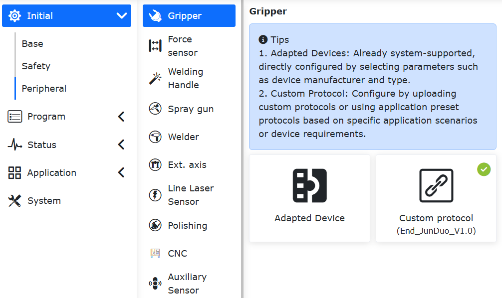

.. centered:: 图表 8.1‑2 夹爪控制类型

**Step3**：进入外设->夹爪/力传感器/焊接手柄的内容界面，点击“自定义协议”卡片进入界面，上传Lua末端开放协议，选择需要上传的Lua末端开放协议，进行上传操作。

.. important:: 
  上传文件名需要以AXLE_LUA_开头命名。

**Step4**：配置末端通讯参数，通讯参数包含波特率、数据位、停止位等，配置完成后，点击“配置”按钮。

.. figure:: robot_peripherals/003.png
   :align: center
   :width: 4in

.. centered:: 图表 8.1‑3 配置末端通讯参数

末端通讯详细参数如下：

- **波特率**：支持1-9600，2-14400，3-19200，4-38400，5-56000，6-67600，7-115200，8-128000；末端Rs485驱动芯片为低速485，波特率不能>200k；
- **数据位**：数据位支持（8,9），目前常用为8；
- **停止位**：1-1，2-0.5，3-2，4-1.5，目前常用为1；
- **校验位**：0-None，1-Odd，2-Even,目前常用为0；
- **超时时间**：1~1000ms，此值需要结合外设搭配设置合理的时间参数；
- **超时次数**：1~10，主要进行超时重发，减少偶发异常提高用户体验；
- **周期性指令时间间隔**：1~1000ms，主要用于周期性指令每次下发的时间间隔；

**Step5**：末端Lua启用，点击“开启”按钮。

.. figure:: robot_peripherals/004.png
   :align: center
   :width: 4in

.. centered:: 图表 8.1‑4 末端Lua启用

当Lua文件发生异常时，提示“末端Lua文件异常”警告，可进行“不恢复/恢复”处理。关闭Lua启用按钮，警告提示关闭。

.. centered:: 图表 8.1‑5 Lua文件异常

当设备类型为夹爪时，可以进行状态监控。

**打开“状态监控”**：右侧夹爪状态栏展示实时显示夹爪运行速度、力矩、位置等状态信息。

**关闭“状态监控”**：右侧夹爪数据状态栏关闭。

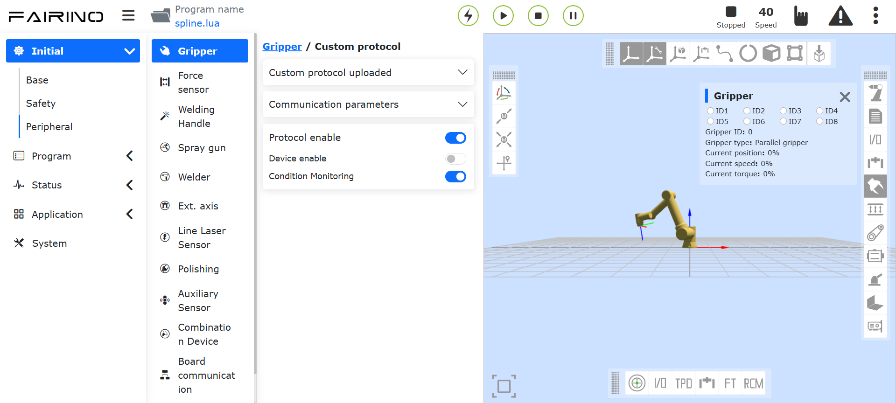

.. centered:: 图表 8.1‑6 状态监控

夹爪
-------------------

在“初始设置”->“外设”->“夹爪”界面中，当前可以通过已适配设备和末端Lua自定义开放协议使用夹爪。

已适配设备
~~~~~~~~~~~~~~~~~~~

**Step1**：点击“已适配设备”进入末端外设配置界面。夹爪的配置信息分为夹爪厂商、夹爪类型、软件版本和挂载位置，用户可根据具体的生产需求来配置相应的夹爪信息。若用户需要更改配置，可先选择相应的夹爪编号，点击“清除”按钮，来清除相应的按钮，并重新根据需求配置；

.. figure:: robot_peripherals/007.png
   :align: center
   :width: 4in

.. centered:: 图表 8.2‑1 夹爪配置

.. important:: 
	点击清除配置前，相应的夹爪应处于未激活状态。

**Step2**：夹爪配置完成后，用户可在页面下方的夹爪信息表中查看相应的夹爪信息，若发现配置错误，可点击“清除”按钮，重新配置夹爪；

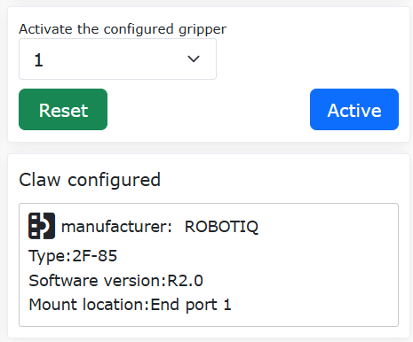

.. centered:: 图表 8.2‑2 夹爪配置信息

**Step3**：选择配置完成的夹爪，点击“复位”按钮，页面弹出命令发送成功后，再点击“激活”按钮，可查看夹爪信息表中的激活状态，来判断是否激活成功；

.. important::
	激活夹爪时，夹爪不可有夹持物。

**Step4**：程序示教命令界面中选择“Gripper”命令。在夹爪命令界面中，用户可以选择想要控制的夹爪编号（已经完成配置并且被激活的夹爪），设置相应的开闭状态、开闭速度、开闭力矩已经等待夹爪动作的最大时间。完成设置后点击添加应用即可。此外还可以添加夹爪激活和复位指令，以便于在运行程序时去激活/复位夹爪。

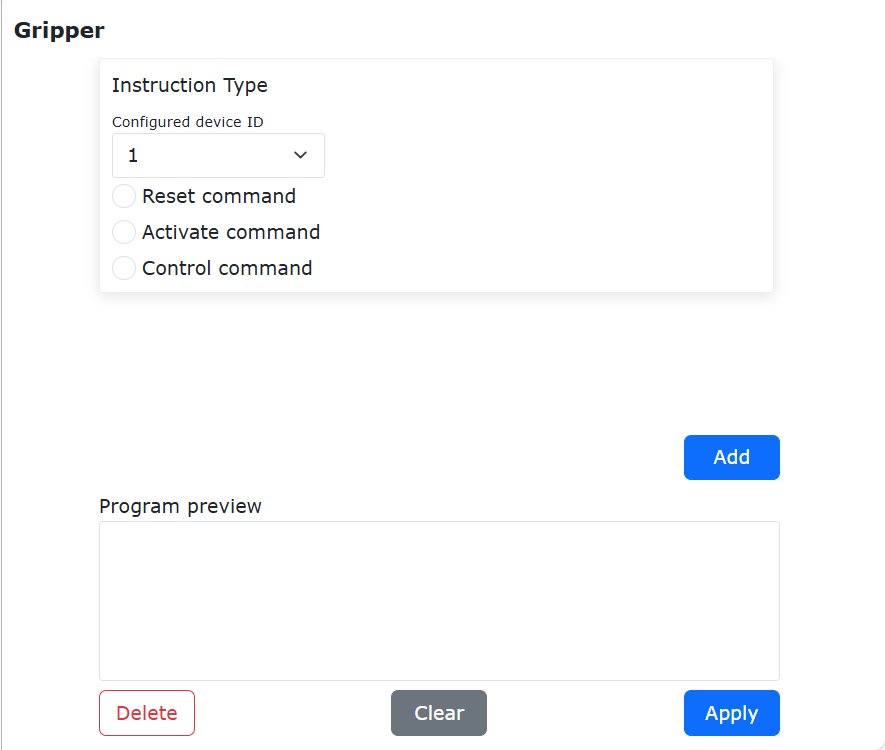

.. centered:: 图表 8.2‑3 夹爪指令编辑

夹爪程序示教
+++++++++++++++++

.. list-table:: 
   :widths: 15 40 100
   :header-rows: 1

   * - 序号
     - 指令格式
     - 注释
   * - 1
     - PTP(template2,100,-1,0)
     - #等待夹取点
   * - 2
     - PTP(template1,100,-1,0)
     - #夹取点
   * - 3
     - MoveGripper(1,255,255,0,1000,0)
     - #夹爪闭合
   * - 4
     - PTP(template2,100,-1,0)
     - /
   * - 5
     - PTP(template3,100,-1,0)
     - #等待放件点
   * - 6
     - PTP(template3,100,-1,0)
     - #放件点
   * - 7
     - MoveGripper(1,0,255,0,1000,0)
     - #夹爪开启

夹爪Lua末端协议配置
~~~~~~~~~~~~~~~~~~~~~~~~~~~~~~~~~~~~~~~~~~~~~~~~~~~~~~~~~~~~~~~~~~
打开WebApp，依次点击“初始设置”、“外设”、“夹爪”、“自定义协议”。点击“协议管理”，则可以进行末端协议的配置。

用户上传的文件名需要以“AXLE_LUA_End”开头命名，上传后列表中的协议名称会变为以“Custom_End”开头，该类协议可以下载和删除，用户上传的重名的文件会自动覆盖为最新Lua。

.. figure:: robot_peripherals/277.png
   :align: center
   :width: 4in

.. centered:: 图表 8.2‑4-1 夹爪自定义协议上传

机器人预设内嵌的协议以End_作为前缀，仅可下载，无法删除，其中夹爪（旋转夹爪、吸盘）的外设的内嵌协议如下图所示。

.. figure:: robot_peripherals/278.png
   :align: center
   :width: 4in

.. centered:: 图表 8.2‑4-2 夹爪（旋转夹爪、吸盘）预设内嵌协议

在确保选择协议正确的情况下，可去使能机器人，并应用开放协议，应用后机器人会自动进入boot模式，并将选择的协议应用到末端，当页面提示“升级成功，请重启控制箱”后，可重新上电控制箱。

.. figure:: robot_peripherals/279.png
   :align: center
   :width: 6in

.. centered:: 图表 8.2‑4-3 末端开放协议应用到末端板

重启进入WebApp页面后，页面会显示当前应用的协议名称，点击末端协议启用和设备启用后，则末端协议开始运行，其中设备ID为末端外设的Modbus从站地址，需要和协议中的内容配合使用。

.. figure:: robot_peripherals/280.png
   :align: center
   :width: 4in

.. centered:: 图表 8.2‑4-4 夹爪末端协议配置显示及启用

末端板会对上传的Lua协议进行校验，当Lua文件存在异常时，提示“末端Lua文件异常”警告，可进行“不恢复/恢复”处理。关闭Lua启用按钮，警告提示关闭。

.. centered:: 图表 8.2‑4-5 夹爪末端协议配置显示及启用

夹爪外设的Lua末端外设协议示例
++++++++++++++++++++++++++++++++++++++++++++++++++++++++++++++++++++++++++++++++

.. code-block:: console
  
  function Getbit(X,Bit)--Getbit(),提取字节对应Bit函数，参数：X：被提取bit的字节；Bit：需要提取第几位，可选范围为0-7
  return ((X&(1<<Bit))>>Bit)
  end

  function GetOneByte(U32)--GetOneByte(),提取数据0x1234,获取其低字节，返回值为0x34
  return ((U32>>0)&0xFF)
  end

  function GetTwoByte(U32)--GetTwoByte(),提取数据0x1234,获取其高字节，返回值为0x12
  return ((U32>>8)&0xFF)
  end
  function GetThreeByte(U32)--GetThreeByte(),提取数据0x56781234,提取后其返回值为0x78
  return ((U32>>16)&0xFF)
  end
  function GetFourByte(U32)--GetFourByte(),提取数据0x56781234,提取后其返回值为0x56
  return ((U32>>24)&0xFF)
  end
  X,Speed,Torque=0,0,0
  while(1)
  do
  IwdgTaskHandle()
  MainLoop()
  UpDownLoadHandle()
  SdoRwPara()
  EndErrClear()
  local BFlag=LuaBreak()
  if(BFlag==1)then
  break
  end--此处到文件末尾LuaGc(),end为固定用法

  T1={0x01,0x06,0x03,0xE8,0x00,0x09,0xC9,0xBC}--填充夹爪指令(Modbus RTU指令)，T1-T5依次为夹爪动作执行指令，夹爪初始化指令，夹爪下发位置指令，夹爪下发速度指令，夹爪下发力矩指令
  --/指令解析：T1[1]=0X01,为夹爪地址；T1[2]=0x06,写单个保持寄存器功能码；T1[3],T1[4]：0x03,0xE8,动作执行指令需要操作的寄存器的地址；T1[5],T1[6]：0x00,0x09,写入寄存器的数据；T1[7],T1[8]：0xC9,0xBC，CRC校验码，需要根据夹爪用户手册进行修改
  T2={}
  T3={}
  T4={}
  T5={}

  T7={0x01,0x03,0x07,0xD0,0x00,0x01,0x84,0x87}--T7-T12，夹爪状态读取指令，依次为读取夹爪状态指令,读取夹爪初始化指令,读取夹爪故障码指令,读取夹爪位置指令,读取夹爪速度指令,读取夹爪力矩指令
  T8={}
  T9={}
  T10={}
  T11={}
  T12={}
  Rcmd1,Rcmd2,Rcmd3,Rcmd4=GetGripCmd()--固定用法，不需要进行修改，Rcm2为控制器下发的夹爪地址，Rcmd4为控制器下发的数据
  if(Rcmd1==1) then
  T1[1]=Rcmd2                   
  T2[1]=Rcmd2
  T3[1]=Rcmd2
  T4[1]=Rcmd2
  T5[1]=Rcmd2

  T7[1]=Rcmd2
  T8[1]=Rcmd2
  T9[1]=Rcmd2
  T10[1]=Rcmd2
  T11[1]=Rcmd2
  T12[1]=Rcmd2                    --**夹爪地址更新
  if (Rcmd3==1) then              --夹爪动作执行指令
  T1[7],T1[8]=CrcValue(T1[1],T1[2],T1[3],T1[4],T1[5],T1[6])--计算Modbus RTU指令CRC值，两字节
  EndTxGripData(T1[1],T1[2],T1[3],T1[4],T1[5],T1[6],T1[7],T1[8])--末端发送指令给夹爪
  DelayMs(10)                                                   --延时10ms
  A,Rxd1,Rxd2,Rxd3,Rxd4,Rxd5,Rxd6,Rxd7=EndRxGripData()--末端将接收到的夹爪的反馈数据返回到Lua中，具体反馈内容需要查阅夹爪用户手册
  GripStateBack(Rxd3)
  end
  if (Rcmd3==2) then
  T2[7],T2[8]=CrcValue(T2[1],T2[2],T2[3],T2[4],T2[5],T2[6])
  EndTxGripData(T2[1],T2[2],T2[3],T2[4],T2[5],T2[6],T2[7],T2[8])
  DelayMs(10)
  A,Rxd1,Rxd2,Rxd3,Rxd4,Rxd5,Rxd6,Rxd7=EndRxGripData()
  GripStateBack(Rxd3)
  end
  if(Rcmd3==3) then
  X=Rcmd4
  T3[5]=0x00
  T3[6]=X
  T3[7],T3[8]=CrcValue(T3[1],T3[2],T3[3],T3[4],T3[5],T3[6])
  EndTxGripData(T3[1],T3[2],T3[3],T3[4],T3[5],T3[6],T3[7],T3[8])
  DelayMs(10)
  A,Rxd1,Rxd2,Rxd3,Rxd4,Rxd5,Rxd6,Rxd7=EndRxGripData()
  GripStateBack(Rxd3)
  end
  if (Rcmd3==4) then
  Speed=Rcmd4
  T4[5]=Torque
  T4[6]=Speed
  T4[7],T4[8]=CrcValue(T4[1],T4[2],T4[3],T4[4],T4[5],T4[6])
  EndTxGripData(T4[1],T4[2],T4[3],T4[4],T4[5],T4[6],T4[7],T4[8])
  DelayMs(10)
  A,Rxd1,Rxd2,Rxd3,Rxd4,Rxd5,Rxd6,Rxd7=EndRxGripData()
  GripStateBack(Rxd3)
  end
  if(Rcmd3==5) then
  Torque=Rcmd4
  T5[5]=Torque
  T5[6]=Speed
  T5[7],T5[8]=CrcValue(T5[1],T5[2],T5[3],T5[4],T5[5],T5[6])
  EndTxGripData(T5[1],T5[2],T5[3],T5[4],T5[5],T5[6],T5[7],T5[8])
  DelayMs(10)
  A,Rxd1,Rxd2,Rxd3,Rxd4,Rxd5,Rxd6,Rxd7=EndRxGripData()
  GripStateBack(Rxd3)
  end
  if(Rcmd3 == 7) then
  T7[7],T7[8]=CrcValue(T7[1],T7[2],T7[3],T7[4],T7[5],T7[6])
  EndTxGripData(T7[1],T7[2],T7[3],T7[4],T7[5],T7[6],T7[7],T7[8])
  DelayMs(10)
  A,Rxd1,Rxd2,Rxd3,Rxd4,Rxd5,Rxd6,Rxd7=EndRxGripData()
  RxdCrcH,RxdCrcL = CrcValue(Rxd1,Rxd2,Rxd3,Rxd4,Rxd5)
  if((A==8)and(Rxd1==Rcmd2)and(Rxd2==0x03)and(Rxd3==0x02)and(Rxd6==RxdCrcH)and(Rxd7==RxdCrcL))then
  GripStateBack(Rxd4)
  end
  end
  if(Rcmd3==8) then
  T8[7],T8[8]=CrcValue(T8[1],T8[2],T8[3],T8[4],T8[5],T8[6])
  EndTxGripData(T8[1],T8[2],T8[3],T8[4],T8[5],T8[6],T8[7],T8[8])
  DelayMs(10)
  A,Rxd1,Rxd2,Rxd3,Rxd4,Rxd5,Rxd6,Rxd7=EndRxGripData()
  RxdCrcH,RxdCrcL = CrcValue(Rxd1,Rxd2,Rxd3,Rxd4,Rxd5)
  if((A==8)and(Rxd1==Rcmd2)and(Rxd2==0x03)and(Rxd3==0x02)and(Rxd6==RxdCrcH)and(Rxd7 ==RxdCrcL)) then
  GripStateBack(Rxd5)
  end
  end
  if(Rcmd3 == 9) then
  T9[7],T9[8]=CrcValue(T9[1],T9[2],T9[3],T9[4],T9[5],T9[6])
  EndTxGripData(T9[1],T9[2],T9[3],T9[4],T9[5],T9[6],T9[7],T9[8])
  DelayMs(10)
  A,Rxd1,Rxd2,Rxd3,Rxd4,Rxd5,Rxd6,Rxd7=EndRxGripData()
  RxdCrcH,RxdCrcL = CrcValue(Rxd1,Rxd2,Rxd3,Rxd4,Rxd5)
  if((A==8)and(Rxd1==Rcmd2)and(Rxd2==0x03)and(Rxd3==0x02)and(Rxd6==RxdCrcH)and(Rxd7==RxdCrcL)) then
  GripStateBack(Rxd5)
  end
  end
  if(Rcmd3 == 10) then
  T10[7],T10[8]=CrcValue(T10[1],T10[2],T10[3],T10[4],T10[5],T10[6])
  EndTxGripData(T10[1],T10[2],T10[3],T10[4],T10[5],T10[6],T10[7],T10[8])
  DelayMs(10)
  A,Rxd1,Rxd2,Rxd3,Rxd4,Rxd5,Rxd6,Rxd7=EndRxGripData()
  RxdCrcH,RxdCrcL = CrcValue(Rxd1,Rxd2,Rxd3,Rxd4,Rxd5)
  if((A==8)and(Rxd1==Rcmd2)and(Rxd2==0x03)and(Rxd3==0x02)and(Rxd6==RxdCrcH)and(Rxd7==RxdCrcL)) then
  GripStateBack(Rxd4)
  end
  end
  if(Rcmd3 == 11) then
  T11[7],T11[8]=CrcValue(T11[1],T11[2],T11[3],T11[4],T11[5],T11[6])
  EndTxGripData(T11[1],T11[2],T11[3],T11[4],T11[5],T11[6],T11[7],T11[8])
  DelayMs(10)
  A,Rxd1,Rxd2,Rxd3,Rxd4,Rxd5,Rxd6,Rxd7=EndRxGripData()
  RxdCrcH,RxdCrcL = CrcValue(Rxd1,Rxd2,Rxd3,Rxd4,Rxd5)
  if((A==8)and(Rxd1==Rcmd2)and(Rxd2==0x03)and(Rxd3==0x02)and(Rxd6==RxdCrcH)and(Rxd7==RxdCrcL)) then
  GripStateBack(Rxd5)
  end
  end
  if(Rcmd3 == 12) then
  T12[7],T12[8]=CrcValue(T12[1],T12[2],T12[3],T12[4],T12[5],T12[6])
  EndTxGripData(T12[1],T12[2],T12[3],T12[4],T12[5],T12[6],T12[7],T12[8])
  DelayMs(10)
  A,Rxd1,Rxd2,Rxd3,Rxd4,Rxd5,Rxd6,Rxd7=EndRxGripData()
  RxdCrcH,RxdCrcL = CrcValue(Rxd1,Rxd2,Rxd3,Rxd4,Rxd5)
  if((A==8)and(Rxd1==Rcmd2)and(Rxd2==0x03)and(Rxd3==0x02)and(Rxd6==RxdCrcH)and(Rxd7==RxdCrcL)) then
  GripStateBack(Rxd4)
  end
  end
  end
  LuaGc()
  end

设备启用
+++++++++++++++++++++++++++++

**Step1**：启用夹爪->选择夹爪ID->勾选夹爪适配的功能码->点击配置，已配置设备中显示夹爪的ID及功能码。

.. figure:: robot_peripherals/010.png
   :align: center
   :width: 4in

.. centered:: 图表 8.2‑4 配置夹爪

.. note:: 
  由于末端开放功能目前对夹爪设备地址支持范围为1~8，使用前应通过夹爪厂商的上位机调整夹爪设备地址。

  勾选功能码应通过夹爪厂商提供的产品说明书查询夹爪适配的功能，且应与末端Lua功能码保持对应，具体请查询《末端Lua适配夹爪说明手册》。

**Step2**：选择夹爪ID->复位->激活，夹爪进行一次初始化，具体初始化情况请参考夹爪厂商提供的产品说明书。

.. figure:: robot_peripherals/011.png
   :align: center
   :width: 4in

.. centered:: 图表 8.2‑5 激活夹爪

**Step3**：进入示教程序->程序编程->添加夹爪运动指令。

.. figure:: robot_peripherals/012.png
   :align: center
   :width: 6in

.. centered:: 图表 8.2‑6 添加夹爪运动指令

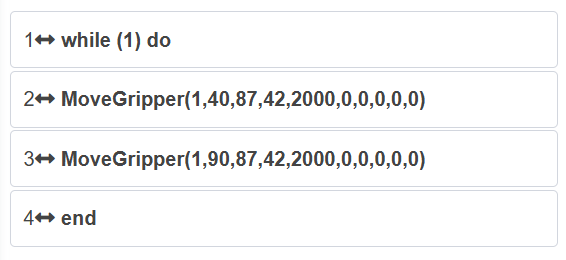

.. centered:: 图表 8.2‑7 夹爪运动指令示例

多个夹爪
+++++++++++

激活和运动控制参考夹爪步骤。 

.. figure:: robot_peripherals/014.png
   :align: center
   :width: 4in

.. centered:: 图表 8.2‑8 配置多个夹爪

.. note:: 由于末端开放功能目前对夹爪设备地址支持范围为1~8，使用前应通过夹爪厂商的上位机调整夹爪设备地址。

旋转夹爪
+++++++++++

**Step1**：启用夹爪->选择夹爪ID->勾选夹爪适配的功能码->点击配置，已配置设备中显示夹爪的ID及功能码。

.. figure:: robot_peripherals/010.png
   :align: center
   :width: 4in

.. centered:: 图表 8.2‑9 配置夹爪及功能码

.. note:: 勾选功能码应通过夹爪厂商提供的产品说明书查询夹爪适配的功能，且应与末端Lua功能码保持对应，具体请查询《FR05-末端全外设协议-V2.5-20241101.xlsx》。

**Step2**：选择夹爪ID->复位->激活，夹爪进行一次初始化，具体初始化情况请参考夹爪厂商提供的产品说明书。

.. figure:: robot_peripherals/011.png
   :align: center
   :width: 4in

.. centered:: 图表 8.2‑10 激活夹爪

**Step3**：进入示教程序->程序编程->添加夹爪运动指令。

.. figure:: robot_peripherals/012.png
   :align: center
   :width: 6in

.. centered:: 图表 8.2‑11 添加旋转夹爪运动指令

.. figure:: robot_peripherals/015.png
   :align: center
   :width: 6in

.. centered:: 图表 8.2‑12 旋转夹爪运动指令示例

.. note:: 旋转圈数为绝对旋转圈数，正转圈数最大为90圈，反转圈数最大为90圈，旋转后需要进行复位处理。

力传感器
-------------------------

在“初始设置”->“外设”->“力传感器”界面中，当前可以通过已适配设备和末端Lua自定义开放协议使用力传感器。

已适配设备
~~~~~~~~~~~~~~~~~~~~~~~~~~~

**Step1**：点击“已适配设备”进入末端外设配置界面。

力传感器配置信息分为厂商、类型、软件版本和挂载位置，用户可根据具体的生产需求来配置相应的力传感器信息。若用户需要更改配置，可先选择相应的编号，点击“清除”按钮，来清除相应的信息，并重新根据需求配置；

.. figure:: robot_peripherals/016.png
   :align: center
   :width: 4in

.. centered:: 图表 8.3‑1 力传感器配置

.. important:: 
	点击清除配置前，相应的传感器应处于未激活状态。

**Step2**：力传感器配置完成后，用户可在页面下方的信息表中查看相应的力传感器信息，若发现配置错误，可点击“清除”按钮，重新配置。

.. figure:: robot_peripherals/017.png
   :align: center
   :width: 4in

.. centered:: 图表 8.3‑2 力传感器配置信息

**Step3**：选择配置完成的力传感器编号，点击“复位”按钮，页面弹出命令发送成功后，再点击“激活”按钮，可查看力传感器信息表中的激活状态，来判断是否激活成功；此外，力传感器会有初始值，用户根据使用需求选择“零点矫正”和“去除零点”。力传感器零点矫正需要确保力传感器水平垂直向下，且机器人未配置负载。

**Step4**：力传感器配置完成后，需要配置传感器类型工具坐标系，可根据传感器与末端工具中心的距离直接输入传感器工具坐标系值并应用。

力传感器末端Lua协议
~~~~~~~~~~~~~~~~~~~~~~~~~~~~~~~~~~~~~~~~~~~~~~~~~~~~~~~~~~~~~

打开WebApp，依次点击“初始设置”、“外设”、“力传感器”、“自定义协议”。点击“协议管理”，则可以进行末端协议的配置。目前力传感器预设内嵌的协议如下图所示。3.9.2版本新增内嵌End_JD_XJC_V1.0.lua、End_JD_GZCX_V1.0.lua两个夹爪+力传感器的组合协议。

.. figure:: robot_peripherals/281.png
   :align: center
   :width: 6in

.. centered:: 图表 8.3‑2-2 力传感器预设内嵌协议

焊接手柄末端Lua协议
~~~~~~~~~~~~~~~~~~~~~~~~~~~~~~~~~~~~~~~~~~~~~~~~~~~~~~~~~~~~~

打开WebApp，依次点击“初始设置”、“外设”、“焊接手柄”、“自定义协议”。点击“协议管理”，则可以进行末端协议的配置。目前焊接手柄预设内嵌的协议如下图所示。3.9.2版本新增内嵌End_SM_JD_V1.3.lua、End_SM_GZCX_V1.3.lua、End_SM_XJC_V1.3.lua三个SmartTool+夹爪或力传感器的组合协议。

.. figure:: robot_peripherals/283.png
   :align: center
   :width: 6in

.. centered:: 图表 8.3‑2-3 焊接手柄预设内嵌协议

末端lua协议自动生成
+++++++++++++++++++++++++++++++++++++++++++++++++++++++++++++++++

本次新增功能，可对内嵌SmartTool焊接手柄外设相关的协议（目前仅支持End_SmartTool_V1.3.lua、End_SM_JD_V1.3.lua、End_SM_GZCX_V1.3.lua、End_SM_XJC_V1.3.lua四种协议可配置自动生成），通过Web页面配置后自动生成末端lua协议并上传应用到末端，无需用户撰写。用户按照需求对SmartTool焊接手柄的A、B、C、D、E、IO键进行配置，配置完成后需要去使能机器人，并点击“应用”， 此时页面会提示“是否进入boot并应用开放协议”，点击确认后机器人进入boot状态并自动上传自动生成的末端lua协议，重启机器人后则可以按照配置的按键进行SmartTool的使用。

.. figure:: robot_peripherals/284.png
   :align: center
   :width: 6in

.. centered:: 图表 8.3‑2-4 SmartTool焊接手柄配置协议自动生成

.. figure:: robot_peripherals/285.png
   :align: center
   :width: 4in

.. centered:: 图表 8.3‑2-5 页面提示“是否进入boot并应用开放协议”

SmartTool程序生成模板程序导入
++++++++++++++++++++++++++++++++++++++++++++++++++++++++++++++++++++++

如果SmartTool按键配置了程序生成的功能，则基于开放协议可提供两种生成的程序，默认生成空白的lua程序，或者用户可以选择上传template_开头的模板作为新建程序的模板，当新建程序选择模板程序时，SmartTool触发“新建程序”生成的lua文件包含上传的模板文件内容，后续添加的指令均在模板内容之后新增添加。

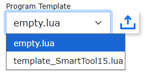

.. centered:: 图表 8.3‑2-6 SmartTool程序生成模板程序导入

SmartTool运动指令点配置
++++++++++++++++++++++++++++++++++++++++++++++++++++++++++++++++++++++

SmartTool在配置“PTP”“LIN”“ARC”三条指令时，可选择生成指令点的存储数据库为“全局示教点”还是“局部示教点”。当选择“全局示教点”时，生成的指令点可通过“示教程序”、“示教点”查看；当选择为“局部示教点”时，生成的指令点可通过“示教程序”、“程序编程”、“局部示教点”查看。

.. figure:: robot_peripherals/287.png
   :align: center
   :width: 4in

.. centered:: 图表 8.3‑2-7 SmartTool运动指令点“全局示教点”、“局部示教点”配置

SmartTool防误触模式
++++++++++++++++++++++++++++++++++++++++++++++++++++++++++++++++++++++

基于开放协议的SmartTool新增了防误触模式，依次点击“初始设置”、“外设”、“焊接手柄”、“自定义协议”。在启用末端协议后，可看到“防误触模式”的开关，当启用该功能时，SmartTool的“撤销程序”、“清空程序”两个按键功能需要按两次才能触发。

.. figure:: robot_peripherals/288.png
   :align: center
   :width: 6in

.. centered:: 图表 8.3‑2-8 SmartTool“防误触模式”功能

焊接手柄的Lua末端外设协议示例
+++++++++++++++++++++++++++++++++++++++++++++++++++++++++++++++++++++++++++++

A、B、C、D、E、IO键六个按键功能可通过代码中的31行的key值进行修改定义，其中K38=Getbit(R[7],1)，K0=Getbit(R[7],2)为“清空程序”和“撤销按键”，不可修改，后续5个K值可按照《末端全外设协议》文档中的定义进行修改。本次示例（内嵌SmartTool协议）中对应的按键功能为，A:LIN、B:PTP、C:创建程序、D:焊接中断恢复、E:焊接中断退出、IO：LIN+焊接+摆动。

.. centered:: 焊接手柄的Lua末端外设协议示例（SmartTool）
  
.. code-block:: 
   :linenos:

   function Getbit(X,Bit)
   return ((X&(1<<Bit))>>Bit)
   end

   if(Getbit(GetRobotState(),0)==1)then
   local SetParams={B6=3}-- B6-操作DO端口号为DO3
   SetWeldParams(SetParams)
   while(1)
   do
   IwdgTaskHandle()
   MainLoop()
   UpDownLoadHandle()
   SdoRwPara()
   EndErrClear()
   local BFlag=LuaBreak()
   if(BFlag==1)then
   break
   end
   local R={0}
   local T={0x7D,0x01,0x30,0xC0,0x00,0x04,0x00,0x00,0x00,0x00}
   DelayMs(100)
   T[7],T[8],T[9],T[10]=GetIoCmd()
   Dword=GetRobotState()
   T[7]=Getbit(Dword,4)
   T[12],T[11]=WeldToolCrcValue(T)
   T[13]=0x0E
   WeldToolSlaveSetCmd(T)
   DelayMs(3)
   Len=EndRxWeldData(R)
   if((Len==13)and(R[1]==0x7D)and(R[2]==0x01)and(R[3]==0x30))then
   local key={K38=Getbit(R[7],1),K0=Getbit(R[7],2),K3=Getbit(R[7],3),K25=Getbit(R[7],4),K39=Getbit(R[7],5),K27=Getbit(R[7],6),K28=Getbit(R[7],7), K44=Getbit(R[8],0),
   K6=Getbit(R[8],1),K7=Getbit(R[8],2)}--smarttool焊接手柄按键设置，撤销按键-K38撤销程序；清空按键-K0清空程序；A按键-K3 LIN；B按键-K25 PTP；C按键-K39 创建程序；D按键-K27焊接中断恢复；E按键-K28焊接中断退出；IO键-K44 LIN+焊接+摆动手/自动按键-K6手/自动；运行/暂停按键-K7运行/暂停
   SetWeldToolKeys(key)
   end
   LuaGc()
   end
   end

传感器负载辨识
~~~~~~~~~~~~~~~~~~~~~~~~

在“初始设置”->“基础”->“负载”菜单栏下，点击“传感器辨识”，进入传感器负载辨识界面。

特定姿态辨识：清除末端负载数据，配置好力传感器后，建立传感器坐标系，将机器人末端姿态调整为垂直向下，进行“零点矫正”后安装末端负载。首先选择对应传感器工具坐标系，调整机器人，使得传感器及工具垂直向下，记录数据，计算质量。接着，调整机器人3个不同姿态，分别记录三组数据，计算出质心，确认无误后点击应用。

**动态辨识**：清除末端负载数据，配置好力传感器后，建立传感器坐标系，将机器人末端姿态调整为垂直向下，进行“零点矫正”后安装末端负载。点击“辨识开启”，拖动机器人进行运动，接着点击“辨识关闭”，即可自动将负载结果应用到机器人中。

**自动校零**：传感器记录初始位置后，可自动校零。

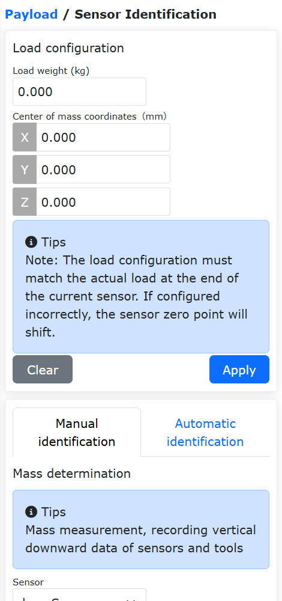

.. centered:: 图表 8.3‑3 传感器负载辨识

力传感器辅助拖动
~~~~~~~~~~~~~~~~~~~~~~~

配置好传感器后，可以搭配传感器对拖动机器人进行更好的辅助。第一次使用时可以按照右侧图片的数据进行配置，应用完成后，此时无需进入拖动模式，直接对末端力传感器进行拖拽，即可控制机器人在固定姿态进行移动。（如下图中的数据为参考标准）

.. figure:: robot_peripherals/019.png
   :align: center
   :width: 4in

.. centered:: 图表 8.3‑4 力/扭矩传感器拖动锁定

.. note:: 
   奇异点策略是力传感器辅助锁定下开发的奇异点穿越及规避功能。

   奇异点规避策略是默认功能选项，开启辅助拖动后即默认开启规避功能，奇异点规避是当机器人处于奇异构型时，施加虚拟力使机器人远离奇异构型的功能。

   奇异构型：

   **肘奇异**：旋转轴2、3、4处于同一平面内，此时肘关节处于完全伸展或完全收缩，由于FR机器人机械限位，完全收缩这种形位机器人无法到达。

   **腕奇异**：旋转轴4、6平行，此时由于FR机器人机械限位，这种形位机器人无法到达。

   **肩奇异**：腕中心点位于旋转轴1、2所构成的平面。

   奇异点穿越功能，选择“奇异点策略”为“穿越”并应用，当机器人检测到当前位姿处于奇异构型，自动切换为电流环拖动模式，当检测退出奇异构型，拖动模式切换为力传感器辅助拖动继续运动。

**自适应选择**：在需要装配时开启，开启后拖动变重；

**惯性参数**：调节拖动过程中的手感，需在技术人员指导下谨慎操作。

**阻尼参数**：

-  平动方向：建议设置参数在[100-200]之间；

-  转动方向：建议设置参数在[3-10]之间，其中RZ方向设置范围在[0.1-5]；

-  效果：借助传感器拖动时，增大阻尼会导致拖动困难，减小阻尼会导致拖动机器人过于轻松（建议不要太小）；

-  阻尼参数整体范围：平动XYZ：[100-1000]；转动RX、RY：[3-50],RZ:[2-10]；

-  最大拖动力为50，最大拖动速度为180。

**刚度参数**：均设为0；

**拖动力阈值**：平动XYZ为[5-10]；转动RX、RY、RZ为[0.5-5]；

.. important:: 
   通过加大平动方向XYZ或转动方向RX、RY、RZ的力阈值来实现锁定的方式。

力/扭矩传感器碰撞检测
~~~~~~~~~~~~~~~~~~~~~~~~~

指令说明：“FT_Guard”指令为碰撞检测指令。选择对应的传感器坐标系，勾选生效的力矩方向检测，设置当前值，碰撞最大阈值和碰撞最小阈值三项，碰撞检测条件正常范围为（当前值-最小阈值，当前值+最大阈值），将“开启”和“关闭”指令加入到程序中在。

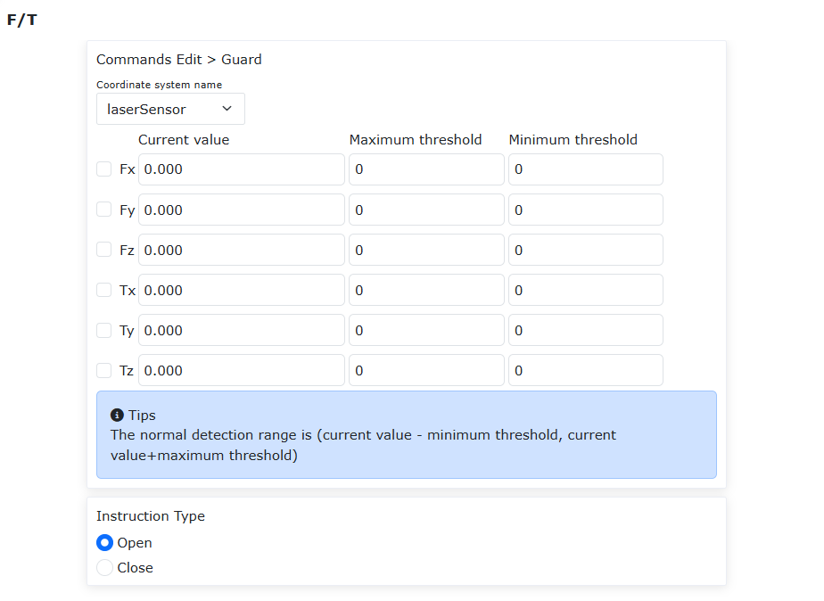

.. centered:: 图表 8.3‑5 FT_Guard指令编辑

程序示例：

.. list-table::
   :widths: 50 80 80
   :header-rows: 0
   :align: center

   * - **序号**
     - **指令格式**
     - **注释**

   * - 1
     - FT_Guard(1,1,1,1,1,0,0,0,5,0,0,0,0,0,10,0,0,0,0,0,5,0,0,0,0,0)
     - #力/矩碰撞检测开启

   * - 2
     - PTP(template1,100,-1,0)
     - #运动指令

   * - 3
     - FT_Guard(0,1,1,1,1,0,0,0,5,0,0,0,0,0,10,0,0,0,0,0,5,0,0,0,0,0)
     - #力/矩碰撞检测关闭

力/扭矩传感器力控运动
~~~~~~~~~~~~~~~~~~~~~~~~

指令说明：“FT_Control”指令为力控运动指令，可以使机器人在设定力的附近运动，常用于打磨场景中。选择对应的传感器坐标系，勾选生效的力矩方向检测，设置检测阈值，以及各个方向上PID比例系数(一般设置p为0.001)，设置最大调整距离（对应X,Y,Z）和最大调整角度（对应RX,RY,RZ），将“开启”和“关闭”指令加入到程序中在。

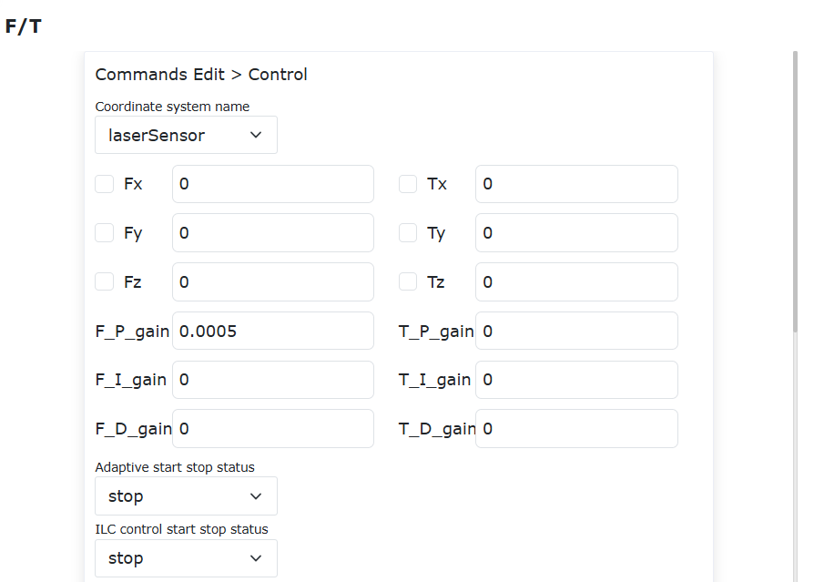
  
.. figure:: robot_peripherals/022.png
   :align: center
   :width: 6in

.. centered:: 图表 8.3‑6 FT_Control指令编辑

程序示例：

.. list-table::
   :widths: 50 80 80
   :header-rows: 0
   :align: center

   * - **序号**
     - **指令格式**
     - **注释**

   * - 1
     - FT_Control(1,11,1,0,1,0,0,0,10,0,5,0,0,0,0.001,0,0,0,0,0,0,0,0,10,5)
     - #力/矩运动控制开启

   * - 2
     - Lin(template3,100,-1,0,0)
     - #运动指令

   * - 3
     - FT_Control(0,11,1,0,1,0,0,0,10,0,5,0,0,0,0.001,0,0,0,0,0,0,0,10,5)
     - #力/矩运动控制关闭

力/扭矩传感器螺旋插入
~~~~~~~~~~~~~~~~~~~~~~~~~~

指令说明：“FT_Spiral”指令为螺旋线探索插入，一般用于圆柱轴的轴孔装配动作。在运行动作之前，需要将机器人末端拖动至孔位的大致位置，根据当前场景，设定指令的参数，添加到程序中，运行后，机器人会以螺旋形的运动进行探索。

.. figure:: robot_peripherals/023.png
   :align: center
   :width: 6in

.. centered:: 图表 8.3‑7 FT_Spiral指令编辑

程序示例：

.. list-table::
   :widths: 50 80 80
   :header-rows: 0
   :align: center

   * - **序号**
     - **指令格式**
     - **注释**

   * - 1
     - FT_Control(1,10,0,0,1,0,0,0,0,0,5,0,0,0,0.0005,0,0,0,0,0,0,10,0)
     - #力/矩运动控制开启

   * - 2
     - FT_SpiralSearch(0,0.7,0,60000,5)
     - #螺旋插入

   * - 3
     - FT_Control(0,10,0,0,1,0,0,0,0,0,5,0,0,0,0.0005,0,0,0,0,0,0,10,0)
     - #力/矩运动控制关闭

力/扭矩传感器旋转插入
~~~~~~~~~~~~~~~~~~~~~~~~~

指令说明：“FT_Rot”指令为旋转探索插入，一般用于承接螺旋线插入动作，用于键轴的轴孔装配。在运行动作之前，需要将机器人末端移动至螺旋线探索找到的孔位或者完全对齐的示教孔位，根据当前场景，设定指令的参数，添加到程序中，运行后，机器人会以缓慢的旋转进行探索。

.. figure:: robot_peripherals/024.png
   :align: center
   :width: 6in

.. centered:: 图表 8.3‑8 FT_Rot指令编辑

程序示例：

.. list-table::
   :widths: 50 80 80
   :header-rows: 0
   :align: center

   * - **序号**
     - **指令格式**
     - **注释**

   * - 1
     - FT_Control(1,10,0,0,1,0,0,0,0,0,5,0,0,0,0.0005,0,0,0,0,0,0,10,0)
     - #力/矩运动控制开启

   * - 2
     - FT_RotInsertion(0,3,0,5,1,0,1)
     - #旋转插入

   * - 3
     - FT_Control(0,10,0,0,1,0,0,0,0,0,5,0,0,0,0.0005,0,0,0,0,0,0,10,0)
     - #力/矩运动控制关闭

力/扭矩传感器直线插入
~~~~~~~~~~~~~~~~~~~~~~~~~

指令说明：“FT_Lin”指令为旋转探索插入，一般用于承接螺旋线插入动作或旋转插入动作，用于键轴的轴孔装配。在运行动作之前，需要将机器人末端移动至螺旋线探索找到的孔位，旋转插入动作结束的位置或者完全对齐的示教孔位，根据当前场景，设定指令的参数，添加到程序中，运行后，机器人会以设定的方向进行直线运动。

.. figure:: robot_peripherals/025.png
   :align: center
   :width: 6in

.. centered:: 图表 8.3‑9 FT_Lin指令编辑

程序示例：

.. list-table::
   :widths: 50 80 80
   :header-rows: 0
   :align: center

   * - **序号**
     - **指令格式**
     - **注释**

   * - 1
     - FT_Control(1,10,0,0,1,0,0,0,0,0,5,0,0,0,0.0005,0,0,0,0,0,0,10,0)
     - #力/矩运动控制开启

   * - 2
     - FT LinInsertion(0,50,1,0,100,1)
     - #直线插入

   * - 3
     - FT_Control(0,10,0,0,1,0,0,0,0,0,5,0,0,0,0.0005,0,0,0,0,0,0,10,0)
     - #力/矩运动控制关闭

力/扭矩传感器表面定位
~~~~~~~~~~~~~~~~~~~~~~~~~~~

指令说明：“FT_FindSurface”指令为表面定位，一般用于寻找物体表面。根据当前场景，设置对应坐标系，移动方向、移动轴、探索直线速度、探索直线加速度、最大探索距离、动作终止力阈值等参数，添加到程序中，运行程序，动作开始执行，机器人末端开始缓慢向表面所在方向移动。

.. figure:: robot_peripherals/026.png
   :align: center
   :width: 6in

.. centered:: 图表 8.3‑10 FT_FindSurface指令编辑

程序示例：

.. list-table::
   :widths: 50 80 80
   :header-rows: 0
   :align: center

   * - **序号**
     - **指令格式**
     - **注释**

   * - 1
     - PTP(1,30,-1,0)
     - #初始位置

   * - 2
     - FT FindSurface(0,1,3,1,0,100,5)
     - #平面定位

力/扭矩传感器中心定位
~~~~~~~~~~~~~~~~~~~~~~~

指令说明：“FT_CalCenter”指令为中心定位，一般用于寻找两表面的中间平面表面。根据当前场景，设置对应坐标系，移动方向、移动轴、探索直线速度、探索直线加速度、最大探索距离、动作终止力阈值等参数，分别寻找A平面和B平面，添加到程序中，运行程序，动作开始执行，机器人缓慢向表面A所在方向移动，定位到A面后，机器人缓慢向表面B所在方向移动，定位到B面后，即可算出中心平面位置。

.. figure:: robot_peripherals/027.png
   :align: center
   :width: 6in

.. centered:: 图表 8.3‑11 FT_CalCenter指令编辑

程序示例：

.. list-table::
   :widths: 20 40 50
   :header-rows: 0
   :align: center

   * - **序号**
     - **指令格式**
     - **注释**

   * - 1
     - PTP(1,30,-1,0)
     - #初始位置

   * - 2
     - FT_CalCenterStart()
     - #表面定位开始

   * - 3
     - FT_Control(1,10,0,0,1,0,0,0,0,0,-10,0,0,0,0.00001,0,0,0,0,0,0,100,0)
     - #力/矩运动控制开启

   * - 4
     - FT_FindSurface(1,2,2,10,0,200,5)
     - #定位平面A

   * - 5
     - FT_Control(0,10,0,0,1,0,0,0,0,0,-10,0,0,0,0.00001,0,0,0,0,0,0,100,0)
     - #力/矩运动控制关闭

   * - 6
     - PTP(1,30,-1,0)
     - #初始位置

   * - 7
     - FT_Control(1,10,0,0,1,0,0,0,0,0,-10,0,0,0,0.00001,0,0,0,0,0,0,100,0)
     - #力/矩运动控制开启
     
   * - 8
     - FT FindSurface(1,1,2,20,0,200,5)
     - #定位平面B

   * - 9
     - FT_Control(0,10,0,0,1,0,0,0,0,0,10,0,0,0,0.00001,0,0,0,0,0,0,100,0)
     - #力/矩运动控制关闭

   * - 10
     - pos={}
     - #定义数组pos

   * - 11
     - pos = FT_CalCenterEnd()
     - #获取定位中心笛卡尔位姿

   * - 12
     - MoveCart(pos,GetActualTCPNum(),GetActualWObjNum(),30,10,100,-1,0)
     - #运动至定位的中心位置

自定义开放协议
~~~~~~~~~~~~~~~~

点击“自定义协议”卡片进入界面，启用力传感器，已配置设备中显示力传感器。点击进入FT界面，查询力传感器数据。

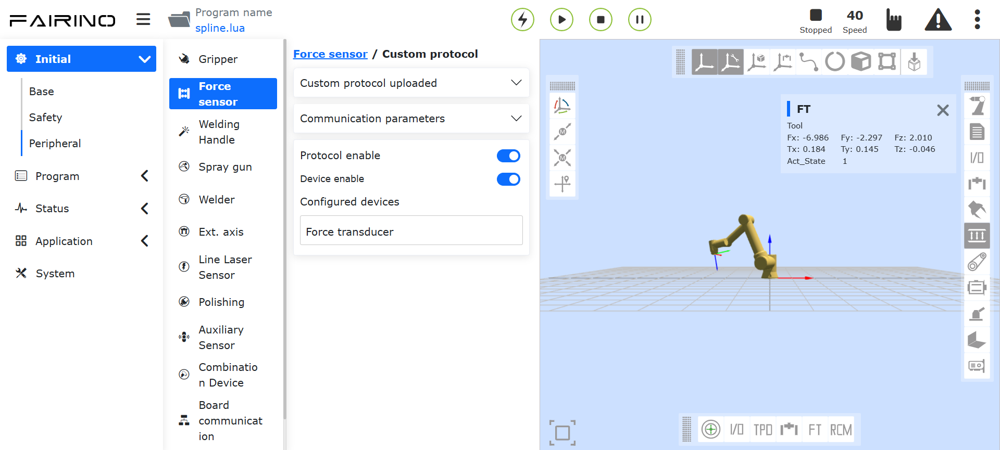

.. centered:: 图表 8.3‑12 启用力传感器

焊接手柄
-------------------------------------------------------------

在“初始设置”->“外设”->“焊接手柄”界面中，当前可以通过已适配设备和末端Lua自定义开放协议使用焊接手柄。

已适配设备
~~~~~~~~~~~~~~~~~~~~~~

配置步骤
++++++++++++

**Step1**：点击“已适配设备”卡片进入已适配设备界面。配置信息分为厂商、类型、软件版本和挂载位置，用户可根据具体的生产需求来配置相应的信息。若用户需要更改配置，可先选择相应的厂商，点击“清除”按钮，来清除相应的信息，并重新根据需求配置；

.. figure:: robot_peripherals/029.png
   :align: center
   :width: 3in

.. centered:: 图表 8.4‑1 焊接手柄已适配设备配置

.. important:: 
	点击清除配置前，相应的设备应处于未激活状态。

**Step2**：依次配置A-E键位和IO键。Smart Tool配置完成后，任务管理器内部维护每个按钮对应的功能，当检测到某按钮被按下时，自动执行该按钮对应功能项。

A-E键位功能：

- 运动指令：选择PTP、LIN、ARC运动指令时，需要输入对应点速度。其中LIN、ARC指令可选择“百分比”或“物理速度”：
- 百分比：输入调试速度百分比，机器人按照最大速度的百分比进行运动，实际机器人运动速度换算为：V = 机器人最大速度×全局速度百分比×点速度百分比。将鼠标移至“点速度”输入框右侧的小眼睛上，将显示当前设置速度下，机器人在手动模式和自动模式下的实际物理速度(单位：mm/s)。

.. image:: coding/469.png
   :width: 6in
   :align: center

.. centered:: 图表 8.4‑2-1 输入百分比显示实际物理速度值
 
- 物理速度：输入速度即为机器人实际运行速度，单位mm/s；输入加速度常设置为速度的2倍。(LIN指令最大物理速度受全局速度百分比限制，若机器人最大运行速度为1000mm/s，全局速度为50%，则LIN指令的最大物理速度为1000 × 50% = 500mm/s)。

.. image:: coding/470.png
   :width: 6in
   :align: center

.. centered:: 图表 8.4‑2-2 输入实际物理速度

配置成功后，示教程序新增一条相关运动指令。配置ARC运动指令时，需先配置PTP/LIN指令。

- DO输出：选择“DO输出”时，显示下拉框可选择输出DO0⁓DO7选项。

.. image:: coding/471.png
   :width: 6in
   :align: center

.. centered:: 图表 8.4‑2-3 Smart Tool配置（A-E键位）

IO键位功能：

-  **IO信号配置**：下拉框可选择DO0⁓DO7选项、CO0⁓CO7选项、End-DO0、End-DO1和扩展IO（Aux-DO0⁓Aux-DO127）；

-  **组合指令**：选择“IO信号”后，特定条件下显示“焊机选择”和“点速度”配置项，生成不同程序指令。

.. important::
   -  当IO信号配置为DO0~DO7或CO0~CO7（未配置"起弧"）时，程序添加SetDO；此时隐藏“焊接选择”和“点速度”。
   -  当IO信号配置为End-DO0、End-DO1时，程序添加SetToolDO；此时隐藏“焊接选择”和“点速度”。
   -  当IO信号配置为扩展IO（未配置"焊机起弧"）时，程序添加SetAuxDO；此时隐藏“焊接选择”和“点速度”。
   -  当IO信号配置为CO0~CO7（配置"起弧"）时，"焊机选择"为"无"时，程序添加SetDO；此时隐藏“焊接选择”和“点速度”。
   -  当IO信号配置项为扩展IO（配置""焊机起弧"）时，"焊机选择"为"无"时，程序添加SetAuxDO；此时隐藏“焊接选择”和“点速度”。
   -  当IO信号配置为CO0~CO7（配置"起弧"）或扩展IO（配置"焊机起弧"）时，"焊机选择"为"焊接"时，首次按下程序添加ARCStart，第二次程序添加ARCEnd，第三次程序添加ArcStart,第四次程序添加ARCStart,交替往复以上操作；此时隐藏“焊接选择”和“点速度”。
   -  当IO信号配置为CO0~CO7（配置"起弧"）或扩展IO（配置"焊机起弧"）时，"焊机选择"为"LIN+焊接"时，首次按下程序添加LIN和ARCStart，第二次程序添加LIN和ARCEnd，第三次程序添加LIN和ARCStart,第四次程序添加LIN和ARCEnd,交替往复以上操作；此时显示“焊接选择”和“点速度”。
   -  当IO信号配置为CO0~CO7（配置"起弧"）或扩展IO（配置"焊机起弧"）时，"焊机选择"为"LIN+焊接+摆动"时，首次按下程序添加LIN、ARCStart和WeaveStart，第二次程序添加LIN、ARCEnd和WeaveEnd，第三次程序添加LIN、ARCStart和WeaveStart,第四次程序添加LIN、ARCEnd和WeaveEnd,交替往复以上操作；此时隐藏“焊接选择”和“点速度”。
  
.. image:: robot_peripherals/031.png
   :width: 4in
   :align: center

.. centered:: 图表 8.4‑3 IO键位

焊接手柄末端Lua协议
~~~~~~~~~~~~~~~~~~~~~~~~~~~~~~~~~~~~~~~~~~~

点击“自定义协议”进入末端Lua开放协议适配焊接手柄功能界面。

协议管理
++++++++++++++++++++++++++++++++++++++++++

打开WebApp，依次点击“初始设置”、“外设”、“焊接手柄”、“自定义协议”。点击“协议管理”，则可以进行末端协议的配置。目前焊接手柄预设内嵌的协议如下图所示。

.. figure:: robot_peripherals/032.png
   :align: center
   :width: 4in

.. centered:: 图表 8.4‑4 焊接手柄预设内嵌协议

打开“末端协议启用”滑块即可适配焊接手柄，启用后断电重启参数保持。

.. figure:: robot_peripherals/033.png
   :align: center
   :width: 4in

.. centered:: 图表 8.4‑5 末端开放协议启用

组合设备Lua末端外设协议示例
++++++++++++++++++++++++++++++

A、B、C、D、E五个按键功能可通过代码中的30行的key值进行修改定义，其中K38=Getbit(R[7],1)，K0=Getbit(R[7],2)为“清空程序”和“撤销按键”，不可修改，后续5个K值可按照《末端全外设协议》文档中的定义进行修改。

本次示例（内嵌SmartTool协议）中对应的按键功能为，A:MoveL,B:ArcStart,C:ArcEnd,D:rewelding start,E:rewelding quit。

.. code-block:: console

  function Getbit(X,Bit)
  return ((X&(1<<Bit))>>Bit)
  end

  if(Getbit(GetRobotState(),0)==1)then
  local SetParams={A3=2000,B6=3}--设置焊接参数，A3-起、收弧超时时间为2000ms，B6-操作DO端口号为3，如需配置焊接参数请查阅《RD36-焊接手柄自定义参数表-V0.2-20250903》
  SetWeldParams(SetParams)
  while(1)
  do
  IwdgTaskHandle()
  MainLoop()
  UpDownLoadHandle()
  SdoRwPara()
  EndErrClear()
  local BFlag=LuaBreak()
  if(BFlag==1)then
  break
  end
  local R={0}
  local T={0x7D,0x01,0x30,0xC0,0x00,0x04,0x00,0x00,0x00,0x00}
  DelayMs(100)
  T[7],T[8],T[9],T[10]=GetIoCmd()
  T[7]=Getbit(T[7],3)
  T[12],T[11]=WeldToolCrcValue(T)
  T[13]=0x0E
  WeldToolSlaveSetCmd(T)
  DelayMs(3)
  Len=EndRxWeldData(R)
  if((Len==13)and(R[1]==0x7D)and(R[2]==0x01)and(R[3]==0x30))then
  local key={K38=Getbit(R[7],1),K0=Getbit(R[7],2),K3=Getbit(R[7],3),K32=Getbit(R[7],4),K33=Getbit(R[7],5),K27=Getbit(R[7],6),K28=Getbit(R[7],7),
  K6=Getbit(R[8],1),K7=Getbit(R[8],2)}--smarttool焊接手柄按键设置，撤销按键-K38撤销程序；清空按键-K0清空程序；A按键-K3直线；B按键-K32起弧ArcStart；C按键-K33收弧ArcEnd；D按键-K27焊接中断恢复；E按键-K28焊接中断退出；手/自动按键-K6手/自动；运行/暂停按键-K7运行/暂停
  SetWeldToolKeys(key)
  end
  LuaGc()
  end
  end

开放协议模板
++++++++++++++++++++++++++++++

以佳士达适配开放协议为例：

.. code-block:: console

   function Getbit(X,Bit)                   --提取X的对应bit位
   return ((X&(1<<Bit))>>Bit)
   end
   while(1)
   do
   IwdgTaskHandle()
   MainLoop()
   UpDownLoadHandle()
   SdoRwPara()
   EndErrClear()
   local BFlag=LuaBreak()
   if(BFlag==1)then
   break
   end
   RxData={}
   T0={0x7D,0x08,0x22,0xB3,0x01,0x00}
   T1={0x7D,0x08,0x22,0xB4,0x03,0x00}
   T2={0x7D,0X08,0X22,0XB5,0x1E,0x00}
   DelayMs(5)
   RxLen=WeldToolMasterGetCmd(RxData)                                    --WeldToolMasterGetCmd()函数用于获取焊接手柄发送的指令（用于焊接手柄作为主站的情况）。使用时需要入栈一个空表（X={}）
   if (RxData[1]==0x7D)and(RxData[2]==0x08)and(RxData[3]==0x22) then
   if(RxData[4] == 0xB3)then                                              
      --以佳士达焊接手柄的功能码为例，此处为0xB3(设置焊接参数)。
   local SetParams={A2=RxData[7],A1=RxData[8],A6=(ByteToDwFloat(RxData[9],RxData[10],RxData[11],RxData[12]))*1000,
   A8=(ByteToDwFloat(RxData[13],RxData[14],RxData[15],RxData[16])),A7=(ByteToDwFloat(RxData[17],RxData[18],RxData[19],RxData[20])),
   A4=(ByteToDwFloat(RxData[21],RxData[22],RxData[23],RxData[24]))*1000,A5=(ByteToDwFloat(RxData[25],RxData[26],RxData[27],RxData[28]))*1000}
   SetWeldParams(SetParams)                                                --SetWeldParams()函数用于设置控制器的焊接参数，需要参考焊接手柄自定义参数表，确定需要修改的焊接参数（总共划分了3个区域A,B,C）
   Dword=GetRobotState()                                                   --GetRobotState()函数用于获取机器人的相关状态，目前bit0为机器人使能状况，bit1为机器人故障状态,bit2为机器人移动状态，bit3为起弧收弧指令信号，可参考末端全外设协议V2.7
   T0[7]=((Dword)&(1<<1))
   T0[8],T0[9]=WeldToolCrcValue(T0)                                        --WeldToolCrcValue()法奥自定义协议CRC校验
   T0[10]=0x0E
   EndTxWeldData(T0)                                                       --EndTxWeldData()函数用于发送组包数据（此处为响应焊接手柄设置焊接参数指令）
   DelayMs(5)
   end
   if(RxData[4] == 0xB4)then                                               --0xB4实时控制指令
   local key={K0=Getbit(RxData[7],0),K1=Getbit(RxData[7],1),K2=Getbit(RxData[7],2),K3=Getbit(RxData[7],3),
   K4=Getbit(RxData[7],4),K5=Getbit(RxData[7],5),K6=Getbit(RxData[7],6),K7=Getbit(RxData[7],7),
   K8=Getbit(RxData[8],0),K9=Getbit(RxData[8],1),K10=Getbit(RxData[8],2),K11=Getbit(RxData[8],3),
   K12=Getbit(RxData[8],4),K13=Getbit(RxData[8],5),K14=Getbit(RxData[8],6),K15=Getbit(RxData[9],0),
   K16=Getbit(RxData[9],1),K17=Getbit(RxData[9],2),K18=Getbit(RxData[9],3),K19=Getbit(RxData[9],4),
   K20=Getbit(RxData[9],5),K21=Getbit(RxData[9],6),K22=Getbit(RxData[9],7),K23=Getbit(RxData[10],0),
   K24=Getbit(RxData[10],1)}                                               --按键值需要参考末端全外设协议V2.7表26，K0-K31对应DWordInput10的bit0-bit31,K32-K63对应DWordInput9的bit0-bit31
   SetWeldToolKeys(key)                                                    --SetWeldToolKeys()函数用于将焊接手柄按键状态上传，可根据焊接手柄实际情况调整表中填写的按键值
   Dword=GetRobotState()
   T1[7]=(Dword)&(0x1)
   T1[8]=(Dword>>1)&(0x1)
   T1[9]=(Dword>>2)&(0x1)
   T1[10],T1[11]=WeldToolCrcValue(T1)
   T1[12]=0X0E
   EndTxWeldData(T1)
   DelayMs(5)
   end
   if(RxData[4] == 0xB5)then                                               
   --读取焊接参数(从控制器中获取，给到焊接手柄)
   local wldpams={"A2","A1","A6","A8","A7","A4","A5"}                      
   --根据焊接手柄实际需要的焊接参数进行填写，此处佳士达需要这些，可参考末端全外设协议V2.7的表26
   GetWeldParams(wldpams)                                                  --GetWeldParams()获取对应的焊接参数，并将其值替换到表中(假设A2=100，则调用函数后，wldpams[1]=100)
   T2[7]=wldpams[1]
   T2[8]=wldpams[2]
   wldpams[3]=wldpams[3]/1000
   wldpams[6]=wldpams[6]/1000
   wldpams[7]=wldpams[7]/1000
   for i=0,4 do
   T2[9+(i*4)+3],T2[9+(i*4)+2],T2[9+(i*4)+1],T2[9+(i*4)+0]=DwFloatToByte(wldpams[3+i])
   end
   for i=0,7 do
   T2[29+i]=0
   end
   T2[37],T2[38]=WeldToolCrcValue(T2)
   T2[39]=0x0E
   EndTxWeldData(T2)
   DelayMs(5)
   end
   end
   LuaGc()
   end

开放协议可支持指令
++++++++++++++++++++++++++++++

可在开放协议中配置以下指令，同时39-63预留，后续可扩展。

.. centered:: 表格 8.4-1 开放协议可支持指令

.. list-table:: 
   :widths: 20 80
   :header-rows: 0
   :align: center
   :class: sheet-center

   * - **Bit**
     - **说明**
   * - 0
     - 清空程序
   * - 1
     - 保存程序
   * - 2
     - 生成安全点（LIN指令）
   * - 3
     - 生成直线运行点（LIN指令）
   * - 4
     - 添加圆弧过渡点
   * - 5
     - 添加圆弧终点并生成ARC指令
   * - 6
     - 切换模式，默认处于手动模式
   * - 7
     - 切换机器人运行状态
   * - 8
     - 切换机器人拖动状态
   * - 9
     - 开始点焊
   * - 10
     - 添加开始摆弧指令
   * - 11
     - 添加结束摆弧指令
   * - 12
     - X正方向点动
   * - 13
     - X负方向点动
   * - 14
     - Y正方向点动
   * - 15
     - Y负方向点动
   * - 16
     - Z正方向点动
   * - 17
     - Z负方向点动
   * - 18
     - RX正方向点动
   * - 19
     - RX负方向点动
   * - 20
     - RY正方向点动
   * - 21
     - RY负方向点动
   * - 22
     - RZ正方向点动
   * - 23
     - RZ负方向点动
   * - 24
     - 生成起始点
   * - 25
     - PTP
   * - 26
     - 固定姿态拖动
   * - 27
     - 焊接中断恢复
   * - 28
     - 焊接中断退出
   * - 29
     - SetDO
   * - 30
     - offline
   * - 31
     - 配置参数更新
   * - 32
     - 起弧ArcStart
   * - 33
     - 收弧ArcEnd
   * - 34
     - Lin+ArcStart+weaveStart
   * - 35
     - Lin+ArcEnd+weaveEnd
   * - 36
     - Lin+ArcStart
   * - 37
     - Lin+ArcEnd
   * - 38
     - 撤销程序
   * - 39
     - 预留
   * - ...
     - 预留
   * - 63
     - 预留

开放协议可配置参数
++++++++++++++++++++++++++++++

可在开放协议中配置以下参数。

.. centered:: 表格 8.4-2 开放协议可配置参数

.. list-table:: 
   :widths: 10 40 20 30
   :header-rows: 0
   :align: center
   :class: sheet-center

   * - **索引**
     - **数据内容**
     - **数据类型**
     - **范围**

   * - 0
     - 焊接速度
     - float
     - 0-100%

   * - 1
     - 空行速度
     - float
     - 0-100%

   * - 2
     - 起、收弧超时时间
     - float
     - 0-65535(ms)

   * - 3
     - 摆动左停留时间
     - float
     - 0-99999（ms）

   * - 4
     - 摆动右停留时间
     - float
     - 0-99999（ms）

   * - 5
     - 点焊时间
     - float
     - 0-99999（ms）

   * - 6
     - 摆动宽度
     - float
     - 0-1000（0.1mm）

   * - 7
     - 摆动频率
     - float
     - 0-100(0.1Hz)

   * - 8
     - 焊机控制类型；0-控制箱IO；1-数字通信协议(UDP)
     - float
     - 0-255

   * - 9
     - 焊接工艺编号(0-99)
     - float
     - 0-99

   * - 10
     - 摆动类型
     - float
     - 0-255

   * - 11
     - 电流控制输出模拟量输出端口
     - float
     - 0-1

   * - 12
     - 电压控制输出模拟量输出端口
     - float
     - 0-1

   * - 13
     - 操作DO端口号
     - float
     - 0-15

   * - 14
     - 摆动参数编号
     - float
     - 0-255

   * - 15
     - 手动模式全局速度
     - float
     - 0-100%

   * - 16
     - 自动模式全局速度
     - float
     - 0-100%

   * - 17
     - 焊接电流
     - float
     - 0-999990（0.1A）

   * - 18
     - 焊接电压
     - float
     - 0-999990（0.1V）

   * - 19
     - 单次点动最大距离
     - float
     - 0-1000（0.1mm）

   * - 20
     - 焊机准备扩展DI端口
     - float
     - 0-127

   * - 21
     - 起弧成功扩展DI端口
     - float
     - 0-127

   * - 22
     - 焊接中断恢复扩展DI端口
     - float
     - 0-127

   * - 23
     - 焊接中断退出扩展DI端口
     - float
     - 0-127

   * - 24
     - 焊机起弧扩展DO端口
     - float
     - 0-127

   * - 25
     - 气体检测扩展D0端口
     - float
     - 0-127

   * - 26
     - 正向送丝扩展D0端口
     - float
     - 0-127

   * - 27
     - 反向送丝扩展D0端口
     - float
     - 0-127

   * - 28
     - 焊接中断恢复使能
     - float
     - 0-1

   * - 29
     - 去再恢复点速度
     - float
     - 0-100%

   * - 30
     - 运动方式
     - float
     - 0-1

   * - 31
     - 焊接电弧中断检测使能
     - float
     - 0-1

   * - 32
     - 是否包括等待时间(ms)
     - float
     - 0-1

   * - 33
     - 摆动回调比率
     - float
     - 0-100%

   * - 34
     - 摆动位置等待类型
     - float
     - 0-255

   * - 35
     - 起弧时间
     - float
     - 0-65535（ms）

   * - 36
     - 收弧时间
     - float
     - 0-65535（ms）

   * - 37
     - 焊接电弧中断确认时长
     - float
     - 0-65535（ms）

   * - 38
     - 重叠距离
     - float
     - 0-1000(0.1mm)

   * - 39
     - 起弧电流
     - float
     - 0-999990(0.1A)

   * - 40
     - 起弧电压
     - float
     - 0-999990(0.1V)

   * - 41
     - 收弧电流
     - float
     - 0-999990(0.1A)

   * - 42
     - 收弧电压
     - float
     - 0-999990(0.1V)

   * - 43
     - 最小焊接电流
     - float
     - 0-999990(0.1A)

   * - 44
     - 最大焊接电流
     - float
     - 0-999990(0.1A)

   * - 45
     - 最小焊接电流对应输出模拟量
     - float
     - 0-100(0.1A)

   * - 46
     - 最大焊接电流对应输出模拟量
     - float
     - 0-100(0.1A)

   * - 47
     - 最小焊接电压
     - float
     - 0-2000(0.1V)

   * - 48
     - 最大焊接电压
     - float
     - 0-2000(0.1V)

   * - 49
     - 最小焊接电压对应输出模拟量
     - float
     - 0-100(0.1V)

   * - 50
     - 最大焊接电压对应输出模拟量
     - float
     - 0-100(0.1V)

   * - 51
     - 立三角摆动左弦长度
     - float
     - 0-1000(0.1mm)

   * - 52
     - 立三角摆动右弦长度
     - float
     - 0-1000(0.1mm)

   * - 53
     - 摆动方向方位角
     - float
     - -1800-1800(0.1°)

   * - 54
     - 摆动方向侧倾角
     - float
     - -1800-1800(0.1°)

   * - 55
     - 立三角摆动三角尖点等待时间
     - float
     - 0-99999(ms)

喷枪
-------------

喷枪外设配置步骤
~~~~~~~~~~~~~~~~~~

**Step1**：在“初始设置”->“外设”菜单栏中，点击“喷枪”进入喷枪配置界面。

用户可以通过喷涂功能一键配置按键，对喷涂所需DO进行快速配置（默认配置DO10为喷涂启停，DO11为喷涂清枪）。 

用户也可以根据自己的需求在“初始设置”->“基础”->“I/O设置”中，自定义配置DO。

.. important:: 
	使用喷涂功能之前，需要先建立相应的工具坐标系，并在程序示教时应用建立好的工具坐标系。

**Step2**：配置完成后，点击“开始喷涂”、“停止喷涂”、“开始清枪”和“停止清枪”四个按钮，进行喷枪调试。

.. figure:: robot_peripherals/034.png
   :align: center
   :width: 4in

.. centered:: 图表 8.5‑1 喷枪配置

**Step3**：在程序编程命令界面选择“喷枪”命令。根据具体的程序示教需求，在相应的地方添加应用“开始喷涂”、“停止喷涂”、“开始清枪”和“停止清枪”四个指令。

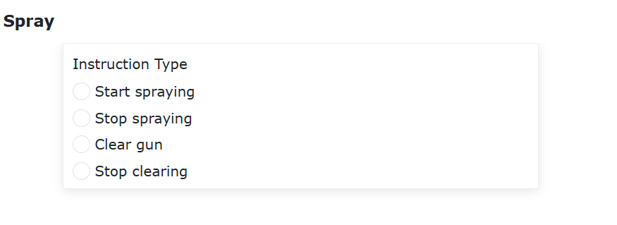

.. centered:: 图表 8.5‑2 喷枪指令

喷涂程序示教
~~~~~~~~~~~~~~

.. list-table:: 
   :widths: 15 40 100
   :header-rows: 1

   * - 序号
     - 指令格式
     - 注释
   * - 1
     - Lin(template1,100,-1,0,0)
     - #开始喷涂点
   * - 2
     - SprayStart()
     - #开始喷涂
   * - 3
     - Lin(template2,100,-1,0,0)
     - #喷涂路径
   * - 4
     - Lin(template3,100,-1,0,0)
     - #停止喷涂点
   * - 5
     - SprayStop()
     - #停止喷涂
   * - 6
     - Lin(template4,100,-1,0,0)
     - #清枪点
   * - 7
     - PowerCleanStart()
     - #开始清枪
   * - 8
     - WaitTime(5000)
     - #清枪时间 ms
   * - 9
     - PowerCleanStop()
     - #停止清枪

焊机
-------------

协作机器人携带焊枪进行焊接作业可以显著提高焊接效率和焊接质量，法奥协作机器人可以通过“控制器IO”或“数字通信协议（UDP）”或“数字通信协议（Modbus TCP）”三种方法进行焊接控制：

**控制器IO**：机器人通过设置控制箱模拟量输出(0-10V)进行焊接电流和焊接电压的大小控制，通过控制箱数字输出进行焊接起弧、送丝、送气的控制，通过控制箱数字输入采集焊机准备、起弧成功等信号输入。

**数字通信协议（UDP）**：机器人通过UDP与PLC进行通信，PLC再通过CANOpen总线或其他协议与焊机通信，进而控制焊接电压、电流和焊机起弧、送丝、送气等操作(机器人UDP通信协议内容见附件一)。

**数字通信协议（Modbus TCP）**：即控制器外设开放协议，通常是一个可运行的LUA程序，程序包含通讯创建指令、循环向从站设备写入控制数据和读取实时状态数据指令，执行该LUA程序时，机器人与设备建立通讯，并进行数据交互。控制器外设开放协议LUA程序中可自定义IP地址、端口号、周期等通讯参数，用户在使用时需要根据实际设备情况对该协议内容进行修改。控制器外设开放协议支持的设备包括打磨头、激光传感器、CNC、焊机等。控制器外设开放协议文件名称需以CtrlDev_开头，如“CtrlDev_Welding.lua”，最多支持4个开放协议同时运行。

.. figure:: robot_peripherals/036.png
   :align: center
   :width: 4in

.. centered:: 图表 8.6‑1 焊机

“控制器IO”或“数字通信协议（UDP）”进行焊接控制主要包括以下几个步骤：①焊枪安装及信号接线；②焊机参数配置；③编写焊接控制程序。

焊枪安装
~~~~~~~~~~~~~~~~~~~~~

焊枪通过转接板安装于机器人末端，焊枪线缆需固定于机械臂上。

.. figure:: robot_peripherals/037.png
   :align: center
   :width: 3in

.. centered:: 图表 8.6‑2 焊枪安装于机器人末端

焊枪固定安装完成后，通过六点法进行焊枪工具坐标系标定，并应用为当前工具坐标系，焊枪工具坐标系标定精度会影响实际焊接精度。

.. figure:: robot_peripherals/038.png
   :align: center
   :width: 4in

.. centered:: 图表 8.6-3 机器人工具坐标系标定及应用

焊机参数配置
~~~~~~~~~~~~~~~~~~~~~~~~~~~~~~~~~

协作机器人可通过“控制器IO”信号或“数字通信协议”进行焊接过程控制，两种方式的配置操作主要有以下两个区别点：

①使用“控制器IO”时需要设置实际控制焊接电流电压与控制箱模拟量输出值之间的对应关系；

②使用“数字通信协议”时需要配置通信参数。

“控制器IO”焊接控制配置
+++++++++++++++++++++++++++++++++++

在“初始设置”->“外设”->“焊机”菜单栏中，点击“控制器I/O”卡片进入界面。

.. figure:: robot_peripherals/039.png
   :align: center
   :width: 4in

.. centered:: 图表 8.6-4 控制器I/O

焊接IO信号配置
****************************

如下图所示，选择焊机状态信号DI输入端口和焊机控制信号DO输出端口，点击“配置”按钮，各信号含义如下：

.. figure:: robot_peripherals/040.png
   :align: center
   :width: 4in

.. centered:: 图表 8.6-5 设置焊机信号端口

**焊机准备**：当焊机已经准备完成可以进行焊接作业时，焊机输出该信号至机器人。

当焊机故障或其他原因未准备完成时，焊机未将该信号输入至机器人，此时机器人WebApp右上角提示“焊机未准备好”。若您的焊机没有焊机准备好信号，可将该项端口设置为“无”。

.. figure:: robot_peripherals/041.png
   :align: center
   :width: 3in

.. centered:: 图表 8.6-6 焊机未准备好报错

.. figure:: robot_peripherals/042.png
   :align: center
   :width: 4in

.. centered:: 图表 8.6-7 焊机准备设置为“无”

**起弧成功**：焊机起弧已成功，机器人输出起弧信号至焊机后，等待焊机反馈起弧成功信号，在设定的超时时间内机器人未检测到焊机的起弧成功信号，机器人报“起弧超时”错误。

使用机器人焊接功能时若未配置起弧成功信号仍可进行焊接，但机器人会报“起弧成功DI未配置”警告；若您的焊机有起弧成功信号输出，我们建议您配置此信号以进行更安全的焊接。

.. centered:: 图表 8.6-8 起弧超时报错
   
.. figure:: robot_peripherals/044.png
   :align: center
   :width: 3in

.. centered:: 图表 8.6-9 起弧成功DI未配置警告

**焊接中断恢复**：机器人焊接过程中电弧意外中断或操作人员主动暂停焊接时会触发焊接中断，焊接中断后外部向机器人输入该信号从无效变为有效时，机器人自动从原来中断的位置自动恢复焊接。

**焊接中断退出**：机器人焊接过程中电弧意外中断或操作人员主动暂停焊接时会触发焊接中断，焊接中断后外部向机器人输入该信号从无效变为有效时，机器人终止焊接，焊接终止后不可再次恢复焊接。

**焊机起弧**：机器人控制焊机起弧的DO输出端口，当机器人程序执行起弧指令时，焊机起弧对应DO输出端口自动输出有效。

**气体检测**：机器人控制焊机送气的DO输出端口，当机器人执行焊接送气指令时，送气对应的DO输出端口自动输出有效。

**正向送丝**：机器人控制焊机正向送丝的DO输出端口，当机器人执行正向送丝指令时，正向送丝对应的DO输出端口自动输出有效。

**反向送丝**：机器人控制焊机反向送丝的DO输出端口，当机器人执行反向送丝指令时，反向送丝对应的DO输出端口自动输出有效。

焊接工艺参数配置
****************************

如下图所示，在焊接配置页面找到“焊接工艺参数”栏，协作机器人提供0 ~ 99共100组焊接工艺参数，其中工艺编号0表示不使用焊接工艺曲线，工艺编号1-99使用焊接工艺曲线。
   
.. figure:: robot_peripherals/045.png
   :align: center
   :width: 4in

.. centered:: 图表 8.6-10 焊接工艺参数配置 

使用焊接工艺曲线时，以选择焊接工艺编号1为例，依次输入起弧电流 ~ 收弧时间参数如图8中所示，点击“配置”按钮，该工艺参数表示的实际焊接过程如下：

①设置焊接电流200A、电压23V；

②执行起弧，等待起弧成功；

③起弧成功后电弧保持500ms(起弧时间，机器人不运动)；

④设置焊接电流150A、焊接电压21V，然后机器人开始运动并进行焊接；

⑤焊接到终点后，设置焊接电流为100A、焊接电压为19V(收弧电流、收弧电压)；

⑥收弧电流、电压设置完成后保持500ms电弧燃烧(机器人不运动)，最后熄灭电弧。

不使用焊接工艺曲线时，即选择焊接工艺参数编号为0时，如下图，焊接过程为：

①设置焊接电流和焊接电压；

②机器人控制焊机起弧，并等待起弧成功；

③起弧成功后，机器人开始运动并进行焊接；

④机器人焊接到终点后立即熄灭电弧。
   
.. figure:: robot_peripherals/046.png
   :align: center
   :width: 4in

.. centered:: 图表 8.6-11 不使用焊接工艺曲线 

焊接电流电压与模拟量输出关系图设置
***************************************

协作机器人焊接控制类型选择为“控制器IO”时，通过控制箱模拟量输出大小来控制焊接电流和焊接电压值(控制箱模拟量输出电压范围为0 ~ 10V)，此时需要配置控制箱模拟量输出值与实际焊接电流、焊接电压值的线性对应关系。

如图12，在焊机配置页面找到“模拟量电流电压关系图”，其中“A-V”表示焊接电流与控制箱输出模拟量输出电压之间的对应关系，“V-V”表示焊接电压与控制箱输出模拟量电压之间的对应关系。

选择“A-V”，输入焊接电流范围0-1000A，模拟量输出电压0-10V，输出AO为“Ctrl-AO0”(焊接电流控制模拟量输出端口为AO0)，点击“配置”按钮；在该参数下，控制箱输出模拟量电压1.5V时，对应焊接电流为150A。
   
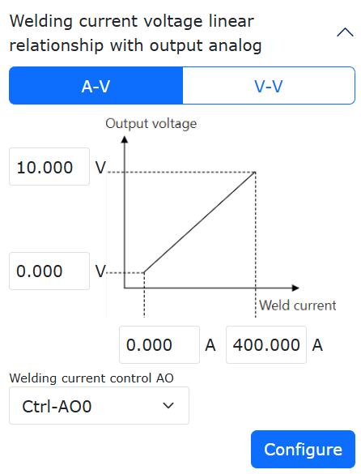

.. centered:: 图表 8.6-12 焊接电流与输出模拟量对应关系配置

如图13，点击“V-V”设置焊接电压与控制箱模拟量输出电压之间的对应关系，输入焊接电压范围为0-60V，模拟量输出电压值为0-10V，输出AO为“Ctrl-AO1”(焊接电流控制模拟量输出端口为AO0)，点击“配置”按钮，此时。若控制箱AO1模拟量输出3.5V，实际控制焊接电压为21V。
   
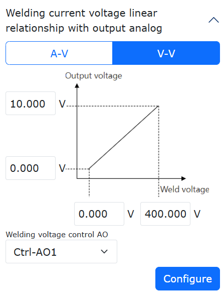

.. centered:: 图表 8.6-13 焊接电压与输出模拟量对应关系配置

焊机调试
******************

如图14，在焊机配置页面中找到“焊机调试”，选择工艺编号1，输入超时时间为1000ms，点击“送气”，机器人即控制焊机开始输送保护气，点击“停气”按钮，机器人即控制焊机停止输送保护气。其他按钮“起弧”、“正向送丝”、“反向送丝”等操作方法相同，不再赘述。
   
.. figure:: robot_peripherals/049.png
   :align: center
   :width: 4in

.. centered:: 图表 8.6-14 焊机调试

“数字通信协议（UDP）”焊接控制配置
+++++++++++++++++++++++++++++++++++

机器人通过“数字通信协议”进行焊接控制，本质上是机器人与PLC进行UDP通信，机器人通过UDP通信将起弧、送丝、送气、电流、电压等控制数据传至PLC，再由PLC端进一步通过CANOpen总线(或其他方式)对焊机进行控制，同时PLC端采集实际的焊接电流电压、起弧成功信号反馈至机器人。(机器人UDP通信协议内容见附件一)。

在“初始设置”->“外设”菜单栏中，点击“焊机”进入焊机配置界面。如下图所示：
   
.. figure:: robot_peripherals/050.png
   :align: center
   :width: 4in

.. centered:: 图表 8.6-15 数字通信协议（UDP）

由于机器人与PLC进行UDP通信，因此需要配置UDP通信参数，其中各项参数的含义如下：

**IP地址**：UDP通信PLC端的IP地址；

**端口号**：PLC端UDP通信端口号；

**通信周期**：机器人与PLC进行UDP通信的周期，默认为2ms；

**丢包检测周期、丢包次数**：在丢包检测周期内的丢包个数超过设定值时，机器人报“UDP通信丢包异常”错误，同时通信自动切断。

**通信中断确认时长**：机器人在该时长内未收到一帧完整的PLC反馈数据包即报“UDP通信中断”错误报警，同时切断UDP通信。

**断电重启自动重连**：机器人检测到机器人断电重启后是否自动进行重连恢复；

**通信中断自动重连**：机器人检测到UDP通信中断后是否自动进行重连恢复；

**重连周期、重连次数**：使能UDP通信中断自动重连且检测到UDP通信中断后，机器人以设定的周期进行重连，当重连次数达到最大设定值仍未连接成功时，机器人报“UDP通信中断”错误报警，同时切断UDP通信。

配置完成上述参数后，点击“配置”按钮。配置成功后，点击“加载”按钮。
   
.. figure:: robot_peripherals/051.png
   :align: center
   :width: 4in

.. centered:: 图表 8.6-16 UDP通讯配置

.. note:: 
   .. image:: robot_peripherals/052.png
      :height: 0.75in
      :align: left

   名称：**编辑按钮**
   
   作用：UDP通讯参数配置打开/关闭

.. note:: 
   .. image:: robot_peripherals/053.png
      :height: 0.75in
      :align: left

   名称：**加载按钮**
   
   作用：UDP通讯加载

焊接IO信号配置
****************************

选择焊机状态信号DI输入端口和焊机控制信号DO输出端口，点击“配置”按钮，各信号含义如下：
   
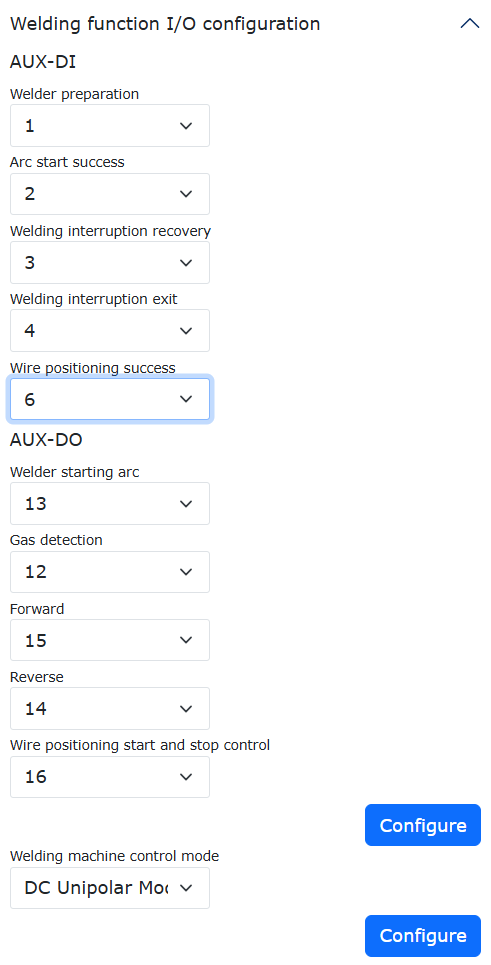

.. centered:: 图表 8.6-17 设置焊机信号端口

**焊机准备**：当焊机已经准备完成可以进行焊接作业时，焊机输出该信号至机器人；

当焊机故障或其他原因未准备完成时，焊机未将该信号输入至机器人，此时机器人WebApp右上角提示“焊机未准备好”。若您的焊机没有焊机准备好信号，可将该项端口设置为“-1”。
   
.. figure:: robot_peripherals/041.png
   :align: center
   :width: 3in

.. centered:: 图表 8.6-18 焊机未准备好报错
   
.. figure:: robot_peripherals/055.png
   :align: center
   :width: 4in

.. centered:: 图表 8.6-19 焊机准备设置为“-1”

**起弧成功**：焊机起弧已成功，机器人输出起弧信号至焊机后，等待焊机反馈起弧成功信号，在设定的超时时间内机器人未检测到焊机的起弧成功信号，机器人报“起弧超时”错误；

使用机器人焊接功能时若未配置起弧成功信号仍可进行焊接，但机器人会报“起弧成功DI未配置”警告；若您的焊机有起弧成功信号输出，我们建议您配置此信号以进行更安全的焊接。
   

.. centered:: 图表 8.6-20 起弧超时报错	
      
.. figure:: robot_peripherals/044.png
   :align: center
   :width: 3in

.. centered:: 图表 8.6-21 起弧成功DI未配置报错

**焊接中断恢复**：机器人焊接过程中电弧意外中断或操作人员主动暂停焊接时会触发焊接中断，焊接中断后外部向机器人输入该信号从无效变为有效时，机器人自动从原来中断的位置自动恢复焊接。

**焊接中断退出**：机器人焊接过程中电弧意外中断或操作人员主动暂停焊接时会触发焊接中断，焊接中断后外部向机器人输入该信号从无效变为有效时，机器人终止焊接，焊接终止后不可再次恢复焊接。

**焊机起弧**：机器人控制焊机起弧的DO输出端口，当机器人程序执行起弧指令时，焊机起弧对应DO输出端口自动输出有效。

**气体检测**：机器人控制焊机送气的DO输出端口，当机器人执行焊接送气指令时，送气对应的DO输出端口自动输出有效。

**正向送丝**：机器人控制焊机正向送丝的DO输出端口，当机器人执行正向送丝指令时，正向送丝对应的DO输出端口自动输出有效。

**反向送丝**：机器人控制焊机反向送丝的DO输出端口，当机器人执行反向送丝指令时，反向送丝对应的DO输出端口自动输出有效。

焊接工艺参数配置
****************************

如图22，在焊接配置页面找到“焊接工艺参数”栏，协作机器人提供0 ~ 99共100组焊接工艺参数，其中工艺编号0表示不使用焊接工艺曲线，工艺编号1-99使用焊接工艺曲线。
      
.. figure:: robot_peripherals/045.png
   :align: center
   :width: 4in

.. centered:: 图表 8.6-22 焊接工艺参数配置

使用焊接工艺曲线时，以选择焊接工艺编号1为例，依次输入起弧电流 ~ 收弧时间参数如图8中所示，点击“配置”按钮，该工艺参数表示的实际焊接过程如下：

①设置焊接电流200A、电压23V；

②执行起弧，等待起弧成功；

③起弧成功后电弧保持500ms(起弧时间，机器人不运动)；

④设置焊接电流150A、焊接电压21V，然后机器人开始运动并进行焊接；

⑤焊接到终点后，设置焊接电流为100A、焊接电压为19V(收弧电流、收弧电压)；

⑥设置完收弧电流、电压后保持500ms电弧燃烧(机器人不运动)，最后熄灭电弧。

不使用焊接工艺参数时，即选择焊接工艺参数编号为0时，焊接过程为：

①通过设置电流、电压接口设置相应的焊接电流和焊接电压；

②机器人控制焊机起弧，并等待起弧成功；

③起弧成功后，机器人开始运动并进行焊接；

④机器人焊接到终点后立即熄灭电弧。
      
.. figure:: robot_peripherals/046.png
   :align: center
   :width: 4in

.. centered:: 图表 8.6-23 不使用焊接工艺曲线

焊机调试
******************

在焊机配置页面中找到“焊机调试”，选择工艺编号1，输入超时时间为1000ms，点击“送气”，机器人即控制焊机开始输送保护气，点击“停气”按钮，机器人即控制焊机停止输送保护气。其他按钮“起弧”、“正向送丝”、“反向送丝”等操作方法相同，不再赘述。

.. figure:: robot_peripherals/049.png
   :align: center
   :width: 4in

.. centered:: 图表 8.5-24 焊机调试

焊接程序编写
~~~~~~~~~~~~~~~~~~~~~~~~~~~

使用焊接工艺曲线的程序编写
++++++++++++++++++++++++++++++++++++

选择使用焊接工艺曲线时(即选择焊接工艺参数编号1 ~ 99)，焊接过程中的电压电流控制遵循某个工艺参数编号设置的曲线参数，不需要再单独添加设置焊接电压和电流的指令。如图25，点击“示教程”->“程序编程”，新建用户程序“testWeld.lua”。

.. figure:: robot_peripherals/056.png
   :align: center
   :width: 6in

.. centered:: 图表 8.6-25 创建“testWeld.lua”程序

在打开的焊接指令添加页面中选择控制类型为“控制器I/O”(根据实际配置的焊接控制方式选择)，选择焊接工艺编号为1(工艺编号0不使用焊接工艺曲线，工艺编号1-99使用焊接工艺曲线)，最大等待时间为10000ms，依次点击“起弧”按钮和“收弧”按钮，最后点击“应用”。

.. figure:: robot_peripherals/057.png
   :align: center
   :width: 6in

.. centered:: 图表 8.6-26 焊接指令添加

此时“testWeld.lua”程序中已添加焊接起弧指令和焊接收弧指令，由于焊接起弧、收弧选择使用焊接工艺曲线编号1，因此焊接过程中的电压电流控制遵循工艺编号1设置的曲线参数，不需要再单独添加设置焊接电压和电流的指令。

.. figure:: robot_peripherals/058.png
   :align: center
   :width: 6in

.. centered:: 图表 8.6-27 起弧收弧程序

添加两个直线运动指令，并调整指令顺序，使机器人先运动到“P1”点，执行起弧，再运动到“P2”点，执行收弧，实现机器人从“P1”点焊接至“P2”点。

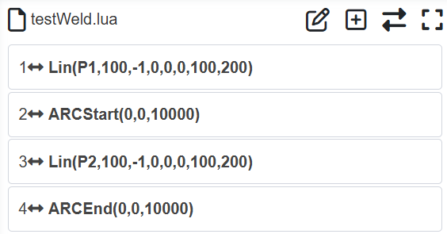

.. centered:: 图表 8.6-28 机器人从P1点焊接至P2点

不使用焊接工艺曲线的程序编写
++++++++++++++++++++++++++++++++++++

选择不使用焊接工艺曲线时(即选择焊接工艺参数编号0)，焊接程序中需添加设置焊接电压、电流的指令以控制实际的焊接参数。点击“示教模拟”、“程序示教”，新建用户程序“testWeld.lua”。

.. figure:: robot_peripherals/056.png
   :align: center
   :width: 6in

.. centered:: 图表 8.6-29 创建“testWeld.lua”程序

在打开的焊接指令添加页面中选择控制类型为“控制器I/O”(根据实际配置的焊接控制方式选择)，选择焊接工艺编号为0(工艺编号0不使用焊接工艺曲线，工艺编号1-99使用焊接工艺曲线)，焊接电流控制AO为“Ctrl-AO0”，焊接电流为150A，点击“添加”按钮；设置焊接电压控制AO为“Ctrl-AO1”，焊接电压为21V，点击“添加”按钮；设置最大等待时间为10000ms，依次点击“起弧”按钮和“收弧”按钮，最后点击“应用”。

.. figure:: robot_peripherals/057.png
   :align: center
   :width: 6in

.. centered:: 图表 8.6-30 焊接指令添加

此时“testWeld.lua”程序中已添加焊接起弧指令和焊接收弧指令，由于焊接起弧、收弧指令选择焊接工艺编号0，程序执行设置焊接电压、电流指令时，机器人将根据设置的焊接电压、电流数值和焊机配置页面中设置的“焊接电压、电流与输出模拟量对应关系”自动输出对应的控制箱模拟量。

.. figure:: robot_peripherals/060.png
   :align: center
   :width: 6in

.. centered:: 图表 8.6-31 设置焊接电压、电流、起弧、收弧程序

添加两个直线运动指令，并调整指令顺序，使机器人先运动到“P1”点，执行起弧，再运动到“P2”点，执行收弧，实现机器人从“P1”点焊接至“P2”点。

.. figure:: robot_peripherals/061.png
   :align: center
   :width: 6in 

.. centered:: 图表 8.6-32 机器人从P1点焊接至P2点

运行上述程序，即可实现一条直线P1 ~ P2的焊接，在运行程序前请检查：

①焊枪是否已经正确安装，焊枪工具坐标系是否完成标定，并应用为当前的工具坐标系；

②焊接电源、气路、丝路是否正常工作；

③机器人与焊机之间的各信号线连接是否正常。

焊接中断与恢复
~~~~~~~~~~~~~~~~~~~~~~~~~~~

机器人焊接过程中可能在以下情况下发生中断：

①操作人员主动暂停焊接，以观察实际焊接情况或清理喷嘴等操作；

②焊接电弧意外中断；

③机器人发生碰撞导致焊接暂停；

机器人焊接过程中发生中断后，操作人员可以将机器人切换至手动模式，拖动机器人至安全位置，并对中断发生原因进行处理。

问题处理完成后，协作机器人可以从当前位置自动移动到焊接中断发生的位置重新起弧并恢复焊接，具体的操作过程为：

①焊接中断恢复参数配置；

②执行焊接程序，在焊接过程中暂停焊接使焊接中断；

③将机器人切换至手动模式，并处理相关问题，处理完成后再将机器人切换至自动模式；

④点击“恢复焊接”按钮，机器人自动恢复焊接。

焊接中断恢复参数配置
+++++++++++++++++++++++++++++

在“初始设置”->“外设”菜单栏中，点击“焊机”进入焊机配置界面，找到“检测电弧中断参数配置”栏，打开“功能启用”，输入“确认时长”为20ms，点击“配置”按钮，即焊接过程中起弧成功信号无效时间超过20ms时，机器人会报出“焊接电弧中断”错误。

.. figure:: robot_peripherals/062.png
   :align: center
   :width: 4in 

.. centered:: 图表 8.6-33 检测电弧中断参数配置参数配置

找到“焊接中断再恢复参数配置”栏，打开“功能启用”，输入“重叠距离”为5mm，“速度”为10%，“运动方式”为“PTP”，点击“配置”按钮，上述三个参数解释如下：

**重叠距离**：焊接恢复时为了保证恢复后焊缝与中断前焊缝的连续性，恢复焊接的起弧点与原焊缝需要有一定的重叠距离。

**速度**：焊接中断后往往需要将机器人移至安全位置并对焊缝进行处理，处理完成后执行焊接恢复时，机器人将从当前位置移至焊接再起弧点，该“速度”即表示机器人移动至再起弧点的速度。

**运动方式**：焊接中断后往往需要将机器人移至安全位置并对焊缝进行处理，处理完成后执行焊接恢复时，机器人将从当前位置移至焊接再起弧点，该“运动方式”即表示机器人移动至再起弧点的运动方式，有“LIN”和“PTP”两种方式可供选择。

.. figure:: robot_peripherals/063.png
   :align: center
   :width: 4in 

.. centered:: 图表 8.6-34 焊接中断再恢复参数配置

焊接中断恢复应用
+++++++++++++++++++++++++++++

以“testWeld”程序为例，将机器人切换至自动模式，点击启动按钮，机器人开始进行焊接作业，在焊接过程中点击暂停按钮，此时焊接中断，在WebApp右上角弹出焊接中断恢复提示框，点击“恢复焊接”按钮，机器人自动移至再起弧点并执行后续的焊接作业。

.. figure:: robot_peripherals/064.png
   :align: center
   :width: 6in 

.. centered:: 图表 8.6-35 执行焊接程序

.. figure:: robot_peripherals/065.png
   :align: center
   :width: 6in 

.. centered:: 图表 8.6-36 焊接恢复

.. warning:: 
   协作机器人焊接中断恢复功能仅可用于直线焊缝或圆弧焊缝，当使用while（1）循环焊接时，不支持嵌套多层while循环，不可包含含有局部变量的条件判断语句。如果使用段焊功能，请注意增加反馈段焊信息接口。

附件一：机器人UDP通信协议
~~~~~~~~~~~~~~~~~~~~~~~~~~

.. warning:: 
  1）CRC 校验方式：采用modbus 16 校验但只取低8位进行校验校验数据区域D100-D176，D200-D273。

  2）电弧跟踪：实际电流反馈是将PLC获取到焊机的实际电流转换成0-4095的模拟量传送到UDP数据协议的模拟量通道0即D168中。

  3）速度换算逻辑：机器人下发速度（单位mm/s）V÷导程×60=V'；

    PLC将机器人下发速度进行转换V'×编码器分辨率÷60=V"单位（脉冲/s）。

机器人控制器->PLC
++++++++++++++++++++++

.. list-table:: 
   :widths: 10 10 10 10 20
   :header-rows: 1
   :align: center

   * - 序号
     - 寄存器地址
     - 数据类型
     - 数据值
     - 变量名

   * - 1
     - D199
     - INT
     - 0x5A5A
     - 帧头

   * - 2
     - D200
     - INT
     - 
     - 1#电机控制字

   * - 3
     - D201
     - DINT
     - 
     - 1#目标位置输入

   * - 4
     - D202
     - DINT
     - 
     - 1#目标位置输入

   * - 5
     - D203
     - INT
     - 
     - 1#回零控制字

   * - 6
     - D204
     - DINT
     - 
     - 1#回零高速度输入

   * - 7
     - D205
     - DINT
     - 
     - 1#回零高速度输入

   * - 8
     - D206
     - DINT
     - 
     - 1#回零低速度输入

   * - 9
     - D207
     - DINT
     - 
     - 1#回零低速度输入

   * - 10
     - D208
     - DINT
     - 
     - 1#位置偏置（预留）

   * - 11
     - D209
     - DINT
     - 
     - 1#位置偏置（预留）

   * - 12
     - D210
     - DINT
     - 
     - 1#速度偏置（预留）

   * - 13
     - D211
     - DINT
     - 
     - 1#速度偏置（预留）

   * - 14
     - D212
     - DINT
     - 
     - 1#转矩偏置（预留）

   * - 15
     - D213
     - DINT
     - 
     - 1#转矩偏置（预留）

   * - 16
     - D214
     - INT
     - 
     - 2#电机控制字

   * - 17
     - D215
     - DINT
     - 
     - 2#目标位置输入

   * - 18
     - D216
     - DINT
     - 
     - 2#目标位置输入

   * - 19
     - D217
     - INT
     - 
     - 2#回零控制字

   * - 20
     - D218
     - DINT
     - 
     - 2#回零高速度输入

   * - 21
     - D219
     - DINT
     - 
     - 2#回零高速度输入

   * - 22
     - D220
     - DINT
     - 
     - 2#回零低速度输入

   * - 23
     - D221
     - DINT
     - 
     - 2#回零低速度输入

   * - 24
     - D222
     - DINT
     - 
     - 2#位置偏置（预留）

   * - 25
     - D223
     - DINT
     - 
     - 2#位置偏置（预留）

   * - 26
     - D224
     - DINT
     - 
     - 2#速度偏置（预留）

   * - 27
     - D225
     - DINT
     - 
     - 2#速度偏置（预留）

   * - 28
     - D226
     - DINT
     - 
     - 2#转矩偏置（预留）

   * - 29
     - D227
     - DINT
     - 
     - 2#转矩偏置（预留）

   * - 30
     - D228
     - INT
     - 
     - 3#电机控制字
  
   * - 31
     - D229
     - DINT
     - 
     - 3#目标位置输入

   * - 32
     - D230
     - DINT
     - 
     - 3#目标位置输入

   * - 33
     - D231
     - INT
     - 
     - 3#回零控制字

   * - 34
     - D232
     - DINT
     - 
     - 3#回零高速度输入

   * - 35
     - D233
     - DINT
     - 
     - 3#回零高速度输入

   * - 36
     - D234
     - DINT
     - 
     - 3#回零低速度输入

   * - 37
     - D235
     - DINT
     - 
     - 3#回零低速度输入

   * - 38
     - D236
     - DINT
     - 
     - 3#位置偏置（预留）

   * - 39
     - D237
     - DINT
     - 
     - 3#位置偏置（预留）

   * - 40
     - D238
     - DINT
     - 
     - 3#速度偏置（预留）

   * - 41
     - D239
     - DINT
     - 
     - 3#速度偏置（预留）

   * - 42
     - D240
     - DINT
     - 
     - 3#转矩偏置（预留）

   * - 43
     - D241
     - DINT
     - 
     - 3#转矩偏置（预留）

   * - 44
     - D242
     - INT
     - 
     - 4#电机控制字
  
   * - 45
     - D243
     - DINT
     - 
     - 4#目标位置输入

   * - 46
     - D244
     - DINT
     - 
     - 4#目标位置输入

   * - 47
     - D245
     - INT
     - 
     - 4#回零控制字

   * - 48
     - D246
     - DINT
     - 
     - 4#回零高速度输入

   * - 49
     - D247
     - DINT
     - 
     - 4#回零高速度输入

   * - 50
     - D248
     - DINT
     - 
     - 4#回零低速度输入

   * - 51
     - D249
     - DINT
     - 
     - 4#回零低速度输入

   * - 52
     - D250
     - DINT
     - 
     - 4#位置偏置（预留）

   * - 53
     - D251
     - DINT
     - 
     - 4#位置偏置（预留）

   * - 54
     - D252
     - DINT
     - 
     - 4#速度偏置（预留）

   * - 55
     - D253
     - DINT
     - 
     - 4#速度偏置（预留）

   * - 56
     - D254
     - INT
     - 
     - 预留

   * - 57
     - D255
     - INT
     - 
     - 焊接模式设置（0-直流一元、1-脉冲一元、2-JOB模式、3-近控模式、4-分别模式、5-CC/CV、6-TIG、7-CMT模式）

   * - 58
     - D256
     - INT
     - 
     - 普通输出DO(0-15)

   * - 59
     - D257
     - INT
     - 
     - 普通输出DO(16-31)

   * - 60
     - D258
     - INT
     - 
     - 普通输出DO(32-47)

   * - 61
     - D259
     - INT
     - 
     - 普通输出DO(48-63)

   * - 62
     - D260
     - INT
     - 
     - 普通输出DO(64-79)

   * - 63
     - D261
     - INT
     - 
     - 普通输出DO(80-95)

   * - 64
     - D262
     - INT
     - 
     - 高速输出DO(96-111)

   * - 65
     - D263
     - INT
     - 
     - 高速输出DO(112-127)

   * - 66
     - D264
     - INT
     - 
     - 模拟量输出AO0

   * - 67
     - D265
     - INT
     - 
     - 模拟量输出AO1

   * - 68
     - D266
     - INT
     - 
     - 模拟量输出AO2

   * - 69
     - D267
     - INT
     - 
     - 模拟量输出AO3

   * - 70
     - D268
     - REAL
     - 
     - 下发焊接电压

   * - 71
     - D269
     - REAL
     - 
     - 下发焊接电压

   * - 72
     - D270
     - REAL
     - 
     - 下发焊接电流

   * - 73
     - D271
     - REAL
     - 
     - 下发焊接电流

   * - 74
     - D272
     - REAL
     - 
     - 丢包检测周期

   * - 75
     - D273
     - INT
     - 
     - 丢包个数

   * - 76
     - D274
     - INT
     - 
     - 帧计数（0-255）

   * - 77
     - D275
     - INT
     - 
     - CRC检验码

PLC -> 机器人控制器
++++++++++++++++++++

.. list-table:: 
   :widths: 10 10 10 10 20
   :header-rows: 1
   :align: center

   * - 序号
     - 寄存器地址
     - 数据类型
     - 数据值
     - 变量名

   * - 1
     - D99
     - INT
     - 0x5A5A
     - 帧头

   * - 2
     - D100
     - INT
     - 
     - 1#电机状态字

   * - 3
     - D101
     - DINT
     - 
     - 1#当前位置

   * - 4
     - D102
     - DINT
     - 
     - 1#当前位置

   * - 5
     - D103
     - INT
     - 
     - 1#回零状态字

   * - 6
     - D104
     - DINT
     - 
     - 1#回零高速度反馈

   * - 7
     - D105
     - DINT
     - 
     - 1#回零高速度反馈

   * - 8
     - D106
     - DINT
     - 
     - 1#回零低速度反馈

   * - 9
     - D107
     - DINT
     - 
     - 1#回零低速度反馈

   * - 10
     - D108
     - INT
     - 
     - 1#故障码

   * - 11
     - D109
     - DINT
     - 
     - 1#随动偏差（预留）

   * - 12
     - D110
     - DINT
     - 
     - 1#随动偏差（预留）

   * - 13
     - D111
     - DINT
     - 
     - 1#速度反馈（预留）

   * - 14
     - D112
     - DINT
     - 
     - 1#速度反馈（预留）

   * - 15
     - D113
     - DINT
     - 
     - 1#实时转矩（预留）

   * - 16
     - D114
     - DINT
     - 
     - 1#实时转矩（预留）

   * - 17
     - D115
     - INT
     - 
     - 2#电机状态字

   * - 18
     - D116
     - DINT
     - 
     - 2#当前位置

   * - 19
     - D117
     - DINT
     - 
     - 2#当前位置

   * - 20
     - D118
     - INT
     - 
     - 2#回零状态字

   * - 21
     - D119
     - DINT
     - 
     - 2#回零高速度反馈

   * - 22
     - D120
     - DINT
     - 
     - 2#回零高速度反馈

   * - 23
     - D121
     - DINT
     - 
     - 2#回零低速度反馈

   * - 24
     - D122
     - DINT
     - 
     - 2#回零低速度反馈

   * - 25
     - D123
     - INT
     - 
     - 2#故障码

   * - 26
     - D124
     - DINT
     - 
     - 2#随动偏差（预留）

   * - 27
     - D125
     - DINT
     - 
     - 2#随动偏差（预留）

   * - 28
     - D126
     - DINT
     - 
     - 2#速度反馈（预留）

   * - 29
     - D127
     - DINT
     - 
     - 2#速度反馈（预留）

   * - 30
     - D128
     - DINT
     - 
     - 2#实时转矩（预留）
  
   * - 31
     - D129
     - DINT
     - 
     - 2#实时转矩（预留）

   * - 32
     - D130
     - INT
     - 
     - 3#电机状态字

   * - 33
     - D131
     - DINT
     - 
     - 3#当前位置

   * - 34
     - D132
     - DINT
     - 
     - 3#当前位置

   * - 35
     - D133
     - INT
     - 
     - 3#回零状态字

   * - 36
     - D134
     - DINT
     - 
     - 3#回零高速度反馈

   * - 37
     - D135
     - DINT
     - 
     - 3#回零高速度反馈

   * - 38
     - D136
     - DINT
     - 
     - 3#回零低速度反馈

   * - 39
     - D137
     - DINT
     - 
     - 3#回零低速度反馈

   * - 40
     - D138
     - DINT
     - 
     - 3#故障码

   * - 41
     - D139
     - DINT
     - 
     - 3#随动偏差(预留)

   * - 42
     - D140
     - DINT
     - 
     - 3#随动偏差(预留)

   * - 43
     - D141
     - DINT
     - 
     - 3#速度反馈（预留）

   * - 44
     - D142
     - DINT
     - 
     - 3#速度反馈（预留）
  
   * - 45
     - D143
     - DINT
     - 
     - 3#实时转矩（预留）

   * - 46
     - D144
     - DINT
     - 
     - 3#实时转矩（预留）

   * - 47
     - D145
     - INT
     - 
     - 4#电机状态字

   * - 48
     - D146
     - DINT
     - 
     - 4#当前位置

   * - 49
     - D147
     - DINT
     - 
     - 4#当前位置

   * - 50
     - D148
     - INT
     - 
     - 4#回零状态字

   * - 51
     - D149
     - DINT
     - 
     - 4#回零高速度反馈

   * - 52
     - D150
     - DINT
     - 
     - 4#回零高速度反馈

   * - 53
     - D151
     - DINT
     - 
     - 4#回零低速度反馈

   * - 54
     - D152
     - DINT
     - 
     - 4#回零低速度反馈

   * - 55
     - D153
     - DINT
     - 
     - 4#故障码

   * - 56
     - D154
     - DINT
     - 
     - 4#随动偏差（预留）

   * - 57
     - D155
     - DINT
     - 
     - 4#随动偏差（预留）

   * - 58
     - D156
     - DINT
     - 
     - 4#速度反馈（预留）

   * - 59
     - D157
     - DINT
     - 
     - 4#速度反馈（预留）

   * - 60
     - D158
     - DINT
     - 
     - 实时转矩（预留）

   * - 61
     - D159
     - DINT
     - 
     - 实时转矩（预留）

   * - 62
     - D160
     - INT
     - 
     - 普通输入DI(0-15)

   * - 63
     - D161
     - INT
     - 
     - 普通输入DI(16-31)

   * - 64
     - D162
     - INT
     - 
     - 普通输入DI(32-47)

   * - 65
     - D163
     - INT
     - 
     - 普通输入DI(48-63)

   * - 66
     - D164
     - INT
     - 
     - 普通输入DI(64-79)

   * - 67
     - D165
     - INT
     - 
     - 普通输入DI(80-95)

   * - 68
     - D166
     - INT
     - 
     - 高速输入DI(96-111)

   * - 69
     - D167
     - INT
     - 
     - 高速输入DI(112-127)

   * - 70
     - D168
     - INT
     - 
     - 模拟量AI0

   * - 71
     - D169
     - INT
     - 
     - 模拟量AI1

   * - 72
     - D170
     - INT
     - 
     - 模拟量AI2

   * - 73
     - D171
     - INT
     - 
     - 模拟量AI3

   * - 74
     - D172
     - REAL
     - 
     - 实际电流反馈

   * - 75
     - D173
     - REAL
     - 
     - 实际电流反馈

   * - 76
     - D174
     - REAL
     - 
     - 实际电压反馈

   * - 77
     - D175
     - REAL
     - 
     - 实际电压反馈

   * - 78
     - D176
     - INT
     - 
     - 故障码 0-无故障，1-数据丢包

   * - 79
     - D177
     - INT
     - 
     - 帧计数

   * - 80
     - D178
     - INT
     - 
     - CRC检验码

数字通讯协议（Modbus TCP）
~~~~~~~~~~~~~~~~~~~~~~~~~~~~~~~~~~~~

点击“初始设置”->“外设”->“焊机”进入焊机界面，点击“数字通讯协议（Modbus TCP）”卡片进入焊机开放协议界面。

协议配置
++++++++++++++

在开放协议配置中，点击“上传”按钮，将编写完成的开放协议LUA程序文件上传至控制器中。选择一个开放协议ID和开放协议名称，点击“配置”按钮(选择协议ID需与开放协议文件中编写的ID一致)，为每个开放协议指定一个ID。

.. figure:: robot_peripherals/066.png
   :align: center
   :width: 4in

.. centered:: 图表 8.6‑37 控制器外设开放协议上传与配置

在已配置的协议中，点击“加载”按钮，运行状态指示灯亮起，表示该开放协议已正常加载。

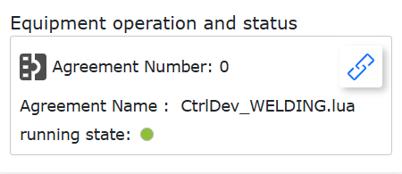

.. centered:: 图表 8.6-38 控制器外设开放协议加载与运行指示

焊机开放协议
++++++++++++++

机器人与焊机通过控制器外设开放协议进行ModbusTCP通讯，根据焊机从站寄存器定义编写对应通讯协议LUA文件，在该文件中对焊机IP地址、端口号等通讯参数和起弧控制、送丝控制等寄存器地址进行配置，将该协议上传至机器人控制器，并加载该协议，即可实现机器人与焊机之间的通讯。

焊机开放协议示例
************************

.. code-block:: console
   :linenos:

   local id = 1 --协议编号,需与WebApp配置的协议编号匹配
   local ctrlValues = {0, 0, 0, 0, 0, 0}
   local realTimeState = {0, 0, 0, 0, 0, 0, 0, 0, 0, 0, 0, 0, 0, 0, 0, 0, 0, 0, 0, 0}
   ModbusTCPMasterClose(id)
   ModbusTCPMasterCreate('192.168.58.45', 502, 1, id)
   while(1) do
   setArcStart, setWireForward, setWireReverse, setShieldingGas, setTouchEnable, setRobotError,setRobotEnableState,default1,default2, default3, default4, setCurrent, setVoltage, SetMode = WeldingGetCtrlState()
   local ctrlWord = 0  
   ctrlWord = SetBitWithIndex(ctrlWord, 0, setArcStart)
   ctrlWord = SetBitWithIndex(ctrlWord, 1, setWireForward)
   ctrlWord = SetBitWithIndex(ctrlWord, 2, setWireReverse)
   ctrlWord = SetBitWithIndex(ctrlWord, 3, setShieldingGas)
   ctrlWord = SetBitWithIndex(ctrlWord, 4, setTouchEnable)
   ctrlWord = SetBitWithIndex(ctrlWord, 7, setRobotError)
   ctrlValues[1] = setRobotEnableState
   ctrlValues[2] = ctrlWord
   ctrlValues[3] = 0
   ctrlValues[4] = setCurrent
   ctrlValues[5] = setVoltage
   ctrlValues[6] = 0
   ModbusTCPMasterSetHoldRegs(id, 201, 6, ctrlValues, "U16")
   localtmpCtrlMode={0,0,0,0}
   tmpCtrlMode[1]=SetMode
   ModbusTCPMasterSetHoldRegs(id,0x1000,1,tmpCtrlMode,"U16")
   sleep_ms(10)

   getWeldState, getCurrent, getVoltage,default1, default2, getWelderErrorCode = ModbusTCPMasterGetHoldRegs(id, 211, 6, "U16")
   realTimeState[1] = GetBitWithIndex(getWeldState, 0) + GetBitWithIndex(getWeldState, 1) * 2  --welderType
   realTimeState[2] = GetBitWithIndex(getWeldState, 5) --arc state(WCR)
   realTimeState[3] = GetBitWithIndex(getWeldState, 4) --touch state
   realTimeState[4] = GetBitWithIndex(getWeldState, 7) --welder error state
   realTimeState[12] = getCurrent                      --current
   realTimeState[13] = getVoltage                      --voltage
   realTimeState[14] = getWelderErrorCode              --welder error code
   realTimeState[15] = getWeldState / 255             --heart jump
   WeldingSetRealtimeState(realTimeState)

   local stopFlag = GetOpenLUAStopFlag(id)
   if(stopFlag ~= 0) then 
   ModbusTCPMasterClose(id)
   break
   end

   sleep_ms(10)
   end

焊机开放协议解析
******************************

焊机开放协议主要包括三个部分：

**①建立通讯连接**：主指定协议编号id(加载开放协议时设置的协议编号需要与协议文件中的编号一致)、焊机IP地址、端口号等参数，通过“ModbusTCPMasterCreate()”指令使实现机器人与焊机之间建立ModbusTCP连接。

**②循环向焊机写入控制数据**：焊机开放协议执行时先从机器人控制器内部读取当前的焊机控制数据，再将数据写入焊机控制焊机动作。协议中读取机器人控制焊接数据指令“WeldingGetCtrlState()”返回值定义如表2-1，可根据实际焊机控制寄存器定义对控制数据进行分解，再通过ModbusTCP将数据写入焊机。

.. centered:: 表 8.19-1 WeldingGetCtrlState()返回值

.. list-table:: 
   :widths: 10 20 30 40
   :align: center
   :class: sheet-center
   
   * - **序号**
     - **类型**
     - **名称**
     - **描述**

   * - 1
     - uint16_t
     - setArcStart
     - 起弧信号；0-熄弧；1-起弧

   * - 2
     - uint16_t
     - setWireForward
     - 正向送丝：0-停止送丝；1-正向送丝

   * - 3
     - uint16_t
     - setWireReverse
     - 反向送丝：0-停止送丝；1-反向送丝

   * - 4
     - uint16_t
     - setShieldingGas
     - 保护气控制：0-停气；1-送气

   * - 5
     - uint16_t
     - setTouchEnable
     - 焊丝寻位使能：0-去使能；1-使能

   * - 6
     - uint16_t
     - setRobotError
     - 机器人故障：0-无故障；1-故障

   * - 7
     - uint16_t
     - setRobotEnableState
     - 机器人使能状态：0-未使能；1-使能

   * - 8
     - uint16_t
     - default1
     - 预留

   * - 9
     - uint16_t
     - default2
     - 预留

   * - 10
     - uint16_t
     - default3
     - 预留

   * - 11
     - uint16_t
     - default4
     - 预留

   * - 12
     - uint16_t
     - setCurrent
     - 设置焊接电流(0.1A)

   * - 13
     - uint16_t
     - setVoltage
     - 设置焊接电压(0.01V)

   * - 14
     - uint16_t
     - SetMode
     - 设置焊接模式：0-直流一元、1-脉冲一元、2-JOB模式、3-近控模式、4-分别模式、5-CC/CV、6-TIG、7-CMT模式

   * - 15
     - uint16_t
     - default6
     - 预留

   * - 16
     - uint16_t
     - default7
     - 预留

   * - 17
     - uint16_t
     - default8
     - 预留

   * - 18
     - uint16_t
     - default9
     - 预留

   * - 19
     - uint16_t
     - default10
     - 预留

   * - 20
     - uint16_t
     - default11
     - 预留

**③循环从焊机读取状态数据**：焊机开放协议先通过ModbusTCP从焊机读取实时的状态数据，再将相关数据写入机器人控制器，使机器人能监控到焊机实时动作状态。协议向机器人设置焊机状态接口“WeldingSetRealtimeState()”参数为一个包含所有焊机状态的数组（注意：在开放协议LUA中，数组索引从1开始）如表2-2，可根据实际焊机状态寄存器定义通过ModbusTCP读取焊机状态数据，再组合成焊机状态数组并写入机器人控制器。

.. centered:: 表 8.19-2 WeldingSetRealtimeState()详细参数

.. list-table:: 
   :widths: 10 20 30 40
   :align: center
   :class: sheet-center
   
   * - **类型**
     - **名称**
     - **数组索引**
     - **描述**

   * - uint16_t[20]
     - realTimeState
     - 1
     - 焊机型号

   * - uint16_t[20]
     - realTimeState
     - 2
     - 电弧状态：0-未起弧；1-已起弧

   * - uint16_t[20]
     - realTimeState
     - 3
     - 焊丝接触状态：0-未接触；1-已接触

   * - uint16_t[20]
     - realTimeState
     - 4
     - 焊机故障状态：0-无故障；1-焊机故障

   * - uint16_t[20]
     - realTimeState
     - 5
     - 预留

   * - uint16_t[20]
     - realTimeState
     - 6
     - 预留

   * - uint16_t[20]
     - realTimeState
     - 7
     - 预留

   * - uint16_t[20]
     - realTimeState
     - 8
     - 预留

   * - uint16_t[20]
     - realTimeState
     - 9
     - 预留

   * - uint16_t[20]
     - realTimeState
     - 10
     - 预留

   * - uint16_t[20]
     - realTimeState
     - 11
     - 预留

   * - uint16_t[20]
     - realTimeState
     - 12
     - 实时焊接电流(0.1A)

   * - uint16_t[20]
     - realTimeState
     - 13
     - 实时焊接电压(0.01V)

   * - uint16_t[20]
     - realTimeState
     - 14
     - 焊机故障码

   * - uint16_t[20]
     - realTimeState
     - 15
     - 焊机通讯心跳数据

   * - uint16_t[20]
     - realTimeState
     - 16
     - 预留

   * - uint16_t[20]
     - realTimeState
     - 17
     - 预留

   * - uint16_t[20]
     - realTimeState
     - 18
     - 预留

   * - uint16_t[20]
     - realTimeState
     - 19
     - 预留

   * - uint16_t[20]
     - realTimeState
     - 20
     - 预留

焊机开放协议上传与加载
***************************************

依次点击“初始设置”、“外设”、“控制箱”、“外设开放协议”，点击“上传”按钮，上传焊机开放协议“CtrlDev_WELDING.lua”(协议文件名称需以CtrlDev_开头，且后缀名为“.lua”)。

.. figure:: robot_peripherals/068.png
   :align: center
   :width: 4in

.. centered:: 图表 8.6‑39 焊机开放协议上传

在“协议配置”中选择一个“协议编号”(需要与开放协议文件中的协议编号匹配)，此处以编号1为例，并选择“协议名称”为焊机开放协议“CtrlDev_WELDING.lua”，点击“配置”按钮，此时在“设备操作及状态”中显示已配置的焊机开放协议。

.. figure:: robot_peripherals/069.png
   :align: center
   :width: 4in

.. centered:: 图表 8.6‑40 焊机开放协议配置

点击“连接”按钮加载焊机开放协议，运行状态指示灯亮起表示机器人和焊机正在通讯。

.. figure:: robot_peripherals/070.png
   :align: center
   :width: 4in

.. centered:: 图表 8.6‑41 焊机开放协议加载

焊机调试
**************************
在进行焊机调试前，请先确保焊机开放协议已正常加载，相关寄存器地址配置正确。

依次点击“初始设置”、“外设”、“焊机”，选择“数字通信协议(ModbusTcp)”。

.. figure:: robot_peripherals/036.png
   :align: center
   :width: 4in

.. centered:: 图表 8.6‑42 选择“数字通信协议(ModbusTcp)”

点击“起弧”、“收弧”、“送气”、“关气”等按钮，观察实际焊机动作是否与设置一致，若焊机未进行设置的动作，则检查焊机开放协议中寄存器配置是否有误，并做进一步调试。

.. figure:: robot_peripherals/049.png
   :align: center
   :width: 4in

.. centered:: 图表 8.6‑43 焊机调试

焊接程序编写
********************************

点击“初始设置”、“示教程序”、“程序编程”，新建一个程序“testWeld.lua”。

.. figure:: robot_peripherals/056.png
   :align: center
   :width: 6in

.. centered:: 图表 8.6‑44 创建焊接LUA程序

点击“焊接”按钮,在弹出焊接指令添加页面中选择“数字通信协议(Modbus Tcp)”，依次选择“起弧”、点击“添加”、点击“收弧”、点击“添加”按钮，最后点击“应用”按钮。

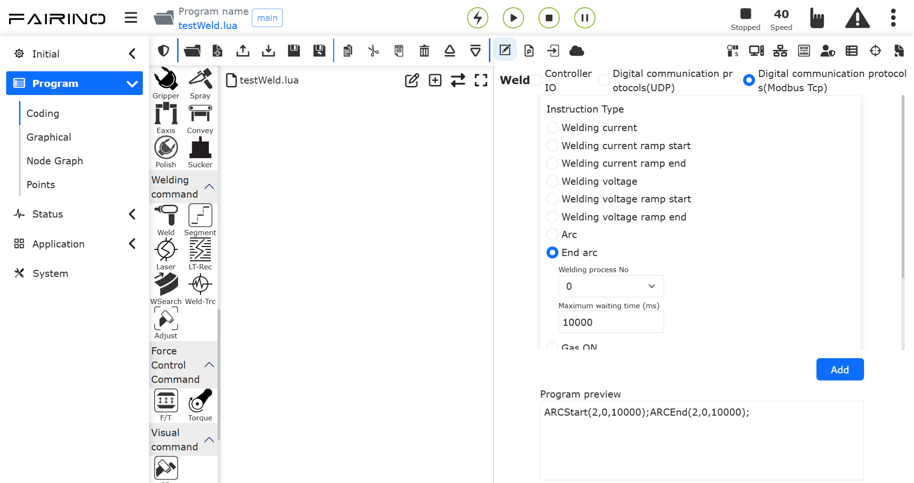

.. centered:: 图表 8.6‑45 添加起弧、收弧指令

此时“testWeld.lua”中即添加起弧、收弧指令完成。

.. figure:: robot_peripherals/058.png
   :align: center
   :width: 4in

.. centered:: 图表 8.6‑46 添加起弧、收弧指令

依次添加完成焊接起始点和焊接终止点。将机器人切换至自动模式，在确保安全的条件下，启动程序，机器人即控制焊机进行一条焊缝的焊接作业。

.. centered:: 图表 8.6‑47 焊接程序

焊机开放协议卸载
****************************

依次点击“初始设置”、“外设”、“控制箱”、“外设开放协议”，在“设备操作及状态”中点击“卸载”按钮。

.. centered:: 图表 8.6‑48 卸载开放协议

此时协议运行状态指示灯熄灭。

.. figure:: robot_peripherals/072.png
   :align: center
   :width: 4in

.. centered:: 图表 8.6‑49 开放协议卸载

此时进行焊接调试或执行焊接程序，机器人在WebApp左下角报出“协议未加载错误”。

.. centered:: 图表 8.6‑50 协议未加载报错

扩展轴配置
-----------------

在“初始设置”->“外设”中，点击“扩展轴”进入扩展轴配置界面，包含扩展轴坐标系配置和扩展轴外设配置。扩展轴配置首次进入界面如下：

.. figure:: robot_peripherals/074.png
   :align: center
   :width: 4in

.. centered:: 图表 8.7‑1 扩展轴配置首次进入界面

目前扩展轴外设配置根据通讯方式分为以下两种：

- 控制器+PLC（UDP通讯）。
  
- 控制器+伺服驱动器（485通讯）。

扩展轴坐标系
~~~~~~~~~~~~~

扩展轴坐标系设置界面中可实现扩展轴坐标的应用、清除和配置。

.. note:: 
   .. image:: robot_peripherals/075.png
      :height: 0.75in
      :align: left

   名称：**应用**
   
   作用：应用扩展轴坐标系
  
.. note:: 
   .. image:: robot_peripherals/076.png
      :height: 0.75in
      :align: left

   名称：**清除**
   
   作用：清除扩展轴坐标系数据

扩展轴坐标系的下拉列表中共有5个编号，从exaxis0~exaxis4，选择对应的坐标系后会在下方显示对应坐标值，选择某一坐标系后点击“应用”按钮，当前使用的扩展轴坐标系变为所选择的坐标，如下图所示。

.. image:: robot_peripherals/077.png
   :width: 4in
   :align: center

.. centered:: 图表 8.7‑2 扩展轴坐标系

选择非“exaxis0”的扩展轴坐标系，点击“配置”进入扩展轴坐标系配置界面，对该编号的扩展轴标系进行重新设置。如下图所示:

.. important::
  - 标定之前先清除需要标定的扩展轴坐标系，并应用此扩展轴坐标系。

  - 选择扩展轴的编号，获取信息可以获取对应扩展轴的驱动器信息，我们可以根据该信息进行参数配置。

.. image:: robot_peripherals/078.png
   :width: 4in
   :align: center

.. centered:: 图表 8.7‑3 扩展轴坐标系标定

当前扩展轴方案如下:

- 0-单自由度直线滑轨

- 1-两自由度L型变位机

- 2-三自由度（暂未开放）

- 3-四自由度（暂未开放）

- 4-单自由度变位机

- 5-两自由度小车

**单自由度直线滑轨**: 先设置DH参数，然后设置机器人相对扩展轴位置，直线导轨为扩展轴上。若不标定，点击保存即可，此时扩展轴只能异步运动。

.. image:: robot_peripherals/079.png
   :width: 4in
   :align: center

.. centered:: 图表 8.7-4 直线滑轨DH参数配置

.. image:: robot_peripherals/080.png
   :width: 4in
   :align: center

.. centered:: 图表 8.7-5 直线滑轨--机器人相对扩展轴位置配置

若需跟机器人同步运动，在扩展轴零点处，点击操作区Eaxis使能扩展轴，将机器人末端中心（应用工具坐标系下用工具末端点）以两个不同姿势对准扩展轴上固定一点，分别设定点1和点2。

.. image:: robot_peripherals/081.png
   :width: 3in
   :align: center

.. image:: robot_peripherals/082.png
   :width: 3in
   :align: center

.. centered:: 图表 8.7‑6 直线滑轨标定点1和2

去除使能，将扩展轴移动一段距离，使能后，同样将机器人末端中心点对准之前固定点，设定点3。去除使能，将扩展轴移至零点，使能扩展轴。将机器人末端中心点移至固定点垂直往上空间一点，设定点4，计算坐标系并保存。

.. image:: robot_peripherals/083.png
   :width: 3in
   :align: center

.. image:: robot_peripherals/084.png
   :width: 3in
   :align: center

.. centered:: 图表 8.7‑7 直线滑轨标定点3和4

**两自由度L型变位机**：变位机由两个扩展轴组成。先设置DH参数，根据图示测量出变位机的DH参数，输入到输入框中。设置机器人相对扩展轴位置，变位机为扩展轴外。若不标定，点击保存即可，此时扩展轴只能异步运动。

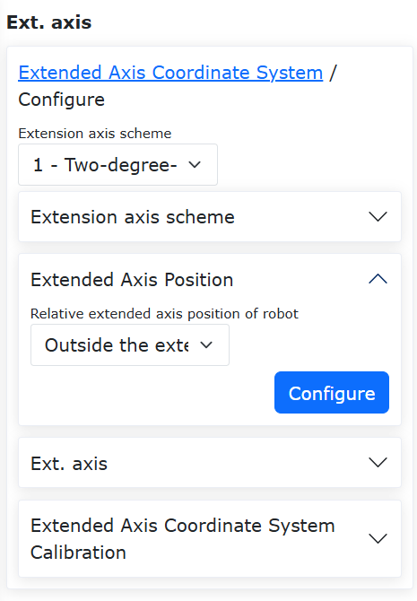

.. centered:: 图表 8.7‑8 两自由度L型变位机DH参数配置

.. image:: robot_peripherals/086.png
   :width: 4in
   :align: center

.. centered:: 图表 8.7‑9 两自由度L型变位机--机器人相对扩展轴位置

若需跟机器人同步运动，在扩展轴零点处，点击操作区Eaxis使能扩展轴，在变位机上建立坐标系，选择一点，输入该点在该坐标系下的笛卡尔位姿，比如选择Y正向一点，测出Y为100mm，则输入如图所示数值，点击参考点，即可设定参考点。后续四个标定点都需将机器人末端中心（应用工具坐标系下用工具末端点）对准该参考点。

.. image:: robot_peripherals/087.png
   :width: 4in
   :align: center

.. centered:: 图表 8.7‑10 两自由度L型变位机--参考点配置

将机器人末端中心（应用工具坐标系下用工具末端点）对准该参考点，设定点1，点击操作区Eaxis点动两个轴一小段距离，将机器人末端中心对准参考点，设定点2，继续点动两个轴，机器人末端中心对准参考点，设定点3，最后继续点动两个轴，将机器人末端中心对准参考点，设定点4，点击计算，得到坐标系结果，点击保存，应用即可。

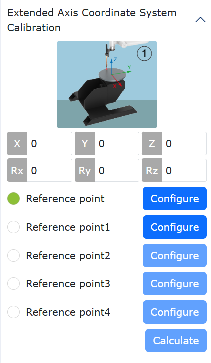

.. image:: robot_peripherals/089.png
   :width: 3in
   :align: center

.. image:: robot_peripherals/090.png
   :width: 3in
   :align: center

.. image:: robot_peripherals/091.png
   :width: 3in
   :align: center

.. centered:: 图表 8.7‑11 两自由度L型变位机标定

**单自由度变位机**：由一个旋转扩展轴组成，DH参数设置为0。设置机器人相对扩展轴位置为扩展轴外。若不标定，点击保存即可，此时扩展轴只能异步运动。

.. image:: robot_peripherals/092.png
   :width: 4in
   :align: center

.. centered:: 图表 8.7‑12 单自由度变位机DH参数配置

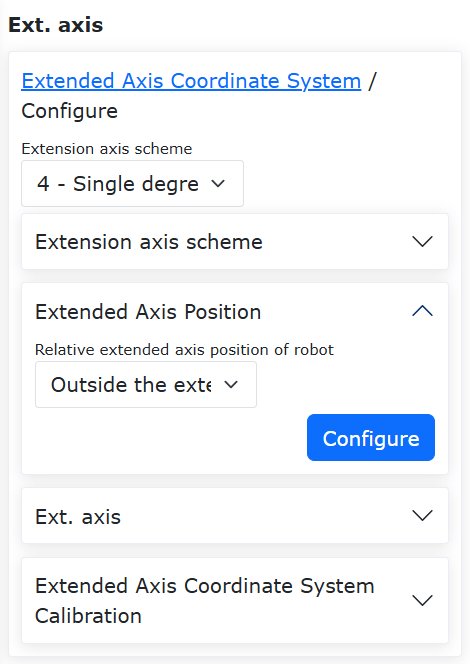

.. centered:: 图表 8.7‑13 单自由度变位机--机器人相对扩展轴位置

若需跟机器人同步运动，在扩展轴零点处，点击操作区Eaxis使能扩展轴，在变位机上建立坐标系，选择一点，输入该点在该坐标系下的笛卡尔位姿，点击“参考点”，即可设定参考点。

.. image:: robot_peripherals/094.png
   :width: 4in
   :align: center

.. centered:: 图表 8.7‑14 单自由度变位机参考的配置

后续四个标定点都需将机器人末端中心（应用工具坐标系下用工具末端点）对准该参考点。将机器人末端中心（应用工具坐标系下用工具末端点）对准该参考点，设定点1，点击操作区Eaxis点动旋转轴一小段距离，将机器人末端中心对准参考点，设定点2，继续点动旋转轴，机器人末端中心对准参考点，设定点3，最后继续点动旋转轴，将机器人末端中心对准参考点，设定点4，点击计算，得到坐标系结果，点击保存，应用即可。

.. image:: robot_peripherals/095.png
   :width: 3in
   :align: center

.. image:: robot_peripherals/096.png
   :width: 3in
   :align: center

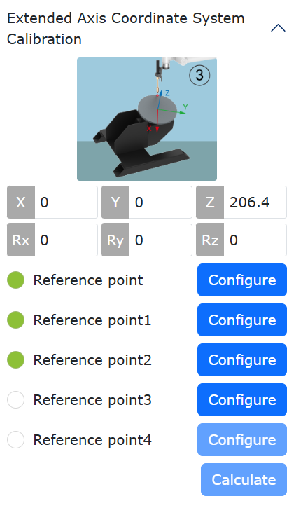

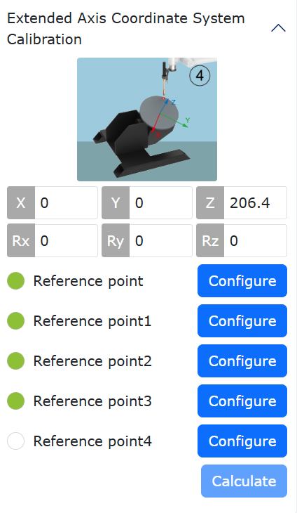

.. centered:: 图表 8.7‑15 单自由度变位机标定

.. important:: 
   1. 扩展轴坐标系是基于工具基础上进行标定的，需要在已建立工具坐标系的基础上进行扩展轴坐标系的建立。
   2. 扩展轴系一般使用exaxis1~ exaxis4，应用exaxis0代表无扩展轴坐标系，在进行扩展轴坐标系标定时，首先需将扩展轴坐标系应用至exaxis0，然后选择其他扩展轴坐标系进行标定及应用。

控制器+PLC（UDP通讯）
~~~~~~~~~~~~~~~~~~~~~~~~~~~~

使用扩展轴UDP通讯方式之前，需要先建立相应的扩展轴标系，在相应的扩展轴坐标系下配置相应的扩展轴方案，并在程序示教时应用建立好的工具坐标系。扩展轴功能主要与焊机功能和激光跟踪传感器功能配合使用。

.. figure:: robot_peripherals/099.png
   :align: center
   :width: 4in

.. centered:: 图表 8.7‑16 扩展轴坐标系应用和当前扩展轴方案显示

当只需要修改当前扩展轴坐标系时，在外设扩展轴配置界面选择坐标系即可应用。当需要更改扩展轴方案时需要进入扩展轴坐标系配置界面修改。

当扩展轴方案为“0-单自由度直线滑轨”、“1-两自由度L型变位机”、“2-三自由度”、“3-四自由度”和“4-单自由度变位机”时，UDP通讯配置成功后显示“UDP扩展轴”和“定位完成时间设置”内容，当扩展轴方案为“5-两自由度小车”时，界面显示“两自由度小车测试”内容。

UDP通讯配置
+++++++++++++++++

.. note:: 
   .. image:: robot_peripherals/100.png
      :height: 0.75in
      :align: left

   名称：**编辑按钮**
   
   作用：UDP通讯参数配置

.. note:: 
   .. image:: robot_peripherals/101.png
      :height: 0.75in
      :align: left

   名称：**加载按钮**
   
   作用：UDP通讯加载

**Step1**：配置扩展轴UDP通讯参数：设置IP地址、端口号、通信周期、丢包检测周期、丢包次数等参数，其中重连周期和重连次数需在通讯中断自动重连开关开启后才可配置。

- IP地址：自定义ip地址；

- 端口号：根据实际情况定义；

- 通讯周期：根据实际情况定义，单位ms；

- 丢包检测通讯周期：10 ~ 1000 ms；

- 丢包次数：1 ~ 100；

- 通讯中断确认时长：0 ~ 500 ms；

- 断电重启自动重连：开/关；

- 通讯中断自动重连：开/关；

- 重连周期：1 ~ 1000 ms；

- 重连次数：1 ~ 100；

.. figure:: robot_peripherals/102.png
   :align: center
   :width: 4in

.. centered:: 图表 8.7‑17 扩展轴UDP通讯参数配置

.. important:: 
  1. 设置通讯断开确认时长后，当通讯异常超出该时长时才确认通讯断开并报错；
  2. UDP通讯断开后，触发UDP断开报错(可复位)，可点击清除警告信息按钮，UDP通讯再次建立。

**Step2**：通讯参数配置成功后，点击“加载”按钮，建立UDP通讯，通讯成功后“UDP通讯配置”前方按钮变绿，机器人各类状态中的扩展轴状态查看扩展轴已经伺服到位。

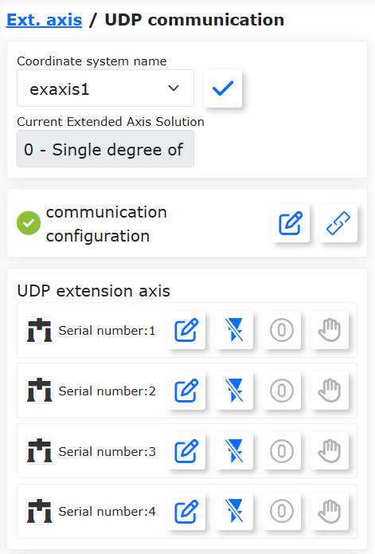

.. centered:: 图表 8.7‑18 扩展轴UDP建立通讯

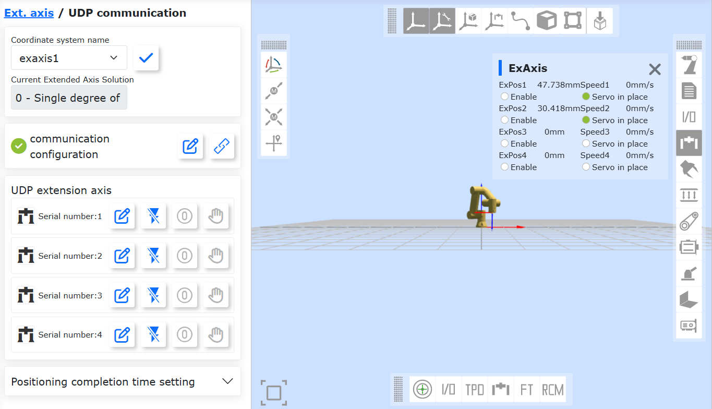

.. centered:: 图表 8.7‑19 扩展轴伺服到位

.. important:: 
  1. UDP通讯未建立连接时，无法配置和查看UDP扩展轴编号信息；
  2. 在进行扩展轴UDP通讯加载之前务必先进行除序号0以外扩展轴坐标系的配置和应用。

UDP扩展轴
+++++++++++++

.. note:: 
   .. image:: robot_peripherals/100.png
      :height: 0.75in
      :align: left

   名称：**编辑按钮**
   
   作用：扩展轴参数配置

.. note:: 
   .. image:: robot_peripherals/105.png
      :height: 0.75in
      :align: left

   名称：**使能按钮**
   
   作用：扩展轴使能状态，点击按钮扩展轴去使能

.. note:: 
   .. image:: robot_peripherals/106.png
      :height: 0.75in
      :align: left

   名称：**去使能按钮**
   
   作用：扩展轴去使能状态，点击按钮扩展轴使能

.. note:: 
   .. image:: robot_peripherals/107.png
      :height: 0.75in
      :align: left

   名称：**回零按钮**
   
   作用：扩展轴回零方式设置

.. note:: 
   .. image:: robot_peripherals/108.png
      :height: 0.75in
      :align: left

   名称：**测试按钮**
   
   作用：扩展轴功能测试

**Step1**：选择任意扩展轴编号（目前只有编号1、2、3、4），点击扩展轴编号后方的“编辑”按钮进入详细配置界面。设置轴类型、轴方向、运行速度、加速度、正方向限位、反方向限位、导程、编码器分辨率、起点偏置、厂家、型号和模式，点击配置即可配置完成。

- 轴类型：直线导轨、旋转轴和无限旋转轴；

- 轴方向：正/负；

- 运行速度：0~2000mm/s；

- 加速度：0 ~ 2000 mm/s²；

- 正方向限位：0 ~ 50000；

- 反方向限位：-50000 ~ 0；

- 导程：0~1000；

- 编码器分辨率：0 ~ 10000000；

- 起点偏置：0 ~ 10000mm；

- 厂家：禾川、汇川和松下；

- 型号：根据厂家自动匹配型号列表；

- 模式：增量系统和绝对位置系统；

.. figure:: robot_peripherals/109.png
   :align: center
   :width: 4in

.. centered:: 图表 8.7‑20 扩展轴参数配置

**Step2**：扩展轴参数配置完成后，点击“去使能”按钮，将对应扩展轴编号使能，使能成功后即可设置回零方式和扩展轴测试，当扩展轴未使能时无法进行回零方式设置和扩展轴测试。

.. figure:: robot_peripherals/110.png
   :align: center
   :width: 4in

.. centered:: 图表 8.7‑21 扩展轴使能/去使能

**Step3**：扩展轴未使能成功无法进入设置界面，按钮置灰；扩展轴使能成功后，点击“回零”按钮进入回零方式设置界面。设置回零方式、寻零速度和零点箍位速度，点击“设置”按钮，扩展轴开始回零，回零状态会显示在轴方向下方空白处，当出现“回零已完成”提示表明扩展轴零点设置成功。

- 回零方式：当前位置回零、负限位回零和正限位回零；

- 寻零速度：0~2000mm/s；

- 零点箍位速度：0~2000mm/s；

.. figure:: robot_peripherals/111.png
   :align: center
   :width: 4in

.. centered:: 图表 8.7‑22 回零方式设置

**Step4**：扩展轴未使能成功无法进入设置界面，按钮置灰；扩展轴使能成功且回零方式设置完成后，点击“测试”按钮进入扩展轴测试界面。设置运行速度、加速度和最大距离，进行正向转动和反向转动测试扩展轴，同时在转动过程中可以点击“停止”按钮测试扩展轴是否可以正常停止。

.. figure:: robot_peripherals/112.png
   :align: center
   :width: 4in

.. centered:: 图表 8.7‑23 扩展轴测试

**Step5**：扩展轴通常于激光传感器配合使用，此时激光传感器通常采用外部安装方式，传感器参考点配置需要采用三点法标定，而不是之前使用的六点法标定。将工具中心对准右侧横截面底部中间点（靠近相机那一侧）设定点1，将工具中心点对准另一截面即左侧横截面底部中间点，设定点2，将工具中心点移至传感器右侧横截面上边缘中间点，设定点3，计算并保存，点击应用完成三点法标定。

.. figure:: robot_peripherals/113.png
   :align: center
   :width: 6in

.. centered:: 图表 8.7‑24 传感器三点法标定

**Step6**：在“示教程序”->“程序编程”界面选择外设指令的“扩展轴”命令。根据具体的程序示教需求，在相应的地方添加指令。

.. figure:: robot_peripherals/114.png
   :align: center
   :width: 6in

.. centered:: 图表 8.7‑25 扩展轴指令编辑

扩展轴配合激光跟踪焊接示教程序
+++++++++++++++++++++++++++++++

.. list-table::
   :widths: 50 80 80
   :header-rows: 0
   :align: center

   * - **序号**
     - **指令格式**
     - **注释**

   * - 1
     - EXT_AXIS_PTP(1,1laserstart)
     - #外部轴运动激光传感器起始点

   * - 2
     - PTP(laserstart,10,-1,0)
     - #机器人运动激光传感器起始点

   * - 3
     - LTSearchStart(3,20,10,10000)
     - #开始寻位

   * - 4
     - LTSearchStop()
     - #停止寻位

   * - 5
     - EXT_AXIS_PTP(1,1,seamPos)
     - #外部轴运动焊缝起点

   * - 6
     - Lin(seamPos,20,-1,00,0)
     - #机器人运动焊缝起点

   * - 7
     - LTTrackOn()
     - #激光跟踪

   * - 8
     - ARCStart(0,10000)
     - #焊机起弧

   * - 9
     - EXT_AXIS_PTP(1,1,laserend)
     - #外部轴运动焊缝终点

   * - 10
     - Lin( laserend,10,-1,0,0)
     - #机器人运动焊缝终点

   * - 11
     - ARCEnd(0,10000)
     - #焊机收弧

   * - 12
     - LTTrackOff
     - #激光跟踪关闭

定位完成时间
++++++++++++++++

当扩展轴建立UDP通讯后，输入时间，点击“配置”按钮即可完成设置。该配置项用于监听扩展轴运动停止的时间。

.. figure:: robot_peripherals/115.png
   :align: center
   :width: 4in

.. centered:: 图表 8.7‑26 定位完成时间配置

两自由度小车测试
~~~~~~~~~~~~~~~~~~~~~~

在扩展轴坐标系配置扩展轴方案为“5-两自由度小车”时，进入UDP通讯界面后显示该内容，否则无法查看。

.. centered:: 图表 8.7‑27 扩展轴方案为“5-两自由度小车”界面

.. important:: 两自由度小车默认应用扩展轴编号1和2，UDP通讯成功后通过机器人	各类状态中的扩展轴状态查看扩展轴1和2伺服到位。

.. figure:: robot_peripherals/117.png
   :align: center
   :width: 6in

.. centered:: 图表 8.7‑28 两自由度小车扩展轴伺服到位

.. note:: 
   .. image:: robot_peripherals/105.png
      :height: 0.75in
      :align: left

   名称：**使能按钮**
   
   作用：扩展轴使能状态，点击按钮扩展轴去使能

.. note:: 
   .. image:: robot_peripherals/106.png
      :height: 0.75in
      :align: left

   名称：**去使能按钮**
   
   作用：扩展轴去使能状态，点击按钮扩展轴使能

.. note:: 
   .. image:: robot_peripherals/107.png
      :height: 0.75in
      :align: left

   名称：**回零按钮**
   
   作用：扩展轴当前位置回零

.. note:: 
   .. image:: robot_peripherals/108.png
      :height: 0.75in
      :align: left

   名称：**测试按钮**
   
   作用：两自由度小车功能测试

**Step1**：UDP通讯成功后，点击“去使能”按钮，将两自由度小车对应扩展轴使能，通过机器人各类状态中的扩展轴状态查看扩展轴1和2伺服使能。

.. figure:: robot_peripherals/118.png
   :align: center
   :width: 6in

.. centered:: 图表 8.7‑29 两自由度小车扩展轴使能

**Step2**：扩展轴使能成功后，点击“回零”按钮，设置扩展轴当前位置回零，回零成功后测试按钮高亮，反之置灰。

.. figure:: robot_peripherals/119.png
   :align: center
   :width: 6in

.. centered:: 图表 8.7‑30 两自由度小车当前位置回零成功

**Step3**：两自由度小车当前位置回零成功后，点击“测试”按钮进入界面，选择运动方式，输入参数进行运动测试，在运动过程中点击“停止”按钮测试停止功能。

- 运动方式：直线/圆弧；

- 距离：-5000~5000mm（直线运动方式）；

- 半径：1~5000mm（直线运动方式）；

- 角度：-360~360°（圆弧运动方式）；

- 速度：1~100%

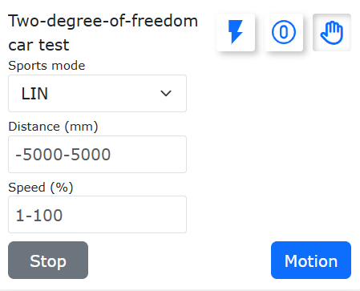

.. figure:: robot_peripherals/121.png
   :align: center
   :width: 4in

.. centered:: 图表 8.7‑31 两自由度小车测试

控制器+伺服驱动器（485通讯）
~~~~~~~~~~~~~~~~~~~~~~~~~~~~~~~~~~

硬件接线
+++++++++++

使用RS485通信控制伺服扩展轴前，请先将伺服驱动器的RS485通信接口与机器人控制箱上的RS485通信接口建立连接。法奥机器人易制造控制箱电气接口示意图如下：

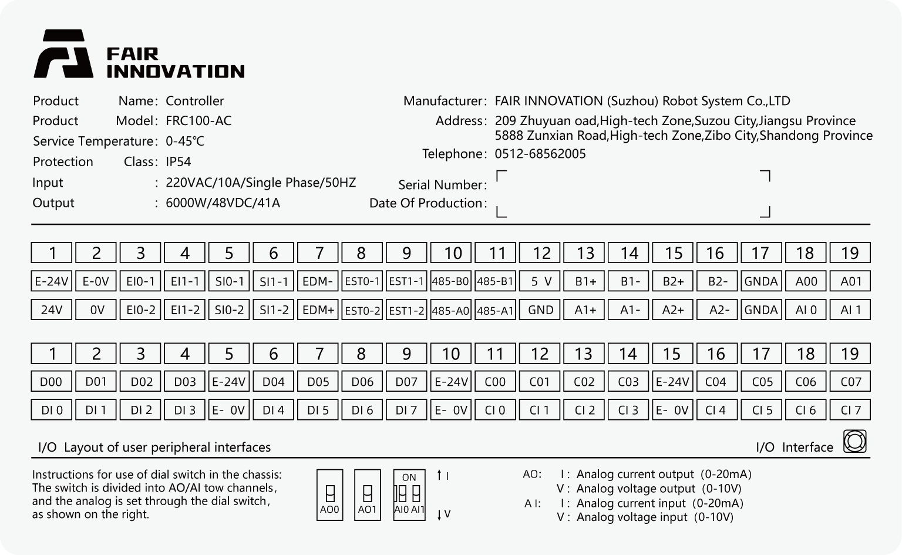

.. centered:: 图表 8.7‑32 法奥机器人mini控制箱电气接口示意图

以戴纳泰克伺服驱动器FD100-750C型号为例，参考改驱动器面板端子示意图和FD100-750C的X3A-IN端子定义，当机器人配置与FD100-750C伺服扩展轴通信时，需要将控制箱上的485-A0端子、485-B0端子分别与驱动器X3A-IN端子的4号和5号引脚连接。（请注意：您可以在伺服驱动器面板上看到一个“485”标志的插线端子，该端子暂未开放用户使用，请勿将您的RS485通信线缆连接到此端子上）。同时，若连接多个伺服驱动器，且该驱动器为链路的最后一个，需要将面板上的RS485通信中断电阻拨码开关（2号拨码）打开。

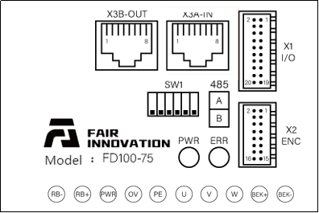

.. centered:: 图表 8.7‑33 FD100-750C驱动器面板

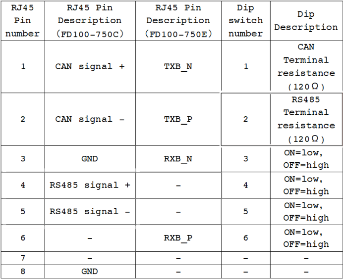

.. centered:: 图表 8.7‑34 FD100-750C的X3A-IN端子定义

通信配置
++++++++++++++

确保您的RS485通信线缆正确连接且机器人和伺服扩展轴都正常上电后，打开机器人WebApp。

点击组合方式为“控制器 + 伺服驱动器”的图片进入详细配置界面。在伺服驱动器配置中，选择编号为“1”（请注意：当连接多个伺服时，此编号用于区分不同的伺服，后面我们会多次提到该编号），厂商为“戴纳泰克”，选择相应的伺服驱动器型号，此处型号为“FD00-750C”，软件版本为V1.0，填写伺服驱动器对应的分辨率，此处为131072，根据您的机构模型填写机械传动比，此处为15.45，点击“配置”按钮。

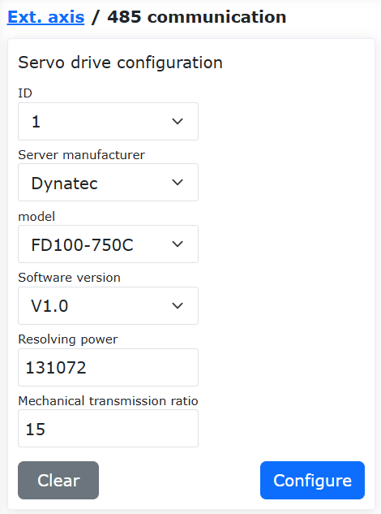

.. centered:: 图表 8.7‑35 伺服驱动器配置

至此我们已经完成机器人与伺服驱动器的485通讯配置，您可以在WebApp中右侧的“伺服状态栏”中查看伺服的实时状态信息。如下图所示：

.. figure:: robot_peripherals/126.png
   :align: center
   :width: 4in

.. centered:: 图表 8.7‑36 伺服状态栏

现在您需要按顺序对扩展轴设备进行使能和回零方式设置后，即可进行一定的运动测试，请在确保安全的前提下跟着本手册做如下测试操作。

已配置伺服驱动器
++++++++++++++++++++++

.. note:: 
   .. image:: robot_peripherals/127.png
      :height: 0.75in
      :align: left

   名称：**查看按钮**
   
   作用：点击查看伺服驱动器配置信息

.. note:: 
   .. image:: robot_peripherals/105.png
      :height: 0.75in
      :align: left

   名称：**使能按钮**
   
   作用：伺服驱动器使能状态，点击按钮伺服驱动器去使能

.. note:: 
   .. image:: robot_peripherals/106.png
      :height: 0.75in
      :align: left

   名称：**去使能按钮**
   
   作用：伺服驱动器去使能状态，点击按钮伺服驱动器使

.. note:: 
   .. image:: robot_peripherals/107.png
      :height: 0.75in
      :align: left

   名称：**回零按钮**
   
   作用：伺服驱动器回零方式设置

.. note:: 
   .. image:: robot_peripherals/108.png
      :height: 0.75in
      :align: left

   名称：**测试按钮**
   
   作用：伺服驱动器测试

.. note:: 
   .. image:: robot_peripherals/128.png
      :height: 0.75in
      :align: left

   名称：**伺服错误清除按钮**
   
   作用：伺服驱动器提示错误时，点击清除

伺服控制模式与使能
********************

在“已配置伺服驱动器”中，选择控制模式为“位置模式”，选择对应的伺服编号，点击“去使能”按钮，此时会先设置伺服驱动器编号，设置成功后设置控制模式，控制模式设置成功后将伺服驱动器使能（请注意：切换控制模式后，需要先将伺服驱动器去除使能，再将伺服驱动器使能，伺服的控制模式切换才会生效，伺服使能成功后将切换控制模式将禁用）。

.. figure:: robot_peripherals/129.png
   :align: center
   :width: 4in

.. centered:: 图表 8.7‑37 伺服控制模式与使能 

伺服使能成功后查看机器人各类状态栏中的“Servo”中可观察到对“伺服使能”状态灯亮起，表示伺服驱动器已经使能。点击“使能”状态按钮，将伺服驱动器去使能，“伺服使能”状态灯熄灭。

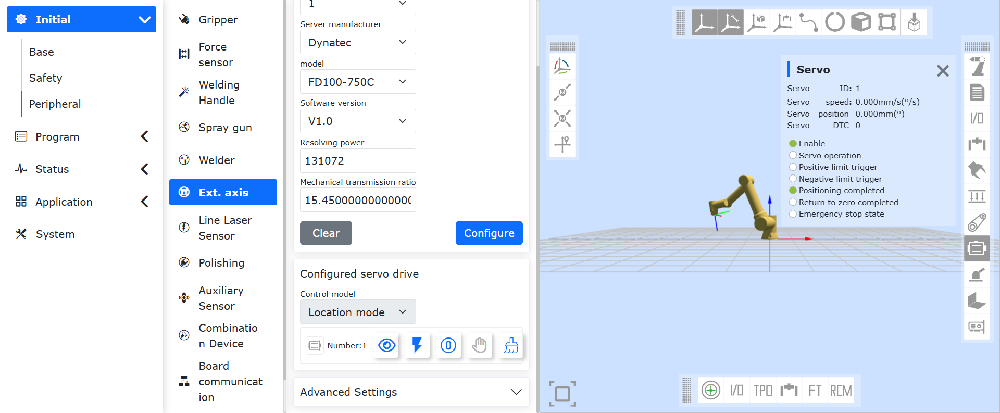

.. centered:: 图表 8.7‑38 伺服驱动器状态栏 

伺服回零
****************

伺服驱动器使能成功后，“回零”按钮高亮，点击按钮进入设置界面。选择回零模式为“当前位置回零”，回零速度为5mm/s，零点箍位速度为1mm/s；点击“设置”按钮，即完成了伺服当前位置回零操作，在机器人各类状态栏中的“Servo”中，可观察到当前的“伺服位置”为0；（请您完全阅读本手册后，再将回零模式选择为“负限位回零”或“正限位回零”进行回零测试）。

.. figure:: robot_peripherals/131.png
   :align: center
   :width: 6in

.. centered:: 图表 8.7‑39 伺服回零

伺服运动
***************

在实际控制伺服电机运动前，请先了解伺服电机的“位置模式”和“速度模式”，再次提醒您：

**位置模式**：您可以输入一定的运动速度和目标位置参数，伺服将以设置的速度运动到目标位置，运动到目标位置后，伺服将停止运动。

**速度模式**：您可以输入一定的目标速度，伺服将按照您设置的目标速度一直运动，直至您将目标速度设置为0或将伺服电机下使能；

当切换控制模式时，“当前控制模式”显示会自动切换（请注意：切换控制模式后，需要先将伺服去除使能，再将伺服使能，伺服的控制模式切换才会生效）。若目前您的伺服未处于“位置模式”，请将您的伺服切换至位置模式。输入“目标位置”为50mm，运行速度为5mm/s，在确认安全的条件下，点击“设置”按钮，此时伺服电机将按照您设置的参数运动，您可以在机器人各类状态栏中的“Servo”中实时观察伺服的位置和速度等。

.. figure:: robot_peripherals/132.png
   :align: center
   :width: 4in

.. centered:: 图表 8.7‑40 伺服运动调试（位置模式）

将伺服的控制模式改为“速度模式”，点击“使能”状态按钮将伺服驱动器去使能，再点击“去使能”状态按钮，此时伺服切换为速度模式（请注意：当伺服电机运动后，只能通过将目标速度设置为0使伺服电机停止）。输入目标速度为5mm/s，点击“设置”按钮，伺服电机将以5mm/s的速度保持运动，同样您可以在机器人各类状态栏中的“Servo”中实时观察伺服的位置和速度等。

.. figure:: robot_peripherals/133.png
   :align: center
   :width: 4in

.. centered:: 图表 8.7‑41 伺服运动调试（速度模式）

高级设置
++++++++++++++

若机器人发生碰撞、按下急停等紧急情况下扩展轴能触发急停，并按照设定的急停减速度停止运动，碰撞报警恢复后能继续下发指令使扩展轴恢复运行。需要在高级设置中，设置伺服加减速度和伺服急停加减速，如下图所示：

.. figure:: robot_peripherals/134.png
   :align: center
   :width: 4in

.. centered:: 图表 8.7‑42 高级设置

扩展轴编程
++++++++++++++

在“示教程序”->“程序编程”中新建一个用户程序“testServo.lua”，选择“外设指令”。

.. figure:: robot_peripherals/135.png
   :align: center
   :width: 6in

.. centered:: 图表 8.7‑43 打开外设指令

点击“扩展轴”，打开添加扩展轴指令界面。选择组合方式为“控制器 + 伺服驱动器(485)”，将控制模式设为“位置模式”，点击右侧的“添加”按钮。将添加扩展轴指令界面翻到底部，点击“应用”按钮。

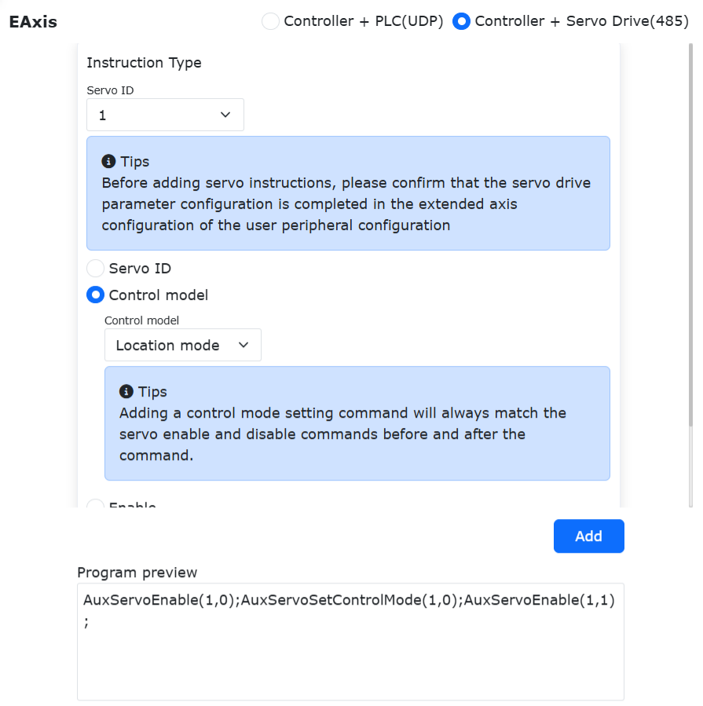

.. centered:: 图表 8.7‑44 设置扩展轴的控制模式

此时“testServo.lua”程序中即出现一组切换伺服控制模式的指令，您可以将机器人切换到自动模式，并执行该程序。

.. figure:: robot_peripherals/137.png
   :align: center
   :width: 6in

.. centered:: 图表 8.7‑45 设置伺服控制模式程序

如何通过用户程序控制伺服运动？同样打开添加扩展轴指令界面，如下图所示，找到参数配置栏，以位置模式为例，输入目标位置和运行速度，点击“添加”按钮；将添加扩展轴指令界面翻到底部，点击“应用”按钮，并关闭添加扩展轴指令界面。

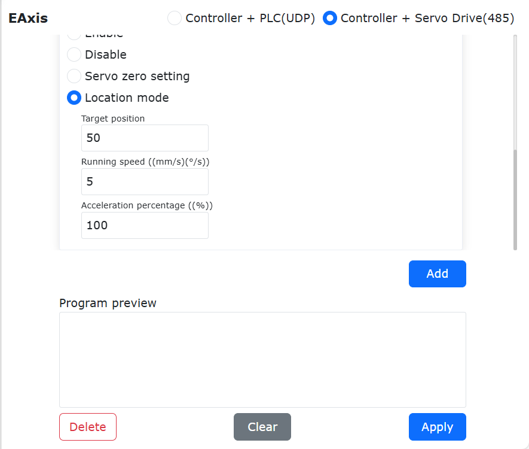

.. centered:: 图表 8.7‑46 增加位置模式运动指令

“testServo.lua”程序中增加伺服运动指令：“AuxServoSetTargetPos(1,50,5)”。指令函数中的三个参数含义分别为：

- 1：伺服编号为1。

- 50：目标位置。

- 5：目标速度。

.. figure:: robot_peripherals/139.png
   :align: center
   :width: 6in

.. centered:: 图表 8.7‑47 位置模式伺服运动程序

将机器人切换到自动模式，运行该程序，此时您的伺服将以5mm/s的速度运动到50mm的位置。

至此，我们已经完成RS485控制伺服扩展轴的初步配置和测试，您可以根据实际情况编写机器人运动与伺服运动组合的程序，如下图一个示例程序。

扩展轴与机械人协同运动程序示例
*******************************

.. list-table::
   :widths: 50 80 80
   :header-rows: 0
   :align: center

   * - **序号**
     - **指令格式**
     - **注释**

   * - 1
     - AuxServoSetTargetPos(1,50,5)
     - #扩展轴运动到复位点

   * - 2
     - if(GetDI(8,0) == 1) then
     - #如果CI0输入有效

   * - 3
     - AuxServoSetTargetPos(1,50,5)
     - #扩展轴运动到50mm

   * - 4
     - PTP(testptp1,100,-1,0)
     - #机器人运动到testptp1点

   * - 5
     - elseif(GetDI(9,0) == 1) then
     - #如果CI1输入有效

   * - 6
     - AuxServoSetTargetPos(1,150,5)
     - #扩展轴运动到150mm

   * - 7
     - PTP(testptp2,100,-1,0)
     - #机器人运动到testptp2点

   * - 8
     - else
     - #若CI0和CI1输入均无效

   * - 9
     - AuxServoSetTargetPos(1,300,5)
     - #扩展轴运动到300mm

   * - 10
     - PTP(testptp3,100,-1,0)
     - #机器人运动到testptp3点

   * - 11
     - end
     - #结束

总结
+++++++++

综上所述，配置协作机器人与伺服扩展轴RS485通讯有以下注意要点：

1. 正确连接协作机器人与伺服驱动器的RS485通信线缆；

2. 正确选择伺服扩展轴的控制模式；

3. 切换控制模式后，必须先去除使能，再伺服使能，控制模式切换才能生效。

线激光传感器
---------------

法奥协作机器人与激光传感器配合使用，通过传感器识别焊缝等特征位置以达到简化编程、提高生产效率的目的。协作机器人可适配睿牛、创想和全视三种厂商的激光传感器，使用不同传感器时只需要加载对应的通信协议即可。

硬件接线
~~~~~~~~~~~~~

使用激光传感器前需要将激光传感器安装于合适位置，将激光传感器的网线直接连接或通过交换机连接到机器人控制箱的任一RJ45接口。

传感器配置
~~~~~~~~~~~~~

请确保您的激光传感器和焊枪已经固定安装于机器人末端，激光传感器已经与机器人控制箱通过网线连接，并且激光传感器与机器人控制箱的IP地址处于同一网段，打开机器人和传感器电源，下图为睿牛激光传感器安装。

.. figure:: robot_peripherals/140.png
   :align: center
   :width: 4in

.. centered:: 图表 8.8‑1 激光传感器安装

在通信配置栏中输入传感器的IP地址、端口号，点击“配置”按钮，采样周期默认为25，坐标系选择“激光平面坐标系”，根据您的传感器型号选择对应的通信协议，点击“加载”按钮。

.. figure:: robot_peripherals/141.png
   :align: center
   :width: 4in

.. centered:: 图表 8.8‑2 激光传感器配置

在“跟踪传感器测试”栏，依次点击“打开”和“关闭”传感器，观察传感器的激光是否打开或关闭，若激光正常打开或关闭则表示机器人与传感器已经正常建立通信，否则请检查IP地址和端口号等参数是否正确，以及传感器与机器人网络连接是否正确。

.. figure:: robot_peripherals/142.png
   :align: center
   :width: 4in

.. centered:: 图表 8.8‑3 激光传感器通讯测试

传感器标定
~~~~~~~~~~~~

在使用激光传感器前需要先对激光传感器进行标定，标定精度直接影响激光传感器的跟踪精度。激光传感器的标定方法有五点法、六点法和八点法，以焊接应用场景下最常用的五点法为例，其标定原理为先通过工具（焊枪）指向一个固定标定点（如图4），再通过激光传感器从四个不同的姿态照射并识别到该点。

.. note::
  该标定点必须可以被激光传感器准确识别到，否则无法精确标定。 

进而计算出传感器坐标位姿，下面详细介绍其标定过程：

.. figure:: robot_peripherals/143.png
   :align: center
   :width: 4in

.. centered:: 图表 8.8‑4 激光传感器标定点

**step1**：打开机器人WebApp，依次点击“初始设置”->“基础”->“工具坐标”进入工具坐标系界面。选择一个未使用的工具坐标系，点击修改其名称为“焊枪”，工具类型为“工具”，安装位置为“末端”。

.. figure:: robot_peripherals/144.png
   :align: center
   :width: 4in

.. centered:: 图表 8.8‑5 设置“焊枪”坐标系

再次选择一个未使用的坐标系，将其名称修改为“激光传感器”，选择工具类型为“传感器”，安装位置为“末端”。

.. figure:: robot_peripherals/145.png
   :align: center
   :width: 4in

.. centered:: 图表 8.8‑6 设置“激光传感器”坐标系

**step2**：用六点法对焊枪的工具坐标系进行标定：选则“焊枪”坐标系，点击修改按钮，使用六点法进行焊枪工具坐标系的标定（具体标定方法参照法奥文档，本文不做赘述）。

.. figure:: robot_peripherals/146.png
   :align: center
   :width: 4in

.. centered:: 图表 8.8‑7 “焊枪”坐标系标定

**step3**：在“工具坐标系设置”中选择0号坐标系(基座标系)，默认名称为“toolcoord0”，点击“应用”，将当前的坐标系切换为基座标系。

.. figure:: robot_peripherals/147.png
   :align: center
   :width: 4in

.. centered:: 图表 8.8‑8 传感器标定步骤1

**step4**：再次选择之前设置的“激光传感器”坐标系(不点击“应用”)，点击“编辑”按钮，选择工具类型为“传感器”，传感器固定在“机器人末端”，标定方法选择“五点法”。

.. figure:: robot_peripherals/148.png
   :align: center
   :width: 4in

.. centered:: 图表 8.8‑9 传感器标定步骤2

**step5**：拖动机器人使焊枪尖端对准标定点，选择“焊枪”坐标系，点击“应用”，点击“设置点1”，如图13。

.. figure:: robot_peripherals/149.png
   :align: center
   :width: 4in

.. centered:: 图表 8.8‑10 传感器标定步骤3

.. figure:: robot_peripherals/150.png
   :align: center
   :width: 4in

.. centered:: 图表 8.8‑11 传感器标定步骤4

**step6**：再次选择0号坐标系（“toolcoord0”）；然后选择“传感器”坐标系（不点击“应用”），即可继续进行标定。

.. figure:: robot_peripherals/147.png
   :align: center
   :width: 4in

.. centered:: 图表 8.8‑12 传感器标定步骤5

.. figure:: robot_peripherals/145.png
   :align: center
   :width: 4in

.. centered:: 图表 8.8‑13 传感器标定步骤6

**step7**：移动激光传感器位置，使激光刚好扫描到标定点，点击“设置点2”；此时左侧的传感器输出值对应序号位置会显示当前的传感器数据，若数据正常则表示当前标定点成功，否则需要重新标定。

.. figure:: robot_peripherals/151.png
   :align: center
   :width: 4in

.. centered:: 图表 8.8‑14 传感器标定步骤7

.. figure:: robot_peripherals/152.png
   :align: center
   :width: 4in

.. centered:: 图表 8.8‑15 传感器标定步骤8

**step8**：依次使激光再从三个不同的姿态照射标定点，并分别点击“设置点3”、“设置点4”和“设置点5”，最后在确保每个点的数据都正常的情况下，点击“计算”按钮。

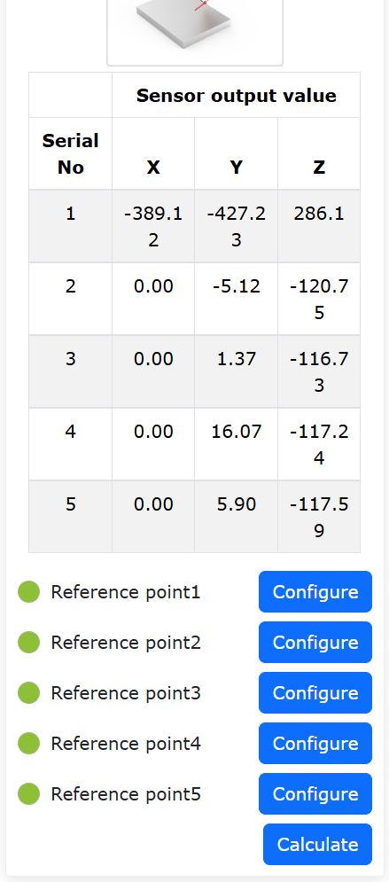

.. centered:: 图表 8.8‑16 传感器标定步骤9

**step9**：此时WebApp上显示传感器的标定结果和标定精度，点击“应用”按钮，即完成了激光传感器的标定。若标定精度过差，则可以选择点击“取消”按钮，并重新进行标定。

.. figure:: robot_peripherals/154.png
   :align: center
   :width: 4in

.. centered:: 图表 8.8‑17 传感器标定精度

激光传感器应用
~~~~~~~~~~~~~~~~

使用激光传感器前，先将“焊枪”工具坐标系应用到当前工具坐标系。

.. figure:: robot_peripherals/144.png
   :align: center
   :width: 4in

.. centered:: 图表 8.8‑18 应用焊枪坐标系

激光传感器示教点
++++++++++++++++++

拖动机器人使激光传感器光线指向想要示教的焊缝点。在WebApp选择传感器为“激光传感器”，输入传感器点名称为“laserPt”，点击“添加”按钮。新建用户程序“testLaser.lua”，创建运动指令PTP，目标点选择“laserPt”，单步执行该指令，此时焊枪将运动到之前激光传感器的指向点。

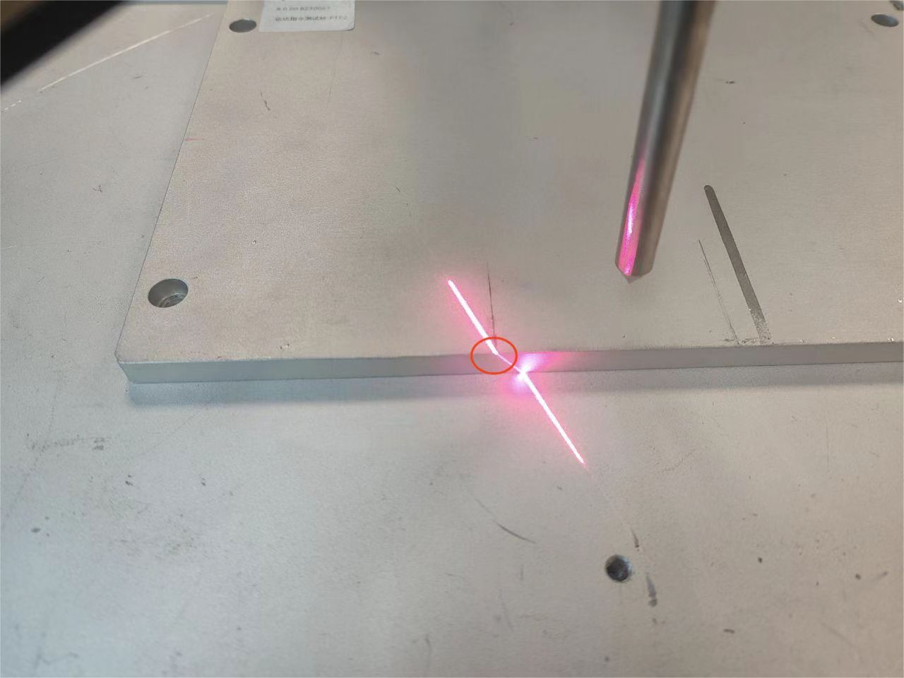

.. centered:: 图表 8.8‑19 激光传感焊缝点

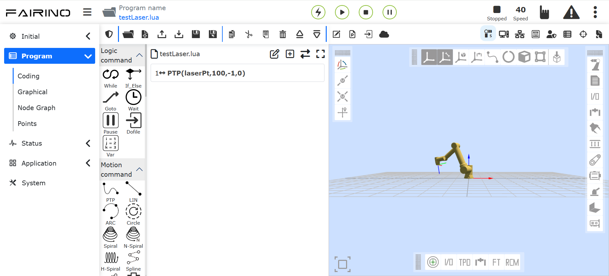

.. centered:: 图表 8.8‑20 示教传感器点

.. figure:: robot_peripherals/157.png
   :align: center
   :width: 4in

.. centered:: 图表 8.8‑21 焊枪指向焊缝点

激光寻位 + 跟踪
++++++++++++++++

协作机器人与激光传感器配合完成激光寻位 + 激光跟踪功能共需要一下几步：

(1) 机器人运动到焊缝外部的某一点；

(2) 开始激光寻位，且机器人携带激光传感器向焊缝位置移动；

(3) 激光传感器识别到焊缝，机器人带动焊枪运动到焊缝识别点；

(4) 激光跟踪开始，同时机器人向焊缝终点运动，激光传感器在运动过程中实时记录位置；

(5) 焊枪沿激光传感器记录的位置进行运动，实现跟踪效果。

在寻位跟踪调试前，请先确保传感器已经正确安装、“焊枪”工具坐标系已经正确标定，激光传感器也已经正确标定完成。假设图中绿色直线为待焊焊缝，使机器人实现自动寻找焊接起点A点，并自动焊接至B点，需要进行如下指令编写：

.. figure:: robot_peripherals/158.png
   :align: center
   :width: 4in

.. centered:: 图表 8.8‑22 传感器安装

编写寻位指令
*************

新建用户程序“laserTrack.lua”，选择“焊接指令”。点击“激光跟踪”，弹出激光跟踪指令添加页面。

.. figure:: robot_peripherals/159.png
   :align: center
   :width: 6in

.. centered:: 图表 8.8‑23 激光跟踪指令

找到“寻位命令”，选择坐标系名称为“激光传感器”，方向选择“+x”表示机器人携带激光传感器从当前位置沿“焊枪”坐标系的“+x”方向边运动边搜寻焊缝，“速度”为激光传感器寻位的移动速度，长度为激光传感器的最大寻位长度，当机器人寻位距离超出该长度仍未寻找到焊缝时机器人将报错，最大寻位时间与长度类似，超出该时间仍未找到焊缝时机器人报错。请您根据实际场景正确输入上述相关参数。依次点击“寻位开始”和“寻位结束”指令，并点击“应用”按钮。

.. figure:: robot_peripherals/160.png
   :align: center
   :width: 6in

.. centered:: 图表 8.8‑24 添加寻位指令

此时“laserTrack.lua”中将增加对应的激光寻位开始和结束的指令。

.. figure:: robot_peripherals/161.png
   :align: center
   :width: 6in

.. centered:: 图表 8.8‑25 寻位程序

编写运动到寻位点指令
*********************

添加点到点运动LIN指令，目标点为“seamPos”即激光传感器寻位点。

.. note:: “seamPos点为机器人系统内部专用于激光传感器寻位的点位名称，不需要示教该点，激光传感器寻位后会自动将寻位点信息存入“seamPos点中”。

寻位点可以设置偏移，偏移类型可选择“基座标系偏移”、“工具坐标系偏移”和“激光原始数据偏移”。

.. figure:: robot_peripherals/162.png
   :align: center
   :width: 6in

.. centered:: 图表 8.8‑26 寻位偏移选项

当启用寻位偏移功能时，可设置偏移参数，“dx”表示沿所选坐标系x方向的偏移距离，“drx”表示沿所选坐标系x轴旋转的角度。点击“添加”按钮，点击“应用”按钮。

.. figure:: robot_peripherals/163.png
   :align: center
   :width: 6in

.. centered:: 图表 8.8‑27 寻位偏移参数设置

此时“testTrack.lua”中将增加运动到寻位点的指令，如图32。

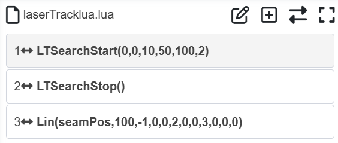

.. centered:: 图表 8.8‑28 寻位偏移程序

编写激光跟踪指令
******************

再次打开“激光跟踪”指令添加页面，依次点击“开始跟踪”和“停止跟踪”按钮，最后点击页面最下面的“应用”按钮。

.. figure:: robot_peripherals/165.png
   :align: center
   :width: 6in

.. centered:: 图表 8.8‑29 激光跟踪开始与停止

此时的用户程序“testTrack.lua”：

.. figure:: robot_peripherals/166.png
   :align: center
   :width: 6in

.. centered:: 图表 8.8‑30 激光跟踪程序

编写寻位开始点和跟踪终点指令
*****************************

在激光寻位开始前，需要先指定一个寻位起始点，机器人先运动到寻位起始点，然后再沿一定的方向和速度进行寻位。在激光传感器光线靠近焊缝起点A点附近示教寻位开始点“seamStartPt”，注意匹配寻位起始点与寻位方向，保证机器人能在设定的距离和最大寻位时间内找到焊缝位置。

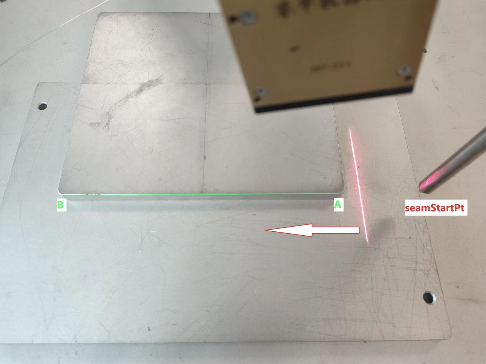

.. centered:: 图表 8.8‑31 寻位起点

在焊缝末端示教跟踪终止点“trackEndPt”。

.. figure:: robot_peripherals/168.png
   :align: center
   :width: 4in

.. centered:: 图表 8.8‑32 寻位终点

将上述两个点添加到“testTrack.lua”用户程序中，最终的用户程序如下：

.. figure:: robot_peripherals/169.png
   :align: center
   :width: 6in

.. centered:: 图表 8.8‑33 寻位跟踪程序

编写焊接相关指令
*****************

最后，在焊接寻位点“seampos”和“trackEndPt”之间加上焊接指令，最终的程序如下：

.. figure:: robot_peripherals/170.png
   :align: center
   :width: 6in

.. centered:: 图表 8.8‑34 寻位跟踪焊接程序

执行上述程序，机器人将携带激光传感器从寻位起点开始寻位运动，寻找到焊缝后，机器人立即运动到焊缝起点，并执行起弧操作，起弧成功后，机器人向焊缝终点运动并在运动过程中跟踪焊缝轨迹，机器人运动到焊缝终点后即停止焊接。

激光轨迹记录 + 轨迹复现
++++++++++++++++++++++++

激光轨迹记录+轨迹复现的工作流程为：

(1) 机器人携带激光传感器沿焊缝运动一段轨迹，激光传感器在运动的过程中实时记录焊缝位置轨迹数据；

(2) 轨迹记录完成后，机器人运动至轨迹记录的起始点；

(3) 机器人沿激光传感记录的轨迹进行轨迹复现运动。

机器人轨迹记录指令编写
************************

新建用户程序“testRecord.lua”，点击“激光记录”打开激光记录指令添加页面，找到“焊缝数据记录”，选择“开始记录”，点击“添加”按钮，选择停止记录，再次点击“添加”按钮；最后点击“应用”按钮。

.. figure:: robot_peripherals/171.png
   :align: center
   :width: 6in

.. centered:: 图表 8.8‑35 激光记录

.. figure:: robot_peripherals/172.png
   :align: center
   :width: 6in

.. centered:: 图表 8.8‑36 开始记录与停止记录

此时页面上出现轨迹记录开始和停止指令。

.. figure:: robot_peripherals/173.png
   :align: center
   :width: 6in

.. centered:: 图表 8.8‑37 轨迹记录程序

假设图中绿色线段AB为焊缝，分别使激光照射到焊缝起始点A和焊缝中断B，并示教轨迹记录的起点“recordStartPt”和终点“recordEndPt”。

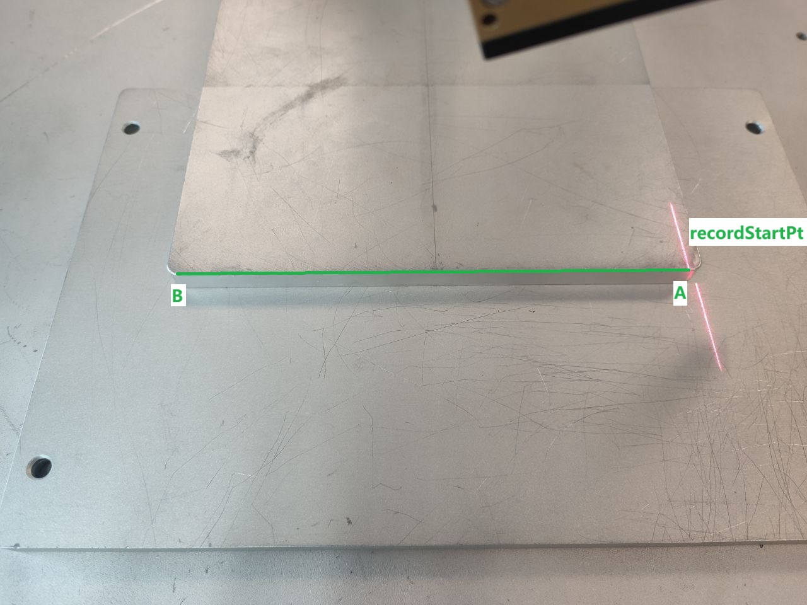

.. figure:: robot_peripherals/175.png
   :align: center
   :width: 4in

.. centered:: 图表 8.8‑38 轨迹记录起点和终点

在“testRecord.lua”中添加两条直线(LIN)运动指令，分别为运动到轨迹记录起点“recordStartPt”和终点“recordEndPt”，并调整指令位置，使机器人进行如下操作：先运动到“recordStartPt”点，开始轨迹记录，机器人运动到“recordEndPt”点，停止轨迹记录。

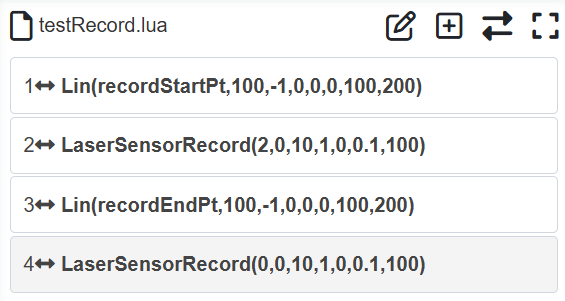

.. centered:: 图表 8.8‑39 轨迹记录程序

机器人运动到轨迹记录起点指令编写
*********************************

点击“激光记录”打开激光记录指令添加页面，找到“运动至焊缝点”栏，选择运动方式为PTP，输入一定的运动速度，点击“运动至起点”，点击“应用”按钮。

.. figure:: robot_peripherals/177.png
   :align: center
   :width: 6in

.. centered:: 图表 8.8‑40 运动至轨迹起点

此时“testRecord.lua”用户程序如下：

.. figure:: robot_peripherals/178.png
   :align: center
   :width: 6in

.. centered:: 图表 8.8‑41 运动至轨迹起点程序

激光传感器轨迹复现指令编写
****************************

点击“激光记录”打开激光记录指令添加页面，找到“焊缝数据记录”，选择“轨迹复现”，点击“添加”按钮，点击“激光跟踪复现”按钮，最后点击“应用”按钮。

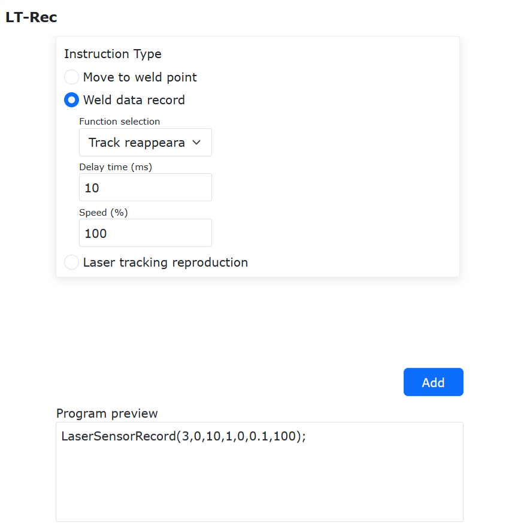

.. centered:: 图表 8.8‑42 轨迹复现

添加完成后的程序如下：

.. figure:: robot_peripherals/180.png
   :align: center
   :width: 6in

.. centered:: 图表 8.8‑43 轨迹复现程序

焊接相关指令编写
********************

最后在轨迹复现开始前和结束后加上焊接开始和焊接结束指令：

.. figure:: robot_peripherals/181.png
   :align: center
   :width: 6in

.. centered:: 图表 8.8‑44 轨迹记录复现焊接程序

执行上述程序，机器人将携带激光传感器先沿焊缝轨迹运动，并记录整个轨迹，然后机器人运动到轨迹记录的起点，机器人起弧并沿激光传感器记录的轨迹开始焊接，当机器人轨迹复现完成后，焊接电弧熄灭，完成焊接。

激光传感器适配控制器外设开放协议
~~~~~~~~~~~~~~~~~~~~~~~~~~~~~~~~~~~~~~~~~~~~~~~~

**Step1**：如果需要采用“开放协议连接”和“控制激光传感器”，则在传感器跟踪配置中，“协议类型”选项选择“外设开放协议”，如果采用原方案则选择“已适配设备”，在跟踪传感器界面配置加载激光外设。

.. figure:: robot_peripherals/182.png
   :align: center
   :width: 4in

.. centered:: 图表 8.8‑45 “开放协议连接”和“控制激光传感器”配置界面

**Step2**：点击“外设开放协议”进入界面，在“开放协议设置”中，上传对应激光传感器的外设开放协议，上传成功后选择协议编号和上传的文件名，点击配置，并在设备操作及状态中，运行上传的激光传感器，即可和对应的激光传感器建立连接。

.. figure:: robot_peripherals/183.png
   :align: center
   :width: 4in

.. centered:: 图表 8.8‑46 激光传感器建立连接

打磨
---------------

在“初始设置”->“外设”->“打磨”界面中，当前可以通过已适配设备和外设开放协议使用打磨。

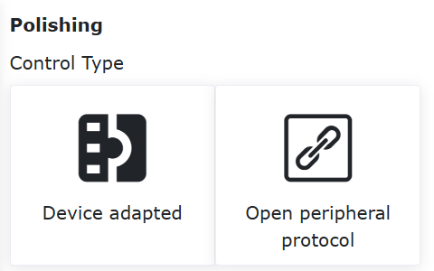

.. centered:: 图表 8.9-1 打磨状态配置页面

已适配设备
~~~~~~~~~~~~~~~~~

**通信配置与加载**: 配置通讯信息，需要配置IP地址、端口、采样周期和通信协议。通过加载/卸载按钮与打磨设备建立通信。

.. figure:: robot_peripherals/185.png
   :align: center
   :width: 4in

.. centered:: 图表 8.9-2 通信配置与加载

**设备功能**：可进行设备使能、错误清除和力传感器清零等操作。

.. figure:: robot_peripherals/186.png
   :align: center
   :width: 4in

.. centered:: 图表 8.9-3 设备功能

**参数配置**：可设置打磨设备的转速、接触力、伸出距离和控制模式。设置成功后，可在右侧"Polish"状态反馈栏显示相应数据和状态。

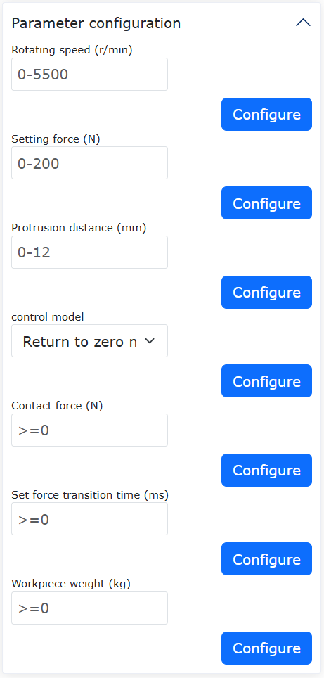

.. centered:: 图表 8.9-4 参数配置

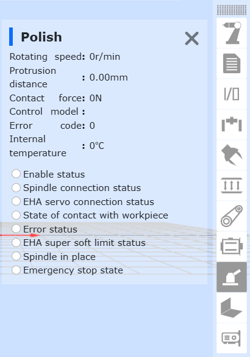

.. centered:: 图表 8.9-5 参数配置

外设开放协议
~~~~~~~~~~~~~~~~~

点击“外设开放协议”进入界面，在“开放协议设置”中，上传对应打磨的外设开放协议，上传成功后选择协议编号和上传的文件名，点击配置，并在设备操作及状态中，运行上传的打磨外设开放协议，即可和对应的打磨设备建立连接。

.. figure:: robot_peripherals/189.png
   :align: center
   :width: 4in

.. centered:: 图表 8.9‑6 激光传感器建立连接

辅助传感器
-------------------

在“初始设置”->“外设”->“辅助传感器”界面中，当前可以通过已适配设备使用，自定义协议功能暂未开放。

.. figure:: robot_peripherals/190.png
   :align: center
   :width: 4in

.. centered:: 图表 8.10‑1 辅助传感器--已适配设备

已适配设备
~~~~~~~~~~~~~~~~~~~

点击“已适配设备”进入辅助传感器配置界面。

辅助传感器的配置信息分为厂商、类型、软件版本和挂载位置，用户可根据具体的生产需求来配置相应的辅助传感器信息。

若用户需要更改配置，可先选择相应的辅助传感器编号，点击“清除”按钮，来清除相应的按钮，并重新根据需求配置；

.. figure:: robot_peripherals/191.png
   :align: center
   :width: 4in

.. centered:: 图表 8.10‑2 辅助传感器--已适配设备

组合设备（SmartTool+力传感器组合）
----------------------------------------------------

在“初始设置”->“外设”->“组合设备”界面中，当前可以通过已适配设备使用，自定义协议暂未开放。

.. figure:: robot_peripherals/192.png
   :align: center
   :width: 4in

.. centered:: 图表 8.11-1 组合设备

已适配设备
~~~~~~~~~~~~~~~~~~~

点击“已适配设备”进入配置界面。

配置信息分为厂商、类型、软件版本和挂载位置。不同厂商对应不同的类型，当前厂商为FR。

用户可根据具体的生产需求来配置相应的设备信息，配置成功后展示设备信息表格。若用户需要更改配置，可先选择相应的编号，点击“清除”按钮，来清除相应的信息，并重新根据需求配置设备信息。

.. important:: 
  点击清除配置前，相应的设备应处于未激活状态。

.. image:: robot_peripherals/193.png
   :width: 4in
   :align: center

.. centered:: 图表 8.11‑2 已适配设备

FR
++++++++++

FR对应的类型为“SmartTool ”与力传感器组合使用，协作机器人可适配鑫精诚、NSR和港智创信的三种力传感器，使用不同传感器时只需要加载对应的通信协议即可，具体如下：

- SmartTool + XJC-6F-D82（鑫精诚）。
- SmartTool + NSR-FT Sensor A（NSR）。
- SmartTool + GZCX-6F-75A（港智创信）。

1. 硬件安装

1) 将SmartTool 手柄拆开，取出中间的工装，安装在机器人末端，工装安装完成后，将SmartTool手柄拼接好，拼接成功后将连接线与机器人末端连接。

.. image:: robot_peripherals/194.png
   :width: 3in
   :align: center

.. centered:: 图表 8.11‑3 安装SmartTool 手柄中间的工装

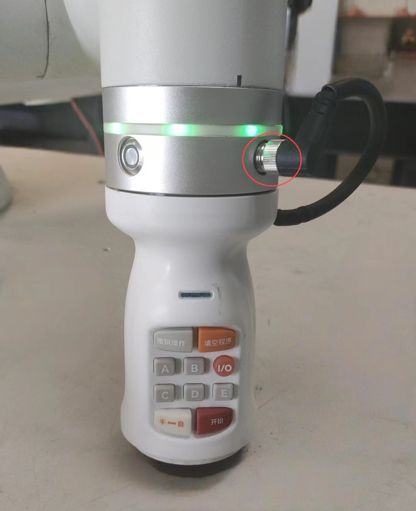

.. centered:: 图表 8.11‑4 SmartTool 手柄安装成功

2) SmartTool手柄安装完毕后，将力传感器（以港智创信为例）安装于SmartTool手柄末端，并将连接线与SmartTool手柄连接。

.. image:: robot_peripherals/196.png
   :width: 3in
   :align: center

.. centered:: 图表 8.11‑5 港智创信力传感器安装于SmartTool手柄末端

2. 设备配置

.. important:: 请确保您的SmartTool手柄已经固定安装于机器人末端并正确连接机器人末端以及力传感器已经固定安装于SmartTool手柄末端并正确连接SmartTool手柄。

1) 配置SmartTool手柄（参考焊接手柄按键功能配置）。

2) SmartTool手柄按键功能配置完成后，配置厂商为“FR”，选择“类型”、“软件版本”和“挂在位置”信息，点击“配置”按钮；

.. image:: robot_peripherals/197.png
   :width: 4in
   :align: center

.. centered:: 图表 8.11‑6 FR设备信息配置界面

3) 配置设备信息成功后，选择已配置的力传感器，点击“激活”按钮激活力传感器，激活成功后点击“零点矫正”按钮进行力传感器的清零，查看表格数据；

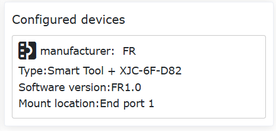

.. centered:: 图表 8.11‑7 力传感器校零

4) 根据当前末端安装，在“负载”界面配置负载数据，在“工具坐标”界面配置工具坐标的数据、工具类型和安装位置。

.. image:: robot_peripherals/199.png
   :width: 4in
   :align: center

.. centered:: 图表 8.11‑8 “末端负载”配置

.. image:: robot_peripherals/200.png
   :width: 4in
   :align: center

.. centered:: 图表 8.11‑9 “工具坐标”配置

3. 应用

设备信息配置成功后，可以独立实现SmartTool按键功能和力传感器的功能，例如：测量力的大小及受力方向和基于力传感器的辅助拖动锁定。

.. image:: robot_peripherals/201.png
   :width: 6in
   :align: center

.. centered:: 图表 8.11‑10 测量力的大小及受力方向

组合设备末端Lua协议
~~~~~~~~~~~~~~~~~~~~~~~~~~~~~~~~~~~~~~~~~~~~~~~~~~~~~~~

目前末端可支持两个设备的组合协议应用，可通过一分二的通信线或法奥的SmartTool485接口连接第二个设备。目前预设内嵌的组合设备协议包括：钧舵夹爪+鑫精诚力传感、钧舵夹爪+港智创新力传感器、SmartTool+钧舵夹爪、SmartTool +鑫精诚力传感器、SmartTool +港智创新力传感器。其中夹爪+力传感器的内嵌协议在“初始设置”、“外设”、“力传感器”中可选择，SmartTool+夹爪或力传感器的内嵌协议在“初始设置”、“外设”、“焊接手柄”中可选择。

操作步骤如下：

打开WebApp，依次点击“初始设置”、“外设”,选择需要组合的某一个设备类型（如焊接手柄），选择“自定义协议”。点击“协议管理”，则可以进行末端协议的配置。

目前预设内嵌的组合设备协议包括：钧舵夹爪+鑫精诚力传感、SmartTool+钧舵夹爪、SmartTool +鑫精诚力传感器，组合设备预设协议属于用户自定义协议，以“Custom_End”开头，可以下载和删除，如下图所示。

.. image:: robot_peripherals/282.png
   :width: 6in
   :align: center

.. centered:: 图表 8.11‑11 焊接手柄预设内嵌协议

阵列式吸盘
-----------------

概述
~~~~~~~~~~~~~~~~~~~~~~
在机器人末端安装阵列式吸盘可帮助机器人快速部署不同场景的物料抓取工作站，可针对不同尺寸、形状的物料自定义吸盘数量和布局，提高工作效率和稳定性。

协作机器人支持最多20个吸盘组成的吸盘阵列，可以单独控制其中某个吸盘的抓取和释放，也可以控制当前连接的整个阵列所有吸盘同步动作。每个吸盘从站号支持1~20配置，配置基于DynamicLAB软件进行。 

硬件描述
+++++++++++++++++++++++++++++++++++++++++++

协作机器人通过以太网转485模块与吸盘阵列进行通讯控制，在WebApp上生成阵列式吸盘通讯协议，协议将控制数据通过TCPIP发送至以太网转485模块，模块再将收到的控制数据通过485发送至各个吸盘，从而实现对阵列式吸盘的控制（上述控制数据格式为ModbusRTU协议格式）。

其中以太网转485模块为以太网通讯的服务端、485通讯的主站，阵列中的每个吸盘均为485通讯从站，且每个吸盘应配置不同的从站号。

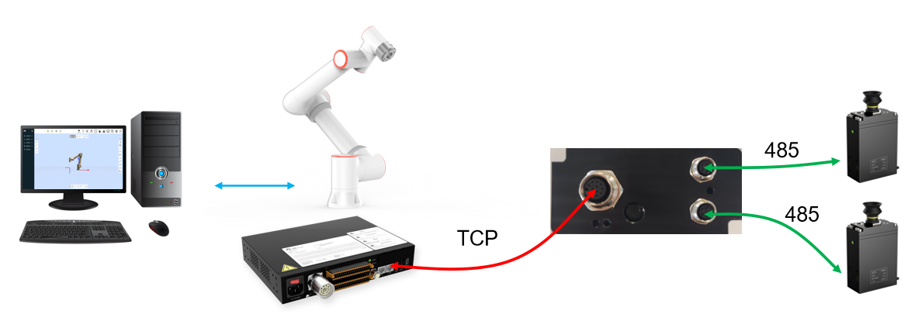

.. centered:: 图表 8.12-1 协作机器人吸盘阵列夹爪应用

以太网转485模块通常有两个TCPServer端口对应多个485从站端口，以CH9121为例，其TCPServer端口1对应485从站端口1-10，TCPServer端口2对应485从站端口11-20。机器人与以太网转485模块建立两个TCP通信，最终分别控制20个吸盘。

上述以太网转485模块需进行如下配置：

- ①以太网端配置为TCPServer，IP地址为：192.168.58.10，端口1的端口号为50001，端口2的端口号为50002；
- ②485端配置波特率为115200，数据位8，停止位1，无校验。以太网转485模块通常会配备一个调试软件，可以在调试软件中进行上述配置，下图是CH9121型号以太网转485模块的配置工具页面：

.. figure:: robot_peripherals/203.png
   :align: center
   :width: 6in

.. centered:: 图表 8.12-2 以太网转485模块调试工具

功能配置
~~~~~~~~~~~~~~~~~~~~~~~~~~~~~~~~

打开WebApp，依次点击“初始设置”->“外设”->“阵列式吸盘”；阵列式吸盘的控制模式有单播模式和广播模式两种：

**单播模式**：通讯协议中包含对每个吸盘的通讯控制内容，可实现对阵列中的每个吸盘独立控制。

**广播模式**：对阵列中的所有吸盘生成通讯协议，可同步控制阵列中所有吸盘的抓取和释放，但不能单独控制其中的某一个吸盘。

工作中可根据实际场景可仅配置单播模式，也可两种模式同时配置(既可以单独控制某个吸盘，也可以同步控制所有吸盘)。

.. figure:: robot_peripherals/204.png
   :align: center
   :width: 4in

.. centered:: 图表 8.12-3 阵列吸盘控制模式

单播模式配置
++++++++++++++++++++++++++++++++++

打开WebApp，依次点击“初始设置”->“外设”->“阵列式吸盘”->“单播模式”。单播模式协议配置方式有“自动配置”和“手动配置”两种：

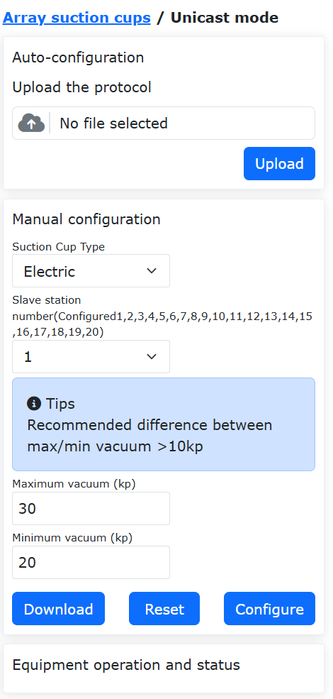

.. centered:: 图表 8.12-4 单播配置模式

**自动配置**：将已存在的协议文件直接上传至机器人控制器，已存在的协议文件可能来自：①其它已配置和调试完成阵列式吸盘的机器人中下载得到；②技术人员根据实际场景编写得到（用户编写协议文件可以实现更灵活、更高效的吸盘控制）。若多台设备使用相同的阵列式吸盘，通过自动配置直接上传协议的方式可以提高部署速度。

**手动配置**：根据阵列中吸盘的从站ID和真空度情况配置每个吸盘的通讯协议。手动配置操作步骤如下：

选择从站号为1，输入最大真空度、最小真空度、抓取超时时间(超时时间暂未开放)，点击“配置”按钮。此时在“设备操作及状态”栏中出现协议编号为1的吸盘协议，同时在“手动配置”、“从站号”标签上会显示当前已经配置的所有从站号。

.. figure:: robot_peripherals/206.png
   :align: center
   :width: 4in

.. centered:: 图表 8.12-5 配置单播吸盘

重复上述步骤，可根据需要配置多个从站号的吸盘，每配置一个吸盘，机器人系统都会自动更新“协议编号：1”对应的吸盘通讯协议内容，最多支持配置20个吸盘。所有吸盘都配置完成后，在“协议编号1”框中点击“连接”按钮，机器人与吸盘的通讯开始运行，“运行状态”指示灯亮起(注意：请先配置完成所有的从站号吸盘，再点击“连接”按钮，通讯建立后再配置吸盘从站无效)。

机器人与吸盘的通讯建立成功后，在“设备操作及状态”栏中出现所有配置的吸盘从站操作框列表；在每个从站号对应吸盘的操作框页面中可以进行吸盘的控制和状态监控（包括“吸取状态”、“当前真空度”、“吸盘压力”等），下图中配置的吸盘从站ID分别为2和11。

.. figure:: robot_peripherals/207.png
   :align: center
   :width: 4in

.. centered:: 图表 8.12-6 单播吸盘连接

在从站号1吸盘的控制框右上角点击“吸取”按钮，吸盘即执行“设定真空度吸取”动作。此时“吸取”按钮变成“释放”按钮，再次点击该按钮，吸盘即执行释放动作。吸盘执行上述动作时，对应的“吸取状态”、“当前真空度”等状态项将实时显示吸盘的状态。

.. note:: 注意：配置吸盘协议并连接完成后，需要点击一次“吸取”按钮激活该吸盘，同时也可以测试机器人与吸盘间的通讯是否正常。
  
若机器人与吸盘连接失败，则不会显示吸盘控制框，且“协议编号：1”中的运行状态指示灯熄灭。

.. note:: 注意：若使用过程中吸盘与以太网转485模块通讯物理连接断开再重新连接，可能出现协议无法建立连接的情况，此时可以拔插以太网转485模块的网线，再重新尝试连接。

.. figure:: robot_peripherals/208.png
   :align: center
   :width: 4in

.. centered:: 图表 8.12-7 机器人与吸盘连接失败

单播模式协议下载
++++++++++++++++++++++++++++++++++++++++++

在“手动配置”中点击“下载”按钮，即可将吸盘协议下载到本地计算机。吸盘协议为一个循环执行的LUA程序，程序在每个循环执行如下步骤：

- ①从机器人中读取吸盘控制数据；
- ②通过socket将控制数据写入到吸盘；
- ③通过socket从吸盘读取状态数据；
- ④向机器人中反馈吸盘状态数据；

吸盘通讯协议循环执行实现机器人与吸盘的通讯控制。在通讯协议中用户可自定义循环周期、控制数据寄存器地址和状态数据寄存器地址，可根据实际情况对该协议内容进行修改。以下为一个吸盘通讯协议代码示例：

吸盘协议程序示例：

.. code-block:: console
    :linenos:

    local id = 1 
    local ctrlValues = {0, 0, 0, 0, 0, 0, 0, 0, 0, 0, 0, 0, 0, 0, 0, 0, 0, 0, 0, 0} 
    local realTimeState = {0, 0, 0, 0, 0, 0, 0, 0, 0, 0}
    local suckerConfig = {0, 0, 0, 0, 0, 0, 0, 0, 0, 0}
    clearSuckerState() 
    socket1 = TCPClientConnect('192.168.58.10', 50001, 500, 10, 2, 3)
    socket2 = TCPClientConnect('192.168.58.10', 50002, 500, 10, 2, 3)
    suckerConfig[1] = 30
    suckerConfig[2] = 20
    suckerConfig[3] = 100
    ModbusRTUOverTCPWriteMultiReg(socket1, 0, 0x0501, 3, suckerConfig)
    ModbusRTUOverTCPWriteMultiReg(socket2, 0, 0x0501, 3, suckerConfig)
    sleep_ms(10) 
    while(1) do
      setAllCtrl,ctrlValues[1],ctrlValues[2],ctrlValues[3],ctrlValues[4],ctrlValues[5],ctrlValues[6],ctrlValues[7],ctrlValues[8],ctrlValues[9], ctrlValues[10], ctrlValues[11], ctrlValues[12],ctrlValues[13],ctrlValues[14],ctrlValues[15],ctrlValues[16],ctrlValues[17],ctrlValues[18],ctrlValues[19], ctrlValues[20] = getSuckerCtrlState()
      if(setAllCtrl ~= 0) then 
        ModbusRTUOverTCPWriteSingleReg(socket1, 0, 0x0500, setAllCtrl) 
        ModbusRTUOverTCPWriteSingleReg(socket2, 0, 0x0500, setAllCtrl) 
        ctrlValues = {0, 0, 0, 0, 0, 0, 0, 0, 0, 0, 0, 0, 0, 0, 0, 0, 0, 0, 0, 0} 
        sleep_ms(1) 
      else 
        ModbusRTUOverTCPWriteSingleReg(socket1, 2, 0x0500, ctrlValues[2]) 
        ModbusRTUOverTCPWriteSingleReg(socket2, 11, 0x0500, ctrlValues[11])
      end 
      suckerState, pressValue, error, default1, default2 = ModbusRTUOverTCPReadReg(socket1, 2, 0x0600, 3) 
      realTimeState[1] = suckerState
      realTimeState[2] = pressValue 
      realTimeState[3] = error 
      ctrlState, maxPress, minPress, time, default2 = ModbusRTUOverTCPReadReg(socket1, 2, 0x0500, 4) 
      realTimeState[4] = ctrlState 
      realTimeState[5] = maxPress 
      realTimeState[6] = minPress 
      realTimeState[7] = time 
      setSuckerRealtimeState(2, realTimeState) 
      suckerState, pressValue, error, default1, default2 = ModbusRTUOverTCPReadReg(socket2, 11, 0x0600, 3) 
      realTimeState[1] = suckerState
      realTimeState[2] = pressValue 
      realTimeState[3] = error 
      ctrlState, maxPress, minPress, time, default2 = ModbusRTUOverTCPReadReg(socket2, 11, 0x0500, 4) 
      realTimeState[4] = ctrlState 
      realTimeState[5] = maxPress 
      realTimeState[6] = minPress 
      realTimeState[7] = time 
      setSuckerRealtimeState(11, realTimeState) 
      local stopFlag = GetOpenLUAStopFlag(id) 
      if(stopFlag ~= 0) then 
        TCPClientDisconnect(socket1) 
        TCPClientDisconnect(socket2) 
        clearSuckerState() 
        break 
      end 
      sleep_ms(100) 
    end 

上述协议通过getSuckerCtrlState()指令获取吸盘控制数据，并通过ModbusRTUOverTCPWriteSingleReg()指令将控制数据通过通信写入到吸盘中，通过ModbusRTUOverTCPReadReg()指令读取吸盘的状态数据，再通过setSuckerRealtimeState()将吸盘状态数据反馈至机器人中。上述几个指令的详细定义如下：

.. centered:: 表格 8.12-1 getSuckerCtrlState()返回值

.. list-table:: 
   :widths: 10 10 20 40
   :header-rows: 0
   :align: center
   :class: sheet-center

   * - **序号**
     - **类型**
     - **变量名**
     - **描述**

   * - 1
     - int
     - setAllCtrl
     - 广播模式控制数据：1-按最大真空度吸取；2-按设置真空度吸取，即吸盘真空度保持在最大真空度和最小真空度之间；3-停止吸取

   * - 2 ~ 21
     - int
     - ctrlValues[i]
     - 从站号1 ~ 20对应的吸盘控制数据：1-按最大真空度吸取；2-按设置真空度吸取，即吸盘真空度保持在最大真空度和最小真空度之间；3-停止吸取

.. centered:: 表格 8.12-2 ModbusRTUOverTCPWriteSingleReg()详细参数

.. list-table:: 
   :widths: 10 10 20 40
   :header-rows: 0
   :align: center
   :class: sheet-center

   * - **序号**
     - **类型**
     - **变量名**
     - **描述**

   * - 1
     - int
     - socket
     - socket句柄

   * - 2
     - int
     - slaveID
     - 从站号 0-20；0-广播；1~20-从站号

   * - 3
     - uint16_t
     - regAddr
     - 写入寄存器地址

   * - 4
     - uint16_t
     - data
     - 要写入的数据

.. centered:: 表格 8.12-3 ModbusRTUOverTCPWriteMultiReg()详细参数

.. list-table:: 
   :widths: 10 10 20 40
   :header-rows: 0
   :align: center
   :class: sheet-center

   * - **序号**
     - **类型**
     - **变量名**
     - **描述**

   * - 1
     - int
     - socket
     - socket句柄

   * - 2
     - int
     - slaveID
     - 从站号 0-20；0-广播；1~20-从站号

   * - 3
     - uint16_t
     - regStartAddr
     - 写入多个寄存器起始地址

   * - 4
     - int
     - num
     - 写入寄存器数量

   * - 5
     - uint16_t[]
     - data
     - 要写入的数据内容数组

.. centered:: 表格 8.12-4 ModbusRTUOverTCPReadReg()详细参数

.. list-table:: 
   :widths: 10 10 20 40
   :header-rows: 0
   :align: center
   :class: sheet-center

   * - **序号**
     - **类型**
     - **变量名**
     - **描述**

   * - 1
     - int
     - socket
     - socket句柄

   * - 2
     - int
     - slaveID
     - 从站号 0-20；0-广播；1~20-从站号

   * - 3
     - uint16_t
     - regStartAddr
     - 读多个寄存器起始地址

   * - 4
     - int
     - num
     - 读取寄存器数量

.. centered:: 表格 8.12-5 ModbusRTUOverTCPReadReg()返回值

.. list-table:: 
   :widths: 10 10 20 40
   :header-rows: 0
   :align: center
   :class: sheet-center

   * - **序号**
     - **类型**
     - **变量名**
     - **描述**

   * - 1
     - int
     - suckState
     - 吸盘当前状态：0-释放物体或吸盘启动成功；1-检测到工件，吸附到物体；2-没有吸附到物体；3-物体脱离

   * - 2
     - float
     - pressValue
     - 当前真空度/压力

   * - 3
     - int
     - err
     - 错误码：0-正常；其它：异常

.. centered:: 表格 8.12-6 setSuckerRealtimeState()详细参数

.. list-table:: 
   :widths: 10 10 20 40
   :header-rows: 0
   :align: center
   :class: sheet-center

   * - **序号**
     - **类型**
     - **变量名**
     - **描述**

   * - 1
     - int
     - slaveID
     - 从站ID

   * - 2
     - int[]
     - states
     - states[1]：当前状态0-释放物体或吸盘启动成功；1-检测到工件，吸附到物体；2-没有吸附到物体；3-物体脱离。
        states[2]：当前真空度/压力；
        states[3]：等待寄存器值；
        states[4]：控制状态；
        states[5]：最大真空度；
        states[6]：最小真空度；
        state[7]：超时时间；
        states[8~10]：预留。

广播模式
++++++++++++++++++++++++++++++++++

协作机器人通过广播模式可以同时控制连接的所有吸盘动作。

.. note:: 注意：需要先配置完成单播模式，才能配置广播模式

打开WebApp，依次点击“初始设置”->“外设”->“阵列式吸盘”，先在单播模式配置完成所有需要的吸盘从站(仅配置，不进行通信协议连接建立)。

点击“广播模式”，在“参数配置”中输入吸盘的“最大真空度”、“最小真空度”、“抓取超时时间”(超时时间暂未开放)，点击“配置”按钮，此时在“设备操作及状态”框中出现广播模式通讯协议。在广播模式下，设置真空度参数对连接的每个吸盘均生效。

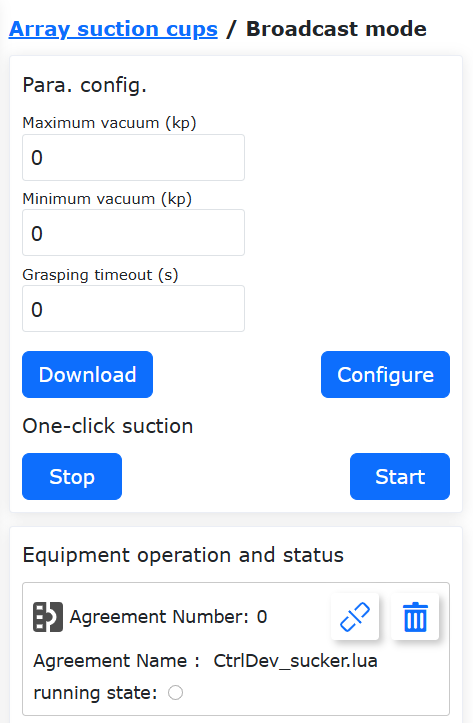

.. centered:: 图表 8.12-8 广播模式参数配置

在“协议编号1”操作框中点击“连接”按钮，“运行状态”指示灯亮起，表示机器人与阵列式吸盘已经建立通讯连接，连接成功后，所有连接的吸盘操作框列表显示在“设备操作及状态”栏中。

在“参数配置”->“一键吸取”中点击“开始”，阵列式吸盘中的每个吸盘即按照“设定真空度吸取”动作，点击“停止”，阵列式吸盘中的每个吸盘即停止吸取动作。

.. figure:: robot_peripherals/210.png
   :align: center
   :width: 4in

.. centered:: 图表 8.12-9 广播模式通信建立

广播模式下载协议文件与单播模式操作一致，两处下载的协议文件均可以通过单播模式页面中的“自动配置”处上传至机器人中。

阵列式吸盘LUA程序应用
~~~~~~~~~~~~~~~~~~~~~~~~~~~~~~~~~~~~~~~~~~~~~~~~~~~~~~~~~~~~~~~~

在机器人LUA程序中增加阵列吸盘控制、状态获取等指令，配合机器人运动指令，可以灵活、便捷的实现物料抓取搬运应用。

打开WebApp，依次点击“示教程序”->“程序编程”，新建LUA程序“testSucker.lua”。

.. figure:: robot_peripherals/211.png
   :align: center
   :width: 4in

.. centered:: 图表 8.12-10 新建“testSucker.lua”程序

选择指令类型为“外设指令”，在外设指令中点击“吸盘”按钮。此时在WebApp右侧出现“Sucker”阵列式吸盘指令添加页面。

.. figure:: robot_peripherals/212.png
   :align: center
   :width: 4in

.. centered:: 图表 8.12-11 阵列式吸盘指令添加

吸盘控制指令添加
+++++++++++++++++++++++++++++++++++++++++++

在LUA程序中编写吸盘控制指令可以对吸盘进行吸取控制和释放控制。单播模式和广播模式的控制有不同的逻辑效果。

单播模式控制指令添加
***********************************************************

单播模式控制可以根据从站起始地址和数量进行单个或多个吸盘控制，可为每个吸盘设置不同的控制状态。

在吸盘指令添加页面中点击“吸盘控制指令”，选择控制模式为“单播模式”，输入从站号为1，写入数量为2，吸取状态为“1,2”。点击“添加”按钮，即在“程序预览”中添加一条单播模式的吸盘控制指令。

.. figure:: robot_peripherals/213.png
   :align: center
   :width: 4in

.. centered:: 图表 8.12-12 添加吸盘控制指令

吸盘控制指令中的各参数含义如下：

- **从站号**：单播模式控制吸盘起始从站号。
- **写入数量**：单播模式控制从起始从站号开始要控制的吸盘数量。
- **吸取状态**：单播模式从起始从站号开始，每个吸盘的控制状态标志（1-按最大真空度吸取；2-按设置真空度吸取，即吸盘真空度保持在最大真空度和最小真空度之间；3-停止吸取）；其中每个吸盘的控制状态标志通过“,”分割，且控制标志个数与要控制的吸盘个数要一致；若要控制两个吸盘，其控制操作分别按“最大真空度吸取”和“设置真空度吸取”，则该项输入内容为“1,2”。

点击“应用”按钮，此时“testSucker.lua”程序中即添加一条吸盘控制指令，将机器人切换至自动模式，执行该LUA程序，机器人将控制从站号分别为1和2的两个吸盘分别按最大真空度和设定真空度进行吸取动作。

.. figure:: robot_peripherals/214.png
   :align: center
   :width: 4in

.. centered:: 图表 8.12-13 LUA程序中添加吸盘指令

广播模式控制指令添加
***********************************************************

广播模式控制指令设置的吸取状态对当前连接的所有吸盘生效。

点击“吸盘控制指令”，选择控制模式为“广播模式”，输入吸取状态为1（按最大真空度吸取）。点击“添加”按钮。

.. figure:: robot_peripherals/215.png
   :align: center
   :width: 4in

.. centered:: 图表 8.12-14 添加一条广播控制指令

点击“应用”按钮，此时“testSucker.lua”中即添加一条广播模式吸盘控制指令。将机器人切换到自动模式，执行该程序，则连接的所有吸盘均开始按最大真空度吸取动作。

.. centered:: 图表 8.12-15 在LUA程序中添加一条广播控制指令

吸盘状态获取指令添加
+++++++++++++++++++++++++++++++++++++++++++++++++++++++++

点击“获取吸盘状态”，选择要获取状态吸盘的从站号，依次点击“添加”、“应用”按钮。即在“testSucker.lua”中添加一条获取吸盘状态的指令“GetSuckerState(1)”。

.. figure:: robot_peripherals/217.png
   :align: center
   :width: 4in

.. centered:: 图表 8.12-16 添加获取吸盘状态指令

GetSuckerState()指令返回3个数值，分别如下：

- **state**：吸盘当前状态：0-释放物体或吸盘启动成功；1-检测到工件，吸附到物体；2-没有吸附到物体；3-物体脱离。
- **pressValue**：当前真空度/压力；
- **err**：错误码：0-正常；其它：异常。

在“testSucker.lua”中用三个变量接收GetSuckerState()函数的返回值。并通过Lua变量查询将上述信息显示在WebApp变量查询显示区中。

.. figure:: robot_peripherals/218.png
   :align: center
   :width: 4in

.. centered:: 图表 8.12-17 获取吸盘状态程序

等待吸盘吸附状态指令添加
+++++++++++++++++++++++++++++++++++++++++++++++++++++++++

阵列式吸盘实际场景应用中常需要等待吸盘吸取(释放)完成后再执行下一动作。协作机器人提供等待吸盘动作完成指令，当吸盘达到设定状态时指令执行结束，否则在设定超时时间内一直阻塞等待吸盘动作完成。

在阵列式吸盘指令添加页面中点击“等待吸盘吸附状态”，选择吸盘对应的从站号1，选择控制模式为“检测到工件，吸附到物体”，输入超时时间为10000ms。点击“添加”按钮。

.. figure:: robot_peripherals/219.png
   :align: center
   :width: 4in

.. centered:: 图表 8.12-18 等待吸盘状态指令添加

点击“应用”按钮，“testSucker.lua”中即添加一条等待吸盘吸取到物体的指令。

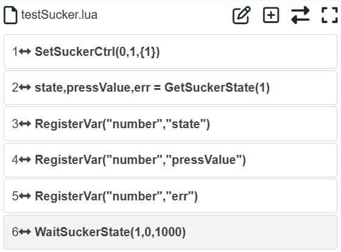

.. centered:: 图表 8.12-19 LUA程序中添加等待吸盘吸取到物体

应用示例
++++++++++++++++++++++++++++++++++

吸盘搬运控制LUA程序示例：

.. code-block:: console
  :linenos:

  while (1) do 
  ::satety_suck::
  PTP(sucker_safey,100,-1,0)
  PTP(sucker_suck,100,-1,0)
  SetSuckerCtrl(2, 1, {2})
  SetSuckerCtrl(11, 1, {2})
  loop1 = 0 
  while (loop1 < 10) do 
      state, press, errorcode = GetSuckerState(2)
      RegisterVar("number","state")
      RegisterVar("number","press")
      RegisterVar("number","errorcode")
      state11, press11, errorcode11 = GetSuckerState(11)
      RegisterVar("number","state11")
      RegisterVar("number","press11")
      RegisterVar("number","errorcode11")
      loop1 = loop1 + 1
      WaitMs(50)
  end
  
  if(state11 == 1) then
      PTP(sucker_safey,100,-1,0)
      PTP(sucker_release,100,-1,0)
      WaitMs(1000)
      SetSuckerCtrl(2, 1, {3})
      SetSuckerCtrl(11, 1, {3})
      WaitMs(500)
  else
      PTP(sucker_safey,100,-1,0)
      SetSuckerCtrl(2, 1, {3})
      SetSuckerCtrl(11, 1, {3})
      WaitMs(2000)
      goto satety_suck
  end
  ::satety_release::
  PTP(sucker_safey,100,-1,0)
  PTP(sucker_release,100,-1,0)
  SetSuckerCtrl(2, 1, {2})
  SetSuckerCtrl(11, 1, {2})
  loop1 = 0 
  while (loop1 < 10) do 
      state, press, errorcode = GetSuckerState(2)
      RegisterVar("number","state")
      RegisterVar("number","press")
      RegisterVar("number","errorcode")
      state11, press11, errorcode11 = GetSuckerState(11)
      RegisterVar("number","state11")
      RegisterVar("number","press11")
      RegisterVar("number","errorcode11")
      loop1 = loop1 + 1
      WaitMs(50)
  end
  
  if(state11 == 1) then
      PTP(sucker_safey,100,-1,0)
      PTP(sucker_suck,100,-1,0)
      WaitMs(1000)
      SetSuckerCtrl(2, 1, {3})
      SetSuckerCtrl(11, 1, {3})
      WaitMs(500)
  else
      PTP(sucker_safey,100,-1,0)
      SetSuckerCtrl(2, 1, {3})
      SetSuckerCtrl(11, 1, {3})
      WaitMs(2000)
      goto satety_release
  end
  end 

基于FOCAS的CNC功能包（仅在Linux系统下使用）
-------------------------------------------------

概述
~~~~~~~~~~~~~

为了在机床加工中，实现自动化上下料流程，开发了基于FOCAS通信的CNC功能包，可实现协作机器人与CNC机床的通信交互与协同运动。

如图所示，FOCAS通信是基于以太网的，通过网线连接机器人控制箱网口与机床内嵌网口，即可建立机器人与机床的FOCAS通信，实现在机器人端的CNC控制和机床状态监控。

.. figure:: robot_peripherals/221.png
   :align: center
   :width: 6in

.. centered:: 图表 8.13‑1 机器人与CNC的FOCAS通信拓扑图

目前控制箱基于FOCAS通信的CNC功能包支持的机床控制、状态反馈的功能如表所示。

.. centered:: 表格 8.13-1 基于FOCAS通信的CNC功能包支持的功能表

.. list-table:: 
   :widths: 15 40 100
   :header-rows: 0
   :align: center
   :class: sheet-center

   * - **序号**
     - **功能名称**
     - **说明**
   * - 1
     - 机床类型
     - 状态反馈
   * - 2
     - FOCAS通信状态
     - 状态反馈
   * - 3
     - 自动模式运行
     - 控制、状态反馈
   * - 4
     - 报警状态
     - 状态反馈
   * - 5
     - 安全门
     - 状态反馈
   * - 6
     - 卡盘
     - 控制、状态反馈
   * - 7
     - 急停
     - 控制、状态反馈
  
相关操作说明
~~~~~~~~~~~~~~~~~~~~~~

FOCAS通信建立
+++++++++++++++++++

FOCAS通信是基于以太网，需要将机器人、CNC机床、PC端电脑组成局域网实现物理链路衔接，并通过机器人开放协议实现最终FOCAS的通信建立。

网络配置
*************************

**Step1**：首先将PC端电脑IP地址改为和机器人控制箱同一网段，机器人控制箱的IP地址为"192.168.58.2"。

如果没有交换机组网，可以用机器人控制箱上自带的两个网口进行组网，操作如下：登录机器人的WebAPP，在系统设置->通用设置->网络设置中，设置网口0的IP为：192.168.58.2；网口1的IP为192.168.57.2。同时设置WebAPP为网口0，WebRecovery为网口1，如图所示。完成全部设置后点击设置网络。

.. figure:: robot_peripherals/222.png
   :align: center
   :width: 6in

.. centered:: 图表 8.13‑2 机器人网络配置图

**Step2**：接着重启控制箱，并通过网卡0网口与PC端相连，登录机器人WebApp。同时配置需要通信的CNC机床的IP地址和PC端、机器人控制箱为同一个网段，即192.168.58.xx，同时机床的端口改为8193。即可完成所有网络配置。

开放协议文件配置
*************************

**Step1**：随后进行外设开放协议配置，首先需要新建一个以CtrlDev_CNC命名开头的lua文件作为建立FOCAS通信的开放协议文件，如CtrlDev_CNC_demo.lua。

该文件中需要设置开放协议ID，并通过CNCComSet函数与CNC建立或断开连接。其中CNCComSet函数参数说明见下表。实例代码如下。

.. centered:: 表格 8.13-2 CNCComSet函数参数说明表

.. list-table:: 
   :widths: 15 40 100
   :header-rows: 0
   :align: center
   :class: sheet-center

   * - **序号**
     - **功能名称**
     - **说明**
   * - 1
     - 机床厂商
     - 0-无效 1-机床（FOCAS）
   * - 2
     - 通信指令
     - 1-建立连接 1001-断开连接
   * - 3
     - 机床IP地址
     - --
   * - 4
     - 机床端口号
     - --

FOCAS通信建立连接开放协议实例代码：

.. code-block:: console
    :linenos:

    local id = 1      --开放LUA协议ID
    --FOCAS断开连接
    CNCComSet(1, 1001, '192.168.57.100', 8193)
    sleep_ms(1000)
    --FOCAS建立连接
    CNCComSet(1, 1, '192.168.57.100', 8193)
    sleep_ms(1000)
    while(1) do
    sleep_ms(5000)
    end

**Step2**：完成开放协议lua文件的编写，选择刚刚的CtrlDev_CNC_fanuc.lua文件并上传，选择文件中设置的ID，下拉选择上传的开放协议文件并点击配置。

.. figure:: robot_peripherals/223.png
   :align: center
   :width: 4in

.. centered:: 图表 8.13‑3 开放协议文件上传与配置

**Step3**：随后检查所有通信链路正常，并确认CNC机床处于开机状态，点击开放协议中的连接按钮，通过右侧的状态反馈栏中的CNC->FOCAS通信状态可确认是否与机床建立连接（红灯：建立连接；灰色：断开连接），如图所示。

.. figure:: robot_peripherals/224.png
   :align: center
   :width: 4in

.. centered:: 图表 8.13‑4 FOCAS通信连接建立 

CNC状态反馈说明
++++++++++++++++++++++++++

CNC机床的状态反馈显示在WebAPP最右侧的外设状态反馈的CNC外形图标，如图所示。点击则会显示当前机床全部的状态，包括设备厂商、机床类型、FOCAS通信状态、报警标志、机床运行加工状态、机床门开关状态、机床卡盘状态、机床急停状态。

.. figure:: robot_peripherals/225.png
   :align: center
   :width: 4in

.. centered:: 图表 8.13‑5 CNC状态反馈栏 

CNC各状态反馈显示灯的含义如下表所示。

.. centered:: 表格 8.13-3 CNC状态反馈图标灯含义表

.. list-table:: 
   :widths: 15 40 100
   :header-rows: 0
   :align: center
   :class: sheet-center

   * - **序号**
     - **功能名称**
     - **说明**
   * - 1
     - FOCAS通信状态
     - 灰色-通信断开 红色-通信正常
   * - 2
     - 报警标志
     - 灰色-无警告 红色-存在警告
   * - 3
     - 机床运行加工状态
     - 灰色-停机 绿色-运行中
   * - 4
     - 机床门开关状态
     - 灰色-关门 绿色-开门
   * - 5
     - 机床卡盘状态
     - 灰色-松开 绿色-夹紧
   * - 6
     - 机床急停状态
     - 灰色-急停无效 绿色-急停生效

CNC状态反馈说明
++++++++++++++++++++++++++

CNC机床的控制位于外设开放协议中，当完成FOCAS通信连接后，点击所配置的外设开放协议右上角，则可打开CNC的控制页面，如图所示。

.. note:: 其中控制按钮包括门控制（开门、关门），卡盘控制（夹紧、松开），启停控制（运行、停止），急停控制（急停、无效）。所有的控制信号都是边沿信号触发控制。

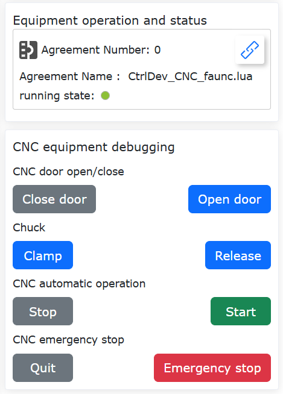

.. centered:: 图表 8.13‑6 CNC控制页面 

CNC示教程序说明
++++++++++++++++++++++++++

CNC功能包支持在示教程序中调用控制指令，并实时获取机床状态，依次打开“示教程序”->“程序编程”->“外设指令”->“CNC”，可以看到全部支持的CNC示教指令，如图所示。

.. figure:: robot_peripherals/227.png
   :align: center
   :width: 4in

.. centered:: 图表 8.13‑7 CNC示教指令 

.. note:: 其中控制指令与CNC控制一一对应，均为边沿信号生效，即启动命令执行后一定要执行停机后，下一次启动命令才会生效。

“机床当前状态获取”为lua函数，该函数返回值为9个参数，含义如下表所示。

.. centered:: 表格 8.13-4 “机床当前状态获取”返回值说明表

.. list-table:: 
   :widths: 15 40 100
   :header-rows: 0
   :align: center
   :class: sheet-center

   * - **序号**
     - **名称**
     - **含义**
   * - 1
     - 设备厂商
     - 0-无效 1-其他-预留
   * - 2
     - FOCAS通信状态
     - 0-通信正常 其他-通信断开
   * - 3
     - 机床型号(string)
     - '15' : Series 150/150i '16' : Series 160/160i '18' : Series 180/180i '21' : Series 210/210i '30' : Series 300i '31' : Series 310i '32' : Series 320i '0' : Series 0i 
   * - 4
     - 机床型号(string)
     - '15' : Series 150/150i '16' : Series 160/160i '18' : Series 180/180i '21' : Series 210/210i '30' : Series 300i '31' : Series 310i '32' : Series 320i '0' : Series 0i 
   * - 5
     - 机床运行状态
     - 0-停机 1-运行
   * - 6
     - 机床急停状态
     - 0-急停生效 其他-急停无效
   * - 7
     - 机床告警状态
     - 0-无警告 其他-存在警告
   * - 8
     - 机床门状态
     - 0-开门 1-关门
   * - 9
     - 机床卡盘状态
     - 0-松开 1-夹紧

以机器人上下料流程为例编写了lua示教程序示例，该示例程序包括了控制CNC关门、开门、运行、停机、卡盘松开、卡盘夹紧，并通过获取CNC当前状态作为判断条件，设置机器人在安全点、取料点、放料点三个点运动，如代码所示。

机器人与CNC协同运动示教lua程序实例：

.. code-block:: console
    :linenos:

     while (1) do 
        CNCDoorClose()
        CNCWorkStart()
        WaitMs(1000)
        t1,t2,t3,t4,t5,t6,t7,t8,t9=CNCGetStatus()
        if t5 == 1 then
            PTP(CNCsafe,100,-1,0)
        else
            CNCWorkStop()
            CNCDoorOpen()
            WaitMs(1000)
            PTP(CNCg1,100,-1,0)
            WaitMs(1000)
            CNCChuckOpen()
            PTP(CNCg2,100,-1,0)
            PTP(CNCsafe,100,-1,0)
        end
        t1,t2,t3,t4,t5,t6,t7,t8,t9=CNCGetStatus()
        if t8 == 0 then
            if t5 == 0 then
                PTP(CNCg2,100,-1,0)
                 PTP(CNCg1,100,-1,0)
                 CNCChuckFastening()
                 WaitMs(1000)
                 PTP(CNCsafe,100,-1,0)
             end   
         end
    end

基于力传感器的虚拟墙配置
-------------------------------------------------

基于力传感器的虚拟墙功能，可以通过人为设置虚拟墙，用于限制机器人的工作空间，避免直接发生碰撞接触。

力传感器的安装配置
~~~~~~~~~~~~~~~~~~~~~~

**Step1**：以“坤维”传感器为例，安装时需要力传感器的坐标系方向与末端法兰坐标系保持一致，如图1所示（图1中，红色为末端法兰坐标系X+方向，绿色为末端法兰坐标系Y+方向，蓝色为末端法兰坐标系Z+方向）；

.. figure:: robot_peripherals/228.png
   :align: center
   :width: 4in

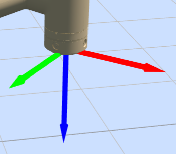

.. centered:: 图表 8.14‑1 力传感器安装

**Step2**：在“初始设置”->“外设”->“力传感器”的菜单栏下，点击“已适配设备”进入力传感器设备配置界面。

力传感器配置信息分为厂商、类型、软件版本和挂载位置，用户可根据具体的生产需求来配置相应的力传感器信息。若用户需要更改配置，可先选择相应的编号，点击“清除”按钮，来清除相应的信息，并重新根据需求配置；具体操作如图所示。

**Step3**：选择配置完成的力传感器编号，点击“复位”按钮，页面弹出命令发送成功后，再点击“激活”按钮，可查看力传感器信息表中的激活状态，来判断是否激活成功；此外，力传感器会有初始值，用户根据使用需求选择“零点矫正”和“去除零点”。力传感器零点矫正需要确保力传感器水平垂直向下，且机器人未配置负载。

.. figure:: robot_peripherals/016.png
   :align: center
   :width: 4in

.. centered:: 图表 8.14‑2 力传感器配置与激活

.. figure:: robot_peripherals/017.png
   :align: center
   :width: 4in

.. centered:: 图表 8.14‑3 力传感器激活

虚拟墙配置
~~~~~~~~~~~~~~~~~~~~~~

借助力传感器进行辅助拖动，需要在力传感器下安装拖动把手，并配置工具坐标系，具体操作如图4所示。此时，检测干涉区的方式以设置的工具坐标系位置为参考，不设置时以末端法兰为参考。

**Step1**：在“初始设置”->“安全”->“干涉区”的菜单栏下，点击“单个”进入干涉区配置功能界面；

**Step2**：需要对干涉方式和进入干涉区操作进行配置；点击“立方体干涉”进入配置界面，进入干涉区拖动配置为“不限制拖动”，进入干涉区运动配置均可；

**Step3**：根据需求，可以对参数配置进行修改。检测方法分为“指令位置”和“反馈位置”两种，干涉区模式分为“范围内干涉”和“范围外干涉”两种，参考坐标系选择为“基坐标”，根据实际使用选择设置。详细操作见图所示；

.. figure:: robot_peripherals/230.png
   :align: center
   :width: 4in

.. figure:: robot_peripherals/231.png
   :align: center
   :width: 4in

.. centered:: 图表 8.14‑4 安装拖动把手并设置工具坐标系

.. figure:: robot_peripherals/232.png
   :align: center
   :width: 4in

.. centered:: 图表 8.14‑5 虚拟墙参数配置

**Step4**：参数配置下的干涉区模式分为“范围内干涉”和“范围外干涉”两种；

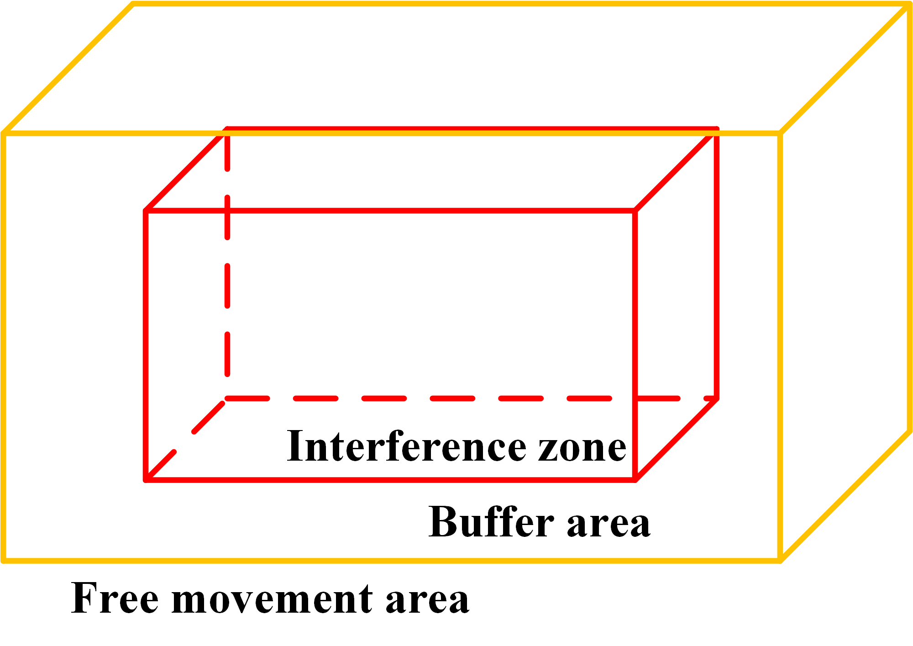

.. centered:: 图表 8.14‑6 范围内干涉

.. figure:: robot_peripherals/234.png
   :align: center
   :width: 4in

.. centered:: 图表 8.14‑7 范围外干涉

**Step5**：建立干涉区，具体操作如图7和图8所示；建议在选择“范围外干涉”时，将干涉区域设置尽可能大。

.. figure:: robot_peripherals/235.png
   :align: center
   :width: 4in

.. centered:: 图表 8.14‑8 两点法建立干涉区

.. figure:: robot_peripherals/236.png
   :align: center
   :width: 4in

.. centered:: 图表 8.14‑9 中心点+边长法建立干涉区

力传感器辅助拖动
~~~~~~~~~~~~~~~~~~~~~~

**Step1**：在“辅助应用”->“工具应用”的菜单栏下，点击“拖动锁定”进入力传感器辅助锁定功能界面；

**Step2**：按照如图所示的参数进行设置，即可实现基于力传感器的虚拟墙功能。具体效果为：靠近虚拟墙，阻力变大；远离虚拟墙，基于力传感器辅助拖动功能正常。

.. figure:: robot_peripherals/237.png
   :align: center
   :width: 4in
  
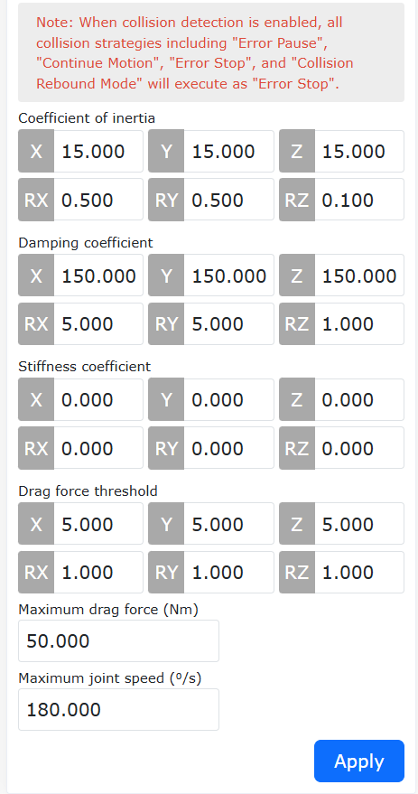

.. centered:: 图表 8.14‑10 力传感器辅助拖动的参数设置

参数的具体作用：

**自适应选择**：在需要装配时开启，开启后拖动变重；

**惯性参数**：调节拖动过程中的手感，需在技术人员指导下谨慎操作。

**阻尼参数**：

-  平动方向：建议设置参数在[100-200]之间；

-  转动方向：建议设置参数在[3-10]之间，其中RZ方向设置范围在[0.1-5]；

-  效果：借助传感器拖动时，增大阻尼会导致拖动困难，减小阻尼会导致拖动机器人过于轻松（建议不要太小）；

-  阻尼参数整体范围：平动XYZ：[100-1000]；转动RX、RY：[3-50],RZ:[2-10]；

-  最大拖动力为50，最大拖动速度为180。

**刚度参数**：均设为0；

**拖动力阈值**：平动XYZ为[5-10]；转动RX、RY、RZ为[0.5-5]；

**最大拖动力**：50；

**最大拖动速度**：180；

六维力和关节阻抗混合拖动功能
~~~~~~~~~~~~~~~~~~~~~~~~~~~~

概述
++++++

六维力和关节阻抗混合拖动功能，是借助力传感器感知外力，机器人在拖动模式下进行辅助拖动，可以通过调整增益系数获得不同的拖动体验。而关节阻抗是采用阻抗控制对拖动力进行限制。

力传感器的安装配置及校零操作
++++++++++++++++++++++++++++++++++

1. 力传感器的安装配置

力传感器的安装配置的详细操作见上文：基于力传感器的虚拟墙配置。

2. 力传感器的校零

为便于拖动机器人，需要在传感器下方安装拖动把手，如图1所示。

.. figure:: robot_peripherals/239.png
   :align: center
   :width: 4in

.. centered:: 图表 8.14‑11 拖动把手

**Step1**：根据实际把手的长度，设置工具坐标系，如图2所示。

**Step2**：在“初始设置”->“基础”->“负载”菜单栏下，点击“传感器”，进入力/扭矩传感器负载界面。

借助拖动按钮，调整机器人末端水平朝下，依次点击“负载”->“传感器辨识”进入界面，找到“传感器自动校零”一栏中的“记录初始位置”的按钮。然后，切换机器人模式为自动模式，点击“自动校零”的按钮。待程序运行结束，即完成传感器校零工作。详细操作见图所示。

.. figure:: robot_peripherals/231.png
   :align: center
   :width: 4in

.. centered:: 图表 8.14‑12 工具坐标系设置

.. figure:: robot_peripherals/240.png
   :align: center
   :width: 4in

.. centered:: 图表 8.14‑13 力/扭矩传感器自动校零

六维力和关节阻抗混合拖动
++++++++++++++++++++++++

1. 辅助拖动

**Step1**：在“辅助应用”->“工具应用”的菜单栏下，点击“拖动锁定”进入拖动锁定功能界面。

**Step2**：在“六维力和关节阻抗混合拖动”一栏中，设置控制状态为“开启”，阻抗开启状态为“关闭”，设置拖动增益为，末端线速度为1000mm/s，角速度限制为100°/s，再点击“应用”按钮，功能即启用。具体配置如图4所示。

**Step3**：切换机器人模式为拖动模式，即可拖动机器人。具体效果为：拖动机器人末端，拖动轻松，体验感好；拖动机器人关节，拖动重。

.. figure:: robot_peripherals/241.png
   :align: center
   :width: 4in

.. centered:: 图表 8.14‑14 六维力辅助拖动的配置参数

2. 关节阻抗控制

阻抗控制的作用是对拖动力和拖动位置进行限制，其默认状态为“关闭”。

具体操作见图5所示，设置阻抗开启状态为“开启”，再按照图5所示设置阻尼系数和刚度系数。其中，刚度系数的功能暂未开放。

.. figure:: robot_peripherals/242.png
   :align: center
   :width: 4in

.. centered:: 图表 8.14‑15 关节阻抗的配置参数

参数的具体作用：

- **控制状态**：开启后，在拖动模式下可使用此功能。
  
- **阻抗开启**：开启后，需要配置刚度参数和阻尼参数。作用是对拖动力和拖动位置进行限制。
  
- **拖动增益**：参数建议设置在[0-5]之间。参数设置为0，机器人无法拖动。参数设置为1，拖动效果没有改善。参数大于1，拖动轻，拖动体验好。参数越大，拖动越轻松。
  
- **刚度增益**：设置为0，其作用是在拖动后恢复到拖动前的初始位置。
  
- **阻尼增益**：作用是限制拖动力。1-3轴参数范围为[0-0.5]，4-5轴参数范围为[0-0.1]；6轴参数范围为[0-0.05]。
  
- **末端线速度**：1000mm/s，当超出末端线速度限制，机器人切换模式至手动模式，并提示TCP超速。
  
- **角速度限制**：100°/s，当超出角速度限制，机器人切换模式至手动模式，并提示TCP超速。

扩展轴加激光定点跟踪功能
-------------------------------------------------

机器人扩展轴加激光定点跟踪系统构成
~~~~~~~~~~~~~~~~~~~~~~~~~~~~~~~~~~~~~~~

.. figure:: robot_peripherals/243.png
   :align: center
   :width: 4in

.. centered:: 图表 8.15‑1 机器人扩展轴加激光定点跟踪系统构成

系统中，（a）为计算机，（b）为机器人及其控制箱，（c）为变位机及驱动设备，（d）焊缝跟踪激光传感器，（e）为焊机与配套设备。

.. figure:: robot_peripherals/244.png
   :align: center
   :width: 3in

.. centered:: 图表 8.15‑2 外设安装示意图

焊缝跟踪激光传感器及焊枪（b）安装于机器人（a）末端法兰上，变位机（c）固定安装于机器人外。

扩展轴通讯配置
~~~~~~~~~~~~~~~~~~~~~~~~~~~~~~~~~~~~~~~

机器人与扩展轴的通讯方式包括使用UDP或RS485这两种形式。

.. figure:: robot_peripherals/074.png
   :align: center
   :width: 4in

.. centered:: 图表 8.15‑3 扩展轴配置页面

在机器人操作界面点击“初始设置”->“外设”->“扩展轴”按钮，进入扩展轴配置页面。以使用PLC通过UDP通讯与机器人相连为例，点击“UDP通信”图标进入UDP通讯的扩展轴配置页面。

.. figure:: robot_peripherals/110.png
   :align: center
   :width: 4in

.. centered:: 图表 8.15‑4 UDP通信配置界面

在UDP通讯的扩展轴配置页面，能够选择对应的扩展轴号，连接与配置UDP通讯参数（地址、端口、周期、丢包检测等），以及扩展轴定位完成时间。

扩展轴配置内容非本功能介绍重点，详细配置见对应部分用户手册。

焊缝跟踪激光传感器连接配置
~~~~~~~~~~~~~~~~~~~~~~~~~~~~~~~~~~~~~~~

通过以下配置页面连接焊缝跟踪激光传感器:

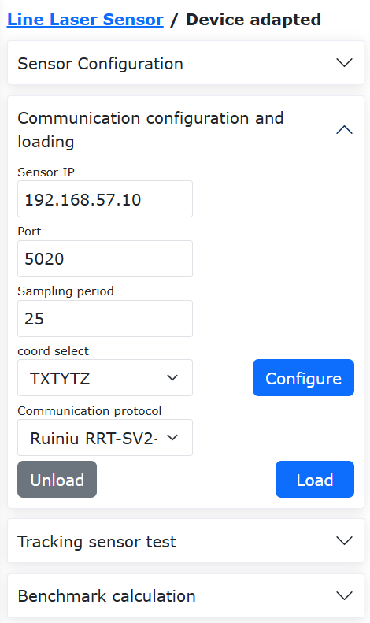

.. centered:: 图表 8.15‑5 激光传感器连接与配置页面

点击“初始设置”->“外设”->“线激光传感器”的“已适配设备”进入配置页面。配置页面包括“传感器配置”、“通信配置与加载”、“基准计算”，点击“传感器配置”可设置传感器输入量滤波参数，点击“通信配置与加载”可输入对应通信参数连接激光传感器。

激光传感器配置内容非本功能介绍重点，详细配置见对应部分用户手册。

焊机连接配置
~~~~~~~~~~~~~~~~~~~~~~~~~~~~~~~~~~~~~~~

通过以下配置页面配置焊机：

.. figure:: robot_peripherals/246.png
   :align: center
   :width: 4in

.. centered:: 图表 8.15‑6 焊机配置页面

焊机通信可使用IO通信或RS485通信，点击“初始设置”、“外设”、“焊机”进入配置与连接界面，可配置“控制类型”、“信号对应IO”、“焊接工艺参数”、“焊机调试”等模块。

焊机配置内容非本功能介绍重点，详细配置见对应部分用户手册。

工具坐标系与激光传感器坐标系标定
~~~~~~~~~~~~~~~~~~~~~~~~~~~~~~~~~~~~~~~

在机器人末端安装焊枪后，对焊枪与激光传感器外参进行标定：

.. figure:: robot_peripherals/247.png
   :align: center
   :width: 4in

.. centered:: 图表 8.15‑7 工具坐标系配置页面

点击“初始设置”、“基础”、“坐标系”、“工具”进入工件坐标系设置页面。

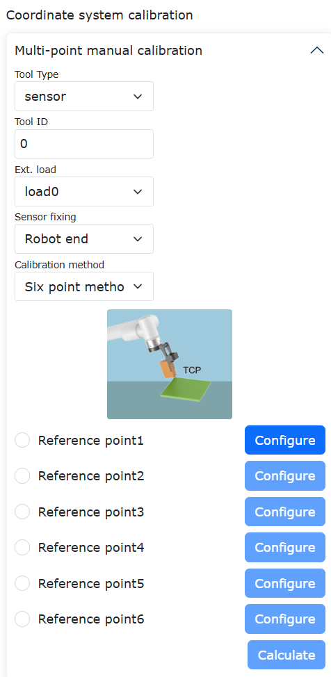

.. centered:: 图表 8.15‑8 选择6点法对焊枪进行标定

选择一个空坐标系，选择工具类型为“工具”，选择6点法进行焊枪工具标定。

.. figure:: robot_peripherals/148.png
   :align: center
   :width: 4in

.. centered:: 图表 8.15‑9 选择5点法对激光传感器进行标定

选择一个空坐标系，选择工具类型为“传感器”，选择5点法进行激光传感器标定。

工具坐标系与激光传感器坐标系标定内容非本功能介绍重点，详细标定方法见对应部分用户手册。

扩展轴与激光定点跟踪功能
~~~~~~~~~~~~~~~~~~~~~~~~~~~~~~~~~~~~~~~

扩展轴与激光定点跟踪分两种方法，激光数据有变换方式执行“先记录后复现”的跟踪策略，激光数据无变换方式执行“边记录边复现”的跟踪策略。

扩展轴坐标系标定
+++++++++++++++++++++++++++++

使用扩展轴坐标系实现扩展轴与机器人同步激光跟踪时需要标定扩展轴坐标系。

.. figure:: robot_peripherals/077.png
   :align: center
   :width: 4in

.. centered:: 图表 8.15‑10 扩展轴坐标系设置页面

点击“初始设置”->外设->“扩展轴”进入扩展轴坐标系设置界面，选择需要设置的扩展轴号，点击编辑按钮，选择“4-单自由度变位机”并保存。

.. figure:: robot_peripherals/249.png
   :align: center
   :width: 4in

.. centered:: 图表 8.15‑11 扩展轴标定页面

在标定扩展轴时注意选择“机器人相对扩展轴位置”为“扩展轴外”。对于变位机的情况，选择4点法进行标定。

扩展轴标定内容非本功能介绍重点，详细标定方法见对应部分用户手册。

扩展轴与机器人同步激光跟踪
+++++++++++++++++++++++++++++

激光数据有变换方式
**************************

基座标系下的扩展轴与机器人同步激光跟踪无需标定外部轴，其余功能设置和组成与扩展轴坐标系下的同步跟踪一致。

先进行激光跟踪数据配置，将激光跟踪器数据设置为有变换类型的数据。

.. figure:: robot_peripherals/250.png
   :align: center
   :width: 4in

.. centered:: 图表 8.15‑12 设置激光数据有变换类型

点击“初始设置”、“外设”、“跟踪”、“传感器”，在页面下拉框点击“传感器配置”，将“数据处理”调整为有变换类型的数据。

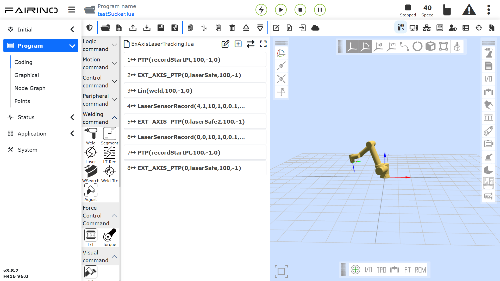
 
.. centered:: 图表 8.15‑13 激光跟踪功能页面

本功能通过多功能模块组合实现，主要功能模块在“激光跟踪”功能内包含。点击“示教程序”->“程序编程”->“激光跟踪”进入激光跟踪页面，也可点击“激光记录”直接进入记录页面。

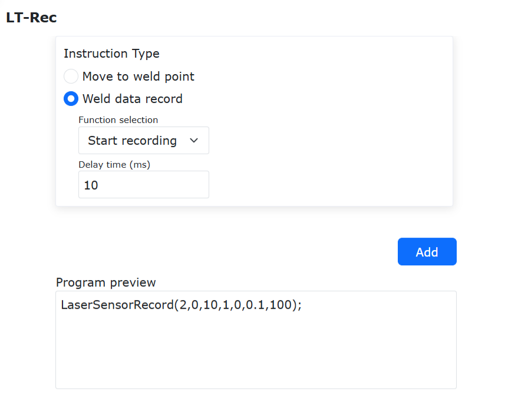

.. centered:: 图表 8.15‑14 添加开始记录激光数据指令

在扩展轴运动到焊接起始点后添加开始记录激光数据指令。

.. figure:: robot_peripherals/253.png
   :align: center
   :width: 6in

.. centered:: 图表 8.15‑15 添加结束记录激光数据指令

在扩展轴运动到焊接终止点后添加停止记录激光数据指令。   

机器人在原地记录完扩展轴运动时焊缝的运动轨迹后，就可使扩展轴回到焊接起始点，准备开始同步跟踪焊接。

焊接开始时需将焊枪运动到激光传感器记录数据的起点位置，需添加运动到焊接点指令：

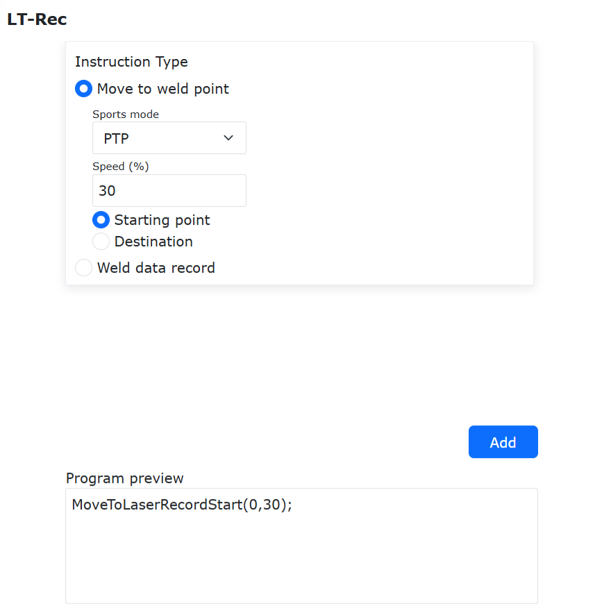

.. centered:: 图表 8.15‑16 添加运动到焊接点指令

点击“示教程序->“程序编程”->“激光记录”按钮，选择“运动到焊接点”，设置运动方式与运动速度，点击“起点”按钮并应用。

.. figure:: robot_peripherals/255.png
   :align: center
   :width: 6in

.. centered:: 图表 8.15‑17 添加轨迹复现激光记录的数据指令

在“激光跟踪”页面选择“数据记录”->“轨迹复现”指令，点击“添加”并应用。指令中，等待时间默认为0ms，速度为复现速度相较记录速度的比值，建议大于50%。

在“轨迹复现”指令后添加扩展轴运动指令即可实现扩展轴与机器人激光跟踪同步运动。

以下为一段典型的扩展轴加激光定点跟踪的LUA程序：

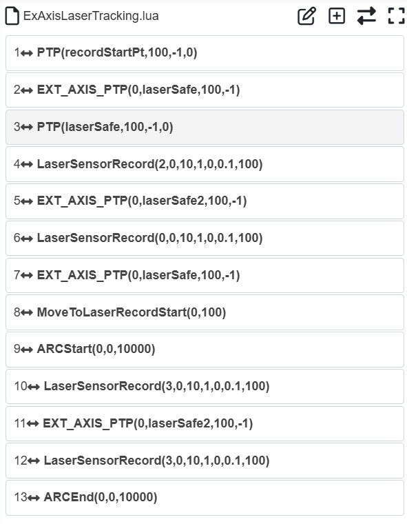

.. centered:: 图表 8.15‑18 扩展轴加激光数据有变换定点跟踪示例程序

机器人执行“先记录后复现”的流程，先记录扩展轴运动时工件焊缝的变化轨迹，之后在焊接时扩展轴与轨迹复现同步执行。

激光数据无变换方式
**************************

使用激光数据无变换方式进行定点跟踪无需标定扩展轴坐标系。

将激光跟踪传感器数据设置为无变换类型。

.. figure:: robot_peripherals/257.png
   :align: center
   :width: 4in

.. centered:: 图表 8.15‑19 设置激光数据无变换类型

点击“初始设置”->“外设”->“线激光传感器”，在页面下拉框点击“传感器配置”，将“数据处理”调整为无变换类型的数据。

.. centered:: 图表 8.15‑20 激光跟踪功能页面

点击“示教程序”->“程序编程”->“激光跟踪”进入激光跟踪页面，也可点击“激光记录”直接进入记录页面。

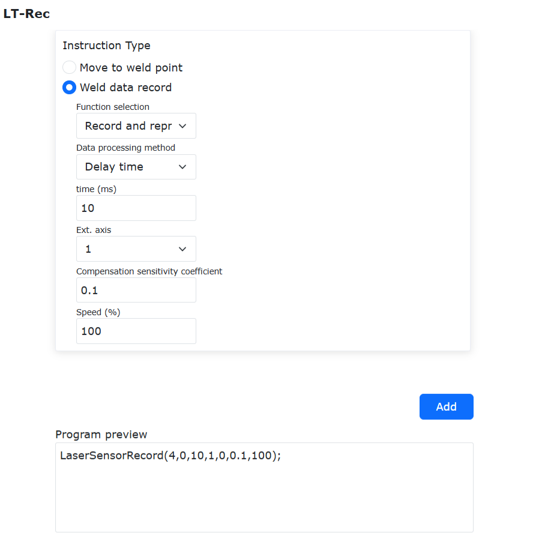

.. centered:: 图表 8.15‑21 添加边记录边复现指令

在“激光记录”页面选择“边记录边复现”指令，点击“添加”并应用。指令中，可选择“延迟时间”或“延迟距离”（推荐选择距离），补偿灵敏度系数根据实际传感器激光数据进行调整，数值越低调整灵敏度越低抗干扰性越好，复现速度默认100%。

在“边记录边复现”指令后添加扩展轴运动指令即可实现扩展轴与机器人激光跟踪同步运动。

以下为一段典型的扩展轴加激光数据无变换定点跟踪的LUA程序：

.. figure:: robot_peripherals/259.png
   :align: center
   :width: 5in

.. centered:: 图表 8.15‑22 扩展轴加激光数据无变换定点跟踪示例程序

焊枪对齐前置激光处的偏移量后，机器人扩展轴运动并执行“边记录边复现”的流程，前置的激光跟踪器先记录扩展轴运动时工件焊缝的变化轨迹，经过设定延迟距离或时间后在焊枪处调整。
  
激光寻位点位置获取功能
-----------------------------------------------------------

机器人激光寻位点位置获取系统构成
~~~~~~~~~~~~~~~~~~~~~~~~~~~~~~~~~~~~~~~~~~~~~~~~~~~~~~~~~~~~~~~~~~~~~~~~~~~

.. figure:: robot_peripherals/260.png
   :align: center
   :width: 6in

.. centered:: 图表 8.16‑1 机器人激光寻位点位置获取系统构成拓扑图
.. centered:: 系统中，（a）为计算机，（b）为机器人及其控制箱，（c）为激光传感器。

激光传感器通信配置
~~~~~~~~~~~~~~~~~~~~~~~~~~~~~~~~

打开WebApp，依次点击“初始设置”->“外设”->“线激光传感器”，对传感器通信进行配置。

.. centered:: 图表 8.16‑2 传感器通信配置

激光寻位点位置获取功能
~~~~~~~~~~~~~~~~~~~~~~~~~~~~~~~~

获取激光寻位点位置的操作流程如下：

**Step 1**:激光寻位之前首先指定寻位开始点“seamStartPt1”、“seamStartPt2”，然后点击“示教程序”、“程序编程”，选择“点到点”，让激光传感器的光线靠近焊缝1起点附近的寻位开始点1 “seamStartPt1”。

.. figure:: robot_peripherals/261.png
   :align: center
   :width: 6in

.. centered:: 图表 8.16‑3 添加移动到寻位开始点1指令

**Step 2**:在指令类型中点击“寻位开始”后，选择标定的传感器坐标系，设置寻位方向、速度、长度以及最大寻位时间，点击“添加”按钮。然后点击“寻位结束”，点击“添加”按钮。

.. figure:: robot_peripherals/262.png
   :align: center
   :width: 6in

.. centered:: 图表 8.16‑4 添加寻位开始指令

**Step 3**:选择“传感器取点运动”，坐标系名称选择标定的“激光传感器”，运动方式选择“PTP”或者“LIN”，设置调试速度以及选择“是否配置位姿”，点击“添加”按钮，点击“应用”按钮添加至LUA程序。

.. figure:: robot_peripherals/263.png
   :align: center
   :width: 6in

.. centered:: 图表 8.16‑5 添加传感器取点运动指令

**Step 4**:在“程序编程”界面点击“切换模式”按钮，将变量“pos”改为“pos1”，并删除移动到寻位点指令。

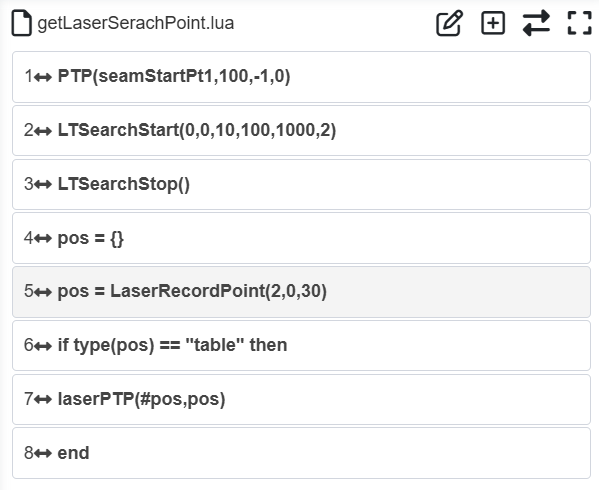

.. centered:: 图表 8.16‑6 程序编程切换模式

.. figure:: robot_peripherals/265.png
   :align: center
   :width: 4in

.. centered:: 图表 8.16‑7 修改获取激光寻位点程序

**Step 5**:按照步骤Step1-Step4，进行第二条焊缝的寻位，获取激光寻位点位置。

.. figure:: robot_peripherals/266.png
   :align: center
   :width: 4in

.. centered:: 图表 8.16‑8 第二条焊缝寻位点获取

大儒DFC力控打磨头应用
-----------------------------------------------------------

概述
~~~~~~~~~~~~~~~~~~~~~~~

在机器人末端安装DFC打磨头可帮助机器人快速部署不同场景的打磨、抛光、去除毛刺等工作，可针对不同尺寸、形状的工件自定义打磨力控大小，提高打磨工作的精度和效果。

硬件描述
+++++++++++++++++++++++++++++
协作机器人通过以太网与大儒DFC打磨头进行通讯控制，在WebApp上生成大儒DFC打磨头通讯协议，协议将控制数据通过TCPIP发送至大儒力控控制器模块，模块再将收到的控制数据发送至DFC力控执行器，从而实现对打磨头的控制。其中力控控制器模块为以太网通讯的服务端，可连接两个通道的打磨头执行器。

.. figure:: robot_peripherals/267.png
   :align: center
   :width: 6in

.. centered:: 图表 8.17‑1 协作机器人大儒DFC打磨头应用

力控控制器模块需进行如下配置：以太网端配置为IP地址为：192.168.58.88，端口号为2000。 

功能配置
~~~~~~~~~~~~~~~~~~~~~~~~~~~~~~
打开WebApp，依次点击“初始设置”、“外设”、“打磨”；打磨头的控制类型有已适配设备和外设开放协议两种：
已适配设备：对已适配的打磨头设备类型自动生成加载开放协议，不需要用户撰写。
外设开放协议：用户通过lua撰写需要适配的打磨头开放协议实现通信控制。

.. figure:: robot_peripherals/268.png
   :align: center
   :width: 6in

.. centered:: 图表 8.17‑2 打磨控制类型

已适配设备配置
+++++++++++++++++++++++++++++++++++++++

打开WebApp，依次点击“初始设置”、“外设”、“打磨头”、“已适配设备”。设备状态中的类型选择“大儒DFC打磨头”，点击“配置”，则会自动加载内嵌的外设开放协议“CtrlDev_DARUDFCPOLISH.lua”

.. figure:: robot_peripherals/269.png
   :align: center
   :width: 6in

.. centered:: 图表 8.17‑3 大儒DFC设备外设开放协议自动加载
 
在确保硬件链路连接正确的情况下，可启动开放协议，当运行状态为绿色并且右侧Polish状态反馈的通信状态为建立连接时说明机器人成功与打磨头控制器建立通信。此时可通过参数配置，配置需要设置力控的打磨头通道及设定力大小，开放协议会循环发送设定值、通道、机器人当前的rx、ry、rz至打磨头，如图2-3所示。此外Polish状态反馈也会实时显示当前打磨头反馈的力控值和力控超限警告，当产生警告时，页面右上角也会进行报警提醒，如图2-4所示。

.. figure:: robot_peripherals/270.png
   :align: center
   :width: 6in

.. centered:: 图表 8.17‑4 DFC打磨头页面设置及状态反馈

.. figure:: robot_peripherals/271.png
   :align: center
   :width: 6in

.. centered:: 图表 8.17‑5 DFC打磨头力控超限报警

外设开放协议下载
+++++++++++++++++++++++++++++++++++++++

在“外设开放协议”中点击“下载”按钮，即可将协议下载到本地计算机。外设开放协议为一个循环执行的LUA程序，程序在每个循环执行如下步骤：

①从机器人中读取DFC打磨头的控制数据；

②通过socket将控制数据写入到DFC打磨头中；

③通过socket从DFC打磨头读取状态数据；

④向机器人中反馈DFC打磨头状态数据；

通讯协议循环执行实现机器人与打磨头的通讯控制。在通讯协议中用户可自定义循环周期、需要连接的服务端端口及IP。

以下为大儒DFC打磨头通讯协议代码示例：

.. code-block:: 
    :linenos:

    local id = 1 
    local ctrlValues = {0,0, 0,0, 0,0, 0,0}
    local realTimeState = {0,0, 0,0, 0,0, 0,0}
    socket1 = TCPClientConnect('192.168.58.88', 2000, 500, 10, 2, 3)
    sleepCnt = 100
    while(sleepCnt > 0) do
        local stopFlag = GetOpenLUAStopFlag(id)
        if(stopFlag ~= 0) then 
          TCPClientDisconnect(socket1)
          setDFCPolishRealtimeState(0, 0, 0)
          break
        end 
      sleepCnt = sleepCnt -1
      sleep_ms(50)
    end
    local cnt = 5
    while(1) do
        channel, force = getDFCPolishSet()
        comState, sendBuff = DFCPolishInput(socket1, channel, force)
        sleep_ms(50)

        byte, error, forceFeedback = DFCPolishOutput(socket1)
        setDFCPolishRealtimeState(comState, error, forceFeedback)
        sleep_ms(50)

      if(comState == 0) then
          TCPClientDisconnect(socket1)
          while(cnt > 0) do
            socket1 = TCPClientConnect('192.168.58.88', 2000, 500, 10, 2, 3)
            cnt = cnt - 1
            if(socket1 > 0)then
              break
            end
          end
      end

        local stopFlag = GetOpenLUAStopFlag(id)
        if(stopFlag ~= 0 or cnt == 0) then 
          TCPClientDisconnect(socket1)
          setDFCPolishRealtimeState(0, 0, 0)
          break
        end    
    end

DFC打磨头LUA程序应用
~~~~~~~~~~~~~~~~~~~~~~~~~~~~~~~~~~~~~~~~~~~~~~~~

在机器人LUA程序中增加DFC力控配置和通道切换、状态获取等指令，配合机器人运动指令，可以灵活、便捷的实现打磨应用。
打开WebApp，依次点击“示教程序”、“程序编程”，新建LUA程序“testDFC.lua”。

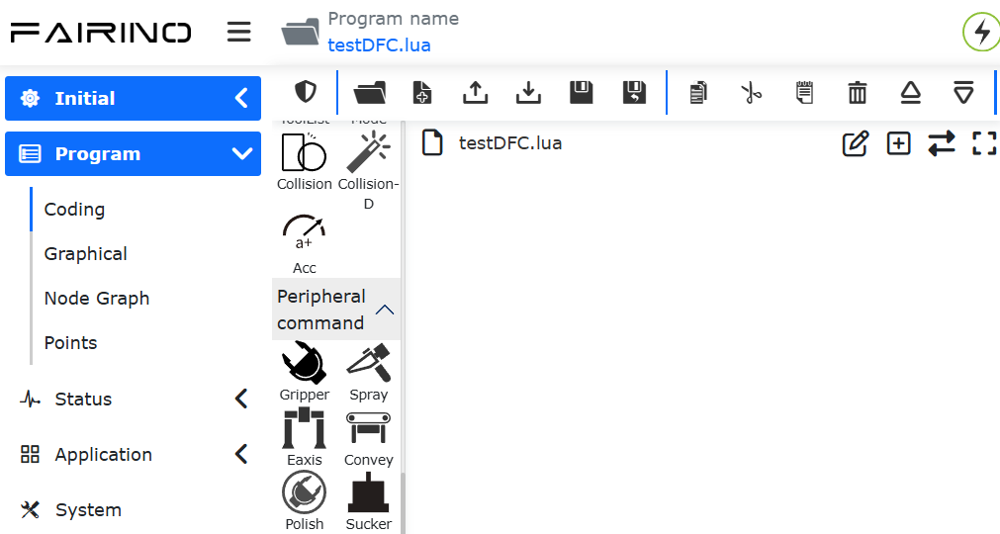

.. centered:: 图表 8.17‑6 新建“testDFC.lua”程序

选择指令类型为“外设指令”，在外设指令中点击“打磨设备”按钮。此时在WebApp右侧出现“Polish”打磨指令添加页面，设备类型选择“大儒DFC打磨头”。

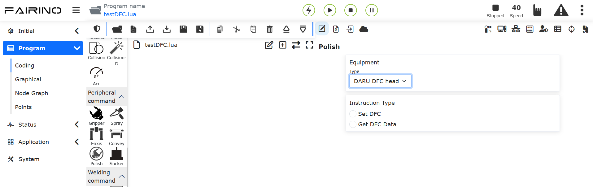

.. centered:: 图表 8.17‑7 打磨头指令添加

打磨头控制指令添加
++++++++++++++++++++++++++++++++++++++++++++

在LUA程序中编写打磨头控制指令可以对DFC进行力控设置和通道选择。

在打磨设备指令添加页面中点击“设置DFC”，选择打磨头通道模式为“2”，设定力为“10”。点击“添加”按钮，即在“程序预览”中添加打磨头设置指令。

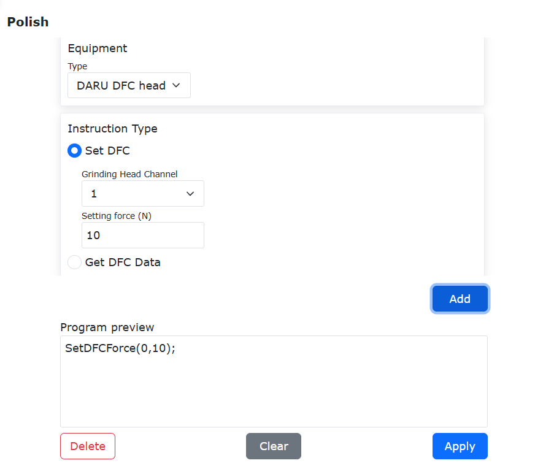

.. centered:: 图表 8.17‑8 添加打磨头控制指令
 
打磨头状态获取指令添加
++++++++++++++++++++++++++++++++++++++++++++++++

点击“获取DFC数据”，依次点击“添加”、“应用”按钮。即在“testDFC.lua”中添加一条获取打磨头数据的指令“GetDFCState()”。

.. figure:: robot_peripherals/275.png
   :align: center
   :width: 6in

.. centered:: 图表 8.17‑9 添加获取打磨头状态指令

GetDFCState ()指令返回2个数值，分别如下：

**DFCwarn**：力控超限警告 0-正常 1-报警；

**force**：力控反馈值。

在“testDFC.lua”中用三个变量接收GetDFCState ()函数的返回值。并通过Lua变量查询将上述信息显示在WebApp变量查询显示区中。

.. figure:: robot_peripherals/276.png
   :align: center
   :width: 6in

.. centered:: 图表 8.17‑10 获取打磨头状态程序

应用示例
+++++++++++++++++++++++++++++++++++++++

以下为DFC 打磨头控制及监控LUA程序示例：

.. code-block:: 
    :linenos:

    SetDFCForce(0,25)
    while (1) do 
        PTP(c1,100,-1,0)
        SetDO(0,1,0,0)
        ARC(c2,0,0,0,0,0,0,0,c3,0,0,0,0,0,0,0,100,-1,0,100,200)
        DFCwarn,force = GetDFCState()
        RegisterVar("number","DFCwarn")
        RegisterVar("number","force")
        if(DFCwarn == 1) then
            PTP(safe,100,-1,0)
            break
        else
            PTP(p6,100,-1,0)
        end
        SetDO(0,0,0,0)
    end

末端透传功能
----------------------------------------------------------

概述
~~~~~~~~~~~~~~~~~~~~~~~~~~~~~~
用户可通过配置末端透传功能，基于末端外设开放协议+CNDE+SDK接口，实现任意末端外设的非周期数据收发及周期数据获取的功能。其中周期数据需要撰写末端lua开放协议并上传应用到末端，实现周期性与外设交互读取，并通过CNDE配置获取外设反馈周期数据，非周期数据通过SDK接口实现数据帧的收发。 

使用说明
~~~~~~~~~~~~~~~~~~~~~~~~~~~~~~~~~~~~~~~~~~~~~~~~~~~~~~~~~~~~~~~~~~~~~~~~~~

**Step1**：打开机器人页面选择“初始设置”->“外设”->“末端透传”，上传并应用需要适配外设的末端lua开放协议。

.. figure:: robot_peripherals/289.png
   :align: center
   :width: 6in

.. centered:: 图表 8.18‑1 末端透传协议上传
 
**Step2**：重启机器人后，打开“末端协议启用”按钮，即可开启该功能。需要注意的是开启该功能后，其他已适配末端设备将不可同时使用。

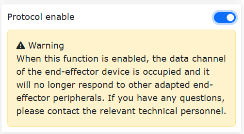

.. centered:: 图表 8.18‑2 末端透传协议开启
 
**Step3**：打开机器人页面选择“示教程序”->“外设指令”->“末端透传”，即可在末端透传开启后，通过lua接口进行末端非周期数据的收发及周期数据的获取的调试测试，实际使用需要配合机器人的CNDE功能及SDK进行使用。其中非周期指令发送与接受数据长度最长16byte，周期数据最大128byte。

.. figure:: robot_peripherals/291.png
   :align: center
   :width: 6in

.. centered:: 图表 8.18‑3 末端透传非周期数据lua接口

.. figure:: robot_peripherals/292.png
   :align: center
   :width: 6in

.. centered:: 图表 8.18‑4 末端透传周期数据lua接口

末端透传功能Lua脚本
~~~~~~~~~~~~~~~~~~~~~~~~~~~~~~~~~~~~~~~~~~~~~~~~~~~~~~~~~~~~~~

概述
++++++++++++++++++++++++

Lua开放协议功能新增通用数据透传接口，根据约定的Lua C接口编写Lua脚本，配合CNDE，实现对末端挂载设备的数据收发。

末端Lua脚本编写说明
++++++++++++++++++++++++++++++++++++++++++++++++++++++++++++++++++++++++

Rs485发送与接收Lua C注册函数
*********************************************************************
（1）Rs485发送Lua C注册函数：EndTxCustomData()。此函数将指令通过Rs485发送给挂载设备。

.. code-block:: 
    :linenos:

    Tcmd={0}
    EndTxCustomData(Tcmd)

.. centered:: 代码8.18-1 Lua脚本说明

（2）Rs485接收Lua C注册函数：EndRxCustomData()。此函数接收挂载设备通过Rs485反馈的响应指令。

.. code-block:: 
    :linenos:

    Rcmd={0}
    EndRxCustomData(Rcmd)

.. centered:: 代码8.18-2 Lua脚本说明

非周期数据下发与反馈Lua C注册函数
*********************************************************************

（1）非周期数据下发Lua C注册函数：GetHostTransparentCmd()。通过此函数获取控制器是否下发非周期数据指令，有下发指令后获取非周期数据指令。非周期数据指令发送长度最大16Bytes。

.. code-block:: 
    :linenos:

    Tcmd={0}
    RxFlag=0
    RxFlag = GetHostTransparentCmd(Tcmd)
    if(RxFlag == 1)then
    EndTxCustomData(Tcmd)

.. centered:: 代码8.18-3 Lua脚本说明

（2）非周期数据指令反馈Lua C注册函数：BackHostTransparentCmd()。通过此函数将挂载设备响应的非周期数据指令透传给控制器。非周期数据指令接收长度最大16Bytes。

.. code-block:: 
    :linenos:

    Rcmd={0}
    EndRxCustomData(Rcmd)
    BackHostTransparentCmd(Rcmd)

.. centered:: 代码8.18-4 Lua脚本说明

周期数据反馈Lua C注册函数
*********************************************************************

（1）周期数据反馈Lua C注册函数：SetDWrodInputBack()。通过此函数将读取到的挂载设备周期数据透传给控制器。周期数据反馈最大128Bytes。

.. code-block:: 
    :linenos:

    R = {0}
    TotalNum =0
    PacketNum=0
    TotalNum,PacketNum=SetDWrodInputBack(R)

.. centered:: 代码8.18-5 Lua脚本说明

以倍益康艾灸头为例编写的Lua脚本
*********************************************************************

.. code-block:: 
    :linenos:

    --***
    --维持末端其他功能正常运行
    while(1)
    do
    IwdgTaskHandle()
    MainLoop()
    UpDownLoadHandle()
    SdoRwPara()
    EndErrClear()
    local BFlag=LuaBreak()
    if(BFlag==1)then
    break
    end
    --***
    --***
    --非周期数据下发示例
    Rcmd = {0}       --存储挂载设备响应的非周期数据
    Tcmd = {0}       --存储控制器下发的非周期数据
    RxFlag=0         --控制器是否下发指令标志位
    RxFlag = GetHostTransparentCmd(Tcmd)
    if(RxFlag == 1)then
    EndTxCustomData(Tcmd)
    DelayMs(35)
    EndRxCustomData(Rcmd)
    if((#Rcmd) > 1))and(R[1]==0xAB)and(R[2]==0xBA)) then
    BackHostTransparentCmd(Rcmd)
    end
    end
    --***
    --***
    --周期数据下发示例
    R = {0}          --存储挂载设备响应的周期数据
    T = {0xAB,0xBA,0x14,0x01,0xAA,0x24}     --查询挂载设备周期数据指令
    if TotalNum==0 then
    EndTxCustomData(T)
    DelayMs(35)
    EndRxCustomData(R)
    end
    TotalNum =0      --周期数据如需分包，总分包数
    PacketNum=0     --当前包序号
    if((#R==19)and(R[1]==0xAB)and(R[2]==0xBA)and(R[3]==0x14)and(R[4]==0x0E))then
    TotalNum,PacketNum=SetDWrodInputBack(R)
    if PacketNum>TotalNum then
    PacketNum=0
    TotalNum=0
    end
    end
    --***
    LuaGc()
    end

