安全
===============

.. toctree:: 
   :maxdepth: 6

安全停止
----------------

点击菜单栏“初始设置”->“安全”，点击“安全停止”子菜单进入配置界面，设置安全停止模式和安全停止策略参数功能。

.. image:: safety/001.png
   :width: 4in
   :align: center

.. centered:: 图表 7.1-1 安全停止配置

安全停止双通道+缩减模式可配置
~~~~~~~~~~~~~~~~~~~~~~~~~~~~~~~~~~~~~~~~~~~~~~~~~~~~~~~~~~~~~~~~

概述
++++++++++++++++++++++++++++++++++++

当安全停止的触发方式设置为“双通道”时，必须双通道保证清除状态并在操作界面人为清除警告后机器人才可复位。此外，在策略配置中增加缩减模式选项，当用户选择该策略时，机器人将进入缩减模式运动。

操作流程
++++++++++++++++++++++++++++++++++++

**Step1**：点击“初始设置”—>“安全”—>“安全停止”按钮，触发方式可选为“默认”和“双通道”两种模式，二者不同之处在于：“默认”模式在触发并恢复后自动清除界面报错，“双通道”模式在触发并恢复后需手动清除界面报错。“安全停止策略”可选择“停止”、“暂停”、“一级缩减模式”和“二级缩减模式”等类型，详细说明如下：当选为“停止”时，机器人将停止当前运动；当选为“暂停”时，机器人将暂停当前运动，恢复并清除报错后，将恢复暂停；当选为“一级缩减模式”时，机器人将进入一级缩减模式运动；当选为“二级缩减模式”时，机器人将进入二级缩减模式运动。

.. image:: safety/048.png
   :width: 4in
   :align: center

.. centered:: 图表 7.1-2 安全停止策略设置

**Step2**：因当触发方式选为“默认”时，在触发恢复后，可自动清除界面报错，因此无需过多介绍。故主要介绍当触发方式选为“双通道”时的操作：在触发恢复后，需手动点击右上角的“清除”操作，机器人才可复位。

.. image:: safety/049.png
   :width: 4in
   :align: center

.. centered:: 图表 7.1-3 手动清除安全停止触发操作

安全速度
----------------

点击菜单栏“初始设置”->“安全”，点击“安全速度”子菜单进入配置界面，设置安全速度。

.. note:: TCP手动速度小于250mm/s。

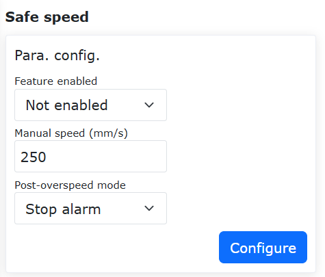

.. centered:: 图表 7.2-1 安全手动速度配置

安全速度功能
~~~~~~~~~~~~~~~~~~~~~~~~~~~~~~~~~~~~~~~~~~~~~~~~~~

概述
+++++++++++++++++++++++++++++

机器人安全速度功能是在人机协作或动态环境中，通过主动限制机器人的运行速度，将动能与冲击力控制在安全阈值内，从而在意外接触时防止人员受伤，并有效保护设备与工件免受碰撞损害。

操作流程
+++++++++++++++++++++++++++++

**Step1**：点击“初始设置”-“安全”-“安全速度”按钮，进行安全速度参数的设置：主要包含“功能启用”、“限制速度”、“超速后模式”三部分。

其中，功能启用中可选择“不启用”、“手动模式启用”和“所有模式启用”三种类型；

限制速度中进行限制速度的设置，机器人的线速度达到该限制速度时，将根据“超速后模式”的设定参数进行处理。“超速后模式”可选择“停止报警”、“自动限速”和“停止报警后去使能”三种模式，自动限速仅可在“手动模式启用”中使用。

设置完成所需参数后，无需多余操作，将按照设定参数对机器人的运动进行处理，参数设置如图所示。

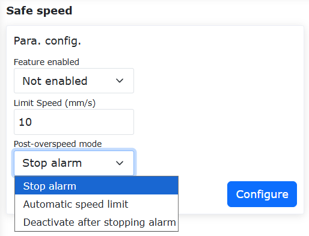

.. centered:: 图表 7.2-2 安全速度参数设置

I/O安全
----------------

点击菜单栏“初始设置”->“安全”，点击“I/O安全”子菜单进入配置界面。

HMI提供对16路数字量输入和16路数字量输出的安全状态进行设置，可设置为有效或无效状态，当控制器判断到处于安全状态时，16路数字量输入和16路数字量输出被设置成安全状态。

.. image:: safety/003.png
   :width: 4in
   :align: center

.. centered:: 图表 7.3-1 I/O安全状态配置

在LA系统下：
    “I/O安全”中提供DIO安全功能，安全功能为双路DI或者DO，当检测到安全DI信号或安全状态标志触发时，输出DO。

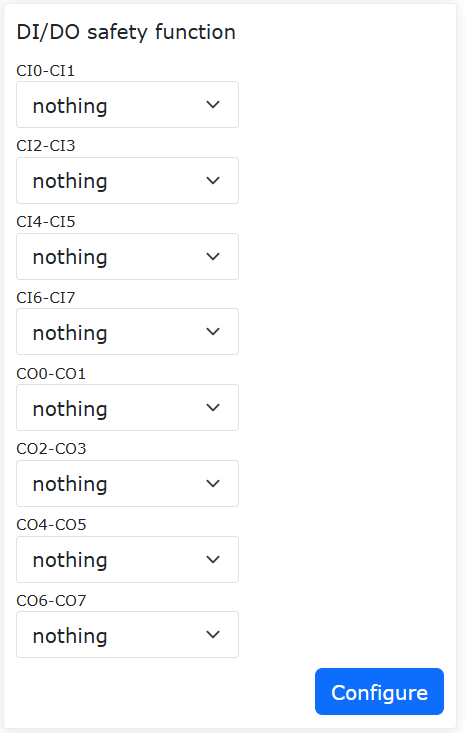

.. centered:: 图表 7.3-2 I/O安全功能配置

急停停机
----------------

点击菜单栏“初始设置”->“安全”，点击“急停停机”子菜单进入配置界面。

急停停机类型0、1a、1b、2可设置、停机时间限值可设置、停止距离限值可设置。

- 通过控制器送控制箱板，急停停机类型0控制箱板直接断电；
  
- 急停停机类型1a为减速停机后，切断本体电源；
  
- 急停停机类型1b为减速停机后，不切断本体电源，本体去使能；

- 急停停机类型为2表示拍下急停，机器人减速停止并且保持使能，松开急停后，机器人应可以正常运行。

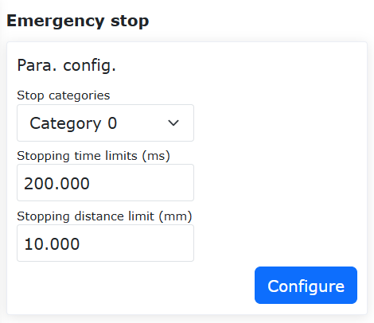

.. centered:: 图表 7.4-1 急停停机配置

安全停止恢复可选自动使能功能
~~~~~~~~~~~~~~~~~~~~~~~~~~~~~~~~~~~~~~~~~~~~~~~~~~~~~

概述
+++++++++++++++++++++

机器人在经历过1b类急停停机后，提供了手动使能和自动使能两种模式，以供用户自行选择。当选为手动使能时，用户需在松开急停按钮后，将机器人的运行模式改为自动，手动点击使能按钮进行机器人使能；当选为自动使能时，用户在松开急停按钮后，机器人即可自动使能。

操作流程
+++++++++++++++++++++++++++

**Step1**：点击“初始设置”—>“安全”—>“急停停机”按钮，“停机类型”选为“1b类”，并根据实际需要设置“停机时间限制”和“停机距离限制”参数，“急停复位后使能策略”可选为“手动使能”或“自动使能”。

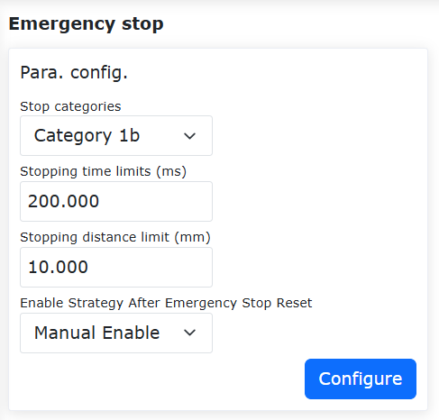

.. centered:: 图表 7.4-2 使能策略设置

**Step2**：当选为“自动使能”时，用户在松开急停按钮后，机器人即可自动使能；当选为“手动使能”时，用户需在松开急停按钮后，在自动模式下，手动点击使能按钮进行机器人使能。

.. image:: safety/047.png
   :width: 6in
   :align: center

.. centered:: 图表 7.4-3 手动使能操作

保护性停机
----------------

点击菜单栏“初始设置”->“安全”，点击“保护性停机”子菜单进入配置界面。

保护性停机类型0、1、2，保护性停机类型0控制箱板直接断电，保护性停机类型1控制箱板先通知控制器控制机器人停住然后控制器反馈控制箱板断电，保护性停机类型2控制箱板通知控制器控制机器人停住。

.. image:: safety/006.png
   :width: 4in
   :align: center

.. centered:: 图表 7.5-1 保护性停机配置

.. important::
    安全数据状态标志和控制箱载板故障反馈通过Web端与控制器状态反馈中获取，当出现标志位为1时在WebAPP报警状态中提示安全数据状态异常。控制箱载板故障获取后的依据报错代码在WebAPP报警状态中展示具体报错信息。

.. image:: safety/007.png
   :width: 4in
   :align: center

.. centered:: 图表 7.5-2 WebAPP报警状态

干涉区配置
--------------

在“初始设置”->“安全”->“干涉区”的菜单栏下，点击“单个”子菜单项进入干涉区配置功能界面。

首先我们需要对干涉方式和进入干涉区操作进行配置，干涉方式分为“轴干涉”和“立方体干涉”。

.. image:: safety/025.png
   :width: 3in
   :align: center

.. centered:: 图表 7.6‑1 干涉区方式

通过滑块开关控制是否开启。首先进行干涉区运动配置“继续运动”或者“停止”。接下来设置进入干涉区拖动配置，用户可以根据需求设置拖动模式下进入干涉区后策略，不限制拖动，阻抗回调和切换回手动模式。

.. image:: safety/026.png
   :width: 3in
   :align: center

.. centered:: 图表 7.6‑2 干涉区配置

选择轴干涉，需要对轴干涉的参数进行配置，检测方法分为“指令位置”和“反馈位置”两种，干涉区模式分为“范围内干涉”和“范围外干涉”两种，接下来设置每个关节的范围以及各个关节范围是否使能，可以输入数值，也可以通过“最小值”和“最大值”后的“刷新图标”将当前机器人的位置记录到当中，最后点击配置即可。

.. image:: safety/027.png
   :width: 3in
   :align: center

.. centered:: 图表 7.6‑3 轴干涉配置

选择立方体干涉，需要对立方体干涉的参数进行配置，检测方法分为“指令位置”和“反馈位置”两种，干涉区模式分为“范围内干涉”和“范围外干涉”两种，参考坐标系分为“基坐标”和“工件坐标”，根据实际使用选择设置。接下来设进行范围设置，范围设置分为两种方法，首先看第一种方法“两点法”，即立方体的两个对角的顶点组成，我们可以通过输入或者机器人示教记录位置。最后点击应用即可。

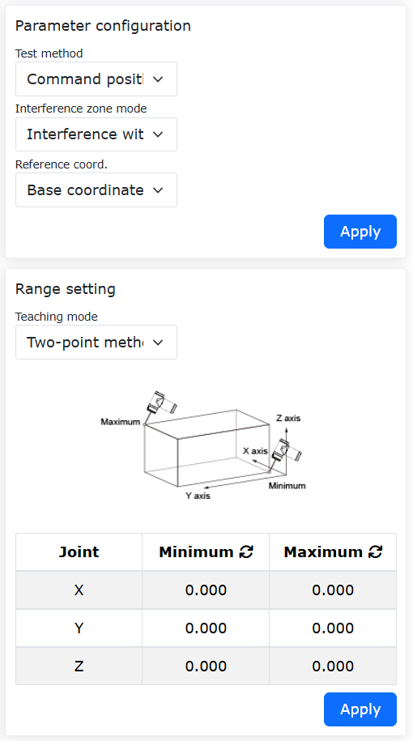

.. centered:: 图表 7.6‑4 立方体干涉配置

接下来看第二种方法“中心点+边长”，即立方体的中心位置点和立方体的边长构成干涉区，我们可以通过输入或者机器人示教记录位置。最后点击应用即可。

.. image:: safety/029.png
   :width: 3in
   :align: center

.. centered:: 图表 7.6‑5 立方体干涉配置

力传感器辅助拖动下进入轴干涉安全回调功能
~~~~~~~~~~~~~~~~~~~~~~~~~~~~~~~~~~~~~~~~~~~~~~~~~~~~~~~~~~~~~~~~~~~~~~

概述
+++++++++++++++++++++++++

力传感器辅助拖动下进入轴干涉的安全回调功能是力传感器辅助拖动与干涉区共存时，当机器人进入干涉区时，机器人自动切换成拖动模式，具有阻抗回调效果；当机器人退出干涉区后，机器人自动切换成力传感器辅助拖动。可满足用户在力传感器辅助拖动下的多种使用场景。

操作流程
++++++++++++++++++++++++

关节限位环
********************************
**Step1**：登录web界面，点击“关节限位环”开关，机器人关节处出现关节限位环，如下图所示。

.. image:: safety/030.png
   :width: 4in
   :align: center

.. centered:: 图表 7.6‑6 web界面关节限位环

**Step2**：关节限位环上白标指针代表关节实际角度；缺口代表对应关节软限位位置，关节限位环缺口大小随软限位大小变化；关节运动时，关节限位环与关节保持相对静止。

轴干涉配置
********************************
**Step1**：配置并激活轴干涉。依次点击“初始设置”—>“安全”—>“干涉区”—>“单个”，进入干涉区配置页面，点击“轴干涉”卡片进入界面，打开“功能开启”滑块。

**Step2**：可设置“运动策略”为“继续运动”，选择“拖动策略”为“阻抗回调”并设置阻抗回调参数，如下图所示，阻抗回调参数表示阻抗回调时的回弹力，数值越大回弹力越大，建议参数配置为“5”。

.. image:: safety/031.png
   :width: 4in
   :align: center

.. centered:: 图表 7.6‑7 轴干涉配置界面

**Step3**：设置轴干涉区范围。可设置“检测模式”为“反馈位置”，“干涉区模式”可选择“范围内干涉”及“范围外干涉”两种模式；设置各关节干涉区范围，选择“使能”开启对应轴干涉范围，如下图所示。

.. image:: safety/032.png
   :width: 4in
   :align: center

.. centered:: 图表 7.6‑8 干涉区范围配置界面

**Step4**：设置“干涉区模式”为“范围内干涉”，web界面关节限位环绿色为自由运动区域，黄色为干涉区域，白标指针所在区域高亮显示，如下图所示。

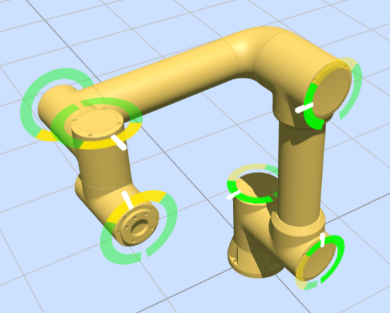

.. centered:: 图表 7.6‑9 “范围内干涉”时关节限位环显示

**Step5**：设置“干涉区模式”为“范围外干涉”，web界面关节限位环绿色为自由运动区域，黄色为干涉区域，白标指针所在区域高亮显示，如下图所示。

.. image:: safety/034.png
   :width: 4in
   :align: center

.. centered:: 图表 7.6‑10 “范围外干涉”时关节限位环显示

力传感器辅助拖动下进入轴干涉区
++++++++++++++++++++++++++++++++++++++++++++++++++

**Step1**：依次点击“辅助应用”—>“工具应用”—>“拖动锁定”将力传感器辅助锁定功能“状态开关”切换为“开启”，将干涉区选项选择“开启”，设定相关系数并应用，如下图所示。

.. image:: safety/035.png
   :width: 4in
   :align: center

.. centered:: 图表 7.6‑11 力传感器辅助拖动配置界面

**Step2**：在力传感器辅助拖动下拖动机器人，当机器人关节角度到达干涉区范围时，切换机器人模式为电流环拖动，具有阻抗回调效果，可远离轴干涉区；退出轴干涉区范围后，切换机器人模式为力传感器辅助拖动。

立方体干涉配置
++++++++++++++++++++++++++++++++++

**Step1**：设置立方体干涉区。依次点击“初始设置”—>“安全”—>“干涉区”—>“单个”，进入干涉区配置页面，点击“立方体干涉”卡片进入界面，打开“功能开启”滑块。

**Step2**：可设置“运动策略”为“继续运动”，选择“拖动策略”为“不限制拖动”，如下图所示。

.. image:: safety/036.png
   :width: 4in
   :align: center

.. centered:: 图表 7.6‑12 立方体干涉区配置

**Step3**：设置立方体干涉区参数配置。可设置“检测模式”为“反馈位置”，“干涉区模式”可选择“范围内干涉”及“范围外干涉”两种模式，“参考坐标”设置为“基坐标”。

**Step4**：选择立方体干涉区范围的示教方式为“两点法”。示教机器人选择两个点位，分别为笛卡尔空间最小点及最大点，点击“应用”后web界面出现虚拟立方体，如下图所示。

.. image:: safety/037.png
   :width: 4in
   :align: center

.. centered:: 图表 7.6‑13 “两点法”设置立方体干涉区

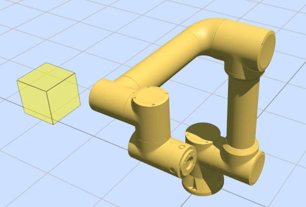

.. centered:: 图表 7.6‑14 web界面显示虚拟立方体

**Step5**：选择立方体干涉区范围的示教方式为“中心点+边长”。示教机器人一个点位，设置以示教点为中心的X、Y、Z三轴边长，如下图所示，点击“应用”后web界面出现虚拟立方体。

.. image:: safety/039.png
   :width: 4in
   :align: center

.. centered:: 图表 7.6‑15 “中心点+边长”设置立方体干涉区

**Step6**：设置“干涉区模式”为“范围内干涉”，当机器人末端在立方体范围外，web界面虚拟立方体显示为透明度40%黄色，当机器人末端在立方体范围内时，立方体呈90%透明度黄色，并出现“进入干涉区”警告，如下图所示。

.. image:: safety/040.png
   :width: 4in
   :align: center

.. centered:: 图表 7.6‑16 “范围内干涉”模式时进入立方体干涉区

**Step7**：设置“干涉区模式”为“范围外干涉”，当机器人末端在立方体范围内，web界面虚拟立方体显示为透明度40%绿色，当机器人末端在立方体范围外时，立方体呈90%透明度绿色，并出现“进入干涉区”警告，如下图所示。

.. image:: safety/041.png
   :width: 4in
   :align: center

.. centered:: 图表 7.6‑17 “范围外干涉”模式时立方体干涉区显示

安全墙配置
++++++++++++++++++++++++++++++++++++++++++
**Step1**：设置安全墙。依次点击“初始设置”—>“安全”—>“安全墙”进入安全墙配置界面，web界面支持最多同时设置8个安全墙，选择安全墙并配置安全墙，配置完成后启用对应安全墙，web界面出现透明度40%橙色虚拟墙体，如下图所示。

.. image:: safety/042.png
   :width: 4in
   :align: center

.. centered:: 图表 7.6‑18 安全墙配置

.. image:: safety/043.png
   :width: 4in
   :align: center

.. centered:: 图表 7.6‑19 web界面虚拟墙体显示

**Step2**：机器人末端进入安全墙，虚拟墙体呈90%透明度橙色，并出现“进入安全墙”警告，如下图所示。

.. image:: safety/044.png
   :width: 4in
   :align: center

.. centered:: 图表 7.6‑20 机器人末端进入安全墙web界面虚拟墙体显示

立方体干涉功能
~~~~~~~~~~~~~~~~~~~~~~~~~~~~~~~~~~~~~~~~~~~~~~~~~~~~~~~~~~

概述
+++++++++++++++++++++++++++++++

立方体干涉功能支持同时定义并激活多个独立的立方体干涉区，每个干涉区在三维空间中的位置和尺寸可独立设定。此外，每个干涉区配备单独的CO触发信号输出，能够基于机器人的实时位置输出对应的触发信号。

操作流程
+++++++++++++++++++++++++++++++++++++++++++++++++++++++++++++++++++

**Step1**：进行立方体干涉功能启用和基础配置。依次点击“初始设置”->“安全”->“干涉区”->“立方体干涉”指令，通过滑块开关控制每个立方体干涉区是否开启，并进行基础配置。

其中，进入干涉区运动策略可选为“继续运动”或“停止”，当选为“继续运动”时，机器人进入干涉区后将提示警告但继续运动；当选为“停止”时，机器人进入干涉区后将提示警告并停止运动。进入干涉区拖动策略可选为“不限制拖动”、“阻抗回调”和“切换回手动模式”。

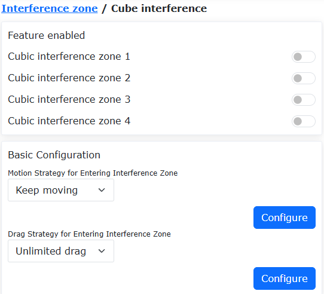

.. centered:: 图表 7.6‑21 立方体开启控制与基础配置

**Step2**：进行立方体干涉区配置。可为每个干涉区ID设置不同的配置参数，需注意的是：

(1) 检测方法需根据实际功能需求选择“指令位置”或“反馈位置”；

(2) 当干涉区模式选为“范围外干涉”时，仅对单个干涉区有效。

.. image:: safety/051.png
   :width: 4in
   :align: center

.. centered:: 图表 7.6‑22 立方体干涉区配置

**Step3**：进行干涉区范围设置。范围设置可选择“两点法”或“中心点+边长”的方式生成立方体干涉区。“两点法”方式通过指定立方体的两个对角顶点生成。“中心点+边长”方式通过指定立方体的中心点和三条边长生成。

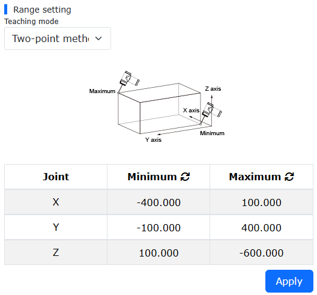

.. centered:: 图表 7.6‑23 “两点法”生成干涉区

.. image:: safety/053.png
   :width: 4in
   :align: center

.. centered:: 图表 7.6‑24 “中心点+边长”生成干涉区

**Step4**：进行CO信号设置。依次点击“初始设置”->“基础”->“I/O设置”-“DO”指令，为每个立方体配置相应的CO输出。

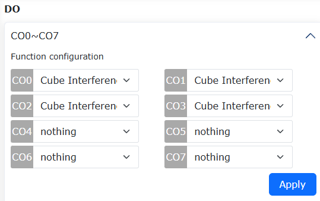

.. centered:: 图表 7.6‑25 CO输出配置

**Step5**：各立方体干涉区将根据设定的ID序号在机器人界面进行显示，当机器人末端中心点进入到干涉区后，界面会显示“进入干涉区”警告，对应的CO接口输出信号。

.. image:: safety/055.png
   :width: 4in
   :align: center

.. centered:: 图表 7.6‑26 多立方体干涉区界面显示

缩减模式
---------------

点击菜单栏“初始设置”->“安全”，点击“缩减模式”子菜单进入配置界面，选择“一级/二级模式”配置关节速度和末端TCP速度。

.. image:: safety/045.png
   :width: 4in
   :align: center

.. centered:: 图表 7.7-1 缩减模式

安全墙
---------------

点击菜单栏“初始设置”->“安全”，点击“安全墙配置”子菜单进入配置界面。

-  **安全墙配置**：点击启用按钮，可启用的相应的安全墙。当安全墙未配置安全范围时，会提示报错。点击下拉框，选择想要设定的安全墙，自动带出安全距离(可不设置，默认为0)，再点击“设置”按钮，设置成功。
  
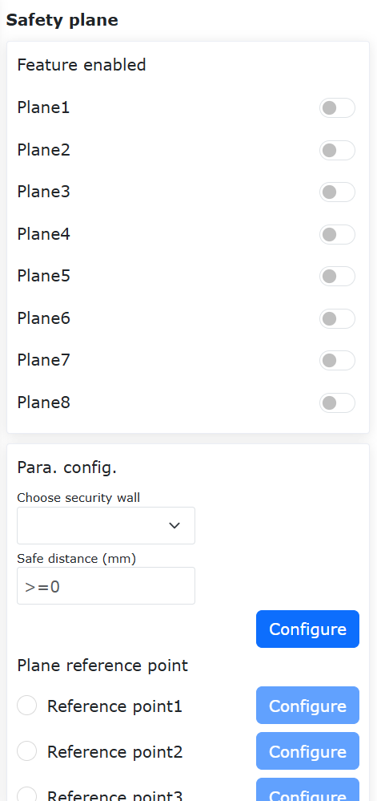

.. centered:: 图表 7.8-1 安全墙配置

-  **安全墙参考点配置**：选择安全墙后，可设置四个参考点。前三个点为平面参考点，用来确认设置的安全墙的平面。第四个点为安全范围参考点，用来确认设置的安全墙的安全范围。

.. important::
   若参考点设置成功，则亮绿灯。反之，则亮黄灯。直到参考点设置成功后转为绿灯。当四个参考点都设置成功后，可计算其安全范围，计算成功后安全范围参数点状态恢复默认。

.. image:: safety/009.png
   :width: 4in
   :align: center

.. centered:: 图表 7.8-2 安全范围参考点设置

-  应用效果：启用配置成功的安全墙。拖动机器人，若机器人末端TCP处在设定安全范围内，则系统正常。若处在设定安全范围之外，则提示报错。

.. image:: safety/010.png
   :width: 6in
   :align: center

.. centered:: 图表 7.8-3 安全范围设置成功后效果图

安全后台程序
---------------

点击菜单栏“初始设置”->“安全”，点击“安全后台程序”子菜单进入配置界面。

用户点击“功能启用”按钮打开或者关闭安全后台程序的设置。选择"意外情况 "和"后台程序"，点击“设置”按钮配置意外情况处理逻辑的参数。

启用安全后台程序并设置意外情况场景和后台程序，当用户开始运行程序，发生的意外情况场景与设置的意外情况匹配时，机器人会执行相对应的后台程序，起到安全防护的作用。

.. image:: safety/011.png
   :width: 4in
   :align: center

.. centered:: 图表 7.9-1 安全后台程序

工具方向限制（仅在LA系统下使用）
---------------------------------------------

点击菜单栏“初始设置”->“安全”，点击“工具方向限制”子菜单进入配置界面。

工具方向限制是作用于机器人工具末端笛卡尔空间的用来限制机器人末端姿态运动范围的保护性功能，包括了功能启用设置，基准工具方向设定，最大偏移角设置。最大偏移角定义了工具末端笛卡尔坐标系Z轴与基准工具方向的最大夹角限制角度值，通常可理解为圆锥形空间。

.. centered:: 图表 7.10-1 工具方向限制

机器人限值（仅在LA系统下使用）
---------------------------------------------

点击菜单栏“初始设置”->“安全”，点击“机器人限值”子菜单进入配置界面。

机器人限值包括动量和功率，其中动量限值用于限制机器人最大动量，功率限值用于限制机器人做的机械功。

.. image:: safety/013.png
   :width: 4in
   :align: center

.. centered:: 图表 7.11-1 机器人限值

功率检测（仅在QX系统下使用）
---------------------------------------------

点击菜单栏“初始设置”->“安全”，点击“功率检测”子菜单进入配置界面。

当直接作用于机器人的电流环（仅有指令servoJT），用于限制机器人做的功。检测到机器人速度和力矩的积分超过限值，即进行功率保护。

.. image:: safety/014.png
   :width: 4in
   :align: center

.. centered:: 图表 7.12-1 功率检测

运动配置
---------------------------------------------

T形速度特性优化+blending平滑功能
~~~~~~~~~~~~~~~~~~~~~~~~~~~~~~~~~~~~~~~~~~~~~~~~~~~~~

概述
++++++++++++++++++++++

在两段轨迹之间进行blending，可避免因完全停止而带来的频繁启停问题，从而提升机器人的运动效率。

本功能主要针对PTP-PTP、LIN-LIN、ARC-ARC、LIN-ARC、ARC-LIN指令间进行blending，其余指令间的blending不生效。

操作流程
++++++++++++++++++++++

因各指令的操作方式类似，本手册以PTP-PTP间的blending为例说明该功能的操作方法，该功能可通过两种方式实现：使用Lua指令、使用运动配置开关。

使用Lua指令方式
*****************************

**Step1**：选择要执行PTP功能的示教点，本手册以“A0”~“A5”作为示教点的名称。

**Step2**：点击“示教程序”—>“程序编程”按钮，选择“运动指令”中的“点到点”指令，在“指令编辑”中选择示教点并设置调试速度，运动保护选择“加速度平滑模式”，在需要平滑的点处设置“平滑过渡”参数。

.. image:: safety/020.png
   :width: 6in
   :align: center

.. centered:: 图表 7.13-1 加速度平滑PTP的blending指令设置

**Step3**：生成Lua程序并运行，即可实现对PTP-PTP的blending功能，该方式仅对AccSmoothStart()和AccSmoothEnd()之间的指令使用优化后的T形速度进行运动，对其余指令使用原T形速度进行运动。

.. image:: safety/021.png
   :width: 4in
   :align: center

.. centered:: 图表 7.13-2 Lua指令方式进行PTP-PTP间blending典型程序

使用运动配置开关方
***********************************

**Step1**：点击“初始设置”—>“安全”—>“运动配置”按钮，打开“加速度平滑模式”的开关。

.. image:: safety/022.png
   :width: 6in
   :align: center

.. centered:: 图表 7.13-3 加速度平滑模式配置开关设置

**Step2**：选择要执行PTP-PTP功能的示教点，本手册以“A0”~“A5”作为示教点的名称。

**Step3**：点击“示教程序”—>“程序编程”按钮，选择“运动指令”中的“点到点”指令，在“指令编辑”中选择示教点并设置调试速度，运动保护选择“无”，在需要平滑的点处设置“平滑过渡”参数。

.. image:: safety/023.png
   :width: 6in
   :align: center

.. centered:: 图表 7.13-4 常规PTP的blending指令设置

**Step4**：生成Lua程序并运行，即可实现对PTP-PTP的blending功能，典型程序和常规PTP程序相同，该方式会对所有指令使用优化后的T形速度进行运动。

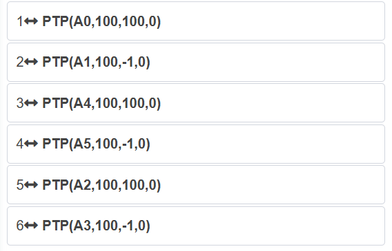

.. centered:: 图表 7.13-5 使用配置开关进行PTP-PTP间blending的典型程序

FIR自适应参数功能+FIR暂停恢复功能
~~~~~~~~~~~~~~~~~~~~~~~~~~~~~~~~~~~~~~~~~~~~~~~~~~~~~

概述
++++++++++++++++++++++

机器人时间最优模式参数自适应配置功能实现了无需调试配置其各项参数，该功能根据当前机器人的作业状态，自适应完成时间最优模式的参数配置，提升调试效率。

操作流程
++++++++++++++++++++++

机器人基础运动指令PTP、LIN及ARC的使用方式类似，本例以时间最优模式的PTP运动指令作为主要示例。

**Step1**：在机器人Web控制界面，依次点击“初始设置”->“安全”->“运动配置”，进入“运动配置”界面。

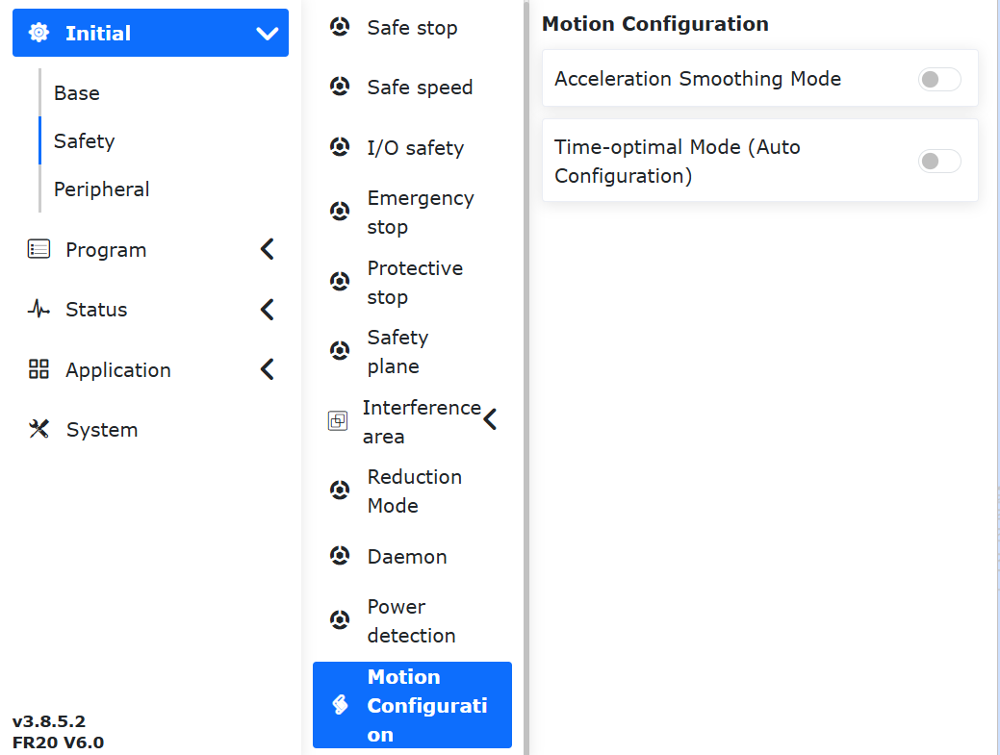

.. centered:: 图表 7.13-6 运动配置界面

**Step2**：在“运动配置”界面，点击“时间最优模式”开关，进入“时间最优模式”界面。

.. image:: safety/016.png
   :width: 3in
   :align: center

.. centered:: 图表 7.13-7 时间最优模式界面

.. note:: 在“时间最优模式”界面的“参数配置”栏中，在“调节系数”栏中可设置为-100~100，表示为缩放比例，用来控制运动指令的时间最优程度，默认值为1。

**Step3**：确定要执行PTP运动的示教点，本例以“A0”~“A5”作为示教点的名称。

**Step4**：在机器人Web控制界面，依次点击“示教程序”—>“程序编程”，进入“运动指令”界面。

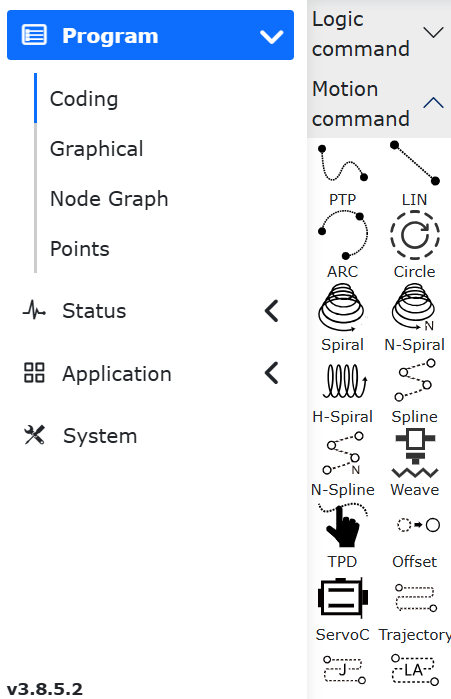

.. centered:: 图表 7.13-8 运动指令界面

**Step5**：在“运动指令”界面中，点击“点到点”，进入“PTP”指令编辑界面，分别在“点名称”下拉框中选择示教点、“调试速度”栏中设置期望速度比例、“在此点”栏中选择“停止”、“是否偏移”下拉框中选择“否”及“运动保护”栏中选择“无”后，点击“添加”。

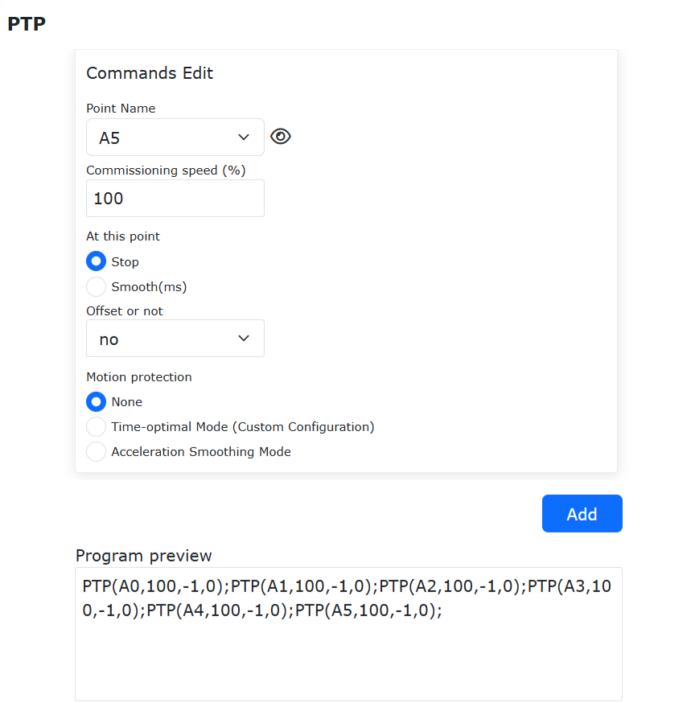

.. centered:: 图表 7.13-9 PTP运动指令编辑界面

**Step6**：“PTP”运动指令编辑界面，点击“应用”，即自动生成相应的LUA程序。

.. image:: safety/019.png
   :width: 4in
   :align: center

.. centered:: 图表 7.13-10 典型时间最优模式的PTP运动LUA程序

.. note:: 
   典型时间最优模式的PTP运动LUA程序与一般PTP运动LUA程序无异，其区别在于Step2步骤中已开启了“时间最优模式”功能。

   开启了“时间最优模式”功能开关，当前机器人基础运动指令PTP、LIN及ARC均处于时间最优模式，在该界面中关闭“时间最优模式”功能开关，即可恢复基础运动指令PTP、LIN及ARC状态。
   在该界面不能同时开启“加速度平滑模式”功能开关。
