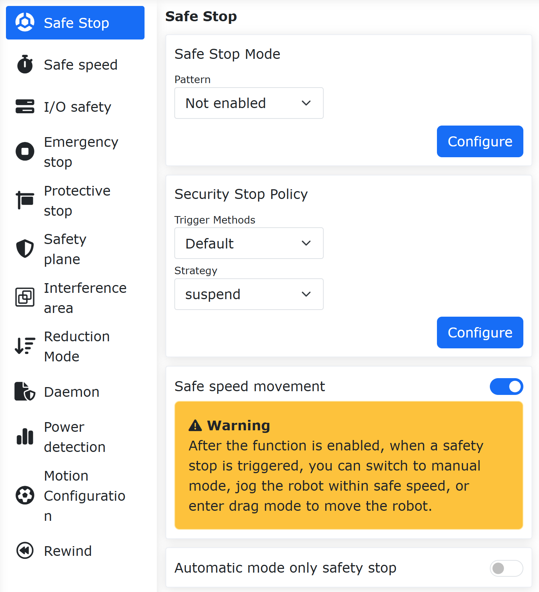
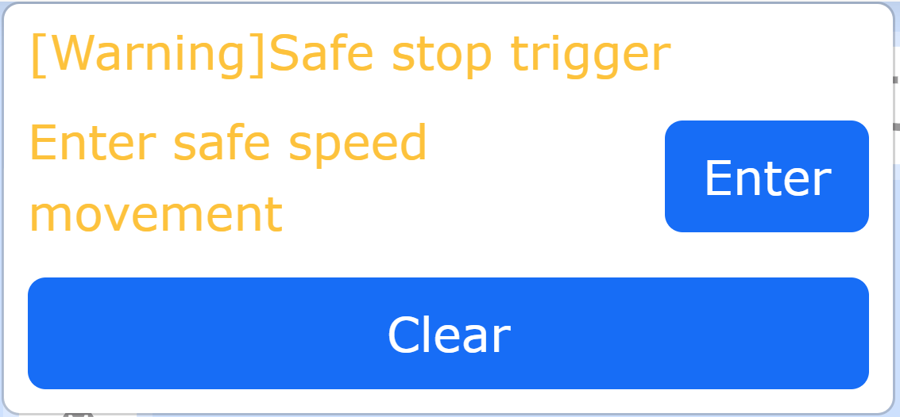
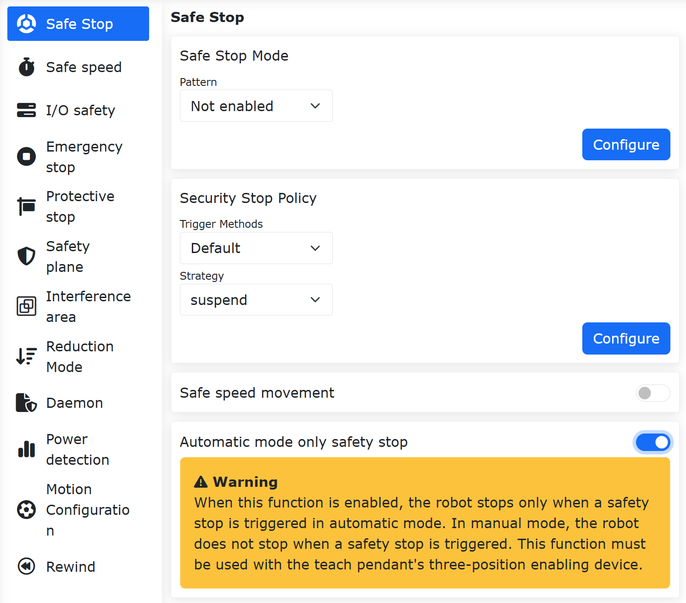
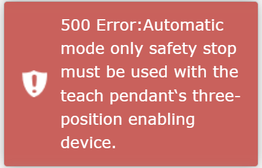

Segurança
===============

.. toctree:: 
   :maxdepth: 6

Parada de Segurança
--------------------------

Clique no menu “Configurações Iniciais” -> “Segurança” e, em seguida, clique no submenu “Parada de Segurança” para entrar na interface de configuração. Defina o modo de parada de segurança e os parâmetros da estratégia de parada de segurança.

.. image:: safety/001.png
   :width: 4in
   :align: center

.. centered:: Figura 7.1-1 Configuração de Parada de Segurança

Parada de Segurança de Dois Canais + Modo de Redução Configurável
~~~~~~~~~~~~~~~~~~~~~~~~~~~~~~~~~~~~~~~~~~~~~~~~~~~~~~~~~~~~~~~~~~~~~~~~~~~~~~~~~~~~~~

Visão Geral
++++++++++++++++++++++++++++++++++++

Quando o método de acionamento da parada de segurança é definido como “Dois Canais”, ambos os canais devem garantir a remoção do estado de parada, e o robô só pode ser reiniciado após o operador limpar manualmente o alerta na interface de operação. Além disso, uma opção de modo de redução é adicionada à configuração da estratégia. Quando o usuário seleciona esta estratégia, o robô entrará no modo de redução de movimento.

Procedimento Operacional
++++++++++++++++++++++++++++++++++++

**Step1**: Clique em “Configurações Iniciais” → “Segurança” → “Parada de Segurança”. O método de acionamento pode ser definido como “Padrão” ou “Dois Canais”. A diferença entre eles é: no modo “Padrão”, após o acionamento e a recuperação, o erro na interface é limpo automaticamente; no modo “Dois Canais”, após o acionamento e a recuperação, o erro na interface precisa ser limpo manualmente. A “Estratégia de Parada de Segurança” pode ser definida como “Parar”, “Pausar”, “Modo de Redução de Nível 1” ou “Modo de Redução de Nível 2”, com as seguintes explicações detalhadas: quando definido como “Parar”, o robô para o movimento atual; quando definido como “Pausar”, o robô pausa o movimento atual e retoma a pausa após a recuperação e a limpeza do erro; quando definido como “Modo de Redução de Nível 1”, o robô entra no movimento de redução de nível 1; quando definido como “Modo de Redução de Nível 2”, o robô entra no movimento de redução de nível 2.

.. image:: safety/048.png
   :width: 4in
   :align: center

.. centered:: Figura 7.1-2 Configuração da Estratégia de Parada de Segurança

**Step2**: Como, quando o método de acionamento é definido como “Padrão”, o erro na interface é limpo automaticamente após a recuperação do acionamento, isso não requer mais explicação. Portanto, a descrição principal é para quando o método de acionamento é definido como “Dois Canais”: após a recuperação do acionamento, é necessário clicar manualmente na operação “Limpar” no canto superior direito para reiniciar o robô.

.. image:: safety/049.png
   :width: 4in
   :align: center

.. centered:: Figura 7.1-3 Operação Manual para Limpar o Acionamento da Parada de Segurança

Movimento a Velocidade de Segurança
~~~~~~~~~~~~~~~~~~~~~~~~~~~~~~~~~~~~~~~~~~~~~~~~~~~~~~~~
Após o robô acionar uma parada de segurança, o usuário pode clicar em um botão no webapp, configurar uma entrada CI configurável da caixa de controle ou configurar uma entrada End DI configurável da ferramenta do end-effector para controlar o robô e fazê-lo entrar no estado de movimento a velocidade de segurança. No estado de movimento a velocidade de segurança, o robô pode ser movido a passo de homem (jog) em velocidade segura, ou entrar no modo de arrasto para ser arrastado, auxiliando o usuário a resolver problemas.

No webapp do robô, clique sequencialmente em "Configurações Iniciais", "Segurança", "Parada de Segurança", localize "Movimento a Velocidade de Segurança" nesta página e defina-o como habilitado.

.. centered:: Figura 7.1-4 Habilitar Movimento a Velocidade de Segurança

Quando uma parada de segurança for acionada neste momento, o canto superior direito do webapp do robô exibirá um aviso "Parada de Segurança Acionada" e mostrará o botão "Entrar em Movimento a Velocidade de Segurança".

.. centered:: Figura 7.1-5 Pop-up para Entrar em Movimento a Velocidade de Segurança

Clique no botão "Entrar", o robô irá automaticamente interromper o programa Lua e mudar para o modo manual. Ao mesmo tempo, o botão "Entrar em Movimento a Velocidade de Segurança" será atualizado para "Entrado". Neste ponto, o robô pode ser controlado através do botão do end-effector, caixa de botões, webapp, etc., para entrar no modo de arrasto e arrastar o robô, ou pode ser movido a passo de homem através do webapp ou do teach pendant.

.. image:: safety/059.png
   :width: 4in
   :align: center

.. centered:: Figura 7.1-6 Entrar em Movimento a Velocidade de Segurança

Quando o robô está em movimento a velocidade de segurança e está sendo movido a passo de homem no espaço cartesiano, a velocidade máxima de movimento do robô é a velocidade de segurança definida. Se a configuração de velocidade global atual do robô for maior que a velocidade de segurança, a velocidade de passo de homem do robô será automaticamente reduzida para a velocidade de segurança. A velocidade de segurança é definida em "Configurações Iniciais", "Segurança", "Velocidade de Segurança".

Após o robô parar em segurança, além de poder controlar a entrada do robô no movimento de segurança pelo canto superior direito do webapp, também é possível entrar via entrada CI da caixa de controle ou entrada CI do end-effector. No webapp, clique sequencialmente em "Configurações Iniciais", "Básico", "Configurações I/O", "DI". Configure uma determinada porta CI da caixa de controle ou o End DI da ferramenta do end-effector como "Entrar em Movimento a Velocidade de Segurança". Após a parada de segurança ser acionada, basta acionar o sinal de entrada da porta configurada para entrar em movimento a velocidade de segurança.

.. image:: safety/060.png
   :width: 6in
   :align: center

.. centered:: Figura 7.1-7 Entrar em Movimento a Velocidade de Segurança via Botão

Parada de Segurança Apenas no Modo Automático
~~~~~~~~~~~~~~~~~~~~~~~~~~~~~~~~~~~~~~~~~~~~~~~~~~~~~~~~~~~
Quando o robô habilita o modo de parada de segurança (certificação CR, segurança funcional) e é usado com um teach pendant com habilitador de três posições, pode-se ativar a opção "Parada de Segurança Apenas no Modo Automático". Quando o sinal de parada de segurança do robô for acionado, o robô pode ser comutado para o modo manual no teach pendant e, em seguida, movido a passo de homem no modo manual ou entrar no modo de arrasto para arrastar o robô, auxiliando o usuário a resolver problemas.

No webapp do robô, clique sequencialmente em "Configurações Iniciais", "Segurança", "Parada de Segurança", localize "Parada de Segurança Apenas no Modo Automático" nesta página e defina-o como habilitado.

.. centered:: Figura 7.1-8 Ativar Parada de Segurança Apenas no Modo Automático

Se o robô não tiver o modo de parada de segurança habilitado (certificação CR, segurança funcional), ou se um teach pendant não estiver sendo usado, a função "Parada de Segurança Apenas no Modo Automático" não pode ser ativada. Neste caso, o webapp exibirá uma mensagem de erro: "Parada de Segurança Apenas no Modo Automático requer que o habilitador de três posições do teach pendant esteja ativado". Além disso, quando o modo de parada de segurança ou o teach pendant for desabilitado, a função "Parada de Segurança Apenas no Modo Automático" também será automaticamente desativada.

.. centered:: Figura 7.1-9 Erro ao Ativar a Parada de Segurança Apenas no Modo Automático

Velocidade de Segurança
----------------------------

Clique no menu “Configurações Iniciais” -> “Segurança” e, em seguida, clique no submenu “Velocidade de Segurança” para entrar na interface de configuração e definir a velocidade de segurança.

.. note:: A velocidade manual do TCP é inferior a 250 mm/s.

.. image:: safety/002.png
   :width: 4in
   :align: center

.. centered:: Figura 7.2-1 Configuração da Velocidade Manual de Segurança

Função de Velocidade de Segurança
~~~~~~~~~~~~~~~~~~~~~~~~~~~~~~~~~~~~~~~~~~~~~~~~~~

Visão Geral
+++++++++++++++++++++++++++++

A função de velocidade de segurança do robô, em ambientes colaborativos homem-máquina ou dinâmicos, limita ativamente a velocidade de operação do robô, mantendo a energia cinética e a força de impacto dentro de limites seguros. Isso previne ferimentos em caso de contato acidental e protege efetivamente o equipamento e a peça de trabalho contra danos por colisão.

Procedimento Operacional
+++++++++++++++++++++++++++++

**Step1**: Clique em “Configurações Iniciais” -> “Segurança” -> “Velocidade de Segurança” para definir os parâmetros de velocidade de segurança. Isso inclui principalmente três partes: “Ativação da Função”, “Velocidade Limite” e “Modo Após Exceder a Velocidade”.

Na ativação da função, pode-se selecionar “Não Ativado”, “Ativado no Modo Manual” ou “Ativado em Todos os Modos”.

Na “Velocidade Limite”, define-se a velocidade limite. Quando a velocidade linear do robô atinge essa velocidade limite, o sistema age de acordo com os parâmetros definidos em “Modo Após Exceder a Velocidade”. O “Modo Após Exceder a Velocidade” pode ser selecionado como “Parar com Alarme”, “Limitação Automática de Velocidade” ou “Desabilitar Após Parar com Alarme”. A limitação automática de velocidade só pode ser usada quando a ativação é “Ativado no Modo Manual”.

Após definir os parâmetros necessários, nenhuma operação adicional é necessária. O movimento do robô será tratado de acordo com os parâmetros definidos, conforme mostrado na figura.

.. image:: safety/056.png
   :width: 4in
   :align: center

.. centered:: Figura 7.2-2 Configuração dos Parâmetros de Velocidade de Segurança

Segurança de E/S
----------------

Clique no menu “Configurações Iniciais” -> “Segurança” e, em seguida, clique no submenu “Segurança de E/S” para entrar na interface de configuração.

O HMI permite definir o estado de segurança para 16 entradas digitais e 16 saídas digitais, que podem ser configuradas como ativas ou inativas. Quando o controlador determina que está em um estado de segurança, as 16 entradas digitais e as 16 saídas digitais são definidas para o estado de segurança.

.. image:: safety/003.png
   :width: 4in
   :align: center

.. centered:: Figura 7.3-1 Configuração do Estado de Segurança de E/S

No sistema LA:
    “Segurança de E/S” fornece funções de segurança DIO. As funções de segurança são DI ou DO de dois canais. Quando um sinal de segurança DI ou um marcador de estado de segurança é acionado, o DO de saída correspondente é ativado.

.. image:: safety/004.png
   :width: 4in
   :align: center

.. centered:: Figura 7.3-2 Configuração da Função de Segurança de E/S

Parada de Emergência
----------------------------

Clique no menu “Configurações Iniciais” -> “Segurança” e, em seguida, clique no submenu “Parada de Emergência” para entrar na interface de configuração.

Os tipos de parada de emergência 0, 1a, 1b, 2 podem ser definidos. Os limites de tempo de parada e os limites de distância de parada também podem ser definidos.

- Através do controlador enviando para a placa do painel de controle, o tipo de parada de emergência 0 desliga diretamente a alimentação da placa do painel de controle.
- O tipo de parada de emergência 1a é parada com desaceleração e, em seguida, a alimentação do corpo do robô é desligada.
- O tipo de parada de emergência 1b é parada com desaceleração, mas a alimentação do corpo do robô não é desligada; o corpo do robô é desabilitado.
- O tipo de parada de emergência 2 significa que, ao acionar a parada de emergência, o robô desacelera e para, mas mantém a habilitação. Ao soltar a parada de emergência, o robô deve poder operar normalmente.

.. image:: safety/005.png
   :width: 4in
   :align: center

.. centered:: Figura 7.4-1 Configuração de Parada de Emergência

Função de Reabilitação Automática Selecionável Após Parada de Emergência
~~~~~~~~~~~~~~~~~~~~~~~~~~~~~~~~~~~~~~~~~~~~~~~~~~~~~~~~~~~~~~~~~~~~~~~~~~~~~~~~~~~~~~~~~~~

Visão Geral
+++++++++++++++++++++

Após o robô passar por uma parada de emergência do tipo 1b, são fornecidos dois modos: habilitação manual e habilitação automática, para que o usuário possa escolher. Quando a habilitação manual é selecionada, o usuário precisa alterar o modo de operação do robô para automático após soltar o botão de parada de emergência e, em seguida, clicar manualmente no botão de habilitação para ativar o robô. Quando a habilitação automática é selecionada, o robô é habilitado automaticamente após o usuário soltar o botão de parada de emergência.

Procedimento Operacional
+++++++++++++++++++++++++++

**Step1**: Clique em “Configurações Iniciais” → “Segurança” → “Parada de Emergência”. Selecione “Tipo 1b” no campo “Tipo de Parada” e defina os parâmetros “Limite de Tempo de Parada” e “Limite de Distância de Parada” conforme necessário. A “Estratégia de Habilitação Após Reset de Parada de Emergência” pode ser selecionada como “Habilitação Manual” ou “Habilitação Automática”.

.. image:: safety/046.png
   :width: 4in
   :align: center

.. centered:: Figura 7.4-2 Configuração da Estratégia de Habilitação

**Step2**: Quando “Habilitação Automática” é selecionada, o robô é habilitado automaticamente após o usuário soltar o botão de parada de emergência. Quando “Habilitação Manual” é selecionada, o usuário precisa, no modo automático, clicar manualmente no botão de habilitação para ativar o robô após soltar o botão de parada de emergência.

.. image:: safety/047.png
   :width: 6in
   :align: center

.. centered:: Figura 7.4-3 Operação de Habilitação Manual

Parada Protetiva
----------------

Clique no menu “Configurações Iniciais” -> “Segurança” e, em seguida, clique no submenu “Parada Protetiva” para entrar na interface de configuração.

Tipos de parada protetiva 0, 1, 2. O tipo de parada protetiva 0 desliga diretamente a alimentação da placa do painel de controle. O tipo de parada protetiva 1 faz com que a placa do painel de controle notifique o controlador para parar o robô e, em seguida, o controlador envia feedback para a placa do painel de controle desligar a alimentação. O tipo de parada protetiva 2 faz com que a placa do painel de controle notifique o controlador para parar o robô.

.. image:: safety/006.png
   :width: 4in
   :align: center

.. centered:: Figura 7.5-1 Configuração de Parada Protetiva

.. important::
    Os marcadores de estado dos dados de segurança e os feedbacks de falha da placa de suporte do painel de controle podem ser obtidos através do WebApp e do feedback de estado do controlador. Quando um marcador for 1, uma anormalidade nos dados de segurança será indicada no estado de alarme do WebApp. Após a obtenção da falha da placa de suporte do painel de controle, a mensagem de erro específica será exibida no estado de alarme do WebApp de acordo com o código de erro.

.. image:: safety/007.png
   :width: 4in
   :align: center

.. centered:: Figura 7.5-2 Estado de Alarme do WebApp

Configuração de Zona de Interferência
-----------------------------------------------

No menu “Configurações Iniciais” -> “Segurança” -> “Zona de Interferência”, clique no submenu “Individual” para entrar na interface de configuração da função.

Primeiro, precisamos configurar o modo de interferência e a operação ao entrar na zona de interferência. Os modos de interferência são divididos em “Interferência de Eixo” e “Interferência Cúbica”.

.. image:: safety/025.png
   :width: 3in
   :align: center

.. centered:: Figura 7.6‑1 Modos de Zona de Interferência

Controle a ativação através do botão deslizante. Primeiro, configure a ação ao entrar na zona de interferência como “Continuar Movimento” ou “Parar”. Em seguida, defina a estratégia ao entrar na zona de interferência no modo de arrasto. O usuário pode definir a estratégia conforme a necessidade: sem restrição de arrasto, retorno com impedância ou alternar para o modo manual.

.. image:: safety/026.png
   :width: 3in
   :align: center

.. centered:: Figura 7.6‑2 Configuração da Zona de Interferência

Selecionar Interferência de Eixo: É necessário configurar os parâmetros de interferência do eixo. O método de detecção pode ser “Posição de Comando” ou “Posição de Feedback”. O modo de zona de interferência pode ser “Interferência Dentro do Intervalo” ou “Interferência Fora do Intervalo”. Em seguida, defina o intervalo para cada junta e se o intervalo de cada junta está ativado. Os valores podem ser inseridos manualmente ou através do “Ícone de Atualização” após os campos “Mínimo” e “Máximo” para registrar a posição atual do robô. Finalmente, clique em “Configurar”.

.. image:: safety/027.png
   :width: 3in
   :align: center

.. centered:: Figura 7.6‑3 Configuração de Interferência de Eixo

Selecionar Interferência Cúbica: É necessário configurar os parâmetros de interferência cúbica. O método de detecção pode ser “Posição de Comando” ou “Posição de Feedback”. O modo de zona de interferência pode ser “Interferência Dentro do Intervalo” ou “Interferência Fora do Intervalo”. O sistema de coordenadas de referência pode ser “Coordenada Base” ou “Coordenada da Peça”, selecione de acordo com o uso real. Em seguida, defina o intervalo. Existem dois métodos para definir o intervalo. Primeiro, o método de “Dois Pontos”, onde os dois vértices opostos do cubo são usados. Podemos inserir os valores ou usar o ensinamento do robô para registrar as posições. Finalmente, clique em “Aplicar”.

.. image:: safety/028.png
   :width: 3in
   :align: center

.. centered:: Figura 7.6‑4 Configuração de Interferência Cúbica

O segundo método é o “Ponto Central + Comprimento da Aresta”, onde o ponto central do cubo e o comprimento das arestas formam a zona de interferência. Podemos inserir os valores ou usar o ensinamento do robô para registrar a posição. Finalmente, clique em “Aplicar”.

.. image:: safety/029.png
   :width: 3in
   :align: center

.. centered:: Figura 7.6‑5 Configuração de Interferência Cúbica

Função de Retorno de Segurança ao Entrar em Interferência de Eixo com Arrasto Assistido por Sensor de Força
~~~~~~~~~~~~~~~~~~~~~~~~~~~~~~~~~~~~~~~~~~~~~~~~~~~~~~~~~~~~~~~~~~~~~~~~~~~~~~~~~~~~~~~~~~~~~~~~~~~~~~~~~~~~~~~~~~~~~~~~~~~~~~~~~~~~~~~~~~~~~~~~~~~~

Visão Geral
+++++++++++++++++++++++++

A função de retorno de segurança ao entrar em interferência de eixo durante o arrasto assistido por sensor de força é aplicada quando o arrasto assistido por sensor de força e a zona de interferência coexistem. Quando o robô entra na zona de interferência, ele muda automaticamente para o modo de arrasto, proporcionando um efeito de retorno com impedância. Quando o robô sai da zona de interferência, ele retorna automaticamente ao modo de arrasto assistido por sensor de força. Isso atende a várias necessidades do usuário em diferentes cenários de uso com arrasto assistido por sensor de força.

Procedimento Operacional
++++++++++++++++++++++++

Anel de Limite de Junta
********************************
**Step1**: Faça login na interface web e ative o interruptor “Anel de Limite de Junta”. O anel de limite de junta aparecerá nas juntas do robô, conforme mostrado na figura.

.. image:: safety/030.png
   :width: 4in
   :align: center

.. centered:: Figura 7.6‑6 Anel de Limite de Junta na Interface Web

**Step2**: O marcador branco no anel de limite de junta representa o ângulo real da junta; a abertura representa a posição do limite suave da junta correspondente, e o tamanho da abertura varia com o tamanho do limite suave. Quando a junta se move, o anel de limite de junta permanece estacionário em relação à junta.

Configuração de Interferência de Eixo
*******************************************
**Step1**: Configure e ative a interferência de eixo. Clique sequencialmente em “Configurações Iniciais” → “Segurança” → “Zona de Interferência” → “Individual” para entrar na página de configuração. Clique no cartão “Interferência de Eixo” para entrar na interface. Ative o controle deslizante “Ativar Função”.

**Step2**: É possível definir a “Estratégia de Movimento” como “Continuar Movimento”. Selecione a “Estratégia de Arrasto” como “Retorno com Impedância” e defina os parâmetros de retorno com impedância, conforme mostrado na figura. O parâmetro de retorno com impedância representa a força de repulsão durante o retorno; quanto maior o valor, maior a força de repulsão. O valor recomendado é “5”.

.. image:: safety/031.png
   :width: 4in
   :align: center

.. centered:: Figura 7.6‑7 Interface de Configuração de Interferência de Eixo

**Step3**: Defina o intervalo da zona de interferência de eixo. O “Modo de Detecção” pode ser definido como “Posição de Feedback”. O “Modo de Zona de Interferência” pode ser “Interferência Dentro do Intervalo” ou “Interferência Fora do Intervalo”. Defina o intervalo de interferência para cada junta e selecione “Ativar” para ativar o intervalo correspondente, conforme mostrado na figura.

.. image:: safety/032.png
   :width: 4in
   :align: center

.. centered:: Figura 7.6‑8 Interface de Configuração do Intervalo da Zona de Interferência

**Step4**: Defina o “Modo de Zona de Interferência” como “Interferência Dentro do Intervalo”. No anel de limite de junta na interface web, o verde representa a área de movimento livre, o amarelo representa a área de interferência, e a área onde o marcador branco está localizado é destacada, conforme mostrado na figura.

.. image:: safety/033.png
   :width: 4in
   :align: center

.. centered:: Figura 7.6‑9 Exibição do Anel de Limite de Junta no Modo “Interferência Dentro do Intervalo”

**Step5**: Defina o “Modo de Zona de Interferência” como “Interferência Fora do Intervalo”. No anel de limite de junta na interface web, o verde representa a área de movimento livre, o amarelo representa a área de interferência, e a área onde o marcador branco está localizado é destacada, conforme mostrado na figura.

.. image:: safety/034.png
   :width: 4in
   :align: center

.. centered:: Figura 7.6‑10 Exibição do Anel de Limite de Junta no Modo “Interferência Fora do Intervalo”

Entrada na Zona de Interferência de Eixo com Arrasto Assistido por Sensor de Força
++++++++++++++++++++++++++++++++++++++++++++++++++++++++++++++++++++++++++++++++++++++++++++

**Step1**: Clique sequencialmente em “Aplicações Auxiliares” → “Aplicações de Ferramentas” → “Bloqueio de Arrasto”. Ative o “Interruptor de Estado” da função de bloqueio assistido por sensor de força para “Ativado”. Selecione a opção de zona de interferência como “Ativado”, defina os coeficientes relacionados e aplique, conforme mostrado na figura.

.. image:: safety/035.png
   :width: 4in
   :align: center

.. centered:: Figura 7.6‑11 Interface de Configuração do Arrasto Assistido por Sensor de Força

**Step2**: Arraste o robô com o arrasto assistido por sensor de força. Quando o ângulo da junta do robô atingir a zona de interferência, o modo do robô será alterado para arrasto por loop de corrente, proporcionando um efeito de retorno com impedância, permitindo que ele se afaste da zona de interferência de eixo. Após sair da zona de interferência, o modo do robô retorna ao arrasto assistido por sensor de força.

Configuração de Interferência Cúbica
++++++++++++++++++++++++++++++++++++++++++++++++

**Step1**: Defina a zona de interferência cúbica. Clique sequencialmente em “Configurações Iniciais” → “Segurança” → “Zona de Interferência” → “Individual” para entrar na página de configuração. Clique no cartão “Interferência Cúbica” para entrar na interface. Ative o controle deslizante “Ativar Função”.

**Step2**: É possível definir a “Estratégia de Movimento” como “Continuar Movimento”. Selecione a “Estratégia de Arrasto” como “Sem Restrição de Arrasto”, conforme mostrado na figura.

.. image:: safety/036.png
   :width: 4in
   :align: center

.. centered:: Figura 7.6‑12 Configuração de Interferência Cúbica

**Step3**: Configure os parâmetros da zona de interferência cúbica. O “Modo de Detecção” pode ser definido como “Posição de Feedback”. O “Modo de Zona de Interferência” pode ser “Interferência Dentro do Intervalo” ou “Interferência Fora do Intervalo”. Defina a “Coordenada de Referência” como “Coordenada Base”.

**Step4**: Selecione o método de ensinamento para o intervalo da zona de interferência cúbica como “Método de Dois Pontos”. Ensine o robô para selecionar dois pontos, que serão os pontos mínimo e máximo no espaço cartesiano. Após clicar em “Aplicar”, um cubo virtual aparecerá na interface web, conforme mostrado na figura.

.. image:: safety/037.png
   :width: 4in
   :align: center

.. centered:: Figura 7.6‑13 Configuração da Zona de Interferência Cúbica com o “Método de Dois Pontos”

.. image:: safety/038.png
   :width: 4in
   :align: center

.. centered:: Figura 7.6‑14 Exibição do Cubo Virtual na Interface Web

**Step5**: Selecione o método de ensinamento para o intervalo da zona de interferência cúbica como “Ponto Central + Comprimento da Aresta”. Ensine um ponto para o robô e defina os comprimentos das arestas nos eixos X, Y e Z centrados neste ponto, conforme mostrado na figura. Após clicar em “Aplicar”, um cubo virtual aparecerá na interface web.

.. image:: safety/039.png
   :width: 4in
   :align: center

.. centered:: Figura 7.6‑15 Configuração da Zona de Interferência Cúbica com “Ponto Central + Comprimento da Aresta”

**Step6**: Defina o “Modo de Zona de Interferência” como “Interferência Dentro do Intervalo”. Quando a extremidade do robô está fora do cubo virtual, o cubo é exibido na interface web com 40% de transparência na cor amarela. Quando a extremidade do robô está dentro do cubo, o cubo torna-se amarelo com 90% de transparência e um alerta “Entrando na Zona de Interferência” aparece, conforme mostrado na figura.

.. image:: safety/040.png
   :width: 4in
   :align: center

.. centered:: Figura 7.6‑16 Entrada na Zona de Interferência Cúbica no Modo “Interferência Dentro do Intervalo”

**Step7**: Defina o “Modo de Zona de Interferência” como “Interferência Fora do Intervalo”. Quando a extremidade do robô está dentro do cubo virtual, o cubo é exibido na interface web com 40% de transparência na cor verde. Quando a extremidade do robô está fora do cubo, o cubo torna-se verde com 90% de transparência e um alerta “Entrando na Zona de Interferência” aparece, conforme mostrado na figura.

.. image:: safety/041.png
   :width: 4in
   :align: center

.. centered:: Figura 7.6‑17 Exibição da Zona de Interferência Cúbica no Modo “Interferência Fora do Intervalo”

Configuração de Parede de Segurança
++++++++++++++++++++++++++++++++++++++++++
**Step1**: Configure a parede de segurança. Clique sequencialmente em “Configurações Iniciais” → “Segurança” → “Parede de Segurança” para entrar na interface de configuração. A interface web suporta a configuração de até 8 paredes de segurança simultaneamente. Selecione uma parede de segurança e configure-a. Após a configuração, ative a parede de segurança correspondente. Uma parede virtual de cor laranja com 40% de transparência aparecerá na interface web, conforme mostrado na figura.

.. image:: safety/042.png
   :width: 4in
   :align: center

.. centered:: Figura 7.6‑18 Configuração da Parede de Segurança

.. image:: safety/043.png
   :width: 4in
   :align: center

.. centered:: Figura 7.6‑19 Exibição da Parede Virtual na Interface Web

**Step2**: Quando a extremidade do robô entra na parede de segurança, a parede virtual torna-se laranja com 90% de transparência e um alerta “Entrando na Parede de Segurança” aparece, conforme mostrado na figura.

.. image:: safety/044.png
   :width: 4in
   :align: center

.. centered:: Figura 7.6‑20 Exibição da Parede Virtual na Interface Web Quando a Extremidade do Robô Entra na Parede de Segurança

Função de Interferência Cúbica
~~~~~~~~~~~~~~~~~~~~~~~~~~~~~~~~~~~~~~~~~~~~~~~~~~~~~~~~~~

Visão Geral
+++++++++++++++++++++++++++++++

A função de interferência cúbica suporta a definição e ativação simultânea de múltiplas zonas de interferência cúbica independentes. A posição e o tamanho de cada zona de interferência no espaço 3D podem ser definidos independentemente. Além disso, cada zona de interferência possui um sinal de saída CO dedicado, capaz de emitir um sinal de acionamento correspondente com base na posição em tempo real do robô.

Procedimento Operacional
+++++++++++++++++++++++++++++++++++++++++++++++++++++++++++++++++++

**Step1**: Ative e configure a função de interferência cúbica. Clique sequencialmente em “Configurações Iniciais” -> “Segurança” -> “Zona de Interferência” -> “Interferência Cúbica”. Use o controle deslizante para ativar ou desativar cada zona de interferência cúbica e realize a configuração básica.

A estratégia de movimento ao entrar na zona de interferência pode ser definida como “Continuar Movimento” ou “Parar”. Quando definido como “Continuar Movimento”, o robô exibirá um alerta ao entrar na zona de interferência, mas continuará se movendo. Quando definido como “Parar”, o robô exibirá um alerta e interromperá o movimento ao entrar na zona de interferência. A estratégia de arrasto ao entrar na zona de interferência pode ser definida como “Sem Restrição de Arrasto”, “Retorno com Impedância” ou “Alternar para Modo Manual”.

.. image:: safety/050.png
   :width: 4in
   :align: center

.. centered:: Figura 7.6‑21 Ativação e Configuração Básica da Interferência Cúbica

**Step2**: Configure a zona de interferência cúbica. Parâmetros de configuração diferentes podem ser definidos para cada ID de zona de interferência. Observe que:

(1) O método de detecção deve ser selecionado como “Posição de Comando” ou “Posição de Feedback” de acordo com os requisitos funcionais reais.

(2) Quando o modo de zona de interferência é definido como “Interferência Fora do Intervalo”, ele é aplicado apenas a uma única zona de interferência.

.. image:: safety/051.png
   :width: 4in
   :align: center

.. centered:: Figura 7.6‑22 Configuração da Zona de Interferência Cúbica

**Step3**: Defina o intervalo da zona de interferência. O intervalo pode ser gerado usando o método de “Dois Pontos” ou “Ponto Central + Comprimento da Aresta”. O método de “Dois Pontos” gera a zona de interferência especificando os dois vértices opostos do cubo. O método de “Ponto Central + Comprimento da Aresta” gera a zona de interferência especificando o ponto central do cubo e os três comprimentos das arestas.

.. image:: safety/052.png
   :width: 4in
   :align: center

.. centered:: Figura 7.6‑23 Geração da Zona de Interferência pelo “Método de Dois Pontos”

.. image:: safety/053.png
   :width: 4in
   :align: center

.. centered:: Figura 7.6‑24 Geração da Zona de Interferência pelo “Método de Ponto Central + Comprimento da Aresta”

**Step4**: Configure os sinais CO. Clique sequencialmente em “Configurações Iniciais” -> “Básico” -> “Configuração de E/S” -> “DO”. Configure a saída CO correspondente para cada cubo.

.. image:: safety/054.png
   :width: 4in
   :align: center

.. centered:: Figura 7.6‑25 Configuração da Saída CO

**Step5**: Cada zona de interferência cúbica será exibida na interface do robô de acordo com seu ID definido. Quando o ponto central da extremidade do robô entra na zona de interferência, a interface exibirá um alerta “Entrando na Zona de Interferência” e o sinal da interface CO correspondente será ativado.

.. image:: safety/055.png
   :width: 4in
   :align: center

.. centered:: Figura 7.6‑26 Exibição de Múltiplas Zonas de Interferência Cúbica na Interface

Modo de Redução
---------------

Clique no menu “Configurações Iniciais” -> “Segurança” e, em seguida, clique no submenu “Modo de Redução” para entrar na interface de configuração. Selecione o “Modo de Nível 1/2” para configurar a velocidade das juntas e a velocidade TCP da extremidade.

.. image:: safety/045.png
   :width: 4in
   :align: center

.. centered:: Figura 7.7-1 Modo de Redução

Parede de Segurança
-----------------------------

Clique no menu “Configurações Iniciais” -> “Segurança” e, em seguida, clique no submenu “Configuração de Parede de Segurança” para entrar na interface de configuração.

-  **Configuração da Parede de Segurança**: Clique no botão de ativação para ativar a parede de segurança correspondente. Se a parede de segurança não tiver um intervalo de segurança configurado, um erro será exibido. Clique na lista suspensa, selecione a parede de segurança desejada. A distância de segurança será automaticamente exibida (pode não ser definida; o padrão é 0). Em seguida, clique no botão “Definir” para confirmar a configuração.

.. image:: safety/008.png
   :width: 4in
   :align: center

.. centered:: Figura 7.8-1 Configuração da Parede de Segurança

-  **Configuração dos Pontos de Referência da Parede de Segurança**: Após selecionar a parede de segurança, quatro pontos de referência podem ser definidos. Os primeiros três pontos são pontos de referência do plano, usados para confirmar o plano da parede de segurança definida. O quarto ponto é o ponto de referência do intervalo de segurança, usado para confirmar o intervalo de segurança definido para a parede.

.. important::
   Se os pontos de referência forem definidos com sucesso, o LED indicador acenderá em verde. Caso contrário, acenderá em amarelo. Ele só mudará para verde após a configuração bem-sucedida dos pontos de referência. Quando todos os quatro pontos de referência forem configurados com sucesso, o intervalo de segurança pode ser calculado. Após o cálculo bem-sucedido, o estado dos parâmetros do intervalo de segurança retorna ao padrão.

.. image:: safety/009.png
   :width: 4in
   :align: center

.. centered:: Figura 7.8-2 Configuração dos Pontos de Referência do Intervalo de Segurança

-  Efeito da Aplicação: Ative a parede de segurança configurada com sucesso. Arraste o robô. Se o TCP da extremidade do robô estiver dentro do intervalo de segurança definido, o sistema funciona normalmente. Se estiver fora do intervalo de segurança definido, um erro será exibido.

.. image:: safety/010.png
   :width: 6in
   :align: center

.. centered:: Figura 7.8-3 Efeito Após a Configuração Bem-sucedida do Intervalo de Segurança

Programa de Segurança em Segundo Plano
------------------------------------------------------

Clique no menu “Configurações Iniciais” -> “Segurança” e, em seguida, clique no submenu “Programa de Segurança em Segundo Plano” para entrar na interface de configuração.

O usuário clica no botão “Ativar Função” para ligar ou desligar a configuração do programa de segurança em segundo plano. Selecione a “Condição Inesperada” e o “Programa em Segundo Plano” e clique no botão “Definir” para configurar os parâmetros da lógica de tratamento da condição inesperada.

Ative o programa de segurança em segundo plano e defina a condição inesperada e o programa em segundo plano. Quando o usuário inicia a execução do programa e a condição inesperada que ocorre corresponde à condição definida, o robô executará o programa em segundo plano correspondente, desempenhando uma função de proteção de segurança.

.. image:: safety/011.png
   :width: 4in
   :align: center

.. centered:: Figura 7.9-1 Programa de Segurança em Segundo Plano

Limitação de Direção da Ferramenta (Apenas no sistema LA)
-----------------------------------------------------------------------

Clique no menu “Configurações Iniciais” -> “Segurança” e, em seguida, clique no submenu “Limitação de Direção da Ferramenta” para entrar na interface de configuração.

A limitação de direção da ferramenta é uma função de proteção que atua no espaço cartesiano da extremidade da ferramenta do robô, usada para restringir a faixa de movimento de postura da extremidade. Inclui a ativação da função, a definição da direção de referência da ferramenta e a definição do ângulo de desvio máximo. O ângulo de desvio máximo define o ângulo limite máximo entre o eixo Z do sistema de coordenadas cartesiano da extremidade da ferramenta e a direção de referência da ferramenta, geralmente entendido como um espaço cônico.

.. image:: safety/012.png
   :width: 4in
   :align: center

.. centered:: Figura 7.10-1 Limitação de Direção da Ferramenta

Limites do Robô (Apenas no sistema LA)
---------------------------------------------

Clique no menu “Configurações Iniciais” -> “Segurança” e, em seguida, clique no submenu “Limites do Robô” para entrar na interface de configuração.

Os limites do robô incluem momento linear e potência. O limite de momento linear é usado para limitar o momento máximo do robô, e o limite de potência é usado para limitar o trabalho mecânico realizado pelo robô.

.. image:: safety/013.png
   :width: 4in
   :align: center

.. centered:: Figura 7.11-1 Limites do Robô

Detecção de Potência (Apenas no sistema QX)
---------------------------------------------

Clique no menu “Configurações Iniciais” -> “Segurança” e, em seguida, clique no submenu “Detecção de Potência” para entrar na interface de configuração.

Usado quando o loop de corrente atua diretamente no robô (apenas comando servoJT), para limitar o trabalho realizado pelo robô. Se a integral da velocidade e do torque do robô exceder o limite, a proteção de potência é ativada.

.. image:: safety/014.png
   :width: 4in
   :align: center

.. centered:: Figura 7.12-1 Detecção de Potência

Configuração de Movimento
---------------------------------------------

Otimização da Característica de Velocidade em T + Função de Suavização Blending
~~~~~~~~~~~~~~~~~~~~~~~~~~~~~~~~~~~~~~~~~~~~~~~~~~~~~~~~~~~~~~~~~~~~~~~~~~~~~~~~~~~~~~~~~~~~~~~~~

Visão Geral
++++++++++++++++++++++

A realização de blending entre duas trajetórias evita o problema de partidas e paradas frequentes causadas por paradas completas, melhorando assim a eficiência do movimento do robô.

Esta função visa principalmente o blending entre instruções PTP-PTP, LIN-LIN, ARC-ARC, LIN-ARC, ARC-LIN. O blending entre outros tipos de instruções não é efetivo.

Procedimento Operacional
++++++++++++++++++++++++++++++++++++++++++

Como os modos de operação para as várias instruções são semelhantes, este manual usa o blending entre PTP-PTP como exemplo para ilustrar o método de operação. Esta função pode ser implementada de duas maneiras: usando instruções Lua ou usando o interruptor de configuração de movimento.

Usando Instruções Lua
*****************************

**Step1**: Selecione os pontos de ensinamento para executar a função PTP. Este manual usa “A0” a “A5” como nomes para os pontos de ensinamento.

**Step2**: Clique em “Programas de Ensinamento” → “Programação de Programa”. Selecione a instrução “Ponto a Ponto” em “Instruções de Movimento”. Na “Edição de Instrução”, selecione o ponto de ensinamento e defina a velocidade de teste. Selecione “Modo de Suavização de Aceleração” em “Proteção de Movimento”. Defina o parâmetro “Transição Suave” no ponto onde a suavização é necessária.

.. image:: safety/020.png
   :width: 6in
   :align: center

.. centered:: Figura 7.13-1 Configuração da Instrução Blending para PTP com Suavização de Aceleração

**Step3**: Gere e execute o programa Lua. Isso realiza a função de blending entre PTP-PTP. Este método aplica o movimento com perfil de velocidade T otimizado apenas às instruções entre AccSmoothStart() e AccSmoothEnd(), enquanto as outras instruções usam o movimento com perfil de velocidade T original.

.. image:: safety/021.png
   :width: 4in
   :align: center

.. centered:: Figura 7.13-2 Programa Típico para Blending PTP-PTP Usando Instruções Lua

Usando o Interruptor de Configuração de Movimento
*****************************************************************

**Step1**: Clique em “Configurações Iniciais” → “Segurança” → “Configuração de Movimento”. Ative o interruptor “Modo de Suavização de Aceleração”.

.. image:: safety/022.png
   :width: 6in
   :align: center

.. centered:: Figura 7.13-3 Configuração do Interruptor do Modo de Suavização de Aceleração

**Step2**: Selecione os pontos de ensinamento para executar a função PTP-PTP. Este manual usa “A0” a “A5” como nomes para os pontos de ensinamento.

**Step3**: Clique em “Programas de Ensinamento” → “Programação de Programa”. Selecione a instrução “Ponto a Ponto” em “Instruções de Movimento”. Na “Edição de Instrução”, selecione o ponto de ensinamento e defina a velocidade de teste. Selecione “Nenhum” em “Proteção de Movimento”. Defina o parâmetro “Transição Suave” no ponto onde a suavização é necessária.

.. image:: safety/023.png
   :width: 6in
   :align: center

.. centered:: Figura 7.13-4 Configuração da Instrução Blending para PTP Padrão

**Step4**: Gere e execute o programa Lua. Isso realiza a função de blending entre PTP-PTP. O programa típico é o mesmo que o programa PTP padrão. Este método aplica o movimento com perfil de velocidade T otimizado a todas as instruções.

.. image:: safety/024.png
   :width: 4in
   :align: center

.. centered:: Figura 7.13-5 Programa Típico para Blending PTP-PTP Usando o Interruptor de Configuração

Função de Parâmetros Adaptativos FIR + Função de Pausa e Retomada FIR
~~~~~~~~~~~~~~~~~~~~~~~~~~~~~~~~~~~~~~~~~~~~~~~~~~~~~~~~~~~~~~~~~~~~~~~~~~~~~~~~~~~

Visão Geral
++++++++++++++++++++++

A função de configuração adaptativa de parâmetros do modo de tempo ótimo do robô elimina a necessidade de depuração manual dos parâmetros. Esta função configura automaticamente os parâmetros do modo de tempo ótimo com base no estado operacional atual do robô, aumentando a eficiência da depuração.

Procedimento Operacional
++++++++++++++++++++++++++++++++++++++++

Os modos de uso das instruções básicas de movimento PTP, LIN e ARC são semelhantes. Este exemplo usa a instrução de movimento PTP no modo de tempo ótimo como exemplo principal.

**Step1**: Na interface de controle web do robô, clique sequencialmente em “Configurações Iniciais” -> “Segurança” -> “Configuração de Movimento” para entrar na interface de “Configuração de Movimento”.

.. image:: safety/015.png
   :width: 6in
   :align: center

.. centered:: Figura 7.13-6 Interface de Configuração de Movimento

**Step2**: Na interface “Configuração de Movimento”, clique no interruptor “Modo de Tempo Ótimo” para entrar na interface do “Modo de Tempo Ótimo”.

.. image:: safety/016.png
   :width: 3in
   :align: center

.. centered:: Figura 7.13-7 Interface do Modo de Tempo Ótimo

.. note:: Na seção “Configuração de Parâmetros” da interface “Modo de Tempo Ótimo”, o “Coeficiente de Ajuste” pode ser definido de -100 a 100. Ele representa uma escala de fator, usada para controlar o grau de otimização do tempo para as instruções de movimento. O valor padrão é 1.

**Step3**: Determine os pontos de ensinamento para executar o movimento PTP. Este exemplo usa “A0” a “A5” como nomes para os pontos de ensinamento.

**Step4**: Na interface de controle web do robô, clique sequencialmente em “Programas de Ensinamento” → “Programação de Programa” para entrar na interface “Instruções de Movimento”.

.. image:: safety/017.png
   :width: 2in
   :align: center

.. centered:: Figura 7.13-8 Interface de Instruções de Movimento

**Step5**: Na interface “Instruções de Movimento”, clique em “Ponto a Ponto” para entrar na interface de edição da instrução “PTP”. Selecione o ponto de ensinamento na lista suspensa “Nome do Ponto”, defina a proporção de velocidade desejada no campo “Velocidade de Teste (%)”, selecione “Parar” em “Neste Ponto”, selecione “Não” na lista suspensa “Habilitar Deslocamento” e selecione “Nenhum” em “Proteção de Movimento”. Em seguida, clique em “Adicionar”.

.. image:: safety/018.png
   :width: 6in
   :align: center

.. centered:: Figura 7.13-9 Interface de Edição da Instrução de Movimento PTP

**Step6**: Na interface de edição da instrução “PTP”, clique em “Aplicar”. O programa Lua correspondente será gerado automaticamente.

.. image:: safety/019.png
   :width: 4in
   :align: center

.. centered:: Figura 7.13-10 Programa Lua Típico para Movimento PTP no Modo de Tempo Ótimo

.. note:: 
   O programa Lua para movimento PTP no modo de tempo ótimo não difere do programa PTP geral. A diferença está no fato de que o interruptor “Modo de Tempo Ótimo” foi ativado no Step2.

   Com o interruptor “Modo de Tempo Ótimo” ativado, as instruções básicas de movimento PTP, LIN e ARC do robô atual estão todas no modo de tempo ótimo. Para retornar as instruções básicas de movimento PTP, LIN e ARC ao estado normal, basta desativar o interruptor “Modo de Tempo Ótimo” nesta interface.
   O interruptor “Modo de Suavização de Aceleração” não pode ser ativado simultaneamente com o “Modo de Tempo Ótimo” nesta interface.