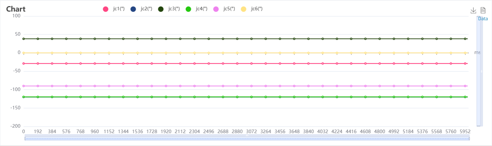
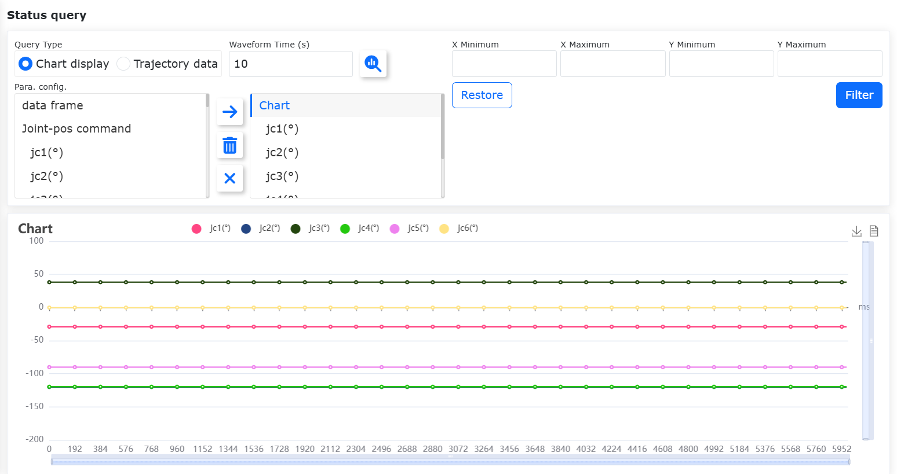

状态信息
===============

.. toctree:: 
   :maxdepth: 6

系统日志
----------

首次进入“状态信息一一系统日志”界面，默认展示当天全部类型的日志数据。

对日志数据进行等级区分，目前分为:全部、错误警告、基础设置、安全设置、外设设置、本体操作、示教程序、工具应用、系统设置和文件导入导出。

在数据表格右上角有搜索输入框,用户根据搜索需求，输入筛选内容进行筛选。界面如下:

.. image:: status/001.png
   :width: 6in
   :align: center

.. centered:: 图表 13.1‑1 系统日志界面

状态查询
----------

功能使用
~~~~~~~~~~~~~~~~~~~~~~~~~~~~

1. 开启控制箱并将网线连接PC；
2. PC打开浏览器访问目标网址192.168.58.2，登录账号admin，密码123，进入页面；
3. 点击左侧菜单栏“状态信息”-“状态查询”菜单进入状态查询界面，如下图；

.. image:: status/002.png
   :width: 6in
   :align: center

.. centered:: 图表 13.2‑1 状态查询

.. note:: 
   .. image:: status/006.png
      :width: 0.75in
      :height: 0.75in
      :align: left

   名称：**查询按钮**
   
   作用：点击下发查询图表/轨迹数据的指令，代表未查询状态

.. note:: 
   .. image:: status/007.png
      :width: 0.75in
      :height: 0.75in
      :align: left

   名称：**右移按钮**
   
   作用：点击将左侧选中项添加到右侧的子项中

.. note:: 
   .. image:: status/008.png
      :width: 0.75in
      :height: 0.75in
      :align: left

   名称：**删除按钮**
   
   作用：点击删除右侧选中的子项

.. note:: 
   .. image:: status/009.png
      :width: 0.75in
      :height: 0.75in
      :align: left

   名称：**清空按钮**
   
   作用：点击清空右侧的所有子项

4. 选择图表展示，填写波形时间，在参数配置中左侧选择所需查询的参数，点击“右移”按钮即可将参数配置到右侧列表中；

.. note:: 波形时间可自定义范围（10-30s），参数配置最多选择6个。

5. 点击“查询”按钮开始查询，根据参数配置，实时显示数据折线图，如下图；

.. image:: status/003.png
   :width: 6in
   :align: center

.. centered:: 图表13.2‑2 图表展示

图表导出
~~~~~~~~~~~~~~~~~~~~~~~~

1. 点击图表标题弹框可直接修改图表标题，如下图：

.. image:: status/004.png
   :width: 6in
   :align: center

.. centered:: 图表13.2‑3 重命名图表标题

2. 点击停止查询按钮成功停止查询后，显示下载按钮，点击下载，浏览器弹出下载名称为图表标题的图表文件。如下图所示：

.. image:: status/005.png
   :width: 6in
   :align: center

.. centered:: 图表13.2‑4 图表导出

数据视图显示
~~~~~~~~~~~~~~~~~~~~~~~~~~~~~

1. 在停止查询后，点击图表右上角显示数据视图按钮，如下图：

.. centered:: 图表13.2‑5 数据视图按钮

2. 视图中数据如图，其数据内容支持复制。

.. image:: status/011.png
   :width: 6in
   :align: center

.. centered:: 图表13.2‑6 数据视图显示

数据筛选
~~~~~~~~~~~~~~~~~~~~~~~~~~~~~

1. 在停止查询后，输入x/y的最小/大值，图表数据范围也会相应进行改变，如下图：

.. image:: status/012.png
   :width: 6in
   :align: center

.. centered:: 图表13.2‑7 数据筛选界面

2. 点击还原按钮，图表数据范围恢复默认，如下图：

.. centered:: 图表13.2‑8 数据还原