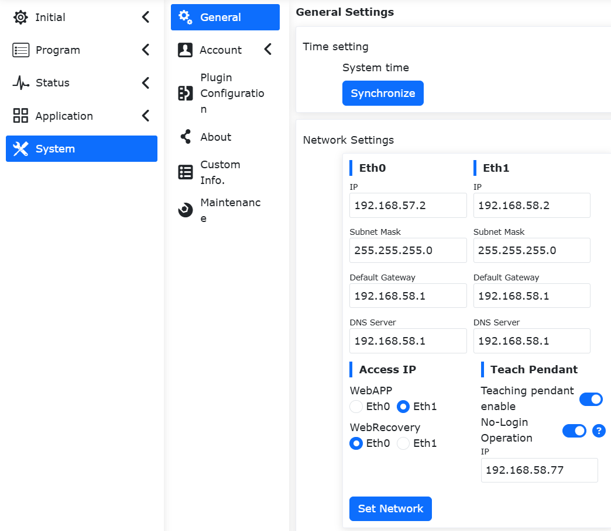
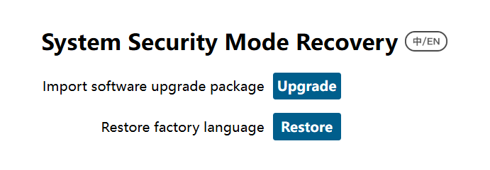
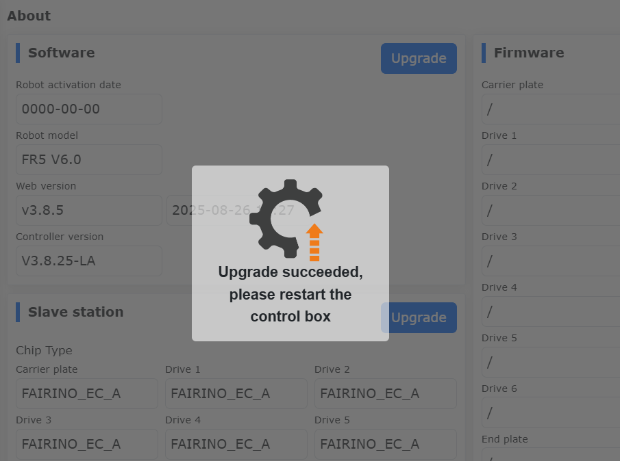
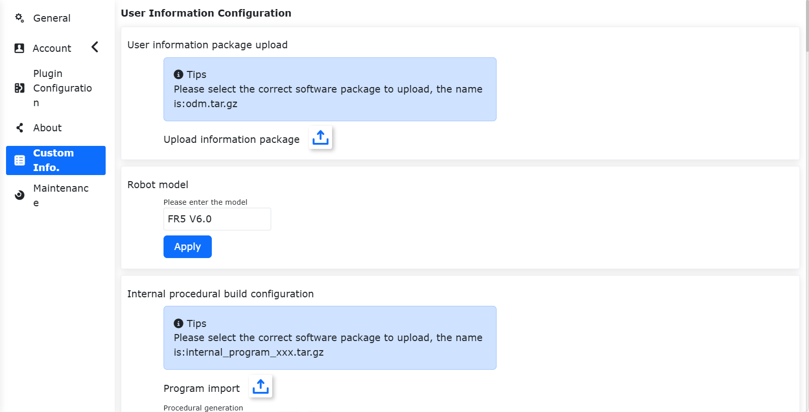
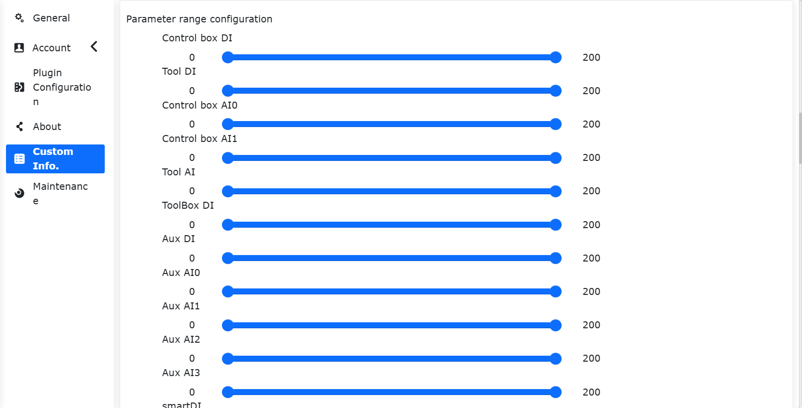
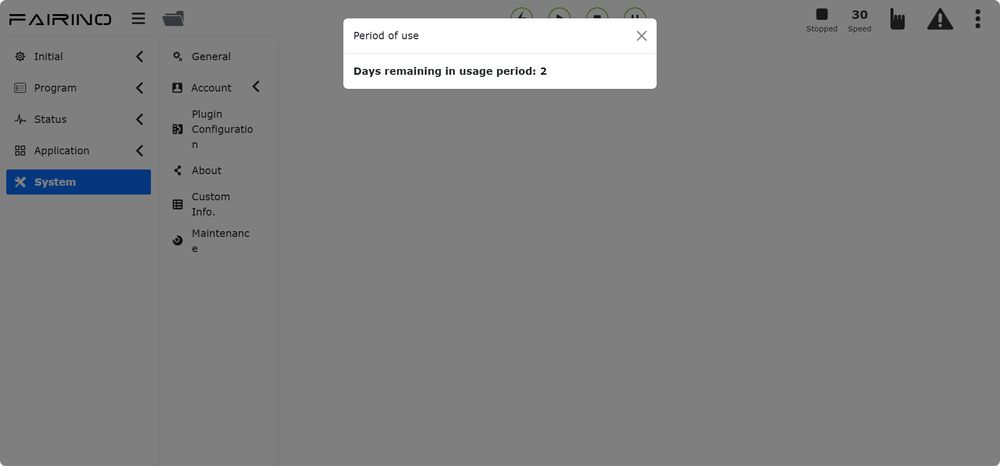
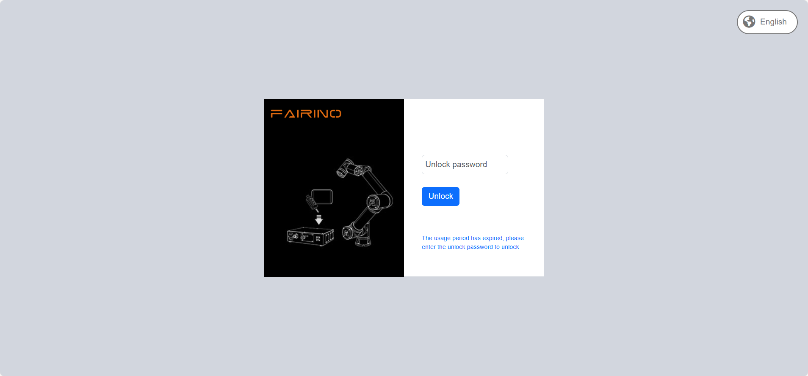

系统设置
===============

.. toctree:: 
   :maxdepth: 6

通用设置
-----------------

点击左侧菜单栏“系统设置”，点击二级菜单栏“通用设置”，进入通用设置界面。通用设置可以根据当前电脑时间更新机器人系统时间，以便记录日志内容时间准确。

.. centered:: 图表 15.1‑1 时间设置

网络设置可以设置控制器IP，子网掩码，默认网关，DNS服务器和示教器IP(使用我们的FR-HMI示教器情况下该IP有效，在使用FR-HMI示教器情况下需要配置示教器启用状态为启用)，方便客户使用场景。

网络设置
~~~~~~~~~~~~

.. image:: system/001.png
   :width: 6in
   :align: center

.. centered:: 图表 15.1‑2 网络设置示意图

-  **设置网卡**：输入需要通信的网卡IP、子网掩码（与IP联动，自动填写）、默认网关、DNS服务器。网卡0网口出厂默认IP：192.168.57.2，网卡1网口出厂默认IP：192.168.58.2。

-  **示教器启用**：控制是否启用示教器。默认示教器关闭，无法使用示教器操作设备。点击滑动开关按钮，则启用示教器操作设备。
  
-  **访问IP**：选择WebAPP和WebRecovery关联的网卡，示教器启用时，WebAPP默认选择网卡1，网卡0不可选。
  
-  **设置网络**：点击“设置网络”按钮，提示正在配置中。配置完成后，需要重启设备。

免登录操作
++++++++++++++++++++++++++++++++++++++++++++++

功能概述
***************************

打开实体示教器未登录操作功能后，可实现以下功能：

- 用户未登录示教界面时，旋转物理钥匙开关，机器人可切换手动/自动模式，末端灯颜色对应切换；
- 用户未登录示教界面时，在自动模式下，点击物理启动开关，机器人可开始运行当前加载程序；
- 用户未登录示教界面时，在自动模式下，点击物理停止开关，机器人可停止运行；
  
使用说明
***************************
登录webapp页面，点击“系统设置”，点击“通用设置”，在网络模块-示教器板块中，打开“示教器启用”开关，打开“免登录操作”开关，开启功能后，可在未登录示教器页面时操控物理按钮进行机器人手动/自动模式切换及控制程序运行/停止。该配置断电重启后保持。

.. centered:: 图表 15.1‑2-1 开启免登陆操作功能
  
示教器触摸屏校准
~~~~~~~~~~~~~~~~~~

启用示教器后，可对示教器进行校准操作。

.. image:: system/029.png
   :width: 4in
   :align: center

.. centered:: 图表 15.1‑3 示教器触摸屏校准
  
外设工控机配置
~~~~~~~~~~~~~~~~~~

启用外设工控机，需要输入IP地址。配置成功后，需要重启控制箱和工控机。

.. image:: system/030.png
   :width: 4in
   :align: center

.. centered:: 图表 15.1‑4 外设工控机配置
  
系统语言
~~~~~~~~~~~~~~~~~~

语言导入
++++++++++++++++

选择语言包进行导入操作（注：导入文件格式为[语言代码].json）。若导入成功，且语言包非系统已有语言，则系统语言新增一条导入的语言包数据。

.. image:: system/031.png
   :width: 4in
   :align: center

.. centered:: 图表 15.1‑5 系统语言界面

语言导出
+++++++++++++++++
选择系统语言，以英文为例，点击“导出”按钮，页面弹出导出的下载文件。

.. image:: system/035.png
   :width: 6in
   :align: center

.. centered:: 图表 15.1‑6 导出系统语言
   
语言应用
++++++++++++++++++++

选择系统语言，点击“应用”按钮来切换系统语言。应用语言成功后，系统自动登出到登录页面，且系统语言同步切换为当前语言语言。以英文为例：

.. image:: system/036.png
   :width: 6in
   :align: center

.. centered:: 图表 15.1‑7 语言系统成功后界面

系统安全模式恢复
++++++++++++++++++++

当系统需要进行版本升降级操作、系统语言包导入异常系统无法正常进入时，需要进入“系统安全模式恢复”界面，具体操作如下：
1. 进入系统设置 -> 通用设置 -> 网络设置界面，调整WebRecovery访问IP到网卡0位置，并点击“设置网络”。

.. image:: system/037.png
   :width: 6in
   :align: center

.. centered:: 图表 15.1‑8 WebRecovery设置网卡界面

2. 网络设置成功后重启控制箱，切换IP地址192.168.57.xxx，并将网线连接到控制箱网卡0。
3. 登录网址“192.168.57.2:8050”，进入“系统安全模式恢复”界面。

.. centered:: 图表 15.1‑9 系统安全模式恢复界面

- 软件升级包导入：系统软件包升降级；
- 恢复出厂语言：清除导入应用语言包数据，恢复出厂语言包数据，默认语言设置为英文；
  
故障数据
~~~~~~~~~~~~

点击启用“故障数据保存使能”按钮，当控制器发生故障时，会生成故障数据文件，保存故障时刻前后15秒钟的数据。

当保存完成后，可在系统设置中选择所有数据源导出，解压error_data.tar.gz即可查看故障数据文件。

.. image:: system/039.png
   :width: 3in
   :align: center

.. centered:: 图表 15.1‑10 故障数据
  
超时登出时间设置
~~~~~~~~~~~~~~~~~

用户可以设置超时登出时间，若满足时长则自动登出，单位min。

.. image:: system/033.png
   :width: 4in
   :align: center

.. centered:: 图表 15.1‑11 超时登出时间设置
  
系统设置
~~~~~~~~~~~~

系统恢复下恢复出厂设置可以清除用户数据，使机器人恢复到出厂配置。

从站日志生成和控制器日志导出功能为下载控制器一些重要的状态或报错的记录文件，方便排查机器人问题。

.. image:: system/034.png
   :width: 4in
   :align: center

.. centered:: 图表 15.1‑12 系统设置

账户设置
---------------

点击二级菜单栏账户设置，进入账户设置界面。账户管理功能仅限管理员可使用。功能分以下三个模块：

用户管理
~~~~~~~~~~~~

用户管理页面，用来保存用户信息，可以添加用户的工号、职能等。用户可通过输入用户列表中已有的用户名和密码进行登录操作。

.. image:: system/002.png
   :width: 6in
   :align: center

.. centered:: 图表 15.2‑1 用户管理

-  **新增用户**：点击“新增”按钮，输入工号、姓名、密码并选择职能。

.. important::
   工号最大为10位整数型，工号和密码都有唯一性校验，且密码通过盲文显示。用户新增成功后，可以输入姓名和密码进行重新登录。
  
.. image:: system/003.png
   :width: 6in
   :align: center

.. centered:: 图表 15.2‑2 新增管理
  
-  **编辑用户**：当存在用户列表时，点击右侧“编辑”按钮，工号和姓名无法修改，可修改密码和职能，密码同样需要唯一性校验。
  
.. image:: system/004.png
   :width: 6in
   :align: center

.. centered:: 图表 15.2‑3 编辑用户

-  **删除用户**：删除方法分为单条删除和批量删除。
  
  1. 点击列表右侧单条“删除”按钮，提示“请再次点击删除按钮以确认删除”，再次点击该列表删除成功。

  2. 点击左侧复选框，选择需要删除的用户，再点击列表上方批量“删除”按钮两次后删除。

.. important::
   初始用户111以及当前登录用户无法删除。

.. image:: system/002.png
   :width: 6in
   :align: center

.. centered:: 图表 15.2‑4 删除用户

权限管理
~~~~~~~~~~~~

.. important:: 
   默认的职能数据（职能代号为1-6）不可以删除，不可修改职能代号，可以修改职能名称和职能描述以及设置职能的权限。

.. image:: system/006.png
   :width: 6in
   :align: center

.. centered:: 图表 15.2‑5 权限管理

默认六个职能，管理员无功能限制，操作员和监视员少部分功能可以使用，ME工程师、PE&PQE工程师和技术员&班组长部分功能限制，管理员无功能限制，具体默认权限如下表所示：

.. important:: 
   默认权限可修改。

.. centered:: 表格 15.2‑1 权限详情

.. image:: system/007.png
   :width: 6in
   :align: center

-  **新增职能**：点击“新增”按钮，输入职能代号、职能名称和职能描述，点击"保存"按钮，成功后返回列表页面。其中职能代号只能为大于0的整数并且不能和已经存在的职能代号相同，输入项全部为必填。

.. image:: system/008.png
   :width: 6in
   :align: center

.. centered:: 图表 15.2‑6 新增职能

-  **编辑职能名称和描述**：点击表格操作栏中的“编辑”图标，可以修改当前职能的职能名称和职能描述，修改完成后点击下方"保存"按钮确认修改。

.. image:: system/009.png
   :width: 6in
   :align: center

.. centered:: 图表 15.2‑7 编辑职能

-  **设置职能权限**：点击表格操作栏中的“设置”图标，可以设置当前职能的权限，设置完成后点击下方"保存"按钮确实设置。

.. image:: system/010.png
   :width: 6in
   :align: center

.. image:: system/011.png
   :width: 6in
   :align: center

.. centered:: 图表 15.2‑8 设置职能权限

-  **删除职能**：点击表格操作栏中的“删除”图标，首先会校验当前职能是否有用户使用，没有用户使用则可以删除当前职能，反之不可以删除。

.. image:: system/012.png
   :width: 6in
   :align: center

.. centered:: 图表 15.2‑9 删除职能

导入/导出
~~~~~~~~~~~~

.. image:: system/013.png
   :width: 6in
   :align: center

.. centered:: 图表 15.2‑10 账户设置导入/导出

-  **导入**：点击“导入”按钮，可以批量导入用户管理和权限管理的数据。

-  **导出**：点击“导出”按钮，可以批量导出用户管理和权限管理的数据。

关于
--------------

点击二级菜单栏关于，进入关于界面。该页面展示了机器人的型号和序列号，机器人运行使用的Web版本和控制箱版本，硬件版本和固件版本。

.. image:: system/014.png
   :width: 6in
   :align: center

.. centered:: 图表 15.3‑1 关于示意图

软件升级
~~~~~~~~~~~~~~~~~~~~~~~~~

操作准备
+++++++++++++++++++++++++++++++

1. 升级前在《系统设置-关于》中查看并确认当前的软件版本。
2. 软件升级包，下载地址见对应版本的法奥文档《资料下载-机器人软件下载》，解压后，内容包含对应版本软件升级包software.tar.gz。

注意事项
+++++++++++++++++++++++++++++++

1. 数据备份：建议在升级前执行备份，方法见3.2.1节，以避免因升级异常导致数据丢失。
2. 版本限制：

.. centered:: 图表 15.3‑1 版本升级限制

.. list-table::
   :widths: 50 50
   :header-rows: 0
   :align: center

   * - **当前版本** 
     - **最高可升级版本**

   * - <v3.6.1
     - v3.6.1

   * - v3.6.1-v3.6.4
     - v3.6.5

   * - v3.6.5-v3.6.8
     - v3.6.9

   * - v3.6.9 - v3.7.4
     - v3.7.5

   * - v3.7.5
     - v3.7.6

   * - ≥ v3.7.6
     - 无限制

3. 缓存清除：每次升级后（特别是跨版本升级时），建议清除浏览器缓存以确保系统正常运行。

操作步骤
*****************************

**软件升级**：

1. 在“系统设置”->“关于”菜单栏下，点击“升级”按钮，进入软件升级；

.. image:: system/040.png
   :width: 6in
   :align: center

.. centered:: 图表 15.3‑2 系统升级界面

2. 点击“选择文件”，选择在官网中下载的软件包software.tar.gz；

.. important:: 
   软件升级包名为确定的software.tar.gz，如果升级包名与之不一致，那么会出现升级失败，修改为确定的升级包名称即可。

3. 点击上传升级包，则开始升级, 升级过程中会显示进度条；

4. 当升级进度条为100时，界面将提示“升级成功，请重新启动控制箱”；

.. centered:: 图表 15.3‑3 软件升级成功

5. 重启控制箱后，升级完成，在关于中确认版本信息。

**固件升级**：机器人进入BOOT模式后，上传升级压缩包，选择需要升级的从站（控制箱从站，本体驱动器从站1~6，末端从站），进行升级操作，并显示升级状态。

.. image:: system/042.png
   :width: 6in
   :align: center

.. centered:: 图表 15.3‑4 固件升级

**从站配置文件升级**：机器人去使能后，上传升级文件，选择需要升级的从站（控制箱从站，本体驱动器从站1~6，末端从站），进行升级操作，并显示升级状态。

.. image:: system/043.png
   :width: 6in
   :align: center

.. centered:: 图表 15.3-5 从站配置文件升级

**编码器升级**：机器人去使能后，上传升级文件，选择需要升级的关节Joint1~Joint6,并配置编码器模式。

.. image:: system/044.png
   :width: 6in
   :align: center

.. centered:: 图表 15.3-6 编码器升级

自定义信息
---------------

点击二级菜单栏自定义信息，进入自定义信息界面。自定义信息功能仅限管理员可使用。该页面可以上传用户信息包、机器人型号和设置示教程序加密状态等操作。

.. centered:: 图表 15.4‑1 自定义信息示意图

机器人型号
~~~~~~~~~~~~~~~

.. important::
   1. 在此配置机器人型号属于自定义机器人型号名称，与“系统设置”->“维护模式”->“控制器兼容”中配置的机器人型号功能不一致；
   2. 不建议使用以“FR”和“ART”开头。如果输入以“FR”和“ART”开头的自定义机器人型号时，输入的型号名称必须与机器人型号目录表中的“型号简称”一致，（机器人型号目录表详见于“机器人型号配置”章节）。

参数范围配置
~~~~~~~~~~~~~~~~

参数范围配置，只有管理员可进行参数范围的调节，其他权限成员的参数只可在管理员设定的参数范围之内设定。

参数设定方式分为两种：滑块拖动和手动输入。

.. important::
   参数范围最大值必须大于最小值。参数范围配置成功3秒后，自动跳转到登录页，需重新登陆。

.. image:: system/022.png
   :width: 6in
   :align: center

.. centered:: 图表 15.4‑2 参数范围配置示意图

机器人许可使用时间
~~~~~~~~~~~~~~~~~~~~~~~~~~~~~~~~~~~~

1. 锁屏设置

在“自定义信息”中查看机器人许可使用时间，设置该功能是否开启。选择开启该功能时，选择使用期限，如果未选择则提示“使用期限不能为空”。

.. note:: 如果己开启锁屏功能，无法进行二次设置，同时无法更新系统时间。

选择使用期限后，点击“配置”按钮。

.. image:: system/023.png
   :width: 6in
   :align: center

.. centered:: 图表 15.4‑3 机器人许可使用时间关闭设置

.. image:: system/024.png
   :width: 6in
   :align: center

.. centered:: 图表 15.4‑4 机器人许可使用时间开启设置

2. 到期提示

当机器人许可使用时间功能开启时，登录界面后有如下提示：

1)设备到期前 5天，开机登录成功，弹窗提示使用期限剩余天数，复位可消除。

.. centered:: 图表 15.4‑5 开机提示

2)如设备持续工作中，设备到期前 5天，在零点时自动弹窗提示使用期限剩余天数，复位可消除。

.. image:: system/026.png
   :width: 6in
   :align: center

.. centered:: 图表 15.4‑6 持续工作提示

3. 解锁登录

当机器人许可使用时间功能开启时，设备到期后，首次登录webApp直接进入锁屏界面。设备持续工作时，零点获取锁屏数据后自动登出，进入锁屏界面。此时输入解锁码后解锁进入登录界面，输入登录信息进行登录。

.. note:: 集成商操作生成加密的解锁码。
 

.. centered:: 图表 15.4‑7 锁屏界面  

机器人型号配置
-----------------

.. important:: 如果您需要修改机器人型号，请与我们技术工程师取得联系并在指导下进行。

登录协作机器人控制台Web后，在“系统设置”->“维护模式”->“控制器兼容”配置项中选择对应型号修改，机器人型号参考下方表格。

机器人型号表如下：

.. list-table::
   :widths: 10 58 32
   :header-rows: 0
   :align: center

   * - **数值**
     - **型号（主型号-主版本号-次版本号）**
     - **型号简称**

   * - 0
     - 未配置
     - /

   * - 1
     - FR3-V1-000(V5.0)
     - FR3 V5.0

   * - 2
     - FR3-V1-001(V6.0)
     - FR3 V6.0

   * - 3
     - FR3-V1-002(V6.0 Mirror)
     - FR3 V6.0(Mirror)

   * - ...
     - 预留
     - /

   * - 101
     - FR5-V1-000
     - FR5 V4.0

   * - 102
     - FR5-V1-001(V5.0)
     - FR5 V5.0

   * - 103
     - FR5-V1-002(V6.0)
     - FR5 V6.0
     
   * - ...
     - 预留
     - /
   
   * - 201
     - FR10-V1-000(V5.0)
     - FR10 V5.0

   * - 202
     - FR10-V1-001(V6.0)
     - FR10 V6.0
     
   * - ...
     - 预留
     - /
   
   * - 301
     - FR16-V1-000(V5.0)
     - FR16 V5.0

   * - 302
     - FR16-V1-001(V6.0)
     - FR16 V6.0
     
   * - ...
     - 预留
     - /
   
   * - 401
     - FR20-V1-000(V5.0)
     - FR20 V5.0

   * - 402
     - FR20-V1-001(V6.0)
     - FR20 V6.0
     
   * - ...
     - 预留
     - /

   * - 501
     - ART3-V1-000
     - ART3
     
   * - ...
     - 预留
     - /

   * - 601
     - ART5-V1-000
     - ART5
     
   * - ...
     - 预留
     - /

   * - 702
     - FRCustom(7)-V1-001(FR3-WML)
     - FR3-WML

   * - 703
     - FRCustom(7)-V1-001(FR3-WMS)
     - FR3-WMS
     
   * - ...
     - 预留
     - /
  
   * - 802
     - FRCustom(8)-V1-001(FR5WM)
     - FR5WM
  
   * - 803
     - FRCustom(8)-V1-002(FR5-WML)
     - FR5-WML
     
   * - ...
     - 预留
     - /

   * - 901
     - FRCustom(9)-V1-001(FR3MT)
     - FR3MT

   * - 902
     - FRCustom(9)-V1-001(FR10YD)
     - FR10YD

   * - 904
     - FRCustom(9)-V1-001(FR3-C)
     - FR3-C

   * - 905
     - FRCustom(9)-V01-001(FR30L)
     - FR30L

   * - 906
     - FRCustom(9)-V01-001(FR3(C))
     - FR3(C)

   * - 907
     - FRCustom(9)-V01-001(ART3-R6-XM)
     - ART3-R6-XM

   * - 908
     - FRCustom(9)-V01-001(FC3-R6-B)
     - FC3-R6-B
     
   * - ...
     - 预留
     - /

   * - 1001
     - FR30-V1-001(V6.0)
     - FR30 V6.0
     
   * - ...
     - 预留
     - /

.. note:: 其中，主版本号预留10个（1-10），次版本号预留10个（1-10）。