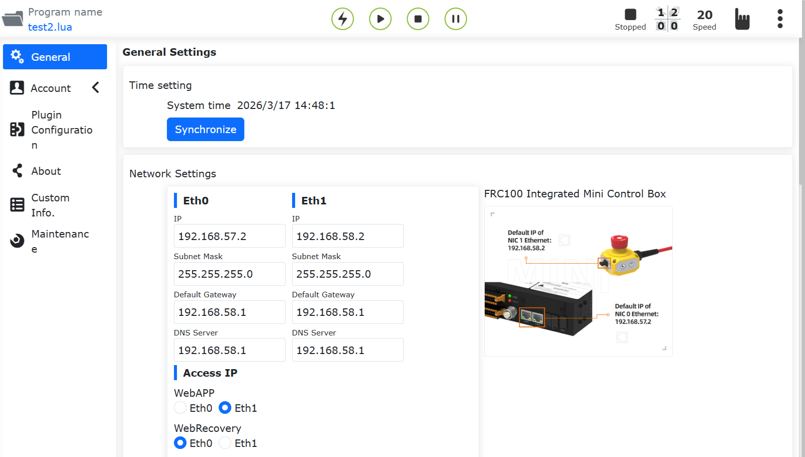
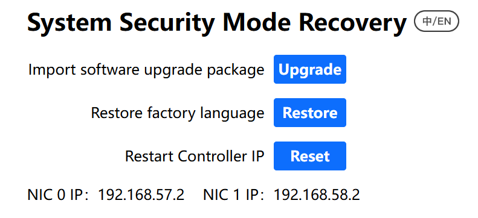
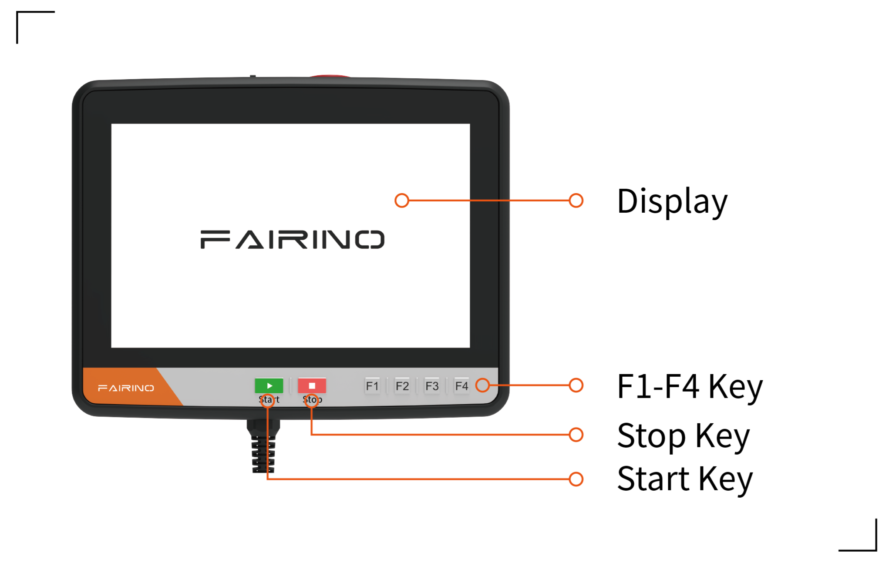
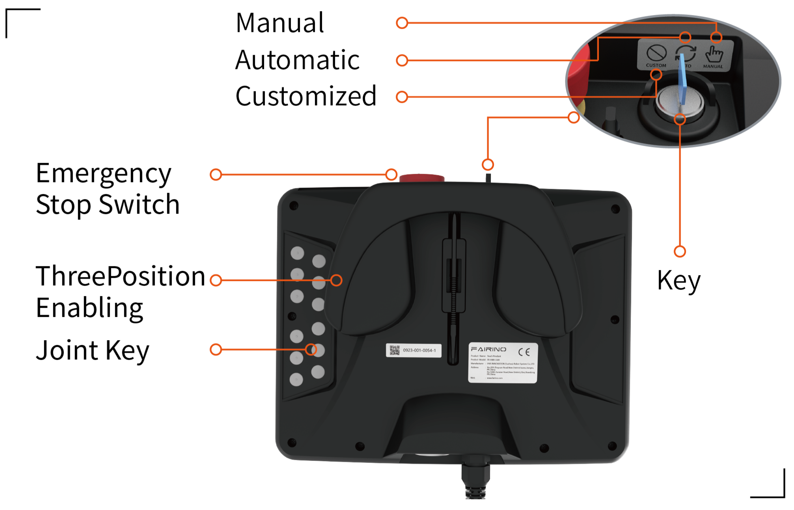

示教器
===============

.. toctree:: 
   :maxdepth: 6

示教器启用
-------------------

1. 控制箱连接示教器，并启动。

2. 登录账号admin，密码123。进入页面，点击系统设置-通用设置，确认示教器为启用状态。

.. centered:: 图表 16.1‑1 示教器启用状态

示教器多语言设置
--------------------

1. 在登录界面（或首次激活界面均可设置），在右上角进行语言选择。

.. image:: teaching_pendant_software/062.png
   :width: 6in
   :align: center

.. centered:: 图表 16.2‑1 激活界面设置语言

.. image:: teaching_pendant_software/063.png
   :width: 6in
   :align: center

.. centered:: 图表 16.2‑2 登录界面设置语言

2. 以登录界面设置多语言为例，选择语言。出现以下提示（对应不同语言）即为设置成功，重启控制箱完成语言设置。

.. image:: teach_pendant/004.png
   :width: 6in
   :align: center

.. centered:: 图表 16.2‑3 设置中文

.. image:: teach_pendant/005.png
   :width: 6in
   :align: center

.. centered:: 图表 16.2‑4 设置英文

输入法切换
~~~~~~~~~~~~~~~~~~~~~~~~~~~~~~~~~~~~~~~

默认输入法为英文输入法。

1. 打开右下角软键盘，点击输入框，例如点击用户名输入框。

2. 切换中文拼音输入法。

点击两次CTRL键，按键状态变红色，点击空格进行选择输入法，以下为中文输入法。

.. image:: teach_pendant/006.png
   :width: 6in
   :align: center

.. centered:: 图表 16.2‑5 中文拼音输入法

3. 切换英文输入法

点击两次CTRL键，按键状态变红色，点击空格进行选择输入法，以下为英文输入法。

.. image:: teach_pendant/007.png
   :width: 6in
   :align: center

.. centered:: 图表 16.2‑6 英文输入法

登录成功后，系统会加载模型等数据，加载完毕后进入初始页面。

示教器与webApp语言不一致
~~~~~~~~~~~~~~~~~~~~~~~~~~~~~~~~~~~~~~~

启用示教器后，在登录界面会触发示教器与webApp语言校验，当示教器语言与webApp语言不一致时，出现以下提示。

.. image:: teach_pendant/008.png
   :width: 6in
   :align: center

.. centered:: 图表 16.2‑7 示教器与webApp语言不一致提示

控制器及实体示教器IP重置功能
----------------------------------------------------------------------------------

功能概述
~~~~~~~~~~~~~~~~~~~~~~~~~~~~~~~~~~~~~~~~~~~~

此次优化增加不同途径的控制器及实体示教器IP复位操作功能，主要通过以下操作可实现以下功能：

- 1. 使用webrecovery界面可进行控制箱网卡0和网卡1的IP重置；
- 2. 使用实体示教器F1自定义按键功能配置IP复位（长按10秒）可进行控制箱网卡0、网卡1以及实体示教器的IP重置；
- 3. 使用实体示教器F2和F4组合按键，同时长按10秒，可以在实体示教器未登录时进行实体示教器设备的IP重置。

.. image:: teach_pendant/010.png
   :width: 5in
   :align: center

.. centered:: 图表 16.3‑1 mini控制箱网口示意图

Webrecovery界面IP重置
~~~~~~~~~~~~~~~~~~~~~~~~~~~~~~~~~~~~~~~~~~~~~~~~~~~~~~~~~~~~~~

使用8050端口登录webrecovery界面，如默认ip：192.168.57.2：8050登录，点击重置控制器IP‘重置’按钮，页面会进行二次弹窗确认，点击确定后再次点击重置控制器IP按钮以确认重置。

.. centered:: 图表 16.3‑2 Webrecovery界面IP重置功能

二次确认后会提示重启生效。重启后控制器网卡0 IP恢复为默认192.168.57.2，网卡1 IP恢复为默认192.168.58.2。

.. image:: teach_pendant/012.png
   :width: 6in
   :align: center

.. centered:: 图表 16.3‑3 Webrecovery界面IP重置二次确认

实体示教器F1按键自定义IP重置
~~~~~~~~~~~~~~~~~~~~~~~~~~~~~~~~~~~~~~~~~~~~~~~~~~~~~~~~~~~~~~~~~~~~~~~~~~~~~

使用实体示教器F1按键自定义功能需先登录示教器界面进行F按键自定义功能进行配置，点击“系统设置”，点击“通用设置”，选择示教器模块，打开启用示教器开关，配置F1按键为重置IP（长按10秒），点击配置。

.. image:: teach_pendant/013.png
   :width: 6in
   :align: center

.. centered:: 图表 16.3‑4 实体示教器F1按键自定义IP重置

此功能仅在实体示教器登录webapp时生效，长按F1按键10秒后会提示重启生效。重启后控制器网卡0 IP恢复为默认192.168.57.2，网卡1 IP恢复为默认192.168.58.2，实体示教器IP恢复为默认192.168.58.77。

实体示教器F2和F4组合按键IP重置
~~~~~~~~~~~~~~~~~~~~~~~~~~~~~~~~~~~~~~~~~~~~~~~~~~~~~~~~~~~~~~~~~~~~~~~~~~~~~

实体示教器设备提供IP重置功能，在未连接webapp情况下也可进行实体示教器IP复位。同时长按F2和F4组合按键10秒钟，可重置实体示教器IP，IP默认恢复为192.168.58.77。恢复后需要重新登录webapp，在系统设置-通用设置中，设置实体示教器IP为192.168.58.77，重启后重新建立示教器连接。

.. centered:: 图表 16.3‑6 实体示教器F2和F4组合按键IP重置

示教器按键自定义功能
----------------------------------------------------------------------------------

功能概述
~~~~~~~~~~~~~~~~~~~~~~~~~~~~~~~~~~~~~~~~~~~~

本文档旨在介绍如何使用示教器按键自定义功能。

操作说明
~~~~~~~~~~~~~~~~~~~~~~~~~~~~~~~~~~~~~~~~~~~~

功能配置
++++++++++++++++++++++++++++++++++++++

1. 打开访问并等陆webApp;
   
2. 点击左侧菜单栏“系统设置”-“通用设置”菜单进入示教器配置模块界面；

.. image:: teach_pendant/013.png
   :width: 6in
   :align: center

.. centered:: 图表 16.4‑1 示教器按键功能配置界面

3. 示教器启用后，包含钥匙自定义功能，F1-F4按键的功能配置。其中钥匙自定义功能可设置为拖动模式，F1-F4按键可配置重置IP(长按10秒)，一键清除报错，输出DO，使能切换及启动指定Lua程序。

钥匙自定义设置为拖动
++++++++++++++++++++++++++++++++++++++++++++++++++++++++++++++++

1. 当钥匙自定义配置为拖动模式，且在登录WebApp时，示教器钥匙旋至自定义时，界面弹窗需确认当前负载，以防负载错误导致坠落；

.. centered:: 图表 16.4‑2 示教器模式示例

2. 确认负载设置正确后，点击确认，机器人进入拖动模式。

.. image:: teach_pendant/014.png
   :width: 6in
   :align: center

.. centered:: 图表 16.4‑3 拖动模式设置前确认负载

F1-F4按键功能自定义
++++++++++++++++++++++++++++++++++++++++++++++++++++++++++++++++

   
.. centered:: 图表 16.4‑4 示教器按键示例

1. **重置IP（长按10秒）功能**：配置后长按10秒后会提示重启生效。重启后控制器网卡0的IP恢复为默认192.168.57.2，网卡1的IP恢复为默认192.168.58.2，实体示教器IP恢复为默认192.168.58.77。
   
2. **一键清除报错功能**：在当界面出现报错提示时，按压对应功能F键，可清除报错。
   
3. **输出DO功能**：配置该功能且设置DO编号后，按压对应功能F键，可将当前DO编号对应状态切换。
   
4. **使能切换功能**：配置该功能后，按压对应功能F键，可当前使能状态。
   
5. **启动Lua程序**：配置该功能且设置Lua程序后，按压对应功能F键，机器人在自动模式下，即可自动运行所设置的Lua程序。 
