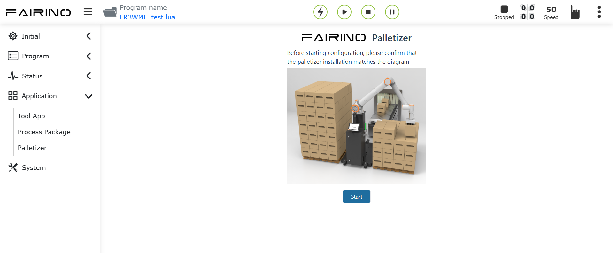

Casos de FRCap
=========================

.. toctree:: 
   :maxdepth: 6

FAIRINO Palletizer (Empilhador)
-----------------------------------------

Após fazer o upload, registrar e ativar o arquivo "Palletizer.plugin" (Empilhador) localizado na pasta `build` do projeto no WebApp, ele estará pronto para uso.

.. centered:: Figura 7.1 Uso do FRCap de Empilhamento

Configuração da Peça para Empilhamento
+++++++++++++++++++++++++++++++++++++++++++++++++++

Nome da instrução: palletizing_config_box. 

Parâmetros da instrução:

.. code-block:: c++
   :linenos:

   /** 
   * @param  int length Comprimento da peça
   * @param  int width Largura da peça
   * @param  int height Altura da peça
   * @param  int payload Carga da peça
   * @param  string grip_point Ponto de agarramento da peça
   * /

Exemplo da instrução:

.. code-block:: c++
   :linenos:

   {
      cmd: "palletizing_config_box",
      data: {
         length: 800,
         width: 615,
         height: 312,
         payload: 2.34,
         grip_point: "grippoint"
      }
   } 

Retorno da instrução:

.. code-block:: c++
   :linenos:

   /** 
   * @return status:200 "success"
   * @return status:404 "fail"
   */

Configuração do Palete para Empilhamento
+++++++++++++++++++++++++++++++++++++++++++++++++++++++++++++++++++++

Nome da instrução: palletizing_config_pallet.

Parâmetros da instrução:

.. code-block:: c++
   :linenos:

   /** 
   * @param  int front Frente do palete
   * @param  int side Lateral do palete
   * @param  int height Altura do palete
   * @param  int left_pallet Habilitar palete esquerdo
   * @param  int right_pallet Habilitar palete direito
   */

Exemplo da instrução:

.. code-block:: c++
   :linenos:

   {
      cmd: "palletizing_config_pallet",
      data: {
            front: 1200,
            side: 1000,
            height: 110,
            left_pallet: 0,
            right_pallet: 1
         }
   }

Retorno da instrução:

.. code-block:: c++
   :linenos:

   /** 
   * @return status:200 "success"
   * @return status:404 "fail"
   */ 

Configuração Avançada para Empilhamento
+++++++++++++++++++++++++++++++++++++++++++++++++++++++++++++++++++++

Nome da instrução: palletizing_advanced_cfg.

Parâmetros da instrução:

.. code-block:: c++
   :linenos:

   /** 
   * @param  string height Altura de elevação do ponto de agarramento do empilhamento
   * @param  string x1 Ponto de aproximação 1 do empilhamento: deslocamento na direção x, unidade mm
   * @param  string y1 Ponto de aproximação 1 do empilhamento: deslocamento na direção y, unidade mm
   * @param  string z1 Ponto de aproximação 1 do empilhamento: deslocamento na direção z, unidade mm
   * @param  string x2 Ponto de aproximação 2 do empilhamento: deslocamento na direção x, unidade mm
   * @param  string y2 Ponto de aproximação 2 do empilhamento: deslocamento na direção y, unidade mm
   * @param  string z2 Ponto de aproximação 2 do empilhamento: deslocamento na direção z, unidade mm
   * @param  string time Tempo de espera para sucção, unidade ms
   */ 

Exemplo da instrução:

.. code-block:: c++
   :linenos:

   {
      cmd: "palletizing_advanced_cfg",
      data: {
      height: "1000",
            x1: "100",
            y1: "100",
            z1: "100",
            x2: "10",
            y2: "10",
            z2: "10",
            time: "1"
         }
   }

Retorno da instrução:

.. code-block:: c++
   :linenos:

   /** 
   * @return status:200 "success"
   * @return status:404 "fail"
   */

Configuração das Dimensões do Equipamento de Empilhamento
+++++++++++++++++++++++++++++++++++++++++++++++++++++++++++++++++++++++++++++++++++++++++

Nome da instrução: palletizing_config_device.

Parâmetros da instrução:

.. code-block:: c++
   :linenos:

   /** 
   * @param  int x Valor absoluto na direção x do ponto do canto superior direito do palete esquerdo em relação ao sistema de coordenadas base do robô
   * @param  int y Valor absoluto na direção y do ponto do canto superior direito do palete esquerdo em relação ao sistema de coordenadas base do robô
   * @param  int z Valor absoluto na direção z do ponto do canto superior direito do palete esquerdo em relação ao sistema de coordenadas base do robô
   * @param  int angle Ângulo de rotação durante a instalação do robô
   */ 

Exemplo da instrução:

.. code-block:: c++
   :linenos:

   {
      cmd: "palletizing_config_device",
      data: {
         x: 2400,
         y: 1800,
         z: 120,
         angle: 0   
      }
   }

Retorno da instrução:

.. code-block:: c++
   :linenos:

   /** 
   * @return status:200 "success"
   * @return status:404 "fail"
   */

Configuração do Padrão de Empilhamento
+++++++++++++++++++++++++++++++++++++++++++++++++++++++++++++++++++++

Nome da instrução: palletizing_config_pattern.

Parâmetros da instrução:

.. code-block:: c++
   :linenos:

   /** 
   * @param  int layers Número de camadas do empilhamento
   * @param  int box_gap Espaçamento entre os pontos da peça, unidade: mm
   * @param  string sequence Sequência do modo de trabalho do empilhamento
   * @param  int pattern_b_enable Se o padrão b está ativado, 1: ativado, 0: desativado
   * @param  string left_pattern_a Coordenadas cartesianas do padrão a para o posto esquerdo
   * @param  string left_pattern_b Coordenadas cartesianas do padrão b para o posto esquerdo
   * @param  string right_pattern_a Coordenadas cartesianas do padrão a para o posto direito
   * @param  string right_pattern_b Coordenadas cartesianas do padrão b para o posto direito
   * @param  string origin_pattern_a Coordenadas cartesianas do padrão a inicial
   * @param  string origin_pattern_b Coordenadas cartesianas do padrão b inicial
   */

Exemplo da instrução:

.. code-block:: c++
   :linenos:

   {
      cmd: "palletizing_config_pattern",
      data: {
         layers: 8,
         box_gap: 0,
         sequence: "a,b,a,b,a,b,a,b",
         pattern_b_enable: 1,
         left_pattern_a: "{\"1\": [[1,2,3,0.1,0.2,0.3],[1,2,3,0.1,0.2,0.3],[1,2,3,0.1,0.2,0.3]]}",
         "left_pattern_b": "{\"1\": [[1,2,3,0.1,0.2,0.3],[1,2,3,0.1,0.2,0.3],[1,2,3,0.1,0.2,0.3]]}",
         "right_pattern_a": "{\"1\": [[1,2,3,0.1,0.2,0.3],[1,2,3,0.1,0.2,0.3],[1,2,3,0.1,0.2,0.3]]}",
         "right_pattern_b": "{\"1\": [[1,2,3,0.1,0.2,0.3],[1,2,3,0.1,0.2,0.3],[1,2,3,0.1,0.2,0.3]]}",
         "origin_pattern_a": "[]",
         "origin_pattern_b": "[]"
      }
   }

Retorno da instrução:

.. code-block:: c++
   :linenos:

   /** 
   * @return status:200 "success"
   * @return status:404 "fail"
   */

Geração do Programa de Empilhamento
+++++++++++++++++++++++++++++++++++++++++++++++++++

Nome da instrução: generate_palletizing_program.

Parâmetros da instrução:

.. code-block:: c++
   :linenos:

   /**
   * @param  string palletizing_name Nome do empilhamento
   * @param  string depalletizing_name Nome do desempilhamento
   * @param  string flag Se o programa de empilhamento ou desempilhamento será gerado, 0-não gerar, 1-gerar
   */ 

Exemplo da instrução:

.. code-block:: c++
   :linenos:

   {
      cmd: "generate_palletizing_program",
      data: {
         palletizing_name: "palletizing_1",
         depalletizing_name:"depalletizing_1",
         flag:"[0,1]"
      }
   }

Retorno da instrução:

.. code-block:: c++
   :linenos:

   /** 
   * @return status:200 "success"
   * @return status:404 "fail"
   */

Obter Receita de Empilhamento
+++++++++++++++++++++++++++++++++++++++++++++++++++

Nome da instrução: get_palletizing_formula.

Parâmetros da instrução:

.. code-block:: c++
   :linenos:

   /** 
   * @param  string name Nome da receita de empilhamento
   */ 

Exemplo da instrução:

.. code-block:: c++
   :linenos:

   {
      cmd: "get_palletizing_formula",
      data: {
         name: "palletizing_1"
      }
   }

Retorno da instrução:

.. code-block:: c++
   :linenos:

   /** 
   * @return status:200 
   * @param  object box_config Configuração da peça
   * @param  object pallet_config Configuração do palete
   * @param  object device_config Posição do equipamento instalado
   * @param  object pattern_config Configuração do padrão
   * @param  object program_config Configuração da geração do programa
   * @param  object lefttransitionpoint Coordenadas cartesianas do ponto de transição esquerdo
   * @param  object righttransitionpoint Coordenadas cartesianas do ponto de transição direito
   * @param  object advanced_config Configuração avançada
   * @return status:404 "fail"
   */

Exemplo de retorno da instrução:

.. code-block:: c++
   :linenos:

   {
      "box_config": {
        "flag": 1,
        "length": 200,
        "width": 400,
        "height": 300,
        "payload": 2.34,
        "grip_point": "grippoint"
      },
      "pallet_config": {
        "flag": 1,
        "front": 1000,
        "side": 1200,
        "height": 110,
         "left_pallet": 0,
         "right_pallet": 1
      },
      "device_config": {
      "flag": 1,
      "x": 2400,
      "y": 1800,
      "z": 120,
      "angle": 0
      },
      "pattern_config": {
      "flag": 1,
      "layers": 8,
      "box_gap": 0,
      "sequence": "a,b,a,b,a,b,a,b",
      "pattern_b_enable": 1,
      "left_pattern_a": "{\"1\": [[1,2,3,0.1,0.2,0.3],[1,2,3,0.1,0.2,0.3],[1,2,3,0.1,0.2,0.3]]}",
      "left_pattern_b": "{\"1\": [[1,2,3,0.1,0.2,0.3],[1,2,3,0.1,0.2,0.3],[1,2,3,0.1,0.2,0.3]]}",
      "right_pattern_a": "{\"1\": [[1,2,3,0.1,0.2,0.3],[1,2,3,0.1,0.2,0.3],[1,2,3,0.1,0.2,0.3]]}",
      "right_pattern_b": "{\"1\": [[1,2,3,0.1,0.2,0.3],[1,2,3,0.1,0.2,0.3],[1,2,3,0.1,0.2,0.3]]}",
      "origin_pattern_a": "[]",
      "origin_pattern_b": "[]"
      },
      "program_config": {
      "palletizing_name": "palletizing_1",
      "depalletizing_name":"depalletizing_1",
      "flag":"[0,1]"   
      },
      "lefttransitionpoint":{
      "j1":"120",
      "j2":"120",
      "j3":"120",
      "j4":"120",
      "j5":"120",
      "j6":"120"
      },
      "righttransitionpoint":{
      "j1":"120",
      "j2":"120",
      "j3":"120",
      "j4":"120",
      "j5":"120",
      "j6":"120"
      },
      "advanced_config":{
      "height": "1000",
      "x1": "100",
      "y1": "100",
      "z1": "100",
      "x2": "10",
      "y2": "10",
      "z2": "10",
      "time": "1"
      }
   }

Obter Lista de Nomes de Receitas de Empilhamento Existentes
++++++++++++++++++++++++++++++++++++++++++++++++++++++++++++++++++++++++++++++++++

Nome da instrução: get_palletizing_formula_list.

Parâmetros da instrução: Nenhum.

Exemplo da instrução:

.. code-block:: c++
   :linenos:

   {
      cmd: "get_palletizing_formula_list"
   }

Retorno da instrução:

.. code-block:: c++
   :linenos:

   /** 
   * @return status:200 
   * @param  Array ${name} Lista de nomes de empilhamentos
   * @return status:404 "fail"
   */

Exemplo de retorno da instrução:

.. code-block:: c++
   :linenos:

   ["palletizing1"]