FRCap de Paletização
=================================

Gerenciamento de Pacotes de Plugins
-------------------------------------------------

Na página "Configurações do Sistema" -> "Configuração de Plugins" do WebApp do robô colaborativo, clique no botão "Importar", selecione o pacote do plugin FRCap de paletização (formato do nome: nome_do_pacote_do_plugin + versão.plugin, exemplo: Palletizer-v0.0.0.plugin) e faça o upload. Após o upload bem-sucedido, a lista exibirá o pacote do plugin FRCap de paletização importado com sucesso, incluindo o status de ativação/desativação do plugin, nome, versão, descrição e autor. Na coluna de operações, você pode "Desativar", "Ativar" e "Excluir" o pacote do plugin FRCap de paletização.

.. image:: frcap_pictures/013.png
   :width: 6in
   :align: center

.. centered:: Figura 10-1-1 Interface de Configuração de Plugins do WebApp

Após a primeira importação bem-sucedida do pacote do plugin FRCap de paletização, o status do pacote será "Desativado". Clique no botão "Ativar". Após a ativação bem-sucedida, o módulo "Aplicações Auxiliares" do WebApp do robô colaborativo adicionará a página inicial do pacote do plugin FRCap de paletização (por exemplo: o nome do módulo da página correspondente ao Palletizer-v0.0.0.plugin é "Palletizer"). Clique no botão "Iniciar" para entrar na página inicial, visualizar as receitas de paletização atualmente configuradas e usá-las conforme a necessidade.

.. note:: 
   Se a lista de receitas estiver vazia, adicione/importe uma receita primeiro.

.. image:: frcap_pictures/014.png
   :width: 6in
   :align: center

.. centered:: Figura 10-1-2 Exibição do WebApp + FRCap de Paletização

.. image:: frcap_pictures/015.png
   :width: 6in
   :align: center

.. centered:: Figura 10-1-3 Página Inicial do FRCap de Paletização

Gerenciamento de Receitas
------------------------------------
Cada receita é dividida em três áreas principais: nome da receita, operações da receita e edição da receita. Os botões na área de operações são, respectivamente: Renomear, Exportar, Copiar e Excluir.

.. image:: frcap_pictures/016.png
   :width: 3in
   :align: center

.. centered:: Figura 10-2-1 Divisão da Área da Receita

.. note:: 
   .. image:: frcap_pictures/045.png
      :width: 0.5in
      :height: 0.5in
      :align: left

   | Nome: **Exportar Receita**
   | Função: Exportar os dados da receita atual

.. note:: 
   .. image:: frcap_pictures/046.png
      :width: 0.5in
      :height: 0.5in
      :align: left

   | Nome: **Copiar Receita**
   | Função: Copiar os dados da receita atual

.. note:: 
   .. image:: frcap_pictures/047.png
      :width: 0.5in
      :height: 0.5in
      :align: left

   | Nome: **Excluir Receita**
   | Função: Excluir a receita atual

Obter
~~~~~~~
Após entrar na página inicial do plugin de paletização, obtenha todas as receitas atuais. Quando o número de receitas for maior que quatro, uma barra de rolagem aparecerá na área de exibição das receitas, permitindo que o usuário role para cima e para baixo para visualizá-las.

.. note:: 
   Todos os nomes de receitas começam com "palletizing", por exemplo, "palletizing_test1".

.. image:: frcap_pictures/017.png
   :width: 3in
   :align: center

.. centered:: Figura 10-2-2 Obtenção de Receitas

Adicionar
~~~~~~~~~~~~~
Na área de operações de qualquer receita, clique no botão "Adicionar" para abrir a janela pop-up "Adicionar Receita". Insira o nome da receita de paletização e clique no botão "Confirmar". Após a adição bem-sucedida, a receita de paletização adicionada aparecerá na área de exibição das receitas.

.. note:: 
   Todos os nomes de receitas começam com "palletizing". Não é necessário digitar "palletizing", apenas digite o nome após o "_". Por exemplo, para "palletizing_add", digite apenas "add".

.. image:: frcap_pictures/018.png
   :width: 6in
   :align: center

.. image:: frcap_pictures/019.png
   :width: 6in
   :align: center

.. centered:: Figura 10-2-3 Adição de Receita

Renomear
~~~~~~~~~~
Na área de operações de qualquer receita, clique na área de exibição do nome da receita para abrir a janela pop-up "Renomear Receita de Paletização". Insira o novo nome da receita e clique no botão "Confirmar". Após a renomeação bem-sucedida, o nome da receita original na área de exibição será alterado.

.. note::
   Todos os nomes de receitas começam com "palletizing". Não é necessário digitar "palletizing", a janela modal exibirá automaticamente o nome após o "_". Por exemplo, para "palletizing_rename", a janela exibirá automaticamente "rename".

.. image:: frcap_pictures/020.png
   :width: 6in
   :align: center

.. centered:: Figura 10-2-4 Renomeação de Receita

Exportar
~~~~~~~~~~~~~~
Na área de operações de qualquer receita, clique no ícone "Exportar" para baixar todos os dados da receita atual.

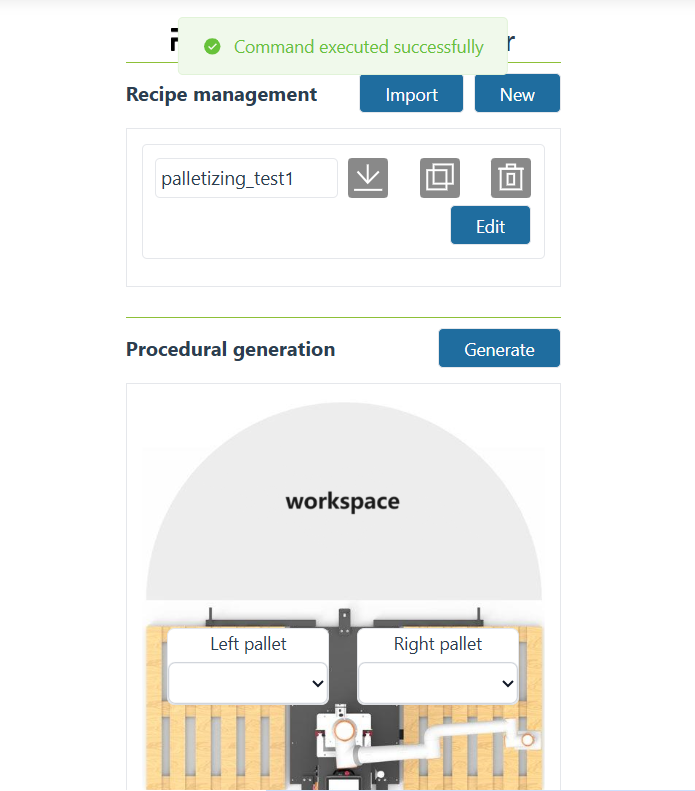

.. centered:: Figura 10-2-5 Exportação de Receita

Copiar
~~~~~~~~~
Na área de operações de qualquer receita, clique no ícone "Copiar" para abrir a janela pop-up "Copiar Receita de Paletização". Insira o nome da receita e clique no botão "Confirmar". Após a cópia bem-sucedida, a receita copiada aparecerá na área de exibição.

.. note:: 
   Todos os nomes de receitas começam com "palletizing". Não é necessário digitar "palletizing", a janela modal exibirá automaticamente o nome após o "_". Por exemplo, para "palletizing_copy", a janela exibirá automaticamente "copy".

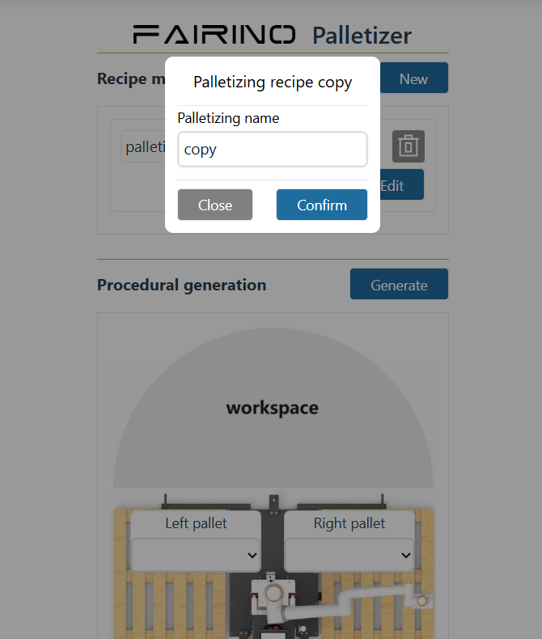

.. centered:: Figura 10-2-6 Cópia de Receita

Excluir
~~~~~~~~~
Na área de operações de qualquer receita, clique no ícone "Excluir" para remover a receita atual.

.. image:: frcap_pictures/023.png
   :width: 6in
   :align: center

.. image:: frcap_pictures/024.png
   :width: 6in
   :align: center

.. centered:: Figura 10-2-7 Exclusão de Receita

Editar
~~~~~~~~
Para qualquer receita, clique no botão "Editar" para entrar na interface de configuração da receita atual.

.. image:: frcap_pictures/025.png
   :width: 6in
   :align: center

.. centered:: Figura 10-2-8 Edição da Receita de Paletização

Importar
~~~~~~~~
Clique no botão "Importar", selecione o pacote compactado da receita de paletização e faça o upload. Após a importação bem-sucedida, a receita importada será adicionada à lista de receitas.

.. note:: 
   Todos os nomes dos pacotes compactados de receitas começam com "palletizing" e terminam com ".tar.gz", por exemplo, "palletizing_import.tar.gz".

.. image:: frcap_pictures/026.png
   :width: 6in
   :align: center

.. centered:: Figura 10-2-9 Importação de Receita

.. important:: 
   Ao "Adicionar", "Renomear" ou "Copiar" uma receita de paletização, se o nome inserido já existir, uma mensagem "Já existe uma receita com o mesmo nome" será exibida.

.. image:: frcap_pictures/027.png
   :width: 6in
   :align: center

.. centered:: Figura 10-2-10 Mensagem de Nome de Receita Duplicado

Configuração da Receita
------------------------------------
A interface de configuração de qualquer receita exibe as informações básicas da caixa, palete, padrão e configurações avançadas. Configure os parâmetros específicos nas seções correspondentes.

.. image:: frcap_pictures/028.png
   :width: 6in
   :align: center

.. centered:: Figura 10-3-1 Interface de Edição da Receita de Paletização

Configuração da Estação de Trabalho
~~~~~~~~~~~~~~~~~~~~~~~~~~~~~~~~~~~~~~~~~~~

Na edição da receita, é possível selecionar se deseja usar uma estação de trabalho de paletização. Se uma estação de trabalho de paletização for usada, a função de paletização correspondente usará os sinais I/O do CLP da estação. Se "Nenhuma Estação de Paletização" for selecionado, a função de paletização usará os sinais I/O do painel de controle por padrão.

.. image:: frcap_pictures/076.png
   :width: 4in
   :align: center

.. centered:: Figura 10-3-1-1 Página de Edição da Receita

Configuração da Conexão I/O para Função de Paletização
~~~~~~~~~~~~~~~~~~~~~~~~~~~~~~~~~~~~~~~~~~~~~~~~~~~~~~~~~~~~~~~~

(1) Após selecionar o uso da estação de trabalho de paletização, clique em "Configuração de I/O de Extensão". Com base nas funções correspondentes e na conexão real com a interface I/O do CLP, personalize a configuração dos sinais I/O para a função de paletização. A figura abaixo mostra a configuração de conexão padrão da estação de trabalho de paletização.

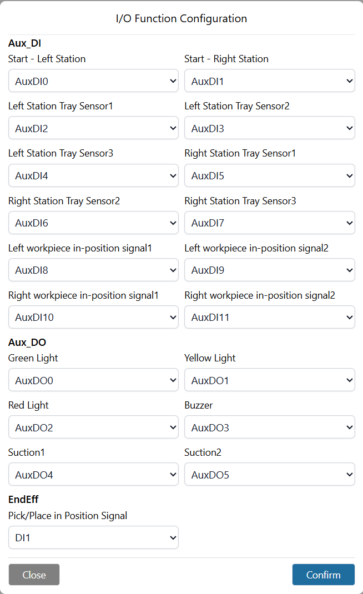

.. centered:: Figura 10-3-1-2 Configuração de Conexão Padrão da Estação de Trabalho de Paletização

(2) Se a opção "Não usar estação de trabalho de paletização" for selecionada, os sinais I/O do painel de controle serão usados por padrão. Com base nas funções correspondentes e na conexão real com a interface I/O do painel de controle, personalize a configuração dos sinais I/O para a função de paletização. A figura abaixo mostra a configuração de conexão padrão para a opção "Sem estação de trabalho de paletização (usando I/O do painel de controle)".

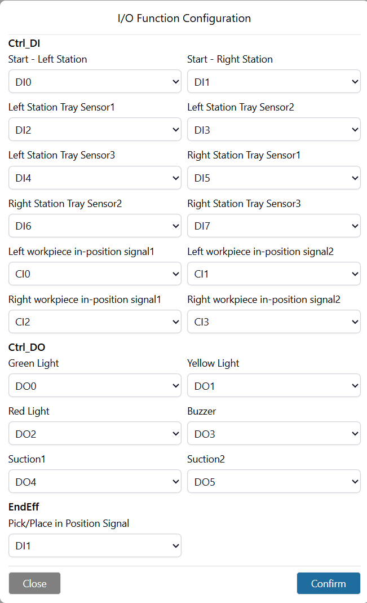

.. centered:: Figura 10-3-1-3 Configuração de Conexão Padrão para Sem Estação de Paletização (I/O do Painel de Controle)

Teste de Comunicação I/O para Função de Paletização
~~~~~~~~~~~~~~~~~~~~~~~~~~~~~~~~~~~~~~~~~~~~~~~~~~~~~~~~~~~~~~~~

(1) Ao selecionar o uso da estação de trabalho de paletização, após configurar os sinais I/O de extensão da estação, clique em "Teste" para verificar a fiação das funções I/O.

.. image:: frcap_pictures/079.png
   :width: 4in
   :align: center

.. centered:: Figura 10-3-1-4 Teste de Conexão I/O da Estação de Trabalho de Paletização

(2) Ao selecionar "Nenhuma estação de trabalho de paletização", após configurar os sinais I/O do painel de controle correspondentes à função de paletização, clique em "Teste" para verificar a fiação das funções I/O.

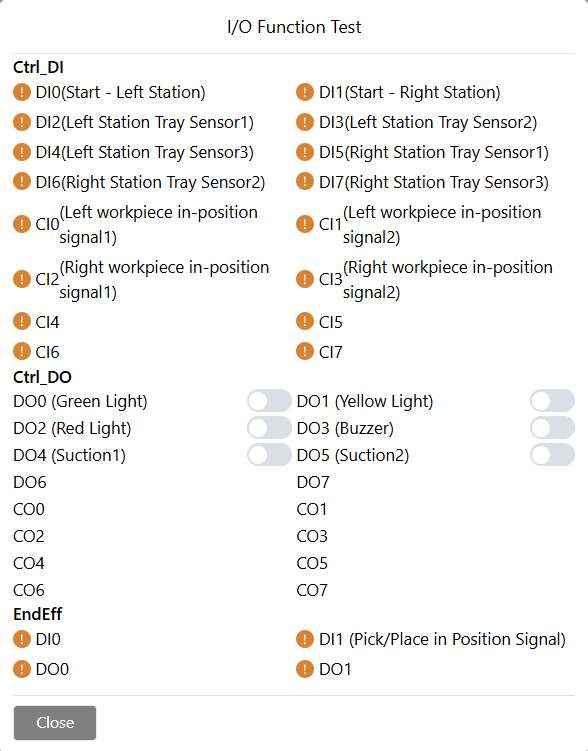

.. centered:: Figura 10-3-1-5 Teste de Conexão para Sem Estação de Paletização (I/O do Painel de Controle)

Configuração da Caixa
~~~~~~~~~~~~~~~~~~~~~~~~~~~~~~~~~

Operações com Caixas
++++++++++++++++++++++++++++++++

Vários tipos diferentes de caixas podem ser configurados.

Clique no botão "Adicionar". Após a adição bem-sucedida, uma nova caixa será adicionada na ordem atual.

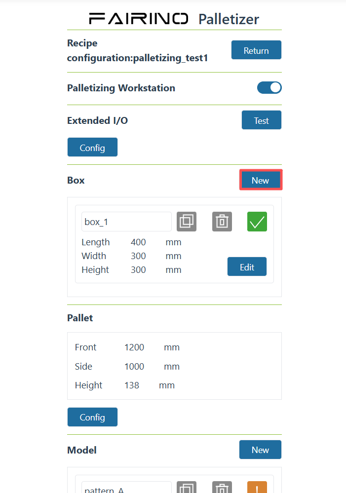

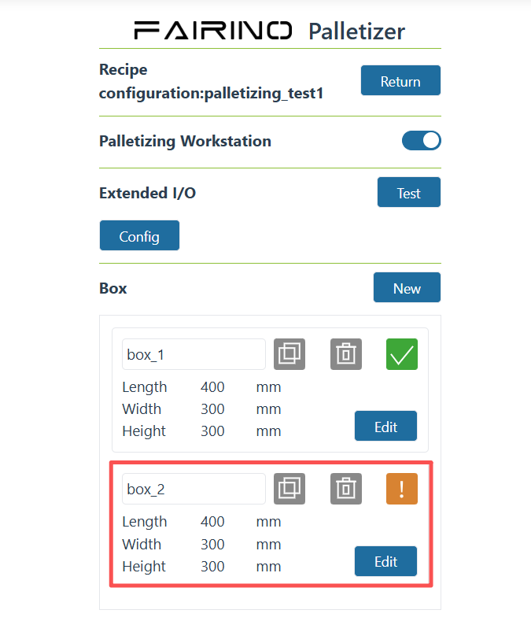

.. centered:: Figura 10-3-2 Adicionar Caixa

Clique na área de exibição do nome da caixa para abrir a janela pop-up "Renomear Caixa". Insira o nome e clique no botão "Confirmar" para confirmar a renomeação.

.. image:: frcap_pictures/050.png
   :width: 6in
   :align: center

.. centered:: Figura 10-3-3 Renomear Caixa

Clique no ícone "Copiar". Após a cópia bem-sucedida, uma nova caixa será criada com base no nome da caixa atual.

.. image:: frcap_pictures/051.png
   :width: 6in
   :align: center

.. image:: frcap_pictures/052.png
   :width: 6in
   :align: center

.. centered:: Figura 10-3-4 Copiar Caixa

Clique no ícone "Excluir" para remover os dados da caixa.

.. note:: 
   Não exclua caixas que já foram configuradas na configuração do padrão.

.. image:: frcap_pictures/053.png
   :width: 6in
   :align: center

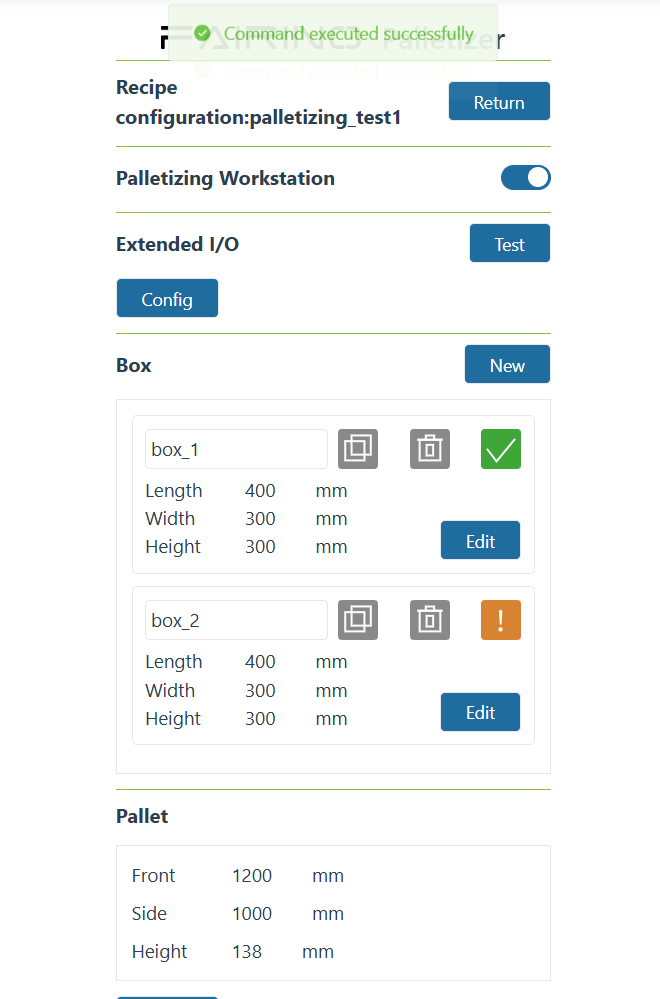

.. centered:: Figura 10-3-5 Excluir Caixa

Para qualquer caixa, clique no botão "Editar" para entrar na interface de configuração dos parâmetros da caixa. Após a configuração bem-sucedida, o ícone de status da configuração da caixa ficará verde; se a configuração estiver incompleta, o ícone ficará amarelo.

.. image:: frcap_pictures/055.png
   :width: 6in
   :align: center

.. centered:: Figura 10-3-6 Configuração dos Parâmetros da Caixa Concluída

.. image:: frcap_pictures/056.png
   :width: 6in
   :align: center

.. centered:: Figura 10-3-7 Configuração dos Parâmetros da Caixa Incompleta

Parâmetros da Caixa
++++++++++++++++++++++++++++++++

.. note:: 
   .. image:: frcap_pictures/057.png
      :width: 0.5in
      :height: 0.5in
      :align: left

   | Nome: **Caixa Anterior**
   | Função: Alternar para a caixa anterior. Quando a primeira caixa estiver selecionada, alternar novamente selecionará a última caixa.

.. note:: 
   .. image:: frcap_pictures/058.png
      :width: 0.5in
      :height: 0.5in
      :align: left

   | Nome: **Próxima Caixa**
   | Função: Alternar para a próxima caixa. Quando a última caixa estiver selecionada, alternar novamente selecionará a primeira caixa.

Na seção de configuração da caixa, clique em "Editar" para abrir a janela pop-up "Configuração da Caixa". Defina o "Comprimento", "Largura", "Altura", "Carga" e "Orientação da Etiqueta da Peça" da caixa e clique no botão "Confirmar" para concluir a configuração das informações da caixa. Defina o ponto de agarramento da caixa (mantenha o ponto de agarramento no centro da caixa; a base da ventosa deve ficar ligeiramente comprimida ao entrar em contato com a caixa) e clique no botão "Registrar" para concluir a configuração.

.. image:: frcap_pictures/029.png
   :width: 6in
   :align: center

.. centered:: Figura 10-3-8 Configuração da Caixa

.. image:: frcap_pictures/030.png
   :width: 3in
   :align: center

.. centered:: Figura 10-3-9 Ponto de Agarramento da Caixa

.. important:: O ponto de agarramento da caixa deve ser registrado; caso contrário, o comprimento, a largura e a altura da caixa não poderão ser configurados.

Configuração do Palete
+++++++++++++++++++++++++++++++++
Na seção de configuração do palete, clique em "Configurar" para abrir a janela pop-up "Configuração do Palete". Defina a "Frente", a "Lateral" e a "Altura" do palete. Em seguida, defina os pontos de transição da estação de trabalho e clique em "Confirmar Configuração" para concluir a configuração das informações do palete.

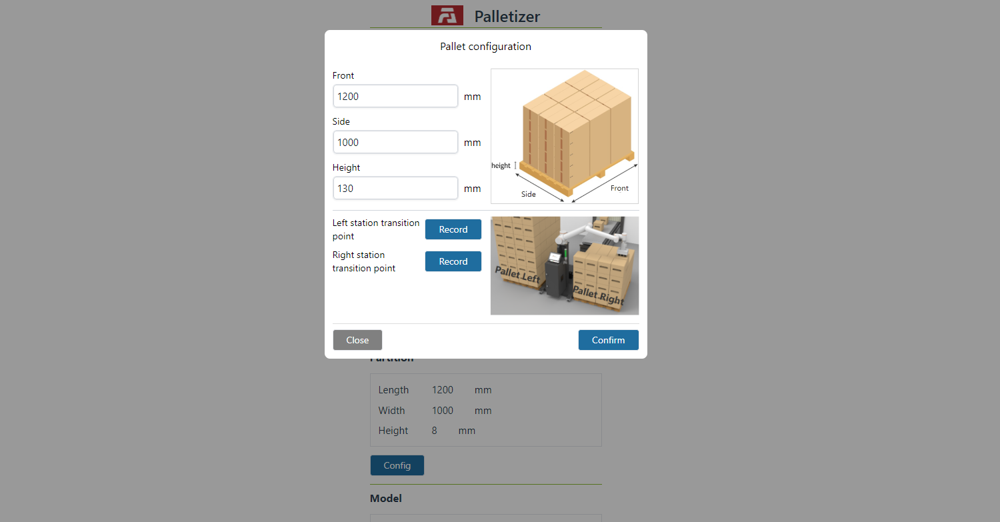

.. centered:: Figura 10-3-10 Configuração do Palete

.. image:: frcap_pictures/032.png
   :width: 3in
   :align: center

.. centered:: Figura 10-3-11 Ponto de Transição da Estação Esquerda

.. image:: frcap_pictures/033.png
   :width: 3in
   :align: center

.. centered:: Figura 10-3-12 Ponto de Transição da Estação Direita

.. important:: Os pontos de transição da estação de trabalho devem ser registrados; caso contrário, o programa gerado não poderá ser salvo.

Configuração do Padrão
~~~~~~~~~~~~~~~~~~~~~~~~~~~~~~

Operações com Padrões
++++++++++++++++++++++++++++++

Na configuração do padrão, ao selecionar uma caixa, você pode selecionar caixas com a mesma altura, mas comprimento e largura diferentes. A área de exibição do padrão é dividida em: Adição de Padrão (configuração do padrão de empilhamento) e Configuração do Número de Camadas do Empilhamento.

.. image:: frcap_pictures/059.png
   :width: 3in
   :align: center

.. centered:: Figura 10-3-13 Área de Exibição do Padrão

Clique no botão "Adicionar". Após a adição bem-sucedida, um novo padrão será adicionado na ordem atual.

.. image:: frcap_pictures/060.png
   :width: 6in
   :align: center

.. image:: frcap_pictures/061.png
   :width: 6in
   :align: center

.. centered:: Figura 10-3-14 Adicionar Padrão

Para qualquer padrão na área de adição de padrões, clique na área de exibição do nome do padrão para abrir a janela pop-up "Renomear Padrão". Insira o nome e clique no botão "Confirmar" para confirmar a renomeação.

.. image:: frcap_pictures/062.png
   :width: 6in
   :align: center

.. centered:: Figura 10-3-15 Renomear Padrão

Para qualquer padrão na área de adição de padrões, clique no ícone "Copiar". Após a cópia bem-sucedida, um novo padrão será criado com base no nome do padrão atual.

.. image:: frcap_pictures/063.png
   :width: 6in
   :align: center

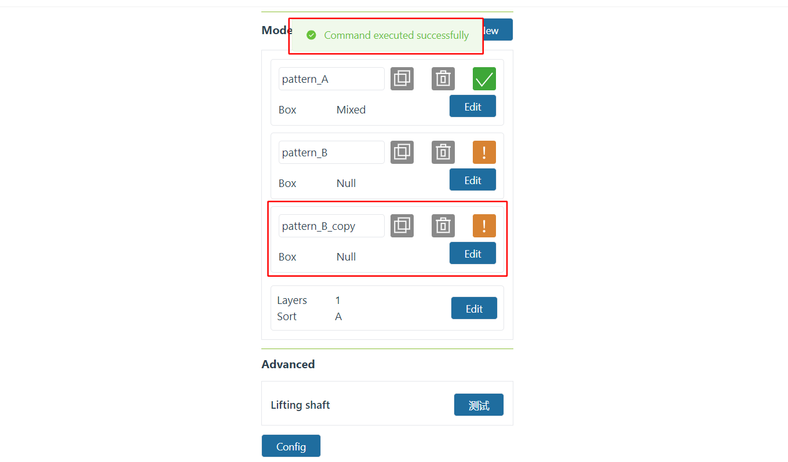

.. centered:: Figura 10-3-16 Copiar Padrão

Para qualquer padrão na área de adição de padrões, clique no ícone "Excluir" para remover os dados do padrão atual.

.. image:: frcap_pictures/065.png
   :width: 6in
   :align: center

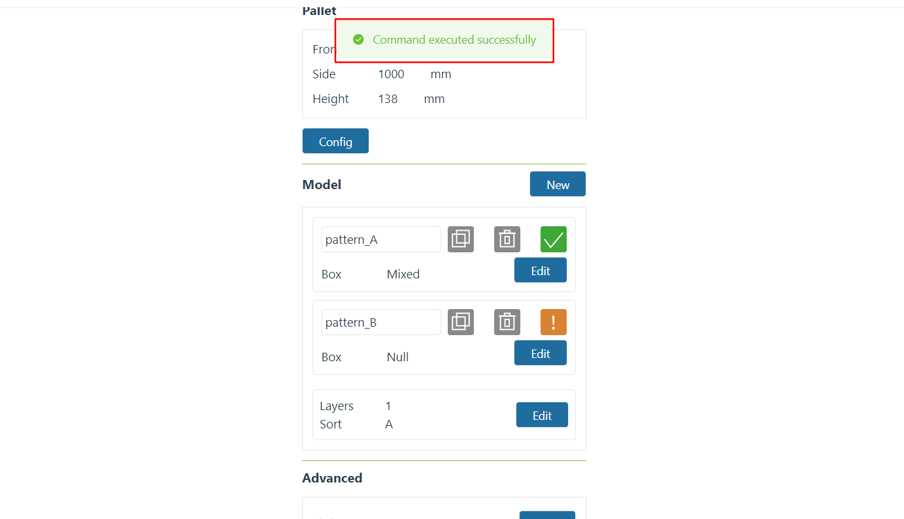

.. centered:: Figura 10-3-17 Excluir Padrão

Para qualquer padrão na área de adição de padrões, clique no botão "Editar" para abrir a janela pop-up "Configuração do Padrão" e configurar o padrão de empilhamento para o padrão atual. Após a configuração bem-sucedida, o ícone de status da configuração da caixa ficará verde; se a configuração estiver incompleta, o ícone ficará amarelo.

.. image:: frcap_pictures/067.png
   :width: 6in
   :align: center

.. centered:: Figura 10-3-18 Configuração dos Parâmetros do Padrão Concluída

.. image:: frcap_pictures/068.png
   :width: 6in
   :align: center

.. centered:: Figura 10-3-19 Configuração dos Parâmetros do Padrão Incompleta

Na área de configuração do número de camadas do empilhamento, exiba o número de camadas e a ordenação. Clique no botão "Editar" para abrir a janela pop-up "Configuração da Sequência de Padrões". Insira o "Número de Camadas do Empilhamento", selecione o padrão para cada camada e clique no botão "Confirmar" para concluir a configuração.

.. image:: frcap_pictures/069.png
   :width: 6in
   :align: center

.. centered:: Figura 10-3-20 Configuração do Número de Camadas do Empilhamento

Parâmetros do Padrão
++++++++++++++++++++++++++++++

.. note:: 
   .. image:: frcap_pictures/057.png
      :width: 0.5in
      :height: 0.5in
      :align: left

   | Nome: **Padrão Anterior**
   | Função: Alternar para o padrão anterior. Quando o primeiro padrão estiver selecionado, alternar novamente selecionará o último padrão.

.. note:: 
   .. image:: frcap_pictures/058.png
      :width: 0.5in
      :height: 0.5in
      :align: left

   | Nome: **Próximo Padrão**
   | Função: Alternar para o próximo padrão. Quando o último padrão estiver selecionado, alternar novamente selecionará o primeiro padrão.

Na seção de configuração do padrão, clique em "Configurar" para abrir a janela pop-up "Configuração do Padrão". Ela é dividida principalmente em quatro áreas: Seleção do Padrão, Operações com Caixas e Simulação do Padrão.

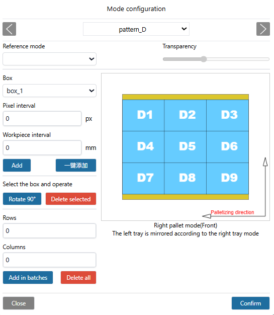

.. centered:: Figura 10-3-21 Configuração do Padrão

.. important:: 
   Ao adicionar caixas, se houver colisão entre elas, o fundo da peça ficará vermelho e as operações acima não poderão ser realizadas. Para prosseguir, ajuste as caixas para que não haja colisão.

No cabeçalho da janela pop-up, selecione o padrão. Na área de operações com caixas, selecione a caixa a ser adicionada ao padrão. Você pode adicionar caixas com um clique (padrão: sem espaçamento entre caixas, centralizado no palete). Personalize o espaçamento entre as caixas. As caixas podem ser adicionadas individualmente ou em lote. Clique em "Confirmar" para concluir a configuração das informações do padrão. Quando as alturas das caixas selecionadas forem diferentes, a configuração não poderá ser concluída e uma mensagem "As alturas dos tipos de caixa são diferentes e não podem ser adicionadas ao mesmo padrão" será exibida.

.. image:: frcap_pictures/070.png
   :width: 6in
   :align: center

.. centered:: Figura 10-3-22 Mensagem de Alturas de Caixa Diferentes

Selecione um padrão de referência (não é possível selecionar o padrão já escolhido) para comparar e verificar se a configuração do padrão atual pode ser empilhada com base nesse padrão de referência, facilitando a visualização do padrão de empilhamento sob diferentes configurações.

.. important:: 
   Direção do Empilhamento: Tomando o palete direito como exemplo, o canto inferior direito é o ponto mais distante. Disponha uma fileira de peças vertical ou horizontalmente a partir do canto inferior direito e, em seguida, disponha a próxima fileira horizontal ou verticalmente, e assim por diante (a direção do empilhamento está marcada na página web; preste atenção para visualizá-la). O palete esquerdo posiciona as peças como uma imagem espelhada do padrão do palete direito.

Configurações Avançadas
~~~~~~~~~~~~~~~~~~~~~~~~~~~~~~~~~
Na seção de configurações avançadas, clique em "Configurar" para abrir a janela pop-up "Configurações Avançadas". Os itens de configuração são os seguintes:

.. image:: frcap_pictures/041.png
   :width: 6in
   :align: center

.. centered:: Figura 10-3-23 Configurações Avançadas

1) Dimensões do Equipamento de Paletização: Dimensões da mesa de trabalho de paletização.

.. image:: frcap_pictures/074.png
   :width: 6in
   :align: center

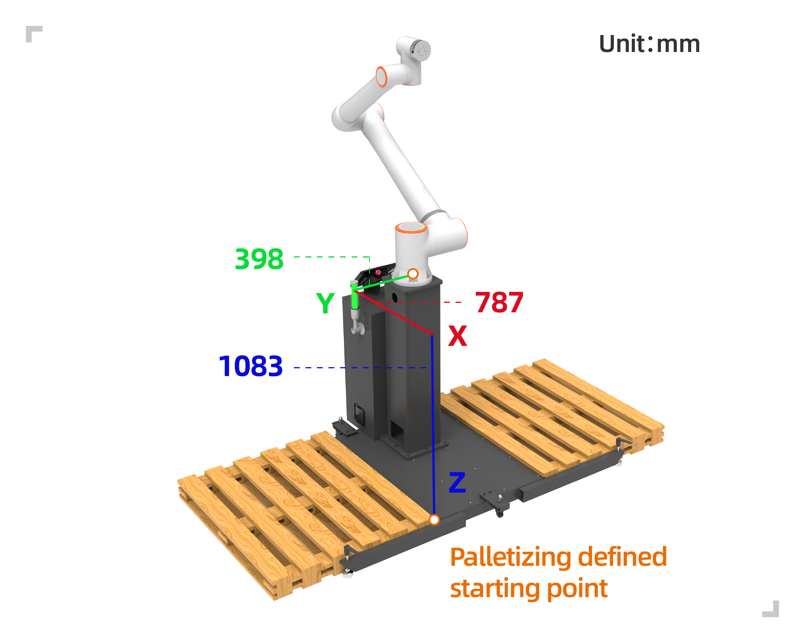

.. centered:: Figura 10-3-24 Mesa de Trabalho de Paletização

.. important::
   X, Y, Z são os valores absolutos do ponto do canto superior direito do palete esquerdo ou do canto superior esquerdo do palete direito em relação ao sistema de coordenadas base do robô. Angle é o ângulo de rotação durante a instalação do robô. Recomenda-se que seja 0.

2) Altura de Elevação da Coleta: Altura personalizada definida pelo usuário para elevar a peça após uma coleta bem-sucedida no ponto de agarramento.

3) Tempo de Espera da Coleta: Tempo de espera personalizado definido pelo usuário para monitorar o sinal de vácuo no local após a sucção. Se o sinal não for recebido, a ação de sucção será repetida.

4) Primeira/Segunda Distância de Deslocamento: Distância de deslocamento personalizada definida pelo usuário para que o robô coloque a peça inclinada no ponto alvo.

.. note::
   O parâmetro Z do primeiro deslocamento deve ser maior que a altura da caixa; caso contrário, haverá colisão com as caixas já colocadas durante o empilhamento.

5) Configuração da Placa Separadora: Defina as dimensões da placa separadora ("Comprimento", "Largura" e "Altura") e selecione a ativação/desativação da placa separadora.

.. note::
   Quando a função de placa separadora é ativada, o conteúdo das configurações avançadas exibido no gerenciamento de receitas mostrará os parâmetros básicos da placa separadora.

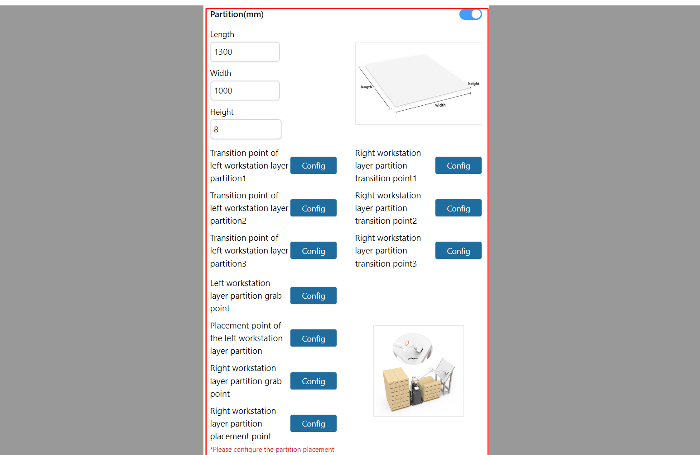

.. centered:: Figura 10-3-25 Configuração da Placa Separadora

.. image:: frcap_pictures/071.png
   :width: 6in
   :align: center

.. centered:: Figura 10-3-26 Gerenciamento de Receitas — Exibição da Placa Separadora nas Configurações Avançadas

Em seguida, defina os pontos de transição da placa separadora. Existem três pontos de transição. O objetivo é planejar aproximadamente um caminho de movimento após agarrar a placa separadora para evitar colisões que possam impedir a ação de colocação.

.. note:: O ponto de transição 1 é ensinado após o robô se mover uma certa distância a partir do ponto de agarramento da caixa. O ponto de transição 2 é ensinado após o robô se mover uma certa distância a partir do ponto de transição 1 (pode ser um ponto intermediário). O ponto de transição 3 é ensinado após o robô se mover uma certa distância a partir do ponto de transição 2, sendo o último ponto antes da colocação da placa separadora.

.. image:: frcap_pictures/035.png
   :width: 3in
   :align: center

.. centered:: Figura 10-3-27 Ponto de Transição 1 da Placa Separadora (exemplo com estação direita)

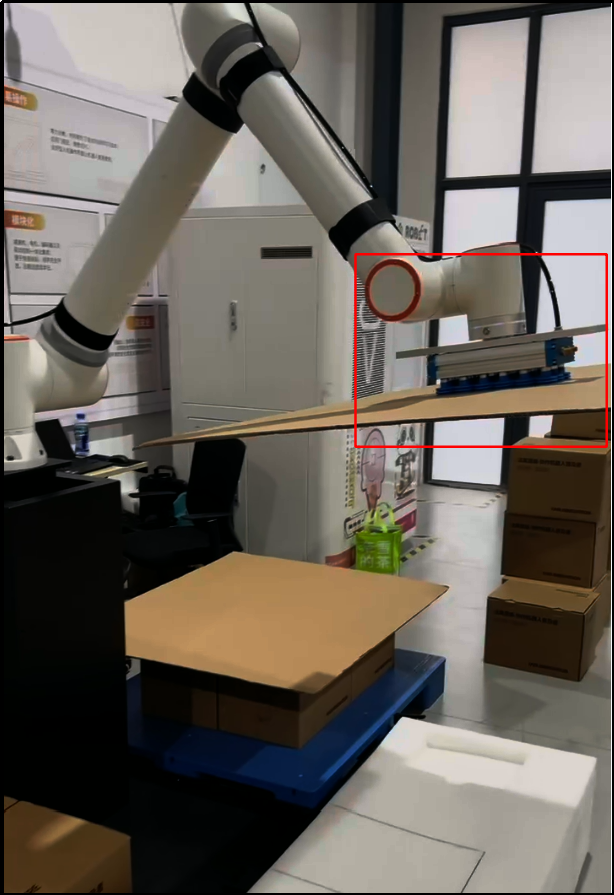

.. centered:: Figura 10-3-28 Ponto de Transição 2 da Placa Separadora (exemplo com estação direita)

.. image:: frcap_pictures/037.png
   :width: 3in
   :align: center

.. centered:: Figura 10-3-29 Ponto de Transição 3 da Placa Separadora (exemplo com estação direita)

Em seguida, defina o ponto de agarramento (mantenha o ponto de agarramento no centro da placa separadora; a base da ventosa deve ficar ligeiramente comprimida ao entrar em contato com a placa) e o ponto de colocação. Clique em "Confirmar" para concluir a configuração das informações da placa separadora.

.. image:: frcap_pictures/038.png
   :width: 3in
   :align: center

.. centered:: Figura 10-3-30 Ponto de Agarramento da Placa Separadora (exemplo com estação direita)

.. image:: frcap_pictures/039.png
   :width: 3in
   :align: center

.. centered:: Figura 10-3-31 Ponto de Colocação da Placa Separadora (exemplo com estação direita)

6) Eixo de Elevação: O usuário personaliza a ativação/desativação do eixo de elevação, os parâmetros de comunicação (endereço IP, número da porta e período de comunicação), o número da camada para iniciar a elevação e a ativação/desativação do eixo de elevação.

.. note::
   - Quando o eixo de elevação está funcionando, a altura elevada a cada vez é a altura da caixa.
   - Quando a função do eixo de elevação é ativada, o conteúdo das configurações avançadas exibido na página inicial mostrará um botão "Teste do Eixo de Elevação". Clique no botão "Teste" para abrir a janela pop-up "Teste do Eixo de Elevação" e testar a precisão do carregamento da comunicação, subida e descida do eixo de elevação, evitando problemas de funcionamento ou erros significativos quando usado diretamente.

.. image:: frcap_pictures/042.png
   :width: 6in
   :align: center

.. centered:: Figura 10-3-32 Configuração do Eixo de Elevação

.. image:: frcap_pictures/072.png
   :width: 6in
   :align: center

.. centered:: Figura 10-3-33 Gerenciamento de Receitas — Exibição do Eixo de Elevação nas Configurações Avançadas

.. image:: frcap_pictures/073.png
   :width: 4in
   :align: center

.. centered:: Figura 10-3-34 Teste do Eixo de Elevação

Geração do Programa
----------------------------
Visualize a "Geração do Programa" na parte inferior da exibição das receitas. Selecione a receita com base na receita e nas necessidades. Quando as receitas são selecionadas para ambas as estações esquerda e direita, a prioridade de inicialização precisa ser escolhida. Quando apenas a receita da estação esquerda ou direita é selecionada, a prioridade de inicialização não precisa ser escolhida. Após inserir o nome do programa, clique no botão "Gerar".

.. note:: Todos os nomes de programa começam com "palletizing". Não é necessário digitar "palletizing", apenas digite o nome após o "_". Por exemplo, para "palletizing_program", digite apenas "program".

.. image:: frcap_pictures/043.png
   :width: 4in
   :align: center

.. centered:: Figura 10-4-1 Geração do Programa — Receitas selecionadas para ambas as estações esquerda e direita

.. image:: frcap_pictures/081.png
   :width: 4in
   :align: center

.. centered:: Figura 10-4-2 Geração do Programa — Receita selecionada para a estação esquerda, nenhuma receita para a estação direita

.. important:: 
    1. Se nenhuma receita de paletização for selecionada para a estação esquerda ou direita, isso significa que a estação não está ativada.
    2. Após a geração bem-sucedida do programa, certifique-se de salvar manualmente todos os subprogramas e o programa principal no ensino de programa.
    3. Os programas de desempilhamento começam com "de". Por exemplo, se o programa de empilhamento for "palletizing_program", o programa de desempilhamento será "depalletizing_program".
    4. Ao executar um programa com receitas configuradas para ambas as estações, após receber simultaneamente os sinais de peça no local das estações esquerda e direita, o trabalho será realizado de acordo com a prioridade definida.

Programa com Ponto Único de Coleta
~~~~~~~~~~~~~~~~~~~~~~~~~~~~~~~~~~~~~~~~~~~~~~~~~~~

Existem duas situações para o programa com ponto único de coleta:

(1) A mesma receita é selecionada para as estações esquerda e direita.
(2) Receitas diferentes são selecionadas para as estações esquerda e direita, mas a pose do ponto de agarramento da caixa configurada nas receitas é a mesma.

.. image:: frcap_pictures/082.png
   :width: 4in
   :align: center

.. centered:: Figura 10-4-3 Ponto de Agarramento da Caixa para Ponto Único de Coleta

Programa com Pontos Duplos de Coleta
~~~~~~~~~~~~~~~~~~~~~~~~~~~~~~~~~~~~~~~~~~~~~~~~~~~
A configuração do programa com pontos duplos de coleta requer que receitas diferentes sejam selecionadas para as estações esquerda e direita, e que as poses dos pontos de agarramento da caixa configuradas nas receitas sejam diferentes.

.. image:: frcap_pictures/083.png
   :width: 4in
   :align: center

.. centered:: Figura 10-4-4 Pontos de Agarramento da Caixa para Pontos Duplos de Coleta