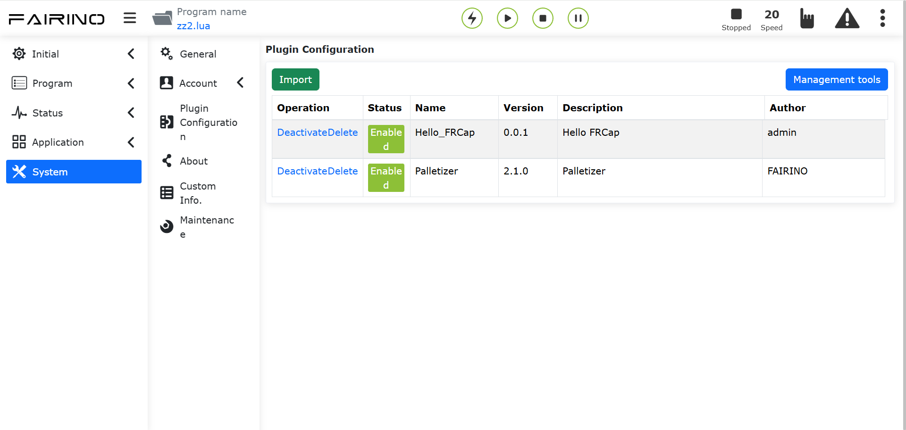
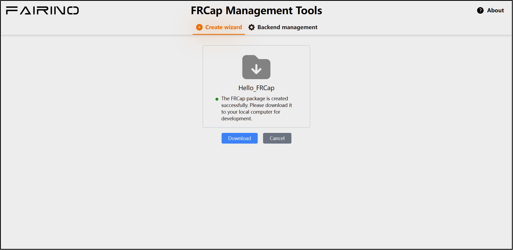

Início Rápido
=========================

.. toctree:: 
   :maxdepth: 6

Eu não tenho um FRCap
-----------------------------

Se você ainda não possui um FRCap, pode criar um rapidamente nesta seção.

Primeiro, precisamos conectar-se ao robô e acessar o WebApp. Abra um navegador no computador local, digite o endereço IP padrão do robô (http://192.168.58.2) e faça login no WebApp.

.. centered:: Figura 2-1 Página "Gerenciamento de FRCap" no WebApp

No WebApp, clique sequencialmente em "Configurações do Sistema" -> "Gerenciamento de FRCap" -> "Ferramentas de Gerenciamento". Uma nova aba será aberta no navegador acessando a "Ferramenta de Gerenciamento de FRCap".

.. image:: frcap_pictures/003.png
   :width: 6in
   :align: center

.. centered:: Figura 2-2 Ferramenta de Gerenciamento de FRCap

Na Ferramenta de Gerenciamento de FRCap, selecione o "Assistente de Criação" e insira ou selecione o seguinte conteúdo do plugin:

- Nome do Plugin: Hello_FRCap.
- Autor do Plugin: admin.
- Descrição do Plugin: Hello FRCap.
- Tipo de Plugin: Configuração.

O ícone do plugin não precisa ser enviado. Após inserir ou selecionar todos os parâmetros, clique em "Criar" para concluir a criação do FRCap.

.. image:: frcap_pictures/004.png
   :width: 6in
   :align: center

.. centered:: Figura 2-3 Assistente de Criação de FRCap

Após a criação bem-sucedida, a página será redirecionada para a página de sucesso, exibindo o nome do FRCap criado. Clique em "Download" para salvar o FRCap criado no computador local.

.. centered:: Figura 2-4 Download do pacote do plugin Hello FRCap

Eu já tenho um FRCap
-----------------------------
Se você já possui uma pasta de projeto FRCap que está de acordo com a estrutura de projeto do FRCap, leia diretamente a seção `Construir um FRCap <frcap_quick_start.html#id3>`__.

Se você já possui um pacote de plugin completo com a extensão de arquivo ".plugin", leia diretamente a seção `Hello FRCap <frcap_quick_start.html#hello-frcap>`__.

Construir um FRCap
-----------------------------
Abra o projeto FRCap baixado na seção 2.1 ou o seu projeto FRCap existente.

Dependendo do sistema operacional em uso, primeiro abra o script de build, modifique o parâmetro `buildName` para o nome desejado, salve e feche. Em seguida, execute o script correspondente no terminal.

- No Windows, inicie o terminal e execute o seguinte comando:

.. code-block:: c++
   :linenos:

   ./build.bat

- No Linux, inicie o terminal e execute o seguinte comando:
  
.. code-block:: c++
   :linenos:

   ./build.sh

Após a conclusão da construção, um arquivo de pacote com o nome do FRCap e a extensão ".plugin" será gerado no diretório do projeto FRCap.

.. image:: frcap_pictures/006.png
   :width: 6in
   :align: center

.. centered:: Figura 2-5 Arquivo do pacote FRCap após a construção

Hello FRCap
-------------
Após a construção do projeto FRCap, abra um navegador no computador local, digite o endereço IP padrão do robô (http://192.168.58.2) e faça login no WebApp. Clique sequencialmente em "Configurações do Sistema" -> "Gerenciamento de FRCap" -> "Importar". Selecione o arquivo do pacote FRCap com a extensão ".plugin" que foi construído e abra-o para fazer o upload. Após o upload bem-sucedido, as informações do FRCap importado serão exibidas na lista de informações do plugin na parte inferior.

Use a coluna de operações na lista para ativar, desativar ou excluir o FRCap. Verifique o status de ativação do FRCap na coluna de status de ativação/desativação.

Após a ativação, o Hello FRCap pode ser usado em "Aplicações Auxiliares" -> "FRCap" -> "Hello FRCap". Esta página hospeda FRCaps do tipo configuração e pode ser exibida em tela cheia ou meia tela. Por padrão, é exibida em meia tela.

Neste ponto, você concluiu todo o processo rápido de criação e uso do plugin.

.. image:: frcap_pictures/007.png
   :width: 6in
   :align: center

.. centered:: Figura 2-6 Conteúdo do Hello FRCap

Para obter instruções detalhadas sobre o assistente de criação, consulte a seção `Assistente de Criação <frcap_create.html#id1>`__.

Para obter informações sobre as ferramentas e o ambiente necessários para desenvolver um FRCap, consulte a seção `Guia de Desenvolvimento <frcap_development_guidance.html#id1>`__.

Para obter instruções específicas sobre como usar o FRCap no WebApp, consulte a seção `Usando FRCap no WebApp <frcap_use.html#webappfrcap>`__.