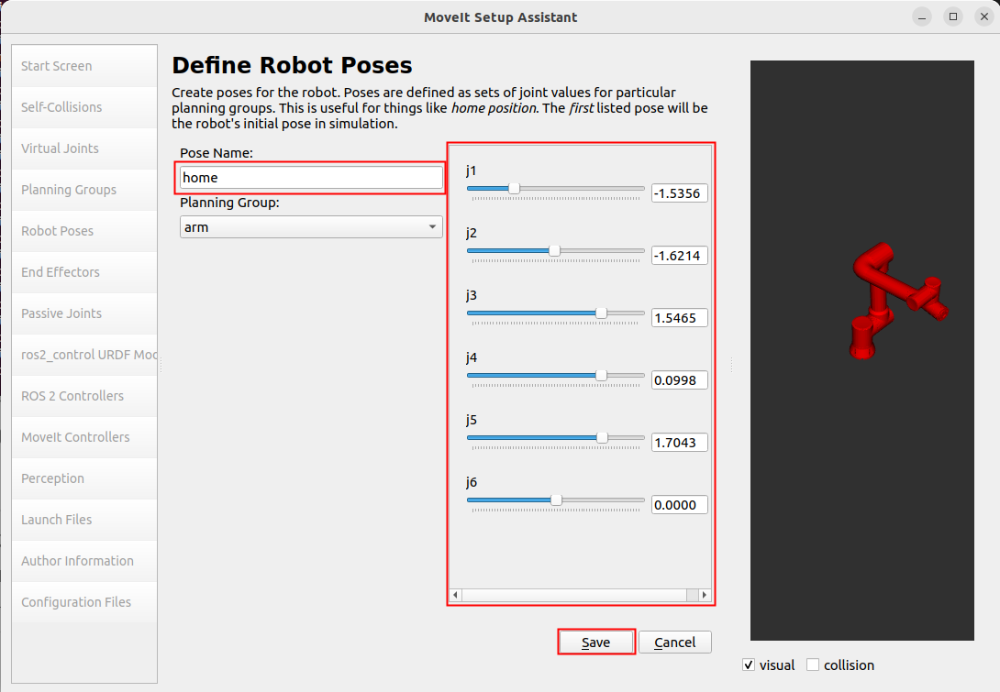
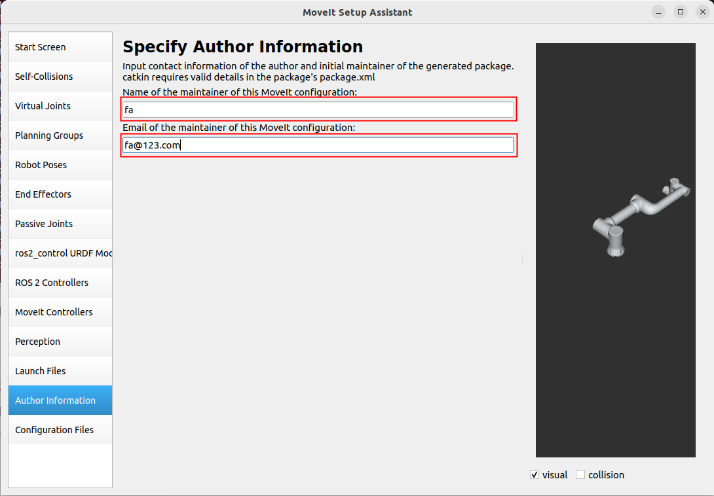
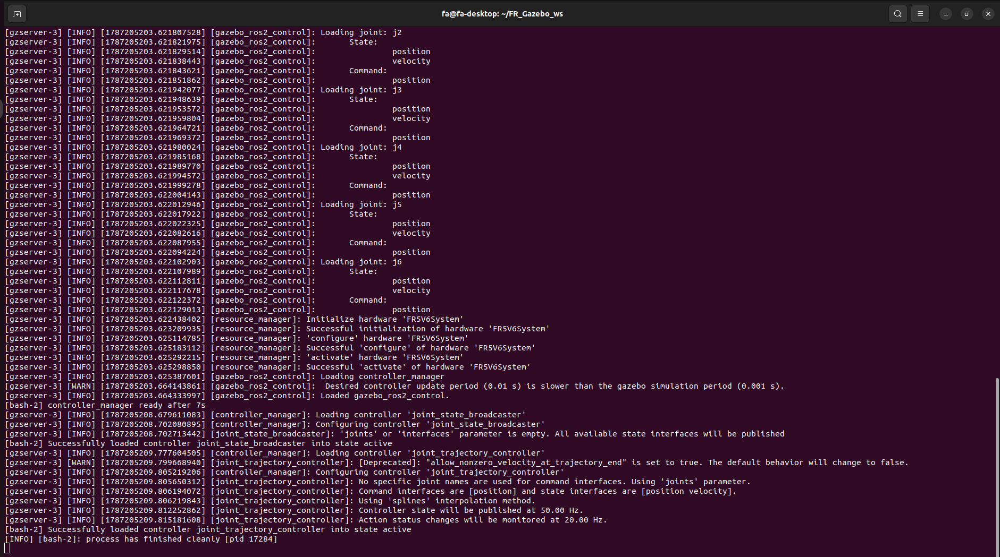
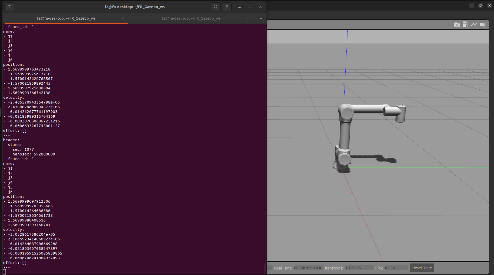
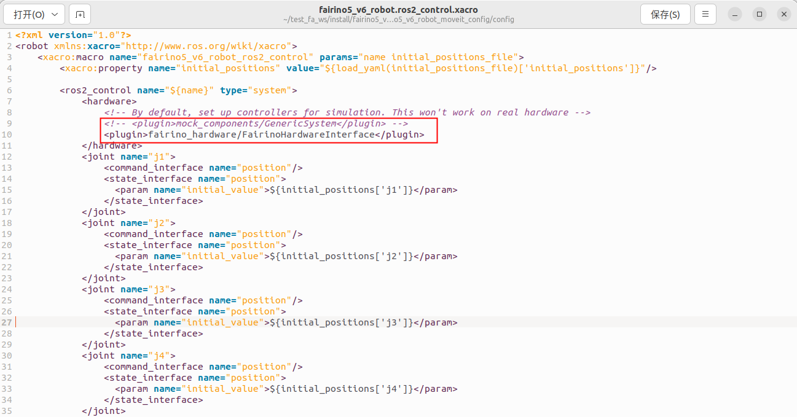
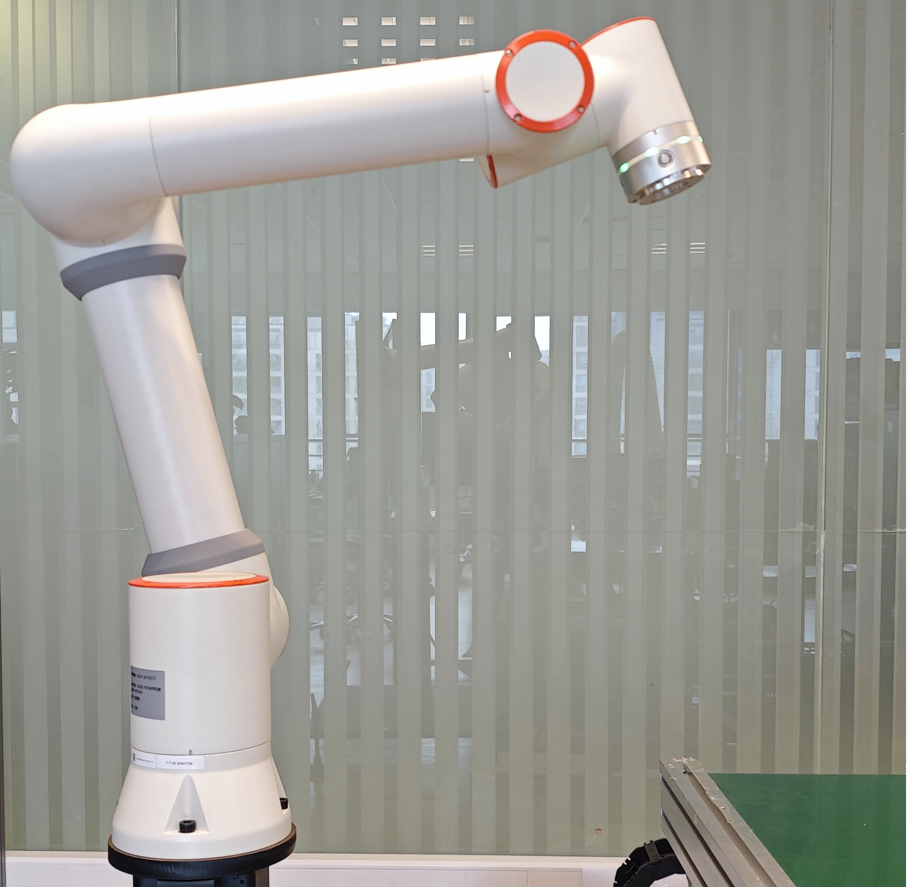
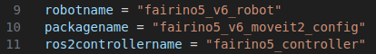
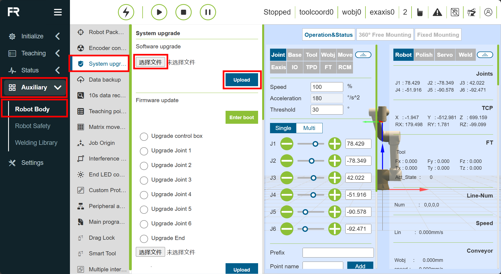

Introdução ao Plugin
++++++++++++++++++++++++++++++
O plugin FAIRINO MoveIt2 é um plugin que fornece suporte para controle de movimento e planejamento de trajetória para robôs FAIRINO. Com o plugin FAIRINO MoveIt2, é possível realizar funções complexas como controle de movimento do robô, planejamento de trajetória, resolução de cinemática inversa e detecção de colisão em tempo real. É adequado para várias aplicações com braços robóticos, como indústria, soldagem, manufatura, carga e descarga automatizada, paletização, áreas médicas, etc.

Início Rápido
++++++++++++++++++++++++++++++
Esta seção explica como configurar o ambiente de execução do aplicativo.

Recomenda-se o uso no Ubuntu 22.04 LTS (Jammy). Após a instalação do sistema, o ROS2 pode ser instalado. Recomenda-se o ros2-humble. Para a instalação do ROS2, consulte o tutorial: https://docs.ros.org/en/humble/index.html.

Instalação e Configuração do Pacote do Plugin FAIRINO MoveIt2
------------------------------------------------------------------------------
Clonar o Plugin FAIRINO MoveIt2
""""""""""""""""""""""""""""""""""
Clone o plugin FAIRINO MoveIt2 localmente e, em seguida, acesse o diretório alvo. Os principais arquivos incluem:

- `fairino_msgs`: Pacote de funcionalidades para tipos de dados de transmissão de dados do robô FAIRINO;
- `fairino_hardware`: Pacote de funcionalidades do plugin fairino_hardware do robô FAIRINO;
- `fairino_robot/fairino_description`: Pacote de funcionalidades para a aparência do robô FAIRINO e arquivos URDF;
- `fairino_robot/fairino3mt_v6_moveit2_config`, `fairino_robot/fairino3_v6_moveit2_config`, `fairino_robot/fairino5_v6_moveit2_config`, `fairino_robot/fairino10_v6_moveit2_config`, `fairino_robot/fairino16_v6_moveit2_config`, `fairino_robot/fairino20_v6_moveit2_config`, `fairino_robot/fairino30_v6_moveit2_config`: Pacotes de configuração moveit2 do robô FAIRINO.
- `fairino_robot/fairino_mtc_demo`: Pacote de código de exemplo mtc do FAIRINO.

.. image:: img/fairino_harware_001.png
    :width: 6in
    :align: center
.. image:: img/fairino_harware_002.png
    :width: 6in
    :align: center

Compilar os Pacotes de Funcionalidades
""""""""""""""""""""""""""""""""""""""""""""""""""""

Compilar o pacote de funcionalidades `fairino_msgs`:

.. code-block:: shell
    :linenos:

    cd ros2_ws
    colcon build --packages-select fairino_msgs
    source install/setup.bash

Compilar o pacote de funcionalidades `fairino_hardware`:

.. code-block:: shell
    :linenos:

    cd ros2_ws
    colcon build --packages-select fairino_hardware
    source install/setup.bash

Compilar o pacote de funcionalidades `fairino_description`:

.. code-block:: shell
    :linenos:

    cd ros2_ws
    colcon build --packages-select fairino_description
    source install/setup.bash

Compilar os pacotes de configuração moveit2 do robô FAIRINO, usando `fairino5_v6_moveit2_config` como exemplo:

.. code-block:: shell
    :linenos:

    cd ros2_ws
    colcon build --packages-select fairino5_v6_moveit2_config
    source install/setup.bash

Compilar o pacote de código de exemplo `fairino_mtc_demo` do robô FAIRINO. Se este pacote de código de exemplo não estiver presente no espaço de trabalho oficial `ros2_ws`, entre em contato com o suporte pós-venda para obtê-lo.

.. code-block:: shell
    :linenos:

    cd ros2_ws
    colcon build --packages-select fairino_mtc_demo
    source install/setup.bash

Configurar o Modelo MoveIt2 do Braço Robótico FAIRINO
--------------------------------------------------------------------------
Se não quiser usar o pacote de configuração `moveit2_config` do robô fornecido oficialmente, é possível configurar um pacote de configuração `moveit2_config` de robô personalizado usando o `moveit_setup_assistant`.

Criar um Espaço de Trabalho
""""""""""""""""""""""""""""""""""
Crie um espaço de trabalho e um pacote de funcionalidades:

.. code-block:: shell
    :linenos:

    mkdir -p test_fa_ws/src
    cd test_fa_ws/src
    mkdir fairino5_v6_robot_moveit_config
    cd ../..
    cd ..

Compile o pacote de funcionalidades e faça o source:

.. code-block:: shell
    :linenos:

    colcon build
    source install/setup.bash

Inicie o `moveit_setup_assistant` para configurar o robô:

.. code-block:: shell
    :linenos:

    ros2 launch moveit_setup_assistant setup_assistant.launch.py

Configurar o Robô
""""""""""""""""""""""""""""""""""
Iniciar a Interface de Configuração
^^^^^^^^^^^^^^^^^^^^^^^^^^^^^^^^^^^^^^^^
Abra um terminal no diretório `test_fa_ws`. Na interface de configuração, selecione “Create New Moveit Configuration Package” para criar um novo pacote de configuração moveit.

.. image:: img/fairino_harware_003.png
    :width: 6in
    :align: center

Em seguida, selecione o arquivo de descrição do robô, ou seja, o arquivo `.urdf`, e clique em “Load Files” para carregar o modelo do robô. O modelo do robô aparecerá no lado direito.

.. image:: img/fairino_harware_004.png
    :width: 6in
    :align: center

Configurar Self-Collisions
^^^^^^^^^^^^^^^^^^^^^^^^^^^^^^^^^^^^^^^^
Self-Collisions é para configuração de colisão do robô. Clique em “Generate Collision Matrix” para gerar automaticamente a matriz de colisão das juntas. Isso cancela a colisão entre os elos em contato e aqueles que nunca entrarão em contato, configurando assim a matriz de colisão das juntas do robô e evitando o cálculo da colisão entre as superfícies de contato. Clique em “Generate Collision Matrix” para gerar automaticamente.

.. image:: img/fairino_harware_005.png
    :width: 6in
    :align: center

Configurar Virtual Joints
^^^^^^^^^^^^^^^^^^^^^^^^^^^^^^^^^^^^^^^^
Virtual Joints são os eixos virtuais do robô. Quando o robô é montado em uma plataforma móvel, é necessário definir eixos virtuais para ele. Defina o nome do eixo virtual, o elo filho, o tipo de junta, etc. Quando a plataforma móvel se move, o eixo virtual também se move simultaneamente, movendo assim o robô. Isso permite que o robô se mova com a plataforma móvel. Neste caso, colocamos o robô diretamente no sistema de coordenadas world e o nomeamos como `virtual_joints`.

.. image:: img/fairino_harware_006.png
    :width: 6in
    :align: center

Configurar Planning Groups
^^^^^^^^^^^^^^^^^^^^^^^^^^^^^^^^^^^^^^^^
Planning Groups são os grupos de planejamento do robô. Eles agrupam as juntas que precisam ser consideradas juntas para o cálculo cinemático dentro do mesmo grupo de planejamento, realizando cálculos de cinemática direta e inversa unificados. Por exemplo, ao colocar um robô em um carrinho AGV e, em seguida, instalar uma garra na extremidade do robô, teste agrupar as quatro juntas do carrinho AGV em um grupo de planejamento, as seis juntas do robô em outro grupo de planejamento e a junta da garra em um grupo de planejamento separado para o cálculo cinemático.

Como este exemplo não envolve uma garra, apenas adicionamos os grupos de juntas do robô, ou seja, o grupo `arm`. Primeiro, adicione o grupo `arm`. Selecione `kdl_kinematics_plugin/KDLKinematicsPlugin` como o Solver Cinemático (Kinematic Solver). Em seguida, selecione `TRRT` como o Planejador Padrão do Grupo (Group Default Planner). Depois, clique em “Add Joints” para adicionar juntas a este grupo de planejamento.

.. image:: img/fairino_harware_007.png
    :width: 6in
    :align: center

As juntas do `arm` podem ser selecionadas múltiplas vezes mantendo pressionada a tecla Shift. Clique em ‘>’ para adicionar e, em seguida, clique em “save” para salvar.

.. image:: img/fairino_harware_008.png
    :width: 6in
    :align: center

O grupo de planejamento definido é mostrado abaixo:

.. image:: img/fairino_harware_009.png
    :width: 6in
    :align: center

Configurar Robot Poses
^^^^^^^^^^^^^^^^^^^^^^^^^^^^^^^^^^^^^^^^
Robot Poses são as poses predefinidas do robô. Elas definem algumas poses predefinidas para cada grupo de planejamento. Defina uma pose `home` para o grupo `arm`. Esta pose pode ser escolhida arbitrariamente.

Robot Poses pode definir poses predefinidas para cada grupo de planejamento. Quando o robô tem uma garra, um grupo de planejamento da garra pode ser adicionado na seção Planning Groups. Ao definir as poses em Robot Poses, a pose predefinida pode ser definida para a garra.

Configurar End Effectors
^^^^^^^^^^^^^^^^^^^^^^^^^^^^^^^^^^^^^^^^
End Effectors são os mecanismos de execução da extremidade do robô. O grupo de planejamento do mecanismo de execução da extremidade é `hand`. O `parent_link` conectado por padrão é `panda_link8`. Como não há mecanismo de execução da extremidade neste exemplo, esta etapa pode ser ignorada.

ros2_control URDF Modifications
^^^^^^^^^^^^^^^^^^^^^^^^^^^^^^^^^^^^^^^^
ros2_control URDF Modifications é usado principalmente para definir os tipos de dados das juntas para envio e feedback. Três tipos podem ser selecionados: posição, velocidade e torque. Neste caso, selecionamos o controle de posição tanto para envio quanto para feedback. Em seguida, clique em “Add interfaces” diretamente.

.. image:: img/fairino_harware_011.png
    :width: 6in
    :align: center

.. important:: 

   - Nota:

    O tipo de dado da junta selecionado precisa corresponder ao plugin `fairino_hardware`. Escolha os tipos de dados das juntas para envio e feedback com base nos dados transmitidos pelo plugin `fairino_hardware`. Como o plugin `fairino_hardware` que controla o movimento real do robô usa o tipo de dado `position`, selecionamos o controle de posição tanto para envio quanto para feedback.

ROS 2 Controllers
^^^^^^^^^^^^^^^^^^^^^^^^^^^^^^^^^^^^^^^^
ROS 2 Controllers é usado principalmente para gerar o arquivo `ros2_controllers.yaml`. Este arquivo define a frequência de publicação, os nomes das juntas, os nomes dos controladores, os tipos de controladores, etc. Configure ROS 2 Controllers para cada grupo de planejamento. Clique em “Auto Add JointTrajectoryController Controllers For Each Planning Group” para adicionar automaticamente.

.. image:: img/fairino_harware_012.png
    :width: 6in
    :align: center

Moveit Controllers
^^^^^^^^^^^^^^^^^^^^^^^^^^^^^^^^^^^^^^^^
Moveit Controllers é usado principalmente para gerar o arquivo `moveit_controllers`. Este arquivo define os nomes dos controladores, os tipos de controladores, etc. É importante notar que os nomes dos controladores em `moveit_controllers` precisam ser os mesmos que os nomes dos controladores em `ros2_controllers`; caso contrário, a execução não ocorrerá corretamente.

Além disso, quando os nomes dos controladores em `moveit_controllers` são os mesmos que os nomes dos controladores em `ros2_controllers`, os tipos de controladores em `moveit_controllers` são automaticamente mapeados para os tipos de controladores em `ros2_controllers`. Isso permite que os dados de controle enviados sejam transmitidos pelo `moveit_controllers` para o `ros2_controllers` e, em seguida, através do plugin em `ros2_controllers`, o movimento real do robô é acionado.

.. image:: img/fairino_harware_013.png
    :width: 6in
    :align: center

Launch Files
^^^^^^^^^^^^^^^^^^^^^^^^^^^^^^^^^^^^^^^^
Configure os Launch Files. Use a configuração padrão.

.. image:: img/fairino_harware_014.png
    :width: 6in
    :align: center

Informações do Autor
^^^^^^^^^^^^^^^^^^^^^^^^^^^^^^^^^^^^^^^^

Gerar os Arquivos Launch
^^^^^^^^^^^^^^^^^^^^^^^^^^^^^^^^^^^^^^^^
Gere os arquivos Launch. Selecione o local de geração. Neste caso, criamos uma pasta `fairino5_v6_robot_moveit_config` no caminho `test_fa_ws/src` para armazenar os arquivos de configuração e, em seguida, selecione “Generate”.

.. image:: img/fairino_harware_016.png
    :width: 6in
    :align: center

Como já configuramos anteriormente, se for a primeira configuração, a parte “Check files you want to be generated” estará preta, indicando que os arquivos Launch podem ser gerados.

Iniciar o Launch
""""""""""""""""""""""""""""""""""
Após a configuração, os pacotes de funcionalidades podem ser compilados. É possível usar o pacote de configuração moveit2 do robô personalizado para substituir o pacote de configuração moveit2 do robô FAIRINO, permitindo a compatibilidade do plugin com robôs personalizados pelo usuário.

.. code-block:: shell
    :linenos:

    colcon build --packages-select fairino5_v6_robot_moveit_config
    source install/setup.bash

Em seguida, execute diretamente o arquivo Launch configurado anteriormente:

.. code-block:: shell
    :linenos:

    ros2 launch fairino5_v6_robot_moveit_config demo.launch.py

A interface rviz2 configurada será exibida.

.. image:: img/fairino_harware_017.png
    :width: 6in
    :align: center

Uso do MoveIt2
""""""""""""""""""""""""""""""""""
Após abrir o pacote configurado, é possível definir a posição alvo do robô arrastando a esfera azul na extremidade do robô na interface 3D do lado direito e, em seguida, alterar a postura da extremidade do robô através dos três anéis vermelho, verde e azul na extremidade do robô.

.. image:: img/fairino_harware_018.png
    :width: 6in
    :align: center

Clique no botão “Plan” no lado esquerdo para planejar a trajetória de movimento do robô.

.. image:: img/fairino_harware_019.png
    :width: 6in
    :align: center

Clique no botão “Execute” no lado esquerdo para acionar o robô a se mover para a pose alvo ao longo da trajetória planejada.

.. image:: img/fairino_harware_020.png
    :width: 6in
    :align: center

O botão “Plan & Execute” planeja a trajetória e, em seguida, controla automaticamente o movimento do robô.

Em seguida, clique na aba “Joints” para alterar a pose alvo do robô ajustando os ângulos das juntas. Depois, use os botões “Plan”, “Execute” e “Plan & Execute” para acionar o movimento do robô.

.. image:: img/fairino_harware_021.png
    :width: 6in
    :align: center

Pacote de Funcionalidades de Adaptação de Robôs de Produção em Massa para Ambiente de Simulação Gazebo
++++++++++++++++++++++++++++++++++++++++++++++++++++++++++++++++++++++++++++++++++++++++++++++++++++++++++++++++++++++++

Introdução
------------------------------------------------------------

Este projeto fornece pacotes de funcionalidades de simulação para robôs colaborativos de 6 graus de liberdade da série FR no ambiente de simulação Gazebo Classic, implementados com base na arquitetura ROS2 Humble e ros2_control. Cada robô corresponde a um pacote ROS2 independente, utilizando a interface de hardware GazeboSystem padrão do ros2_control, suportando controle de juntas e feedback de estado das juntas. O nome padrão do workspace neste manual é FR_Gazebo_ws; se personalizado, substitua-o adequadamente.

Modelos Suportados (11 Pacotes de Funcionalidades)
""""""""""""""""""""""""""""""""""""""""""""""""""""""""""""""""""""""""""""""""""""""""""""""""""""""""""""

Tabela 1-1 Correspondência de Modelos Suportados e Pacotes de Funcionalidades

.. list-table::
   :widths: 50 50
   :header-rows: 0
   :align: center

   * - **Modelo** 
     - **Pacote de Funcionalidades**

   * - FR3
     - fr3v6_ros2_control

   * - FR5
     - fr5v6_ros2_control

   * - FR10
     - fr10v6_ros2_control

   * - FR16
     - fr16v6_ros2_control

   * - FR20
     - fr20v6_ros2_control

   * - FR30
     - fr30v6_ros2_control

   * - FR3C
     - fr3c_ros2_control

   * - FR5C
     - fr5c_ros2_control

   * - FR5WML
     - fr5l_ros2_control

   * - FR3WML
     - fr3wml_ros2_control

   * - FR3WMS
     - fr3wms_ros2_control

Características Principais
""""""""""""""""""""""""""""""""""""""""""""""""""""""""""""""""""""""""""""""""""""""""""""""""""""""""""""

- Nomenclatura Unificada de Juntas: Todos os modelos possuem 6 juntas rotacionais, nomeadas j1 ~ j6, na ordem: base → ombro → cotovelo → punho1 → punho2 → punho3.
- Interface de Controle Unificada: Comandos trajectory_msgs/msg/JointTrajectory (controle de posição) são enviados via tópico /joint_trajectory_controller/joint_trajectory.
- Feedback de Estado das Juntas: Os ângulos das juntas são retornados em tempo real via tópico joint_states sob o namespace de cada modelo.
- Scripts de Demonstração: Cada pacote de funcionalidades inclui um script _demo.py que aguarda automaticamente o controlador ficar pronto e então demonstra o movimento de cada junta.

.. image:: img/039.png
    :width: 6in
    :align: center

.. centered:: Figura 1-1 Efeito de Carregamento do Robô no Ambiente de Simulação Gazebo

Requisitos de Ambiente
------------------------------

Sistema Operacional
""""""""""""""""""""""""""""""""""""""""""""""""""""""""""""""""""""""""""""""""""""""""""""""""""""""""""""

Ubuntu 22.04 LTS (versão oficialmente suportada pelo ROS 2 Humble).

Dependências de Software
""""""""""""""""""""""""""""""""""""""""""""""""""""""""""""""""""""""""""""""""""""""""""""""""""""""""""""

Tabela 2-1 Lista de Dependências de Software

.. list-table::
   :widths: 30 30 40
   :header-rows: 0
   :align: center

   * - **Software/Componente** 
     - **Versão/Descrição**
     - **Caminho de Instalação**

   * - ROS 2
     - Humble
     - /opt/ros/humble

   * - Gazebo
     - Gazebo Classic 11 (gzserver / gzclient)
     - Instalado com gazebo_ros

   * - Workspace de Código Fonte ros2_control
     - Inclui ros2_control, gazebo_ros2_control, ros2_controllers, controller_manager, joint_trajectory_controller, joint_state_broadcaster, etc.
     - ~/ros2_control_ws

   * - Python 3
     - Para executar scripts de launch e demo
     - Integrado ao sistema
		
.. note:: Os pacotes gazebo_ros2_control, joint_trajectory_controller, joint_state_broadcaster e outros exigidos por este projeto vêm do workspace ~/ros2_control_ws compilado a partir do código fonte (repositório ros-controls). Antes de iniciar/compilar, este workspace deve ser sourceado; caso contrário, ocorrerão erros de "controlador/plugin não encontrado". Recomenda-se também usar o tipo de build padrão para evitar problemas de carregamento de plugins causados por símbolos de depuração.

Passos de Instalação e Compilação dos Pacotes de Funcionalidades
------------------------------------------------------------------------------------------

Preparação: Verificar o Workspace ros2_control
""""""""""""""""""""""""""""""""""""""""""""""""""""""""""""""""""""""""""""""""""""""""""""""""""""""""""""

Verificar se ~/ros2_control_ws existe e foi compilado (contendo o repositório ros-controls). Se já existir, prossiga diretamente para a Seção 3.2. Se precisar configurar, execute os seguintes comandos:

.. centered:: Código 3-1 Configuração do Workspace ros2_control
    
.. code-block:: console

    # 1. Criar o workspace e clonar o código fonte do ros-controls
    mkdir -p ~/ros2_control_ws/src
    cd ~/ros2_control_ws/src
    git clone https://github.com/ros-controls/ros2_control -b humble

    # 2. Compilar (ROS 2 Humble deve estar sourceado primeiro)
    source /opt/ros/humble/setup.bash
    cd ~/ros2_control_ws
    rosdep install --from-paths src --ignore-src -r -y
    colcon build
    source ~/ros2_control_ws/install/setup.bash

Clonagem do Repositório
""""""""""""""""""""""""""""""""""""""""""""""""""""""""""""""""""""""""""""""""""""""""""""""""""""""""""""

Primeiro, clone os pacotes de funcionalidades de adaptação do Gazebo localmente, incluindo fr3c_ros2_control, fr3v6_ros2_control, fr3wml_ros2_control, fr3wms_ros2_control, fr5c_ros2_control, fr5l_ros2_control, fr5v6_ros2_control, fr10v6_ros2_control, fr16v6_ros2_control, fr20v6_ros2_control, fr30v6_ros2_control. Crie a pasta FR_Gazebo_ws/src e clone os pacotes acima no diretório src.

.. image:: img/040.png
    :width: 6in
    :align: center

.. centered:: Figura 3-1 Pacotes de Adaptação do Robô no Diretório src

Compilação do Workspace
""""""""""""""""""""""""""""""""""""""""""""""""""""""""""""""""""""""""""""""""""""""""""""""""""""""""""""

Todos os pacotes neste projeto são pacotes do tipo arquivo (instalam apenas URDF/launch/config/meshes).

.. centered:: Código 3-2 Compilação do Workspace FR_Gazebo_ws
    
.. code-block:: console

    # 1. Carregar os ambientes em ordem (a ordem não pode ser invertida)
    source /opt/ros/humble/setup.bash
    source ~/ros2_control_ws/install/setup.bash

    # 2. Entrar no workspace e compilar
    cd ~/FR_Gazebo_ws
    colcon build

    # 3. Após a compilação, carregar o ambiente do workspace
    source ~/FR_Gazebo_ws/install/setup.bash

Verificação do Resultado da Compilação
""""""""""""""""""""""""""""""""""""""""""""""""""""""""""""""""""""""""""""""""""""""""""""""""""""""""""""

Após a compilação bem-sucedida, todos os 11 pacotes de funcionalidades devem aparecer no diretório install/:

Código 3-3 Verificação do Resultado da Compilação
    
.. code-block:: console

    ls ~/FR_Gazebo_ws/install
    # Deve mostrar: fr3v6_ros2_control  fr5v6_ros2_control  fr10v6_ros2_control  ... 11 no total

.. image:: img/041.png
    :width: 6in
    :align: center

.. centered:: Figura 3-2 Saída do Terminal de Compilação Bem-Sucedida

Instruções de Uso
------------------------------------------------------------------------------------------

Iniciar a Simulação (Usando FR5 como Exemplo)
""""""""""""""""""""""""""""""""""""""""""""""""""""""""""""""""""""""""""""""""""""""""""""""""""""""""""""

.. centered:: Código 4-1 Iniciar a Simulação FR5
    
.. code-block:: console

    # 1. Carregar os ambientes em ordem
    cd ~/FR_Gazebo_ws
    source /opt/ros/humble/setup.bash
    source ~/ros2_control_ws/install/setup.bash
    source ~/FR_Gazebo_ws/install/setup.bash

    # 2. Iniciar (o launch iniciará automaticamente o gzserver/gzclient, gerará o robô e carregará os controladores. Se precisar limpar processos antigos, consulte a nota no final da Seção 4.2)
    ros2 launch fr5v6_ros2_control spawn_fr5v6.launch.py
    
Durante a inicialização, o launch aguardará automaticamente que o controller_manager esteja pronto antes de carregar os controladores. Ver o seguinte log indica que está pronto. Se "Successfully loaded" não for exibido após mais de 3 minutos, consulte a Seção 5.2 para verificar a ordem de source dos ambientes:

.. centered:: Código 4-2 Log de Carregamento do Controlador Bem-Sucedido
    
.. code-block:: console

    Successfully loaded controller joint_trajectory_controller into state active

.. centered:: Figura 4-1 Log do Terminal de Carregamento do Controlador Bem-Sucedido

.. image:: img/043.png
    :width: 6in
    :align: center

.. centered:: Figura 4-2 Postura Inicial do Robô na Interface Gazebo

Tabela de Referência de Comandos de Inicialização para Todos os Modelos
""""""""""""""""""""""""""""""""""""""""""""""""""""""""""""""""""""""""""""""""""""""""""""""""""""""""""""

O processo de operação é o mesmo para todos os modelos, apenas o nome do pacote, o nome do arquivo launch e o namespace são diferentes:

Tabela 4-1 Tabela de Referência de Comandos de Inicialização para Todos os Modelos

.. list-table::
   :widths: 20 40 20 20
   :header-rows: 0
   :align: center

   * - **Modelo** 
     - **Comando de Inicialização**
     - **Namespace**
     - **Tópico de Estado das Juntas**

   * - FR3 
     - ros2 launch fr3v6_ros2_control spawn_fr3v6.launch.py
     - fr3v6
     - /fr3v6/joint_states

   * - FR5 
     - ros2 launch fr5v6_ros2_control spawn_fr5v6.launch.py
     - fr5v6
     - /fr5v6/joint_states

   * - FR10 
     - ros2 launch fr10v6_ros2_control spawn_fr10v6.launch.py
     - fr10v6
     - /fr10v6/joint_states

   * - FR16 
     - ros2 launch fr16v6_ros2_control spawn_fr16v6.launch.py
     - fr16v6
     - /fr16v6/joint_states

   * - FR20 
     - ros2 launch fr20v6_ros2_control spawn_fr20v6.launch.py
     - fr20v6
     - /fr20v6/joint_states

   * - FR30 
     - ros2 launch fr30v6_ros2_control spawn_fr30v6.launch.py
     - fr30v6
     - /fr30v6/joint_states

   * - FR3C 
     - ros2 launch fr3c_ros2_control spawn_fr3c.launch.py
     - fr3c
     - /fr3c/joint_states

   * - FR3WML 
     - ros2 launch fr3wml_ros2_control spawn_FR3WML.launch.py
     - fr3wml
     - /fr3wml/joint_states

   * - FR3WMS 
     - ros2 launch fr3wms_ros2_control spawn_FR3WMS.launch.py
     - fr3wms
     - /fr3wms/joint_states

   * - FR5C 
     - ros2 launch fr5c_ros2_control spawn_fr5c.launch.py
     - fr5c
     - /fr5c/joint_states

   * - FR5WML 
     - ros2 launch fr5l_ros2_control spawn_fr5l.launch.py
     - fr5l
     - /fr5l/joint_states
			
.. note:: Apenas um modelo pode ser iniciado por vez. Para alternar, é necessário primeiro fechar o processo Gazebo atual (pkill -9 gzserver; pkill -9 gzclient); caso contrário, a nova instância falhará devido a conflitos de porta.

Controle Manual (Envio de Juntas Alvo)
""""""""""""""""""""""""""""""""""""""""""""""""""""""""""""""""""""""""""""""""""""""""""""""""""""""""""""

Após o controlador estar pronto, envie as juntas alvo (6 ângulos das juntas em radianos) para /joint_trajectory_controller/joint_trajectory:

.. centered:: Código 4-3 Envio Manual de Comandos de Trajetória das Juntas
    
.. code-block:: console

    # Mover para as juntas alvo [1.57, -0.78, -1.57, -1.2, 1.57, 1.3] (unidade: radianos)
    ros2 topic pub --once /joint_trajectory_controller/joint_trajectory \
    trajectory_msgs/msg/JointTrajectory \
    "{joint_names: [j1,j2,j3,j4,j5,j6],
        points: [{positions: [1.57, -0.78, -1.57, -1.2, 1.57, 1.3],
                time_from_start: {sec: 2, nanosec: 0}}]}"

    # Retornar à posição zero
    ros2 topic pub --once /joint_trajectory_controller/joint_trajectory \
    trajectory_msgs/msg/JointTrajectory \
    "{joint_names: [j1,j2,j3,j4,j5,j6],
        points: [{positions: [0.0, 0.0, 0.0, 0.0, 0.0, 0.0],
                time_from_start: {sec: 2, nanosec: 0}}]}"

.. note:: A fórmula de conversão de ângulos é: radianos = graus × π / 180. Valores comuns: 90° ≈ 1.5708, −90° ≈ −1.5708, 100° ≈ 1.7453.

Execução dos Scripts de Demonstração
""""""""""""""""""""""""""""""""""""""""""""""""""""""""""""""""""""""""""""""""""""""""""""""""""""""""""""

Cada pacote de funcionalidades inclui um script de demonstração que aguarda automaticamente que o controller_manager esteja pronto e então executa um movimento alternativo 0→±90° para cada junta:

.. centered:: Código 4-4 Execução do Script de Demonstração
    
.. code-block:: console

    # Usando FR5 como exemplo (substitua o nome do pacote no caminho do script para outros modelos)
    python3 ~/FR_Gazebo_ws/src/fr5v6_ros2_control/scripts/fr5v6_demo.py

Tabela 4-2 Tabela de Referência de Caminhos dos Scripts de Demonstração para Todos os Modelos

.. list-table::
   :widths: 30 70
   :header-rows: 0
   :align: center

   * - **Modelo** 
     - **Caminho do Script de Demonstração**

   * - FR3
     - ~/FR_Gazebo_ws/src/fr3v6_ros2_control/scripts/fr3v6_demo.py

   * - FR5
     - ~/FR_Gazebo_ws/src/fr5v6_ros2_control/scripts/fr5v6_demo.py

   * - FR10
     - ~/FR_Gazebo_ws/src/fr10v6_ros2_control/scripts/fr10v6_demo.py

   * - FR16
     - ~/FR_Gazebo_ws/src/fr16v6_ros2_control/scripts/fr16v6_demo.py

   * - FR20
     - ~/FR_Gazebo_ws/src/fr20v6_ros2_control/scripts/fr20v6_demo.py

   * - FR30
     - ~/FR_Gazebo_ws/src/fr30v6_ros2_control/scripts/fr30v6_demo.py

   * - FR3C
     - ~/FR_Gazebo_ws/src/fr3c_ros2_control/scripts/fr3c_demo.py

   * - FR3WML
     - ~/FR_Gazebo_ws/src/fr3wml_ros2_control/scripts/fr3wml_demo.py

   * - FR3WMS
     - ~/FR_Gazebo_ws/src/fr3wms_ros2_control/scripts/fr3wms_demo.py

   * - FR5C
     - ~/FR_Gazebo_ws/src/fr5c_ros2_control/scripts/fr5c_demo.py

   * - FR5WML
     - ~/FR_Gazebo_ws/src/fr5l_ros2_control/scripts/fr5l_demo.py

.. image:: img/044.png
    :width: 6in
    :align: center

.. centered:: Figura 4-3 Postura do Robô Durante a Execução do Script de Demonstração

Monitoramento do Estado das Juntas
""""""""""""""""""""""""""""""""""""""""""""""""""""""""""""""""""""""""""""""""""""""""""""""""""""""""""""

.. centered:: Código 4-5 Monitoramento do Estado das Juntas
    
.. code-block:: console
        
    # Visualizar ângulos das juntas em tempo real
    ros2 topic echo /joint_states

.. centered:: Figura 4-4 Saída em Tempo Real do Estado das Juntas

Perguntas Frequentes
------------------------------------------------------------------------------------------

Conflito de Porta / Gazebo não abre na inicialização
""""""""""""""""""""""""""""""""""""""""""""""""""""""""""""""""""""""""""""""""""""""""""""""""""""""""""""

- Causa: O processo anterior do Gazebo não foi encerrado, ocupando a porta.
- Solução: Limpar os processos residuais antes de iniciar: pkill -9 gzserver; pkill -9 gzclient

Preso em "Waiting for controller_manager..." por mais de 2 minutos
""""""""""""""""""""""""""""""""""""""""""""""""""""""""""""""""""""""""""""""""""""""""""""""""""""""""""""

- Causa: controller_manager não está pronto, frequentemente porque ~/ros2_control_ws/install/setup.bash não foi sourceado, ou o carregamento das malhas está muito lento.
- Solução: Sair primeiro com Ctrl+C; confirmar que os três ambientes foram sourceados na ordem (ros2 → ros2_control_ws → FR_Gazebo_ws).

O robô não se move ao enviar comandos manualmente
""""""""""""""""""""""""""""""""""""""""""""""""""""""""""""""""""""""""""""""""""""""""""""""""""""""""""""

- Causa: Provavelmente um problema de temporização; o comando foi enviado antes que o controlador entrasse completamente no estado ativo e foi descartado.
- Solução: Confirmar que o terminal exibe "Successfully loaded controller joint_trajectory_controller into state active" antes de enviar comandos de controle; ou usar diretamente o script demo da Seção 4.4.

Erro: plugin joint_trajectory_controller/gazebo_ros2_control não encontrado
""""""""""""""""""""""""""""""""""""""""""""""""""""""""""""""""""""""""""""""""""""""""""""""""""""""""""""

- Causa: Dependências relacionadas ao ros2_control não foram carregadas.
- Solução: Confirmar que ~/ros2_control_ws/install/setup.bash foi sourceado; e confirmar que a ordem de carregamento em ~/.bashrc ou no terminal atual é ROS → ros2_control_ws → este workspace.

Componentes Faltando / Juntas Incompletas Após o Carregamento do Robô
""""""""""""""""""""""""""""""""""""""""""""""""""""""""""""""""""""""""""""""""""""""""""""""""""""""""""""

- Causa: Os arquivos de malha referenciados no URDF estão faltando.
- Solução: Confirmar que o diretório meshes/ do pacote de funcionalidades correspondente existe e está completo.

É possível iniciar dois modelos simultaneamente?
""""""""""""""""""""""""""""""""""""""""""""""""""""""""""""""""""""""""""""""""""""""""""""""""""""""""""""

- Não. Múltiplas instâncias de simulação competirão pela mesma porta do Gazebo; apenas um modelo deve ser iniciado por vez.

fairino_hardware Plugin (Pacote de Configuração Moveit de Robô Personalizado)
++++++++++++++++++++++++++++++++++++++++++++++++++++++++++++++++++++++++++++++++++++++++++++++
O plugin `fairino_hardware` é a camada intermediária que conecta o MoveIt ao robô. Através do plugin `fairino_hardware`, o `move_group` envia o planejamento de movimento para o `moveit_control`, que então o encaminha para o `ros2_control`. O `ros2_control`, por sua vez, utiliza o plugin `fairino_hardware` para acionar o movimento real do robô. Além disso, o plugin `fairino_hardware` também recebe os dados de feedback do robô real, permitindo a sincronização do modelo do robô na interface de simulação rviz2 com o robô real. Isso possibilita que o usuário acione o movimento do robô real através da interface rviz2.

Devido à implementação do plugin `fairino_hardware`, os robôs FAIRINO podem ser integrados à estrutura de controle `ros2_control`, tornando-os compatíveis com pacotes de funcionalidades de terceiros baseados em `ros2_control`.

No plugin `fairino_hardware` adaptado para a versão de software do braço robótico V3.8.3, foram adicionados o modo de torque e a interface de comando de torque, permitindo que o braço robótico entre no modo de torque e receba comandos de torque.

Compilação do Plugin fairino_hardware
--------------------------------------------------------------------------------------------------------
Compile o pacote de funcionalidades do plugin `fairino_hardware` no espaço de trabalho `ros2_ws` fornecido oficialmente. Compilando o pacote de funcionalidades `fairino_hardware` conforme a seção anterior, o arquivo `.so` do plugin gerado, `libfairino_hardware.so`, estará em:

.. code-block:: shell
    :linenos:

    ros2_ws/install/fairino_hardware/lib/fairino_hardware

Isso indica que o plugin foi compilado com sucesso.

É importante que a nomenclatura das juntas do robô no plugin `fairino_hardware` corresponda à nomenclatura das juntas do robô configuradas no moveit2. Neste plugin `fairino_hardware`, a nomenclatura para as seis juntas do robô, da base até a extremidade, é `j1`, `j2`, `j3`, `j4`, `j5`, `j6`. Portanto, ao configurar o robô no moveit2, as juntas do robô devem ser nomeadas como `j1`, `j2`, `j3`, `j4`, `j5`, `j6`.

Uso do Plugin fairino_hardware
--------------------------------------------------------------------------------------------------------
Se estiver usando um pacote de configuração moveit de robô personalizado, acesse o diretório:

.. code-block:: shell
    :linenos:

    /home/fairino/test_fa_ws/install/fairino5_v6_robot_moveit_config/share/fairino5_v6_robot_moveit_config/config

Localize o arquivo `fairino5_v6_robot.ros2_control.xacro` e substitua o parâmetro na linha 3:

.. code-block:: shell
    :linenos:

    use_fake_hardware:=false

por:

.. code-block:: shell
    :linenos:

    use_fake_hardware:=true

De acordo com a condição `if` subsequente, definir `use_fake_hardware` como `true` ativa o plugin `fairino_hardware/FairinoHardwareInterface`. Salve o arquivo e saia.

O nome do plugin definido pela configuração de hardware “fairino_hardware/FairinoHardwareInterface” pode ser visualizado no arquivo “fairino_hardware.xml” no diretório “/home/fairino/ros2_ws/src/fairino_hardware”.

.. image:: img/fairino_harware_023.png
    :width: 6in
    :align: center

Observe que o parâmetro `robot_control_mode` na linha 3 do arquivo determina a interface de comando exposta ao carregar o plugin. Ou seja, o parâmetro representa o modo de controle. 0 é o modo de controle de posição, e o plugin expõe a interface `position`. 1 é o modo de controle de torque, e o plugin expõe a interface `effort`. O exemplo para a interface de controle de torque está previsto para ser lançado no pacote de funcionalidades `fairino_hardware` adaptado para a versão de software do braço robótico V3.8.5.

O controlador Moveit2 atual suporta apenas o modo de controle de posição. Por favor, não defina `robot_control_mode` como 1.

Executar o Plugin
--------------------------------------------------------------------------------------------------------
Abra um terminal, acesse o espaço de trabalho `ros2_ws` e faça o source do espaço de trabalho. O objetivo é adicionar o plugin `fairino_hardware`. Este caminho também pode ser carregado no arquivo “~/.bashrc”, mas isso não é recomendado.

.. code-block:: shell
    :linenos:

    cd ros2_ws
    source install/setup.bash

Em seguida, retorne ao diretório principal, acesse o espaço de trabalho `test_fa_ws` e faça o source do espaço de trabalho. Depois, execute o arquivo `demo.launch.py`:

.. code-block:: shell
    :linenos:

    cd ..
    cd test_fa_ws
    source install/setup.bash
    ros2 launch fairino5_v6_robot_moveit_config demo.launch.py

Resultado da Execução
--------------------------------------------------------------------------------------------------------
Após a inicialização do arquivo `demo.launch.py`, a interface rviz2 é mostrada abaixo:

.. image:: img/fairino_harware_024.png
    :width: 6in
    :align: center

A principal diferença entre esta interface de inicialização do rviz2 e a da seção 3.3.1 é a pose inicial do robô. Agora, com a inclusão do plugin `fairino_hardware`, este plugin recebe em tempo real o estado das juntas do robô real e o envia de volta ao `move_group` através do `ros2_control`. Isso controla a pose do robô simulado na interface rviz2, sincronizando o robô real com o robô simulado no rviz2.

A pose do robô real neste momento é mostrada abaixo:

.. image:: img/fairino_harware_025.png
    :width: 3in
    :align: center

Agora é possível acionar o movimento do robô real através da interface rviz2. Arraste a esfera azul na extremidade do robô na interface rviz2 para mover a extremidade do robô até a posição alvo. Em seguida, arraste os anéis vermelho, verde e azul na extremidade do robô para alterar a postura da extremidade. Depois, clique no botão “Planning & Execute” no lado esquerdo para planejar a trajetória de movimento e acionar o movimento do robô. Observe que o robô real e o robô simulado na interface rviz2 se movem de forma síncrona e param na pose alvo.

A figura abaixo mostra o controle do robô real e do robô simulado na interface rviz2 através da interface rviz2, movendo-se para a pose alvo:

.. image:: img/fairino_harware_026.png
    :width: 6in
    :align: center

Assim, é possível controlar o movimento síncrono do robô real e do robô simulado na interface rviz2 através do moveit2.

Pacote de Código de Exemplo mtc
++++++++++++++++++++++++++++++++++++++++++++++++++++

Introdução ao Pacote de Código de Exemplo mtc
---------------------------------------------------
O pacote de código de exemplo mtc fornece uma interface rviz2 reconstruída usando o moveit2 e o plugin `fairino_hardware`, substituindo a aba MotionPlanning original pela aba Motion Planning Tasks, usada para exibir as várias etapas do movimento do robô. A interface rviz2 pode ser editada através do arquivo “mtc.rviz” no caminho:

.. code-block:: shell
    :linenos:

    ros2_ws/install/fairino_mtc_demo/share/fairino_mtc_demo/launch

Os usuários podem editar o arquivo “mtc.rviz” para personalizar a interface rviz2 de acordo com suas necessidades funcionais.

Além disso, o pacote de código de exemplo mtc fornece um exemplo de como acionar o robô para agarrar um alvo repetidamente usando o moveit2 e o plugin `fairino_hardware`. Através deste exemplo, os usuários podem entender como interagir melhor com o robô real usando o moveit2 e o plugin `fairino_hardware` através de código. Com base nisso, os usuários podem realizar personalizações de acordo com suas necessidades.

Compilação do Pacote de Código de Exemplo mtc
---------------------------------------------------

Clonar o Pacote de Código de Exemplo mtc
""""""""""""""""""""""""""""""""""""""""""""""""""""""
Clone o pacote de código de exemplo mtc “fairino_robot” fornecido oficialmente para o diretório `src` do espaço de trabalho “ros2_ws”.

Seleção do Modelo do Robô
""""""""""""""""""""""""""""""""""
No pacote de código de exemplo mtc fornecido oficialmente, no arquivo `mtc_demo_env.launch.py` no diretório:

.. code-block:: shell
    :linenos:

    ros2_ws/src/fairino_robot/fairino_mtc_demo/launch

selecione o modelo do robô. Modifique as linhas 9, 10 e 11 neste arquivo para corresponder ao robô que precisa ser configurado.

Para referência sobre a nomenclatura específica dos modelos de robô, consulte os pacotes de funcionalidades para cada modelo de robô no diretório:

.. code-block:: shell
    :linenos:

    ros2_ws/src/fairino_robot/

.. image:: img/fairino_harware_031.png
    :width: 3in
    :align: center

Compilação do Pacote de Código de Exemplo mtc
""""""""""""""""""""""""""""""""""""""""""""""""""""""
Compilar o pacote de funcionalidades `fairino_description`
^^^^^^^^^^^^^^^^^^^^^^^^^^^^^^^^^^^^^^^^^^^^^^^^^^^^^^^^^^^^^^^^^^^^^^^^^
Abra um terminal, acesse o diretório `ros2_ws`, compile o pacote de funcionalidades `fairino_description` e faça o source:

.. code-block:: shell
    :linenos:

    cd ros2_ws
    colcon build --packages-select fairino_description
    source install/setup.bash

Compilar o pacote de funcionalidades do robô
^^^^^^^^^^^^^^^^^^^^^^^^^^^^^^^^^^^^^^^^^^^^^^^^^^^^^^^^^^^^^^
No diretório `ros2_ws`, compile o pacote de funcionalidades do robô correspondente ao modelo. Usando o robô FAIRINO5 como exemplo:

.. code-block:: shell
    :linenos:

    colcon build --packages-select fairino5_v6_moveit2_config
    source install/setup.bash

Em seguida, é necessário adicionar o plugin `fairino_hardware` para a sincronização com o robô real. Acesse o diretório:

.. code-block:: shell
    :linenos:

    ros2_ws/install/fairino5_v6_moveit2_config/share/fairino5_v6_moveit2_config/config

Localize o arquivo `fairino5_v6_robot.ros2_control.xacro` e substitua a linha 9:

.. code-block:: shell
    :linenos:

    <plugin>mock_components/GenericSystem</plugin>

por:

.. code-block:: shell
    :linenos:

    <plugin>fairino_hardware/FairinoHardwareInterface</plugin>

Salve e saia.

.. image:: img/fairino_harware_032.png
    :width: 6in
    :align: center

Compilar o pacote de funcionalidades `fairino_mtc_demo`
^^^^^^^^^^^^^^^^^^^^^^^^^^^^^^^^^^^^^^^^^^^^^^^^^^^^^^^^^^^^^^^^^^^^^^^^^^^^
Compile o pacote de funcionalidades `fairino_mtc_demo` e faça o source:

.. code-block:: shell
    :linenos:

    colcon build --packages-select fairino_mtc_demo
    source install/setup.bash

Execução do Pacote de Código de Exemplo mtc
---------------------------------------------------
Interface rviz2
""""""""""""""""""""""""""""""""""
Execute o arquivo `mtc_demo_env.launch.py` para abrir a interface rviz2 personalizada. A aba Motion Planning Tasks é usada para exibir as várias etapas do movimento personalizado do robô.

.. code-block:: shell
    :linenos:

    cd ros2_ws
    source install/setup.bash
    ros2 launch fairino_mtc_demo mtc_demo_env.launch.py

.. image:: img/fairino_harware_033.png
    :width: 6in
    :align: center

.. image:: img/fairino_harware_034.png
    :width: 3in
    :align: center

Movimento do Robô
""""""""""""""""""""""""""""""""""
Abra um novo terminal, acesse o diretório `ros2_ws`, faça o source do arquivo e execute o arquivo `mtc_demo_app.launch.py` para acionar o movimento do robô.

.. code-block:: shell
    :linenos:

    cd ros2_ws
    source install/setup.bash
    ros2 launch fairino_mtc_demo mtc_demo_app.launch.py

Em seguida, na interface rviz2, a aba Motion Planning Tasks exibirá as várias etapas do movimento do robô, e o robô real e o robô simulado na interface rviz2 se moverão de forma síncrona.

.. image:: img/fairino_harware_035.png
    :width: 6in
    :align: center

.. image:: img/fairino_harware_036.png
    :width: 3in
    :align: center

Precauções
++++++++++++++++++++++++++++++

Sincronização da Versão do Plugin fairino_hardware
---------------------------------------------------
Um pré-requisito para usar o plugin `fairino_hardware` é que a versão do plugin `fairino_hardware` corresponda à versão do robô FAIRINO.

O plugin `fairino_hardware` recebe os dados de feedback do robô FAIRINO e os converte no tipo de dado de comando especificado pelo `ros2_control`. Em seguida, converte os dados de movimento do robô enviados pelo `ros2_control` em quadros de dados específicos do robô FAIRINO.

Por esse motivo, é crucial que o tipo de dado do plugin `fairino_hardware` corresponda ao tipo de dado do robô FAIRINO. Diferentes versões do plugin e do robô podem levar a tipos de dados diferentes. Portanto, antes de depurar formalmente o plugin `fairino_hardware`, é necessário confirmar se a versão do robô FAIRINO corresponde à versão do plugin `fairino_hardware`. Se não corresponder, o robô FAIRINO precisa ser atualizado.

- Primeiro, você pode verificar as versões atuais do robô na interface “WebAPP do robô -> Configurações do Sistema -> Sobre”.

.. image:: img/fairino_harware_037.png
    :width: 6in
    :align: center

- Em seguida, prepare o pacote de software do robô fornecido oficialmente. Acesse a interface “WebAPP do robô -> Aplicações Auxiliares -> Corpo do Robô -> Atualização do Sistema”. Clique no botão “Escolher Arquivo”, selecione o pacote de atualização de software do robô correspondente à versão do plugin `fairino_hardware` e clique em “Upload do Pacote de Atualização”. Aguarde a conclusão da atualização do software.

- Após a conclusão da atualização, o sistema solicitará a reinicialização do robô. Desligue o interruptor no painel de controle do robô, aguarde cerca de 25 segundos e, em seguida, ligue o robô. A atualização da versão do software do robô estará concluída, e você poderá prosseguir com a compilação e uso do plugin `fairino_hardware`.

Possíveis Problemas
---------------------------------------------------
O modelo do robô não é carregado no lado direito ao configurar o pacote de funcionalidades do robô.
""""""""""""""""""""""""""""""""""""""""""""""""""""""""""""""""""""""""""""""""""""""""""""""""""""""""""""""""""
Solução: Esse erro pode ser devido a um caminho incorreto no arquivo `.urdf`. Isso pode ser resolvido modificando o caminho no arquivo `.urdf` e copiando a pasta `meshes` para `install/test_moveit/share/test_moveit` no espaço de trabalho.

Erro ao executar após gerar o pacote.
""""""""""""""""""""""""""""""""""""""""""""""""""""
Solução: Exclua `["capabilities"]` na linha 203 do arquivo `launches.py`: `default_value=moveit_config.move_group_capabilities["capabilities"],`.

Resumo
++++++++++++++++++++++++++++++
Este manual descreve a instalação, configuração e uso do plugin MoveIt2; a instalação e uso do plugin `fairino_hardware` para realizar o movimento síncrono do robô simulado no rviz2 com o robô real; e a compilação e execução do pacote de código de exemplo mtc, usando o moveit2 e o plugin `fairino_hardware` para implementar funcionalidades personalizadas.

Espera-se que através desta explicação, os usuários possam ter uma compreensão mais abrangente do MoveIt2 e do plugin `fairino_hardware`, e que isso possa ajudá-los a personalizar melhor os serviços do robô FAIRINO de acordo com suas necessidades.