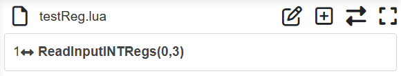
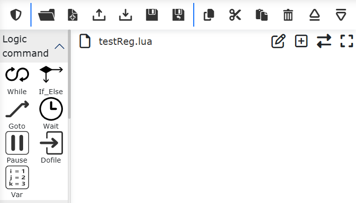
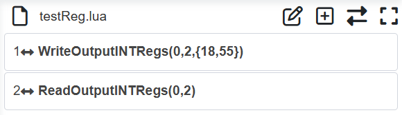
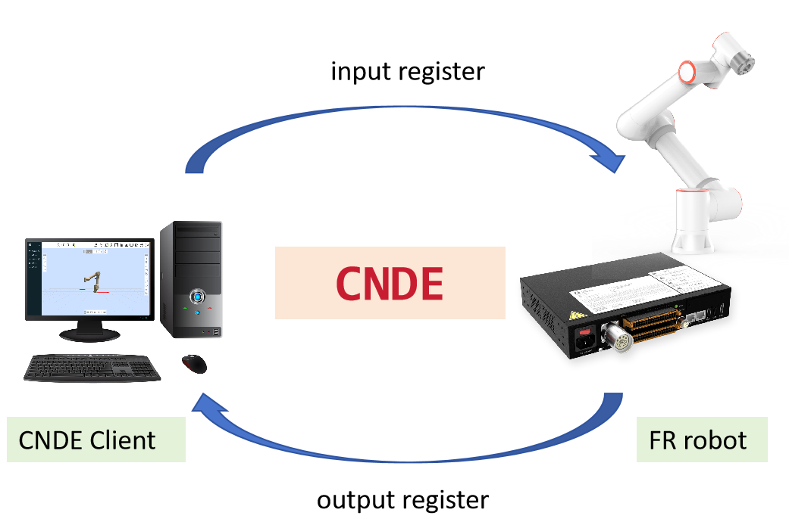

机器人输入输出寄存器
=========================

CNDE客户端与机器人可通过输入输出寄存器进行数据交互，具体包括两个过程：

①CNDE客户端输入配置中包含输入寄存器，在输入数据时修改输入寄存器数值，机器人LUA程序中添加读输入寄存器指令，执行LUA程序即可读取到CNDE客户端修改的输入寄存器数值。

②机器人LUA程序中添加写输出寄存器指令，执行LUA程序将数值写入输出寄存器，CNDE客户端输出配置中包含输出寄存器，启动机器人CNDE状态反馈，客户端接收CNDE输出数据即可读取到LUA程序中写入的输出寄存器数值。

读输入寄存器
~~~~~~~~~~~~~~~~~~

打开WebApp，依次点击“示教程序”、“程序编程”，新建用户程序“testReg.lua”。

.. image:: cnde/012.png
   :width: 6in
   :align: center

.. centered:: 图表 4-1 新建“testReg.lua”程序

点击“变量”，在右侧指令添加框中选择“输入寄存器变量读取”，选择变量类型为“int”，寄存器起始索引为0，寄存器数量为3，点击“添加”按钮和“应用”按钮。

.. image:: cnde/013.png
   :width: 6in
   :align: center

.. centered:: 图表 4-2 添加读取输入寄存器指令

此时“testReg.lua”中已经添加一条读取“int”型输入寄存器指令。

.. centered:: 图表 4-3 读取“int”型输入寄存器指令添加

点击切换模式按钮，切换至程序可编辑模式，在读取输入寄存器指令前增加三个lua程序变量，用于接收读取到的三个输入寄存器值。

.. image:: cnde/015.png
   :width: 6in
   :align: center

.. centered:: 图表 4-4 添加读取输入寄存器数值

同样的方式，可分别添加“bit”型和“double”型寄存器数据读取。

.. image:: cnde/016.png
   :width: 6in
   :align: center

.. centered:: 图表 4-5 添加“bit”型“double”型输入寄存器读取

保存上述程序并将机器人切换到自动模式，执行该程序，输入寄存器数值将被读取至lua程序变量中。

写输出寄存器
~~~~~~~~~~~~~~~~~~~~~~

打开WebApp，依次点击“示教程序”、“程序编程”，新建用户程序“testReg.lua”。

.. centered:: 图表 4-6 新建“testReg.lua”程序 

点击“变量”，在右侧指令添加框中选择“输出寄存器变量写入”，选择变量类型为“int”，寄存器起始索引为0，寄存器数量为2，寄存器值为“18,55”，点击“添加”按钮；再次选择“输出寄存器变量读取”选择变量类型为“int”，寄存器起始索引为0，寄存器数量为2，点击“添加”和“应用”按钮。

.. image:: cnde/018.png
   :width: 6in
   :align: center

.. centered:: 图表 4-7 添加读写输出寄存器指令

此时“testReg.lua”中已经添加“int”型输出寄存器写和读指令。

.. centered:: 图表 4-8 “int”型输出寄存器写和读指令添加

点击切换模式按钮，切换至程序可编辑模式，在读取输出寄存器指令前增加两个lua程序变量，用于接收读取到的两个输出寄存器值。

.. image:: cnde/020.png
   :width: 6in
   :align: center

.. centered:: 图表 4-9 添加读取输入寄存器数值

保存上述程序并将机器人切换到自动模式，执行该程序，此时LUA程序变量“intValue1”和“intValue2”的值分别为18和55。“bit”、“double”型寄存器操作与“int”型寄存器相同。

CNDE输入输出寄存器交互应用
~~~~~~~~~~~~~~~~~~~~~~~~~~~~~~~~~~~~~~~~~~

.. centered:: 图表 4-10 输入、输出寄存器数据交互

机器人和CNDE客户端通过输入、输出寄存器的数据交互场景包括但不限于有以下几种类型：

①输入寄存器控制机器人运动；CNDE客户端进行机器人目标位置规划，将机器人目标位置写入输入寄存器中；在机器人LUA程序中读取输入寄存器数值获得机器人目标位置，再通过PTP、LIN、ServoJ等运动指令控制机器人运动到目标位置，LUA示例程序如下：

.. code-block:: lua
    :linenos:

    i = 0;
    oldFlag = 0
    while(1) do
        startFlag = ReadInputINTRegs(0,1)
        if(startFlag ~= oldFlag) then
        oldFlag = startFlag
        x, y, z, a, b, c = ReadInputDBLRegs(0,6)
        ServoJ({x, y, z, a, b, c}, {0, 0, 0, 0}, 10, 10, 0.008, 0, 0)
        end	
    end

②输入寄存器控制机器人动作：CNDE客户端向某个输入寄存器写入不同的数值，进而控制机器人进行不同的动作，机器人LUA程序中循环获取对应输入寄存器数值，根据寄存器数值不同，进行不同的动作，示例程序如下：

.. code-block:: lua
    :linenos:

    runFlag = ReadInputINTRegs(0,1)
    while(runFlag > 0) do
        motion,target = ReadInputINTRegs(1,2)
        if(motion > 0) then
            if(target == 1)then 
                Lin(a1,100,-1,0,0)
            else if(target == 2) then
                Lin(a2,100,-1,0,0)
            else
                Lin(safety,100,-1,0,0)
            end
            end
        else
            sleep_ms(100)
        end
    end

③机器人在运行过程中向输出寄存器写入当前程序状态，CNDE客户端通过读取输出寄存器状态，实现对机器人程序运行的监控，示例程序如下：

.. code-block:: lua
    :linenos:

    local weldCount = 0
    runFlag = ReadInputINTRegs(0,1)
    while(runFlag > 0) do
        Lin(safety,100,-1,0,0)
        Lin(a1,100,-1,0,0)
        ARCStart(0, 0, 3000)
        Lin(a2,100,-1,0,0)
        ARCEnd(0, 0, 3000)
        runFlag = ReadInputINTRegs(0,1)
        weldCount = weldCount + 1
        WriteOutputINTRegs(0,1,{weldCount})
    end