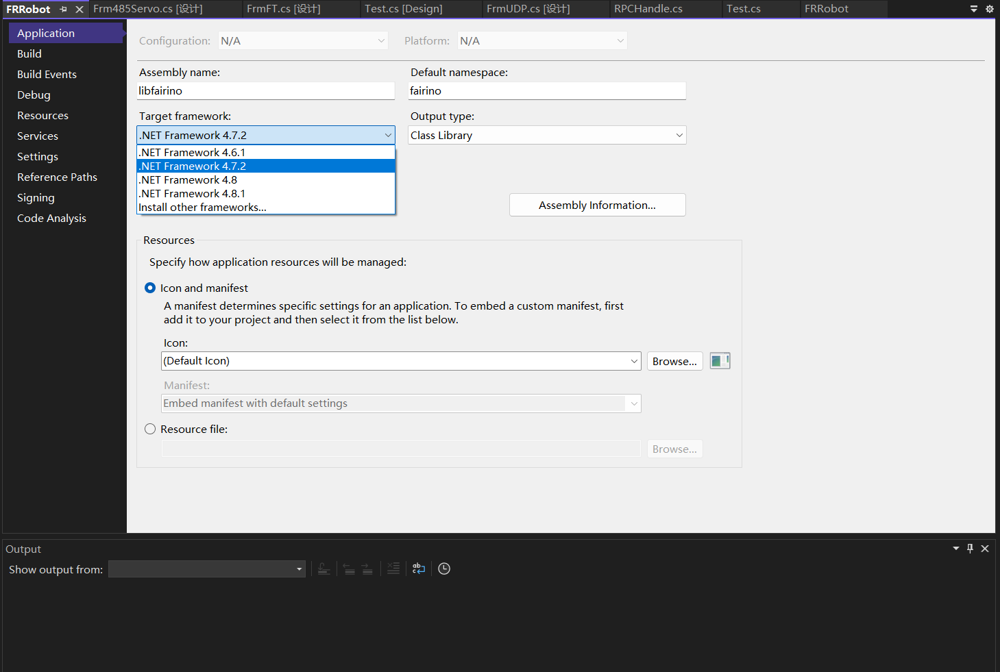

附录
=================

.. toctree:: 
    :maxdepth: 5

源码下载
------------------------------------------------
在法奥文档(https://fairino-doc-zhs.readthedocs.io/latest/)中找到“资料下载”模块，点击“C#SDK”按钮，在右侧页面中点击“FAIRINOC#SDK”，等待浏览器下载完成。

.. image:: image/001.png
   :width: 6in
   :align: center

.. centered:: 图表 15.1‑1 #SDK源码下载
    
下载并解压C# SDK。工程目录如下图所示。其中examples文件为测试示例，src文件为C#SDK，Fairino.sln为项目解决方案。Dlls为库文件。

.. image:: image/010.png
   :width: 6in
   :align: center

.. centered:: 图表 15.1‑2 C# SDK文件结示例图

找到名为fairino.sln的解决方案文件，双击打开，文件结构如下图所示。

.. image:: image/011.png
   :width: 6in
   :align: center

.. centered:: 图表 15.1‑3 Visual Studio 2022中项目文件结示例图

Windows平台下源码编译
-----------------------------------------------------

C# SDK编译
~~~~~~~~~~~~~~~~~~~~~~~~~~~~~~~~~~~~~~~~~~~~
点击FRRobot项目，右键选择属性，选择.net框架版本。

.. image:: image/012.png
   :width: 6in
   :align: center

.. centered:: 图表 15.2‑1 设置属性

.. centered:: 图表 15.2‑2 选择.net框架

.. image:: image/014.png
   :width: 6in
   :align: center

.. centered:: 图表 15.2‑3 Release下生成FRRobot项目

将Visual Studio 2022调整成Release模式，重新生成FRRobot项目，在\bin\Release文件中会生成dll动态链接库。

.. image:: image/015.png
   :width: 6in
   :align: center

.. centered:: 图表 15.2‑4 设置Release模式

.. image:: image/016.png
   :width: 6in
   :align: center

.. centered:: 图表 15.2‑5 Release下重新生成FRRobot项目

.. image:: image/016.png
   :width: 6in
   :align: center

.. centered:: 图表 15.2‑6 生成dll动态链接库

C# SDK使用
~~~~~~~~~~~~~~~~~~~~~~~~~~~~~~~~~~~~~~~~~~~~~
右键选择testFrRobot项目为启动项目。

.. image:: image/017.png
   :width: 6in
   :align: center

.. centered:: 图表 15.2‑7 设置为启动项目
 
C# SDK测试界面如下图所示。

.. image:: image/018.png
   :width: 6in
   :align: center

.. centered:: 图表 15.2‑8 C# SDK测试界面

注意事项
---------------------------------------

可能遇到的问题
~~~~~~~~~~~~~~~~~~~~~~~~~~~~~~~~~~~~~~~~~~~~~~~~~~

更新代码无效果的处理
+++++++++++++++++++++++++++++++++++++++++++++++++++++++++++
在尝试重写代码并重新启动项目后，如果发现项目仍执行旧代码，请考虑以下步骤：

重新生成项目：按照步骤3.2的指导，重新生成或更新项目配置和文件。

错误码
+++++++++++++++++++++++++++++++++++++++++++++++++++++++++++
当返回值为0时代表运行正常，若返回值不为0时请查看错误码对照表。