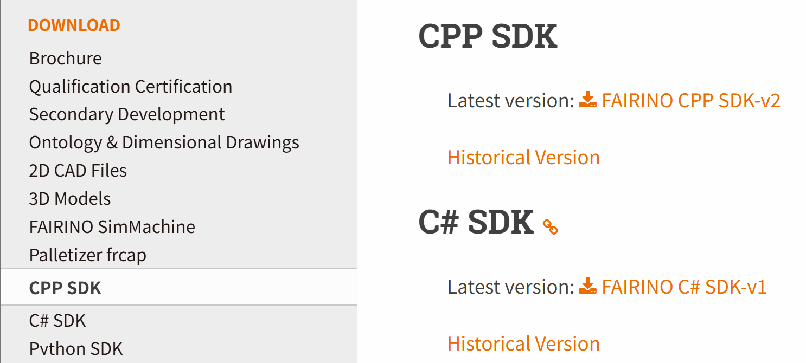
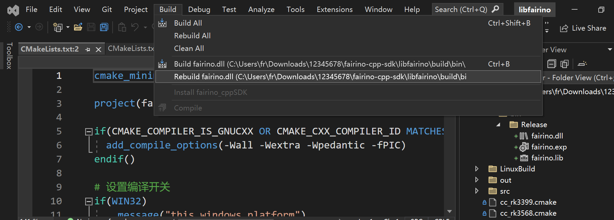
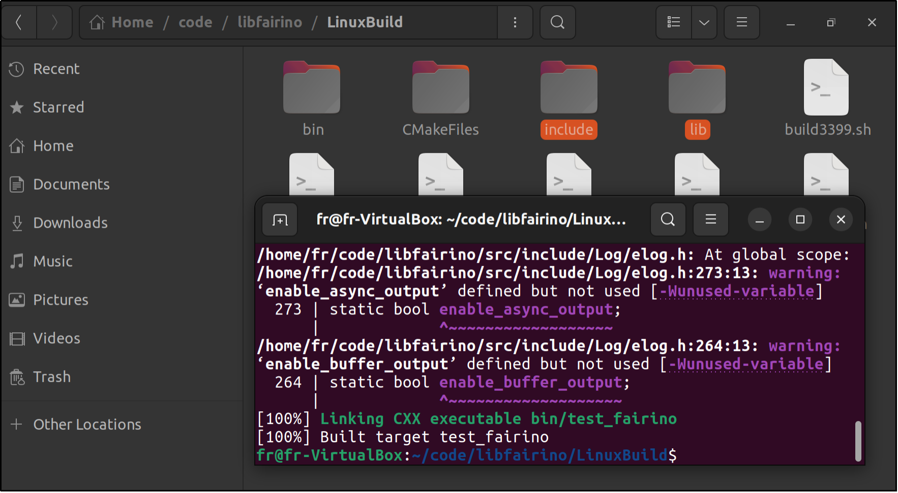

附录
=================

.. toctree:: 
    :maxdepth: 5

源码下载
------------------------------------------------

在法奥文档(https://fairino-doc-zhs.readthedocs.io/latest/)中找到“资料下载”模块，点击“CPP SDK”按钮，在右侧页面中点击“FAIRINO CPP SDK”，等待浏览器下载完成。

.. centered:: 图表 15.1‑1 C++SDK源码下载

解开压缩包，下载点位文件目录如图，其中：

- windows：VS2015~VS2019等常用环境下编译器编译的头文件和库文件(.lib和.dll)，包含Debug和Release模式；
- linux：gcc、rk3399、rk3568等常用环境下的头文件和库文件(.so);
- libfairino：C++SDK源码；

.. image:: image/002.png
   :width: 4in
   :align: center

.. centered:: 图表 15.1‑2 C++SDK源码目录

Windows平台下源码编译
------------------------------------------------
①打开Visual Studio，点击右下角的“继续但无需代码(W)”；

.. image:: image/003.png
   :width: 6in
   :align: center

.. centered:: 图表 15.2‑1 打开Visual Studio

②依次点击“文件”、“打开”、“CMake(M)”,弹出文件选择框，选择下载的C++SDK源码中的“\libfairino\CMakeLists.txt”文件，VisualStudio将自动根据CMakeLists.txt中的定义加载工程。

.. image:: image/004.png
   :width: 6in
   :align: center

.. centered:: 图表 15.2‑2 打开Cmake工程

③根据需求选择编译平台“x64-Debug”或“x64-Release”等，选择启动项为“fairino.dll”。

.. image:: image/005.png
   :width: 6in
   :align: center

.. centered:: 图表 15.2‑3 选择启动项

④在菜单栏中依次点击“生成”，“重新生成fairino.dll”，编译器即自动开始编译。

.. centered:: 图表 15.2‑4 生成fairino.dll

⑤在右侧工程目录中找到“build”文件夹，并在文件夹内找到编译得到的fairino.dll和fairino.lib文件。

.. image:: image/007.png
   :width: 6in
   :align: center

.. centered:: 图表 15.2‑5 找到fairino.lib和fairino.dll

⑥使用协作机器人C++SDK时，先在右侧工程目录中找到机器人SDK编译的头文件/libfairino/src/include/Robot-CN/，将该文件夹下的三个头文件“robot.h”、“robot_error.h”、“robot_type.h”拷贝到工程目录中，将fairino.lib添加到链接库，最后将fairino.dll放置到可执行文件目录下即可使用。

Linux平台下源码编译
------------------------------------------------

linux源码编译前，请先确保系统中已安装gcc、g++编译器和cmake构建系统(3.10版本及以上)。

C++源码目录中\libfairino\linuxBuild\文件夹中“buildGcc.sh”脚本内包含“cmake..”、“make”、将最终头文件、库文件复制到\linuxBuild\文件夹中等指令，执行该脚本即可完成C++SDK的源码编译。

①打开一个终端，进入到\libfairino\linuxBuild\目录，输入命令：“sh buildGcc.sh”并回车，SDK即开始编译，等待编译完成。

.. image:: image/008.png
   :width: 6in
   :align: center

.. centered:: 图表 15.3‑1 输入编译脚本指令

②编译完成后，再次进入\libfairino\linuxBuild\目录下，找到\include\文件夹和\lib\文件夹，分别为需要的头文件和库文件目录。

.. centered:: 图表 15.3‑2 编译结果
