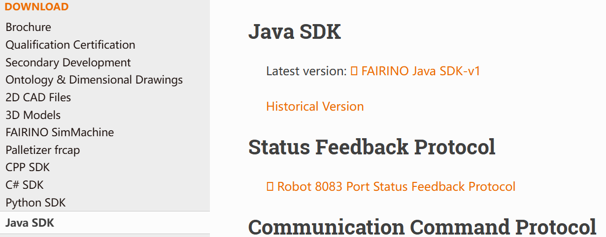

附录
=================

.. toctree:: 
    :maxdepth: 5

源码下载
------------------------------------------------

在法奥文档(https://fairino-doc-zhs.readthedocs.io/latest/)中找到“资料下载”模块，点击“Java SDK”按钮，在右侧页面中点击“FAIRINOJavaSDK”，等待浏览器下载完成。

.. centered:: 图表 16.1‑1 Java SDK源码下载

解开压缩包，文件目录如图，其中： 

fairino_Java_SDK_maven：Windows系统环境下编译器编译的源码(.java)和库文件(.jar)；

.. image:: image/020.png
   :width: 4in
   :align: center

.. centered:: 图表 16.1‑2 Java SDK文件目录

进入fairino_Java_SDK_maven文件夹，包含目录如图所示，其中：

- lib：源码中用到的依赖jar包；
- src：Java SDK源代码文件；
- target：Java SDK源码生成的库文件（.jar）；

.. image:: image/021.png
   :width: 6in
   :align: center

.. centered:: 图表 16.1‑3 Java SDK源码与库文件目录

Windows平台下源码编译
-------------------------------------------------------------
①安装配置构建工具——Maven

Maven下载安装网址：Welcome to Apache Maven – Maven

安装配置后如下所示，在终端输出maven --version会显示如下信息

.. image:: image/022.png
   :width: 6in
   :align: center

.. centered:: 图表 16.2‑1 Maven安装配置

②在Java SDK源码目录下打开终端，输入mvn package，可生成库文件（.jar），

.. image:: image/023.png
   :width: 6in
   :align: center

.. centered:: 图表 16.2‑2 Java SDK编译为库文件
 
③在源码目录中找到“target”文件夹，并在文件夹内找到编译得到的fairino-jar-with-dependencies.jar和fairino.jar文件，如图所示

.. centered:: 图表 16.2‑3 生成jar文件

④使用协作机器人Java SDK时，先在idea的项目中依次点击File->Project Structure->Libraries,添加上步骤生成的.jar文件，在文件中使用import fairino.*;即可使用生成的.jar文件。