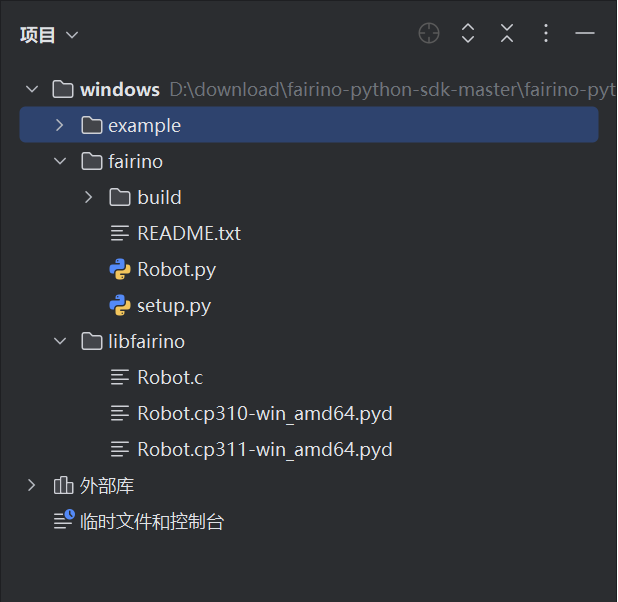
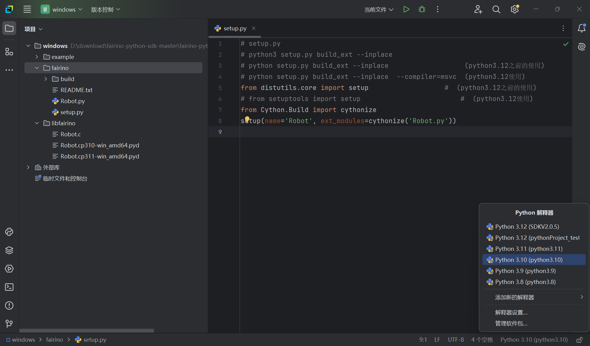
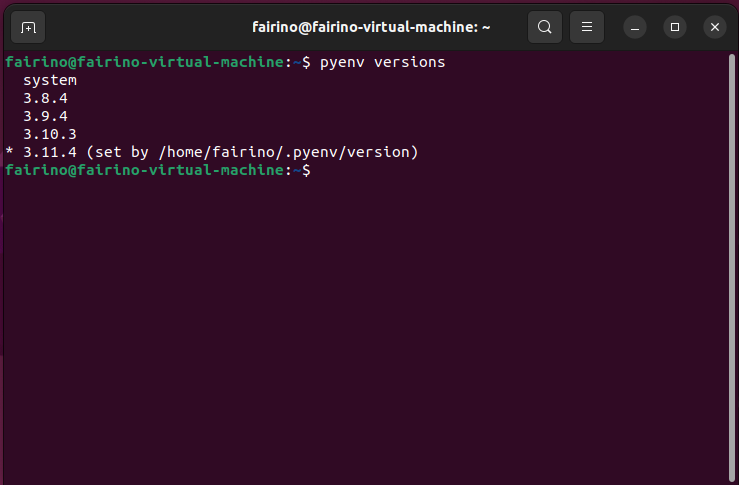
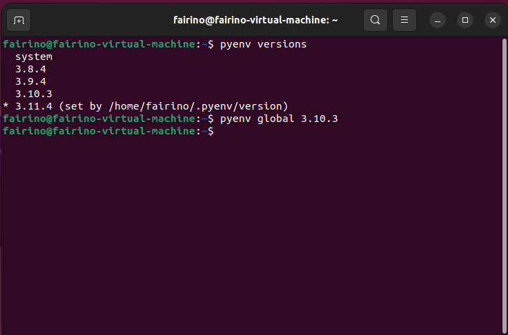

附录
=================

.. toctree:: 
    :maxdepth: 5

源码下载
------------------------------------------------

在法奥文档(https://fairino-doc-zhs.readthedocs.io/latest/)中找到“资料下载”模块，点击“Python SDK”按钮，在右侧页面中点击“FAIRINO Python SDK”，等待浏览器下载完成。

.. image:: image/025.png
   :width: 6in
   :align: center

.. centered:: 图表 16.1‑1 Python SDK源码下载

下载并解压Python SDK。工程目录如下图所示。其中windows文件夹为windows系统下Python SDK；linux文件夹为Linux系统下Python SDK。

.. image:: image/026.png
   :width: 6in
   :align: center

.. centered:: 图表 16.1‑2 Python SDK文件结示例图

以windows系统为例，打开windows文件夹，目录如下图所示，example文件为测试示例，fairino文件为Python SDK源码，libfairino为库文件。

.. image:: image/027.png
   :width: 6in
   :align: center

.. centered:: 图表 16.1‑3 windows系统Python SDK文件结示例图

使用Pycharm软件打开windows文件，结构如下图所示。

.. centered:: 图表 16.1‑4 Pycharm中项目文件结示例图
 
源码编译
----------------------------------------
Python动态库生成根据系统类型和python版本的不同会生成不同的动态库，例如windows平台下生成库文件后缀为“.pyd”，linux平台下生成库文件后缀为“.so”，并且不同python版本生成的动态库不能混用，所以在生成动态库前需确定好python版本，使用平台等问题。本手册以python3.10、windows11、ubuntu22.04版本进行编译说明。

Windows平台Python SDK编译
~~~~~~~~~~~~~~~~~~~~~~~~~~~~~~~~~~~~~~~~~~~~~~~~~~~~~~~~~~~~~~~~~~~~~~~~
首先使用pycharm打开下载好的Python SDK文件，并打开setup.py文件；

.. image:: image/029.png
   :width: 6in
   :align: center

.. centered:: 图表 16.2‑1 打开项目文件

然后点击右下角选择python解释器，本次以python3.10为例；

.. centered:: 图表 16.2‑2 选择python版本
 
右键fairino文件夹，点击“打开于”，再点击“终端”；

.. image:: image/031.png
   :width: 6in
   :align: center

.. centered:: 图表 16.2‑3 打开终端

然后在终端界面输入“python setup.py build_ext --inplace”，并点击“回车”生成Python SDK动态库；

.. image:: image/032.png
   :width: 6in
   :align: center

.. centered:: 图表 16.2‑4 运行动态库生成指令

动态库生成完成后在fairino文件夹下生成有Robot.c和Robot.cp310-win_amd64.pyd，其中Robot.c为将Robot.py转换为C语言文件；Robot.cp310-win_amd64.pyd为Python SDK动态库，其中“cp310”表示适用python3.10版本，“win_amd64”表示适用windows平台

.. image:: image/033.png
   :width: 6in
   :align: center

.. centered:: 图表 16.2‑5 生成.pyd动态库
 
Linux平台Python SDK编译
~~~~~~~~~~~~~~~~~~~~~~~~~~~~~~~~~~~~~~~~~~~~~~~~~~~~~~~~~~~~~~~
首先查看python版本，本手册中使用pyenv工具管理linux系统下python版本，运行“pyenv versions”命令，查看当前python版本；

.. centered:: 图表 16.2‑6 查看python版本

然后切换目标python版本，以python3.10为例，运行“pyenv global 3.10.3”命令，切换python3.10版本；

.. centered:: 图表 16.2‑7 选择python版本

切换至Robot.py文件同级目录下，运行“cd /home/fairino/fairino-python-sdk-master/fairino-python-sdk-master/linux/fairino”命令，切换目录到Robot.py下。

.. image:: image/036.png
   :width: 6in
   :align: center

.. centered:: 图表 16.2‑8 切换至Robot.py文件同级目录

确认python版本，运行“python --version”命令，查看当前python版本；

.. image:: image/037.png
   :width: 6in
   :align: center

.. centered:: 图表 16.2‑9 查看python版本
 
在终端界面输入“python setup.py build_ext --inplace”，并点击“回车”生成Python SDK动态库；

.. image:: image/038.png
   :width: 6in
   :align: center

.. centered:: 图表 16.2‑10 运行动态库生成指令

动态库生成完成后在fairino文件夹下生成有Robot.c和Robot.cpython-310-x86_64-linux-gnu.so，其中Robot.c为将Robot.py转换为C语言文件，“Robot.cpython-310-x86_64-linux-gnu.so”为Python SDK动态库，其中“python-310”表示适用python3.10版本，“linux-gnu”表示适用Linux平台

.. image:: image/039.png
   :width: 6in
   :align: center

.. centered:: 图表 16.2‑11 生成.so动态库

注意事项
----------------------------------

可能遇到的问题
~~~~~~~~~~~~~~~~~~~~~~~~~~~~~~~~~~~~~~~~

版本对应
++++++++++++++++++++++++++++++
python动态库依赖生成环境与python版本，所以在使用python动态库是需要检查动态库与系统类型是否一致，动态库与python版本是否一致

错误码
++++++++++++++++++++++++++++++
当返回值为0时代表运行正常，若返回值不为0时请查看错误码对照表。