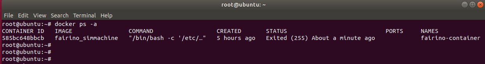

虚拟机-Docker
=================================

Linux部署docker镜像
---------------------------

操作环境
~~~~~~~~~~~~~~

虚拟机运行环境系统：Ubuntu 18.04.6；

虚拟机运行环境系统：RAM 4G，ROM 50G，6核CPU ；

操作权限：使用超级管理员root权限，设置方法见附录3；

docker安装文件：fr_docker.tar.gz；

FAIRINO SimMachine镜像：FAIRINOSimMachine.tar；

安装docker
~~~~~~~~~~~~~~

若用户已安装部署docker，则跳过此节，进行1.3镜像部署。

1.下载fr_docker.tar.gz，放至Ubuntu文件路径/opt/。

2.解压fr_docker.tar.gz.，以/opt/目录下为例：

.. code-block:: console
   :linenos:

   cd /opt/ && tar -zxvf fr_docker.tar.gz

.. image:: controller_virtual_machine/036.png
   :width: 6in
   :align: center

3.执行安装docker脚本：

.. code-block:: console
   :linenos:

   sh install.sh docker-27.0.3.tgz

待脚本执行完毕后，出现版本号，则表示安装成功。

.. image:: controller_virtual_machine/037.png
   :width: 6in
   :align: center

镜像配置
~~~~~~~~~~~~~~

导入docker镜像
++++++++++++++++++++

1. 下载虚拟机镜像FAIRINOSimMachine.tar并解压。

2. 查看docker版本确认已安装。

.. code-block:: console
   :linenos:

   docker -v

.. image:: controller_virtual_machine/038.png
   :width: 6in
   :align: center   

3. 导入镜像   

.. code-block:: console
   :linenos:

   docker load -i ./FAIRINOSimMachine.tar

出现fairno_simmachine:latest则表示导入完成。

.. image:: controller_virtual_machine/039.png
   :width: 6in
   :align: center  

4. 执行docker images查看是否导入成功。

创建自定义桥接网络
++++++++++++++++++++

1. 执行以下命令，创建名为fairino-net，网段为192.168.58.0/24的桥接网络。

.. code-block:: console
   :linenos:

   docker network create --driver bridge --subnet 192.168.58.0/24 --gateway 192.168.58.1 fairino-net

2. 查看网络

.. code-block:: console
   :linenos:

   docker network ls

存在fairino-net网络表示创建成功。

.. image:: controller_virtual_machine/040.png
   :width: 6in
   :align: center 

首次启动docker容器
++++++++++++++++++++

1. 创建容器并启动

使用fairino-net网络，fairino_simmachine镜像启动容器。

.. code-block:: console
   :linenos:

   docker run -d -P --name fairino-container --privileged -u root --net fairino-net fairino_simmachine

.. image:: controller_virtual_machine/041.png
   :width: 6in
   :align: center 

.. code-block:: console
   :linenos:

   docker ps 

查看容器是否成功启动，出现fairino-container则表示启动成功。

.. image:: controller_virtual_machine/042.png
   :width: 6in
   :align: center 

web操作虚拟机器人
----------------------------

容器正常启动
~~~~~~~~~~~~~~~~~~~~~~~~~~~~~~

此小节针对非首次启动容器，由于重启电脑或docker关闭等原因容器未在后台运行情况。

1. 启动docker： 

.. code-block:: console
   :linenos:

   systemctl start docker

2. 查看docker状态：

.. code-block:: console
   :linenos:

   systemctl status docker
   
绿色active(running)表示启动成功。

.. image:: controller_virtual_machine/043.png
   :width: 6in
   :align: center 

3. 执行docker ps -a查看容器ID。

4. 执行 docker start [容器ID]。

.. image:: controller_virtual_machine/045.png
   :width: 6in
   :align: center 

5. 执行成功，再次docker ps 查看容器正在运行。

.. image:: controller_virtual_machine/046.png
   :width: 6in
   :align: center 

操作虚拟机器人
~~~~~~~~~~~~~~~~~~~~~~~~~~~~~~

1. 确认docker容器正在运行。

.. code-block:: console
   :linenos:

   docker ps 

出现fairino-container则表示正在运行。

.. image:: controller_virtual_machine/047.png
   :width: 6in
   :align: center 

2. 打开浏览器，输入默认IP：192.168.58.2，即可访问web界面，操作虚拟机器人。

.. image:: controller_virtual_machine/048.png
   :width: 6in
   :align: center 

3. 使用admin账号登录，密码：123。

.. image:: controller_virtual_machine/049.png
   :width: 6in
   :align: center 

用户修改IP地址
~~~~~~~~~~~~~~~~~~~~~~

.. image:: controller_virtual_machine/050.png
   :width: 6in
   :align: center 

1. 打开浏览器，输入默认 IP： 192.168.58.2，打开 web 页面；
2. 使用 admin 账号登录，密码： 123；
3. 进入“系统设置” → “通用设置” → “网络设置”， 修改 IP 为目标 IP 地址、掩码、网关。点击“设置网络”；
4. 打开终端，关闭容器；
 	
查看容器ID：

.. code-block:: console
   :linenos:
      
   docker ps -a

.. image:: controller_virtual_machine/052.png
   :width: 6in
   :align: center 

关闭容器：

.. code-block:: console
   :linenos:
   
   docker stop [容器ID]

.. image:: controller_virtual_machine/053.png
   :width: 6in
   :align: center 

5. 重新配置容器网络；
   
删除原先网络：

.. code-block:: console
   :linenos:
   
   docker network rm fairino-net

创建新网络：

.. code-block:: console
   :linenos:
   
   docker network create --driver bridge --subnet [目标IP/子网掩码] --gateway [网关IP] fairino-net

以192.168.56.0/24为例：docker network create --driver bridge --subnet 192.168.56.0/24 --gateway 192.168.56.1 fairino-net

.. image:: controller_virtual_machine/054.png
   :width: 6in
   :align: center 

6. 将容器重新连接到新创建的网络；

.. code-block:: console
   :linenos:

   docker network connect fairino-net [容器ID]

.. image:: controller_virtual_machine/055.png
   :width: 6in
   :align: center 

7. 重新启动容器；

.. code-block:: console
   :linenos:
   
   docker start [容器ID]

8. 此时打开浏览器， 输入修改后 IP 地址，即可访问 web 界面，操作虚拟机器人。

.. image:: controller_virtual_machine/056.png
   :width: 6in
   :align: center 

虚拟机版本升降级
----------------------------

概述
~~~~~~~~~~~~~~~~~~~~~~~~~~~~~~

本手册详细阐述了在使用FAIRINO SimMachine Docker虚拟机时，进行软件升级与降级操作的标准流程，并系统梳理了版本变更过程中需要重点关注的注意事项。

升降级准备及注意事项
~~~~~~~~~~~~~~~~~~~~~~~~~~~~~

操作准备
++++++++++++++++++++++

1. 已部署及正常使用的FAIRINO SimMachine Docker虚拟机。部署教程见《用户手册-Linux部署docker镜像》；
2. Docker虚拟机版本的软件升级包，下载地址见《资料下载-FAIRINO SimMachine Docker》，解压后，内容包含最新版本的docker镜像FAIRINOSimMachine.tar及软件升级包software.tar.gz。

注意事项
++++++++++++++

1. 数据备份：建议在升级前执行备份，方法见“数据备份”章节，以避免因升级异常导致数据丢失。
2. 版本限制：

.. centered:: 图表 2.3-1 升降级版本限制

.. list-table::
   :widths: 50 50 50
   :header-rows: 0
   :align: center

   * - **操作类型** 
     - **条件/限制**
     - **步骤说明**

   * - **版本升级** 
     - 当前版本>= 3.7.8
     - 可直接升级

   * - **版本升级** 
     - 当前版本< 3.7.8
     - 需先升级至3.7.5版本或使用兼容方案

   * - **版本降级**
     - 当前且目标版本>= 3.7.8
     - 可直接降级

   * - **版本降级**
     - 当前或目标版本<3.7.8
     - 使用兼容方案

   * - **兼容方案**
     - 同时适用于升级/降级异常情况
     - 见“兼容方案”章节详细步骤

