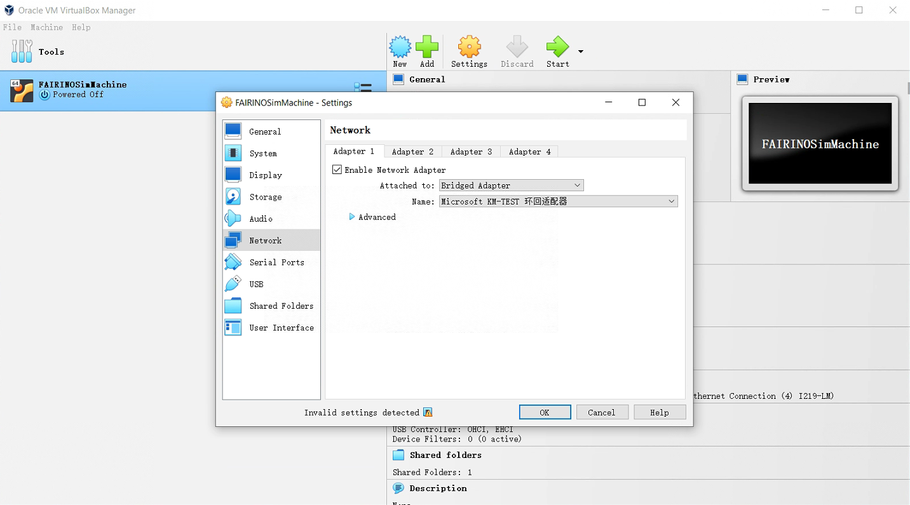
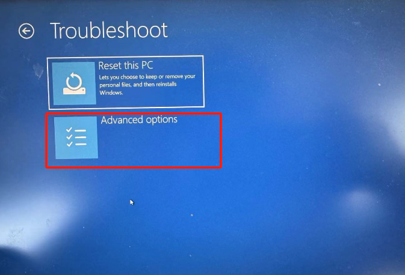
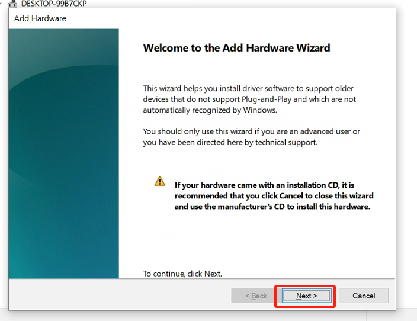
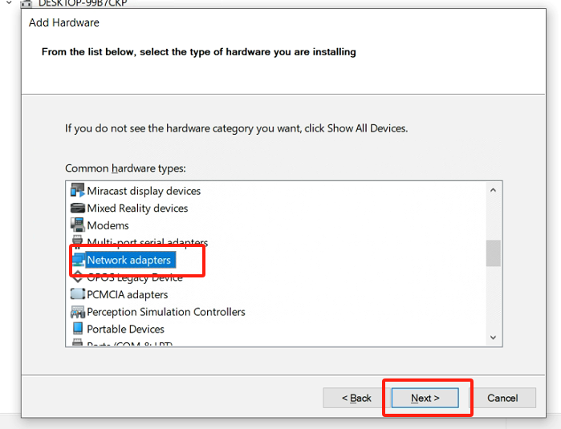
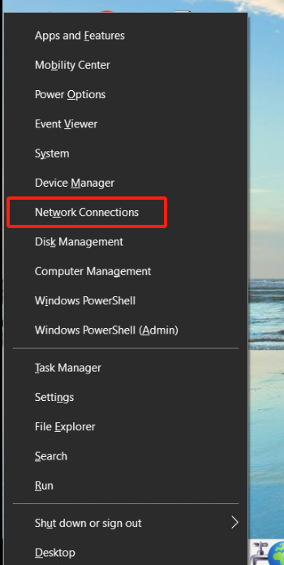
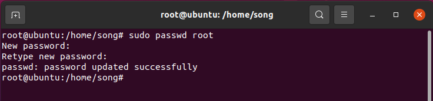

附录
===================

附录1：BIOS 中启用虚拟化
-------------------------

不同型号的电脑启用虚拟化的流程可能不同，现以联想ThinkPad系列windows10举例：

- 打开电脑设置，选择更新和安全。

.. image:: controller_virtual_machine/014.png
   :width: 4in
   :align: center

- 选择“恢复”。

.. image:: controller_virtual_machine/015.png
   :width: 4in
   :align: center

- 选择“立即重启”。

.. image:: controller_virtual_machine/016.png
   :width: 4in
   :align: center

- 选择“疑难解答”。
  
.. image:: controller_virtual_machine/017.png
   :width: 4in
   :align: center

- 选择“高级选项”。

- 选择UEFI固件设置。

.. image:: controller_virtual_machine/019.png
   :width: 4in
   :align: center

- 选择“重启”。

.. image:: controller_virtual_machine/020.png
   :width: 4in
   :align: center

- 选择“Security”下的“Virtualization”。

.. image:: controller_virtual_machine/021.png
   :width: 4in
   :align: center

- 选择“Enabled”，按下“Enter”确认。

.. image:: controller_virtual_machine/022.png
   :width: 4in
   :align: center

- 按下“F10”，选择“Yes”，按下“Enter”保存修改。

.. image:: controller_virtual_machine/023.png
   :width: 4in
   :align: center

附录2：添加虚拟网卡（环回网络适配器）
--------------------------------------

1. 打开设备管理器，按下“Windows键-X”，选择“设备管理器”。
   
.. image:: controller_virtual_machine/024.png
   :width: 4in
   :align: center

2. 添加网络适配器。

.. image:: controller_virtual_machine/025.png
   :width: 4in
   :align: center

.. image:: controller_virtual_machine/027.png
   :width: 4in
   :align: center

.. image:: controller_virtual_machine/029.png
   :width: 4in
   :align: center

.. image:: controller_virtual_machine/030.png
   :width: 4in
   :align: center

.. image:: controller_virtual_machine/031.png
   :width: 4in
   :align: center
   
3. 查看虚拟网卡，按下“Windows键-X”，选择“网络连接”。

.. image:: controller_virtual_machine/033.png
   :width: 4in
   :align: center

.. image:: controller_virtual_machine/034.png
   :width: 4in
   :align: center

.. image:: controller_virtual_machine/035.png
   :width: 4in
   :align: center
   
4. 配置环回适配器网络。

- IP地址: 192.168.58.XXX（与192.168.58.2 同一网段即可）。
- 子网掩码：255.255.255.0。

.. image:: controller_virtual_machine/012.png
   :width: 6in
   :align: center

5. 打开Virtualbox网络配置，网卡名称选择“环回适配器网络”，启动虚拟机即可。

附录3：root权限
--------------------------------------

Ubuntu安装好后，Ubuntu系统默认root用户是不能登录的，密码也是空的。如果想要使用root用户登录，必须先为root用户设置密码。

1. 打开终端，输入 sudo passwd root ，然后回车输入几次密码，显示密码设置成功。

2. 在终端继续输入 su - root 命令切换用户，回车输入密码。

.. warning:: 输入命令时一定要输入“-”，选项“-”表示连带环境变量一起切换，“-”坚决不能少。

.. image:: controller_virtual_machine/058.png
   :width: 6in
   :align: center

附录4：docker基础命令
--------------------------------------

1. docker 帮助命令 :

.. code-block:: console
   :linenos:

   docker --help

2. 启动docker :

.. code-block:: console
   :linenos:

   systemctl start docker

3. 关闭docker :

.. code-block:: console
   :linenos:

   systemctl stop docker

4. 重启docker :

.. code-block:: console
   :linenos:

   systemctl restart docker

5. docker设置随服务启动而自启动 :

.. code-block:: console
   :linenos:

   systemctl enable docker

6. 查看docker 运行状态 :

.. code-block:: console
   :linenos:

   systemctl status docker
   --如果是在运行中输入命令后会看到绿色的active

7. docker容器 :

.. code-block:: console
   :linenos:

   docker images：列出已经下载的镜像，查看镜像
   docker rmi 镜像id或name：删除本地镜像
   docker rmi -f 镜像id或name: 删除镜像
   docker build：构建镜像
   docker search 镜像id或name：在Docker Hub仓库中搜索关键字镜像
   docker pull 镜像id或name：从仓库中下载镜像
   docker images：列出已经下载的镜像，查看镜像
   docker rmi 镜像id或name：删除本地镜像
   docker rmi -f 镜像id或name: 删除镜像
   docker build：构建镜像

8. docker容器 :

.. code-block:: console
   :linenos:

   docker ps：列出运行中的容器
   docker ps -a ： 查看所有容器，包括未运行
   docker stop 容器id或name：停止容器
   docker kill 容器id：强制停止容器
   docker start 容器id或name：启动已停止的容器
   docker inspect 容器id：查看容器的所有信息
   docker container logs 容器id：查看容器日志
   docker top 容器id：查看容器里的进程
   docker exec -it 容器id /bin/bash：进入容器
   exit：退出容器
   docker rm 容器id或name：删除已停止的容器
   docker rm -f 容器id：删除正在运行的容器
   docker exec -it 容器ID sh :进入容器