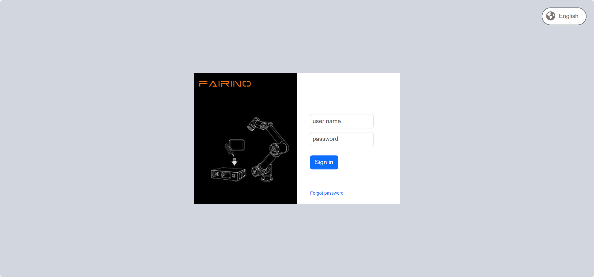

虚拟机-VMware
===============================================

概述
------------------
本手册旨在介绍如何使用 FAIRINO SimMachine 虚拟机。

操作说明
------------------------------------

安装 VMware Workstation
~~~~~~~~~~~~~~~~~~~~~~~~~~~~~~~~~~~~~~~~~~~~~~~~~~~~~~~~~~~~

VMware Workstation 演示版本：17.6.3（已安装则跳过此步）。

在浏览器直接搜索VMware官网或直接点击网址 \ `<https://www.vmware.com>`__\ ，下载安装包后选择默认路径安装即可。

.. image:: controller_virtual_machine/001.png
   :width: 6in
   :align: center

.. centered:: 图表 6.2-1 VMWare 界面

打开镜像
~~~~~~~~~~~~~~~~~~~~~~~~~~~~~~~~~~~~~~~~~~~~~~~~~~~~~~~~~~~~

1. 下载虚拟机镜像 FAIRINO_SimMachine.zip 并解压
   
2. 打开 VMware，点击 File->Open。如下图 2-2 所示：

.. image:: controller_virtual_machine/002.png
   :width: 6in
   :align: center

.. centered:: 图表 6.2-2 打开镜像

3. 找到解压后的文件夹，选择 vmx 后缀文件。如下图 2-3 所示：
   
.. image:: controller_virtual_machine/003.png
   :width: 6in
   :align: center

.. centered:: 图表 6.2-3 选择文件

4. 点击“Power on this virtul machine”打开虚拟机。如下图 2-4 所示：
   
.. image:: controller_virtual_machine/004.png
   :width: 6in
   :align: center

.. centered:: 图表 6.2-4 开启虚拟机

5. 在解压文件夹中找到“fr_get_vm_net”双击打开，如下图 2-5 所示，输出内容为虚拟机 IP。如下图 2-6 所示。

.. note:: 如遇获取失败，请前往虚拟机中通过执行“ifconfig”命令获取。
      
.. image:: controller_virtual_machine/005.png
   :width: 6in
   :align: center

.. centered:: 图表 6.2-5 fr_get_vm_net.bat
      
.. image:: controller_virtual_machine/006.png
   :width: 4in
   :align: center

.. centered:: 图表 6.2-6 虚拟机 IP

Windows 访问 WebApp
~~~~~~~~~~~~~~~~~~~~~~~~~~~~~~~~~~~~~~~~~~~~~~~~~~~~~~~~~~~~

1. 在得到虚拟机 IP 后，在 Windows 浏览器中直接访问虚拟机 IP 即可进入WebApp，如输入：192.168.182.222，如图 2-7：
         

.. centered:: 图表 6.2-7 通过虚拟机 IP 访问 WebApp